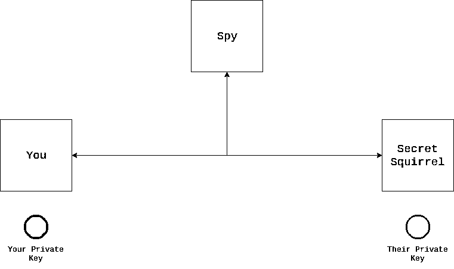
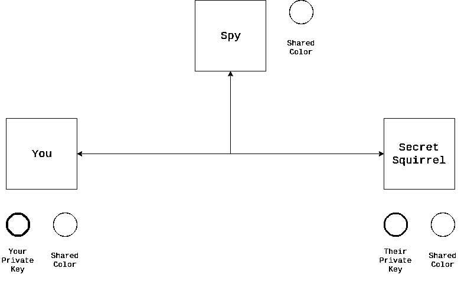

# 用 Python 探索 HTTPS

> 原文：<https://realpython.com/python-https/>

*立即观看**本教程有真实 Python 团队创建的相关视频课程。和文字教程一起看，加深理解: [**探索 Python 中的 HTTPS 和密码学**](/courses/exploring-https-cryptography/)

你有没有想过为什么你可以通过互联网发送你的信用卡信息？你可能已经注意到了浏览器中网址上的`https://`，但是它是什么，它是如何保证你的信息安全的**？或者，您可能想要创建一个 Python HTTPS 应用程序，但您并不确定这意味着什么。你如何确定你的[网络应用](https://realpython.com/python-web-applications/)是安全的？*

*您可能会惊讶地发现，回答这些问题并不一定要成为安全专家！在本教程中，您将了解到保证互联网通信安全的各种因素。您将看到 Python HTTPS 应用程序如何保护信息安全的具体示例。

**在本教程中，您将学习如何:**

*   监控和分析**网络流量**
*   应用**密码术**保护数据安全
*   描述**公钥基础设施(PKI)** 的核心概念
*   创建您自己的**认证机构**
*   构建一个 **Python HTTPS 应用**
*   识别常见的 Python HTTPS **警告和错误**

**免费奖励:** [点击此处获得免费的 Flask + Python 视频教程](https://realpython.com/bonus/discover-flask-video-tutorial/)，向您展示如何一步一步地构建 Flask web 应用程序。

## 什么是 HTTP？

在深入研究 HTTPS 及其在 Python 中的使用之前，理解它的父代 [HTTP](https://en.wikipedia.org/wiki/Hypertext_Transfer_Protocol) 很重要。这个首字母缩写代表**超文本传输协议**，当你在你最喜欢的网站上冲浪时，它是大多数通信的基础。更具体地说，HTTP 是一个用户代理，比如你的网络浏览器，与一个网络服务器，比如 realpython.com 的*通信的方式。下面是 HTTP 通信的简图:*

*[](https://files.realpython.com/media/simple_http_flow.b16a6625419f.png)

此图显示了计算机如何与服务器通信的简化版本。以下是每个步骤的细目分类:

1.  你告诉你的浏览器去`http://someserver.com/link`。
2.  您的设备和服务器建立了一个 [TCP](https://en.wikipedia.org/wiki/Transmission_Control_Protocol) 连接。
3.  你的浏览器发送一个 **HTTP 请求**到服务器。
4.  服务器接收 HTTP 请求并解析它。
5.  服务器用一个 **HTTP 响应**来响应。
6.  您的计算机接收、解析并显示响应。

这个分解抓住了 HTTP 的基础。您向服务器发出请求，服务器返回响应。虽然 HTTP 不需要 TCP，但它需要一个可靠的底层协议。实际上，这几乎总是 TCP over IP(尽管谷歌正试图创造一个替代物[】。如果你需要复习，那么看看 Python 中的](https://en.wikipedia.org/wiki/QUIC)[套接字编程(指南)](https://realpython.com/python-sockets/)。

就协议而言，HTTP 是最简单的协议之一。它被设计用来通过互联网发送内容，比如 HTML、视频、图像等等。这是通过 HTTP 请求和响应完成的。HTTP 请求包含以下元素:

*   **方法**描述了客户端想要执行的动作。静态内容的方法通常是`GET`，尽管也有其他可用的方法，比如`POST`、`HEAD`和`DELETE`。
*   **路径**向服务器指示你想要请求的网页。比如这个页面的路径是`/python-https`。
*   版本是几个 HTTP 版本之一，如 1.0、1.1 或 2.0。最常见的大概是 1.1。
*   **标题**帮助描述服务器的附加信息。
*   **主体**向服务器提供来自客户端的信息。虽然这个字段不是必需的，但是一些方法通常有一个主体，比如`POST`。

这些是您的浏览器用来与服务器通信的工具。服务器用 HTTP 响应来响应。HTTP 响应包含以下元素:

*   **版本**标识 HTTP 版本，通常与请求的版本相同。
*   **状态码**表示请求是否成功完成。有不少[状态码](https://www.restapitutorial.com/httpstatuscodes.html)。
*   **状态消息**提供了帮助描述状态代码的人类可读消息。
*   **头**允许服务器用关于请求的附加元数据来响应。这些与请求头的概念相同。
*   **正文**承载内容。从技术上讲，这是可选的，但通常它包含一个有用的资源。

这些是 HTTP 的构造块。如果您有兴趣了解更多关于 HTTP 的知识，那么您可以查看一个[概述页面](https://developer.mozilla.org/en-US/docs/Web/HTTP/Overview)来更深入地了解该协议。

[*Remove ads*](/account/join/)

## 什么是 HTTPS？

现在您对 HTTP 有了更多的了解，什么是 HTTPS 呢？好消息是，你已经知道了！HTTPS 代表**超文本传输协议安全**。从根本上说，HTTPS 是与 HTTP 相同的协议，但是增加了通信安全的含义。

HTTPS 没有重写它所基于的任何 HTTP 基础。相反，HTTPS 由通过加密连接发送的常规 HTTP 组成。通常，这种加密连接是由 TLS 或 SSL 提供的，它们是在信息通过网络发送之前加密信息的**加密协议**。

**注意:** TLS 和 SSL 是极其相似的协议，尽管 SSL 正在被淘汰，TLS 将取而代之。这些协议的区别超出了本教程的范围。知道 TLS 是 SSL 更新更好的版本就足够了。

那么，为什么要创造这种分离呢？为什么不把复杂性引入 HTTP 协议本身呢？答案是**便携性**。保护通信安全是一个重要而困难的问题，但是 HTTP 只是需要安全性的众多协议之一。在各种各样的应用中还有数不清的其他例子:

*   [电子邮件](https://realpython.com/python-send-email/)
*   即时消息
*   VoIP(网络电话)

还有其他的！如果这些协议中的每一个都必须创建自己的安全机制，那么世界将变得更加不安全，更加混乱。上述协议经常使用的 TLS 提供了一种保护通信安全的通用方法。

注意:这种协议分离是网络中的一个常见主题，以至于它有了一个名字。 [OSI 模型](https://en.wikipedia.org/wiki/OSI_model)代表了从物理介质一直到页面上呈现的 HTML 的通信！

您将在本教程中学习的几乎所有信息不仅适用于 Python HTTPS 应用程序。您将学习安全通信的基础知识，以及它如何具体应用于 HTTPS。

## 为什么 HTTPS 很重要？

安全通信对于提供安全的在线环境至关重要。随着世界上越来越多的地方(包括银行和医疗保健网站)走向在线，开发人员创建 Python HTTPS 应用程序变得越来越重要。同样，HTTPS 只是 TLS 或 SSL 上的 HTTP。TLS 旨在防止窃听者窃取隐私。它还可以提供客户端和服务器的身份验证。

在本节中，您将通过执行以下操作来深入探究这些概念:

1.  **创建**一个 Python HTTPS 服务器
2.  **与您的 Python HTTPS 服务器通信**
3.  **捕捉**这些通信
4.  **分析**那些消息

我们开始吧！

### 创建示例应用程序

假设你是一个叫做秘密松鼠的很酷的 Python 俱乐部的领导者。松鼠是秘密的，需要一个秘密的信息来参加他们的会议。作为领导者，你选择秘密信息，每次会议都会改变。不过，有时候，你很难在会议前与所有成员见面，告诉他们这个秘密消息！你决定建立一个秘密服务器，成员们可以自己看到秘密信息。

**注意:**本教程中使用的示例代码是**而不是为生产设计的**。它旨在帮助您学习 HTTP 和 TLS 的基础知识。**请勿将此代码用于生产。**以下许多例子都有糟糕的安全实践。在本教程中，您将了解 TLS，以及它可以帮助您更加安全的一种方式。

您已经学习了一些关于真实 Python 的教程，并决定使用一些您知道的依赖项:

*   **[烧瓶](https://palletsprojects.com/p/flask)** 构建 web 应用程序
*   **[uWSGI](https://uwsgi-docs.readthedocs.io/en/latest/)** 作为生产服务器
*   **[请求](https://realpython.com/python-requests/)** 来锻炼你的服务器

要安装所有这些依赖项，可以使用 [`pip`](https://realpython.com/what-is-pip/) :

```py
$ pip install flask uwsgi requests
```

安装完依赖项后，就可以开始编写应用程序了。在名为`server.py`的文件中，您创建了一个[烧瓶](https://realpython.com/tutorials/flask/)应用程序:

```py
# server.py
from flask import Flask

SECRET_MESSAGE = "fluffy tail"
app = Flask(__name__)

@app.route("/")
def get_secret_message():
    return SECRET_MESSAGE
```

每当有人访问你的服务器的`/`路径时，这个 Flask 应用程序将显示秘密消息。这样一来，您可以在您的秘密服务器上部署应用程序并运行它:

```py
$ uwsgi --http-socket 127.0.0.1:5683 --mount /=server:app
```

这个命令使用上面的 Flask 应用程序启动一个服务器。你在一个奇怪的端口上启动它，因为你不想让人们能够找到它，并为自己如此鬼鬼祟祟而沾沾自喜！您可以通过在浏览器中访问`http://localhost:5683`来确认它正在工作。

因为秘密松鼠中的每个人都知道 Python，所以你决定帮助他们。你写一个名为`client.py`的脚本来帮助他们获取秘密信息:

```py
# client.py
import os
import requests

def get_secret_message():
    url = os.environ["SECRET_URL"]
    response = requests.get(url)
    print(f"The secret message is: {response.text}")

if __name__ == "__main__":
    get_secret_message()
```

只要设置了`SECRET_URL`环境变量，这些代码就会打印出秘密消息。在这种情况下，`SECRET_URL`就是`127.0.0.1:5683`。所以，你的计划是给每个俱乐部成员的秘密网址，并告诉他们[保持它的秘密和安全](https://youtu.be/iThtELZvfPs)。

虽然这可能看起来没问题，但请放心，它不是！事实上，即使你把用户名和密码放在这个网站上，它仍然是不安全的。但是即使你的团队设法保证了 URL 的安全，你的秘密信息仍然不安全。为了说明为什么您需要了解一点监控网络流量的知识。为此，您将使用一个名为 **Wireshark** 的工具。

[*Remove ads*](/account/join/)

### 设置 Wireshark

Wireshark 是一款广泛用于网络和协议分析的工具。这意味着它可以帮助您了解网络连接上发生了什么。安装和设置 Wireshark 对于本教程来说是可选的，但是如果您愿意的话，请随意。[下载页面](https://www.wireshark.org/download.html)有几个可用的安装程序:

*   macOS 10.12 及更高版本
*   64 位 Windows installer
*   Windows installer 32 位

如果您使用的是 Windows 或 Mac，那么您应该能够下载适当的安装程序并按照提示进行操作。最后，您应该有一个运行的 Wireshark。

如果你在基于 Debian 的 Linux 环境下，那么安装会有点困难，但是仍然是可能的。您可以使用以下命令安装 Wireshark:

```py
$ sudo add-apt-repository ppa:wireshark-dev/stable
$ sudo apt-get update
$ sudo apt-get install wireshark
$ sudo wireshark
```

您应该会看到类似这样的屏幕:

[](https://files.realpython.com/media/wireshark-home.8d87e40d425f.png)

随着 Wireshark 的运行，是时候分析一些流量了！

### 看到你的数据不安全

你当前的客户端和服务器的运行方式是不安全的 T2。HTTP 会将所有内容以明文形式发送给任何人。这意味着，即使有人没有你的`SECRET_URL`，他们仍然可以看到你做的一切，只要他们可以监控你和服务器之间的*任何*设备上的流量。

这对你来说应该是比较恐怖的。毕竟，你不希望其他人出现在你的秘密会议上！你可以证明这是真的。首先，如果您的服务器没有运行，请启动它:

```py
$ uwsgi --http-socket 127.0.0.1:5683 --mount /=server:app
```

这将在端口 5683 上启动您的 Flask 应用程序。接下来，您将在 Wireshark 中开始数据包捕获。此数据包捕获将帮助您查看进出服务器的所有流量。首先在 Wireshark 上选择 *Loopback:lo* 接口；

[](https://files.realpython.com/media/wireshark-loopback-click.8f9a2f451082.png)

您可以看到 *Loopback:lo* 部分被突出显示。这将指示 Wireshark 监控该端口的流量。您可以做得更好，并指定您想要捕获哪个端口和协议。您可以在捕获过滤器中键入`port 5683`,在显示过滤器中键入`http`:

[](https://files.realpython.com/media/wireshark-port-5683-filter.3c86d723417d.png)

绿色方框表示 Wireshark 对您键入的过滤器满意。现在，您可以通过单击左上角的鳍开始捕获:

[](https://files.realpython.com/media/wirehshark-click.d1a161bccdb9.png)

单击此按钮将在 Wireshark 中生成一个新窗口:

[](https://files.realpython.com/media/wireshark-active-capture.17498bac9dac.png)

这个新窗口相当简单，但是底部的信息显示`<live capture in progress>`，这表明它正在工作。不要担心没有显示，因为这是正常的。为了让 Wireshark 报告任何事情，您的服务器上必须有一些活动。要获取一些数据，请尝试运行您的客户端:

```py
$ SECRET_URL="http://127.0.0.1:5683" python client.py
The secret message is: fluffy tail
```

在执行了上面的`client.py`代码后，您现在应该会在 Wireshark 中看到一些条目。如果一切顺利，您将会看到两个条目，如下所示:

[](https://files.realpython.com/media/wireshark-http-two-entries.db53111bad3e.png)

这两个条目代表发生的通信的两个部分。第一个是客户端对服务器的请求。当你点击第一个条目时，你会看到大量的信息:

[](https://files.realpython.com/media/wireshark-http-request-1.ca48adcd8525.png)

信息量真大！在顶部，仍然有 HTTP 请求和响应。一旦您选择了这些条目中的一个，您将看到中间和底部一行填充了信息。

中间一行提供了 Wireshark 能够为所选请求识别的协议的明细。这种分解允许您探究 HTTP 请求中实际发生了什么。下面是 Wireshark 在中间一行从上到下描述的信息的简要总结:

1.  **物理层:**这一行描述用于发送请求的物理接口。在您的情况下，这可能是环回接口的接口 ID 0 (lo)。
2.  **以太网信息:**这一行显示的是第二层协议，包括源 MAC 地址和目的 MAC 地址。
3.  **IPv4:** 这一行显示源和目的 IP 地址(127.0.0.1)。
4.  **TCP:** 这一行包括所需的 TCP 握手，以便创建可靠的数据管道。
5.  **HTTP:** 这一行显示 HTTP 请求本身的信息。

当您展开超文本传输协议层时，您可以看到构成 HTTP 请求的所有信息:

[](https://files.realpython.com/media/wireshark-http-request-expanded.b832a33ff5d0.png)

下图显示了脚本的 HTTP 请求:

*   **方法:** `GET`
*   **路径:** `/`
*   **版本:** `1.1`
*   **表头:**`Host: 127.0.0.1:5683``Connection: keep-alive`等
*   **正文:**无正文

您将看到的最后一行是数据的十六进制转储。您可能会注意到，在这个十六进制转储中，您实际上可以看到 HTTP 请求的各个部分。那是因为你的 HTTP 请求是公开发送的。但是回复呢？如果您单击 HTTP 响应，您将看到类似的视图:

[](https://files.realpython.com/media/wireshark-http-response-expanded.2111ae46e4b1.png)

同样，你有相同的三个部分。如果你仔细看十六进制转储，那么你会看到纯文本的秘密消息！这对秘密松鼠来说是个大问题。这意味着任何有一些技术知识的人都可以很容易地看到这种流量，如果他们感兴趣的话。那么，如何解决这个问题呢？答案是**密码学**。

[*Remove ads*](/account/join/)

## 密码学有什么帮助？

在本节中，您将学习一种保护数据安全的方法，即创建您自己的**加密密钥**，并在您的服务器和客户端上使用它们。虽然这不是您的最后一步，但它将帮助您为如何构建 Python HTTPS 应用程序打下坚实的基础。

### 了解密码学基础知识

密码术是一种保护通信免受窃听者或对手攻击的方法。另一种说法是，你获取普通信息，称为**明文**，并将其转换为加密文本，称为**密文**。

起初，加密技术可能令人生畏，但是基本概念非常容易理解。事实上，你可能已经练习过密码学了。如果你曾经和你的朋友有过秘密语言，并且在课堂上用它来传递笔记，那么你就练习过密码学。(如果您还没有这样做，请不要担心，您即将这样做。)

不知何故，你需要把[字符串](https://realpython.com/python-strings/) `"fluffy tail"`转换成不知所云的东西。一种方法是将某些字符映射到不同的字符上。一种有效的方法是将字符在字母表中向后移动一个位置。这样做看起来会像这样:

[](https://files.realpython.com/media/alpha.12689a36982a.png)

这张图片向你展示了如何从原来的字母表转换到新的字母表，然后再转换回来。所以，如果你有消息`ABC`，那么你实际上会发送消息`ZAB`。如果你把这个应用到`"fluffy tail"`，那么假设空间保持不变，你得到`ekteex szhk`。虽然它并不完美，但对于任何看到它的人来说，它可能看起来像是胡言乱语。

恭喜你！你已经创造了密码学中所谓的**密码**，它描述了如何将明文转换成密文，以及如何将密文转换成明文。在这种情况下，你的密码是用英语描述的。这种特殊类型的密码被称为**替代密码**。从根本上来说，这与[恩尼格玛机](https://en.wikipedia.org/wiki/Enigma_machine)中使用的密码是同一类型的，尽管版本要简单得多。

现在，如果你想给秘密松鼠传递信息，你首先需要告诉它们要移动多少个字母，然后给它们编码的信息。在 Python 中，这可能如下所示:

```py
CIPHER = {"a": "z", "A": "Z", "b": "a"} # And so on

def encrypt(plaintext: str):
    return "".join(CIPHER.get(letter, letter) for letter in plaintext)
```

这里，您已经创建了一个名为`encrypt()`的函数，它将获取明文并将其转换为密文。想象一下，你有一本[字典](https://realpython.com/courses/dictionaries-python/) `CIPHER`，里面有所有的字符。同样，你可以创建一个`decrypt()`:

```py
DECIPHER = {v: k for k, v in CIPHER.items()}

def decrypt(ciphertext: str):
    return "".join(DECIPHER.get(letter, letter) for letter in ciphertext)
```

该功能与`encrypt()`相反。它将密文转换成明文。在这种形式的密码中，用户需要知道一个特殊的密钥来加密和解密消息。对于上面的例子，那个键是`1`。也就是说，密码指示您应该将每个字母向后移动一个字符。密钥对保密非常重要，因为任何有密钥的人都可以很容易地解密你的信息。

**注意:**虽然你可以用它来加密，但它还是不够安全。这种密码使用[频率分析](https://en.wikipedia.org/wiki/Frequency_analysis)很快就能破解，而且对秘密松鼠来说太原始了。

在现代，加密技术要先进得多。它依靠复杂的数学理论和计算机科学来保证安全。虽然这些密码背后的数学问题超出了本教程的范围，但是基本概念仍然是相同的。你有一个描述如何将明文转换成密文的密码。

你的替代密码和现代密码之间唯一真正的区别是，现代密码在数学上被证明是无法被窃听者破解的。现在，让我们看看如何使用你的新密码。

### 在 Python HTTPS 应用程序中使用加密技术

幸运的是，你不必成为数学或计算机科学的专家来使用密码学。Python 还有一个`secrets`模块，可以帮助你生成[加密安全的随机数据](https://realpython.com/python-random/#pythons-best-kept-secrets)。在本教程中，你将学习一个名为 [`cryptography`](https://cryptography.io/en/latest/) 的 Python 库。它在 PyPI 上可用，所以您可以用 pip 安装它:

```py
$ pip install cryptography
```

这将把`cryptography`安装到你的[虚拟环境](https://realpython.com/python-virtual-environments-a-primer/)中。安装了`cryptography`之后，你现在可以通过使用 [`Fernet`](https://github.com/fernet/spec/) 方法以一种数学上安全的方式加密和解密东西。

回想一下，您的密码中的密钥是`1`。同样，您需要为 Fernet 创建一个正确工作的密钥:

>>>

```py
>>> from cryptography.fernet import Fernet
>>> key = Fernet.generate_key()
>>> key
b'8jtTR9QcD-k3RO9Pcd5ePgmTu_itJQt9WKQPzqjrcoM='
```

在这段代码中，您已经导入了`Fernet`并生成了一个密钥。密钥只是一堆字节，但是保持密钥的秘密和安全是非常重要的。就像上面的替换例子一样，任何拥有这个密钥的人都可以很容易地解密你的消息。

**注意:**在现实生活中，你会把这把钥匙**保管得非常**安全。在这些例子中，看到密钥是有帮助的，但是这是不好的做法，尤其是当你把它发布在公共网站上的时候！换句话说，**不要使用你在上面**看到的那把钥匙来保护你的安全。

这个键的行为与前面的键非常相似。它需要转换成密文，再转换回明文。现在是有趣的部分了！您可以像这样加密邮件:

>>>

```py
>>> my_cipher = Fernet(key)
>>> ciphertext = my_cipher.encrypt(b"fluffy tail")
>>> ciphertext
b'gAAAAABdlW033LxsrnmA2P0WzaS-wk1UKXA1IdyDpmHcV6yrE7H_ApmSK8KpCW-6jaODFaeTeDRKJMMsa_526koApx1suJ4_dQ=='
```

在这段代码中，您创建了一个名为`my_cipher`的 Fernet 对象，然后您可以用它来加密您的消息。请注意，您的秘密消息`"fluffy tail"`需要是一个`bytes`对象才能加密。加密后，您可以看到`ciphertext`是一个很长的字节流。

多亏了 Fernet，没有密钥就无法操纵或读取这些密文！这种类型的加密要求服务器和客户端都可以访问密钥。当双方要求相同的密钥时，这被称为[对称加密](https://en.wikipedia.org/wiki/Symmetric-key_algorithm)。在下一节中，您将看到如何使用这种对称加密来保护您的数据安全。

[*Remove ads*](/account/join/)

### 确保您的数据安全

现在，您已经了解了 Python 中的一些密码学基础知识，您可以将这些知识应用到您的服务器中。创建一个名为`symmetric_server.py`的新文件:

```py
# symmetric_server.py
import os
from flask import Flask
from cryptography.fernet import Fernet

SECRET_KEY = os.environb[b"SECRET_KEY"]
SECRET_MESSAGE = b"fluffy tail"
app = Flask(__name__)

my_cipher = Fernet(SECRET_KEY)

@app.route("/")
def get_secret_message():
    return my_cipher.encrypt(SECRET_MESSAGE)
```

这段代码结合了您的原始服务器代码和您在上一节中使用的`Fernet`对象。现在使用 [`os.environb`](https://docs.python.org/3/library/os.html#os.environb) 将关键点从环境中读取为`bytes`对象。随着服务器的退出，您现在可以专注于客户端。将以下内容粘贴到`symmetric_client.py`:

```py
# symmetric_client.py
import os
import requests
from cryptography.fernet import Fernet

SECRET_KEY = os.environb[b"SECRET_KEY"]
my_cipher = Fernet(SECRET_KEY)

def get_secret_message():
    response = requests.get("http://127.0.0.1:5683")

    decrypted_message = my_cipher.decrypt(response.content)
    print(f"The codeword is: {decrypted_message}")

if __name__ == "__main__":
    get_secret_message()
```

同样，这是经过修改的代码，将您的早期客户端与`Fernet`加密机制结合起来。`get_secret_message()`执行以下操作:

1.  **向您的服务器发出**请求。
2.  **从响应中获取**原始字节。
3.  **尝试**解密原始字节。
4.  **打印**解密后的消息。

如果您同时运行服务器和客户端，那么您将看到您成功地加密和解密了您的秘密消息:

```py
$ uwsgi --http-socket 127.0.0.1:5683 \
    --env SECRET_KEY="8jtTR9QcD-k3RO9Pcd5ePgmTu_itJQt9WKQPzqjrcoM=" \
    --mount /=symmetric_server:app
```

在这个调用中，您再次在端口 5683 上启动服务器。这一次，您传入一个`SECRET_KEY`，它必须至少是一个 32 长度的 base64 编码字符串。服务器重新启动后，您现在可以查询它:

```py
$ SECRET_KEY="8jtTR9QcD-k3RO9Pcd5ePgmTu_itJQt9WKQPzqjrcoM=" python symmetric_client.py
The secret message is: b'fluffy tail'
```

呜哇！您可以加密和解密您的邮件。如果您尝试用无效的`SECRET_KEY`运行这个，那么您将得到一个错误:

```py
$ SECRET_KEY="AAAAAAAAAAAAAAAAAAAAAAAAAAAAAAAAAAAAAAAAAAA=" python symmetric_client.py
Traceback (most recent call last):
 File ".../cryptography/fernet.py", line 104, in _verify_signature
 h.verify(data[-32:])
 File ".../cryptography/hazmat/primitives/hmac.py", line 66, in verify
 ctx.verify(signature)
 File ".../cryptography/hazmat/backends/openssl/hmac.py", line 74, in verify
 raise InvalidSignature("Signature did not match digest.")
cryptography.exceptions.InvalidSignature: Signature did not match digest.

During handling of the above exception, another exception occurred:

Traceback (most recent call last):
 File "symmetric_client.py", line 16, in <module>
 get_secret_message()
 File "symmetric_client.py", line 11, in get_secret_message
 decrypted_message = my_cipher.decrypt(response.content)
 File ".../cryptography/fernet.py", line 75, in decrypt
 return self._decrypt_data(data, timestamp, ttl)
 File ".../cryptography/fernet.py", line 117, in _decrypt_data
 self._verify_signature(data)
 File ".../cryptography/fernet.py", line 106, in _verify_signature
 raise InvalidToken
cryptography.fernet.InvalidToken
```

所以，你知道加密和解密是有效的。但是**安全吗**？嗯，是的，它是。为了证明这一点，您可以回到 Wireshark，使用与以前相同的过滤器开始新的捕获。完成捕获设置后，再次运行客户端代码:

```py
$ SECRET_KEY="8jtTR9QcD-k3RO9Pcd5ePgmTu_itJQt9WKQPzqjrcoM=" python symmetric_client.py
The secret message is: b'fluffy tail'
```

您又一次成功地发出了 HTTP 请求和响应，您再次在 Wireshark 中看到这些消息。因为秘密消息只在响应中传输，所以您可以单击它来查看数据:

[](https://files.realpython.com/media/wireshark-symmetric-http-response.67ab18c74759.png)

在这张图片的中间一行，您可以看到实际传输的数据:

```py
gAAAAABdlXSesekh9LYGDpZE4jkxm4Ai6rZQg2iHaxyDXkPWz1O74AB37V_a4vabF13fEr4kwmCe98Wlr8Zo1XNm-WjAVtSgFQ==
```

厉害！这意味着数据是加密的，窃听者不知道消息的实际内容是什么。不仅如此，这还意味着他们可能会花费大量时间试图暴力破解这些数据，而且他们几乎永远不会成功。

您的数据是安全的！但是请等一下，以前在使用 Python HTTPS 应用程序时，您从来不需要了解任何关于键的知识。这是因为 HTTPS 并不专门使用对称加密。事实证明，共享秘密是一个难题。

为了证明这个概念，在浏览器中导航到`http://127.0.0.1:5683`，您将看到加密的响应文本。这是因为你的浏览器不知道你的秘密密钥。那么 Python HTTPS 应用程序到底是如何工作的呢？这就是不对称加密发挥作用的地方。

[*Remove ads*](/account/join/)

## 密钥是如何共享的？

在上一节中，您了解了如何使用对称加密来保证数据在互联网上传输时的安全。尽管对称加密是安全的，但它并不是 Python HTTPS 应用程序用来保护数据安全的唯一加密技术。对称加密引入了一些不容易解决的基本问题。

**注意:**记住，对称加密要求您在客户端和服务器之间有一个**共享密钥**。不幸的是，安全性的发挥取决于您最薄弱的环节，而在对称加密中，薄弱环节尤其具有灾难性。一旦一个人泄露了密钥，那么**每个密钥都会被泄露**。可以肯定的是，任何安全系统都会在某个时候受到威胁。

那么，你如何**改变**你的密钥呢？如果您只有一个服务器和一个客户端，那么这可能是一个快速的任务。然而，随着越来越多的客户端和服务器的出现，需要进行越来越多的协调来有效地更改密钥和保护您的秘密。

而且，你每次都要选择一个新的秘密。在上面的例子中，您看到了一个随机生成的密钥。对你来说，试图让人们记住那把钥匙几乎是不可能的。随着客户机和服务器数量的增加，您可能会使用更容易记忆和猜测的密钥。

如果您可以处理密钥的更改，那么您还有一个问题需要解决。你如何**分享**你的初始密钥？在秘密松鼠的例子中，您通过物理访问每个成员解决了这个问题。你可以亲自给每个成员这个秘密，并告诉他们要保密，但是记住，有人将是最薄弱的环节。

现在，假设您从另一个物理位置向秘密松鼠添加了一个成员。你如何与这个成员分享这个秘密？每次换钥匙的时候你都让他们带飞机去找你吗？如果你能把秘钥放在你的服务器上并自动共享就好了。不幸的是，这将违背加密的全部目的，因为任何人都可以获得密钥！

当然，你可以给每个人一个初始主密钥来获取秘密信息，但是现在你的问题是以前的两倍。如果你头疼，那就别担心！你不是唯一一个。

你需要的是从未交流过的两方共享一个秘密。听起来不可能，对吧？幸运的是，三个名叫拉尔夫·默克、T2、惠特菲尔德·迪菲和 T4 的人会支持你。他们帮助证明了公钥加密，也就是不对称加密是可能的。

**注:**虽然惠特菲尔德·迪菲和马丁·赫尔曼被广泛认为是第一个发现这一阴谋的人，但在 1997 年，为 [GCHQ](https://en.wikipedia.org/wiki/GCHQ) 工作的三名男子[詹姆斯·h·埃利斯](https://en.wikipedia.org/wiki/James_H._Ellis)、[克利福德·考克](https://en.wikipedia.org/wiki/Clifford_Cocks)和[马尔科姆·j·威廉森](https://en.wikipedia.org/wiki/Malcolm_J._Williamson)早在七年前就展示了这一能力！

**非对称加密**允许两个从未交流过的用户共享一个秘密。理解基本原理的最简单的方法之一是使用颜色类比。假设您有以下场景:

[](https://files.realpython.com/media/dh-initial.6b8a9b7877c3.png)

在这张图中，你正试图与一只你从未见过的秘密松鼠交流，但间谍可以看到你发送的所有内容。您知道对称加密，并且想要使用它，但是您首先需要共享一个秘密。幸运的是，你们俩都有一把私人钥匙。不幸的是，你不能发送你的私钥，因为间谍会看到它。那你是做什么的？

你需要做的第一件事是和你的搭档就颜色达成一致，比如黄色:

[](https://files.realpython.com/media/dh-2.f5ab3fbf2421.png)

请注意，间谍可以看到共享的颜色，你和秘密松鼠也可以。共享颜色有效地**公开**。现在，你和秘密松鼠都把你的**私人**钥匙和共享颜色结合起来:

[](https://files.realpython.com/media/dh-3.ad7db1b0f304.png)

你的颜色组合成绿色，而秘密松鼠的颜色组合成橙色。你们两个都使用完了共享颜色，现在你们需要彼此共享你们的组合颜色:

[](https://files.realpython.com/media/dh-4.9d2ac2bff7c9.png)

你现在有了你的私人钥匙和秘密松鼠的混合颜色。同样，秘密松鼠有他们的私人钥匙和你的组合颜色。你和秘密松鼠很快就把颜色组合起来了。

然而，间谍只有这些混合的颜色。试图找出你的*确切的*原始颜色是非常困难的，即使给定了最初的共享颜色。间谍将不得不去商店买许多不同的蓝色来尝试。即使这样，也很难知道他们看的是不是正确的绿色。简而言之，你的私钥仍然是**私有的**。

但是你和秘密松鼠呢？你还是没有组合秘密！这就是你的私钥的来源。如果你把你的私人钥匙和你从秘密松鼠那里得到的混合颜色结合起来，那么你们最终会得到相同的颜色:

[](https://files.realpython.com/media/dh-5.57ffde26feed.png)

现在，你和秘密松鼠有着相同的秘密颜色。您现在已经成功地与一个完全陌生的人共享了一个安全的秘密。这与公钥加密的工作原理惊人地一致。这一系列事件的另一个常见名称是 **Diffie-Hellman 密钥交换**。密钥交换由以下部分组成:

*   **私钥**是例子中你的私有颜色。
*   **公钥**是您共享的组合色。

私钥是你一直保密的东西，而公钥可以和任何人共享。这些概念直接映射到 Python HTTPS 应用程序的真实世界。现在，服务器和客户机有了一个共享的秘密，您可以使用以前的 pal 对称加密来加密所有进一步的消息！

**注意:**公钥加密也依赖于一些数学来进行颜色混合。关于 Diffie-Hellman 密钥交换的[维基百科页面](https://en.wikipedia.org/wiki/Diffie%E2%80%93Hellman_key_exchange#Cryptographic_explanation)有很好的解释，但是深入的解释超出了本教程的范围。

当您通过安全网站(如本网站)进行通信时，您的浏览器和服务器会使用相同的原则建立安全通信:

1.  您的浏览器**向服务器请求**信息。
2.  您的浏览器和服务器**交换**公钥。
3.  您的浏览器和服务器**生成**一个共享私钥。
4.  您的浏览器和服务器**通过对称加密使用这个共享密钥加密和解密**消息。

幸运的是，您不需要实现这些细节。有许多内置的和第三方的库可以帮助您保持客户端和服务器通信的安全。

[*Remove ads*](/account/join/)

## 现实世界中的 HTTPS 是什么样的？

鉴于所有这些关于加密的信息，让我们缩小一点，谈谈 Python HTTPS 应用程序在现实世界中是如何工作的。加密只是故事的一半。访问安全网站时，需要两个主要组件:

1.  **加密**将明文转换成密文，再转换回来。
2.  **认证**验证一个人或一件事是他们所说的那个人或事。

您已经广泛听说了加密是如何工作的，但是身份验证呢？要理解现实世界中的认证，您需要了解**公钥基础设施**。PKI 在安全生态系统中引入了另一个重要的概念，称为**证书**。

证书就像互联网的护照。像计算机世界中的大多数东西一样，它们只是文件中的大块数据。一般来说，证书包括以下信息:

*   **颁发给:**标识谁拥有证书
*   **颁发者:**标识证书的颁发者
*   **有效期:**标识证书有效的时间范围

就像护照一样，证书只有在由某个权威机构生成并认可的情况下才真正有用。让你的浏览器知道你在互联网上访问的每个网站的每一个证书是不切实际的。相反，PKI 依赖于一个被称为**认证机构(CA)** 的概念。

证书颁发机构负责颁发证书。它们被认为是 PKI 中可信任的第三方(TTP)。本质上，这些实体充当证书的有效机构。假设你想去另一个国家，你有一本护照，上面有你所有的信息。外国的移民官员如何知道你的护照包含有效信息？

如果你要自己填写所有信息并签字，那么你要去的每个国家的每个移民官员都需要亲自了解你，并能够证明那里的信息确实是正确的。

另一种处理方式是将你的所有信息发送给一个**可信的第三方(TTP)** 。TTP 会对你提供的信息进行彻底的调查，核实你的说法，然后在你的护照上签字。这被证明是更实际的，因为移民官员只需要知道可信任的第三方。

TTP 场景是证书在实践中的处理方式。这个过程大概是这样的:

1.  **创建证书签名请求(CSR):** 这就像填写签证信息一样。
2.  **将 CSR 发送给可信任的第三方(TTP):** 这就像将您的信息发送到签证申请办公室。
3.  **核实您的信息:**TTP 需要核实您提供的信息。例如，请看[亚马逊如何验证所有权](https://docs.aws.amazon.com/acm/latest/userguide/gs-acm-validate-dns.html)。
4.  **生成公钥:**TTP 签署您的 CSR。这就相当于 TTP 签了你的签证。
5.  **发布验证过的公钥:**这相当于你在邮件中收到了你的签证。

请注意，CSR 以加密方式与您的私钥绑定在一起。因此，所有三种信息——公钥、私钥和证书颁发机构——都以某种方式相关联。这就创建了所谓的[信任链](https://en.wikipedia.org/wiki/Chain_of_trust)，所以你现在有了一个可以用来验证你的身份的有效证书。

大多数情况下，这只是网站所有者的责任。网站所有者将遵循所有这些步骤。在此过程结束时，他们的证书会显示以下内容:

> 从时间`A`到时间`B`根据`Y`我是`X`

这句话是一个证书真正告诉你的全部。变量可以按如下方式填写:

*   **A** 是有效的开始日期和时间。
*   **B** 是有效的结束日期和时间。
*   **X** 是服务器的名称。
*   **Y** 是认证机构的名称。

从根本上说，这就是证书所描述的全部内容。换句话说，有证书并不一定意味着你就是你所说的那个人，只是你得到了`Y`到*同意*你就是你所说的那个人。这就是可信第三方的“可信”部分的用武之地。

TTP 需要在客户机和服务器之间共享，以便每个人都对 HTTPS 握手感到满意。您的浏览器附带了许多自动安装的证书颁发机构。要查看它们，请执行以下步骤:

*   **Chrome:** 进入*设置>高级>隐私和安全>管理证书>权限*。
*   **火狐:**进入*设置>首选项>隐私&安全>查看证书>权限*。

这涵盖了在现实世界中创建 Python HTTPS 应用程序所需的基础设施。在下一节中，您将把这些概念应用到您自己的代码中。您将通过最常见的例子，并成为自己的秘密松鼠认证机构！

[*Remove ads*](/account/join/)

## Python HTTPS 应用程序看起来像什么？

现在，您已经了解了创建 Python HTTPS 应用程序所需的基本部分，是时候将所有部分逐一整合到您之前的应用程序中了。这将确保服务器和客户端之间的通信是安全的。

在您自己的机器上建立整个 PKI 基础设施是可能的，这正是您将在本节中要做的。没有听起来那么难，放心吧！成为一个真正的证书颁发机构比采取下面的步骤要困难得多，但是你将读到的或多或少都是运行你自己的 CA 所需要的。

### 成为认证机构

认证中心只不过是一对非常重要的公钥和私钥。要成为一个 CA，您只需要生成一个公钥和私钥对。

**注意:**成为公众使用的 CA 是一个非常艰难的过程，尽管有许多公司都遵循这一过程。然而，在本教程结束时，你将不再是那些公司中的一员！

您的初始公钥和私钥对将是一个[自签名证书](https://cryptography.io/en/latest/x509/tutorial/#creating-a-self-signed-certificate)。你正在生成初始的秘密，所以如果你真的要成为一个 CA，那么这个私钥的安全是非常重要的。如果有人可以访问 CA 的公钥和私钥对，那么他们可以生成一个完全有效的证书，除了停止信任您的 CA 之外，您无法检测到这个问题。

有了这个警告，您可以立即生成证书。首先，您需要生成一个私钥。将以下内容粘贴到名为`pki_helpers.py`的文件中:

```py
 1# pki_helpers.py
 2from cryptography.hazmat.backends import default_backend
 3from cryptography.hazmat.primitives import serialization
 4from cryptography.hazmat.primitives.asymmetric import rsa
 5
 6def generate_private_key(filename: str, passphrase: str):
 7    private_key = rsa.generate_private_key(
 8        public_exponent=65537, key_size=2048, backend=default_backend()
 9    )
10
11    utf8_pass = passphrase.encode("utf-8")
12    algorithm = serialization.BestAvailableEncryption(utf8_pass)
13
14    with open(filename, "wb") as keyfile:
15        keyfile.write(
16            private_key.private_bytes(
17                encoding=serialization.Encoding.PEM,
18                format=serialization.PrivateFormat.TraditionalOpenSSL,
19                encryption_algorithm=algorithm,
20            )
21        )
22
23    return private_key
```

`generate_private_key()`使用 [RSA](https://en.wikipedia.org/wiki/RSA_(cryptosystem)) 生成私钥。下面是代码的细目分类:

*   **第 2 行到第 4 行**导入函数工作所需的库。
*   **第 7 行到第 9 行**使用 RSA 生成一个私钥。幻数`65537`和`2048`只是两个可能的值。你可以[阅读更多关于为什么](https://cryptography.io/en/latest/hazmat/primitives/asymmetric/rsa/#cryptography.hazmat.primitives.asymmetric.rsa.generate_private_key)或者只是相信这些数字是有用的。
*   **第 11 行到第 12 行**设置用于您的私钥的加密算法。
*   **第 14 到 21 行**在指定的`filename`把你的私钥写到磁盘上。该文件使用提供的密码加密。

成为您自己的 CA 的下一步是生成一个自签名公钥。您可以绕过证书签名请求(CSR ),立即构建公钥。将以下内容粘贴到`pki_helpers.py`:

```py
 1# pki_helpers.py
 2from datetime import datetime, timedelta
 3from cryptography import x509
 4from cryptography.x509.oid import NameOID
 5from cryptography.hazmat.primitives import hashes
 6
 7def generate_public_key(private_key, filename, **kwargs):
 8    subject = x509.Name(
 9        [
10            x509.NameAttribute(NameOID.COUNTRY_NAME, kwargs["country"]),
11            x509.NameAttribute(
12                NameOID.STATE_OR_PROVINCE_NAME, kwargs["state"]
13            ),
14            x509.NameAttribute(NameOID.LOCALITY_NAME, kwargs["locality"]),
15            x509.NameAttribute(NameOID.ORGANIZATION_NAME, kwargs["org"]),
16            x509.NameAttribute(NameOID.COMMON_NAME, kwargs["hostname"]),
17        ]
18    )
19
20    # Because this is self signed, the issuer is always the subject
21    issuer = subject
22
23    # This certificate is valid from now until 30 days
24    valid_from = datetime.utcnow()
25    valid_to = valid_from + timedelta(days=30)
26
27    # Used to build the certificate
28    builder = (
29        x509.CertificateBuilder()
30        .subject_name(subject)
31        .issuer_name(issuer)
32        .public_key(private_key.public_key())
33        .serial_number(x509.random_serial_number())
34        .not_valid_before(valid_from)
35        .not_valid_after(valid_to)
36        .add_extension(x509.BasicConstraints(ca=True,
37            path_length=None), critical=True)
38    )
39
40    # Sign the certificate with the private key
41    public_key = builder.sign(
42        private_key, hashes.SHA256(), default_backend()
43    )
44
45    with open(filename, "wb") as certfile:
46        certfile.write(public_key.public_bytes(serialization.Encoding.PEM))
47
48    return public_key
```

这里有一个新函数`generate_public_key()`，它将生成一个自签名的公钥。下面是这段代码的工作原理:

*   **第 2 行到第 5 行**是函数工作所需的导入。
*   **第 8 行到第 18 行**建立关于证书主题的信息。
*   **第 21 行**使用相同的颁发者和主题，因为这是一个自签名证书。
*   **第 24 到 25 行**表示该公钥有效的时间范围。在这种情况下，是 30 天。
*   **第 28 到 38 行**将所有需要的信息添加到一个公钥生成器对象中，然后需要对其进行签名。
*   **第 41 到 43 行**用私钥签署公钥。
*   **第 45 到 46 行**将公钥写出到`filename`。

使用这两个函数，您可以在 Python 中非常快速地生成您的私钥和公钥对:

>>>

```py
>>> from pki_helpers import generate_private_key, generate_public_key
>>> private_key = generate_private_key("ca-private-key.pem", "secret_password")
>>> private_key
<cryptography.hazmat.backends.openssl.rsa._RSAPrivateKey object at 0x7ffbb292bf90>
>>> generate_public_key(
...   private_key,
...   filename="ca-public-key.pem",
...   country="US",
...   state="Maryland",
...   locality="Baltimore",
...   org="My CA Company",
...   hostname="my-ca.com",
... )
<Certificate(subject=<Name(C=US,ST=Maryland,L=Baltimore,O=My CA Company,CN=logan-ca.com)>, ...)>
```

从`pki_helpers`导入您的助手函数后，您首先生成您的私钥并将其保存到文件`ca-private-key.pem`。然后，您将这个私钥传递给`generate_public_key()`来生成您的公钥。在您的目录中，现在应该有两个文件:

```py
$ ls ca*
ca-private-key.pem ca-public-key.pem
```

恭喜你！您现在有能力成为证书颁发机构。

[*Remove ads*](/account/join/)

### 信任您的服务器

您的服务器变得可信的第一步是生成一个**证书签名请求(CSR)** 。在现实世界中，CSR 将被发送到实际的认证机构，如 [Verisign](https://www.verisign.com/) 或[让我们加密](https://letsencrypt.org/)。在本例中，您将使用刚刚创建的 CA。

将生成 CSR 的[代码](https://cryptography.io/en/latest/x509/tutorial/#creating-a-certificate-signing-request-csr)从上面粘贴到`pki_helpers.py`文件中:

```py
 1# pki_helpers.py
 2def generate_csr(private_key, filename, **kwargs):
 3    subject = x509.Name(
 4        [
 5            x509.NameAttribute(NameOID.COUNTRY_NAME, kwargs["country"]),
 6            x509.NameAttribute(
 7                NameOID.STATE_OR_PROVINCE_NAME, kwargs["state"]
 8            ),
 9            x509.NameAttribute(NameOID.LOCALITY_NAME, kwargs["locality"]),
10            x509.NameAttribute(NameOID.ORGANIZATION_NAME, kwargs["org"]),
11            x509.NameAttribute(NameOID.COMMON_NAME, kwargs["hostname"]),
12        ]
13    )
14
15    # Generate any alternative dns names
16    alt_names = [] 17    for name in kwargs.get("alt_names", []): 18        alt_names.append(x509.DNSName(name)) 19    san = x509.SubjectAlternativeName(alt_names) 20
21    builder = ( 22        x509.CertificateSigningRequestBuilder() 23        .subject_name(subject) 24        .add_extension(san, critical=False) 25    ) 26
27    csr = builder.sign(private_key, hashes.SHA256(), default_backend()) 28
29    with open(filename, "wb") as csrfile: 30        csrfile.write(csr.public_bytes(serialization.Encoding.PEM)) 31
32    return csr
```

在很大程度上，这段代码与您生成原始公钥的方式相同。主要区别概述如下:

*   **第 16 行到第 19 行**设置备用 DNS 名称，这些名称对您的证书有效。
*   **第 21 行到第 25 行**生成一个不同的构建器对象，但基本原理和以前一样。你正在为你的企业社会责任建立所有必要的属性。
*   **第 27 行**用私钥给你的 CSR 签名。
*   **第 29 到 30 行**以 PEM 格式将您的 CSR 写入磁盘。

您会注意到，为了创建 CSR，您首先需要一个私钥。幸运的是，您可以使用与创建 CA 私钥时相同的`generate_private_key()`。使用上述函数和前面定义的方法，您可以执行以下操作:

>>>

```py
>>> from pki_helpers import generate_csr, generate_private_key
>>> server_private_key = generate_private_key(
...   "server-private-key.pem", "serverpassword"
... )
>>> server_private_key
<cryptography.hazmat.backends.openssl.rsa._RSAPrivateKey object at 0x7f6adafa3050>
>>> generate_csr(
...   server_private_key,
...   filename="server-csr.pem",
...   country="US",
...   state="Maryland",
...   locality="Baltimore",
...   org="My Company",
...   alt_names=["localhost"],
...   hostname="my-site.com",
... )
<cryptography.hazmat.backends.openssl.x509._CertificateSigningRequest object at 0x7f6ad5372210>
```

在控制台中运行这些步骤后，您应该得到两个新文件:

1.  **`server-private-key.pem` :** 你服务器的私钥
2.  **`server-csr.pem` :** 您的服务器的 CSR

您可以从控制台查看新的 CSR 和私钥:

```py
$ ls server*.pem
server-csr.pem  server-private-key.pem
```

有了这两个文档，您现在可以开始签名您的密钥了。通常，这一步会进行大量的验证。在现实世界中，CA 会确保您拥有`my-site.com`，并要求您以各种方式证明这一点。

因为在这种情况下您是 CA，所以您可以放弃这个麻烦，创建您自己的经过验证的公钥。为此，您将向您的`pki_helpers.py`文件添加另一个函数:

```py
 1# pki_helpers.py
 2def sign_csr(csr, ca_public_key, ca_private_key, new_filename):
 3    valid_from = datetime.utcnow()
 4    valid_until = valid_from + timedelta(days=30)
 5
 6    builder = (
 7        x509.CertificateBuilder()
 8        .subject_name(csr.subject) 9        .issuer_name(ca_public_key.subject) 10        .public_key(csr.public_key()) 11        .serial_number(x509.random_serial_number())
12        .not_valid_before(valid_from)
13        .not_valid_after(valid_until)
14    )
15
16    for extension in csr.extensions: 17        builder = builder.add_extension(extension.value, extension.critical) 18
19    public_key = builder.sign(
20        private_key=ca_private_key, 21        algorithm=hashes.SHA256(),
22        backend=default_backend(),
23    )
24
25    with open(new_filename, "wb") as keyfile:
26        keyfile.write(public_key.public_bytes(serialization.Encoding.PEM))
```

这段代码看起来与来自`generate_ca.py`文件的`generate_public_key()`非常相似。事实上，它们几乎一模一样。主要区别如下:

*   **第 8 行到第 9 行**基于 CSR 的主题名称，而发布者基于证书颁发机构。
*   **10 号线**这次从 CSR 获取公钥。在`builder`定义的末尾，`generate_public_key()`中指定这是一个 CA 的行已经被删除。
*   **第 16 到 17 行**复制 CSR 上设置的任何扩展。
*   **第 20 行**用 CA 的私钥签署公钥。

下一步是启动 Python 控制台并使用`sign_csr()`。您需要加载您的 CSR 和 CA 的私钥和公钥。首先加载您的 CSR:

>>>

```py
>>> from cryptography import x509
>>> from cryptography.hazmat.backends import default_backend
>>> csr_file = open("server-csr.pem", "rb")
>>> csr = x509.load_pem_x509_csr(csr_file.read(), default_backend())
>>> csr
<cryptography.hazmat.backends.openssl.x509._CertificateSigningRequest object at 0x7f68ae289150>
```

在这段代码中，你将打开你的`server-csr.pem`文件，并使用`x509.load_pem_x509_csr()`创建你的`csr`对象。接下来，您需要加载 CA 的公钥:

>>>

```py
>>> ca_public_key_file = open("ca-public-key.pem", "rb")
>>> ca_public_key = x509.load_pem_x509_certificate(
...   ca_public_key_file.read(), default_backend()
... )
>>> ca_public_key
<Certificate(subject=<Name(C=US,ST=Maryland,L=Baltimore,O=My CA Company,CN=logan-ca.com)>, ...)>
```

你又一次创建了一个可以被`sign_csr()`使用的`ca_public_key`对象。“T2”号有方便的“T3”帮忙。最后一步是加载 CA 的私钥:

>>>

```py
>>> from getpass import getpass
>>> from cryptography.hazmat.primitives import serialization
>>> ca_private_key_file = open("ca-private-key.pem", "rb")
>>> ca_private_key = serialization.load_pem_private_key(
...   ca_private_key_file.read(),
...   getpass().encode("utf-8"),
...   default_backend(),
... )
Password:
>>> private_key
<cryptography.hazmat.backends.openssl.rsa._RSAPrivateKey object at 0x7f68a85ade50>
```

这段代码将加载您的私钥。回想一下，您的私钥是使用您指定的密码加密的。有了这三个组件，您现在可以签署您的 CSR 并生成一个经过验证的公钥:

>>>

```py
>>> from pki_helpers import sign_csr
>>> sign_csr(csr, ca_public_key, ca_private_key, "server-public-key.pem")
```

运行此命令后，您的目录中应该有三个服务器密钥文件:

```py
$ ls server*.pem
server-csr.pem  server-private-key.pem  server-public-key.pem
```

咻！那是相当多的工作。好消息是，现在您已经有了您的私有和公共密钥对，您不需要修改任何服务器代码就可以开始使用它。

使用原始的`server.py`文件，运行以下命令来启动全新的 Python HTTPS 应用程序:

```py
$ uwsgi \
    --master \
    --https localhost:5683,\
            logan-site.com-public-key.pem,\
            logan-site.com-private-key.pem \
    --mount /=server:app
```

恭喜你！现在，您有了一个支持 Python HTTPS 的服务器，它使用您自己的私有-公共密钥对运行，并由您自己的认证机构进行了签名！

**注意:**Python HTTPS 认证等式还有另外一面，那就是**客户端**。也可以为客户端证书设置证书验证。这需要更多的工作，在企业之外并不常见。然而，客户端身份验证可能是一个非常强大的工具。

现在，剩下要做的就是查询您的服务器。首先，您需要对`client.py`代码进行一些修改:

```py
# client.py
import os
import requests

def get_secret_message():
    response = requests.get("https://localhost:5683")
    print(f"The secret message is {response.text}")

if __name__ == "__main__":
    get_secret_message()
```

与之前代码的唯一变化是从`http`到`https`。如果您尝试运行这段代码，您将会遇到一个错误:

```py
$ python client.py
...
requests.exceptions.SSLError: \
 HTTPSConnectionPool(host='localhost', port=5683): \
 Max retries exceeded with url: / (Caused by \
 SSLError(SSLCertVerificationError(1, \
 '[SSL: CERTIFICATE_VERIFY_FAILED] \
 certificate verify failed: unable to get local issuer \
 certificate (_ssl.c:1076)')))
```

这是一个非常讨厌的错误信息！这里重要的部分是消息`certificate verify failed: unable to get local issuer`。这些话你现在应该比较熟悉了。本质上，它是在说:

> localhost:5683 给了我一个证书。我检查了它给我的证书的颁发者，根据我所知道的所有证书颁发机构，该颁发者不在其中。

如果您尝试使用浏览器导航到您的网站，您会收到类似的消息:

[](https://files.realpython.com/media/unsafe-chrome.dedcf7161bb6.png)

如果您想避免此消息，那么您必须告诉`requests`您的证书颁发机构！您需要做的就是将请求指向您之前生成的`ca-public-key.pem`文件:

```py
# client.py
def get_secret_message():
    response = requests.get("http://localhost:5683", verify="ca-public-key.pem")
    print(f"The secret message is {response.text}")
```

完成后，您应该能够成功运行以下内容:

```py
$ python client.py
The secret message is fluffy tail
```

不错！您已经创建了一个功能完整的 Python HTTPS 服务器，并成功查询了它。你和秘密松鼠现在有消息，你可以愉快和安全地来回交易！

[*Remove ads*](/account/join/)

## 结论

在本教程中，你已经了解了当今互联网上安全通信的一些核心基础。现在您已经理解了这些构件，您将成为一名更好、更安全的开发人员。

通过本教程，您已经了解了几个主题:

*   密码系统
*   HTTPS 和 TLS
*   公钥基础设施
*   证书

如果这些信息让你感兴趣，那么你很幸运！你仅仅触及了每一层中所有细微差别的表面。安全世界在不断发展，新技术和漏洞也在不断被发现。如果你还有问题，请在下面的评论区或在 [Twitter](https://twitter.com/realpython) 上联系我们。

*立即观看**本教程有真实 Python 团队创建的相关视频课程。和文字教程一起看，加深理解: [**探索 Python 中的 HTTPS 和密码学**](/courses/exploring-https-cryptography/)**************