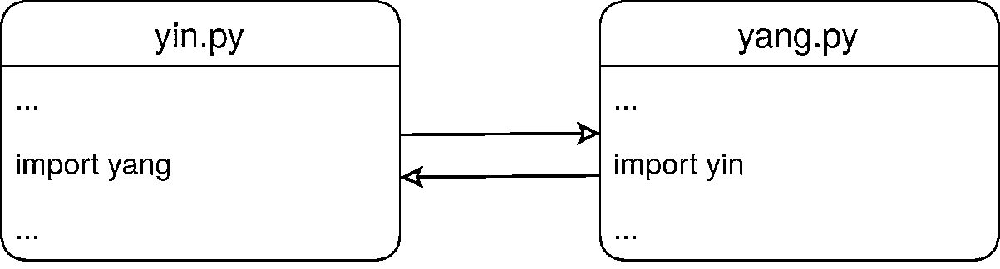

# Python 导入:高级技术和技巧

> 原文：<https://realpython.com/python-import/>

在 Python 中，你使用 **`import`** 关键字使一个**模块中的代码在另一个**模块中可用。Python 中的导入对于**有效地构建代码**非常重要。正确使用导入将使您更有效率，允许您在保持项目可维护性的同时重用代码。

本教程将全面概述 Python 的`import`语句及其工作原理。导入系统是强大的，你将学会如何驾驭这种力量。虽然您将涉及 Python 导入系统背后的许多概念，但本教程主要是示例驱动的。您将从几个代码示例中学习。

**在本教程中，您将学习如何:**

*   使用**模块**、**包**和**命名空间包**
*   在你的包中处理**资源**和**数据文件**
*   运行时动态导入模块**和**
*   **定制** Python 的导入系统

在整个教程中，您将看到如何使用 Python 导入机制来最有效地工作的例子。虽然教程中显示了所有代码，但是您也可以通过单击下面的框来下载它:

**获取源代码:** [点击此处获取源代码，您将在本教程中使用](https://realpython.com/bonus/python-import/)来了解 Python 导入系统。

## 基础 Python `import`

Python 代码被组织到[模块和包](https://realpython.com/python-modules-packages)中。本节将解释它们之间的区别以及如何使用它们。

在本教程的后面，您将看到 Python 的导入系统的一些高级和鲜为人知的用法。然而，让我们从基础开始:导入模块和包。

[*Remove ads*](/account/join/)

### 模块

[Python.org 词汇表](https://docs.python.org/glossary.html)对**模块**的定义如下:

> 作为 Python 代码的组织单位的对象。模块有一个包含任意 Python 对象的名称空间。模块通过导入过程加载到 Python 中。([来源](https://docs.python.org/glossary.html#term-module))

实际上，一个模块通常对应一个包含 Python 代码的`.py`文件。

模块的真正强大之处在于它们可以被导入并在其他代码中重用。考虑下面的例子:

>>>

```py
>>> import math
>>> math.pi
3.141592653589793
```

在第一行`import math`，您导入 [`math`模块](https://realpython.com/python-math-module/)中的代码，并使其可供使用。在第二行，您访问`math`模块中的`pi` [变量](https://realpython.com/python-variables/)。`math`是 [Python 的标准库](https://docs.python.org/library/index.html)的一部分，这意味着当你运行 Python 时，它总是可以被导入。

注意你写的是`math.pi`而不仅仅是简单的`pi`。除了作为一个模块，`math`还作为一个 [**名称空间**](https://realpython.com/python-namespaces-scope/) 将模块的所有属性保存在一起。名称空间有助于保持代码的可读性和组织性。用蒂姆·彼得斯的话说:

> 名称空间是一个非常棒的想法——让我们多做一些吧！([来源](https://www.python.org/dev/peps/pep-0020/))

您可以使用`dir()`列出名称空间的内容:

>>>

```py
>>> import math
>>> dir()
['__annotations__', '__builtins__', ..., 'math']

>>> dir(math)
['__doc__', ..., 'nan', 'pi', 'pow', ...]
```

使用不带任何参数的`dir()`显示了全局名称空间中的内容。要查看`math`名称空间的内容，可以使用`dir(math)`。

你已经看到了`import`最直接的用法。但是，还有其他方法可以使用它，允许您导入模块的特定部分，并在导入时重命名模块。

以下代码仅从`math`模块导入`pi`变量:

>>>

```py
>>> from math import pi
>>> pi
3.141592653589793

>>> math.pi
NameError: name 'math' is not defined
```

请注意，这将把`pi`放在全局名称空间中，而不是放在`math`名称空间中。

您也可以在导入模块和属性时给它们重新命名:

>>>

```py
>>> import math as m
>>> m.pi
3.141592653589793

>>> from math import pi as PI
>>> PI
3.141592653589793
```

关于导入模块的语法的更多细节，请查看 [Python 模块和包——简介](https://realpython.com/python-modules-packages/#the-import-statement)。

### 包装

您可以使用一个包来进一步组织您的模块。Python.org 词汇表将**包**定义如下:

> 一个 Python 模块，可以包含子模块或递归子包。从技术上讲，包是一个带有`__path__`属性的 Python 模块。([来源](https://docs.python.org/glossary.html#term-package))

注意，包仍然是一个模块。作为一个用户，你通常不需要担心你是导入一个模块还是一个包。

实际上，一个包通常对应于一个包含 Python 文件和其他目录的文件目录。要自己创建一个 Python 包，需要创建一个目录和一个名为`__init__.py` 的[文件。当被视为一个模块时，`__init__.py`文件包含了包的内容。可以留空。](https://docs.python.org/reference/import.html#regular-packages)

**注意:**没有`__init__.py`文件的目录仍然被 Python 视为包。然而，这些不会是常规的包，而是被称为**名称空间包**的东西。稍后你会学到更多关于他们的知识。

通常，当您导入一个包时，子模块和子包不会被导入。但是，如果您愿意，您可以使用`__init__.py`来包含任何或者所有的子模块和子包。为了展示这种行为的几个例子，您将创建一个用几种不同的语言说 [`Hello world`](http://helloworldcollection.de/) 的包。该软件包将包含以下目录和文件:

```py
world/
│
├── africa/
│   ├── __init__.py
│   └── zimbabwe.py
│
├── europe/
│   ├── __init__.py
│   ├── greece.py
│   ├── norway.py
│   └── spain.py
│
└── __init__.py
```

每个国家文件[打印出](https://realpython.com/python-print/)的问候，而`__init__.py`文件有选择地导入一些子包和子模块。这些文件的确切内容如下:

```py
# world/africa/__init__.py  (Empty file)

# world/africa/zimbabwe.py
print("Shona: Mhoroyi vhanu vese")
print("Ndebele: Sabona mhlaba")

# world/europe/__init__.py
from . import greece
from . import norway

# world/europe/greece.py
print("Greek: Γειά σας Κόσμε")

# world/europe/norway.py
print("Norwegian: Hei verden")

# world/europe/spain.py
print("Castellano: Hola mundo")

# world/__init__.py
from . import africa
```

注意`world/__init__.py`只导入`africa`而不导入`europe`。同样，`world/africa/__init__.py`不导入任何东西，而`world/europe/__init__.py`导入`greece`和`norway`但不导入`spain`。每个国家模块在导入时都会打印一个问候语。

让我们在交互提示符下使用`world`包，以便更好地理解子包和子模块的行为:

>>>

```py
>>> import world
>>> world
<module 'world' from 'world/__init__.py'>

>>> # The africa subpackage has been automatically imported
>>> world.africa
<module 'world.africa' from 'world/africa/__init__.py'>

>>> # The europe subpackage has not been imported
>>> world.europe
AttributeError: module 'world' has no attribute 'europe'
```

当`europe`被导入时，`europe.greece`和`europe.norway`模块也被导入。您可以看到这一点，因为国家模块在导入时会打印一条问候语:

>>>

```py
>>> # Import europe explicitly
>>> from world import europe
Greek: Γειά σας Κόσμε
Norwegian: Hei verden

>>> # The greece submodule has been automatically imported
>>> europe.greece
<module 'world.europe.greece' from 'world/europe/greece.py'>

>>> # Because world is imported, europe is also found in the world namespace
>>> world.europe.norway
<module 'world.europe.norway' from 'world/europe/norway.py'>

>>> # The spain submodule has not been imported
>>> europe.spain
AttributeError: module 'world.europe' has no attribute 'spain'

>>> # Import spain explicitly inside the world namespace
>>> import world.europe.spain
Castellano: Hola mundo

>>> # Note that spain is also available directly inside the europe namespace
>>> europe.spain
<module 'world.europe.spain' from 'world/europe/spain.py'>

>>> # Importing norway doesn't do the import again (no output), but adds
>>> # norway to the global namespace
>>> from world.europe import norway
>>> norway
<module 'world.europe.norway' from 'world/europe/norway.py'>
```

`world/africa/__init__.py`文件是空的。这意味着导入`world.africa`包创建了名称空间，但是没有其他影响:

>>>

```py
>>> # Even though africa has been imported, zimbabwe has not
>>> world.africa.zimbabwe
AttributeError: module 'world.africa' has no attribute 'zimbabwe'

>>> # Import zimbabwe explicitly into the global namespace
>>> from world.africa import zimbabwe
Shona: Mhoroyi vhanu vese
Ndebele: Sabona mhlaba

>>> # The zimbabwe submodule is now available
>>> zimbabwe
<module 'world.africa.zimbabwe' from 'world/africa/zimbabwe.py'>

>>> # Note that zimbabwe can also be reached through the africa subpackage
>>> world.africa.zimbabwe
<module 'world.africa.zimbabwe' from 'world/africa/zimbabwe.py'>
```

记住，导入一个模块会加载内容并创建一个包含内容的名称空间。最后几个例子表明，同一个模块可能是不同名称空间的一部分。

**技术细节:**模块名称空间被实现为一个 [Python 字典](https://realpython.com/python-dicts/)，并且在`.__dict__`属性中可用:

>>>

```py
>>> import math
>>> math.__dict__["pi"]
3.141592653589793
```

你很少需要直接和`.__dict__`互动。

同样，Python 的[全局名称空间](https://realpython.com/python-scope-legb-rule/#using-scope-related-built-in-functions)也是一个字典。可以通过`globals()`访问。

在一个`__init__.py`文件中导入子包和子模块以使它们更容易被用户使用是很常见的。你可以在流行的 [`requests`套餐](https://realpython.com/python-requests/)中看到[这种](https://github.com/psf/requests/blob/v2.23.0/requests/__init__.py#L112)的一个例子。

[*Remove ads*](/account/join/)

### 绝对和相对进口

回想一下前面例子中的源代码`world/__init__.py`:

```py
from . import africa
```

你已经见过`from math import pi`等`from...import`语句，但是`from . import africa`中的点(`.`)是什么意思呢？

圆点表示当前包，该语句是一个**相对导入**的例子。可以理解为“从当前包中，导入子包`africa`”

有一个等价的 **absolute import** 语句，在其中显式命名当前包:

```py
from world import africa
```

事实上，`world`中的所有导入都可以用类似的绝对导入显式完成。

相对导入必须采用`from...import`的形式，并且导入位置必须以点开始。

[PEP 8 风格指南](https://www.python.org/dev/peps/pep-0008/#imports)一般推荐使用绝对进口。但是，相对导入是组织包层次结构的一种替代方法。有关更多信息，请参见 Python 中的[绝对与相对导入](https://realpython.com/absolute-vs-relative-python-imports/)。

### Python 的导入路径

Python 如何找到它导入的模块和包？稍后您将看到关于 Python 导入系统[的更多细节。现在，只知道 Python 在它的](#import-internals) [**导入路径**](https://docs.python.org/glossary.html#term-import-path) 中寻找模块和包。这是在其中搜索要导入的模块的位置列表。

**注意:**当你输入`import something`的时候，Python 会在搜索导入路径之前寻找`something`几个不同的地方。

特别是，它会在模块缓存中查看`something`是否已经被导入，并且会在内置模块中进行搜索。

在后面的章节中，您将了解更多关于 Python 导入机制的内容。

您可以通过打印`sys.path`来检查 Python 的导入路径。概括地说，该列表将包含三种不同的位置:

1.  当前脚本的目录(如果没有脚本，则为当前目录，例如 Python 交互运行时)
2.  `PYTHONPATH`环境变量的内容
3.  其他依赖于安装的目录

通常，Python 会从位置列表的开头开始，在每个位置寻找给定的模块，直到第一个匹配。因为脚本目录或当前目录总是在这个列表的第一位，所以您可以通过组织目录并注意从哪个目录运行 Python 来确保您的脚本找到您自制的模块和包。

然而，你也应该小心不要创建那些**遮蔽了**或者隐藏了其他重要模块的模块。例如，假设您定义了下面的`math`模块:

```py
# math.py

def double(number):
    return 2 * number
```

使用该模块可以像预期的那样工作:

>>>

```py
>>> import math
>>> math.double(3.14)
6.28
```

但是这个模块也隐藏了标准库中包含的`math`模块。不幸的是，这意味着我们之前查找π值的例子不再有效:

>>>

```py
>>> import math
>>> math.pi
Traceback (most recent call last):
  File "<stdin>", line 1, in <module>
AttributeError: module 'math' has no attribute 'pi'

>>> math
<module 'math' from 'math.py'>
```

问题是 Python 现在在你的新`math`模块中搜索`pi`，而不是在标准库中搜索`math`模块。

为了避免这类问题，您应该小心使用模块和包的名称。特别是，顶级模块和包的名称应该是唯一的。如果`math`被定义为一个包内的子模块，那么它不会遮蔽内置模块。

[*Remove ads*](/account/join/)

### 示例:构建您的导入

虽然可以通过使用当前目录以及操纵`PYTHONPATH`甚至`sys.path`来组织您的导入，但是这个过程通常是不规则的，并且容易出错。要查看典型示例，请考虑以下应用:

```py
structure/
│
├── files.py
└── structure.py
```

该应用程序将通过创建目录和空文件来重新创建给定的文件结构。`structure.py`文件包含主脚本，`files.py`是一个库模块，有一些处理文件的函数。下面是应用程序输出的一个例子，在这种情况下是在`structure`目录下运行的:

```py
$ python structure.py .
Create file: /home/gahjelle/structure/001/structure.py
Create file: /home/gahjelle/structure/001/files.py
Create file: /home/gahjelle/structure/001/__pycache__/files.cpython-38.pyc
```

这两个源代码文件以及自动创建的`.pyc`文件在名为`001`的新目录中重新创建。

现在看一下源代码。应用程序的主要功能在`structure.py`中定义:

```py
 1# structure/structure.py
 2
 3# Standard library imports
 4import pathlib
 5import sys
 6
 7# Local imports
 8import files
 9
10def main():
11    # Read path from command line
12    try:
13        root = pathlib.Path(sys.argv[1]).resolve()
14    except IndexError:
15        print("Need one argument: the root of the original file tree")
16        raise SystemExit()
17
18    # Re-create the file structure
19    new_root = files.unique_path(pathlib.Path.cwd(), "{:03d}")
20    for path in root.rglob("*"):
21        if path.is_file() and new_root not in path.parents:
22            rel_path = path.relative_to(root)
23            files.add_empty_file(new_root / rel_path)
24
25if __name__ == "__main__":
26    main()
```

在**的第 12 到 16 行**，您从命令行读取一个根路径。在上面的例子中，你使用了一个点，这意味着当前的目录。该路径将被用作您将重新创建的文件层次结构的`root`。

实际工作发生在**19 到 23 行**。首先，创建一个惟一的路径`new_root`，它将成为新文件层次结构的根。然后循环遍历原始`root`下的所有路径，并在新的文件层次结构中将它们重新创建为空文件。

对于这样的路径操作，标准库中的`pathlib`非常有用。关于如何使用它的更多细节，请查看 [Python 3 的`pathlib`模块:驯服文件系统](https://realpython.com/python-pathlib/)。

在**第 26 行**，你调用`main()`。稍后你会学到更多关于**线 25** [的`if`测试。现在，您应该知道特殊变量`__name__`在脚本中有值`__main__`，但是它在导入的模块中获得模块的名称。关于`__name__`的更多信息，请查看](#import-scripts-as-modules)[在 Python 中定义主函数](https://realpython.com/python-main-function/#use-__name__-to-control-the-execution-of-your-code)和[如果 **name** == " **main** 在 Python 中做什么？](https://realpython.com/if-name-main-python/)。

请注意，您在第 8 行的**处导入了`files`。该库模块包含两个实用功能:**

```py
# structure/files.py

def unique_path(directory, name_pattern):
    """Find a path name that does not already exist"""
    counter = 0
    while True:
        counter += 1
        path = directory / name_pattern.format(counter)
        if not path.exists():
            return path

def add_empty_file(path):
    """Create an empty file at the given path"""
    print(f"Create file: {path}")
    path.parent.mkdir(parents=True, exist_ok=True)
    path.touch()
```

`unique_path()` [使用计数器](https://realpython.com/python-pathlib/#create-a-unique-file-name)找到一条不存在的路径。在应用程序中，您使用它来找到一个唯一的子目录，用作重新创建的文件层次结构的`new_root`。接下来，`add_empty_file()`确保在使用 [`.touch()`](https://docs.python.org/library/pathlib.html#pathlib.Path.touch) 创建一个空文件之前创建了所有必要的目录。

再看一下`files`的导入:

```py
 7# Local imports
 8import files
```

看起来挺无辜的。但是，随着项目的增长，这条线会让你有些头疼。即使您从`structure`项目导入`files`，导入也是**绝对**:它不是以点开始的。这意味着必须在导入路径中找到`files`才能进行导入。

幸运的是，包含当前脚本的目录总是在 Python 的导入路径中，所以现在这样做很好。然而，如果你的项目获得了一些动力，那么它可能会被用在其他方面。

例如，有人可能想要将脚本导入到一个 [Jupyter 笔记本](https://realpython.com/jupyter-notebook-introduction/)中，并从那里运行它。或者他们可能想在另一个项目中重用`files`库。他们甚至可能[用 PyInstaller](https://realpython.com/pyinstaller-python/) 创建一个可执行文件来更容易地分发它。不幸的是，这些场景中的任何一个都可能导致`files`的导入出现问题。

要查看示例，您可以遵循 PyInstaller 指南并[为您的应用程序](https://realpython.com/pyinstaller-python/#preparing-your-project)创建一个入口点。在应用程序目录之外添加一个额外的目录:

```py
structure/
│
├── structure/
│   ├── files.py
│   └── structure.py
│
└── cli.py
```

在外层目录中，创建入口点脚本，`cli.py`:

```py
# cli.py

from structure.structure import main

if __name__ == "__main__":
    main()
```

这个脚本将从您的原始脚本导入`main()`并运行它。注意由于在`structure.py`的**线 25** 上的`if`测试，当`structure`被导入时`main()`没有运行。这意味着您需要显式运行`main()`。

理论上，这应该类似于直接运行应用程序:

```py
$ python cli.py structure
Traceback (most recent call last):
 File "cli.py", line 1, in <module>
 from structure.structure import main
 File "/home/gahjelle/structure/structure/structure.py", line 8, in <module>
 import files
ModuleNotFoundError: No module named 'files'
```

为什么没用？突然，`files`的导入引发了一个错误。

问题是通过用`cli.py`启动应用程序，你已经改变了当前脚本的位置，这反过来改变了导入路径。`files`已经不在导入路径上，所以绝对不能导入。

一个可能的解决方案是更改 Python 的导入路径:

```py
 7# Local imports
 8sys.path.insert(0, str(pathlib.Path(__file__).parent))
 9import files
```

这是因为导入路径包括了包含`structure.py`和`files.py`的文件夹。这种方法的问题是，您的导入路径会变得非常混乱，难以理解。

实际上，您正在重新创建早期 Python 版本的一个特性，称为**隐式相对导入**。这些被 [PEP 328](https://www.python.org/dev/peps/pep-0328/) 从语言中删除，理由如下:

> 在 Python 2.4 和更早的版本中，如果你正在读取一个位于包内的模块，不清楚`import foo`是指顶层模块还是包内的另一个模块。随着 Python 的库的扩展，越来越多的现有包内部模块突然不小心遮蔽了标准库模块。在包内这是一个特别困难的问题，因为没有办法指定哪个模块是指哪个模块。([来源](https://www.python.org/dev/peps/pep-0328/#rationale-for-absolute-imports))

另一个解决方案是使用相对导入。按如下方式更改`structure.py`中的导入:

```py
 7# Local imports
 8from . import files
```

现在，您可以通过入口点脚本启动您的应用程序:

```py
$ python cli.py structure
Create file: /home/gahjelle/structure/001/structure.py
Create file: /home/gahjelle/structure/001/files.py
Create file: /home/gahjelle/structure/001/__pycache__/structure.cpython-38.pyc
Create file: /home/gahjelle/structure/001/__pycache__/files.cpython-38.pyc
```

遗憾的是，您不能再直接调用该应用程序:

```py
$ python structure.py .
Traceback (most recent call last):
 File "structure.py", line 8, in <module>
 from . import files
ImportError: cannot import name 'files' from '__main__' (structure.py)
```

问题是[相对导入在脚本](https://www.python.org/dev/peps/pep-0328/#relative-imports-and-name)中的解析与导入模块不同。当然，您可以在直接运行脚本之前返回并恢复绝对导入，或者您甚至可以做一些`try...except`技巧来绝对或相对导入文件，这取决于什么有效。

甚至有一个官方认可的黑客来让相对导入在脚本中工作。不幸的是，这也迫使你在大多数情况下改变`sys.path`。引用[雷蒙德·赫廷格](https://twitter.com/raymondh)的话:

> 一定有更好的办法！([来源](https://youtu.be/wf-BqAjZb8M?t=23m07s))

事实上，一个更好——也更稳定——的解决方案是配合 Python 的导入和打包系统，使用`pip` 将您的项目作为本地包[安装。](https://realpython.com/what-is-pip/)

[*Remove ads*](/account/join/)

### 创建并安装一个本地包

当您从 [PyPI](https://pypi.org/) 安装一个包时，您环境中的所有脚本都可以使用这个包。但是，您也可以从本地计算机安装软件包，它们也可以以同样的方式获得。

创建一个本地包并不涉及太多的开销。首先，在外层的`structure`目录中创建最小的 [`setup.cfg`](https://setuptools.readthedocs.io/en/latest/setuptools.html#configuring-setup-using-setup-cfg-files) 和 [`setup.py`](https://snarky.ca/what-the-heck-is-pyproject-toml/#how-to-use-pyproject-toml-with-setuptools) 文件:

```py
# setup.cfg

[metadata]
name = local_structure
version = 0.1.0

[options]
packages = structure

# setup.py

import setuptools

setuptools.setup()
```

理论上，`name`和`version`可以是你喜欢的任何东西。然而，`pip`在引用你的包时会用到它们，所以你应该选择可识别的值，并且不要和你使用的其他包冲突。

一个技巧是给所有这样的本地包一个公共的前缀，比如`local_`或者你的用户名。`packages`应该列出包含你的源代码的目录。然后您可以使用`pip`在本地安装包:

```py
$ python -m pip install -e .
```

此命令将把软件包安装到您的系统中。`structure`将在 Python 的导入路径中找到，这意味着您可以在任何地方使用它，而不必担心脚本目录、相对导入或其他复杂性。`-e`选项代表**可编辑**，这很重要，因为它允许你改变你的包的源代码，而不需要重新安装。

**注意:**这种设置文件在您自己处理项目时非常有用。但是，如果您计划与他人共享代码，那么您应该在安装文件中添加更多的信息。

关于安装文件的更多细节，请查看[如何将开源 Python 包发布到 PyPI](https://realpython.com/pypi-publish-python-package/) 。

现在`structure`已经安装在您的系统上，您可以使用下面的导入语句:

```py
 7# Local imports
 8from structure import files
```

无论您最终如何调用您的应用程序，这都会起作用。

**提示:**在自己的代码中，要有意识地将脚本和库分开。这里有一个很好的经验法则:

*   一个**脚本**将要运行。
*   一个**库**将被导入。

您可能有既想自己运行又想从其他脚本导入的代码。在这种情况下，通常值得[重构](https://realpython.com/python-refactoring/)您的代码，以便将公共部分拆分成一个库模块。

虽然将脚本和库分开是个好主意，但是所有 Python 文件都可以执行和导入。在后面的[部分](#import-scripts-as-modules)中，您将了解更多关于如何创建模块来很好地处理这两者。

### 名称空间包

Python 模块和包与文件和目录密切相关。这使得 Python 不同于许多其他编程语言，在其他编程语言中，包仅仅充当名称空间，而不强制执行源代码的组织方式。示例见 [PEP 402](https://www.python.org/dev/peps/pep-0402/#the-problem) 中的讨论。

**命名空间包**从版本 3.3 开始在 Python 中可用。这些不太依赖于底层的文件层次结构。特别是，名称空间包可以跨多个目录拆分。如果您的目录包含一个`.py`文件，但没有`__init__.py`，则会自动创建一个名称空间包。详见 [PEP 420](https://www.python.org/dev/peps/pep-0420/) 。

**注意:**准确的说，*隐式*命名空间包是在 Python 3.3 中引入的。在 Python 的早期版本中，您可以用几种不同的不兼容方式在[中手动创建名称空间包。PEP 420 统一并简化了这些早期的方法。](https://www.python.org/dev/peps/pep-0420/#namespace-packages-today)

为了更好地理解命名空间包为什么有用，让我们试着实现一个。作为一个激励性的例子，您将再次尝试在[工厂方法模式及其在 Python](https://realpython.com/factory-method-python/) 中的实现中解决的问题:给定一个`Song`对象，您想要将它转换成几个字符串表示中的一个。换句话说，你希望**序列化** `Song`对象。

更具体地说，您希望实现类似这样的代码:

>>>

```py
>>> song = Song(song_id="1", title="The Same River", artist="Riverside")
>>> song.serialize()
'{"id": "1", "title": "The Same River", "artist": "Riverside"}'
```

让我们假设您很幸运，遇到了需要序列化的几种格式的第三方实现，它被组织成一个名称空间包:

```py
third_party/
│
└── serializers/
    ├── json.py
    └── xml.py
```

文件`json.py`包含可以将对象序列化为 [JSON 格式](https://realpython.com/python-json/)的代码:

```py
# third_party/serializers/json.py

import json

class JsonSerializer:
    def __init__(self):
        self._current_object = None

    def start_object(self, object_name, object_id):
        self._current_object = dict(id=object_id)

    def add_property(self, name, value):
        self._current_object[name] = value

    def __str__(self):
        return json.dumps(self._current_object)
```

这个序列化器接口有点受限，但它足以演示名称空间包是如何工作的。

文件`xml.py`包含一个类似的`XmlSerializer`，它可以将一个对象转换成 [XML](https://www.xml.com/axml/axml.html) :

```py
# third_party/serializers/xml.py

import xml.etree.ElementTree as et

class XmlSerializer:
    def __init__(self):
        self._element = None

    def start_object(self, object_name, object_id):
        self._element = et.Element(object_name, attrib={"id": object_id})

    def add_property(self, name, value):
        prop = et.SubElement(self._element, name)
        prop.text = value

    def __str__(self):
        return et.tostring(self._element, encoding="unicode")
```

注意，这两个类都用`.start_object()`、`.add_property()`和`.__str__()`方法实现了相同的接口。

然后创建一个可以使用这些序列化器的`Song`类:

```py
# song.py

class Song:
    def __init__(self, song_id, title, artist):
        self.song_id = song_id
        self.title = title
        self.artist = artist

    def serialize(self, serializer):
        serializer.start_object("song", self.song_id)
        serializer.add_property("title", self.title)
        serializer.add_property("artist", self.artist)

        return str(serializer)
```

一个`Song`由它的 ID、标题和艺术家定义。注意`.serialize()`不需要知道它转换成哪种格式，因为它使用了前面定义的公共接口。

假设您已经安装了第三方`serializers`包，您可以如下使用它:

>>>

```py
>>> from serializers.json import JsonSerializer
>>> from serializers.xml import XmlSerializer
>>> from song import Song
>>> song = Song(song_id="1", title="The Same River", artist="Riverside")

>>> song.serialize(JsonSerializer())
'{"id": "1", "title": "The Same River", "artist": "Riverside"}'

>>> song.serialize(XmlSerializer())
'<song id="1"><title>The Same River</title><artist>Riverside</artist></song>'
```

通过向`.serialize()`提供不同的序列化对象，您可以获得歌曲的不同表示。

**注意:**当你自己运行代码时，你可能会得到一个`ModuleNotFoundError`或者一个`ImportError`。这是因为`serializers`不在你的 [Python 导入路径](#pythons-import-path)中。您很快就会看到如何解决这个问题。

到目前为止，一切顺利。然而，现在您意识到您还需要将您的歌曲转换成一种 [YAML](https://realpython.com/python-yaml/) 表示，这在第三方库中是不支持的。进入名称空间包的魔力:您可以将自己的`YamlSerializer`添加到`serializers`包中，而不需要接触第三方库。

首先，在本地文件系统上创建一个名为`serializers`的目录。目录的名称必须与您正在定制的名称空间包的名称相匹配，这一点很重要:

```py
local/
│
└── serializers/
    └── yaml.py
```

在`yaml.py`文件中，您定义了自己的`YamlSerializer`。你把这个基于 [`PyYAML`包](https://pypi.org/project/PyYAML/)，它必须从 PyPI 安装:

```py
$ python -m pip install PyYAML
```

由于 YAML 和 JSON 是非常相似的格式，您可以重用`JsonSerializer`的大部分实现:

```py
# local/serializers/yaml.py

import yaml
from serializers.json import JsonSerializer

class YamlSerializer(JsonSerializer):
    def __str__(self):
        return yaml.dump(self._current_object)
```

注意，`YamlSerializer`是基于`JsonSerializer`的，后者是从`serializers`本身导入的。由于`json`和`yaml`都是同一个名称空间包的一部分，您甚至可以使用一个相对导入:`from .json import JsonSerializer`。

继续上面的例子，您现在也可以将歌曲转换为 YAML:

>>>

```py
>>> from serializers.yaml import YamlSerializer
>>> song.serialize(YamlSerializer())
"artist: Riverside\nid: '1'\ntitle: The Same River\n"
```

就像常规的模块和包一样，命名空间包必须位于 Python 导入路径中。如果您遵循前面的例子，那么您可能会遇到 Python 找不到`serializers`的问题。在实际代码中，您将使用`pip`来安装第三方库，因此它将自动位于您的路径中。

**注意:**在[原始示例](https://realpython.com/factory-method-python/#an-object-serialization-example)中，串行器的选择更加动态。稍后您将看到如何以正确的**工厂方法**模式[使用名称空间包。](#example-factory-method-with-namespace-packages)

您还应该确保您的本地库像普通包一样可用。如上所述，可以通过从正确的目录运行 Python 或者使用`pip`安装本地库来实现。

在这个例子中，您正在测试如何将一个假冒的第三方包与您的本地包集成在一起。如果`third_party`是一个真实的包，那么您可以使用`pip`从 PyPI 下载它。因为这是不可能的，你可以通过在本地安装`third_party`来模拟它，就像你在前面的 [`structure`例子](#example-structure-your-imports)中所做的那样。

或者，您可以修改导入路径。将`third_party`和`local`目录放在同一个文件夹中，然后定制 Python 路径，如下所示:

>>>

```py
>>> import sys
>>> sys.path.extend(["third_party", "local"])

>>> from serializers import json, xml, yaml
>>> json
<module 'serializers.json' from 'third_party/serializers/json.py'>

>>> yaml
<module 'serializers.yaml' from 'local/serializers/yaml.py'>
```

现在，您可以使用所有序列化程序，而不用担心它们是在第三方包中定义的还是在本地定义的。

[*Remove ads*](/account/join/)

### 进口款式指南

Python 风格指南 PEP 8 ，有一些关于导入的[建议](https://www.python.org/dev/peps/pep-0008/#imports)。和 Python 一样，保持代码的可读性和可维护性是一个重要的考虑因素。以下是如何设计导入样式的一些通用规则:

*   将导入放在文件的顶部。
*   将导入写在单独的行上。
*   将导入组织成组:首先是标准库导入，然后是第三方导入，最后是本地应用程序或库导入。
*   在每个组中按字母顺序排列导入。
*   比起相对进口，更喜欢绝对进口。
*   避免像`from module import *`这样的通配符导入。

[`isort`](https://pypi.org/project/isort/) 和 [`reorder-python-imports`](https://pypi.org/project/reorder-python-imports/) 是让你的进口货风格一致的好工具。

下面是一个在真正的 Python 提要阅读器包中的导入部分的例子:

```py
# Standard library imports
import sys
from typing import Dict, List

# Third party imports
import feedparser
import html2text

# Reader imports
from reader import URL
```

注意这种分组是如何使这个模块的[依赖关系](https://realpython.com/courses/managing-python-dependencies/)变得清晰的:`feedparser`和`html2text`需要安装在系统上。您通常可以假设标准库是可用的。将导入从包中分离出来，可以让您对代码的内部依赖关系有所了解。

在有些情况下，稍微变通一下这些规则是有道理的。您已经看到了相对导入可以作为组织包层次结构的替代方法。[稍后](#handle-cyclical-imports)，您将看到在某些情况下，如何将导入转移到函数定义中，以打破导入循环。

## 资源进口

有时你会有依赖于数据文件或其他资源的代码。在小脚本中，这不是问题——您可以指定数据文件的路径并继续！

但是，如果资源文件对您的包很重要，并且您想将您的包分发给其他用户，那么将会出现一些挑战:

1.  您无法控制资源的路径，因为这取决于您的用户的设置以及软件包的分发和安装方式。您可以尝试根据您的包的`__file__`或`__path__`属性来找出资源路径，但是这可能并不总是像预期的那样工作。

2.  您的包可能[驻留在一个 ZIP 文件](#run-python-scripts-from-zip-files)或一个旧的 [`.egg`文件](https://packaging.python.org/discussions/wheel-vs-egg/)中，在这种情况下，资源甚至不会是用户系统上的一个物理文件。

已经有几种尝试来解决这些挑战，包括 [`setuptools.pkg_resources`](https://setuptools.readthedocs.io/en/latest/pkg_resources.html) 。然而，随着在 [Python 3.7](https://realpython.com/python37-new-features/#importing-data-files-with-importlibresources) 的标准库中引入了`importlib.resources`，现在有了一种处理资源文件的标准方式。

### `importlib.resources`简介

[`importlib.resources`](https://docs.python.org/library/importlib.html) 授予对包内资源的访问权。在这个上下文中，**资源**是位于可导入包中的任何文件。该文件可能对应于也可能不对应于文件系统上的物理文件。

这有几个好处。通过重用导入系统，您可以获得一种更一致的方式来处理包内的文件。它还使您更容易访问其他包中的资源文件。文档很好地总结了这一点:

> 如果您可以导入包，则可以访问该包中的资源。([来源](https://docs.python.org/library/importlib.html#module-importlib.resources))

`importlib.resources`成为 Python 3.7 中标准库的一部分。然而，在旧版本的 Python 中，一个[反向端口可以作为`importlib_resources`](https://importlib-resources.readthedocs.io/) 使用。要使用背面端口，请从 [PyPI](https://pypi.org/project/importlib_resources/) 安装:

```py
$ python -m pip install importlib_resources
```

反向端口与 Python 2.7 以及 Python 3.4 和更高版本兼容。

使用`importlib.resources`时有一个要求:你的资源文件必须在一个常规包中可用。不支持命名空间包。实际上，这意味着文件必须在包含一个`__init__.py`文件的目录中。

作为第一个例子，假设您在一个包中有[个资源](https://www.gutenberg.org/ebooks/11)，如下所示:

```py
books/
│
├── __init__.py
├── alice_in_wonderland.png
└── alice_in_wonderland.txt
```

`__init__.py`只是将`books`指定为常规包所必需的空文件。

然后，您可以使用`open_text()`和`open_binary()`分别打开文本和二进制文件:

>>>

```py
>>> from importlib import resources
>>> with resources.open_text("books", "alice_in_wonderland.txt") as fid:
...     alice = fid.readlines()
...
>>> print("".join(alice[:7]))
CHAPTER I. Down the Rabbit-Hole

Alice was beginning to get very tired of sitting by her sister on the
bank, and of having nothing to do: once or twice she had peeped into the
book her sister was reading, but it had no pictures or conversations in
it, 'and what is the use of a book,' thought Alice 'without pictures or
conversations?'

>>> with resources.open_binary("books", "alice_in_wonderland.png") as fid:
...     cover = fid.read()
...
>>> cover[:8]  # PNG file signature
b'\x89PNG\r\n\x1a\n'
```

`open_text()`和`open_binary()`相当于内置的`open()`，其中`mode`参数分别设置为`rt`和`rb`。直接读取文本或二进制文件的方便函数还有`read_text()`和`read_binary()`。更多信息参见[官方文档](https://docs.python.org/library/importlib.html#module-importlib.resources)。

**注意:**要无缝地回退到在旧的 Python 版本上使用 backport，您可以如下导入`importlib.resources`:

```py
try:
    from importlib import resources
except ImportError:
    import importlib_resources as resources
```

更多信息参见本教程的[提示和技巧章节](#handle-packages-across-python-versions)。

本节的其余部分将展示一些在实践中使用资源文件的详细示例。

[*Remove ads*](/account/join/)

### 示例:使用数据文件

作为使用数据文件的一个更完整的例子，您将看到如何实现一个基于[联合国人口数据](https://population.un.org/wpp/)的测验程序。首先，创建一个`data`包，从[联合国网页](https://population.un.org/wpp/Download/Standard/CSV/)下载 [`WPP2019_TotalPopulationBySex.csv`](https://population.un.org/wpp/Download/Files/1_Indicators%20(Standard)/CSV_FILES/WPP2019_TotalPopulationBySex.csv) :

```py
data/
│
├── __init__.py
└── WPP2019_TotalPopulationBySex.csv
```

打开 CSV 文件并查看数据:

```py
LocID,Location,VarID,Variant,Time,PopMale,PopFemale,PopTotal,PopDensity
4,Afghanistan,2,Medium,1950,4099.243,3652.874,7752.117,11.874
4,Afghanistan,2,Medium,1951,4134.756,3705.395,7840.151,12.009
4,Afghanistan,2,Medium,1952,4174.45,3761.546,7935.996,12.156
4,Afghanistan,2,Medium,1953,4218.336,3821.348,8039.684,12.315
...
```

每一行包含一个国家某一年和某一变量的人口，这表明预测使用的是哪一种情景。该文件包含了到 2100 年的人口预测。

以下函数读取该文件，并挑选出给定`year`和`variant`的每个国家的总人口:

```py
import csv
from importlib import resources

def read_population_file(year, variant="Medium"):
    population = {}

    print(f"Reading population data for {year}, {variant} scenario")
 with resources.open_text( "data", "WPP2019_TotalPopulationBySex.csv" ) as fid:        rows = csv.DictReader(fid)

        # Read data, filter the correct year
        for row in rows:
            if row["Time"] == year and row["Variant"] == variant:
                pop = round(float(row["PopTotal"]) * 1000)
                population[row["Location"]] = pop

    return population
```

突出显示的行显示了如何使用`importlib.resources`打开数据文件。有关使用 CSV 文件的更多信息，请查看[在 Python 中读写 CSV 文件](https://realpython.com/python-csv/)。

上面的函数返回一个包含人口数量的字典:

>>>

```py
>>> population = read_population_file("2020")
Reading population data for 2020, Medium scenario

>>> population["Norway"]
5421242
```

使用这个人口字典，您可以做许多有趣的事情，包括分析和可视化。在这里，您将创建一个问答游戏，要求用户识别集合中哪个国家人口最多。玩这个游戏会是这样的:

```py
$ python population_quiz.py

Question 1:
1\. Tunisia
2\. Djibouti
3\. Belize

Which country has the largest population? 1 Yes, Tunisia is most populous (11,818,618)

Question 2:
1\. Mozambique
2\. Ghana
3\. Hungary

Which country has the largest population? 2 No, Mozambique (31,255,435) is more populous than Ghana (31,072,945)

...
```

实现的细节已经超出了本教程的主题，所以这里不再讨论。但是，您可以展开下面的部分来查看完整的源代码。


人口测验由两个函数组成，一个函数像上面一样读取人口数据，另一个函数运行实际测验:

```py
 1# population_quiz.py
 2
 3import csv
 4import random
 5
 6try:
 7    from importlib import resources
 8except ImportError:
 9    import importlib_resources as resources
10
11def read_population_file(year, variant="Medium"):
12    """Read population data for the given year and variant"""
13    population = {}
14
15    print(f"Reading population data for {year}, {variant} scenario")
16    with resources.open_text(
17        "data", "WPP2019_TotalPopulationBySex.csv"
18    ) as fid:
19        rows = csv.DictReader(fid)
20
21        # Read data, filter the correct year
22        for row in rows:
23            if (
24                int(row["LocID"]) < 900
25                and row["Time"] == year
26                and row["Variant"] == variant
27            ):
28                pop = round(float(row["PopTotal"]) * 1000)
29                population[row["Location"]] = pop
30
31    return population
32
33def run_quiz(population, num_questions, num_countries):
34    """Run a quiz about the population of countries"""
35    num_correct = 0
36    for q_num in range(num_questions):
37        print(f"\n\nQuestion {q_num + 1}:")
38        countries = random.sample(population.keys(), num_countries)
39        print("\n".join(f"{i}. {a}" for i, a in enumerate(countries, start=1)))
40
41        # Get user input
42        while True:
43            guess_str = input("\nWhich country has the largest population? ")
44            try:
45                guess_idx = int(guess_str) - 1
46                guess = countries[guess_idx]
47            except (ValueError, IndexError):
48                print(f"Please answer between 1 and {num_countries}")
49            else:
50                break
51
52        # Check the answer
53        correct = max(countries, key=lambda k: population[k])
54        if guess == correct:
55            num_correct += 1
56            print(f"Yes, {guess} is most populous ({population[guess]:,})")
57        else:
58            print(
59                f"No, {correct} ({population[correct]:,}) is more populous "
60                f"than {guess} ({population[guess]:,})"
61            )
62
63    return num_correct
64
65def main():
66    """Read population data and run quiz"""
67    population = read_population_file("2020")
68    num_correct = run_quiz(population, num_questions=10, num_countries=3)
69    print(f"\nYou answered {num_correct} questions correctly")
70
71if __name__ == "__main__":
72    main()
```

请注意，在**行 24** 上，您还要检查`LocID`是否小于`900`。具有`900`及以上的`LocID`的位置不是适当的国家，而是像`World`、`Asia`等的集合。

### 示例:向 Tkinter GUIs 添加图标

在构建图形用户界面(GUI)时，您通常需要包含图标之类的资源文件。下面的例子展示了如何使用`importlib.resources`实现这一点。最终的应用程序看起来很简单，但它会有一个自定义图标，以及一个关于*再见*按钮的插图:

[](https://files.realpython.com/media/imports-hello-gui.305aa8c61d9e.png)

这个例子使用了 [Tkinter](https://realpython.com/python-gui-tkinter) ，这是一个在标准库中可用的 GUI 包。它基于最初为 Tcl 编程语言开发的 [Tk](https://tcl.tk/) 窗口系统。Python 还有许多其他的 GUI 包。如果你用的是不同的，那么你应该能够[使用类似这里介绍的想法给你的应用](https://realpython.com/python-pyqt-layout/)添加图标。

在 Tkinter 中，图像由 [`PhotoImage`类](http://effbot.org/tkinterbook/photoimage.htm)处理。要创建一个`PhotoImage`，需要传递一个图像文件的路径。

请记住，在分发您的包时，您甚至不能保证资源文件将作为物理文件存在于文件系统中。`importlib.resources`通过提供`path()`来解决这个问题。这个函数将返回一个[路径](https://realpython.com/python-pathlib/)到资源文件，如果需要的话创建一个临时文件。

为了确保所有临时文件都被正确清理，您应该使用关键字`with`将`path()`用作上下文管理器:

>>>

```py
>>> from importlib import resources
>>> with resources.path("hello_gui.gui_resources", "logo.png") as path:
...     print(path)
...
/home/gahjelle/hello_gui/gui_resources/logo.png
```

对于完整的示例，假设您有以下文件层次结构:

```py
hello_gui/
│
├── gui_resources/
│   ├── __init__.py
│   ├── hand.png
│   └── logo.png
│
└── __main__.py
```

如果您想亲自尝试这个示例，那么您可以通过单击下面的链接下载这些文件以及本教程中使用的其余源代码:

**获取源代码:** [点击此处获取源代码，您将在本教程中使用](https://realpython.com/bonus/python-import/)来了解 Python 导入系统。

代码存储在一个特殊名称为`__main__.py`的文件中。此名称表明该文件是包的入口点。拥有一个`__main__.py`文件可以让你的包用`python -m`执行:

```py
$ python -m hello_gui
```

关于使用`-m`调用包的更多信息，请参见[如何将开源 Python 包发布到 PyPI](https://realpython.com/pypi-publish-python-package/#different-ways-of-calling-a-package) 。

GUI 在一个名为`Hello`的类中定义。注意，您使用`importlib.resources`来获取图像文件的路径:

```py
 1# hello_gui/__main__.py
 2
 3import tkinter as tk
 4from tkinter import ttk
 5
 6try:
 7    from importlib import resources
 8except ImportError:
 9    import importlib_resources as resources
10
11class Hello(tk.Tk):
12    def __init__(self, *args, **kwargs):
13        super().__init__(*args, **kwargs)
14        self.wm_title("Hello")
15
16        # Read image, store a reference to it, and set it as an icon
17        with resources.path("hello_gui.gui_resources", "logo.png") as path: 18            self._icon = tk.PhotoImage(file=path)
19        self.iconphoto(True, self._icon)
20
21        # Read image, create a button, and store a reference to the image
22        with resources.path("hello_gui.gui_resources", "hand.png") as path: 23            hand = tk.PhotoImage(file=path)
24        button = ttk.Button(
25            self,
26            image=hand,
27            text="Goodbye",
28            command=self.quit,
29            compound=tk.LEFT,  # Add the image to the left of the text
30        )
31        button._image = hand
32        button.pack(side=tk.TOP, padx=10, pady=10)
33
34if __name__ == "__main__":
35    hello = Hello()
36    hello.mainloop()
```

如果你想了解更多关于用 Tkinter 构建 GUI 的知识，那么请查看用 Tkinter 进行 Python GUI 编程的[。官方文档也有一个](https://realpython.com/python-gui-tkinter/)[不错的资源列表](https://docs.python.org/library/tkinter.html)，TkDocs 上的[教程是另一个展示如何在其他语言中使用 Tk 的很好的资源。](https://tkdocs.com/tutorial/)

**注意:**在 Tkinter 中处理图像时，困惑和沮丧的一个来源是您必须确保图像没有被[垃圾收集](https://realpython.com/cpython-source-code-guide/#memory-management-in-cpython)。由于 Python 和 Tk 交互的方式，Python 中的垃圾收集器(至少在 [CPython](https://realpython.com/cpython-source-code-guide/) 中)不会注册图像被`.iconphoto()`和`Button`使用。

为了确保图像被保留，您应该手动添加对它们的引用。你可以在上面代码的第 18 行和第 31 行中看到这样的例子。

[*Remove ads*](/account/join/)

## 动态导入

Python 的定义特性之一是它是一种非常动态的语言。尽管有时这是个坏主意，但在 Python 程序运行时，你可以对它做很多事情，包括给类添加属性、重定义方法或更改模块的 [docstring](https://realpython.com/documenting-python-code/#documenting-your-python-code-base-using-docstrings) 。例如，您可以更改`print()`,使其不做任何事情:

>>>

```py
>>> print("Hello dynamic world!")
Hello dynamic world!

>>> # Redefine the built-in print()
>>> print = lambda *args, **kwargs: None

>>> print("Hush, everybody!")
>>> # Nothing is printed
```

从技术上讲，你没有重新定义`print()`。相反，你定义了另一个 `print()`的*，它隐藏了内置的那个。要返回使用原来的`print()`，你可以用`del print`删除你的自定义。如果您愿意，您可以隐藏任何内置于解释器中的 Python 对象。*

**注意:**在上面的例子中，你使用 lambda 函数重新定义了`print()`。您也可以使用普通的函数定义:

>>>

```py
>>> def print(*args, **kwargs):
... pass
```

要了解 lambda 函数的更多信息，请参见[如何使用 Python Lambda 函数](https://realpython.com/python-lambda/)。

在本节中，您将学习如何在 Python 中进行动态导入。有了它们，在程序运行之前，您不必决定导入什么。

### 使用`importlib`

到目前为止，您已经使用 Python 的`import`关键字显式地导入了模块和包。然而，整个导入机制在`importlib`包中是可用的，这允许您更动态地进行导入。以下脚本要求用户输入模块的名称，导入该模块，并打印其 docstring:

```py
# docreader.py

import importlib

module_name = input("Name of module? ")
module = importlib.import_module(module_name)
print(module.__doc__)
```

`import_module()`返回一个可以绑定到任何变量的模块对象。然后，您可以将该变量视为定期导入的模块。您可以像这样使用脚本:

```py
$ python docreader.py
Name of module? math This module is always available.  It provides access to the
mathematical functions defined by the C standard.

$ python docreader.py
Name of module? csv CSV parsing and writing.

This module provides classes that assist in the reading and writing
of Comma Separated Value (CSV) files, and implements the interface
described by PEP 305\.  Although many CSV files are simple to parse,
the format is not formally defined by a stable specification and
is subtle enough that parsing lines of a CSV file with something
like line.split(",") is bound to fail.  The module supports three
basic APIs: reading, writing, and registration of dialects.

[...]
```

在每种情况下，模块都是由`import_module()`动态导入的。

### 示例:带有名称空间包的工厂方法

回想一下前面的[序列化器示例](#namespace-packages)。通过将`serializers`实现为名称空间包，您可以添加定制的序列化程序。在之前教程的[原始示例](https://realpython.com/factory-method-python/#an-object-serialization-example)中，序列化器是通过序列化器工厂提供的。使用`importlib`，可以做类似的事情。

将以下代码添加到本地`serializers`名称空间包中:

```py
# local/serializers/factory.py

import importlib

def get_serializer(format):
    try:
        module = importlib.import_module(f"serializers.{format}")
        serializer = getattr(module, f"{format.title()}Serializer")
    except (ImportError, AttributeError):
        raise ValueError(f"Unknown format {format!r}") from None

    return serializer()

def serialize(serializable, format):
    serializer = get_serializer(format)
    serializable.serialize(serializer)
    return str(serializer)
```

`get_serializer()`工厂可以基于`format`参数动态地创建序列化器，然后`serialize()`可以将序列化器应用于任何实现了`.serialize()`方法的对象。

工厂对包含单个序列化程序的模块和类的命名做了一些强有力的假设。在下一节的[中，您将了解一个允许更多灵活性的插件架构。](#example-a-package-of-plugins)

现在，您可以重新创建前面的示例，如下所示:

>>>

```py
>>> from serializers import factory
>>> from song import Song
>>> song = Song(song_id="1", title="The Same River", artist="Riverside")

>>> factory.serialize(song, "json")
'{"id": "1", "title": "The Same River", "artist": "Riverside"}'

>>> factory.serialize(song, "yaml")
"artist: Riverside, id: '1', title: The Same River\n"

>>> factory.serialize(song, "toml")
ValueError: Unknown format 'toml'
```

在这种情况下，您不再需要显式导入每个序列化程序。相反，您可以用字符串指定序列化程序的名称。该字符串甚至可以由用户在运行时选择。

**注意:**在一个普通的包中，你可能已经在一个`__init__.py`文件中实现了`get_serializer()`和`serialize()`。这将允许您简单地导入`serializers`，然后调用`serializers.serialize()`。

然而，名称空间包不允许使用`__init__.py`，所以您需要在一个单独的模块中实现这些函数。

最后一个例子表明，如果您试图序列化为尚未实现的格式，也会得到一个适当的错误消息。

[*Remove ads*](/account/join/)

### 例子:一个插件包

让我们看另一个使用动态导入的例子。你可以使用下面的模块在你的代码中建立一个灵活的插件架构。这类似于前面的例子，在这个例子中，您可以通过添加新的模块来插入不同格式的序列化程序。

一个有效使用插件的应用是 [Glue 探索可视化工具](http://glueviz.org)。Glue 可以开箱读取许多不同的数据格式。然而，如果您的数据格式不受支持，那么您可以编写自己的[定制数据加载器](http://docs.glueviz.org/en/stable/customizing_guide/customization.html#custom-data-loaders)。

您可以通过添加一个函数来实现这一点，您可以装饰该函数并将其放置在一个特殊的位置，以便 Glue 可以轻松找到它。你不需要修改 Glue 源代码的任何部分。参见[文档](http://docs.glueviz.org/)了解所有细节。

您可以建立一个类似的插件架构，并在自己的项目中使用。在该架构中，有两个级别:

1.  **插件包**是一个 Python 包对应的相关插件的集合。
2.  **插件**是 Python 模块中可用的自定义行为。

公开插件架构的`plugins`模块有以下功能:

```py
# plugins.py

def register(func):
    """Decorator for registering a new plugin"""

def names(package):
    """List all plugins in one package"""

def get(package, plugin):
    """Get a given plugin"""

def call(package, plugin, *args, **kwargs):
    """Call the given plugin"""

def _import(package, plugin):
    """Import the given plugin file from a package"""

def _import_all(package):
    """Import all plugins in a package"""

def names_factory(package):
    """Create a names() function for one package"""

def get_factory(package):
    """Create a get() function for one package"""

def call_factory(package):
    """Create a call() function for one package"""
```

工厂函数用于方便地向插件包添加功能。您将很快看到一些如何使用它们的例子。

查看这段代码的所有细节超出了本教程的范围。如果您感兴趣，那么您可以通过展开下面的部分来查看实现。


以下代码显示了上述`plugins.py`的实现:

```py
# plugins.py

import functools
import importlib
from collections import namedtuple
from importlib import resources

# Basic structure for storing information about one plugin
Plugin = namedtuple("Plugin", ("name", "func"))

# Dictionary with information about all registered plugins
_PLUGINS = {}

def register(func):
    """Decorator for registering a new plugin"""
    package, _, plugin = func.__module__.rpartition(".")
    pkg_info = _PLUGINS.setdefault(package, {})
    pkg_info[plugin] = Plugin(name=plugin, func=func)
    return func

def names(package):
    """List all plugins in one package"""
    _import_all(package)
    return sorted(_PLUGINS[package])

def get(package, plugin):
    """Get a given plugin"""
    _import(package, plugin)
    return _PLUGINS[package][plugin].func

def call(package, plugin, *args, **kwargs):
    """Call the given plugin"""
    plugin_func = get(package, plugin)
    return plugin_func(*args, **kwargs)

def _import(package, plugin):
    """Import the given plugin file from a package"""
    importlib.import_module(f"{package}.{plugin}")

def _import_all(package):
    """Import all plugins in a package"""
    files = resources.contents(package)
    plugins = [f[:-3] for f in files if f.endswith(".py") and f[0] != "_"]
    for plugin in plugins:
        _import(package, plugin)

def names_factory(package):
    """Create a names() function for one package"""
    return functools.partial(names, package)

def get_factory(package):
    """Create a get() function for one package"""
    return functools.partial(get, package)

def call_factory(package):
    """Create a call() function for one package"""
    return functools.partial(call, package)
```

这个实现有点简单。特别是，它不做任何显式的错误处理。查看 [PyPlugs 项目](https://pypi.org/project/pyplugs/)以获得更完整的实现。

可以看到`_import()`使用`importlib.import_module()`动态加载插件。此外，`_import_all()`使用`importlib.resources.contents()`列出给定软件包中所有可用的插件。

让我们看一些如何使用插件的例子。第一个例子是一个`greeter`包，你可以用它给你的应用程序添加许多不同的问候。对于这个例子来说，一个完整的插件架构无疑是多余的，但是它展示了插件是如何工作的。

假设您有以下`greeter`包:

```py
greeter/
│
├── __init__.py
├── hello.py
├── howdy.py
└── yo.py
```

每个`greeter`模块定义了一个接受一个`name`参数的函数。注意它们是如何使用`@register`装饰器注册为插件的:

```py
# greeter/hello.py
import plugins

@plugins.register
def greet(name):
    print(f"Hello {name}, how are you today?")

# greeter/howdy.py
import plugins

@plugins.register
def greet(name):
    print(f"Howdy good {name}, honored to meet you!")

# greeter/yo.py
import plugins

@plugins.register
def greet(name):
    print(f"Yo {name}, good times!")
```

要了解更多关于 decorator 及其用法的信息，请查看 Python Decorators 的初级读本。

**注意:**为了简化插件的发现和导入，每个插件的名字都是基于包含它的模块的名字而不是函数名。这限制了每个文件只能有一个插件。

要完成将`greeter`设置为插件包，你可以使用`plugins`中的工厂函数给`greeter`包本身添加功能:

```py
# greeter/__init__.py

import plugins

greetings = plugins.names_factory(__package__)
greet = plugins.call_factory(__package__)
```

您现在可以如下使用`greetings()`和`greet()`:

>>>

```py
>>> import greeter
>>> greeter.greetings()
['hello', 'howdy', 'yo']

>>> greeter.greet(plugin="howdy", name="Guido")
Howdy good Guido, honored to meet you!
```

注意`greetings()`会自动发现包中所有可用的插件。

您还可以更动态地选择调用哪个插件。在下面的例子中，你随机选择一个插件。但是，您也可以根据配置文件或用户输入来选择插件:

>>>

```py
>>> import greeter
>>> import random

>>> greeting = random.choice(greeter.greetings())
>>> greeter.greet(greeting, name="Frida")
Hello Frida, how are you today?

>>> greeting = random.choice(greeter.greetings())
>>> greeter.greet(greeting, name="Frida")
Yo Frida, good times!
```

要发现和调用不同的插件，您需要导入它们。让我们快速看一下`plugins`是如何处理进口的。主要工作在`plugins.py`内部的以下两个函数中完成:

```py
import importlib
import pathlib
from importlib import resources

def _import(package, plugin):
    """Import the given plugin file from a package"""
    importlib.import_module(f"{package}.{plugin}")

def _import_all(package):
    """Import all plugins in a package"""
    files = resources.contents(package)
    plugins = [f[:-3] for f in files if f.endswith(".py") and f[0] != "_"]
    for plugin in plugins:
        _import(package, plugin)
```

看起来似乎很简单。它使用`importlib`来导入一个模块。但是后台也发生了一些事情:

1.  Python 的导入系统确保每个插件只导入一次。
2.  每个插件模块内部定义的装饰器注册每个导入的插件。
3.  在一个完整的实现中，还会有一些错误处理来处理丢失的插件。

发现软件包中的所有插件。它是这样工作的:

1.  `contents()` from `importlib.resources`列出了一个包中的所有文件。
2.  过滤结果以找到潜在的插件。
3.  每个不以下划线开头的 Python 文件都会被导入。
4.  发现并注册任何文件中的插件。

让我们以[序列化器名称空间包](#example-factory-method-with-namespace-packages)的最终版本来结束这一节。一个突出的问题是,`get_serializer()`工厂对序列化类的命名做了强有力的假设。您可以使用插件使其更加灵活。

首先，添加一行注册每个序列化程序的代码。下面是一个在`yaml`序列化器中如何实现的例子:

```py
# local/serializers/yaml.py

import plugins import yaml
from serializers.json import JsonSerializer

@plugins.register class YamlSerializer(JsonSerializer):
    def __str__(self):
        return yaml.dump(self._current_object)
```

接下来，更新`get_serializers()`以使用`plugins`:

```py
# local/serializers/factory.py

import plugins 
get_serializer = plugins.call_factory(__package__) 
def serialize(serializable, format):
    serializer = get_serializer(format)
    serializable.serialize(serializer)
    return str(serializer)
```

您使用`call_factory()`实现`get_serializer()`，因为这将自动实例化每个序列化程序。通过这种重构，序列化器的工作方式与前面的一样。但是，在命名序列化程序类时，您有更大的灵活性。

有关使用插件的更多信息，请查看 PyPI 上的 [PyPlugs](https://pypi.org/project/pyplugs/) 和来自 [PyCon 2019](https://us.pycon.org/2019/) 的[插件:为您的应用添加灵活性](https://github.com/gahjelle/talks/tree/master/20190505_pycon_plugins/)演示。

[*Remove ads*](/account/join/)

## Python 导入系统

您已经看到了许多利用 Python 导入系统的方法。在这一节中，您将了解更多关于导入模块和包时幕后发生的事情。

与 Python 的大多数部分一样，导入系统可以定制。您将看到几种改变导入系统的方法，包括从 PyPI 自动下载缺失的包，以及像导入模块一样导入数据文件。

### 导入内部零件

官方文档中描述了 Python 导入系统的细节。在高层次上，当您导入一个模块(或者包)时，会发生三件事情。该模块是:

1.  搜索
2.  装载的；子弹上膛的
3.  绑定到命名空间

对于通常的导入——用`import`语句完成的导入——所有三个步骤都是自动进行的。然而，当您使用`importlib`时，只有前两步是自动的。您需要自己将模块绑定到变量或名称空间。

例如，以下导入和重命名`math.pi`的方法大致相同:

>>>

```py
>>> from math import pi as PI
>>> PI
3.141592653589793

>>> import importlib
>>> _tmp = importlib.import_module("math")
>>> PI = _tmp.pi
>>> del _tmp
>>> PI
3.141592653589793
```

当然，在普通代码中，您应该更喜欢前者。

需要注意的一点是，即使只从一个模块中导入一个属性，也会加载并执行整个模块。模块的其余内容并没有绑定到当前的名称空间。证明这一点的一个方法是看看所谓的**模块缓存**:

>>>

```py
>>> from math import pi
>>> pi
3.141592653589793

>>> import sys
>>> sys.modules["math"].cos(pi)
-1.0
```

`sys.modules`充当模块缓存。它包含对所有已导入模块的引用。

模块缓存在 Python 导入系统中起着非常重要的作用。Python 在执行导入时首先会在`sys.modules`中寻找模块。如果一个模块已经可用，那么它不会被再次加载。

这是一个很好的优化，但也是必要的。如果模块在每次导入时都被重新加载，那么在某些情况下可能会导致不一致，比如在脚本运行时底层源代码发生了变化。

回想一下您之前看到的[导入路径](#pythons-import-path)。它实际上告诉 Python 在哪里搜索模块。但是，如果 Python 在模块缓存中找到了一个模块，那么它就不会费心搜索模块的导入路径。

### 示例:作为模块的单件

在[面向对象编程](https://realpython.com/python3-object-oriented-programming/)中， **singleton** 是一个最多有一个实例的类。虽然在 Python 中[实现单例是可能的，但是单例的大多数良好应用可以由模块来处理。您可以相信模块缓存只能实例化一个类一次。](https://realpython.com/primer-on-python-decorators/#creating-singletons)

举个例子，让我们回到你之前看到的联合国人口数据。下面的模块定义了一个包装人口数据的类:

```py
# population.py

import csv
from importlib import resources

import matplotlib.pyplot as plt

class _Population:
    def __init__(self):
        """Read the population file"""
        self.data = {}
        self.variant = "Medium"

        print(f"Reading population data for {self.variant} scenario")
        with resources.open_text(
            "data", "WPP2019_TotalPopulationBySex.csv"
        ) as fid:
            rows = csv.DictReader(fid)

            # Read data, filter the correct variant
            for row in rows:
                if int(row["LocID"]) >= 900 or row["Variant"] != self.variant:
                    continue

                country = self.data.setdefault(row["Location"], {})
                population = float(row["PopTotal"]) * 1000
                country[int(row["Time"])] = round(population)

    def get_country(self, country):
        """Get population data for one country"""
        data = self.data[country]
        years, population = zip(*data.items())
        return years, population

    def plot_country(self, country):
        """Plot data for one country, population in millions"""
        years, population = self.get_country(country)
        plt.plot(years, [p / 1e6 for p in population], label=country)

    def order_countries(self, year):
        """Sort countries by population in decreasing order"""
        countries = {c: self.data[c][year] for c in self.data}
        return sorted(countries, key=lambda c: countries[c], reverse=True)

# Instantiate the Singleton
data = _Population()
```

从磁盘读取数据需要一些时间。因为您不希望数据文件发生变化，所以在加载模块时实例化该类。类名以下划线开头，以[向用户](https://www.python.org/dev/peps/pep-0008/#descriptive-naming-styles)表明他们不应该使用它。

您可以使用`population.data` singleton 创建一个 [Matplotlib](https://realpython.com/python-matplotlib-guide/) 图表，显示人口最多的国家的人口预测:

>>>

```py
>>> import matplotlib.pyplot as plt
>>> import population
Reading population data for Medium scenario

>>> # Pick out five most populous countries in 2050
>>> for country in population.data.order_countries(2050)[:5]:
...     population.data.plot_country(country)
...
>>> plt.legend()
>>> plt.xlabel("Year")
>>> plt.ylabel("Population [Millions]")
>>> plt.title("UN Population Projections")
>>> plt.show()
```

这将创建如下所示的图表:

[](https://files.realpython.com/media/imports-population.fa041527204c.png)

注意，在导入时加载数据是一种[反模式](https://en.wikipedia.org/wiki/Anti-pattern)。理想情况下，你希望你的进口产品尽可能没有副作用。更好的方法是在需要时延迟加载数据。您可以使用属性非常优雅地做到这一点。展开以下部分查看示例。


第一次读取人口数据时，`population`的惰性实现将人口数据存储在`._data`中。`.data`属性处理数据的缓存:

```py
# population.py

import csv
from importlib import resources

import matplotlib.pyplot as plt

class _Population:
    def __init__(self):
        """Prepare to read the population file"""
        self._data = {}
        self.variant = "Medium"

    @property
    def data(self):
        """Read data from disk"""
        if self._data:  # Data has already been read, return it directly
            return self._data

        # Read data and store it in self._data
        print(f"Reading population data for {self.variant} scenario")
        with resources.open_text(
            "data", "WPP2019_TotalPopulationBySex.csv"
        ) as fid:
            rows = csv.DictReader(fid)

            # Read data, filter the correct variant
            for row in rows:
                if int(row["LocID"]) >= 900 or row["Variant"] != self.variant:
                    continue

                country = self._data.setdefault(row["Location"], {})
                population = float(row["PopTotal"]) * 1000
                country[int(row["Time"])] = round(population)
        return self._data

    def get_country(self, country):
        """Get population data for one country"""
        country = self.data[country]
        years, population = zip(*country.items())
        return years, population

    def plot_country(self, country):
        """Plot data for one country, population in millions"""
        years, population = self.get_country(country)
        plt.plot(years, [p / 1e6 for p in population], label=country)

    def order_countries(self, year):
        """Sort countries by population in decreasing order"""
        countries = {c: self.data[c][year] for c in self.data}
        return sorted(countries, key=lambda c: countries[c], reverse=True)

# Instantiate the singleton
data = _Population()
```

现在数据不会在导入时加载。相反，它将在您第一次访问`_Population.data`字典时被导入。关于属性的更多信息和描述符的更一般的概念，参见 [Python 描述符:简介](https://realpython.com/python-descriptors/)。

[*Remove ads*](/account/join/)

### 重新加载模块

当您在交互式解释器中工作时，模块缓存可能会有点令人沮丧。在你改变一个模块之后，重新加载它并不是一件小事。例如，看一下下面的模块:

```py
# number.py

answer = 24
```

作为测试和[调试](https://realpython.com/python-debugging-pdb/)该模块的一部分，您可以在 Python 控制台中导入它:

>>>

```py
>>> import number
>>> number.answer
24
```

假设您意识到您的代码中有一个 bug，所以您在编辑器中更新了`number.py`文件:

```py
# number.py

answer = 42
```

返回到控制台，导入更新的模块以查看修复的效果:

>>>

```py
>>> import number
>>> number.answer
24
```

为什么答案还是`24`？模块缓存正在发挥它的(现在令人沮丧的)魔力:因为 Python 早些时候导入了`number`,所以它认为没有理由再次加载模块，即使您只是更改了它。

对此最直接的解决方案是退出 Python 控制台并重新启动它。这也迫使 Python 清除其模块缓存:

>>>

```py
>>> import number
>>> number.answer
42
```

然而，重启解释器并不总是可行的。你可能在一个更复杂的会话中，花了你很长时间来设置。如果是这种情况，那么你可以用 [`importlib.reload()`](https://docs.python.org/library/importlib.html#importlib.reload) 来重新加载一个模块来代替:

>>>

```py
>>> import number
>>> number.answer
24

>>> # Update number.py in your editor

>>> import importlib
>>> importlib.reload(number)
<module 'number' from 'number.py'>

>>> number.answer
42
```

注意，`reload()`需要一个模块对象，而不是像`import_module()`那样需要一个字符串。另外，请注意`reload()`有一些警告。特别是，当模块重新加载时，引用模块内对象的变量不会重新绑定到新对象。详见[文档](https://docs.python.org/library/importlib.html#importlib.reload)。

### 发现者和装载者

您之前已经看到创建与标准库同名的模块会产生问题。例如，如果在 Python 的导入路径中有一个名为`math.py`的文件，那么您将无法从标准库中导入`math`。

然而，情况并非总是如此。用以下内容创建一个名为`time.py`的文件:

```py
# time.py

print("Now's the time!")
```

接下来，打开 Python 解释器并导入这个新模块:

>>>

```py
>>> import time
>>> # Nothing is printed

>>> time.ctime()
'Mon Jun 15 14:26:12 2020'

>>> time.tzname
('CET', 'CEST')
```

奇怪的事情发生了。Python 好像没有导入你的新`time`模块。而是从标准库中导入了 [`time`模块。为什么标准库模块的行为不一致？您可以通过检查模块获得提示:](https://realpython.com/python-time-module/)

>>>

```py
>>> import math
>>> math
<module 'math' from '.../python/lib/python3.8/lib-dynload/math.cpython.so'>

>>> import time
>>> time
<module 'time' (built-in)>
```

您可以看到`math`是从一个文件导入的，而`time`是某种内置模块。似乎内置模块不会被本地模块遮蔽。

**注意:**内置模块编译成 Python 解释器。通常，它们是基础模块，如`builtins`、`sys`和`time`。内置哪些模块取决于您的 Python 解释器，但是您可以在`sys.builtin_module_names`中找到它们的名称。

让我们更深入地研究 Python 的导入系统。这也将展示为什么内置模块不会被本地模块遮蔽。导入模块时涉及几个步骤:

1.  Python 检查模块是否在**模块缓存**中可用。如果`sys.modules`包含模块名，那么模块已经可用，导入过程结束。

2.  Python 使用几个**查找器**开始查找模块。查找器将使用给定的策略搜索模块。默认的查找器可以导入内置模块、冻结模块和导入路径上的模块。

3.  Python 使用**加载器**加载模块。Python 使用哪个加载器由定位模块的查找器决定，并在一个叫做**模块规范**的东西中指定。

您可以通过实现自己的查找器来扩展 Python 导入系统，如果有必要，还可以实现自己的加载器。稍后您将看到一个更有用的 finder 示例。现在，您将学习如何对导入系统进行基本的(也可能是愚蠢的)定制。

`sys.meta_path`控制在导入过程中调用哪些查找器:

>>>

```py
>>> import sys
>>> sys.meta_path
[<class '_frozen_importlib.BuiltinImporter'>,
 <class '_frozen_importlib.FrozenImporter'>,
 <class '_frozen_importlib_external.PathFinder'>]
```

首先，请注意，这回答了前面的问题:内置模块不会被本地模块隐藏，因为内置查找器在查找本地模块的导入路径查找器之前被调用。第二，注意你可以根据自己的喜好定制`sys.meta_path`。

要快速弄乱您的 Python 会话，您可以删除所有查找器:

>>>

```py
>>> import sys
>>> sys.meta_path.clear()
>>> sys.meta_path
[]

>>> import math
Traceback (most recent call last):
  File "<stdin>", line 1, in <module>
ModuleNotFoundError: No module named 'math'

>>> import importlib  # Autoimported at start-up, still in the module cache
>>> importlib
<module 'importlib' from '.../python/lib/python3.8/importlib/__init__.py'>
```

由于没有查找器，Python 无法找到或导入新模块。然而，Python 仍然可以导入已经在模块缓存中的模块，因为它在调用任何查找器之前会在那里查找。

在上面的例子中，在您清除查找器列表之前，`importlib`已经被加载。如果您真的想让您的 Python 会话完全不可用，那么您也可以清除模块缓存，`sys.modules`。

下面是一个稍微有用的例子。您将编写一个 finder，向控制台打印一条消息，标识正在导入的模块。该示例显示了如何添加您自己的查找器，尽管它实际上并不试图查找模块:

```py
 1# debug_importer.py
 2
 3import sys
 4
 5class DebugFinder:
 6    @classmethod
 7    def find_spec(cls, name, path, target=None):
 8        print(f"Importing {name!r}")
 9        return None
10
11sys.meta_path.insert(0, DebugFinder)
```

所有的查找器必须实现一个`.find_spec()` [类方法](https://realpython.com/instance-class-and-static-methods-demystified/)，它应该尝试查找一个给定的模块。有三种方式可以终止`.find_spec()`:

1.  如果不知道如何找到并加载模块，通过**返回`None`**
2.  通过**返回指定如何加载模块的模块规范**
3.  通过**升高`ModuleNotFoundError`** 来表示该模块不能被导入

`DebugFinder`将一条消息打印到控制台，然后显式返回 [`None`](https://realpython.com/null-in-python/) 来指示其他发现程序应该弄清楚如何实际导入该模块。

**注意:**由于 Python *隐式*从任何没有显式`return`的函数或方法返回`None`，所以可以省去**第 9 行**。然而，在这种情况下，最好包含`return None`来表明`DebugFinder`没有找到模块。

通过在查找器列表中首先插入`DebugFinder`,您将获得所有正在导入的模块的运行列表:

>>>

```py
>>> import debug_importer
>>> import csv
Importing 'csv'
Importing 're'
Importing 'enum'
Importing 'sre_compile'
Importing '_sre'
Importing 'sre_parse'
Importing 'sre_constants'
Importing 'copyreg'
Importing '_csv'
```

例如，您可以看到导入`csv`触发了`csv`所依赖的其他几个模块的导入。请注意，Python 解释器的详细选项`python -v`给出了相同的信息以及更多的信息。

再举一个例子，假设你正在寻求消除世界上的[正则表达式](https://realpython.com/regex-python/)。(现在，[为什么](http://www.ex-parrot.com/~pdw/Mail-RFC822-Address.html)会想要这样的东西？正则表达式[很棒](https://xkcd.com/208/)！)您可以实现下面的查找器，它禁止使用 [`re`正则表达式模块](https://docs.python.org/3/library/re.html#module-re):

```py
# ban_importer.py

import sys

BANNED_MODULES = {"re"}

class BanFinder:
    @classmethod
    def find_spec(cls, name, path, target=None):
        if name in BANNED_MODULES:
            raise ModuleNotFoundError(f"{name!r} is banned")

sys.meta_path.insert(0, BanFinder)
```

引发一个`ModuleNotFoundError`确保查找器列表中后面的查找器都不会被执行。这有效地阻止了您在 Python 中使用[正则表达式](https://regex101.com):

>>>

```py
>>> import ban_importer
>>> import csv
Traceback (most recent call last):
  File "<stdin>", line 1, in <module>
  File ".../python/lib/python3.8/csv.py", line 6, in <module>
    import re
  File "ban_importer.py", line 11, in find_spec
    raise ModuleNotFoundError(f"{name!r} is banned")
ModuleNotFoundError: 're' is banned
```

即使您只导入了`csv`，该模块也在后台导入了`re`，因此会出现一个错误。

### 示例:从 PyPI 自动安装

因为 Python 导入系统已经非常强大和有用了，所以除了以有用的方式扩展它之外，还有很多方法可以搞乱它。但是，下面的示例在某些情况下会很有用。

Python 包索引 (PyPI)是你寻找第三方模块和包的一站式[奶酪店](https://www.youtube.com/watch?v=Hz1JWzyvv8Ap)。它也是`pip`下载软件包的地方。

在其他的 *Real Python* 教程中，你可能已经看到了使用 [`python -m pip install`](https://docs.python.org/3/installing/index.html#basic-usage) 来安装你需要的第三方模块和软件包的说明以及例子。让 Python 自动为您安装缺失的模块不是很棒吗？

**警告:**在大多数情况下，让 Python 自动安装模块真的*不会*很棒。例如，在大多数生产环境中，您希望保持对环境的控制。此外，[文档](https://pip.pypa.io/en/stable/user_guide/#using-pip-from-your-program)警告不要这样使用`pip`。

为了避免弄乱 Python 安装，您应该只在不介意删除或重新安装的环境中使用这段代码。

以下查找器尝试使用`pip`安装模块:

```py
# pip_importer.py

from importlib import util
import subprocess
import sys

class PipFinder:
    @classmethod
    def find_spec(cls, name, path, target=None):
        print(f"Module {name!r} not installed.  Attempting to pip install")
        cmd = f"{sys.executable} -m pip install {name}"
        try:
            subprocess.run(cmd.split(), check=True)
        except subprocess.CalledProcessError:
            return None

        return util.find_spec(name)

sys.meta_path.append(PipFinder)
```

与您之前看到的查找器相比，这个稍微复杂一些。通过将这个查找器放在查找器列表的最后，您知道如果您调用`PipFinder`，那么在您的系统上将找不到该模块。因此，`.find_spec()`的工作只是做`pip install`。如果安装成功，那么模块规范将被创建并返回。

尝试使用 [`parse`](https://pypi.org/project/parse/) 库而不用自己安装:

>>>

```py
>>> import pip_importer
>>> import parse
Module 'parse' not installed.  Attempting to pip install
Collecting parse
 Downloading parse-1.15.0.tar.gz (29 kB)
Building wheels for collected packages: parse
 Building wheel for parse (setup.py) ... done
Successfully built parse
Installing collected packages: parse
Successfully installed parse-1.15.0

>>> pattern = "my name is {name}"
>>> parse.parse(pattern, "My name is Geir Arne")
<Result () {'name': 'Geir Arne'}>
```

正常情况下，`import parse`会引发一个`ModuleNotFoundError`，但是在这种情况下，`parse`被安装并导入。

虽然`PipFinder`看似可行，但这种方法存在一些挑战。一个主要问题是模块的导入名称并不总是对应于它在 PyPI 上的名称。比如 [*真正的 Python* feed 阅读器](https://pypi.org/project/realpython-reader/)在 PyPI 上被称为`realpython-reader`，但导入名却简单的叫`reader`。

使用`PipFinder`来导入和安装`reader`最终会安装错误的包:

>>>

```py
>>> import pip_importer
>>> import reader
Module 'reader' not installed.  Attempting to pip install
Collecting reader
 Downloading reader-1.2-py3-none-any.whl (68 kB)
...
```

这可能会给你的项目带来灾难性的后果。

自动安装非常有用的一种情况是当你在云中运行 Python，对环境的控制更加有限，比如当你在[谷歌实验室](https://colab.research.google.com/)运行 [Jupyter 风格的笔记本](https://realpython.com/jupyter-notebook-introduction/)时。Colab 笔记本环境非常适合进行协作式数据探索。

一个典型的笔记本会安装许多数据科学包，包括 [NumPy](https://realpython.com/numpy-array-programming/) 、 [Pandas](https://realpython.com/learning-paths/pandas-data-science/) 和 [Matplotlib](https://realpython.com/python-matplotlib-guide/) ，并且你可以[用`pip`添加新的包](https://colab.research.google.com/notebooks/snippets/importing_libraries.ipynb)。但是您也可以激活自动安装:

[](https://files.realpython.com/media/imports-colab-pip_importer.9d9fd1760f1b.png)

由于`pip_importer`在 Colab 服务器上本地不可用，代码被复制到笔记本的第一个单元格中。

### 示例:导入数据文件

本节的最后一个例子是受 Aleksey Bilogur 的伟大博客文章[的启发:用 Python 导入几乎任何东西:模块加载器和查找器简介](https://blog.quiltdata.com/import-almost-anything-in-python-an-intro-to-module-loaders-and-finders-f5e7b15cda47)。你已经看到了如何使用`importlib.resources`导入数据文件。在这里，您将实现一个可以直接导入 CSV 文件的定制加载器。

[早些时候](#example-use-data-files)，您处理了一个包含人口数据的巨大 CSV 文件。为了使定制加载器示例更易于管理，考虑下面这个更小的`employees.csv`文件:

```py
name,department,birthday month
John Smith,Accounting,November
Erica Meyers,IT,March
```

第一行是一个标题，命名了三个字段，接下来的两行数据各包含一个雇员的信息。有关使用 CSV 文件的更多信息，请查看在 Python 中读取和写入 CSV 文件。

本节的目标是编写一个允许您直接导入 CSV 文件的 finder 和 loader，以便您可以编写如下代码:

>>>

```py
>>> import csv_importer
>>> import employees

>>> employees.name
('John Smith', 'Erica Meyers')

>>> for row in employees.data:
...     print(row["department"])
...
Accounting
IT

>>> for name, month in zip(employees.name, employees.birthday_month):
...     print(f"{name} is born in {month}")
...
John Smith is born in November
Erica Meyers is born in March

>>> employees.__file__
'employees.csv'
```

查找器的工作将是搜索和识别 CSV 文件。加载器的工作是导入 CSV 数据。通常，您可以在一个公共类中实现查找器和相应的加载器。这就是你在这里要采取的方法:

```py
 1# csv_importer.py
 2
 3import csv
 4import pathlib
 5import re
 6import sys
 7from importlib.machinery import ModuleSpec
 8
 9class CsvImporter():
10    def __init__(self, csv_path):
11        """Store path to CSV file"""
12        self.csv_path = csv_path
13
14    @classmethod
15    def find_spec(cls, name, path, target=None):
16        """Look for CSV file"""
17        package, _, module_name = name.rpartition(".")
18        csv_file_name = f"{module_name}.csv"
19        directories = sys.path if path is None else path
20        for directory in directories:
21            csv_path = pathlib.Path(directory) / csv_file_name
22            if csv_path.exists():
23                return ModuleSpec(name, cls(csv_path))
24
25    def create_module(self, spec):
26        """Returning None uses the standard machinery for creating modules"""
27        return None
28
29    def exec_module(self, module):
30        """Executing the module means reading the CSV file"""
31        # Read CSV data and store as a list of rows
32        with self.csv_path.open() as fid:
33            rows = csv.DictReader(fid)
34            data = list(rows)
35            fieldnames = tuple(_identifier(f) for f in rows.fieldnames)
36
37        # Create a dict with each field
38        values = zip(*(row.values() for row in data))
39        fields = dict(zip(fieldnames, values))
40
41        # Add the data to the module
42        module.__dict__.update(fields)
43        module.__dict__["data"] = data
44        module.__dict__["fieldnames"] = fieldnames
45        module.__file__ = str(self.csv_path)
46
47    def __repr__(self):
48        """Nice representation of the class"""
49        return f"{self.__class__.__name__}({str(self.csv_path)!r})"
50
51def _identifier(var_str):
52    """Create a valid identifier from a string
53
54 See https://stackoverflow.com/a/3305731
55 """
56    return re.sub(r"\W|^(?=\d)", "_", var_str)
57
58# Add the CSV importer at the end of the list of finders
59sys.meta_path.append(CsvImporter)
```

这个例子中有相当多的代码！幸运的是，大部分工作是在`.find_spec()`和`.exec_module()`中完成的。让我们更详细地看看它们。

正如您前面看到的，`.find_spec()`负责查找模块。在本例中，您正在寻找 CSV 文件，因此您创建了一个带有`.csv`后缀的文件名。`name`包含导入的模块的全名。比如你用`from data import employees`，那么`name`就是`data.employees`。在这种情况下，文件名将是`employees.csv`。

对于顶级导入，`path`将是`None`。在这种情况下，您将在完整的导入路径中查找 CSV 文件，该路径将包括当前的工作目录。如果你在一个包中导入一个 CSV 文件，那么`path`将被设置为这个包的路径。如果找到匹配的 CSV 文件，则返回模块规范。这个模块规范告诉 Python 使用`CsvImporter`加载模块。

CSV 数据由`.exec_module()`加载。您可以使用标准库中的`csv.DictReader`来进行文件的实际解析。像 Python 中的大多数东西一样，模块由字典支持。通过将 CSV 数据添加到`module.__dict__`，您可以将它作为模块的属性使用。

例如，将`fieldnames`添加到模块字典的第**行第 44** 上，允许您列出 CSV 文件中的字段名，如下所示:

>>>

```py
>>> employees.fieldnames
('name', 'department', 'birthday_month')
```

通常，CSV 字段名称可以包含空格和 Python 属性名称中不允许的其他字符。在将字段作为属性添加到模块之前，您需要使用正则表达式来净化字段名称。这在从**线 51** 开始的`_identifier()`中完成。

您可以在上面的`birthday_month`字段名称中看到这种效果的示例。如果您查看原始的 CSV 文件，那么您会看到文件头用空格而不是下划线表示`birthday month`。

通过将这个`CsvImporter`与 Python 导入系统挂钩，您可以免费获得相当多的功能。例如，模块缓存将确保数据文件只加载一次。

## 导入技巧和窍门

为了完善本教程，您将看到一些关于如何处理不时出现的某些情况的提示。您将看到如何处理丢失的包、循环导入，甚至是存储在 ZIP 文件中的包。

### 跨 Python 版本处理包

有时，您需要处理根据 Python 版本而具有不同名称的包。您已经看到了一个这样的例子: [`importlib.resources`](https://realpython.com/python37-new-features/#importing-data-files-with-importlibresources) 从 Python 3.7 开始才可用。在早期版本的 Python 中，需要安装并使用 [`importlib_resources`](https://pypi.org/project/importlib_resources/) 来代替。

只要包的不同版本是兼容的，您可以通过用`as`重命名包来处理这个问题:

```py
try:
    from importlib import resources
except ImportError:
    import importlib_resources as resources
```

在剩下的代码中，你可以引用`resources`，而不用担心你使用的是`importlib.resources`还是`importlib_resources`。

通常，使用`try...except`语句来决定使用哪个版本是最简单的。另一个选择是检查 Python 解释器的版本。但是，如果您需要更新版本号，这可能会增加一些维护成本。

您可以将前面的示例重写如下:

```py
import sys
if sys.version_info >= (3, 7):
    from importlib import resources
else:
    import importlib_resources as resources
```

这将在 Python 3.7 和更新版本上使用`importlib.resources`，而在旧版本的 Python 上回退到`importlib_resources`。查看 [`flake8-2020`](https://pypi.org/project/flake8-2020/) 项目，获得关于如何检查哪个 Python 版本正在运行的可靠建议。

### 处理丢失的包:使用替代方案

下面的用例与前面的例子密切相关。假设有一个兼容的包的重新实现。重新实现得到了更好的优化，所以如果它可用的话，您可以使用它。然而，原始包更容易获得，也提供了可接受的性能。

一个这样的例子是 [`quicktions`](https://pypi.org/project/quicktions/) ，它是标准库中`fractions`的优化版本。您可以像前面处理不同的包名一样处理这些首选项:

```py
try:
    from quicktions import Fraction
except ImportError:
    from fractions import Fraction
```

如果可用，将使用`quicktions`，如果不可用，将返回到`fractions`。

另一个类似的例子是 [UltraJSON 包](https://pypi.org/project/ujson/)，一个超快的 JSON 编码器和解码器，可以用来替代标准库中的 [`json`](https://realpython.com/courses/working-json-data-python/) :

```py
try:
    import ujson as json
except ImportError:
    import json
```

将`ujson`重命名为`json`，就不用担心实际导入的是哪个包了。

### 处理丢失的包:使用模拟代替

第三个相关的例子是添加一个包，它提供了一个很好的特性，而这个特性对你的应用程序来说并不是绝对必要的。同样，这可以通过向您的导入添加`try...except`来解决。额外的挑战是，如果可选软件包不可用，您将如何替换它。

举个具体的例子，假设您正在使用 [Colorama](https://pypi.org/project/colorama/) 在控制台中添加彩色文本。Colorama 主要由打印时添加颜色的特殊字符串常量组成:

>>>

```py
>>> import colorama
>>> colorama.init(autoreset=True)

>>> from colorama import Back, Fore
>>> Fore.RED
'\x1b[31m'

>>> print(f"{Fore.RED}Hello Color!")
Hello Color!

>>> print(f"{Back.RED}Hello Color!")
Hello Color!
```

不幸的是，颜色没有在上面的例子中呈现。在您的终端中，它看起来像这样:

[](https://files.realpython.com/media/imports-colorama.c97ed952fe16.png)

在你开始使用 Colorama 颜色之前，你应该打电话给`colorama.init()`。将`autoreset`设置为`True`意味着颜色指令将在字符串结束时自动重置。如果你想一次只给一条线上色，这是一个很有用的设置。

如果你想让*所有*的输出都是蓝色的，那么你可以让`autoreset`成为`False`，并在脚本的开头添加`Fore.BLUE`。有以下几种颜色可供选择:

>>>

```py
>>> from colorama import Fore
>>> sorted(c for c in dir(Fore) if not c.startswith("_"))
['BLACK', 'BLUE', 'CYAN', 'GREEN', 'LIGHTBLACK_EX', 'LIGHTBLUE_EX',
 'LIGHTCYAN_EX', 'LIGHTGREEN_EX', 'LIGHTMAGENTA_EX', 'LIGHTRED_EX',
 'LIGHTWHITE_EX', 'LIGHTYELLOW_EX', 'MAGENTA', 'RED', 'RESET',
 'WHITE', 'YELLOW']
```

您还可以使用`colorama.Style`来控制文本的样式。您可以在`DIM`、`NORMAL`和`BRIGHT`之间进行选择。

最后，`colorama.Cursor`提供了控制光标位置的代码。您可以使用它来显示正在运行的脚本的进度或状态。以下示例显示从`10`开始的倒计时:

```py
# countdown.py

import colorama
from colorama import Cursor, Fore
import time

colorama.init(autoreset=True)
countdown = [f"{Fore.BLUE}{n}" for n in range(10, 0, -1)]
countdown.append(f"{Fore.RED}Lift off!")

print(f"{Fore.GREEN}Countdown starting:\n")
for count in countdown:
    time.sleep(1)
    print(f"{Cursor.UP(1)}{count} ")
```

请注意计数器如何保持不变，而不是像通常那样打印在单独的行上:

[](https://files.realpython.com/media/imports-countdown1.c1396d759b30.gif)

让我们回到手头的任务上来。对于许多应用程序来说，在控制台输出中添加颜色很酷，但并不重要。为了避免给你的应用程序添加另一个依赖项，你应该只在系统上有 Colorama 时才使用它，如果没有就不要破坏应用程序。

为此，你可以从[测试](https://realpython.com/python-testing/)及其对[模仿](https://realpython.com/python-mock-library/)的使用中获得灵感。模拟可以代替另一个对象，同时允许您控制它的行为。这里有一个嘲弄 Colorama 的天真尝试:

>>>

```py
>>> from unittest.mock import Mock
>>> colorama = Mock()
>>> colorama.init(autoreset=True)
<Mock name='mock.init()' id='139887544431728'>

>>> Fore = Mock()
>>> Fore.RED
<Mock name='mock.RED' id='139887542331320'>

>>> print(f"{Fore.RED}Hello Color!")
<Mock name='mock.RED' id='139887542331320'>Hello Color!
```

这并不十分有效，因为`Fore.RED`是由一个字符串表示的，这会打乱您的输出。相反，您希望创建一个始终呈现为空字符串的对象。

可以改变`Mock`对象上`.__str__()`的返回值。然而，在这种情况下，编写自己的模拟更方便:

```py
# optional_color.py

try:
    from colorama import init, Back, Cursor, Fore, Style
except ImportError:
    from collections import UserString

    class ColoramaMock(UserString):
        def __call__(self, *args, **kwargs):
            return self
        def __getattr__(self, key):
            return self

    init = ColoramaMock("")
    Back = Cursor = Fore = Style = ColoramaMock("")
```

`ColoramaMock("")`是一个空字符串，当它被调用时也将返回空字符串。这有效地给了我们一个 Colorama 的重新实现，只是没有颜色。

最后一个技巧是`.__getattr__()`返回它自己，这样所有的颜色、样式和光标移动都是`Back`、`Fore`、`Style`和`Cursor`的属性。

`optional_color`模块旨在替代 Colorama，因此您可以使用搜索和替换来更新倒计时示例:

```py
# countdown.py

import optional_color from optional_color import Cursor, Fore import time

optional_color.init(autoreset=True) countdown = [f"{Fore.BLUE}{n}" for n in range(10, 0, -1)]
countdown.append(f"{Fore.RED}Lift off!")

print(f"{Fore.GREEN}Countdown starting:\n")
for count in countdown:
    time.sleep(1)
    print(f"{Cursor.UP(1)}{count} ")
```

如果您在 Colorama 不可用的系统上运行这个脚本，它仍然可以工作，但是看起来可能不太好:

[](https://files.realpython.com/media/imports-countdown2.300d48e9231d.gif)

安装 Colorama 后，您应该会看到与前面相同的结果。

### 将脚本作为模块导入

脚本和库模块之间的一个区别是脚本通常做一些事情，而库提供功能。脚本和库都存在于常规的 Python 文件中，就 Python 而言，它们之间没有区别。

相反，区别在于如何使用文件:是用`python file.py`执行还是用另一个脚本中的`import file`导入？

有时你会有一个既作为脚本又作为库的模块。你可以尝试将你的模块重构到两个不同的文件中。

标准库中的一个例子是 [`json`包](https://docs.python.org/library/json.html)。您通常将它作为一个库使用，但是它也捆绑了一个可以美化 JSON 文件的脚本。假设你有下面的 [`colors.json`文件](https://www.sitepoint.com/colors-json-example/):

```py
{"colors":  [{"color":  "blue",  "category":  "hue",  "type":  "primary", "code":  {"rgba":  [0,0,255,1],  "hex":  "#00F"}},  {"color":  "yellow", "category":  "hue",  "type":  "primary",  "code":  {"rgba":  [255,255,0,1], "hex":  "#FF0"}}]}
```

由于 JSON 通常是机器只读的，所以许多 JSON 文件的格式都不可读。事实上，JSON 文件由一行很长的文本组成是很常见的。

`json.tool`是一个使用`json`库以更易读的方式格式化 JSON 的脚本:

```py
$ python -m json.tool colors.json --sort-keys
{
 "colors": [
 {
 "category": "hue",
 "code": {
 "hex": "#00F",
 "rgba": [
 0,
 0,
 255,
 1
 ]
 },
 "color": "blue",
 "type": "primary"
 },
 {
 "category": "hue",
 "code": {
 "hex": "#FF0",
 "rgba": [
 255,
 255,
 0,
 1
 ]
 },
 "color": "yellow",
 "type": "primary"
 }
 ]
}
```

现在，掌握 JSON 文件的结构变得简单多了。您可以使用`--sort-keys`选项按字母顺序对键进行排序。

虽然将脚本和库分开是一个很好的做法，但是 Python 有一个习语，可以将一个模块同时视为脚本和库。正如[前面提到的](#example-structure-your-imports)，特殊的`__name__`模块变量的值是在运行时根据模块是导入还是作为脚本运行来设置的。

让我们来测试一下！创建以下文件:

```py
# name.py

print(__name__)
```

如果您运行这个文件，那么您会看到`__name__`被设置为特殊值`__main__`:

```py
$ python name.py
__main__
```

但是，如果导入模块，那么`__name__`被设置为模块的名称:

>>>

```py
>>> import name
name
```

这种行为在以下模式中得到利用:

```py
def main():
    ...

if __name__ == "__main__":
    main()
```

让我们用这个更大的例子。为了让[保持年轻](https://en.wikipedia.org/wiki/Fountain_of_Youth)，下面的脚本将用`24`替换任何“老”的年龄(`25`或以上):

```py
 1# feel_young.py
 2
 3def make_young(text):
 4    words = [replace_by_age(w) for w in text.split()]
 5    return " ".join(words)
 6
 7def replace_by_age(word, new_age=24, age_range=(25, 120)):
 8    if word.isdigit() and int(word) in range(*age_range):
 9        return str(new_age)
10    return word
11
12if __name__ == "__main__":
13    text = input("Tell me something: ")
14    print(make_young(text))
```

您可以将此作为脚本运行，它会以交互方式使您键入的年龄更年轻:

```py
$ python feel_young.py
Tell me something: Forever young - Bob is 79 years old Forever young - Bob is 24 years old
```

您也可以将模块用作可导入的库。第 12 行**上的`if`测试确保在导入库时没有副作用。仅定义了功能`make_young()`和`replace_by_age()`。例如，您可以按如下方式使用该库:**

>>>

```py
>>> from feel_young import make_young

>>> headline = "Twice As Many 100-Year-Olds"
>>> make_young(headline)
'Twice As Many 24-Year-Olds'
```

如果没有`if`测试的保护，导入会触发交互`input()`并使`feel_young`很难用作库。

### 从 ZIP 文件运行 Python 脚本

Python 的一个稍微模糊的特性是它可以[运行打包成 ZIP 文件](https://www.python.org/dev/peps/pep-0273/)的脚本。这样做的主要优点是，您可以将完整的包作为单个文件分发。

但是，请注意，这仍然需要在系统上安装 Python。如果你想把你的 Python 应用程序作为一个独立的可执行文件发布，那么请看[使用 PyInstaller 轻松发布 Python 应用程序](https://realpython.com/pyinstaller-python/)。

如果你[给 Python 解释器一个 ZIP 文件](https://snarky.ca/the-many-ways-to-pass-code-to-python-from-the-terminal/#executing-a-zip-file)，那么它会在 ZIP 存档中寻找一个名为`__main__.py`的文件，解压并运行它。作为一个基本示例，创建下面的`__main__.py`文件:

```py
# __main__.py

print(f"Hello from {__file__}")
```

这将在您运行它时打印一条消息:

```py
$ python __main__.py
Hello from __main__.py
```

现在将它添加到 ZIP 存档中。您也许可以在命令行上做到这一点:

```py
$ zip hello.zip __main__.py
 adding: __main__.py (stored 0%)
```

在 Windows 上，您可以使用[点并点击](https://support.microsoft.com/en-us/help/14200/windows-compress-uncompress-zip-files)。在文件浏览器中选择文件，然后右键选择*发送到→压缩文件夹*。

由于`__main__`不是一个非常具有描述性的名称，您将 ZIP 文件命名为`hello.zip`。现在可以用 Python 直接调用它:

```py
$ python hello.zip
Hello from hello.zip/__main__.py
```

请注意，您的脚本知道它位于`hello.zip`中。此外，您的 ZIP 文件的根被添加到 Python 的导入路径中，以便您的脚本可以导入同一 ZIP 文件中的其他模块。

回想一下之前的例子，在这个例子中，您[基于人口数据](#example-use-data-files)创建了一个测验。可以将整个应用程序作为一个单独的 ZIP 文件分发。`importlib.resources`将确保在需要时从 ZIP 存档中提取数据文件。

该应用程序由以下文件组成:

```py
population_quiz/
│
├── data/
│   ├── __init__.py
│   └── WPP2019_TotalPopulationBySex.csv
│
└── population_quiz.py
```

您可以像上面一样将它们添加到一个 ZIP 文件中。然而，Python 附带了一个名为 [`zipapp`](https://docs.python.org/library/zipapp.html) 的工具，它简化了将应用程序打包成 ZIP 存档的过程。您可以按如下方式使用它:

```py
$ python -m zipapp population_quiz -m population_quiz:main
```

这个命令主要做两件事:它创建一个入口点并打包应用程序。

请记住，您需要一个`__main__.py`文件作为 ZIP 存档中的入口点。如果你给`-m`选项提供了你的应用程序应该如何启动的信息，那么`zipapp`会为你创建这个文件。在本例中，生成的`__main__.py`如下所示:

```py
# -*- coding: utf-8 -*-
import population_quiz
population_quiz.main()
```

这个`__main__.py`和`population_quiz`目录的内容一起打包到一个名为`population_quiz.pyz`的 ZIP 存档中。`.pyz`后缀表示这是一个打包到 ZIP 存档中的 Python 文件。

**注意:**默认情况下，`zipapp`不压缩任何文件。它只将它们打包成一个文件。您可以通过添加`-c`选项来告诉`zipapp`压缩文件。

但是，该功能仅在 Python 3.7 和更高版本中可用。更多信息参见`zipapp` [文档](https://docs.python.org/library/zipapp.html)。

在 Windows 上，`.pyz`文件应该已经注册为 Python 文件。在 Mac 和 Linux 上，您可以通过使用`-p`解释器选项并指定使用哪个解释器来让`zipapp`创建可执行文件:

```py
$ python -m zipapp population_quiz -m population_quiz:main \
>   -p "/usr/bin/env python"
```

`-p`选项增加了一个**shebang**(`#!`),[告诉操作系统如何运行文件](https://realpython.com/run-python-scripts/#using-the-script-filename)。此外，它使`.pyz`文件成为可执行文件，这样你只需输入文件名就可以运行该文件:

```py
$ ./population_quiz.pyz
Reading population data for 2020, Medium scenario

Question 1:
1\. Timor-Leste
2\. Viet Nam
3\. Bermuda

Which country has the largest population?
```

注意文件名前面的`./`。这是在 Mac 和 Linux 上运行当前目录中的可执行文件的典型技巧。如果你将文件移动到你的 [`PATH`](https://realpython.com/add-python-to-path/) 上的一个目录，或者如果你使用的是 Windows，那么你应该只能使用文件名:`population_quiz.pyz`。

**注意:**在 Python 3.6 和更早的版本中，前面的命令将会失败，并显示一条消息说它在`data`目录中找不到人口数据资源。这是由于`zipimport` 中的[限制。](https://importlib-resources.readthedocs.io/en/latest/using.html#file-system-or-zip-file)

一种解决方法是提供`population_quiz.pyz`的绝对路径。在 Mac 和 Linux 上，您可以通过以下技巧来实现这一点:

```py
$ `pwd`/population_quiz.pyz
```

`pwd`命令扩展到当前目录的路径。

让我们通过查看使用`importlib.resources`的良好效果来结束这一部分。请记住，您使用了以下代码来打开数据文件:

```py
from importlib import resources

with resources.open_text("data", "WPP2019_TotalPopulationBySex.csv") as fid:
    ...
```

打开数据文件的一种更常见的方法是根据您的模块的`__file__`属性来定位它们:

```py
import pathlib

DATA_DIR = pathlib.Path(__file__).parent / "data"
with open(DATA_DIR / "WPP2019_TotalPopulationBySex.csv") as fid:
    ...
```

这种方法通常很有效。然而，当您的应用程序被打包成一个 ZIP 文件时，它就分崩离析了:

```py
$ python population_quiz.pyz
Reading population data for 2020, Medium scenario
Traceback (most recent call last):
 ...
NotADirectoryError: 'population_quiz.pyz/data/WPP2019_TotalPopulationBySex.csv'
```

您的数据文件在 ZIP 存档中，因此`open()`无法打开它。另一方面，`importlib.resources`会在打开之前将您的数据提取到一个临时文件中。

### 处理循环导入

当两个或多个模块相互导入时，就会发生循环导入。更具体地说，假设模块`yin`使用`import yang`，模块`yang`类似地导入`yin`。

[](https://files.realpython.com/media/imports-cyclical.4ab1975c7073.png)

Python 的导入系统在某种程度上是为处理导入周期而设计的。例如，下面的代码虽然不是很有用，但运行良好:

```py
# yin.py

print(f"Hello from yin")
import yang
print(f"Goodbye from yin")

# yang.py

print(f"Hello from yang")
import yin
print(f"Goodbye from yang")
```

试图在交互式解释器中导入`yin`也会导入`yang`:

>>>

```py
>>> import yin
Hello from yin
Hello from yang
Goodbye from yang
Goodbye from yin
```

注意，`yang`是在`yin`的导入中间导入的，准确的说是在`yin`源代码中的`import yang`语句处。这不会以无休止的[递归](https://realpython.com/python-thinking-recursively/)结束的原因是我们的老朋友模块缓存。

当您键入`import yin`时，对`yin`的引用甚至在`yin`被加载之前就被添加到模块缓存中。当`yang`稍后试图导入`yin`时，它只是使用模块缓存中的引用。

你也可以让模块做一些稍微有用的事情。如果您在模块中定义了属性和函数，那么它仍然可以工作:

```py
# yin.py

print(f"Hello from yin")
import yang
number = 42

def combine():
    return number + yang.number

print(f"Goodbye from yin")

# yang.py

print(f"Hello from yang")
import yin
number = 24

def combine():
    return number + yin.number

print(f"Goodbye from yang")
```

导入`yin`的工作方式与之前相同:

>>>

```py
>>> import yin
Hello from yin
Hello from yang
Goodbye from yang
Goodbye from yin
```

当您在导入时实际使用另一个模块，而不仅仅是定义稍后将使用另一个模块的函数时，与递归导入相关的问题就开始出现了。在`yang.py`中增加一行:

```py
# yin.py

print(f"Hello from yin")
import yang
number = 42

def combine():
    return number + yang.number

print(f"Goodbye from yin")

# yang.py

print(f"Hello from yang")
import yin
number = 24

def combine():
    return number + yin.number

print(f"yin and yang combined is {combine()}") print(f"Goodbye from yang")
```

现在 Python 被导入弄糊涂了:

>>>

```py
>>> import yin
Hello from yin
Hello from yang
Traceback (most recent call last):
  ...
  File ".../yang.py", line 8, in combine
    return number + yin.number
AttributeError: module 'yin' has no attribute 'number'
```

该错误消息起初可能看起来有点令人费解。回头看源代码，可以确认`number`是在`yin`模块中定义的。

问题是在`yang`被导入时`number`没有在`yin`中定义。因此，`yin.number`被用于对`combine()`的调用。

更令人困惑的是，导入`yang`将不会有问题:

>>>

```py
>>> import yang
Hello from yang
Hello from yin
Goodbye from yin
yin and yang combined is 66
Goodbye from yang
```

当`yang`调用`combine()`时，`yin`被完全导入，`yin.number`被很好地定义。最后，由于您之前看到的模块缓存，`import yin`可能会工作，如果您先做一些其他的导入:

>>>

```py
>>> import yang
Hello from yang
Hello from yin
Goodbye from yin
yin and yang combined is 66
Goodbye from yang

>>> yin
Traceback (most recent call last):
  File "<stdin>", line 1, in <module>
NameError: name 'yin' is not defined

>>> import yin
>>> yin.combine()
66
```

那么，你如何才能避免陷入周期性进口的困境和困惑呢？让两个或更多的模块相互导入通常是可以改进模块设计的标志。

通常，修复循环导入最容易的时间是在实现它们之前的*。如果你在你的建筑草图中看到循环，仔细看看**试图打破循环**。*

不过，有些时候引入进口周期是合理的。正如您在上面看到的，只要您的模块只定义属性、函数、类等等，这就不是问题。第二个技巧——也是很好的设计实践——是在导入时保持模块不受副作用的影响。

如果你真的需要有导入周期和副作用的模块，还有另一种方法:**在函数**内部本地导入。

注意，在下面的代码中，`import yang`是在`combine()`内部完成的。这有两个后果。首先，`yang`只能在`combine()`功能中使用。更重要的是，在`yin`完全导入后，直到您调用`combine()`时，导入才会发生:

```py
# yin.py

print(f"Hello from yin")
number = 42

def combine():
 import yang    return number + yang.number

print(f"Goodbye from yin")

# yang.py

print(f"Hello from yang")
import yin
number = 24

def combine():
    return number + yin.number

print(f"yin and yang combined is {combine()}")
print(f"Goodbye from yang")
```

现在没有导入和使用`yin`的问题:

>>>

```py
>>> import yin
Hello from yin
Goodbye from yin

>>> yin.combine()
Hello from yang
yin and yang combined is 66
Goodbye from yang
66
```

请注意，`yang`实际上直到您调用`combine()`时才被导入。关于周期性进口的另一个视角，请参见[弗雷德里克·伦德的经典笔记](https://effbot.org/zone/import-confusion.htm#circular-imports)。

### 配置文件导入

当导入几个模块和包时，需要考虑的一个问题是这会增加脚本的启动时间。根据您的应用，这可能很重要，也可能不重要。

自从 [Python 3.7](https://realpython.com/python37-new-features/#developer-tricks) 发布以来，你已经有了一个快速了解导入包和模块需要多少时间的方法。Python 3.7 支持`-X importtime`命令行选项，该选项测量并打印每个模块导入所需的时间:

```py
$ python -X importtime -c "import datetime"
import time: self [us] | cumulative | imported package
...
import time:        87 |         87 |   time
import time:       180 |        180 |   math
import time:       234 |        234 |   _datetime
import time:       820 |       1320 | datetime
```

`cumulative`列显示了每个包的累积导入时间(以微秒计)。您可以这样阅读清单:Python 花费了`1320`微秒来完全导入`datetime`，这涉及到导入`time`、`math`，以及 C 实现`_datetime`。

`self`列显示了仅导入给定模块所花费的时间，不包括任何递归导入。可以看到`time`用了`87`微秒导入，`math`用了`180`，`_datetime`用了`234`，而`datetime`本身的导入用了`820`微秒。总而言之，这加起来累积时间为`1320`微秒(在舍入误差内)。

看看 [Colorama 部分](#handle-missing-packages-use-a-mock-instead)的`countdown.py`例子:

```py
$ python3.7 -X importtime countdown.py
import time: self [us] | cumulative | imported package
...
import time:       644 |       7368 |       colorama.ansitowin32
import time:       310 |      11969 |     colorama.initialise
import time:       333 |      12301 |   colorama
import time:       297 |      12598 | optional_color
import time:       119 |        119 | time
```

在这个例子中，导入`optional_color`花费了将近 0.013 秒。大部分时间花在导入 Colorama 及其依赖项上。`self`列显示不包括嵌套导入的导入时间。

举个极端的例子，考虑一下早期中的 [`population`单例。因为加载的是大数据文件，导入速度极慢。为了测试这一点，您可以使用`-c`选项将`import population`作为脚本运行:](#example-singletons-as-modules)

```py
$ python3.7 -X importtime -c "import population"
import time: self [us] | cumulative | imported package
...
import time:      4933 |     322111 |   matplotlib.pyplot
import time:      1474 |       1474 |     typing
import time:       420 |       1894 |   importlib.resources
Reading population data for Medium scenario
import time:   1593774 |    1921024 | population
```

在这种情况下，导入`population`几乎需要 2 秒，其中大约 1.6 秒花在模块本身，主要用于加载数据文件。

`-X importtime`是优化您的导入的绝佳工具。如果你需要对你的代码进行更一般的监控和优化，那么看看 [Python 定时器函数:三种监控你的代码的方法](https://realpython.com/python-timer/)。

## 结论

在本教程中，您已经了解了 Python 导入系统。像 Python 中的许多东西一样，对于导入模块和包之类的基本任务，使用它相当简单。同时，导入系统非常复杂、灵活且可扩展。您已经学习了几个与导入相关的技巧，可以在自己的代码中加以利用。

**在本教程中，您已经学会了如何:**

*   创建**名称空间包**
*   导入**资源**和**数据文件**
*   决定在运行时动态导入什么
*   **扩展** Python 的导入系统
*   处理包的不同**版本**

在整个教程中，您已经看到了许多进一步信息的链接。Python 导入系统最权威的来源是官方文档:

*   [导入系统](https://docs.python.org/reference/import.html)
*   [`importlib`包](https://docs.python.org/library/importlib.html)
*   [PEP 420:隐式命名空间包](https://www.python.org/dev/peps/pep-0420/)
*   [导入模块](https://docs.python.org/library/modules.html)

通过遵循本教程中的示例，您可以将 Python 导入的知识派上用场。单击下面的链接访问源代码:

**获取源代码:** [点击此处获取源代码，您将在本教程中使用](https://realpython.com/bonus/python-import/)来了解 Python 导入系统。**********