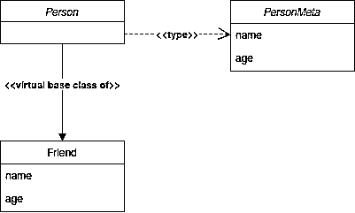

# 在 Python 中实现接口

> 原文：<https://realpython.com/python-interface/>

接口在软件工程中起着重要的作用。随着应用程序的增长，对代码库的更新和更改变得更加难以管理。通常情况下，您最终会得到看起来非常相似但不相关的类，这可能会导致一些混淆。在本教程中，您将看到如何使用一个 **Python 接口**来帮助确定应该使用什么类来解决当前的问题。

**在本教程中，你将能够:**

*   **了解**接口如何工作以及 Python 接口创建的注意事项
*   理解在像 Python 这样的动态语言中接口是多么有用
*   实现一个非正式的 Python 接口
*   **使用** `abc.ABCMeta`和`@abc.abstractmethod`实现一个正式的 Python 接口

Python 中的接口处理方式不同于大多数其他语言，它们的设计复杂度也各不相同。在本教程结束时，您将对 Python 数据模型的某些方面有更好的理解，以及 Python 中的接口与 Java、C++和 Go 等语言中的接口的比较。

**免费奖励:** [掌握 Python 的 5 个想法](https://realpython.com/bonus/python-mastery-course/)，这是一个面向 Python 开发者的免费课程，向您展示将 Python 技能提升到下一个水平所需的路线图和心态。

## Python 接口概述

在高层次上，接口充当设计类的**蓝图**。像类一样，接口定义方法。与类不同，这些方法是抽象的。一个**抽象方法**是接口简单定义的方法。它没有实现这些方法。这是由类来完成的，然后**实现**接口，并赋予接口的抽象方法具体的含义。

与像 [Java](https://realpython.com/oop-in-python-vs-java/) 、Go 和 [C++](https://realpython.com/python-vs-cpp/) 这样的语言相比，Python 的界面设计方法有些不同。这些语言都有一个`interface`关键字，而 Python 没有。Python 在另一个方面进一步偏离了其他语言。它不需要实现接口的类来定义接口的所有抽象方法。

[*Remove ads*](/account/join/)

## 非正式接口

在某些情况下，您可能不需要正式 Python 接口的严格规则。Python 的动态特性允许你实现一个**非正式接口**。非正式的 Python 接口是一个定义了可以被覆盖的方法的类，但是没有严格的执行。

在下面的例子中，您将从一个[数据工程师](https://realpython.com/python-data-engineer/)的角度出发，他需要从各种不同的非结构化文件类型中提取文本，比如 pdf 和电子邮件。您将创建一个非正式的接口，它定义了在`PdfParser`和`EmlParser`具体类中的方法:

```py
class InformalParserInterface:
    def load_data_source(self, path: str, file_name: str) -> str:
        """Load in the file for extracting text."""
        pass

    def extract_text(self, full_file_name: str) -> dict:
        """Extract text from the currently loaded file."""
        pass
```

`InformalParserInterface`定义了两种方法`.load_data_source()`和`.extract_text()`。这些方法已定义但未实现。一旦你创建了从`InformalParserInterface`继承的**具体类**，这个实现就会发生。

如您所见，`InformalParserInterface`看起来和标准 Python 类一样。你依靠[鸭打字](https://realpython.com/lessons/duck-typing/)来通知用户这是一个接口，应该相应地使用。

**注:**没听说过**鸭打字**？这个术语说，如果你有一个看起来像鸭子，走路像鸭子，叫声像鸭子的物体，那么它一定是鸭子！要了解更多，请查看[鸭子打字](https://realpython.com/lessons/duck-typing/)。

记住 duck 类型，定义两个实现`InformalParserInterface`的类。要使用您的接口，您必须创建一个具体的类。一个**具体类**是接口的子类，提供接口方法的实现。您将创建两个具体的类来实现您的接口。第一个是`PdfParser`，您将使用它来解析来自 [PDF](https://realpython.com/creating-modifying-pdf/) 文件的文本:

```py
class PdfParser(InformalParserInterface):
    """Extract text from a PDF"""
    def load_data_source(self, path: str, file_name: str) -> str:
        """Overrides InformalParserInterface.load_data_source()"""
        pass

    def extract_text(self, full_file_path: str) -> dict:
        """Overrides InformalParserInterface.extract_text()"""
        pass
```

`InformalParserInterface`的具体实现现在允许你从 [PDF](https://realpython.com/pdf-python/) 文件中提取文本。

第二个具体的类是`EmlParser`，您将使用它来解析来自电子邮件的文本:

```py
class EmlParser(InformalParserInterface):
    """Extract text from an email"""
    def load_data_source(self, path: str, file_name: str) -> str:
        """Overrides InformalParserInterface.load_data_source()"""
        pass

    def extract_text_from_email(self, full_file_path: str) -> dict:
        """A method defined only in EmlParser.
 Does not override InformalParserInterface.extract_text()
 """
        pass
```

`InformalParserInterface`的具体实现现在允许你从电子邮件文件中提取文本。

到目前为止，您已经定义了`InformalPythonInterface`的两个**具体实现**。然而，请注意`EmlParser`未能正确定义`.extract_text()`。如果您要检查`EmlParser`是否实现了`InformalParserInterface`，那么您会得到以下结果:

>>>

```py
>>> # Check if both PdfParser and EmlParser implement InformalParserInterface
>>> issubclass(PdfParser, InformalParserInterface)
True

>>> issubclass(EmlParser, InformalParserInterface)
True
```

这将返回`True`，这造成了一点问题，因为它违反了接口的定义！

现在检查`PdfParser`和`EmlParser`的**方法解析顺序(MRO)** 。这将告诉您正在讨论的类的超类，以及它们在执行方法时被搜索的顺序。你可以通过使用邓德方法`cls.__mro__`来查看一个类的 MRO:

>>>

```py
>>> PdfParser.__mro__
(__main__.PdfParser, __main__.InformalParserInterface, object)

>>> EmlParser.__mro__
(__main__.EmlParser, __main__.InformalParserInterface, object)
```

这种非正式的接口对于只有少数开发人员开发源代码的小项目来说很好。然而，随着项目越来越大，团队越来越多，这可能导致开发人员花费无数时间在代码库中寻找难以发现的逻辑错误！

### 使用元类

理想情况下，当实现类没有定义接口的所有抽象方法时，您会希望`issubclass(EmlParser, InformalParserInterface)`返回`False`。为此，您将创建一个名为`ParserMeta`的[元类](https://realpython.com/python-metaclasses/)。您将覆盖两个 [dunder](https://dbader.org/blog/python-dunder-methods) 方法:

1.  `.__instancecheck__()`
2.  `.__subclasscheck__()`

在下面的代码块中，您创建了一个名为`UpdatedInformalParserInterface`的类，它从`ParserMeta`元类构建而来:

```py
class ParserMeta(type):
    """A Parser metaclass that will be used for parser class creation.
 """
    def __instancecheck__(cls, instance):
        return cls.__subclasscheck__(type(instance))

    def __subclasscheck__(cls, subclass):
        return (hasattr(subclass, 'load_data_source') and 
                callable(subclass.load_data_source) and 
                hasattr(subclass, 'extract_text') and 
                callable(subclass.extract_text))

class UpdatedInformalParserInterface(metaclass=ParserMeta):
    """This interface is used for concrete classes to inherit from.
 There is no need to define the ParserMeta methods as any class
 as they are implicitly made available via .__subclasscheck__().
 """
    pass
```

现在已经创建了`ParserMeta`和`UpdatedInformalParserInterface`，您可以创建您的具体实现了。

首先，创建一个名为`PdfParserNew`的解析 pdf 的新类:

```py
class PdfParserNew:
    """Extract text from a PDF."""
    def load_data_source(self, path: str, file_name: str) -> str:
        """Overrides UpdatedInformalParserInterface.load_data_source()"""
        pass

    def extract_text(self, full_file_path: str) -> dict:
        """Overrides UpdatedInformalParserInterface.extract_text()"""
        pass
```

这里，`PdfParserNew`覆盖了`.load_data_source()`和`.extract_text()`，所以`issubclass(PdfParserNew, UpdatedInformalParserInterface)`应该返回`True`。

在下一个代码块中，您有了一个名为`EmlParserNew`的电子邮件解析器的新实现:

```py
class EmlParserNew:
    """Extract text from an email."""
    def load_data_source(self, path: str, file_name: str) -> str:
        """Overrides UpdatedInformalParserInterface.load_data_source()"""
        pass

    def extract_text_from_email(self, full_file_path: str) -> dict:
        """A method defined only in EmlParser.
 Does not override UpdatedInformalParserInterface.extract_text()
 """
        pass
```

在这里，您有一个用于创建`UpdatedInformalParserInterface`的元类。通过使用元类，您不需要显式定义子类。相反，子类必须**定义所需的方法**。如果没有，那么`issubclass(EmlParserNew, UpdatedInformalParserInterface)`将返回`False`。

在您的具体类上运行`issubclass()`将产生以下结果:

>>>

```py
>>> issubclass(PdfParserNew, UpdatedInformalParserInterface)
True

>>> issubclass(EmlParserNew, UpdatedInformalParserInterface)
False
```

正如所料，`EmlParserNew`不是`UpdatedInformalParserInterface`的子类，因为`.extract_text()`没有在`EmlParserNew`中定义。

现在，让我们来看看 MRO:

>>>

```py
>>> PdfParserNew.__mro__
(<class '__main__.PdfParserNew'>, <class 'object'>)
```

如您所见，`UpdatedInformalParserInterface`是`PdfParserNew`的超类，但是它没有出现在 MRO 中。这种不寻常的行为是由于`UpdatedInformalParserInterface`是`PdfParserNew`的**虚拟基类**造成的。

[*Remove ads*](/account/join/)

### 使用虚拟基类

在前面的例子中，`issubclass(EmlParserNew, UpdatedInformalParserInterface)`返回了`True`，即使`UpdatedInformalParserInterface`没有出现在`EmlParserNew` MRO 中。那是因为`UpdatedInformalParserInterface`是`EmlParserNew`的一个**虚拟基类**。

这些子类和标准子类之间的关键区别在于，虚拟基类使用`.__subclasscheck__()` dunder 方法来隐式检查一个类是否是超类的虚拟子类。此外，虚拟基类不会出现在子类 MRO 中。

看一下这个代码块:

```py
class PersonMeta(type):
    """A person metaclass"""
    def __instancecheck__(cls, instance):
        return cls.__subclasscheck__(type(instance))

    def __subclasscheck__(cls, subclass):
        return (hasattr(subclass, 'name') and 
                callable(subclass.name) and 
                hasattr(subclass, 'age') and 
                callable(subclass.age))

class PersonSuper:
    """A person superclass"""
    def name(self) -> str:
        pass

    def age(self) -> int:
        pass

class Person(metaclass=PersonMeta):
    """Person interface built from PersonMeta metaclass."""
    pass
```

这里，您有了创建虚拟基类的设置:

1.  元类`PersonMeta`
2.  基类`PersonSuper`
3.  Python 接口`Person`

现在创建虚拟基类的设置已经完成，您将定义两个具体的类，`Employee`和`Friend`。`Employee`类继承自`PersonSuper`，而`Friend`隐式继承自`Person`:

```py
# Inheriting subclasses
class Employee(PersonSuper):
    """Inherits from PersonSuper
 PersonSuper will appear in Employee.__mro__
 """
    pass

class Friend:
    """Built implicitly from Person
 Friend is a virtual subclass of Person since
 both required methods exist.
 Person not in Friend.__mro__
 """
    def name(self):
        pass

    def age(self):
        pass
```

虽然`Friend`没有显式继承`Person`，但是它实现了`.name()`和`.age()`，所以`Person`成为了`Friend`的**虚拟基类**。当你运行`issubclass(Friend, Person)`时，它应该返回`True`，这意味着`Friend`是`Person`的子类。

下面的 [**UML**](https://realpython.com/inheritance-composition-python/#whats-inheritance) 图显示了当您在`Friend`类上调用`issubclass()`时会发生什么:

[](https://files.realpython.com/media/virtual-base-class.b545144aafef.png)

看一看`PersonMeta`，您会注意到还有另一个名为`.__instancecheck__()`的 dunder 方法。该方法用于检查是否从`Person`接口创建了`Friend`的实例。当你使用`isinstance(Friend, Person)`时，你的代码将调用`.__instancecheck__()`。

## 正式接口

非正式接口对于代码基数小、程序员数量有限的项目非常有用。然而，非正式接口对于大型应用程序来说是错误的。为了创建一个**正式的 Python 接口**，你将需要 Python 的`abc`模块中的一些工具。

### 使用`abc.ABCMeta`

为了强制抽象方法的子类实例化，您将利用 Python 的内置模块 [`abc`](https://docs.python.org/3/library/abc.html) 中的`ABCMeta`。回到您的`UpdatedInformalParserInterface`接口，您创建了自己的元类`ParserMeta`，用被覆盖的 dunder 方法`.__instancecheck__()`和`.__subclasscheck__()`。

您将使用`abc.ABCMeta`作为元类，而不是创建自己的元类。然后，您将覆盖`.__subclasshook__()`来代替`.__instancecheck__()`和`.__subclasscheck__()`，因为它创建了这些 dunder 方法的更可靠的实现。

### 使用`.__subclasshook__()`

下面是使用`abc.ABCMeta`作为元类的`FormalParserInterface`的实现:

```py
import abc

class FormalParserInterface(metaclass=abc.ABCMeta):
    @classmethod
    def __subclasshook__(cls, subclass):
        return (hasattr(subclass, 'load_data_source') and 
                callable(subclass.load_data_source) and 
                hasattr(subclass, 'extract_text') and 
                callable(subclass.extract_text))

class PdfParserNew:
    """Extract text from a PDF."""
    def load_data_source(self, path: str, file_name: str) -> str:
        """Overrides FormalParserInterface.load_data_source()"""
        pass

    def extract_text(self, full_file_path: str) -> dict:
        """Overrides FormalParserInterface.extract_text()"""
        pass

class EmlParserNew:
    """Extract text from an email."""
    def load_data_source(self, path: str, file_name: str) -> str:
        """Overrides FormalParserInterface.load_data_source()"""
        pass

    def extract_text_from_email(self, full_file_path: str) -> dict:
        """A method defined only in EmlParser.
 Does not override FormalParserInterface.extract_text()
 """
        pass
```

如果在`PdfParserNew`和`EmlParserNew`上运行`issubclass()`，那么`issubclass()`将分别返回`True`和`False`。

[*Remove ads*](/account/join/)

### 使用`abc`注册一个虚拟子类

一旦导入了`abc`模块，就可以通过使用`.register()`元方法直接**注册一个虚拟子类**。在下一个例子中，您将接口`Double`注册为内置`__float__`类的虚拟基类:

```py
class Double(metaclass=abc.ABCMeta):
    """Double precision floating point number."""
    pass

Double.register(float)
```

你可以看看使用`.register()`的效果:

>>>

```py
>>> issubclass(float, Double)
True

>>> isinstance(1.2345, Double)
True
```

通过使用`.register()`元方法，您已经成功地将`Double`注册为`float`的虚拟子类。

一旦你注册了`Double`，你就可以用它作为类[装饰器](https://realpython.com/courses/python-decorators-101/)来将装饰类设置为虚拟子类:

```py
@Double.register
class Double64:
    """A 64-bit double-precision floating-point number."""
    pass

print(issubclass(Double64, Double))  # True
```

decorator register 方法帮助您创建自定义虚拟类继承的层次结构。

### 通过注册使用子类检测

当你组合`.__subclasshook__()`和`.register()`时，你必须小心，因为`.__subclasshook__()`优先于虚拟子类注册。为了确保注册的虚拟子类被考虑在内，您必须将`NotImplemented`添加到`.__subclasshook__()` dunder 方法中。`FormalParserInterface`将更新为以下内容:

```py
class FormalParserInterface(metaclass=abc.ABCMeta):
    @classmethod
    def __subclasshook__(cls, subclass):
        return (hasattr(subclass, 'load_data_source') and 
                callable(subclass.load_data_source) and 
                hasattr(subclass, 'extract_text') and 
                callable(subclass.extract_text) or 
                NotImplemented)

class PdfParserNew:
    """Extract text from a PDF."""
    def load_data_source(self, path: str, file_name: str) -> str:
        """Overrides FormalParserInterface.load_data_source()"""
        pass

    def extract_text(self, full_file_path: str) -> dict:
        """Overrides FormalParserInterface.extract_text()"""
        pass

@FormalParserInterface.register
class EmlParserNew:
    """Extract text from an email."""
    def load_data_source(self, path: str, file_name: str) -> str:
        """Overrides FormalParserInterface.load_data_source()"""
        pass

    def extract_text_from_email(self, full_file_path: str) -> dict:
        """A method defined only in EmlParser.
 Does not override FormalParserInterface.extract_text()
 """
        pass

print(issubclass(PdfParserNew, FormalParserInterface))  # True
print(issubclass(EmlParserNew, FormalParserInterface))  # True
```

因为您已经使用了注册，所以您可以看到`EmlParserNew`被视为`FormalParserInterface`接口的虚拟子类。这不是你想要的，因为`EmlParserNew`不会覆盖`.extract_text()`。**请谨慎注册虚拟子类！**

### 使用抽象方法声明

**抽象方法**是由 Python 接口声明的方法，但它可能没有有用的实现。抽象方法必须由实现相关接口的具体类重写。

要在 Python 中创建抽象方法，需要在接口的方法中添加`@abc.abstractmethod` decorator。在下一个例子中，您更新了`FormalParserInterface`以包含抽象方法`.load_data_source()`和`.extract_text()`:

```py
class FormalParserInterface(metaclass=abc.ABCMeta):
    @classmethod
    def __subclasshook__(cls, subclass):
        return (hasattr(subclass, 'load_data_source') and 
                callable(subclass.load_data_source) and 
                hasattr(subclass, 'extract_text') and 
                callable(subclass.extract_text) or 
                NotImplemented)

    @abc.abstractmethod
    def load_data_source(self, path: str, file_name: str):
        """Load in the data set"""
        raise NotImplementedError

    @abc.abstractmethod
    def extract_text(self, full_file_path: str):
        """Extract text from the data set"""
        raise NotImplementedError

class PdfParserNew(FormalParserInterface):
    """Extract text from a PDF."""
    def load_data_source(self, path: str, file_name: str) -> str:
        """Overrides FormalParserInterface.load_data_source()"""
        pass

    def extract_text(self, full_file_path: str) -> dict:
        """Overrides FormalParserInterface.extract_text()"""
        pass

class EmlParserNew(FormalParserInterface):
    """Extract text from an email."""
    def load_data_source(self, path: str, file_name: str) -> str:
        """Overrides FormalParserInterface.load_data_source()"""
        pass

    def extract_text_from_email(self, full_file_path: str) -> dict:
        """A method defined only in EmlParser.
 Does not override FormalParserInterface.extract_text()
 """
        pass
```

在上面的例子中，您最终创建了一个正式的接口，当抽象方法没有被覆盖时，它会引发错误。因为`PdfParserNew`正确地覆盖了`FormalParserInterface`抽象方法，所以`PdfParserNew`实例`pdf_parser`不会引发任何错误。但是，`EmlParserNew`会引发一个错误:

>>>

```py
>>> pdf_parser = PdfParserNew()
>>> eml_parser = EmlParserNew()
Traceback (most recent call last):
  File "real_python_interfaces.py", line 53, in <module>
    eml_interface = EmlParserNew()
TypeError: Can't instantiate abstract class EmlParserNew with abstract methods extract_text
```

如您所见， [traceback](https://realpython.com/python-traceback/) 消息告诉您还没有覆盖所有的抽象方法。这是您在构建正式 Python 接口时所期望的行为。

[*Remove ads*](/account/join/)

## 其他语言界面

接口出现在许多编程语言中，并且它们的实现因语言而异。在接下来的几节中，您将比较 Python 与 Java、C++和 Go 中的接口。

### Java

与 Python 不同， [Java](https://realpython.com/oop-in-python-vs-java/) 包含一个`interface`关键字。按照文件解析器的例子，用 Java 声明一个接口，如下所示:

```py
public  interface FileParserInterface  { // Static fields, and abstract methods go here ... public  void  loadDataSource(); public  void  extractText(); }
```

现在您将创建两个具体的类，`PdfParser`和`EmlParser`，来实现`FileParserInterface`。为此，您必须在类定义中使用`implements`关键字，如下所示:

```py
public  class EmlParser  implements  FileParserInterface  { public  void  loadDataSource()  { // Code to load the data set } public  void  extractText()  { // Code to extract the text } }
```

继续您的文件解析示例，一个全功能的 Java 接口应该是这样的:

```py
import  java.util.*; import  java.io.*; public  class FileParser  { public  static  void  main(String[]  args)  throws  IOException  { // The main entry point } public  interface FileParserInterface  { HashMap<String,  ArrayList<String>>  file_contents  =  null; public  void  loadDataSource(); public  void  extractText(); } public  class PdfParser  implements  FileParserInterface  { public  void  loadDataSource()  { // Code to load the data set } public  void  extractText()  { // Code to extract the text } } public  class EmlParser  implements  FileParserInterface  { public  void  loadDataSource()  { // Code to load the data set } public  void  extractText()  { // Code to extract the text } } }
```

如您所见，Python 接口在创建过程中比 Java 接口提供了更多的灵活性。

### C++

像 Python 一样，C++使用抽象基类来创建接口。在 C++中定义接口时，使用关键字`virtual`来描述应该在具体类中覆盖的方法:

```py
class  FileParserInterface  { public: virtual  void  loadDataSource(std::string  path,  std::string  file_name); virtual  void  extractText(std::string  full_file_name); };
```

当您想要实现接口时，您将给出具体的类名，后跟一个冒号(`:`)，然后是接口的名称。下面的示例演示了 C++接口的实现:

```py
class  PdfParser  :  FileParserInterface  { public: void  loadDataSource(std::string  path,  std::string  file_name); void  extractText(std::string  full_file_name); }; class  EmlParser  :  FileParserInterface  { public: void  loadDataSource(std::string  path,  std::string  file_name); void  extractText(std::string  full_file_name); };
```

Python 接口和 C++接口有一些相似之处，因为它们都利用抽象基类来模拟接口。

### 转到

虽然 Go 的语法让人想起 Python，但是 Go 编程语言包含了一个`interface`关键字，就像 Java 一样。让我们在 Go 中创建`fileParserInterface`:

```py
type  fileParserInterface  interface  { loadDataSet(path  string,  filename  string) extractText(full_file_path  string) }
```

Python 和 Go 的一个很大的区别就是 Go 没有类。更确切地说，Go 类似于 [C](https://realpython.com/build-python-c-extension-module/) ，因为它使用`struct`关键字来创建结构。一个**结构**类似于一个类，因为一个结构包含数据和方法。然而，与类不同的是，所有的数据和方法都是公开访问的。Go 中的具体结构将用于实现`fileParserInterface`。

下面是 Go 如何使用接口的一个例子:

```py
package  main type  fileParserInterface  interface  { loadDataSet(path  string,  filename  string) extractText(full_file_path  string) } type  pdfParser  struct  { // Data goes here ... } type  emlParser  struct  { // Data goes here ... } func  (p  pdfParser)  loadDataSet()  { // Method definition ... } func  (p  pdfParser)  extractText()  { // Method definition ... } func  (e  emlParser)  loadDataSet()  { // Method definition ... } func  (e  emlParser)  extractText()  { // Method definition ... } func  main()  { // Main entrypoint }
```

与 Python 接口不同，Go 接口是使用 structs 和显式关键字`interface`创建的。

[*Remove ads*](/account/join/)

## 结论

当你创建接口时，Python 提供了很大的灵活性。非正式的 Python 接口对于小型项目非常有用，在这些项目中，您不太可能对方法的返回类型感到困惑。随着项目的增长，对正式 Python 接口的需求变得更加重要，因为推断返回类型变得更加困难。这确保了实现接口的具体类覆盖了抽象方法。

**现在你可以:**

*   理解**接口如何工作**以及创建 Python 接口的注意事项
*   理解像 Python 这样的动态语言中接口的**用途**
*   用 Python 实现正式和非正式的接口
*   **将 Python 接口**与 Java、C++和 Go 等语言中的接口进行比较

既然您已经熟悉了如何创建 Python 接口，那么在您的下一个项目中添加一个 Python 接口来看看它的实际用途吧！*****