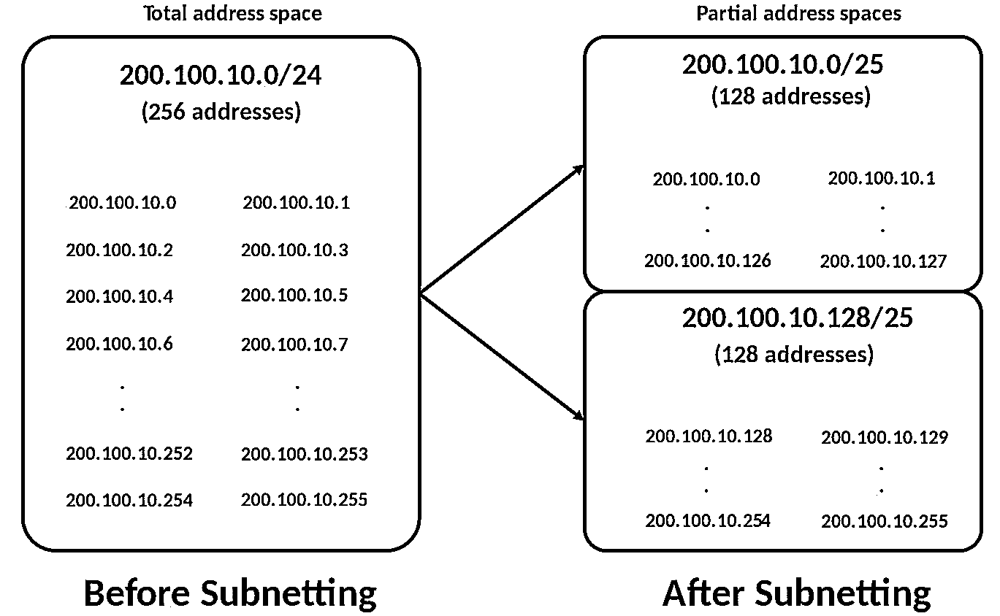
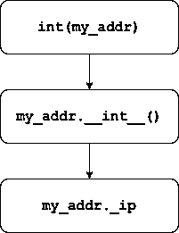

# 通过 Python 的 IP Address 模块学习 IP 地址概念

> 原文：<https://realpython.com/python-ipaddress-module/>

Python 的 [`ipaddress`](https://docs.python.org/3/library/ipaddress.html) 模块是 Python 标准库中一颗不被看好的宝石。你不必是一个成熟的网络工程师，也可以在野外接触到 IP 地址。 **IP 地址**和**网络**在软件开发和基础设施中无处不在。它们是计算机如何相互寻址的基础。

边做边学是掌握 IP 地址的有效方法。通过将 IP 地址作为 Python 对象来查看和操作，`ipaddress`模块允许您这样做。在本教程中，您将通过使用 Python 的`ipaddress`模块的一些特性来更好地掌握 IP 地址。

在本教程中，您将学习:

*   IP 地址在理论上和 Python 代码中是如何工作的
*   IP 网络如何表示 IP 地址组，以及如何检查两者之间的关系
*   Python 的 **`ipaddress`模块**如何巧妙运用经典设计模式让你事半功倍

要跟进，您只需要 Python 3.3 或更高版本，因为在那个版本中`ipaddress`被添加到了 Python 标准库中。本教程中的例子是使用 [Python 3.8](https://realpython.com/python38-new-features/) 生成的。

**免费下载:** [从 CPython Internals:您的 Python 3 解释器指南](https://realpython.com/bonus/cpython-internals-sample/)获得一个示例章节，向您展示如何解锁 Python 语言的内部工作机制，从源代码编译 Python 解释器，并参与 CPython 的开发。

## 理论和实践中的 IP 地址

如果你只记得一个关于 IP 地址的概念，那么记住这个:*IP 地址是一个整数。*这条信息将帮助您更好地理解 IP 地址的功能以及如何将它们表示为 Python 对象。

在开始编写任何 Python 代码之前，看看这个概念在数学上是如何具体化的会很有帮助。如果你在这里只是为了一些如何使用`ipaddress`模块的例子，那么你可以跳到[下一节](#the-python-ipaddress-module)，关于使用模块本身。

[*Remove ads*](/account/join/)

### IP 地址的机制

你在上面看到 IP 地址可以归结为一个整数。更全面的定义是, **IPv4 地址**是一个 32 位整数，用于表示网络上的主机。术语**主机**有时用作地址的同义词。

由此得出有 2 个 <sup>32</sup> 可能的 IPv4 地址，从 0 到 4，294，967，295(其中上限为 2 <sup>32</sup> - 1)。但这是给人类的教程，不是给机器人的。没人想 ping IP 地址`0xdc0e0925`。

更常见的表示 IPv4 地址的方式是使用**四点符号**，它由四个点分隔的十进制整数组成:

```py
220.14.9.37
```

不过，地址`220.14.9.37`代表什么样的底层整数并不明显。按照公式，您可以将 IP 地址`220.14.9.37`分成四个**八位字节**组成部分:

>>>

```py
>>> (
...     220 * (256 ** 3) +
...      14 * (256 ** 2) +
...       9 * (256 ** 1) +
...      37 * (256 ** 0)
... )
3691907365
```

如上图，地址`220.14.9.37`代表整数 3，691，907，365。每个八位字节是一个[字节](https://realpython.com/python-encodings-guide/#we-need-more-bits)，或者是一个从 0 到 255 的数字。考虑到这一点，您可以推断出最大的 IPv4 地址是`255.255.255.255`(或者十六进制的`FF.FF.FF.FF`)，而最小的是`0.0.0.0`。

接下来，您将看到 Python 的`ipaddress`模块如何为您进行这种计算，允许您使用人类可读的形式，并让地址运算在看不见的地方发生。

### Python `ipaddress`模块

要继续操作，您可以在命令行中获取计算机的外部 IP 地址:

```py
$ curl -sS ifconfig.me/ip
220.14.9.37
```

这将从站点 [ifconfig.me](https://ifconfig.me/) 请求您的 IP 地址，该地址可用于显示有关您的连接和网络的一系列详细信息。

**注意**:出于技术正确性的考虑，这很可能不是你电脑自己的公共 IP 地址。如果你的连接位于一个[终端](https://en.wikipedia.org/wiki/Network_address_translation)路由器之后，那么最好把它看作一个“代理”IP，通过它你可以到达互联网。

现在打开一个 Python REPL。您可以使用`IPv4Address`类来构建封装地址的 Python 对象:

>>>

```py
>>> from ipaddress import IPv4Address

>>> addr = IPv4Address("220.14.9.37")
>>> addr
IPv4Address('220.14.9.37')
```

向`IPv4Address`构造函数传递一个像`"220.14.9.37"`这样的`str`是最常见的方法。但是，该类也可以接受其他类型:

>>>

```py
>>> IPv4Address(3691907365)  # From an int
IPv4Address('220.14.9.37')

>>> IPv4Address(b"\xdc\x0e\t%")  # From bytes (packed form)
IPv4Address('220.14.9.37')
```

虽然从人类可读的`str`开始构建可能是更常见的方式，但是如果您使用类似于 [TCP 包数据](https://en.wikipedia.org/wiki/Transmission_Control_Protocol#TCP_segment_structure)的东西，您可能会看到`bytes`输入。

上述转换在其他方向也是可能的:

>>>

```py
>>> int(addr)
3691907365
>>> addr.packed
b'\xdc\x0e\t%'
```

除了允许不同 Python 类型的往返输入和输出，`IPv4Address`的实例也是**可散列的**。这意味着您可以将它们用作映射数据类型中的键，例如[字典](https://realpython.com/python-dicts/):

>>>

```py
>>> hash(IPv4Address("220.14.9.37"))
4035855712965130587

>>> num_connections = {
...     IPv4Address("220.14.9.37"): 2,
...     IPv4Address("100.201.0.4"): 16,
...     IPv4Address("8.240.12.2"): 4,
... }
```

最重要的是，`IPv4Address`还实现了[方法](https://docs.python.org/3.8/library/functools.html#functools.total_ordering)，允许使用底层整数进行比较:

>>>

```py
>>> IPv4Address("220.14.9.37") > IPv4Address("8.240.12.2")
True

>>> addrs = (
...     IPv4Address("220.14.9.37"),
...     IPv4Address("8.240.12.2"),
...     IPv4Address("100.201.0.4"),
... )
>>> for a in sorted(addrs):
...     print(a)
...
8.240.12.2
100.201.0.4
220.14.9.37
```

您可以使用任何标准的[比较运算符](https://realpython.com/python-operators-expressions/#comparison-operators)来比较地址对象的整数值。

**注**:本教程重点介绍互联网协议第 4 版(IPv4)地址。还有 IPv6 地址，是 128 位而不是 32 位，用`2001:0:3238:dfe1:63::fefb`之类更 headier 的形式表示。因为地址的算法基本相同，所以本教程从等式中去掉一个变量，集中讨论 IPv4 地址。

`ipaddress`模块具有更灵活的[工厂函数](https://realpython.com/factory-method-python/)、 [`ip_address()`](https://docs.python.org/library/ipaddress.html#ipaddress.ip_address) ，它接受代表 IPv4 或 IPv6 地址的参数，并尽最大努力分别返回`IPv4Address`或`IPv6Address`实例。

在本教程中，您将切入正题，直接用`IPv4Address`构建地址对象。

正如你在上面看到的，`IPv4Address`的构造函数本身是简短的。当你开始把地址组合成组或网络时，事情就变得更有趣了。

[*Remove ads*](/account/join/)

## IP 网络和接口

一个**网络**是一组 IP 地址。网络被描述和显示为连续的地址范围。例如，网络可以由地址`192.4.2.0`到`192.4.2.255`组成，一个包含 256 个地址的网络。

您可以通过 IP 地址的上限和下限来识别网络，但是如何用更简洁的约定来显示呢？这就是 CIDR 记谱法的由来。

### CIDR 符号

使用**网络地址**加上 [**无类域间路由(CIDR)符号**](https://en.wikipedia.org/wiki/Classless_Inter-Domain_Routing#CIDR_notation) 中的**前缀**来定义网络:

>>>

```py
>>> from ipaddress import IPv4Network
>>> net = IPv4Network("192.4.2.0/24")
>>> net.num_addresses
256
```

CIDR 符号将网络表示为`<network_address>/<prefix>`。**路由前缀**(或**前缀长度**，或仅仅是**前缀**)，在这种情况下是 24，是用于回答诸如某个地址是否是网络的一部分或网络中有多少地址等问题的前导位计数。(此处**前导位**是指二进制中从整数左边数起的第一个 *N* 位。)

您可以使用`.prefixlen`属性找到路由前缀:

>>>

```py
>>> net.prefixlen
24
```

让我们直接看一个例子。地址`192.4.2.12`是否在网络`192.4.2.0/24`中？这种情况下的答案是肯定的，因为`192.4.2.12`的前 24 位是前三个八位字节(`192.4.2`)。有了`/24`前缀，你可以简单地砍掉最后一个八位字节，然后看到`192.4.2.xxx`部分匹配。

如图所示，`/24`前缀被翻译成**网络掩码**，顾名思义，它被用来屏蔽被比较地址中的[位](https://wiki.python.org/moin/BitwiseOperators):

>>>

```py
>>> net.netmask
IPv4Address('255.255.255.0')
```

您比较**前导位**来确定一个地址是否是网络的一部分。如果前导位匹配，则该地址是网络的一部分:

```py
11000000 00000100 00000010 00001100  # 192.4.2.12  # Host IP address
11000000 00000100 00000010 00000000  # 192.4.2.0   # Network address
                          |
                          ^ 24th bit (stop here!)
|_________________________|
            |
      These bits match
```

以上，`192.4.2.12`的最后 8 位被屏蔽(用`0`)，在比较中被忽略。Python 的`ipaddress`再一次为您节省了数学体操，并支持惯用的成员测试:

>>>

```py
>>> net = IPv4Network("192.4.2.0/24")

>>> IPv4Address("192.4.2.12") in net
True
>>> IPv4Address("192.4.20.2") in net
False
```

这是通过[操作符重载](https://realpython.com/operator-function-overloading/)来实现的，其中`IPv4Network`定义了`__contains__()`来允许使用`in`操作符进行成员测试。

在 CIDR 符号`192.4.2.0/24`中，`192.4.2.0`部分是**网络地址**，用于标识网络:

>>>

```py
>>> net.network_address
IPv4Address('192.4.2.0')
```

正如您在上面看到的，当对主机 IP 地址应用掩码时，网络地址`192.4.2.0`可以被视为预期的结果:

```py
11000000 00000100 00000010 00001100  # Host IP address
11111111 11111111 11111111 00000000  # Netmask, 255.255.255.0 or /24
11000000 00000100 00000010 00000000  # Result (compared to network address)
```

当你这样想的时候，你可以看到前缀`/24`实际上是如何翻译成真正的`IPv4Address`:

>>>

```py
>>> net.prefixlen
24
>>> net.netmask
IPv4Address('255.255.255.0')  # 11111111 11111111 11111111 00000000
```

事实上，如果您感兴趣，您可以直接从两个地址构造一个`IPv4Network`:

>>>

```py
>>> IPv4Network("192.4.2.0/255.255.255.0")
IPv4Network('192.4.2.0/24')
```

上图中，`192.4.2.0`是网络地址，而`255.255.255.0`是网络掩码。

网络中的另一端是其最终地址，或称 [**广播地址**](https://en.wikipedia.org/wiki/Broadcast_address) ，它是一个可用于与其网络中所有主机通信的单一地址:

>>>

```py
>>> net.broadcast_address
IPv4Address('192.4.2.255')
```

关于网络掩码，还有一点值得一提。您最常看到的前缀长度是 8 的倍数:

| 前缀长度 | 地址数量 | 网络掩码 |
| --- | --- | --- |
| eight | Sixteen million seven hundred and seventy-seven thousand two hundred and sixteen | `255.0.0.0` |
| Sixteen | Sixty-five thousand five hundred and thirty-six | `255.255.0.0` |
| Twenty-four | Two hundred and fifty-six | `255.255.255.0` |
| Thirty-two | one | `255.255.255.255` |

但是，0 到 32 之间的任何整数都是有效的，尽管不太常见:

>>>

```py
>>> net = IPv4Network("100.64.0.0/10")
>>> net.num_addresses
4194304
>>> net.netmask
IPv4Address('255.192.0.0')
```

在这一节中，您看到了如何构建一个`IPv4Network`实例，并测试其中是否有某个 IP 地址。在下一节中，您将学习如何在网络中循环访问地址。

[*Remove ads*](/account/join/)

### 通过网络循环

`IPv4Network`类支持迭代，这意味着您可以在一个 [`for`循环](https://realpython.com/python-for-loop/)中迭代它的单个地址:

>>>

```py
>>> net = IPv4Network("192.4.2.0/28")
>>> for addr in net:
...     print(addr)
...
192.4.2.0
192.4.2.1
192.4.2.2
...
192.4.2.13
192.4.2.14
192.4.2.15
```

类似地，`net.hosts()`返回一个[生成器](https://realpython.com/introduction-to-python-generators/)，它将产生上面显示的地址，不包括网络和广播地址:

>>>

```py
>>> h = net.hosts()
>>> type(h)
<class 'generator'>
>>> next(h)
IPv4Address('192.4.2.1')
>>> next(h)
IPv4Address('192.4.2.2')
```

在下一节中，您将深入了解一个与网络密切相关的概念:子网。

### 子网

**子网**是 IP 网络的[细分:](https://en.wikipedia.org/wiki/Subnetwork)

>>>

```py
>>> small_net = IPv4Network("192.0.2.0/28")
>>> big_net = IPv4Network("192.0.0.0/16")
>>> small_net.subnet_of(big_net)
True
>>> big_net.supernet_of(small_net)
True
```

以上，`small_net`只包含 16 个地址，足够你和你身边的几个小隔间使用。相反，`big_net`包含 65，536 个地址。

实现子网划分的常见方法是将网络的前缀长度增加 1。让我们举一个维基百科的例子:

[](https://files.realpython.com/media/Screen_Shot_2020-06-15_at_4.57.04_PM.b5e67956e422.jpg)

<figcaption class="figure-caption text-center">IPv4 Network Subnetting ([Image source](https://en.wikipedia.org/wiki/Subnetwork#/media/File:Subnetting_Concept.svg))</figcaption>

这个例子从一个`/24`网络开始:

```py
net = IPv4Network("200.100.10.0/24")
```

通过将前缀长度从 24 增加到 25 来划分子网，需要移动位来将网络分成更小的部分。这在数学上有点复杂。幸运的是，`IPv4Network`使它变得很容易，因为`.subnets()`在子网上返回一个迭代器:

>>>

```py
>>> for sn in net.subnets():
...     print(sn)
...
200.100.10.0/25
200.100.10.128/25
```

你也可以告诉`.subnets()`新的前缀应该是什么。更高的前缀意味着更多更小的子网:

>>>

```py
>>> for sn in net.subnets(new_prefix=28):
...     print(sn)
...
200.100.10.0/28
200.100.10.16/28
200.100.10.32/28
...
200.100.10.208/28
200.100.10.224/28
200.100.10.240/28
```

除了地址和网络，接下来您将看到`ipaddress`模块的第三个核心部分。

### 主机接口

最后但同样重要的是，Python 的`ipaddress`模块导出了一个用于表示主机接口的`IPv4Interface`类。**主机接口**是一种以简洁的形式描述主机 IP 地址及其所在网络的方式:

>>>

```py
>>> from ipaddress import IPv4Interface

>>> ifc = IPv4Interface("192.168.1.6/24")
>>> ifc.ip  # The host IP address
IPv4Address('192.168.1.6')
>>> ifc.network  # Network in which the host IP resides
IPv4Network('192.168.1.0/24')
```

以上，`192.168.1.6/24`表示“网络`192.168.1.0/24`中的 IP 地址`192.168.1.6`

**注**:在计算机网络环境中，*接口*也可以指**网络接口**，最常见的是网络接口卡(NIC)。如果您曾经使用过 [`ifconfig`](https://linux.die.net/man/8/ifconfig) 工具(*nix)或 [`ipconfig`](https://docs.microsoft.com/en-us/windows-server/administration/windows-commands/ipconfig) (Windows)，那么您可能会知道您的工具的名称，如`eth0`、`en0`或`ens3`。这两种类型的接口是不相关的。

换句话说，IP 地址本身并不能告诉你该地址位于哪个(哪些)网络中，网络地址是一组 IP 地址而不是单个地址。`IPv4Interface`提供了一种通过 CIDR 符号同时表示单个主机 IP 地址及其网络的方法。

[*Remove ads*](/account/join/)

## 特殊地址范围

既然您已经对 IP 地址和网络有了大致的了解，那么知道并非所有的 IP 地址都是平等的(有些是特殊的)也很重要。

互联网数字地址分配机构(IANA)与互联网工程任务组(IETF)共同监督不同**地址范围**的分配。IANA 的 [IPv4 专用地址注册中心](https://www.iana.org/assignments/iana-ipv4-special-registry/iana-ipv4-special-registry.xhtml)是一个非常重要的表，它规定了某些地址范围应该具有特殊的含义。

一个常见的例子是**私有**地址。专用 IP 地址用于网络上不需要连接到公共互联网的设备之间的内部通信。以下范围仅供私人使用:

| 范围 | 地址数量 | 网络地址 | 广播地址 |
| --- | --- | --- | --- |
| `10.0.0.0/8` | Sixteen million seven hundred and seventy-seven thousand two hundred and sixteen | `10.0.0.0` | `10.255.255.255` |
| `172.16.0.0/12` | One million forty-eight thousand five hundred and seventy-six | `172.16.0.0` | `172.31.255.255` |
| `192.168.0.0/16` | Sixty-five thousand five hundred and thirty-six | `192.168.0.0` | `192.168.255.255` |

一个随机选择的例子是`10.243.156.214`。那么，你怎么知道这个地址是私人的呢？您可以确认它落在`10.0.0.0/8`范围内:

>>>

```py
>>> IPv4Address("10.243.156.214") in IPv4Network("10.0.0.0/8")
True
```

第二种特殊地址类型是**链路本地**地址，它只能从给定的子网内到达。一个例子是[亚马逊时间同步服务](https://docs.aws.amazon.com/AWSEC2/latest/UserGuide/set-time.html)，它可用于链接本地 IP `169.254.169.123`上的 [AWS EC2](https://aws.amazon.com/ec2/features/) 实例。如果您的 EC2 实例位于一个**虚拟私有云** (VPC)，那么您不需要互联网连接来告诉您的实例现在是什么时间。块 169.254.0.0/16 保留给本地链路地址:

>>>

```py
>>> timesync_addr = IPv4Address("169.254.169.123")
>>> timesync_addr.is_link_local
True
```

从上面可以看出，确认`10.243.156.214`是私有地址的一种方法是测试它是否位于`10.0.0.0/8`范围内。但是 Python 的`ipaddress`模块也提供了一组[属性](https://docs.python.org/library/functions.html#property)，用于测试地址是否为特殊类型:

>>>

```py
>>> IPv4Address("10.243.156.214").is_private
True
>>> IPv4Address("127.0.0.1").is_loopback
True

>>> [i for i in dir(IPv4Address) if i.startswith("is_")]  # "is_X" properties
['is_global',
 'is_link_local',
 'is_loopback',
 'is_multicast',
 'is_private',
 'is_reserved',
 'is_unspecified']
```

关于`.is_private`有一点需要注意，它使用了比上表所示的三个 IANA 范围更广泛的私有网络定义。Python 的`ipaddress`模块还集成了其他分配给私有网络的地址:

*   **`0.0.0.0/8`** 用于[该网络上的该主机](https://docs.djangoproject.com/en/3.0/ref/django-admin/#runserver)
*   **`127.0.0.0/8`** 用于[环回地址](https://en.wikipedia.org/wiki/Localhost)。
*   如上所述， **`169.254.0.0/16`** 用于链路本地地址。
*   **`198.18.0.0/15`** 用于[基准测试](https://tools.ietf.org/html/rfc2544)网络的性能。

这不是一个[详尽的列表](https://www.iana.org/assignments/iana-ipv4-special-registry/iana-ipv4-special-registry.xhtml)，但它涵盖了最常见的情况。

## 引擎盖下的 Python `ipaddress`模块

除了其记录的 API 之外，`ipaddress`模块及其 [`IPv4Address`](https://github.com/python/cpython/blob/a669443dfb79fc6aca2544b885895814798db15b/Lib/ipaddress.py#L1213) 类的 [CPython 源代码提供了一些很好的见解，让你知道如何使用一个叫做**组合**的模式来为你自己的代码提供一个惯用的 API。](https://github.com/python/cpython/blob/master/Lib/ipaddress.py)

### 作文的核心作用

`ipaddress`模块利用了一种叫做**组合** 的[面向对象模式。它的`IPv4Address`类是一个**复合**，包装了一个普通的 Python 整数。毕竟，IP 地址基本上是整数。](https://realpython.com/inheritance-composition-python/)

**注意**:公平地说，`ipaddress`模块也使用了健康剂量的继承，主要是为了减少代码重复。

每个`IPv4Address`实例都有一个准私有的`._ip`属性，它本身就是一个`int`。该类的许多其他属性和方法都是由该属性的值驱动的:

>>>

```py
>>> addr = IPv4Address("220.14.9.37")
>>> addr._ip
3691907365
```

`._ip`属性实际上负责产生`int(addr)`。这个调用链是`int(my_addr)`调用`my_addr.__int__()`，而`IPv4Address`只实现为`my_addr._ip`:

[](https://files.realpython.com/media/Untitled_Diagram1.9e72b5a906b5.png)

如果你问 [CPython](https://realpython.com/cpython-source-code-guide/) 的开发者，他们可能会告诉你`._ip`是一个**实现细节**。虽然在 Python 中没有什么是真正私有的，但是前导下划线表示`._ip`是准私有的，不是公共`ipaddress` API 的一部分，并且可能会在没有通知的情况下发生变化。这就是为什么用`int(addr)`提取底层整数更稳定的原因。

尽管如此，是底层的`._ip`赋予了`IPv4Address`和`IPv4Network`类魔力。

[*Remove ads*](/account/join/)

### 扩展`IPv4Address`

您可以通过**扩展**IP v4 地址类来展示底层`._ip`整数的威力:

```py
from ipaddress import IPv4Address

class MyIPv4(IPv4Address):
    def __and__(self, other: IPv4Address):
        if not isinstance(other, (int, IPv4Address)):
            raise NotImplementedError
        return self.__class__(int(self) & int(other))
```

添加 [`.__and__()`](https://docs.python.org/3/reference/datamodel.html) 允许您使用二进制 AND ( `&`)运算符。现在，您可以直接将网络掩码应用到主机 IP:

>>>

```py
>>> addr = MyIPv4("100.127.40.32")
>>> mask = MyIPv4("255.192.0.0")  # A /10 prefix

>>> addr & mask
MyIPv4('100.64.0.0')

>>> addr & 0xffc00000  # Hex literal for 255.192.0.0
MyIPv4('100.64.0.0')
```

上面，`.__and__()`允许你直接使用另一个`IPv4Address`或一个`int`作为蒙版。因为`MyIPv4`是`IPv4Address`的子类，在那种情况下`isinstance()`检查将返回`True`。

除了运算符重载之外，您还可以添加全新的属性:

```py
 1import re
 2from ipaddress import IPv4Address
 3
 4class MyIPv4(IPv4Address):
 5    @property
 6    def binary_repr(self, sep=".") -> str:
 7        """Represent IPv4 as 4 blocks of 8 bits."""
 8        return sep.join(f"{i:08b}" for i in self.packed) 9
10    @classmethod
11    def from_binary_repr(cls, binary_repr: str):
12        """Construct IPv4 from binary representation."""
13        # Remove anything that's not a 0 or 1
14        i = int(re.sub(r"[^01]", "", binary_repr), 2) 15        return cls(i)
```

在`.binary_repr` ( **第 8 行**)中，使用`.packed`将 IP 地址转换成字节数组，然后将其格式化为二进制形式的字符串表示。

在`.from_binary_repr`中，对**线 14** 上`int(re.sub(r"[^01]", "", binary_repr), 2)`的调用有两部分:

1.  它从输入字符串中删除除 0 和 1 之外的任何内容。
2.  它用`int(<string>, 2)`解析结果，假设基数为 2。

使用`.binary_repr()`和`.from_binary_repr()`允许您转换和构造二进制记数法中 1 和 0 的`str`:

>>>

```py
>>> MyIPv4("220.14.9.37").binary_repr
'11011100.00001110.00001001.00100101'
>>> MyIPv4("255.255.0.0").binary_repr  # A /16 netmask
'11111111.11111111.00000000.00000000'

>>> MyIPv4.from_binary_repr("11011100 00001110 00001001 00100101")
MyIPv4('220.14.9.37')
```

这些只是展示利用 IP-as-integer 模式如何帮助您用少量额外代码扩展`IPv4Address`功能的几种方式。

## 结论

在本教程中，您看到了 Python 的`ipaddress`模块如何允许您使用常见的 Python 结构处理 IP 地址和网络。

**以下是你可以吸取的一些要点:**

*   IP 地址从根本上来说是一个整数**，这是你如何用地址做手工运算以及如何使用组合设计来自`ipaddress`的 Python 类的基础。**
***   `ipaddress`模块利用**操作符重载**来允许你推断地址和网络之间的关系。*   `ipaddress`模块使用**组合**，您可以根据需要扩展该功能以增加行为。*

*和往常一样，如果你想更深入，那么阅读[模块源代码](https://github.com/python/cpython/blob/master/Lib/ipaddress.py)是一个很好的方法。

## 延伸阅读

以下是一些深入的资源，您可以查看以了解更多关于`ipaddress`模块的信息:

*   [Python`ipaddress`模块文档](https://docs.python.org/3/library/ipaddress.html)
*   [模块`ipaddress`介绍](https://docs.python.org/3/howto/ipaddress.html#ipaddress-howto)
*   [Python 的“ipaddress”模块概述](https://dbader.org/blog/python-ipaddress-module)*******