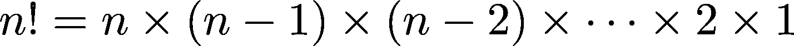
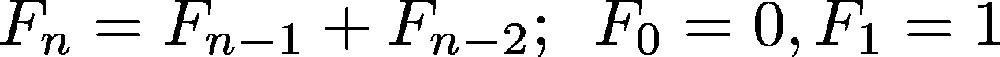
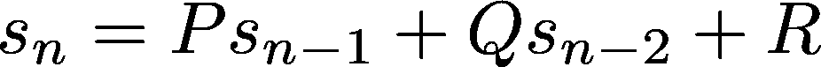
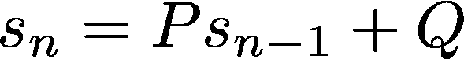
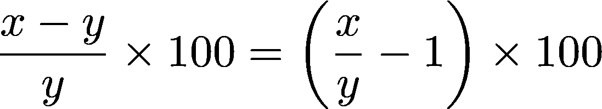

# 例如，Python 3 中的 Itertools

> 原文：<https://realpython.com/python-itertools/>

它被称为[“宝石”](https://more-itertools.readthedocs.io/en/latest/index.html)[“几乎是有史以来最酷的东西”](http://jmduke.com/posts/a-gentle-introduction-to-itertools/)，如果你还没有听说过它，那么你就错过了 Python 3 标准库最棒的角落之一:`itertools`。

有一些很好的资源可以用来学习`itertools`模块中有哪些功能。T2 的医生们本身就是一个很好的起点。[这个岗位](https://pymotw.com/3/itertools/index.html)也是。

然而，关于`itertools`，仅仅知道它包含的函数的定义是不够的。真正的力量在于组合这些函数来创建快速、内存高效且美观的代码。

这篇文章采用了不同的方法。不是一次向你介绍一个函数，你将构建实际的例子来鼓励你“迭代地思考”一般来说，示例将从简单开始，并逐渐增加复杂性。

一个警告:这篇文章很长，面向中高级 Python 程序员。在开始之前，您应该对使用 Python 3 中的迭代器和生成器、多重赋值和元组解包有信心。如果你不是，或者你需要温习你的知识，在继续阅读之前，考虑检查以下内容:

*   Python 迭代器:一步一步的介绍
*   [Python 生成器简介](https://realpython.com/introduction-to-python-generators/)
*   第六章 [Python 技巧:丹·巴德的书](https://realpython.com/asins/1775093301/)
*   [多重赋值和元组解包提高 Python 代码可读性](http://treyhunner.com/2018/03/tuple-unpacking-improves-python-code-readability/)

**免费奖励:** [点击这里获取我们的 itertools 备忘单](https://realpython.com/bonus/itertools-cheatsheet/)，它总结了本教程中演示的技术。

都准备好了吗？让我们以一个问题开始任何美好的旅程。

## 什么是`Itertools`，为什么要用？

根据 [`itertools`文档](https://docs.python.org/3/library/itertools.html)的说法，它是一个“模块[它]实现了许多迭代器构建块，灵感来自 APL、Haskell 和 SML 的构造……它们一起形成了一个‘迭代器代数’,使得用纯 Python 简洁高效地构建专门的工具成为可能。”

不严格地说，这意味着`itertools`中的函数“操作”迭代器来产生更复杂的迭代器。例如，考虑一下[内置的`zip()`函数](https://docs.python.org/3/library/functions.html#zip)，它接受任意数量的 iterables 作为参数，并返回一个遍历其对应元素元组的迭代器:

>>>

```py
>>> list(zip([1, 2, 3], ['a', 'b', 'c']))
[(1, 'a'), (2, 'b'), (3, 'c')]
```

`zip()`到底是如何工作的？

与所有列表一样，`[1, 2, 3]`和`['a', 'b', 'c']`是可迭代的，这意味着它们可以一次返回一个元素。从技术上讲，任何实现了`.__iter__()`或`.__getitem__()`方法的 Python 对象都是可迭代的。(更详细的解释见 [Python 3 文档词汇表](https://docs.python.org/3/glossary.html#term-iterable)。)

当在可迭代对象上调用 [`iter()`内置函数](https://docs.python.org/3/library/functions.html#iter)时，返回该可迭代对象的[迭代器对象](https://docs.python.org/3/library/stdtypes.html#typeiter):

>>>

```py
>>> iter([1, 2, 3, 4])
<list_iterator object at 0x7fa80af0d898>
```

本质上，[`zip()`函数](https://realpython.com/python-zip-function/)的工作方式是对它的每个参数调用`iter()`，然后用`next()`推进由`iter()`返回的每个迭代器，并将结果聚合成元组。 [`zip()`](https://realpython.com/courses/python-zip-function/) 返回的迭代器对这些元组进行迭代。

[`map()`内置函数](https://realpython.com/python-map-function/)是另一种“迭代器操作符”，其最简单的形式是将单参数函数应用于可迭代的每个元素，一次一个元素:

>>>

```py
>>> list(map(len, ['abc', 'de', 'fghi']))
[3, 2, 4]
```

`map()`函数的工作方式是在第二个参数上调用`iter()`，用`next()`推进这个迭代器，直到迭代器用完，并在每一步将传递给第一个参数的函数应用于`next()`返回的值。在上面的例子中，对`['abc', 'de', 'fghi']`的每个元素调用`len()`来返回列表中每个字符串长度的迭代器。

由于[迭代器是可迭代的](https://docs.python.org/3/glossary.html#term-iterator)，您可以组合`zip()`和`map()`来产生一个迭代器，遍历多个可迭代的元素组合。例如，下面对两个列表的相应元素求和:

>>>

```py
>>> list(map(sum, zip([1, 2, 3], [4, 5, 6])))
[5, 7, 9]
```

这就是`itertools`中的函数形成“迭代器代数”的含义`itertools`最好被看作是一个构建块的集合，这些构建块可以组合起来形成专门的“数据管道”,就像上面的例子一样。

> **历史注:**在 Python 2 中，内置的 [`zip()`](https://docs.python.org/2/library/functions.html#zip) 和 [`map()`](https://docs.python.org/2/library/functions.html#map) 函数不返回迭代器，而是返回一个列表。要返回一个迭代器，必须使用`itertools`的 [`izip()`](https://docs.python.org/2/library/itertools.html#itertools.izip) 和 [`imap()`](https://docs.python.org/2/library/itertools.html#itertools.imap) 函数。在 Python 3 中，`izip()`和`imap()`已经从`itertools` 中移除了[，取而代之的是`zip()`和`map()`内置。所以，在某种程度上，如果你曾经在 Python 3 中使用过`zip()`或者`map()`，你就已经在使用`itertools`！](https://docs.python.org/3.0/whatsnew/3.0.html#views-and-iterators-instead-of-lists)

这种“迭代器代数”有用的主要原因有两个:提高内存效率(通过[惰性求值](https://en.wikipedia.org/wiki/Lazy_evaluation))和更快的执行时间。要了解这一点，请考虑以下问题:

> 给定一个值列表`inputs`和一个正整数`n`，写一个函数将`inputs`分成长度为`n`的组。为了简单起见，假设输入列表的长度可以被`n`整除。比如说`inputs = [1, 2, 3, 4, 5, 6]`和`n = 2`，你的函数应该返回`[(1, 2), (3, 4), (5, 6)]`。

采用一种天真的方法，您可能会写出这样的内容:

```py
def naive_grouper(inputs, n):
    num_groups = len(inputs) // n
    return [tuple(inputs[i*n:(i+1)*n]) for i in range(num_groups)]
```

当您测试它时，您会看到它按预期工作:

>>>

```py
>>> nums = [1, 2, 3, 4, 5, 6, 7, 8, 9, 10]
>>> naive_grouper(nums, 2)
[(1, 2), (3, 4), (5, 6), (7, 8), (9, 10)]
```

当你试图传递给它一个有 1 亿个元素的列表时会发生什么？你将需要大量的可用内存！即使您有足够的可用内存，您的程序也会挂起一段时间，直到输出列表被填充。

要了解这一点，请将以下内容存储在一个名为`naive.py`的脚本中:

```py
def naive_grouper(inputs, n):
    num_groups = len(inputs) // n
    return [tuple(inputs[i*n:(i+1)*n]) for i in range(num_groups)]

for _ in naive_grouper(range(100000000), 10):
    pass
```

从控制台，您可以使用`time`命令(在 UNIX 系统上)来测量内存使用和 CPU 用户时间。**在执行以下命令之前，确保至少有 5GB 的空闲内存:**

```py
$ time -f "Memory used (kB): %M\nUser time (seconds): %U" python3 naive.py
Memory used (kB): 4551872
User time (seconds): 11.04
```

> **注意:**在 Ubuntu 上，你可能需要运行`/usr/bin/time`而不是`time`来运行上面的例子。

`naive_grouper()`中的`list`和`tuple`实现需要大约 4.5GB 的内存来处理`range(100000000)`。使用迭代器极大地改善了这种情况。请考虑以下情况:

```py
def better_grouper(inputs, n):
    iters = [iter(inputs)] * n
    return zip(*iters)
```

这个小函数里有很多东西，所以让我们用一个具体的例子来分解它。表达式`[iters(inputs)] * n`创建了一个对同一迭代器的`n`引用的列表:

>>>

```py
>>> nums = [1, 2, 3, 4, 5, 6, 7, 8, 9, 10]
>>> iters = [iter(nums)] * 2
>>> list(id(itr) for itr in iters)  # IDs are the same.
[139949748267160, 139949748267160]
```

接下来，`zip(*iters)`返回一个迭代器，遍历`iters`中每个迭代器的对应元素对。当第一个元素`1`取自“第一个”迭代器时，“第二个”迭代器现在从`2`开始，因为它只是对“第一个”迭代器的引用，因此已经前进了一步。所以，`zip()`产生的第一个元组是`(1, 2)`。

此时，`iters`中的“两个”迭代器都从`3`开始，所以当`zip()`从“第一个”迭代器中拉取`3`时，它从“第二个”迭代器中获取`4`产生元组`(3, 4)`。这个过程一直持续到`zip()`最终产生`(9, 10)`并且`iters`中的“两个”迭代器都用完为止:

>>>

```py
>>> nums = [1, 2, 3, 4, 5, 6, 7, 8, 9, 10]
>>> list(better_grouper(nums, 2))
[(1, 2), (3, 4), (5, 6), (7, 8), (9, 10)]
```

由于几个原因，`better_grouper()`函数更好。首先，在没有引用内置的`len()`的情况下，`better_grouper()`可以将任何 iterable 作为参数(甚至是无限迭代器)。第二，通过返回一个迭代器而不是一个列表，`better_grouper()`可以毫无困难地处理大量的可迭代对象，并且使用更少的内存。

将以下内容存储在名为`better.py`的文件中，并使用`time`从控制台再次运行:

```py
def better_grouper(inputs, n):
    iters = [iter(inputs)] * n
    return zip(*iters)

for _ in better_grouper(range(100000000), 10):
    pass
```

```py
$ time -f "Memory used (kB): %M\nUser time (seconds): %U" python3 better.py
Memory used (kB): 7224
User time (seconds): 2.48
```

这比在不到四分之一的时间内使用的`naive.py`内存少了 630 倍！

现在你已经看到了什么是`itertools`(“迭代器代数”)以及为什么要使用它(提高内存效率和更快的执行时间)，让我们来看看如何用`itertools`让`better_grouper()`更上一层楼。

[*Remove ads*](/account/join/)

## `grouper`食谱

`better_grouper()`的问题是它不能处理传递给第二个参数的值不是第一个参数中 iterable 长度的一个因素的情况:

>>>

```py
>>> nums = [1, 2, 3, 4, 5, 6, 7, 8, 9, 10]
>>> list(better_grouper(nums, 4))
[(1, 2, 3, 4), (5, 6, 7, 8)]
```

分组输出中缺少元素 9 和 10。发生这种情况是因为一旦传递给它的最短的 iterable 用尽，`zip()`就停止聚集元素。返回包含 9 和 10 的第三个组更有意义。

为此，可以使用`itertools.zip_longest()`。这个函数接受任意数量的 iterables 作为参数和一个默认为`None`的`fillvalue`关键字参数。了解`zip()`和`zip_longest()`之间区别的最简单方法是查看一些示例输出:

>>>

```py
>>> import itertools as it
>>> x = [1, 2, 3, 4, 5]
>>> y = ['a', 'b', 'c']
>>> list(zip(x, y))
[(1, 'a'), (2, 'b'), (3, 'c')]
>>> list(it.zip_longest(x, y))
[(1, 'a'), (2, 'b'), (3, 'c'), (4, None), (5, None)]
```

考虑到这一点，将`better_grouper()`中的`zip()`替换为`zip_longest()`:

```py
import itertools as it

def grouper(inputs, n, fillvalue=None):
    iters = [iter(inputs)] * n
    return it.zip_longest(*iters, fillvalue=fillvalue)
```

现在你得到了一个更好的结果:

>>>

```py
>>> nums = [1, 2, 3, 4, 5, 6, 7, 8, 9, 10]
>>> print(list(grouper(nums, 4)))
[(1, 2, 3, 4), (5, 6, 7, 8), (9, 10, None, None)]
```

`grouper()`功能可以在`itertools`文档的[食谱部分](https://docs.python.org/3.6/library/itertools.html#itertools-recipes)中找到。这些食谱是如何利用`itertools`为你带来优势的绝佳灵感来源。

**注意**:从这一点开始，`import itertools as it`行将不再包含在示例的开头。代码示例中的所有`itertools`方法都以`it.`开头，暗示了模块导入。

如果你在运行本教程中的一个例子时得到一个`NameError: name 'itertools' is not defined`或`NameError: name 'it' is not defined`异常，你需要首先导入`itertools`模块。

## 你呢，蛮力？

这里有一个常见的面试式问题:

> 你有三张 20 美元的钞票，五张 10 美元的钞票，两张 5 美元的钞票和五张 1 美元的钞票。一张 100 美元的钞票有多少种找零方法？

对于这个问题，你只需开始列出从你的钱包中选择一张钞票的方法，检查这些方法中是否有一张可以兑换 100 美元，然后列出从你的钱包中选择两张钞票的方法，再次检查，等等。

但是你是一个程序员，所以你自然想自动化这个过程。

首先，列出你钱包里的账单:

```py
bills = [20, 20, 20, 10, 10, 10, 10, 10, 5, 5, 1, 1, 1, 1, 1]
```

从一组 *n* 事物中选择一个 *k* 事物称为一个 [**组合**](https://en.wikipedia.org/wiki/Combination) ，`itertools`背对着这里。`itertools.combinations()`函数接受两个参数——一个可迭代的`inputs`和一个正整数`n`——并生成一个迭代器，遍历`inputs`中所有`n`元素组合的元组。

例如，要列出钱包中三张钞票的组合，只需:

>>>

```py
>>> list(it.combinations(bills, 3))
 [(20, 20, 20), (20, 20, 10), (20, 20, 10), ... ]
```

为了解决这个问题，您可以循环从 1 到`len(bills)`的正整数，然后检查每个大小的哪些组合总计为 100 美元:

>>>

```py
>>> makes_100 = []
>>> for n in range(1, len(bills) + 1):
...     for combination in it.combinations(bills, n):
...         if sum(combination) == 100:
...             makes_100.append(combination)
```

如果你打印出`makes_100`，你会注意到有很多重复的组合。这很有意义，因为你可以用三张 20 美元和四张 10 美元的钞票兑换 100 美元，但`combinations()`只能用你钱包里的前四张 10 美元钞票来兑换；第一、第三、第四和第五张十元钞票；第一、第二、第四和第五张十元钞票；诸如此类。

要删除`makes_100`中的重复项，您可以将其转换为`set`:

>>>

```py
>>> set(makes_100)
{(20, 20, 10, 10, 10, 10, 10, 5, 1, 1, 1, 1, 1),
 (20, 20, 10, 10, 10, 10, 10, 5, 5),
 (20, 20, 20, 10, 10, 10, 5, 1, 1, 1, 1, 1),
 (20, 20, 20, 10, 10, 10, 5, 5),
 (20, 20, 20, 10, 10, 10, 10)}
```

所以，用你钱包里的钞票兑换 100 美元有五种方法。

这是同一个问题的变体:

> 用任何数量的 50 美元、20 美元、10 美元、5 美元和 1 美元钞票兑换 100 美元钞票有多少种方法？

在这种情况下，您没有预设的账单集合，因此您需要一种方法来使用任意数量的账单生成所有可能的组合。为此，您将需要`itertools.combinations_with_replacement()`函数。

它就像`combinations()`一样工作，接受一个可迭代的`inputs`和一个正整数`n`，并返回一个遍历`n`的迭代器——来自`inputs`的元素元组。不同的是`combinations_with_replacement()`允许元素在它返回的元组中重复。

例如:

>>>

```py
>>> list(it.combinations_with_replacement([1, 2], 2))
[(1, 1), (1, 2), (2, 2)]
```

与`combinations()`相比:

>>>

```py
>>> list(it.combinations([1, 2], 2))
[(1, 2)]
```

下面是修改后的问题的解决方案:

>>>

```py
>>> bills = [50, 20, 10, 5, 1]
>>> make_100 = []
>>> for n in range(1, 101):
...     for combination in it.combinations_with_replacement(bills, n):
...         if sum(combination) == 100:
...             makes_100.append(combination)
```

在这种情况下，您不需要删除任何副本，因为`combinations_with_replacement()`不会产生任何副本:

>>>

```py
>>> len(makes_100)
343
```

如果您运行上面的解决方案，您可能会注意到需要一段时间才能显示输出。那是因为它必须处理 96，560，645 个组合！

另一个“强力”`itertools`函数是`permutations()`，它接受一个可迭代的元素，并产生其元素的所有可能的排列:

>>>

```py
>>> list(it.permutations(['a', 'b', 'c']))
[('a', 'b', 'c'), ('a', 'c', 'b'), ('b', 'a', 'c'),
 ('b', 'c', 'a'), ('c', 'a', 'b'), ('c', 'b', 'a')]
```

任何三个元素的可迭代将有六种排列，更长的可迭代的排列数量增长极快。事实上，长度为 *n* 的可迭代函数有 *n！*排列，其中



为了客观地看待这个问题，这里有一个表格，列出了从 *n = 1* 到 *n = 10* 的这些[数字](https://realpython.com/python-numbers/):

| *n* | *n！* |
| --- | --- |
| Two | Two |
| three | six |
| four | Twenty-four |
| five | One hundred and twenty |
| six | Seven hundred and twenty |
| seven | Five thousand and forty |
| eight | Forty thousand three hundred and twenty |
| nine | Three hundred and sixty-two thousand eight hundred and eighty |
| Ten | Three million six hundred and twenty-eight thousand eight hundred |

仅仅几个输入产生大量结果的现象被称为[组合爆炸](https://en.wikipedia.org/wiki/Combinatorial_explosion)，在使用`combinations()`、`combinations_with_replacement()`和`permutations()`时要记住这一点。

通常最好避免暴力算法，尽管有时你可能需要使用一个(例如，如果算法的正确性很关键，或者每一个可能的结果*必须*被考虑)。这样的话，`itertools`有你罩着。

[*Remove ads*](/account/join/)

### 章节摘要

在本节中，您遇到了三个`itertools`函数:`combinations()`、`combinations_with_replacement()`和`permutations()`。

在继续之前，让我们回顾一下这些函数:

#### `itertools.combinations`例子

> `combinations(iterable, n)`
> 
> 返回 iterable 中元素的连续 n 长度组合。

>>>

```py
>>> combinations([1, 2, 3], 2)
(1, 2), (1, 3), (2, 3)
```

#### `itertools.combinations_with_replacement`例子

> `combinations_with_replacement(iterable, n)`
> 
> 返回 iterable 中元素的连续 n 长度组合，允许单个元素连续重复。

>>>

```py
>>> combinations_with_replacement([1, 2], 2)
(1, 1), (1, 2), (2, 2)
```

#### `itertools.permutations`例子

> `permutations(iterable, n=None)`
> 
> 返回 iterable 中元素的连续 n 长度排列。

>>>

```py
>>> permutations('abc')
('a', 'b', 'c'), ('a', 'c', 'b'), ('b', 'a', 'c'),
('b', 'c', 'a'), ('c', 'a', 'b'), ('c', 'b', 'a')
```

## 数字序列

使用`itertools`，可以很容易地在无限序列上生成迭代器。在本节中，您将探索数字序列，但是这里看到的工具和技术绝不仅限于数字。

### 偶数和奇数

对于第一个例子，您将在偶数和奇数整数*上创建一对迭代器，而不用显式地做任何算术。*在开始之前，让我们看一个使用[发电机的算术解决方案](https://realpython.com/courses/python-generators/):

>>>

```py
>>> def evens():
...     """Generate even integers, starting with 0."""
...     n = 0
...     while True:
...         yield n
...         n += 2
...
>>> evens = evens()
>>> list(next(evens) for _ in range(5))
[0, 2, 4, 6, 8]

>>> def odds():
...     """Generate odd integers, starting with 1."""
...     n = 1
...     while True:
...         yield n
...         n += 2
...
>>> odds = odds()
>>> list(next(odds) for _ in range(5))
[1, 3, 5, 7, 9]
```

这非常简单，但是使用`itertools`你可以更简洁地完成这项工作。您需要的函数是`itertools.count()`，它确实像它听起来的那样:它计数，默认情况下从数字 0 开始。

>>>

```py
>>> counter = it.count()
>>> list(next(counter) for _ in range(5))
[0, 1, 2, 3, 4]
```

您可以通过设置`start`关键字参数(默认为 0)从您喜欢的任何数字开始计数。您甚至可以设置一个`step`关键字参数来确定从`count()`返回的数字之间的间隔——默认为 1。

使用`count()`，偶数和奇数整数上的迭代器变成了文字一行程序:

>>>

```py
>>> evens = it.count(step=2)
>>> list(next(evens) for _ in range(5))
[0, 2, 4, 6, 8]

>>> odds = it.count(start=1, step=2)
>>> list(next(odds) for _ in range(5))
[1, 3, 5, 7, 9]
```

[从 Python 3.1](https://docs.python.org/3.1/whatsnew/3.1.html#new-improved-and-deprecated-modules) 开始，`count()`函数也接受非整数参数:

>>>

```py
>>> count_with_floats = it.count(start=0.5, step=0.75)
>>> list(next(count_with_floats) for _ in range(5))
[0.5, 1.25, 2.0, 2.75, 3.5]
```

你甚至可以给它传递负数:

>>>

```py
>>> negative_count = it.count(start=-1, step=-0.5)
>>> list(next(negative_count) for _ in range(5))
[-1, -1.5, -2.0, -2.5, -3.0]
```

在某些方面，`count()`类似于内置的`range()`函数，但是`count()`总是返回一个无限序列。你可能想知道无限序列有什么用，因为它不可能完全迭代。这是一个有效的问题，我承认我第一次接触无限迭代器时，我也不太明白这一点。

让我意识到无限迭代器威力的例子如下，它模拟了内置函数的行为:

>>>

```py
>>> list(zip(it.count(), ['a', 'b', 'c']))
[(0, 'a'), (1, 'b'), (2, 'c')]
```

这是一个简单的例子，但是请想一想:您刚刚枚举了一个没有`for`循环并且事先不知道列表长度的列表。

[*Remove ads*](/account/join/)

### 递归关系

[递归关系](https://en.wikipedia.org/wiki/Recurrence_relation)是用递归公式描述数列的一种方式。最著名的递归关系之一是描述[斐波那契数列](https://en.wikipedia.org/wiki/Fibonacci_number)的递归关系。

斐波那契数列就是数列`0, 1, 1, 2, 3, 5, 8, 13, ...`。它从 0 和 1 开始，序列中的每个后续数字都是前两个数字的和。这个数列中的数字被称为斐波那契数列。在数学符号中，描述第 *n* 个斐波那契数的递归关系如下:



> **注意:**如果你搜索 Google，你会发现这些数字在 Python 中的大量实现。你可以在真正的 Python 上的[用 Python 递归思考](https://realpython.com/python-thinking-recursively/#naive-recursion-is-naive)一文中找到一个递归函数来产生它们。

常见的是使用生成器生成斐波纳契数列:

```py
def fibs():
    a, b = 0, 1
    while True:
        yield a
        a, b = b, a + b
```

描述斐波那契数列的递归关系被称为*二阶递归关系*，因为要计算数列中的下一个数，你需要回顾它后面的两个数。

通常，二阶递归关系具有以下形式:



这里， *P* 、 *Q* 、 *R* 为常数。要生成序列，您需要两个初始值。对于斐波那契数列， *P* = *Q* = 1， *R* = 0，初始值为 0 和 1。

如你所料，*一阶递归关系*具有以下形式:



有无数的数列可以用一阶和二阶递推关系来描述。例如，正整数可以描述为一阶递推关系，P*=*Q*= 1，初始值为 1。对于偶数，取 *P* = 1、 *Q* = 2，初始值为 0。

在本节中，您将构造函数来生成任何序列的*，其值可以用一阶或二阶递归关系来描述。*

#### 一阶递归关系

您已经看到了`count()`如何生成非负整数、偶整数和奇整数的序列。你也可以用它来生成序列 *3n = 0，3，6，9，12，…* 和 *4n = 0，4，8，12，16，…* 。

```py
count_by_three = it.count(step=3)
count_by_four = it.count(step=4)
```

事实上，`count()`可以产生任意倍数的序列。这些序列可以用一阶递推关系来描述。例如，要生成某个数的倍数序列 *n* ，只需取 *P* = 1， *Q* = *n* ，初始值为 0。

一阶递归关系的另一个简单例子是常数序列 *n，n，n，n，n…* ，其中 *n* 是您想要的任何值。对于该序列，用初始值 *n* 设置 *P* = 1 和 *Q* = 0。`itertools`提供了一种简单的方法来实现这个序列，通过`repeat()`函数:

```py
all_ones = it.repeat(1)  # 1, 1, 1, 1, ...
all_twos = it.repeat(2)  # 2, 2, 2, 2, ...
```

如果需要有限的重复值序列，可以通过将正整数作为第二个参数传递来设置停止点:

```py
five_ones = it.repeat(1, 5)  # 1, 1, 1, 1, 1
three_fours = it.repeat(4, 3)  # 4, 4, 4
```

可能不太明显的是，交替的 1 和-1 的序列`1, -1, 1, -1, 1, -1, ...`也可以用一阶递归关系来描述。就取 *P* = -1， *Q* = 0，初始值 1。

有一种简单的方法可以用`itertools.cycle()`函数生成这个序列。该函数将一个可迭代的`inputs`作为参数，并返回一个对`inputs`中的值的无限迭代器，一旦到达`inputs`的末尾，该迭代器将返回到开始处。因此，要产生 1 和-1 的交替序列，您可以这样做:

```py
alternating_ones = it.cycle([1, -1])  # 1, -1, 1, -1, 1, -1, ...
```

不过，这一部分的目标是生成一个函数，它可以生成*任何*一阶递归关系——只需传递给它 *P* 、 *Q* 和一个初始值。一种方法是使用`itertools.accumulate()`。

`accumulate()`函数接受两个参数——一个可迭代的`inputs`和一个**二元函数** `func`(也就是说，一个函数正好有两个输入)——并返回一个迭代器，遍历将`func`应用于`inputs`元素的累积结果。它大致相当于以下生成器:

```py
def accumulate(inputs, func):
    itr = iter(inputs)
    prev = next(itr)
    for cur in itr:
        yield prev
        prev = func(prev, cur)
```

例如:

>>>

```py
>>> import operator
>>> list(it.accumulate([1, 2, 3, 4, 5], operator.add))
[1, 3, 6, 10, 15]
```

由`accumulate()`返回的迭代器中的第一个值总是输入序列中的第一个值。在上面的例子中，这是 1，即`[1, 2, 3, 4, 5]`中的第一个值。

输出迭代器中的下一个值是输入序列的前两个元素之和:`add(1, 2) = 3`。为了产生下一个值，`accumulate()`取`add(1, 2)`的结果，并将其与输入序列中的第三个值相加:

```py
add(3, 3) = add(add(1, 2), 3) = 6
```

`accumulate()`产生的第四个值是`add(add(add(1, 2), 3), 4) = 10`，以此类推。

`accumulate()`的第二个参数默认为`operator.add()`，所以前面的例子可以简化为:

>>>

```py
>>> list(it.accumulate([1, 2, 3, 4, 5]))
[1, 3, 6, 10, 15]
```

传递内置的`min()`到`accumulate()`将跟踪运行最小值:

>>>

```py
>>> list(it.accumulate([9, 21, 17, 5, 11, 12, 2, 6], min))
[9, 9, 9, 5, 5, 5, 2, 2]
```

更复杂的函数可以通过`lambda`表达式传递给`accumulate()`:

>>>

```py
>>> list(it.accumulate([1, 2, 3, 4, 5], lambda x, y: (x + y) / 2))
[1, 1.5, 2.25, 3.125, 4.0625]
```

传递给`accumulate()`的二元函数中参数的顺序很重要。第一个参数总是先前累加的结果，第二个参数总是输入 iterable 的下一个元素。例如，考虑以下表达式输出的差异:

>>>

```py
>>> list(it.accumulate([1, 2, 3, 4, 5], lambda x, y: x - y))
[1, -1, -4, -8, -13]

>>> list(it.accumulate([1, 2, 3, 4, 5], lambda x, y: y - x))
[1, 1, 2, 2, 3]
```

为了建模递归关系，您可以忽略传递给`accumulate()`的二元函数的第二个参数。即给定值`p`、`q`、`s`、`lambda x, _: p*s + q`将返回*sᵢ*=*psᵢ₋₁*+*q*定义的递归关系中`x`之后的值。

为了让`accumulate()`迭代得到的递归关系，您需要向它传递一个具有正确初始值的无限序列。序列中其余的值是什么并不重要，只要初始值是递推关系的初始值就行。您可以使用`repeat()`来完成此操作:

```py
def first_order(p, q, initial_val):
    """Return sequence defined by s(n) = p * s(n-1) + q."""
    return it.accumulate(it.repeat(initial_val), lambda s, _: p*s + q)
```

使用`first_order()`，您可以从上面构建序列，如下所示:

```py
>>> evens = first_order(p=1, q=2, initial_val=0)
>>> list(next(evens) for _ in range(5))
[0, 2, 4, 6, 8]

>>> odds = first_order(p=1, q=2, initial_val=1)
>>> list(next(odds) for _ in range(5))
[1, 3, 5, 7, 9]

>>> count_by_threes = first_order(p=1, q=3, initial_val=0)
>>> list(next(count_by_threes) for _ in range(5))
[0, 3, 6, 9, 12]

>>> count_by_fours = first_order(p=1, q=4, initial_val=0)
>>> list(next(count_by_fours) for _ in range(5))
[0, 4, 8, 12, 16]

>>> all_ones = first_order(p=1, q=0, initial_val=1)
>>> list(next(all_ones) for _ in range(5))
[1, 1, 1, 1, 1]

>>> all_twos = first_order(p=1, q=0, initial_val=2)
>>> list(next(all_twos) for _ in range(5))
[2, 2, 2, 2, 2]

>>> alternating_ones = first_order(p=-1, 0, initial_val=1)
>>> list(next(alternating_ones) for _ in range(5))
[1, -1, 1, -1, 1]
```

#### 二阶递推关系

生成由二阶递归关系描述的序列，如斐波那契序列，可以使用与一阶递归关系类似的技术来实现。

这里的区别是，你需要创建一个元组的中间序列，它跟踪序列的前两个元素，然后将这些元组中的每一个`map()`到它们的第一个组件，以获得最终的序列。

它看起来是这样的:

```py
def second_order(p, q, r, initial_values):
    """Return sequence defined by s(n) = p * s(n-1) + q * s(n-2) + r."""
    intermediate = it.accumulate(
        it.repeat(initial_values),
        lambda s, _: (s[1], p*s[1] + q*s[0] + r)
    )
    return map(lambda x: x[0], intermediate)
```

使用`second_order()`，您可以生成如下斐波纳契数列:

```py
>>> fibs = second_order(p=1, q=1, r=0, initial_values=(0, 1))
>>> list(next(fibs) for _ in range(8))
[0, 1, 1, 2, 3, 5, 8, 13]
```

通过改变`p`、`q`和`r`的值，可以很容易地生成其他序列。例如，可以如下生成[佩尔数](https://en.wikipedia.org/wiki/Pell_number)和[卢卡斯数](https://en.wikipedia.org/wiki/Lucas_number):

```py
pell = second_order(p=2, q=1, r=0, initial_values=(0, 1))
>>> list(next(pell) for _ in range(6))
[0, 1, 2, 5, 12, 29]

>>> lucas = second_order(p=1, q=1, r=0, initial_values=(2, 1))
>>> list(next(lucas) for _ in range(6))
[2, 1, 3, 4, 7, 11]
```

您甚至可以生成交替的斐波那契数列:

```py
>>> alt_fibs = second_order(p=-1, q=1, r=0, initial_values=(-1, 1))
>>> list(next(alt_fibs) for _ in range(6))
[-1, 1, -2, 3, -5, 8]
```

如果你像我一样是一个超级数学呆子，这真的很酷，但是退一步来比较一下本节开头的`second_order()`和`fibs()`生成器。哪个更容易理解？

这是宝贵的一课。`accumulate()`函数是工具箱中的一个强大工具，但是有时使用它可能意味着牺牲清晰性和可读性。

[*Remove ads*](/account/join/)

### 章节摘要

在本节中，您看到了几个`itertools`函数。现在让我们来回顾一下。

#### `itertools.count`例子

> `count(start=0, step=1)`
> 
> 返回一个计数对象。`__next__()`方法返回连续的值。

>>>

```py
>>> count()
0, 1, 2, 3, 4, ...

>>> count(start=1, step=2)
1, 3, 5, 7, 9, ...
```

#### `itertools.repeat`例子

> `repeat(object, times=1)`
> 
> 创建一个迭代器，按照指定的次数返回对象。如果未指定，则无休止地返回对象。

>>>

```py
>>> repeat(2)
2, 2, 2, 2, 2 ...

>>> repeat(2, 5)  # Stops after 5 repititions.
2, 2, 2, 2, 2
```

#### `itertools.cycle`例子

> `cycle(iterable)`
> 
> 从 iterable 中返回元素，直到用完为止。然后无限重复这个序列。

>>>

```py
>>> cycle(['a', 'b', 'c'])
a, b, c, a, b, c, a, ...
```

#### `itertools accumulate`例子

> `accumulate(iterable, func=operator.add)`
> 
> 返回一系列累加和(或其他二元函数结果)。

>>>

```py
>>> accumulate([1, 2, 3])
1, 3, 6
```

好吧，让我们从数学中休息一下，玩玩牌。

## 分发一副纸牌

假设您正在构建一个扑克应用程序。你需要一副纸牌。您可以首先定义一个等级列表(a、k、q、j、10、9 等)和一个花色列表(红心、方块、梅花和黑桃):

```py
ranks = ['A', 'K', 'Q', 'J', '10', '9', '8', '7', '6', '5', '4', '3', '2']
suits = ['H', 'D', 'C', 'S']
```

你可以把一张牌表示成一个元组，它的第一个元素是一个等级，第二个元素是一个花色。一副牌就是这些元组的集合。这副牌应该表现得像真的一样，所以定义一个生成器是有意义的，它一次生成一张牌，一旦所有的牌都发完了，它就会耗尽。

实现这一点的一种方法是编写一个生成器，在`ranks`和`suits`上嵌套`for`循环:

```py
def cards():
    """Return a generator that yields playing cards."""
    for rank in ranks:
        for suit in suits:
            yield rank, suit
```

您可以用一个生成器表达式更简洁地写出来:

```py
cards = ((rank, suit) for rank in ranks for suit in suits)
```

然而，有些人可能会认为这实际上比更显式的嵌套`for`循环更难理解。

它有助于从数学的角度来看待嵌套的`for`循环——也就是说，作为两个或更多可迭代的[笛卡尔乘积](https://en.wikipedia.org/wiki/Cartesian_product)。在数学中，两个集合 *A* 和 *B* 的笛卡尔积是形式为 *(a，b)* 的所有元组的集合，其中 *a* 是 *A* 的元素， *b* 是 *B* 的元素。

这里有一个 Python iterables 的例子:`A = [1, 2]`和`B = ['a', 'b']`的笛卡尔乘积是`[(1, 'a'), (1, 'b'), (2, 'a'), (2, 'b')]`。

`itertools.product()`功能正是针对这种情况。它接受任意数量的 iterables 作为参数，并返回笛卡尔积中元组的迭代器:

```py
it.product([1, 2], ['a', 'b'])  # (1, 'a'), (1, 'b'), (2, 'a'), (2, 'b')
```

`product()`函数绝不仅限于两个可迭代的。您可以传递任意多的数据，它们甚至不必都是相同的大小！看看你能否预测出`product([1, 2, 3], ['a', 'b'], ['c'])`是什么，然后通过在解释器中运行它来检查你的工作。

> **警告:**`product()`函数是另一种“暴力”函数，如果你不小心的话，可能会导致组合爆炸。

使用`product()`，您可以在一行中重写`cards`:

```py
cards = it.product(ranks, suits)
```

这一切都很好，但任何有价值的扑克应用程序最好从洗牌开始:

```py
import random

def shuffle(deck):
    """Return iterator over shuffled deck."""
    deck = list(deck)
    random.shuffle(deck)
    return iter(tuple(deck))

cards = shuffle(cards)
```

> **注意:**`random.shuffle()`函数使用 [Fisher-Yates 混洗](https://en.wikipedia.org/wiki/Fisher%E2%80%93Yates_shuffle)在 *O(n)* time 中将一个列表(或任何可变序列)混洗到位[。这个算法非常适合混洗`cards`，因为它产生了一个无偏的排列——也就是说，所有可迭代的排列都同样有可能被`random.shuffle()`返回。](https://en.wikipedia.org/wiki/Fisher%E2%80%93Yates_shuffle#The_modern_algorithm)
> 
> 也就是说，你可能注意到`shuffle()`通过调用`list(deck)`在内存中创建了一个输入`deck`的副本。虽然这似乎违背了本文的精神，但作者不知道如何在不复制的情况下改变迭代器。

出于对用户的礼貌，你应该给他们一个动手的机会。如果你想象卡片整齐地堆放在一张桌子上，你让用户挑选一个数字 *n* ，然后从堆叠的顶部移除前 *n* 张卡片，并将它们移动到底部。

如果你对[切片](https://stackoverflow.com/questions/509211/understanding-pythons-slice-notation)略知一二，你可以这样完成:

```py
def cut(deck, n):
    """Return an iterator over a deck of cards cut at index `n`."""
    if n < 0:
        raise ValueError('`n` must be a non-negative integer')

    deck = list(deck)
    return iter(deck[n:] + deck[:n])

cards = cut(cards, 26)  # Cut the deck in half.
```

`cut()`函数首先将`deck`转换成一个列表，这样您就可以对其进行切片以进行切割。为了保证你的切片行为符合预期，你必须检查`n`是否为非负。如果不是，你最好抛出一个异常，这样就不会发生什么疯狂的事情。

切牌非常简单:切牌的顶部是`deck[:n]`，底部是剩余的牌，或`deck[n:]`。要构建新的甲板，把上面的“一半”移到下面，你只需要把它附加到下面:`deck[n:] + deck[:n]`。

`cut()`函数非常简单，但是有几个问题。对列表进行切片时，会复制原始列表，并返回包含选定元素的新列表。对于只有 52 张卡片的卡片组，空间复杂度的增加微不足道，但是您可以使用`itertools`减少内存开销。为此，您需要三个函数:`itertools.tee()`、`itertools.islice()`和`itertools.chain()`。

让我们来看看这些函数是如何工作的。

`tee()`函数可以用来从一个 iterable 创建任意数量的独立迭代器。它有两个参数:第一个是可迭代的`inputs`，第二个是要返回的`inputs`上独立迭代器的数量`n`(默认情况下，`n`设置为 2)。迭代器在长度为`n`的元组中返回。

>>>

```py
>>> iterator1, iterator2 = it.tee([1, 2, 3, 4, 5], 2)
>>> list(iterator1)
[1, 2, 3, 4, 5]
>>> list(iterator1)  # iterator1 is now exhausted.
[]
>>> list(iterator2)  # iterator2 works independently of iterator1
[1, 2, 3, 4, 5].
```

虽然`tee()`对于创建独立迭代器很有用，但是了解一点它是如何工作的也很重要。当你调用`tee()`来创建 *n* 个独立迭代器时，每个迭代器本质上都是在用自己的 FIFO 队列工作。

当从一个迭代器中提取一个值时，该值被附加到其他迭代器的队列中。因此，如果一个迭代器在其他迭代器之前用尽，那么剩余的迭代器将在内存中保存整个 iterable 的副本。(你可以在`itertools` [文档](https://docs.python.org/3/library/itertools.html#itertools.tee)中找到一个模拟`tee()`的 Python 函数。)

因此，`tee()`应该小心使用。如果您在处理由`tee()`返回的另一个迭代器之前用尽了迭代器的大部分，那么您最好将输入迭代器转换为`list`或`tuple`。

`islice()`函数的工作方式与分割列表或元组非常相似。您向它传递一个 iterable、一个开始点和一个停止点，就像对一个列表进行切片一样，返回的切片在停止点之前的索引处停止。您也可以选择包含一个步长值。当然，这里最大的不同是`islice()`返回一个迭代器。

>>>

```py
>>> # Slice from index 2 to 4
>>> list(it.islice('ABCDEFG', 2, 5))
['C' 'D' 'E']

>>> # Slice from beginning to index 4, in steps of 2
>>> list(it.islice([1, 2, 3, 4, 5], 0, 5, 2))
[1, 3, 5]

>>> # Slice from index 3 to the end
>>> list(it.islice(range(10), 3, None))
[3, 4, 5, 6, 7, 8, 9]

>>> # Slice from beginning to index 3
>>> list(it.islice('ABCDE', 4))
['A', 'B', 'C', 'D']
```

上面的最后两个例子对于截断 iterables 很有用。你可以用这个来代替在`cut()`中使用的列表切片来选择牌组的“顶”和“底”。作为一个额外的好处，`islice()`不接受负的开始/停止位置指数和步长值，所以如果`n`是负的，你就不需要抛出异常。

你需要的最后一个函数是`chain()`。该函数将任意数量的 iterables 作为参数，并将它们“链接”在一起。例如:

>>>

```py
>>> list(it.chain('ABC', 'DEF'))
['A' 'B' 'C' 'D' 'E' 'F']

>>> list(it.chain([1, 2], [3, 4, 5, 6], [7, 8, 9]))
[1, 2, 3, 4, 5, 6, 7, 8, 9]
```

现在您的武器库中已经有了一些额外的火力，您可以重新编写`cut()`函数来切割这副牌，而无需在内存中制作完整的副本`cards`:

```py
def cut(deck, n):
    """Return an iterator over a deck of cards cut at index `n`."""
    deck1, deck2 = it.tee(deck, 2)
    top = it.islice(deck1, n)
    bottom = it.islice(deck2, n, None)
    return it.chain(bottom, top)

cards = cut(cards, 26)
```

既然你已经洗完牌并切牌了，是时候发牌了。您可以编写一个函数`deal()`,它将一副牌、手牌数量和手牌大小作为参数，并返回一个包含指定手牌数量的元组。

你不需要任何新的`itertools`函数来编写这个函数。在继续阅读之前，看看你自己能想出什么。

这里有一个解决方案:

```py
def deal(deck, num_hands=1, hand_size=5):
    iters = [iter(deck)] * hand_size
    return tuple(zip(*(tuple(it.islice(itr, num_hands)) for itr in iters)))
```

首先创建一个对`deck`上的迭代器的`hand_size`引用列表。然后遍历这个列表，在每一步删除`num_hands`卡片，并将它们存储在元组中。

接下来，你把这些元组组合起来，模拟一次给每个玩家发一张牌。这产生了`num_hands`个元组，每个元组包含`hand_size`张卡片。最后，将双手打包成一个元组，一次性返回它们。

这个实现将`num_hands`的默认值设置为`1`，将`hand_size`的默认值设置为`5`——也许您正在制作一个“五张牌抽奖”应用程序。下面是使用该函数的方法，以及一些示例输出:

>>>

```py
>>> p1_hand, p2_hand, p3_hand = deal(cards, num_hands=3)
>>> p1_hand
(('A', 'S'), ('5', 'S'), ('7', 'H'), ('9', 'H'), ('5', 'H'))
>>> p2_hand
(('10', 'H'), ('2', 'D'), ('2', 'S'), ('J', 'C'), ('9', 'C'))
>>> p3_hand
(('2', 'C'), ('Q', 'S'), ('6', 'C'), ('Q', 'H'), ('A', 'C'))
```

你认为`cards`现在发了三手五张牌是什么状态？

>>>

```py
>>> len(tuple(cards))
37
```

发出的十五张牌是从`cards`迭代器中消耗掉的，这正是你想要的。这样，随着游戏的继续，`cards`迭代器的状态反映了游戏中牌组的状态。

[*Remove ads*](/account/join/)

### 章节摘要

让我们回顾一下您在本节中看到的`itertools`函数。

#### `itertools.product`例子

> `product(*iterables, repeat=1)`
> 
> 输入项的笛卡尔乘积。相当于嵌套的 for 循环。

>>>

```py
>>> product([1, 2], ['a', 'b'])
(1, 'a'), (1, 'b'), (2, 'a'), (2, 'b')
```

#### `itertools.tee`例子

> `tee(iterable, n=2)`
> 
> 从单个输入 iterable 创建任意数量的独立迭代器。

>>>

```py
>>> iter1, iter2 = it.tee(['a', 'b', 'c'], 2)
>>> list(iter1)
['a', 'b', 'c']
>>> list(iter2)
['a', 'b', 'c']
```

#### `itertools.islice`例子

> `islice(iterable, stop)` `islice(iterable, start, stop, step=1)`
> 
> 返回一个迭代器，其`__next__()`方法从 iterable 中返回选定的值。像列表中的`slice()`一样工作，但是返回一个迭代器。

>>>

```py
>>> islice([1, 2, 3, 4], 3)
1, 2, 3

>>> islice([1, 2, 3, 4], 1, 2)
2, 3
```

#### `itertools.chain`例子

> `chain(*iterables)`
> 
> 返回一个链对象，它的`__next__()`方法返回第一个 iterable 中的元素，直到用完为止，然后返回下一个 iterable 中的元素，直到用完所有 iterable。

>>>

```py
>>> chain('abc', [1, 2, 3])
'a', 'b', 'c', 1, 2, 3
```

## 中场休息:拉平一列列表

在前面的例子中，您使用了`chain()`将一个迭代器固定在另一个迭代器的末尾。`chain()`函数有一个类方法`.from_iterable()`，它接受一个单独的 iterable 作为参数。iterable 的元素本身必须是 iterable 的，所以实际效果是`chain.from_iterable()`简化了它的参数:

>>>

```py
>>> list(it.chain.from_iterable([[1, 2, 3], [4, 5, 6]]))
[1, 2, 3, 4, 5, 6]
```

没有理由认为`chain.from_iterable()`的参数必须是有限的。您可以模仿`cycle()`的行为，例如:

```py
>>> cycle = it.chain.from_iterable(it.repeat('abc'))
>>> list(it.islice(cycle, 8))
['a', 'b', 'c', 'a', 'b', 'c', 'a', 'b']
```

当您需要在已经“分块”的数据上构建迭代器时，`chain.from_iterable()`函数非常有用

在下一节中，您将看到如何使用`itertools`对大型数据集进行一些数据分析。但是你坚持了这么久应该休息一下。为什么不喝点水放松一下呢？甚至可能玩一会儿《星际迷航:第 n 次迭代》。

回来了？太好了！我们来做一些数据分析。

[*Remove ads*](/account/join/)

## 解析 S&P500

在这个例子中，您将第一次体验到使用`itertools`操作大型数据集——特别是 S & P500 指数的历史每日价格数据。有这个数据的 CSV 文件`SP500.csv`可以在[这里](https://github.com/realpython/materials/tree/master/itertools-in-python3)找到(来源:[雅虎财经](https://finance.yahoo.com/quote/%5EGSPC?p=^GSPC))。你要解决的问题是:

> 确定 S&P500 历史上的最大日收益、日损失(百分比变化)和最长的连续上涨。

为了对你正在处理的事情有个感觉，这里是`SP500.csv`的前十行:

```py
$ head -n 10 SP500.csv
Date,Open,High,Low,Close,Adj Close,Volume
1950-01-03,16.660000,16.660000,16.660000,16.660000,16.660000,1260000
1950-01-04,16.850000,16.850000,16.850000,16.850000,16.850000,1890000
1950-01-05,16.930000,16.930000,16.930000,16.930000,16.930000,2550000
1950-01-06,16.980000,16.980000,16.980000,16.980000,16.980000,2010000
1950-01-09,17.080000,17.080000,17.080000,17.080000,17.080000,2520000
1950-01-10,17.030001,17.030001,17.030001,17.030001,17.030001,2160000
1950-01-11,17.090000,17.090000,17.090000,17.090000,17.090000,2630000
1950-01-12,16.760000,16.760000,16.760000,16.760000,16.760000,2970000
1950-01-13,16.670000,16.670000,16.670000,16.670000,16.670000,3330000
```

如你所见，早期的数据是有限的。以后的数据会有所改善，总体来说，对于这个例子来说已经足够了。

解决这个问题的策略如下:

*   从 CSV 文件中读取数据，并使用“Adj Close”列将其转换为每日百分比变化序列`gains`。
*   找出`gains`序列的最大值和最小值，以及它们出现的日期。(请注意，这些值可能是在多个日期获得的；在这种情况下，最近的日期就足够了。)
*   将`gains`转换为`gains`中连续正值元组的序列`growth_streaks`。然后确定`growth_streaks`中最长元组的长度以及条纹的起止日期。(在`growth_streaks`中，可能不止一个元组达到了最大长度；在这种情况下，具有最近开始和结束日期的元组就足够了。)

两个值 *x* 和 *y* 之间的*百分比变化*由以下公式给出:



对于分析中的每一步，都需要比较与日期相关的值。为了便于比较，可以从 [`collections`模块](https://docs.python.org/3/library/collections.html)中子类化 [`namedtuple`对象](https://docs.python.org/3/library/collections.html#collections.namedtuple):

```py
from collections import namedtuple

class DataPoint(namedtuple('DataPoint', ['date', 'value'])):
    __slots__ = ()

    def __le__(self, other):
        return self.value <= other.value

    def __lt__(self, other):
        return self.value < other.value

    def __gt__(self, other):
        return self.value > other.value
```

`DataPoint`类有两个属性:`date`(一个 [`datetime.datetime`](https://docs.python.org/3/library/datetime.html#datetime.datetime) 实例)和`value`。实现了 [`.__le__()`](https://docs.python.org/3/reference/datamodel.html#object.__le__) 、 [`.__lt__()`](https://docs.python.org/3/reference/datamodel.html#object.__lt__) 和 [`.__gt__()`](https://docs.python.org/3/reference/datamodel.html#object.__gt__) [dunder 方法](https://realpython.com/operator-function-overloading/)，从而可以使用`<=`、`<`和`>`布尔比较器来比较两个`DataPoint`对象的值。这也允许使用`DataPoint`参数调用 [`max()`和`min()`](https://realpython.com/python-min-and-max/) 内置函数。

> **注:**如果你对 [`namedtuple`](https://docs.python.org/3/library/collections.html#collections.namedtuple) 不熟悉，那就去看看[这个优秀的资源](https://dbader.org/blog/writing-clean-python-with-namedtuples)。`DataPoint`的`namedtuple`实现只是构建这种数据结构的许多方法之一。例如，在 Python 3.7 中，您可以将`DataPoint`实现为一个数据类。查看我们的[数据类终极指南](https://realpython.com/python-data-classes/)了解更多信息。

以下代码将数据从`SP500.csv`读取到一组`DataPoint`对象中:

```py
import csv
from datetime import datetime

def read_prices(csvfile, _strptime=datetime.strptime):
    with open(csvfile) as infile:
        reader = csv.DictReader(infile)
        for row in reader:
            yield DataPoint(date=_strptime(row['Date'], '%Y-%m-%d').date(),
                            value=float(row['Adj Close']))

prices = tuple(read_prices('SP500.csv'))
```

`read_prices()`发生器打开`SP500.csv`，用 [`csv.DictReader()`](https://docs.python.org/3/library/csv.html#csv.DictWriter) 对象读取每一行。`DictReader()`将每一行作为 [`OrderedDict`](https://realpython.com/python-ordereddict/) 返回，其键是 CSV 文件标题行中的列名。

对于每一行，`read_prices()`产生一个包含“Date”和“Adj Close”列中的值的`DataPoint`对象。最后，数据点的完整序列作为`tuple`提交到内存中，并存储在`prices` [变量](https://realpython.com/python-variables/)中。

接下来，`prices`需要转换为每日百分比变化序列:

```py
gains = tuple(DataPoint(day.date, 100*(day.value/prev_day.value - 1.))
                for day, prev_day in zip(prices[1:], prices))
```

选择将数据存储在`tuple`中是有意的。尽管您可以将`gains`指向一个迭代器，但是您将需要对数据进行两次迭代来找到最小值和最大值。

如果使用`tee()`创建两个独立的迭代器，用尽一个迭代器来寻找最大值将为第二个迭代器创建一个内存中所有数据的副本。通过预先创建一个`tuple`，与`tee()`相比，你不会在空间复杂度方面损失任何东西，你甚至可能获得一点点速度。

> **注意:**这个例子着重于利用`itertools`来分析 S & P500 数据。那些打算处理大量时间序列金融数据的人可能也想看看[熊猫](https://pandas.pydata.org/)图书馆，它非常适合这样的任务。

[*Remove ads*](/account/join/)

### 最大增益和损耗

要确定任何一天的最大收益，你可以这样做:

```py
max_gain = DataPoint(None, 0)
for data_point in gains:
    max_gain = max(data_point, max_gain)

print(max_gain)   # DataPoint(date='2008-10-28', value=11.58)
```

您可以使用 [`functools.reduce()`函数](https://docs.python.org/3/library/functools.html#functools.reduce)来简化`for`循环。该函数接受一个二元函数`func`和一个可迭代函数`inputs`作为参数，并通过对可迭代函数中的对象对累积应用`func`将`inputs`减少到一个值。

例如，`functools.reduce(operator.add, [1, 2, 3, 4, 5])`将返回总和`1 + 2 + 3 + 4 + 5 = 15`。您可以认为 [`reduce()`](https://realpython.com/python-reduce-function/) 的工作方式与`accumulate()`非常相似，除了它只返回新序列中的最终值。

使用`reduce()`，您可以在上面的例子中完全摆脱`for`循环:

```py
import functools as ft

max_gain = ft.reduce(max, gains)

print(max_gain)  # DataPoint(date='2008-10-28', value=11.58)
```

上面的解决方案是可行的，但是它不等同于你之前的`for`循环。你知道为什么吗？假设您的 CSV 文件中的数据记录了每天的损失。`max_gain`的值会是多少？

在`for`循环中，你首先设置`max_gain = DataPoint(None, 0)`，所以如果没有增益，最后的`max_gain`值将是这个空的`DataPoint`对象。然而，`reduce()`解决方案带来的损失最小。这不是您想要的，并且可能会引入一个难以发现的错误。

这就是`itertools`可以帮你的地方。`itertools.filterfalse()`函数有两个参数:一个返回`True`或`False`的函数(称为**谓词**)和一个可迭代的`inputs`。它返回一个迭代器，遍历谓词返回了`False`的`inputs`中的元素。

这里有一个简单的例子:

```py
>>> only_positives = it.filterfalse(lambda x: x <= 0, [0, 1, -1, 2, -2])
>>> list(only_positives)
[1, 2]
```

您可以使用`filterfalse()`来过滤掉`gains`中的负值或零值，这样`reduce()`只对正值起作用:

```py
max_gain = ft.reduce(max, it.filterfalse(lambda p: p <= 0, gains))
```

如果永远没有收获会怎么样？请考虑以下情况:

```py
>>> ft.reduce(max, it.filterfalse(lambda x: x <= 0, [-1, -2, -3]))
Traceback (most recent call last):
  File "<stdin>", line 1, in <module>
TypeError: reduce() of empty sequence with no initial value
```

嗯，那不是你想要的！但是，这是有意义的，因为由`filterflase()`返回的迭代器是空的。您可以通过用`try...except`包装对`reduce()`的调用来处理`TypeError`，但是有更好的方法。

`reduce()`函数接受可选的第三个参数作为初始值。将`0`传递给第三个参数会得到预期的行为:

>>>

```py
>>> ft.reduce(max, it.filterfalse(lambda x: x <= 0, [-1, -2, -3]), 0)
0
```

将此应用于 S&P500 的例子:

```py
zdp = DataPoint(None, 0)  # zero DataPoint
max_gain = ft.reduce(max, it.filterfalse(lambda p: p <= 0, diffs), zdp)
```

太好了！你已经让它正常工作了！现在，找到最大损失很容易:

```py
max_loss = ft.reduce(min, it.filterfalse(lambda p: p > 0, gains), zdp)

print(max_loss)  # DataPoint(date='2018-02-08', value=-20.47)
```

[*Remove ads*](/account/join/)

### 最长增长线

找到 S&P500 历史上最长的增长轨迹相当于找到`gains`序列中最大数量的连续正数据点。`itertools.takewhile()`和`itertools.dropwhile()`功能非常适合这种情况。

`takewhile()`函数将一个谓词和一个可迭代的`inputs`作为参数，并返回一个遍历`inputs`的迭代器，该迭代器在谓词为其返回`False`的元素的第一个实例处停止:

```py
it.takewhile(lambda x: x < 3, [0, 1, 2, 3, 4])  # 0, 1, 2
```

`dropwhile()`函数的作用正好相反。它从谓词返回`False`的第一个元素开始返回一个迭代器:

```py
it.dropwhile(lambda x: x < 3, [0, 1, 2, 3, 4])  # 3, 4
```

在下面的生成器函数中，`takewhile()`和`dropwhile()`被组合以产生序列的连续正元素的元组:

```py
def consecutive_positives(sequence, zero=0):
    def _consecutives():
        for itr in it.repeat(iter(sequence)):
            yield tuple(it.takewhile(lambda p: p > zero,
                                     it.dropwhile(lambda p: p <= zero, itr)))
    return it.takewhile(lambda t: len(t), _consecutives())
```

`consecutive_positives()`函数工作是因为`repeat()`不断返回一个[指针](https://realpython.com/pointers-in-python/)到一个`sequence`参数上的迭代器，它在每次迭代中被调用`yield`语句中的`tuple()`所部分消耗。

您可以使用`consecutive_positives()`来获得一个生成器，该生成器在`gains`中生成连续正数据点的元组:

```py
growth_streaks = consecutive_positives(gains, zero=DataPoint(None, 0))
```

现在，您可以使用`reduce()`来提取最长的生长条纹:

```py
longest_streak = ft.reduce(lambda x, y: x if len(x) > len(y) else y,
                           growth_streaks)
```

综上所述，下面是一个完整的脚本，它将从`SP500.csv`文件中读取数据，并打印出最大收益/损失和最长增长曲线:

```py
from collections import namedtuple
import csv
from datetime import datetime
import itertools as it
import functools as ft

class DataPoint(namedtuple('DataPoint', ['date', 'value'])):
    __slots__ = ()

    def __le__(self, other):
        return self.value <= other.value

    def __lt__(self, other):
        return self.value < other.value

    def __gt__(self, other):
        return self.value > other.value

def consecutive_positives(sequence, zero=0):
    def _consecutives():
        for itr in it.repeat(iter(sequence)):
            yield tuple(it.takewhile(lambda p: p > zero,
                                     it.dropwhile(lambda p: p <= zero, itr)))
    return it.takewhile(lambda t: len(t), _consecutives())

def read_prices(csvfile, _strptime=datetime.strptime):
    with open(csvfile) as infile:
        reader = csv.DictReader(infile)
        for row in reader:
            yield DataPoint(date=_strptime(row['Date'], '%Y-%m-%d').date(),
                            value=float(row['Adj Close']))

# Read prices and calculate daily percent change.
prices = tuple(read_prices('SP500.csv'))
gains = tuple(DataPoint(day.date, 100*(day.value/prev_day.value - 1.))
              for day, prev_day in zip(prices[1:], prices))

# Find maximum daily gain/loss.
zdp = DataPoint(None, 0)  # zero DataPoint
max_gain = ft.reduce(max, it.filterfalse(lambda p: p <= zdp, gains))
max_loss = ft.reduce(min, it.filterfalse(lambda p: p > zdp, gains), zdp)

# Find longest growth streak.
growth_streaks = consecutive_positives(gains, zero=DataPoint(None, 0))
longest_streak = ft.reduce(lambda x, y: x if len(x) > len(y) else y,
                           growth_streaks)

# Display results.
print('Max gain: {1:.2f}% on {0}'.format(*max_gain))
print('Max loss: {1:.2f}% on {0}'.format(*max_loss))

print('Longest growth streak: {num_days} days ({first} to {last})'.format(
    num_days=len(longest_streak),
    first=longest_streak[0].date,
    last=longest_streak[-1].date
))
```

运行上述脚本会产生以下输出:

```py
Max gain: 11.58% on 2008-10-13
Max loss: -20.47% on 1987-10-19
Longest growth streak: 14 days (1971-03-26 to 1971-04-15)
```

### 章节摘要

在这一节中，您讨论了很多内容，但是您只看到了`itertools`中的几个函数。现在让我们来回顾一下。

#### `itertools.filterfalse`例子

> `filterfalse(pred, iterable)`
> 
> 返回那些`pred(item)`为假的序列项。如果`pred`是`None`，则返回为假的项目。

>>>

```py
>>> filterfalse(bool, [1, 0, 1, 0, 0])
0, 0, 0
```

#### `itertools.takewhile`例子

> `takewhile(pred, iterable)`
> 
> 只要每个条目的`pred`计算结果为真，就从 iterable 返回连续的条目。

>>>

```py
>>> takewhile(bool, [1, 1, 1, 0, 0])
1, 1, 1
```

#### `itertools.dropwhile`例子

> `dropwhile(pred, iterable)`
> 
> 当`pred(item)`为真时，从 iterable 中删除项目。然后，返回每个元素，直到 iterable 用尽。

>>>

```py
>>> dropwhile(bool, [1, 1, 1, 0, 0, 1, 1, 0])
0, 0, 1, 1, 0
```

你真的开始掌握整个事情了！社区游泳队想委托你做一个小项目。

[*Remove ads*](/account/join/)

## 根据游泳运动员数据建立接力队

在本例中，您将从 CSV 文件中读取数据，该文件包含社区游泳队在一个赛季中所有游泳比赛的游泳赛事时间。目标是决定哪些运动员应该在下个赛季参加每个泳姿的接力赛。

每个泳姿都应该有一个“A”和一个“B”接力队，每个队有四名游泳运动员。“A”组应该包括四名游出最好成绩的运动员,“B”组应该包括下四名游出最好成绩的运动员。

这个例子的数据可以在[这里](https://github.com/realpython/materials/tree/master/itertools-in-python3)找到。如果您想继续，将它下载到您当前的工作目录并保存为`swimmers.csv`。

以下是`swimmers.csv`的前 10 行:

```py
$ head -n 10 swimmers.csv
Event,Name,Stroke,Time1,Time2,Time3
0,Emma,freestyle,00:50:313667,00:50:875398,00:50:646837
0,Emma,backstroke,00:56:720191,00:56:431243,00:56:941068
0,Emma,butterfly,00:41:927947,00:42:062812,00:42:007531
0,Emma,breaststroke,00:59:825463,00:59:397469,00:59:385919
0,Olivia,freestyle,00:45:566228,00:46:066985,00:46:044389
0,Olivia,backstroke,00:53:984872,00:54:575110,00:54:932723
0,Olivia,butterfly,01:12:548582,01:12:722369,01:13:105429
0,Olivia,breaststroke,00:49:230921,00:49:604561,00:49:120964
0,Sophia,freestyle,00:55:209625,00:54:790225,00:55:351528
```

每行三个时间代表三个不同秒表记录的时间，以`MM:SS:mmmmmm`格式给出(分、秒、微秒)。一个事件的可接受时间是这三个时间的*中值*，*而不是*的平均值。

让我们从创建`namedtuple`对象的子类`Event`开始，就像我们在 [SP500 的例子](#analyzing-the-sp500)中所做的一样:

```py
from collections import namedtuple

class Event(namedtuple('Event', ['stroke', 'name', 'time'])):
    __slots__ = ()

    def __lt__(self, other):
        return self.time < other.time
```

属性`.stroke`存储事件中游泳运动员的名字，`.name`存储游泳运动员的名字，`.time`记录事件被接受的时间。`.__lt__()` dunder 方法将允许在一系列`Event`对象上调用`min()`。

要将数据从 CSV 读入一个由`Event`对象组成的元组，可以使用`csv.DictReader`对象:

```py
import csv
import datetime
import statistics

def read_events(csvfile, _strptime=datetime.datetime.strptime):
    def _median(times):
        return statistics.median((_strptime(time, '%M:%S:%f').time()
                                  for time in row['Times']))

    fieldnames = ['Event', 'Name', 'Stroke']
    with open(csvfile) as infile:
        reader = csv.DictReader(infile, fieldnames=fieldnames, restkey='Times')
        next(reader)  # skip header
        for row in reader:
            yield Event(row['Stroke'], row['Name'], _median(row['Times']))

events = tuple(read_events('swimmers.csv'))
```

`read_events()`生成器将`swimmers.csv`文件中的每一行读入下面一行中的`OrderedDict`对象:

```py
reader = csv.DictReader(infile, fieldnames=fieldnames, restkey='Times')
```

通过将`'Times'`字段分配给`restkey`，CSV 文件中每一行的“时间 1”、“时间 2”和“时间 3”列将被存储在由`csv.DictReader`返回的`OrderedDict`的`'Times'`键的列表中。

例如，文件的第一行(不包括标题行)被读入以下对象:

```py
OrderedDict([('Event', '0'),
             ('Name', 'Emma'),
             ('Stroke', 'freestyle'),
             ('Times', ['00:50:313667', '00:50:875398', '00:50:646837'])])
```

接下来，`read_events()`产生一个由`_median()`函数返回的带有泳姿、游泳者姓名和中值时间的`Event`对象(作为 [`datetime.time`对象](https://docs.python.org/3/library/datetime.html#time-objects)),该函数调用该行中时间列表上的 [`statistics.median()`](https://docs.python.org/3/library/statistics.html#statistics.median) 。

由于时间列表中的每一项都被`csv.DictReader()`读取为一个字符串，`_median()`使用 [`datetime.datetime.strptime()`类方法](https://docs.python.org/3/library/datetime.html#datetime.datetime.strptime)从每个字符串中实例化一个时间对象。

最后，创建一组`Event`对象:

```py
events = tuple(read_events('swimmers.csv'))
```

`events`的前五个元素是这样的:

>>>

```py
>>> events[:5]
(Event(stroke='freestyle', name='Emma', time=datetime.time(0, 0, 50, 646837)),
 Event(stroke='backstroke', name='Emma', time=datetime.time(0, 0, 56, 720191)),
 Event(stroke='butterfly', name='Emma', time=datetime.time(0, 0, 42, 7531)),
 Event(stroke='breaststroke', name='Emma', time=datetime.time(0, 0, 59, 397469)),
 Event(stroke='freestyle', name='Olivia', time=datetime.time(0, 0, 46, 44389)))
```

现在你已经把数据存入了内存，你会怎么处理它呢？攻击计划如下:

*   按笔划将事件分组。
*   对于每个冲程:
    *   按游泳运动员的名字分组，并确定每个运动员的最佳时间。
    *   按最佳时间给游泳者排序。
    *   前四名运动员组成 A 队，后四名运动员组成 B 队。

`itertools.groupby()`函数使得在一个 iterable 中分组对象变得轻而易举。它需要一个可迭代的`inputs`和一个`key`来分组，并返回一个包含迭代器的对象，迭代器遍历由键分组的`inputs`的元素。

这里有一个简单的`groupby()`例子:

>>>

```py
>>> data = [{'name': 'Alan', 'age': 34},
...         {'name': 'Catherine', 'age': 34},
...         {'name': 'Betsy', 'age': 29},
...         {'name': 'David', 'age': 33}]
...
>>> grouped_data = it.groupby(data, key=lambda x: x['age'])
>>> for key, grp in grouped_data:
...     print('{}: {}'.format(key, list(grp)))
...
34: [{'name': 'Alan', 'age': 34}, {'name': 'Betsy', 'age': 34}]
29: [{'name': 'Catherine', 'age': 29}]
33: [{'name': 'David', 'age': 33}]
```

如果没有指定键，`groupby()`默认为按“标识”分组，即聚合 iterable 中相同的元素:

>>>

```py
>>> for key, grp in it.groupby([1, 1, 2, 2, 2, 3]:
...     print('{}: {}'.format(key, list(grp)))
...
1: [1, 1]
2: [2, 2, 2]
3: [3]
```

从返回的迭代器与一个键相关联的意义上来说，`groupby()`返回的对象有点像字典。但是，与字典不同，它不允许您通过键名访问它的值:

```py
>>> grouped_data[1]
Traceback (most recent call last):
  File "<stdin>", line 1, in <module>
TypeError: 'itertools.groupby' object is not subscriptable
```

事实上， **`groupby()`返回元组的迭代器，元组的第一个组件是键，第二个组件是分组数据的迭代器**:

>>>

```py
>>> grouped_data = it.groupby([1, 1, 2, 2, 2, 3])
>>> list(grouped_data)
[(1, <itertools._grouper object at 0x7ff3056130b8>),
 (2, <itertools._grouper object at 0x7ff3056130f0>),
 (3, <itertools._grouper object at 0x7ff305613128>)]
```

关于`groupby()`要记住的一件事是，它没有你想象的那么聪明。当`groupby()`遍历数据时，它聚合元素，直到遇到具有不同键的元素，这时它开始一个新的组:

>>>

```py
>>> grouped_data = it.groupby([1, 2, 1, 2, 3, 2])
>>> for key, grp in grouped_data:
...     print('{}: {}'.format(key, list(grp)))
...
1: [1]
2: [2]
1: [1]
2: [2]
3: [3]
2: [2]
```

与 SQL `GROUP BY`命令相比，SQL`GROUP BY`命令对元素进行分组，而不考虑它们出现的顺序。

当使用`groupby()`时，您需要根据您想要分组的关键字对数据进行排序。否则，你可能会得到意想不到的结果。这很常见，因此编写一个实用函数来解决这个问题会有所帮助:

```py
def sort_and_group(iterable, key=None):
    """Group sorted `iterable` on `key`."""
    return it.groupby(sorted(iterable, key=key), key=key)
```

回到游泳者的例子，您需要做的第一件事是创建一个 for 循环，该循环遍历按笔画分组的`events`元组中的数据:

```py
for stroke, evts in sort_and_group(events, key=lambda evt: evt.stroke):
```

接下来，您需要在上面的`for`循环中按照游泳者的名字对`evts`迭代器进行分组:

```py
events_by_name = sort_and_group(evts, key=lambda evt: evt.name)
```

要计算`events_by_name`中每个游泳者的最佳时间，您可以调用该游泳者组中事件的`min()`。(这是因为您在`Events`类中实现了`.__lt__()`邓德方法。)

```py
best_times = (min(evt) for _, evt in events_by_name)
```

请注意，`best_times`生成器生成包含每个游泳者最佳划水时间的`Event`对象。为了建立接力队，你需要按时间对`best_times`进行排序，并将结果分成四组。要汇总结果，您可以使用[的`grouper()`配方](#the-grouper-recipe)部分的`grouper()`函数，并使用`islice()`获取前两组。

```py
sorted_by_time = sorted(best_times, key=lambda evt: evt.time)
teams = zip(('A', 'B'), it.islice(grouper(sorted_by_time, 4), 2))
```

现在,`teams`是一个迭代器，正好遍历两个元组，这两个元组代表笔画的“A”和“B”组。每个元组的第一个组件是字母“A”或“B ”,第二个组件是包含队中游泳者的`Event`对象的迭代器。您现在可以打印结果:

```py
for team, swimmers in teams:
    print('{stroke}  {team}: {names}'.format(
        stroke=stroke.capitalize(),
        team=team,
        names=', '.join(swimmer.name for swimmer in swimmers)
    ))
```

以下是完整的脚本:

```py
from collections import namedtuple
import csv
import datetime
import itertools as it
import statistics

class Event(namedtuple('Event', ['stroke', 'name', 'time'])):
    __slots__ = ()

    def __lt__(self, other):
        return self.time < other.time

def sort_and_group(iterable, key=None):
    return it.groupby(sorted(iterable, key=key), key=key)

def grouper(iterable, n, fillvalue=None):
    iters = [iter(iterable)] * n
    return it.zip_longest(*iters, fillvalue=fillvalue)

def read_events(csvfile, _strptime=datetime.datetime.strptime):
    def _median(times):
        return statistics.median((_strptime(time, '%M:%S:%f').time()
                                  for time in row['Times']))

    fieldnames = ['Event', 'Name', 'Stroke']
    with open(csvfile) as infile:
        reader = csv.DictReader(infile, fieldnames=fieldnames, restkey='Times')
        next(reader)  # Skip header.
        for row in reader:
            yield Event(row['Stroke'], row['Name'], _median(row['Times']))

events = tuple(read_events('swimmers.csv'))

for stroke, evts in sort_and_group(events, key=lambda evt: evt.stroke):
    events_by_name = sort_and_group(evts, key=lambda evt: evt.name)
    best_times = (min(evt) for _, evt in events_by_name)
    sorted_by_time = sorted(best_times, key=lambda evt: evt.time)
    teams = zip(('A', 'B'), it.islice(grouper(sorted_by_time, 4), 2))
    for team, swimmers in teams:
        print('{stroke}  {team}: {names}'.format(
            stroke=stroke.capitalize(),
            team=team,
            names=', '.join(swimmer.name for swimmer in swimmers)
        ))
```

如果您运行上面的代码，您将得到以下输出:

```py
Backstroke A: Sophia, Grace, Penelope, Addison
Backstroke B: Elizabeth, Audrey, Emily, Aria
Breaststroke A: Samantha, Avery, Layla, Zoe
Breaststroke B: Lillian, Aria, Ava, Alexa
Butterfly A: Audrey, Leah, Layla, Samantha
Butterfly B: Alexa, Zoey, Emma, Madison
Freestyle A: Aubrey, Emma, Olivia, Evelyn
Freestyle B: Elizabeth, Zoe, Addison, Madison
```

[*Remove ads*](/account/join/)

## 何去何从

如果你已经做到了这一步，祝贺你！我希望你旅途愉快。

`itertools`是 Python 标准库中一个强大的模块，也是您工具箱中的一个必备工具。有了它，你可以编写更快、更节省内存、更简单、更易读的代码(尽管情况并不总是如此，正如你在[二阶递归关系](#second-order-recurrence-relations)一节中看到的)。

不过，如果有什么不同的话，`itertools`是对迭代器和[懒惰求值](https://en.wikipedia.org/wiki/Lazy_evaluation)的力量的一个证明。尽管您已经看到了许多技术，但本文只是触及了皮毛。

所以我想这意味着你的旅程才刚刚开始。

**免费奖励:** [点击这里获取我们的 itertools 备忘单](https://realpython.com/bonus/itertools-cheatsheet/)，它总结了本教程中演示的技术。

其实这篇文章跳过了两个`itertools`函数: [`starmap()`](https://docs.python.org/3/library/itertools.html#itertools.starmap) 和 [`compress()`](https://docs.python.org/3/library/itertools.html#itertools.compress) 。根据我的经验，这是两个很少使用的`itertools`函数，但是我强烈建议您阅读他们的文档，用您自己的用例进行实验！

这里有几个地方你可以找到更多`itertools`的例子(感谢布拉德·所罗门的这些好建议):

*   [`itertools.repeat()`](https://stackoverflow.com/questions/9059173/what-is-the-purpose-in-pythons-itertools-repeat/9098860#9098860)的目的是什么？
*   [在 Python 3 中生成随机长度的类似随机的唯一字符串的最快方法](https://stackoverflow.com/questions/48421142/fastest-way-to-generate-a-random-like-unique-string-with-random-length-in-python/48421303#48421303)
*   [通过分块将熊猫数据帧写入字符串缓冲区](https://stackoverflow.com/questions/49372880/write-pandas-dataframe-to-string-buffer-with-chunking/49374826#49374826)

最后，关于构造迭代器的更多工具，请看一下 [more-itertools](https://github.com/erikrose/more-itertools) 。

你有什么最喜欢的`itertools`食谱/用例吗？我们很乐意在评论中听到他们的消息！

我们要感谢我们的读者 Putcher 和 Samir Aghayev 指出了这篇文章最初版本中的几个错误。***********