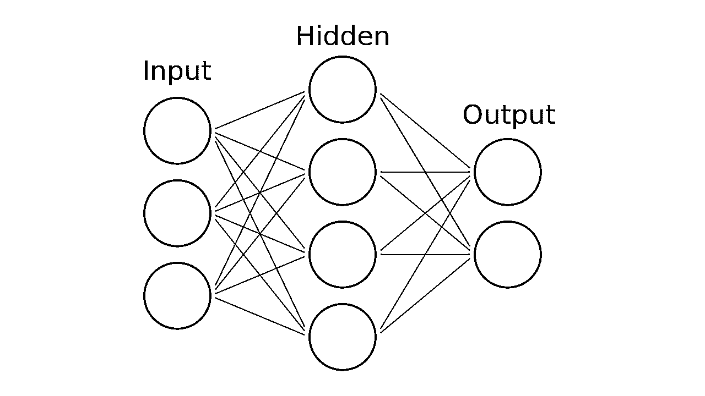
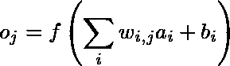
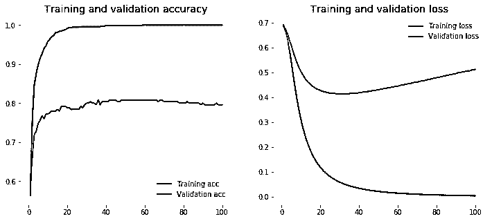
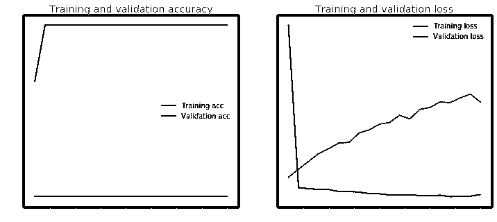
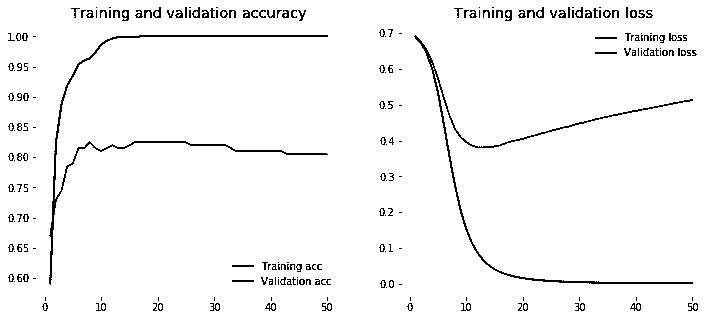
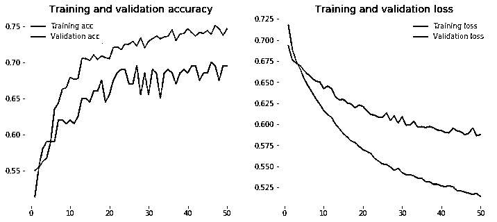
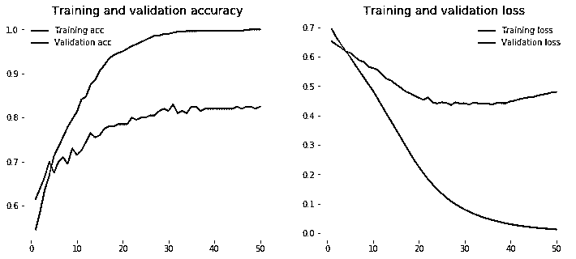
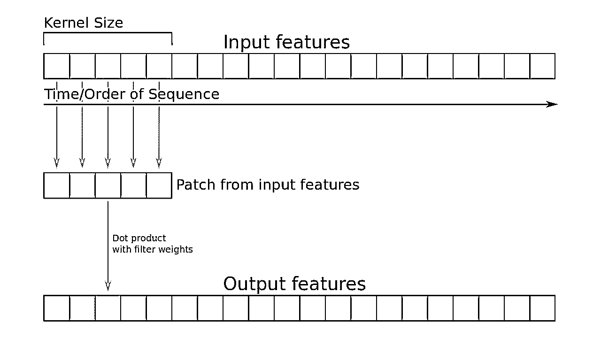
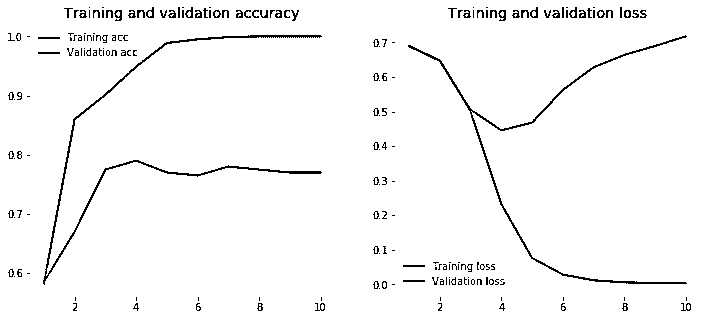

# 用 Python 和 Keras 实现实用的文本分类

> 原文：<https://realpython.com/python-keras-text-classification/>

*立即观看**本教程有真实 Python 团队创建的相关视频课程。和文字教程一起看，加深理解: [**用 Python 和 Keras**](/courses/text-classification-with-keras/) 学习文本分类

想象一下你可以知道网上人们的心情。也许你对它的整体不感兴趣，但前提是人们今天在你最喜欢的社交媒体平台上开心。在本教程之后，你将具备这样做的能力。在这样做的同时，你将掌握(深度)神经网络的当前进展，以及它们如何应用于文本。

用机器学习从文本中读取情绪被称为[情感分析](https://realpython.com/sentiment-analysis-python/)，是文本分类中比较突出的用例之一。这属于非常活跃的研究领域[自然语言处理(NLP)](https://realpython.com/nltk-nlp-python/) 。文本分类的其他常见用例包括检测垃圾邮件、自动标记客户查询以及将文本分类到定义的主题中。那么你如何做到这一点呢？

**免费奖励:** [掌握 Python 的 5 个想法](https://realpython.com/bonus/python-mastery-course/)，这是一个面向 Python 开发者的免费课程，向您展示将 Python 技能提升到下一个水平所需的路线图和心态。

## 选择一个数据集

在开始之前，我们先来看看我们有哪些数据。继续从 UCI 机器学习知识库下载来自[情感标签句子数据集](https://archive.ics.uci.edu/ml/datasets/Sentiment+Labelled+Sentences)的数据集。

顺便说一下，当你想尝试一些算法时，这个存储库是机器学习数据集的一个很好的来源。这个数据集包括来自 IMDb、亚马逊和 Yelp 的标签评论。每篇评论的负面情绪得分为 0，正面情绪得分为 1。

将文件夹解压到一个`data`文件夹中，然后加载带有[熊猫](https://pandas.pydata.org/)的数据:

```py
import pandas as pd

filepath_dict = {'yelp':   'data/sentiment_analysis/yelp_labelled.txt',
                 'amazon': 'data/sentiment_analysis/amazon_cells_labelled.txt',
                 'imdb':   'data/sentiment_analysis/imdb_labelled.txt'}

df_list = []
for source, filepath in filepath_dict.items():
    df = pd.read_csv(filepath, names=['sentence', 'label'], sep='\t')
    df['source'] = source  # Add another column filled with the source name
    df_list.append(df)

df = pd.concat(df_list)
print(df.iloc[0])
```

结果将如下所示:

```py
sentence    Wow... Loved this place.
label                              1
source                          yelp
Name: 0, dtype: object
```

这看起来差不多是对的。有了这个数据集，你就能够训练一个模型来预测一个句子的情感。花一点时间思考一下你将如何预测这些数据。

一种方法是统计每个单词在每个句子中的出现频率，并将这一统计结果与数据集中的所有单词联系起来。你可以从获取数据开始，用所有句子中的所有单词创建一个词汇表。在 NLP 中，文本集合也被称为**语料库**。

本例中的**词汇表**是在我们的文本中出现的单词列表，其中每个单词都有自己的索引。这使你能够为一个句子创建一个向量。然后，你将得到你想要矢量化的句子，并计算词汇中的每一个出现次数。得到的向量将是词汇表的长度和词汇表中每个单词的计数。

得到的向量也被称为**特征向量**。在特征向量中，每个维度可以是数字或分类特征，例如建筑物的高度、股票的价格，或者在我们的情况下，词汇表中的单词计数。这些特征向量是数据科学和机器学习中至关重要的一部分，因为你想要训练的模型取决于它们。

让我们快速说明这一点。想象你有以下两句话:

>>>

```py
>>> sentences = ['John likes ice cream', 'John hates chocolate.']
```

接下来，你可以使用 [scikit-learn](http://scikit-learn.org/) 库提供的 [`CountVectorizer`](http://scikit-learn.org/stable/modules/generated/sklearn.feature_extraction.text.CountVectorizer.html) 对句子进行矢量化。它获取每个句子的单词，并创建一个包含句子中所有独特单词的词汇表。然后，该词汇表可用于创建单词计数的特征向量:

>>>

```py
>>> from sklearn.feature_extraction.text import CountVectorizer

>>> vectorizer = CountVectorizer(min_df=0, lowercase=False)
>>> vectorizer.fit(sentences)
>>> vectorizer.vocabulary_
{'John': 0, 'chocolate': 1, 'cream': 2, 'hates': 3, 'ice': 4, 'likes': 5}
```

这个词汇表也是每个单词的索引。现在，您可以根据之前的词汇，获取每个句子中出现的单词。词汇表由句子中的所有五个单词组成，每个单词代表词汇表中的一个单词。当你用`CountVectorizer`转换前两个句子时，你将得到一个代表句子中每个单词数量的向量:

>>>

```py
>>> vectorizer.transform(sentences).toarray()
array([[1, 0, 1, 0, 1, 1],
 [1, 1, 0, 1, 0, 0]])
```

现在，您可以看到基于前面的词汇得到的每个句子的特征向量。例如，如果你看一下第一项，你可以看到两个向量都有一个`1`。这意味着两个句子都有一个`John`出现，在词汇表中排在第一位。

这被认为是一个[单词包(BOW)](https://en.wikipedia.org/wiki/Bag-of-words_model) 模型，这是 NLP 中从文本中创建向量的一种常用方法。每个文档都表示为一个向量。现在，您可以将这些向量用作机器学习模型的特征向量。这将引导我们进入下一部分，定义基线模型。

[*Remove ads*](/account/join/)

## 定义基线模型

当您使用机器学习时，一个重要的步骤是定义基线模型。这通常涉及一个简单的模型，然后用来与您想要测试的更高级的模型进行比较。在这种情况下，您将使用基线模型将其与涉及(深度)神经网络的更高级的方法进行比较，这是本教程的主要内容。

首先，您将[将数据分成一个训练和测试集](https://realpython.com/train-test-split-python-data/)，这将允许您评估准确性，并查看您的模型是否概括良好。这意味着模型是否能够在以前没有见过的数据上表现良好。这是一种查看模型是否过度拟合的方法。

**过拟合**是指模型在训练数据上训练得太好。您希望避免过度拟合，因为这将意味着模型大部分只是记住了训练数据。这将解释训练数据的高精度，但是测试数据的低精度。

我们从 Yelp 数据集开始，这个数据集是从我们的连接数据集中提取的。从那里，我们把句子和标签。`.values`返回一个 [NumPy 数组](https://docs.scipy.org/doc/numpy-1.15.1/reference/generated/numpy.array.html),而不是一个[熊猫系列](http://pandas.pydata.org/pandas-docs/stable/generated/pandas.Series.html)对象，后者在这个上下文中更容易处理:

>>>

```py
>>> from sklearn.model_selection import train_test_split

>>> df_yelp = df[df['source'] == 'yelp']

>>> sentences = df_yelp['sentence'].values
>>> y = df_yelp['label'].values

>>> sentences_train, sentences_test, y_train, y_test = train_test_split(
...    sentences, y, test_size=0.25, random_state=1000)
```

这里，我们将再次使用之前的 BOW 模型对句子进行矢量化。您可以再次使用`CountVectorizer`来完成该任务。由于在训练期间您可能没有可用的测试数据，因此您可以仅使用训练数据来创建词汇表。使用这个词汇表，您可以为训练和测试集的每个句子创建特征向量:

>>>

```py
>>> from sklearn.feature_extraction.text import CountVectorizer

>>> vectorizer = CountVectorizer()
>>> vectorizer.fit(sentences_train)

>>> X_train = vectorizer.transform(sentences_train)
>>> X_test  = vectorizer.transform(sentences_test)
>>> X_train
<750x2505 sparse matrix of type '<class 'numpy.int64'>'
 with 7368 stored elements in Compressed Sparse Row format>
```

您可以看到，得到的特征向量有 750 个样本，这是我们在训练-测试拆分后的训练样本数。每个样本有 2505 个维度，这是词汇表的大小。同样，你可以看到我们得到了一个稀疏矩阵。这是一种为只有几个非零元素的矩阵优化的数据类型，它只跟踪非零元素，从而减少了内存负载。

`CountVectorizer`执行[标记化](https://en.wikipedia.org/wiki/Lexical_analysis#Tokenization)，将句子分成一组**标记**，就像你之前在词汇表中看到的那样。此外，它还删除了标点符号和特殊字符，并可以对每个单词进行其他预处理。如果您愿意，您可以使用来自 [NLTK](https://realpython.com/python-nltk-sentiment-analysis/) 库中的定制标记器和`CountVectorizer`，或者使用您可以探索的任意数量的定制来提高您的模型的性能。

**注意:**这里我们放弃使用`CountVectorizer()`的许多附加参数，例如添加 **ngrams** ，因为我们的目标是首先建立一个简单的基线模型。令牌模式本身默认为`token_pattern=’(?u)\b\w\w+\b’`，这是一个 [regex](https://realpython.com/regex-python/) 模式，表示“一个单词是由单词边界包围的 2 个或更多的 [Unicode](https://realpython.com/python-encodings-guide/) 单词字符。”。

我们将使用的分类模型是[逻辑回归](https://realpython.com/logistic-regression-python/)，这是一个简单而强大的线性模型，从数学上讲，实际上是基于输入特征向量的 0 和 1 之间的一种回归形式。通过指定临界值(默认为 0.5)，回归模型用于分类。您可以再次使用 scikit-learn 库，它提供了`LogisticRegression`分类器:

>>>

```py
>>> from sklearn.linear_model import LogisticRegression

>>> classifier = LogisticRegression()
>>> classifier.fit(X_train, y_train)
>>> score = classifier.score(X_test, y_test)

>>> print("Accuracy:", score)
Accuracy: 0.796
```

您可以看到逻辑回归达到了令人印象深刻的 79.6%，但让我们看看这个模型在我们拥有的其他数据集上的表现如何。在这个脚本中，我们对我们拥有的每个数据集执行并评估整个过程:

```py
for source in df['source'].unique():
    df_source = df[df['source'] == source]
    sentences = df_source['sentence'].values
    y = df_source['label'].values

    sentences_train, sentences_test, y_train, y_test = train_test_split(
        sentences, y, test_size=0.25, random_state=1000)

    vectorizer = CountVectorizer()
    vectorizer.fit(sentences_train)
    X_train = vectorizer.transform(sentences_train)
    X_test  = vectorizer.transform(sentences_test)

    classifier = LogisticRegression()
    classifier.fit(X_train, y_train)
    score = classifier.score(X_test, y_test)
    print('Accuracy for {} data: {:.4f}'.format(source, score))
```

结果如下:

```py
Accuracy for yelp data: 0.7960
Accuracy for amazon data: 0.7960
Accuracy for imdb data: 0.7487
```

太好了！你可以看到这个相当简单的模型达到了相当好的精度。看看我们是否能超越这种模式将会很有趣。在下一部分中，我们将熟悉(深度)神经网络以及如何将它们应用于文本分类。

## (深度)神经网络初级读本

你可能经历过一些与人工智能和深度学习相关的兴奋和恐惧。你可能无意中发现了一些令人困惑的文章或有关即将到来的[奇点](https://en.wikipedia.org/wiki/Technological_singularity)的 TED 演讲，或者你可能看到了[后空翻机器人](https://www.youtube.com/watch?v=knoOXBLFQ-s)，你想知道在森林里生活到底是否合理。

在一个轻松的话题上，人工智能研究人员都同意，当人工智能超过人类水平的表现时，他们彼此不同意。根据这张[纸](https://arxiv.org/abs/1705.08807)我们应该还有一些时间。

所以你可能已经好奇神经网络是如何工作的。如果你已经熟悉神经网络，请随意跳到涉及 Keras 的部分。此外，如果你想更深入地研究数学，我强烈推荐伊恩·古德费勒写的精彩的深度学习书籍。你可以免费在线阅读整本书。在这一节中，您将对神经网络及其内部工作原理有一个概述，稍后您将看到如何将神经网络与出色的 Keras 库一起使用。

在这篇文章中，你不必担心奇点，但(深度)神经网络在 AI 的最新发展中起着至关重要的作用。这一切都始于 2012 年 [Geoffrey Hinton](https://en.wikipedia.org/wiki/Geoffrey_Hinton) 和他的团队发表的一篇著名的[论文](https://papers.nips.cc/paper/4824-imagenet-classification-with-deep-convolutional-neural-networks.pdf)，这篇论文在著名的 [ImageNet 挑战赛](https://en.wikipedia.org/wiki/ImageNet#ImageNet_Challenge)中胜过了之前所有的模特。

挑战可以被认为是计算机视觉中的世界杯，它涉及到根据给定的标签对一大组图像进行分类。Geoffrey Hinton 和他的团队通过使用[卷积神经网络(CNN)](https://en.wikipedia.org/wiki/Convolutional_neural_network) 成功击败了之前的模型，我们也将在本教程中介绍。

从那以后，神经网络进入了几个领域，包括分类、回归甚至生成模型。最流行的领域包括计算机视觉、语音识别和自然语言处理(NLP)。

神经网络，或有时被称为人工神经网络(ANN)或前馈神经网络，是由人脑中的神经网络模糊启发的计算网络。它们由神经元(也称为节点)组成，如下图所示连接在一起。

首先有一层输入神经元，输入特征向量，然后值被前馈到一个隐藏层。在每一个连接处，你向前馈送值，同时该值被乘以权重，并且偏差被添加到该值。这发生在每一个连接中，最终您会到达一个具有一个或多个输出节点的输出层。

如果您想要有一个二进制分类，您可以使用一个节点，但是如果您有多个类别，您应该为每个类别使用多个节点:

[](https://files.realpython.com/media/ANN.a2284c5d07a3.png)

<figcaption class="figure-caption text-center">Neural network model</figcaption>

您可以拥有任意多的隐藏层。事实上，具有一个以上隐藏层的神经网络被认为是深度神经网络。别担心:我不会在这里深入到关于神经网络的数学深度。但是如果你想对其中的数学有一个直观的理解，你可以看看格兰特·桑德森的 YouTube 播放列表。从一层到下一层的公式是这个简短的等式:

[](https://files.realpython.com/media/njanakiev-neural-network-formula.059738905ae8.png)

<figcaption class="figure-caption text-center">Neural network formula</figcaption>

让我们慢慢解开这里发生了什么。你看，我们这里只处理两层。具有节点`a`的层作为具有节点`o`的层的输入。为了计算每个输出节点的值，我们必须将每个输入节点乘以一个权重`w`并加上一个偏差`b`。

所有这些必须相加并传递给函数`f`。该功能被认为是[激活功能](https://en.wikipedia.org/wiki/Activation_function)，根据层或问题可以使用各种不同的功能。通常使用[整流线性单元(ReLU)](https://en.wikipedia.org/wiki/Rectifier_(neural_networks)) 用于隐藏层，使用 [sigmoid 函数](https://en.wikipedia.org/wiki/Sigmoid_function)用于二进制分类问题的输出层，或者使用 [softmax 函数](https://en.wikipedia.org/wiki/Softmax_function)用于多类分类问题的输出层。

您可能已经想知道权重是如何计算的，这显然是神经网络最重要的部分，但也是最困难的部分。该算法首先用随机值初始化权重，然后用一种叫做[反向传播](https://en.wikipedia.org/wiki/Backpropagation)的方法训练权重。

这是通过使用优化方法(也称为优化器)完成的，如[梯度下降](https://en.wikipedia.org/wiki/Gradient_descent)，以减少计算输出和期望输出(也称为目标输出)之间的误差。这个误差是由一个[损失函数](https://en.wikipedia.org/wiki/Loss_function)决定的，我们希望通过优化器最小化它的损失。整个过程太广泛了，无法在这里涵盖，但我会再次参考 Grant Sanderson 播放列表和我之前提到的 Ian Goodfellow 的深度学习书籍。

你要知道的是，你可以使用的优化方法有很多种，但是目前最常用的优化器叫做 [Adam](https://arxiv.org/abs/1412.6980) 在各种问题中都有不错的表现。

您也可以使用不同的损失函数，但在本教程中，您将只需要[交叉熵](https://en.wikipedia.org/wiki/Cross_entropy)损失函数，或者更具体地说，用于二进制分类问题的二进制交叉熵。一定要尝试各种可用的方法和工具。一些研究人员甚至在最近的一篇[文章](http://www.sciencemag.org/news/2018/05/ai-researchers-allege-machine-learning-alchemy?es_p=6976017)中声称，对最佳执行方法的选择近乎炼金术。原因是许多方法没有得到很好的解释，并且包含了大量的调整和测试。

[*Remove ads*](/account/join/)

### 介绍 Keras

[Keras](https://keras.io/) 是由[Fran ois Chollet](https://twitter.com/fchollet)开发的深度学习和神经网络 API，能够运行在 [Tensorflow](https://www.tensorflow.org/) (谷歌) [Theano](http://deeplearning.net/software/theano/) 或 [CNTK](https://www.microsoft.com/en-us/cognitive-toolkit/) (微软)之上。引用 Franç ois Chollet 的精彩著作*用 Python 进行深度学习*:

> Keras 是一个模型级的库，为开发深度学习模型提供了高级别的构建模块。它不处理张量操作和微分等低级操作。相反，它依靠一个专门的、优化良好的张量库来完成这项工作，充当 Keras 的后端引擎

这是一个开始尝试神经网络的好方法，而不必自己实现每一层和每一部分。例如 [Tensorflow](https://realpython.com/pytorch-vs-tensorflow/) 是一个很棒的机器学习库，但是你必须实现许多样板代码来运行一个模型。

### 安装 Keras

在安装 Keras 之前，您需要 Tensorflow、Theano 或 CNTK。在本教程中，我们将使用 Tensorflow，所以请查看他们的安装指南[这里](https://github.com/tensorflow/tensorflow#download-and-setup)，但是请随意使用任何最适合您的框架。Keras 可以通过以下命令使用 [PyPI](https://pypi.org/) 进行安装:

```py
$ pip install keras
```

您可以通过打开 Keras 配置文件来选择您想要的后端，您可以在这里找到:

```py
$HOME/.keras/keras.json
```

如果你是 Windows 用户，你得把`$HOME`换成`%USERPROFILE%`。配置文件应该如下所示:

```py
{ "image_data_format":  "channels_last", "epsilon":  1e-07, "floatx":  "float32", "backend":  "tensorflow" }
```

假设您已经在机器上安装了后端，您可以将这里的`backend`字段更改为`"theano"`、`"tensorflow"`或`"cntk"`。更多细节请查看 [Keras 后端](https://keras.io/backend/)文档。

您可能会注意到，我们在配置文件中使用了`float32`数据。之所以这样，是因为神经网络在 GPU 中的使用频率很高，计算瓶颈是内存。通过使用 32 位，我们能够减少内存负载，并且在此过程中不会丢失太多信息。

### 您的第一款 Keras 车型

现在你终于准备好试验 Keras 了。Keras 支持两种主要类型的模型。您将在本教程中看到使用的[顺序模型 API](https://keras.io/models/sequential/) 和[功能 API](https://keras.io/models/model/) ，它们可以完成顺序模型的所有工作，但也可以用于具有复杂网络架构的高级模型。

顺序模型是层的线性堆栈，您可以在其中使用 Keras 中的大量可用层。最常见的层是[密集](https://keras.io/layers/core/#dense)层，这是一个常规的密集连接的神经网络层，具有您已经熟悉的所有权重和偏差。

让我们看看是否可以对我们之前的逻辑回归模型进行一些改进。您可以使用在前面的例子中构建的`X_train`和`X_test`数组。

在我们建立模型之前，我们需要知道特征向量的输入维数。这仅发生在第一层，因为随后的层可以进行自动形状推断。为了构建顺序模型，可以按如下顺序逐个添加层:

>>>

```py
>>> from keras.models import Sequential
>>> from keras import layers

>>> input_dim = X_train.shape[1]  # Number of features

>>> model = Sequential()
>>> model.add(layers.Dense(10, input_dim=input_dim, activation='relu'))
>>> model.add(layers.Dense(1, activation='sigmoid'))
Using TensorFlow backend.
```

在开始训练模型之前，您需要配置学习过程。这是通过`.compile()`方法完成的。这个方法指定了优化器和损失函数。

此外，您可以添加一个稍后可用于评估的指标列表，但它们不会影响培训。在这种情况下，我们希望使用二进制交叉熵和 Adam 优化器，您可以在前面提到的初级读本中看到。Keras 还包括一个方便的`.summary()`函数，用于给出模型和可用于训练的参数数量的概述:

>>>

```py
>>> model.compile(loss='binary_crossentropy', 
...               optimizer='adam', 
...               metrics=['accuracy'])
>>> model.summary()
_________________________________________________________________
Layer (type)                 Output Shape          Param # 
=================================================================
dense_1 (Dense)              (None, 10)            25060 
_________________________________________________________________
dense_2 (Dense)              (None, 1)             11 
=================================================================
Total params: 25,071
Trainable params: 25,071
Non-trainable params: 0
_________________________________________________________________
```

您可能会注意到，第一层有 25060 个参数，第二层有 11 个参数。这些是从哪里来的？

每个特征向量有 2505 个维度，然后我们有 10 个节点。我们需要每个特征维度和每个节点的权重，这说明了`2505 * 10 = 25050`参数，然后我们为每个节点增加了另外 10 倍的偏差，这就得到 25060 个参数。在最后一个节点中，我们有另外 10 个权重和一个偏差，这样我们就有了 11 个参数。这两层总共有 25071 个参数。

整洁！你就快到了。现在是使用`.fit()`功能开始训练的时候了。

由于神经网络中的训练是一个迭代过程，训练不会在完成后就停止。您必须指定您希望模型训练的迭代次数。那些完成的迭代通常被称为**时期**。我们希望运行它 100 个时期，以便能够看到在每个时期之后训练损失和准确性是如何变化的。

您选择的另一个参数是**批量**。批量大小决定了我们希望在一个时期中使用多少样本，这意味着在一次向前/向后传递中使用多少样本。这提高了计算的速度，因为它需要更少的历元来运行，但它也需要更多的内存，并且模型可能随着更大的批量而降级。因为我们有一个小的训练集，我们可以把它留给一个小的批量:

>>>

```py
>>> history = model.fit(X_train, y_train,
...                     epochs=100,
...                     verbose=False,
...                     validation_data=(X_test, y_test),
...                     batch_size=10)
```

现在你可以用`.evaluate()`的方法来衡量模型的精度。对于训练数据和测试数据，您都可以这样做。我们期望训练数据比测试数据具有更高的准确性。你训练一个神经网络的时间越长，它越有可能开始过度拟合。

请注意，如果您重新运行`.fit()`方法，您将从之前训练中计算出的重量开始。再次开始训练模型之前，请务必致电`clear_session()`:

>>>

```py
>>> from keras.backend import clear_session
>>> clear_session()
```

现在让我们评估模型的准确性:

>>>

```py
>>> loss, accuracy = model.evaluate(X_train, y_train, verbose=False)
>>> print("Training Accuracy: {:.4f}".format(accuracy))
>>> loss, accuracy = model.evaluate(X_test, y_test, verbose=False)
>>> print("Testing Accuracy: {:.4f}".format(accuracy))
Training Accuracy: 1.0000
Testing Accuracy:  0.7754
```

您已经可以看到该模型过度拟合，因为它达到了训练集的 100%准确性。但是这是意料之中的，因为对于这个模型来说，历元的数量相当大。然而，测试集的准确性已经超过了我们以前用 BOW 模型进行的逻辑回归，这是我们进步的一大步。

为了让您的生活更轻松，您可以使用这个小助手功能来可视化基于[历史](https://keras.io/callbacks/#history)回调的训练和测试数据的损失和准确性。这个自动应用于每个 Keras 模型的回调记录了损失和可以添加到`.fit()`方法中的额外的[指标](https://keras.io/metrics/)。在这种情况下，我们只对准确性感兴趣。该辅助函数使用了 [matplotlib](https://matplotlib.org/) 绘图库:

```py
import matplotlib.pyplot as plt
plt.style.use('ggplot')

def plot_history(history):
    acc = history.history['acc']
    val_acc = history.history['val_acc']
    loss = history.history['loss']
    val_loss = history.history['val_loss']
    x = range(1, len(acc) + 1)

    plt.figure(figsize=(12, 5))
    plt.subplot(1, 2, 1)
    plt.plot(x, acc, 'b', label='Training acc')
    plt.plot(x, val_acc, 'r', label='Validation acc')
    plt.title('Training and validation accuracy')
    plt.legend()
    plt.subplot(1, 2, 2)
    plt.plot(x, loss, 'b', label='Training loss')
    plt.plot(x, val_loss, 'r', label='Validation loss')
    plt.title('Training and validation loss')
    plt.legend()
```

要使用这个函数，只需用收集到的精度和损失在`history`字典中调用`plot_history()`:

>>>

```py
>>> plot_history(history)
```

[](https://files.realpython.com/media/loss-accuracy-baseline-model.ed95465579bd.png)

<figcaption class="figure-caption text-center">Accuracy and loss for baseline model</figcaption>

你可以看到，自从训练集达到 100%的准确率以来，我们已经训练了我们的模型太长时间。观察模型何时开始过度拟合的一个好方法是验证数据的丢失何时开始再次上升。这往往是停止模型的好时机。在本次培训中，您可以看到大约 20-40 个时期。

**注意:**训练神经网络时，应该使用单独的测试和验证集。您通常会做的是选择具有最高验证准确性的模型，然后用测试集测试该模型。

这可以确保您不会过度拟合模型。使用验证集来选择最佳模型是一种形式的**数据泄露**(或“作弊”)来从数百个模型中挑选出产生最佳测试分数的结果。当模型中使用了训练数据集之外的信息时，就会发生数据泄漏。

在这种情况下，我们的测试和验证集是相同的，因为我们有一个较小的样本量。正如我们之前讨论过的，当你拥有大量样本时，(深度)神经网络表现最佳。在下一部分中，您将看到将单词表示为向量的不同方式。这是一种非常令人兴奋和强大的处理单词的方式，您将看到如何将单词表示为密集向量。

[*Remove ads*](/account/join/)

## 什么是单词嵌入？

文本被视为序列数据的一种形式，类似于天气数据或金融数据中的时序数据。在前面的 BOW 模型中，您已经看到了如何将整个单词序列表示为单个特征向量。现在你将看到如何用向量来表示每个单词。对文本进行矢量化有多种方法，例如:

*   由每个单词作为向量表示的单词
*   由每个字符作为向量表示的字符
*   用向量表示的单词/字符的 N 元语法(N 元语法是文本中多个连续单词/字符的重叠组)

在本教程中，您将看到如何将单词表示为向量，这是在神经网络中使用文本的常见方式。将单词表示为向量的两种可能方式是一键编码和单词嵌入。

### 一键编码

将单词表示为向量的第一种方法是创建一个所谓的 [one-hot](https://en.wikipedia.org/wiki/One-hot) 编码，这可以简单地通过为语料库中的每个单词取一个词汇长度的向量来完成。

这样，对于每个单词，假设它在词汇表中有一个点，你就有了一个向量，除了该单词的对应点被设置为 1 之外，其他地方都是 0。正如你可能想象的那样，这可能成为每个单词的一个相当大的向量，并且它不提供任何额外的信息，如单词之间的关系。

假设您有一个城市列表，如下例所示:

>>>

```py
>>> cities = ['London', 'Berlin', 'Berlin', 'New York', 'London']
>>> cities
['London', 'Berlin', 'Berlin', 'New York', 'London']
```

您可以使用 scikit-learn 和`LabelEncoder`将城市列表编码成分类整数值，如下所示:

>>>

```py
>>> from sklearn.preprocessing import LabelEncoder

>>> encoder = LabelEncoder()
>>> city_labels = encoder.fit_transform(cities)
>>> city_labels
array([1, 0, 0, 2, 1])
```

使用这个表示，您可以使用 scikit-learn 提供的`OneHotEncoder`将我们之前得到的分类值编码成一个一键编码的数字数组。`OneHotEncoder`期望每个分类值都在单独的行中，因此您需要调整数组的形状，然后您可以应用编码器:

>>>

```py
>>> from sklearn.preprocessing import OneHotEncoder

>>> encoder = OneHotEncoder(sparse=False)
>>> city_labels = city_labels.reshape((5, 1))
>>> encoder.fit_transform(city_labels)
array([[0., 1., 0.],
 [1., 0., 0.],
 [1., 0., 0.],
 [0., 0., 1.],
 [0., 1., 0.]])
```

您可以看到分类整数值表示数组的位置，即`1`和剩余的`0`。当您有一个无法用数值表示的分类特征，但您仍然希望能够在机器学习中使用它时，通常会使用这种方法。这种编码的一个用例当然是文本中的单词，但它主要用于类别。例如，这些类别可以是城市、部门或其他类别。

### 单词嵌入

这种方法将单词表示为密集单词向量(也称为单词嵌入),与硬编码的一键编码不同，这种方法是经过训练的。这意味着单词嵌入在更少的维度中收集更多的信息。

请注意，单词嵌入不像人类那样理解文本，而是映射语料库中使用的语言的统计结构。他们的目标是将语义映射到几何空间。这个几何空间然后被称为**嵌入空间**。

这将在嵌入空间上映射语义相似的单词，如数字或颜色。如果嵌入很好地捕捉了单词之间的关系，像向量算术这样的事情应该成为可能。这一研究领域的一个著名例子是绘制[国王-男人+女人=王后](https://www.technologyreview.com/s/541356/king-man-woman-queen-the-marvelous-mathematics-of-computational-linguistics/)的能力。

怎么能得到这样的文字嵌入呢？你有两个选择。一种方法是在训练神经网络的过程中训练你的单词嵌入。另一种方法是使用预训练的单词嵌入，您可以直接在模型中使用。在那里，你可以选择在训练期间保持这些单词嵌入不变，或者你也训练它们。

现在您需要将数据标记成单词 embeddings 可以使用的格式。Keras 为[文本预处理](https://keras.io/preprocessing/text/)和[序列预处理](https://keras.io/preprocessing/sequence/)提供了一些方便的方法，你可以用它们来准备你的文本。

您可以从使用`Tokenizer`实用程序类开始，它可以将文本语料库矢量化为整数列表。每个整数映射到对整个语料库进行编码的字典中的一个值，字典中的键就是词汇项本身。可以添加参数`num_words`，负责设置词汇量的大小。最常见的`num_words`词汇将被保留。我有从前面的例子中准备的测试和训练数据:

>>>

```py
>>> from keras.preprocessing.text import Tokenizer

>>> tokenizer = Tokenizer(num_words=5000)
>>> tokenizer.fit_on_texts(sentences_train)

>>> X_train = tokenizer.texts_to_sequences(sentences_train)
>>> X_test = tokenizer.texts_to_sequences(sentences_test)

>>> vocab_size = len(tokenizer.word_index) + 1  # Adding 1 because of reserved 0 index

>>> print(sentences_train[2])
>>> print(X_train[2])
Of all the dishes, the salmon was the best, but all were great.
[11, 43, 1, 171, 1, 283, 3, 1, 47, 26, 43, 24, 22]
```

索引是在文本中最常见的单词之后排序的，您可以通过单词`the`的索引`1`看到这一点。值得注意的是，索引`0`是保留的，没有分配给任何单词。这个零索引用于填充，我稍后会介绍。

未知单词(不在词汇表中的单词)在 Keras 中用`word_count + 1`表示，因为它们也可以保存一些信息。通过查看`Tokenizer`对象的`word_index`字典，可以看到每个单词的索引:

>>>

```py
>>> for word in ['the', 'all', 'happy', 'sad']:
...     print('{}: {}'.format(word, tokenizer.word_index[word]))
the: 1
all: 43
happy: 320
sad: 450
```

**注:**密切注意该技术与 scikit-learn 的`CountVectorizer`生产的`X_train`的区别。

使用`CountVectorizer`，我们有单词计数的堆叠向量，并且每个向量都是相同的长度(总语料库词汇的大小)。使用 Tokenizer，得到的向量等于每个文本的长度，数字不表示计数，而是对应于字典`tokenizer.word_index`中的单词值。

我们面临的一个问题是，在大多数情况下，每个文本序列都有不同的单词长度。为了解决这个问题，你可以使用`pad_sequence()`，它简单地用零填充单词序列。默认情况下，它会在前面加上零，但我们想在后面加上零。通常情况下，无论是预先添加还是附加零都没有关系。

此外，您可能希望添加一个`maxlen`参数来指定序列应该有多长。这将删除超过该数字的序列。在下面的代码中，您可以看到如何用 Keras 填充序列:

>>>

```py
>>> from keras.preprocessing.sequence import pad_sequences

>>> maxlen = 100

>>> X_train = pad_sequences(X_train, padding='post', maxlen=maxlen)
>>> X_test = pad_sequences(X_test, padding='post', maxlen=maxlen)

>>> print(X_train[0, :])
[  1  10   3 282 739  25   8 208  30  64 459 230  13   1 124   5 231   8
 58   5  67   0   0   0   0   0   0   0   0   0   0   0   0   0   0   0
 0   0   0   0   0   0   0   0   0   0   0   0   0   0   0   0   0   0
 0   0   0   0   0   0   0   0   0   0   0   0   0   0   0   0   0   0
 0   0   0   0   0   0   0   0   0   0   0   0   0   0   0   0   0   0
 0   0   0   0   0   0   0   0   0   0]
```

第一个值表示词汇表中的索引，您已经从前面的示例中了解到了这一点。您还可以看到，得到的特征向量主要包含零，因为您有一个相当短的句子。在下一部分中，您将看到如何在 Keras 中使用单词嵌入。

[*Remove ads*](/account/join/)

### Keras 嵌入层

注意，在这一点上，我们的数据仍然是硬编码的。我们没有告诉 Keras 通过连续的任务学习新的嵌入空间。现在，您可以使用 Keras 的[嵌入层](https://keras.io/layers/embeddings/),它获取之前计算的整数，并将它们映射到嵌入的密集向量。您将需要以下参数:

*   **`input_dim` :** 词汇量的大小
*   **`output_dim` :** 密集向量的大小
*   **`input_length`:序列的长度**

有了`Embedding`层，我们现在有几个选项。一种方法是将嵌入层的输出插入到一个`Dense`层。为了做到这一点，你必须在它们之间添加一个`Flatten`层，为`Dense`层准备顺序输入:

```py
from keras.models import Sequential
from keras import layers

embedding_dim = 50

model = Sequential()
model.add(layers.Embedding(input_dim=vocab_size, 
                           output_dim=embedding_dim, 
                           input_length=maxlen))
model.add(layers.Flatten())
model.add(layers.Dense(10, activation='relu'))
model.add(layers.Dense(1, activation='sigmoid'))
model.compile(optimizer='adam',
              loss='binary_crossentropy',
              metrics=['accuracy'])
model.summary()
```

结果将如下所示:

```py
_________________________________________________________________
Layer (type)                 Output Shape              Param # 
=================================================================
embedding_8 (Embedding)      (None, 100, 50)           87350 
_________________________________________________________________
flatten_3 (Flatten)          (None, 5000)              0 
_________________________________________________________________
dense_13 (Dense)             (None, 10)                50010 
_________________________________________________________________
dense_14 (Dense)             (None, 1)                 11 
=================================================================
Total params: 137,371
Trainable params: 137,371
Non-trainable params: 0
_________________________________________________________________
```

您现在可以看到，我们有 87350 个新参数需要训练。这个数字来自于`vocab_size`乘以`embedding_dim`。嵌入层的这些权重用随机权重初始化，然后在训练期间通过反向传播进行调整。这个模型将单词按照它们在句子中的顺序作为输入向量。您可以通过以下方式训练它:

```py
history = model.fit(X_train, y_train,
                    epochs=20,
                    verbose=False,
                    validation_data=(X_test, y_test),
                    batch_size=10)
loss, accuracy = model.evaluate(X_train, y_train, verbose=False)
print("Training Accuracy: {:.4f}".format(accuracy))
loss, accuracy = model.evaluate(X_test, y_test, verbose=False)
print("Testing Accuracy: {:.4f}".format(accuracy))
plot_history(history)
```

结果将如下所示:

```py
Training Accuracy: 0.5100
Testing Accuracy:  0.4600
```

[](https://files.realpython.com/media/loss-accuracy-first-model.95140204b674.png)

<figcaption class="figure-caption text-center">Accuracy and loss for first model</figcaption>

正如您在性能中看到的那样，这通常不是处理顺序数据的非常可靠的方式。当处理顺序数据时，您希望关注查看本地和顺序信息而不是绝对位置信息的方法。

另一种处理嵌入的方法是在嵌入后使用`MaxPooling1D` / `AveragePooling1D`或`GlobalMaxPooling1D` / `GlobalAveragePooling1D`层。你可以把合并图层看作是对引入的特征向量进行[下采样](https://en.wikipedia.org/wiki/Decimation_(signal_processing))(一种减小尺寸的方法)的一种方式。

在最大池的情况下，对于每个特征尺寸，取池中所有特征的最大值。在平均池的情况下，您取平均值，但最大池似乎更常用，因为它突出了大值。

全局最大/平均池取所有特性的最大值/平均值，而在其他情况下，您必须定义池大小。Keras 也有自己的层，可以添加到顺序模型中:

```py
from keras.models import Sequential
from keras import layers

embedding_dim = 50

model = Sequential()
model.add(layers.Embedding(input_dim=vocab_size, 
                           output_dim=embedding_dim, 
                           input_length=maxlen))
model.add(layers.GlobalMaxPool1D())
model.add(layers.Dense(10, activation='relu'))
model.add(layers.Dense(1, activation='sigmoid'))
model.compile(optimizer='adam',
              loss='binary_crossentropy',
              metrics=['accuracy'])
model.summary()
```

结果将如下所示:

```py
_________________________________________________________________
Layer (type)                 Output Shape              Param # 
=================================================================
embedding_9 (Embedding)      (None, 100, 50)           87350 
_________________________________________________________________
global_max_pooling1d_5 (Glob (None, 50)                0 
_________________________________________________________________
dense_15 (Dense)             (None, 10)                510 
_________________________________________________________________
dense_16 (Dense)             (None, 1)                 11 
=================================================================
Total params: 87,871
Trainable params: 87,871
Non-trainable params: 0
_________________________________________________________________
```

培训程序不变:

```py
history = model.fit(X_train, y_train,
                    epochs=50,
                    verbose=False,
                    validation_data=(X_test, y_test),
                    batch_size=10)
loss, accuracy = model.evaluate(X_train, y_train, verbose=False)
print("Training Accuracy: {:.4f}".format(accuracy))
loss, accuracy = model.evaluate(X_test, y_test, verbose=False)
print("Testing Accuracy: {:.4f}".format(accuracy))
plot_history(history)
```

结果将如下所示:

```py
Training Accuracy: 1.0000
Testing Accuracy:  0.8050
```

[](https://files.realpython.com/media/loss-accurcay-max-pooling.5f0987b44c65.png)

<figcaption class="figure-caption text-center">Accuracy and loss for max pooling model</figcaption>

你已经可以看到我们的模型有了一些改进。接下来，您将看到我们如何使用预训练的单词嵌入，以及它们是否有助于我们的模型。

[*Remove ads*](/account/join/)

### 使用预训练的单词嵌入

我们刚刚看到了一个联合学习单词嵌入的例子，它被整合到我们想要解决的更大的模型中。

一种替代方案是使用预计算的嵌入空间，该嵌入空间利用了大得多的语料库。通过简单地在大型文本语料库上训练它们，可以预先计算单词嵌入。其中最流行的方法是谷歌开发的 [Word2Vec](https://papers.nips.cc/paper/5021-distributed-representations-of-words-and-phrases-and-their-compositionality.pdf) 和斯坦福 NLP 小组开发的 [GloVe](https://nlp.stanford.edu/projects/glove/) (单词表示的全局向量)。

请注意，这些是目标相同的不同方法。Word2Vec 通过使用神经网络来实现这一点，GloVe 通过使用共生矩阵和矩阵分解来实现这一点。在这两种情况下，你都在处理降维，但 Word2Vec 更准确，GloVe 计算更快。

在本教程中，您将看到如何使用斯坦福大学 NLP 小组的 GloVe 单词嵌入，因为它们的大小比 Google 提供的 Word2Vec 单词嵌入更易于管理。继续从[这里](https://nlp.stanford.edu/projects/glove/) ( `glove.6B.zip`，822 MB)下载 6B(训练有素的 60 亿字)单词嵌入。

你还可以在主 [GloVe](https://nlp.stanford.edu/projects/glove/) 页面上找到其他单词嵌入。你可以在这里找到谷歌[预训练的 Word2Vec 嵌入。如果你想训练你自己的单词嵌入，你可以通过使用 Word2Vec 进行计算的](https://code.google.com/archive/p/word2vec/) [gensim](https://radimrehurek.com/gensim/index.html) Python 包来有效地完成。关于如何做到这一点的更多细节[在这里](https://radimrehurek.com/gensim/models/word2vec.html)。

既然我们已经介绍了您，您可以开始在您的模型中使用嵌入这个词了。你可以在下一个例子中看到如何加载嵌入矩阵。文件中的每一行都以单词开始，后面是特定单词的嵌入向量。

这是一个有 400000 行的大文件，每行代表一个单词，后跟一个作为浮点流的向量。例如，下面是第一行的前 50 个字符:

```py
$ head -n 1 data/glove_word_embeddings/glove.6B.50d.txt | cut -c-50
 the 0.418 0.24968 -0.41242 0.1217 0.34527 -0.04445
```

因为你不需要所有的单词，你可以只关注我们词汇表中的单词。由于我们的词汇表中只有有限数量的单词，我们可以跳过预训练单词嵌入中的 40000 个单词中的大部分:

```py
import numpy as np

def create_embedding_matrix(filepath, word_index, embedding_dim):
    vocab_size = len(word_index) + 1  # Adding again 1 because of reserved 0 index
    embedding_matrix = np.zeros((vocab_size, embedding_dim))

    with open(filepath) as f:
        for line in f:
            word, *vector = line.split()
            if word in word_index:
                idx = word_index[word] 
                embedding_matrix[idx] = np.array(
                    vector, dtype=np.float32)[:embedding_dim]

    return embedding_matrix
```

您现在可以使用此函数来检索嵌入矩阵:

>>>

```py
>>> embedding_dim = 50
>>> embedding_matrix = create_embedding_matrix(
...     'data/glove_word_embeddings/glove.6B.50d.txt',
...     tokenizer.word_index, embedding_dim)
```

精彩！现在，您可以在训练中使用嵌入矩阵了。让我们继续使用以前的具有全局最大池的网络，看看我们是否可以改进这个模型。当您使用预训练的单词嵌入时，您可以选择允许嵌入在训练期间更新，或者只使用得到的嵌入向量。

首先，让我们快速看一下有多少嵌入向量是非零的:

>>>

```py
>>> nonzero_elements = np.count_nonzero(np.count_nonzero(embedding_matrix, axis=1))
>>> nonzero_elements / vocab_size
0.9507727532913566
```

这意味着预训练模型覆盖了 95.1%的词汇，这很好地覆盖了我们的词汇。让我们来看看使用`GlobalMaxPool1D`层时的性能:

```py
model = Sequential()
model.add(layers.Embedding(vocab_size, embedding_dim, 
                           weights=[embedding_matrix], 
                           input_length=maxlen, 
                           trainable=False))
model.add(layers.GlobalMaxPool1D())
model.add(layers.Dense(10, activation='relu'))
model.add(layers.Dense(1, activation='sigmoid'))
model.compile(optimizer='adam',
              loss='binary_crossentropy',
              metrics=['accuracy'])
model.summary()
```

结果将如下所示:

```py
_________________________________________________________________
Layer (type)                 Output Shape              Param # 
=================================================================
embedding_10 (Embedding)     (None, 100, 50)           87350 
_________________________________________________________________
global_max_pooling1d_6 (Glob (None, 50)                0 
_________________________________________________________________
dense_17 (Dense)             (None, 10)                510 
_________________________________________________________________
dense_18 (Dense)             (None, 1)                 11 
=================================================================
Total params: 87,871
Trainable params: 521
Non-trainable params: 87,350
_________________________________________________________________
```

```py
history = model.fit(X_train, y_train,
                    epochs=50,
                    verbose=False,
                    validation_data=(X_test, y_test),
                    batch_size=10)
loss, accuracy = model.evaluate(X_train, y_train, verbose=False)
print("Training Accuracy: {:.4f}".format(accuracy))
loss, accuracy = model.evaluate(X_test, y_test, verbose=False)
print("Testing Accuracy: {:.4f}".format(accuracy))
plot_history(history)
```

结果将如下所示:

```py
Training Accuracy: 0.7500
Testing Accuracy:  0.6950
```

[](https://files.realpython.com/media/loss-accuracy-embedding-untrained.230bc90c5536.png)

<figcaption class="figure-caption text-center">Accuracy and loss for untrained word embeddings</figcaption>

因为单词嵌入没有被额外训练，所以预期它会更低。但是现在让我们看看，如果我们允许使用`trainable=True`来训练嵌入，这是如何执行的:

```py
model = Sequential()
model.add(layers.Embedding(vocab_size, embedding_dim, 
                           weights=[embedding_matrix], 
                           input_length=maxlen, 
                           trainable=True))
model.add(layers.GlobalMaxPool1D())
model.add(layers.Dense(10, activation='relu'))
model.add(layers.Dense(1, activation='sigmoid'))
model.compile(optimizer='adam',
              loss='binary_crossentropy',
              metrics=['accuracy'])
model.summary()
```

结果将如下所示:

```py
_________________________________________________________________
Layer (type)                 Output Shape              Param # 
=================================================================
embedding_11 (Embedding)     (None, 100, 50)           87350 
_________________________________________________________________
global_max_pooling1d_7 (Glob (None, 50)                0 
_________________________________________________________________
dense_19 (Dense)             (None, 10)                510 
_________________________________________________________________
dense_20 (Dense)             (None, 1)                 11 
=================================================================
Total params: 87,871
Trainable params: 87,871
Non-trainable params: 0
_________________________________________________________________
```

```py
history = model.fit(X_train, y_train,
                    epochs=50,
                    verbose=False,
                    validation_data=(X_test, y_test),
                    batch_size=10)
loss, accuracy = model.evaluate(X_train, y_train, verbose=False)
print("Training Accuracy: {:.4f}".format(accuracy))
loss, accuracy = model.evaluate(X_test, y_test, verbose=False)
print("Testing Accuracy: {:.4f}".format(accuracy))
plot_history(history)
```

结果将如下所示:

```py
Training Accuracy: 1.0000
Testing Accuracy:  0.8250
```

[](https://files.realpython.com/media/loss-accuracy-embedding-trained.2e33069d7103.png)

<figcaption class="figure-caption text-center">Accuracy and Loss for pretrained word embeddings</figcaption>

你可以看到允许嵌入被训练是最有效的。当处理大型训练集时，它可以提高训练过程的速度。对我们来说，这似乎有所帮助，但帮助不大。这不一定是因为预训练的单词嵌入。

现在是时候专注于更先进的神经网络模型，看看是否有可能提升该模型，并使其领先于以前的模型。

[*Remove ads*](/account/join/)

## 卷积神经网络(CNN)

卷积神经网络也称为 **convnets** 是近年来机器学习领域最令人兴奋的发展之一。

他们通过能够从图像中提取特征并将其用于神经网络，彻底改变了图像分类和计算机视觉。使它们在图像处理中有用的特性也使它们便于序列处理。你可以把 CNN 想象成一个专门的神经网络，能够检测特定的模式。

如果它只是另一个神经网络，那么它与你之前所学的有什么区别呢？

CNN 有隐藏层，称为卷积层。当你想到图像时，计算机必须处理一个二维数字矩阵，因此你需要某种方法来检测这个矩阵中的特征。这些卷积层能够检测边缘、角落和其他种类的纹理，这使它们成为如此特殊的工具。卷积层由多个滤波器组成，这些滤波器在图像上滑动，能够检测特定的特征。

这是技术的核心，卷积的数学过程。随着每个卷积层，网络能够检测更复杂的模式。在 Chris Olah 的[特征可视化](https://distill.pub/2017/feature-visualization/)中，你可以很好地直觉这些特征看起来像什么。

当你处理像文本这样的顺序数据时，你处理的是一维卷积，但是概念和应用程序是一样的。你仍然需要在序列中挑选模式，随着卷积层的增加，这些模式变得更加复杂。

在下图中，您可以看到这种卷积是如何工作的。它首先获取一个具有过滤器内核大小的输入特征补丁。有了这个补丁，你就可以得到滤镜的乘法权重的点积。一维 convnet 对于平移是不变的，这意味着某些序列可以在不同的位置被识别。这对文本中的某些模式很有帮助:

[](https://files.realpython.com/media/njanakiev-1d-convolution.d7afddde2776.png)

<figcaption class="figure-caption text-center">1D Convolution ([Image source](https://realpython.com/asins/1617294438/))</figcaption>

现在让我们看看如何在 Keras 中使用这个网络。Keras 再次提供了各种[卷积层](https://keras.io/layers/convolutional/)，你可以使用这个任务。你需要的层是`Conv1D`层。这一层又有各种参数可供选择。您现在感兴趣的是过滤器的数量、内核大小和激活函数。你可以在`Embedding`层和`GlobalMaxPool1D`层之间添加这一层:

```py
embedding_dim = 100

model = Sequential()
model.add(layers.Embedding(vocab_size, embedding_dim, input_length=maxlen))
model.add(layers.Conv1D(128, 5, activation='relu'))
model.add(layers.GlobalMaxPooling1D())
model.add(layers.Dense(10, activation='relu'))
model.add(layers.Dense(1, activation='sigmoid'))
model.compile(optimizer='adam',
              loss='binary_crossentropy',
              metrics=['accuracy'])
model.summary()
```

结果将如下所示:

```py
_________________________________________________________________
Layer (type)                 Output Shape              Param # 
=================================================================
embedding_13 (Embedding)     (None, 100, 100)          174700 
_________________________________________________________________
conv1d_2 (Conv1D)            (None, 96, 128)           64128 
_________________________________________________________________
global_max_pooling1d_9 (Glob (None, 128)               0 
_________________________________________________________________
dense_23 (Dense)             (None, 10)                1290 
_________________________________________________________________
dense_24 (Dense)             (None, 1)                 11 
=================================================================
Total params: 240,129
Trainable params: 240,129
Non-trainable params: 0
_________________________________________________________________
```

```py
history = model.fit(X_train, y_train,
                    epochs=10,
                    verbose=False,
                    validation_data=(X_test, y_test),
                    batch_size=10)
loss, accuracy = model.evaluate(X_train, y_train, verbose=False)
print("Training Accuracy: {:.4f}".format(accuracy))
loss, accuracy = model.evaluate(X_test, y_test, verbose=False)
print("Testing Accuracy: {:.4f}".format(accuracy))
plot_history(history)
```

结果将如下所示:

```py
Training Accuracy: 1.0000
Testing Accuracy:  0.7700
```

[](https://files.realpython.com/media/loss-accuracy-convolution-model.35563e05ba91.png)

<figcaption class="figure-caption text-center">Accuracy and loss for convolutional neural network</figcaption>

你可以看到，80%的准确率似乎是一个很难克服的障碍，CNN 可能没有很好的装备。这种平稳状态的原因可能是:

*   没有足够的训练样本
*   你掌握的数据不能很好地概括
*   忽略了对超参数的调整

CNN 在大型训练集中工作得最好，在那里它们能够找到像逻辑回归这样的简单模型不能找到的概括。

[*Remove ads*](/account/join/)

## 超参数优化

深度学习和使用神经网络的一个关键步骤是[超参数优化](https://en.wikipedia.org/wiki/Hyperparameter_optimization)。

正如您在我们目前使用的模型中看到的，即使是更简单的模型，您也有大量的参数需要调整和选择。这些参数被称为超参数。这是机器学习中最耗时的部分，遗憾的是，没有万能的解决方案。

当你看一看在 [Kaggle](http://kaggle.com/) 上的比赛，这是与其他数据科学家竞争的最大场所之一，你可以看到许多获胜的团队和模型都经历了大量的调整和试验，直到他们达到巅峰。因此，当情况变得困难并且达到稳定水平时，不要气馁，而是要考虑如何优化模型或数据。

超参数优化的一种流行方法是[网格搜索](https://en.wikipedia.org/wiki/Hyperparameter_optimization#Grid_search)。这个方法的作用是获取参数列表，并使用找到的每个参数组合运行模型。这是最彻底的方法，但也是计算量最大的方法。另一种常见的方法，**随机搜索**，您将在这里看到它的实际应用，它只是采用参数的随机组合。

为了用 Keras 应用随机搜索，你将需要使用 [KerasClassifier](https://keras.io/scikit-learn-api/) ，它作为 [scikit-learn API](http://scikit-learn.org/) 的包装器。有了这个包装器，你就可以使用 scikit 提供的各种工具，比如[交叉验证](http://scikit-learn.org/stable/modules/cross_validation.html)。您需要的类是 [RandomizedSearchCV](http://scikit-learn.org/stable/modules/generated/sklearn.model_selection.RandomizedSearchCV.html) ，它实现了带有交叉验证的随机搜索。交叉验证是一种验证模型的方法，它将整个数据集分成多个测试和训练数据集。

有各种类型的交叉验证。一种类型是 **k 倍交叉验证**，您将在本例中看到。在这种类型中，数据集被划分为 *k* 个大小相等的集合，其中一个集合用于测试，其余的分区用于训练。这使您能够运行 *k* 次不同的运行，其中每个分区被用作一个测试集。因此， *k* 越高，模型评估越准确，但是每个测试集越小。

`KerasClassifier`的第一步是创建一个 Keras 模型的函数。我们将使用之前的模型，但我们将允许为超参数优化设置各种参数:

```py
def create_model(num_filters, kernel_size, vocab_size, embedding_dim, maxlen):
    model = Sequential()
    model.add(layers.Embedding(vocab_size, embedding_dim, input_length=maxlen))
    model.add(layers.Conv1D(num_filters, kernel_size, activation='relu'))
    model.add(layers.GlobalMaxPooling1D())
    model.add(layers.Dense(10, activation='relu'))
    model.add(layers.Dense(1, activation='sigmoid'))
    model.compile(optimizer='adam',
                  loss='binary_crossentropy',
                  metrics=['accuracy'])
    return model
```

接下来，您需要定义要在培训中使用的参数网格。它由一个字典组成，每个参数的名称与前面的函数相同。网格上的空格数是`3 * 3 * 1 * 1 * 1`，其中每个数字都是给定参数的不同选项数。

您可以看到这可能很快变得计算昂贵，但幸运的是网格搜索和随机搜索都是令人尴尬的并行，并且这些类带有一个`n_jobs`参数，允许您并行测试网格空间。使用以下字典初始化参数网格:

```py
param_grid = dict(num_filters=[32, 64, 128],
                  kernel_size=[3, 5, 7],
                  vocab_size=[5000], 
                  embedding_dim=[50],
                  maxlen=[100])
```

现在，您已经准备好开始运行随机搜索。在这个例子中，我们迭代每个数据集，然后您希望以与前面相同的方式预处理数据。然后，您获取前面的函数，并将其添加到包含纪元数量的`KerasClassifier`包装器类中。

然后，产生的实例和参数网格被用作`RandomSearchCV`类中的估计器。此外，您可以选择 k-folds 交叉验证中的折叠数，在本例中为 4。在前面的例子中，您已经看到了这个代码片段中的大部分代码。除了`RandomSearchCV`和`KerasClassifier`，我还添加了一小段处理评估的代码:

```py
from keras.wrappers.scikit_learn import KerasClassifier
from sklearn.model_selection import RandomizedSearchCV

# Main settings
epochs = 20
embedding_dim = 50
maxlen = 100
output_file = 'data/output.txt'

# Run grid search for each source (yelp, amazon, imdb)
for source, frame in df.groupby('source'):
    print('Running grid search for data set :', source)
    sentences = df['sentence'].values
    y = df['label'].values

    # Train-test split
    sentences_train, sentences_test, y_train, y_test = train_test_split(
        sentences, y, test_size=0.25, random_state=1000)

    # Tokenize words
    tokenizer = Tokenizer(num_words=5000)
    tokenizer.fit_on_texts(sentences_train)
    X_train = tokenizer.texts_to_sequences(sentences_train)
    X_test = tokenizer.texts_to_sequences(sentences_test)

    # Adding 1 because of reserved 0 index
    vocab_size = len(tokenizer.word_index) + 1

    # Pad sequences with zeros
    X_train = pad_sequences(X_train, padding='post', maxlen=maxlen)
    X_test = pad_sequences(X_test, padding='post', maxlen=maxlen)

    # Parameter grid for grid search
    param_grid = dict(num_filters=[32, 64, 128],
                      kernel_size=[3, 5, 7],
                      vocab_size=[vocab_size],
                      embedding_dim=[embedding_dim],
                      maxlen=[maxlen])
    model = KerasClassifier(build_fn=create_model,
                            epochs=epochs, batch_size=10,
                            verbose=False)
    grid = RandomizedSearchCV(estimator=model, param_distributions=param_grid,
                              cv=4, verbose=1, n_iter=5)
    grid_result = grid.fit(X_train, y_train)

    # Evaluate testing set
    test_accuracy = grid.score(X_test, y_test)

    # Save and evaluate results
    prompt = input(f'finished {source}; write to file and proceed? [y/n]')
    if prompt.lower() not in {'y', 'true', 'yes'}:
        break
    with open(output_file, 'a') as f:
        s = ('Running {} data set\nBest Accuracy : '
             '{:.4f}\n{}\nTest Accuracy : {:.4f}\n\n')
        output_string = s.format(
            source,
            grid_result.best_score_,
            grid_result.best_params_,
            test_accuracy)
        print(output_string)
        f.write(output_string)
```

这需要一段时间，这是一个出去呼吸新鲜空气甚至徒步旅行的绝佳机会，这取决于你要跑多少个模型。让我们看看我们得到了什么:

```py
Running amazon data set
Best Accuracy : 0.8122
{'vocab_size': 4603, 'num_filters': 64, 'maxlen': 100, 'kernel_size': 5, 'embedding_dim': 50}
Test Accuracy : 0.8457

Running imdb data set
Best Accuracy : 0.8161
{'vocab_size': 4603, 'num_filters': 128, 'maxlen': 100, 'kernel_size': 5, 'embedding_dim': 50}
Test Accuracy : 0.8210

Running yelp data set
Best Accuracy : 0.8127
{'vocab_size': 4603, 'num_filters': 64, 'maxlen': 100, 'kernel_size': 7, 'embedding_dim': 50}
Test Accuracy : 0.8384
```

有意思！由于某种原因，测试精度高于训练精度，这可能是因为在交叉验证过程中分数有很大的差异。我们可以看到，我们仍然无法突破可怕的 80%，这似乎是给定大小的数据的自然限制。请记住，我们有一个小数据集，卷积神经网络往往表现最好的大数据集。

CV 的另一种方法是**嵌套交叉验证**(此处显示为)，在超参数也需要优化时使用。使用这种方法是因为产生的非嵌套 CV 模型偏向数据集，这可能导致过于乐观的分数。你看，当我们在前面的例子中进行超参数优化时，我们为特定的训练集选择了最佳的超参数，但这并不意味着这些超参数概括了最佳的。

## 结论

现在你知道了:你已经学会了如何使用 Keras 进行文本分类，我们已经从使用逻辑回归的单词袋模型发展到越来越先进的卷积神经网络方法。

现在你应该熟悉单词嵌入，为什么它们有用，以及如何在训练中使用预训练的单词嵌入。您还学习了如何使用神经网络，以及如何使用超参数优化来提高模型的性能。

我们在这里没有涉及的一个大话题是[递归神经网络](https://en.wikipedia.org/wiki/Recurrent_neural_network)，更具体地说是 [LSTM](https://en.wikipedia.org/wiki/Long_short-term_memory) 和 [GRU](https://en.wikipedia.org/wiki/Gated_recurrent_unit) 。这些都是处理序列数据(如文本或时间序列)的强大而流行的工具。其他有趣的发展目前在使用注意力的神经网络方面，这正在积极的研究中，并且似乎是有希望的下一步，因为 LSTM 倾向于计算繁重。

现在，您已经了解了自然语言处理中的一个重要基础，可以用它来进行各种文本分类。情感分析是这方面最突出的例子，但这还包括许多其他应用，例如:

*   电子邮件中的垃圾邮件检测
*   文本的自动标记
*   具有预定义主题的新闻文章的分类

你可以使用这些知识和你在这个[教程](https://realpython.com/twitter-sentiment-python-docker-elasticsearch-kibana/)中的高级项目中训练的模型，通过 Kibana 和 Elasticsearch 对 twitter 的连续数据流进行情感分析。你也可以将情感分析或文本分类与语音识别结合起来，就像在这个方便的[教程](https://realpython.com/python-speech-recognition/)中使用 Python 中的 speech recognition 库一样。

[*Remove ads*](/account/join/)

## 延伸阅读

如果您想更深入地了解本文中的各种主题，可以看看这些链接:

*   [人工智能研究人员声称机器学习是炼金术](http://www.sciencemag.org/news/2018/05/ai-researchers-allege-machine-learning-alchemy?es_p=6976017)
*   [AI 什么时候会超过人类的表现？来自人工智能专家的证据](https://arxiv.org/abs/1705.08807)
*   [Keras 代码示例](https://keras.io/examples/)
*   [深度学习、NLP 和表示](http://colah.github.io/posts/2014-07-NLP-RNNs-Representations/)
*   [Word2Vec 论文](https://papers.nips.cc/paper/5021-distributed-representations-of-words-and-phrases-and-their-compositionality.pdf)
*   [手套纸](https://nlp.stanford.edu/pubs/glove.pdf)

*立即观看**本教程有真实 Python 团队创建的相关视频课程。和文字教程一起看，加深理解: [**用 Python 和 Keras**](/courses/text-classification-with-keras/) 学习文本分类**********