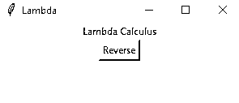

# 如何使用 Python Lambda 函数

> 原文：<https://realpython.com/python-lambda/>

*立即观看**本教程有真实 Python 团队创建的相关视频课程。和写好的教程一起看，加深理解: [**如何使用 Python Lambda 函数**](/courses/python-lambda-functions/)

Python 和其他语言，如 Java、C#、甚至 C++都在语法中添加了 lambda 函数，而 LISP 或 ML 语言家族、Haskell、OCaml 和 F#等语言则使用 lambdas 作为核心概念。

Python lambdas 是小型的匿名函数，其语法比常规 Python 函数更严格，但也更简洁。

到本文结束时，你会知道:

*   Python lambdas 是如何产生的
*   lambdas 与常规函数对象相比如何
*   如何编写 lambda 函数
*   Python 标准库中的哪些函数利用了 lambdas
*   何时使用或避免 Python lambda 函数

**注释**:你会看到一些使用`lambda`的代码示例，它们似乎明显忽略了 Python 风格的最佳实践。这只是为了说明 lambda 演算的概念或者突出 Python `lambda`的能力。

随着文章的深入，这些有问题的例子将与更好的方法或替代方案进行对比。

本教程主要面向中级到有经验的 Python 程序员，但对编程和 lambda 演算感兴趣的任何好奇者也可以阅读。

本教程中包含的所有例子都已经用 Python 3.7 测试过了。

***参加测验:****通过我们的交互式“Python Lambda 函数”测验来测试您的知识。完成后，您将收到一个分数，以便您可以跟踪一段时间内的学习进度:*

*[参加测验](/quizzes/python-lambda/)

**免费下载:** [从 Python 技巧中获取一个示例章节:这本书](https://realpython.com/bonus/python-tricks-sample-pdf/)用简单的例子向您展示了 Python 的最佳实践，您可以立即应用它来编写更漂亮的+Python 代码。

## λ演算

Python 和其他编程语言中的 Lambda 表达式源于 lambda 演算，这是阿隆佐·邱奇发明的一种计算模型。您将发现 lambda 演算是何时引入的，以及为什么它是最终出现在 Python 生态系统中的一个基本概念。

[*Remove ads*](/account/join/)

### 历史

20 世纪 30 年代，阿隆佐·邱奇形式化了[λ演算](https://en.wikipedia.org/wiki/Lambda_calculus)，一种基于纯抽象的语言。Lambda 函数也被称为 lambda 抽象，直接引用阿隆佐·邱奇最初创造的抽象模型。

Lambda 演算可以编码任何计算。它是[图灵完成](https://simple.wikipedia.org/wiki/Turing_complete)，但是与一个[图灵机](https://en.wikipedia.org/wiki/Turing_machine)的概念相反，它是纯粹的，不保持任何状态。

函数式语言起源于数理逻辑和 lambda 演算，而命令式编程语言则采用了 Alan Turing 发明的基于状态的计算模型。两种计算模型，lambda 演算和[图灵机](https://en.wikipedia.org/wiki/Turing_machine)，可以相互转换。这种等价被称为[丘奇-图灵假设](https://en.wikipedia.org/wiki/Church%E2%80%93Turing_thesis)。

函数式语言直接继承了 lambda 演算哲学，采用强调抽象、数据转换、组合和纯度(无状态和无副作用)的声明式编程方法。函数式语言的例子包括 [Haskell](https://www.haskell.org/) 、 [Lisp](https://en.wikipedia.org/wiki/Lisp_%28programming_language%29) 或 [Erlang](https://www.erlang.org/) 。

相比之下，图灵机导致了命令式编程的出现，比如 Fortran 语言的[、](https://en.wikipedia.org/wiki/Fortran) [C 语言的](https://en.wikipedia.org/wiki/C_%28programming_language%29)或 [Python 语言的](https://www.python.org/)。

命令式风格包括用语句编程，用详细的指令一步一步地驱动程序流程。这种方法促进了变异，并且需要管理状态。

两个家族中的分离呈现出一些细微差别，因为一些函数式语言包含命令式特性，如 [OCaml](http://www.ocaml.org/) ，而函数式特性已经渗透到命令式语言家族中，特别是在 [Java](https://en.wikipedia.org/wiki/Java_%28programming_language%29) 或 Python 中引入了 lambda 函数。

Python 本质上不是函数式语言，但是它很早就采用了一些函数式概念。1994 年 1 月，语言中增加了[`map()`](https://realpython.com/python-map-function/)[`filter()`](https://realpython.com/python-filter-function/)`reduce()``lambda`运算符。

### 第一个例子

这里有几个例子让你对一些 Python 代码感兴趣，函数风格。

[标识函数](https://en.wikipedia.org/wiki/Identity_function)，一个返回其参数的函数，使用[关键字](https://realpython.com/python-keywords/) `def`用标准 Python 函数定义表示如下:

>>>

```py
>>> def identity(x):
...     return x
```

`identity()`接受一个参数`x`并在调用时返回它。

相反，如果您使用 Python lambda 构造，您会得到以下结果:

>>>

```py
>>> lambda x: x
```

在上面的示例中，表达式由以下部分组成:

*   **关键词:** `lambda`
*   **一个绑定变量:** `x`
*   **一体:** `x`

**注意**:在本文的上下文中，**绑定变量**是 lambda 函数的参数。

相比之下，**自由变量**没有被绑定，可以在表达式体中被引用。自由变量可以是常量，也可以是在函数的封闭[范围](https://realpython.com/python-namespaces-scope/)中定义的变量。

您可以编写一个稍微复杂一点的示例，一个将`1`添加到参数的函数，如下所示:

>>>

```py
>>> lambda x: x + 1
```

您可以将上述函数应用于参数，方法是用括号将函数及其参数括起来:

>>>

```py
>>> (lambda x: x + 1)(2)
3
```

[归约](https://en.wikipedia.org/wiki/Reduction_strategy_%28lambda_calculus%29)是一种计算表达式值的λ演算策略。在当前示例中，它包括用参数`2`替换绑定变量`x`:

```py
(lambda x: x + 1)(2) = lambda 2: 2 + 1
                     = 2 + 1
                     = 3
```

因为 lambda 函数是一个表达式，所以它可以被命名。因此，您可以编写如下代码:

>>>

```py
>>> add_one = lambda x: x + 1
>>> add_one(2)
3
```

上面的 lambda 函数相当于这样写:

```py
def add_one(x):
    return x + 1
```

这些函数都有一个参数。你可能已经注意到，在 lambdas 的定义中，参数没有括号。在 Python lambdas 中，多参数函数(采用多个参数的函数)通过列出参数并用逗号(`,`)分隔，但不用括号括起来来表示:

>>>

```py
>>> full_name = lambda first, last: f'Full name: {first.title()}  {last.title()}'
>>> full_name('guido', 'van rossum')
'Full name: Guido Van Rossum'
```

分配给`full_name`的 lambda 函数接受两个参数，并返回一个[字符串](https://realpython.com/python-strings/)，对两个参数`first`和`last`进行插值。正如所料，lambda 的定义列出了不带括号的参数，而调用函数完全像普通的 Python 函数一样，用括号将参数括起来。

[*Remove ads*](/account/join/)

## 匿名函数

根据编程语言类型和区域性，下列术语可以互换使用:

*   匿名函数
*   λ函数
*   λ表达式
*   λ抽象
*   λ形式
*   函数文字

在本节之后的文章中，您将主要看到术语 **lambda function** 。

从字面上看，匿名函数是没有名字的函数。在 Python 中，用`lambda`关键字创建一个匿名函数。更宽泛地说，它可能被赋予名称，也可能没有。考虑一个用`lambda`定义的双参数匿名函数，但没有绑定到变量。lambda 没有给定名称:

>>>

```py
>>> lambda x, y: x + y
```

上面的函数定义了一个 lambda 表达式，它接受两个参数并返回它们的和。

除了向您提供 Python 非常适合这种形式的反馈之外，它没有任何实际用途。您可以调用 Python 解释器中的函数:

>>>

```py
>>> _(1, 2)
3
```

上面的例子利用了通过下划线(`_`)提供的交互式解释器特性。有关更多详细信息，请参见下面的注释。

您不能在 Python 模块中编写类似的代码。将解释器中的`_`视为您利用的副作用。在 Python 模块中，可以给 lambda 指定一个名称，或者将 lambda 传递给一个函数。在本文的后面，您将使用这两种方法。

**注意**:在交互式解释器中，单下划线(`_`)被绑定到最后一个被求值的表达式。

在上面的例子中，`_`指向 lambda 函数。关于 Python 中这个特殊字符用法的更多细节，请查看 Python 中下划线的含义。

JavaScript 等其他语言中使用的另一种模式是立即执行 Python lambda 函数。这就是所谓的**立即调用函数表达式**([life](https://developer.mozilla.org/en-US/docs/Glossary/IIFE)，读作“iffy”)。这里有一个例子:

>>>

```py
>>> (lambda x, y: x + y)(2, 3)
5
```

上面的 lambda 函数被定义，然后用两个参数(`2`和`3`)立即调用。它返回值`5`，这是参数的总和。

本教程中的几个例子使用这种格式来突出 lambda 函数的匿名性，并避免将 Python 中的`lambda`作为定义函数的一种更简短的方式。

Python 不鼓励使用直接调用的 lambda 表达式。它只是由可调用的 lambda 表达式产生的，不像普通函数的主体。

Lambda 函数经常与[高阶函数](https://en.wikipedia.org/wiki/Higher-order_function)一起使用，后者将一个或多个函数作为参数，或者返回一个或多个函数。

通过将函数(normal 或 lambda)作为参数，lambda 函数可以是高阶函数，如下例所示:

>>>

```py
>>> high_ord_func = lambda x, func: x + func(x)
>>> high_ord_func(2, lambda x: x * x)
6
>>> high_ord_func(2, lambda x: x + 3)
7
```

Python 将高阶函数公开为内置函数或标准库中的函数。例如`map()`、`filter()`、`functools.reduce()`，以及[、`sort()`、`sorted()`、](https://realpython.com/python-sort/)、[、`max()`、](https://realpython.com/python-min-and-max/)等关键功能。在[lambda 表达式的适当使用](#appropriate-uses-of-lambda-expressions)中，您将使用 Lambda 函数和 Python 高阶函数。

[*Remove ads*](/account/join/)

## Python Lambda 和正则函数

这段引用自 [Python 设计和历史常见问题解答](https://docs.python.org/3/faq/design.html)的话似乎为关于在 Python 中使用 lambda 函数的总体预期定下了基调:

> 与其他语言中添加功能的 lambda 形式不同，如果你懒得定义函数，Python lambdas 只是一种速记符号。([来源](https://docs.python.org/3/faq/design.html#why-can-t-lambda-expressions-contain-statements))

然而，不要让这种说法阻止你使用 Python 的`lambda`。乍一看，你可能会认为 lambda 函数是一个带有某种[语法糖](https://en.wikipedia.org/wiki/Syntactic_sugar)的函数，它缩短了定义或调用函数的代码。以下部分强调了普通 Python 函数和 lambda 函数之间的共性和细微差别。

### 功能

此时，您可能想知道绑定到变量的 lambda 函数与只有一行`return`的常规函数的根本区别:在表面之下，几乎什么都没有。让我们验证一下 Python 如何看待用单个[返回语句](https://realpython.com/python-return-statement/)构建的函数和作为表达式(`lambda`)构建的函数。

[`dis`](https://docs.python.org/3/library/dis.html) 模块公开了用于分析 Python 编译器生成的 Python 字节码的函数:

>>>

```py
>>> import dis
>>> add = lambda x, y: x + y
>>> type(add)
<class 'function'>
>>> dis.dis(add)
 1           0 LOAD_FAST                0 (x)
 2 LOAD_FAST                1 (y)
 4 BINARY_ADD
 6 RETURN_VALUE
>>> add
<function <lambda> at 0x7f30c6ce9ea0>
```

您可以看到`dis()`公开了 Python 字节码的可读版本，允许检查 Python 解释器在执行程序时将使用的低级指令。

现在用一个常规的函数对象来看它:

>>>

```py
>>> import dis
>>> def add(x, y): return x + y
>>> type(add)
<class 'function'>
>>> dis.dis(add)
 1           0 LOAD_FAST                0 (x)
 2 LOAD_FAST                1 (y)
 4 BINARY_ADD
 6 RETURN_VALUE
>>> add
<function add at 0x7f30c6ce9f28>
```

Python 解释的字节码对于这两个函数是相同的。但是您可能会注意到命名是不同的:对于用`def`定义的函数，函数名是`add`，而 Python lambda 函数被视为`lambda`。

### 追溯

在上一节中您看到，在 lambda 函数的上下文中，Python 没有提供函数的名称，而只是提供了`<lambda>`。当异常发生时，这可能是一个需要考虑的限制，一个[回溯](https://realpython.com/python-traceback/)只显示`<lambda>`:

>>>

```py
>>> div_zero = lambda x: x / 0
>>> div_zero(2)
Traceback (most recent call last):
    File "<stdin>", line 1, in <module>
 File "<stdin>", line 1, in <lambda> ZeroDivisionError: division by zero
```

执行 lambda 函数时引发的异常的[回溯](https://realpython.com/courses/python-traceback/)仅将导致异常的函数标识为`<lambda>`。

下面是一个普通函数引发的相同异常:

>>>

```py
>>> def div_zero(x): return x / 0
>>> div_zero(2)
Traceback (most recent call last):
    File "<stdin>", line 1, in <module>
 File "<stdin>", line 1, in div_zero ZeroDivisionError: division by zero
```

normal 函数会导致类似的错误，但会导致更精确的回溯，因为它给出了函数名`div_zero`。

### 语法

正如您在前面几节中看到的，lambda 形式呈现了与普通函数的语法区别。特别是，lambda 函数具有以下特征:

*   它只能包含表达式，不能在其主体中包含语句。
*   它被写成一行执行代码。
*   它不支持类型批注。
*   可以立即调用(IIFE)。

**没有报表**

lambda 函数不能包含任何语句。在 lambda 函数中，像`return`、`pass`、`assert`或`raise`这样的语句会引发一个 [`SyntaxError`](https://realpython.com/invalid-syntax-python/) 异常。下面是一个将`assert`添加到 lambda 主体的例子:

>>>

```py
>>> (lambda x: assert x == 2)(2)
  File "<input>", line 1
    (lambda x: assert x == 2)(2)
                    ^
SyntaxError: invalid syntax
```

这个虚构的例子旨在`assert`参数`x`的值为`2`。但是，解释器在解析代码时识别出了一个`SyntaxError`，该代码包含了`lambda`主体中的语句`assert`。

**单一表达式**

与普通函数相比，Python lambda 函数是一个单一的表达式。尽管在`lambda`的主体中，您可以使用括号或多行字符串将表达式扩展到几行，但它仍然是一个表达式:

>>>

```py
>>> (lambda x:
... (x % 2 and 'odd' or 'even'))(3)
'odd'
```

上面的例子在 lambda 参数为奇数时返回字符串`'odd'`，在参数为偶数时返回`'even'`。它跨两行，因为它包含在一组括号中，但它仍然是一个表达式。

**类型注释**

如果您已经开始采用类型提示，这在 Python 中是可用的，那么您有另一个更喜欢普通函数而不是 Python lambda 函数的好理由。查看 [Python 类型检查(指南)](https://realpython.com/python-type-checking/#hello-types)了解更多关于 Python 类型提示和类型检查的信息。在 lambda 函数中，以下内容没有等效项:

```py
def full_name(first: str, last: str) -> str:
    return f'{first.title()}  {last.title()}'
```

任何带有`full_name()`的类型错误都可以被类似 [`mypy`](http://mypy-lang.org/) 或 [`pyre`](https://pyre-check.org/) 的工具捕获，而带有等效 lambda 函数的`SyntaxError`则在运行时引发:

>>>

```py
>>> lambda first: str, last: str: first.title() + " " + last.title() -> str
  File "<stdin>", line 1
    lambda first: str, last: str: first.title() + " " + last.title() -> str

SyntaxError: invalid syntax
```

就像试图在 lambda 中包含一个语句一样，添加类型注释会在运行时立即导致一个`SyntaxError`。

**人生**

您已经看到了几个[立即调用函数执行](https://developer.mozilla.org/en-US/docs/Glossary/IIFE)的例子:

>>>

```py
>>> (lambda x: x * x)(3)
9
```

在 Python 解释器之外，这个特性在实践中可能不会用到。这是 lambda 函数被定义为可调用的直接结果。例如，这允许您将 Python lambda 表达式的定义传递给高阶函数，如`map()`、`filter()`或`functools.reduce()`，或者传递给一个关键函数。

[*Remove ads*](/account/join/)

### 参数

像用`def`定义的普通函数对象一样，Python lambda 表达式支持传递参数的所有不同方式。这包括:

*   位置参数
*   命名参数(有时称为关键字参数)
*   变量参数列表(通常称为 **varargs**
*   关键字参数的可变列表
*   仅关键字参数

以下示例说明了向 lambda 表达式传递参数的可选方法:

>>>

```py
>>> (lambda x, y, z: x + y + z)(1, 2, 3)
6
>>> (lambda x, y, z=3: x + y + z)(1, 2)
6
>>> (lambda x, y, z=3: x + y + z)(1, y=2)
6
>>> (lambda *args: sum(args))(1,2,3)
6
>>> (lambda **kwargs: sum(kwargs.values()))(one=1, two=2, three=3)
6
>>> (lambda x, *, y=0, z=0: x + y + z)(1, y=2, z=3)
6
```

### 装修工

在 Python 中，[装饰器](https://www.python.org/dev/peps/pep-0318/)是一种模式的实现，允许向函数或类添加行为。它通常用函数前面的`@decorator`语法来表示。这里有一个人为的例子:

```py
def some_decorator(f):
    def wraps(*args):
        print(f"Calling function '{f.__name__}'")
        return f(args)
    return wraps

@some_decorator
def decorated_function(x):
    print(f"With argument '{x}'")
```

在上面的例子中，`some_decorator()`是一个向`decorated_function()`添加行为的函数，因此调用`decorated_function("Python")`会产生以下输出:

```py
Calling function 'decorated_function'
With argument 'Python'
```

`decorated_function()`只打印`With argument 'Python'`，但是装饰者添加了一个额外的行为，也打印`Calling function 'decorated_function'`。

装饰器可以应用于 lambda。尽管不可能用`@decorator`语法来修饰 lambda，但修饰器只是一个函数，所以它可以调用 lambda 函数:

```py
 1# Defining a decorator
 2def trace(f):
 3    def wrap(*args, **kwargs):
 4        print(f"[TRACE] func: {f.__name__}, args: {args}, kwargs: {kwargs}")
 5        return f(*args, **kwargs)
 6
 7    return wrap
 8
 9# Applying decorator to a function
10@trace
11def add_two(x): 12    return x + 2
13
14# Calling the decorated function
15add_two(3) 16
17# Applying decorator to a lambda
18print((trace(lambda x: x ** 2))(3))
```

在第 11 行用`@trace`修饰的`add_two()`，在第 15 行用参数`3`调用。相比之下，在第 18 行，lambda 函数立即被包含并嵌入到对装饰器`trace()`的调用中。当您执行上面的代码时，您将获得以下内容:

```py
[TRACE] func: add_two, args: (3,), kwargs: {}
[TRACE] func: <lambda>, args: (3,), kwargs: {}
9
```

正如您已经看到的，lambda 函数的名称显示为`<lambda>`，而`add_two`显然是普通函数的名称。

以这种方式修饰 lambda 函数对于调试非常有用，可能是为了调试在高阶函数或关键函数的上下文中使用的 lambda 函数的行为。让我们看一个关于`map()`的例子:

```py
list(map(trace(lambda x: x*2), range(3)))
```

`map()`的第一个参数是一个将其参数乘以`2`的 lambda。这个 lambda 是用`trace()`装饰的。执行时，上面的示例输出以下内容:

```py
[TRACE] Calling <lambda> with args (0,) and kwargs {}
[TRACE] Calling <lambda> with args (1,) and kwargs {}
[TRACE] Calling <lambda> with args (2,) and kwargs {}
[0, 2, 4]
```

结果`[0, 2, 4]`是将`range(3)`的各个元素相乘得到的一个[列表](https://realpython.com/python-lists-tuples/)。现在，考虑将`range(3)`等同于列表`[0, 1, 2]`。

你将在[地图](#map)中接触到`map()`的更多细节。

lambda 也可以作为装饰器，但不推荐这样做。如果你发现自己需要这样做，请参考 [PEP 8，编程建议](https://www.python.org/dev/peps/pep-0008/#programming-recommendations)。

关于 Python decorator 的更多信息，请查看 Python decorator 的初级读本。

[*Remove ads*](/account/join/)

### 关闭

一个[闭包](https://en.wikipedia.org/wiki/Closure_%28computer_programming%29)是一个函数，在这个函数中使用的每个自由变量，除了参数之外的所有东西，都被绑定到一个在这个函数的封闭范围中定义的特定值。实际上，闭包定义了它们运行的环境，因此可以从任何地方调用。

lambdas 和闭包的概念没有必然的联系，尽管 lambda 函数可以是闭包，就像普通函数也可以是闭包一样。有些语言有特殊的闭包或 lambda 结构(例如，Groovy 用一个匿名代码块作为闭包对象)，或者 lambda 表达式(例如，Java Lambda 表达式有一个有限的闭包选项)。

下面是一个用普通 Python 函数构造的闭包:

```py
 1def outer_func(x):
 2    y = 4
 3    def inner_func(z):
 4        print(f"x = {x}, y = {y}, z = {z}")
 5        return x + y + z 6    return inner_func
 7
 8for i in range(3):
 9    closure = outer_func(i) 10    print(f"closure({i+5}) = {closure(i+5)}")
```

`outer_func()`返回`inner_func()`，这是一个[嵌套函数](https://realpython.com/inner-functions-what-are-they-good-for/)，它计算三个参数的和:

*   **`x`** 作为参数传递给`outer_func()`。
*   **`y`** 是`outer_func()`的局部变量。
*   **`z`** 是传递给`inner_func()`的一个自变量。

为了测试`outer_func()`和`inner_func()`的行为，在 [`for`循环](https://realpython.com/python-for-loop/)中调用了`outer_func()`三次，输出如下:

```py
x = 0, y = 4, z = 5
closure(5) = 9
x = 1, y = 4, z = 6
closure(6) = 11
x = 2, y = 4, z = 7
closure(7) = 13
```

在代码的第 9 行，调用`outer_func()`返回的`inner_func()`被绑定到名字`closure`。在第 5 行，`inner_func()`捕获了`x`和`y`，因为它可以访问它的嵌入环境，因此在调用闭包时，它能够对两个自由变量`x`和`y`进行操作。

类似地，一个`lambda`也可以是一个闭包。以下是 Python lambda 函数的相同示例:

```py
 1def outer_func(x):
 2    y = 4
 3    return lambda z: x + y + z 4
 5for i in range(3):
 6    closure = outer_func(i) 7    print(f"closure({i+5}) = {closure(i+5)}")
```

当您执行上面的代码时，您将获得以下输出:

```py
closure(5) = 9
closure(6) = 11
closure(7) = 13
```

在第 6 行，`outer_func()`返回一个 lambda 并将它赋给变量`closure`。在第 3 行，lambda 函数的主体引用了`x`和`y`。变量`y`在定义时可用，而`x`是在运行时调用`outer_func()`时定义的。

在这种情况下，正常函数和 lambda 的行为类似。在下一节中，您将看到 lambda 的行为由于其评估时间(定义时间与运行时间)而具有欺骗性的情况。

### 评估时间

在一些涉及[循环](https://realpython.com/courses/python-for-loop/)的情况下，Python lambda 函数作为闭包的行为可能是违反直觉的。它需要理解自由变量何时在 lambda 的上下文中被绑定。以下示例展示了使用常规函数与使用 Python lambda 的区别。

首先使用常规函数测试场景:

>>>

```py
 1>>> def wrap(n):
 2...     def f():
 3...         print(n)
 4...     return f
 5...
 6>>> numbers = 'one', 'two', 'three'
 7>>> funcs = []
 8>>> for n in numbers:
 9...     funcs.append(wrap(n))
10...
11>>> for f in funcs:
12...     f()
13...
14one
15two
16three
```

在一个普通函数中，当函数被添加到列表:`funcs.append(wrap(n))`中时，`n`在定义时被求值，在第 9 行。

现在，使用 lambda 函数实现相同的逻辑，观察意外的行为:

>>>

```py
 1>>> numbers = 'one', 'two', 'three'
 2>>> funcs = []
 3>>> for n in numbers:
 4...     funcs.append(lambda: print(n))
 5...
 6>>> for f in funcs:
 7...     f()
 8...
 9three
10three
11three
```

出现意外结果是因为自由变量`n`在执行 lambda 表达式时被绑定。第 4 行的 Python lambda 函数是一个闭包，它捕获了运行时绑定的自由变量`n`。在运行时，当调用第 7 行的函数`f`时，`n`的值是`three`。

为了解决这个问题，您可以在定义时为 free 变量赋值，如下所示:

>>>

```py
 1>>> numbers = 'one', 'two', 'three'
 2>>> funcs = []
 3>>> for n in numbers:
 4...     funcs.append(lambda n=n: print(n))
 5...
 6>>> for f in funcs:
 7...     f()
 8...
 9one
10two
11three
```

Python lambda 函数在参数方面的行为类似于普通函数。因此，可以用默认值初始化 lambda 参数:参数`n`将外部的`n`作为默认值。Python lambda 函数可以写成`lambda x=n: print(x)`的形式，结果也是一样的。

Python lambda 函数在第 7 行没有任何参数的情况下被调用，它使用在定义时设置的默认值`n`。

[*Remove ads*](/account/join/)

### 测试 Lambdas

Python lambdas 可以像常规函数一样进行测试。可以同时使用`unittest`和`doctest`。

**T2`unittest`**

`unittest`模块像处理常规函数一样处理 Python lambda 函数:

```py
import unittest

addtwo = lambda x: x + 2

class LambdaTest(unittest.TestCase):
    def test_add_two(self):
        self.assertEqual(addtwo(2), 4)

    def test_add_two_point_two(self):
        self.assertEqual(addtwo(2.2), 4.2)

    def test_add_three(self):
        # Should fail
        self.assertEqual(addtwo(3), 6)

if __name__ == '__main__':
    unittest.main(verbosity=2)
```

`LambdaTest`用三种测试方法定义了一个测试用例，每种方法都为作为 lambda 函数实现的`addtwo()`运用了一个测试场景。包含`LambdaTest`的 Python 文件`lambda_unittest.py`的执行产生如下结果:

```py
$ python lambda_unittest.py
test_add_three (__main__.LambdaTest) ... FAIL
test_add_two (__main__.LambdaTest) ... ok
test_add_two_point_two (__main__.LambdaTest) ... ok

======================================================================
FAIL: test_add_three (__main__.LambdaTest)
----------------------------------------------------------------------
Traceback (most recent call last):
 File "lambda_unittest.py", line 18, in test_add_three
 self.assertEqual(addtwo(3), 6)
AssertionError: 5 != 6

----------------------------------------------------------------------
Ran 3 tests in 0.001s

FAILED (failures=1)
```

正如预期的那样，我们对`test_add_three`有两个成功的测试用例，一个失败:结果是`5`，但是预期的结果是`6`。这个失败是由于测试用例中的一个故意的错误。将预期结果从`6`更改为`5`将满足`LambdaTest`的所有测试。

**T2`doctest`**

`doctest`模块从`docstring`中提取交互式 Python 代码来执行测试。尽管 Python lambda 函数的语法不支持典型的`docstring`，但是可以将一个字符串赋给一个已命名 lambda 的`__doc__`元素:

```py
addtwo = lambda x: x + 2
addtwo.__doc__ = """Add 2 to a number.
 >>> addtwo(2)
 4
 >>> addtwo(2.2)
 4.2
 >>> addtwo(3) # Should fail
 6
 """

if __name__ == '__main__':
    import doctest
    doctest.testmod(verbose=True)
```

lambda `addtwo()`的文档注释中的`doctest`描述了与上一节相同的测试用例。

当您通过`doctest.testmod()`执行测试时，您会得到以下结果:

```py
$ python lambda_doctest.py
Trying:
 addtwo(2)
Expecting:
 4
ok
Trying:
 addtwo(2.2)
Expecting:
 4.2
ok
Trying:
 addtwo(3) # Should fail
Expecting:
 6
**********************************************************************
File "lambda_doctest.py", line 16, in __main__.addtwo
Failed example:
 addtwo(3) # Should fail
Expected:
 6
Got:
 5
1 items had no tests:
 __main__
**********************************************************************
1 items had failures:
 1 of   3 in __main__.addtwo
3 tests in 2 items.
2 passed and 1 failed.
***Test Failed*** 1 failures.
```

失败的测试与上一节中单元测试的执行中所解释的失败相同。

您可以通过给`__doc__`赋值来给 Python lambda 添加一个`docstring`来记录 lambda 函数。尽管可能，Python 语法比 lambda 函数更适合普通函数的`docstring`。

要全面了解 Python 中的单元测试，您可能想参考[Python 测试入门](https://realpython.com/python-testing/)。

## λ表达式滥用

本文中的几个例子，如果是在专业 Python 代码的上下文中编写的，将被视为滥用。

如果你发现自己试图克服 lambda 表达式不支持的东西，这可能是一个普通函数更适合的迹象。上一节中 lambda 表达式的`docstring`就是一个很好的例子。试图克服 Python lambda 函数不支持语句的事实是另一个危险信号。

接下来的部分举例说明了一些应该避免使用 lambda 的例子。这些示例可能是在 Python lambda 的上下文中，代码表现出以下模式的情况:

*   它不遵循 Python 风格指南(PEP 8)
*   很繁琐，很难读懂。
*   这是以难以阅读为代价的不必要的聪明。

[*Remove ads*](/account/join/)

### 引发异常

试图在 Python lambda 中引发异常应该让你三思。有一些聪明的方法可以做到这一点，但即使像下面这样的事情也最好避免:

>>>

```py
>>> def throw(ex): raise ex
>>> (lambda: throw(Exception('Something bad happened')))()
Traceback (most recent call last):
    File "<stdin>", line 1, in <module>
    File "<stdin>", line 1, in <lambda>
    File "<stdin>", line 1, in throw
Exception: Something bad happened
```

因为 Python lambda 主体中的语句在语法上是不正确的，所以上例中的解决方法是用专用函数`throw()`抽象语句调用。应该避免使用这种类型的变通方法。如果您遇到这种类型的代码，您应该考虑重构代码以使用常规函数。

### 隐晦的风格

与任何编程语言一样，您会发现 Python 代码由于其使用的风格而难以阅读。Lambda 函数由于其简洁性，有助于编写难以阅读的代码。

以下 lambda 示例包含几个错误的样式选择:

>>>

```py
>>> (lambda _: list(map(lambda _: _ // 2, _)))([1,2,3,4,5,6,7,8,9,10])
[0, 1, 1, 2, 2, 3, 3, 4, 4, 5]
```

下划线(`_`)指的是不需要显式引用的变量。但是在这个例子中，三个`_`指的是不同的变量。对这个 lambda 代码的初始升级可以是命名变量:

>>>

```py
>>> (lambda some_list: list(map(lambda n: n // 2,
 some_list)))([1,2,3,4,5,6,7,8,9,10])
[0, 1, 1, 2, 2, 3, 3, 4, 4, 5]
```

诚然，它仍然很难阅读。通过仍然利用`lambda`，一个常规函数将大大提高代码的可读性，将逻辑分散在几行代码和函数调用中:

>>>

```py
>>> def div_items(some_list):
 div_by_two = lambda n: n // 2
 return map(div_by_two, some_list)
>>> list(div_items([1,2,3,4,5,6,7,8,9,10])))
[0, 1, 1, 2, 2, 3, 3, 4, 4, 5]
```

这仍然不是最佳的，但是向您展示了一种使代码，尤其是 Python lambda 函数更具可读性的可能途径。在[中，你将学会用列表理解或](#alternatives-to-lambdas)[生成器表达式](https://realpython.com/introduction-to-python-generators/)替换`map()`和`lambda`。这将极大地提高代码的可读性。

### Python 类

您可以但不应该将类方法编写为 Python lambda 函数。下面的例子是完全合法的 Python 代码，但是展示了依赖于`lambda`的非常规 Python 代码。例如，它没有将`__str__`作为常规函数来实现，而是使用了一个`lambda`。类似地，`brand`和`year`是[属性](https://docs.python.org/3/library/functions.html#property)也用 lambda 函数实现，而不是常规函数或装饰器:

```py
class Car:
    """Car with methods as lambda functions."""
    def __init__(self, brand, year):
        self.brand = brand
        self.year = year

    brand = property(lambda self: getattr(self, '_brand'),
                     lambda self, value: setattr(self, '_brand', value))

    year = property(lambda self: getattr(self, '_year'),
                    lambda self, value: setattr(self, '_year', value))

    __str__ = lambda self: f'{self.brand}  {self.year}'  # 1: error E731

    honk = lambda self: print('Honk!')     # 2: error E731
```

运行一个类似 [`flake8`](http://flake8.pycqa.org/) 的工具，一个样式向导执行工具，将为`__str__`和`honk`显示以下错误:

```py
E731 do not assign a lambda expression, use a def
```

虽然`flake8`没有指出 Python lambda 函数在属性中的用法问题，但是它们很难阅读，并且容易出错，因为使用了多个字符串，如`'_brand'`和`'_year'`。

`__str__`的正确实施预计如下:

```py
def __str__(self):
    return f'{self.brand}  {self.year}'
```

`brand`将被写成如下:

```py
@property
def brand(self):
    return self._brand

@brand.setter
def brand(self, value):
    self._brand = value
```

一般来说，在用 Python 编写的代码环境中，正则函数比 lambda 表达式更受欢迎。尽管如此，还是有受益于 lambda 语法的情况，您将在下一节中看到。

[*Remove ads*](/account/join/)

## λ表达式的适当使用

Python 中的 Lambdas 往往是争议的主题。Python 中反对 lambdas 的一些论点是:

*   可读性问题
*   强加一种功能性思维方式
*   带有关键字`lambda`的复杂语法

尽管存在激烈的争论，质疑这个特性在 Python 中的存在，但是 lambda 函数的属性有时为 Python 语言和开发人员提供了价值。

以下示例说明了在 Python 代码中使用 lambda 函数不仅合适，而且受到鼓励的场景。

### 经典函数构造

Lambda 函数通常与内置函数[`map()`](https://docs.python.org/3/library/functions.html#map)[`filter()`](https://docs.python.org/3/library/functions.html#filter)以及 [`functools.reduce()`](https://docs.python.org/3/library/functools.html?highlight=reduce#functools.reduce) 一起使用，暴露在模块 [`functools`](https://docs.python.org/3/library/functools.html) 中。以下三个示例分别说明了如何使用带有 lambda 表达式的函数:

>>>

```py
>>> list(map(lambda x: x.upper(), ['cat', 'dog', 'cow']))
['CAT', 'DOG', 'COW']
>>> list(filter(lambda x: 'o' in x, ['cat', 'dog', 'cow']))
['dog', 'cow']
>>> from functools import reduce
>>> reduce(lambda acc, x: f'{acc} | {x}', ['cat', 'dog', 'cow'])
'cat | dog | cow'
```

您可能需要阅读类似上面例子的代码，尽管有更多相关的数据。因此，识别这些结构非常重要。然而，这些构造有被认为更 Pythonic 化的等价替代。在 Lambdas 的替代方案[中，您将学习如何将高阶函数及其伴随的 Lambdas 转换成其他更惯用的形式。](#alternatives-to-lambdas)

### 关键功能

Python 中的关键函数是高阶函数，采用参数`key`作为命名参数。`key`接收一个可以是`lambda`的函数。该函数直接影响由关键函数本身驱动的算法。以下是一些关键功能:

*   **`sort()` :** 列表法
*   **`sorted()`、`min()`、`max()` :** 内置函数
*   **`nlargest()`和`nsmallest()`:堆队列算法模块中的**[`heapq`](https://realpython.com/python-heapq-module/)

假设您想要对表示为字符串的 id 列表进行排序。每个 ID 是字符串`id`和一个数字的[串联](https://realpython.com/python-string-split-concatenate-join/)。默认情况下，使用内置函数`sorted()`对这个列表进行排序，使用字典顺序，因为列表中的元素是字符串。

为了影响排序的执行，您可以为命名参数`key`分配一个 lambda，这样排序将使用与 ID 相关联的数字:

>>>

```py
>>> ids = ['id1', 'id2', 'id30', 'id3', 'id22', 'id100']
>>> print(sorted(ids)) # Lexicographic sort ['id1', 'id100', 'id2', 'id22', 'id3', 'id30']
>>> sorted_ids = sorted(ids, key=lambda x: int(x[2:])) # Integer sort >>> print(sorted_ids)
['id1', 'id2', 'id3', 'id22', 'id30', 'id100']
```

### 用户界面框架

像 [Tkinter](https://realpython.com/python-gui-tkinter/) 、 [wxPython](https://wxpython.org/) 或者。带有 [IronPython](https://ironpython.net/) 的. NET Windows 窗体利用 lambda 函数来映射动作以响应 UI 事件。

下面简单的 Tkinter 程序演示了分配给*反转*按钮命令的`lambda`的用法:

```py
import tkinter as tk
import sys

window = tk.Tk()
window.grid_columnconfigure(0, weight=1)
window.title("Lambda")
window.geometry("300x100")
label = tk.Label(window, text="Lambda Calculus")
label.grid(column=0, row=0)
button = tk.Button(
    window,
    text="Reverse",
 command=lambda: label.configure(text=label.cget("text")[::-1]), )
button.grid(column=0, row=1)
window.mainloop()
```

点击按钮 *Reverse* 触发一个事件，触发 lambda 函数，将标签从 *Lambda Calculus* 更改为 *suluclaC adbmaL* *:

[](https://files.realpython.com/media/tkinter_lambda.be4b6259769e.gif)

上的 wxPython 和 IronPython。NET 平台也有类似的处理事件的方法。注意`lambda`是处理触发事件的一种方式，但是一个函数也可以用于同样的目的。当需要的代码量非常少时，使用`lambda`会变得独立且不那么冗长。

要探索 wxPython，请查看[如何使用 wxPython](https://realpython.com/python-gui-with-wxpython/) 构建 Python GUI 应用程序。

[*Remove ads*](/account/join/)

### Python 解释器

当您在交互式解释器中使用 Python 代码时，Python lambda 函数通常是一个福音。创建一个快速的一行函数来探索一些在解释器之外永远不会出现的代码片段是很容易的。解释器里写的 lambdas，为了快速发现，就像你用后可以扔掉的废纸。

### `timeit`

本着与 Python 解释器中的实验相同的精神，模块`timeit`提供了计时小代码片段的函数。`timeit.timeit()`尤其可以直接调用，在字符串中传递一些 Python 代码。这里有一个例子:

>>>

```py
>>> from timeit import timeit
>>> timeit("factorial(999)", "from math import factorial", number=10)
0.0013087529951008037
```

当语句作为字符串传递时，`timeit()`需要完整的上下文。在上面的例子中，这是由第二个参数提供的，它设置了主函数需要计时的环境。否则会引发一个`NameError`异常。

另一种方法是使用一个`lambda`:

>>>

```py
>>> from math import factorial
>>> timeit(lambda: factorial(999), number=10)
0.0012704220062005334
```

这种解决方案更干净，可读性更好，在解释器中输入更快。尽管`lambda`版本的执行时间稍短，但再次执行函数可能会显示出`string`版本的优势。`setup`的执行时间不包括在总的执行时间内，不会对结果产生任何影响。

### 猴子打补丁

对于测试来说，有时需要依赖可重复的结果，即使在给定软件的正常执行过程中，相应的结果可能会有所不同，甚至完全是随机的。

假设你想测试一个函数，它在运行时处理随机值。但是，在测试执行期间，您需要以可重复的方式断言可预测的值。下面的例子展示了如何使用`lambda`函数，monkey patching 可以帮助您:

```py
from contextlib import contextmanager
import secrets

def gen_token():
    """Generate a random token."""
    return f'TOKEN_{secrets.token_hex(8)}'

@contextmanager
def mock_token():
    """Context manager to monkey patch the secrets.token_hex
 function during testing.
 """
    default_token_hex = secrets.token_hex
 secrets.token_hex = lambda _: 'feedfacecafebeef'    yield
    secrets.token_hex = default_token_hex

def test_gen_key():
    """Test the random token."""
    with mock_token():
        assert gen_token() == f"TOKEN_{'feedfacecafebeef'}"

test_gen_key()
```

上下文管理器有助于隔离从标准库(在本例中为 [`secrets`](https://docs.python.org/3/library/secrets.html#module-secrets) )对函数进行猴子修补的操作。分配给`secrets.token_hex()`的 lambda 函数通过返回一个静态值来替代默认行为。

这允许以可预测的方式测试依赖于`token_hex()`的任何功能。在退出上下文管理器之前，`token_hex()`的默认行为被重新建立，以消除任何意外的副作用，这些副作用会影响可能依赖于`token_hex()`的默认行为的其他测试领域。

像`unittest`和`pytest`这样的单元测试框架将这个概念带到了更高的复杂程度。

用 [`pytest`](https://realpython.com/pytest-python-testing/) ，仍然使用一个`lambda`函数，同样的例子变得更加优雅简洁:

```py
import secrets

def gen_token():
    return f'TOKEN_{secrets.token_hex(8)}'

def test_gen_key(monkeypatch):
 monkeypatch.setattr('secrets.token_hex', lambda _: 'feedfacecafebeef')    assert gen_token() == f"TOKEN_{'feedfacecafebeef'}"
```

使用 [pytest `monkeypatch` fixture](https://docs.pytest.org/en/latest/monkeypatch.html) ，`secrets.token_hex()`被一个 lambda 覆盖，该 lambda 将返回一个确定值`feedfacecafebeef`，允许验证测试。pytest `monkeypatch`夹具允许您控制覆盖的范围。在上面的例子中，在后续测试中调用`secrets.token_hex()`，不使用猴子补丁，将执行这个函数的正常实现。

执行`pytest`测试得到以下结果:

```py
$ pytest test_token.py -v
============================= test session starts ==============================
platform linux -- Python 3.7.2, pytest-4.3.0, py-1.8.0, pluggy-0.9.0
cachedir: .pytest_cache
rootdir: /home/andre/AB/tools/bpython, inifile:
collected 1 item

test_token.py::test_gen_key PASSED                                       [100%]

=========================== 1 passed in 0.01 seconds ===========================
```

测试通过，因为我们验证了`gen_token()`已经执行，并且结果是测试上下文中的预期结果。

[*Remove ads*](/account/join/)

## 兰姆达斯的替代品

虽然有很好的理由使用`lambda`，但也有不赞成使用它的例子。那么有哪些选择呢？

像`map()`、`filter()`和`functools.reduce()`这样的高阶函数可以通过轻微的创造性转换成更优雅的形式，特别是使用列表理解或生成器表达式。

要了解更多关于列表理解的内容，请查看[在 Python](https://realpython.com/list-comprehension-python/) 中何时使用列表理解。要了解关于生成器表达式的更多信息，请查看[如何在 Python 中使用生成器和 yield](https://realpython.com/introduction-to-python-generators/)。

### 地图

内置函数`map()`将一个函数作为第一个参数，并将其应用于第二个参数的每个元素，这是一个**可迭代的**。可迭代的例子有字符串、列表和元组。有关可迭代和迭代器的更多信息，请查看[可迭代和迭代器](https://realpython.com/lessons/looping-over-iterables/)。

`map()`返回转换后的集合对应的迭代器。例如，如果您想将一个字符串列表转换成一个每个字符串都大写的新列表，您可以使用`map()`，如下所示:

>>>

```py
>>> list(map(lambda x: x.capitalize(), ['cat', 'dog', 'cow']))
['Cat', 'Dog', 'Cow']
```

您需要调用`list()`将`map()`返回的迭代器转换成可以在 Python shell 解释器中显示的扩展列表。

使用列表理解消除了定义和调用 lambda 函数的需要:

>>>

```py
>>> [x.capitalize() for x in ['cat', 'dog', 'cow']]
['Cat', 'Dog', 'Cow']
```

### 过滤器

内置函数`filter()`，另一个经典的函数构造，可以转换成列表理解。它将一个[谓词](https://en.wikipedia.org/wiki/Predicate_(mathematical_logic))作为第一个参数，将一个 iterable 作为第二个参数。它构建一个迭代器，包含满足谓词函数的初始集合的所有元素。下面是一个过滤给定整数列表中所有偶数的示例:

>>>

```py
>>> even = lambda x: x%2 == 0
>>> list(filter(even, range(11)))
[0, 2, 4, 6, 8, 10]
```

注意,`filter()`返回一个迭代器，因此需要调用内置类型`list`,它构造一个给定迭代器的列表。

利用列表理解结构的实现给出了以下内容:

>>>

```py
>>> [x for x in range(11) if x%2 == 0]
[0, 2, 4, 6, 8, 10]
```

### 减少

从 Python 3 开始， [`reduce()`](https://realpython.com/python-reduce-function/) 从内置函数变成了`functools`模块函数。作为`map()`和`filter()`，它的前两个参数分别是一个函数和一个可迭代函数。它也可以接受一个初始化式作为第三个参数，作为结果累加器的初始值。对于 iterable 的每个元素，`reduce()`应用函数并累加 iterable 用尽时返回的结果。

要将`reduce()`应用于一组对，并计算每对的第一项的总和，您可以这样写:

>>>

```py
>>> import functools
>>> pairs = [(1, 'a'), (2, 'b'), (3, 'c')]
>>> functools.reduce(lambda acc, pair: acc + pair[0], pairs, 0)
6
```

使用[生成器表达式](https://www.python.org/dev/peps/pep-0289/)作为示例中`sum()`的参数的更惯用的方法如下:

>>>

```py
>>> pairs = [(1, 'a'), (2, 'b'), (3, 'c')]
>>> sum(x[0] for x in pairs)
6
```

一个稍微不同但可能更简洁的解决方案消除了显式访问对的第一个元素的需要，而是使用解包:

>>>

```py
>>> pairs = [(1, 'a'), (2, 'b'), (3, 'c')]
>>> sum(x for x, _ in pairs)
6
```

使用下划线(`_`)是 Python 的惯例，表示可以忽略该对中的第二个值。

`sum()`采用唯一参数，因此生成器表达式不需要放在括号中。

## 兰达斯到底是不是蟒蛇？

[PEP 8](https://www.python.org/dev/peps/pep-0008/) ，这是 Python 代码的风格指南，内容如下:

> 始终使用 def 语句，而不是将 lambda 表达式直接绑定到标识符的赋值语句。([来源](https://www.python.org/dev/peps/pep-0008/#programming-recommendations))

这强烈反对使用绑定到标识符的 lambda，主要是在应该使用函数并且有更多好处的地方。PEP 8 没有提到`lambda`的其他用法。正如您在前面几节中看到的，lambda 函数肯定有很好的用途，尽管它们是有限的。

回答这个问题的一个可能的方法是，如果没有更好的 python 语言，那么 lambda 函数就是完美的 python 语言。我不打算定义“Pythonic”的含义，而是留给您最适合您的思维方式以及您个人或您团队的编码风格的定义。

在 Python `lambda`、[的狭窄范围之外，如何用 PEP 8](https://realpython.com/python-pep8/) 编写漂亮的 Python 代码是一个很好的资源，你可能想查看一下 Python 中的代码风格。

## 结论

您现在知道如何使用 Python `lambda`函数，并且可以:

*   编写 Python lambdas 并使用匿名函数
*   明智地在 lambdas 或普通 Python 函数之间做出选择
*   避免过度使用兰姆达斯
*   将 lambdas 与高阶函数或 Python 键函数一起使用

如果你对数学情有独钟，你可能会在探索λ微积分的迷人世界中找到一些乐趣。

蟒蛇羊肉就像盐一样。在你的肉、火腿和鸡蛋中加一点会增加味道，但是太多会破坏菜肴。

***参加测验:****通过我们的交互式“Python Lambda 函数”测验来测试您的知识。完成后，您将收到一个分数，以便您可以跟踪一段时间内的学习进度:*

*[参加测验](/quizzes/python-lambda/)

**注:**以 Monty Python 命名的 Python 编程语言，更喜欢用[`spam`](https://en.wikipedia.org/wiki/Spam_%28Monty_Python%29)`ham``eggs`作为元合成变量，而不是传统的`foo``bar``baz`。

*立即观看**本教程有真实 Python 团队创建的相关视频课程。和写好的教程一起看，加深理解: [**如何使用 Python Lambda 函数**](/courses/python-lambda-functions/)**************