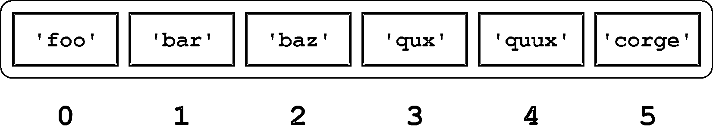
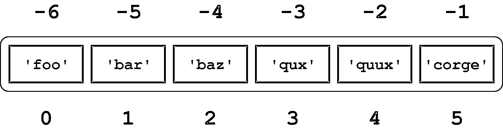
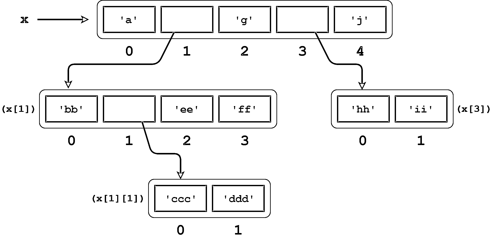
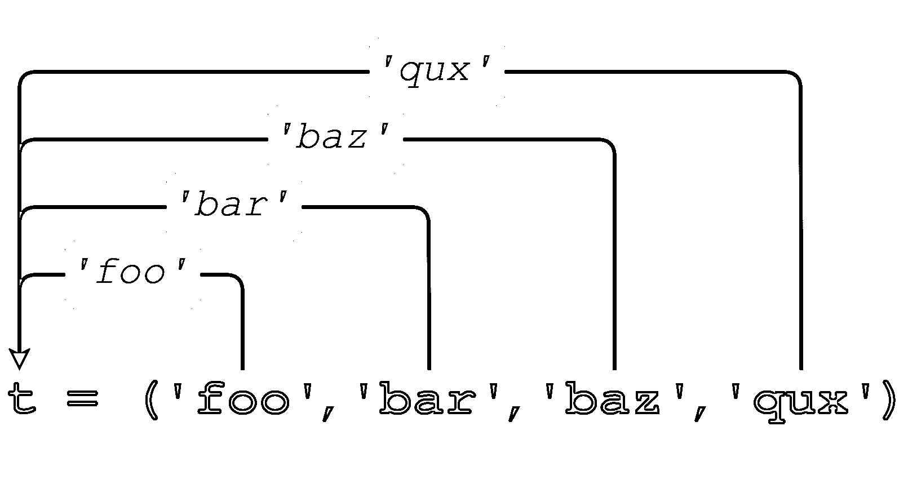
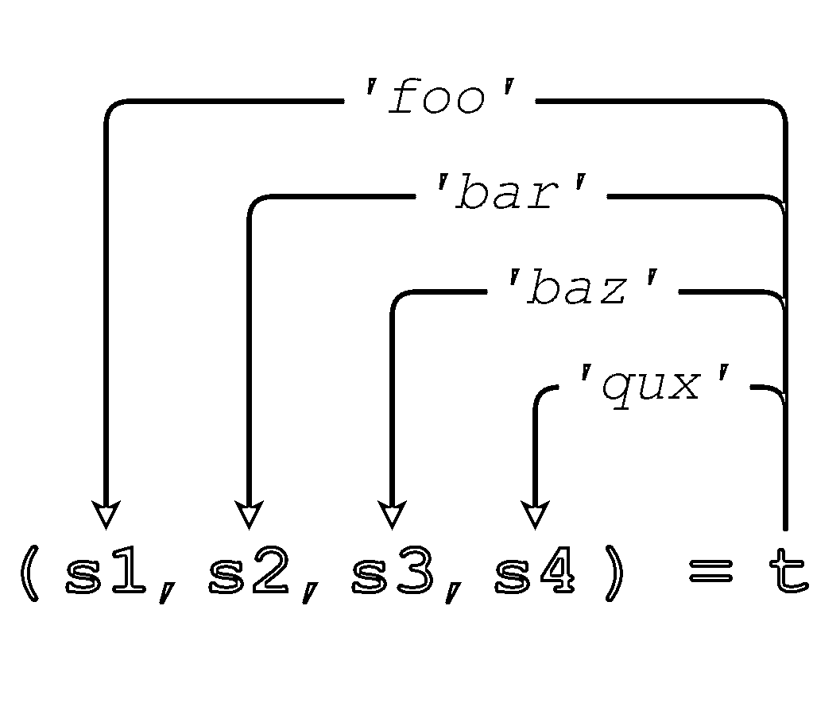

# Python 中的列表和元组

> 原文：<https://realpython.com/python-lists-tuples/>

*立即观看**本教程有真实 Python 团队创建的相关视频课程。和写好的教程一起看，加深理解:[**Python 中的列表和元组**](/courses/lists-tuples-python/)

**列表**和**元组**可以说是 Python 最通用、最有用的[数据类型](https://realpython.com/python-data-types/)。几乎在每一个重要的 Python 程序中都可以找到它们。

在本教程中，您将学到以下内容:您将了解列表和元组的重要特征。您将学习如何定义它们以及如何操作它们。完成后，您应该对在 Python 程序中何时以及如何使用这些对象类型有了很好的感觉。

***参加测验:****通过我们的交互式“Python 列表和元组”测验来测试您的知识。完成后，您将收到一个分数，以便您可以跟踪一段时间内的学习进度:*

*[参加测验](/quizzes/python-lists-tuples/)

## Python 列表

简而言之，列表是任意对象的集合，有点类似于许多其他编程语言中的数组，但是更加灵活。在 Python 中，通过将逗号分隔的对象序列放在方括号(`[]`)中来定义列表，如下所示:

>>>

```py
>>> a = ['foo', 'bar', 'baz', 'qux']

>>> print(a)
['foo', 'bar', 'baz', 'qux']
>>> a
['foo', 'bar', 'baz', 'qux']
```

Python 列表的重要特征如下:

*   列表是有序的。
*   列表可以包含任意对象。
*   列表元素可以通过索引来访问。
*   列表可以嵌套到任意深度。
*   列表是可变的。
*   列表是动态的。

下面将更详细地研究这些特性。

[*Remove ads*](/account/join/)

### 列表已排序

列表不仅仅是对象的集合。它是对象的有序集合。定义列表时指定元素的顺序是该列表的固有特征，并在该列表的生存期内保持不变。(在下一个字典教程中，您将看到一个无序的 Python 数据类型。)

具有不同顺序的相同元素的列表是不同的:

>>>

```py
>>> a = ['foo', 'bar', 'baz', 'qux']
>>> b = ['baz', 'qux', 'bar', 'foo']
>>> a == b
False
>>> a is b
False

>>> [1, 2, 3, 4] == [4, 1, 3, 2]
False
```

### 列表可以包含任意对象

列表可以包含任何种类的对象。列表的元素可以都是相同的类型:

>>>

```py
>>> a = [2, 4, 6, 8]
>>> a
[2, 4, 6, 8]
```

或者元素可以是不同的类型:

>>>

```py
>>> a = [21.42, 'foobar', 3, 4, 'bark', False, 3.14159]
>>> a
[21.42, 'foobar', 3, 4, 'bark', False, 3.14159]
```

列表甚至可以包含复杂的对象，如函数、类和模块，您将在接下来的教程中了解这些内容:

>>>

```py
>>> int
<class 'int'>
>>> len
<built-in function len>
>>> def foo():
...     pass
...
>>> foo
<function foo at 0x035B9030>
>>> import math
>>> math
<module 'math' (built-in)>

>>> a = [int, len, foo, math]
>>> a
[<class 'int'>, <built-in function len>, <function foo at 0x02CA2618>,
<module 'math' (built-in)>]
```

列表可以包含任意数量的对象，从零到计算机内存允许的数量:

>>>

```py
>>> a = []
>>> a
[]

>>> a = [ 'foo' ]
>>> a
['foo']

>>> a = [0, 1, 2, 3, 4, 5, 6, 7, 8, 9, 10, 11, 12, 13, 14, 15, 16, 17, 18, 19, 20,
... 21, 22, 23, 24, 25, 26, 27, 28, 29, 30, 31, 32, 33, 34, 35, 36, 37, 38, 39, 40,
... 41, 42, 43, 44, 45, 46, 47, 48, 49, 50, 51, 52, 53, 54, 55, 56, 57, 58, 59, 60,
... 61, 62, 63, 64, 65, 66, 67, 68, 69, 70, 71, 72, 73, 74, 75, 76, 77, 78, 79, 80,
... 81, 82, 83, 84, 85, 86, 87, 88, 89, 90, 91, 92, 93, 94, 95, 96, 97, 98, 99, 100]
>>> a
[0, 1, 2, 3, 4, 5, 6, 7, 8, 9, 10, 11, 12, 13, 14, 15, 16, 17, 18, 19, 20,
21, 22, 23, 24, 25, 26, 27, 28, 29, 30, 31, 32, 33, 34, 35, 36, 37, 38, 39,
40, 41, 42, 43, 44, 45, 46, 47, 48, 49, 50, 51, 52, 53, 54, 55, 56, 57, 58,
59, 60, 61, 62, 63, 64, 65, 66, 67, 68, 69, 70, 71, 72, 73, 74, 75, 76, 77,
78, 79, 80, 81, 82, 83, 84, 85, 86, 87, 88, 89, 90, 91, 92, 93, 94, 95, 96,
97, 98, 99, 100]
```

(只有一个对象的列表有时被称为单例列表。)

列表对象不必是唯一的。给定对象可以在列表中出现多次:

>>>

```py
>>> a = ['bark', 'meow', 'woof', 'bark', 'cheep', 'bark']
>>> a
['bark', 'meow', 'woof', 'bark', 'cheep', 'bark']
```

### 列表元素可以通过索引来访问

列表中的单个元素可以使用方括号中的索引来访问。这完全类似于访问字符串中的单个字符。列表索引和字符串一样，是从零开始的。

考虑以下列表:

>>>

```py
>>> a = ['foo', 'bar', 'baz', 'qux', 'quux', 'corge']
```

`a`中元素的索引如下所示:

[](https://files.realpython.com/media/t.eb0b38e642c5.png)

<figcaption class="figure-caption text-center">List Indices</figcaption>

下面是访问`a`的一些元素的 Python 代码:

>>>

```py
>>> a[0]
'foo'
>>> a[2]
'baz'
>>> a[5]
'corge'
```

几乎所有关于字符串索引的工作都类似于列表。例如，负列表索引从列表末尾开始计数:

[](https://files.realpython.com/media/t.c11ea56e8ca2.png)

<figcaption class="figure-caption text-center">Negative List Indexing</figcaption>

>>>

```py
>>> a[-1]
'corge'
>>> a[-2]
'quux'
>>> a[-5]
'bar'
```

切片也可以。如果`a`是一个列表，表达式`a[m:n]`返回从索引`m`到索引`n`的`a`部分，但不包括索引【】:

>>>

```py
>>> a = ['foo', 'bar', 'baz', 'qux', 'quux', 'corge']

>>> a[2:5]
['baz', 'qux', 'quux']
```

字符串切片的其他特性同样适用于列表切片:

*   可以指定正索引和负索引:

    >>>

    ```py
    >>> a[-5:-2]
    ['bar', 'baz', 'qux']
    >>> a[1:4]
    ['bar', 'baz', 'qux']
    >>> a[-5:-2] == a[1:4]
    True` 
    ```

*   省略第一个索引会从列表的开头开始切片，省略第二个索引会将切片扩展到列表的结尾:

    >>>

    ```py
    >>> print(a[:4], a[0:4])
    ['foo', 'bar', 'baz', 'qux'] ['foo', 'bar', 'baz', 'qux']
    >>> print(a[2:], a[2:len(a)])
    ['baz', 'qux', 'quux', 'corge'] ['baz', 'qux', 'quux', 'corge']

    >>> a[:4] + a[4:]
    ['foo', 'bar', 'baz', 'qux', 'quux', 'corge']
    >>> a[:4] + a[4:] == a
    True` 
    ```

*   您可以指定步幅，可以是正的，也可以是负的:

    >>>

    ```py
    >>> a[0:6:2]
    ['foo', 'baz', 'quux']
    >>> a[1:6:2]
    ['bar', 'qux', 'corge']
    >>> a[6:0:-2]
    ['corge', 'qux', 'bar']` 
    ```

*   反转列表的语法与反转字符串的语法相同:

    >>>

    ```py
    >>> a[::-1]
    ['corge', 'quux', 'qux', 'baz', 'bar', 'foo']` 
    ```

*   `[:]`语法适用于列表。但是，这个操作如何处理列表和如何处理字符串之间有一个重要的区别。

    如果`s`是一个字符串，`s[:]`返回对同一对象的引用:

    >>>

    ```py
    >>> s = 'foobar'
    >>> s[:]
    'foobar'
    >>> s[:] is s
    True` 
    ```

    相反，如果`a`是一个列表，`a[:]`返回一个新对象，它是`a`的副本:

    >>>

    ```py
    >>> a = ['foo', 'bar', 'baz', 'qux', 'quux', 'corge']
    >>> a[:]
    ['foo', 'bar', 'baz', 'qux', 'quux', 'corge']
    >>> a[:] is a
    False` 
    ```

几个 Python 运算符和内置函数也可以以类似于字符串的方式用于列表:

*   `in`和`not in`操作符:

    >>>

    ```py
    >>> a
    ['foo', 'bar', 'baz', 'qux', 'quux', 'corge']

    >>> 'qux' in a
    True
    >>> 'thud' not in a
    True` 
    ```

*   串联(`+`)和复制(`*`)运算符:

    >>>

    ```py
    >>> a
    ['foo', 'bar', 'baz', 'qux', 'quux', 'corge']

    >>> a + ['grault', 'garply']
    ['foo', 'bar', 'baz', 'qux', 'quux', 'corge', 'grault', 'garply']
    >>> a * 2
    ['foo', 'bar', 'baz', 'qux', 'quux', 'corge', 'foo', 'bar', 'baz',
    'qux', 'quux', 'corge']` 
    ```

*   [`len()`](https://realpython.com/len-python-function/) 、 [`min()`、`max()`](https://realpython.com/python-min-and-max/) 功能:

    >>>

    ```py
    >>> a
    ['foo', 'bar', 'baz', 'qux', 'quux', 'corge']

    >>> len(a)
    6
    >>> min(a)
    'bar'
    >>> max(a)
    'qux'` 
    ```

字符串和列表的行为如此相似并不是偶然的。它们都是被称为 iterable 的更一般的对象类型的特例，您将在接下来的关于确定迭代的教程中更详细地遇到它。

顺便说一下，在上面的每个例子中，在对其执行操作之前，列表总是被分配给一个[变量](https://realpython.com/python-variables/)。但是您也可以对列表文字进行操作:

>>>

```py
>>> ['foo', 'bar', 'baz', 'qux', 'quux', 'corge'][2]
'baz'

>>> ['foo', 'bar', 'baz', 'qux', 'quux', 'corge'][::-1]
['corge', 'quux', 'qux', 'baz', 'bar', 'foo']

>>> 'quux' in ['foo', 'bar', 'baz', 'qux', 'quux', 'corge']
True

>>> ['foo', 'bar', 'baz'] + ['qux', 'quux', 'corge']
['foo', 'bar', 'baz', 'qux', 'quux', 'corge']

>>> len(['foo', 'bar', 'baz', 'qux', 'quux', 'corge'][::-1])
6
```

就此而言，您可以对字符串文字做同样的事情:

>>>

```py
>>> 'If Comrade Napoleon says it, it must be right.'[::-1]
'.thgir eb tsum ti ,ti syas noelopaN edarmoC fI'
```

[*Remove ads*](/account/join/)

### 列表可以嵌套

您已经看到列表中的元素可以是任何类型的对象。这包括另一份名单。一个列表可以包含子列表，子列表又可以包含子列表本身，依此类推，直到任意深度。

考虑这个(公认是人为的)例子:

>>>

```py
>>> x = ['a', ['bb', ['ccc', 'ddd'], 'ee', 'ff'], 'g', ['hh', 'ii'], 'j']
>>> x
['a', ['bb', ['ccc', 'ddd'], 'ee', 'ff'], 'g', ['hh', 'ii'], 'j']
```

`x`引用的对象结构如下图所示:

[](https://files.realpython.com/media/t.08554d94a1e5.png)

<figcaption class="figure-caption text-center">A Nested List</figcaption>

`x[0]`、`x[2]`和`x[4]`是字符串，每个都是一个字符长:

>>>

```py
>>> print(x[0], x[2], x[4])
a g j
```

但是`x[1]`和`x[3]`是子列表:

>>>

```py
>>> x[1]
['bb', ['ccc', 'ddd'], 'ee', 'ff']

>>> x[3]
['hh', 'ii']
```

要访问子列表中的项目，只需附加一个额外的索引:

>>>

```py
>>> x[1]
['bb', ['ccc', 'ddd'], 'ee', 'ff']

>>> x[1][0]
'bb'
>>> x[1][1]
['ccc', 'ddd']
>>> x[1][2]
'ee'
>>> x[1][3]
'ff'

>>> x[3]
['hh', 'ii']
>>> print(x[3][0], x[3][1])
hh ii
```

`x[1][1]`是另一个子列表，所以再添加一个索引就可以访问它的元素:

>>>

```py
>>> x[1][1]
['ccc', 'ddd']
>>> print(x[1][1][0], x[1][1][1])
ccc ddd
```

用这种方式嵌套列表的深度和复杂度没有限制，除非你的计算机内存不够大。

所有关于索引和切片的常用语法也适用于子列表:

>>>

```py
>>> x[1][1][-1]
'ddd'
>>> x[1][1:3]
[['ccc', 'ddd'], 'ee']
>>> x[3][::-1]
['ii', 'hh']
```

然而，要注意操作符和函数只适用于你指定的层次上的列表，而不是[递归](https://realpython.com/python-recursion/)。考虑当您使用`len()`查询`x`的长度时会发生什么:

>>>

```py
>>> x
['a', ['bb', ['ccc', 'ddd'], 'ee', 'ff'], 'g', ['hh', 'ii'], 'j']
>>> len(x)
5

>>> x[0]
'a'
>>> x[1]
['bb', ['ccc', 'ddd'], 'ee', 'ff']
>>> x[2]
'g'
>>> x[3]
['hh', 'ii']
>>> x[4]
'j'
```

只有五个元素——三个字符串和两个子列表。子列表中的单个元素不计入`x`的长度。

使用`in`操作符时，您会遇到类似的情况:

>>>

```py
>>> 'ddd' in x
False
>>> 'ddd' in x[1]
False
>>> 'ddd' in x[1][1]
True
```

`'ddd'`不是`x`或`x[1]`中的元素之一。它只是子列表`x[1][1]`中的一个直接元素。子列表中的单个元素不能算作父列表中的元素。

[*Remove ads*](/account/join/)

### 列表是可变的

到目前为止，您遇到的大多数数据类型都是原子类型。例如，整数或浮点对象是不能再进一步分解的基本单元。这些类型是[不可变的](https://realpython.com/courses/immutability-python/)，这意味着它们一旦被赋值就不能被改变。想改变一个整数的值没有太大意义。如果你想要一个不同的整数，你只需要分配一个不同的。

相比之下，字符串类型是一种复合类型。字符串可以简化为更小的部分，即组成字符。考虑改变字符串中的字符可能是有意义的。但是你不能。在 Python 中，字符串也是不可变的。

列表是您遇到的第一个可变数据类型。一旦创建了列表，就可以随意添加、删除、移动和移动元素。Python 提供了多种修改列表的方法。

#### 修改单个列表值

列表中的单个值可以通过索引和简单赋值来替换:

>>>

```py
>>> a = ['foo', 'bar', 'baz', 'qux', 'quux', 'corge']
>>> a
['foo', 'bar', 'baz', 'qux', 'quux', 'corge']

>>> a[2] = 10
>>> a[-1] = 20
>>> a
['foo', 'bar', 10, 'qux', 'quux', 20]
```

您可能还记得教程[中的字符串和 Python](https://realpython.com/python-strings/#modifying-strings]) 中的字符数据，您不能用字符串来做这件事:

>>>

```py
>>> s = 'foobarbaz'
>>> s[2] = 'x'
Traceback (most recent call last):
  File "<stdin>", line 1, in <module>
TypeError: 'str' object does not support item assignment
```

使用`del`命令可以删除列表项:

>>>

```py
>>> a = ['foo', 'bar', 'baz', 'qux', 'quux', 'corge']

>>> del a[3]
>>> a
['foo', 'bar', 'baz', 'quux', 'corge']
```

#### 修改多个列表值

如果你想一次改变一个列表中几个连续的元素怎么办？Python 允许使用切片赋值来实现这一点，其语法如下:

```py
a[m:n] = <iterable>
```

现在，再次把 iterable 看作一个列表。该赋值用`<iterable>`替换`a`的指定片:

>>>

```py
>>> a = ['foo', 'bar', 'baz', 'qux', 'quux', 'corge']

>>> a[1:4]
['bar', 'baz', 'qux']
>>> a[1:4] = [1.1, 2.2, 3.3, 4.4, 5.5]
>>> a
['foo', 1.1, 2.2, 3.3, 4.4, 5.5, 'quux', 'corge']
>>> a[1:6]
[1.1, 2.2, 3.3, 4.4, 5.5]
>>> a[1:6] = ['Bark!']
>>> a
['foo', 'Bark!', 'quux', 'corge']
```

插入的元素数不必等于替换的元素数。Python 只是根据需要增加或缩小列表。

您可以插入多个元素来代替单个元素，只需使用仅表示一个元素的切片即可:

>>>

```py
>>> a = [1, 2, 3]
>>> a[1:2] = [2.1, 2.2, 2.3]
>>> a
[1, 2.1, 2.2, 2.3, 3]
```

请注意，这不同于用列表替换单个元素:

>>>

```py
>>> a = [1, 2, 3]
>>> a[1] = [2.1, 2.2, 2.3]
>>> a
[1, [2.1, 2.2, 2.3], 3]
```

您也可以在列表中插入元素，而不删除任何内容。只需在所需的索引处指定一个形式为`[n:n]`(零长度切片)的切片:

>>>

```py
>>> a = [1, 2, 7, 8]
>>> a[2:2] = [3, 4, 5, 6]
>>> a
[1, 2, 3, 4, 5, 6, 7, 8]
```

通过将适当的片分配给空列表，可以删除列表中间的多个元素。您也可以对同一个切片使用`del`语句:

>>>

```py
>>> a = ['foo', 'bar', 'baz', 'qux', 'quux', 'corge']
>>> a[1:5] = []
>>> a
['foo', 'corge']

>>> a = ['foo', 'bar', 'baz', 'qux', 'quux', 'corge']
>>> del a[1:5]
>>> a
['foo', 'corge']
```

#### 将项目添加到列表中

使用`+`串联运算符或`+=`增强赋值运算符，可以将附加项添加到列表的开头或结尾:

>>>

```py
>>> a = ['foo', 'bar', 'baz', 'qux', 'quux', 'corge']

>>> a += ['grault', 'garply']
>>> a
['foo', 'bar', 'baz', 'qux', 'quux', 'corge', 'grault', 'garply']

>>> a = ['foo', 'bar', 'baz', 'qux', 'quux', 'corge']

>>> a = [10, 20] + a
>>> a
[10, 20, 'foo', 'bar', 'baz', 'qux', 'quux', 'corge']
```

请注意，一个列表必须与另一个列表连接在一起，因此如果您只想添加一个元素，则需要将其指定为单一列表:

>>>

```py
>>> a = ['foo', 'bar', 'baz', 'qux', 'quux', 'corge']
>>> a += 20
Traceback (most recent call last):
  File "<pyshell#58>", line 1, in <module>
    a += 20
TypeError: 'int' object is not iterable

>>> a += [20]
>>> a
['foo', 'bar', 'baz', 'qux', 'quux', 'corge', 20]
```

注意:从技术上讲，说一个列表必须与另一个列表连接是不正确的。更准确地说，列表必须与可迭代的对象连接在一起。当然，列表是可迭代的，所以可以将一个列表与另一个列表连接起来。

字符串也是可迭代的。但是请注意当您将一个字符串连接到一个列表时会发生什么:

>>>

```py
>>> a = ['foo', 'bar', 'baz', 'qux', 'quux']
>>> a += 'corge'
>>> a
['foo', 'bar', 'baz', 'qux', 'quux', 'c', 'o', 'r', 'g', 'e']
```

这个结果可能不太符合你的预期。当遍历一个字符串时，结果是其组成字符的列表。在上面的例子中，连接到列表`a`上的是字符串`'corge'`中的字符列表。

如果你真的想把单个字符串`'corge'`添加到列表的末尾，你需要把它指定为一个单例列表:

>>>

```py
>>> a = ['foo', 'bar', 'baz', 'qux', 'quux']
>>> a += ['corge']
>>> a
['foo', 'bar', 'baz', 'qux', 'quux', 'corge']
```

如果这看起来很神秘，不要太担心。在关于明确迭代的教程中，您将了解到可迭代的来龙去脉。

#### 修改列表的方法

最后，Python 提供了几个可以用来修改列表的内置方法。这些方法的详细信息如下。

**注意:**你在上一个教程中看到的字符串方法并没有直接修改目标字符串。这是因为字符串是不可变的。相反，字符串方法返回一个新的字符串对象，该对象按照方法的指示进行修改。它们保持原来的目标字符串不变:

>>>

```py
>>> s = 'foobar'
>>> t = s.upper()
>>> print(s, t)
foobar FOOBAR
```

列表方法不同。因为列表是可变的，所以这里显示的列表方法就地修改目标列表。

`a.append(<obj>)`

> 将对象追加到列表中。

[`a.append(<obj>)`](https://realpython.com/python-append/) 将对象`<obj>`追加到列表`a`的末尾:

>>>

```py
>>> a = ['a', 'b']
>>> a.append(123)
>>> a
['a', 'b', 123]
```

记住，列表方法就地修改目标列表。它们不会返回新的列表:

>>>

```py
>>> a = ['a', 'b']
>>> x = a.append(123)
>>> print(x)
None
>>> a
['a', 'b', 123]
```

请记住，当使用`+`操作符连接一个列表时，如果目标操作数是可迭代的，那么它的元素将被分开并单独追加到列表中:

>>>

```py
>>> a = ['a', 'b']
>>> a + [1, 2, 3]
['a', 'b', 1, 2, 3]
```

`.append()`方法不是那样工作的！如果用`.append()`将一个 iterable 追加到一个列表中，它将作为单个对象添加:

>>>

```py
>>> a = ['a', 'b']
>>> a.append([1, 2, 3])
>>> a
['a', 'b', [1, 2, 3]]
```

因此，使用`.append()`，您可以将一个字符串作为单个实体追加:

>>>

```py
>>> a = ['a', 'b']
>>> a.append('foo')
>>> a
['a', 'b', 'foo']
```

`a.extend(<iterable>)`

> 用 iterable 中的对象扩展列表。

是的，这大概就是你想的那样。`.extend()`也添加到列表的末尾，但是参数应该是可迭代的。`<iterable>`中的项目是单独添加的:

>>>

```py
>>> a = ['a', 'b']
>>> a.extend([1, 2, 3])
>>> a
['a', 'b', 1, 2, 3]
```

换句话说，`.extend()`的行为类似于`+`操作符。更准确地说，因为它就地修改了列表，所以它的行为类似于`+=`操作符:

>>>

```py
>>> a = ['a', 'b']
>>> a += [1, 2, 3]
>>> a
['a', 'b', 1, 2, 3]
```

`a.insert(<index>, <obj>)`

> 将对象插入列表。

`a.insert(<index>, <obj>)`在指定的`<index>`处将对象`<obj>`插入到列表`a`中。在方法调用之后，`a[<index>]`是`<obj>`，剩余的列表元素被推到右边:

>>>

```py
>>> a = ['foo', 'bar', 'baz', 'qux', 'quux', 'corge']
>>> a.insert(3, 3.14159)
>>> a[3]
3.14159
>>> a
['foo', 'bar', 'baz', 3.14159, 'qux', 'quux', 'corge']
```

`a.remove(<obj>)`

> 从列表中移除对象。

`a.remove(<obj>)`从列表`a`中删除对象`<obj>`。如果`<obj>`不在`a`中，则会引发一个异常:

>>>

```py
>>> a = ['foo', 'bar', 'baz', 'qux', 'quux', 'corge']
>>> a.remove('baz')
>>> a
['foo', 'bar', 'qux', 'quux', 'corge']

>>> a.remove('Bark!')
Traceback (most recent call last):
  File "<pyshell#13>", line 1, in <module>
    a.remove('Bark!')
ValueError: list.remove(x): x not in list
```

`a.pop(index=-1)`

> 从列表中移除元素。

该方法与`.remove()`在两个方面不同:

1.  您指定要移除的项目的索引，而不是对象本身。
2.  该方法返回值:被移除的项。

`a.pop()`删除列表中的最后一项:

>>>

```py
>>> a = ['foo', 'bar', 'baz', 'qux', 'quux', 'corge']

>>> a.pop()
'corge'
>>> a
['foo', 'bar', 'baz', 'qux', 'quux']

>>> a.pop()
'quux'
>>> a
['foo', 'bar', 'baz', 'qux']
```

如果指定了可选的`<index>`参数，则移除并返回该索引处的项目。`<index>`可能是负数，如字符串和列表索引:

>>>

```py
>>> a = ['foo', 'bar', 'baz', 'qux', 'quux', 'corge']

>>> a.pop(1)
'bar'
>>> a
['foo', 'baz', 'qux', 'quux', 'corge']

>>> a.pop(-3)
'qux'
>>> a
['foo', 'baz', 'quux', 'corge']
```

`<index>`默认为`-1`，所以`a.pop(-1)`相当于`a.pop()`。

[*Remove ads*](/account/join/)

### 列表是动态的

本教程从 Python 列表的六个定义特征开始。最后一点是列表是动态的。在上面的章节中，您已经看到了许多这样的例子。当项目添加到列表中时，它会根据需要增长:

>>>

```py
>>> a = ['foo', 'bar', 'baz', 'qux', 'quux', 'corge']

>>> a[2:2] = [1, 2, 3]
>>> a += [3.14159]
>>> a
['foo', 'bar', 1, 2, 3, 'baz', 'qux', 'quux', 'corge', 3.14159]
```

类似地，列表会缩小以适应项目的移除:

>>>

```py
>>> a = ['foo', 'bar', 'baz', 'qux', 'quux', 'corge']
>>> a[2:3] = []
>>> del a[0]
>>> a
['bar', 'qux', 'quux', 'corge']
```

## python 元组

Python 提供了另一种类型，即有序的对象集合，称为元组。

发音因你问的人而异。有些人把它发音为“too-ple”(与“Mott the Hoople”押韵)，其他人则发音为“tup-ple”(与“supple”押韵)。我倾向于后者，因为它可能与“五重”、“六重”、“八重”等等起源相同，而且我认识的每个人都把后者发音为与“柔软”押韵。

### 定义和使用元组

元组在所有方面都与列表相同，除了以下属性:

*   元组是通过将元素括在圆括号(`()`)而不是方括号(`[]`)中来定义的。
*   元组是不可变的。

下面是一个简短的示例，展示了元组定义、索引和切片:

>>>

```py
>>> t = ('foo', 'bar', 'baz', 'qux', 'quux', 'corge')
>>> t
('foo', 'bar', 'baz', 'qux', 'quux', 'corge')

>>> t[0]
'foo'
>>> t[-1]
'corge'
>>> t[1::2]
('bar', 'qux', 'corge')
```

不要害怕！我们最喜欢的字符串和列表反转机制也适用于元组:

>>>

```py
>>> t[::-1]
('corge', 'quux', 'qux', 'baz', 'bar', 'foo')
```

**注意:**即使元组是用括号定义的，你还是要用方括号对元组进行索引和切片，就像对字符串和列表一样。

你所了解的关于列表的一切——它们是有序的，它们可以包含任意对象，它们可以被索引和切片，它们可以被嵌套——对元组也是如此。但是它们不能被修改:

>>>

```py
>>> t = ('foo', 'bar', 'baz', 'qux', 'quux', 'corge')
>>> t[2] = 'Bark!'
Traceback (most recent call last):
  File "<pyshell#65>", line 1, in <module>
    t[2] = 'Bark!'
TypeError: 'tuple' object does not support item assignment
```

为什么要用元组而不是列表？

*   当操作一个元组时，程序的执行速度比操作等价列表时要快。(当列表或元组很小时，这可能不会被注意到。)

*   有时候你不希望数据被修改。如果集合中的值在程序的生命周期中保持不变，使用元组而不是列表可以防止意外修改。

*   您将很快遇到另一种 Python 数据类型，称为 dictionary，它需要一个不可变类型的值作为其组件之一。元组可以用于此目的，而列表则不能。

在 Python REPL 会话中，您可以同时显示多个对象的值，方法是在`>>>`提示符下直接输入这些值，用逗号分隔:

>>>

```py
>>> a = 'foo'
>>> b = 42
>>> a, 3.14159, b
('foo', 3.14159, 42)
```

Python 在括号中显示响应，因为它隐式地将输入解释为元组。

关于元组定义，有一个特性您应该知道。当定义一个空元组，或者一个有两个或更多元素的元组时，没有歧义。Python 知道您正在定义一个元组:

>>>

```py
>>> t = ()
>>> type(t)
<class 'tuple'>
```

>>>

```py
>>> t = (1, 2)
>>> type(t)
<class 'tuple'>
>>> t = (1, 2, 3, 4, 5)
>>> type(t)
<class 'tuple'>
```

但是当你试图用一个条目定义一个元组时会发生什么呢:

>>>

```py
>>> t = (2)
>>> type(t)
<class 'int'>
```

*Doh！*由于圆括号也用于定义表达式中的运算符优先级，Python 将表达式`(2)`简单地作为整数`2`进行计算，并创建一个`int`对象。要告诉 Python 您确实想要定义一个单例元组，请在右括号前包含一个尾随逗号(`,`):

>>>

```py
>>> t = (2,)
>>> type(t)
<class 'tuple'>
>>> t[0]
2
>>> t[-1]
2
```

你可能不需要经常定义一个单元组，但是必须有一种方法。

当您显示单元组时，Python 包含了逗号，以提醒您这是一个元组:

>>>

```py
>>> print(t)
(2,)
```

[*Remove ads*](/account/join/)

### 元组分配、打包和解包

正如您在上面已经看到的，包含几个项目的文字元组可以分配给单个对象:

>>>

```py
>>> t = ('foo', 'bar', 'baz', 'qux')
```

当这种情况发生时，就好像元组中的项目已经被“打包”到对象中:

[](https://files.realpython.com/media/t.feb20d10b75d.png)

<figcaption class="figure-caption text-center">Tuple Packing</figcaption>

>>>

```py
>>> t
('foo', 'bar', 'baz', 'qux')
>>> t[0]
'foo'
>>> t[-1]
'qux'
```

如果该“打包”对象随后被分配给新的元组，则各个项被“解包”到元组中的对象中:

[](https://files.realpython.com/media/t.629d7402a412.png)

<figcaption class="figure-caption text-center">Tuple Unpacking</figcaption>

>>>

```py
>>> (s1, s2, s3, s4) = t
>>> s1
'foo'
>>> s2
'bar'
>>> s3
'baz'
>>> s4
'qux'
```

解包时，左侧变量的数量必须与元组中值的数量相匹配:

>>>

```py
>>> (s1, s2, s3) = t
Traceback (most recent call last):
  File "<pyshell#16>", line 1, in <module>
    (s1, s2, s3) = t
ValueError: too many values to unpack (expected 3)

>>> (s1, s2, s3, s4, s5) = t
Traceback (most recent call last):
  File "<pyshell#17>", line 1, in <module>
    (s1, s2, s3, s4, s5) = t
ValueError: not enough values to unpack (expected 5, got 4)
```

打包和解包可以合并到一个语句中进行复合赋值:

>>>

```py
>>> (s1, s2, s3, s4) = ('foo', 'bar', 'baz', 'qux')
>>> s1
'foo'
>>> s2
'bar'
>>> s3
'baz'
>>> s4
'qux'
```

同样，赋值左边元组中元素的数量必须等于右边的数量:

>>>

```py
>>> (s1, s2, s3, s4, s5) = ('foo', 'bar', 'baz', 'qux')
Traceback (most recent call last):
  File "<pyshell#63>", line 1, in <module>
    (s1, s2, s3, s4, s5) = ('foo', 'bar', 'baz', 'qux')
ValueError: not enough values to unpack (expected 5, got 4)
```

在像这样的赋值和少数其他情况下，Python 允许省略通常用于表示元组的括号:

>>>

```py
>>> t = 1, 2, 3
>>> t
(1, 2, 3)

>>> x1, x2, x3 = t
>>> x1, x2, x3
(1, 2, 3)

>>> x1, x2, x3 = 4, 5, 6
>>> x1, x2, x3
(4, 5, 6)

>>> t = 2,
>>> t
(2,)
```

无论是否包含括号都是一样的，所以如果您对是否需要它们有任何疑问，请继续包含它们。

元组赋值考虑到了一点奇怪的 Python 习惯。在编程时，您经常需要交换两个变量的值。在大多数编程语言中，有必要在交换发生时将其中一个值存储在临时变量中，如下所示:

>>>

```py
>>> a = 'foo'
>>> b = 'bar'
>>> a, b
('foo', 'bar')

>>># We need to define a temp variable to accomplish the swap.
>>> temp = a
>>> a = b
>>> b = temp

>>> a, b
('bar', 'foo')
```

在 Python 中，交换可以通过一个元组赋值来完成:

>>>

```py
>>> a = 'foo'
>>> b = 'bar'
>>> a, b
('foo', 'bar')

>>># Magic time!
>>> a, b = b, a

>>> a, b
('bar', 'foo')
```

任何曾经不得不使用临时变量交换值的人都知道，能够在 Python 中这样做是现代技术成就的顶峰。再也没有比这更好的了。

[*Remove ads*](/account/join/)

## 结论

本教程涵盖了 Python **列表**和**元组**的基本属性，以及如何操作它们。您将在 Python 编程中广泛使用这些工具。

列表的主要特征之一是它是有序的。列表中元素的顺序是该列表的固有属性，不会改变，除非列表本身被修改。(元组也是一样，当然除了不能修改。)

下一篇教程将向您介绍 Python **字典:**一种无序的复合数据类型。请继续阅读！

***参加测验:****通过我们的交互式“Python 列表和元组”测验来测试您的知识。完成后，您将收到一个分数，以便您可以跟踪一段时间内的学习进度:*

*[参加测验](/quizzes/python-lists-tuples/)*

*[« Strings in Python](https://realpython.com/python-strings/)[Lists and Tuples in Python](#)[Dictionaries in Python »](https://realpython.com/python-dicts/)

*立即观看**本教程有真实 Python 团队创建的相关视频课程。和写好的教程一起看，加深理解:[**Python 中的列表和元组**](/courses/lists-tuples-python/)**********