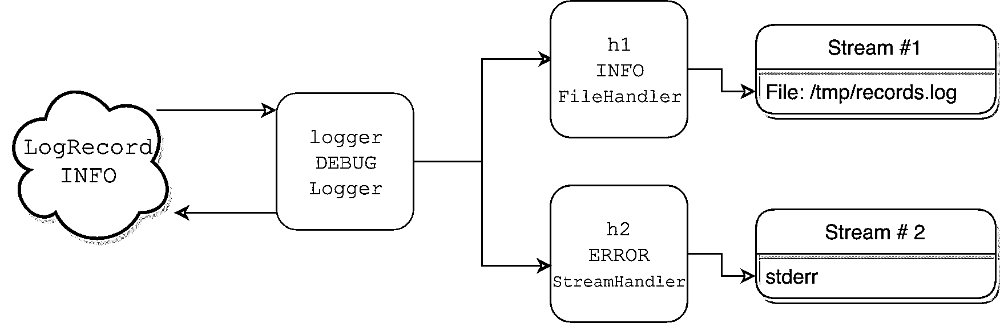
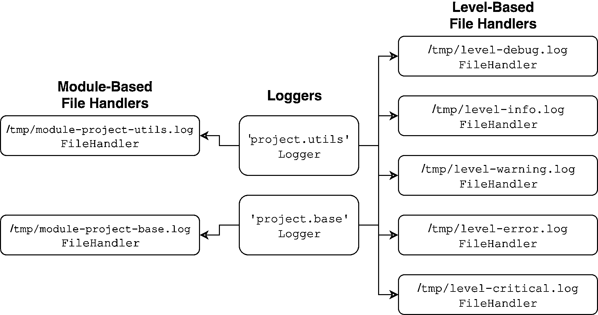
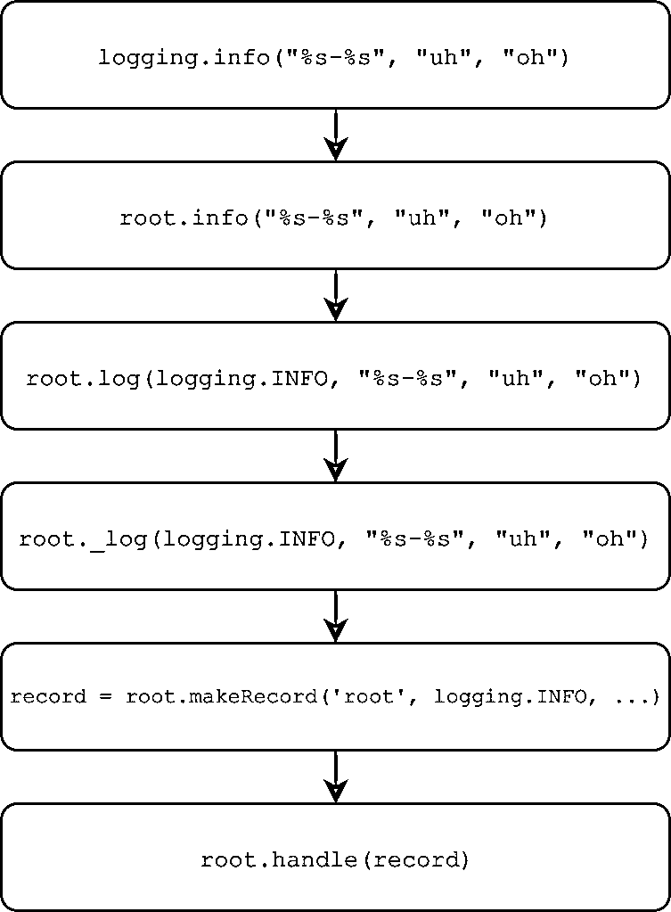

# Python 日志记录:源代码漫游

> 原文：<https://realpython.com/python-logging-source-code/>

Python `logging`包是一个轻量级但可扩展的包，用于更好地跟踪您自己的代码做了什么。使用它比仅仅用多余的 [`print()`](https://realpython.com/python-print/) 调用使代码杂乱无章要灵活得多。

然而，Python 的`logging`包在某些地方可能很复杂。处理程序、记录器、级别、[名称空间](https://realpython.com/python-namespaces-scope/)、过滤器:跟踪所有这些部分以及它们如何交互并不容易。

在你对`logging`的理解中，一个解决细节的方法是查看它的 [CPython](https://realpython.com/cpython-source-code-guide/) 源代码。`logging`背后的 Python 代码简洁且模块化，通读它可以帮助你获得那个*啊哈*时刻。

本文旨在补充日志记录 [HOWTO](https://docs.python.org/3/howto/logging.html) 文档以及 Python 中的[日志记录，这是一个关于如何使用该包的演练。](https://realpython.com/python-logging/)

**在本文结束时，你会熟悉下面的**:

*   `logging`级别及其工作方式
*   `logging`中线程安全与进程安全的对比
*   从面向对象的角度看`logging`的设计
*   在库和应用程序中登录
*   使用`logging`的最佳实践和设计模式

在很大程度上，我们将逐行深入 Python 的`logging`包中的核心[模块](https://realpython.com/python-modules-packages/)，以便构建一幅它是如何布局的画面。

**免费奖励:** [掌握 Python 的 5 个想法](https://realpython.com/bonus/python-mastery-course/)，这是一个面向 Python 开发者的免费课程，向您展示将 Python 技能提升到下一个水平所需的路线图和心态。

## 如何跟进

因为`logging`源代码是本文的核心，所以您可以假设任何代码块或链接都基于 Python 3.7 CPython 存储库中的特定提交，即[提交`d730719`](https://github.com/python/cpython/tree/d730719b094cb006711b1cd546927b863c173b31) 。您可以在 CPython 源代码的 [`Lib/`](https://github.com/python/cpython/tree/d730719b094cb006711b1cd546927b863c173b31/Lib/logging) 目录中找到`logging`包本身。

在`logging`包中，大部分繁重的工作发生在 [`logging/__init__.py`](https://github.com/python/cpython/blob/d730719b094cb006711b1cd546927b863c173b31/Lib/logging/__init__.py) 中，这是您在这里花费时间最多的文件:

```py
cpython/
│
├── Lib/
│   ├── logging/
│   │   ├── __init__.py
│   │   ├── config.py
│   │   └── handlers.py
│   ├── ...
├── Modules/
├── Include/
...
... [truncated]
```

就这样，让我们开始吧。

[*Remove ads*](/account/join/)

## 准备工作

在我们进入重量级之前，`__init__.py`的前一百行介绍了一些微妙但重要的概念。

### 预备#1:等级只是一个`int`！

像`logging.INFO`或`logging.DEBUG`这样的对象可能看起来有点不透明。这些内部变量是什么，它们是如何定义的？

事实上，Python 的`logging` [中的大写常量只是整数](https://github.com/python/cpython/blob/d730719b094cb006711b1cd546927b863c173b31/Lib/logging/__init__.py#L89)，形成了一个类似枚举的数值级别集合:

```py
CRITICAL = 50
FATAL = CRITICAL
ERROR = 40
WARNING = 30
WARN = WARNING
INFO = 20
DEBUG = 10
NOTSET = 0
```

为什么不直接用[琴弦](https://realpython.com/python-strings/) `"INFO"`或者`"DEBUG"`？级别是`int`常量，允许简单、明确地比较一个级别和另一个级别。它们被命名也是为了赋予它们语义。说一条消息的严重性为 50 可能不会马上清楚，但是说它的级别为`CRITICAL`会让您知道您的程序中有一个闪烁的红灯。

现在，从技术上来说，你可以在一些地方只通过一个级别的`str`形式，比如`logger.setLevel("DEBUG")`。在内部，这将调用`_checkLevel()`，它最终对相应的`int`进行`dict`查找:

```py
_nameToLevel = {
    'CRITICAL': CRITICAL,
    'FATAL': FATAL,
    'ERROR': ERROR,
    'WARN': WARNING,
    'WARNING': WARNING,
    'INFO': INFO,
    'DEBUG': DEBUG,
    'NOTSET': NOTSET,
}

def _checkLevel(level):
    if isinstance(level, int):
        rv = level
    elif str(level) == level:
        if level not in _nameToLevel:
            raise ValueError("Unknown level: %r" % level)
        rv = _nameToLevel[level]
    else:
        raise TypeError("Level not an integer or a valid string: %r" % level)
    return rv
```

你更喜欢哪个？我对此没有太多的看法，但值得注意的是，`logging`的医生一直使用`logging.DEBUG`的形式，而不是`"DEBUG"`或`10`。此外，传递`str`表单在 Python 2 中不是一个选项，一些`logging`方法如`logger.isEnabledFor()`将只接受`int`，而不是它的`str`表亲。

### 预备#2:日志是线程安全的，但不是进程安全的

往下几行，你会发现下面的短代码块，它对整个包来说是非常关键的:

```py
import threading

_lock = threading.RLock()

def _acquireLock():
     if _lock:
        _lock.acquire()

def _releaseLock():
    if _lock:
        _lock.release()
```

`_lock`对象是一个[重入锁](https://realpython.com/intro-to-python-threading/#basic-synchronization-using-lock)，它位于`logging/__init__.py`模块的全局名称空间中。它使得整个`logging`包中的几乎每个对象和操作都是线程安全的，使得线程能够在没有竞争条件威胁的情况下进行读写操作。您可以在模块源代码中看到，`_acquireLock()`和`_releaseLock()`对于模块及其类来说是无处不在的。

但是，这里有些东西没有考虑到:过程安全呢？简单的回答是`logging`模块是*而不是*进程安全的。这并不是`logging`的固有错误——一般来说，如果没有程序员的积极努力，两个进程无法写入同一个文件。

这意味着在使用像涉及多重处理的`logging.FileHandler`这样的类之前，你要小心。如果两个进程想要同时读写同一个底层文件，那么在长时间运行的例程中，您可能会遇到一个令人讨厌的 bug。

如果你想绕过这个限制，在官方的伐木食谱中有一个详细的[食谱](https://docs.python.org/3/howto/logging-cookbook.html#logging-to-a-single-file-from-multiple-processes)。因为这需要相当多的设置，一个替代方案是让每个进程根据其进程 ID 记录到一个单独的文件中，您可以使用 [`os.getpid()`](https://docs.python.org/3/library/os.html#os.getpid) 来获取该文件。

## 包架构:日志的 MRO

现在我们已经介绍了一些初步的设置代码，让我们从更高的层面来看看`logging`是如何布局的。`logging`包使用了健康剂量的 [OOP](https://realpython.com/python3-object-oriented-programming/) 和[遗传](https://realpython.com/inheritance-composition-python/)。下面是包中一些最重要的类的方法解析顺序(MRO)的局部视图:

```py
object
│
├── LogRecord
├── Filterer
│   ├── Logger
│   │   └── RootLogger
│   └── Handler
│       ├── StreamHandler
│       └── NullHandler
├── Filter
└── Manager
```

上面的树形图没有涵盖模块中的所有类，只是那些最值得强调的类。

**注意**:你可以使用 dunder 属性`logging.StreamHandler.__mro__`来查看继承链。MRO 的权威[指南可以在 Python 2 文档中找到，尽管它也适用于 Python 3。](https://www.python.org/download/releases/2.3/mro/)

这一连串的类通常是混乱的来源之一，因为有很多正在进行中，而且都是术语。`Filter`对`Filterer`？`Logger`对`Handler`？跟踪每一件事都很有挑战性，更不用说想象它们是如何组合在一起的了。一张图片胜过千言万语，所以这里有一个场景图，其中一个日志记录器和两个处理程序一起编写一个级别为`logging.INFO`的日志消息:

[](https://files.realpython.com/media/flow-new.0a9432c705ad.png)

<figcaption class="figure-caption text-center">Flow of logging objects (Image: Real Python)</figcaption>

在 Python 代码中，上面的所有内容看起来都像这样:

```py
import logging
import sys

logger = logging.getLogger("pylog")
logger.setLevel(logging.DEBUG)
h1 = logging.FileHandler(filename="/tmp/records.log")
h1.setLevel(logging.INFO)
h2 = logging.StreamHandler(sys.stderr)
h2.setLevel(logging.ERROR)
logger.addHandler(h1)
logger.addHandler(h2)
logger.info("testing %d.. %d.. %d..", 1, 2, 3)
```

在[日志记录指南](https://docs.python.org/3.5/howto/logging.html#logging-flow)中有一个更详细的流程图。上面显示的是一个简化的场景。

您的代码只定义了一个`Logger`实例`logger`，以及两个`Handler`实例`h1`和`h2`。

当您调用`logger.info("testing %d.. %d.. %d..", 1, 2, 3)`时，`logger`对象充当过滤器，因为它也有一个关联的`level`。只有当消息级别足够严重时，记录器才会对消息做任何事情。因为记录器具有级别`DEBUG`，并且消息携带更高的`INFO`级别，所以它获得继续前进的许可。

在内部，`logger`调用 [`logger.makeRecord()`](https://github.com/python/cpython/blob/d730719b094cb006711b1cd546927b863c173b31/Lib/logging/__init__.py#L1481) 将消息字符串`"testing %d.. %d.. %d.."`及其参数`(1, 2, 3)`放入一个真正的`LogRecord`的类实例中，该实例只是消息及其元数据的容器。

`logger`对象四处寻找它的处理程序(`Handler`的实例)，这些处理程序可能直接绑定到`logger`本身或者它的父对象(这个概念我们稍后会谈到)。在本例中，它找到了两个处理程序:

1.  一个级别为`INFO`，在`/tmp/records.log`将日志数据转储到一个文件中
2.  一个写至`sys.stderr`但仅当输入消息处于级别`ERROR`或更高时

此时，又一轮测试开始了。因为`LogRecord`和它的消息只携带级别`INFO`，所以记录被写入处理程序 1(绿色箭头)，而不是处理程序 2 的`stderr`流(红色箭头)。对于处理程序来说，将`LogRecord`写到它们的流中被称为**发射** it，这是在它们的 [`.emit()`](https://github.com/python/cpython/blob/d730719b094cb006711b1cd546927b863c173b31/Lib/logging/__init__.py#L882) 中捕获的。

接下来，让我们从上面进一步解剖一切。

[*Remove ads*](/account/join/)

### `LogRecord`类

什么是`LogRecord`？当您记录一个消息时，`LogRecord`类的一个实例就是您发送来记录的对象。它是由一个`Logger`实例为您创建的，封装了该事件的所有相关信息。在内部，它只不过是包含记录属性的`dict`的包装器。一个`Logger`实例向零个或多个`Handler`实例发送一个`LogRecord`实例。

`LogRecord`包含一些元数据，如下所示:

1.  一个名字
2.  Unix 时间戳形式的创建时间
3.  消息本身
4.  关于哪个函数进行了日志记录调用的信息

下面是它所携带的元数据，您可以通过使用 [`pdb`模块](https://realpython.com/python-debugging-pdb/)单步执行`logging.error()`调用来反思它:

>>>

```py
>>> import logging
>>> import pdb

>>> def f(x):
...     logging.error("bad vibes")
...     return x / 0
... 
>>> pdb.run("f(1)")
```

在单步执行了一些更高级别的函数之后，您在第 1517 行结束了[:](https://github.com/python/cpython/blob/d730719b094cb006711b1cd546927b863c173b31/Lib/logging/__init__.py#L1517)

```py
(Pdb) l
1514                     exc_info = (type(exc_info), exc_info, exc_info.__traceback__)
1515                 elif not isinstance(exc_info, tuple):
1516                     exc_info = sys.exc_info()
1517             record = self.makeRecord(self.name, level, fn, lno, msg, args,
1518                                      exc_info, func, extra, sinfo)
1519 ->          self.handle(record)
1520
1521         def handle(self, record):
1522             """
1523             Call the handlers for the specified record.
1524
(Pdb) from pprint import pprint
(Pdb) pprint(vars(record))
{'args': (),
 'created': 1550671851.660067,
 'exc_info': None,
 'exc_text': None,
 'filename': '<stdin>',
 'funcName': 'f',
 'levelname': 'ERROR',
 'levelno': 40,
 'lineno': 2,
 'module': '<stdin>',
 'msecs': 660.067081451416,
 'msg': 'bad vibes',
 'name': 'root',
 'pathname': '<stdin>',
 'process': 2360,
 'processName': 'MainProcess',
 'relativeCreated': 295145.5490589142,
 'stack_info': None,
 'thread': 4372293056,
 'threadName': 'MainThread'}
```

在内部，一个`LogRecord`包含一个以某种方式使用的元数据宝库。

你很少需要直接与`LogRecord`打交道，因为`Logger`和`Handler`会为你做这件事。知道什么信息被包装在一个`LogRecord`中仍然是值得，因为当您看到记录的日志消息时，所有有用的信息，如时间戳，都来自这里。

**注意**:在`LogRecord`类下面，你还会发现`setLogRecordFactory()`、`getLogRecordFactory()`和`makeLogRecord()`、[工厂函数](https://realpython.com/factory-method-python/)。除非你想用一个定制类代替`LogRecord`来封装日志消息和它们的元数据，否则你不需要这些。

### `Logger`和`Handler`类

`Logger`和`Handler`类都是`logging`如何工作的核心，它们彼此频繁交互。一个`Logger`、一个`Handler`和一个`LogRecord`都有一个`.level`与之相关联。

`Logger`获取`LogRecord`并将其传递给`Handler`，但前提是`LogRecord`的有效电平等于或高于`Logger`的有效电平。这同样适用于`LogRecord`对`Handler`测试。这被称为**基于级别的过滤**，其`Logger`和`Handler`实现方式略有不同。

换句话说，在您记录的消息到达任何地方之前，应用了(至少)两步测试。为了完全从记录器传递到处理程序，然后记录到结束流(可能是`sys.stdout`，一个文件，或者通过 SMTP 的一封电子邮件)，一个`LogRecord`的级别必须至少与记录器和处理程序的的*一样高。*

PEP 282 描述了其工作原理:

> 每个`Logger`对象跟踪它感兴趣的日志级别(或阈值),并丢弃低于该级别的日志请求。([来源](https://www.python.org/dev/peps/pep-0282/))

那么对于`Logger`和`Handler`，这种基于级别的过滤实际发生在哪里呢？

对于`Logger`类，合理的第一个假设是记录器会将其`.level`属性与`LogRecord`的级别进行比较，并在那里完成。然而，它比那稍微更复杂一些。

基于级别的日志过滤发生在`.isEnabledFor()`中，它依次调用`.getEffectiveLevel()`。*总是*使用`logger.getEffectiveLevel()`而不仅仅是咨询`logger.level`。原因与层次名称空间中的`Logger`对象的组织有关。(稍后您会看到更多相关内容。)

默认情况下，`Logger`实例的级别为`0` ( `NOTSET`)。然而，记录器也有**父记录器**，其中一个是根记录器，它充当所有其他记录器的父记录器。一个`Logger`将在它的层次结构中向上走，并获得它相对于其父节点的有效级别(如果没有找到其他父节点，最终可能是`root`)。

这里是[发生的地方](https://github.com/python/cpython/blob/d730719b094cb006711b1cd546927b863c173b31/Lib/logging/__init__.py#L1605)在`Logger`类中:

```py
class Logger(Filterer):
    # ...
    def getEffectiveLevel(self):
        logger = self
        while logger:
            if logger.level:
                return logger.level
            logger = logger.parent
        return NOTSET
     def isEnabledFor(self, level):
        try:
            return self._cache[level]
        except KeyError:
            _acquireLock()
            if self.manager.disable >= level:
                is_enabled = self._cache[level] = False
            else:
                is_enabled = self._cache[level] = level >= self.getEffectiveLevel()
            _releaseLock()
 return is_enabled
```

相应的，这里有一个调用你上面看到的源代码的例子:

>>>

```py
>>> import logging
>>> logger = logging.getLogger("app")
>>> logger.level  # No!
0
>>> logger.getEffectiveLevel()
30
>>> logger.parent
<RootLogger root (WARNING)>
>>> logger.parent.level
30
```

要点如下:不要依赖`.level`。如果您没有在您的`logger`对象上显式地设置一个级别，并且由于某种原因您依赖于`.level`，那么您的日志记录设置可能会与您预期的有所不同。

那`Handler`呢？对于处理程序来说，级别间的比较更简单，尽管它实际上发生在来自`Logger`类的`.callHandlers()` 中的[:](https://github.com/python/cpython/blob/d730719b094cb006711b1cd546927b863c173b31/Lib/logging/__init__.py#L1575)

```py
class Logger(Filterer):
    # ...
    def callHandlers(self, record):
        c = self
        found = 0
        while c:
            for hdlr in c.handlers:
                found = found + 1
                if record.levelno >= hdlr.level:
                    hdlr.handle(record)
```

对于一个给定的`LogRecord`实例(在上面的源代码中被命名为`record`),一个记录器检查它的每个注册的处理程序，并快速检查那个`Handler`实例的`.level`属性。如果`LogRecord`的`.levelno`大于或等于处理程序的，则记录才会被传递。`logging`中的 [docstring](https://github.com/python/cpython/blob/d730719b094cb006711b1cd546927b863c173b31/Lib/logging/__init__.py#L894) 将此称为“有条件地发出指定的日志记录。”


对于一个`Handler`子类实例来说，最重要的属性是它的`.stream`属性。这是日志写入的最终目的地，可以是任何类似文件的对象。这里有一个关于 [`io.StringIO`](https://docs.python.org/3/library/io.html#io.StringIO) 的例子，它是一个用于文本 I/O 的内存流(缓冲区)

首先，设置一个级别为`DEBUG`的`Logger`实例。您会看到，默认情况下，它没有直接的处理程序:

>>>

```py
>>> import io
>>> import logging
>>> logger = logging.getLogger("abc")
>>> logger.setLevel(logging.DEBUG)
>>> print(logger.handlers)
[]
```

接下来，你可以子类化`logging.StreamHandler`来使`.flush()`调用一个无操作。我们想要刷新`sys.stderr`或者`sys.stdout`，但是在这个例子中不是内存缓冲区:

```py
class IOHandler(logging.StreamHandler):
    def flush(self):
        pass  # No-op
```

现在，声明 buffer 对象本身，并将其作为自定义处理程序的`.stream`绑定，级别为`INFO`，然后将该处理程序绑定到记录器中:

>>>

```py
>>> stream = io.StringIO()
>>> h = IOHandler(stream)
>>> h.setLevel(logging.INFO)
>>> logger.addHandler(h)

>>> logger.debug("extraneous info")
>>> logger.warning("you've been warned")
>>> logger.critical("SOS")

>>> try:
...     print(stream.getvalue())
... finally:
...     stream.close()
... 
you've been warned
SOS
```

这最后一块是基于级别的过滤的另一个例子。

等级为`DEBUG`、`WARNING`和`CRITICAL`的三条消息通过链传递。起初，看起来好像他们哪儿也不去，但有两个人去了。他们三个都从`logger`(有等级`DEBUG`)走出大门。

然而，其中只有两个被处理程序发出，因为它有一个更高的级别`INFO`，它超过了`DEBUG`。最后，您以一个`str`的形式获得缓冲区的全部内容，并关闭缓冲区以显式释放系统资源。

[*Remove ads*](/account/join/)

### `Filter`和`Filterer`类

上面，我们问了这个问题，“基于级别的过滤发生在哪里？”在回答这个问题时，很容易被`Filter`和`Filterer`类分散注意力。矛盾的是，`Logger`和`Handler`实例的基于级别的过滤在没有`Filter`或`Filterer`类帮助的情况下发生。

`Filter`和`Filterer`旨在让您在默认的基于级别的过滤之上添加额外的基于函数的过滤器。我喜欢把它想象成*点菜*过滤。

`Filterer`是`Logger`和`Handler`的基类，因为这两个类都有资格接收您指定的额外自定义过滤器。你用`logger.addFilter()`或`handler.addFilter()`给它们添加`Filter`的实例，这就是下面方法中的`self.filters`所指的:

```py
class Filterer(object):
    # ...
    def filter(self, record):
        rv = True
        for f in self.filters:
            if hasattr(f, 'filter'):
 result = f.filter(record)            else:
                result = f(record)
            if not result:
                rv = False
                break
        return rv
```

给定一个`record`(它是一个`LogRecord`实例)，`.filter()`返回`True`或`False`，这取决于该记录是否从该类的过滤器中获得许可。

这是。`handle()`依次为`Logger`和`Handler`类:

```py
class Logger(Filterer):
    # ...
    def handle(self, record):
        if (not self.disabled) and self.filter(record):
            self.callHandlers(record)
  # ...

class Handler(Filterer):
    # ...
    def handle(self, record):
        rv = self.filter(record)
        if rv:
            self.acquire()
            try:
                self.emit(record)
            finally:
 self.release()        return rv
```

默认情况下，`Logger`和`Handler`都没有额外的过滤器，但是这里有一个简单的例子来说明如何添加过滤器:

>>>

```py
>>> import logging

>>> logger = logging.getLogger("rp")
>>> logger.setLevel(logging.INFO)
>>> logger.addHandler(logging.StreamHandler())
>>> logger.filters  # Initially empty
[]
>>> class ShortMsgFilter(logging.Filter):
...     """Only allow records that contain long messages (> 25 chars)."""
...     def filter(self, record):
...         msg = record.msg
...         if isinstance(msg, str):
...             return len(msg) > 25
...         return False
... 
>>> logger.addFilter(ShortMsgFilter())
>>> logger.filters
[<__main__.ShortMsgFilter object at 0x10c28b208>]
>>> logger.info("Reeeeaaaaallllllly long message")  # Length: 31
Reeeeaaaaallllllly long message
>>> logger.info("Done")  # Length: <25, no output
```

上面，您定义了一个类`ShortMsgFilter`并覆盖了它的`.filter()`。在`.addHandler()`中，你也可以只传递一个可调用的，比如一个函数或者[λ](https://realpython.com/python-lambda/)或者一个定义`.__call__()`的类。

### `Manager`类

还有一个值得一提的`logging`幕后演员:`Manager`班。最重要的不是`Manager`类，而是它的一个实例，这个实例充当了越来越多的记录器层次结构的容器，这些记录器是跨包定义的。在下一节中，您将看到这个类的单个实例是如何将模块粘合在一起并允许其各个部分相互通信的。

## 最重要的根日志记录器

说到`Logger`实例，有一个很突出。它被称为 root logger:

```py
class RootLogger(Logger):
    def __init__(self, level):
        Logger.__init__(self, "root", level)

# ...

root = RootLogger(WARNING)
Logger.root = root
Logger.manager = Manager(Logger.root)
```

这段代码块的最后三行是`logging`包使用的巧妙技巧之一。以下是几点:

*   根日志记录器只是一个简单的 Python 对象，标识符为`root`。它的等级为`logging.WARNING`，T2 为`"root"`。就`RootLogger`这个职业而言，这个独特的名字就是它的特别之处。

*   `root`对象又变成了`Logger`类的**类属性**。这意味着`Logger`的所有实例，以及`Logger`类本身，都有一个作为根日志记录器的`.root`属性。这是在`logging`包中实施的类似单例模式的另一个例子。

*   一个`Manager`实例被设置为`Logger`的`.manager`类属性。这最终在`logging.getLogger("name")`中发挥作用。`.manager`负责搜索名为`"name"`的现有记录器，如果它们不存在就创建它们。

### 记录器层级

在 logger 名称空间中，一切都是`root`的子元素，我指的是一切。这包括您自己指定的记录器以及您从第三方库中导入的记录器。

还记得之前我们的`logger`实例的`.getEffectiveLevel()`是 30 ( `WARNING`)吗，尽管我们没有明确地设置它？这是因为根记录器位于层次结构的顶端，如果任何嵌套记录器的空级别为`NOTSET`，那么它的级别就是一个后备级别:

>>>

```py
>>> root = logging.getLogger()  # Or getLogger("")
>>> root
<RootLogger root (WARNING)>
>>> root.parent is None
True
>>> root.root is root  # Self-referential
True
>>> root is logging.root
True
>>> root.getEffectiveLevel()
30
```

同样的逻辑也适用于搜索记录器的处理程序。这种搜索实际上是对一个日志记录者的父树的逆序搜索。

[*Remove ads*](/account/join/)

### 多处理器设计

logger 层次结构在理论上看起来很简洁，但是在实践中它有多大益处呢？

让我们暂时停止探索`logging`代码，开始编写我们自己的迷你应用程序——一个利用 logger 层次结构的应用程序，减少样板代码，并在项目代码库增长时保持可伸缩性。

以下是项目结构:

```py
project/
│
└── project/
    ├── __init__.py
    ├── utils.py
    └── base.py
```

不用担心应用程序在`utils.py`和`base.py`中的主要功能。这里我们更关注的是`project/`中模块之间的`logging`对象的交互。

在这种情况下，假设您想要设计一个多向日志记录设置:

*   每个模块获得一个带有多个处理程序的`logger`。

*   一些处理程序在不同模块中的不同`logger`实例之间共享。这些处理程序只关心基于级别的过滤，而不关心日志记录来自哪个模块。有一个用于`DEBUG`消息的处理器，一个用于`INFO`，一个用于`WARNING`，等等。

*   每个`logger`还被绑定到一个额外的处理程序，该处理程序只接收来自那个单独的`logger`的`LogRecord`实例。您可以称之为基于模块的文件处理程序。

从视觉上看，我们的目标应该是这样的:

[](https://files.realpython.com/media/multipronged.b3d2192d5cbc.png)

<figcaption class="figure-caption text-center">A multipronged logging design (Image: Real Python)</figcaption>

这两个松石色的对象是`Logger`的实例，用`logging.getLogger(__name__)`为包中的每个模块建立。其他一切都是 T2 的例子。

这种设计背后的想法是，它被整齐地划分。您可以方便地查看来自单个记录器的消息，或者查看来自任何记录器或模块的特定级别或更高级别的消息。

logger 层次结构的属性使它适合于设置这种多向 logger-handler 布局。那是什么意思？以下是 Django 文档中的简要解释:

> 为什么等级制度很重要？因为记录器可以被设置为将它们的日志调用传播给它们的父母。这样，您可以在记录器树的根处定义一组处理程序，并在记录器的子树中捕获所有日志调用。在`project`名称空间中定义的日志处理程序将捕获在`project.interesting`和`project.interesting.stuff`记录器上发出的所有日志消息。([来源](https://docs.djangoproject.com/en/2.1/topics/logging/))

术语 **propagate** 指的是一个伐木工人如何沿着它的父母链向上寻找管理者。默认情况下，`Logger`实例的`.propagate`属性为`True`:

>>>

```py
>>> logger = logging.getLogger(__name__)
>>> logger.propagate
True
```

在`.callHandlers()`中，如果`propagate`是`True`，每个连续的父节点被重新分配给局部变量`c`，直到层次结构被用尽:

```py
class Logger(Filterer):
    # ...
    def callHandlers(self, record):
        c = self
        found = 0
        while c:
            for hdlr in c.handlers:
                found = found + 1
                if record.levelno >= hdlr.level:
                    hdlr.handle(record)
            if not c.propagate:
                c = None
 else:                c = c.parent
```

这意味着:因为包的`__init__.py`模块中的`__name__` dunder 变量仅仅是包的名称，所以那里的记录器成为同一包中其他模块中存在的任何记录器的父级。

以下是用`logging.getLogger(__name__)`赋值给`logger`后得到的`.name`属性:

| 组件 | `.name`属性 |
| --- | --- |
| `project/__init__.py` | `'project'` |
| `project/utils.py` | `'project.utils'` |
| `project/base.py` | `'project.base'` |

因为`'project.utils'`和`'project.base'`记录器是`'project'`的子进程，它们不仅会锁定自己的直接处理程序，还会锁定任何附加到`'project'`的处理程序。

让我们来构建模块。首先出现的是`__init__.py`:

```py
# __init__.py
import logging

logger = logging.getLogger(__name__)
logger.setLevel(logging.DEBUG)

levels = ("DEBUG", "INFO", "WARNING", "ERROR", "CRITICAL")
for level in levels:
    handler = logging.FileHandler(f"/tmp/level-{level.lower()}.log")
    handler.setLevel(getattr(logging, level))
    logger.addHandler(handler)

def add_module_handler(logger, level=logging.DEBUG):
    handler = logging.FileHandler(
        f"/tmp/module-{logger.name.replace('.', '-')}.log"
    )
    handler.setLevel(level)
    logger.addHandler(handler)
```

该模块在`project`包导入时导入。您为`DEBUG`到`CRITICAL`中的每一级添加一个处理程序，然后将其附加到层次结构顶部的一个日志记录器。

您还定义了一个实用函数，它向记录器添加了一个`FileHandler`，其中处理程序的`filename`对应于定义记录器的模块名称。(这假设记录器是用`__name__`定义的。)

然后您可以在`base.py`和`utils.py`中添加一些最小的样板文件记录器设置。请注意，您只需要从`__init__.py`添加一个带有`add_module_handler()`的额外处理器。您不需要担心面向级别的处理程序，因为它们已经被添加到名为`'project'`的父记录器中:

```py
# base.py
import logging

from project import add_module_handler

logger = logging.getLogger(__name__)
add_module_handler(logger)

def func1():
    logger.debug("debug called from base.func1()")
    logger.critical("critical called from base.func1()")
```

这里是`utils.py`:

```py
# utils.py
import logging

from project import add_module_handler

logger = logging.getLogger(__name__)
add_module_handler(logger)

def func2():
    logger.debug("debug called from utils.func2()")
    logger.critical("critical called from utils.func2()")
```

让我们通过一个新的 Python 会话来看看所有这些是如何协同工作的:

>>>

```py
>>> from pprint import pprint
>>> import project
>>> from project import base, utils

>>> project.logger
<Logger project (DEBUG)>
>>> base.logger, utils.logger
(<Logger project.base (DEBUG)>, <Logger project.utils (DEBUG)>)
>>> base.logger.handlers
[<FileHandler /tmp/module-project-base.log (DEBUG)>]
>>> pprint(base.logger.parent.handlers)
[<FileHandler /tmp/level-debug.log (DEBUG)>,
 <FileHandler /tmp/level-info.log (INFO)>,
 <FileHandler /tmp/level-warning.log (WARNING)>,
 <FileHandler /tmp/level-error.log (ERROR)>,
 <FileHandler /tmp/level-critical.log (CRITICAL)>]
>>> base.func1()
>>> utils.func2()
```

您将在生成的日志文件中看到我们的过滤系统按预期工作。面向模块的处理程序将一个记录器指向一个特定的文件，而面向级别的处理程序将多个记录器指向一个不同的文件:

```py
$ cat /tmp/level-debug.log 
debug called from base.func1()
critical called from base.func1()
debug called from utils.func2()
critical called from utils.func2()

$ cat /tmp/level-critical.log 
critical called from base.func1()
critical called from utils.func2()

$ cat /tmp/module-project-base.log
debug called from base.func1()
critical called from base.func1()

$ cat /tmp/module-project-utils.log 
debug called from utils.func2()
critical called from utils.func2()
```

值得一提的一个缺点是，这种设计引入了很多冗余。一个`LogRecord`实例可以访问不少于六个文件。这也是一个不可忽略的文件 I/O 量，可能会在性能关键型应用程序中增加。

现在你已经看到了一个实际的例子，让我们换个话题，深入研究一下`logging`中一个可能的混淆来源。

[*Remove ads*](/account/join/)

## “为什么我的日志消息不在任何地方？”困境

`logging`有两种容易出错的常见情况:

1.  你记录了一条看似无处可去的消息，但你不知道为什么。
2.  一条日志消息非但没有被压制，反而出现在了一个你意想不到的地方。

每一个都有一两个与之相关的原因。

你记录了一条看似无处可去的消息，但你不知道为什么。

不要忘记，没有为其设置自定义级别的记录器的**有效**级别是`WARNING`，因为记录器将沿着它的层次结构向上，直到它找到具有它自己的`WARNING`级别的根记录器:

>>>

```py
>>> import logging
>>> logger = logging.getLogger("xyz")
>>> logger.debug("mind numbing info here")
>>> logger.critical("storm is coming")
storm is coming
```

由于这个缺省值，`.debug()`调用无处可去。

**日志消息非但没有被压制，反而出现在了你意想不到的地方。**

当您在上面定义您的`logger`时，您没有向它添加任何处理程序。那么，它为什么要写控制台呢？

原因是`logging` [偷偷使用](https://github.com/python/cpython/blob/d730719b094cb006711b1cd546927b863c173b31/Lib/logging/__init__.py#1157)一个名为`lastResort`的处理程序，如果找不到其他处理程序，该处理程序将向`sys.stderr`写入数据:

```py
class _StderrHandler(StreamHandler):
    # ...
    @property
    def stream(self):
        return sys.stderr

_defaultLastResort = _StderrHandler(WARNING)
lastResort = _defaultLastResort
```

当记录器去寻找它的处理程序时，这就发生了:

```py
class Logger(Filterer):
    # ...
    def callHandlers(self, record):
        c = self
        found = 0
        while c:
            for hdlr in c.handlers:
                found = found + 1
                if record.levelno >= hdlr.level:
                    hdlr.handle(record)
            if not c.propagate:
                c = None
            else:
                c = c.parent
        if (found == 0):
            if lastResort:
 if record.levelno >= lastResort.level:                     lastResort.handle(record)
```

如果记录器放弃了对处理程序(它自己的直接处理程序和父记录器的属性)的搜索，那么它会选择并使用`lastResort`处理程序。

还有一个更微妙的细节值得了解。本节主要讨论了实例方法(类定义的方法),而不是同名的`logging`包的模块级函数。

如果您使用函数，比如`logging.info()`而不是`logger.info()`，那么内部会发生一些稍微不同的事情。该函数调用`logging.basicConfig()`，这增加了一个写入`sys.stderr`的`StreamHandler`。最终，行为实际上是相同的:

>>>

```py
>>> import logging
>>> root = logging.getLogger("")
>>> root.handlers
[]
>>> root.hasHandlers()
False
>>> logging.basicConfig() >>> root.handlers
[<StreamHandler <stderr> (NOTSET)>]
>>> root.hasHandlers()
True
```

## 利用惰性格式化

是时候换个角度，仔细看看消息本身是如何与数据结合在一起的。虽然它已经被 [`str.format()`](https://realpython.com/python-f-strings/#option-2-strformat) 和 [f-strings](https://realpython.com/python-f-strings/) 所取代，但你可能已经使用 Python 的百分比格式来做类似这样的事情:

>>>

```py
>>> print("To iterate is %s, to recurse %s" % ("human", "divine"))
To iterate is human, to recurse divine
```

因此，您可能会尝试在`logging`通话中做同样的事情:

>>>

```py
>>> # Bad!  Check out a more efficient alternative below.
>>> logging.warning("To iterate is %s, to recurse %s" % ("human", "divine"))
WARNING:root:To iterate is human, to recurse divine
```

这使用整个格式字符串及其参数作为`logging.warning()`的`msg`参数。

以下是推荐的备选方案，[直接来自`logging`文档](https://docs.python.org/3/howto/logging.html#logging-variable-data):

>>>

```py
>>> # Better: formatting doesn't occur until it really needs to.
>>> logging.warning("To iterate is %s, to recurse %s", "human", "divine")
WARNING:root:To iterate is human, to recurse divine
```

看起来有点怪，对吧？这似乎违背了百分比样式的字符串格式化的惯例，但是这是一个更有效的函数调用，因为格式化字符串是被懒惰地格式化的[**而不是贪婪地格式化**](https://docs.python.org/3/howto/logging.html#optimization)****。这是它的意思。***

***`Logger.warning()`的方法签名如下所示:

```py
def warning(self, msg, *args, **kwargs)
```

这同样适用于其他方法，如`.debug()`。当你调用`warning("To iterate is %s, to recurse %s", "human", "divine")`时，`"human"`和`"divine"`都作为`*args`被捕获，在方法体的范围内，`args`等于`("human", "divine")`。

与上面的第一个呼叫相比:

```py
logging.warning("To iterate is %s, to recurse %s" % ("human", "divine"))
```

在这种形式中，括号中的所有内容立即合并到`"To iterate is human, to recurse divine"`中，并作为`msg`传递，而`args`是一个空元组。

为什么这很重要？重复的日志记录调用会稍微降低运行时性能，但是`logging`包会尽最大努力来控制它。通过不立即合并格式字符串和它的参数，`logging`延迟了字符串的格式化，直到`Handler`请求了`LogRecord`。

这发生在 [`LogRecord.getMessage()`](https://github.com/python/cpython/blob/d730719b094cb006711b1cd546927b863c173b31/Lib/logging/__init__.py#L371) 中，因此只有在`logging`认为`LogRecord`实际上将被传递给一个处理程序之后，它才成为其完全合并的自我。

这就是说,`logging`包在正确的地方做了一些非常精细的性能优化。这可能看起来像是细枝末节，但是如果你在一个循环中一百万次调用同一个`logging.debug()`，并且`args`是函数调用，那么`logging`字符串格式化的懒惰本质会有所不同。

在对`msg`和`args`进行任何合并之前，`Logger`实例将检查它的`.isEnabledFor()`,看看是否应该首先进行合并。

[*Remove ads*](/account/join/)

## 函数与方法

在`logging/__init__.py`的底部是模块级的函数，这些函数在`logging`的公共 API 中被提前公布。你已经看到了`Logger`方法，比如`.debug()`、`.info()`和`.warning()`。顶层函数是同名对应方法的包装器，但是它们有两个重要的特性:

1.  它们总是从根日志记录器中调用它们对应的方法，`root`。

2.  在调用根日志记录器方法之前，如果`root`没有任何处理程序，它们会不带参数地调用`logging.basicConfig()`。正如您前面看到的，正是这个调用为根日志记录器设置了一个`sys.stdout`处理程序。

举例来说，这里有 [`logging.error()`](https://github.com/python/cpython/blob/d730719b094cb006711b1cd546927b863c173b31/Lib/logging/__init__.py#L1953) :

```py
def error(msg, *args, **kwargs):
    if len(root.handlers) == 0:
        basicConfig()
    root.error(msg, *args, **kwargs)
```

你会发现`logging.debug()`、`logging.info()`和其他人也有同样的模式。追踪命令链很有趣。最终，你会到达同一个地方，这就是内部`Logger._log()`被调用的地方。

对`debug()`、`info()`、`warning()`以及其他基于级别的函数的调用都路由到这里。`_log()`主要有两个目的:

1.  **调用`self.makeRecord()` :** 从传递给它的`msg`和其他参数中创建一个`LogRecord`实例。

2.  **调用`self.handle()` :** 这决定了对记录的实际处理。它被送到哪里？它会出现在那里还是被过滤掉？

在一张图中显示了整个过程:

[](https://files.realpython.com/media/flow-2.b9f0faf58539.png)

<figcaption class="figure-caption text-center">Internals of a logging call (Image: Real Python)</figcaption>

也可以用`pdb`追踪调用栈。


>>>

```py
>>> import logging
>>> import pdb
>>> pdb.run('logging.warning("%s-%s", "uh", "oh")')
> <string>(1)<module>()
(Pdb) s
--Call--
> lib/python3.7/logging/__init__.py(1971)warning()
-> def warning(msg, *args, **kwargs):
(Pdb) s
> lib/python3.7/logging/__init__.py(1977)warning()
-> if len(root.handlers) == 0:
(Pdb) unt
> lib/python3.7/logging/__init__.py(1978)warning()
-> basicConfig()
(Pdb) unt
> lib/python3.7/logging/__init__.py(1979)warning()
-> root.warning(msg, *args, **kwargs)
(Pdb) s
--Call--
> lib/python3.7/logging/__init__.py(1385)warning()
-> def warning(self, msg, *args, **kwargs):
(Pdb) l
1380             logger.info("Houston, we have a %s", "interesting problem", exc_info=1)
1381             """
1382             if self.isEnabledFor(INFO):
1383                 self._log(INFO, msg, args, **kwargs)
1384 
1385 ->        def warning(self, msg, *args, **kwargs):
1386             """
1387             Log 'msg % args' with severity 'WARNING'.
1388 
1389             To pass exception information, use the keyword argument exc_info with
1390             a true value, e.g.
(Pdb) s
> lib/python3.7/logging/__init__.py(1394)warning()
-> if self.isEnabledFor(WARNING):
(Pdb) unt
> lib/python3.7/logging/__init__.py(1395)warning()
-> self._log(WARNING, msg, args, **kwargs)
(Pdb) s
--Call--
> lib/python3.7/logging/__init__.py(1496)_log()
-> def _log(self, level, msg, args, exc_info=None, extra=None, stack_info=False):
(Pdb) s
> lib/python3.7/logging/__init__.py(1501)_log()
-> sinfo = None
(Pdb) unt 1517
> lib/python3.7/logging/__init__.py(1517)_log()
-> record = self.makeRecord(self.name, level, fn, lno, msg, args,
(Pdb) s
> lib/python3.7/logging/__init__.py(1518)_log()
-> exc_info, func, extra, sinfo)
(Pdb) s
--Call--
> lib/python3.7/logging/__init__.py(1481)makeRecord()
-> def makeRecord(self, name, level, fn, lno, msg, args, exc_info,
(Pdb) p name
'root'
(Pdb) p level
30
(Pdb) p msg
'%s-%s'
(Pdb) p args
('uh', 'oh')
(Pdb) up
> lib/python3.7/logging/__init__.py(1518)_log()
-> exc_info, func, extra, sinfo)
(Pdb) unt
> lib/python3.7/logging/__init__.py(1519)_log()
-> self.handle(record)
(Pdb) n
WARNING:root:uh-oh
```

## `getLogger()`到底是做什么的？

隐藏在这部分源代码中的还有顶层的`getLogger()`，它包装了`Logger.manager.getLogger()`:

```py
def getLogger(name=None):
    if name:
        return Logger.manager.getLogger(name)
    else:
        return root
```

这是实施单一日志记录器设计的入口点:

*   如果你指定了一个`name`，那么底层的`.getLogger()`会在字符串`name`上进行`dict`查找。这归结为在`logging.Manager`的`loggerDict`中的查找。这是一个所有已注册记录器的字典，包括当您在引用其父记录器之前引用层次结构中较低位置的记录器时生成的中间`PlaceHolder`实例。

*   否则，返回`root`。只有一个`root`——上面讨论的`RootLogger`的实例。

这个特性是一个可以让您窥视所有已注册的记录器的技巧背后的东西:

>>>

```py
>>> import logging
>>> logging.Logger.manager.loggerDict
{}

>>> from pprint import pprint
>>> import asyncio
>>> pprint(logging.Logger.manager.loggerDict)
{'asyncio': <Logger asyncio (WARNING)>,
 'concurrent': <logging.PlaceHolder object at 0x10d153710>,
 'concurrent.futures': <Logger concurrent.futures (WARNING)>}
```

哇，等一下。这里发生了什么事？看起来像是由于另一个库的导入而对`logging`包内部做了一些改变，这正是所发生的事情。

首先，回想一下`Logger.manager`是一个类属性，其中`Manager`的一个实例被附加到了`Logger`类上。`manager`被设计用来跟踪和管理`Logger`的所有单例实例。这些都装在`.loggerDict`里。

现在，当您最初导入`logging`时，这个字典是空的。但是在导入`asyncio`之后，同一个字典被三个记录器填充。这是一个模块就地设置另一个模块的属性的例子。果然，在`asyncio/log.py`里面，你会发现以下内容:

```py
import logging

logger = logging.getLogger(__package__)  # "asyncio"
```

键-值对是在`Logger.getLogger()`中设置的[，这样`manager`就可以监管记录器的整个名称空间。这意味着对象`asyncio.log.logger`在属于`logging`包的日志字典中注册。类似的事情也发生在由`asyncio`导入的`concurrent.futures`包中。](https://github.com/python/cpython/blob/d730719b094cb006711b1cd546927b863c173b31/Lib/logging/__init__.py#L1243)

您可以在等价测试中看到单例设计的威力:

>>>

```py
>>> obj1 = logging.getLogger("asyncio")
>>> obj2 = logging.Logger.manager.loggerDict["asyncio"]
>>> obj1 is obj2
True
```

这个比较说明了(掩盖了一些细节)什么是`getLogger()`最终要做的。

[*Remove ads*](/account/join/)

## 库 vs 应用程序日志:什么是`NullHandler`？

这将我们带到了`logging/__init__.py`源代码的最后一百行左右，这里定义了`NullHandler`。以下是其最辉煌的定义:

```py
class NullHandler(Handler):
    def handle(self, record):
        pass

    def emit(self, record):
        pass

    def createLock(self):
        self.lock = None
```

`NullHandler`是关于在库中登录和在应用程序中登录的区别。让我们看看这是什么意思。

一个**库**是一个可扩展的、通用的 Python 包，供其他用户安装和设置。它是由开发者构建的，明确的目的是分发给用户。例子包括流行的开源项目，如 [NumPy](https://github.com/numpy/numpy) 、 [`dateutil`](https://github.com/dateutil/dateutil) 和 [`cryptography`](https://github.com/pyca/cryptography) 。

一个**应用**(或 app，或程序)是为更具体的目的和更小的用户群(可能只有一个用户)设计的。它是一个或一组由用户高度定制的程序，用来做一组有限的事情。一个应用程序的例子是位于网页后面的 Django 应用程序。应用程序通常使用(`import`)库和它们包含的工具。

说到日志记录，在库中和应用程序中有不同的最佳实践。

这就是`NullHandler`适合的地方。它基本上是一个什么都不做的存根类。

如果你正在编写一个 Python 库，你真的需要在你的包的`__init__.py`中做这个简单的设置:

```py
# Place this in your library's uppermost `__init__.py`
# Nothing else!

import logging

logging.getLogger(__name__).addHandler(NullHandler())
```

这有两个重要的目的。

首先，默认情况下，用`logger = logging.getLogger(__name__)`声明的库记录器(没有任何进一步的配置)将记录到`sys.stderr`，即使这不是最终用户想要的。这可以被描述为一种选择退出的方法，在这种方法中，如果库的最终用户不想登录控制台，他们必须进入并禁用登录。

常识告诉我们应该使用选择加入的方法:默认情况下不要发出任何日志消息，让库的最终用户决定是否要进一步配置库的记录器并为它们添加处理程序。这是由`logging`包的作者 Vinay Sajip 用更直白的措辞表达的哲学:

> 默认情况下，使用`logging`的第三方库不应该输出日志输出，因为使用它的应用程序的开发人员/用户可能不需要这些输出。([来源](https://wiki.python.org/moin/LoggingPackage))

这就让库用户而不是库开发人员来逐步调用诸如`logger.addHandler()`或`logger.setLevel()`这样的方法。

`NullHandler`存在的第二个原因更加古老。在 Python 2.7 和更早的版本中，试图从一个没有设置处理程序的记录器中记录一个`LogRecord`，会导致[产生一个警告](https://github.com/python/cpython/blob/e84f6d3817ad3d18fdfbb5223b8078606166cea0/Lib/logging/__init__.py#L1348)。添加无操作类`NullHandler`将避免这一点。

下面是在上面的行`logging.getLogger(__name__).addHandler(NullHandler())`中具体发生的事情:

1.  Python 获得(创建)与您的包同名的`Logger`实例。如果你在`__init__.py`中设计`calculus`包，那么`__name__`将等于`'calculus'`。

2.  一个`NullHandler`实例被附加到这个记录器上。这意味着 Python 不会默认使用`lastResort`处理程序。

请记住，在包的任何其他`.py`模块中创建的任何记录器都将是记录器层次结构中该记录器的子级，因为该处理程序也属于它们，所以它们不需要使用`lastResort`处理程序，也不会默认记录到标准错误(`stderr`)。

举个简单的例子，假设您的库具有以下结构:

```py
calculus/
│
├── __init__.py
└── integration.py
```

在`integration.py`中，作为库开发者，你可以自由地做以下事情:

```py
# calculus/integration.py
import logging

logger = logging.getLogger(__name__)

def func(x):
    logger.warning("Look!")
    # Do stuff
    return None
```

现在，一个用户通过`pip install calculus`从 PyPI 安装你的库。他们在一些应用程序代码中使用`from calculus.integration import func`。这个用户可以像任何其他 Python 对象一样，随心所欲地操作和配置库中的`logger`对象。

[*Remove ads*](/account/join/)

## 异常情况下日志记录做什么

您可能需要警惕的一件事是对`logging`的调用可能会引发异常。如果您有一个`logging.error()`调用，它的目的是为您提供一些更详细的调试信息，但是这个调用本身由于某种原因引发了一个异常，这将是最大的讽刺，对吗？

聪明的是，如果`logging`包遇到一个与日志本身有关的异常，那么它会打印[回溯](https://realpython.com/python-traceback/)，但不会引发异常本身。

这里有一个处理常见输入错误的例子:向只需要一个参数的格式字符串传递两个参数。重要的区别在于，您在下面看到的是*而不是*一个被引发的异常，而是一个被美化的内部异常的打印回溯，它本身是被抑制的:

>>>

```py
>>> logging.critical("This %s has too many arguments", "msg", "other")
--- Logging error ---
Traceback (most recent call last):
  File "lib/python3.7/logging/__init__.py", line 1034, in emit
    msg = self.format(record)
  File "lib/python3.7/logging/__init__.py", line 880, in format
    return fmt.format(record)
  File "lib/python3.7/logging/__init__.py", line 619, in format
    record.message = record.getMessage()
  File "lib/python3.7/logging/__init__.py", line 380, in getMessage
    msg = msg % self.args
TypeError: not all arguments converted during string formatting
Call stack:
 File "<stdin>", line 1, in <module>
Message: 'This %s has too many arguments'
Arguments: ('msg', 'other')
```

这让您的程序优雅地继续其实际的程序流。基本原理是，你不希望一个未被捕获的异常来自于一个`logging`调用本身，并阻止一个程序在它的轨道上死亡。

回溯可能会很混乱，但这一条信息丰富且相对简单。能够抑制与`logging`相关的异常的是`Handler.handleError()`。当处理程序调用`.emit()`时，这是它试图记录记录的方法，如果出现问题，它会退回到`.handleError()`。下面是`StreamHandler`类的`.emit()`的实现:

```py
def emit(self, record):
    try:
        msg = self.format(record)
        stream = self.stream
        stream.write(msg + self.terminator)
        self.flush()
    except Exception:
        self.handleError(record)
```

任何与格式化和写入相关的异常都被捕获，而不是被引发，`handleError`优雅地将回溯写到`sys.stderr`。

## 记录 Python 回溯

说到异常和它们的回溯，当你的程序遇到异常但应该记录异常并继续执行时，该怎么办呢？

让我们通过几种方法来实现这一点。

这是一个虚构的彩票模拟器的例子，它使用了非 Pythonic 代码。你正在开发一个在线彩票游戏，用户可以对他们的幸运数字下注:

```py
import random

class Lottery(object):
    def __init__(self, n):
        self.n = n

    def make_tickets(self):
        for i in range(self.n):
            yield i

    def draw(self):
        pool = self.make_tickets()
        random.shuffle(pool)
        return next(pool)
```

在前端应用程序的后面是下面的关键代码。你要确保你跟踪任何由网站引起的错误，这些错误可能会让用户损失金钱。第一种(次优)方法是使用`logging.error()`并记录异常实例本身的`str`形式:

```py
try:
    lucky_number = int(input("Enter your ticket number: "))
    drawn = Lottery(n=20).draw()
    if lucky_number == drawn:
        print("Winner chicken dinner!")
except Exception as e:
    # NOTE: See below for a better way to do this.
    logging.error("Could not draw ticket: %s", e)
```

这只会得到实际的异常消息，而不是回溯。您检查了网站服务器上的日志，发现了这条神秘的消息:

```py
ERROR:root:Could not draw ticket: object of type 'generator' has no len()
```

嗯。作为应用程序开发人员，您遇到了一个严重的问题，结果一个用户被骗了。但是也许这个异常消息本身并没有提供太多的信息。看到导致这个异常的回溯的血统不是很好吗？

正确的解决方案是使用`logging.exception()`，它记录级别为`ERROR`的消息，并显示异常回溯。将上面最后两行替换为:

```py
except Exception:
    logging.exception("Could not draw ticket")
```

现在，您对正在发生的事情有了更好的了解:

>>>

```py
ERROR:root:Could not draw ticket
Traceback (most recent call last):
  File "<stdin>", line 3, in <module>
  File "<stdin>", line 9, in draw
  File "lib/python3.7/random.py", line 275, in shuffle
    for i in reversed(range(1, len(x))):
TypeError: object of type 'generator' has no len()
```

使用`exception()`让你不必自己引用异常，因为`logging`用`sys.exc_info()`把它拉进来。

这让事情变得更清楚，问题源于`random.shuffle()`，它需要知道它正在洗牌的对象的长度。因为我们的`Lottery`类将一个生成器传递给了`shuffle()`，所以它在池被洗牌之前被挂起并上升，更不用说生成一张中奖票了。

在大型、成熟的应用程序中，当涉及到深度、多库回溯时，您会发现`logging.exception()`甚至更有用，并且您不能使用像`pdb`这样的实时调试器来介入它们。

`logging.Logger.exception()`以及`logging.exception()`的代码只有一行:

```py
def exception(self, msg, *args, exc_info=True, **kwargs):
    self.error(msg, *args, exc_info=exc_info, **kwargs)
```

即`logging.exception()`只是用`exc_info=True`调用`logging.error()`，否则默认为`False`。如果您想记录一个异常回溯，但级别不同于`logging.ERROR`，只需用`exc_info=True`调用那个函数或方法。

请记住，`exception()`应该只在异常处理程序的上下文中调用，在`except`块内部:

```py
for i in data:
    try:
        result = my_longwinded_nested_function(i)
    except ValueError:
        # We are in the context of exception handler now.
        # If it's unclear exactly *why* we couldn't process
        # `i`, then log the traceback and move on rather than
        # ditching completely.
        logger.exception("Could not process %s", i)
        continue
```

请谨慎使用这种模式，而不要将其作为抑制任何异常的手段。当您调试一个很长的函数调用堆栈时，这是非常有用的，否则您会看到一个模糊的、不清楚的、难以跟踪的错误。

[*Remove ads*](/account/join/)

## 结论

拍拍自己的背，因为您刚刚浏览了将近 2000 行密集的源代码。您现在可以更好地处理`logging`包了！

请记住，本教程远未涵盖`logging`包中的所有类。甚至有更多的机械把所有东西粘在一起。如果你想了解更多，那么你可以看看`Formatter`课程和单独的模块`logging/config.py`和`logging/handlers.py`。*************