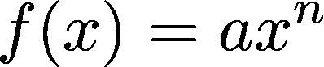
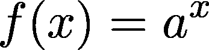
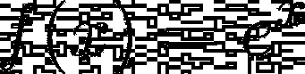
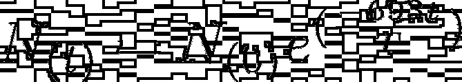
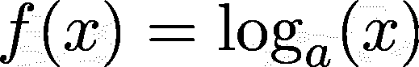
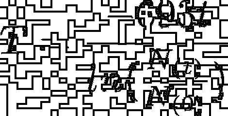
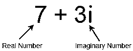

# Python 数学模块:你需要知道的一切

> 原文：<https://realpython.com/python-math-module/>

*立即观看**本教程有真实 Python 团队创建的相关视频课程。和文字教程一起看，加深理解: [**探索 Python 数学模块**](/courses/exploring-python-math-module/)

在本文中，您将了解 Python 的 **`math`** 模块。数学计算是大多数 Python 开发的基本部分。无论你是在做一个科学项目，一个金融应用，还是任何其他类型的编程工作，你都无法逃避对数学的需求。

对于 Python 中简单明了的数学计算，可以使用内置的数学**运算符**，比如加法(`+`)、减法(`-`)、除法(`/`)和乘法(`*`)。但更高级的运算，如指数、对数、三角函数或幂函数，并没有内置。这是否意味着您需要从头开始实现所有这些功能？

幸运的是，没有。Python 提供了一个专门为高级数学运算设计的[模块](https://realpython.com/python-modules-packages/):模块`math`。

到本文结束时，您将了解到:

*   Python `math`模块是什么
*   如何使用`math`模块函数解决实际问题
*   `math`模块的常数是什么，包括圆周率、τ和欧拉数
*   内置函数和`math`函数有什么区别
*   `math`、`cmath`和 NumPy 有什么区别

数学背景会有所帮助，但如果数学不是你的强项，也不用担心。这篇文章将解释你需要知道的所有基础知识。

所以让我们开始吧！

**免费下载:** [从 Python 技巧中获取一个示例章节:这本书](https://realpython.com/bonus/python-tricks-sample-pdf/)用简单的例子向您展示了 Python 的最佳实践，您可以立即应用它来编写更漂亮的+Python 代码。

## 了解 Python `math`模块

[Python `math`模块](https://docs.python.org/3/library/math.html)是为处理数学运算而设计的一个重要特性。它与标准 Python 版本打包在一起，并且从一开始就存在。大多数`math`模块的函数都是围绕 [C](https://realpython.com/c-for-python-programmers/) 平台的数学函数的薄薄的包装。由于其底层函数是用 [CPython](https://realpython.com/cpython-source-code-guide/) 编写的，`math`模块是高效的，并且符合 [C 标准](http://www.iso-9899.info/wiki/The_Standard)。

Python `math`模块为您提供了在应用程序中执行常见且有用的数学计算的能力。以下是`math`模块的一些实际用途:

*   使用阶乘计算组合和排列
*   使用三角函数计算杆的高度
*   用指数函数计算放射性衰变
*   用双曲函数计算悬索桥的曲线
*   解二次方程
*   使用三角函数模拟周期函数，如声波和光波

由于`math`模块是随 Python 发行版一起打包的，所以您不必单独安装它。使用它只是一个[导入模块](https://realpython.com/absolute-vs-relative-python-imports/)的问题:

>>>

```py
>>> import math
```

您可以使用上面的命令[导入](https://realpython.com/python-import/)Python`math`模块。导入后就可以直接使用了。

[*Remove ads*](/account/join/)

## `math`模块的常数

Python `math`模块提供了各种预定义的[常量](https://realpython.com/python-constants/)。访问这些常量有几个好处。首先，您不必手动将它们硬编码到您的应用程序中，这将节省您大量的时间。此外，它们在整个代码中提供了一致性。该模块包括几个著名的数学常数和重要值:

*   圆周率
*   希腊语的第十九个字母
*   欧拉数
*   无穷
*   不是数字(NaN)

在本节中，您将了解这些常量以及如何在 Python 代码中使用它们。

### 圆周率

π是一个圆的周长( *c* 与其直径( *d* )的比值:

> π = c/d

这个比例对于任何圆都是一样的。

圆周率是一个**无理数**，也就是说不能用简单的分数来表示。所以圆周率的小数位数是无限的，但可以近似为 22/7，或者 3.141。

**有趣的事实:**圆周率是世界上最公认、最知名的数学常数。它有自己的庆祝日期，叫做[圆周率日](https://www.piday.org/)，在 3 月 14 日(3/14)。

您可以按如下方式访问 pi:

>>>

```py
>>> math.pi
3.141592653589793
```

如你所见，在 Python 中圆周率的值被赋予了 15 位小数。提供的位数取决于基础 C 编译器。Python 默认打印前十五位数字，`math.pi`总是返回一个浮点值。

那么圆周率在哪些方面对你有用呢？你可以用 2π *r* 计算一个圆的周长，其中 *r* 是圆的半径:

>>>

```py
>>> r = 3
>>> circumference = 2 * math.pi * r
>>> f"Circumference of a Circle = 2 * {math.pi:.4} * {r} = {circumference:.4}"
'Circumference of a Circle = 2 * 3.142 * 3 = 18.85'
```

可以用`math.pi`来计算一个圆的周长。您也可以使用公式π *r* 计算圆的面积，如下所示:

>>>

```py
>>> r = 5
>>> area = math.pi * r * r
>>> f"Area of a Circle = {math.pi:.4} * {r} * {r} = {area:.4}"
'Area of a Circle = 3.142 * 5 * 5 = 78.54'
```

可以用`math.pi`计算圆的面积和周长。当您使用 Python 进行数学计算，并且遇到一个使用π的公式时，最好使用由`math`模块给出的 pi 值，而不是硬编码该值。

### τ

τ(τ)是圆的周长与其半径之比。这个常数等于 2π，或大约 6.28。像圆周率一样，τ也是一个无理数，因为它只是圆周率乘以 2。

许多数学表达式使用 2π，而使用τ可以帮助简化您的方程。比如不用 2π *r* 来计算一个圆的周长，我们可以代入τ，用更简单的方程τ *r* 。

然而，使用τ作为圆常数仍在争论中。您可以根据需要自由使用 2π或τ。

您可以使用 tau，如下所示:

>>>

```py
>>> math.tau
6.283185307179586
```

与`math.pi`一样，`math.tau`返回十五位数字，是一个浮点值。可以用τ来计算τ *r* 的圆的周长，其中 *r* 为半径，如下:

>>>

```py
>>> r = 3
>>> circumference = math.tau * r
>>> f"Circumference of a Circle = {math.tau:.4} * {r} = {circumference:.4}"
'Circumference of a Circle = 6.283 * 3 = 18.85'
```

你可以用`math.tau`代替`2 * math.pi`来整理包含表达式 2π的方程。

[*Remove ads*](/account/join/)

### 欧拉数

欧拉数( *e* )是以**自然对数**为底的常数，自然对数是一种数学函数，通常用于计算增长率或衰减率。和圆周率、圆周率一样，欧拉数是一个小数位数无限的无理数。 *e* 的值通常近似为 2.718。

欧拉数是一个重要的常数，因为它有许多实际用途，如计算人口随时间的增长或确定放射性衰变率。您可以从`math`模块访问欧拉数，如下所示:

>>>

```py
>>> math.e
2.718281828459045
```

与`math.pi`和`math.tau`一样，`math.e`的值被赋予十五位小数，并作为浮点值返回。

### 无穷大

无限不能用数字来定义。相反，它是一个数学概念，代表永无止境或无限的事物。无限可以是正向的，也可以是负向的。

当您想要将一个给定值与一个绝对最大值或最小值进行比较时，您可以在**算法**中使用无穷大。Python 中正负无穷大的值如下:

>>>

```py
>>> f"Positive Infinity = {math.inf}"
'Positive Infinity = inf'
>>> f"Negative Infinity = {-math.inf}"
'Negative Infinity = -inf'
```

无穷大不是一个数值。而是定义为`math.inf`。Python 在 3.5 版本中引入了这个常量，作为`float("inf")`的等价物:

>>>

```py
>>> float("inf") == math.inf
True
```

`float("inf")`和`math.inf`都代表无穷大的概念，使得`math.inf`大于任何数值:

>>>

```py
>>> x = 1e308
>>> math.inf > x
True
```

在上面的代码中，`math.inf`大于`x`的值，10 <sup>308</sup> (一个浮点数的最大大小)，是一个双精度数。

同样，`-math.inf`比任何值都小:

>>>

```py
>>> y = -1e308
>>> y > -math.inf
True
```

负无穷大小于`y`的值，为-10 <sup>308</sup> 。任何数字都不能大于无穷大或小于负无穷大。这就是为什么用`math.inf`进行数学运算不会改变无穷大的值:

>>>

```py
>>> math.inf + 1e308
inf
>>> math.inf / 1e308
inf
```

如你所见，加法和除法都不会改变`math.inf`的值。

### 不是数字(NaN)

不是一个数，或者 NaN，不是一个真正的数学概念。它起源于计算机科学领域，是对非数值的引用。一个 NaN 值可能是由于无效的输入，或者它可以指示一个[变量](https://realpython.com/python-variables/)应该是数字的*已经被文本字符或符号破坏。*

检查一个值是否为 NaN 始终是一个最佳实践。如果是，那么它可能会导致程序中的无效值。Python 在 3.5 版本中引入了 NaN 常量。

你可以观察下面`math.nan`的值:

>>>

```py
>>> math.nan
nan
```

NaN 不是一个数值。你可以看到`math.nan`的值是`nan`，与`float("nan")`的值相同。

[*Remove ads*](/account/join/)

## 算术函数

**数论**是纯数学的一个分支，是对自然数的研究。数论通常处理正整数或整数。

Python `math`模块提供了在数论以及相关领域**表示理论**中有用的函数。这些函数允许您计算一系列重要值，包括:

*   一个数的**阶乘**
*   两个数的最大公约数
*   **项的总和**

### 用 Python `factorial()` 求阶乘

你可能见过像 7 这样的数学表达式！还是 4！之前。感叹号不代表数字激动。而是，“！”是**阶乘**符号。阶乘用于寻找排列或组合。您可以通过将所选数字的所有整数乘以 1 来确定该数字的阶乘。

下表显示了 4、6 和 7 的阶乘值:

| 标志 | 用语言 | 表示 | 结果 |
| --- | --- | --- | --- |
| 4! | 四因子 | 4 x 3 x 2 x 1 | Twenty-four |
| 6! | 六阶乘 | 6 x 5 x 4 x 3 x 2 x 1 | Seven hundred and twenty |
| 7! | 七阶乘 | 7 x 6 x 5 x 4 x 3 x 2 x 1 | Five thousand and forty |

从表中可以看出 4！或四阶乘，通过将从 4 到 1 的整数范围相乘得出值 24。同理，6！还有 7！分别给出值 720 和 5040。

您可以使用以下工具之一在 Python 中实现阶乘函数:

1.  `for`循环
2.  递归函数
3.  `math.factorial()`

首先你将看到一个使用 [`for`循环](https://realpython.com/courses/python-for-loop/)的阶乘实现。这是一种相对简单的方法:

```py
def fact_loop(num):
    if num < 0:
        return 0
    if num == 0:
        return 1

    factorial = 1
    for i in range(1, num + 1):
        factorial = factorial * i
    return factorial
```

你也可以使用一个[递归函数](https://realpython.com/courses/thinking-recursively-python/)来寻找阶乘。这比使用`for`循环更复杂，但也更优雅。您可以按如下方式实现递归函数:

```py
def fact_recursion(num):
    if num < 0:
        return 0
    if num == 0:
        return 1

    return num * fact_recursion(num - 1)
```

**注意:**Python 中的[递归深度](https://www.geeksforgeeks.org/python-handling-recursion-limit/)是有限制的，但是这个主题超出了本文的范围。

以下示例说明了如何使用`for`循环和递归函数:

>>>

```py
>>> fact_loop(7)
5040

>>> fact_recursion(7)
5040
```

尽管它们的实现不同，但它们的返回值是相同的。

然而，仅仅为了得到一个数的阶乘而实现自己的函数是费时低效的。比较好的方法是使用`math.factorial()`。下面是如何使用`math.factorial()`找到一个数的阶乘:

>>>

```py
>>> math.factorial(7)
5040
```

这种方法用最少的代码返回期望的输出。

`factorial()`只接受正整数值。如果你试图输入一个负值，那么你将得到一个`ValueError`:

>>>

```py
>>> math.factorial(-5)
Traceback (most recent call last):
  File "<stdin>", line 1, in <module>
ValueError: factorial() not defined for negative values
```

输入负值将导致`ValueError`读数`factorial() not defined for negative values`。

也不接受十进制数字。它会给你一个`ValueError`:

>>>

```py
>>> math.factorial(4.3)
Traceback (most recent call last):
  File "<stdin>", line 1, in <module>
ValueError: factorial() only accepts integral values
```

输入十进制数值会导致`ValueError`读数`factorial() only accepts integral values`。

您可以使用 [`timeit()`](https://docs.python.org/3/library/timeit.html) 来比较每个阶乘方法的执行时间:

>>>

```py
>>> import timeit
>>> timeit.timeit("fact_loop(10)", globals=globals())
1.063997201999996

>>> timeit.timeit("fact_recursion(10)", globals=globals())
1.815312818999928

>>> timeit.timeit("math.factorial(10)", setup="import math")
0.10671788000001925
```

上面的示例说明了三种阶乘方法中每一种方法的`timeit()`结果。

`timeit()`每次运行时执行一百万次循环。下表比较了三种阶乘方法的执行时间:

| 类型 | 执行时间 |
| --- | --- |
| 带循环 | 1.0640 秒 |
| 使用递归 | 1.8153 秒 |
| 用`factorial()` | 0.1067 秒 |

从执行时间可以看出，`factorial()`比其他方法快。这是因为它的底层 C 实现。基于递归的方法是三种方法中最慢的。尽管根据你的 **CPU** 不同，你可能得到不同的计时，但是函数的顺序应该是一样的。

不仅比其他方法更快，而且更稳定。当你实现自己的函数时，你必须为灾难事件显式编码，比如处理负数或十进制数。实现中的一个错误可能会导致错误。但是当使用`factorial()`时，您不必担心灾难情况，因为该函数会处理所有情况。因此，尽可能使用`factorial()`是一个最佳实践。

[*Remove ads*](/account/join/)

### 用`ceil()` 求上限值

`math.ceil()`将返回大于或等于给定数字的最小整数值。如果数字是正或负的小数，那么函数将返回大于给定值的下一个整数值。

例如，输入 5.43 将返回值 6，输入-12.43 将返回值-12。`math.ceil()`可以接受正或负的实数作为输入值，并且总是返回一个整数值。

当您向`ceil()`输入一个整数值时，它将返回相同的数字:

>>>

```py
>>> math.ceil(6)
6
>>> math.ceil(-11)
-11
```

当输入一个整数时，`math.ceil()`总是返回相同的值。要了解`ceil()`的真实性质，您必须输入十进制值:

>>>

```py
>>> math.ceil(4.23)
5
>>> math.ceil(-11.453)
-11
```

当值为正数(4.23)时，函数返回下一个大于值(5)的整数。当该值为负(-11.453)时，该函数同样返回下一个大于该值的整数(-11)。

如果您输入一个非数字的值，该函数将返回一个`TypeError`:

>>>

```py
>>> math.ceil("x")
Traceback (most recent call last):
  File "<stdin>", line 1, in <module>
TypeError: must be real number, not str
```

您必须向该函数输入一个数字。如果您尝试输入任何其他值，那么您将得到一个`TypeError`。

### 用`floor()`和求地板值

`floor()`将返回小于或等于给定数字的最接近的整数值。该功能与`ceil()`相反。例如，输入 8.72 将返回 8，输入-12.34 将返回-13。`floor()`可以接受正数或负数作为输入，并将返回一个整数值。

如果您输入一个整数值，那么函数将返回相同的值:

>>>

```py
>>> math.floor(4)
4
>>> math.floor(-17)
-17
```

与`ceil()`一样，当`floor()`的输入为整数时，结果将与输入的数字相同。只有当您输入十进制值时，输出才与输入不同:

>>>

```py
>>> math.floor(5.532)
5
>>> math.floor(-6.432)
-7
```

当您输入一个正十进制值(5.532)时，它将返回小于输入数(5)的最接近的整数。如果您输入一个负数(-6.432)，那么它将返回下一个最小的整数值(-7)。

如果您试图输入一个不是数字的值，那么该函数将返回一个`TypeError`:

>>>

```py
>>> math.floor("x")
Traceback (most recent call last):
  File "<stdin>", line 1, in <module>
TypeError: must be real number, not str
```

您不能给非数字值作为`ceil()`的输入。这样做会导致一个`TypeError`。

[*Remove ads*](/account/join/)

### 用`trunc()`和截断数字

当您得到一个带小数点的数字时，您可能希望只保留整数部分，去掉小数部分。`math`模块有一个名为`trunc()`的函数可以让你做到这一点。

丢弃小数值是[舍入](https://realpython.com/python-rounding/)的一种。使用`trunc()`，负数总是向上舍入为零，正数总是向下舍入为零。

下面是`trunc()`函数如何舍入正数或负数:

>>>

```py
>>> math.trunc(12.32)
12
>>> math.trunc(-43.24)
-43
```

如您所见，12.32 向下舍入为 0，结果为 12。同样，将-43.24 向上舍入为 0，得到的值为-43。`trunc()`无论数字是正还是负，总是向零舍入。

处理正数时，`trunc()`的行为与`floor()`相同:

>>>

```py
>>> math.trunc(12.32) == math.floor(12.32)
True
```

`trunc()`的行为与正数的`floor()`相同。如您所见，两个函数的返回值是相同的。

处理负数时，`trunc()`的行为与`ceil()`相同:

>>>

```py
>>> math.trunc(-43.24) == math.ceil(-43.24)
True
```

当数字为负数时，`floor()`的行为与`ceil()`相同。两个函数的返回值是相同的。

### 用 Python `isclose()` 求数字的接近度

在某些情况下，尤其是在数据科学领域，您可能需要确定两个数字是否彼此接近。但要做到这一点，你首先需要回答一个重要的问题:如何*接近**接近*？换句话说，接近的定义是什么？

嗯，[韦氏词典](https://www.merriam-webster.com/dictionary/close)会告诉你 close 的意思是“在时间、空间、效果或程度上接近”不是很有帮助，是吗？

例如，取下面一组数字:2.32、2.33 和 2.331。当你用小数点后两位来衡量接近度时，2.32 和 2.33 是接近的。但实际上 2.33 和 2.331 更接近。因此，亲近是一个相对的概念。如果没有某种门槛，你就无法确定亲密度。

幸运的是，`math`模块提供了一个名为`isclose()`的功能，可以让你为亲密度设置自己的阈值，或**容差**。如果两个数字在你设定的接近度范围内，它返回`True`，否则返回`False`。

让我们看看如何使用默认容差来比较两个数字:

*   **相对容差**或**相对容差**，是相对于输入值大小被认为“接近”的最大差值。这是容忍的百分比。默认值为 1e-09 或 0.00000001。
*   **绝对公差**或 **abs_tol** ，是被认为“接近”的最大差值，与输入值的大小无关。默认值为 0.0。

满足以下条件时,`isclose()`将返回`True`:

> ABS(a-b)< = max(rel _ tol * max(ABS(a)，abs(b))，abs_tol)。

`isclose`使用上面的表达式来确定两个数的接近程度。可以代入自己的数值，观察任意两个数是否接近。

在以下情况下，6 和 7 *不接近*:

>>>

```py
>>> math.isclose(6, 7)
False
```

数字 6 和 7 被认为是不接近的，因为相对容差被设置为九个小数位。但是如果在相同的容差下输入 6.999999999 和 7，那么它们*被认为*接近:

>>>

```py
>>> math.isclose(6.999999999, 7)
True
```

可以看到值 6.999999999 在 7 的小数点后 9 位以内。因此，根据默认的相对容差，6.999999999 和 7 被视为接近。

您可以根据需要调整相对公差。如果将`rel_tol`设置为 0.2，那么 6 和 7 被认为是接近的:

>>>

```py
>>> math.isclose(6, 7, rel_tol=0.2)
True
```

你可以观察到 6 和 7 现在很接近。这是因为它们之间的误差在 20%以内。

与`rel_tol`一样，可以根据需要调整`abs_tol`值。要被视为接近，输入值之间的差值必须小于或等于绝对容差值。您可以如下设置`abs_tol`:

>>>

```py
>>> math.isclose(6, 7, abs_tol=1.0)
True
>>> math.isclose(6, 7, abs_tol=0.2)
False
```

当您将绝对容差设置为 1 时，数字 6 和 7 很接近，因为它们之间的差等于绝对容差。然而，在第二种情况下，6 和 7 之间的差值不小于或等于 0.2 的既定绝对公差。

您可以将`abs_tol`用于非常小的值:

>>>

```py
>>> math.isclose(1, 1.0000001, abs_tol=1e-08)
False
>>> math.isclose(1, 1.00000001, abs_tol=1e-08)
True
```

如你所见，你可以用`isclose`确定非常小的数的接近程度。使用`nan`和`inf`值可以说明一些关于接近度的特殊情况:

>>>

```py
>>> math.isclose(math.nan, 1e308)
False
>>> math.isclose(math.nan, math.nan)
False

>>> math.isclose(math.inf, 1e308)
False
>>> math.isclose(math.inf, math.inf)
True
```

从上面的例子可以看出，`nan`没有接近任何值，甚至没有接近它本身。另一方面，`inf`不接近任何数值，甚至不接近非常大的数值，但是它*接近它自己*。

[*Remove ads*](/account/join/)

## 幂函数

幂函数以任意数 *x* 作为输入，将 *x* 提升到某次方 *n* ，返回 *x <sup>n</sup>* 作为输出。Python 的`math`模块提供了几个与功率相关的函数。在本节中，您将学习幂函数、指数函数和平方根函数。

### 用`pow()` 计算一个数的幂

幂函数具有以下公式，其中变量 ***x* 是基数**，变量 ***n* 是幂**，并且 ***a* 可以是任意常数**:

[](https://files.realpython.com/media/generalexponen.8ae46a076ea4.png)

<figcaption class="figure-caption text-center">Power Function</figcaption>

在上面的公式中，基数 *x* 的值被提升到 *n* 的幂。

你可以用`math.pow()`得到一个数的幂。有一个内置函数`pow()`，与`math.pow()`不同。您将在本节的后面部分了解两者的区别。

`math.pow()`取两个参数如下:

>>>

```py
>>> math.pow(2, 5)
32.0
>>> math.pow(5, 2.4)
47.59134846789696
```

第一个参数是基值，第二个参数是幂值。您可以给定一个整数或十进制值作为输入，函数总是返回一个浮点值。`math.pow()`中定义了一些特殊情况。

当以 1 为底的任意 n 次方幂时，结果为 1.0:

>>>

```py
>>> math.pow(1.0, 3)
1.0
```

当您将基值 1 提升到任何幂值时，结果将始终是 1.0。同样，任何基数的 0 次方都是 1.0:

>>>

```py
>>> math.pow(4, 0.0)
1.0
>>> math.pow(-4, 0.0)
1.0
```

如您所见，任何数字的 0 次幂都将得到 1.0 的结果。即使基数为`nan`，也可以看到结果:

>>>

```py
>>> math.pow(math.nan, 0.0)
1.0
```

零的任意正数幂将得到 0.0 的结果:

>>>

```py
>>> math.pow(0.0, 2)
0.0
>>> math.pow(0.0, 2.3)
0.0
```

但是如果你试图将 0.0 提高到负幂，那么结果将是一个`ValueError`:

>>>

```py
>>> math.pow(0.0, -2)
Traceback (most recent call last):
  File "<stdin>", line 1, in <module>
ValueError: math domain error
```

`ValueError`只在基数为 0 时出现。如果基数是除 0 以外的任何其他数字，则该函数将返回有效的幂值。

除了`math.pow()`之外，在 Python 中还有两种内置的方法来计算一个数的幂:

1.  `x ** y`
2.  `pow()`

第一种选择很简单。你可能已经用过一两次了。值的返回类型由输入决定:

>>>

```py
>>> 3 ** 2
9
>>> 2 ** 3.3
9.849155306759329
```

当你使用整数时，你得到一个整数值。当您使用小数值时，返回类型会更改为小数值。

第二个选项是一个多功能的内置函数。不一定要用什么进口的才能用。内置的`pow()`方法有三个参数:

1.  **基数**数
2.  **号电源**号
3.  **模数**号

前两个参数是必需的，而第三个参数是可选的。您可以输入整数或小数，函数将根据输入返回适当的结果:

>>>

```py
>>> pow(3, 2)
9
>>> pow(2, 3.3)
9.849155306759329
```

内置的`pow()`有两个必需的参数，与`x ** y`语法中的基数和幂相同。`pow()`还有第三个可选参数:**模数**。该参数常用于[密码术](https://cryptography.fandom.com/wiki/Modular_exponentiation)中。带有可选模数参数的内置`pow()`等同于方程`(x ** y) % z`。Python 语法如下所示:

>>>

```py
>>> pow(32, 6, 5)
4
>>> (32 ** 6) % 5 == pow(32, 6, 5)
True
```

`pow()`将基数(32)提升到幂(6)，然后结果值是[模除以](https://realpython.com/python-modulo-operator/)模数(5)。在这种情况下，结果是 4。您可以替换您自己的值，并看到`pow()`和给定的等式提供了相同的结果。

尽管这三种计算功耗的方法做的是同样的事情，但它们之间存在一些实现差异。每种方法的执行时间如下:

>>>

```py
>>> timeit.timeit("10 ** 308")
1.0078728999942541

>>> timeit.timeit("pow(10, 308)")
1.047615700008464

>>> timeit.timeit("math.pow(10, 308)", setup="import math")
0.1837239999877056
```

下表比较了由`timeit()`测量的三种方法的执行时间:

| 类型 | 执行时间 |
| --- | --- |
| `x ** y` | 1.0079 秒 |
| `pow(x, y)` | 1.0476 s |
| `math.pow(x, y)` | 0.1837 秒 |

从表中可以看出，`math.pow()`比其他方法快，而内置的`pow()`最慢。

`math.pow()`效率背后的原因是它的实现方式。它依赖于底层的 C 语言。另一方面，`pow()`和`x ** y`使用输入对象自己的`**`操作符的实现。然而，`math.pow()`不能处理[复数](https://realpython.com/python-complex-numbers/)(将在后面的章节中解释)，而`pow()`和`**`可以。

[*Remove ads*](/account/join/)

### 用`exp()` 求自然指数

在上一节中，您学习了幂函数。对于指数函数，情况有所不同。基数不再是变量，权力成为变量。它看起来像这样:

[](https://files.realpython.com/media/exponen.f4fb0182c3e5.png)

<figcaption class="figure-caption text-center">General Exponential Function</figcaption>

这里 *a* 可以是任意常数，作为幂值的 *x* 成为变量。

那么指数函数有什么特别之处呢？随着 *x* 值的增加，函数值快速增加。如果基数大于 1，那么函数的值随着 *x* 的增加而不断增加。指数函数的一个特殊性质是，函数的斜率也随着 *x* 的增加而连续增加。

在前面的章节中，你已经了解了欧拉数[。它是自然对数的底数。它还与指数函数一起发挥作用。当欧拉数被并入指数函数时，它就变成了**自然指数函数**:](#eulers-number)

[](https://files.realpython.com/media/expe.9ad828e29e53.png)

<figcaption class="figure-caption text-center">Natural Exponential Function</figcaption>

这个函数在很多实际情况下都会用到。你可能听说过术语**指数增长**，它经常被用于人类人口增长或放射性衰变率。这两者都可以使用自然指数函数来计算。

Python `math`模块提供了一个函数`exp()`，可以让您计算一个数字的自然指数。您可以按如下方式找到该值:

>>>

```py
>>> math.exp(21)
1318815734.4832146
>>> math.exp(-1.2)
0.30119421191220214
```

输入数字可以是正数也可以是负数，函数总是返回一个浮点值。如果数字不是数值，那么该方法将返回一个`TypeError`:

>>>

```py
>>> math.exp("x")
Traceback (most recent call last):
  File "<stdin>", line 1, in <module>
TypeError: must be real number, not str
```

如您所见，如果输入是一个字符串值，那么函数返回一个读数为`must be real number, not str`的`TypeError`。

您也可以使用`math.e ** x`表达式或使用`pow(math.e, x)`来计算指数。这三种方法的执行时间如下:

>>>

```py
>>> timeit.timeit("math.e ** 308", setup="import math")
0.17853009998701513

>>> timeit.timeit("pow(math.e, 308)", setup="import math")
0.21040189999621361

>>> timeit.timeit("math.exp(308)", setup="import math")
0.125878200007719
```

下表比较了由`timeit()`测量的上述方法的执行时间:

| 类型 | 执行时间 |
| --- | --- |
| `e ** x` | 0.1785 秒 |
| `pow(e, x)` | 0.2104 秒 |
| `math.exp(x)` | 0.1259 秒 |

您可以看到，`math.exp()`比其他方法快，而`pow(e, x)`最慢。由于`math`模块的底层 C 实现，这是预期的行为。

同样值得注意的是，`e ** x`和`pow(e, x)`返回相同的值，但是`exp()`返回稍微不同的值。这是由于实现的差异。Python 文档指出`exp()`比其他两种方法更准确。

### 实际例子有`exp()`

当一个不稳定的原子通过发射电离辐射失去能量时，就会发生放射性衰变。放射性衰变率是用半衰期来衡量的，半衰期是母核衰变一半所需的时间。您可以使用以下公式计算衰变过程:

[](https://files.realpython.com/media/radidec.58cebcff586d.png)

<figcaption class="figure-caption text-center">Radioactive Decay Equation</figcaption>

你可以用上面的公式来计算某种放射性元素在一定年限后的剩余量。给定公式的变量如下:

*   ***N(0)*** 是物质的初始量。
*   ***N(t)*** 是一段时间( *t* )后仍然存在且尚未衰变的量。
*   ***T*** 是衰变量的半衰期。
*   ***e*** 是欧拉数。

科学研究已经确定了所有放射性元素的半衰期。你可以把数值代入方程式来计算任何放射性物质的剩余量。让我们现在试试。

放射性同位素锶-90 的半衰期为 38.1 年。一个样本含有 100 毫克的锶-90。你可以计算 100 年后 Sr-90 的剩余毫克数:

>>>

```py
>>> half_life = 38.1
>>> initial = 100
>>> time = 100
>>> remaining = initial * math.exp(-0.693 * time / half_life)
>>> f"Remaining quantity of Sr-90: {remaining}"
'Remaining quantity of Sr-90: 16.22044604811303'
```

可以看到，半衰期设为 38.1，持续时间设为 100 年。你可以用`math.exp`来简化方程。将这些值代入方程，你可以发现，100 年后，Sr-90 的 **16.22mg** 剩余。

[*Remove ads*](/account/join/)

## 对数函数

**对数函数**可以认为是指数函数的逆。它们以下列形式表示:

[](https://files.realpython.com/media/logax.3f3b7b66fbfa.png)

<figcaption class="figure-caption text-center">General Logarithmic Function</figcaption>

这里 *a* 是对数的底数，可以是任意数。在上一节中，您已经学习了指数函数。指数函数可以用对数函数的形式表示，反之亦然。

### 带`log()`的 Python 自然日志

一个数的**自然对数**是其以数学常数 *e* 为底的对数，或欧拉数:

[](https://files.realpython.com/media/logex.2f4b8d72818f.png)

<figcaption class="figure-caption text-center">Natural Logarithmic Function</figcaption>

与指数函数一样，自然对数使用常数 *e* 。它通常被描述为 f(x) = ln(x)，其中 *e* 是隐式的。

您可以像使用指数函数一样使用自然对数。它用于计算诸如人口增长率或元素放射性衰变率等数值。

`log()`有两个论点。第一个是强制的，第二个是可选的。用一个参数你可以得到输入数字的自然对数(以 *e* 为底):

>>>

```py
>>> math.log(4)
1.3862943611198906
>>> math.log(3.4)
1.2237754316221157
```

但是，如果您输入一个非正数，该函数将返回一个`ValueError`:

>>>

```py
>>> math.log(-3)
Traceback (most recent call last):
  File "<stdin>", line 1, in <module>
ValueError: math domain error
```

如你所见，你不能给`log()`输入一个负值。这是因为对数值对于负数和零是未定义的。

使用两个参数，可以计算第一个参数对第二个参数的对数:

>>>

```py
>>> math.log(math.pi, 2)
1.651496129472319
>>> math.log(math.pi, 5)
0.711260668712669
```

当对数基数改变时，您可以看到该值是如何变化的。

### 了解`log2()`和`log10()`

Python `math`模块还提供了两个独立的函数，让您计算以 2 和 10 为底的对数值:

1.  **`log2()`** 用于计算以 2 为基数的对数值。
2.  **`log10()`** 用于计算以 10 为基数的对数值。

用`log2()`你可以得到以 2 为底的对数值:

>>>

```py
>>> math.log2(math.pi)
1.6514961294723187
>>> math.log(math.pi, 2)
1.651496129472319
```

这两个函数有相同的目标，但是 [Python 文档](https://docs.python.org/3/library/math.html#math.log2)指出`log2()`比使用`log(x, 2)`更准确。

您可以用`log10()`计算一个数以 10 为底的对数值:

>>>

```py
>>> math.log10(math.pi)
0.4971498726941338
>>> math.log(math.pi, 10)
0.4971498726941338
```

[Python 文档](https://docs.python.org/3/library/math.html#math.log10)也提到`log10()`比`log(x, 10)`更准确，尽管两个函数的目标相同。

[*Remove ads*](/account/join/)

### 自然测井实例

在[的前一节](#practical-example-with-exp)中，您看到了如何使用`math.exp()`来计算一段时间后放射性元素的剩余量。有了`math.log()`，可以通过间隔测量质量，求出未知放射性元素的半衰期。以下等式可用于计算放射性元素的半衰期:

[](https://files.realpython.com/media/halflif.60844fabc676.png)

<figcaption class="figure-caption text-center">Radioactive Decay Equation</figcaption>

通过重新排列放射性衰变公式，可以把半衰期( *T* )作为公式的主语。给定公式的变量如下:

*   ***T*** 是衰变量的半衰期。
*   ***N(0)*** 是物质的初始量。
*   ***N(t)*** 是一段时间后剩余的尚未衰变的量( *t* )。
*   **ln** 是自然对数。

你可以把已知值代入方程式来计算放射性物质的半衰期。

例如，想象你正在研究一种未知的放射性元素样本。100 年前发现时，样本量为 100 毫克。经过 100 年的腐烂，只剩下 16.22 毫克。使用上面的公式，您可以计算这种未知元素的半衰期:

>>>

```py
>>> initial = 100
>>> remaining = 16.22
>>> time = 100
>>> half_life = (-0.693 * time) / math.log(remaining / initial)
>>> f"Half-life of the unknown element: {half_life}"
'Half-life of the unknown element: 38.09942398335152'
```

你可以看到未知元素的半衰期大约是 38.1 年。根据这些信息，你可以确定未知元素是锶-90。

## 其他重要的`math`模块功能

Python `math`模块有许多用于数学计算的有用函数，本文只深入讨论了其中的一部分。在本节中，您将简要了解`math`模块中的其他一些重要功能。

### 计算最大公约数

两个正数的**最大公约数(GCD)** 是两个数相除没有余数的最大正整数。

比如 15 和 25 的 GCD 是 5。你可以把 15 和 25 都除以 5，没有余数。没有更多的人做同样的事情。如果你取 15 和 30，那么 GCD 就是 15，因为 15 和 30 都可以被 15 整除，没有余数。

您不必实现自己的函数来计算 GCD。Python `math`模块提供了一个名为 **`math.gcd()`** 的函数，可以让你计算两个数的 GCD。您可以给出正数或负数作为输入，它会返回适当的 GCD 值。但是，您不能输入十进制数。

### 计算迭代的总和

如果你想在不使用循环的情况下找到一个可迭代的值的和，那么 **`math.fsum()`** 可能是最简单的方法。您可以使用数组、[元组或列表](https://realpython.com/python-lists-tuples/)等可迭代对象作为输入，函数将返回这些值的总和。一个名为`sum()`的内置函数也可以让你计算可迭代的和，但是`fsum()`比`sum()`更精确。您可以在[文档](https://docs.python.org/3/library/math.html#math.fsum)中了解更多信息。

### 计算平方根

一个数的[平方根](https://realpython.com/python-square-root-function/)是一个值，当它与自身相乘时，给出该数。可以用 **`math.sqrt()`** 求任意正实数(整数或小数)的平方根。返回值总是一个浮点值。如果您试图输入一个负数，该函数将抛出一个`ValueError`。

### 转换角度值

在现实生活和数学中，您经常会遇到必须测量角度来执行计算的情况。角度可以用度数或弧度来度量。有时你必须将角度转换成弧度，反之亦然。`math`模块提供了允许您这样做的函数。

如果你想把度数转换成弧度，那么你可以使用 **`math.radians()`** 。它返回度数输入的弧度值。同样，如果你想将弧度转换成度数，那么你可以使用 **`math.degrees()`** 。

[*Remove ads*](/account/join/)

### 计算三角值

三角学是对三角形的研究。它研究三角形的角和边之间的关系。三角学最感兴趣的是直角三角形(其中一个内角为 90 度)，但它也可以应用于其他类型的三角形。Python `math`模块提供了非常有用的函数，可以让您执行三角计算。

可以用 **`math.sin()`** 计算角度的正弦值，用 **`math.cos()`** 计算余弦值，用 **`math.tan()`** 计算正切值。`math`模块还提供了用 **`math.asin()`** 计算反正弦，用 **`math.acos()`** 计算反正弦，用 **`math.atan()`** 计算反正切的功能。最后，你可以使用 **`math.hypot()`** 计算三角形的斜边。

### Python 3.8 中`math`模块的新增内容

随着[Python 3.8 版](https://realpython.com/courses/cool-new-features-python-38/)的发布，对`math`模块进行了一些新的添加和更改。新增内容和变化如下:

*   **`comb(n, k)`** 返回从 *n* 项中选择 *k* 项的方式数，无重复，无先后*。*

**   **`perm(n, k)`** 返回从无重复的 *n* 项和有顺序的*项中选择 *k* 项的方式数。*

    *   **`isqrt()`** 返回非负整数的整数平方根。

    *   **`prod()`** 计算输入 iterable 中所有元素的乘积。与`fsum()`一样，该方法可以接受数组、列表或元组等可迭代对象。

    *   **`dist()`** 返回两点 *p* 和 *q* 之间的[欧几里德距离](https://en.wikipedia.org/wiki/Euclidean_distance)，每个点都作为坐标序列(或可迭代的)给出。这两点必须具有相同的尺寸。

    *   **`hypot()`** 现在处理两个以上的维度。以前，它最多支持两个维度。* 

 *## `cmath`vs`math`T2】

**复数**是实数和虚数的组合。它的公式为 *a + bi* ，其中 *a* 为实数 *bi* 为虚数。实数和虚数可以解释如下:

*   实数是你能想到的任何一个数字。
*   一个**虚数**是一个平方后给出负结果的数。

实数可以是任何数字。比如 12，4.3，-19.0 都是实数。虚数显示为 *i* 。下图显示了一个复数的示例:

[](https://files.realpython.com/media/Untitled_Diagram.e4d5e0dd94c7.png)

<figcaption class="figure-caption text-center">Complex Number</figcaption>

在上面的例子中， *7* 是实数， *3i* 是虚数。复数主要用于几何、微积分、科学计算，尤其是电子学。

Python 模块`math`的函数不能处理复数。然而，Python 提供了一个可以专门处理复数的不同模块，即`cmath`模块。Python 的`math`模块由`cmath`模块补充，后者实现了许多相同的功能，但用于复数。

您可以导入`cmath`模块，如下所示:

>>>

```py
>>> import cmath
```

因为`cmath`模块也是用 Python 打包的，所以可以像导入`math`模块一样导入它。在使用`cmath`模块之前，你必须知道如何定义一个复数。您可以如下定义一个复数:

>>>

```py
>>> c = 2 + 3j
>>> c
(2+3j)

>>> type(c)
<class 'complex'>
```

如你所见，你可以通过使用`type()`来确定一个数确实是复数。

**注:**在数学中，虚数单位通常表示为 *i* 。在某些领域，更习惯于使用 *j* 来表示同一件事。在 Python 中，使用`j`来表示虚数。

Python 还提供了一个名为`complex()`的特殊内置函数，可以创建复数。您可以按如下方式使用`complex()`:

>>>

```py
>>> c = complex(2, 3)
>>> c
(2+3j)

>>> type(c)
<class 'complex'>
```

您可以使用任何一种方法来创建复数。您也可以使用`cmath`模块计算复数的数学函数，如下所示:

>>>

```py
>>> cmath.sqrt(c)
(1.8581072140693775+0.6727275964137814j)

>>> cmath.log(c)
(1.3622897515267103+0.6947382761967031j)

>>> cmath.exp(c)
(-16.091399670844+12.02063434789931j)
```

这个例子向你展示了如何计算一个复数的平方根、对数值和指数值。如果你想了解更多关于`cmath`模块的信息，你可以阅读[文档](https://docs.python.org/3/library/cmath.html)。

## NumPy vs `math`

几个著名的 Python 库可以用于数学计算。最著名的库之一是 Numerical Python，或称 [NumPy](https://numpy.org/) 。它主要用于科学计算和数据科学领域。与标准 Python 版本中的`math`模块不同，您必须安装 NumPy 才能使用它。

NumPy 的核心是高性能的 *N* 维(多维)数组数据结构。这个数组允许你在整个数组[上执行数学运算，而不需要遍历元素](https://realpython.com/numpy-array-programming/)。函数库中的所有函数都经过优化，可以处理 N 维*数组对象。*

`math`模块和 NumPy 库都可以用于数学计算。NumPy 与`math`模块有几个相似之处。NumPy 有一个[函数](https://numpy.org/devdocs/reference/routines.math.html)的子集，类似于`math`模块函数，处理数学计算。NumPy 和`math`都提供了处理[三角](https://docs.scipy.org/doc/numpy/reference/routines.math.html#trigonometric-functions)、[指数](https://docs.scipy.org/doc/numpy/reference/routines.math.html#exponents-and-logarithms)、[对数](https://docs.scipy.org/doc/numpy/reference/routines.math.html#exponents-and-logarithms)、[双曲线](https://docs.scipy.org/doc/numpy/reference/routines.math.html#hyperbolic-functions)和[算术](https://docs.scipy.org/doc/numpy/reference/routines.math.html#arithmetic-operations)计算的函数。

`math`和 NumPy 也有几个根本的区别。Python `math`模块更适合处理标量值，而 NumPy 更适合处理数组、向量甚至矩阵。

当处理标量值时，`math`模块函数可以比它们的 NumPy 对应函数更快。这是因为 NumPy 函数将值转换成数组，以便对它们执行计算。NumPy 在处理 *N* 维数组时要快得多，因为对它们进行了优化。除了`fsum()`和`prod()`之外，`math`模块函数不能处理数组。

## 结论

在本文中，您了解了 Python `math`模块。该模块提供了用于执行数学计算的有用函数，这些函数有许多实际应用。

**在这篇文章中，你学到了:**

*   Python `math`模块是什么
*   用实例说明如何使用`math`功能
*   `math`模块的常数是什么，包括圆周率、τ和欧拉数
*   内置函数和`math`函数有什么区别
*   `math`、`cmath`和 NumPy 有什么区别

理解如何使用`math`功能是第一步。现在是时候把你学到的东西应用到现实生活中了。如果你有任何问题或意见，请在下面的评论区留下。

*立即观看**本教程有真实 Python 团队创建的相关视频课程。和文字教程一起看，加深理解: [**探索 Python 数学模块**](/courses/exploring-python-math-module/)*************