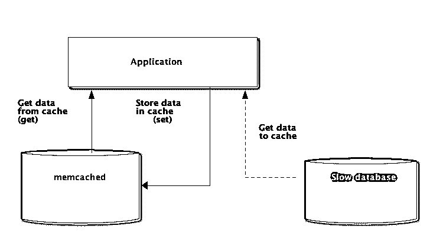

# Python + Memcached:分布式应用中的高效缓存

> 原文：<https://realpython.com/python-memcache-efficient-caching/>

编写 Python 应用程序时，缓存很重要。使用缓存来避免重新计算数据或访问缓慢的数据库可以为您提供巨大的性能提升。

Python 为缓存提供了内置的可能性，从简单的字典到更完整的[数据结构](https://realpython.com/python-data-structures/)如 [`functools.lru_cache`](https://realpython.com/lru-cache-python/) 。后者可以使用[最近最少使用算法](https://en.wikipedia.org/wiki/Cache_replacement_policies#Least_Recently_Used_(LRU))来限制缓存大小，从而缓存任何项目。

然而，根据定义，这些数据结构对于您的 Python 进程来说是本地的。当应用程序的多个副本跨大型平台运行时，使用内存中的数据结构不允许共享缓存的内容。对于大规模和分布式应用程序来说，这可能是一个问题。

[](https://files.realpython.com/media/python-memcached.97e1deb2aa17.png)

因此，当系统跨网络分布时，它也需要跨网络分布的缓存。如今，有很多网络服务器提供了缓存功能——我们已经介绍了如何使用 Redis 和 Django 进行缓存。

正如您将在本教程中看到的， [memcached](http://memcached.org) 是分布式缓存的另一个很好的选择。在快速介绍了 memcached 的基本用法之后，您将了解高级模式，如“缓存和设置”以及使用后备缓存来避免冷缓存性能问题。

## 安装 memcached

*Memcached* 是[可用于许多平台](https://github.com/memcached/memcached/wiki/Install):

*   如果运行 **Linux** ，可以用`apt-get install memcached`或者`yum install memcached`安装。这将从预构建的包中安装 memcached，但是你也可以从源代码[中构建 memcached，如这里所解释的](https://github.com/memcached/memcached/wiki/Install)。
*   对于 **macOS** ，使用[家酿](https://brew.sh/)是最简单的选择。安装好家酿软件包管理器后，运行`brew install memcached`即可。
*   在 **Windows** 上，你必须自己编译 memcached 或者找到[预编译的二进制文件](https://commaster.net/content/installing-memcached-windows)。

一旦安装完毕， *memcached* 可以通过调用`memcached`命令简单地启动:

```py
$ memcached
```

在可以从 Python-land 与 memcached 交互之前，您需要安装一个 memcached *客户端*库。您将在下一节看到如何实现这一点，以及一些基本的缓存访问操作。

[*Remove ads*](/account/join/)

## 使用 Python 存储和检索缓存值

如果你从未使用过 *memcached* ，这很容易理解。它基本上提供了一个巨大的网络可用字典。本词典有几个不同于传统 Python 词典的属性，主要是:

*   键和值必须是字节
*   过期后，密钥和值会被自动删除

因此，与 *memcached* 交互的两个基本操作是`set`和`get`。正如您可能已经猜到的，它们分别用于给一个键赋值或从一个键获取值。

我与 *memcached* 交互的首选 Python 库是[`pymemcache`](https://pypi.python.org/pypi/pymemcache)——我推荐使用它。您可以简单地使用 pip 安装它:

```py
$ pip install pymemcache
```

以下代码显示了如何连接到 *memcached* 并在 Python 应用程序中将其用作网络分布式缓存:

```py
>>> from pymemcache.client import base

# Don't forget to run `memcached' before running this next line:
>>> client = base.Client(('localhost', 11211))

# Once the client is instantiated, you can access the cache:
>>> client.set('some_key', 'some value')

# Retrieve previously set data again:
>>> client.get('some_key')
'some value'
```

*memcached* 网络协议非常简单，其实现速度极快，这使得存储数据非常有用，否则从规范数据源检索或再次计算时会很慢:

虽然这个例子足够简单，但它允许在网络上存储键/值元组，并通过应用程序的多个分布式运行副本来访问它们。这很简单，但是很强大。这是优化您的应用程序的第一步。

## 自动终止缓存数据

当将数据存储到 *memcached* 中时，您可以设置一个到期时间，这是 *memcached* 保存密钥和值的最大秒数。延迟之后， *memcached* 会自动从缓存中移除密钥。

您应该将这个缓存时间设置为多少？这种延迟没有神奇的数字，它完全取决于数据类型和您正在使用的应用程序。可能是几秒钟，也可能是几个小时。

*缓存失效*，定义何时移除缓存，因为它与当前数据不同步，这也是您的应用程序必须处理的事情。尤其是如果要避免呈现太旧或*陈旧*的数据。

同样，这里没有神奇的配方；这取决于您正在构建的应用程序的类型。然而，有几个无关紧要的情况需要处理——我们在上面的例子中还没有涉及到。

缓存服务器不能无限增长——内存是有限的资源。因此，一旦缓存服务器需要更多的空间来存储其他内容，它就会刷新密钥。

一些密钥也可能因为达到其到期时间(有时也称为“生存时间”或 TTL)而到期。)在这些情况下，数据会丢失，必须再次查询规范数据源。

这听起来比实际更复杂。在 Python 中使用 memcached 时，通常可以使用以下模式:

```py
from pymemcache.client import base

def do_some_query():
    # Replace with actual querying code to a database,
    # a remote REST API, etc.
    return 42

# Don't forget to run `memcached' before running this code
client = base.Client(('localhost', 11211))
result = client.get('some_key')

if result is None:
    # The cache is empty, need to get the value
    # from the canonical source:
    result = do_some_query()

    # Cache the result for next time:
    client.set('some_key', result)

# Whether we needed to update the cache or not,
# at this point you can work with the data
# stored in the `result` variable:
print(result)
```

> **注意:**由于正常的冲洗操作，处理丢失的钥匙是强制性的。处理冷缓存场景也是必须的，即当 *memcached* 刚刚启动时。在这种情况下，缓存将完全为空，需要完全重新填充缓存，一次一个请求。

这意味着您应该将任何缓存的数据视为短暂的。您永远不应该期望缓存中包含您以前写入的值。

[*Remove ads*](/account/join/)

## 预热冷缓存

有些冷缓存场景是无法避免的，例如 *memcached* 崩溃。但是有些可以，例如迁移到一个新的 *memcached* 服务器。

当可以预测冷缓存场景将会发生时，最好避免它。需要重新填充的缓存意味着，突然之间，缓存数据的规范存储将被所有缺少缓存数据的缓存用户大量占用(也称为[迅雷羊群问题](https://en.wikipedia.org/wiki/Thundering_herd_problem))。)

*pymemcache* 提供了一个名为`FallbackClient`的类来帮助实现这个场景，如下所示:

```py
from pymemcache.client import base
from pymemcache import fallback

def do_some_query():
    # Replace with actual querying code to a database,
    # a remote REST API, etc.
    return 42

# Set `ignore_exc=True` so it is possible to shut down
# the old cache before removing its usage from 
# the program, if ever necessary.
old_cache = base.Client(('localhost', 11211), ignore_exc=True)
new_cache = base.Client(('localhost', 11212))

client = fallback.FallbackClient((new_cache, old_cache))

result = client.get('some_key')

if result is None:
    # The cache is empty, need to get the value 
    # from the canonical source:
    result = do_some_query()

    # Cache the result for next time:
    client.set('some_key', result)

print(result)
```

`FallbackClient`查询传递给它的构造函数的旧缓存，考虑顺序。在这种情况下，将总是首先查询新的缓存服务器，在缓存未命中的情况下，将查询旧的缓存服务器，从而避免可能返回到主数据源。

如果设置了任何键，它只会被设置到新的缓存中。一段时间后，旧缓存可以退役，并且可以直接用`new_cache`客户端替换`FallbackClient`。

## 检查并设置

当与远程缓存通信时，常见的[并发性](https://realpython.com/python-concurrency/)问题又出现了:可能有几个客户端试图同时访问同一个键。 *memcached* 提供了一个*检查和设置*操作，简称为 *CAS* ，有助于解决这个问题。

最简单的例子是一个想要计算用户数量的应用程序。每次有访问者连接，计数器就加 1。使用 *memcached* ，一个简单的实现是:

```py
def on_visit(client):
    result = client.get('visitors')
    if result is None:
        result = 1
    else:
        result += 1
    client.set('visitors', result)
```

但是，如果应用程序的两个实例试图同时更新这个计数器，会发生什么情况呢？

第一个调用`client.get('visitors')`将为两者返回相同数量的访问者，假设是 42。然后两者都会加 1，计算 43，将访客数设置为 43。那个数不对，结果应该是 44，也就是 42 + 1 + 1。

为了解决这个并发问题， *memcached* 的 CAS 操作非常方便。以下代码片段实现了一个正确的解决方案:

```py
def on_visit(client):
    while True:
        result, cas = client.gets('visitors')
        if result is None:
            result = 1
        else:
            result += 1
        if client.cas('visitors', result, cas):
            break
```

`gets`方法返回值，就像`get`方法一样，但是它也返回一个 *CAS 值*。

这个值中的内容是不相关的，但是它用于下一个方法`cas`调用。这个方法等同于`set`操作，除了如果值在`gets`操作后改变了，这个方法就会失败。在成功的情况下，循环被打破。否则，操作从头重新开始。

在应用程序的两个实例试图同时更新计数器的场景中，只有一个成功地将计数器从 42 移动到 43。第二个实例获得由`client.cas`调用返回的`False`值，并且必须重试循环。这次它将检索 43 作为值，将它递增到 44，它的`cas`调用将成功，从而解决我们的问题。

递增计数器作为解释 CAS 如何工作的例子很有趣，因为它很简单。然而， *memcached* 也提供了`incr`和`decr`方法来在单个请求中增加或减少一个整数，而不是进行多次`gets` / `cas`调用。在实际应用中，`gets`和`cas`用于更复杂的数据类型或操作

大多数远程缓存服务器和数据存储都提供了这种机制来防止并发问题。了解这些情况对于正确使用它们的功能至关重要。

[*Remove ads*](/account/join/)

## 超越缓存

本文中展示的简单技术向您展示了利用 *memcached* 来提高 Python 应用程序的性能是多么容易。

仅仅通过使用两个基本的“设置”和“获取”操作，您通常可以加速数据检索或避免一次又一次地重新计算结果。使用 memcached，您可以在大量分布式节点上共享缓存。

您在本教程中看到的其他更高级的模式，如*检查和设置(CAS)* 操作，允许您跨多个 Python 线程或进程同时更新存储在缓存中的数据，同时避免数据损坏。

如果您有兴趣了解更多关于编写更快、更可伸缩的 Python 应用程序的高级技术，请查看 [Scaling Python](https://scaling-python.com) 。它涵盖了许多高级主题，如网络分布、排队系统、分布式散列和代码分析。***