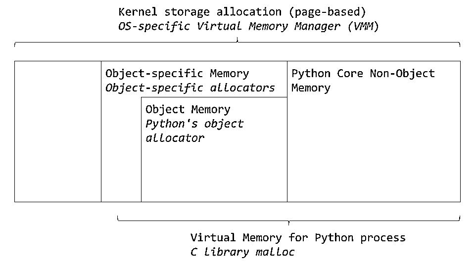
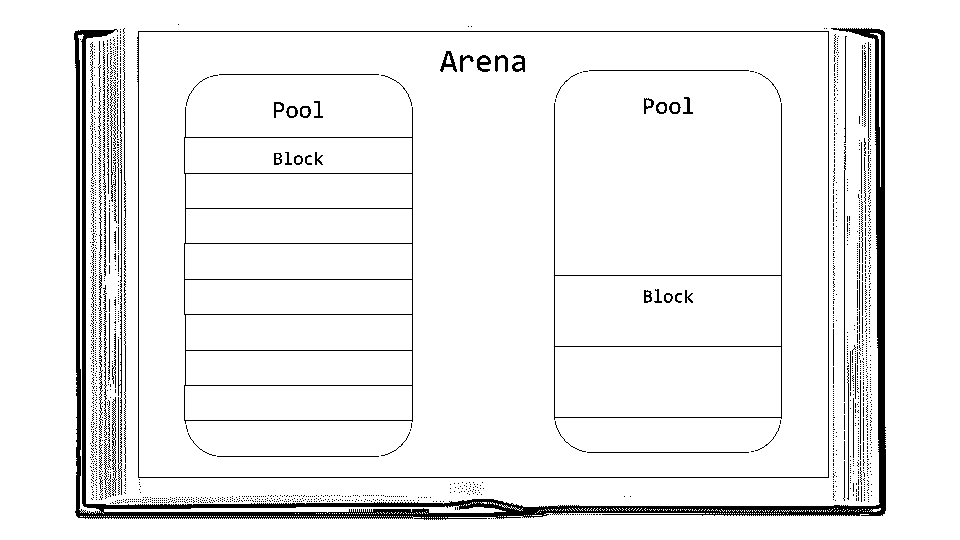
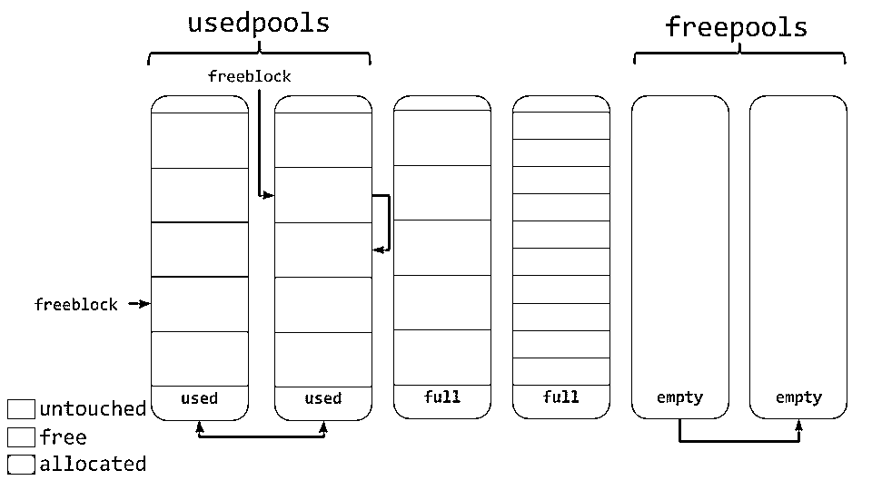
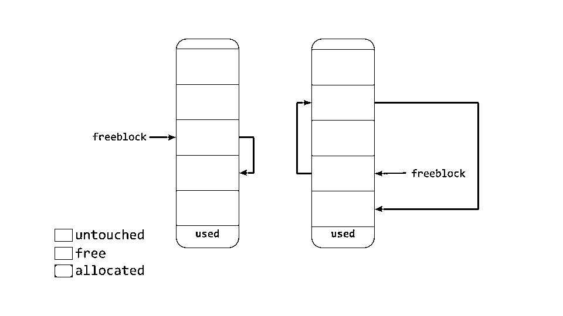
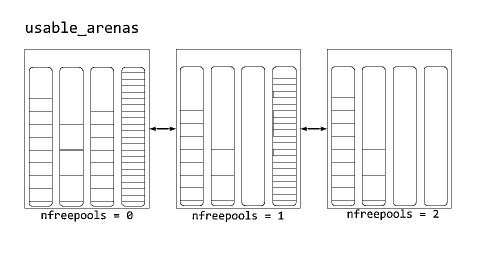

# Python 中的内存管理

> 原文：<https://realpython.com/python-memory-management/>

*立即观看**本教程有真实 Python 团队创建的相关视频课程。和文字教程一起看，加深理解:[**Python 如何管理内存**](/courses/how-python-manages-memory/)

想知道 Python 是如何在幕后处理数据的吗？你的[变量](https://realpython.com/python-variables/)是如何存储在内存中的？它们什么时候被删除？

在本文中，我们将深入 Python 的内部，以理解它是如何处理内存管理的。

**本文结束时，你将:**

*   了解有关低级计算的更多信息，特别是与内存相关的信息
*   理解 Python 如何抽象底层操作
*   了解 Python 的内部内存管理算法

了解 Python 的内部也将让您更好地了解 Python 的一些行为。希望您也能对 Python 有新的认识。如此多的逻辑在幕后发生，以确保你的程序按你期望的方式工作。

**免费奖励:** [掌握 Python 的 5 个想法](https://realpython.com/bonus/python-mastery-course/)，这是一个面向 Python 开发者的免费课程，向您展示将 Python 技能提升到下一个水平所需的路线图和心态。

## 记忆是一本空书

你可以先把计算机的内存想象成一本用来写短篇故事的空书。纸上还什么都没写。最终，不同的作者会出现。每个作者都想要一些空间来写他们的故事。

因为他们不允许互相覆盖，所以他们必须小心他们写的是哪一页。在他们开始写作之前，他们会咨询图书经理。然后经理决定他们可以在书的什么地方写。

由于这本书已经存在很久了，里面的许多故事已经不再相关了。当没有人阅读或引用这些故事时，它们就会被删除，以便为新的故事腾出空间。

本质上，计算机内存就像那本空书。事实上，通常将固定长度的连续内存块称为**页面**，因此这个类比非常适用。

作者就像需要在内存中存储数据的不同应用程序或进程。经理决定作者可以在书中何处书写，扮演着某种记忆经理的角色。清除旧故事为新故事腾出空间的人是垃圾收集者。

[*Remove ads*](/account/join/)

## 内存管理:从硬件到软件

内存管理是应用程序[读写数据](https://realpython.com/read-write-files-python/)的过程。内存管理器决定将应用程序的数据放在哪里。因为内存块是有限的，就像我们书中类比的页面一样，管理器必须找到一些空闲空间，并将其提供给应用程序。这个提供内存的过程一般被称为内存**分配**。

另一方面，当不再需要数据时，可以将其删除，或者释放**。但是自由到哪里去呢？这个“记忆”从何而来？*

*当你运行 Python 程序时，在你计算机的某个地方，有一个存储数据的物理设备。在对象真正到达硬件之前，Python 代码要经过许多抽象层。

硬件(如 RAM 或硬盘)之上的一个主要层是操作系统(OS)。它执行(或拒绝)读写内存的请求。

在操作系统之上，有一些应用程序，其中一个是默认的 Python 实现(包含在你的操作系统中或者从[python.org](https://www.python.org/)下载)。)Python 代码的内存管理由 Python 应用程序处理。Python 应用程序用于内存管理的算法和结构是本文的重点。

## 默认的 Python 实现

默认的 Python 实现 [CPython](https://realpython.com/cpython-source-code-guide/) ，实际上是用 [C 编程语言](https://realpython.com/c-for-python-programmers/)编写的。

当我第一次听到这个消息时，我大吃一惊。用另一种语言写的语言？！不完全是，但算是吧。

Python 语言是在用英语编写的参考手册中定义的。然而，该手册本身并不那么有用。您仍然需要一些东西来根据手册中的规则解释编写的代码。

您还需要一些东西来在计算机上实际执行解释的代码。默认的 Python 实现满足了这两个要求。它将您的 Python 代码转换成指令，然后在虚拟机上运行。

**注:**虚拟机就像物理计算机，只是用软件实现。他们通常处理类似于[汇编指令](https://en.wikipedia.org/wiki/Assembly_language)的基本指令。

Python 是一种解释型编程语言。你的 Python 代码实际上被编译成更多的计算机可读指令，称为[字节码](https://docs.python.org/3/glossary.html#term-bytecode)。当你运行代码时，这些指令被虚拟机解释为**。*

*你见过`.pyc`文件或者`__pycache__`文件夹吗？这是由虚拟机解释的字节码。

值得注意的是，除了 CPython 之外还有其他实现。IronPython 编译下来运行在微软的公共语言运行时上。 [Jython](http://www.jython.org/) 编译成 [Java](https://realpython.com/oop-in-python-vs-java/) 字节码，运行在 Java 虚拟机上。然后是 [PyPy](https://pypy.org/) ，但那值得[自己的整篇文章](https://realpython.com/pypy-faster-python/)，所以我只是顺便提一下。

出于本文的目的，我将把重点放在 Python 的默认实现 CPython 的内存管理上。

**免责声明**:虽然这些信息中的很多将会被带到 Python 的新版本中，但将来事情可能会发生变化。注意，本文引用的版本是当前最新版本的 Python， [`3.7`](https://realpython.com/python37-new-features/) 。

好了，CPython 是用 C 写的，它解释 Python 字节码。这和内存管理有什么关系？内存管理算法和结构存在于 c 语言的 CPython 代码中。要理解 Python 的内存管理，您必须对 CPython 本身有一个基本的了解。

CPython 是用 C 写的，不原生支持[面向对象编程](https://realpython.com/python3-object-oriented-programming/)。因此，CPython 代码中有很多有趣的设计。

你可能听说过 Python 中的一切都是对象，甚至是像`int`和`str`这样的类型。嗯，在 CPython 的实现层面上确实如此。有一个名为`PyObject`的`struct`，CPython 中的所有其他对象都使用它。

**注意:**C 中的`struct`或**结构**是一种自定义数据类型，它将不同的数据类型组合在一起。与面向对象语言相比，它就像一个只有属性而没有方法的类。

Python 中所有对象的始祖`PyObject`，只包含两个东西:

*   **`ob_refcnt` :** 引用计数
*   **`ob_type` :** 指针指向另一种类型

引用计数用于垃圾收集。然后你就有了一个指向实际对象类型的[指针](https://realpython.com/pointers-in-python/)。那个对象类型只是另一个描述 Python 对象的`struct`(比如`dict`或`int`)。

每个对象都有自己的特定于对象的内存分配器，它知道如何获取内存来存储该对象。每个对象还有一个特定于对象的内存释放器，一旦不再需要，它就会“释放”内存。

然而，在所有关于分配和释放内存的讨论中，有一个重要的因素。内存是计算机上的共享资源，如果两个不同的进程试图同时写入同一位置，可能会发生不好的事情。

[*Remove ads*](/account/join/)

## 全球解释器锁(GIL)

GIL 是处理共享资源(如计算机中的内存)这一常见问题的解决方案。当两个线程试图同时修改同一个资源时，它们可能会互相妨碍。最终结果可能是一片混乱，没有一个线程得到它们想要的结果。

再考虑一下书的类比。假设两个作者固执地决定轮到他们写了。不仅如此，他们还需要同时写在书的同一页上。

他们都不理会对方编造故事的企图，开始在纸上写作。最终结果是两个故事重叠在一起，使得整个页面完全无法阅读。

这个问题的一个解决方案是，当线程与共享资源(书中的页面)交互时，在解释器上使用一个全局锁。换句话说，一次只能有一个作者写作。

Python 的 GIL 通过锁定整个解释器来实现这一点，这意味着另一个线程不可能踩在当前线程上。当 CPython 处理内存时，它使用 GIL 来确保安全地处理内存。

这种方法有优点也有缺点，GIL 在 Python 社区中引起了激烈的争论。要阅读更多关于 GIL 的内容，我建议查看一下[什么是 Python 全局解释器锁(GIL)？](https://realpython.com/python-gil/)。

## 垃圾收集

让我们重温一下书中的比喻，假设书中的一些故事已经很老了。没有人再阅读或参考那些故事了。如果没有人在阅读或参考他们自己的作品，你可以删除它，为新的写作腾出空间。

那些旧的、未被引用的文字可以比作 Python 中的一个对象，它的引用计数已经降到了`0`。记住 Python 中的每个对象都有一个引用计数和一个指向类型的指针。

引用计数增加有几个不同的原因。例如，如果将引用计数赋给另一个变量，它将增加:

```py
numbers = [1, 2, 3]
# Reference count = 1
more_numbers = numbers
# Reference count = 2
```

如果将对象作为参数传递，它也会增加:

```py
total = sum(numbers)
```

最后一个例子是，如果将对象包含在列表中，引用计数将会增加:

```py
matrix = [numbers, numbers, numbers]
```

Python 允许您使用`sys`模块检查对象的当前引用计数。您可以使用`sys.getrefcount(numbers)`，但是要记住将对象传递给`getrefcount()`会增加引用计数`1`。

在任何情况下，如果对象仍然需要留在代码中，那么它的引用计数大于`0`。一旦下降到`0`，该对象就会调用一个特定的释放函数来“释放”内存，以便其他对象可以使用它。

但是“释放”内存是什么意思，其他对象是如何使用它的呢？让我们直接进入 CPython 的内存管理。

## CPython 的内存管理

我们将深入探究 CPython 的内存架构和算法，所以请系好安全带。

如前所述，从物理硬件到 CPython 有几个抽象层。操作系统(OS)对物理内存进行抽象，并创建应用程序(包括 Python)可以访问的虚拟内存层。

特定于操作系统的虚拟内存管理器为 Python 进程划出一块内存。下图中较暗的灰色方框现在归 Python 进程所有。

[](https://files.realpython.com/media/memory_management.92ad564ec680.png)

Python 将一部分内存用于内部使用和非对象内存。另一部分专用于对象存储(您的`int`、`dict`等等)。请注意，这有些简化。如果您想要完整的图片，您可以查看 [CPython 源代码](https://github.com/python/cpython/blob/7d6ddb96b34b94c1cbdf95baa94492c48426404e/Objects/obmalloc.c)，所有这些内存管理都发生在这里。

CPython 有一个对象分配器，负责在对象内存区域内分配内存。这个对象分配器是最神奇的地方。每当一个新对象需要分配或删除空间时，就会调用它。

通常，像`list`和`int`这样的 Python 对象的数据添加和删除一次不会涉及太多数据。因此分配器的设计被调整为一次处理少量数据。它还试图不分配内存，直到它绝对需要。

[源代码](https://github.com/python/cpython/blob/7d6ddb96b34b94c1cbdf95baa94492c48426404e/Objects/obmalloc.c)中的注释将分配器描述为“一个快速、专用于小块的内存分配器，将在通用 malloc 之上使用。”本例中，`malloc`是 C 的库函数，用于内存分配。

现在我们来看看 CPython 的内存分配策略。首先，我们将讨论 3 个主要部分以及它们之间的关系。

竞技场是最大的内存块，在内存中对齐在页面边界上。页面边界是操作系统使用的固定长度的连续内存块的边缘。Python 假设系统的页面大小为 256 千字节。

[](https://files.realpython.com/media/memory_management_5.394b85976f34.png)

竞技场内是池，池是一个虚拟内存页面(4kb)。这些就像我们书中类比的页面。这些池被分割成更小的内存块。

给定池中的所有数据块都属于同一“大小级别”给定一定量的请求数据，大小类定义特定的块大小。下图直接取自[源代码](https://github.com/python/cpython/blob/7d6ddb96b34b94c1cbdf95baa94492c48426404e/Objects/obmalloc.c)注释:

| 请求字节数 | 分配块的大小 | 尺寸等级 idx |
| --- | --- | --- |
| 1-8 | eight | Zero |
| 9-16 | Sixteen | one |
| 17-24 | Twenty-four | Two |
| 25-32 | Thirty-two | three |
| 33-40 | Forty | four |
| 41-48 | Forty-eight | five |
| 49-56 | fifty-six | six |
| 57-64 | Sixty-four | seven |
| 65-72 | seventy-two | eight |
| … | … | … |
| 497-504 | Five hundred and four | Sixty-two |
| 505-512 | Five hundred and twelve | Sixty-three |

例如，如果请求 42 字节，数据将被放入 48 字节大小的块中。

[*Remove ads*](/account/join/)

### 池

池由单一大小级别的数据块组成。每个池维护一个[双向链表](https://realpython.com/linked-lists-python/)到相同大小类的其他池。通过这种方式，该算法可以轻松找到给定数据块大小的可用空间，甚至跨不同的池。

一个`usedpools`列表跟踪所有有一些空间可用于每个大小类别的数据的池。当请求给定的数据块大小时，该算法会检查此`usedpools`列表以获取该数据块大小的池列表。

池本身必须处于以下三种状态之一:`used`、`full`或`empty`。一个`used`池有可用于存储数据的块。一个`full`池的所有块都被分配并包含数据。一个`empty`池不存储任何数据，并且可以在需要时为块分配任何大小的类。

一个`freepools`列表跟踪处于`empty`状态的所有池。但是什么时候使用空池呢？

假设您的代码需要 8 字节的内存块。如果在 8 字节大小类的`usedpools`中没有池，则初始化一个新的`empty`池来存储 8 字节块。然后这个新的池被添加到`usedpools`列表中，这样它就可以用于将来的请求。

假设一个`full`池因为不再需要内存而释放了一些内存块。该池将被添加回其大小类别的`usedpools`列表中。

您现在可以看到，使用这种算法，池可以在这些状态(甚至内存大小类别)之间自由移动。

### 块

[](https://files.realpython.com/media/memory_management_3.52bffbf302d3.png)

如上图所示，池包含一个指向其“空闲”内存块的指针。这种工作方式略有不同。根据源代码中的注释，这个分配器“在所有级别(arena、pool 和 block)上努力不去碰一块内存，直到它真正被需要为止”。

这意味着一个池可以有三种状态的块。这些状态可以定义如下:

*   **`untouched` :** 尚未分配的内存部分
*   **`free` :** 被 CPython 分配但后来“释放”的一部分内存，不再包含相关数据
*   **`allocated` :** 实际包含相关数据的内存部分

`freeblock`指针指向内存自由块的单链表。换句话说，就是存放数据的可用位置列表。如果需要多于可用的空闲块，分配器将在池中获得一些`untouched`块。

随着内存管理器释放块，那些现在的`free`块被添加到`freeblock`列表的前面。实际的列表可能不是连续的内存块，就像第一个漂亮的图表一样。它可能类似于下图:

[](https://files.realpython.com/media/memory_management_4.4a30dfa2d111.png)

### 竞技场

竞技场包含水池。这些池可以是`used`、`full`或`empty`。但是竞技场本身并不像泳池那样有明确的状态。

竞技场被组织成一个叫做`usable_arenas`的双向链表。该列表按可用的空闲池数量排序。免费池越少，竞技场越靠近列表的前面。

[](https://files.realpython.com/media/memory_management_6.60e9761bc158.png)

这意味着将选择数据最多的区域来放置新数据。但是为什么不相反呢？为什么不把数据放在最有空间的地方呢？

这给我们带来了真正释放内存的想法。你会注意到我经常用引号提到“免费”。原因是当一个块被认为是“自由的”时，该内存实际上并没有被释放回操作系统。Python 进程保持它的分配状态，并在以后将它用于新数据。真正释放内存是将它返回给操作系统使用。

竞技场是唯一可以真正自由的东西。因此，有理由认为那些接近空的竞技场应该被允许变空。这样，可以真正释放内存块，减少 Python 程序的整体内存占用。

[*Remove ads*](/account/join/)

## 结论

内存管理是使用计算机不可或缺的一部分。Python 几乎在幕后处理所有的事情，不管是好是坏。

在本文中，您了解了:

*   什么是内存管理，为什么它很重要
*   默认的 Python 实现 CPython 是如何用 C 编程语言编写的
*   数据结构和算法如何在 CPython 的内存管理中协同工作来处理数据

Python 抽象出了许多与计算机打交道的具体细节。这使您能够在更高的层次上开发您的代码，而不必担心所有这些字节是如何以及在哪里存储的。

*立即观看**本教程有真实 Python 团队创建的相关视频课程。和文字教程一起看，加深理解:[**Python 如何管理内存**](/courses/how-python-manages-memory/)**********