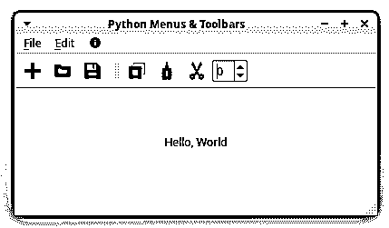
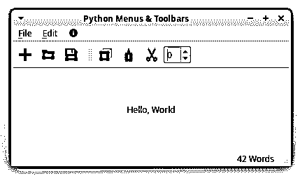

# Python 和 PyQt:创建菜单、工具栏和状态栏

> 原文：<https://realpython.com/python-menus-toolbars/>

当使用 Python 和 [PyQt](https://www.riverbankcomputing.com/static/Docs/PyQt5/) 开发[图形用户界面(GUI)](https://en.wikipedia.org/wiki/Graphical_user_interface) 应用程序时，你会用到的一些最有用和最通用的图形元素是[菜单](https://en.wikipedia.org/wiki/Menu_(computing))、[工具栏](https://en.wikipedia.org/wiki/Toolbar)和[状态栏](https://en.wikipedia.org/wiki/Status_bar)。

菜单和工具栏可以让你的应用程序看起来**精致**和**专业**，为用户提供一组可访问的选项，而状态栏允许你显示应用程序状态的相关信息。

在本教程中，您将学习:

*   什么是**菜单**、**工具栏**、**状态栏**
*   如何以编程方式创建菜单、工具栏和状态栏
***   如何使用 **PyQt 动作**填充 Python 菜单和工具栏*   如何使用状态栏显示**状态信息***

*此外，您将学习一些在使用 Python 和 PyQt 创建菜单、工具栏和状态栏时可以应用的**编程最佳实践**。如果你是使用 PyQt 进行 GUI 编程的新手，那么你可以看看 [Python 和 PyQt:构建 GUI 桌面计算器](https://realpython.com/python-pyqt-gui-calculator/)。

您可以通过单击下面的框来下载您将在本教程中构建的示例应用程序的代码和资源:

**下载示例代码:** [单击此处获取代码，您将使用](https://realpython.com/bonus/python-pyqt-menus/)来学习如何使用 Python 和 PyQt 向您的 GUI 应用程序添加菜单、工具栏和状态栏。

## 在 PyQt 中构建 Python 菜单栏、菜单和工具栏

一个**菜单栏**是一个 GUI 应用程序的[主窗口](https://realpython.com/python-pyqt-layout/)的一个区域，它保存着**菜单**。菜单是选项的下拉列表，提供对应用程序选项的方便访问。例如，如果您正在创建一个文本编辑器，那么您的菜单栏中可能会有以下一些菜单:

*   一个*文件*菜单，提供以下一些菜单选项:
    *   *New* 用于创建新文档
    *   *打开*用于打开已有的文档
    *   *打开最近的*打开最近的文档
    *   *保存*用于保存文档
    *   *退出*退出应用程序
*   一个*编辑*菜单，提供以下一些菜单选项:
    *   *复印*用于复印一些文本
    *   *粘贴*用于粘贴一些文本
    *   *剪切*用于剪切一些文本
*   一个*帮助*菜单，提供以下一些菜单选项:
    *   *帮助内容*用于启动用户手册和帮助内容
    *   *关于*用于启动关于对话框

您也可以将这些选项添加到**工具栏**中。工具栏是一个带有有意义图标的按钮面板，通过它可以快速访问应用程序中最常用的选项。在您的文本编辑器示例中，您可以添加类似于*新建*、*打开*、*保存*、*复制*和*粘贴*到工具栏的选项。

**注意:**在本教程中，您将开发一个实现上述所有菜单和选项的示例应用程序。您可以使用这个示例应用程序作为创建文本编辑器项目的起点。

在本节中，您将学习如何使用 Python 和 PyQt 向 GUI 应用程序添加菜单栏、菜单和工具栏的基础知识。

在继续之前，您将创建一个示例 PyQt 应用程序，您将在本教程中使用它。在每一节中，您将向这个示例应用程序添加新的特性和功能。该应用程序将是一个主窗口风格的应用程序。这意味着它将有一个菜单栏、一个工具栏、一个状态栏和一个中央小部件。

打开你最喜欢的[代码编辑器或者 IDE](https://realpython.com/python-ides-code-editors-guide/) ，创建一个名为`sample_app.py`的 Python 文件。然后向其中添加以下代码:

```py
import sys

from PyQt5.QtCore import Qt
from PyQt5.QtWidgets import QApplication, QLabel, QMainWindow

class Window(QMainWindow):
    """Main Window."""
    def __init__(self, parent=None):
        """Initializer."""
        super().__init__(parent)
        self.setWindowTitle("Python Menus & Toolbars")
        self.resize(400, 200)
        self.centralWidget = QLabel("Hello, World")
        self.centralWidget.setAlignment(Qt.AlignHCenter | Qt.AlignVCenter)
        self.setCentralWidget(self.centralWidget)

if __name__ == "__main__":
    app = QApplication(sys.argv)
    win = Window()
    win.show()
    sys.exit(app.exec_())
```

现在`sample_app.py`包含了创建示例 PyQt 应用程序所需的所有代码。在这种情况下，`Window`继承自 [`QMainWindow`](https://www.riverbankcomputing.com/static/Docs/PyQt5/api/qtwidgets/qmainwindow.html) 。因此，您正在构建一个主窗口风格的应用程序。

**注:**可惜 PyQt5 的[官方文档](https://www.riverbankcomputing.com/static/Docs/PyQt5/index.html)有一些不完整的章节。为了解决这个问题，你可以查看 [PyQt4 文档](https://www.riverbankcomputing.com/static/Docs/PyQt4/)或者原始的 [Qt 文档](https://doc.qt.io/)。

在类初始化器`.__init__()`中，首先使用 [`super()`](https://realpython.com/python-super/) 调用父类的初始化器。然后使用`.setWindowTitle()`设置窗口标题，使用`.resize()`调整窗口大小。

**注意:**如果您不熟悉 PyQt 应用程序以及如何创建它们，那么您可以查看 [Python 和 PyQt:构建 GUI 桌面计算器](https://realpython.com/python-pyqt-gui-calculator/)。

窗口的中心小部件是一个 [`QLabel`](https://www.riverbankcomputing.com/static/Docs/PyQt5/api/qtwidgets/qlabel.html) 对象，您将使用它来显示响应某些用户操作的消息。这些消息将显示在窗口的中央。要做到这一点，你可以用几个[对齐标志](https://www.riverbankcomputing.com/static/Docs/PyQt5/api/qtcore/qt.html#AlignmentFlag)调用`QLabel`对象上的`.setAlignment()`。

如果您从命令行运行应用程序，那么您将在屏幕上看到以下窗口:

[](https://files.realpython.com/media/pyqt-sample-app.1926ae5ad791.png)

就是这样！您已经用 Python 和 PyQt 创建了一个主窗口样式的应用程序。在本教程接下来的所有示例中，您都将使用这个示例应用程序。

[*Remove ads*](/account/join/)

### 创建菜单栏

在 PyQt 主窗口样式的应用程序中，`QMainWindow`默认提供一个空的 [`QMenuBar`](https://www.riverbankcomputing.com/static/Docs/PyQt5/api/qtwidgets/qmenubar.html) 对象。要访问这个菜单栏，你需要在你的`QMainWindow`对象上调用`.menuBar()`。这个方法将返回一个空的菜单栏。这个菜单栏的父对象将是你的主窗口对象。

现在回到您的示例应用程序，在`Window`的定义中添加以下方法:

```py
class Window(QMainWindow):
    # Snip...
    def _createMenuBar(self):
        menuBar = self.menuBar()
```

这是在 PyQt 中创建菜单栏的首选方式。在这里，`menuBar`变量将保存一个空的菜单栏，这将是你的主窗口的菜单栏。

**注意:**PyQt 编程中的一个常见实践是，在对象的定义方法之外，对那些您不会使用或不需要的对象使用局部变量。Python [对](https://realpython.com/python-memory-management/#garbage-collection)[范围](https://realpython.com/python-scope-legb-rule/)之外的所有对象进行垃圾收集，所以你可能会认为一旦`._createMenuBar()` [返回](https://realpython.com/python-return-statement/)，上面例子中的`menuBar`就会消失。

事实是，PyQt 使用本地对象的[所有权](https://doc.qt.io/qt-5/objecttrees.html)或父子关系来保存对本地对象的引用，如`menuBar`。换句话说，由于`menuBar`属于主窗口对象，Python 将无法对其进行垃圾收集。

向 PyQt 应用程序添加菜单栏的另一种方法是创建一个`QMenuBar`对象，然后使用`.setMenuBar()`将其设置为主窗口的菜单栏。考虑到这一点，你也可以这样写`._createMenuBar()`:

```py
from PyQt5.QtWidgets import QMenuBar # Snip...

class Window(QMainWindow):
    # Snip...
    def _createMenuBar(self):
 menuBar = QMenuBar(self) self.setMenuBar(menuBar)
```

在上面的例子中，`menuBar`持有一个父对象设置为`self`的`QMenuBar`对象，这是应用程序的主窗口。一旦你有了菜单栏对象，你可以使用`.setMenuBar()`把它添加到你的主窗口。最后，请注意，为了让这个例子工作，您首先需要从`PyQt5.QWidgets`中[导入](https://realpython.com/absolute-vs-relative-python-imports/) `QMenuBar`。

在 GUI 应用程序中，菜单栏将根据底层操作系统显示在不同的位置:

*   **窗口:**在应用程序主窗口的顶部，标题栏下
*   **macOS:** 在屏幕上方
*   **Linux:** 要么在主窗口的顶部，要么在屏幕的顶部，这取决于你的[桌面环境](https://en.wikipedia.org/wiki/Desktop_environment)

为应用程序创建菜单栏的最后一步是从主窗口的初始化器`.__init__()`中调用`._createMenuBar()`:

```py
class Window(QMainWindow):
    """Main Window."""
    def __init__(self, parent=None):
        # Snip...
 self._createMenuBar()
```

如果您用这些新的变化运行您的示例应用程序，那么您将不会在应用程序的主窗口上看到菜单栏。那是因为你的菜单栏还是空的。要在应用程序的主窗口上看到菜单栏，您需要创建一些菜单。这就是你接下来要学的。

### 向菜单栏添加菜单

[菜单](https://en.wikipedia.org/wiki/Menu_(computing))是**菜单选项**的下拉列表，你可以通过点击它们或点击键盘快捷键来触发。在 PyQt 中，至少有三种方法可以向菜单栏对象添加菜单:

1.  **`QMenuBar.addMenu(menu)`** 向菜单栏对象追加一个`QMenu`对象(`menu`)。它返回与该菜单相关的[动作](https://www.riverbankcomputing.com/static/Docs/PyQt5/api/qt3dinput/qaction.html)。

2.  **`QMenuBar.addMenu(title)`** 创建一个新的`QMenu`对象，并将字符串(`title`)作为其标题添加到菜单栏。菜单栏获得菜单的所有权，该方法返回新的`QMenu`对象。

3.  **`QMenuBar.addMenu(icon, title)`** 创建一个新的`QMenu`对象，并将一个`icon`和一个`title`添加到菜单栏对象中。菜单栏获取菜单的所有权，该方法返回新的`QMenu`对象。

如果您使用第一个选项，那么您需要首先创建您的定制`QMenu`对象。为此，您可以使用以下构造函数之一:

1.  `QMenu(parent)`
2.  `QMenu(title, parent)`

在这两种情况下，`parent`是持有`QMenu`对象所有权的 [`QWidget`](https://www.riverbankcomputing.com/static/Docs/PyQt5/api/qtwidgets/qwidget.html) 。您通常会将`parent`设置为使用菜单的窗口。在第二个构造函数中，`title`将保存一个描述菜单选项的文本字符串。

下面是如何将*文件*、*编辑*和*帮助*菜单添加到示例应用程序的菜单栏中:

```py
from PyQt5.QtWidgets import QMenu # Snip...

class Window(QMainWindow):
    # Snip...
    def _createMenuBar(self):
        menuBar = self.menuBar()
        # Creating menus using a QMenu object
 fileMenu = QMenu("&File", self) menuBar.addMenu(fileMenu)        # Creating menus using a title
 editMenu = menuBar.addMenu("&Edit") helpMenu = menuBar.addMenu("&Help")
```

首先，你[从`PyQt5.QtWidgets`导入](https://realpython.com/courses/python-imports-101/) `QMenu`。然后在`._createMenuBar()`中，你使用`.addMenu()`的前两个变体向菜单栏添加三个菜单。第三种变化需要一个图标对象，但是您还没有学会如何创建和使用图标。在使用 PyQt 中的图标和资源[一节中，您将了解如何使用图标。](#using-icons-and-resources-in-pyqt)

如果您运行示例应用程序，那么您会看到现在有一个菜单栏，如下所示:

[](https://files.realpython.com/media/pyqt-menu-bar.2e39e200250d.gif)

应用程序的菜单栏有菜单*文件*、*编辑*和*帮助*。当您单击这些菜单时，它们不会显示菜单选项的下拉列表。那是因为你还没有添加菜单选项。在[用动作填充菜单](#populating-menus-with-actions)一节中，您将学习如何向菜单添加菜单选项。

最后，请注意，您在每个菜单标题中包含的&字符(`&`)会在菜单栏显示中创建带下划线的字母。这将在[定义菜单和工具栏选项的快捷键](#defining-keyboard-shortcuts-for-menu-and-toolbar-options)一节中详细讨论。

[*Remove ads*](/account/join/)

### 创建工具栏

一个[工具栏](https://en.wikipedia.org/wiki/Toolbar)是一个可移动的面板，包含按钮和其他小部件，提供对 GUI 应用程序最常用选项的快速访问。工具栏按钮可以显示图标和/或文本来表示它们执行的任务。PyQt 中工具栏的基类是 [`QToolBar`](https://www.riverbankcomputing.com/static/Docs/PyQt5/api/qtwidgets/qtoolbar.html) 。这个类将允许你为你的 GUI 应用程序创建自定义工具栏。

当您将工具栏添加到主窗口样式的应用程序时，默认位置是在窗口的顶部。但是，您可以将工具栏放置在以下四个[工具栏区域](https://www.riverbankcomputing.com/static/Docs/PyQt5/api/qtcore/qt.html#ToolBarArea)中的任何一个:

| 工具栏区域 | 主窗口中的位置 |
| --- | --- |
| `Qt.LeftToolBarArea` | 左侧 |
| `Qt.RightToolBarArea` | 正面 |
| `Qt.TopToolBarArea` | 顶端 |
| `Qt.BottomToolBarArea` | 底部 |

在 PyQt 中，工具栏区域被定义为常量。如果你需要使用它们，那么你必须从`PyQt5.QtCore`导入`Qt`，然后使用[全限定名](https://docs.python.org/3/glossary.html#term-qualified-name)，就像在`Qt.LeftToolBarArea`一样。

在 PyQt 中，有三种方法可以将工具栏添加到主窗口应用程序中:

1.  **`QMainWindow.addToolBar(title)`** 新建一个空的`QToolBar`对象，并将其窗口标题设置为`title`。该方法将工具栏插入顶部工具栏区域，并返回新创建的工具栏。

2.  **`QMainWindow.addToolBar(toolbar)`** 在顶部工具栏区域插入一个`QToolBar`对象(`toolbar`)。

3.  **`QMainWindow.addToolBar(area, toolbar)`** 将`QToolBar`对象(`toolbar`)插入指定工具栏区域(`area`)。如果主窗口已经有工具栏，那么`toolbar`会被放在最后一个现有工具栏的后面。如果`toolbar`已经存在于主窗口中，那么它只会被移动到`area`。

如果您使用最后两个选项中的一个，那么您需要自己创建工具栏。为此，可以使用下列构造函数之一:

1.  `QToolBar(parent)`
2.  `QToolBar(title, parent)`

在这两种情况下，`parent`代表拥有工具栏所有权的`QWidget`对象。您通常会将工具栏的所有权设置为您将在其中使用工具栏的窗口。在第二个构造函数中，`title`将是一个带有工具栏的窗口标题的字符串。PyQt 使用这个窗口标题构建一个默认的[上下文菜单](#building-context-or-pop-up-menus-in-pyqt)，允许你隐藏和显示你的工具栏。

现在，您可以返回到您的示例应用程序，并将下面的方法添加到`Window`:

```py
from PyQt5.QtWidgets import QToolBar
# Snip...

class Window(QMainWindow):
    # Snip...
    def _createToolBars(self):
        # Using a title
        fileToolBar = self.addToolBar("File")
        # Using a QToolBar object
        editToolBar = QToolBar("Edit", self)
        self.addToolBar(editToolBar)
        # Using a QToolBar object and a toolbar area
        helpToolBar = QToolBar("Help", self)
        self.addToolBar(Qt.LeftToolBarArea, helpToolBar)
```

首先，从`PyQt5.QtWidgets`导入`QToolBar`。然后，在`._createToolBars()`中，首先使用带有标题的`.addToolBar()`创建*文件*工具栏。接下来，创建一个标题为`"Edit"`的`QToolBar`对象，并使用`.addToolBar()`将其添加到工具栏中，而不传递工具栏区域。在这种情况下，*编辑*工具栏位于顶部工具栏区域。最后，创建*帮助*工具栏，并使用`Qt.LeftToolBarArea`将其放置在左侧工具栏区域。

完成这项工作的最后一步是从`Window`的初始化器中调用`._createToolBars()`:

```py
class Window(QMainWindow):
    """Main Window."""
    def __init__(self, parent=None):
        # Snip...
 self._createToolBars()
```

在`Window`的初始化器中调用`._createToolBars()`将会创建三个工具栏并将它们添加到你的主窗口中。下面是您的应用程序现在的样子:

[](https://files.realpython.com/media/pyqt-toolbars.712a3ec34165.gif)

现在，菜单栏正下方有两个工具栏，窗口左侧有一个工具栏。每个工具栏都有一条双虚线。当您将鼠标移到虚线上时，指针会变成手形。如果您单击并按住虚线，那么您可以将工具栏移动到窗口上的任何其他位置或工具栏区域。

如果右键单击工具栏，PyQt 会显示一个上下文菜单，允许您根据需要隐藏和显示现有的工具栏。

到目前为止，您的应用程序窗口上有三个工具栏。这些工具栏仍然是空的，你需要添加一些工具栏按钮来使它们起作用。为此，您可以使用 PyQt **动作**，它们是 [`QAction`](https://www.riverbankcomputing.com/static/Docs/PyQt5/api/qt3dinput/qaction.html) 的实例。在后面的[部分](#creating-actions-for-python-menus-and-toolbars-in-pyqt)中，您将学习如何在 PyQt 中创建动作。现在，您将学习如何在 PyQt 应用程序中使用图标和其他资源。

[*Remove ads*](/account/join/)

## 使用 PyQt 中的图标和资源

[Qt 库](https://qt.io/)包括 [Qt 资源系统](https://doc.qt.io/qt-5/resources.html)，这是一种向应用程序添加二进制文件(如图标、图像、翻译文件和其他资源)的便捷方式。

要使用资源系统，您需要在一个**资源收集文件**或`.qrc`文件中列出您的资源。一个`.qrc`文件是一个`XML`文件，它包含文件系统中每个资源的位置，或者说**路径**。

假设您的示例应用程序有一个`resources`目录，其中包含您想要在应用程序的 GUI 中使用的图标。你有像*新*、*开放*等选项的图标。您可以创建一个包含每个图标路径的`.qrc`文件:

```py
<!DOCTYPE RCC><RCC version="1.0">
<qresource>
    <file alias="file-new.svg">resources/file-new.svg</file>
    <file alias="file-open.svg">resources/file-open.svg</file>
    <file alias="file-save.svg">resources/file-save.svg</file>
    <file alias="file-exit.svg">resources/file-exit.svg</file>
    <file alias="edit-copy.svg">resources/edit-copy.svg</file>
    <file alias="edit-cut.svg">resources/edit-cut.svg</file>
    <file alias="edit-paste.svg">resources/edit-paste.svg</file>
    <file alias="help-content.svg">resources/help-content.svg</file>
</qresource>
</RCC>
```

每个`<file>`条目必须包含文件系统中资源的路径。指定的路径相对于包含`.qrc`文件的目录。在上面的例子中，`resources`目录需要和`.qrc`文件在同一个目录中。

`alias`是一个可选属性，它定义了一个简短的替代名称，您可以在代码中使用它来访问每个资源。

一旦您有了应用程序的资源，您就可以针对您的`.qrc`文件运行命令行工具 [`pyrcc5`](https://www.riverbankcomputing.com/static/Docs/PyQt5/resources.html#pyrcc5) 。`pyrcc5`是 PyQt 附带的，一旦安装了 PyQt，它就必须在您的 [Python 环境](https://realpython.com/python-virtual-environments-a-primer/)中完全可用。

`pyrcc5`读取一个`.qrc`文件并生成一个 Python 模块，其中包含所有资源的二进制代码:

```py
$ pyrcc5 -o qrc_resources.py resources.qrc
```

该命令将读取`resources.qrc`并生成包含每个资源的二进制代码的`qrc_resources.py`。通过导入`qrc_resources`，你将能够在你的 Python 代码中使用这些资源。

**注意:**如果在运行`pyrcc5`时出错，那么要确保你使用的是正确的 Python 环境。如果您在 Python 虚拟环境中安装 PyQt，那么您将无法从该环境外部使用`pyrcc5`。

下面是与您的`resources.qrc`对应的`qrc_resources.py`中的一段代码:

```py
# -*- coding: utf-8 -*-

# Resource object code
#
# Created by: The Resource Compiler for PyQt5 (Qt v5.9.5)
#
# WARNING! All changes made in this file will be lost!

from PyQt5 import QtCore

qt_resource_data = b"\
\x00\x00\x03\xb1\
\x3c\
\x73\x76\x67\x20\x78\x6d\x6c\x6e\x73\x3d\x22\x68\x74\x74\x70\x3a\
...
```

有了`qrc_resources.py`,您可以将它导入到您的应用程序中，并通过键入冒号(:)然后键入它的`alias`或它的路径来引用每个资源。例如，要使用别名访问`file-new.svg`，您可以使用**访问字符串** `":file-new.svg"`。如果您没有一个`alias`，那么您将使用访问字符串`":resources/file-new.svg"`通过它的路径来访问它。

如果您有别名，但是出于某种原因，您希望通过路径访问给定的资源，那么您可能必须从访问字符串中删除冒号，以便使其正常工作。

要在操作中使用图标，首先需要导入资源模块:

```py
import qrc_resources
```

一旦导入了包含资源的模块，就可以在应用程序的 GUI 中使用这些资源。

**注意:** [Linters](https://realpython.com/python-code-quality/#linters) 、 [editors 和 IDEs](https://realpython.com/python-ides-code-editors-guide/) 可能会将上面的 import 语句标记为未使用，因为您的代码不会包含对它的任何显式使用。有些 ide 甚至会自动删除这一行。

在这些情况下，您必须覆盖 linter、编辑器或 ide 的建议，并将该导入保留在您的代码中。否则，您的应用程序将无法显示您的资源。

要使用资源系统创建图标，需要实例化 [`QIcon`](https://www.riverbankcomputing.com/static/Docs/PyQt5/api/qtgui/qicon.html) ，将别名或路径传递给类构造函数:

```py
newIcon = QIcon(":file-new.svg")
```

在这个例子中，您用文件`file-new.svg`创建了一个`QIcon`对象，它位于您的资源模块中。这为在整个 GUI 应用程序中使用图标和资源提供了一种方便的方式。

现在回到您的示例应用程序，更新最后一行`._createMenuBar()`:

```py
from PyQt5.QtGui import QIcon 
import qrc_resources # Snip...

class Window(QMainWindow):
    # Snip...
    def _createMenuBar(self):
        menuBar = self.menuBar()
        # Using a QMenu object
        fileMenu = QMenu("&File", self)
        menuBar.addMenu(fileMenu)
        # Using a title
        editMenu = menuBar.addMenu("&Edit")
        # Using an icon and a title
 helpMenu = menuBar.addMenu(QIcon(":help-content.svg"), "&Help")
```

为了让这段代码工作，首先需要从`PyQt5.QtGui`导入`QIcon`。还需要导入`qrc_resources`。在最后一行突出显示的代码中，您使用资源模块中的`help-content.svg`向`helpMenu`添加了一个图标。

如果您用这个更新运行您的示例应用程序，那么您将得到以下输出:

[](https://files.realpython.com/media/pyqt-menu-bar-icon.348be94c0101.gif)

应用程序的主窗口现在在其*帮助*菜单上显示一个图标。点击图标时，菜单显示文本`Help`。在菜单栏中使用图标并不常见，但是 PyQt 允许您这样做。

[*Remove ads*](/account/join/)

## 在 PyQt 中为 Python 菜单和工具栏创建动作

PyQt **动作**是代表应用程序中给定命令、操作或动作的对象。当您需要为不同的 GUI 组件(如菜单选项、工具栏按钮和键盘快捷键)提供相同的功能时，它们非常有用。

可以通过实例化`QAction`来创建动作。一旦您创建了一个动作，您需要将它添加到一个小部件中，以便能够在实践中使用它。

您还需要将您的操作与一些功能联系起来。换句话说，您需要将它们连接到您想要在动作被触发时运行的[函数](https://realpython.com/defining-your-own-python-function/)或[方法](https://realpython.com/instance-class-and-static-methods-demystified/)。这将允许您的应用程序响应 GUI 中的用户操作来执行操作。

动作相当多才多艺。它们允许您在菜单选项、工具栏按钮和键盘快捷键之间重复使用相同的功能并保持同步。这在整个应用程序中提供了一致的行为。

例如，当用户点击*打开…* 菜单选项，点击*打开*工具栏按钮，或者按键盘上的 `Ctrl` + `O` 时，用户可能期望应用程序执行相同的动作。

`QAction`提供了一个抽象概念，允许您跟踪以下元素:

*   菜单选项上的文本
*   工具栏按钮上的文本
*   工具栏上的帮助提示选项(**工具提示**
*   这是什么帮助提示
*   状态栏上的帮助提示(**状态提示**
*   与选项关联的键盘快捷键
*   与菜单和工具栏选项相关联的图标
*   动作的`enabled`或`disabled`状态
*   动作的`on`或`off`状态

要创建动作，需要实例化`QAction`。至少有三种方法可以做到这一点:

1.  `QAction(parent)`
2.  `QAction(text, parent)`
3.  `QAction(icon, text, parent)`

在所有这三种情况下，`parent`都表示持有动作所有权的对象。这个参数可以是任何 [`QObject`](https://www.riverbankcomputing.com/static/Docs/PyQt5/api/qtcore/qobject.html) 。最佳实践是将动作创建为将要使用它们的窗口的子窗口。

在第二个和第三个构造函数中，`text`保存了操作将在菜单选项或工具栏按钮上显示的文本。

动作文本在菜单选项和工具栏按钮上的显示方式不同。例如，文本`&Open...`在菜单选项中显示为*打开……*，在工具栏按钮中显示为*打开*。

在第三个构造函数中，`icon`是一个保存动作图标的`QIcon`对象。该图标将显示在菜单选项文本的左侧。图标在工具栏按钮中的位置取决于工具栏的 [`.toolButtonStyle`](https://www.riverbankcomputing.com/static/Docs/PyQt5/api/qtcore/qt.html#ToolButtonStyle-enum) 属性，可以取下列值之一:

| 风格 | 按钮显示 |
| --- | --- |
| `Qt.ToolButtonIconOnly` | 只有图标 |
| `Qt.ToolButtonTextOnly` | 只有文本 |
| `Qt.ToolButtonTextBesideIcon` | 图标旁边的文本 |
| `Qt.ToolButtonTextUnderIcon` | 图标下的文本 |
| `Qt.ToolButtonFollowStyle` | 遵循底层平台的一般[风格](https://www.riverbankcomputing.com/static/Docs/PyQt5/api/qtwidgets/qstyle.html) |

您还可以使用各自的**设置器方法**、`.setText()`和`.setIcon()`来设置动作的文本和图标。

**注:**关于`QAction`属性的完整列表，可以查看[文档](https://www.riverbankcomputing.com/static/Docs/PyQt5/api/qt3dinput/qaction.html)。

下面是如何使用`QAction`的不同构造函数为示例应用程序创建一些动作:

```py
from PyQt5.QtWidgets import QAction
# Snip...

class Window(QMainWindow):
    # Snip...
    def _createActions(self):
        # Creating action using the first constructor
        self.newAction = QAction(self)
        self.newAction.setText("&New")
        # Creating actions using the second constructor
        self.openAction = QAction("&Open...", self)
        self.saveAction = QAction("&Save", self)
        self.exitAction = QAction("&Exit", self)
        self.copyAction = QAction("&Copy", self)
        self.pasteAction = QAction("&Paste", self)
        self.cutAction = QAction("C&ut", self)
        self.helpContentAction = QAction("&Help Content", self)
        self.aboutAction = QAction("&About", self)
```

在`._createActions()`中，您为示例应用程序创建了一些动作。这些操作将允许您向应用程序的菜单和工具栏添加选项。

注意，您正在创建作为[实例属性](https://realpython.com/python3-object-oriented-programming/#class-and-instance-attributes)的动作，因此您可以使用`self`从`._createActions()`外部访问它们。这样，您将能够在菜单和工具栏上使用这些操作。

**注意:**在`._createActions()`中，你没有使用`QAction`的第三个构造函数，因为如果你还看不到动作，使用图标是没有意义的。你将在[用动作填充工具栏](#populating-toolbars-with-actions)一节中学习如何给动作添加图标。

下一步是从`Window`的初始化器中调用`._createActions()`:

```py
class Window(QMainWindow):
    """Main Window."""
    def __init__(self, parent=None):
        # Snip...
 self._createActions()        self._createMenuBar()
        self._createToolBars()
```

如果您现在运行应用程序，那么您将不会在 GUI 上看到任何变化。这是因为动作在被添加到菜单或工具栏之前不会显示。请注意，您在调用`._createMenuBar()`和`._createToolBars()`之前调用了`._createActions()`，因为您将在菜单和工具栏上使用这些动作。

如果您将动作添加到菜单中，则该动作将成为菜单选项。如果您将动作添加到工具栏，则该动作会变成工具栏按钮。这是接下来几节的主题。

[*Remove ads*](/account/join/)

## 向 PyQt 中的 Python 菜单添加选项

如果您想在 PyQt 中给定的菜单添加一个选项列表，那么您需要使用 actions。到目前为止，您已经学习了如何使用`QAction`的不同构造函数创建动作。在 PyQt 中创建菜单时，动作是一个关键组件。

在本节中，您将学习如何使用动作来用菜单选项填充菜单。

### 用动作填充菜单

要用菜单选项填充菜单，您将使用动作。在菜单中，一个动作被表示为一个水平选项，其中至少有一个描述性文本，如*新建*、*打开*、*保存*等等。菜单选项也可以在其左侧显示图标，在其右侧显示快捷键序列，如 `Ctrl` + `S` 。

您可以使用 **`.addAction()`** 向`QMenu`对象添加动作。这个方法有[几种变体](https://www.riverbankcomputing.com/static/Docs/PyQt5/api/qtwidgets/qmenu.html)。他们中的大多数被认为是在飞行中创造动作。然而，在本教程中，您将使用`QMenu`从`QWidget`继承而来的`.addAction()`的变体。这是这种变化的特征:

```py
QWidget.addAction(action)
```

参数`action`表示您想要添加到给定的`QWidget`对象的`QAction`对象。有了这个`.addAction()`的变体，您可以预先创建您的动作，然后根据需要将它们添加到菜单中。

**注:** `QWidget`还提供`.addActions()`。这个方法获取一个动作列表，并将它们附加到当前的 widget 对象中。

使用这个工具，您可以开始向示例应用程序的菜单添加操作。为此，您需要更新`._createMenuBar()`:

```py
class Window(QMainWindow):
    # Snip...
    def _createMenuBar(self):
        menuBar = self.menuBar()
        # File menu
        fileMenu = QMenu("&File", self)
        menuBar.addMenu(fileMenu)
 fileMenu.addAction(self.newAction) fileMenu.addAction(self.openAction) fileMenu.addAction(self.saveAction) fileMenu.addAction(self.exitAction)        # Edit menu
        editMenu = menuBar.addMenu("&Edit")
 editMenu.addAction(self.copyAction) editMenu.addAction(self.pasteAction) editMenu.addAction(self.cutAction)        # Help menu
        helpMenu = menuBar.addMenu(QIcon(":help-content.svg"), "&Help")
 helpMenu.addAction(self.helpContentAction) helpMenu.addAction(self.aboutAction)
```

通过对`._createMenuBar()`的更新，您可以向示例应用程序的三个菜单中添加许多选项。

现在*文件*菜单有四个选项:

1.  ***新建*** 用于创建新文件
2.  ***【打开】……***用于打开已有的文件
3.  *保存对文件所做的修改*
**   ***退出*** 关闭应用程序

*编辑*菜单有三个选项:

1.  ***将*** 为应对内容复制到系统剪贴板
2.  ***粘贴*** 用于粘贴系统剪贴板中的内容
3.  ***剪切*** 用于将内容剪切到系统剪贴板

*帮助*菜单有两个选项:

1.  ***帮助内容*** 用于启动应用程序的帮助手册
2.  ***关于*** 用于显示关于对话框

选项在菜单中从上到下的显示顺序对应于您在代码中添加选项的顺序。

如果您运行该应用程序，您将在屏幕上看到以下窗口:

[](https://files.realpython.com/media/pyqt-menu-options.6fd18b7916c9.gif)

如果你点击一个菜单，应用程序会显示一个下拉列表，包含你之前看到的选项。

[*Remove ads*](/account/join/)

### 创建 Python 子菜单

有时你需要在你的 GUI 应用程序中使用[子菜单](https://en.wikipedia.org/wiki/Menu_(computing)#Sub-menus)。子菜单是一个嵌套菜单，当您将光标移到给定的菜单选项上时，它会显示出来。要向应用程序添加子菜单，需要调用容器菜单对象上的`.addMenu()`。

假设您需要在示例应用程序的*编辑*菜单中添加一个子菜单。您的子菜单将包含查找和替换内容的选项，因此您将称之为*查找和替换*。该子菜单有两个选项:

1.  ***查找…*** 用于查找某些内容
2.  ***【替换……】***用于查找旧内容并用新内容替换旧内容

以下是将该子菜单添加到示例应用程序的方法:

```py
class Window(QMainWindow):
    # Snip...
    def _createMenuBar(self):
        # Snip...
        editMenu.addAction(self.cutAction)
        # Find and Replace submenu in the Edit menu
 findMenu = editMenu.addMenu("Find and Replace") findMenu.addAction("Find...") findMenu.addAction("Replace...")        # Snip...
```

在第一个突出显示的行中，使用`editMenu`上的`.addMenu()`将带有文本`"Find and Replace"`的`QMenu`对象添加到*编辑*菜单中。下一步是用操作填充子菜单，就像您到目前为止所做的那样。如果您再次运行您的示例应用程序，那么您会在 *Edit* 菜单下看到一个新的菜单选项:

[](https://files.realpython.com/media/pyqt-submenus.cc7b897096a6.gif)

*编辑*菜单现在有了一个名为*查找和替换*的新条目。当您将鼠标悬停在这个新菜单选项上时，会出现一个子菜单，呈现给您两个新选项:*查找…* 和*替换…* 。就是这样！您已经创建了一个子菜单。

## 向 PyQt 中的工具栏添加选项

在用 Python 和 PyQt 构建 GUI 应用程序时，工具栏是一个非常有用的组件。您可以使用工具栏为用户提供快速访问应用程序中最常用选项的方法。你也可以在工具栏中添加类似[微调框](https://www.riverbankcomputing.com/static/Docs/PyQt5/api/qtwidgets/qwidget.html)和[组合框](https://www.riverbankcomputing.com/static/Docs/PyQt5/api/qtwidgets/qcombobox.html)的小部件，允许用户直接从应用程序的 GUI 中修改一些属性和变量。

在接下来的几节中，您将学习如何使用动作向工具栏添加选项或按钮，以及如何使用`.addWidget()`向工具栏添加小部件。

### 用动作填充工具栏

要向工具栏添加选项或按钮，需要调用`.addAction()`。在本节中，您将依赖于`QToolBar`从`QWidget`继承而来的`.addAction()`的变体。所以，你会调用`.addAction()`作为一个参数。这将允许您在菜单和工具栏之间共享您的操作。

当你创建工具栏时，你通常会面临决定添加什么选项的问题。通常，您会希望只将最常用的动作添加到工具栏中。

如果您返回到示例应用程序，那么您会记得您添加了三个工具栏:

1.  *文件*
2.  *编辑*
3.  *帮助*

在*文件*工具栏中，您可以添加如下选项:

*   *新*
*   *打开*
*   *保存*

在*编辑*工具栏中，可以添加以下选项:

*   *复制*
*   *粘贴*
*   *切*

通常，当您想要在工具栏上添加按钮时，首先要选择要在每个按钮上使用的图标。这不是强制性的，但这是最佳实践。选择图标后，您需要将它们添加到相应的操作中。

下面是如何将图标添加到示例应用程序的动作中:

```py
class Window(QMainWindow):
    # Snip...
    def _createActions(self):
        # File actions
        self.newAction = QAction(self)
        self.newAction.setText("&New")
 self.newAction.setIcon(QIcon(":file-new.svg")) self.openAction = QAction(QIcon(":file-open.svg"), "&Open...", self) self.saveAction = QAction(QIcon(":file-save.svg"), "&Save", self)        self.exitAction = QAction("&Exit", self)
        # Edit actions
 self.copyAction = QAction(QIcon(":edit-copy.svg"), "&Copy", self) self.pasteAction = QAction(QIcon(":edit-paste.svg"), "&Paste", self) self.cutAction = QAction(QIcon(":edit-cut.svg"), "C&ut", self)        # Snip...
```

要将图标添加到您的操作中，您需要更新突出显示的行。在`newAction`的情况下，你用`.setIcon()`。在其余的操作中，您使用带有一个`icon`、`title`和一个`parent`对象作为参数的构造函数。

一旦您选择的动作有了图标，您可以通过调用工具栏对象上的`.addAction()`将这些动作添加到相应的工具栏:

```py
class Window(QMainWindow):
    # Snip...
    def _createToolBars(self):
        # File toolbar
        fileToolBar = self.addToolBar("File")
 fileToolBar.addAction(self.newAction) fileToolBar.addAction(self.openAction) fileToolBar.addAction(self.saveAction)        # Edit toolbar
        editToolBar = QToolBar("Edit", self)
        self.addToolBar(editToolBar)
 editToolBar.addAction(self.copyAction) editToolBar.addAction(self.pasteAction) editToolBar.addAction(self.cutAction)
```

随着对`._createToolBars()`的更新，您将为*新的*、*打开*和*保存*选项添加按钮到*文件*工具栏。您还可以将*复制*、*粘贴*和*剪切*选项的按钮添加到*编辑*工具栏中。

**注意:**按钮在工具栏上从左到右显示的顺序对应于您在代码中添加按钮的顺序。

如果您现在运行示例应用程序，那么您将在屏幕上看到以下窗口:

[](https://files.realpython.com/media/pyqt-toolbars-buttons.cfc325f76877.gif)

示例应用程序现在显示了两个工具栏，每个工具栏都有几个按钮。您的用户可以单击这些按钮来快速访问应用程序最常用的选项。

**注意:**当你在[创建工具栏](https://realpython.com/python-menus-toolbars/#creating-toolbars)一节中第一次写`._createToolBars()`时，你创建了一个*帮助*工具栏。该工具栏旨在展示如何使用`.addToolBar()`的不同变体添加工具栏。

在上面对`._createToolBars()`的更新中，你去掉了*帮助*工具栏，只是为了让例子简洁明了。

请注意，由于您在菜单和工具栏之间共享相同的操作，菜单选项也将在它们的左侧显示图标，这在生产率和资源使用方面是一个巨大的胜利。这是使用 PyQt 动作用 Python 创建菜单和工具栏的优势之一。

[*Remove ads*](/account/join/)

### 向工具栏添加小部件

在某些情况下，您会发现在工具栏中添加特定的小部件很有用，比如微调框、组合框或其他小部件。一个常见的例子是组合框，大多数字处理器使用它来允许用户改变文档的字体或所选文本的大小。

要向工具栏添加小部件，首先需要创建小部件，设置其属性，然后调用工具栏对象上的`.addWidget()`,将小部件作为参数传递。

假设您想在示例应用程序的*编辑*工具栏中添加一个`QSpinBox`对象，以允许用户更改某些内容的大小，比如字体大小。您需要更新`._createToolBars()`:

```py
from PyQt5.QtWidgets import QSpinBox # Snip...

class Window(QMainWindow):
    # Snip...
    def _createToolBars(self):
        # Snip...
        # Adding a widget to the Edit toolbar
 self.fontSizeSpinBox = QSpinBox() self.fontSizeSpinBox.setFocusPolicy(Qt.NoFocus) editToolBar.addWidget(self.fontSizeSpinBox)
```

在这里，首先导入数字显示框类。然后你创建一个`QSpinBox`对象，将其 [`focusPolicy`](https://www.riverbankcomputing.com/static/Docs/PyQt5/api/qtcore/qt.html#FocusPolicy) 设置为`Qt.NoFocus`，最后将其添加到你的*编辑*工具栏中。

**注意:**在上面的代码中，您将数字显示框的`focusPolicy`属性设置为`Qt.NoFocus`，因为如果这个小部件获得焦点，那么应用程序的[键盘快捷键](https://realpython.com/python-menus-toolbars/#defining-keyboard-shortcuts-for-menu-and-toolbar-options)将无法正常工作。

现在，如果您运行该应用程序，您将获得以下输出:

[](https://files.realpython.com/media/pyqt-toolbars-widgets.16efd0eda0d5.gif)

这里，*编辑*工具栏显示了一个`QSpinBox`对象，用户可以用它来设置字体的大小或应用程序上的任何其他数字属性。

### 自定义工具栏

PyQt 工具栏非常灵活且可定制。您可以在工具栏对象上设置一系列属性。下表显示了一些最有用的属性:

| 财产 | 特征受控 | 默认设置 |
| --- | --- | --- |
| `allowedAreas` | 可以放置给定工具栏的工具栏区域 | `Qt.AllToolBarAreas` |
| `floatable` | 是否可以将工具栏作为独立窗口拖放 | `True` |
| `floating` | 工具栏是否是独立的窗口 | `True` |
| `iconSize` | 工具栏按钮上显示的图标的大小 | 由应用程序的风格决定 |
| `movable` | 是否可以在工具栏区域内或工具栏区域之间移动工具栏 | `True` |
| `orientation` | 工具栏的方向 | `Qt.Horizontal` |

所有这些属性都有一个关联的 setter 方法。比如可以用`.setAllowedAreas()`设置`allowedAreas`，`.setFloatable()`设置`floatable`等等。

现在，假设你不希望你的用户在窗口周围移动*文件*工具栏。在这种情况下，您可以使用`.setMovable()`将`movable`设置为`False`:

```py
class Window(QMainWindow):
    # Snip...
    def _createToolBars(self):
        # File toolbar
        fileToolBar = self.addToolBar("File")
 fileToolBar.setMovable(False)        # Snip...
```

突出显示的线条在这里创造了奇迹。现在，您的用户无法在应用程序窗口中移动工具栏:

[](https://files.realpython.com/media/pyqt-toolbars-customization.fec03271a9f5.gif)

*文件*工具栏不再显示双虚线，所以你的用户不能移动它。注意*编辑*工具栏仍然是可移动的。您可以使用相同的方法更改工具栏上的其他属性，并根据您的需要自定义它们。

## 组织菜单和工具栏选项

为了在 GUI 应用程序中增加清晰度并改善用户体验，您可以使用**分隔符**来组织菜单选项和工具栏按钮。分隔符呈现为限定或分隔菜单选项的水平线，或者呈现为分隔工具栏按钮的垂直线。

要向菜单、子菜单或工具栏对象插入或添加分隔符，可以对这些对象中的任何一个调用`.addSeparator()`。

例如，你可以使用一个分隔符将你的*文件*菜单上的*退出*选项与其余选项分开，只是为了明确*退出*与菜单上的其余选项没有逻辑关系。您也可以使用分隔符将*编辑*菜单上的*查找和替换*选项与遵循相同规则的其余选项分开。

转到您的示例应用程序并更新`._createMenuBar()`,如以下代码所示:

```py
class Window(QMainWindow):
    # Snip...
    def _createMenuBar(self):
        # File menu
        # Snip...
        fileMenu.addAction(self.saveAction)
        # Adding a separator
 fileMenu.addSeparator()        fileMenu.addAction(self.exitAction)
        # Edit menu
        # Snip...
        editMenu.addAction(self.cutAction)
        # Adding a separator
 editMenu.addSeparator()        # Find and Replace submenu in the Edit menu
        findMenu = editMenu.addMenu("Find and Replace")
        # Snip...
```

在第一个突出显示的行中，您在*文件*菜单中的*保存*和*退出*选项之间添加了一个分隔符。在第二个突出显示的行中，添加一个分隔符，将*查找和替换*选项与*编辑*菜单中的其余选项分开。这些附加功能是如何工作的:

[](https://files.realpython.com/media/pyqt-menu-separators.d85124f79856.gif)

你的*文件*菜单现在显示一条水平线，将*编辑*选项与菜单中的其他选项分开。*编辑*菜单也在下拉选项列表的末尾显示一个分隔符。分隔符的连贯使用可以微妙地提高菜单和工具栏的清晰度，使你的 GUI 应用程序更加用户友好。

作为练习，您可以找到`._createToolBars()`的定义并添加一个分隔符，将`QSpinBox`对象与工具栏上的其他选项分开。

[*Remove ads*](/account/join/)

## 在 PyQt 中构建上下文或弹出菜单

[上下文菜单](https://en.wikipedia.org/wiki/Context_menu)，也称为**弹出菜单**，是一种特殊类型的菜单，出现在对特定用户动作的响应中，比如在给定的小工具或窗口上右击。这些菜单提供了在您使用的操作系统或应用程序的给定上下文中可用的一小部分选项。

例如，如果你右击一台 Windows 机器的桌面，你会得到一个菜单，其中的选项对应于操作系统的特定上下文或空间。如果你右击一个文本编辑器的工作区，你会得到一个完全不同的上下文菜单，这取决于你使用的编辑器。

在 PyQt 中，有几个创建上下文菜单的选项。在本教程中，您将了解其中的两个选项:

1.  将特定小部件上的`contextMenuPolicy`属性设置为`Qt.ActionsContextMenu`

2.  通过`contextMenuEvent()`处理应用程序窗口上的上下文菜单[事件](https://en.wikipedia.org/wiki/Event_(computing))

第一个选项是两个选项中最常见和用户友好的，因此您将首先了解它。

第二个选项稍微复杂一点，依赖于对用户事件的处理。在 GUI 编程中，**事件**是应用程序上的任何用户动作，比如单击按钮或菜单、从组合框中选择一项、在文本字段中输入或更新文本、按下键盘上的一个键等等。

### 通过上下文菜单策略创建上下文菜单

所有从`QWidget`派生的 PyQt 图形组件或小部件都继承了一个名为 [`contextMenuPolicy`](https://www.riverbankcomputing.com/static/Docs/PyQt5/api/qtwidgets/qwidget.html#contextMenuPolicy) 的属性。该属性控制小部件如何显示上下文菜单。该属性最常用的值之一是 [`Qt.ActionsContextMenu`](https://www.riverbankcomputing.com/static/Docs/PyQt5/api/qtcore/qt.html#ContextMenuPolicy) 。这使得小部件以上下文菜单的形式显示其内部动作列表。

要让小部件显示基于其内部动作的上下文菜单，您需要运行两个步骤:

1.  使用`QWidget.addAction()`向小部件添加一些动作。

2.  使用`.setContextMenuPolicy()`将微件上的`contextMenuPolicy`设置为`Qt.ActionsContextMenu`。

将`contextMenuPolicy`设置为`Qt.ActionsContextMenu`会导致具有动作的小部件在上下文菜单中显示它们。这是用 Python 和 PyQt 创建上下文菜单的一种非常快速的方法。

使用这种技术，您可以向示例应用程序的中央小部件添加上下文菜单，并为您的用户提供一种快速访问应用程序的一些选项的方法。为此，您可以向`Window`添加以下方法:

```py
class Window(QMainWindow):
    # Snip...
    def _createContextMenu(self):
        # Setting contextMenuPolicy
        self.centralWidget.setContextMenuPolicy(Qt.ActionsContextMenu)
        # Populating the widget with actions
        self.centralWidget.addAction(self.newAction)
        self.centralWidget.addAction(self.openAction)
        self.centralWidget.addAction(self.saveAction)
        self.centralWidget.addAction(self.copyAction)
        self.centralWidget.addAction(self.pasteAction)
        self.centralWidget.addAction(self.cutAction)
```

在`._createContextMenu()`中，首先使用 setter 方法`.setContextMenuPolicy()`将`contextMenuPolicy`设置为`Qt.ActionsContextMenu`。然后像往常一样使用`.addAction()`向小部件添加动作。最后一步是从`Window`的初始化器中调用`._createContextMenu()`:

```py
class Window(QMainWindow):
    """Main Window."""
    def __init__(self, parent=None):
        # Snip...
        self._createToolBars()
 self._createContextMenu()
```

如果您在添加了这些内容之后运行示例应用程序，那么当您右键单击它时，您会看到应用程序的中央小部件显示一个上下文菜单:

[](https://files.realpython.com/media/pyqt-context-menu.1abd4b1ac8f8.gif)

现在，您的示例应用程序有了一个上下文菜单，每当您右键单击应用程序的中央小部件时，它就会弹出。中间的小部件会扩展到占据窗口中的所有可用空间，因此您不必局限于右键单击标签文本来查看上下文菜单。

最后，因为您在整个应用程序中使用相同的操作，所以上下文菜单上的选项显示相同的图标集。

[*Remove ads*](/account/join/)

### 通过事件处理创建上下文菜单

在 PyQt 中创建上下文菜单的另一种方法是处理应用程序主窗口的上下文菜单事件。为此，您需要运行以下步骤:

1.  在`QMainWindow`对象上覆盖事件处理方法 [`.contextMenuEvent()`](https://www.riverbankcomputing.com/static/Docs/PyQt5/api/qtwidgets/qwidget.html#contextMenuEvent) 。

2.  创建一个`QMenu`对象，传递一个小部件(上下文小部件)作为其父对象。

3.  用动作填充菜单对象。

4.  使用`QMenu.exec()`启动菜单对象，将事件的 [`.globalPos()`](https://www.riverbankcomputing.com/static/Docs/PyQt5/api/qtgui/qwheelevent.html#globalPos) 作为参数。

这种管理上下文菜单的方式有点复杂。但是，它可以让您很好地控制上下文菜单被调用时会发生什么。例如，您可以根据应用程序的状态等来启用或禁用菜单选项。

**注意:**在继续本节之前，您需要禁用您在上一节中编写的代码。为此，只需转到`Window`的初始化器，注释掉调用`self._createContextMenu()`的代码行。

下面是如何重新实现示例应用程序的上下文菜单，覆盖主窗口对象上的事件处理程序方法:

```py
class Window(QMainWindow):
    # Snip...
    def contextMenuEvent(self, event):
        # Creating a menu object with the central widget as parent
        menu = QMenu(self.centralWidget)
        # Populating the menu with actions
        menu.addAction(self.newAction)
        menu.addAction(self.openAction)
        menu.addAction(self.saveAction)
        menu.addAction(self.copyAction)
        menu.addAction(self.pasteAction)
        menu.addAction(self.cutAction)
        # Launching the menu
        menu.exec(event.globalPos())
```

在`contextMenuEvent()`中，首先创建一个`QMenu`对象(`menu`)，将`centralWidget`作为其父小部件。接下来，使用`.addAction`在菜单中填充动作。最后，您调用`QMenu`对象上的`.exec()`来在屏幕上显示它。

`.contextMenuEvent()`的第二个参数表示该方法捕获的事件。在这种情况下，`event`将在应用程序的中央小部件上单击鼠标右键。

在对`.exec()`的调用中，您使用`event.globalPos()`作为参数。当用户单击 PyQt 窗口或小部件时，该方法返回鼠标指针的全局位置。鼠标位置会告诉`.exec()`在窗口的哪个位置显示上下文菜单。

如果您用这些新的变化运行您的示例应用程序，那么您将得到与前一节中相同的结果。

### 组织上下文菜单选项

与菜单和工具栏不同，在上下文菜单中，你不能使用`.addSeparator()`来添加分隔符，并根据它们之间的关系直观地分隔你的菜单选项。在组织上下文菜单时，您需要创建一个分隔符操作:

```py
separator = QAction(parent)
separator.setSeparator(True)
```

在一个动作对象上调用`.setSeparator(True)`会把那个动作变成一个分隔符。一旦有了分隔符动作，您需要使用`QMenu.addAction()`将其插入到上下文菜单中的正确位置。

如果你回头看看你的示例应用程序，那么你可能想在视觉上将来自*文件*菜单的选项与来自*编辑*菜单的选项分开。为此，您可以更新`.contextMenuEvent()`:

```py
class Window(QMainWindow):
    # Snip...
    def contextMenuEvent(self, event):
        # Snip...
        menu.addAction(self.saveAction)
        # Creating a separator action
 separator = QAction(self) separator.setSeparator(True)        # Adding the separator to the menu
 menu.addAction(separator)        menu.addAction(self.copyAction)
        # Snip...
```

在前两行突出显示的代码中，您创建了 separator 操作。在第三个突出显示的行中，您使用`.addAction()`将分隔符操作添加到菜单中。

这将在*文件*选项和*编辑*选项之间添加一条水平线。这是您的上下文菜单的外观:

[](https://files.realpython.com/media/pyqt-context-menu-separators.50803505f32d.gif)

现在你的上下文菜单包括了一条水平线，它将来自*文件*的选项和来自*编辑*的选项视觉上分开。这样，您提高了菜单的视觉质量，并提供了更好的用户体验。

[*Remove ads*](/account/join/)

## 连接菜单和工具栏中的信号和插槽

在 PyQt 中，您使用[信号和槽](https://www.riverbankcomputing.com/static/Docs/PyQt5/signals_slots.html)来为您的 GUI 应用程序提供功能。每当鼠标点击、按键或窗口大小调整等事件发生时，PyQt 小部件就会发出**信号**。

一个**槽**是 Python 可调用的，你可以连接到一个小部件的信号来执行一些动作以响应用户事件。如果一个信号和一个插槽是连接的，那么每次发出信号时，插槽都会被自动调用。如果一个给定的信号没有连接到一个插槽，那么当信号发出时什么也不会发生。

为了让你的菜单选项和工具栏按钮在用户点击时启动一些操作，你需要把底层动作的信号和一些定制的或者内置的插槽连接起来。

`QAction`物体可以发出各种信号。但是，菜单和工具栏中最常用的信号是`.triggered()`。每当用户单击菜单选项或工具栏按钮时，都会发出此信号。要将`.triggered()`与插槽连接，可以使用以下语法:

```py
action = QAction("Action Text", parent)
# Connect action's triggered() with a slot
action.triggered.connect(slot)
```

在这个例子中，`slot`是一个可调用的 Python。换句话说，`slot`可以是实现 [`.__call__()`](https://docs.python.org/3/reference/datamodel.html#object.__call__) 的函数、方法、类或者类的实例。

在您的示例应用程序中已经有了一组操作。现在，您需要编写每次用户单击菜单选项或工具栏按钮时将调用的插槽。转到`Window`的定义，添加以下方法:

```py
class Window(QMainWindow):
    # Snip...
    def newFile(self):
        # Logic for creating a new file goes here...
        self.centralWidget.setText("<b>File > New</b> clicked")

    def openFile(self):
        # Logic for opening an existing file goes here...
        self.centralWidget.setText("<b>File > Open...</b> clicked")

    def saveFile(self):
        # Logic for saving a file goes here...
        self.centralWidget.setText("<b>File > Save</b> clicked")

    def copyContent(self):
        # Logic for copying content goes here...
        self.centralWidget.setText("<b>Edit > Copy</b> clicked")

    def pasteContent(self):
        # Logic for pasting content goes here...
        self.centralWidget.setText("<b>Edit > Paste</b> clicked")

    def cutContent(self):
        # Logic for cutting content goes here...
        self.centralWidget.setText("<b>Edit > Cut</b> clicked")

    def helpContent(self):
        # Logic for launching help goes here...
        self.centralWidget.setText("<b>Help > Help Content...</b> clicked")

    def about(self):
        # Logic for showing an about dialog content goes here...
        self.centralWidget.setText("<b>Help > About...</b> clicked")
```

这些方法将扮演您的示例应用程序的插槽的角色。每当用户单击相应的菜单选项或工具栏按钮时，它们都会被调用。

一旦有了提供功能的插槽，就需要用动作的`.triggered()`信号将它们连接起来。这样，应用程序将执行动作来响应用户事件。要建立这些连接，请转到示例应用程序，并将以下方法添加到`Window`:

```py
class Window(QMainWindow):
    # Snip...
    def _connectActions(self):
        # Connect File actions
        self.newAction.triggered.connect(self.newFile)
        self.openAction.triggered.connect(self.openFile)
        self.saveAction.triggered.connect(self.saveFile)
        self.exitAction.triggered.connect(self.close)
        # Connect Edit actions
        self.copyAction.triggered.connect(self.copyContent)
        self.pasteAction.triggered.connect(self.pasteContent)
        self.cutAction.triggered.connect(self.cutContent)
        # Connect Help actions
        self.helpContentAction.triggered.connect(self.helpContent)
        self.aboutAction.triggered.connect(self.about)
```

这个方法将把你所有的动作信号和它们各自的插槽或者回调连接起来。通过这次更新，您的示例应用程序将在您设置为中心小部件的`QLabel`对象上显示一条消息，告诉您单击了哪个菜单选项或工具栏按钮。

在`exitAction`的情况下，你把它的`triggered()`信号和内置槽`QMainWindow.close()`连接起来。这样，如果您选择*文件→退出*，那么您的应用程序将关闭。

最后，转到`Window`的初始化器，添加对`._connectActions()`的调用:

```py
class Window(QMainWindow):
    """Main Window."""
    def __init__(self, parent=None):
        # Snip...
        # self._createContextMenu()
 self._connectActions()
```

有了这个最后的更新，您可以再次运行应用程序。以下是所有这些变化的工作原理:

[](https://files.realpython.com/media/pyqt-signals-slots.9b215eb6a86e.gif)

如果您单击菜单选项、工具栏按钮或上下文菜单选项，则应用程序窗口中心的标签会显示一条消息，指示所执行的操作。这种功能在学习环境之外不是很有用，但是它让您知道当用户与 GUI 交互时，如何让您的应用程序执行真实的操作。

最后，当您选择*文件→退出*时，应用程序关闭，因为`exitAction`的`.triggered()`信号连接到内置插槽`QMainWindow.close()`。

作为练习，您可以尝试为*查找和替换*子菜单中的*查找…* 和*替换…* 选项创建自定义插槽，然后将它们的`.triggered()`信号连接到这些插槽以激活它们。您还可以试验您在本节中编写的插槽，并尝试用它们做新的事情。

## 动态填充 Python 菜单

在为应用程序创建菜单时，有时您需要用在创建应用程序 GUI 时未知的选项来填充这些菜单。例如，文本编辑器中的*打开最近的*菜单显示了最近打开的文档列表。您不能在创建应用程序的 GUI 时填充这个菜单，因为每个用户将打开不同的文档，并且没有办法提前知道这些信息。

在这种情况下，您需要动态填充菜单以响应用户操作或应用程序的状态。`QMenu`有一个名为`.aboutToShow()`的信号，你可以连接到一个自定义插槽，在菜单对象显示在屏幕上之前动态填充它。

为了继续开发您的示例应用程序，假设您需要在*文件*下创建一个*打开最近的*子菜单，并用最近打开的文件或文档动态填充它。为此，您需要运行以下步骤:

1.  在*文件*下创建*打开最近的*子菜单。
2.  编写一个自定义插槽，动态生成填充菜单的操作。
3.  将菜单的`.aboutToShow()`信号与自定义插槽连接。

下面是创建子菜单的代码:

```py
class Window(QMainWindow):
    # Snip...
    def _createMenuBar(self):
        # Snip...
        fileMenu.addAction(self.openAction)
        # Adding an Open Recent submenu
 self.openRecentMenu = fileMenu.addMenu("Open Recent")        fileMenu.addAction(self.saveAction)
        # Snip...
```

在突出显示的行中，您在*文件*菜单下添加了一个标题为`"Open Recent"`的子菜单。这个子菜单还没有菜单选项。您需要动态创建操作来填充它。

为此，您可以编写一个方法来动态创建动作，并将它们添加到子菜单中。下面的示例展示了您可以使用的一般逻辑:

```py
from functools import partial
# Snip...

class Window(QMainWindow):
    # Snip...
    def populateOpenRecent(self):
        # Step 1\. Remove the old options from the menu
        self.openRecentMenu.clear()
        # Step 2\. Dynamically create the actions
        actions = []
        filenames = [f"File-{n}" for n in range(5)]
        for filename in filenames:
            action = QAction(filename, self)
            action.triggered.connect(partial(self.openRecentFile, filename))
            actions.append(action)
        # Step 3\. Add the actions to the menu
        self.openRecentMenu.addActions(actions)
```

在`.populateOpenRecent()`中，您首先使用`.clear()`从菜单中移除旧选项(如果有的话)。然后添加动态创建和连接动作的逻辑。最后，使用`.addActions()`将动作添加到菜单中。

在 [`for`循环](https://realpython.com/python-for-loop/)中，你用 [`functools.partial()`](https://docs.python.org/3/library/functools.html#functools.partial) 连接`.triggered()`信号和`.openRecentFile()`，因为你要把`filename`作为参数传递给`.openRecentFile()`。当把一个信号和一个需要额外参数的插槽连接起来时，这是一个非常有用的技术。为了让它工作，您需要从`functools`导入`partial()`。

**注意:**本例第二步中的逻辑并没有真正加载最近打开的文件列表。它只是创建了一个由五个假设文件组成的`list`,唯一的目的是展示一种实现这种技术的方法。

下一步是将`.openRecentMenu`的`.aboutToShow()`信号连接到`.populateOpenRecent()`。为此，在`._connectActions()`的末尾添加以下行:

```py
class Window(QMainWindow):
    # Snip...
    def _connectActions(self):
        # Snip...
        self.aboutAction.triggered.connect(self.about)
        # Connect Open Recent to dynamically populate it
 self.openRecentMenu.aboutToShow.connect(self.populateOpenRecent)
```

在突出显示的行中，您将`.aboutToShow`信号与`.populateOpenRecent()`相连。这可以确保你的菜单在显示之前就被填充了。

现在你需要编码`.openRecentFile()`。当您的用户单击任何动态创建的操作时，您的应用程序将调用此方法:

```py
class Window(QMainWindow):
    # Snip...
    def openRecentFile(self, filename):
        # Logic for opening a recent file goes here...
        self.centralWidget.setText(f"<b>{filename}</b> opened")
```

该方法将更新用作示例应用程序中心小部件的`QLabel`对象的文本。

下面是动态创建的子菜单在实践中的工作方式:

[](https://files.realpython.com/media/pyqt-dynamical-menus.1936df247611.gif)

当鼠标指针悬停在*打开的最近*菜单上时，菜单发出`.aboutToShow()`信号。这导致对`.populateOpenRecent()`的调用，它创建并连接动作。如果您单击一个文件名，那么您会看到中心标签相应地改变以显示一条消息。

## 为菜单和工具栏选项定义键盘快捷键

键盘快捷键是 GUI 应用程序的一个重要特征。键盘快捷键是一种组合键，您可以在键盘上按下它来快速访问应用程序中一些最常用的选项。

以下是键盘快捷键的一些示例:

*   `Ctrl` + `C` 将东西复制到[剪贴板](https://en.wikipedia.org/wiki/Clipboard_(computing))。
*   `Ctrl` + `V` 从剪贴板粘贴东西。
*   `Ctrl` + `Z` 撤销上次操作。
*   `Ctrl` + `O` 打开文件。
*   `Ctrl` + `S` 保存文件。

在下一节中，您将学习如何在应用程序中添加键盘快捷键，以提高用户的工作效率和体验。

### 使用按键序列

到目前为止，您已经了解到`QAction`是一个用于填充菜单和工具栏的通用类。`QAction`还提供了一种用户友好的方式来定义菜单选项和工具栏按钮的键盘快捷键。

`QAction`器物 **`.setShortcut()`** 。该方法将一个 [`QKeySequence`](https://www.riverbankcomputing.com/static/Docs/PyQt5/api/qtgui/qkeysequence.html#QKeySequence) 对象作为参数，并返回一个键盘快捷键。

`QKeySequence`提供了几个构造函数。在本教程中，您将了解其中的两种:

1.  **`QKeySequence(ks, format)`** 以基于字符串的按键序列(`ks`)和格式(`format`)作为参数，创建一个`QKeySequence`对象。

2.  **`QKeySequence(key)`** 以一个 [`StandardKey`](https://www.riverbankcomputing.com/static/Docs/PyQt5/api/qtgui/qkeysequence.html#StandardKey) 常量作为参数，在底层平台上创建一个与该按键序列相匹配的`QKeySequence`对象。

第一个构造函数识别以下字符串:

*   `"Ctrl"`
*   `"Shift"`
*   `"Alt"`
*   `"Meta"`

您可以通过将这些字符串与字母、标点符号、数字、命名键(`Up`、`Down`、`Home`)和功能键(`"Ctrl+S"`、`"Ctrl+5"`、`"Alt+Home"`、`"Alt+F4"`)组合来创建基于字符串的按键序列。您可以在逗号分隔的列表中传递最多四个基于字符串的键序列。

**注:**关于不同平台上标准快捷方式的完整参考，请参见`QKeySequence`文档的[标准快捷方式章节](https://www.riverbankcomputing.com/static/Docs/PyQt5/api/qtgui/qkeysequence.html#standard-shortcuts)。

如果您正在开发一个多平台应用程序，并且希望坚持每个平台的标准键盘快捷键，那么第二个构造函数非常方便。例如，`QKeySequence.Copy`将返回平台的标准键盘快捷键，用于将对象复制到剪贴板。

**注:**关于 PyQt 提供的标准键的完整参考，请参见 [QKeySequence。标准密钥文件](https://www.riverbankcomputing.com/static/Docs/PyQt5/api/qtgui/qkeysequence.html?highlight=keysequence#enums)。

了解了如何在 PyQt 中为操作定义键盘快捷键的一般背景后，您就可以返回到示例应用程序并添加一些快捷键了。为此，您需要更新`._createActions()`:

```py
from PyQt5.QtGui import QKeySequence # Snip...

class Window(QMainWindow):
    # Snip...
    def _createActions(self):
        # File actions
        # Snip...
        # Using string-based key sequences
 self.newAction.setShortcut("Ctrl+N") self.openAction.setShortcut("Ctrl+O") self.saveAction.setShortcut("Ctrl+S")        # Edit actions
        # Snip...
        # Using standard keys
 self.copyAction.setShortcut(QKeySequence.Copy) self.pasteAction.setShortcut(QKeySequence.Paste) self.cutAction.setShortcut(QKeySequence.Cut)        # Snip...
```

你首先需要导入`QKeySequence`。在`._createActions()`中，前三个突出显示的行使用基于字符串的按键序列创建键盘快捷键。这是一种将键盘快捷键添加到操作中的快捷方式。在第二个突出显示的三行中，您使用`QKeySequence`来提供标准的键盘快捷键。

如果您运行添加了这些内容的示例应用程序，那么您的菜单将如下所示:

[](https://files.realpython.com/media/pyqt-keyboard-shortcuts.70aea1ab2ff4.gif)

您的菜单选项现在会在右侧显示键盘快捷键。如果您按下这些组合键中的任何一个，那么您将执行相应的操作。

### 使用键盘快捷键

还有另一种方法，你可以将键盘快捷键，或**键盘快捷键**，添加到应用程序的菜单选项中。

您可能已经注意到，当您为菜单或菜单选项设置文本时，通常会在文本中插入一个&符号(`&`)。这样做是为了在菜单或菜单选项的文本中显示时,“与”符号后面的字母会加下划线。例如，如果您在一个*文件*菜单(`"&File"`)的标题中的字母 *F* 前放置一个&符号，那么当显示菜单标题时， *F* 将被加下划线。

**注意:**如果你需要在菜单文本上显示一个&符号，那么你需要使用一个双&符号(`&&`)来转义这个符号的默认功能。

在菜单栏的情况下，使用&符号允许您通过按下 `Alt` 以及菜单标题中带下划线的字母来调用任何菜单。

启动菜单后，您可以通过按选项文本中带下划线的字母来访问任何菜单选项。例如，在*文件*中，您可以通过按字母 *E* 来访问*退出*选项。

**注意:**当您使用&符号来提供键盘快捷键时，请记住您不能在同一个菜单下有两个共享相同访问字母的选项。

如果将 *C* 设置为*复制*选项的访问字母，则不能将 *C* 设置为*剪切*选项的访问字母。换句话说，在给定的菜单下，访问字母必须是唯一的。

这个特性将允许您为那些喜欢使用键盘来操作您的应用程序的用户提供快速的键盘快捷键。这种技术对于不提供显式键盘快捷键的选项特别有用。

## 创建菜单和工具栏:最佳实践和技巧

当您使用 Python 和 PyQt 创建菜单和工具栏时，您应该遵循一些通常被认为是 GUI 编程最佳实践的标准。这里有一个快速列表:

1.  按照普遍接受的顺序安排你的菜单。例如，如果你有一个*文件*菜单，那么它应该是从左到右的第一个菜单。如果你有一个*编辑*菜单，那么它应该是第二个。*帮助*应该是最右边的菜单，以此类推。

2.  为你正在开发的应用程序类型填充常用选项。例如，在文本编辑器中，*文件*菜单通常包括*新建*、*打开*、*保存*、*退出*等选项。*编辑*菜单经常包括*复制*、*粘贴*、*剪切*、*撤销*等选项。

3.  **对常用选项使用标准键盘快捷键。**比如用`Ctrl``C`对*复制*， `Ctrl` + `V` 对*粘贴*， `Ctrl` + `X` 对*剪切*等等。

4.  使用分隔符来分隔不相关的选项。这些视觉提示将使你的应用程序更容易导航。

5.  **在启动附加对话框的选项标题上添加省略号(`...`)。**比如用*另存为…* 代替*另存为*，*关于…* 代替*关于*等等。

6.  **在你的菜单选项中使用&符号(`&`)来提供方便的键盘快捷键。**比如用`"&Open`代替`"Open"`，用`"&Exit"`代替`"Exit"`。

如果你遵循这些原则，那么你的 GUI 应用程序将会为你的用户提供一个熟悉的、吸引人的体验。

## 在 PyQt 中构建 Python 状态栏

一个[状态栏](https://en.wikipedia.org/wiki/Status_bar)是一个水平面板，通常放置在 GUI 应用程序主窗口的底部。它的主要目的是显示关于应用程序当前**状态**的信息。状态栏也可以分成几个部分，以显示每个部分的不同信息。

根据 [Qt 文档](https://doc.qt.io/qt-5/qstatusbar.html#details)，有三种状态指示器:

1.  **临时**指示器在短时间内几乎占据了整个状态栏，以显示工具提示文本、菜单项和其他对时间敏感的信息。

2.  正常的指示器占据了状态栏的一部分，显示用户可能希望定期参考的信息，例如文字处理器中的字数。这些可能会被临时指示器暂时隐藏。

3.  **永久**指示器总是显示在状态栏中，即使临时指示器被激活。它们用于显示关于应用程序当前模式的重要信息，例如当按下 Caps Lock 键时。

您可以使用下列选项之一将状态栏添加到主窗口样式的应用程序中:

*   在你的`QMainWindow`对象上调用`.statusBar()`。`.statusBar()`为主窗口创建并返回一个空的状态栏。

*   创建一个`QStatusBar`对象，然后用状态栏对象作为参数在主窗口上调用`.setStatusBar()`。这样，`.setStatusBar()`会将你的状态栏对象设置为主窗口的状态栏。

这里有两种向示例应用程序添加状态栏的可选实现:

```py
# 1\. Using .statusBar()
def _createStatusBar(self):
 self.statusbar = self.statusBar() 
# 2\. Using .setStatusBar()
def _createStatusBar(self):
 self.statusbar = QStatusBar() self.setStatusBar(self.statusbar)
```

两种实现产生相同的结果。然而，大多数情况下，您将使用第一个实现来创建状态栏。注意，为了让第二个实现工作，您需要从`PyQt5.QtWidgets`导入`QStatusBar`。

将上述实现之一添加到应用程序的`Window`中，然后在类初始化器中调用`._createStatusBar()`。有了这些附加功能，当您再次运行您的应用程序时，您将会看到如下窗口:

[](https://files.realpython.com/media/pyqt-status-bar.182664a8bf07.png)

您的应用程序现在在其主窗口的底部有一个状态栏。状态栏几乎看不见，但是如果你仔细看，你会注意到在窗口的右下角有一个小的虚线三角形。

### 显示临时状态信息

状态栏的主要用途是向应用程序的用户显示状态信息。要在状态栏中显示临时状态消息，需要使用`QStatusBar.showMessage()`。此方法采用以下两个参数:

1.  **`message`** 以字符串形式保存状态指示消息。
2.  **`timeout`** 保存消息将在状态栏上显示的毫秒数。

如果`timeout`是`0`，这是它的缺省值，那么消息会一直留在状态栏上，直到你在状态栏上调用`.clearMessage()`或`.showMessage()`。

如果你的状态栏上有一条活动消息，你用一条新消息呼叫`.showMessage()`，那么这条新消息将会掩盖或替换旧消息。

转到您的示例应用程序，将下面一行添加到`._createStatusBar()`:

```py
class Window(QMainWindow):
    # Snip...
    def _createStatusBar(self):
        self.statusbar = self.statusBar()
        # Adding a temporary message
 self.statusbar.showMessage("Ready", 3000)
```

`._createStatusBar()`中的最后一行会让你的应用程序在状态栏上显示一条`Ready`消息，持续`3000`毫秒:

[](https://files.realpython.com/media/pyqt-status-bar-message.2b376a55d689.gif)

当您运行应用程序时，状态栏会显示消息`Ready`。在`3000`毫秒后，消息消失，状态栏被清除，准备显示新的状态消息。

### 在状态栏中显示永久消息

您还可以在应用程序的状态栏上显示永久消息。永久消息让用户了解应用程序的一般状态。例如，在文本编辑器中，您可能希望显示一条永久消息，其中包含有关当前打开的文件的文本编码的信息。

要在状态栏中添加永久消息，可以使用一个`QLabel`对象来保存消息。然后通过调用`.addPermanentWidget()`将标签添加到状态栏。此方法将给定的小部件永久添加到当前状态栏。小部件的父级设置为状态栏。

`.addPermanentWidget()`采用以下两个参数:

1.  **`widget`** 保存你要添加到状态栏的 widget 对象。这个角色上常用的一些小部件有`QLabel`、[、`QToolButton`、](https://www.riverbankcomputing.com/static/Docs/PyQt5/api/qtwidgets/qtoolbutton.html)[、`QProgressBar`、](https://www.riverbankcomputing.com/static/Docs/PyQt5/api/qtwidgets/qprogressbar.html)。
2.  **`stretch`** 用于计算当状态栏增长和收缩时小工具的合适大小。它默认为`0`，这意味着小部件将占用最少的空间。

请记住，永久的小部件不会被临时消息所掩盖或替代。`.addPermanentWidget()`定位状态栏右侧的小工具。

**注意:**你不仅可以使用`.addPermanentWidget()`在你的状态栏上显示永久的消息，还可以向用户展示一个进度条来监控给定操作的持续时间。您还可以在状态栏上提供按钮，以允许用户更改属性，如文本编辑器上的文件编码。

当你在状态栏上使用这些小部件时，试着坚持使用你正在开发的应用程序类型中最常用的小部件。这样，你的用户会有宾至如归的感觉。

假设您想要将示例应用程序转换为文本编辑器，并且想要向状态栏添加一条消息，显示当前文件的字数信息。为此，您可以创建一个名为`.getWordCount()`的方法，然后使用`.addPermanentWidget()`和一个`QLabel`对象添加一条永久消息:

```py
class Window(QMainWindow):
    # Snip...
    def getWordCount(self):
        # Logic for computing the word count goes here...
        return 42
```

此方法添加用于计算当前打开的文档中字数的逻辑。现在，您可以将此信息显示为永久消息:

```py
class Window(QMainWindow):
    # Snip...
    def _createStatusBar(self):
        self.statusbar = self.statusBar()
        # Adding a temporary message
        self.statusbar.showMessage("Ready", 3000)
        # Adding a permanent message
 self.wcLabel = QLabel(f"{self.getWordCount()} Words") self.statusbar.addPermanentWidget(self.wcLabel)
```

在最后两行中，首先创建一个`QLabel`对象(`wcLabel`)来保存关于字数的消息。为了创建消息，您使用一个 [f-string](https://realpython.com/python-f-strings/) ，在其中您插入一个对`.getWordCount()`的调用来获得字数统计信息。然后使用`.addPermanentWidget()`将标签添加到状态栏。

在这种情况下，您创建了一个作为[实例属性](https://realpython.com/python3-object-oriented-programming/#class-and-instance-attributes)的`QLabel`对象，因为字数需要根据用户对当前文件的更改进行更新。

如果您使用此更新运行应用程序，那么您将在状态栏的右侧看到字数统计信息:

[](https://files.realpython.com/media/pyqt-status-bar-widgets.a71e3085fec0.png)

状态栏显示一条消息，通知用户一个假设的当前文件的字数。在状态栏中向用户显示永久信息或其他选项的能力非常有用，可以帮助您极大地改善应用程序的用户体验。

## 向操作添加帮助提示

当创建 GUI 应用程序时，为用户提供关于应用程序界面上特定功能的**帮助提示**是很重要的。帮助提示是短消息，为用户提供有关应用程序提供的一些选项的快速指南。

PyQt 操作允许您定义以下几种帮助提示:

*   **状态提示**是当用户将鼠标指针悬停在菜单选项或工具栏按钮上时，应用程序在状态栏上显示的帮助提示。默认情况下，状态提示包含一个空字符串。

*   工具提示是当用户将鼠标指针悬停在工具栏按钮或小部件上时，应用程序显示为浮动消息的帮助提示。默认情况下，工具提示包含标识当前操作的文本。

**注意:** PyQt 还提供了[这是什么](https://www.riverbankcomputing.com/static/Docs/PyQt5/api/qtwidgets/qwhatsthis.html)帮助提示，您可以在小部件和动作中使用它来显示小部件或动作提供的功能的更丰富的描述。然而，这个主题超出了本教程的范围。

要了解帮助提示是如何工作的，您可以在示例应用程序中添加一些状态提示和工具提示。转到`._createActions()`并添加以下代码行:

```py
class Window(QMainWindow):
    # Snip...
    def _createActions(self):
        # File actions
        # Snip...
        self.saveAction.setShortcut("Ctrl+S")
        # Adding help tips
 newTip = "Create a new file" self.newAction.setStatusTip(newTip) self.newAction.setToolTip(newTip)        # Edit actions
        self.copyAction = QAction(QIcon(":edit-copy.svg"), "&Copy", self)
        # Snip...
```

三个突出显示的行将消息`"Create a new file"`设置为*新*选项的状态和工具提示。如果您现在运行应用程序，那么您会看到*新的*选项向用户显示了一个简短但描述性的帮助提示:

[](https://files.realpython.com/media/pyqt-help-tips.9149f314e9db.gif)

当您点击*文件*菜单并将鼠标指针停留在*新建*上时，您可以看到状态栏左侧显示的帮助提示信息。另一方面，如果你将鼠标指针移动到*新的*工具栏按钮上，那么你可以在状态栏上看到消息，也可以在鼠标指针旁边看到一个小的浮动框。

通常，向 Python 菜单和工具条添加帮助提示被认为是一种最佳实践。它将使你的 GUI 应用程序更容易被用户浏览和学习。作为最后一个练习，您可以继续向示例应用程序的其余操作添加帮助提示，并在完成后查看它的外观。

## 结论

[菜单](https://en.wikipedia.org/wiki/Menu_(computing))、[工具栏](https://en.wikipedia.org/wiki/Toolbar)和[状态栏](https://en.wikipedia.org/wiki/Status_bar)是大多数 [GUI 应用](https://realpython.com/python-pyqt-gui-calculator/)的常见且重要的图形组件。您可以使用它们为您的用户提供一种快速访问应用程序选项和功能的方式。它们还能让你的应用看起来更精致、更专业，并为你的用户提供更好的体验。

**在本教程中，您已经学会了如何:**

*   编程创建**菜单**、**工具栏**和**状态栏**
*   使用 PyQt **动作**来填充你的菜单和工具栏
*   使用状态栏提供**状态信息**

在这个过程中，你已经学习了一些**最佳编程实践**，当你在 GUI 应用程序中添加和使用菜单、工具栏和状态栏时，这些实践是值得考虑的。

您还编写了一个示例应用程序，其中您将所有知识应用于菜单和工具栏。您可以通过点击下面的方框获得该应用程序的完整源代码和其他资源:

**下载示例代码:** [单击此处获取代码，您将使用](https://realpython.com/bonus/python-pyqt-menus/)来学习如何使用 Python 和 PyQt 向您的 GUI 应用程序添加菜单、工具栏和状态栏。*************