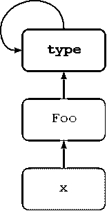

# Python 元类

> 原文：<https://realpython.com/python-metaclasses/>

术语**元编程**指的是程序了解或操纵自身的潜力。Python 支持一种称为**元类**的类元编程形式。

元类是一个深奥的 OOP 概念，隐藏在几乎所有 Python 代码的背后。不管你是否意识到，你都在使用它们。在大多数情况下，你不需要意识到这一点。大多数 Python 程序员很少考虑元类。

然而，当需要时，Python 提供了一种并非所有面向对象语言都支持的功能:您可以在幕后定义自定义元类。自定义元类的使用有些争议，正如 Tim Peters(Python 大师，撰写了 Python 的 [Zen)所说:](https://www.python.org/dev/peps/pep-0020)

> “元类比 99%的用户应该担心的还要神奇。如果你想知道你是否需要他们，你不需要(实际需要他们的人肯定知道他们需要他们，并且不需要关于为什么的解释)。”
> 
> — *蒂姆·彼得斯*

有些 Python 爱好者(众所周知的 Python 爱好者)认为不应该使用自定义元类。这可能有点过了，但是自定义元类在大多数情况下是不必要的，这可能是真的。如果一个问题不太明显需要它们，那么如果用一种更简单的方式来解决，它可能会更干净，更易读。

尽管如此，理解 Python 元类是值得的，因为它通常会导致对 Python 类内部的更好理解。您永远不知道:有一天，您可能会发现自己处于这样一种情况，您只知道自定义元类是您想要的。

**获得通知:**不要错过本教程的后续— [点击这里加入真正的 Python 时事通讯](https://realpython.com/bonus/newsletter-dont-miss-updates/)你会知道下一期什么时候出来。

## 旧式与新式课堂

在 Python 领域，类[可以是两种类型](https://wiki.python.org/moin/NewClassVsClassicClass)中的一种。官方术语尚未确定，因此它们被非正式地称为旧式和新式类。

[*Remove ads*](/account/join/)

### 旧式班级

对于旧式的类，类和类型不是一回事。旧式类的实例总是由一个名为`instance`的内置类型实现。如果`obj`是一个旧式类的实例，`obj.__class__`指定该类，但是`type(obj)`总是`instance`。以下示例摘自 Python 2.7:

>>>

```py
>>> class Foo:
...     pass
...
>>> x = Foo()
>>> x.__class__
<class __main__.Foo at 0x000000000535CC48>
>>> type(x)
<type 'instance'>
```

### 新型班级

新型类统一了类和类型的概念。如果`obj`是一个新型类的实例，`type(obj)`与`obj.__class__`相同:

>>>

```py
>>> class Foo:
...     pass
>>> obj = Foo()
>>> obj.__class__
<class '__main__.Foo'>
>>> type(obj)
<class '__main__.Foo'>
>>> obj.__class__ is type(obj)
True
```

>>>

```py
>>> n = 5
>>> d = { 'x' : 1, 'y' : 2 }

>>> class Foo:
...     pass
...
>>> x = Foo()

>>> for obj in (n, d, x):
...     print(type(obj) is obj.__class__)
...
True
True
True
```

## 类型和等级

在 Python 3 中，所有的类都是新型类。因此，在 Python 3 中，互换引用对象的类型和类是合理的。

**注意:**在 Python 2 中，类默认是旧式的。在 Python 2.2 之前，根本不支持新型类。从 Python 2.2 开始，可以创建它们，但必须显式声明为 new-style。

记住，在 Python 中，一切都是对象。类也是对象。因此，一个类必须有一个类型。一个类的类型是什么？

请考虑以下情况:

>>>

```py
>>> class Foo:
...     pass
...
>>> x = Foo()

>>> type(x)
<class '__main__.Foo'>

>>> type(Foo)
<class 'type'>
```

如你所料，`x`的类型是类`Foo`。但是`Foo`的类型，职业本身，是`type`。一般来说，任何新型类的类型都是`type`。

你熟悉的内置类的类型也是`type`:

>>>

```py
>>> for t in int, float, dict, list, tuple:
...     print(type(t))
...
<class 'type'>
<class 'type'>
<class 'type'>
<class 'type'>
<class 'type'>
```

就此而言，`type`的类型也是`type`(是的，真的):

>>>

```py
>>> type(type)
<class 'type'>
```

是一个元类，其中的类是实例。正如普通对象是一个类的实例一样，Python 中的任何新型类，以及 Python 3 中的任何类，都是`type`元类的实例。

在上述情况下:

*   `x`是类`Foo`的一个实例。
*   `Foo`是`type`元类的一个实例。
*   `type`也是`type`元类的一个实例，所以它是自身的一个实例。

[](https://files.realpython.com/media/class-chain.5cb031a299fe.png)[*Remove ads*](/account/join/)

## 动态定义一个类

当传递一个参数时，内置的`type()`函数返回一个对象的类型。对于新型类，这通常与[对象的`__class__`属性](https://docs.python.org/3/library/stdtypes.html#instance.__class__)相同:

>>>

```py
>>> type(3)
<class 'int'>

>>> type(['foo', 'bar', 'baz'])
<class 'list'>

>>> t = (1, 2, 3, 4, 5)
>>> type(t)
<class 'tuple'>

>>> class Foo:
...     pass
...
>>> type(Foo())
<class '__main__.Foo'>
```

也可以用三个参数调用`type()`—`type(<name>, <bases>, <dct>)`:

*   `<name>`指定类名。这成为了类的`__name__`属性。
*   指定该类继承的基类的元组。这成为了类的`__bases__`属性。
*   `<dct>`指定一个包含类体定义的[名称空间字典](https://realpython.com/python-namespaces-scope/#python-namespace-dictionaries)。这成为了类的`__dict__`属性。

以这种方式调用`type()`会创建一个`type`元类的新实例。换句话说，它动态地创建了一个新类。

在下面的每个例子中，上面的代码片段用`type()`动态定义了一个类，而下面的代码片段用`class`语句以通常的方式定义了这个类。在每种情况下，这两个片段在功能上是等效的。

### 示例 1

在第一个例子中，传递给`type()`的`<bases>`和`<dct>`参数都是空的。没有指定来自任何父类的[继承](https://realpython.com/inheritance-composition-python/)，并且最初在名称空间字典中没有放置任何东西。这是最简单的类定义:

>>>

```py
>>> Foo = type('Foo', (), {})

>>> x = Foo()
>>> x
<__main__.Foo object at 0x04CFAD50>
```

>>>

```py
>>> class Foo:
...     pass
...
>>> x = Foo()
>>> x
<__main__.Foo object at 0x0370AD50>
```

### 示例 2

这里，`<bases>`是一个只有一个元素`Foo`的元组，指定了`Bar`继承的父类。属性`attr`最初放在名称空间字典中:

>>>

```py
>>> Bar = type('Bar', (Foo,), dict(attr=100))

>>> x = Bar()
>>> x.attr
100
>>> x.__class__
<class '__main__.Bar'>
>>> x.__class__.__bases__
(<class '__main__.Foo'>,)
```

>>>

```py
>>> class Bar(Foo):
...     attr = 100
...

>>> x = Bar()
>>> x.attr
100
>>> x.__class__
<class '__main__.Bar'>
>>> x.__class__.__bases__
(<class '__main__.Foo'>,)
```

### 示例 3

这一次，`<bases>`又空了。两个对象通过`<dct>`参数放入名称空间字典。第一个是名为`attr`的属性，第二个是名为`attr_val`的函数，它成为定义的类的方法:

>>>

```py
>>> Foo = type(
...     'Foo',
...     (),
...     {
...         'attr': 100,
...         'attr_val': lambda x : x.attr
...     }
... )

>>> x = Foo()
>>> x.attr
100
>>> x.attr_val()
100
```

>>>

```py
>>> class Foo:
...     attr = 100
...     def attr_val(self):
...         return self.attr
...

>>> x = Foo()
>>> x.attr
100
>>> x.attr_val()
100
```

### 示例 4

Python 中的 [`lambda`只能定义非常简单的函数。在下面的例子中，一个稍微复杂一点的函数在外部定义，然后在名称空间字典中通过名字`f`赋给`attr_val`:](https://dbader.org/blog/python-lambda-functions)

>>>

```py
>>> def f(obj):
...     print('attr =', obj.attr)
...
>>> Foo = type(
...     'Foo',
...     (),
...     {
...         'attr': 100,
...         'attr_val': f
...     }
... )

>>> x = Foo()
>>> x.attr
100
>>> x.attr_val()
attr = 100
```

>>>

```py
>>> def f(obj):
...     print('attr =', obj.attr)
...
>>> class Foo:
...     attr = 100
...     attr_val = f
...

>>> x = Foo()
>>> x.attr
100
>>> x.attr_val()
attr = 100
```

[*Remove ads*](/account/join/)

## 自定义元类

再次考虑这个老生常谈的例子:

>>>

```py
>>> class Foo:
...     pass
...
>>> f = Foo()
```

表达式`Foo()`创建了类`Foo`的一个新实例。当解释器遇到`Foo()`时，会发生以下情况:

*   调用`Foo`的父类的`__call__()`方法。因为`Foo`是一个标准的新型类，它的父类是`type`元类，所以`type`的`__call__()`方法被调用。

*   该`__call__()`方法依次调用以下内容:

    *   `__new__()`
    *   `__init__()`

如果`Foo`没有定义`__new__()`和`__init__()`，则默认方法从`Foo`的祖先继承。但是如果`Foo`确实定义了这些方法，它们会覆盖那些来自祖先的方法，这允许在实例化`Foo`时定制行为。

在下文中，定义了一个名为`new()`的自定义方法，并将其指定为`Foo`的`__new__()`方法:

>>>

```py
>>> def new(cls):
...     x = object.__new__(cls)
...     x.attr = 100
...     return x
...
>>> Foo.__new__ = new

>>> f = Foo()
>>> f.attr
100

>>> g = Foo()
>>> g.attr
100
```

这修改了类`Foo`的实例化行为:每次创建`Foo`的实例时，默认情况下，它用一个名为`attr`的属性初始化，该属性的值为`100`。(像这样的代码更经常出现在`__init__()`方法中，而不是典型的`__new__()`。这个例子是为了演示的目的而设计的。)

现在，正如已经重申的，类也是对象。假设您想在创建类似于`Foo`的类时类似地定制实例化行为。如果您遵循上面的模式，您将再次定义一个自定义方法，并将其指定为类的`__new__()`方法，而`Foo`是该类的一个实例。`Foo`是`type`元类的一个实例，所以代码看起来像这样:

>>>

```py
# Spoiler alert:  This doesn't work!
>>> def new(cls):
...     x = type.__new__(cls)
...     x.attr = 100
...     return x
...
>>> type.__new__ = new
Traceback (most recent call last):
  File "<pyshell#77>", line 1, in <module>
    type.__new__ = new
TypeError: can't set attributes of built-in/extension type 'type'
```

正如您所看到的，您不能重新分配`type`元类的`__new__()`方法。Python 不允许。

这可能是无妨的。是元类，所有新样式的类都是从它派生出来的。不管怎样，你真的不应该再瞎折腾了。但是如果你想定制一个类的实例化，有什么办法呢？

一个可能的解决方案是自定义元类。本质上，你可以定义自己的元类，它从`type`派生而来，然后你可以用它来代替`type`元类。

第一步是定义一个从`type`派生的元类，如下所示:

>>>

```py
>>> class Meta(type):
...     def __new__(cls, name, bases, dct):
...         x = super().__new__(cls, name, bases, dct)
...         x.attr = 100
...         return x
...
```

定义头`class Meta(type):`指定`Meta`来源于`type`。因为`type`是一个元类，所以`Meta`也是一个元类。

注意，已经为`Meta`定义了一个自定义的`__new__()`方法。直接对`type`元类这样做是不可能的。`__new__()`方法执行以下操作:

*   通过`super()`委托给父元类(`type`)的`__new__()`方法来实际创建一个新类
*   将自定义属性`attr`赋值给类，值为`100`
*   返回新创建的类

现在巫术的另一半:定义一个新类`Foo`，并指定它的元类是自定义元类`Meta`，而不是标准元类`type`。这是使用类定义中的`metaclass`关键字完成的，如下所示:

>>>

```py
>>> class Foo(metaclass=Meta):
...     pass
...
>>> Foo.attr
100
```

*瞧！* `Foo`已经从`Meta`元类中自动选取了`attr`属性。当然，您以类似方式定义的任何其他类也会这样做:

>>>

```py
>>> class Bar(metaclass=Meta):
...     pass
...
>>> class Qux(metaclass=Meta):
...     pass
...
>>> Bar.attr, Qux.attr
(100, 100)
```

与类作为创建对象的模板一样，元类也作为创建类的模板。元类有时被称为[类工厂](https://en.wikipedia.org/wiki/Factory_(object-oriented_programming))。

比较以下两个例子:

**对象工厂:**

>>>

```py
>>> class Foo:
...     def __init__(self):
...         self.attr = 100
...

>>> x = Foo()
>>> x.attr
100

>>> y = Foo()
>>> y.attr
100

>>> z = Foo()
>>> z.attr
100
```

**类工厂:**

>>>

```py
>>> class Meta(type):
...     def __init__(
...         cls, name, bases, dct
...     ):
...         cls.attr = 100
...
>>> class X(metaclass=Meta):
...     pass
...
>>> X.attr
100

>>> class Y(metaclass=Meta):
...     pass
...
>>> Y.attr
100

>>> class Z(metaclass=Meta):
...     pass
...
>>> Z.attr
100
```

[*Remove ads*](/account/join/)

## 这真的有必要吗？

尽管上面的类工厂例子很简单，但它是元类工作的本质。它们允许定制类实例化。

尽管如此，仅仅是给每个新创建的类赋予自定义属性`attr`就太麻烦了。为此，您真的需要一个元类吗？

在 Python 中，至少有几种其他方法可以有效地完成同样的事情:

**简单继承:**

>>>

```py
>>> class Base:
...     attr = 100
...

>>> class X(Base):
...     pass
...

>>> class Y(Base):
...     pass
...

>>> class Z(Base):
...     pass
...

>>> X.attr
100
>>> Y.attr
100
>>> Z.attr
100
```

**类装饰器:**

>>>

```py
>>> def decorator(cls):
...     class NewClass(cls):
...         attr = 100
...     return NewClass
...
>>> @decorator
... class X:
...     pass
...
>>> @decorator
... class Y:
...     pass
...
>>> @decorator
... class Z:
...     pass
...

>>> X.attr
100
>>> Y.attr
100
>>> Z.attr
100
```

## 结论

正如 Tim Peters 所建议的，**元类**很容易成为“寻找问题的解决方案”通常没有必要创建自定义元类。如果手头的问题可以用一种更简单的方式来解决，它可能应该是。尽管如此，理解元类还是有好处的，这样你就能大体理解 [Python 类](https://realpython.com/python3-object-oriented-programming/)，并能认识到什么时候元类才是真正适合使用的工具。****