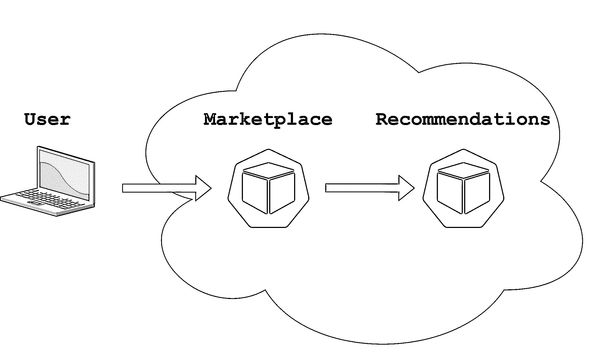
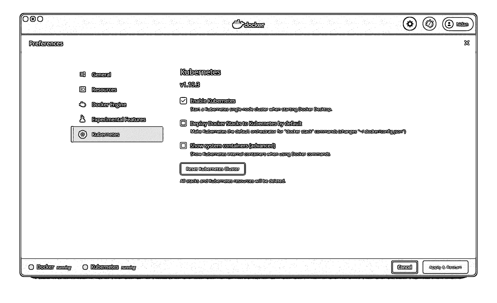

# 使用 gRPC 的 Python 微服务

> 原文：<https://realpython.com/python-microservices-grpc/>

微服务是一种组织复杂软件系统的方式。你不是把你所有的代码都放在一个 app 里，而是把你的 app 分解成独立部署的微服务，互相通信。本教程将教您如何使用 gRPC(最流行的框架之一)启动和运行 Python 微服务。

很好地实现微服务框架很重要。当您构建一个框架来支持关键应用程序时，您必须确保它是健壮的和对开发人员友好的。在本教程中，您将学习如何做到这一点。这些知识会让你对成长中的公司更有价值。

为了从本教程中获益最大，你应该理解 Python 和 [web 应用](https://realpython.com/flask-by-example-part-1-project-setup/)的[基础。如果你想重温这些，请先通读提供的链接。](https://realpython.com/tutorials/basics/)

**本教程结束时，你将能够:**

*   用 Python 实现通过 gRPC 相互通信的**微服务**
*   实现**中间件**来监控微服务
*   **单元测试**和**集成测试**你的微服务和中间件
*   使用 **Kubernetes** 将微服务部署到 Python 生产环境中

您可以通过单击下面的链接下载本教程中使用的所有源代码:

**获取源代码:** [单击此处获取源代码，您将在本教程中使用](https://realpython.com/bonus/python-microservices-code/)了解如何使用 gRPC 创建 Python 微服务。

## 为什么选择微服务？

假设您在 Online Books For You 工作，这是一家流行的在线销售图书的电子商务网站。该公司有数百名开发人员。每个开发人员都在为一些产品或后端功能编写代码，比如管理用户的购物车、生成推荐、处理支付交易或处理仓库库存。

现在问问你自己，你希望所有的代码都在一个巨大的应用程序中吗？这有多难理解？测试需要多长时间？你如何保持代码和数据库模式的合理性？这肯定会很难，尤其是在业务试图快速发展的时候。

难道你不希望对应于模块化产品特性的代码是模块化的吗？管理购物车的购物车微服务。管理库存的库存微服务。

在下面的章节中，您将会更深入地探究将 Python 代码分离到微服务中的一些原因。

[*Remove ads*](/account/join/)

### 模块化

代码更改通常会选择阻力最小的路径。你心爱的在线图书为你 CEO 想增加一个新的买两本书送一本书的功能。你是被要求尽快启动它的团队的一员。看看当所有代码都在一个应用程序中时会发生什么。

作为您团队中最聪明的工程师，您提到您可以向购物车逻辑添加一些代码，以检查购物车中是否有两本书以上。如果是这样，你可以简单地从购物车总额中减去最便宜的书的价格。没问题——你提出一个拉取请求。

然后你的产品经理说你需要跟踪这个活动对图书销售的影响。这也很简单。因为实现买二送一功能的逻辑在购物车代码中，所以您将在 checkout 流中添加一行来更新交易数据库中的一个新列，以表明该销售是促销的一部分:`buy_two_get_one_free_promo = true`。完成了。

接下来，您的产品经理会提醒您，该交易仅对每位客户使用一次有效。您需要添加一些逻辑来检查之前的事务是否设置了那个`buy_two_get_one_free_promo`标志。哦，你需要隐藏主页上的推广横幅，所以你也添加了检查。哦，你还需要[发送电子邮件](https://realpython.com/python-send-email/)给没有使用过该宣传片的人。把那个也加上。

几年后，事务数据库变得太大，需要用新的共享数据库替换。所有这些参考资料都需要修改。不幸的是，在这一点上，整个代码库都引用了这个数据库。你认为添加所有这些引用实际上有点太容易了。

这就是为什么从长远来看，将所有代码放在一个应用程序中是危险的。有时候有界限是好事。

事务数据库应该只能由事务微服务访问。然后，如果你需要缩放它，它不是那么糟糕。代码的其他部分可以通过隐藏实现细节的抽象 API 与事务进行交互。你*可以*在一个应用程序中做到这一点——只是不太可能。代码更改通常会选择阻力最小的路径。

### 灵活性

将 Python 代码拆分成微服务可以给你更多的灵活性。首先，你可以用不同的语言编写你的微服务。通常，一个公司的第一个网络应用程序会用 Ruby 或者 T2 PHP 编写。这并不意味着其他一切都必须如此！

您还可以独立扩展每个微服务。在本教程中，您将使用一个 web 应用程序和一个建议微服务作为运行示例。

你的网络应用很可能会受到 [I/O 的限制](https://en.wikipedia.org/wiki/I/O_bound)，从数据库中获取数据，或许从磁盘中加载模板或其他文件。一个推荐微服务可能正在做大量的数字运算，使其受到 [CPU 的限制](https://en.wikipedia.org/wiki/CPU-bound)。在不同的硬件上运行这两个 Python 微服务是有意义的。

### 鲁棒性

如果你所有的代码都在一个应用程序中，那么你必须立刻部署它。这是很大的风险！这意味着对一小部分代码的修改可能会毁掉整个网站。

### 所有权

当一个单一的代码库被许多人共享时，对于代码的架构通常没有清晰的愿景。在员工来来去去的大公司尤其如此。可能有人对代码应该是什么样子有一个愿景，但是当任何人都可以修改它并且每个人都在快速移动时，很难执行。

微服务的一个好处是团队可以清楚地拥有他们的代码。这使得代码更有可能有一个清晰的愿景，代码也更有条理。它还清楚地表明，当出现问题时，谁负责向代码添加特性或进行更改。

## “微”有多小？

微服务应该有多小是工程师们激烈争论的话题之一。以下是我的两点看法:*微*是用词不当。我们应该只说*服务*。然而，在本教程中，您将看到用于一致性的*微服务*。

把微服务做得太小会出问题。首先，它实际上违背了使代码模块化的目的。微服务中的代码应该一起有意义，就像[类](https://realpython.com/python3-object-oriented-programming/#define-a-class-in-python)中的数据和方法一起有意义一样。

用类做类比，考虑 Python 中的`file`对象。`file`对象拥有您需要的所有方法。你可以用 [`.read()`和`.write()`](https://realpython.com/read-write-files-python/#reading-and-writing-opened-files) 来代替它，或者你可以用`.readlines()`来代替它。你不应该需要一个`FileReader`和一个`FileWriter`类。也许你熟悉这样做的语言，也许你一直认为这有点麻烦和混乱。

微服务也一样。代码的范围应该是正确的。不要太大，也不要太小。

第二，微服务比单片代码更难测试。如果开发人员想要测试一个跨越许多微服务的特性，那么他们需要在他们的开发环境中启动并运行这些特性。这增加了摩擦。对于一些微服务来说，情况还不算太糟，但如果是几十个，那么这将是一个重大问题。

获得正确的微服务规模是一门艺术。需要注意的一点是每个团队都应该拥有合理数量的微服务。如果你的团队有五个人，但是有二十个微服务，那么这是一个危险信号。另一方面，如果你的团队只开发一个微服务，并且被其他五个团队共享，那么这也可能是一个问题。

不要为了做微服务而把微服务做得越小越好。有些微服务可能比较大。但是要注意单个微服务正在做两件或更多完全不相关的事情。这通常是因为向现有微服务添加不相关的功能是阻力最小的途径，而不是因为它属于那里。

这里有一些方法可以将你假想的网上书店分解成微服务:

*   **Marketplace** 为用户在网站中导航提供逻辑服务。
*   **购物车**跟踪用户放入购物车的商品和结账流程。
*   **交易**处理支付处理和发送收据。
*   **Inventory** 提供关于哪些书籍有库存的数据。
*   **用户帐户**管理用户注册和帐户详情，例如更改他们的密码。
*   **评论**存储用户输入的图书评分和评论。

这些只是几个例子，并不是详尽的清单。然而，你可以看到它们中的每一个都可能被自己的团队所拥有，并且它们的逻辑是相对独立的。此外，如果 Reviews 微服务部署时出现了导致其崩溃的错误，那么用户仍然可以使用该网站并进行购买，尽管点评无法加载。

[*Remove ads*](/account/join/)

### 微服务与整体服务的权衡

微服务并不总是比将所有代码保存在一个应用程序中的单片要好。一般来说，尤其是在软件开发生命周期的开始，monoliths 会让你走得更快。它们使共享代码和添加功能变得不那么复杂，并且只需部署一个服务就可以让用户快速获得应用。

权衡的结果是，随着复杂性的增长，所有这些事情会逐渐使整体更难开发，部署更慢，并且更脆弱。实现一个整体可能会节省你的时间和精力，但它可能会回来困扰你。

在 Python 中实现微服务可能会在短期内耗费您的时间和精力，但如果做得好，从长远来看，它可以让您更好地扩展。当然，在速度最重要的时候，过早实施微服务可能会降低您的速度。

典型的硅谷创业周期是从一个整体开始，以便在企业找到适合客户的产品时能够快速迭代。等公司有了成功的产品，雇佣了更多的工程师之后，就该开始考虑微服务了。不要过早实施，但也不要等待太久。

要了解更多关于微服务与整体服务的权衡，请观看 Sam Newman 和 Martin Fowler 的精彩讨论，[何时使用微服务(以及何时不使用！)](https://www.youtube.com/watch?v=GBTdnfD6s5Q)。

### 微服务示例

在本节中，您将为您的在线图书网站定义一些微服务。在本教程中，您将[为它们定义一个 API](https://realpython.com/api-integration-in-python/) ,并编写 Python 代码将它们实现为微服务。

为了便于管理，您将只定义两个微服务:

1.  市场将是一个非常小的网络应用程序，向用户显示图书列表。
2.  **推荐**将是一个微服务，提供用户可能感兴趣的书籍列表。

下图显示了您的用户如何与微服务交互:

[](https://files.realpython.com/media/microservices.78daee973cc1.png)

您可以看到，用户将通过他们的浏览器与 Marketplace 微服务进行交互，Marketplace 微服务将与推荐微服务进行交互。

思考一下推荐 API。您希望建议请求具有一些特征:

*   **用户 ID:** 您可以用它来个性化推荐。然而，为了简单起见，本教程中的所有建议都是随机的。
*   **图书类别:**为了让 API 更有趣，您将添加图书类别，例如推理小说、自助书籍等等。
*   **Max results:** 您不想退回所有库存图书，所以您将为请求添加一个限制。

响应将是一个图书列表。每本书将包含以下数据:

*   **图书 ID:** 图书的唯一数字 ID。
*   **图书标题:**可以向用户显示的标题。

一个真实的网站会有更多的数据，但是为了这个例子，你将保持特征的数量有限。

现在，您可以更正式地定义这个 API，使用**协议缓冲区**的语法:

```py
 1syntax  =  "proto3";
 2
 3enum  BookCategory  {
 4  MYSTERY  =  0;
 5  SCIENCE_FICTION  =  1;
 6  SELF_HELP  =  2;
 7}
 8
 9message  RecommendationRequest  {
10  int32  user_id  =  1;
11  BookCategory  category  =  2;
12  int32  max_results  =  3;
13}
14
15message  BookRecommendation  {
16  int32  id  =  1;
17  string  title  =  2;
18}
19
20message  RecommendationResponse  {
21  repeated  BookRecommendation  recommendations  =  1;
22}
23
24service  Recommendations  {
25  rpc  Recommend  (RecommendationRequest)  returns  (RecommendationResponse);
26}
```

这个[协议缓冲区](https://developers.google.com/protocol-buffers)文件声明了您的 API。协议缓冲区是 Google 开发的，它提供了一种正式指定 API 的方法。这乍一看可能有点神秘，所以下面是一行一行的分析:

*   **第 1 行**指定文件使用`proto3`语法，而不是旧的`proto2`版本。

*   **第 3 行到第 7 行**定义了你的图书类别，每个类别还分配了一个数字 ID。

*   第 9 行到第 13 行定义了您的 API 请求。一个`message`包含字段，每一个都是特定的类型。对于`user_ID`和`max_results`字段，您使用的是一个 32 位整数`int32`。您还使用了上面定义为`category`类型的`BookCategory`枚举。除了每个字段都有名称之外，还会分配一个数字字段 ID。你可以暂时忽略这个。

*   **第 15 到 18 行**定义了一个新的类型，您可以用它来推荐一本书。它有一个 32 位的整数 ID 和一个基于字符串的标题。

*   **第 20 行到第 22 行**定义您的建议微服务响应。注意`repeated`关键字，它表明响应实际上有一个`BookRecommendation`对象的列表。

*   **第 24 到 26 行**定义了 API 的**方法**。你可以把它想象成一个类中的函数或方法。它接受一个`RecommendationRequest`并返回一个`RecommendationResponse`。

`rpc`代表**远程过程调用**。很快您就会看到，您可以像 Python 中的普通函数一样调用 RPC。但是 RPC 的实现在另一个服务器上执行，这就是为什么它是一个*远程*过程调用。

[*Remove ads*](/account/join/)

## 为什么是 RPC 和协议缓冲区？

好吧，那么你为什么要使用这种正式语法来定义你的 API 呢？如果要从一个微服务向另一个微服务发出请求，难道就不能发出一个 [HTTP 请求](https://realpython.com/python-requests/)得到一个 JSON 响应吗？你可以这么做，但是使用协议缓冲区也有好处。

### 文档

使用协议缓冲区的第一个好处是，它们为您的 API 提供了一个定义良好且自我记录的模式。如果您使用 JSON，那么您必须记录它包含的字段及其类型。与任何文档一样，您可能会面临文档不准确、不完整或过期的风险。

当您用协议缓冲区语言编写 API 时，您可以从中生成 Python 代码。您的代码永远不会与您的文档不同步。[文档是好的](https://realpython.com/documenting-python-code/)，但是自文档代码更好。

### 验证

第二个好处是，当您从协议缓冲区生成 Python 代码时，您可以免费获得一些基本的验证。例如，生成的代码不会接受错误类型的字段。生成的代码还内置了所有的 RPC 样板文件。

如果您的 API 使用 HTTP 和 JSON，那么您需要编写一点代码来构造请求、发送请求、等待响应、检查状态代码，并解析和验证响应。使用协议缓冲区，您可以生成看起来像普通的函数调用，但实际上是网络请求的代码。

使用 HTTP 和 JSON 框架，比如 [Swagger](https://swagger.io/about/) 和 [RAML](https://raml.org/about-raml) ，你也可以获得同样的好处。关于 Swagger 的一个例子，请查看带有 Flask、Connexion 和 SQLAlchemy 的[Python REST API。](https://realpython.com/flask-connexion-rest-api/)

那么，是否有理由使用 gRPC 而不是其他替代方案呢？答案还是肯定的。

### 性能

gRPC 框架通常比使用典型的 HTTP 请求更有效。gRPC 构建在 [HTTP/2](https://en.wikipedia.org/wiki/HTTP/2) 之上，它可以以线程安全的方式在一个长期连接上并行发出多个请求。连接设置相对较慢，因此只需设置一次并在多个请求之间共享连接就可以节省时间。gRPC 消息也是二进制的，比 JSON 小。此外，HTTP/2 具有内置的报头压缩。

gRPC 内置了对流式请求和响应的支持。它将比基本的 HTTP 连接更好地管理网络问题，即使在长时间断开连接后也能自动重新连接。它还有**拦截器**，你将在本教程的后面了解到。你甚至可以对生成的代码实现插件，人们已经这样做了，以输出 [Python 类型提示](https://realpython.com/python-type-checking/#hello-types)。基本上，你可以免费获得很多很棒的基础设施！

### 开发者友好型

许多人喜欢 gRPC 胜过 REST 的最有趣的原因可能是，您可以根据[函数](https://realpython.com/defining-your-own-python-function/)来定义您的 API，而不是 HTTP 动词和资源。作为一名工程师，你习惯于从函数调用的角度思考，这正是 gRPC APIs 的样子。

将功能映射到 REST API 上通常很困难。你必须决定你的资源是什么，如何构造路径，以及使用哪些动词。通常有多种选择，比如如何嵌套资源，或者是否使用 POST 或其他动词。REST vs gRPC 可能会变成一场关于偏好的辩论。一个并不总是比另一个更好，所以使用最适合你的用例。

严格来说，*协议缓冲区*是指两个微服务之间发送数据的序列化格式。因此，协议缓冲区类似于 JSON 或 XML，它们是格式化数据的方式。与 JSON 不同，协议缓冲区有严格的模式，通过网络发送时更加紧凑。

另一方面，RPC 基础设施实际上被称为 **gRPC** ，或者 Google RPC。这更类似于 HTTP。事实上，如上所述，gRPC 是建立在 HTTP/2 之上的。

## 实施示例

在讨论了协议缓冲区之后，是时候看看它们能做些什么了。术语*协议缓冲区*很拗口，所以你会看到本教程中常用的简写**协议缓冲区**。

正如几次提到的，您可以从 protobufs 生成 Python 代码。该工具作为`grpcio-tools`包的一部分安装。

首先，定义您的初始目录结构:

```py
.
├── protobufs/
│   └── recommendations.proto
|
└── recommendations/
```

`protobufs/`目录将包含一个名为`recommendations.proto`的文件。这个文件的内容就是上面的 protobuf 代码。为了方便起见，您可以通过展开下面的可折叠部分来查看代码:


```py
 1syntax  =  "proto3";
 2
 3enum  BookCategory  {
 4  MYSTERY  =  0;
 5  SCIENCE_FICTION  =  1;
 6  SELF_HELP  =  2;
 7}
 8
 9message  RecommendationRequest  {
10  int32  user_id  =  1;
11  BookCategory  category  =  2;
12  int32  max_results  =  3;
13}
14
15message  BookRecommendation  {
16  int32  id  =  1;
17  string  title  =  2;
18}
19
20message  RecommendationResponse  {
21  repeated  BookRecommendation  recommendations  =  1;
22}
23
24service  Recommendations  {
25  rpc  Recommend  (RecommendationRequest)  returns  (RecommendationResponse);
26}
```

您将生成 Python 代码，以便在`recommendations/`目录中与之交互。首先你必须安装`grpcio-tools`。创建文件`recommendations/requirements.txt`，并添加以下内容:

```py
grpcio-tools ~= 1.30
```

要在本地运行代码，您需要将依赖项安装到一个虚拟环境中。以下命令将在 Windows 上安装依赖项:

```py
C:\ python -m venv venv
C:\ venv\Scripts\activate.bat
(venv) C:\ python -m pip install -r requirements.txt
```

在 Linux 和 macOS 上，使用以下命令创建虚拟环境并安装依赖项:

```py
$ python3 -m venv venv
$ source venv/bin/activate  # Linux/macOS only
(venv) $ python -m pip install -r requirements.txt
```

现在，要从 protobufs 生成 Python 代码，运行以下代码:

```py
$ cd recommendations
$ python -m grpc_tools.protoc -I ../protobufs --python_out=. \
         --grpc_python_out=. ../protobufs/recommendations.proto
```

这将从`.proto`文件生成几个 Python 文件。这里有一个细目分类:

*   **`python -m grpc_tools.protoc`** 运行 protobuf 编译器，它将从 protobuf 代码生成 Python 代码。
*   **`-I ../protobufs`** 告诉编译器在哪里找到你的 protobuf 代码导入的文件。您实际上并没有使用 import 特性，但是仍然需要使用`-I`标志。
*   **`--python_out=. --grpc_python_out=.`** 告诉编译器将 Python 文件输出到哪里。很快您就会看到，它将生成两个文件，如果您愿意，您可以使用这些选项将每个文件放在一个单独的目录中。
*   **`../protobufs/recommendations.proto`** 是 protobuf 文件的路径，该文件将用于生成 Python 代码。

如果您查看生成的内容，您会看到两个文件:

```py
$ ls
recommendations_pb2.py recommendations_pb2_grpc.py
```

这些文件包括 Python 类型和函数，用于与 API 进行交互。编译器将生成调用 RPC 的客户端代码和实现 RPC 的服务器代码。您将首先查看客户端。

[*Remove ads*](/account/join/)

### RPC 客户端

生成的代码只有主板才会喜欢。也就是说不是很好看的 Python。这是因为它并不真正适合人类阅读。打开 Python shell，查看如何与之交互:

>>>

```py
>>> from recommendations_pb2 import BookCategory, RecommendationRequest
>>> request = RecommendationRequest(
...     user_id=1, category=BookCategory.SCIENCE_FICTION, max_results=3
... )
>>> request.category
1
```

您可以看到 protobuf 编译器生成了与您的 protobuf 类型相对应的 Python 类型。到目前为止，一切顺利。您还可以看到对字段进行了一些类型检查:

>>>

```py
>>> request = RecommendationRequest(
...     user_id="oops", category=BookCategory.SCIENCE_FICTION, max_results=3
... )
Traceback (most recent call last):
  File "<stdin>", line 1, in <module>
TypeError: 'oops' has type str, but expected one of: int, long
```

这表明，如果将错误的类型传递给 protobuf 字段之一，就会得到一个 [TypeError](https://realpython.com/python-traceback/#typeerror) 。

一个重要的注意事项是，`proto3`中的所有字段都是可选的，因此您需要验证它们是否都已设置。如果不设置，那么对于数值类型，它将默认为零，对于字符串，它将默认为空字符串:

>>>

```py
>>> request = RecommendationRequest(
...     user_id=1, category=BookCategory.SCIENCE_FICTION
... )
>>> request.max_results
0
```

这里您得到了`0`,因为这是未设置的`int`字段的默认值。

虽然 protobufs 会为您进行类型检查，但您仍然需要验证实际值。因此，当您实现您的建议微服务时，您应该验证所有字段都有良好的数据。对于任何服务器来说都是如此，不管您使用 protobufs、JSON 还是其他什么。始终验证输入。

为您生成的`recommendations_pb2.py`文件包含类型定义。`recommendations_pb2_grpc.py`文件包含客户端和服务器的框架。看一下创建客户机所需的导入:

>>>

```py
>>> import grpc
>>> from recommendations_pb2_grpc import RecommendationsStub
```

您[导入](https://realpython.com/python-import/)模块`grpc`，该模块提供了一些用于建立到远程服务器的连接的功能。然后导入 RPC 客户端存根。它被称为**存根**，因为客户端本身没有任何功能。它调用远程服务器并将结果传回。

如果你回头看看你的 protobuf 定义，那么你会在最后看到`service Recommendations {...}`部分。protobuf 编译器获取这个微服务名`Recommendations`，并在它后面加上`Stub`，形成客户端名`RecommendationsStub`。

现在，您可以发出 RPC 请求:

>>>

```py
>>> channel = grpc.insecure_channel("localhost:50051")
>>> client = RecommendationsStub(channel)
>>> request = RecommendationRequest(
...     user_id=1, category=BookCategory.SCIENCE_FICTION, max_results=3
... )
>>> client.Recommend(request)
Traceback (most recent call last):
  ...
grpc._channel._InactiveRpcError: <_InactiveRpcError of RPC that terminated with:
 status = StatusCode.UNAVAILABLE
 details = "failed to connect to all addresses"
 ...
```

您在端口`50051`上创建一个到您自己的机器`localhost`的连接。该端口是 gRPC 的标准端口，但是如果您愿意，您可以更改它。现在，您将使用一个不安全的通道，它未经身份验证和加密，但是您将在本教程的后面学习如何使用安全通道。然后将这个通道传递给存根来实例化您的客户机。

您现在可以调用您在`Recommendations`微服务上定义的`Recommend`方法。回想一下 protobuf 定义中的第 25 行:`rpc Recommend (...) returns (...)`。这就是`Recommend`方法的由来。您将得到一个异常，因为实际上没有微服务在`localhost:50051`上运行，所以接下来您将实现它！

既然已经解决了客户端的问题，接下来我们来看看服务器端。

### RPC 服务器

在控制台中测试客户机是一回事，但是在那里实现服务器就有点多了。您可以让您的控制台保持打开，但是您将在一个文件中实现微服务。

从导入和一些数据开始:

```py
 1# recommendations/recommendations.py
 2from concurrent import futures
 3import random
 4
 5import grpc
 6
 7from recommendations_pb2 import (
 8    BookCategory,
 9    BookRecommendation,
10    RecommendationResponse,
11)
12import recommendations_pb2_grpc
13
14books_by_category = {
15    BookCategory.MYSTERY: [
16        BookRecommendation(id=1, title="The Maltese Falcon"),
17        BookRecommendation(id=2, title="Murder on the Orient Express"),
18        BookRecommendation(id=3, title="The Hound of the Baskervilles"),
19    ],
20    BookCategory.SCIENCE_FICTION: [
21        BookRecommendation(
22            id=4, title="The Hitchhiker's Guide to the Galaxy"
23        ),
24        BookRecommendation(id=5, title="Ender's Game"),
25        BookRecommendation(id=6, title="The Dune Chronicles"),
26    ],
27    BookCategory.SELF_HELP: [
28        BookRecommendation(
29            id=7, title="The 7 Habits of Highly Effective People"
30        ),
31        BookRecommendation(
32            id=8, title="How to Win Friends and Influence People"
33        ),
34        BookRecommendation(id=9, title="Man's Search for Meaning"),
35    ],
36}
```

这段代码导入您的依赖项并创建一些示例数据。这里有一个细目分类:

*   **第 2 行**导入`futures`，因为 gRPC 需要一个线程池。你以后会明白的。
*   **第 3 行**导入`random`，因为您将随机选择书籍进行推荐。
*   **第 14 行**创建`books_by_category` [字典](https://realpython.com/python-dicts/)，其中键为图书类别，值为该类别图书的[列表](https://realpython.com/python-lists-tuples/)。在真正的推荐微服务中，书籍将被存储在数据库中。

接下来，您将创建一个实现微服务功能的类:

```py
29class RecommendationService(
30    recommendations_pb2_grpc.RecommendationsServicer
31):
32    def Recommend(self, request, context):
33        if request.category not in books_by_category:
34            context.abort(grpc.StatusCode.NOT_FOUND, "Category not found")
35
36        books_for_category = books_by_category[request.category]
37        num_results = min(request.max_results, len(books_for_category))
38        books_to_recommend = random.sample(
39            books_for_category, num_results
40        )
41
42        return RecommendationResponse(recommendations=books_to_recommend)
```

您已经创建了一个包含实现`Recommend` RPC 的方法的类。以下是详细情况:

*   **第 29 行**定义了`RecommendationService`类。这就是你的微服务的实现。请注意，您子类化了`RecommendationsServicer`。这是您需要做的与 gRPC 集成的一部分。

*   **第 32 行**在你的类上定义了一个`Recommend()`方法。这必须与您在 protobuf 文件中定义的 RPC 同名。它也接受一个`RecommendationRequest`并返回一个`RecommendationResponse`，就像在 protobuf 定义中一样。它还需要一个`context`参数。[上下文](https://grpc.github.io/grpc/python/grpc.html#grpc.ServicerContext)允许您设置响应的状态代码。

*   **第 33 行和第 34 行**使用 [`abort()`](https://grpc.github.io/grpc/python/grpc.html#grpc.ServicerContext.abort) 结束请求，如果您得到一个意外的类别，则将状态代码设置为`NOT_FOUND`。因为 gRPC 构建在 HTTP/2 之上，所以状态代码类似于标准的 HTTP 状态代码。设置它允许客户端根据它收到的代码采取不同的操作。它还允许中间件(如监控系统)记录有多少请求有错误。

*   **第 36 至 40 行**从给定的类别中随机挑选一些书籍推荐。请确保将推荐数量限制在`max_results`以内。你使用 [`min()`](https://realpython.com/python-min-and-max/) 来确保你不会要求比实际更多的书，否则`random.sample`就会出错。

*   **第 38 行**T3】返回一个`RecommendationResponse`对象和你的书籍推荐列表。

注意，[在错误条件下引发一个异常](https://realpython.com/python-exceptions/)比像本例中那样使用`abort()`更好，但是这样的响应不会正确设置状态码。有一种方法可以解决这个问题，在本教程的后面，当您查看拦截器时，您将会看到这种方法。

`RecommendationService`类定义了你的微服务实现，但是你仍然需要运行它。这就是`serve()`的作用:

```py
41def serve():
42    server = grpc.server(futures.ThreadPoolExecutor(max_workers=10))
43    recommendations_pb2_grpc.add_RecommendationsServicer_to_server(
44        RecommendationService(), server
45    )
46    server.add_insecure_port("[::]:50051")
47    server.start()
48    server.wait_for_termination()
49
50
51if __name__ == "__main__":
52    serve()
```

`serve()`启动网络服务器并使用您的微服务类来处理请求:

*   **第 42 行**创建一个 gRPC 服务器。您告诉它使用`10`线程来服务请求，这对于这个演示来说完全是多余的，但是对于实际的 Python 微服务来说是一个很好的默认设置。
*   第 43 行将你的类与服务器关联起来。这就像为请求添加一个处理程序。
*   **第 46 行**告诉服务器在端口`50051`上运行。如前所述，这是 gRPC 的标准端口，但是您可以使用任何您喜欢的端口。
*   **47 和 48 线**调用`server.start()`和`server.wait_for_termination()`启动微服务，等待微服务停止。在这种情况下，停止它的唯一方法是在终端中键入 `Ctrl` + `C` 。在生产环境中，有更好的关闭方法，稍后您将会看到。

在不关闭用于测试客户端的终端的情况下，打开一个新的终端并运行以下命令:

```py
$ python recommendations.py
```

这将运行建议微服务，以便您可以在一些实际数据上测试客户端。现在返回到您用来测试客户机的终端，这样您就可以创建通道存根了。如果您让控制台保持打开状态，那么您可以跳过导入，但这里会重复这些内容作为复习:

>>>

```py
>>> import grpc
>>> from recommendations_pb2_grpc import RecommendationsStub
>>> channel = grpc.insecure_channel("localhost:50051")
>>> client = RecommendationsStub(channel)
```

现在您有了一个客户机对象，您可以发出一个请求:

>>>

```py
>>> request = RecommendationRequest(
...    user_id=1, category=BookCategory.SCIENCE_FICTION, max_results=3)
>>> client.Recommend(request)
recommendations {
 id: 6
 title: "The Dune Chronicles"
}
recommendations {
 id: 4
 title: "The Hitchhiker\'s Guide To The Galaxy"
}
recommendations {
 id: 5
 title: "Ender\'s Game"
}
```

有用！你向你的微服务发出 RPC 请求，得到了响应！请注意，您看到的输出可能会有所不同，因为推荐是随机选择的。

现在您已经实现了服务器，您可以实现 Marketplace 微服务并让它调用建议微服务。如果您愿意，现在可以关闭 Python 控制台，但让建议微服务保持运行。

[*Remove ads*](/account/join/)

### 把它绑在一起

为您的 Marketplace 微服务创建一个新的`marketplace/`目录，并在其中放入一个`marketplace.py`文件。您的目录树现在应该如下所示:

```py
.
├── marketplace/
│   ├── marketplace.py
│   ├── requirements.txt
│   └── templates/
│       └── homepage.html
|
├── protobufs/
│   └── recommendations.proto
|
└── recommendations/
    ├── recommendations.py
    ├── recommendations_pb2.py
    ├── recommendations_pb2_grpc.py
    └── requirements.txt
```

请注意您的微服务代码`requirements.txt`的新`marketplace/`目录和一个主页。所有这些都将在下面描述。您现在可以为它们创建空文件，以后再填充它们。

可以从微服务代码开始。Marketplace 微服务将是一个向用户显示网页的应用程序。它将调用推荐微服务来获取图书推荐，并显示在页面上。

打开`marketplace/marketplace.py`文件并添加以下内容:

```py
 1# marketplace/marketplace.py
 2import os
 3
 4from flask import Flask, render_template
 5import grpc
 6
 7from recommendations_pb2 import BookCategory, RecommendationRequest
 8from recommendations_pb2_grpc import RecommendationsStub
 9
10app = Flask(__name__)
11
12recommendations_host = os.getenv("RECOMMENDATIONS_HOST", "localhost")
13recommendations_channel = grpc.insecure_channel(
14    f"{recommendations_host}:50051"
15)
16recommendations_client = RecommendationsStub(recommendations_channel)
17
18
19@app.route("/")
20def render_homepage():
21    recommendations_request = RecommendationRequest(
22        user_id=1, category=BookCategory.MYSTERY, max_results=3
23    )
24    recommendations_response = recommendations_client.Recommend(
25        recommendations_request
26    )
27    return render_template(
28        "homepage.html",
29        recommendations=recommendations_response.recommendations,
30    )
```

您设置了 Flask，创建了一个 gRPC 客户机，并添加了一个函数来呈现主页。这里有一个细目分类:

*   **第 10 行**创建一个 Flask app，为用户呈现网页。
*   **第 12 行到第 16 行**创建您的 gRPC 通道和存根。
*   **第 20 到 30 行**创建当用户访问你的应用程序的主页时被调用的`render_homepage()`。它返回一个从模板加载的 HTML 页面，带有三个科幻书籍推荐。

**注意:**在本例中，您将 gRPC 通道和存根创建为[全局变量](https://realpython.com/python-scope-legb-rule/#modules-the-global-scope)。通常全局变量是不允许的，但是在这种情况下，例外是允许的。

gRPC 通道保持与服务器的持久连接，以避免必须重复连接的开销。它可以处理许多同时发生的请求，并将重新建立丢失的连接。但是，如果您在每次请求之前创建一个新的通道，那么 Python 将对它进行垃圾收集，您将无法获得持久连接的大部分好处。

您希望通道保持开放，这样就不需要为每个请求重新连接到建议微服务。您可以将通道隐藏在另一个模块中，但是在这种情况下，因为您只有一个文件，所以您可以通过使用全局变量来简化事情。

打开您的`marketplace/templates/`目录中的`homepage.html`文件，并添加以下 HTML:

```py
 1<!-- homepage.html -->
 2<!doctype html>
 3<html lang="en">
 4<head>
 5    <title>Online Books For You</title>
 6</head>
 7<body>
 8    <h1>Mystery books you may like</h1>
 9    <ul>
10    
11        <li>{{ book.title }}</li>
12    
13    </ul>
14</body>
```

这只是一个演示主页。当你完成后，它会显示一个书籍推荐列表。

要运行这段代码，您需要以下依赖项，您可以将它们添加到`marketplace/requirements.txt`:

```py
flask ~= 1.1
grpcio-tools ~= 1.30
Jinja2 ~= 2.11
pytest ~= 5.4
```

推荐和市场微服务都有自己的`requirements.txt`，但是为了方便起见，在本教程中，您可以为两者使用相同的虚拟环境。运行以下命令来更新您的虚拟环境:

```py
$ python -m pip install -r marketplace/requirements.txt
```

既然已经安装了依赖项，那么还需要在`marketplace/`目录中为 protobufs 生成代码。为此，请在控制台中运行以下命令:

```py
$ cd marketplace
$ python -m grpc_tools.protoc -I ../protobufs --python_out=. \
         --grpc_python_out=. ../protobufs/recommendations.proto
```

这与您之前运行的命令相同，因此这里没有什么新内容。在`marketplace/`和`recommendations/`目录中有相同的文件可能会感觉奇怪，但是稍后您将看到如何在部署中自动生成这些文件。您通常不会将它们存储在像 Git 这样的版本控制系统中。

要运行 Marketplace 微服务，请在控制台中输入以下内容:

```py
$ FLASK_APP=marketplace.py flask run
```

现在，您应该在两个独立的控制台中运行推荐和市场微服务。如果您关闭了建议微服务，请使用以下命令在另一个控制台中重新启动它:

```py
$ cd recommendations
$ python recommendations.py
```

这将运行您的 Flask 应用程序，该应用程序默认运行在端口`5000`上。继续，在浏览器中打开它并检查它:

[](https://files.realpython.com/media/marketplace-homepage.8a407ff88b80.png)

您现在有两个微服务在相互对话！但是它们仍然只是在你的开发机器上。接下来，您将学习如何将它们应用到生产环境中。

你可以在运行 Python 微服务的终端输入 `Ctrl` + `C` 来停止它们。接下来您将在 [Docker](https://realpython.com/docker-in-action-fitter-happier-more-productive/) 中运行这些，这就是它们在生产环境中的运行方式。

[*Remove ads*](/account/join/)

## 生产就绪 Python 微服务

此时，您的开发机器上运行着一个 Python 微服务架构，这对于测试来说非常好。在本节中，您将让它在云中运行。

### 码头工人

Docker 是一项了不起的技术，可以让你将一组进程与同一台机器上的其他进程隔离开来。您可以有两组或更多组进程，它们有自己的文件系统、网络端口等等。你可以把它想象成一个 Python 虚拟环境，但对整个系统来说更安全。

Docker 非常适合部署 Python 微服务，因为您可以打包所有依赖项，并在隔离的环境中运行微服务。当你将你的微服务部署到云中时，它可以和其他微服务运行在同一台机器上，而不会互相影响。这允许更好的资源利用。

本教程不会深入介绍 Docker，因为它需要一整本书来介绍。相反，您只需了解将 Python 微服务部署到云中所需的基础知识。关于 Docker 的更多信息，可以查看 [Python Docker 教程](https://realpython.com/tutorials/docker/)。

在开始之前，如果你想在你的机器上继续，那么确保你已经安装了 Docker。可以从[官网](https://docs.docker.com/get-docker/)下载。

您将创建两个 Docker **图像**，一个用于市场微服务，另一个用于推荐微服务。映像基本上是一个文件系统加上一些元数据。本质上，你的每个微服务都有一个迷你 Linux 环境。它可以在不影响实际文件系统的情况下写入文件，并在不与其他进程冲突的情况下打开端口。

要创建您的图像，您需要定义一个`Dockerfile`。你总是从一个有一些基本东西的基础图像开始。在这种情况下，您的基本映像将包含一个 Python 解释器。然后将文件从开发机器复制到 Docker 映像中。您还可以在 Docker 映像中运行命令。这对于安装依赖项很有用。

#### 推荐`Dockerfile`

您将从创建建议微服务 Docker 映像开始。创建`recommendations/Dockerfile`并添加以下内容:

```py
 1FROM  python
 2
 3RUN  mkdir /service
 4COPY  protobufs/ /service/protobufs/
 5COPY  recommendations/ /service/recommendations/
 6WORKDIR  /service/recommendations
 7RUN  python -m pip install --upgrade pip
 8RUN  python -m pip install -r requirements.txt
 9RUN  python -m grpc_tools.protoc -I ../protobufs --python_out=. \
10           --grpc_python_out=. ../protobufs/recommendations.proto
11
12EXPOSE  50051
13ENTRYPOINT  [  "python",  "recommendations.py"  ]
```

下面是一行一行的演练:

*   **第 1 行**用一个基本的 Linux 环境加上最新版本的 Python 来初始化你的映像。此时，您的映像具有典型的 Linux 文件系统布局。如果你往里面看，它会有`/bin`、`/home`，以及你所期望的所有基本文件。

*   **第 3 行**在`/service`创建一个新目录来包含你的微服务代码。

*   **第 4 行和第 5 行**将`protobufs/`和`recommendations/`目录复制到`/service`中。

*   **第 6 行**给 Docker 一个`WORKDIR /service/recommendations`指令，有点像在图像内部做一个`cd`。你给 Docker 的任何路径都将相对于这个位置，当你运行一个命令时，它将在这个目录中运行。

*   **第 7 行**更新 [`pip`](https://realpython.com/what-is-pip/) 以避免关于旧版本的警告。

*   **第 8 行**告诉 Docker 在图像内部运行`pip install -r requirements.txt`。这将把所有的`grpcio-tools`文件以及您可能添加的任何其他包添加到映像中。请注意，您没有使用虚拟环境，因为这是不必要的。在这个映像中唯一运行的将是你的微服务，所以你不需要进一步隔离它的环境。

*   **第 9 行**运行`python -m grpc_tools.protoc`命令从 protobuf 文件生成 Python 文件。映像中的`/service`目录现在看起来像这样:

    ```py
    /service/
    |
    ├── protobufs/
    │   └── recommendations.proto
    |
    └── recommendations/
        ├── recommendations.py
        ├── recommendations_pb2.py
        ├── recommendations_pb2_grpc.py
        └── requirements.txt` 
    ```

*   **第 12 行**告诉 Docker，您将在端口`50051`上运行一个微服务，并且您想要在映像之外公开它。

*   **第 13 行**告诉 Docker 如何运行你的微服务。

现在您可以从您的`Dockerfile`生成一个 Docker 图像。从包含所有代码的目录中运行下面的命令——不是在`recommendations/`目录中，而是在该目录的上一级:

```py
$ docker build . -f recommendations/Dockerfile -t recommendations
```

这将为建议微服务构建 Docker 映像。当 Docker 构建图像时，您应该会看到一些输出。现在您可以运行它了:

```py
$ docker run -p 127.0.0.1:50051:50051/tcp recommendations
```

您不会看到任何输出，但是您的推荐微服务现在正在 Docker 容器中运行。当你运行一个图像时，你得到一个容器。您可以多次运行该图像以获得多个容器，但是仍然只有一个图像。

`-p 127.0.0.1:50051:50051/tcp`选项告诉 Docker 将机器上端口`50051`上的 [TCP 连接](https://en.wikipedia.org/wiki/Transmission_Control_Protocol)转发到容器内的端口`50051`。这为您提供了在机器上转发不同端口的灵活性。

例如，如果您正在运行两个容器，它们都在端口`50051`上运行 Python 微服务，那么您将需要在您的主机上使用两个不同的端口。这是因为两个进程不能同时打开同一个端口，除非它们在不同的容器中。

#### 市场`Dockerfile`

接下来，你将建立你的市场形象。创建`marketplace/Dockerfile`并添加以下内容:

```py
 1FROM  python
 2
 3RUN  mkdir /service
 4COPY  protobufs/ /service/protobufs/
 5COPY  marketplace/ /service/marketplace/
 6WORKDIR  /service/marketplace
 7RUN  python -m pip install --upgrade pip
 8RUN  python -m pip install -r requirements.txt
 9RUN  python -m grpc_tools.protoc -I ../protobufs --python_out=. \
10           --grpc_python_out=. ../protobufs/recommendations.proto
11
12EXPOSE  5000
13ENV  FLASK_APP=marketplace.py
14ENTRYPOINT  [  "flask",  "run",  "--host=0.0.0.0"]
```

这与建议`Dockerfile`非常相似，但有几点不同:

*   **第 13 行**使用`ENV FLASK_APP=marketplace.py`设置图像内部的环境变量`FLASK_APP`。弗拉斯克需要这个来运行。
*   **第 14 行**将`--host=0.0.0.0`添加到`flask run`命令中。如果不添加这个，那么 Flask 将只接受来自本地主机的连接。

但是等等，你不是还在`localhost`上运行一切吗？不完全是。当您运行 Docker 容器时，默认情况下它与您的主机是隔离的。集装箱内的`localhost`与集装箱外的`localhost`不同，即使在同一台机器上。这就是为什么你需要告诉 Flask 接受来自任何地方的连接。

去打开一个新的终端。您可以使用以下命令构建您的市场形象:

```py
$ docker build . -f marketplace/Dockerfile -t marketplace
```

这创造了市场形象。现在，您可以使用以下命令在容器中运行它:

```py
$ docker run -p 127.0.0.1:5000:5000/tcp marketplace
```

您不会看到任何输出，但是您的 Marketplace 微服务现在正在运行。

[*Remove ads*](/account/join/)

### 联网

不幸的是，即使你的推荐和市场容器都在运行，如果你现在在浏览器中进入`http://localhost:5000`，你会得到一个错误。您可以连接到您的 Marketplace 微服务，但它无法再连接到建议微服务。容器是隔离的。

幸运的是，Docker 提供了一个解决方案。您可以创建一个虚拟网络，并将两个容器都添加到其中。您还可以为他们提供 DNS 名称，以便他们可以找到彼此。

下面，您将创建一个名为`microservices`的网络，并在其上运行建议微服务。您还将为其指定 DNS 名称`recommendations`。首先，用 `Ctrl` + `C` 停止当前运行的容器。然后运行以下命令:

```py
$ docker network create microservices
$ docker run -p 127.0.0.1:50051:50051/tcp --network microservices \
             --name recommendations recommendations
```

`docker network create`命令创建网络。你只需要这样做一次，然后你可以连接多个容器。然后将`‑‑network microservices`添加到`docker run`命令中，以启动这个网络上的容器。`‑‑name recommendations`选项赋予它 DNS 名称`recommendations`。

在重启 marketplace 容器之前，您需要更改代码。这是因为您在来自`marketplace.py`的这一行中硬编码了`localhost:50051`:

```py
recommendations_channel = grpc.insecure_channel("localhost:50051")
```

现在你想连接到`recommendations:50051`而不是。但是，您可以从环境变量中加载它，而不是再次硬编码。用下面的两行替换上面的行:

```py
recommendations_host = os.getenv("RECOMMENDATIONS_HOST", "localhost")
recommendations_channel = grpc.insecure_channel(
    f"{recommendations_host}:50051"
)
```

这将在环境变量`RECOMMENDATIONS_HOST`中加载建议微服务的主机名。如果没有设置，那么可以默认为`localhost`。这允许您直接在机器上或在容器中运行相同的代码。

由于更改了代码，您需要重新构建市场映像。然后尝试在您的网络上运行它:

```py
$ docker build . -f marketplace/Dockerfile -t marketplace
$ docker run -p 127.0.0.1:5000:5000/tcp --network microservices \
             -e RECOMMENDATIONS_HOST=recommendations marketplace
```

这与您之前运行它的方式相似，但是有两个不同之处:

1.  您添加了`‑‑network microservices`选项，以便在与您的建议微服务相同的网络上运行它。您没有添加`‑‑name`选项，因为与推荐微服务不同，不需要查找市场微服务的 IP 地址。`-p 127.0.0.1:5000:5000/tcp`提供的端口转发就够了，不需要 DNS 名称。

2.  您添加了`-e RECOMMENDATIONS_HOST=recommendations`，它在容器内部设置环境变量。这就是将建议微服务的主机名传递给代码的方式。

此时，您可以在浏览器中再次尝试`localhost:5000`，它应该会正确加载。万岁。

### 坞站组成〔t0〕

你可以用 Docker 做到这一切，这很神奇，但是有点繁琐。如果有一个命令可以启动所有的容器，那就太好了。幸好有！它叫做`docker-compose`，是 Docker 项目的一部分。

您可以在 YAML 文件中声明您的微服务，而不是运行一堆命令来构建映像、创建网络和运行容器:

```py
 1version:  "3.8" 2services: 3
 4  marketplace: 5  build: 6  context:  . 7  dockerfile:  marketplace/Dockerfile 8  environment: 9  RECOMMENDATIONS_HOST:  recommendations 10  image:  marketplace 11  networks: 12  -  microservices 13  ports: 14  -  5000:5000 15
16  recommendations: 17  build: 18  context:  . 19  dockerfile:  recommendations/Dockerfile 20  image:  recommendations 21  networks: 22  -  microservices 23
24networks: 25  microservices:
```

通常，您将它放入一个名为`docker-compose.yaml`的文件中。将它放在项目的根目录中:

```py
.
├── marketplace/
│   ├── marketplace.py
│   ├── requirements.txt
│   └── templates/
│       └── homepage.html
|
├── protobufs/
│   └── recommendations.proto
|
├── recommendations/
│   ├── recommendations.py
│   ├── recommendations_pb2.py
│   ├── recommendations_pb2_grpc.py
│   └── requirements.txt
│
└── docker-compose.yaml
```

本教程不会涉及太多语法细节，因为它在其他地方有很好的文档。它实际上只是做了你已经手动做过的同样的事情。然而，现在您只需要运行一个命令来启动您的网络和容器:

```py
$ docker-compose up
```

一旦运行完毕，你应该能够在浏览器中再次打开`localhost:5000`,并且一切都应该运行良好。

请注意，当`recommendations`容器与 Marketplace 微服务在同一个网络中时，您不需要在容器中公开`50051`,因此您可以删除这一部分。

**注意:**用`docker-compose`开发时，如果你更改了任何一个文件，那么运行`docker-compose build`来重建镜像。如果你运行`docker-compose up`，它将使用旧的图像，这可能会令人困惑。

如果您想在向上移动之前停止`docker-compose`进行一些编辑，请按 `Ctrl` + `C` 。

[*Remove ads*](/account/join/)

### 测试

为了[单元测试](https://realpython.com/python-testing/)你的 Python 微服务，你可以实例化你的微服务类并调用它的方法。这里有一个针对您的`RecommendationService`实现的基本示例测试:

```py
 1# recommendations/recommendations_test.py
 2from recommendations import RecommendationService
 3
 4from recommendations_pb2 import BookCategory, RecommendationRequest
 5
 6def test_recommendations():
 7    service = RecommendationService()
 8    request = RecommendationRequest(
 9        user_id=1, category=BookCategory.MYSTERY, max_results=1
10    )
11    response = service.Recommend(request, None)
12    assert len(response.recommendations) == 1
```

这里有一个细目分类:

*   第 6 行像实例化其他类一样实例化该类，并在其上调用方法。
*   **第 11 行**为上下文传递 [`None`](https://realpython.com/null-in-python/) ，只要不使用就行。如果您想测试使用上下文的代码路径，那么您可以模拟它。

集成测试包括使用多个未模拟出来的微服务运行自动化测试。所以这有点复杂，但并不难。添加一个`marketplace/marketplace_integration_test.py`文件:

```py
from urllib.request import urlopen

def test_render_homepage():
    homepage_html = urlopen("http://localhost:5000").read().decode("utf-8")
    assert "<title>Online Books For You</title>" in homepage_html
    assert homepage_html.count("<li>") == 3
```

这会向主页 URL 发出一个 HTTP 请求，并检查它是否返回了一些带有标题和三个`<li>`项目符号元素的 HTML。这不是最大的测试，因为如果页面上有更多的内容，它就不太容易维护，但是它证明了一点。只有当建议微服务启动并运行时，此测试才会通过。您甚至可以通过向 Marketplace 微服务发出 HTTP 请求来测试它。

那么，如何运行这种类型的测试呢？幸运的是，Docker 的好心人也提供了这样的方法。一旦使用`docker-compose`运行 Python 微服务，就可以使用`docker-compose exec`在其中运行命令。因此，如果您想在`marketplace`容器中运行您的集成测试，您可以运行以下命令:

```py
$ docker-compose build
$ docker-compose up
$ docker-compose exec marketplace pytest marketplace_integration_test.py
```

这将在`marketplace`容器中运行`pytest`命令。因为您的集成测试连接到`localhost`，所以您需要在与微服务相同的容器中运行它。

### 部署到 Kubernetes

太好了！现在，您的计算机上运行了几个微服务。您可以快速启动它们，并对它们运行集成测试。但是你需要让他们进入生产环境。为此，您将使用 [Kubernetes](https://kubernetes.io/docs/concepts/overview/what-is-kubernetes/) 。

本教程不会深入讨论 Kubernetes，因为这是一个很大的主题，其他地方有全面的文档和教程。然而，在本节中，您将找到将 Python 微服务部署到云中的 Kubernetes 集群的基础知识。

**注意:**要将 Docker 映像部署到云提供商，您需要将您的 Docker 映像推送到像 [Docker Hub](https://hub.docker.com/) 这样的**映像注册中心**。

以下示例使用了本教程中的图像，这些图像已经被推送到 Docker Hub。如果你想改变它们，或者如果你想创建自己的微服务，那么你需要在 Docker Hub 上创建一个帐户，这样你就可以推送图像。如果你愿意，你也可以创建一个私人注册中心，或者使用另一个注册中心，比如亚马逊的 ECR。

#### 立方结构〔t0〕

您可以从`kubernetes.yaml`中的最小 Kubernetes 配置开始。完整的文件有点长，但它由四个不同的部分组成，所以您将逐个查看它们:

```py
 1--- 2apiVersion:  apps/v1 3kind:  Deployment 4metadata: 5  name:  marketplace 6  labels: 7  app:  marketplace 8spec: 9  replicas:  3 10  selector: 11  matchLabels: 12  app:  marketplace 13  template: 14  metadata: 15  labels: 16  app:  marketplace 17  spec: 18  containers: 19  -  name:  marketplace 20  image:  hidan/python-microservices-article-marketplace:0.1 21  env: 22  -  name:  RECOMMENDATIONS_HOST 23  value:  recommendations
```

这为市场微服务定义了一个**部署**。一个[部署](https://kubernetes.io/docs/concepts/workloads/controllers/deployment/)告诉 Kubernetes 如何部署你的代码。Kubernetes 需要四条主要信息:

1.  要部署什么 Docker 映像
2.  要部署多少个实例
3.  微服务需要什么样的环境变量
4.  如何识别你的微服务

你可以告诉 Kubernetes 如何通过使用**标签**来识别你的微服务。虽然这里没有显示，但是你也可以告诉 Kubernetes 你的微服务需要什么内存和 CPU 资源。您可以在 [Kubernetes 文档](https://kubernetes.io/docs/home/)中找到许多其他选项。

下面是代码中发生的情况:

*   **第 9 行**告诉 Kubernetes 为你的微服务创建多少个 pod。一个 **pod** 基本上是一个隔离的执行环境，就像作为一组容器实现的轻量级虚拟机。设置`replicas: 3`为每个微服务提供三个 pod。拥有多台机器可以实现冗余，无需停机即可滚动更新，可以根据需要扩展更多机器，并在一台机器出现故障时进行故障转移。

*   **第 20 行**是要部署的 Docker 映像。您必须在图像注册表中使用 Docker 图像。要在那里获得您的图像，您必须将其推送到图像注册中心。当你在 Docker Hub 上登录你的账户时，有关于如何做到这一点的说明。

建议微服务的部署非常相似:

```py
24--- 25apiVersion:  apps/v1 26kind:  Deployment 27metadata: 28  name:  recommendations 29  labels: 30  app:  recommendations 31spec: 32  replicas:  3 33  selector: 34  matchLabels: 35  app:  recommendations 36  template: 37  metadata: 38  labels: 39  app:  recommendations 40  spec: 41  containers: 42  -  name:  recommendations 43  image:  hidan/python-microservices-article-recommendations:0.1
```

主要区别是一个用名字`marketplace`，一个用`recommendations`。您还在`marketplace`部署上设置了`RECOMMENDATIONS_HOST`环境变量，但是没有在`recommendations`部署上设置。

接下来，为推荐微服务定义一个**服务**。部署告诉 Kubernetes 如何部署您的代码，而服务告诉它如何将请求路由到它。为了避免与通常用来谈论微服务的术语*服务*混淆，当提到 Kubernetes 服务时，您会看到这个词被大写。

以下是`recommendations`的服务定义:

```py
44--- 45apiVersion:  v1 46kind:  Service 47metadata: 48  name:  recommendations 49spec: 50  selector: 51  app:  recommendations 52  ports: 53  -  protocol:  TCP 54  port:  50051 55  targetPort:  50051
```

下面是定义中发生的情况:

*   **第 48 行:**当您创建一个服务时，Kubernetes 实际上会在集群中创建一个具有相同`name`的 DNS 主机名。因此集群中的任何微服务都可以向`recommendations`发送请求。Kubernetes 会将此请求转发到您的部署中的一个单元。

*   **第 51 行:**该行将服务连接到部署。它告诉 Kubernetes 将对`recommendations`的请求转发到`recommendations`部署中的一个 pod。这必须匹配部署的`labels`中的一个键值对。

`marketplace`服务是类似的:

```py
56--- 57apiVersion:  v1 58kind:  Service 59metadata: 60  name:  marketplace 61spec: 62  type:  LoadBalancer 63  selector: 64  app:  marketplace 65  ports: 66  -  protocol:  TCP 67  port:  5000 68  targetPort:  5000
```

除了名称和端口，只有一个区别。您会注意到`type: LoadBalancer`只出现在`marketplace`服务中。这是因为`marketplace`需要从 Kubernetes 集群外部访问，而`recommendations`只需要在集群内部访问。

**注意:**在有很多微服务的大型集群中，使用 **`Ingress`** 服务比使用 **`LoadBalancer`** 服务更常见。如果你在企业环境中开发微服务，那么这可能是一条可行之路。

查看 Sandeep Dinesh 的文章 [Kubernetes 节点端口 vs 负载平衡器 vs 入口？什么时候该用什么？](https://medium.com/google-cloud/kubernetes-nodeport-vs-loadbalancer-vs-ingress-when-should-i-use-what-922f010849e0)了解更多信息。

您可以通过展开下面的框来查看完整的文件:


```py
 1--- 2apiVersion:  apps/v1 3kind:  Deployment 4metadata: 5  name:  marketplace 6  labels: 7  app:  marketplace 8spec: 9  replicas:  3 10  selector: 11  matchLabels: 12  app:  marketplace 13  template: 14  metadata: 15  labels: 16  app:  marketplace 17  spec: 18  containers: 19  -  name:  marketplace 20  image:  hidan/python-microservices-article-marketplace:0.1 21  env: 22  -  name:  RECOMMENDATIONS_HOST 23  value:  recommendations 24--- 25apiVersion:  apps/v1 26kind:  Deployment 27metadata: 28  name:  recommendations 29  labels: 30  app:  recommendations 31spec: 32  replicas:  3 33  selector: 34  matchLabels: 35  app:  recommendations 36  template: 37  metadata: 38  labels: 39  app:  recommendations 40  spec: 41  containers: 42  -  name:  recommendations 43  image:  hidan/python-microservices-article-recommendations:0.1 44--- 45apiVersion:  v1 46kind:  Service 47metadata: 48  name:  recommendations 49spec: 50  selector: 51  app:  recommendations 52  ports: 53  -  protocol:  TCP 54  port:  50051 55  targetPort:  50051 56--- 57apiVersion:  v1 58kind:  Service 59metadata: 60  name:  marketplace 61spec: 62  type:  LoadBalancer 63  selector: 64  app:  marketplace 65  ports: 66  -  protocol:  TCP 67  port:  5000 68  targetPort:  5000
```

现在您已经有了 Kubernetes 配置，下一步是部署它！

#### 部署 Kubernetes

您通常使用云提供商来部署 Kubernetes。有很多云提供商可以选择，包括[谷歌 Kubernetes 引擎(GKE)](https://cloud.google.com/kubernetes-engine) 、[亚马逊弹性 Kubernetes 服务(EKS)](https://aws.amazon.com/eks/) 、[数字海洋](https://www.digitalocean.com/products/)。

如果您在自己的公司部署微服务，那么您使用的云提供商可能会由您的基础架构决定。对于这个演示，您将在本地运行 Kubernetes。几乎一切都将和使用云提供商一样。

如果你在 Mac 或 Windows 上运行 Docker Desktop，那么它会附带一个本地 Kubernetes 集群，你可以在 Preferences 菜单中启用它。通过点按系统托盘中的 Docker 图标打开偏好设置，然后找到 Kubernetes 部分并启用它:

[](https://files.realpython.com/media/kubernetes-mac.a36802f7d5ee.png)

如果你运行的是 Linux，那么你可以安装 [minikube](https://kubernetes.io/docs/tasks/tools/install-minikube/) 。按照[起始页](https://minikube.sigs.k8s.io/docs/start/)上的说明进行设置。

创建集群后，可以使用以下命令部署微服务:

```py
$ kubectl apply -f kubernetes.yaml
```

如果你想尝试在云中部署到 Kubernetes，DigitalOcean 是设置最简单的，并且有一个简单的定价模型。你可以[注册](https://m.do.co/c/dbc05eee48eb)账户，然后[点击几下就可以创建一个 Kubernetes 集群](https://cloud.digitalocean.com/kubernetes/clusters/new)。如果您更改默认值，只使用一个节点和最便宜的选项，那么在撰写本文时，成本仅为每小时 0.015 美元。

按照 DigitalOcean 提供的说明为`kubectl`下载一个配置文件并运行上面的命令。然后你可以点击 DigitalOcean 中的 *Kubernetes* 按钮来查看你的服务在那里运行。DigitalOcean 将为您的`LoadBalancer`服务分配一个 IP 地址，因此您可以通过将该 IP 地址复制到浏览器中来访问您的 Marketplace 应用程序。

**重要提示:**当你完成后，销毁你的集群，这样你就不会继续被收费。您还应该转到 Networking 选项卡并销毁负载平衡器，它独立于群集，但也会产生费用。

部署到库伯内特斯。接下来，您将学习如何监控 Python 微服务。

[*Remove ads*](/account/join/)

## 使用拦截器的 Python 微服务监控

一旦你在云中有了一些微服务，你就想要了解它们的运行情况。您希望监控的一些内容包括:

*   每个微服务收到多少请求
*   有多少请求会导致错误，它们会引发什么类型的错误
*   每个请求的延迟
*   异常日志，以便您以后进行调试

在下面几节中，您将了解到实现这一点的几种方法。

### 为什么不是装修工

有一种方法可以做到这一点，对 Python 开发人员来说最自然的方法是为每个微服务端点添加一个[装饰器](https://realpython.com/primer-on-python-decorators/)。然而，在这种情况下，使用 decorators 有几个缺点:

*   新微服务的开发人员必须记住将它们添加到每个方法中。
*   如果你有很多监控，那么你可能会有一堆装饰器。
*   如果你有一个 decorators 的堆栈，那么开发者可能会以错误的顺序堆叠它们。
*   您可以将所有的监控整合到一个装饰器中，但是这样会很麻烦。

这一堆装饰器是你想要避免的:

```py
 1class RecommendationService(recommendations_pb2_grpc.RecommendationsServicer):
 2    @catch_and_log_exceptions
 3    @log_request_counts
 4    @log_latency
 5    def Recommend(self, request, context):
 6        ...
```

在每个方法上都有这一堆装饰器是丑陋和重复的，并且违反了[干编程原则](https://en.wikipedia.org/wiki/Don%27t_repeat_yourself):不要重复自己。装饰者也是一个编写挑战，尤其是如果他们接受参数的话。

### 截击机

有一种使用装饰器的替代方法，您将在本教程中学习:gRPC 有一个**拦截器**的概念，它提供了类似于装饰器的功能，但方式更简洁。

#### 实现拦截器

不幸的是，gRPC 的 Python 实现为拦截器提供了一个相当复杂的 [API。这是因为它的](https://grpc.github.io/grpc/python/grpc.html#service-side-interceptor)[非常灵活](https://github.com/grpc/proposal/blob/master/L13-python-interceptors.md#server-side-implementation)。但是，有一个 [`grpc-interceptor`](https://pypi.org/project/grpc-interceptor/) 包可以简化它们。为了充分披露，我是作者。

将它与 [`pytest`](https://realpython.com/pytest-python-testing/) 一起添加到您的`recommendations/requirements.txt`中，您很快就会用到它们:

```py
grpc-interceptor ~= 0.12.0
grpcio-tools ~= 1.30
pytest ~= 5.4
```

然后更新您的虚拟环境:

```py
$ python -m pip install recommendations/requirements.txt
```

现在可以用下面的代码创建一个拦截器。您不需要将它添加到您的项目中，因为它只是一个示例:

```py
 1from grpc_interceptor import ServerInterceptor
 2
 3class ErrorLogger(ServerInterceptor):
 4    def intercept(self, method, request, context, method_name):
 5        try:
 6            return method(request, context)
 7        except Exception as e:
 8            self.log_error(e)
 9            raise
10
11    def log_error(self, e: Exception) -> None:
12        # ...
```

每当调用微服务中未处理的异常时，它都会调用`log_error()`。例如，您可以通过将异常记录到[岗哨](https://sentry.io/features/stacktrace/)来实现这一点，这样当它们发生时，您就可以得到警告和调试信息。

要使用这个拦截器，您应该像这样将它传递给`grpc.server()`:

```py
interceptors = [ErrorLogger()]
server = grpc.server(futures.ThreadPoolExecutor(max_workers=10),
                     interceptors=interceptors)
```

有了这段代码，Python 微服务的每个请求和响应都将通过拦截器，因此您可以计算它收到了多少请求和错误。

`grpc-interceptor`还为每个 gRPC 状态代码提供了一个异常和一个名为`ExceptionToStatusInterceptor`的拦截器。如果微服务引发其中一个异常，那么`ExceptionToStatusInterceptor`将设置 gRPC 状态代码。这使您可以通过对`recommendations/recommendations.py`进行以下突出显示的更改来简化您的微服务:

```py
 1from grpc_interceptor import ExceptionToStatusInterceptor 2from grpc_interceptor.exceptions import NotFound 3
 4# ...
 5
 6class RecommendationService(recommendations_pb2_grpc.RecommendationsServicer):
 7    def Recommend(self, request, context):
 8        if request.category not in books_by_category:
 9            raise NotFound("Category not found") 10
11        books_for_category = books_by_category[request.category]
12        num_results = min(request.max_results, len(books_for_category))
13        books_to_recommend = random.sample(books_for_category, num_results)
14
15        return RecommendationResponse(recommendations=books_to_recommend)
16
17def serve():
18    interceptors = [ExceptionToStatusInterceptor()] 19    server = grpc.server( 20        futures.ThreadPoolExecutor(max_workers=10),
21        interceptors=interceptors
22    )
23    # ...
```

这样可读性更强。您还可以从调用堆栈中的许多函数中抛出异常，而不必传递`context`，这样您就可以调用`context.abort()`。您也不必在您的微服务中自己捕捉异常——拦截器会为您捕捉它。

#### 测试拦截器

如果您想编写自己的拦截器，那么您应该测试它们。但是在测试拦截器这样的东西时，过多地模仿是危险的。例如，您可以在测试中调用`.intercept()`,并确保它返回您想要的结果，但是这不会测试真实的输入，或者它们甚至根本不会被调用。

为了改进测试，您可以运行带有拦截器的 gRPC 微服务。`grpc-interceptor`包提供了一个框架来完成这项工作。下面，您将为`ErrorLogger`拦截器编写一个测试。这只是一个示例，所以您不需要将其添加到项目中。如果您要添加它，那么您应该将它添加到测试文件中。

下面是如何为拦截器编写测试的方法:

```py
 1from grpc_interceptor.testing import dummy_client, DummyRequest, raises
 2
 3class MockErrorLogger(ErrorLogger):
 4    def __init__(self):
 5        self.logged_exception = None
 6
 7    def log_error(self, e: Exception) -> None:
 8        self.logged_exception = e
 9
10def test_log_error():
11    mock = MockErrorLogger()
12    ex = Exception()
13    special_cases = {"error": raises(ex)}
14
15    with dummy_client(special_cases=special_cases, interceptors=[mock]) as client:
16        # Test no exception
17        assert client.Execute(DummyRequest(input="foo")).output == "foo"
18        assert mock.logged_exception is None
19
20        # Test exception
21        with pytest.raises(grpc.RpcError) as e:
22            client.Execute(DummyRequest(input="error"))
23        assert mock.logged_exception is ex
```

这里有一个演练:

*   **第 3 行到第 8 行**子类`ErrorLogger`模仿出`log_error()`。你实际上不希望日志副作用发生。你只是想确保它被调用。

*   **第 15 到 18 行**使用`dummy_client()`上下文管理器创建一个连接到真实 gRPC 微服务的客户端。你发送`DummyRequest`给微服务，它回复`DummyResponse`。默认情况下，`DummyRequest`的`input`回显到`DummyResponse`的`output`。但是，你可以传递给`dummy_client()`一个特殊情况的字典，如果`input`匹配其中一个，那么它将调用你提供的函数并返回结果。

*   **第 21 行到第 23 行:**测试`log_error()`被调用时出现了预期的异常。`raises()`返回引发所提供异常的另一个函数。您将`input`设置为`error`，这样微服务就会引发一个异常。

关于测试的更多信息，你可以阅读[用 Pytest 进行有效的 Python 测试](https://realpython.com/pytest-python-testing/)和[了解 Python 模拟对象库](https://realpython.com/python-mock-library/)。

在某些情况下，拦截器的替代方案是使用**服务网格**。它将通过代理发送所有微服务请求和响应，因此代理可以自动记录请求量和错误计数等信息。为了获得准确的错误记录，您的微服务仍然需要正确设置状态代码。所以在某些情况下，您的拦截器可以补充服务网格。一个受欢迎的服务网是 T2 Istio T3。

[*Remove ads*](/account/join/)

## 最佳实践

现在您已经有了一个可以工作的 Python 微服务设置。您可以创建微服务，一起测试它们，将它们部署到 Kubernetes，并用拦截器监控它们。此时，您可以开始创建微服务。但是，您应该记住一些最佳实践，因此您将在本节中学习一些。

### Protobuf 组织

通常，您应该将 protobuf 定义与微服务实现分开。客户端几乎可以用任何语言编写，如果你把你的 protobuf 文件捆绑到一个 [Python wheel](https://realpython.com/python-wheels/) 或者类似的东西中，那么如果有人想要一个 Ruby 或者 Go 客户端，他们将很难得到 protobuf 文件。

即使你所有的代码都是 Python，为什么有人需要为微服务安装包，只是为了给它写一个客户端？

一个解决方案是将 protobuf 文件放在与微服务代码分开的 Git repo 中。许多公司将*所有*微服务的*所有*proto buf 文件放在一个单独的 repo 中。这使得更容易找到所有的微服务，在它们之间共享公共的 protobuf 结构，并创建有用的工具。

如果您选择将 protobuf 文件存储在单个 repo 中，那么您需要注意保持 repo 的有序，并且您一定要避免 Python 微服务之间的循环依赖。

### Protobuf 版本控制

API 版本控制可能很难。最主要的原因是，如果你改变了一个 API，更新了微服务，那么可能仍然会有客户端使用旧的 API。当客户端运行在客户的机器上时，例如移动客户端或桌面软件，情况尤其如此。

不能轻易强迫人家更新。即使你可以，网络延迟会导致竞争条件，并且你的微服务很可能使用旧的 API 来获得请求。好的 API 应该是向后兼容的或者版本化的。

为了实现**向后兼容性**，使用 protobufs 版本 3 的 Python 微服务将接受缺少字段的请求。如果你想增加一个新的领域，那也没问题。您可以先部署微服务，它仍然会接受来自旧 API 的请求，而没有新字段。微服务只需要优雅地处理这个问题。

如果你想做更大的改变，那么你需要**更新**你的 API。Protobufs 允许您将 API 放入一个包名称空间，其中可以包含一个版本号。如果你需要彻底改变 API，那么你可以创建一个新的版本。微服务也可以继续接受旧版本。这允许您推出新的 API 版本，同时逐步淘汰旧版本。

通过遵循这些惯例，你可以避免做出突破性的改变。在公司内部，人们有时认为对 API 进行突破性的修改是可以接受的，因为他们控制了所有的客户。这由您来决定，但请注意，做出突破性的更改需要协调客户端和微服务的部署，这使得回滚变得复杂。

在微服务生命周期的早期，当没有生产客户端时，这是可以接受的。然而，一旦你的微服务对你公司的健康至关重要，养成只做非破坏性改变的习惯是很好的。

### 原蟾蜍林挺

确保你不会对你的 protobufs 做破坏性改变的一个方法是使用 **linter** 。比较流行的一个是 [`buf`](https://buf.build/docs/introduction) 。您可以将此设置为您的 [CI 系统](https://en.wikipedia.org/wiki/Continuous_integration)的一部分，这样您就可以检查拉动式请求中的重大变更。

### 类型检查 Protobuf 生成的代码

Mypy 是一个静态类型检查 Python 代码的项目。如果您不熟悉 Python 中的静态类型检查，那么您可以阅读 [Python 类型检查](https://realpython.com/python-type-checking/#static-type-checking)来了解它的全部内容。

`protoc`生成的代码有点粗糙，而且没有类型注释。如果你试着用 Mypy 检查它，那么你会得到很多错误，而且它不会发现真正的错误，比如拼错的字段名。幸运的是，Dropbox 的好心人写了一个[插件](https://github.com/dropbox/mypy-protobuf)，让`protoc`编译器生成类型存根。这些不应与 gRPC 存根混淆。

为了使用它，您可以安装`mypy-protobuf`包，然后更新命令以生成 protobuf 输出。请注意新的`‑‑mypy_out`选项:

```py
$ python -m grpc_tools.protoc -I ../protobufs --python_out=. \
         --grpc_python_out=. --mypy_out=. ../protobufs/recommendations.proto
```

你的大多数错误应该会消失。您可能仍然会得到一个关于`grpc`包没有类型信息的错误。你可以安装非官方的 [gRPC 类型的存根](https://pypi.org/project/grpc-stubs/)或者添加以下内容到你的 Mypy 配置中:

```py
[mypy-grpc.*] ignore_missing_imports  =  True
```

您仍然可以获得类型检查的大部分好处，比如捕捉拼写错误的字段。这对于在 bug 进入生产之前捕捉它们非常有帮助。

### 优雅地关机

在你的开发机器上运行你的微服务时，你可以按 `Ctrl` + `C` 来停止它。这将导致 Python 解释器引发一个`KeyboardInterrupt`异常。

当 Kubernetes 正在运行你的微服务，需要停止它以推出更新时，它会向你的微服务发送信号。具体来说，它会发出一个`SIGTERM`信号，等待三十秒。如果你的微服务到那时还没有退出，它会发送一个`SIGKILL`信号。

您可以并且应该捕获并处理`SIGTERM`，这样您就可以完成当前请求的处理，但拒绝新的请求。您可以通过将以下代码放入`serve()`中来实现这一点:

```py
 1from signal import signal, SIGTERM
 2
 3...
 4
 5def serve():
 6    server = grpc.server(futures.ThreadPoolExecutor(max_workers=10))
 7    ...
 8    server.add_insecure_port("[::]:50051")
 9    server.start()
10
11    def handle_sigterm(*_):
12        print("Received shutdown signal")
13        all_rpcs_done_event = server.stop(30)
14        all_rpcs_done_event.wait(30)
15        print("Shut down gracefully")
16
17    signal(SIGTERM, handle_sigterm)
18    server.wait_for_termination()
```

这里有一个细目分类:

*   **线 1** 导入`signal`，允许你捕捉和处理来自 Kubernetes 或者几乎任何其他过程的信号。
*   **第 11 行**定义了一个函数来处理`SIGTERM`。该函数将在 Python 接收到`SIGTERM`信号时被调用，Python 将向其传递两个参数。然而，你不需要这些参数，所以用`*_`来忽略它们。
*   **第 13 行**调用`server.stop(30)`优雅地关闭服务器。它将拒绝新的请求，并等待`30`秒，等待当前请求完成。它立即返回，但是它返回一个可以等待的`threading.Event`对象。
*   **第 14 行**等待`Event`对象，这样 Python 就不会过早退出。
*   **第 17 行**注册你的处理程序。

当您部署新版本的微服务时，Kubernetes 会发送信号关闭现有的微服务。处理这些问题以优雅地关闭将确保请求不会被丢弃。

### 安全通道

到目前为止，您一直在使用不安全的 gRPC 通道。这意味着几件事:

1.  客户端无法确认它正在向目标服务器发送请求。有人可以创建一个冒名顶替的微服务，并将其注入客户端可能发送请求的某个地方。例如，他们可能能够将微服务注入到负载平衡器将向其发送请求的 pod 中。

2.  服务器无法确认客户端向其发送请求。只要有人可以连接到服务器，他们就可以向它发送任意 gRPC 请求。

3.  流量是未加密的，因此路由流量的任何节点也可以查看它。

本节将描述如何添加 [TLS](https://en.wikipedia.org/wiki/Transport_Layer_Security) 认证和加密。

**注意:**这不解决用户认证问题，只解决微服务流程。

您将学习两种设置 TLS 的方法:

1.  最简单的方法是，客户端可以验证服务器，但是服务器不验证客户端。
2.  更复杂的方式，使用相互 TLS，客户端和服务器互相验证。

在这两种情况下，流量都是加密的。

#### TLS 基础知识

在深入研究之前，先简要概述一下 TLS:通常，客户端验证服务器。例如，当你访问 Amazon.com 时，你的浏览器会验证这是真的 Amazon.com 而不是冒名顶替者。要做到这一点，客户必须从一个值得信赖的第三方那里得到某种保证，就像只有当你有一个共同的朋友为他们担保时，你才能信任一个新人。

使用 TLS，客户端必须信任一个**证书颁发机构(CA)** 。CA 将对服务器保存的内容进行签名，这样客户端就可以对其进行验证。这有点像你共同的朋友在纸条上签名，而你认出了他们的笔迹。更多信息，请参见[互联网安全如何工作:TLS、SSL 和 CA](https://opensource.com/article/19/11/internet-security-tls-ssl-certificate-authority) 。

您的浏览器隐式信任一些 ca，它们通常是 GoDaddy、DigiCert 或 Verisign 等公司。其他公司，如亚马逊，付钱给 CA 为他们签署数字证书，这样你的浏览器就可以信任他们。通常情况下，CA 会在签署证书之前验证亚马逊是否拥有 Amazon.com。这样，冒名顶替者就不会在 Amazon.com 的证书上签名，你的浏览器也会屏蔽这个网站。

对于微服务，你不能真的要求 CA 签署证书，因为你的微服务运行在内部机器上。CA 可能会很乐意签署证书并向您收费，但问题是这不切实际。在这种情况下，您的公司可以充当自己的 CA。如果 gRPC 客户端拥有由您的公司或您(如果您正在做个人项目)签名的证书，它将信任服务器。

#### 服务器认证

以下命令将创建一个可用于签署服务器证书的 CA 证书:

```py
$ openssl req -x509 -nodes -newkey rsa:4096 -keyout ca.key -out ca.pem \
              -subj /O=me
```

这将输出两个文件:

1.  **`ca.key`** 是私钥。
2.  **`ca.pem`** 是一种公共证书。

然后，您可以为您的服务器创建一个证书，并用您的 CA 证书对其进行签名:

```py
$ openssl req -nodes -newkey rsa:4096 -keyout server.key -out server.csr \
              -subj /CN=recommendations
$ openssl x509 -req -in server.csr -CA ca.pem -CAkey ca.key -set_serial 1 \
              -out server.pem
```

这将产生三个新文件:

1.  **`server.key`** 是服务器的私钥。
2.  **`server.csr`** 是一个中间文件。
3.  **`server.pem`** 是服务器的公共证书。

**注意:**这些命令仅用于举例。私钥是*而不是*加密的。如果您想为您的公司生成证书，请咨询您的安全团队。他们可能有创建、存储和吊销证书的策略，您应该遵循这些策略。

您可以将此添加到推荐微服务`Dockerfile`。很难安全地将秘密添加到 Docker 图像中，但有一种方法可以使用最新版本的 Docker 来做到这一点，如下所示:

```py
 1# syntax = docker/dockerfile:1.0-experimental 2# DOCKER_BUILDKIT=1 docker build . -f recommendations/Dockerfile \ 3#                     -t recommendations --secret id=ca.key,src=ca.key 4
 5FROM  python
 6
 7RUN  mkdir /service
 8COPY  infra/ /service/infra/
 9COPY  protobufs/ /service/protobufs/
10COPY  recommendations/ /service/recommendations/
11COPY  ca.pem /service/recommendations/ 12
13WORKDIR  /service/recommendations
14RUN  python -m pip install --upgrade pip
15RUN  python -m pip install -r requirements.txt
16RUN  python -m grpc_tools.protoc -I ../protobufs --python_out=. \
17           --grpc_python_out=. ../protobufs/recommendations.proto
18RUN  openssl req -nodes -newkey rsa:4096 -subj /CN=recommendations \ 19                -keyout server.key -out server.csr 20RUN  --mount=type=secret,id=ca.key \ 21    openssl x509 -req -in server.csr -CA ca.pem -CAkey /run/secrets/ca.key \ 22                 -set_serial 1 -out server.pem 23
24EXPOSE  50051
25ENTRYPOINT  [  "python",  "recommendations.py"  ]
```

新行将突出显示。这里有一个解释:

*   **需要第 1 行**来启用机密。
*   **第 2 行和第 3 行**显示了如何构建 Docker 映像的命令。
*   **第 11 行**将 CA 公共证书复制到镜像中。
*   **第 18 行和第 19 行**生成新的服务器私有密钥和证书。
*   **第 20 到 22 行**临时加载 CA 私钥，这样您就可以用它来签署服务器的证书。但是，它不会保留在图像中。

**注:**关于`‑‑mount=type=secret`的更多信息，参见 [Docker 文档](https://docs.docker.com/develop/develop-images/build_enhancements/#new-docker-build-secret-information)。将来，这个特性可能会被提升到稳定版本，那时你就不需要在`Dockerfile`中包含`syntax = docker/dockerfile:1.0-experimental`评论了。

根据[版本化策略](https://github.com/moby/buildkit/issues/528)，实验性语法不会消失，所以你可以无限期地继续使用它。

您的映像现在将包含以下文件:

*   `ca.pem`
*   `server.csr`
*   `server.key`
*   `server.pem`

您现在可以更新突出显示的`recommendations.py`中的`serve()`:

```py
 1def serve():
 2    server = grpc.server(futures.ThreadPoolExecutor(max_workers=10))
 3    recommendations_pb2_grpc.add_RecommendationsServicer_to_server(
 4        RecommendationService(), server
 5    )
 6
 7    with open("server.key", "rb") as fp: 8        server_key = fp.read() 9    with open("server.pem", "rb") as fp: 10        server_cert = fp.read() 11
12    creds = grpc.ssl_server_credentials([(server_key, server_cert)]) 13    server.add_secure_port("[::]:443", creds) 14    server.start()
15    server.wait_for_termination()
```

变化如下:

*   **第 7 行到第 10 行**加载服务器的私钥和证书。
*   **第 12 行和第 13 行**使用 TLS 运行服务器。它现在只接受 TLS 加密的连接。

您需要更新`marketplace.py`来加载 CA 证书。现在，您只需要客户端中的公共证书，如突出显示的那样:

```py
 1recommendations_host = os.getenv("RECOMMENDATIONS_HOST", "localhost")
 2with open("ca.pem", "rb") as fp: 3    ca_cert = fp.read() 4creds = grpc.ssl_channel_credentials(ca_cert) 5recommendations_channel = grpc.secure_channel( 6    f"{recommendations_host}:443", creds 7) 8recommendations_client = RecommendationsStub(recommendations_channel)
```

您还需要将`COPY ca.pem /service/marketplace/`添加到市场`Dockerfile`中。

现在可以加密运行客户机和服务器，客户机将验证服务器。为了使运行一切简单明了，您可以使用`docker-compose`。然而，在撰写本文时，`docker-compose` [还不支持建造秘密](https://github.com/docker/compose/issues/6358)。你将不得不手动建立 Docker 图像，而不是用`docker-compose build`。

但是，您仍然可以运行`docker-compose up`。更新`docker-compose.yaml`文件，删除`build`部分:

```py
 1version:  "3.8" 2services: 3
 4  marketplace: 5  environment: 6  RECOMMENDATIONS_HOST:  recommendations 7  # DOCKER_BUILDKIT=1 docker build . -f marketplace/Dockerfile \  8  #                   -t marketplace --secret id=ca.key,src=ca.key  9  image:  marketplace 10  networks: 11  -  microservices 12  ports: 13  -  5000:5000 14
15  recommendations: 16  # DOCKER_BUILDKIT=1 docker build . -f recommendations/Dockerfile \  17  #                   -t recommendations --secret id=ca.key,src=ca.key  18  image:  recommendations 19  networks: 20  -  microservices 21
22networks: 23  microservices:
```

您现在正在加密流量，并验证您是否连接到了正确的服务器。

#### 相互认证

服务器现在证明了它是可信的，但是客户端却不可信。幸运的是，TLS 允许对双方进行验证。更新高亮显示的市场`Dockerfile`:

```py
 1# syntax = docker/dockerfile:1.0-experimental 2# DOCKER_BUILDKIT=1 docker build . -f marketplace/Dockerfile \ 3#                     -t marketplace --secret id=ca.key,src=ca.key 4
 5FROM  python
 6
 7RUN  mkdir /service
 8COPY  protobufs/ /service/protobufs/
 9COPY  marketplace/ /service/marketplace/
10COPY  ca.pem /service/marketplace/
11
12WORKDIR  /service/marketplace
13RUN  python -m pip install -r requirements.txt
14RUN  python -m grpc_tools.protoc -I ../protobufs --python_out=. \
15           --grpc_python_out=. ../protobufs/recommendations.proto
16RUN  openssl req -nodes -newkey rsa:4096 -subj /CN=marketplace \ 17                -keyout client.key -out client.csr 18RUN  --mount=type=secret,id=ca.key \ 19    openssl x509 -req -in client.csr -CA ca.pem -CAkey /run/secrets/ca.key \ 20                 -set_serial 1 -out client.pem 21
22EXPOSE  5000
23ENV  FLASK_APP=marketplace.py
24ENTRYPOINT  [  "flask",  "run",  "--host=0.0.0.0"]
```

这些更改类似于您在上一节中对建议微服务所做的更改。

**注意:**如果您将私有密钥放在 docker 文件中，那么不要将它们放在公共存储库中。最好是在运行时通过网络从只能通过 VPN 访问的服务器上加载私钥。

更新`recommendations.py`中的`serve()`以验证突出显示的客户端:

```py
 1def serve():
 2    server = grpc.server(futures.ThreadPoolExecutor(max_workers=10))
 3    recommendations_pb2_grpc.add_RecommendationsServicer_to_server(
 4        RecommendationService(), server
 5    )
 6
 7    with open("server.key", "rb") as fp:
 8        server_key = fp.read()
 9    with open("server.pem", "rb") as fp:
10        server_cert = fp.read()
11    with open("ca.pem", "rb") as fp: 12        ca_cert = fp.read() 13
14    creds = grpc.ssl_server_credentials( 15        [(server_key, server_cert)], 16        root_certificates=ca_cert, 17        require_client_auth=True, 18    ) 19    server.add_secure_port("[::]:443", creds)
20    server.start()
21    server.wait_for_termination()
```

这将加载 CA 证书并要求客户端验证。

最后，更新`marketplace.py`以将其证书发送到服务器，如突出显示的那样:

```py
 1recommendations_host = os.getenv("RECOMMENDATIONS_HOST", "localhost")
 2with open("client.key", "rb") as fp: 3    client_key = fp.read() 4with open("client.pem", "rb") as fp: 5    client_cert = fp.read() 6with open("ca.pem", "rb") as fp:
 7    ca_cert = fp.read()
 8creds = grpc.ssl_channel_credentials(ca_cert, client_key, client_cert) 9recommendations_channel = grpc.secure_channel(
10    f"{recommendations_host}:443", creds
11)
12recommendations_client = RecommendationsStub(recommendations_channel)
```

这会加载证书并将它们发送到服务器进行验证。

现在，如果您试图用另一个客户端连接到服务器，即使是一个使用 TLS 但具有未知证书的客户端，服务器也会拒绝它，并显示错误`PEER_DID_NOT_RETURN_A_CERTIFICATE`。

**重要提示:**虽然以这种方式管理相互 TLS 是可能的，但要做到这一点并不容易。如果您希望只允许某些微服务向其他微服务发出请求，这将变得特别困难。

如果您需要像这样增强安全性，那么最好使用一个**服务网格**，让它为您管理证书和授权。除了拦截器部分提到的流量监控， [Istio](https://istio.io/latest/docs/concepts/security/) 还可以管理相互 TLS 和每个服务的授权。它也更安全，因为它将为您管理机密，并更频繁地重新颁发证书。

这就完成了微服务之间的安全通信。接下来，您将了解如何将 AsyncIO 与微服务结合使用。

## AsyncIO and gRPC

官方 gRPC 包中缺少 AsyncIO 支持已经很长时间了，但是最近已经添加了。它仍然处于实验阶段，正在积极开发中，但如果你真的想在你的微服务中尝试 AsyncIO，那么它可能是一个不错的选择。您可以查看 gRPC AsyncIO 文档了解更多详细信息。

还有一个名为 [`grpclib`](https://grpclib.readthedocs.io/en/latest/) 的第三方包，它实现了对 gRPC 的 AsyncIO 支持，并且已经存在了很长时间。

在服务器端使用 AsyncIO 要非常小心。很容易一不小心写了**阻塞代码**，让你的微服务瘫痪。作为示范，下面是如何使用 AsyncIO 编写建议微服务，去掉所有逻辑:

```py
 1import time
 2
 3import asyncio
 4import grpc
 5import grpc.experimental.aio
 6
 7from recommendations_pb2 import (
 8    BookCategory,
 9    BookRecommendation,
10    RecommendationResponse,
11)
12import recommendations_pb2_grpc
13
14class AsyncRecommendations(recommendations_pb2_grpc.RecommendationsServicer):
15    async def Recommend(self, request, context):
16        print("Handling request")
17        time.sleep(5)  # Oops, blocking!
18        print("Done")
19        return RecommendationResponse(recommendations=[])
20
21async def main():
22    grpc.experimental.aio.init_grpc_aio()
23    server = grpc.experimental.aio.server()
24    server.add_insecure_port("[::]:50051")
25    recommendations_pb2_grpc.add_RecommendationsServicer_to_server(
26        AsyncRecommendations(), server
27    )
28    await server.start()
29    await server.wait_for_termination()
30
31asyncio.run(main())
```

这段代码中有一个错误。在第 17 行，您意外地在一个`async`函数中进行了一个阻塞调用，这是一个大禁忌。因为 AsyncIO 服务器是单线程的，这阻塞了整个服务器，所以它一次只能处理一个请求。这比线程服务器差多了。

您可以通过发出多个并发请求来证明这一点:

```py
 1from concurrent.futures import ThreadPoolExecutor
 2
 3import grpc
 4
 5from recommendations_pb2 import BookCategory, RecommendationRequest
 6from recommendations_pb2_grpc import RecommendationsStub
 7
 8request = RecommendationRequest(user_id=1, category=BookCategory.MYSTERY)
 9channel = grpc.insecure_channel("localhost:50051")
10client = RecommendationsStub(channel)
11
12executor = ThreadPoolExecutor(max_workers=5)
13a = executor.submit(client.Recommend, request)
14b = executor.submit(client.Recommend, request)
15c = executor.submit(client.Recommend, request)
16d = executor.submit(client.Recommend, request)
17e = executor.submit(client.Recommend, request)
```

这将产生五个并发请求，但是在服务器端，您会看到:

```py
Handling request
Done
Handling request
Done
Handling request
Done
Handling request
Done
Handling request
Done
```

请求是按顺序处理的，这不是您想要的！

在服务器端有 AsyncIO 的用例，但是你必须非常小心不要阻塞。这意味着你不能使用像 [`requests`](https://realpython.com/python-requests/) 这样的标准包，甚至不能对其他微服务进行 RPC，除非你使用 [`run_in_executor`](https://docs.python.org/3/library/asyncio-eventloop.html#asyncio.loop.run_in_executor) 在另一个线程中运行它们。

您还必须小心处理数据库查询。您已经开始使用的许多优秀的 Python 包可能还不支持 AsyncIO，所以要小心检查它们是否支持 AsyncIO。除非您非常需要服务器端的 AsyncIO，否则等到有更多的软件包支持时可能会更安全。阻塞错误可能很难发现。

如果你想了解更多关于 AsyncIO 的知识，那么你可以查看[Python 中的异步特性入门](https://realpython.com/python-async-features/)和[Python 中的异步 IO:完整演练](https://realpython.com/async-io-python/)。

## 结论

微服务是管理复杂系统的一种方式。随着组织的发展，它们成为组织代码的自然方式。了解如何在 Python 中有效地实现微服务，可以让你随着公司的发展而变得更有价值。

**在本教程中，您已经学习了:**

*   如何用 **gRPC** 有效实现 Python 微服务
*   如何将微服务部署到 **Kubernetes**
*   如何将**集成测试**、**拦截器**、 **TLS** 和 **AsyncIO** 等特性整合到您的微服务中
*   创建 Python 微服务时要遵循哪些最佳实践

现在，您已经准备好将较大的 Python 应用程序分解成较小的微服务，使您的代码更有组织性和可维护性。要回顾您在本教程中学到的所有内容，您可以通过单击下面的链接下载示例的源代码:

**获取源代码:** [单击此处获取源代码，您将在本教程中使用](https://realpython.com/bonus/python-microservices-code/)了解如何使用 gRPC 创建 Python 微服务。**********