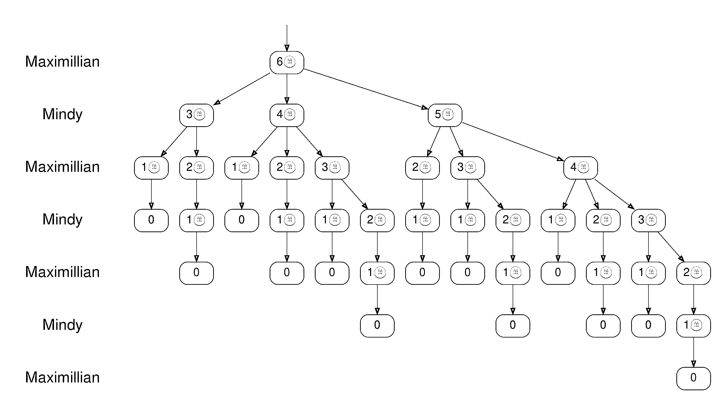
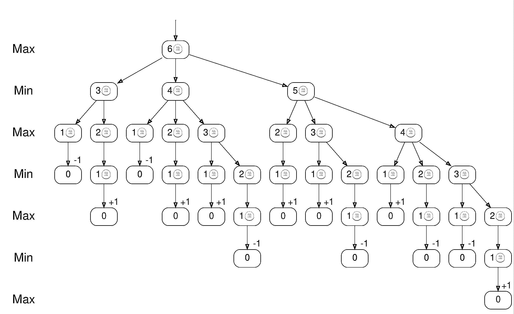
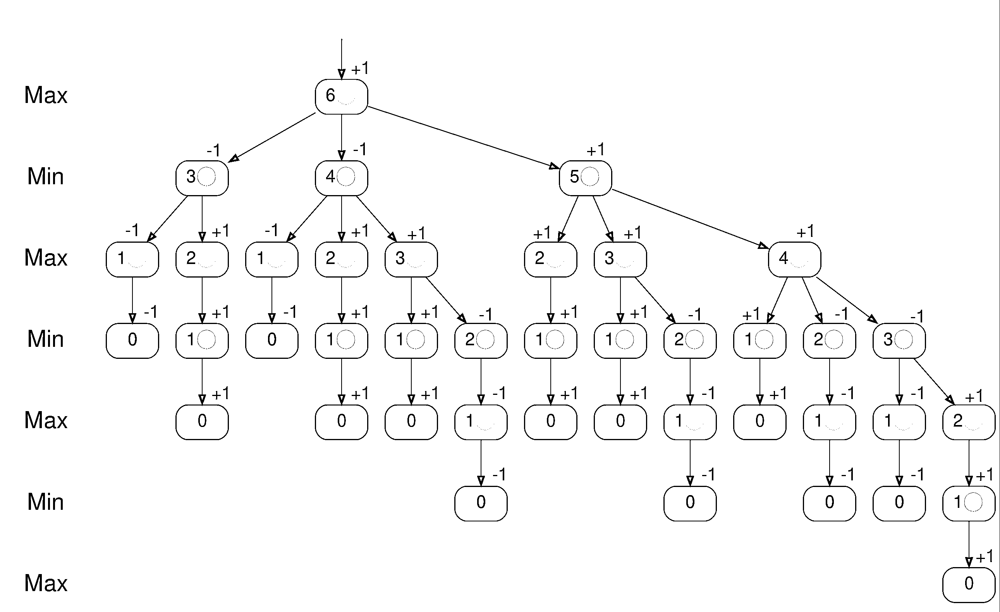
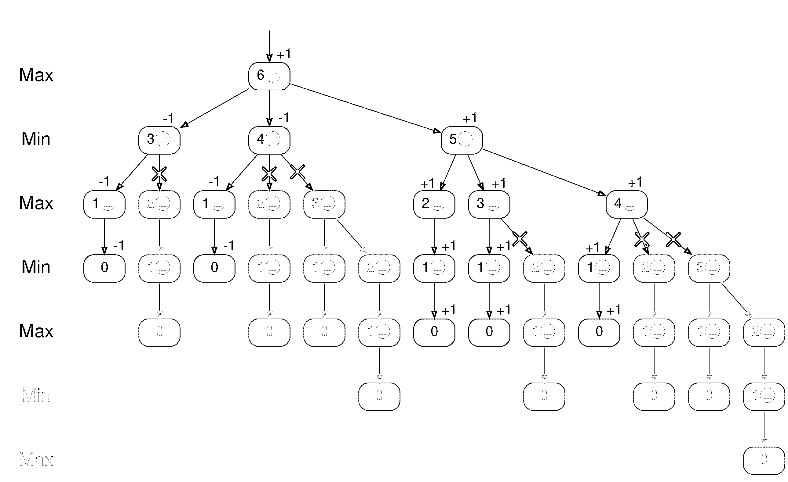

# Python 中的 Minimax:学习如何输掉 Nim 游戏

> 原文：<https://realpython.com/python-minimax-nim/>

游戏很好玩！他们定义明确的规则让你探索不同的策略，寻找必胜的方法。 **minimax 算法**用于选择游戏中任何一点的最佳走法。您将学习如何用 Python 实现一个可以完美地玩 Nim 游戏的 minimax 播放器。

在本教程中，您将关注极小极大。然而，为了形象化算法如何工作，用一个具体的游戏来工作是很好的。您将学习 Nim 的规则，这是一个规则简单、选择有限的游戏。在例子中使用 Nim 可以让你专注于极小极大原则，而不会迷失在游戏规则中。

**随着您学习本教程，您将:**

*   了解**极大极小算法**的原理
*   玩 Nim 的**游戏的几个变种**
*   **实现**极大极小算法
*   在与一名迷你游戏玩家的比赛中，输给了尼姆
*   使用**阿尔法-贝塔剪枝**优化极大极小算法

您可以下载本教程中使用的源代码，以及一个游戏模拟器，在那里您可以通过单击下面的链接与 minimax 对手玩不同的 Nim 变体:

**源代码:** [点击这里下载免费的源代码](https://realpython.com/bonus/python-minimax-nim-code/)，你将使用它来输掉与你的 minimax 玩家的 Nim 游戏。

## 玩一个 Nim 的简化游戏

尼姆的根源可以追溯到很久以前。虽然历史上一直有人玩这种游戏的变体，但尼姆这个名字是在 1901 年查尔斯·l·波顿发表了[尼姆，一种具有完整数学理论的游戏](https://www.jstor.org/stable/1967631)时获得的。

Nim 是两个人的游戏，总是以一个人赢而告终。该游戏由几个放在游戏桌上的计数器组成，玩家轮流移动一个或多个计数器。在本教程的前半部分，您将按照以下规则玩一个简化版的 Nim:

*   共享堆里有几个**计数器**。
*   两名玩家轮流玩**。**
***   在他们的回合中，一名玩家从牌堆中移除**个**、**个**或**个**指示物。*   取得最后一个计数器**的玩家输掉**游戏。*

*你会把这个游戏称为 **Simple-Nim** 。[稍后](#have-fun-with-nim-variants)，你会学到常规 Nim 的规则。它们并不复杂，但很简单——尼姆更容易理解。

**注:**现在该上场了！你将从模拟版本开始，所以在你的桌子上清理出一个空间。玩几局简单的 Nim 游戏，了解一下规则。一路上，留意你遇到的任何获胜策略。

您可以使用任何碰巧可用的对象作为计数器，也可以使用记事本来记录当前计数器的数量。十到二十个柜台是一个游戏的好起点。

如果你附近没有对手，你可以暂时和自己打。在本教程结束时，你将会设计出一个你可以与之对战的对手。

为了演示规则，两名玩家——Mindy 和 Maximillian——将玩一个简单的 Nim 游戏，从 12 个计数器开始。明迪先来:

*   明迪拿了两个计数器，剩下十个。
*   马克西米利安拿走一个计数器，剩下九个。
*   明迪拿了三个计数器，剩下六个。
*   马克西米利安拿了两个指示物，剩下四个。
*   明迪拿了三个计数器，剩下**一个**。
*   马克西米利安拿到最后一个计数器，输掉游戏。

在这场游戏中，马克西米利安占据了最后一个柜台，所以明迪是赢家。

Nim，包括 Simple-Nim，是一个耐人寻味的游戏，因为规则足够简单，游戏完全可以分析。您将使用 Nim 来探索极大极小算法，它能够完美地玩这个游戏。这意味着，如果可能的话，极小极大玩家总是会赢得游戏。

[*Remove ads*](/account/join/)

## 了解 Minimax 算法

游戏已经成为发明和测试人工智能算法的沃土。游戏非常适合这种研究，因为它们有明确定义的规则。最著名的算法之一是[极小极大](https://en.wikipedia.org/wiki/Minimax)。这个名字描述了一个玩家试图最大化他们的分数，而另一个玩家试图最小化他们的分数。

极大极小可以应用于许多不同的游戏和更一般的决策。在本教程中，你将学习如何教 minimax 玩尼姆。然而，你也可以在其他游戏中使用同样的原则，比如[井字游戏](https://realpython.com/tic-tac-toe-python/)和[国际象棋](https://en.wikipedia.org/wiki/Chess)。

### 探索游戏树

回想一下上一节 Mindy 和 Maximillian 玩的游戏。下表显示了游戏的所有步骤:

| 明迪（Minna 的异体）（f.） | 大量 | 姓氏 |
| --- | --- | --- |
|  | 🪙🪙🪙🪙🪙🪙🪙🪙🪙🪙🪙🪙 |  |
| 🪙🪙 | 🪙🪙🪙🪙🪙🪙🪙🪙🪙🪙 |  |
|  | 🪙🪙🪙🪙🪙🪙🪙🪙🪙 | 🪙 |
| 🪙🪙🪙 | 🪙🪙🪙🪙🪙🪙 |  |
|  | 🪙🪙🪙🪙 | 🪙🪙 |
| 🪙🪙🪙 | 🪙 |  |
|  |  | 🪙 |

这个游戏的表现明确地显示了每个玩家在他们的回合中移除了多少个指示物。然而，表中有一些冗余信息。您可以通过记录筹码堆中的筹码数量以及轮到谁来代表同一个游戏:

| 要移动的玩家 | 大量 |
| --- | --- |
| 明迪（Minna 的异体）（f.） | 🪙🪙🪙🪙🪙🪙🪙🪙🪙🪙🪙 (12) |
| 姓氏 | 🪙🪙🪙🪙🪙🪙🪙🪙🪙 (10) |
| 明迪（Minna 的异体）（f.） | 🪙🪙🪙🪙🪙🪙🪙🪙 (9) |
| 姓氏 | 🪙🪙🪙🪙🪙 (6) |
| 明迪（Minna 的异体）（f.） | 🪙🪙🪙 (4) |
| 姓氏 | (1) |

虽然每个玩家在他们的回合中移除的指示物的数量没有明确的说明，但是你可以通过比较回合前后的指示物数量来计算。

这种表示更加简洁。然而，你甚至可以完全避开桌子，用一系列数字来表示游戏: **12-10-9-6-4-1** ，**明迪开始**。你将把这些数字中的每一个称为**游戏状态**。

你现在有一些符号来谈论不同的游戏。接下来，把你的注意力转向赢得游戏的可能策略。例如，当马克西米利安的筹码堆里还剩**六个**筹码时，他会赢吗？

研究 Simple-Nim 的一个好处是**博弈树**不会大得令人望而生畏。游戏树描述了游戏中所有有效的走法。从一堆**六个**计数器开始，只有十三种可能的不同游戏可以玩:

| 姓氏 | 明迪（Minna 的异体）（f.） | 姓氏 | 明迪（Minna 的异体）（f.） | 姓氏 | 明迪（Minna 的异体）（f.） | 姓氏 |
| --- | --- | --- | --- | --- | --- | --- |
| six | three | one | Zero |  |  |  |
| **6🪙** | **3🪙** | **2🪙** | **1🪙** | **0** |  |  |
| six | four | one | Zero |  |  |  |
| **6🪙** | **4🪙** | **2🪙** | **1🪙** | **0** |  |  |
| **6🪙** | **4🪙** | **3🪙** | **1🪙** | **0** |  |  |
| six | four | three | Two | one | Zero |  |
| **6🪙** | **5🪙** | **2🪙** | **1🪙** | **0** |  |  |
| **6🪙** | **5🪙** | **3🪙** | **1🪙** | **0** |  |  |
| six | five | three | Two | one | Zero |  |
| **6🪙** | **5🪙** | **4🪙** | **1🪙** | **0** |  |  |
| six | five | four | Two | one | Zero |  |
| six | five | four | three | one | Zero |  |
| **6🪙** | **5🪙** | **4🪙** | **3🪙** | **2🪙** | **1🪙** | **0** |

表格中的每一列代表一步棋，每一行代表十三种不同游戏中的一种。表格中的数字显示了在玩家行动之前，牌堆中有多少个指示物。粗体行是马克西米连会赢的游戏。

**注:**从技术上讲，可能的游戏比表中所列的要多一些。例如， **6-3** 是一个有效的游戏，其中明蒂拿到最后三个指示物立即输掉游戏。但是在这个分析中，你只会考虑游戏结束时筹码数量减少到**一个**计数器，一个玩家被迫移除，因为你可以合理地假设一个玩家除非迫不得已，否则不会做出失败的举动。

例如，表格中的第一行代表游戏 **6-3-1** ，明蒂获胜，而最后一行代表 **6-5-4-3-2-1** ，每个玩家在他们的回合中只取一个计数器。该表显示了所有可能的游戏，但更有见地的表示是显示所有可能结果的游戏树:

[](https://files.realpython.com/media/minimax_nim_tree_plain.73395737874a.png)

在图中，马克西米利安的转弯用较暗的背景表示。彩色的节点是树上的叶子。它们代表游戏已经结束，剩下**个零**计数器。以红色节点结束的游戏由 Mindy 赢得，以绿色节点结束的游戏由 Maximillian 赢得。

你可以在树上找到和表中一样的十三个游戏。从树的顶部开始，沿着树枝，直到到达标记为 *0* 的叶子节点。每一关都代表进入一个新的游戏状态。顺着最左边的分支可以找到 **6-3-1** 游戏，再往最右边下降可以找到 **6-5-4-3-2-1** 。

马克西米利安赢了十三场比赛中的七场，而明迪赢了另外六场。看起来玩家们应该有几乎均等的机会获胜。尽管如此，马克西米利安有办法确保胜利吗？

[*Remove ads*](/account/join/)

### 找到最佳的下一步棋

把上面的问题重新表述如下:马克西米利安能走一步棋，这样无论明蒂下一步怎么走，他都能赢吗？在上面的树的帮助下，你可以计算出马克西米利安的每一个可能的第一步会发生什么:

*   取三个指示物，在牌堆中留下**三个**指示物:在这种情况下，明蒂可以取两个指示物，迫使马克西米利安输掉游戏。
*   取两个指示物，留**四个**指示物在这堆指示物中:在这种情况下，明蒂可以取三个指示物，迫使马克西米利安输掉游戏。
*   拿走一个指示物，留下五个指示物:在这种情况下，明迪没有立即获胜的行动。相反，马克西米利安对明迪的每一个选择都有制胜一招。

如果马克西米利安拿到一个计数器，并在筹码堆中留下五个筹码，他就能确保胜利！

这种论证形成了**极小极大算法**的基础。你会给两个玩家中的每一个角色，要么是最大化**玩家**，要么是最小化**玩家**。当前玩家想要移动以最大化他们的获胜机会，而他们的对手想要用移动来反击以最小化当前玩家的获胜机会。在这个例子中，马克西米利安是最大化玩家，明蒂是最小化玩家。

为了跟踪游戏，画出所有可能移动的树。你已经为 Simple-Nim 从六个计数器开始做了这件事。然后，给树的所有叶节点分配一个**极大极小值**。在 Simple-Nim 中，这些是剩余**零**计数器的节点。分数将取决于叶节点所代表的结果。

如果最大化玩家赢了游戏，给叶子一个分数 **+1** 。类似地，如果最小化玩家赢了游戏，给叶子 **-1** 打分:

[](https://files.realpython.com/media/minimax_nim_tree_leaves.b0220e36142a.png)

标记为 *Max* 的行中的叶节点——最大化玩家马克西米利安——标记为 **+1** ，而明蒂行中的叶节点标记为 **-1** 。接下来，让极大极小值在树上冒泡。考虑一个节点，其中所有孩子都被分配了一个分数。如果该节点在一个 *Max* 行上，那么给它其子节点的最大值。否则，给它它的孩子的最低分。

如果您对树中的所有节点都这样做，那么您将得到下面的树:

[](https://files.realpython.com/media/minimax_nim_tree_all.52821349219d.png)

因为树的顶端节点 *6🪙* 的分数为正，所以马克西米利安可以赢得比赛。您可以查看顶层节点的子节点，以找到他的最佳移动。 *3🪙* 和 *4🪙* 节点的得分都是 **-1** ，代表明蒂获胜。Maximillian 应该保留**五个**计数器，因为 *5🪙* 节点是得分为 **+1** 的顶层节点的唯一子节点。

虽然在为 Nim 优化时只使用了-1 和+1 的最小最大值，但通常可以使用任何范围的数字。例如，在分析像井字游戏这样可能以平局结束的游戏时，您可能希望使用-1、0 和+1。

许多游戏，包括国际象棋，有如此多不同的可能走法，以至于计算整个游戏树是不可行的。在这些情况下，您只需将树绘制到一定深度，并对这个截断树中的叶节点进行评分。由于这些游戏还没有结束，你不能根据游戏的最终结果来给树叶打分。相反，你会根据对当前职位的一些评估来给他们打分。

在下一节中，您将使用 Python 来计算极大极小分数。

## 在与 Python Minimax 玩家的 Nim 游戏中失败

你已经知道了极大极小算法的步骤。在本节中，您将在 Python 中实现 minimax。您将从直接为 Simple-Nim 游戏定制算法开始。稍后，您将[重构](https://realpython.com/python-refactoring/)您的代码，将算法的核心与游戏规则分离开来，这样您就可以稍后将您的 minimax 代码应用到其他游戏中。

### 实现 Nim 特定的 Minimax 算法

考虑与上一节相同的例子:轮到马克西米利安，桌上有**六个**计数器。您将使用极大极小算法来确认 Maximillan 可以赢得这场游戏，并计算他的下一步行动。

不过，首先考虑几个游戏后期情况的例子。假设轮到马克西米利安，他看到了下面的游戏情况:

*   **零**计数器表示 Mindy 已经使用了最后一个计数器。马克西米利安赢得了比赛。
*   一个计数器没有给 Maximillian 留下任何选择。他拿走了计数器，这样明迪就剩下**零个**计数器了。使用与上一个要点相同的逻辑，但是玩家的角色颠倒了，你会看到 Mindy 赢得了游戏。
*   两个计数器给了马克西米利安一个选择。他可以选择一个或两个指示物，这将分别给明迪留下**一个**或**零个**指示物。从 Mindy 的角度重做前面要点的逻辑。你会注意到，如果马克西米利安拿了一个指示物，他就会留下**一个**指示物，并赢得游戏。如果他拿了两个指示物，他就剩下**零个**指示物，明蒂赢得游戏。

请注意，您是如何重用前面要点中的逻辑来确定谁能从特定的游戏位置中胜出的。现在开始用 Python 实现逻辑。创建一个名为`minimax_simplenim.py`的文件。您将使用`state`来表示计数器的数量，使用`max_turn`来记录是否轮到马克西米利安。

第一个规则，对于**零**计数器，可以实现为[条件`if`测试](https://realpython.com/python-conditional-statements/)。如果马克西米利安赢了游戏，你返回`1`，如果他输了，你返回`-1`:

```py
# minimax_simplenim.py

def minimax(state, max_turn):
    if state == 0:
        return 1 if max_turn else -1

    # ...
```

接下来，思考如何处理一个或多个计数器的游戏情况。他们减少到一种或多种状态，有更少的指示物，对手先移动。例如，如果现在轮到马克西米利安，考虑他可能的走法的结果，并选择最佳走法:

```py
# minimax_simplenim.py

def minimax(state, max_turn):
    if state == 0:
        return 1 if max_turn else -1

 possible_new_states = [ state - take for take in (1, 2, 3) if take <= state ] if max_turn: scores = [ minimax(new_state, max_turn=False) for new_state in possible_new_states ] return max(scores) 
    # ...
```

你将首先列举可能的新状态，确保玩家不会使用超过可用数量的计数器。你通过再次调用`minimax()`来计算 Maximillian 可能的移动的分数，注意下一个将轮到 Mindy。因为 Maximillian 是最大化玩家，你将返回他可能得分的最大值。

同样，如果现在轮到 Mindy，考虑她可能的选择。因为`-1`表示她赢了，所以她会选择得分最低的结果:

```py
# minimax_simplenim.py

def minimax(state, max_turn):
    if state == 0:
        return 1 if max_turn else -1

    possible_new_states = [
        state - take for take in (1, 2, 3) if take <= state
    ]
    if max_turn:
        scores = [
            minimax(new_state, max_turn=False)
            for new_state in possible_new_states
        ]
        return max(scores)
 else: scores = [ minimax(new_state, max_turn=True) for new_state in possible_new_states ] return min(scores)
```

`minimax()`函数不断调用自己，直到到达每局游戏结束。换句话说，`minimax()`是一个**递归**函数。

**注意:**实现一个[递归](https://realpython.com/python-recursion/)函数是遍历树的一种直观方式，因为探索一棵树的一个分支与探索更大的树是相同的操作。

然而，递归函数有一些问题，特别是对于较大的树。在 Python 中，函数调用有一些开销，[调用栈](https://en.wikipedia.org/wiki/Call_stack)是有限的。

稍后您将看到如何应对这些问题[。但是如果你需要优化极大极小算法的速度，极大极小的非递归实现](#optimize-minimax-with-alpha-beta-pruning)[可能是一个更好的选择。](https://realpython.com/python-recursion/#traverse-a-nested-list-non-recursively)

首先确认`minimax()`按预期工作。打开[REPL](https://realpython.com/interacting-with-python/#using-the-python-interpreter-interactively)Python 和[导入](https://realpython.com/python-import/#basic-python-import)你的功能:

>>>

```py
>>> from minimax_simplenim import minimax
>>> minimax(6, max_turn=True)
1

>>> minimax(5, max_turn=False)
1

>>> minimax(4, max_turn=False)
-1
```

你首先确认，如果马克西米利安在**还剩六个**指示物的情况下玩游戏，他可以赢，如`1`所示。同样，如果马克西米利安为明迪留下**五个**筹码，他仍然可以赢。相反，如果他给明迪留了四个柜台，那么她就赢了。

为了有效地找到 Maximillian 下一步应该走哪一步，您可以在一个循环中进行相同的计算:

>>>

```py
>>> state = 6
>>> for take in (1, 2, 3):
...     new_state = state - take
...     score = minimax(new_state, max_turn=False)
...     print(f"Move from {state} to {new_state}: {score}")
...
Move from 6 to 5: 1
Move from 6 to 4: -1
Move from 6 to 3: -1
```

寻找最高分，你看到马克西米利安应该拿一个计数器，在桌上留下**五个**。接下来，更进一步，创建一个可以找到 Maximillian 最佳移动的函数:

```py
# minimax_simplenim.py

# ...

def best_move(state):
    for take in (1, 2, 3):
        new_state = state - take
        score = minimax(new_state, max_turn=False)
        if score > 0:
            break
    return score, new_state
```

你不断循环，直到找到一个给出正分数的走法——实际上，分数是`1`。你也可能在三个可能的走法中循环，却找不到获胜的走法。为了表明这一点，您需要返回分数和最佳移动:

>>>

```py
>>> best_move(6)
(1, 5)

>>> best_move(5)
(-1, 2)
```

测试你的功能，你确认当面对**六个**指示物时，马克西米利安可以通过移除一个指示物并为明迪留下**五个**来赢得游戏。如果桌上有**个**计数器，那么所有的招式都有`-1`分。即使所有的移动都同样糟糕，`best_move()`建议它检查的最后一个移动:取三个指示物，留下**两个**。

回头看看你的`minimax()`和`best_move()`的代码。两个函数都包含处理 minimax 算法的逻辑和处理 Simple-Nim 规则的逻辑。在下一小节中，您将看到如何将它们分开。

[*Remove ads*](/account/join/)

### 重构为一般的极大极小算法

您已经将以下 Simple-Nim 规则编码到您的极大极小算法中:

*   玩家可以在他们的回合中使用一个、两个或三个指示物。
*   玩家不能使用比游戏中剩余数量更多的指示物。
*   当剩下零个计数器时，游戏结束。
*   拿到最后一个计数器的玩家输掉游戏。

此外，您已经使用`max_turn`来跟踪 Maximillian 是否是活动玩家。说得更笼统一点，你可以把现在的玩家想成是想把自己的分数最大化的人。为了表明这一点，您将用`is_maximizing`替换`max_turn`标志。

通过添加两个新函数开始重写代码:

```py
# minimax_simplenim.py

# ...

def possible_new_states(state):
    return [state - take for take in (1, 2, 3) if take <= state]

def evaluate(state, is_maximizing):
    if state == 0:
        return 1 if is_maximizing else -1
```

这两个函数实现了 Simple-Nim 规则。使用`possible_new_states()`，你计算可能的下一个状态，同时确保玩家不能使用比棋盘上可用的计数器更多的计数器。

你用`evaluate()`评估一个游戏位置。如果没有剩余的计数器，那么如果最大化玩家赢了游戏，函数返回`1`,如果另一个最小化玩家赢了，函数返回`-1`。如果游戏没有结束，执行将继续到函数结束并隐式返回 [`None`](https://realpython.com/null-in-python/) 。

你现在可以重写`minimax()`来引用`possible_new_states()`和`evaluate()`:

```py
# minimax_simplenim.py

def minimax(state, is_maximizing):
 if (score := evaluate(state, is_maximizing)) is not None: return score 
    if is_maximizing:
        scores = [
            minimax(new_state, is_maximizing=False)
 for new_state in possible_new_states(state)        ]
        return max(scores)
    else:
        scores = [
            minimax(new_state, is_maximizing=True)
 for new_state in possible_new_states(state)        ]
        return min(scores)
```

记住也要把`max_turn`重命名为`is_maximizing`。

只有当剩下**零个**计数器并且已经决定了赢家的时候，你才能在一个游戏状态中得分。所以你需要检查`score`是否为`None`来决定是继续调用`minimax()`还是退回游戏评价。您使用一个[赋值表达式](https://realpython.com/python-walrus-operator/) ( `:=`)来检查和记忆评估的游戏分数。

接下来，观察您的`if` … `else`语句中的块非常相似。这两个模块之间的唯一区别是，您使用哪个函数 [`max()`或`min()`](https://realpython.com/python-min-and-max/) 来寻找最佳得分，以及在对`minimax()`的递归调用中使用什么值作为`is_maximizing`。这两个都可以直接从`is_maximizing`的电流值计算出来。

因此，您可以将`if` … `else`块折叠成一条语句:

```py
# minimax_simplenim.py

def minimax(state, is_maximizing):
    if (score := evaluate(state, is_maximizing)) is not None:
        return score

 return (max if is_maximizing else min)( minimax(new_state, is_maximizing=not is_maximizing) for new_state in possible_new_states(state) )
```

您使用一个[条件表达式](https://realpython.com/python-conditional-statements/#conditional-expressions-pythons-ternary-operator)来调用`max()`或`min()`。为了反转`is_maximizing`的值，您将`not is_maximizing`传递给对`minimax()`的递归调用。

`minimax()`的代码现在非常紧凑。更重要的是，Simple-Nim 的规则没有明确地编码在算法中。相反，它们被封装在`possible_new_states()`和`evaluate()`中。

通过用`possible_new_states()`和`is_maximizing`代替`max_turn`来表达`best_move()`，你完成了重构:

```py
# minimax_simplenim.py

# ...

def best_move(state):
 for new_state in possible_new_states(state):        score = minimax(new_state, is_maximizing=False)
        if score > 0:
            break
    return score, new_state
```

和以前一样，你检查每一步棋的结果，并返回第一个保证赢的棋。

**注意:**在`best_move()`中没有错误处理。特别是，它假设`possible_new_states()`至少返回一个新的游戏状态。如果没有，那么循环根本不会运行，并且`score`和`new_state`将是未定义的。

这意味着你应该只用一个有效的游戏状态来调用`best_move()`。或者，您可以在`best_move()`本身内部添加一个额外的检查。

在 Python 中，[元组](https://realpython.com/python-lists-tuples/#python-tuples)是逐元素比较的。您可以利用这一点直接使用`max()`,而不是显式检查可能的移动:

```py
# minimax_simplenim.py

# ...

def best_move(state):
    return max(
        (minimax(new_state, is_maximizing=False), new_state)
        for new_state in possible_new_states(state)
    )
```

如前所述，您考虑并返回一个包含分数和最佳新状态的元组。因为包括`max()`在内的比较是在元组中一个元素一个元素地进行的，所以分数必须是元组中的第一个元素。

你仍然能够找到最佳的行动:

>>>

```py
>>> best_move(6)
(1, 5)

>>> best_move(5)
(-1, 4)
```

和以前一样，`best_move()`建议如果你面对**六个**，你应该选择一个计数器。在失去**五个**指示物的情况下，你拿多少指示物并不重要，因为无论如何你都要输了。您基于`max()`的实现最终会在表上留下尽可能多的计数器。

您可以展开下面的框来查看您在本节中实现的完整源代码:


您已经在`possible_new_states()`和`evaluate()`中封装了 Simple-Nim 的规则。这些功能由`minimax()`和`best_move()`使用:

```py
# minimax_simplenim.py

def minimax(state, is_maximizing):
    if (score := evaluate(state, is_maximizing)) is not None:
        return score

    return (max if is_maximizing else min)(
        minimax(new_state, is_maximizing=not is_maximizing)
        for new_state in possible_new_states(state)
    )

def best_move(state):
    return max(
        (minimax(new_state, is_maximizing=False), new_state)
        for new_state in possible_new_states(state)
    )

def possible_new_states(state):
    return [state - take for take in (1, 2, 3) if take <= state]

def evaluate(state, is_maximizing):
    if state == 0:
        return 1 if is_maximizing else -1
```

使用`best_move()`找到给定游戏中的下一步棋。

干得好！您已经为 Simple-Nim 实现了一个极大极小算法。为了挑战它，你应该对你的代码玩几个游戏。从一些指示物开始，轮流自己移除指示物，并使用`best_move()`选择你的虚拟对手将移除多少指示物。除非你玩一个完美的游戏，否则你会输！

在下一节中，您将为 Nim 的常规规则实现相同的算法。

[*Remove ads*](/account/join/)

## 享受 Nim 变体的乐趣

到目前为止，您已经使用并实现了 Simple-Nim。在这一部分，您将学习 Nim 的最常见规则。这会给你的游戏增加更多的变化。

尼姆——有其固定的规则——仍然是一个简单的游戏。但这也是一个令人惊讶的基础游戏。原来，一个名为[公正游戏](https://en.wikipedia.org/wiki/Impartial_game)的游戏家族，本质上都是 Nim 的伪装。

### 玩 Nim 的常规游戏

是时候拉出 **Nim** 的常规了。你仍然可以认出这个游戏，但是它允许玩家有更多的选择:

*   有几个**堆**，每个堆里有若干个**计数器**。
*   两名玩家轮流玩**。**
***   在他们的回合中，一个玩家可以移除任意多的指示物，但是指示物必须来自同一堆。*   取得最后一个计数器**的玩家输掉**游戏。*

*请注意，在一个回合中移除多少个指示物不再有任何限制。如果一堆包含二十个指示物，那么当前玩家可以拿走所有指示物。

作为一个例子，考虑一个游戏，以分别包含**两个**、**三个**和**五个**计数器的**三个**筹码开始。看看你的朋友 Mindy 和 Maximillian 在玩这个游戏:

*   明迪从第三堆拿走四个指示物，剩下**两个**、**三个**、**一个**指示物。
*   马克西米利安从第二堆拿走两个指示物，剩下**两个**、**一个**、**一个**指示物。
*   明迪从第一堆拿走一个计数器，剩下**一个**、**一个**、**一个**计数器。
*   马克西米利安没有留下任何有趣的选择，但从第三堆中取出一个计数器，剩下**一个**、**一个**和**零个**计数器。
*   明迪从第二堆中取出一个计数器，剩下**一个**、**零个**和**零个**计数器。
*   马克西米利安拿走最后一个剩余的指示物，**输掉了**这场游戏。

你可以用表格来表示游戏:

| 要移动的玩家 | 第一堆 | 第二堆 | 三号桩 |
| --- | --- | --- | --- |
| 明迪（Minna 的异体）（f.） | 🪙🪙 | 🪙🪙🪙 | 🪙🪙🪙🪙🪙 |
| 姓氏 | 🪙🪙 | 🪙🪙🪙 | 🪙 |
| 明迪（Minna 的异体）（f.） | 🪙🪙 | 🪙 | 🪙 |
| 姓氏 | 🪙 | 🪙 | 🪙 |
| 明迪（Minna 的异体）（f.） | 🪙 | 🪙 |  |
| 姓氏 | 🪙 |  |  |

就像在 Simple-Nim 游戏中一样，Maximillian 拿到了最后一个计数器，所以 Mindy 赢了。

注意:你应该玩几局 Nim，感受一下新规则是如何改变策略的。尝试不同数量的桩，比如三桩、四桩或五桩。每堆不需要很多计数器。三到九点是一个很好的起点。

考虑如何为这些新规则实现极大极小算法。记住你只需要重新实现`possible_new_states()`和`evaluate()`。

### 让你的代码适应常规 Nim

首先，将`minimax_simplenim.py`中的代码复制到一个名为`minimax_nim.py`的新文件中。然后，考虑如何从给定的游戏状态中列出所有可能的移动。比如明迪和马克西米利安，一开始是**两个**、**三个**、**五个**计数器。您可以列出所有可能的后续状态，如下所示:

| 第一桩:🪙🪙 | 第二桩:🪙🪙🪙 | 第三桩:🪙🪙🪙🪙🪙 |
| --- | --- | --- |
|  | 🪙🪙🪙 | 🪙🪙🪙🪙🪙 |
| 🪙 | 🪙🪙🪙 | 🪙🪙🪙🪙🪙 |
| 🪙🪙 |  | 🪙🪙🪙🪙🪙 |
| 🪙🪙 | 🪙 | 🪙🪙🪙🪙🪙 |
| 🪙🪙 | 🪙🪙 | 🪙🪙🪙🪙🪙 |
| 🪙🪙 | 🪙🪙🪙 |  |
| 🪙🪙 | 🪙🪙🪙 | 🪙 |
| 🪙🪙 | 🪙🪙🪙 | 🪙🪙 |
| 🪙🪙 | 🪙🪙🪙 | 🪙🪙🪙 |
| 🪙🪙 | 🪙🪙🪙 | 🪙🪙🪙🪙 |

有十种可能的行动。你可以从第一堆中取出一到两个指示物；第二堆中的一个、两个或三个计数器；或者第三堆中的一个、两个、三个、四个或五个计数器。

在代码中，可以用嵌套循环列出所有可能的新状态。外循环将依次考虑每一堆，内循环将迭代每一堆的不同选择:

```py
# minimax_nim.py

# ...

def possible_new_states(state):
    for pile, counters in enumerate(state):
        for remain in range(counters):
            yield state[:pile] + (remain,) + state[pile + 1 :]
```

在这里，你用一组数字来表示游戏状态，每个数字代表一堆计数器的数量。比如上面的情况表示为`(2, 3, 5)`。然后循环遍历每一堆，使用 [`enumerate()`](https://realpython.com/python-enumerate/) 来跟踪当前堆的索引。

对于每一堆，你使用 [`range()`](https://realpython.com/python-range/) 列出该堆中可以保留多少个指示物的所有可能选择。你通过复制除当前堆以外的`state`返回一个新的游戏状态。[回想一下](https://docs.python.org/3/library/stdtypes.html#typesseq-common)，元组可以用方括号(`[]`)分割，并用加号(`+`)连接。

你不用在一个列表中收集可能的走法，而是使用`yield`一次一个地将它们发送回去。这使得`possible_new_states()`成为[发电机](https://realpython.com/introduction-to-python-generators/):

>>>

```py
>>> from minimax_nim import possible_new_states
>>> possible_new_states((2, 3, 5))
<generator object possible_new_states at 0x7f1516ebc660>

>>> list(possible_new_states((2, 3, 5)))
[(0, 3, 5), (1, 3, 5), (2, 0, 5), (2, 1, 5), (2, 2, 5),
 (2, 3, 0), (2, 3, 1), (2, 3, 2), (2, 3, 3), (2, 3, 4)]
```

仅仅调用`possible_new_states()`返回一个生成器，而不生成可能的新状态。您可以通过将生成器转换为一个[列表](https://realpython.com/python-lists-tuples/#python-lists)来查看移动。

为了实现常规 Nim 的`evaluate()`,您需要考虑两个问题:

1.  如何检测游戏结束
2.  比赛结束后如何得分

赢得 Nim 的规则与赢得 Simple-Nim 的规则相同，因此您可以像前面一样为游戏评分。当所有的堆都空了，游戏就结束了。另一方面，如果任何一堆仍然包含至少一个计数器，那么游戏还没有结束。您使用 [`all()`](https://realpython.com/python-all/) 来检查所有堆都包含**零**计数器:

```py
# minimax_nim.py

# ...

def evaluate(state, is_maximizing):
 if all(counters == 0 for counters in state):        return 1 if is_maximizing else -1
```

如果游戏结束，那么如果最大化玩家赢了游戏，你就给游戏打分`1`，如果最小化玩家赢了，你就给游戏打分`-1`。和以前一样，如果游戏还没有结束，并且你还不能评估游戏状态，你隐式地返回`None`。

因为你已经在`possible_new_states()`和`evaluate()`中编码了所有的游戏规则，所以你不需要对`minimax()`或`best_move()`做任何改动。您可以展开下面的框来查看常规 Nim 所需的完整源代码:


以下代码可以计算常规 Nim 中的下一个最优移动:

```py
# minimax_nim.py

def minimax(state, is_maximizing):
    if (score := evaluate(state, is_maximizing)) is not None:
        return score

    return (max if is_maximizing else min)(
        minimax(new_state, is_maximizing=not is_maximizing)
        for new_state in possible_new_states(state)
    )

def best_move(state):
    return max(
        (minimax(new_state, is_maximizing=False), new_state)
        for new_state in possible_new_states(state)
    )

def possible_new_states(state):
    for pile, counters in enumerate(state):
        for remain in range(counters):
            yield state[:pile] + (remain,) + state[pile + 1 :]

def evaluate(state, is_maximizing):
    if all(counters == 0 for counters in state):
        return 1 if is_maximizing else -1
```

与`minimax_simplenim.py`相比，`minimax()`和`best_move()`没有变化。

您可以使用您的代码来检查 Mindy 在本节开头的示例中是否选择了一个好的第一步:

>>>

```py
>>> from minimax_nim import best_move
>>> best_move((2, 3, 5))
(1, (2, 3, 1))

>>> best_move((2, 3, 1))
(-1, (2, 3, 0))
```

事实上，从第三堆中取出四个指示物是明迪的最佳选择。在筹码堆中有**两个**、**三个**、**一个**筹码的情况下，没有最优移动，由`-1`的分数表示。

您已经看到，在更改 Nim 规则时，您可以重用`minimax()`和`best_move()`。

[*Remove ads*](/account/join/)

### 尝试 Nim 的其他变体

尼姆有时被称为[猜错游戏](https://en.wikipedia.org/wiki/Mis%C3%A8re)，因为目标是**避免**占据最后一个计数器。Nim 的一个流行变体改变了获胜条件。在这个变体中，拿到**最后一个计数器的玩家赢得**游戏。你会如何改变你的代码来玩这个版本的游戏？


尝试实现 Nim 的非 misre 变体的 minimax 算法。你只需要修改一行代码。


要修改您的代码，使其针对最后一个计数器进行优化，您需要更改评估游戏的方式:

```py
def evaluate(state, is_maximizing):
    if all(counters == 0 for counters in state):
 return -1 if is_maximizing else 1
```

现在，如果没有剩余的指示物，最后一个移动的玩家已经赢得了游戏。为了表明这一点，您返回最差的分数:如果您最大化，则返回`-1`，如果您最小化，则返回`1`。

Nim 的另一个变体是将所有的计数器放在一堆:

*   有几个计数器，都是从**一堆**开始。
*   两名玩家轮流玩**。**
***   轮到他们时，一名玩家**将**一堆分成两堆，这样这两堆新的筹码就有了**不同的**数量的指示物。*   第一个**不能分裂**任何一堆**的玩家输掉**游戏。*

*在这个变体中，每次移动都会产生一个新的堆。游戏持续到所有的堆都包含**一个**或**两个**指示物，因为那些堆不能被分开。

考虑一个从一堆**六个**计数器开始的游戏。请注意，有两种可能的开始移动:分裂到**五比一**或**四比二**。三-三不是合法的移动，因为两个新牌堆必须有不同数量的指示物。观看 Mindy 和 Maximillian 玩游戏:

*   明迪把这堆分成两堆，分别有**四个**和**两个**计数器。
*   马克西米利安将第一堆分成三堆，其中**有三个**、**一个**、**两个**计数器。
*   明迪将第一堆拆分成四堆，分别是**两个**、**一个**、**一个**、**两个**计数器。
*   马克西米利安不能拆分任何一堆，因为它们都包含一个或两个指示物，所以他输掉了这场游戏。

明蒂赢得了比赛，因为马克西米利安无法采取行动。你将如何实现一个能在这个变体中找到最佳走法的 minimax 版本？


实现 Nim 变体的规则，玩家轮流拆分一堆计数器。你应该思考四个问题:

*   你应该如何表现游戏状态？
*   在一次移动后，你如何列举可能的新状态？
*   你怎么能察觉到游戏结束了呢？
*   你应该如何评价一个游戏的结局？

您需要创建新的`possible_new_states()`和`evaluate()`函数。


复制您的`minimax_nim.py`文件，并将其命名为`minimax_nim_split.py`。然后您可以修改`possible_new_states()`和`evaluate()`来考虑新的规则:

```py
# minimax_nim_split.py

# ...

def possible_new_states(state):
    for pile, counters in enumerate(state):
        for take in range(1, (counters + 1) // 2):
            yield state[:pile] + (counters - take, take) + state[pile + 1 :]

def evaluate(state, is_maximizing):
    if all(counters <= 2 for counters in state):
        return -1 if is_maximizing else 1
```

为了列出可能的新状态，依次考虑每一堆。你需要考虑如何拆分一堆计数器。

请注意，拆分是对称的。你不需要把一堆`3`计数器拆分成`(1, 2)`和`(2, 1)`。这意味着您可以迭代大约一半数量的计数器。

更准确地说，你迭代了`range(1, (counters + 1) // 2)`。这隐含地考虑到您必须将一个堆分成两个具有不同计数器数量的堆。例如，`5`和`6`计数器都让`take`取值`1`和`2`。拆分的堆由元组`(counters - take, take)`表示。

你只评估游戏的最终状态。当所有的堆都包含一个或两个计数器时，游戏就结束了。当游戏结束时，当前玩家已经输了，因为他们不能再移动了。

Nim 还有很多其他的[变种。享受实现其中一些的乐趣。](https://en.wikipedia.org/wiki/Nim#Variations)

## 使用 Alpha-Beta 修剪优化 Minimax】

极大极小算法的一个挑战是博弈树可能很大。代表 Simple-Nim 的树中的节点数遵循一个类似 Fibonacci 的公式。例如，代表**六个**计数器的节点的子节点数量是代表**三个**、**四个**和**五个**计数器的树中节点的总和。

这些数字增长很快，如下表所示:

| Zero | one | Two | three | four | five | six | seven | … | Twenty-five |
| --- | --- | --- | --- | --- | --- | --- | --- | --- | --- |
| one | Two | three | six | Twelve | Twenty-two | Forty-one | Seventy-six |  | Four million four hundred and thirty-four thousand six hundred and ninety |

为了表示一个从 25 个计数器开始的游戏，你需要一个超过 400 万个节点的树。如果你试着计算`minimax(25, True)`，你会注意到这需要几秒钟。

在 Simple-Nim 中，博弈树由许多重复的博弈状态组成。例如，您可以通过四种不同的方式从**六个**移动到**三个**计数器: **6-3** 、 **6-4-3** 、 **6-5-3** 和 **6-5-4-3** 。所以同样的游戏状态被`minimax()`重复计算。您可以通过使用[缓存](https://realpython.com/lru-cache-python/)来解决这个问题:

```py
from functools import cache

@cache def minimax(state, is_maximizing):
    # ...
```

这将大大加快你的代码，因为 Python 只为每个游戏状态计算一次最小最大值。

**注:**在常规 Nim 中，有很多等价的游戏状态。比如`(2, 2, 3)`、`(2, 3, 2)`、`(3, 2, 2)`都代表同一个位置。让游戏树变小的一个优化方法是在`possible_new_states()`中只列出一个对称的位置。你现在不会涉及这个，但是试着自己添加，并在评论中分享你的经验！

另一种提高算法效率的方法是避免不必要地探索子树。在这一部分，你将学习到 [alpha-beta 修剪](https://en.wikipedia.org/wiki/Alpha%E2%80%93beta_pruning)，你可以用它来减少游戏树的大小。

[*Remove ads*](/account/join/)

### 修剪你的游戏树

假设你在玩 Simple-Nim，还有三个计数器。你有两个选择可以考虑——留下**一个**或者留下**两个**柜台:

*   如果你留下**一个**计数器，那么你的对手需要拿走它，你将赢得这场游戏。
*   你不需要计算离开**两个**指示物的结果，因为你已经找到了赢得游戏的一步棋。

在这个争论中，你不需要考虑是否应该给**留两个**计数器。你已经修剪了游戏树。

现在回到轮到马克西米利安的例子，桌上有六个计数器。如果您考虑从左到右的分支，并且一旦确定了节点的极大极小值，就停止探索子树，那么您将得到下面的树:

[](https://files.realpython.com/media/minimax_nim_tree_alphabeta.9583a8cc3285.png)

游戏树变得更小。最初的树有 41 个节点，而这个修剪过的版本只需要 17 个节点来代表游戏中的所有移动。

这个过程被称为**α-β修剪**，因为它使用两个参数，α和β，来跟踪一个分支何时可以被剪切。在下一节中，您将重写`minimax()`以使用 alpha-beta 修剪。

### 实施阿尔法-贝塔剪枝

您可以通过重构`minimax()`函数向代码添加 alpha-beta 修剪。您已经对`minimax()`进行了重构，使得相同的实现适用于 Nim 的所有变体。在前一小节中，您为 Simple-Nim 修剪了树。然而，您也可以为常规 Nim 实现 alpha-beta 修剪。制作一个`minimax_nim.py`的副本，命名为`alphabeta_nim.py`。

你需要一个标准来知道你什么时候可以停止探索。为此，您将添加两个参数，`alpha`和`beta`:

*   **`alpha`** 将代表确保最大化玩家的最低分数。
*   **`beta`** 将代表确保最小化玩家的最高得分。

如果`beta`小于或等于`alpha`，那么玩家可以停止探索游戏树。最大化将已经找到比玩家通过进一步探索所能找到的更好的选择。

为了实现这个想法，您将从用一个显式的`for`循环替换您的理解开始。您需要显式循环，这样您就可以摆脱它并有效地修剪树:

```py
# alphabeta_nim.py

from functools import cache

@cache
def minimax(state, is_maximizing):
    if (score := evaluate(state, is_maximizing)) is not None:
        return score

 scores = [] for new_state in possible_new_states(state): scores.append(minimax(new_state, is_maximizing=not is_maximizing)) return (max if is_maximizing else min)(scores) 
# ...
```

这里，在返回最佳分数之前，您在一个名为`scores`的列表中显式地收集子节点的分数。

接下来，您将添加`alpha`和`beta`作为参数。理论上，它们应该分别从负无穷大和正无穷大开始，代表两个玩家可能的最差分数。然而，由于 Nim 中唯一可能的分数是`-1`和`1`，您可以使用它们作为起始值。

对于每个 minimax 评估，您更新`alpha`和`beta`的值并比较它们。一旦`beta`变得小于或等于`alpha`，你就跳出了循环，因为你不需要考虑任何进一步的行动:

```py
# alphabeta_nim.py

from functools import cache

@cache
def minimax(state, is_maximizing, alpha=-1, beta=1):
    if (score := evaluate(state, is_maximizing)) is not None:
        return score

    scores = []
    for new_state in possible_new_states(state):
        scores.append(
 score := minimax(new_state, not is_maximizing, alpha, beta)        )
 if is_maximizing: alpha = max(alpha, score) else: beta = min(beta, score) if beta <= alpha: break    return (max if is_maximizing else min)(scores)

# ...
```

在递归步骤中，使用赋值表达式(`:=`)来存储`minimax()`的返回值并将其添加到分数列表中。

阿尔法-贝塔剪枝只是一种优化。它不会改变极大极小算法的结果。您仍然会看到与前面相同的结果:

>>>

```py
>>> from alphabeta_nim import best_move
>>> best_move((2, 3, 5))
(1, (2, 3, 1))

>>> best_move((2, 3, 1))
(-1, (2, 3, 0))
```

如果你[测量算法执行的时间](https://realpython.com/python-timer/)，那么你会注意到极大极小法使用阿尔法-贝塔剪枝更快，因为它需要探索的博弈树更少。

您可以展开下面的框来查看使用 minimax 和 alpha-beta 剪枝来找到最佳 Nim 移动的完整 Python 代码:


Alpha-beta 修剪在`minimax()`中实现:

```py
# alphabeta_nim.py

from functools import cache

@cache
def minimax(state, is_maximizing, alpha=-1, beta=1):
    if (score := evaluate(state, is_maximizing)) is not None:
        return score

    scores = []
    for new_state in possible_new_states(state):
        scores.append(
            score := minimax(new_state, not is_maximizing, alpha, beta)
        )
        if is_maximizing:
            alpha = max(alpha, score)
        else:
            beta = min(beta, score)
        if beta <= alpha:
            break
    return (max if is_maximizing else min)(scores)

def best_move(state):
    return max(
        (minimax(new_state, is_maximizing=False), new_state)
        for new_state in possible_new_states(state)
    )

def possible_new_states(state):
    for pile, counters in enumerate(state):
        for remain in range(counters):
            yield state[:pile] + (remain,) + state[pile + 1 :]

def evaluate(state, is_maximizing):
    if all(counters == 0 for counters in state):
        return 1 if is_maximizing else -1
```

调用`best_move()`从一个给定的游戏状态中找到最优的移动。

即使`minimax()`现在做阿尔法-贝塔修剪，它仍然依靠`evaluate()`和`possible_new_states()`来实现游戏规则。因此，您也可以在 Simple-Nim 上使用新的`minimax()`实现。

[*Remove ads*](/account/join/)

## 结论

干得好！您已经了解了极大极小算法，并看到了如何使用它在 Nim 游戏中找到最佳移动。虽然 Nim 是一个简单的游戏，但 minimax 可以应用于许多其他游戏，如井字游戏和国际象棋。你可以将你探索的原则应用到许多不同的游戏中。

**在本教程中，您已经学会了如何:**

*   解释**极大极小算法**的原理
*   玩 Nim 的**游戏的几个变种**
*   **实现**极大极小算法
*   **输了**尼姆对一个极小极大玩家的游戏
*   使用**阿尔法-贝塔剪枝**优化极大极小算法

想一想如何将极大极小算法应用到你最喜欢的游戏中，以及如何用 Python 实现它。在评论中，让你的程序员同事知道你在与 minimax 的比赛中还输了哪些游戏。

**源代码:** [点击这里下载免费的源代码](https://realpython.com/bonus/python-minimax-nim-code/)，你将使用它来输掉与你的 minimax 玩家的 Nim 游戏。*************