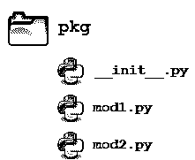

# Python 模块和包——简介

> 原文：<https://realpython.com/python-modules-packages/>

*立即观看**本教程有真实 Python 团队创建的相关视频课程。和书面教程一起看，加深理解: [**Python 模块和包:简介**](/courses/python-modules-packages/)

本文探索了 Python **模块**和 Python **包**，这两种机制促进了**模块化编程**。

**模块化编程**指的是将一个庞大、笨拙的编程任务分解成独立、更小、更易管理的子任务或**模块**的过程。然后，可以像构建模块一样将各个模块拼凑在一起，创建一个更大的应用程序。

在大型应用程序中，**模块化**代码有几个优点:

*   简单性:一个模块通常专注于问题的一个相对较小的部分，而不是关注手头的整个问题。如果你在一个模块上工作，你将会有一个更小的问题域去思考。这使得开发更容易，更不容易出错。

*   **可维护性:**模块通常被设计成在不同的问题域之间强制执行逻辑边界。如果以最小化相互依赖性的方式编写模块，那么对单个模块的修改对程序的其他部分产生影响的可能性就会降低。(您甚至可以在不了解模块之外的应用程序的情况下对模块进行更改。)这使得一个由许多程序员组成的团队在一个大型应用程序上协作工作变得更加可行。

*   **可重用性:**在单个模块中定义的功能可以很容易地被应用程序的其他部分重用(通过适当定义的接口)。这消除了复制代码的需要。

*   **作用域:**模块通常定义一个单独的 [**命名空间**](https://realpython.com/python-namespaces-scope/) ，这有助于避免程序不同区域的标识符之间的冲突。(Python 的[禅的信条之一是*名称空间是一个非常棒的想法——让我们做更多这样的事情吧！*)](https://www.python.org/dev/peps/pep-0020)

**函数**、**模块**和**包**都是 Python 中促进代码模块化的构造。

**免费 PDF 下载:** [Python 3 备忘单](https://realpython.com/bonus/python-cheat-sheet-short/)

## Python 模块:概述

在 Python 中，实际上有三种不同的方式来定义**模块**:

1.  一个模块可以用 Python 本身编写。
2.  一个模块可以用 **C** 编写，在运行时动态加载，像`re` ( [**正则表达式**](https://realpython.com/regex-python/) )模块。
3.  一个**内置的**模块本质上包含在解释器中，就像 [`itertools`模块](https://realpython.com/python-itertools/)一样。

一个模块的内容在所有三种情况下都以相同的方式被访问:用`import`语句。

这里，重点将主要放在用 Python 编写的模块上。用 Python 编写的模块最酷的一点是它们非常容易构建。您所需要做的就是创建一个包含合法 Python 代码的文件，然后给这个文件起一个扩展名为`.py`的名字。就是这样！不需要特殊的语法或巫术。

例如，假设您创建了一个名为`mod.py`的文件，其中包含以下内容:

***mod . py*T3】**

```py
s = "If Comrade Napoleon says it, it must be right."
a = [100, 200, 300]

def foo(arg):
    print(f'arg = {arg}')

class Foo:
    pass
```

在`mod.py`中定义了几个对象:

*   `s`(一个字符串)
*   `a`(一个列表)
*   `foo()`(一种功能)
*   `Foo`(一类)

假设`mod.py`在一个合适的位置，稍后您将了解到更多，这些对象可以通过**导入**模块来访问，如下所示:

>>>

```py
>>> import mod
>>> print(mod.s)
If Comrade Napoleon says it, it must be right.
>>> mod.a
[100, 200, 300]
>>> mod.foo(['quux', 'corge', 'grault'])
arg = ['quux', 'corge', 'grault']
>>> x = mod.Foo()
>>> x
<mod.Foo object at 0x03C181F0>
```

[*Remove ads*](/account/join/)

## 模块搜索路径

继续上面的例子，让我们看看 Python 执行语句时会发生什么:

```py
import mod
```

当解释器执行上述`import`语句时，它在从以下来源汇编的目录的[列表](https://realpython.com/python-lists-tuples/)中搜索`mod.py`:

*   运行输入脚本的目录或当前目录**(如果解释器交互运行)**
*   包含在 [`PYTHONPATH`](https://docs.python.org/3/using/cmdline.html#envvar-PYTHONPATH) 环境变量中的目录列表，如果设置了的话。(`PYTHONPATH`的格式依赖于操作系统，但应该模仿 [`PATH`](https://realpython.com/add-python-to-path/) 环境变量。)
*   安装 Python 时配置的依赖于安装的目录列表

结果搜索路径可在 Python 变量`sys.path`中访问，该变量从名为`sys`的模块中获得:

>>>

```py
>>> import sys
>>> sys.path
['', 'C:\\Users\\john\\Documents\\Python\\doc', 'C:\\Python36\\Lib\\idlelib',
'C:\\Python36\\python36.zip', 'C:\\Python36\\DLLs', 'C:\\Python36\\lib',
'C:\\Python36', 'C:\\Python36\\lib\\site-packages']
```

**注意:**`sys.path`的确切内容取决于安装。上述内容在您的计算机上看起来几乎肯定会略有不同。

因此，要确保找到您的模块，您需要执行以下操作之一:

*   将`mod.py`放入输入脚本所在的目录或者**当前目录**，如果是交互的话
*   在启动解释器之前，修改`PYTHONPATH`环境变量以包含`mod.py`所在的目录
    *   **或:**将`mod.py`放入已经包含在`PYTHONPATH`变量中的一个目录中
*   将`mod.py`放在一个依赖于安装的目录中，根据操作系统的不同，您可能有也可能没有写权限

实际上还有一个额外的选项:您可以将模块文件放在您选择的任何目录中，然后在运行时修改`sys.path`,使其包含该目录。例如，在这种情况下，您可以将`mod.py`放在目录`C:\Users\john`中，然后发出以下语句:

>>>

```py
>>> sys.path.append(r'C:\Users\john')
>>> sys.path
['', 'C:\\Users\\john\\Documents\\Python\\doc', 'C:\\Python36\\Lib\\idlelib',
'C:\\Python36\\python36.zip', 'C:\\Python36\\DLLs', 'C:\\Python36\\lib',
'C:\\Python36', 'C:\\Python36\\lib\\site-packages', 'C:\\Users\\john']
>>> import mod
```

一旦模块被导入，您可以使用模块的`__file__`属性来确定它被发现的位置:

>>>

```py
>>> import mod
>>> mod.__file__
'C:\\Users\\john\\mod.py'

>>> import re
>>> re.__file__
'C:\\Python36\\lib\\re.py'
```

`__file__`的目录部分应该是`sys.path`中的一个目录。

## `import`语句

**模块**的内容通过`import`语句提供给调用者。`import`语句有许多不同的形式，如下所示。

### `import <module_name>`

最简单的形式是上面已经显示的形式:

```py
import <module_name>
```

注意这个*并不*使模块内容*直接*可被调用者访问。每个模块都有自己的**私有符号表**，作为模块中定义的*所有对象的全局符号表。因此，正如已经提到的，一个模块创建了一个单独的**名称空间**。*

语句`import <module_name>`只将`<module_name>`放在调用者的符号表中。在模块*中定义的*对象*保留在模块的私有符号表*中。

从调用者那里，模块中的对象只有在通过**点符号**以`<module_name>`为前缀时才是可访问的，如下所示。

在下面的`import`语句之后，`mod`被放入局部符号表。因此，`mod`在呼叫者的当地语境中有意义:

>>>

```py
>>> import mod
>>> mod
<module 'mod' from 'C:\\Users\\john\\Documents\\Python\\doc\\mod.py'>
```

但是`s`和`foo`保留在模块的私有符号表中，在本地上下文中没有意义:

>>>

```py
>>> s
NameError: name 's' is not defined
>>> foo('quux')
NameError: name 'foo' is not defined
```

要在本地上下文中访问，模块中定义的对象名必须以`mod`为前缀:

>>>

```py
>>> mod.s
'If Comrade Napoleon says it, it must be right.'
>>> mod.foo('quux')
arg = quux
```

几个逗号分隔的模块可以在单个`import`语句中指定:

```py
import <module_name>[, <module_name> ...]
```

[*Remove ads*](/account/join/)

### `from <module_name> import <name(s)>`

另一种形式的`import`语句允许将模块中的单个对象直接导入*调用者的符号表*:

```py
from <module_name> import <name(s)>
```

在执行上述语句之后，`<name(s)>`可以在调用者的环境中被引用，而没有前缀`<module_name>`:

>>>

```py
>>> from mod import s, foo
>>> s
'If Comrade Napoleon says it, it must be right.'
>>> foo('quux')
arg = quux

>>> from mod import Foo
>>> x = Foo()
>>> x
<mod.Foo object at 0x02E3AD50>
```

因为这种形式的`import`将对象名直接放入调用者的符号表中，任何已经存在的同名对象将被*覆盖*:

>>>

```py
>>> a = ['foo', 'bar', 'baz']
>>> a
['foo', 'bar', 'baz']

>>> from mod import a
>>> a
[100, 200, 300]
```

甚至有可能一下子不加选择地从一个模块中取出所有内容:

```py
from <module_name> import *
```

这将把来自`<module_name>`的所有对象的名称*放到本地符号表中，除了任何以下划线(`_`)字符开头的对象。*

例如:

>>>

```py
>>> from mod import *
>>> s
'If Comrade Napoleon says it, it must be right.'
>>> a
[100, 200, 300]
>>> foo
<function foo at 0x03B449C0>
>>> Foo
<class 'mod.Foo'>
```

这在大规模生产代码中不一定被推荐。这有点危险，因为你正在把名字一起输入到本地符号表*中*。除非你对它们都很了解，并且确信不会有冲突，否则你很有可能无意中覆盖了一个已有的名字。然而，当您只是在使用交互式解释器进行测试或发现时，这种语法非常方便，因为它可以让您快速访问模块提供的所有内容，而无需大量键入。

### `from <module_name> import <name> as <alt_name>`

也可以`import`单个对象，但用备用名输入到本地符号表中:

```py
from <module_name> import <name> as <alt_name>[, <name> as <alt_name> …]
```

这使得可以将名称直接放入局部符号表，但避免与先前存在的名称冲突:

>>>

```py
>>> s = 'foo'
>>> a = ['foo', 'bar', 'baz']

>>> from mod import s as string, a as alist
>>> s
'foo'
>>> string
'If Comrade Napoleon says it, it must be right.'
>>> a
['foo', 'bar', 'baz']
>>> alist
[100, 200, 300]
```

### `import <module_name> as <alt_name>`

您也可以用另一个名称导入整个模块:

```py
import <module_name> as <alt_name>
```

>>>

```py
>>> import mod as my_module
>>> my_module.a
[100, 200, 300]
>>> my_module.foo('qux')
arg = qux
```

模块内容可以从[函数定义](https://realpython.com/defining-your-own-python-function/)中导入。在这种情况下，`import`不会发生，直到函数*被调用*:

>>>

```py
>>> def bar():
...     from mod import foo
...     foo('corge')
...

>>> bar()
arg = corge
```

然而， **Python 3** 不允许在函数内部使用不加选择的`import *`语法:

>>>

```py
>>> def bar():
...     from mod import *
...
SyntaxError: import * only allowed at module level
```

最后，带有`except ImportError` 子句的 [`try`语句可用于防止不成功的`import`尝试:](https://realpython.com/python-exceptions/)

>>>

```py
>>> try:
...     # Non-existent module
...     import baz
... except ImportError:
...     print('Module not found')
...

Module not found
```

>>>

```py
>>> try:
...     # Existing module, but non-existent object
...     from mod import baz
... except ImportError:
...     print('Object not found in module')
...

Object not found in module
```

[*Remove ads*](/account/join/)

## `dir()`功能

内置函数`dir()`返回名称空间中已定义名称的列表。如果没有参数，它会在当前的**本地符号表**中产生一个按字母顺序排序的名称列表:

>>>

```py
>>> dir()
['__annotations__', '__builtins__', '__doc__', '__loader__', '__name__',
'__package__', '__spec__']

>>> qux = [1, 2, 3, 4, 5]
>>> dir()
['__annotations__', '__builtins__', '__doc__', '__loader__', '__name__',
'__package__', '__spec__', 'qux']

>>> class Bar():
...     pass
...
>>> x = Bar()
>>> dir()
['Bar', '__annotations__', '__builtins__', '__doc__', '__loader__', '__name__',
'__package__', '__spec__', 'qux', 'x']
```

注意上面对`dir()`的第一次调用是如何列出几个名称的，这些名称是自动定义的，并且在解释器启动时已经存在于名称空间中。随着新名称的定义(`qux`、`Bar`、`x`)，它们会出现在后续的`dir()`调用中。

这对于确定 import 语句向名称空间添加了什么非常有用:

>>>

```py
>>> dir()
['__annotations__', '__builtins__', '__doc__', '__loader__', '__name__',
'__package__', '__spec__']

>>> import mod
>>> dir()
['__annotations__', '__builtins__', '__doc__', '__loader__', '__name__',
'__package__', '__spec__', 'mod']
>>> mod.s
'If Comrade Napoleon says it, it must be right.'
>>> mod.foo([1, 2, 3])
arg = [1, 2, 3]

>>> from mod import a, Foo
>>> dir()
['Foo', '__annotations__', '__builtins__', '__doc__', '__loader__', '__name__',
'__package__', '__spec__', 'a', 'mod']
>>> a
[100, 200, 300]
>>> x = Foo()
>>> x
<mod.Foo object at 0x002EAD50>

>>> from mod import s as string
>>> dir()
['Foo', '__annotations__', '__builtins__', '__doc__', '__loader__', '__name__',
'__package__', '__spec__', 'a', 'mod', 'string', 'x']
>>> string
'If Comrade Napoleon says it, it must be right.'
```

当给定一个作为模块名称的参数时，`dir()`列出模块中定义的名称:

>>>

```py
>>> import mod
>>> dir(mod)
['Foo', '__builtins__', '__cached__', '__doc__', '__file__', '__loader__',
'__name__', '__package__', '__spec__', 'a', 'foo', 's']
```

>>>

```py
>>> dir()
['__annotations__', '__builtins__', '__doc__', '__loader__', '__name__',
'__package__', '__spec__']
>>> from mod import *
>>> dir()
['Foo', '__annotations__', '__builtins__', '__doc__', '__loader__', '__name__',
'__package__', '__spec__', 'a', 'foo', 's']
```

## 将模块作为脚本执行

任何包含一个**模块**的`.py`文件本质上也是一个 Python **脚本**，没有任何理由它不能像这样执行。

这里又是上面定义的`mod.py`:

***mod . py*T3】**

```py
s = "If Comrade Napoleon says it, it must be right."
a = [100, 200, 300]

def foo(arg):
    print(f'arg = {arg}')

class Foo:
    pass
```

这可以作为脚本运行:

```py
C:\Users\john\Documents>python mod.py
C:\Users\john\Documents>
```

没有错误，所以它显然是有效的。当然，这不是很有趣。正如所写的，只有*定义了*对象。T2 不会对它们做任何事情，也不会产生任何输出。

让我们修改上面的 Python 模块，使它在作为脚本运行时生成一些输出:

***mod . py*T3】**

```py
s = "If Comrade Napoleon says it, it must be right."
a = [100, 200, 300]

def foo(arg):
    print(f'arg = {arg}')

class Foo:
    pass

print(s)
print(a)
foo('quux')
x = Foo()
print(x)
```

现在应该更有趣一点了:

```py
C:\Users\john\Documents>python mod.py
If Comrade Napoleon says it, it must be right.
[100, 200, 300]
arg = quux
<__main__.Foo object at 0x02F101D0>
```

不幸的是，现在它在作为模块导入时也会生成输出:

>>>

```py
>>> import mod
If Comrade Napoleon says it, it must be right.
[100, 200, 300]
arg = quux
<mod.Foo object at 0x0169AD50>
```

这可能不是你想要的。模块在导入时通常不会生成输出。

如果您能够区分文件何时作为模块加载，何时作为独立脚本运行，这不是很好吗？

有求必应。

当一个`.py`文件作为模块导入时，Python 将特殊的 **dunder** 变量 [`__name__`](https://realpython.com/python-main-function/) 设置为模块的名称。然而，如果一个文件作为独立脚本运行，`__name__`被(创造性地)设置为字符串`'__main__'`。利用这一事实，您可以在运行时辨别出哪种情况，并相应地改变行为:

***mod . py*T3】**

```py
s = "If Comrade Napoleon says it, it must be right."
a = [100, 200, 300]

def foo(arg):
    print(f'arg = {arg}')

class Foo:
    pass

if (__name__ == '__main__'):
    print('Executing as standalone script')
    print(s)
    print(a)
    foo('quux')
    x = Foo()
    print(x)
```

现在，如果您作为脚本运行，您会得到输出:

```py
C:\Users\john\Documents>python mod.py
Executing as standalone script
If Comrade Napoleon says it, it must be right.
[100, 200, 300]
arg = quux
<__main__.Foo object at 0x03450690>
```

但是如果您作为模块导入，您不会:

>>>

```py
>>> import mod
>>> mod.foo('grault')
arg = grault
```

模块通常被设计为能够作为独立脚本运行，以测试模块中包含的功能。这被称为 **[单元测试](https://realpython.com/python-testing/)。**例如，假设您创建了一个包含**阶乘**函数的模块`fact.py`，如下所示:

***fact.py***

```py
def fact(n):
    return 1 if n == 1 else n * fact(n-1)

if (__name__ == '__main__'):
    import sys
    if len(sys.argv) > 1:
        print(fact(int(sys.argv[1])))
```

该文件可以作为一个模块，导入的`fact()`函数:

>>>

```py
>>> from fact import fact
>>> fact(6)
720
```

但是也可以通过在命令行上传递一个整数参数来独立运行，以便进行测试:

```py
C:\Users\john\Documents>python fact.py 6
720
```

[*Remove ads*](/account/join/)

## 重新加载模块

出于效率的原因，一个模块在每个解释器会话中只加载一次。这对于函数和类定义来说很好，它们通常构成了模块的大部分内容。但是模块也可以包含可执行语句，通常用于初始化。请注意，这些语句只会在第一次导入模块时*执行。*

考虑下面的文件`mod.py`:

***mod . py*T3】**

```py
a = [100, 200, 300]
print('a =', a)
```

>>>

```py
>>> import mod
a = [100, 200, 300]
>>> import mod
>>> import mod

>>> mod.a
[100, 200, 300]
```

在后续导入中不执行`print()`语句。(就此而言，赋值语句也不是，但正如最后显示的`mod.a`值所示，这无关紧要。一旦任务完成，它就生效了。)

如果您对一个模块进行了更改，并且需要重新加载它，您需要重新启动解释器或者使用模块`importlib`中的一个名为`reload()`的函数:

>>>

```py
>>> import mod
a = [100, 200, 300]

>>> import mod

>>> import importlib
>>> importlib.reload(mod)
a = [100, 200, 300]
<module 'mod' from 'C:\\Users\\john\\Documents\\Python\\doc\\mod.py'>
```

## Python 包

假设您开发了一个包含许多模块的非常大的应用程序。随着模块数量的增长，如果将它们放在一个位置，就很难跟踪所有的模块。如果它们具有相似的名称或功能，尤其如此。您可能希望有一种方法来对它们进行分组和组织。

**包**允许使用**点符号**对模块名称空间进行层次化构造。同样，**模块**有助于避免全局变量名之间的冲突，**包**有助于避免模块名之间的冲突。

创建一个**包**非常简单，因为它利用了操作系统固有的层次文件结构。考虑以下安排:

[](https://files.realpython.com/media/pkg1.9af1c7aea48f.png)

这里有一个名为`pkg`的目录，包含两个模块`mod1.py`和`mod2.py`。这些模块的内容包括:

***mod1.py***

```py
def foo():
    print('[mod1] foo()')

class Foo:
    pass
```

***mod2.py***

```py
def bar():
    print('[mod2] bar()')

class Bar:
    pass
```

给定这种结构，如果`pkg`目录位于可以找到它的位置(在`sys.path`中包含的一个目录中)，您可以引用带有**点符号** ( `pkg.mod1`，`pkg.mod2`)的两个**模块**，并用您已经熟悉的语法导入它们:

```py
import <module_name>[, <module_name> ...]
```

>>>

```py
>>> import pkg.mod1, pkg.mod2
>>> pkg.mod1.foo()
[mod1] foo()
>>> x = pkg.mod2.Bar()
>>> x
<pkg.mod2.Bar object at 0x033F7290>
```

```py
from <module_name> import <name(s)>
```

>>>

```py
>>> from pkg.mod1 import foo
>>> foo()
[mod1] foo()
```

```py
from <module_name> import <name> as <alt_name>
```

>>>

```py
>>> from pkg.mod2 import Bar as Qux
>>> x = Qux()
>>> x
<pkg.mod2.Bar object at 0x036DFFD0>
```

您也可以使用这些语句导入模块:

```py
from <package_name> import <modules_name>[, <module_name> ...]
from <package_name> import <module_name> as <alt_name>
```

>>>

```py
>>> from pkg import mod1
>>> mod1.foo()
[mod1] foo()

>>> from pkg import mod2 as quux
>>> quux.bar()
[mod2] bar()
```

从技术上讲，您也可以导入包:

>>>

```py
>>> import pkg
>>> pkg
<module 'pkg' (namespace)>
```

但这无济于事。虽然严格来说，这是一个语法正确的 Python 语句，但它并没有做多少有用的事情。特别是，它*不会将`pkg`中的任何模块*放入本地名称空间:

>>>

```py
>>> pkg.mod1
Traceback (most recent call last):
  File "<pyshell#34>", line 1, in <module>
    pkg.mod1
AttributeError: module 'pkg' has no attribute 'mod1'
>>> pkg.mod1.foo()
Traceback (most recent call last):
  File "<pyshell#35>", line 1, in <module>
    pkg.mod1.foo()
AttributeError: module 'pkg' has no attribute 'mod1'
>>> pkg.mod2.Bar()
Traceback (most recent call last):
  File "<pyshell#36>", line 1, in <module>
    pkg.mod2.Bar()
AttributeError: module 'pkg' has no attribute 'mod2'
```

要实际导入模块或它们的内容，您需要使用上面显示的表单之一。

[*Remove ads*](/account/join/)

## 包初始化

如果包目录中有一个名为`__init__.py`的文件，当导入包或包中的一个模块时，它会被调用。这可用于执行包初始化代码，例如包级数据的初始化。

例如，考虑下面的`__init__.py`文件:

***__init__。py**T3】*

```py
print(f'Invoking __init__.py for {__name__}')
A = ['quux', 'corge', 'grault']
```

让我们将这个文件添加到上面示例中的`pkg`目录中:

[](https://files.realpython.com/media/pkg2.dab97c2f9c58.png)

现在，当包被导入时，全局列表`A`被初始化:

>>>

```py
>>> import pkg
Invoking __init__.py for pkg
>>> pkg.A
['quux', 'corge', 'grault']
```

包中的**模块**可以通过依次导入来访问全局变量:

***mod1.py***

```py
def foo():
    from pkg import A
    print('[mod1] foo() / A = ', A)

class Foo:
    pass
```

>>>

```py
>>> from pkg import mod1
Invoking __init__.py for pkg
>>> mod1.foo()
[mod1] foo() / A =  ['quux', 'corge', 'grault']
```

`__init__.py`也可用于实现从包中自动导入模块。例如，前面您看到语句`import pkg`只将名字`pkg`放在调用者的本地符号表中，没有导入任何模块。但是如果`pkg`目录中的`__init__.py`包含以下内容:

***__init__。py**T3】*

```py
print(f'Invoking __init__.py for {__name__}')
import pkg.mod1, pkg.mod2
```

然后当您执行`import pkg`时，模块`mod1`和`mod2`被自动导入:

>>>

```py
>>> import pkg
Invoking __init__.py for pkg
>>> pkg.mod1.foo()
[mod1] foo()
>>> pkg.mod2.bar()
[mod2] bar()
```

**注意:**很多 Python 文档都指出，当创建一个包时，`__init__.py`文件**必须**存在于包目录中。这曾经是真的。过去,`__init__.py`的出现对 Python 来说意味着一个包正在被定义。该文件可以包含初始化代码，甚至可以是空的，但是它**必须有**存在。

从 **Python 3.3** 开始，[隐式名称空间包](https://www.python.org/dev/peps/pep-0420)被引入。这些允许创建一个没有任何`__init__.py`文件的包。当然，如果需要包初始化，它**可以**仍然存在。但是不再需要了。

## 从包中导入`*`

出于以下讨论的目的，前面定义的包被扩展为包含一些附加模块:

[](https://files.realpython.com/media/pkg3.d2160908ae77.png)

现在在`pkg`目录中定义了四个模块。它们的内容如下所示:

***mod1.py***

```py
def foo():
    print('[mod1] foo()')

class Foo:
    pass
```

***mod2.py***

```py
def bar():
    print('[mod2] bar()')

class Bar:
    pass
```

***mod3.py***

```py
def baz():
    print('[mod3] baz()')

class Baz:
    pass
```

***mod4.py***

```py
def qux():
    print('[mod4] qux()')

class Qux:
    pass
```

(很有想象力，不是吗？)

您已经看到，当`import *`用于**模块**，*时，模块中的所有*对象都被导入到本地符号表中，除了那些名称以下划线开头的对象，一如既往:

>>>

```py
>>> dir()
['__annotations__', '__builtins__', '__doc__', '__loader__', '__name__',
'__package__', '__spec__']

>>> from pkg.mod3 import *

>>> dir()
['Baz', '__annotations__', '__builtins__', '__doc__', '__loader__', '__name__',
'__package__', '__spec__', 'baz']
>>> baz()
[mod3] baz()
>>> Baz
<class 'pkg.mod3.Baz'>
```

一个**包**的类似陈述如下:

```py
from <package_name> import *
```

那有什么用？

>>>

```py
>>> dir()
['__annotations__', '__builtins__', '__doc__', '__loader__', '__name__',
'__package__', '__spec__']

>>> from pkg import *
>>> dir()
['__annotations__', '__builtins__', '__doc__', '__loader__', '__name__',
'__package__', '__spec__']
```

嗯。不多。您可能期望(假设您有任何期望)Python 会深入到包目录中，找到它能找到的所有模块，并导入它们。但是正如你所看到的，默认情况下并不是这样。

相反，Python 遵循这样的约定:如果**包**目录中的`__init__.py`文件包含一个名为`__all__`的**列表**，那么当遇到语句`from <package_name> import *`时，它被认为是应该导入的模块列表。

对于本例，假设您在`pkg`目录中创建了一个`__init__.py`，如下所示:

***pkg/__init__。py**T3】*

```py
__all__ = [
        'mod1',
        'mod2',
        'mod3',
        'mod4'
        ]
```

现在`from pkg import *`导入所有四个模块:

>>>

```py
>>> dir()
['__annotations__', '__builtins__', '__doc__', '__loader__', '__name__',
'__package__', '__spec__']

>>> from pkg import *
>>> dir()
['__annotations__', '__builtins__', '__doc__', '__loader__', '__name__',
'__package__', '__spec__', 'mod1', 'mod2', 'mod3', 'mod4']
>>> mod2.bar()
[mod2] bar()
>>> mod4.Qux
<class 'pkg.mod4.Qux'>
```

使用`import *`仍然不被认为是很好的形式，对于**包**比对于**模块**更是如此。但是这个工具至少给了包的创建者一些控制，当指定了`import *`时会发生什么。(事实上，它提供了完全不允许它的能力，简单地拒绝定义`__all__`。正如您所看到的，包的默认行为是不导入任何东西。)

顺便说一下，`__all__`也可以在**模块**中定义，其目的相同:控制用`import *`导入的内容。例如，将`mod1.py`修改如下:

***pkg/mod1.py***

```py
__all__ = ['foo']

def foo():
    print('[mod1] foo()')

class Foo:
    pass
```

现在来自`pkg.mod1`的`import *`语句将只导入包含在`__all__`中的内容:

>>>

```py
>>> dir()
['__annotations__', '__builtins__', '__doc__', '__loader__', '__name__',
'__package__', '__spec__']

>>> from pkg.mod1 import *
>>> dir()
['__annotations__', '__builtins__', '__doc__', '__loader__', '__name__',
'__package__', '__spec__', 'foo']

>>> foo()
[mod1] foo()
>>> Foo
Traceback (most recent call last):
  File "<pyshell#37>", line 1, in <module>
    Foo
NameError: name 'Foo' is not defined
```

`foo()`(函数)现在在本地名称空间中定义，但是`Foo`(类)没有，因为后者不在`__all__`中。

总之，`__all__`被**包**和**模块**用来控制当`import *`被指定时导入什么。但是*默认行为不同*:

*   对于一个包，当没有定义`__all__`时，`import *`不导入任何东西。
*   对于一个模块，当没有定义`__all__`时，`import *`会导入所有内容(除了——你猜对了——以下划线开头的名字)。

[*Remove ads*](/account/join/)

## 子包

包可以包含任意深度的嵌套**子包**。例如，让我们对示例**包**目录进行如下修改:

[](https://files.realpython.com/media/pkg4.a830d6e144bf.png)

四个模块(`mod1.py`、`mod2.py`、`mod3.py`和`mod4.py`)的定义如前。但是现在，它们没有被集中到`pkg`目录中，而是被分成两个**子包**目录，`sub_pkg1`和`sub_pkg2`。

导入仍然与前面所示的一样。语法是相似的，但是额外的**点符号**被用来分隔**包**名和**子包**名:

>>>

```py
>>> import pkg.sub_pkg1.mod1
>>> pkg.sub_pkg1.mod1.foo()
[mod1] foo()

>>> from pkg.sub_pkg1 import mod2
>>> mod2.bar()
[mod2] bar()

>>> from pkg.sub_pkg2.mod3 import baz
>>> baz()
[mod3] baz()

>>> from pkg.sub_pkg2.mod4 import qux as grault
>>> grault()
[mod4] qux()
```

此外，一个**子包**中的模块可以引用一个**兄弟子包**中的对象(如果兄弟子包包含您需要的一些功能)。例如，假设您想从模块`mod3`中导入并执行函数`foo()`(在模块`mod1`中定义)。您可以使用**绝对导入**:

***pkg/sub _ _ pkg 2/mod 3 . py**T3】*

```py
def baz():
    print('[mod3] baz()')

class Baz:
    pass

from pkg.sub_pkg1.mod1 import foo
foo()
```

>>>

```py
>>> from pkg.sub_pkg2 import mod3
[mod1] foo()
>>> mod3.foo()
[mod1] foo()
```

或者你可以使用一个**相对导入**，这里`..`指的是上一级的包。从`mod3.py`内部，也就是在`sub_pkg2`子包中，

*   `..`评估为父包(`pkg`)，并且
*   `..sub_pkg1`评估为父包的子包`sub_pkg1`。

***pkg/sub _ _ pkg 2/mod 3 . py**T3】*

```py
def baz():
    print('[mod3] baz()')

class Baz:
    pass

from .. import sub_pkg1
print(sub_pkg1)

from ..sub_pkg1.mod1 import foo
foo()
```

>>>

```py
>>> from pkg.sub_pkg2 import mod3
<module 'pkg.sub_pkg1' (namespace)>
[mod1] foo()
```

## 结论

在本教程中，您学习了以下主题:

*   如何创建一个 Python **模块**
*   Python 解释器搜索模块的位置
*   如何使用`import`语句访问模块中定义的对象
*   如何创建可作为独立脚本执行的模块
*   如何将模块组织成**包**和**子包**
*   如何控制包的初始化

**免费 PDF 下载:** [Python 3 备忘单](https://realpython.com/bonus/python-cheat-sheet-short/)

这有望让您更好地理解如何获得 Python 中许多第三方和内置模块的可用功能。

此外，如果你正在开发自己的应用程序，创建自己的**模块**和**包**将帮助你组织和模块化你的代码，这使得编码、维护和调试更容易。

如果您想了解更多信息，请在**Python.org**查阅以下文档:

*   [`import`系统](https://docs.python.org/3/reference/import.html)
*   [Python 教程:模块](https://docs.python.org/3/tutorial/modules.html)

快乐的蟒蛇！

*立即观看**本教程有真实 Python 团队创建的相关视频课程。和书面教程一起看，加深理解: [**Python 模块和包:简介**](/courses/python-modules-packages/)********