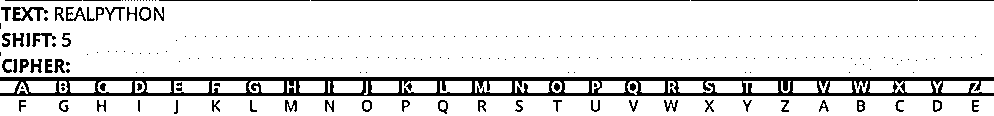
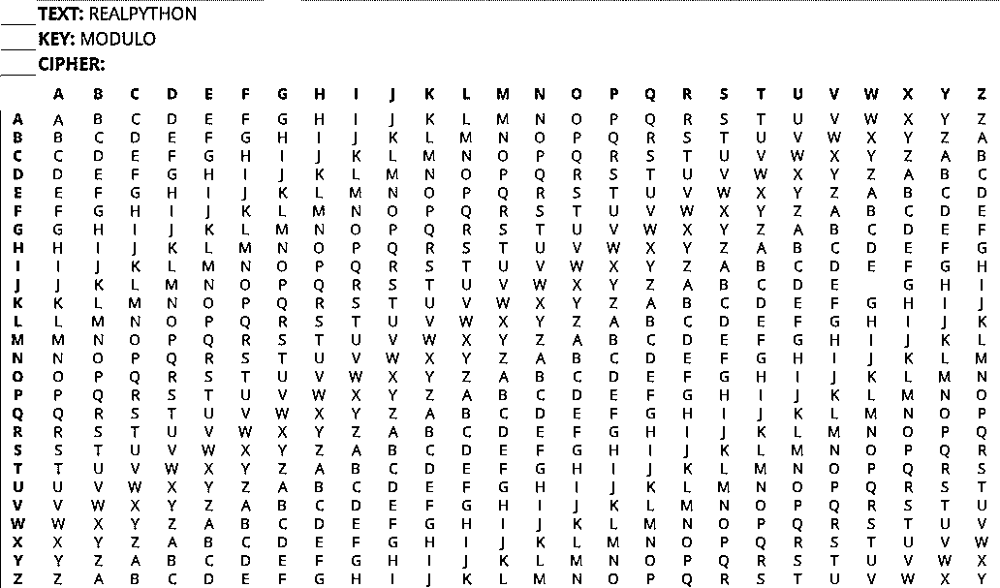

# Python 模运算实践:如何使用%运算符

> 原文：<https://realpython.com/python-modulo-operator/>

*立即观看**本教程有真实 Python 团队创建的相关视频课程。和书面教程一起看，加深理解: [**Python 模:使用%运算符**](/courses/python-modulo-operator/)

Python 支持多种多样的算术运算符，当您在代码中处理[数字](https://realpython.com/python-numbers/)时，可以使用这些运算符。其中一个运算符是**模运算符** ( `%`)，它返回两个数相除的余数。

在本教程中，您将学习:

*   **模**在数学中是如何工作的
*   如何对不同的**数字类型**使用 Python 模运算符
*   Python 如何计算**模运算**的结果
*   如何在你的类中覆盖 **`.__mod__()`** 来使用模运算符
*   如何使用 Python 模运算符解决**现实世界的问题**

Python 的模操作符有时会被忽略。但是很好地理解这个操作符将为您的 Python 工具箱提供一个无价的工具。

**免费奖励:** 并学习 Python 3 的基础知识，如使用数据类型、字典、列表和 Python 函数。

## 数学中的模数

术语**模**来自一个叫做[模运算](https://en.wikipedia.org/wiki/Modular_arithmetic)的数学分支。模运算在一个有固定数字集合的循环数字线上处理整数运算。在该数字线上执行的所有算术运算将在达到某个称为**模数**的数字时回绕。

模运算中模的一个经典例子是十二小时时钟。十二小时制的时钟有一组固定的值，从 1 到 12。当在 12 小时制的时钟上计数时，您计数到模数 12，然后返回到 1。十二小时的时钟可以归类为“模 12”，有时缩写为“mod 12”

当您想要将一个数字与模数进行比较，并获得限制在模数范围内的等效数字时，可以使用模运算符。

例如，假设您想确定上午 8:00 后 9 个小时是什么时间。在 12 小时制的时钟上，您不能简单地将 9 加 8，因为您会得到 17。您需要得到结果 17，并使用`mod`在 12 小时的上下文中获得它的等值:

```py
8 o'clock + 9 = 17 o'clock
17 mod 12 = 5
```

`17 mod 12`返回`5`。这意味着上午 8:00 之后的 9 个小时是下午 5:00。您通过将数字`17`应用于`mod 12`上下文来确定这一点。

现在，如果你想一想，`17`和`5`在`mod 12`上下文中是等价的。如果你在 5 点和 17 点看时针，它会在同样的位置。模运算有一个等式来描述这种关系:

```py
a ≡ b (mod n)
```

这个等式读作“`a`和`b`同余模`n`”这意味着`a`和`b`在`mod n`中是等价的，因为它们除以`n`后有相同的余数。在上式中，`n`是`a`和`b`的**模数**。使用之前的值`17`和`5`，等式将如下所示:

```py
17 ≡ 5 (mod 12)
```

上面写着"`17`和`5`同余模`12`"`17`和`5`被`12`除时，余数`5`相同。所以在`mod 12`中，数字`17`和`5`是等价的。

您可以使用除法来确认这一点:

```py
17 / 12 = 1 R 5
5 / 12 = 0 R 5
```

这两种运算都有相同的余数`5`，所以它们的模`12`是等价的。

现在，对于 Python 操作符来说，这似乎是一个很大的数学问题，但是有了这些知识，您就可以在本教程后面的例子中使用模操作符了。在下一节中，您将看到对数值类型`int`和`float`使用 Python 模操作符的基础。

[*Remove ads*](/account/join/)

## Python 模运算符基础知识

像其他算术运算符一样，模运算符可以与数字类型 [`int`](https://realpython.com/python-numbers/#integers) 和 [`float`](https://realpython.com/python-numbers/#floating-point-numbers) 一起使用。稍后您将会看到，它也可以用于其他类型，如[`math.fmod()`](https://realpython.com/python-math-module/)`decimal.Decimal`，以及您自己的类。

### 带`int`的模运算符

大多数情况下，您将对整数使用模运算符。模运算符在用于两个正整数时，将返回标准[欧几里德除法](https://en.wikipedia.org/wiki/Euclidean_division)的余数:

>>>

```py
>>> 15 % 4
3

>>> 17 % 12
5

>>> 240 % 13
6

>>> 10 % 16
10
```

小心点！就像除法运算符(`/`)一样，如果您尝试使用除数为`0`的模运算符，Python 将返回一个`ZeroDivisionError`:

>>>

```py
>>> 22 % 0
ZeroDivisionError: integer division or modulo by zero
```

接下来，我们将看看如何使用带`float`的模操作符。

### 带`float`的模运算符

与`int`类似，与`float`一起使用的模运算符将返回除法的余数，但作为一个`float`值:

>>>

```py
>>> 12.5 % 5.5
1.5

>>> 17.0 % 12.0
5.0
```

将`float`与模运算符一起使用的另一种方法是使用`math.fmod()`对`float`值执行模运算:

>>>

```py
>>> import math
>>> math.fmod(12.5, 5.5)
1.5

>>> math.fmod(8.5, 2.5)
1.0
```

由于`math.fmod()`计算模运算结果的方式，官方 Python 文档[建议在处理`float`值时使用`math.fmod()`](https://docs.python.org/3/library/math.html#math.fmod) 而不是 Python 模运算符。如果您使用负操作数，那么您可能会在`math.fmod(x, y)`和`x % y`之间看到不同的结果。在下一节中，您将更详细地探索对负操作数使用模运算符。

就像其他算术运算符一样，模运算符和`math.fmod()`在处理[浮点运算](https://docs.python.org/3/tutorial/floatingpoint.html)时可能会遇到舍入和精度问题:

>>>

```py
>>> 13.3 % 1.1
0.09999999999999964

>>> import math
>>> math.fmod(13.3, 1.1)
0.09999999999999964
```

如果保持浮点精度对您的应用程序很重要，那么您可以使用带`decimal.Decimal`的模操作符。在本教程的后面，你会看到这个[。](#using-the-python-modulo-operator-with-decimaldecimal)

### 带负操作数的模运算符

到目前为止，您看到的所有模运算都使用两个正操作数并返回可预测的结果。当引入负操作数时，事情变得更加复杂。

事实证明，计算机确定带有负操作数的模运算结果的方式留下了模糊性，即余数应该采用**被除数**(被除的数)还是**除数**(被除数)的符号。不同的编程语言对此有不同的处理方式。

例如，在 [JavaScript](https://realpython.com/python-vs-javascript/) 中，余数将带有被除数的符号:

```py
8  %  -3  =  2
```

本例中的余数`2`为正，因为它采用被除数`8`的符号。在 Python 和其他语言中，余数将改为除数的符号:

```py
8 % -3 = -1
```

这里你可以看到余数`-1`，取除数`-3`的符号。

你可能想知道为什么 JavaScript 中的余数是`2`而 Python 中的余数是`-1`。这与不同的语言如何决定模运算的结果有关。余数带有被除数符号的语言使用以下等式来确定余数:

```py
r = a - (n * trunc(a/n))
```

这个等式有三个变量:

1.  **`r`** 是余数。
2.  **`a`** 是股息。
3.  **`n`** 是除数。

这个等式中的`trunc()`意味着它使用了**截断除法**，它总是将负数四舍五入为零。为更清楚起见，请参见下面使用`8`作为被除数和`-3`作为除数的模运算步骤:

```py
r = 8 - (-3 * trunc(8/-3))
r = 8 - (-3 * trunc(-2.666666666667))
r = 8 - (-3 * -2) # Rounded toward 0
r = 8 - 6
r = 2
```

这里你可以看到像 JavaScript 这样的语言是如何得到剩余部分`2`的。Python 和其他语言中，余数采用除数的符号，使用以下等式:

```py
r = a - (n * floor(a/n))
```

此等式中的`floor()`表示使用**楼层划分**。对于正数，底除法将返回与截断除法相同的结果。但是，如果是负数，floor division 会将结果向下舍入，远离零:

```py
r = 8 - (-3 * floor(8/-3))
r = 8 - (-3 * floor(-2.666666666667))
r = 8 - (-3 * -3) # Rounded away from 0
r = 8 - 9
r = -1
```

这里可以看到结果是`-1`。

既然您已经理解了剩余部分的不同之处，那么您可能会想，如果您只使用 Python，为什么这很重要。事实证明，Python 中的模运算并不完全相同。虽然与`int`和`float`类型一起使用的模将采用除数的符号，但其他类型不会。

当您比较`8.0 % -3.0`和`math.fmod(8.0, -3.0)`的结果时，可以看到一个这样的例子:

>>>

```py
>>> 8.0 % -3
-1.0

>>> import math
>>> math.fmod(8.0, -3.0)
2.0
```

`math.fmod()`使用截断除法得到被除数的符号，而`float`使用除数的符号。在本教程的后面，您将看到另一种使用被除数符号的 Python 类型，`decimal.Decimal`。

[*Remove ads*](/account/join/)

### 模运算符`divmod()`和

Python 有内置函数 [`divmod()`](https://docs.python.org/3/library/functions.html#divmod) ，内部使用模运算符。`divmod()`接受两个参数，并使用所提供的参数返回一个元组，该元组包含取底和取模的结果。

下面是一个将`divmod()`与`37`和`5`一起使用的例子:

>>>

```py
>>> divmod(37, 5)
(7, 2)

>>> 37 // 5
7

>>> 37 % 5
2
```

可以看到`divmod(37, 5)`返回了元组`(7, 2)`。`7`是`37`和`5`分楼层的结果。`2`是`37`对`5`取模的结果。

下面是第二个参数是负数的例子。如前所述，当模运算符与`int`一起使用时，余数将采用除数的符号:

>>>

```py
>>> divmod(37, -5)
(-8, -3)

>>> 37 // -5
-8

>>> 37 % -5
-3 # Result has the sign of the divisor
```

既然您已经有机会看到了在几种场景中使用的模运算符，那么看看 Python 如何确定模运算符与其他算术运算符一起使用时的优先级是很重要的。

### 模运算符优先级

像其他 Python 操作符一样，模操作符有特定的规则，这些规则决定了它在计算表达式时的[优先级。模运算符(`%`)与乘法(`*`)、除法(`/`)和除法(`//`)运算符具有相同的优先级。](https://realpython.com/python-operators-expressions/#operator-precedence)

看看下面这个模运算符优先级的例子:

>>>

```py
>>> 4 * 10 % 12 - 9
-5
```

乘法和模操作符具有相同的优先级，所以 Python 将从左到右计算它们。以上操作的步骤如下:

1.  **`4 * 10`** 被求值，产生`40 % 12 - 9`。
2.  **`40 % 12`** 被求值，产生`4 - 9`。
3.  **`4 - 9`** 被求值，产生`-5`。

如果您想要覆盖其他运算符的优先级，那么您可以使用括号将您想要首先计算的运算括起来:

>>>

```py
>>> 4 * 10 % (12 - 9)
1
```

在这个例子中，首先计算`(12 - 9)`，然后是`4 * 10`，最后是`40 % 3`，等于`1`。

## 实践中的 Python 模运算符

现在您已经了解了 Python 模操作符的基础知识，接下来您将看到一些使用它来解决实际编程问题的例子。有时，很难确定何时在代码中使用模运算符。下面的例子将让你了解它的许多用法。

### 如何检查一个数是偶数还是奇数

在这一节中，您将看到如何使用模运算符来确定一个数字是偶数还是奇数。使用模数为`2`的模操作符，你可以检查任何一个数是否能被`2`整除。如果它能被整除，那么它就是一个偶数。

看一下`is_even()`，它检查`num`参数是否为偶数:

```py
def is_even(num):
    return num % 2 == 0
```

如果`num`是偶数，这里的`num % 2`将等于`0`，如果`num`是奇数，这里的`1`将等于`0`。检查`0`将根据`num`是否为偶数返回一个`True`或`False`的[布尔值](https://realpython.com/python-boolean/)。

检查奇数是非常相似的。要检查奇数，可以反转等式检查:

```py
def is_odd(num):
    return num % 2 != 0
```

如果`num % 2`不等于`0`，这个函数将返回`True`，这意味着有一个余数证明`num`是奇数。现在，您可能想知道是否可以使用以下函数来确定`num`是否为奇数:

```py
def is_odd(num):
    return num % 2 == 1
```

这个问题的答案是肯定的*和*否。从技术上讲，这个函数将与 Python 计算整数模的方式一起工作。也就是说，您应该避免将模运算的结果与`1`进行比较，因为 Python 中并非所有的模运算都会返回相同的余数。

你可以在下面的例子中看到原因:

>>>

```py
>>> -3 % 2
1

>>> 3 % -2
-1
```

在第二个例子中，余数取负除数的符号并返回`-1`。在这种情况下，布尔校验`3 % -2 == 1`将返回`False`。

但是，如果你用`0`来比较模运算，那么哪个操作数是负的就无所谓了。当它是偶数时，结果总是`True`:

>>>

```py
>>> -2 % 2
0

>>> 2 % -2
0
```

如果您坚持将 Python 模运算与`0`进行比较，那么在代码中检查偶数和奇数或任何其他倍数应该没有任何问题。

在下一节中，您将了解如何在循环中使用模操作符来控制程序的流程。

[*Remove ads*](/account/join/)

### 如何在循环中以特定间隔运行代码

使用 Python 模操作符，您可以在循环中以特定的间隔运行代码。这是通过用循环的当前索引和模数执行模运算来完成的。模数决定了特定于间隔的代码在循环中运行的频率。

这里有一个例子:

```py
def split_names_into_rows(name_list, modulus=3):
    for index, name in enumerate(name_list, start=1):
        print(f"{name:-^15} ", end="")
        if index % modulus == 0:
            print()
    print()
```

这段代码定义了`split_names_into_rows()`，它有两个参数。`name_list`是一个[列表](https://realpython.com/python-lists-tuples/)中的名字应该被分成行。`modulus`为运算设置一个模数，有效地确定每行应该有多少个名字。`split_names_into_rows()`将在`name_list`上循环，并在达到`modulus`值后开始新的一行。

在更详细地分析该功能之前，先看一下它的运行情况:

>>>

```py
>>> names = ["Picard", "Riker", "Troi", "Crusher", "Worf", "Data", "La Forge"]
>>> split_names_into_rows(names)
----Picard----- -----Riker----- -----Troi------
----Crusher---- -----Worf------ -----Data------
---La Forge----
```

如您所见，姓名列表被分成三行，每行最多三个姓名。`modulus`默认为`3`，但您可以指定任意数字:

>>>

```py
>>> split_names_into_rows(names, modulus=4)
----Picard----- -----Riker----- -----Troi------ ----Crusher----
-----Worf------ -----Data------ ---La Forge----

>>> split_names_into_rows(names, modulus=2)
----Picard----- -----Riker-----
-----Troi------ ----Crusher----
-----Worf------ -----Data------
---La Forge----

>>> split_names_into_rows(names, modulus=1)
----Picard-----
-----Riker-----
-----Troi------
----Crusher----
-----Worf------
-----Data------
---La Forge----
```

现在您已经看到了运行中的代码，您可以分解它在做什么了。首先，它使用 [`enumerate()`](https://realpython.com/python-enumerate/) 来迭代`name_list`，将列表中的当前项分配给`name`，并将一个计数值分配给`index`。您可以看到`enumerate()`的可选`start`参数被设置为`1`。这意味着`index`计数将从`1`而不是`0`开始:

```py
for index, name in enumerate(name_list, start=1):
```

接下来，在循环内部，该函数调用 [`print()`](https://realpython.com/python-print/) 将`name`输出到当前行。`print()`的`end`参数是一个空的[字符串](https://realpython.com/python-strings/) ( `""`)，所以它不会在字符串末尾输出换行符。一个 [f 字符串](https://realpython.com/python-f-strings/)被传递给`print()`，T5 使用 Python 提供的[字符串输出格式化语法](https://realpython.com/python-formatted-output/#the-ltformat_specgt-component):

```py
print(f"{name:-^15} ", end="")
```

在不涉及太多细节的情况下，`:-^15`语法告诉`print()`做以下事情:

*   至少输出`15`个字符，即使字符串短于 15 个字符。
*   将字符串居中对齐。
*   用连字符(`-`)填充字符串右边或左边的任何空格。

现在名称已经打印到行中，看一下`split_names_into_rows()`的主要部分:

```py
if index % modulus == 0:
    print()
```

这段代码获取当前迭代`index`，并使用模运算符，将其与`modulus`进行比较。如果结果等于`0`，那么它可以运行特定于间隔的代码。在这种情况下，该函数调用`print()`来添加一个新行，这将开始一个新行。

上面的代码只是一个例子。使用模式`index % modulus == 0`允许你在循环中以特定的间隔运行不同的代码。在下一节中，您将进一步理解这个概念，看看循环迭代。

### 如何创建循环迭代

**循环迭代**描述了一种迭代类型，一旦到达某一点就会重置。通常，这种类型的迭代用于将迭代的索引限制在某个范围内。

您可以使用模运算符来创建循环迭代。看一个使用 [`turtle`库](https://realpython.com/beginners-guide-python-turtle/)绘制形状的例子:

```py
import turtle
import random

def draw_with_cyclic_iteration():
    colors = ["green", "cyan", "orange", "purple", "red", "yellow", "white"]

    turtle.bgcolor("gray8") # Hex: #333333
    turtle.pendown()
    turtle.pencolor(random.choice(colors)) # First color is random

    i = 0 # Initial index

    while True:
        i = (i + 1) % 6 # Update the index
        turtle.pensize(i) # Set pensize to i
        turtle.forward(225)
        turtle.right(170)

        # Pick a random color
        if i == 0:
            turtle.pencolor(random.choice(colors))
```

上面的代码使用了一个[无限循环](https://realpython.com/python-while-loop/)来绘制一个重复的星形。每六次迭代后，它会改变钢笔的颜色。笔的大小随着每次迭代而增加，直到`i`被重置回`0`。如果您运行该代码，那么您应该会得到类似如下的内容:

[](https://files.realpython.com/media/cyclic-iteration-turtle.303f9048a80f.png)

该代码的重要部分强调如下:

```py
import turtle
import random

def draw_with_cyclic_iteration():
    colors = ["green", "cyan", "orange", "purple", "red", "yellow", "white"]

    turtle.bgcolor("gray8") # Hex: #333333
    turtle.pendown()
    turtle.pencolor(random.choice(colors))

    i = 0 # Initial index

 while True: i = (i + 1) % 6 # Update the index turtle.pensize(i) # Set pensize to i turtle.forward(225) turtle.right(170)   # Pick a random color if i == 0: turtle.pencolor(random.choice(colors))
```

每次循环时，`i`根据`(i + 1) % 6`的结果更新。这个新的`i`值用于在每次迭代中增加`.pensize`。一旦`i`到达`5`，`(i + 1) % 6`将等于`0`，`i`将重置回`0`。

您可以查看下面的迭代步骤以获得更多的说明:

```py
i = 0 : (0 + 1) % 6 = 1
i = 1 : (1 + 1) % 6 = 2
i = 2 : (2 + 1) % 6 = 3
i = 3 : (3 + 1) % 6 = 4
i = 4 : (4 + 1) % 6 = 5
i = 5 : (5 + 1) % 6 = 0 # Reset
```

当`i`复位回`0`时，`.pencolor`变成新的随机颜色，如下图所示:

```py
if i == 0:
    turtle.pencolor(random.choice(colors))
```

本节中的代码使用`6`作为模数，但是您可以将其设置为任意数字，以调整在重置值`i`之前循环迭代的次数。

[*Remove ads*](/account/join/)

### 如何转换单位

在这一节中，您将看到如何使用模运算符来转换单位。以下示例采用较小的单位，并在不使用小数的情况下将其转换为较大的单位。模运算符用于确定当较小的单位不能被较大的单位整除时可能存在的任何余数。

在第一个示例中，您将把英寸转换为英尺。模运算符用于获得没有被平均分为英尺的剩余英寸。地板除法运算符(`//`)用于向下舍入总英尺数:

```py
def convert_inches_to_feet(total_inches):
    inches = total_inches % 12
    feet = total_inches // 12

    print(f"{total_inches} inches = {feet} feet and {inches} inches")
```

下面是一个正在使用的函数示例:

>>>

```py
>>> convert_inches_to_feet(450)
450 inches = 37 feet and 6 inches
```

正如您在输出中看到的，`450 % 12`返回`6`，这是没有被平均分成英尺的剩余英寸。`450 // 12`的结果是`37`，这是英寸被等分的总英尺数。

在下一个例子中，你可以更进一步。`convert_minutes_to_days()`取一个整数`total_mins`，表示分钟数，并输出以天、小时和分钟为单位的时间段:

```py
def convert_minutes_to_days(total_mins):
    days = total_mins // 1440
    extra_minutes = total_mins % 1440

    hours = extra_minutes // 60
    minutes = extra_minutes % 60

    print(f"{total_mins} = {days} days, {hours} hours, and {minutes} minutes")
```

细分来看，您可以看到该函数执行以下操作:

1.  用`total_mins // 1440`确定可整除的天数，其中`1440`是一天中的分钟数
2.  用`total_mins % 1440`计算剩余的`extra_minutes`
3.  使用`extra_minutes`得到可整除的`hours`和任何多余的`minutes`

你可以在下面看到它是如何工作的:

>>>

```py
>>> convert_minutes_to_days(1503)
1503 = 1 days, 1 hours, and 3 minutes

>>> convert_minutes_to_days(3456)
3456 = 2 days, 9 hours, and 36 minutes

>>> convert_minutes_to_days(35000)
35000 = 24 days, 7 hours, and 20 minutes
```

虽然上面的例子只处理将英寸转换为英尺，将分钟转换为天，但是您可以使用任何类型的单位和模运算符将较小的单位转换为较大的单位。

**注意**:上面的两个例子都可以修改成使用`divmod()`来使代码更加简洁。如果您还记得的话，`divmod()`使用所提供的参数返回一个包含地板除法和模运算结果的元组。

下面，地板除法和模数运算符已被替换为`divmod()`:

```py
def convert_inches_to_feet_updated(total_inches):
 feet, inches = divmod(total_inches, 12)    print(f"{total_inches} inches = {feet} feet and {inches} inches")
```

可以看到，`divmod(total_inches, 12)`返回一个元组，这个元组被解包到`feet`和`inches`中。

如果您尝试这个更新的函数，那么您将收到与以前相同的结果:

>>>

```py
>>> convert_inches_to_feet(450)
450 inches = 37 feet and 6 inches

>>> convert_inches_to_feet_updated(450)
450 inches = 37 feet and 6 inches
```

您会得到相同的结果，但是现在代码更简洁了。您也可以更新`convert_minutes_to_days()`:

```py
def convert_minutes_to_days_updated(total_mins):
 days, extra_minutes = divmod(total_mins, 1440) hours, minutes = divmod(extra_minutes, 60) 
    print(f"{total_mins} = {days} days, {hours} hours, and {minutes} minutes")
```

使用`divmod()`，该函数比以前的版本更容易阅读，并返回相同的结果:

>>>

```py
>>> convert_minutes_to_days(1503)
1503 = 1 days, 1 hours, and 3 minutes

>>> convert_minutes_to_days_updated(1503)
1503 = 1 days, 1 hours, and 3 minutes
```

使用`divmod()`并非在所有情况下都是必要的，但它在这里是有意义的，因为单位转换计算同时使用底除法和模。

现在您已经看到了如何使用模操作符来转换单位，在下一节中，您将看到如何使用模操作符来检查质数。

### 如何判断一个数是否是质数

在下一个例子中，您将了解如何使用 Python 模运算符来检查一个数字是否是质数**。质数是任何只包含两个因子的数，`1`和它本身。质数的一些例子有`2`、`3`、`5`、`7`、`23`、`29`、`59`、`83`和`97`。*

*下面的代码是使用模运算符确定一个数的素性的实现:

```py
def check_prime_number(num):
    if num < 2:
        print(f"{num} must be greater than or equal to 2 to be prime.")
        return

    factors = [(1, num)]
    i = 2

    while i * i <= num:
        if num % i == 0:
            factors.append((i, num//i))
        i += 1

    if len(factors) > 1:
        print(f"{num} is not prime. It has the following factors: {factors}")
    else:
        print(f"{num} is a prime number")
```

这段代码定义了`check_prime_number()`，它接受参数`num`并检查它是否是一个质数。如果是，则显示一条消息，说明`num`是一个质数。如果它不是一个质数，那么将显示一条消息，其中包含该数的所有因子。

注意:上面的代码不是检查质数的最有效的方法。如果你有兴趣深入挖掘，那么看看厄拉多塞的[筛子和阿特金](https://en.wikipedia.org/wiki/Sieve_of_Eratosthenes)的[筛子，它们是寻找素数的更高效算法的例子。](https://en.wikipedia.org/wiki/Sieve_of_Atkin)

在您更仔细地研究这个函数之前，下面是使用一些不同数字得到的结果:

>>>

```py
>>> check_prime_number(44)
44 is not prime. It has the following factors: [(1, 44), (2, 22), (4, 11)]

>>> check_prime_number(53)
53 is a prime number

>>> check_prime_number(115)
115 is not prime. It has the following factors: [(1, 115), (5, 23)]

>>> check_prime_number(997)
997 is a prime number
```

深入研究代码，您会发现它从检查`num`是否小于`2`开始。质数只能大于等于`2`。如果`num`小于`2`，则该功能不需要继续。它会`print()`发出信息和 [`return`](https://realpython.com/python-return-statement/) :

```py
if num < 2:
    print(f"{num} must be greater than or equal to 2 to be prime.")
    return
```

如果`num`大于`2`，则该函数检查`num`是否为质数。为了检查这一点，该函数对`2`和`num`的[平方根](https://realpython.com/python-square-root-function/)之间的所有数字进行迭代，以查看是否有任何数字被均匀地分为`num`。如果其中一个数被整除，那么已经找到了一个因子，`num`不可能是质数。

下面是该函数的主要部分:

```py
factors = [(1, num)]
i = 2

while i * i <= num:
    if num % i == 0:
        factors.append((i, num//i))
    i += 1
```

这里要解开的东西很多，我们一步一步来。

首先，用初始因子`(1, num)`创建一个`factors`列表。该列表将用于存储发现的任何其他因素:

```py
factors = [(1, num)]
```

接下来，从`2`开始，代码增加`i`，直到它达到`num`的平方根。在每次迭代中，它将`num`与`i`进行比较，看它是否能被整除。代码只需要检查到并包括`num`的平方根，因为它不会包含任何高于此的因子:

```py
i = 2 
while i * i <= num:
    if num % i == 0:
        factors.append((i, num//i))
 i += 1
```

该函数不是试图确定`num`的平方根，而是使用一个`while`循环来查看`i * i <= num`是否。只要`i * i <= num`，循环还没有到达`num`的平方根。

在`while`循环中，模运算符检查`num`是否能被`i`整除:

```py
factors = [(1, num)]
i = 2 # Start the initial index at 2

while i * i <= num:
 if num % i == 0: factors.append((i, num//i))    i += 1
```

如果`num`能被`i`整除，那么`i`就是`num`的一个因子，一个因子元组被添加到`factors`列表中。

一旦`while`循环完成，代码会检查是否发现了任何其他因素:

```py
if len(factors) > 1:
    print(f"{num} is not prime. It has the following factors: {factors}")
else:
    print(f"{num} is a prime number")
```

如果不止一个元组存在于`factors`列表中，那么`num`不可能是质数。对于非质数，会打印出因数。对于质数，该函数打印一条消息，说明`num`是质数。

[*Remove ads*](/account/join/)

### 如何实现密码

Python 模运算符可用于创建[密码](https://en.wikipedia.org/wiki/Cipher)。密码是一种算法，用于对通常为文本的[输入](https://realpython.com/python-input-output/)进行加密和解密。在这一部分，你将看到两种密码，T4 凯撒密码和维根奈尔密码。

#### 凯撒密码

你将看到的第一个密码是[凯撒密码](https://en.wikipedia.org/wiki/Caesar_cipher)，以朱利叶斯·凯撒命名，他用它来秘密传递信息。这是一种[替代密码](https://en.wikipedia.org/wiki/Substitution_cipher)，它使用字母替代来加密一串文本。

凯撒密码的工作原理是将一个要加密的字母在字母表中向左或向右移动一定的位置。在那个位置的任何一个字母都被用作加密字符。这个相同的移位值应用于字符串中的所有字符。

例如，如果移位是`5`，那么`A`将向上移位五个字母成为`F` , `B`将成为`G`，以此类推。下面你可以看到文本`REALPYTHON`的加密过程，移位`5`:

[](https://files.realpython.com/media/caesar-cipher-steps.bbf6e93d66f7.gif)

得到的密码是`WJFQUDYMTS`。

解密密码是通过反转移位来完成的。加密和解密过程都可以用下面的表达式来描述，其中`char_index`是字符在字母表中的索引:

```py
encrypted_char_index = (char_index + shift) % 26
decrypted_char_index = (char_index - shift) % 26
```

这种密码使用模运算符来确保当移动一个字母时，如果到达字母表的末尾，索引将会绕回。现在您已经知道了这个密码是如何工作的，让我们来看一个实现:

```py
import string

def caesar_cipher(text, shift, decrypt=False):
    if not text.isascii() or not text.isalpha():
        raise ValueError("Text must be ASCII and contain no numbers.")

    lowercase = string.ascii_lowercase
    uppercase = string.ascii_uppercase
    result = ""

    if decrypt:
        shift = shift * -1

    for char in text:
        if char.islower():
            index = lowercase.index(char)
            result += lowercase[(index + shift) % 26]
        else:
            index = uppercase.index(char)
            result += uppercase[(index + shift) % 26]

    return result
```

这段代码定义了一个名为`caesar_cipher()`的函数，它有两个必需参数和一个可选参数:

*   **`text`** 是要加密或解密的文本。
*   **`shift`** 是每个字母要移位的位数。
*   **`decrypt`** 是一个布尔值，用于设置`text`是否应该被解密。

`decrypt`被包括在内，以便可以使用一个函数来处理加密和解密。该实现只能处理字母字符，因此该函数首先检查`text`是否是 ASCII 编码中的字母字符:

```py
def caesar_cipher(text, shift, decrypt=False):
    if not text.isascii() or not text.isalpha():
        raise ValueError("Text must be ASCII and contain no numbers.")
```

然后，该函数定义三个变量来存储`lowercase` ASCII 字符、`uppercase` ASCII 字符以及加密或解密的结果:

```py
lowercase = string.ascii_lowercase # "abcdefghijklmnopqrstuvwxyz"
uppercase = string.ascii_uppercase # "ABCDEFGHIJKLMNOPQRSTUVWXYZ"
result = ""
```

接下来，如果该函数正被用于解密`text`，那么它将`shift`乘以`-1`以使其向后移位:

```py
if decrypt:
    shift = shift * -1
```

最后，`caesar_cipher()`循环遍历`text`中的单个字符，并对每个`char`执行以下动作:

1.  检查`char`是小写还是大写。
2.  获取`lowercase`或`uppercase` ASCII 列表中`char`的`index`。
3.  给这个`index`加一个`shift`来确定要使用的密码字符的索引。
4.  使用`% 26`确保移位会回到字母表的开始。
5.  将密码字符附加到`result`字符串。

在循环完成对`text`值的迭代后，返回`result`:

```py
for char in text:
    if char.islower():
        index = lowercase.index(char)
        result += lowercase[(index + shift) % 26]
    else:
        index = uppercase.index(char)
        result += uppercase[(index + shift) % 26]

return result
```

下面是完整的代码:

```py
import string

def caesar_cipher(text, shift, decrypt=False):
    if not text.isascii() or not text.isalpha():
        raise ValueError("Text must be ASCII and contain no numbers.")

    lowercase = string.ascii_lowercase
    uppercase = string.ascii_uppercase
    result = ""

    if decrypt:
        shift = shift * -1

    for char in text:
        if char.islower():
            index = lowercase.index(char)
            result += lowercase[(index + shift) % 26]
        else:
            index = uppercase.index(char)
            result += uppercase[(index + shift) % 26]

    return result
```

现在运行 Python REPL 中的代码，使用文本`meetMeAtOurHideOutAtTwo`和移位`10`:

>>>

```py
>>> caesar_cipher("meetMeAtOurHideOutAtTwo", 10)
woodWoKdYebRsnoYedKdDgy
```

加密的结果是`woodWoKdYebRsnoYedKdDgy`。使用这个加密文本，您可以运行解密来获得原始文本:

>>>

```py
>>> caesar_cipher("woodWoKdYebRsnoYedKdDgy", 10, decrypt=True)
meetMeAtOurHideOutAtTwo
```

凯撒密码是一个有趣的密码学入门游戏。虽然凯撒密码很少单独使用，但它是更复杂的替代密码的基础。在下一节中，您将看到凯撒密码的一个后代，Vigenère 密码。

#### 维根涅尔密码

[维根奈尔密码](https://en.wikipedia.org/wiki/Vigen%C3%A8re_cipher)是一种[多字母替换密码](https://en.wikipedia.org/wiki/Polyalphabetic_cipher)。为了执行加密，它对输入文本的每个字母使用不同的凯撒密码。Vigenère 密码使用关键字来确定应该使用哪个凯撒密码来查找密码字母。

您可以在下图中看到加密过程的示例。在这个例子中，使用关键字`MODULO`对输入文本`REALPYTHON`进行加密:

[](https://files.realpython.com/media/vigerene-cipher-steps.66057bb0979f.gif)

对于输入文本的每个字母`REALPYTHON`，来自关键字`MODULO`的一个字母用于确定应该选择哪个凯撒密码列。如果关键字比输入文本短，如`MODULO`的情况，那么关键字的字母会重复，直到输入文本的所有字母都被加密。

下面是 Vigenère 密码的实现。正如您将看到的，模运算符在函数中使用了两次:

```py
import string

def vigenere_cipher(text, key, decrypt=False):
    if not text.isascii() or not text.isalpha() or not text.isupper():
        raise ValueError("Text must be uppercase ASCII without numbers.")

    uppercase = string.ascii_uppercase # "ABCDEFGHIJKLMNOPQRSTUVWXYZ"
    results = ""

    for i, char in enumerate(text):
        current_key = key[i % len(key)]
        char_index = uppercase.index(char)
        key_index = uppercase.index(current_key)

        if decrypt:
            index = char_index - key_index + 26
        else:
            index = char_index + key_index

        results += uppercase[index % 26]

    return results
```

您可能已经注意到`vigenere_cipher()`的签名与上一节中的`caesar_cipher()`非常相似:

```py
def vigenere_cipher(text, key, decrypt=False):
    if not text.isascii() or not text.isalpha() or not text.isupper():
        raise ValueError("Text must be uppercase ASCII without numbers.")

    uppercase = string.ascii_uppercase
    results = ""
```

主要的区别在于，`vigenere_cipher()`采用的是`key`参数，而不是`shift`参数，它是加密和解密过程中使用的关键字。另一个区别是增加了`text.isupper()`。基于这个实现，`vigenere_cipher()`只能接受全大写的输入文本。

像`caesar_cipher()`一样，`vigenere_cipher()`遍历输入文本的每个字母来加密或解密它:

```py
for i, char in enumerate(text):
    current_key = key[i % len(key)]
```

在上面的代码中，您可以看到该函数第一次使用模运算符:

```py
current_key = key[i % len(key)]
```

这里，基于从`i % len(key)`返回的索引来确定`current_key`值。这个索引用于从`key`字符串中选择一个字母，比如从`MODULO`中选择`M`。

模运算符允许您使用任何长度的关键字，而不管要加密的`text`的长度。一旦当前被加密字符的索引`i`等于关键字的长度，它将从关键字的开头重新开始。

对于输入文本的每个字母，有几个步骤决定如何加密或解密它:

1.  根据`uppercase`内`char`的索引确定`char_index`。
2.  根据`uppercase`内`current_key`的索引确定`key_index`。
3.  使用`char_index`和`key_index`获取加密或解密字符的索引。

看看下面代码中的这些步骤:

```py
char_index = uppercase.index(char)
key_index = uppercase.index(current_key)

if decrypt:
    index = char_index - key_index + 26
else:
    index = char_index + key_index
```

您可以看到解密和加密的索引是以不同的方式计算的。这就是为什么在这个函数中使用`decrypt`的原因。这样，您可以使用该函数进行加密和解密。

确定了`index`之后，您会发现该函数对模运算符的第二种用法:

```py
results += uppercase[index % 26]
```

`index % 26`确保字符的`index`不超过`25`，从而确保它保持在字母表内。有了这个索引，从`uppercase`中选择加密或解密的字符并附加到`results`。

这是完整的密码，又是维根涅尔密码:

```py
import string

def vigenere_cipher(text, key, decrypt=False):
    if not text.isascii() or not text.isalpha() or not text.isupper():
        raise ValueError("Text must be uppercase ASCII without numbers.")

    uppercase = string.ascii_uppercase # "ABCDEFGHIJKLMNOPQRSTUVWXYZ"
    results = ""

    for i, char in enumerate(text):
        current_key = key[i % len(key)]
        char_index = uppercase.index(char)
        key_index = uppercase.index(current_key)

        if decrypt:
            index = char_index - key_index + 26
        else:
            index = char_index + key_index

        results += uppercase[index % 26]

    return results
```

现在，在 Python REPL 中运行它:

>>>

```py
>>> vigenere_cipher(text="REALPYTHON", key="MODULO")
DSDFAMFVRH

>>> encrypted = vigenere_cipher(text="REALPYTHON", key="MODULO")
>>> print(encrypted)
DSDFAMFVRH

>>> vigenere_cipher(encrypted, "MODULO", decrypt=True)
REALPYTHON
```

不错！您现在有了一个用于加密文本字符串的 Vigenère 密码。

[*Remove ads*](/account/join/)

## Python 模运算符高级用法

在这最后一节中，您将通过使用`decimal.Decimal`将您的模运算符知识提升到下一个层次。您还将看到如何将`.__mod__()`添加到您的自定义类中，以便它们可以与模操作符一起使用。

### 使用 Python 模运算符与`decimal.Decimal`

在本教程的前面，您看到了如何将模运算符用于数字类型，如`int`和`float`以及`math.fmod()`。您也可以使用来自`decimal`模块的 [`Decimal`](https://docs.python.org/3/library/decimal.html#decimal-objects) 模运算符。当您想要对浮点算术运算的精度进行离散控制时，可以使用`decimal.Decimal`。

下面是一些使用整数和模操作符的例子:

>>>

```py
>>> import decimal
>>> decimal.Decimal(15) % decimal.Decimal(4)
Decimal('3')

>>> decimal.Decimal(240) % decimal.Decimal(13)
Decimal('6')
```

下面是一些与`decimal.Decimal`和模运算符一起使用的浮点数:

>>>

```py
>>> decimal.Decimal("12.5") % decimal.Decimal("5.5")
Decimal('1.5')

>>> decimal.Decimal("13.3") % decimal.Decimal("1.1")
Decimal('0.1')
```

所有使用`decimal.Decimal`的模运算都返回与其他数值类型相同的结果，除非其中一个操作数为负。与`int`和`float`不同，但与`math.fmod()`一样，`decimal.Decimal`使用结果的红利符号。

看看下面的例子，将使用模运算符的结果与标准的`int`和`float`值以及`decimal.Decimal`值进行比较:

>>>

```py
>>> -17 % 3
1 # Sign of the divisor

>>> decimal.Decimal(-17) % decimal.Decimal(3)
Decimal(-2) # Sign of the dividend

>>> 17 % -3
-1 # Sign of the divisor

>>> decimal.Decimal(17) % decimal.Decimal(-3)
Decimal("2") # Sign of dividend

>>> -13.3 % 1.1
1.0000000000000004 # Sign of the divisor

>>> decimal.Decimal("-13.3") % decimal.Decimal("1.1")
Decimal("-0.1") # Sign of the dividend
```

与`math.fmod()`，`decimal.Decimal`相比，符号相同，但精度不同:

>>>

```py
>>> decimal.Decimal("-13.3") % decimal.Decimal("1.1")
Decimal("-0.1")

>>> math.fmod(-13.3, 1.1)
-0.09999999999999964
```

从上面的例子可以看出，使用`decimal.Decimal`和模操作符与使用其他数值类型类似。你只需要记住当处理负操作数时，它是如何决定结果的符号的。

在下一节中，您将看到如何在您的类中覆盖模操作符来定制它的行为。

### 对自定义类使用 Python 模操作符

Python [数据模型](https://docs.python.org/3/reference/datamodel.html)允许你覆盖 Python 对象中的内置方法来定制它的行为。在这一节中，您将看到如何覆盖`.__mod__()`，以便您可以在自己的类中使用模操作符。

对于这个例子，您将使用一个`Student`类。这门课将记录学生学习的时间。下面是初始的`Student`类:

```py
class Student:
    def __init__(self, name):
        self.name = name
        self.study_sessions = []

    def add_study_sessions(self, sessions):
        self.study_sessions += sessions
```

`Student`类用一个`name`参数初始化，并以一个空列表`study_sessions`开始，它将保存一个整数列表，表示每个会话学习的分钟数。还有`.add_study_sessions()`，它接受一个`sessions`参数，该参数应该是要添加到`study_sessions`的学习会话列表。

现在，如果您还记得上面的[转换单位](#how-to-convert-units)部分，`convert_minutes_to_day()`使用 Python 模操作符将`total_mins`转换为日、小时和分钟。现在，您将实现该方法的一个修改版本，以了解如何使用带有模运算符的自定义类:

```py
def total_study_time_in_hours(student, total_mins):
    hours = total_mins // 60
    minutes = total_mins % 60

    print(f"{student.name} studied {hours} hours and {minutes} minutes")
```

您可以使用这个函数和`Student`类来显示一个`Student`已经学习的总时间。结合上面的`Student`类，代码将如下所示:

```py
class Student:
    def __init__(self, name):
        self.name = name
        self.study_sessions = []

    def add_study_sessions(self, sessions):
        self.study_sessions += sessions

def total_study_time_in_hours(student, total_mins):
    hours = total_mins // 60
    minutes = total_mins % 60

    print(f"{student.name} studied {hours} hours and {minutes} minutes")
```

如果在 Python REPL 中加载此模块，则可以像这样使用它:

>>>

```py
>>> jane = Student("Jane")
>>> jane.add_study_sessions([120, 30, 56, 260, 130, 25, 75])
>>> total_mins = sum(jane.study_sessions)
>>> total_study_time_in_hours(jane, total_mins)
Jane studied 11 hours and 36 minutes
```

上面的代码打印出学习的总时间`jane`。这个版本的代码可以工作，但是在调用`total_study_time_in_hours()`之前，需要对`study_sessions`求和以得到`total_mins`的额外步骤。

下面是如何修改`Student`类来简化代码:

```py
class Student:
    def __init__(self, name):
        self.name = name
        self.study_sessions = []

    def add_study_sessions(self, sessions):
        self.study_sessions += sessions
  def __mod__(self, other): return sum(self.study_sessions) % other   def __floordiv__(self, other): return sum(self.study_sessions) // other
```

通过覆盖`.__mod__()`和`.__floordiv__()`，您可以使用带有模操作符的`Student`实例。计算`study_sessions`的`sum()`也包含在`Student`类中。

通过这些修改，您可以在`total_study_time_in_hours()`中直接使用`Student`实例。由于不再需要`total_mins`，您可以将其移除:

```py
def total_study_time_in_hours(student):
    hours = student // 60
    minutes = student % 60

    print(f"{student.name} studied {hours} hours and {minutes} minutes")
```

以下是修改后的完整代码:

```py
class Student:
    def __init__(self, name):
        self.name = name
        self.study_sessions = []

    def add_study_sessions(self, sessions):
        self.study_sessions += sessions

    def __mod__(self, other):
        return sum(self.study_sessions) % other

    def __floordiv__(self, other):
        return sum(self.study_sessions) // other

def total_study_time_in_hours(student):
    hours = student // 60
    minutes = student % 60

    print(f"{student.name} studied {hours} hours and {minutes} minutes")
```

现在，调用 Python REPL 中的代码，可以看到它简洁多了:

>>>

```py
>>> jane = Student("Jane")
>>> jane.add_study_sessions([120, 30, 56, 260, 130, 25, 75])
>>> total_study_time_in_hours(jane)
Jane studied 11 hours and 36 minutes
```

通过覆盖`.__mod__()`，您允许您的定制类表现得更像 Python 的内置数值类型。

[*Remove ads*](/account/join/)

## 结论

乍一看，Python 模运算符可能不会引起您的注意。然而，正如你所看到的，这个卑微的经营者有这么多。从检查偶数到用密码加密文本，您已经看到了模运算符的许多不同用途。

**在本教程中，您已经学会了如何:**

*   将**模运算符**与`int`、`float`、`math.fmod()`、`divmod()`和`decimal.Decimal`一起使用
*   计算**模运算**的结果
*   使用模运算符解决现实世界的问题
*   在你自己的类中覆盖 **`.__mod__()`** ,使用模操作符

根据您在本教程中获得的知识，您现在可以开始在自己的代码中成功地使用模运算符了。快乐的蟒蛇！

*立即观看**本教程有真实 Python 团队创建的相关视频课程。和书面教程一起看，加深理解: [**Python 模:使用%运算符**](/courses/python-modulo-operator/)***********