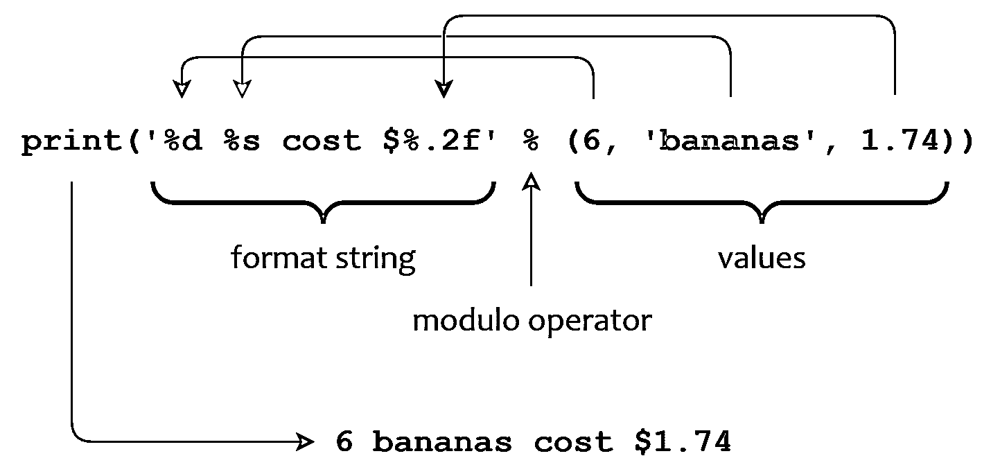

# Python 中的模字符串格式

> 原文：<https://realpython.com/python-modulo-string-formatting/>

如果你用 Python 3 编写现代 Python 代码，你可能想用 [Python f-strings](https://realpython.com/python-f-strings/) 格式化你的字符串。然而，如果您正在使用旧的 Python 代码库，您很可能会遇到用于字符串格式化的**字符串模操作符**。

如果您正在阅读或编写 Python 2 代码，熟悉这种技术会有所帮助。因为该语法在 Python 3 中仍然有效，所以您甚至可以看到开发人员在现代 Python 代码库中使用它。

**在本教程中，您将学习如何:**

*   使用**模运算符(`%` )** 进行**字符串格式化**
*   **将值**转换成**特定类型**，然后将它们插入到字符串中
*   指定格式化值占据的水平间距
*   使用**转换标志**微调显示
*   使用**字典映射**而不是元组指定值

如果你熟悉 [C](https://realpython.com/c-for-python-programmers/) 、Perl 或者 [Java](https://realpython.com/oop-in-python-vs-java/) 的 [`printf()`](https://en.wikipedia.org/wiki/Printf_format_string) 函数族，那么你会发现这些在 Python 中并不存在。然而，`printf()`和字符串模操作符之间有很多相似之处，所以如果你熟悉`printf()`，那么下面的很多内容你都会觉得熟悉。

另一方面，如果你不熟悉`printf()`，不要担心！掌握 Python 中的模字符串格式不需要任何关于`printf()`的先验知识。

**免费奖励:** ，它向您展示 Python 3 的基础知识，如使用数据类型、字典、列表和 Python 函数。

## 在 Python 中使用模运算符进行字符串格式化

您可能已经对[数字](https://realpython.com/python-numbers/)使用过[模运算符(`%` )](https://realpython.com/python-modulo-operator/) ，在这种情况下，它会计算除法的余数:

>>>

```py
>>> 11 % 3
2
```

对于字符串操作数，模运算符有一个完全不同的功能:**字符串格式化**。

**注意:**这两种操作并不十分相似。它们只有相同的名字，因为它们由相同的符号(`%`)表示。

字符串模运算符的语法如下:

```py
<format_string> % <values>
```

在`%`操作符的左边，`<format_string>`是一个包含一个或多个转换说明符的字符串。右侧的`<values>`插入到`<format_string>`中，代替转换说明符。得到的格式化字符串是表达式的值。

从一个例子开始，在这个例子中，您调用`print()`来使用字符串模运算符显示一个格式化的字符串:

>>>

```py
>>> print("%d  %s cost $%.2f" % (6, "bananas", 1.74))
6 bananas cost $1.74
```

除了表示字符串模运算本身，`%`字符还表示格式字符串中转换说明符的开始——在本例中，有三个:`%d`、`%s`和`%.2f`。

在输出中，Python 将每个项目从值元组转换为字符串值，并将其插入到格式字符串中，以代替相应的转换说明符:

*   元组中的第一项是`6`，一个代替格式字符串中的`%d`的数值。
*   下一项是字符串值`"bananas"`，替换`%s`。
*   最后一项是浮点值`1.74`，代替`%.2f`。

结果字符串是`6 bananas cost $1.74`，如下图所示:

[](https://files.realpython.com/media/t.176c482e3252.png)

<figcaption class="figure-caption text-center">The String Modulo Operator</figcaption>

如果有多个值要插入，那么它们必须包含在一个元组中，如上所示。如果只有一个值，那么可以不加括号单独写:

>>>

```py
>>> print("Hello, my name is %s." % "Graham")
Hello, my name is Graham.
```

还要注意，字符串模运算不仅仅用于打印。您也可以格式化值并将它们分配给另一个字符串[变量](https://realpython.com/python-variables/):

>>>

```py
>>> welcome_sentence = "Hello, my name is %s." % "Graham"
>>> welcome_sentence
'Hello, my name is Graham.'
```

如果您熟悉 C 编程语言中与`printf()`相关的函数，那么您可能会注意到上面显示的模字符串格式语法让人想起了`sprintf()`。如果你不是，那么不要担心！

[*Remove ads*](/account/join/)

## 了解转换说明符

转换说明符的不同组件出现在格式字符串中，并决定 Python 将值插入格式字符串时如何格式化这些值。

转换说明符以一个`%`字符开始，可以由几个按一定顺序排列的组件组成:

> `%[<flags>][<width>][.<precision>]<type>`

需要`%`字符和`<type>`组件。方括号中显示的其余组件是可选的。

下表总结了转换说明符的每个组件的作用:

| 成分 | 意义 |
| --- | --- |
| `%` | 引入转换说明符 |
| `<flags>` | 指示一个或多个对格式进行更精细控制的标志 |
| `<width>` | 指定格式化结果的最小宽度 |
| `.<precision>` | 确定浮点或字符串输出的长度和精度 |
| `<type>` | 指示要执行的转换类型 |

请继续阅读，了解更多关于这些如何工作的细节。

## 使用转换类型转换数值

转换说明符的最后一个组件`<type>`，是除了介绍性的`%`字符之外唯一必需的组件:

> `%[<flags>][<width>][.<precision>]`**`<type>`T3】**

在将值插入格式字符串之前，它确定 Python 应用于相应值的转换类型。下表列出了可能的转换类型:

| `<type>` | 转换类型 |
| --- | --- |
| `d`、`i`、`u` | [小数](https://en.wikipedia.org/wiki/Decimal)整数 |
| `x`，`X` | [十六进制](https://en.wikipedia.org/wiki/Hexadecimal)整数 |
| `o` | [八进制](https://en.wikipedia.org/wiki/Octal)整数 |
| `f`，`F` | [浮点型](https://realpython.com/python-numbers/#floating-point-numbers) |
| `e`，`E` | [E 符号](https://en.wikipedia.org/wiki/Scientific_notation#E_notation) |
| `g`，`G` | 浮点或 E 符号 |
| `c` | 单字符 |
| `s`、`r`、`a` | [字符串](https://realpython.com/python-strings/) |
| `%` | 单个`'%'`字符 |

在接下来的小节中，您将看到如何使用这些转换类型。

### 整数转换类型

`d`、`i`、`u`、`x`、`X`、`o`转换类型对应整数值。

`d`、`i`和`u`功能等同。它们都将相应的参数转换为十进制整数的字符串表示形式:

>>>

```py
>>> "%d, %i, %u" % (42, 42, 42)
'42, 42, 42'

>>> "%d, %i, %u" % (-42, -42, -42)
'-42, -42, -42'
```

该值可以是正数，也可以是负数。如果是负数，那么结果值将以减号(`-`)开始。

转换类型`x`和`X`转换为十六进制整数值的字符串表示形式，`o`转换为八进制整数值的字符串表示形式:

>>>

```py
>>> "%x, %X" % (252, 252)
'fc, FC'

>>> "%o" % 16
'20'
```

使用小写`x`产生小写输出，使用大写`X`产生大写输出。

**注意:**大写`O`不是有效的转换类型。

您可以通过使用**转换标志**获得对结果格式的额外控制，您将在下一节中了解更多关于[的内容。](#fine-tune-your-output-with-conversion-flags)

[*Remove ads*](/account/join/)

### 浮点转换类型

转换类型`f`和`F`转换成浮点数的字符串表示，而`e`和`E`产生一个表示 [E(科学)符号](https://en.wikipedia.org/wiki/Scientific_notation#E_notation)的字符串:

>>>

```py
>>> "%f, %F" % (3.14159, 3.14)
'3.141590, 3.140000'

>>> "%e, %E" % (1000.0, 1000.0)
'1.000000e+03, 1.000000E+03'
```

使用小写`f`和`e`产生小写输出，大写`F`和`E`产生大写输出。


在某些情况下，浮点运算可以产生一个实质上无穷大的值。这样的数字在 Python 中的字符串表示是`inf`。

浮点运算产生的值也可能无法用数字表示。Python 用特殊的浮点值`nan`来表示这一点。

当使用字符串模运算符转换这些值时，转换类型字符控制结果输出的大小写。`f`和`e`产生小写字符串，而`F`和`E`产生大写字符串:

>>>

```py
>>> x = float("NaN")
>>> "%f, %e, %F, %E" % (x, x, x, x)
'nan, nan, NAN, NAN'

>>> y = float("Inf")
>>> "%f, %e, %F, %E" % (y, y, y, y)
'inf, inf, INF, INF'
```

这些转换类型的小写和大写版本之间的唯一区别是，它们分别产生小写和大写字符串输出。这种差异甚至延伸到浮点数的 E 记法输出中`e`和`E`的大小写。

根据指数的大小和您为`.<precision>`组件指定的值，`g`和`G`转换类型在浮点或 E 符号输出之间进行选择:

>>>

```py
>>> "%g" % 3.14
'3.14'

>>> "%g" % 0.00000003
'3e-08'

>>> "%G" % 0.00000003
'3E-08'
```

如果指数小于`-4`或不小于`.<precision>`，则输出与`e`或`E`相同。否则，与`f`或`F`相同。在本教程的后面，你将会学到更多关于 [`.<precision>`组件](#the-precision-component)的知识。

**注:**你可以把这些转换类型看成是做出合理的选择。如果有问题的值合理地适合它，它们将产生浮点输出，否则产生 E 符号。

与其他浮点转换类型类似，`g`产生小写输出，`G`产生大写输出。

### 字符转换类型

`c`转换类型插入单个字符。相应的值可以是整数或单个字符串:

>>>

```py
>>> "%c" % 97
'a'

>>> "%c" % "y"
'y'
```

如果您提供一个整数，那么 Python 会将其翻译成相应的[可打印字符](https://en.wikipedia.org/wiki/ASCII#Printable_characters)。这种转换类型也支持转换成 [Unicode](https://realpython.com/python-encodings-guide/) 字符:

>>>

```py
>>> "%c" % 8721
'∑'
```

您可以使用`%c`并传递 ASCII 或 Unicode 字符的代码点，以便在您的字符串中很好地呈现它。

转换类型`s`、`r`和`a`分别使用内置函数 [`str()`](https://docs.python.org/3/library/stdtypes.html#str) 、 [`repr()`](https://docs.python.org/3/library/functions.html#repr) 和 [`ascii()`](https://docs.python.org/3/library/functions.html#ascii) 产生字符串输出:

>>>

```py
>>> "%s" % "Café ☕️"
'Café ☕️'

>>> "%r" % "Café ☕️"
"'Café ☕️'"

>>> "%a" % "Café ☕️"
"'Caf\\xe9 \\u2615\\ufe0f'"
```

当您使用`%a`时，Python 将 Unicode 字符转换成它们的 ASCII 表示。

很快您就会看到，您可以使用`<width>`和`.<precision>`转换说明符组件来控制字符串输出的对齐和填充。

[*Remove ads*](/account/join/)

### 文字百分比字符(`%%` )

要在输出中插入一个百分比字符(`%`)，可以在格式字符串中指定两个连续的百分比字符(`%%`)。第一个百分比字符引入一个转换说明符，第二个百分比字符指定转换类型为`%`。

这种格式会在输出中产生一个百分比字符(`%`):

>>>

```py
>>> "Get %d%% off on %s today only!" % (30, "bananas")
'Get 30% off on bananas today only!'
```

此代码示例中的子字符串`%d%%`表示两种相互跟随的转换类型:

1.  **`%d`** 表示十进制整数转换类型。
2.  **`%%`** 代表文字百分比字符，呈现为`%`。

注意，`%%`转换类型不消耗字符串模操作符(`30, "bananas"`)右边显示的两个`<values>`中的任何一个。如果您需要在字符串中呈现一个文字百分比字符，您可以将这种转换类型视为一种转义百分比字符的方法。

## 使用宽度和精度水平对齐数据

`<width>`和`.<precision>`组件位于转换说明符的中间:

> `%[<flags>]`**`[<width>][.<precision>]`**T2】

您可以单独使用它们，也可以相互结合使用。它们通过更改字符串填充或 Python 显示的值的总长度来确定格式化值占用的水平空间。

### `<width>`组件

您可以通过使用`<width>`组件来确定输出字段的最小宽度。如果输出比`<width>`短，那么默认情况下，它在一个`<width>`字符宽的字段中右对齐，并在左边用 ASCII 空格字符填充:

>>>

```py
>>> "%5s" % "foo"
'  foo'

>>> "%3d" % 4
'  4'
```

第一个字符串`"foo"`，长度为三个字符。因为您使用`5`作为`<width>`转换说明符组件，所以 Python 在添加`"foo"`之前添加了两个空白字符，以构建一个总长度为五个字符的字符串。

在第二个例子中，您使用一位数的数字`4`作为输入值，并请求三个字符的字符串宽度。因此，Python 在插入字符串表示形式`4`之前再次添加了两个空白字符，以构建总长度为三个字符的最终字符串。

您可以修改对齐方式以及 Python 应该使用的填充字符。在下面的[转换标志](#fine-tune-your-output-with-conversion-flags)一节中，你会学到更多关于如何做的内容。

如果输出长度大于`<width>`，则`<width>`无效:

>>>

```py
>>> "%2d" % 1234
'1234'
>>> "%d" % 1234
'1234'

>>> "%2s" % "foobar"
'foobar'
>>> "%s" % "foobar"
'foobar'
```

这些例子中的每一个都指定了字段宽度`2`。但是因为您要求 Python 格式化的值的长度超过两个字符，所以结果与您根本没有指定`<width>`时是一样的。

[*Remove ads*](/account/join/)

### `.<precision>`组件

`.<precision>`转换说明符组件影响[浮点转换类型](#floating-point-conversion-types)和[字符转换类型](#character-conversion-types)。

对于浮点转换类型`f`、`F`、`e`和`E`，`.<precision>`决定小数点后的位数:

>>>

```py
>>> "%.2f" % 123.456789
'123.46'

>>> "%.2e" % 123.456789
'1.23e+02'
```

对于浮点转换类型`g`和`G`，`.<precision>`决定小数点前后的有效位数:

>>>

```py
>>> "%.2g" % 123.456789
'1.2e+02'
```

用`s`、`r`和`a`字符转换类型格式化的字符串值被截断到由`.<precision>`组件指定的长度:

>>>

```py
>>> "%.4s" % "foobar"
'foob'
```

在这个例子中，您的输入值`"foobar"`的长度是 6 个字符，但是您已经将`.<precision>`设置为`4`。因此 Python 只显示输入字符串的前四个字符。

你可能还会看到`<width>`和`.<precision>`一起使用:

>>>

```py
>>> "%8.2f" % 123.45678
'  123.46'

>>> "%8.3s" % "foobar"
'     foo'
```

您可以使用星号(`*`)作为占位符来指定`<width>`和`.<precision>`。如果这样做，Python 会从`<values>`元组中的项目中为它们取值:

>>>

```py
>>> "%*d" % (10, 123)
'       123'

>>> "%.*d" % (10, 123)
'0000000123'

>>> "%*.*d" % (10, 5, 123)
'     00123'
```

当你的`<width>`值是一个常量时，你可能不需要使用这个。在上例中使用占位符和直接添加值之间没有任何功能差异:

>>>

```py
>>> "%10d" % 123
'       123'

>>> "%.10d" % 123
'0000000123'

>>> "%10.5d" % 123
'     00123'
```

当您使用变量指定宽度或精度时，使用占位符星号会变得更有趣:

>>>

```py
>>> for i in range(3):
...     w = int(input("Enter width: "))
...     print("[%*s]" % (w, "foo"))
...
Enter width: 2
[foo]
Enter width: 4
[ foo]
Enter width: 8
[     foo]
```

使用这种语法，您可以在运行时确定宽度和精度，这意味着它们可能会随着执行的不同而变化。

## 使用转换标志微调输出

您可以在第一个`%`字符后指定可选的转换标志:

> `%`**`[<flags>]`**T2】

这些允许您更详细地控制某些转换类型的显示。转换说明符的`<flags>`组件可以包括下表中显示的任何字符:

| 性格；角色；字母 | 控制 |
| --- | --- |
| `#` | 整数和浮点值的小数点或小数点显示 |
| `0` | 短于指定字段宽度的值的填充 |
| `-` | 比指定字段宽度短的值的对齐 |
| `+` | 数值前导符号的显示 |
| `' '`(空格) | 数值前导符号的显示 |

下面几节更详细地解释了转换标志是如何操作的。

[*Remove ads*](/account/join/)

### 哈希标志(`#` )

`#`标志使基本信息包含在八进制和十六进制转换类型的格式化输出中。对于`o`转换类型，该标志添加一个前导`"0o"`。对于`x`和`X`转换类型，增加一个前导`"0x"`或`"0X"`:

>>>

```py
>>> "%#o" % 16
'0o20'

>>> "%#x" % 16, "%#X" % 16
('0x10', '0X10')
```

对于十进制转换类型`d`、`i`和`u`，忽略`#`标志。

对于浮点值，`#`标志强制输出总是包含小数点。通常，如果小数点后没有任何数字，浮点值将不包含小数点。此标志强制包含小数点:

>>>

```py
>>> "%.0f" % 123
'123'
>>> "%#.0f" % 123
'123.'

>>> "%.0e" % 123
'1e+02'
>>> "%#.0e" % 123
'1.e+02'
```

通过使用`#`标志强制包含小数点也适用于以 E 表示法显示的值，如示例代码片段所示。

### 零标志(`0` )

当格式化数值短于指定的字段宽度时，默认行为是在值的左侧用 ASCII 空格字符填充字段。`0`标志导致用`"0"`字符填充:

>>>

```py
>>> "%05d" % 123
'00123'

>>> "%08.2f" % 1.2
'00001.20'
```

`0`标志可用于所有的数字转换类型:`d`、`i`、`u`、`x`、`X`、`o`、`f`、`F`、`e`、`E`、`g`和`G`。

### 连字符减号标志(`-` )

当格式化值短于指定的字段宽度时，它通常在字段中右对齐。连字符减号(`-`)标志使值在指定字段中左对齐:

>>>

```py
>>> "%-5d" % 123
'123  '

>>> "%-8.2f" % 123.3
'123.30  '

>>> "%-*s" % (10, "foo")
'foo       '
```

您可以对字符串转换类型`s`、`a`和`r`以及所有数字转换类型使用`-`标志。对于数字类型，如果`0`和`-`都存在，那么`0`被忽略。

### 加号标志(`+` )

默认情况下，正数值没有前导符号字符。`+`标志在数字输出的左侧添加一个加号(`+`):

>>>

```py
>>> "%+d" % 3
'+3'

>>> "%+5d" % 3
'   +3'

>>> "%5d" % 3
'    3'
```

在比较最后两个输出时，您可能会注意到 Python 在计算输出的宽度时考虑了您使用该标志添加的`+`字符。

此标志不影响负数值，它总是有一个前导减号(`-`)。与加号字符一样，Python 在计算输出宽度时也会考虑减号字符。

[*Remove ads*](/account/join/)

### 空格字符标志(`' '` )

空格字符标志(`' '`)在正数值前添加一个空格字符:

>>>

```py
>>> "% d" % 3
' 3'
```

就像`+`标志一样，这个标志也不影响负数值，它总是有一个前导减号(`-`):

>>>

```py
>>> "% d" % 3
' 3'

>>> "% d" % -3
'-3'
>>> "%d" % -3
'-3'
```

使用`+`标志或空格字符标志可以帮助您一致地对齐正值和负值的混合。

## 通过字典映射指定值

您可以将插入到格式字符串中的`<values>`指定为字典，而不是元组。在这种情况下，每个转换说明符必须包含紧跟在`%`字符后面的括号中的字典键之一:

>>>

```py
>>> "%d  %s cost $%.2f" % (6, "bananas", 1.74)
'6 bananas cost $1.74'

>>> data = {"quantity": 6, "item": "bananas", "price": 1.74} >>> template = "%(quantity)d  %(item)s cost $%(price).2f" >>> template % data
'6 bananas cost $1.74'
```

通过使用这种技术，您可以按任意顺序指定插入的值:

>>>

```py
>>> data = {"quantity": 6, "item": "bananas", "price": 1.74}

>>> ad_1 = "%(quantity)d  %(item)s cost $%(price).2f" >>> ad_1 % data
'6 bananas cost $1.74'

>>> ad_2 = "You'll pay $%(price).2f for %(item)s, if you buy %(quantity)d" >>> ad_2 % data
"You'll pay $1.74 for bananas, if you buy 6"
```

上面显示的所有转换说明符组件——`<flags>`、`<width>`、`.<precision>`和`<type>`——仍然以与使用元组输入值时相同的方式工作。当您将`<values>`指定为词典时，您可以使用其中任何一个:

>>>

```py
>>> "Quantity: %(quantity)03d" % data
'Quantity: 006'

>>> "Item: %(item).5s" % data
'Item:     banan'
```

在上面的示例代码片段中，您在第一个示例中使用了结合了`<width>`的`0`标志，在第二个示例中使用了值为`5`的`.<precision>`。

**注意:**如果通过字典映射指定`<values>`，那么就不能用星号占位符(`*`)来指定`<width>`或者`.<precision>`。

如果您只想定义一次数据，并且可能会在不同的输出中切换显示顺序，则通过字典映射指定输入值特别有用。

## 结论

至此，您已经了解了很多关于**字符串模操作符**的知识。这是 Python 中一种比较老的字符串格式化方法。因为这种技术仍然有效，并且在 Python 2 中被广泛使用，所以理解这种语法的基础是有帮助的。

**在本教程中，您已经学会了如何:**

*   使用**模运算符(`%` )** 进行**字符串格式化**
*   **将值**转换成**特定类型**，然后将它们插入到字符串中
*   指定格式化值占据的**水平间距**
*   使用**转换标志**微调显示
*   使用**字典映射**而不是元组指定值

尽管 string modulo 操作符功能多样，Python 提供了更好的格式化字符串数据的[新方法:string `.format()`方法和格式化的字符串文字，通常称为](https://realpython.com/python-formatted-output/) [**f-string**](https://realpython.com/python-f-strings/) 。******