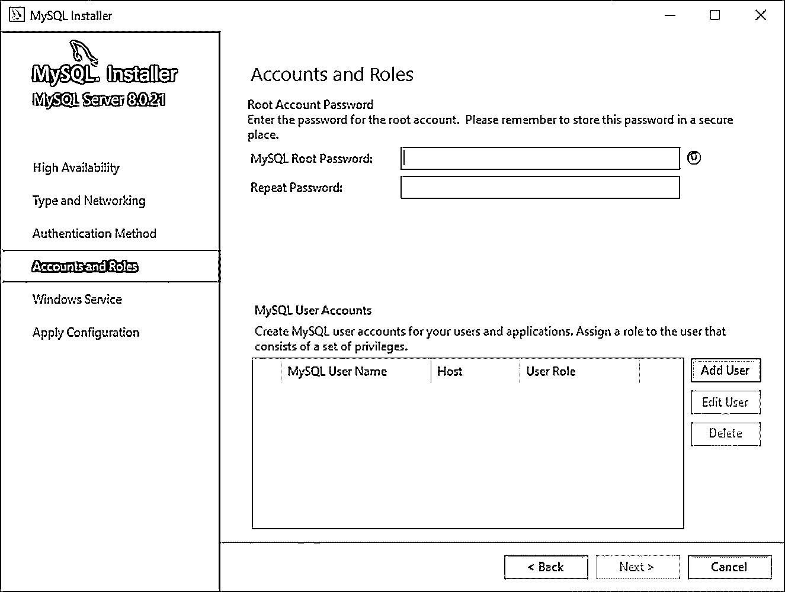
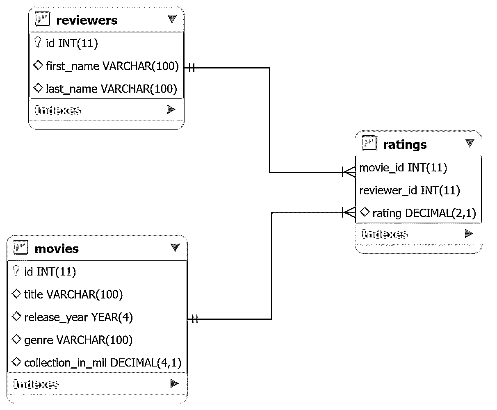

# Python 和 MySQL 数据库:实用介绍

> 原文：<https://realpython.com/python-mysql/>

MySQL 是当今市场上最流行的[数据库管理系统(DBMS)](https://en.wikipedia.org/wiki/Database#Database_management_system)之一。在今年的 [DB-Engines 排名](https://db-engines.com/en/ranking)中，它仅次于 [Oracle DBMS](https://docs.oracle.com/cd/E11882_01/server.112/e40540/intro.htm) 位列第二。由于大多数软件应用程序需要以某种形式与数据进行交互，像 Python 这样的编程语言提供了存储和访问这些数据源的工具。

使用本教程中讨论的技术，您将能够有效地集成 MySQL 数据库和 Python 应用程序。您将为电影分级系统开发一个小型 MySQL 数据库，并学习如何直接从 Python 代码中查询它。

**本教程结束时，你将能够:**

*   确定 **MySQL** 的独特功能
*   **将您的应用程序**连接到 MySQL 数据库
*   查询数据库**获取所需数据**
*   **处理访问数据库时发生的异常**
*   在构建数据库应用程序时使用**最佳实践**

为了从本教程中获得最大收益，您应该具备 Python 概念的工作知识，如 [`for`循环](https://realpython.com/python-for-loop/)、[函数](https://realpython.com/defining-your-own-python-function/)、[异常处理](https://realpython.com/python-exceptions/)，以及使用 [`pip`](https://realpython.com/what-is-pip/) 安装 Python 包。您还应该对关系数据库管理系统和 SQL 查询有一个基本的了解，比如`SELECT`、`DROP`、`CREATE`和`JOIN`。

**免费下载:** [从 Python 技巧中获取一个示例章节:这本书](https://realpython.com/bonus/python-tricks-sample-pdf/)用简单的例子向您展示了 Python 的最佳实践，您可以立即应用它来编写更漂亮的+Python 代码。

## 将 MySQL 与其他 SQL 数据库进行比较

**SQL** 代表[结构化查询语言](https://en.wikipedia.org/wiki/SQL)，是一种广泛用于管理关系数据库的编程语言。您可能听说过不同风格的基于 SQL 的 DBMSs。最流行的有 [MySQL](https://www.mysql.com/) 、 [PostgreSQL](https://www.postgresql.org/) 、 [SQLite](https://www.sqlite.org/index.html) 、 [SQL Server](https://www.microsoft.com/en-us/sql-server/sql-server-2019) 。所有这些数据库都符合 [SQL 标准](https://docs.oracle.com/cd/B28359_01/server.111/b28286/intro002.htm)，但符合程度各不相同。

自 1995 年成立以来，MySQL 一直是开源的，并迅速成为 SQL 解决方案的市场领导者。MySQL 也是 Oracle 生态系统的一部分。虽然它的核心功能是完全免费的，但也有一些付费的附加功能。目前，所有主要的科技公司都在使用 MySQL，包括谷歌、LinkedIn、优步、网飞、Twitter 等。

除了大型开源社区的支持，MySQL 的成功还有许多其他原因:

1.  **易于安装:** MySQL 的设计是用户友好的。建立一个 MySQL 数据库非常简单，一些广泛可用的第三方工具，如 [phpMyAdmin](https://www.phpmyadmin.net/) ，进一步简化了设置过程。MySQL 适用于所有主流操作系统，包括 Windows、macOS、Linux 和 Solaris。

2.  速度: MySQL 以其极快的数据库解决方案而闻名。它占用的空间相对较小，并且从长远来看非常具有可伸缩性。

3.  **用户权限和安全性:** MySQL 附带了一个脚本，允许您设置密码安全级别、分配管理员密码以及添加和删除用户帐户权限。此脚本完成了虚拟主机用户管理门户的管理过程。其他 DBMSs，如 PostgreSQL，使用更复杂的[配置文件](https://www.postgresql.org/docs/9.3/config-setting.html)。

虽然 MySQL 以其速度和易用性而闻名，但你可以通过 PostgreSQL 获得更多的[高级特性](https://www.postgresqltutorial.com/postgresql-vs-mysql/)。此外，MySQL 并不完全符合 SQL，并且有一定的功能限制，比如不支持`FULL JOIN`子句。

在 MySQL 中，您可能还会面临一些并发读写的[问题。如果您的软件有许多用户同时向其写入数据，那么 PostgreSQL 可能是更合适的选择。](https://dev.mysql.com/doc/refman/5.7/en/concurrent-inserts.html)

**注:**要在现实环境中更深入地比较 MySQL 和 PostgreSQL，请查看[为什么优步工程公司从 Postgres 转向 MySQL](https://eng.uber.com/postgres-to-mysql-migration/) 。

SQL Server 也是一种非常流行的 DBMS，以其可靠性、效率和安全性而闻名。这是公司的首选，尤其是在银行领域，他们经常处理大量的流量工作负载。这是一个商业解决方案，也是与 Windows 服务最兼容的系统之一。

2010 年，当[甲骨文](https://en.wikipedia.org/wiki/Oracle_Corporation)收购[太阳微系统](https://en.wikipedia.org/wiki/Sun_Microsystems)和 MySQL 时，许多人担心 MySQL 的未来。当时，甲骨文是 MySQL 最大的竞争对手。开发者担心这是甲骨文的恶意收购，目的是摧毁 MySQL。

以 MySQL 的原作者 [Michael Widenius](https://en.wikipedia.org/wiki/Michael_Widenius) 为首的几位开发人员创建了 MySQL 代码库的一个[分支](https://en.wikipedia.org/wiki/Fork_(software_development))，奠定了 [MariaDB](https://mariadb.org/) 的基础。目的是保护对 MySQL 的访问，并让它永远免费。

到目前为止，MariaDB 仍然完全被 GPL 许可，完全处于公共领域。另一方面，MySQL 的一些特性只有付费许可才能使用。另外，MariaDB 提供了几个 MySQL 服务器不支持的非常有用的特性，比如[分布式 SQL](https://mariadb.com/resources/blog/mariadb-adds-xpand-for-distributed-sql/) 和[列存储](http://www.inf.ufpr.br/eduardo/ensino/ci809/papers/p967-abadi.pdf)。你可以在 [MariaDB 的网站](https://mariadb.com/products/mariadb-platform/comparison/)上找到更多 MySQL 和 MariaDB 的区别。

MySQL 使用与标准 SQL 非常相似的语法。然而，[官方文档](https://dev.mysql.com/doc/refman/8.0/en/differences-from-ansi.html)中提到了一些显著的差异。

[*Remove ads*](/account/join/)

## 安装 MySQL 服务器和 MySQL 连接器/Python

现在，要开始学习本教程，您需要设置两件事情:一个 **MySQL 服务器**和一个 **MySQL 连接器**。MySQL 服务器将提供处理您的数据库所需的所有服务。一旦服务器启动并运行，您就可以使用 MySQL Connector/Python 将您的 Python 应用程序与其连接起来。

### 安装 MySQL 服务器

[官方文档](https://dev.mysql.com/doc/refman/5.7/en/installing.html)详细介绍了下载和安装 MySQL 服务器的推荐方法。你会找到所有流行操作系统的说明，包括 [Windows](https://dev.mysql.com/doc/refman/8.0/en/windows-installation.html) 、 [macOS](https://dev.mysql.com/doc/refman/8.0/en/osx-installation.html) 、 [Solaris](https://dev.mysql.com/doc/refman/8.0/en/solaris-installation.html) 、 [Linux](https://dev.mysql.com/doc/refman/8.0/en/linux-installation.html) 等等。

对于 Windows，最好的方法是下载 [MySQL 安装程序](https://dev.mysql.com/downloads/installer/)，让它负责整个过程。安装管理器还可以帮助您配置 MySQL 服务器的安全设置。在 Accounts and Roles 页面上，您需要为 **root** (admin)帐户输入一个密码，还可以选择添加具有不同权限的其他用户:

[](https://files.realpython.com/media/root_user_pass.cf4a9c6ea5f5.png)

<figcaption class="figure-caption text-center">MySQL Installer Account Setup</figcaption>

虽然您必须在安装过程中为 root 帐户指定凭据，但您可以在以后修改这些设置。

**注意:**记住主机名、用户名和密码，因为稍后需要它们来建立与 MySQL 服务器的连接。

虽然本教程只需要 MySQL 服务器，但是您也可以使用这些安装程序设置其他有用的工具，如 [MySQL Workbench](https://www.mysql.com/products/workbench/) 。如果你不想在你的操作系统中直接安装 MySQL，那么[用 Docker](https://dev.mysql.com/doc/refman/8.0/en/linux-installation-docker.html) 在 Linux 上部署 MySQL 是一个方便的选择。

### 安装 MySQL 连接器/Python

[数据库驱动](https://docs.microsoft.com/en-us/sql/odbc/reference/dbms-based-drivers)是一个软件，它允许应用程序连接数据库系统并与之交互。像 Python 这样的编程语言需要一个特殊的驱动程序，才能与特定供应商的数据库对话。

这些驱动程序通常作为第三方模块获得。 **Python 数据库 API** (DB-API)定义了所有 Python 数据库驱动必须遵守的标准接口。这些细节记录在 [PEP 249](https://www.python.org/dev/peps/pep-0249/) 中。所有的 Python 数据库驱动，比如 sqlite 的 [sqlite3](https://docs.python.org/3/library/sqlite3.html) ，PostgreSQL 的 [psycopg](https://www.psycopg.org/docs/) ，MySQL 的 [MySQL Connector/Python](https://github.com/mysql/mysql-connector-python) 都遵循这些实现规则。

**注意:** MySQL 的官方文档使用了术语**连接器**而不是**驱动**。从技术上讲，连接器只与连接到数据库相关联，而不与数据库交互。然而，该术语通常用于整个数据库访问模块，包括连接器*和驱动程序*。

为了与文档保持一致，只要提到 MySQL，您就会看到术语**连接器**。

许多流行的编程语言都有自己的数据库 API。例如，Java 有 [Java 数据库连接(JDBC)](https://docs.oracle.com/javase/8/docs/technotes/guides/jdbc/) API。如果你需要将一个 Java 应用程序连接到一个 MySQL 数据库，那么你需要使用 [MySQL JDBC 连接器](https://dev.mysql.com/doc/connector-j/8.0/en/)，它遵循 JDBC API。

类似地，在 Python 中，您需要安装一个 Python MySQL 连接器来与 MySQL 数据库交互。许多软件包遵循 DB-API 标准，但其中最流行的是 [MySQL Connector/Python](https://dev.mysql.com/doc/connector-python/en/) 。可以用 [`pip`](https://realpython.com/what-is-pip/) 得到:

```py
$ pip install mysql-connector-python
```

`pip`将连接器作为第三方模块安装在当前活动的虚拟环境中。建议您为项目以及所有依赖项设置一个[隔离虚拟环境](https://realpython.com/python-virtual-environments-a-primer/)。

要测试安装是否成功，请在 Python 终端上键入以下命令:

>>>

```py
>>> import mysql.connector
```

如果上面的代码执行时没有错误，那么`mysql.connector`就安装好了，可以使用了。如果您遇到任何错误，那么请确保您处于正确的虚拟环境中，并且使用了正确的 Python 解释器。

确保你正在安装正确的 [`mysql-connector-python`](https://pypi.org/project/mysql-connector-python/) 包，这是一个纯 Python 实现。小心类似的名字，但现在贬值的连接器，如 [`mysql-connector`](https://pypi.org/project/mysql-connector/) 。

[*Remove ads*](/account/join/)

## 与 MySQL 服务器建立连接

MySQL 是一个基于**服务器的**数据库管理系统。一台服务器可能包含多个数据库。要与数据库交互，必须首先与服务器建立连接。与基于 MySQL 的数据库交互的 Python 程序的一般工作流程如下:

1.  连接到 MySQL 服务器。
2.  创建新的数据库。
3.  连接到新创建的或现有的数据库。
4.  执行 SQL 查询并获取结果。
5.  如果对表进行了任何更改，请通知数据库。
6.  关闭与 MySQL 服务器的连接。

这是一个通用的工作流程，可能因具体应用而异。但是不管应用程序是什么，第一步是将数据库与应用程序连接起来。

### 建立连接

与 MySQL 服务器交互的第一步是建立连接。为此，您需要来自`mysql.connector`模块的 [`connect()`](https://dev.mysql.com/doc/connector-python/en/connector-python-api-mysql-connector-connect.html) 。该函数接受`host`、`user`、`password`等参数，并返回一个 [`MySQLConnection`](https://dev.mysql.com/doc/connector-python/en/connector-python-example-connecting.html) 对象。您可以从用户那里接收这些凭证作为输入，并将它们传递给`connect()`:

```py
from getpass import getpass
from mysql.connector import connect, Error

try:
    with connect(
        host="localhost",
        user=input("Enter username: "),
        password=getpass("Enter password: "),
    ) as connection:
        print(connection)
except Error as e:
    print(e)
```

上面的代码使用输入的登录凭证建立与 MySQL 服务器的连接。作为回报，您得到一个`MySQLConnection`对象，它存储在`connection`变量中。从现在开始，你将使用这个[变量](https://realpython.com/python-variables/)来访问你的 MySQL 服务器。

在上面的代码中有几件重要的事情需要注意:

*   您应该始终处理在建立到 MySQL 服务器的连接时可能出现的[异常](https://dev.mysql.com/doc/connector-python/en/connector-python-api-errors.html)。这就是为什么您使用 [`try` … `except`](https://realpython.com/python-exceptions/) 块来捕捉和打印您可能遇到的任何异常。

*   在访问完数据库后，您应该总是关闭连接。不使用打开的连接会导致一些意外错误和性能问题。上面的代码利用了使用`with` 的[上下文管理器，它抽象出了连接清理过程。](https://www.youtube.com/watch?v=iba-I4CrmyA)

*   你应该*永远不要在 Python 脚本中直接硬编码你的登录凭证*，也就是你的用户名和密码。这对于部署来说是一个糟糕的做法，并且给[带来了严重的安全威胁](https://qz.com/674520/companies-are-sharing-their-secret-access-codes-on-github-and-they-may-not-even-know-it/)。上面的代码提示用户输入登录凭证。它使用内置的 [`getpass`](https://docs.python.org/3/library/getpass.html) 模块隐藏密码。虽然这比硬编码要好，但是还有其他更安全的方法来存储敏感信息，比如使用[环境变量](https://www.youtube.com/watch?v=5iWhQWVXosU)。

现在您已经在您的程序和 MySQL 服务器之间建立了一个连接，但是您仍然需要创建一个新的数据库或者连接到服务器内部的一个现有数据库。

### 创建新数据库

在上一节中，您建立了与 MySQL 服务器的连接。要创建新的数据库，您需要执行一条 SQL 语句:

```py
CREATE  DATABASE  books_db;
```

上面的语句将创建一个名为`books_db`的新数据库。

**注意:**在 MySQL 中，必须在语句末尾加上分号(`;`)，表示查询的终止。然而，MySQL Connector/Python 会自动在查询的末尾附加一个分号，所以不需要在 Python 代码中使用它。

要在 Python 中执行 SQL 查询，您需要使用一个[光标](https://en.wikipedia.org/wiki/Cursor_(databases))，它抽象出对数据库记录的访问。MySQL Connector/Python 为你提供了 [`MySQLCursor`](https://dev.mysql.com/doc/connector-python/en/connector-python-api-mysqlcursor.html) 类，实例化了可以在 Python 中执行 MySQL 查询的对象。`MySQLCursor`类的一个实例也被称为`cursor`。

`cursor`对象利用一个`MySQLConnection`对象与你的 MySQL 服务器交互。要创建一个`cursor`，使用`connection`变量的`.cursor()`方法:

```py
cursor = connection.cursor()
```

上面的代码给出了一个`MySQLCursor`类的实例。

需要执行的查询以[字符串](https://realpython.com/python-strings/)格式发送给 [`cursor.execute()`](https://dev.mysql.com/doc/connector-python/en/connector-python-api-mysqlcursor-execute.html) 。在这个特殊的场合，您将把`CREATE DATABASE`查询发送给`cursor.execute()`:

```py
from getpass import getpass
from mysql.connector import connect, Error

try:
    with connect(
        host="localhost",
        user=input("Enter username: "),
        password=getpass("Enter password: "),
    ) as connection:
 create_db_query = "CREATE DATABASE online_movie_rating" with connection.cursor() as cursor: cursor.execute(create_db_query) except Error as e:
    print(e)
```

在执行了上面的代码之后，您将在 MySQL 服务器中拥有一个名为`online_movie_rating`的新数据库。

`CREATE DATABASE`查询作为字符串存储在`create_db_query`变量中，然后传递给`cursor.execute()`执行。代码使用带有`cursor`对象的上下文管理器来处理清理过程。

如果您的服务器中已经存在同名的数据库，您可能会收到一条错误消息。要确认这一点，您可以显示服务器中所有数据库的名称。使用前面的同一个`MySQLConnection`对象，执行 [`SHOW DATABASES`语句](https://dev.mysql.com/doc/refman/8.0/en/show-databases.html):

>>>

```py
>>> show_db_query = "SHOW DATABASES"
>>> with connection.cursor() as cursor:
...     cursor.execute(show_db_query)
...     for db in cursor:
...         print(db)
...
('information_schema',)
('mysql',)
('online_movie_rating',)
('performance_schema',)
('sys',)
```

上面的代码[打印了【MySQL 服务器中当前所有数据库的名称。`SHOW DATABASES`命令还输出一些不是在服务器上创建的数据库，比如](https://realpython.com/python-print/) [`information_schema`](https://dev.mysql.com/doc/refman/8.0/en/information-schema.html) 、 [`performance_schema`](https://dev.mysql.com/doc/refman/8.0/en/performance-schema-system-variables.html) 等等。这些数据库由 MySQL 服务器自动生成，并提供对各种数据库元数据和 MySQL 服务器设置的访问。

通过执行 [`CREATE DATABASE`语句](https://dev.mysql.com/doc/refman/5.7/en/create-database.html)，您在这个部分中创建了一个新的数据库。在下一节中，您将看到如何连接到一个已经存在的数据库。

[*Remove ads*](/account/join/)

### 连接到现有数据库

在上一节中，您创建了一个名为`online_movie_rating`的新数据库。然而，你仍然没有连接到它。在许多情况下，您已经有了一个 MySQL 数据库，并希望将其与 Python 应用程序连接起来。

您可以通过发送一个名为`database`的额外参数，使用之前使用的相同的`connect()`函数来实现这一点:

```py
from getpass import getpass
from mysql.connector import connect, Error

try:
    with connect(
        host="localhost",
        user=input("Enter username: "),
        password=getpass("Enter password: "),
 database="online_movie_rating",    ) as connection:
        print(connection)
except Error as e:
    print(e)
```

上面的代码与您之前使用的连接脚本非常相似。这里唯一的变化是一个额外的`database`参数，其中数据库的名称被传递给`connect()`。一旦您执行了这个脚本，您将连接到`online_movie_rating`数据库。

## 创建、修改和删除表格

在本节中，您将学习如何使用 Python 执行一些基本的 [DDL](https://en.wikipedia.org/wiki/Data_definition_language) 查询，如`CREATE`、`DROP`和`ALTER`。您将快速浏览一下将在本教程的剩余部分使用的 MySQL 数据库。您还将创建数据库所需的所有表，并学习稍后如何对这些表进行修改。

### 定义数据库模式

首先，您可以为在线电影分级系统创建一个数据库模式。该数据库将由三个表组成:

1.  **`movies`** 包含关于电影的一般信息，具有以下属性:
    *   `id`
    *   `title`
    *   `release_year`
    *   `genre`
    *   `collection_in_mil`
2.  **`reviewers`** 包含发布评论或评级的人的信息，具有以下属性:
    *   `id`
    *   `first_name`
    *   `last_name`
3.  **`ratings`** 包含已发布的评级信息，具有以下属性:
    *   `movie_id`(外键)
    *   `reviewer_id`(外键)
    *   `rating`

一个真实世界的电影分级系统，比如 [IMDb](https://www.imdb.com/) ，需要存储一堆其他属性，比如电子邮件、电影演员名单等等。如果需要，可以向该数据库添加更多的表和属性。但是这三个表足以满足本教程的目的。

下图描述了数据库模式:

[](https://files.realpython.com/media/schema.2e80e67d2ae1.png)

<figcaption class="figure-caption text-center">Schema Diagram for an Online Movie Rating System</figcaption>

这个数据库中的表是相互关联的。`movies`和`reviewers`将具有**多对多**的关系，因为一部电影可以由多个评论者评论，而一个评论者可以评论多部电影。`ratings`工作台连接`movies`工作台和`reviewers`工作台。

### 使用`CREATE TABLE`语句创建表格

现在，要在 MySQL 中创建一个新表，需要使用 [`CREATE TABLE`语句](https://dev.mysql.com/doc/refman/8.0/en/create-table.html)。以下 MySQL 查询将为您的`online_movie_rating`数据库创建`movies`表:

```py
CREATE  TABLE  movies( id  INT  AUTO_INCREMENT  PRIMARY  KEY, title  VARCHAR(100), release_year  YEAR(4), genre  VARCHAR(100), collection_in_mil  INT );
```

如果您以前看过 SQL 语句，那么上面的大多数查询可能是有意义的。但是在 MySQL 语法中有一些差异，您应该知道。

例如，MySQL 有各种各样的[数据类型](https://dev.mysql.com/doc/refman/5.7/en/data-types.html)供您阅读，包括`YEAR`、`INT`、`BIGINT`等等。此外，当插入新记录时必须自动增加列值时，MySQL 使用`AUTO_INCREMENT`关键字。

要创建一个新表，您需要将这个查询传递给`cursor.execute()`，它接受一个 MySQL 查询并在连接的 MySQL 数据库上执行该查询:

```py
create_movies_table_query = """
CREATE TABLE movies(
 id INT AUTO_INCREMENT PRIMARY KEY,
 title VARCHAR(100),
 release_year YEAR(4),
 genre VARCHAR(100),
 collection_in_mil INT
)
"""
with connection.cursor() as cursor:
    cursor.execute(create_movies_table_query)
 connection.commit()
```

现在数据库中有了`movies`表。您将`create_movies_table_query`传递给`cursor.execute()`，后者执行所需的执行。

**注意:**`connection`变量指的是连接到数据库时返回的`MySQLConnection`对象。

另外，注意代码末尾的 [`connection.commit()`](https://dev.mysql.com/doc/connector-python/en/connector-python-api-mysqlconnection-commit.html) 语句。默认情况下，MySQL 连接器不会自动提交[事务](https://dev.mysql.com/doc/refman/8.0/en/glossary.html#glos_transaction)。在 MySQL 中，事务中提到的修改只有在最后使用`COMMIT`命令时才会发生。每次事务处理后都要调用此方法来执行实际表中的更改。

正如您对`movies`表所做的那样，执行以下脚本来创建`reviewers`表:

```py
create_reviewers_table_query = """
CREATE TABLE reviewers (
 id INT AUTO_INCREMENT PRIMARY KEY,
 first_name VARCHAR(100),
 last_name VARCHAR(100)
)
"""
with connection.cursor() as cursor:
    cursor.execute(create_reviewers_table_query)
    connection.commit()
```

如果需要，您可以添加关于审阅者的更多信息，例如他们的电子邮件 ID 或人口统计信息。但是现在`first_name`和`last_name`将为你的目的服务。

最后，您可以使用以下脚本创建`ratings`表:

```py
create_ratings_table_query = """
CREATE TABLE ratings (
 movie_id INT,
 reviewer_id INT,
 rating DECIMAL(2,1),
 FOREIGN KEY(movie_id) REFERENCES movies(id),
 FOREIGN KEY(reviewer_id) REFERENCES reviewers(id),
 PRIMARY KEY(movie_id, reviewer_id)
)
"""
with connection.cursor() as cursor:
    cursor.execute(create_ratings_table_query)
    connection.commit()
```

与标准 SQL 相比，MySQL 中外键关系的实现略有不同，并且受限于[。在 MySQL 中，外键约束中的父节点和子节点必须使用相同的**存储引擎**。](https://dev.mysql.com/doc/mysql-reslimits-excerpt/8.0/en/ansi-diff-foreign-keys.html)

[存储引擎](https://dev.mysql.com/doc/refman/8.0/en/storage-engines.html)是数据库管理系统用来执行 SQL 操作的底层软件组件。在 MySQL 中，存储引擎有两种不同的风格:

1.  **事务存储引擎**是事务安全的，允许您使用 [`rollback`](https://dev.mysql.com/doc/refman/8.0/en/innodb-autocommit-commit-rollback.html) 等简单命令回滚事务。很多流行的 MySQL 引擎，包括 [InnoDB](https://dev.mysql.com/doc/refman/8.0/en/innodb-storage-engine.html) 和 [NDB](https://dev.mysql.com/doc/refman/8.0/en/mysql-cluster.html) 都属于这一类。

2.  **非事务性存储引擎**依靠精心编制的手动代码来撤销提交给数据库的语句。 [MyISAM](https://dev.mysql.com/doc/refman/8.0/en/myisam-storage-engine.html) 、 [MEMORY](https://dev.mysql.com/doc/refman/8.0/en/memory-storage-engine.html) 和许多其他 MySQL 引擎都是非事务性的。

InnoDB 是默认的、最流行的存储引擎。它通过支持[外键约束](https://dev.mysql.com/doc/refman/5.6/en/create-table-foreign-keys.html)来帮助维护数据完整性。这意味着外键上的任何 [CRUD](https://en.wikipedia.org/wiki/Create,_read,_update_and_delete) 操作都会被检查，以确保它不会导致不同表之间的不一致。

另外，请注意，`ratings`表使用列`movie_id`和`reviewer_id`，两者都是外键，共同作为**主键**。这一步骤确保了审查者不能对同一部电影进行两次评级。

您可以选择在多次执行中重复使用同一个游标。在这种情况下，所有的执行将变成一个原子事务，而不是多个独立的事务。例如，您可以用一个游标执行所有的`CREATE TABLE`语句，然后只提交一次事务:

```py
with connection.cursor() as cursor:
    cursor.execute(create_movies_table_query)
    cursor.execute(create_reviewers_table_query)
    cursor.execute(create_ratings_table_query)
    connection.commit()
```

上面的代码将首先执行所有三个`CREATE`语句。然后，它会向提交您的事务的 MySQL 服务器发送一个`COMMIT`命令。您还可以使用 [`.rollback()`](https://dev.mysql.com/doc/connector-python/en/connector-python-api-mysqlconnection-rollback.html) 向 MySQL 服务器发送`ROLLBACK`命令，并从事务中删除所有数据更改。

[*Remove ads*](/account/join/)

### 使用`DESCRIBE`语句显示表模式

现在，您已经创建了所有三个表，您可以使用以下 SQL 语句查看它们的模式:

```py
DESCRIBE  <table_name>;
```

要从`cursor`对象获得一些结果，需要使用 [`cursor.fetchall()`](https://dev.mysql.com/doc/connector-python/en/connector-python-api-mysqlcursor-fetchall.html) 。该方法从最后执行的语句中获取所有行。假设在`connection`变量中已经有了`MySQLConnection`对象，您可以打印出`cursor.fetchall()`获取的所有结果:

>>>

```py
>>> show_table_query = "DESCRIBE movies"
>>> with connection.cursor() as cursor:
...     cursor.execute(show_table_query)
...     # Fetch rows from last executed query
...     result = cursor.fetchall()
...     for row in result:
...         print(row)
...
('id', 'int(11)', 'NO', 'PRI', None, 'auto_increment')
('title', 'varchar(100)', 'YES', '', None, '')
('release_year', 'year(4)', 'YES', '', None, '')
('genre', 'varchar(100)', 'YES', '', None, '')
('collection_in_mil', 'int(11)', 'YES', '', None, '')
```

一旦执行了上面的代码，您应该会收到一个包含关于`movies`表中所有列的信息的表。对于每一列，您将收到详细信息，如该列的数据类型、该列是否是主键等等。

### 使用`ALTER`语句修改表模式

在`movies`表中，有一个名为`collection_in_mil`的列，其中包含一部电影的票房收入(以百万美元计)。您可以编写以下 MySQL 语句，将`collection_in_mil`属性的数据类型从`INT`修改为`DECIMAL`:

```py
ALTER  TABLE  movies  MODIFY  COLUMN  collection_in_mil  DECIMAL(4,1);
```

`DECIMAL(4,1)`表示十进制数，最多可以有`4`位，其中`1`为小数，如`120.1`、`3.4`、`38.0`等。在执行了 [`ALTER TABLE`语句](https://dev.mysql.com/doc/refman/8.0/en/alter-table.html)之后，您可以使用`DESCRIBE`显示更新后的表模式:

>>>

```py
>>> alter_table_query = """
... ALTER TABLE movies
... MODIFY COLUMN collection_in_mil DECIMAL(4,1)
... """
>>> show_table_query = "DESCRIBE movies"
>>> with connection.cursor() as cursor:
...     cursor.execute(alter_table_query)
...     cursor.execute(show_table_query)
...     # Fetch rows from last executed query
...     result = cursor.fetchall()
...     print("Movie Table Schema after alteration:")
...     for row in result:
...         print(row)
...
Movie Table Schema after alteration
('id', 'int(11)', 'NO', 'PRI', None, 'auto_increment')
('title', 'varchar(100)', 'YES', '', None, '')
('release_year', 'year(4)', 'YES', '', None, '')
('genre', 'varchar(100)', 'YES', '', None, '')
('collection_in_mil', 'decimal(4,1)', 'YES', '', None, '')
```

如输出所示，`collection_in_mil`属性现在属于类型`DECIMAL(4,1)`。还要注意，在上面的代码中，你调用了`cursor.execute()`两次。但是`cursor.fetchall()`只从最后执行的查询中获取行，这就是`show_table_query`。

### 使用`DROP`语句删除表格

要删除一个表，需要在 MySQL 中执行 [`DROP TABLE`语句](https://dev.mysql.com/doc/refman/8.0/en/drop-table.html)。删除表格是一个*不可逆的*过程。如果您执行下面的代码，那么您将需要再次调用`CREATE TABLE`查询，以便在接下来的部分中使用`ratings`表。

要删除`ratings`表，发送`drop_table_query`到`cursor.execute()`:

```py
drop_table_query = "DROP TABLE ratings"
with connection.cursor() as cursor:
    cursor.execute(drop_table_query)
```

如果您执行上面的代码，您将成功地删除了`ratings`表。

## 在表格中插入记录

在上一节中，您在数据库中创建了三个表:`movies`、`reviewers`和`ratings`。现在您需要用数据填充这些表。本节将介绍在 MySQL Connector for Python 中插入记录的两种不同方法。

第一种方法是`.execute()`，当记录数量很少并且记录可以被硬编码时效果很好。第二种方法是`.executemany()`，这种方法更受欢迎，也更适合真实世界的场景。

[*Remove ads*](/account/join/)

### 使用`.execute()`

第一种方法使用您一直使用的相同的`cursor.execute()`方法。你把 [`INSERT INTO`查询](https://dev.mysql.com/doc/refman/8.0/en/insert.html)写成一个字符串，传递给`cursor.execute()`。您可以使用此方法将数据插入到`movies`表中。

作为参考，`movies`表有五个属性:

1.  `id`
2.  `title`
3.  `release_year`
4.  `genre`
5.  `collection_in_mil`

您不需要为`id`添加数据，因为`AUTO_INCREMENT`会自动为您计算`id`。以下脚本将记录插入到`movies`表中:

```py
insert_movies_query = """
INSERT INTO movies (title, release_year, genre, collection_in_mil)
VALUES
 ("Forrest Gump", 1994, "Drama", 330.2),
 ("3 Idiots", 2009, "Drama", 2.4),
 ("Eternal Sunshine of the Spotless Mind", 2004, "Drama", 34.5),
 ("Good Will Hunting", 1997, "Drama", 138.1),
 ("Skyfall", 2012, "Action", 304.6),
 ("Gladiator", 2000, "Action", 188.7),
 ("Black", 2005, "Drama", 3.0),
 ("Titanic", 1997, "Romance", 659.2),
 ("The Shawshank Redemption", 1994, "Drama",28.4),
 ("Udaan", 2010, "Drama", 1.5),
 ("Home Alone", 1990, "Comedy", 286.9),
 ("Casablanca", 1942, "Romance", 1.0),
 ("Avengers: Endgame", 2019, "Action", 858.8),
 ("Night of the Living Dead", 1968, "Horror", 2.5),
 ("The Godfather", 1972, "Crime", 135.6),
 ("Haider", 2014, "Action", 4.2),
 ("Inception", 2010, "Adventure", 293.7),
 ("Evil", 2003, "Horror", 1.3),
 ("Toy Story 4", 2019, "Animation", 434.9),
 ("Air Force One", 1997, "Drama", 138.1),
 ("The Dark Knight", 2008, "Action",535.4),
 ("Bhaag Milkha Bhaag", 2013, "Sport", 4.1),
 ("The Lion King", 1994, "Animation", 423.6),
 ("Pulp Fiction", 1994, "Crime", 108.8),
 ("Kai Po Che", 2013, "Sport", 6.0),
 ("Beasts of No Nation", 2015, "War", 1.4),
 ("Andadhun", 2018, "Thriller", 2.9),
 ("The Silence of the Lambs", 1991, "Crime", 68.2),
 ("Deadpool", 2016, "Action", 363.6),
 ("Drishyam", 2015, "Mystery", 3.0)
"""
with connection.cursor() as cursor:
    cursor.execute(insert_movies_query)
    connection.commit()
```

`movies`表现在装载了 30 条记录。代码最后调用`connection.commit()`。在对表进行任何修改之后，调用`.commit()`是非常重要的。

### 使用`.executemany()`

当记录的数量相当少，并且您可以将这些记录直接写入代码时，前一种方法更合适。但这很少是真的。您通常将这些数据存储在其他文件中，或者这些数据将由不同的脚本生成，并需要添加到 MySQL 数据库中。

这就是 [`.executemany()`](https://dev.mysql.com/doc/connector-python/en/connector-python-api-mysqlcursor-executemany.html) 派上用场的地方。它接受两个参数:

1.  一个**查询**，包含需要插入的记录的占位符
2.  一个**列表**，包含您希望插入的所有记录

以下示例为`reviewers`表格插入记录:

```py
insert_reviewers_query = """
INSERT INTO reviewers
(first_name, last_name)
VALUES ( %s, %s )
"""
reviewers_records = [
    ("Chaitanya", "Baweja"),
    ("Mary", "Cooper"),
    ("John", "Wayne"),
    ("Thomas", "Stoneman"),
    ("Penny", "Hofstadter"),
    ("Mitchell", "Marsh"),
    ("Wyatt", "Skaggs"),
    ("Andre", "Veiga"),
    ("Sheldon", "Cooper"),
    ("Kimbra", "Masters"),
    ("Kat", "Dennings"),
    ("Bruce", "Wayne"),
    ("Domingo", "Cortes"),
    ("Rajesh", "Koothrappali"),
    ("Ben", "Glocker"),
    ("Mahinder", "Dhoni"),
    ("Akbar", "Khan"),
    ("Howard", "Wolowitz"),
    ("Pinkie", "Petit"),
    ("Gurkaran", "Singh"),
    ("Amy", "Farah Fowler"),
    ("Marlon", "Crafford"),
]
with connection.cursor() as cursor:
 cursor.executemany(insert_reviewers_query, reviewers_records)    connection.commit()
```

在上面的脚本中，您将查询和记录列表作为参数传递给`.executemany()`。这些记录可能是从文件或用户那里获取的，并存储在`reviewers_records`列表中。

代码使用`%s`作为必须插入到`insert_reviewers_query`中的两个字符串的占位符。占位符充当[格式说明符](https://realpython.com/python-string-formatting/)，帮助在字符串中为变量保留一个位置。然后，在执行过程中，将指定的变量添加到该点。

您可以类似地使用`.executemany()`在`ratings`表中插入记录:

```py
insert_ratings_query = """
INSERT INTO ratings
(rating, movie_id, reviewer_id)
VALUES ( %s, %s, %s)
"""
ratings_records = [
    (6.4, 17, 5), (5.6, 19, 1), (6.3, 22, 14), (5.1, 21, 17),
    (5.0, 5, 5), (6.5, 21, 5), (8.5, 30, 13), (9.7, 6, 4),
    (8.5, 24, 12), (9.9, 14, 9), (8.7, 26, 14), (9.9, 6, 10),
    (5.1, 30, 6), (5.4, 18, 16), (6.2, 6, 20), (7.3, 21, 19),
    (8.1, 17, 18), (5.0, 7, 2), (9.8, 23, 3), (8.0, 22, 9),
    (8.5, 11, 13), (5.0, 5, 11), (5.7, 8, 2), (7.6, 25, 19),
    (5.2, 18, 15), (9.7, 13, 3), (5.8, 18, 8), (5.8, 30, 15),
    (8.4, 21, 18), (6.2, 23, 16), (7.0, 10, 18), (9.5, 30, 20),
    (8.9, 3, 19), (6.4, 12, 2), (7.8, 12, 22), (9.9, 15, 13),
    (7.5, 20, 17), (9.0, 25, 6), (8.5, 23, 2), (5.3, 30, 17),
    (6.4, 5, 10), (8.1, 5, 21), (5.7, 22, 1), (6.3, 28, 4),
    (9.8, 13, 1)
]
with connection.cursor() as cursor:
    cursor.executemany(insert_ratings_query, ratings_records)
    connection.commit()
```

这三个表现在都填充了数据。你现在有一个全功能的在线电影分级数据库。下一步是理解如何与这个数据库交互。

## 从数据库中读取记录

到目前为止，您一直在构建您的数据库。现在是时候对它执行一些查询，并从这个数据集中找到一些有趣的属性。在本节中，您将学习如何使用 [`SELECT`语句](https://dev.mysql.com/doc/refman/8.0/en/select.html)从数据库表中读取记录。

[*Remove ads*](/account/join/)

### 使用`SELECT`语句读取记录

要检索记录，您需要向`cursor.execute()`发送一个`SELECT`查询。然后使用`cursor.fetchall()`以行或记录列表的形式提取检索到的表。

尝试编写一个 MySQL 查询，从`movies`表中选择所有记录，并将其发送到`.execute()`:

>>>

```py
>>> select_movies_query = "SELECT * FROM movies LIMIT 5"
>>> with connection.cursor() as cursor:
...     cursor.execute(select_movies_query)
...     result = cursor.fetchall()
...     for row in result:
...         print(row)
...
(1, 'Forrest Gump', 1994, 'Drama', Decimal('330.2'))
(2, '3 Idiots', 2009, 'Drama', Decimal('2.4'))
(3, 'Eternal Sunshine of the Spotless Mind', 2004, 'Drama', Decimal('34.5'))
(4, 'Good Will Hunting', 1997, 'Drama', Decimal('138.1'))
(5, 'Skyfall', 2012, 'Action', Decimal('304.6'))
```

`result`变量保存使用`.fetchall()`返回的记录。这是一个元组的[列表](https://realpython.com/python-lists-tuples/)，代表表中的单个记录。

在上面的查询中，您使用 [`LIMIT`子句](https://dev.mysql.com/doc/refman/8.0/en/limit-optimization.html)来约束从`SELECT`语句接收的行数。当处理大量数据时，开发人员经常使用`LIMIT`来执行[分页](https://realpython.com/django-pagination/#pagination-in-the-wild)。

在 MySQL 中，`LIMIT`子句接受一个或两个非负数值参数。使用一个参数时，指定要返回的最大行数。因为您的查询包括`LIMIT 5`，所以只获取第一个`5`记录。当使用这两个参数时，您还可以指定要返回的第一行的**偏移量**:

```py
SELECT  *  FROM  movies  LIMIT  2,5;
```

第一个参数指定偏移量`2`，第二个参数将返回的行数限制为`5`。上述查询将返回第 3 行到第 7 行。

您还可以查询选定的列:

>>>

```py
>>> select_movies_query = "SELECT title, release_year FROM movies LIMIT 5"
>>> with connection.cursor() as cursor:
...     cursor.execute(select_movies_query)
...     for row in cursor.fetchall():
...         print(row)
...
('Forrest Gump', 1994)
('3 Idiots', 2009)
('Eternal Sunshine of the Spotless Mind', 2004)
('Good Will Hunting', 1997)
('Skyfall', 2012)
```

现在，代码只输出两个指定列的值:`title`和`release_year`。

### 使用`WHERE`子句过滤结果

您可以使用`WHERE`子句根据特定标准过滤表记录。例如，要检索票房收入超过 3 亿美元的所有电影，可以运行以下查询:

```py
SELECT  title,  collection_in_mil FROM  movies WHERE  collection_in_mil  >  300;
```

您还可以在最后一个查询中使用 [`ORDER BY`子句](https://dev.mysql.com/doc/refman/8.0/en/sorting-rows.html)将结果从最高收入者到最低收入者排序:

>>>

```py
>>> select_movies_query = """
... SELECT title, collection_in_mil
... FROM movies
... WHERE collection_in_mil > 300
... ORDER BY collection_in_mil DESC
... """
>>> with connection.cursor() as cursor:
...     cursor.execute(select_movies_query)
...     for movie in cursor.fetchall():
...         print(movie)
...
('Avengers: Endgame', Decimal('858.8'))
('Titanic', Decimal('659.2'))
('The Dark Knight', Decimal('535.4'))
('Toy Story 4', Decimal('434.9'))
('The Lion King', Decimal('423.6'))
('Deadpool', Decimal('363.6'))
('Forrest Gump', Decimal('330.2'))
('Skyfall', Decimal('304.6'))
```

MySQL 提供了过多的[字符串格式化操作](https://dev.mysql.com/doc/refman/8.0/en/string-functions.html)，比如用于连接字符串的`CONCAT`。通常，网站会显示电影名称和上映年份，以避免混淆。若要检索票房收入最高的五部电影的标题及其上映年份，可以编写以下查询:

>>>

```py
>>> select_movies_query = """
... SELECT CONCAT(title, " (", release_year, ")"),
...       collection_in_mil
... FROM movies
... ORDER BY collection_in_mil DESC
... LIMIT 5
... """
>>> with connection.cursor() as cursor:
...     cursor.execute(select_movies_query)
...     for movie in cursor.fetchall():
...         print(movie)
...
('Avengers: Endgame (2019)', Decimal('858.8'))
('Titanic (1997)', Decimal('659.2'))
('The Dark Knight (2008)', Decimal('535.4'))
('Toy Story 4 (2019)', Decimal('434.9'))
('The Lion King (1994)', Decimal('423.6'))
```

如果不想使用`LIMIT`子句，也不需要获取所有记录，那么`cursor`对象也有 [`.fetchone()`](https://dev.mysql.com/doc/connector-python/en/connector-python-api-mysqlcursor-fetchone.html) 和 [`.fetchmany()`](https://dev.mysql.com/doc/connector-python/en/connector-python-api-mysqlcursor-fetchmany.html) 方法:

*   **`.fetchone()`** 以元组的形式检索结果的下一行，如果没有更多行可用，则检索 [`None`](https://realpython.com/null-in-python/) 。
*   **`.fetchmany()`** 从结果中检索下一组行，作为元组列表。它有一个`size`参数，默认为`1`，可以用来指定需要获取的行数。如果没有更多的行可用，则该方法返回一个空列表。

再次尝试检索五部票房最高的电影的名称及其上映年份，但这次使用`.fetchmany()`:

>>>

```py
>>> select_movies_query = """
... SELECT CONCAT(title, " (", release_year, ")"),
...       collection_in_mil
... FROM movies
... ORDER BY collection_in_mil DESC
... """
>>> with connection.cursor() as cursor:
...     cursor.execute(select_movies_query)
...     for movie in cursor.fetchmany(size=5):
...         print(movie)
...     cursor.fetchall()
...
('Avengers: Endgame (2019)', Decimal('858.8'))
('Titanic (1997)', Decimal('659.2'))
('The Dark Knight (2008)', Decimal('535.4'))
('Toy Story 4 (2019)', Decimal('434.9'))
('The Lion King (1994)', Decimal('423.6'))
```

带有`.fetchmany()`的输出类似于使用`LIMIT`子句时得到的结果。你可能已经注意到了结尾附加的`cursor.fetchall()`呼叫。您这样做是为了清除所有未被`.fetchmany()`读取的剩余结果。

在同一连接上执行任何其他语句之前，有必要清除所有未读结果。否则，将引发一个`InternalError: Unread result found`异常。

[*Remove ads*](/account/join/)

## 使用`JOIN`语句处理多个表

如果您发现上一节中的查询非常简单，不要担心。您可以使用上一节中的相同方法使您的`SELECT`查询尽可能复杂。

让我们看一些稍微复杂一点的 [`JOIN`查询](https://dev.mysql.com/doc/refman/5.7/en/join.html)。如果您想找出数据库中评分最高的前五部电影的名称，则可以运行以下查询:

>>>

```py
>>> select_movies_query = """
... SELECT title, AVG(rating) as average_rating
... FROM ratings
... INNER JOIN movies
...     ON movies.id = ratings.movie_id
... GROUP BY movie_id
... ORDER BY average_rating DESC
... LIMIT 5
... """
>>> with connection.cursor() as cursor:
...     cursor.execute(select_movies_query)
...     for movie in cursor.fetchall():
...         print(movie)
...
('Night of the Living Dead', Decimal('9.90000'))
('The Godfather', Decimal('9.90000'))
('Avengers: Endgame', Decimal('9.75000'))
('Eternal Sunshine of the Spotless Mind', Decimal('8.90000'))
('Beasts of No Nation', Decimal('8.70000'))
```

如上图，[活死人之夜](https://en.wikipedia.org/wiki/Night_of_the_Living_Dead)和[教父](https://en.wikipedia.org/wiki/The_Godfather)并列为你`online_movie_rating`数据库中评分最高的电影。

若要查找给出最高评级的审阅者的姓名，请编写以下查询:

>>>

```py
>>> select_movies_query = """
... SELECT CONCAT(first_name, " ", last_name), COUNT(*) as num
... FROM reviewers
... INNER JOIN ratings
...     ON reviewers.id = ratings.reviewer_id
... GROUP BY reviewer_id
... ORDER BY num DESC
... LIMIT 1
... """
>>> with connection.cursor() as cursor:
...     cursor.execute(select_movies_query)
...     for movie in cursor.fetchall():
...         print(movie)
...
('Mary Cooper', 4)
```

`Mary Cooper`是此数据库中最频繁的审阅者。如上所述，不管查询有多复杂，因为它最终是由 MySQL 服务器处理的。您执行查询的过程将始终保持不变:将查询传递给`cursor.execute()`，并使用`.fetchall()`获取结果。

## 更新和删除数据库中的记录

在本节中，您将更新和删除数据库中的记录。这两种操作都可以在表中的单个记录或多个记录上执行。您将使用`WHERE`子句选择需要修改的行。

### `UPDATE`命令

您数据库中的一名评审员`Amy Farah Fowler`，现在已经与`Sheldon Cooper`结婚。她的姓现在已经改成了`Cooper`，所以你需要相应地更新你的数据库。为了更新记录，MySQL 使用了 [`UPDATE`语句](https://dev.mysql.com/doc/refman/5.7/en/update.html):

```py
update_query = """
UPDATE
 reviewers
SET
 last_name = "Cooper"
WHERE
 first_name = "Amy"
"""
with connection.cursor() as cursor:
    cursor.execute(update_query)
    connection.commit()
```

代码将更新查询传递给`cursor.execute()`，然后`.commit()`将所需的更改传递给`reviewers`表。

**注意:**在`UPDATE`查询中，`WHERE`子句帮助指定需要更新的记录。如果你不使用`WHERE`，那么所有的记录都会被更新！

假设您需要提供一个允许审阅者修改评级的选项。评审者将提供三个值，`movie_id`、`reviewer_id`和新的`rating`。代码将在执行指定的修改后显示记录。

假设`movie_id = 18`、`reviewer_id = 15`和新的`rating = 5.0`，您可以使用下面的 MySQL 查询来执行所需的修改:

```py
UPDATE ratings SET rating  =  5.0 WHERE movie_id  =  18  AND  reviewer_id  =  15; SELECT  * FROM  ratings WHERE movie_id  =  18  AND  reviewer_id  =  15;
```

上述查询首先更新评级，然后显示它。您可以创建一个完整的 Python 脚本来建立与数据库的连接，并允许审阅者修改评级:

```py
from getpass import getpass
from mysql.connector import connect, Error

movie_id = input("Enter movie id: ")
reviewer_id = input("Enter reviewer id: ")
new_rating = input("Enter new rating: ")
update_query = """
UPDATE
 ratings
SET
 rating = "%s"
WHERE
 movie_id = "%s" AND reviewer_id = "%s";

SELECT *
FROM ratings
WHERE
 movie_id = "%s" AND reviewer_id = "%s"
""" % (
    new_rating,
    movie_id,
    reviewer_id,
    movie_id,
    reviewer_id,
)

try:
    with connect(
        host="localhost",
        user=input("Enter username: "),
        password=getpass("Enter password: "),
        database="online_movie_rating",
    ) as connection:
        with connection.cursor() as cursor:
 for result in cursor.execute(update_query, multi=True): if result.with_rows: print(result.fetchall())            connection.commit()
except Error as e:
    print(e)
```

将该代码保存到名为`modify_ratings.py`的文件中。上面的代码使用`%s`占位符将接收到的输入插入到`update_query`字符串中。在本教程中，您第一次在一个字符串中有多个查询。要将多个查询传递给单个`cursor.execute()`，您需要设置方法的 [`multi`参数](https://dev.mysql.com/doc/connector-python/en/connector-python-api-mysqlcursor-execute.html)到`True`。

如果`multi`是`True`，那么`cursor.execute()`返回一个迭代器。迭代器中的每一项都对应于一个执行查询中传递的语句的`cursor`对象。上面的代码在这个迭代器上运行一个`for`循环，然后在每个`cursor`对象上调用`.fetchall()`。

**注意:**在所有光标对象上运行`.fetchall()`很重要。要在同一个连接上执行新语句，必须确保没有以前执行的未读结果。如果有未读的结果，那么你会收到一个异常。

如果在操作中没有获取结果集，那么`.fetchall()`会引发一个异常。为了避免这种错误，在上面的代码中使用了 [`cursor.with_rows`](https://dev.mysql.com/doc/connector-python/en/connector-python-api-mysqlcursor-with-rows.html) 属性，该属性指示最近执行的操作是否产生了行。

虽然这段代码应该可以解决你的问题，但是在当前状态下,`WHERE`子句是网络黑客的主要目标。它很容易受到所谓的 [SQL 注入攻击](https://en.wikipedia.org/wiki/SQL_injection)，这可以让恶意行为者破坏或滥用你的数据库。

**警告**:不要在你的数据库上尝试以下输入！它们会损坏您的表，您需要重新创建它。

例如，如果用户发送`movie_id=18`、`reviewer_id=15`和新的`rating=5.0`作为输入，则输出如下:

```py
$ python modify_ratings.py
Enter movie id: 18
Enter reviewer id: 15
Enter new rating: 5.0
Enter username: <user_name>
Enter password:
[(18, 15, Decimal('5.0'))]
```

带`movie_id=18`和`reviewer_id=15`的`rating`已改为`5.0`。但是如果你是黑客，你可能会在输入中发送一个隐藏命令:

```py
$ python modify_ratings.py
Enter movie id: 18
Enter reviewer id: 15"; UPDATE reviewers SET last_name = "A
Enter new rating: 5.0
Enter username: <user_name>
Enter password:
[(18, 15, Decimal('5.0'))]
```

同样，输出显示指定的`rating`已经更改为`5.0`。什么变了？

黑客在进入`reviewer_id`的时候偷偷进入了更新查询。更新查询`update reviewers set last_name = "A`将`reviewers`表中所有记录的`last_name`更改为`"A"`。如果您打印出`reviewers`表格，您可以看到这一变化:

>>>

```py
>>> select_query = """
... SELECT first_name, last_name
... FROM reviewers
... """
>>> with connection.cursor() as cursor:
...     cursor.execute(select_query)
...     for reviewer in cursor.fetchall():
...         print(reviewer)
...
('Chaitanya', 'A')
('Mary', 'A')
('John', 'A')
('Thomas', 'A')
('Penny', 'A')
('Mitchell', 'A')
('Wyatt', 'A')
('Andre', 'A')
('Sheldon', 'A')
('Kimbra', 'A')
('Kat', 'A')
('Bruce', 'A')
('Domingo', 'A')
('Rajesh', 'A')
('Ben', 'A')
('Mahinder', 'A')
('Akbar', 'A')
('Howard', 'A')
('Pinkie', 'A')
('Gurkaran', 'A')
('Amy', 'A')
('Marlon', 'A')
```

上面的代码显示了`reviewers`表中所有记录的`first_name`和`last_name`。SQL 注入攻击通过将所有记录的`last_name`更改为`"A"`来破坏该表。

有一种快速解决方法可以防止这种攻击。不要将用户提供的查询值直接添加到查询字符串中。相反，更新`modify_ratings.py`脚本，将这些查询值作为参数发送给`.execute()`:

```py
from getpass import getpass
from mysql.connector import connect, Error

movie_id = input("Enter movie id: ")
reviewer_id = input("Enter reviewer id: ")
new_rating = input("Enter new rating: ")
update_query = """
UPDATE
 ratings
SET
 rating = %s WHERE
 movie_id = %s AND reviewer_id = %s;

SELECT *
FROM ratings
WHERE
 movie_id = %s AND reviewer_id = %s """
val_tuple = (
 new_rating, movie_id, reviewer_id, movie_id, reviewer_id, ) 
try:
    with connect(
        host="localhost",
        user=input("Enter username: "),
        password=getpass("Enter password: "),
        database="online_movie_rating",
    ) as connection:
        with connection.cursor() as cursor:
 for result in cursor.execute(update_query, val_tuple, multi=True):                if result.with_rows:
                    print(result.fetchall())
            connection.commit()
except Error as e:
    print(e)
```

注意，`%s`占位符不再在字符串引号中。传递给占位符的字符串可能包含一些特殊字符。如果需要，底层库可以正确地对这些进行转义。

`cursor.execute()`确保作为参数接收的元组中的值是所需的数据类型。如果用户试图偷偷输入一些有问题的字符，那么代码将引发一个异常:

```py
$ python modify_ratings.py
Enter movie id: 18
Enter reviewer id: 15"; UPDATE reviewers SET last_name = "A
Enter new rating: 5.0
Enter username: <user_name>
Enter password:
1292 (22007): Truncated incorrect DOUBLE value: '15";
UPDATE reviewers SET last_name = "A'
```

如果在用户输入中发现任何不需要的字符，将引发异常。每当在查询中包含用户输入时，都应该使用这种方法。还有其他方法可以防止 SQL 注入袭击 T2。

[*Remove ads*](/account/join/)

### `DELETE`命令

删除记录与更新记录非常相似。你使用 [`DELETE`语句](https://dev.mysql.com/doc/refman/5.7/en/delete.html)来删除选中的记录。

**注意:**删除是一个*不可逆的*过程。如果不使用`WHERE`子句，那么指定表中的所有记录都将被删除。您需要再次运行`INSERT INTO`查询来取回被删除的记录。

建议您首先使用相同的过滤器运行一个`SELECT`查询，以确保您删除的是正确的记录。例如，要删除`reviewer_id = 2`给出的所有评级，您应该首先运行相应的`SELECT`查询:

>>>

```py
>>> select_movies_query = """
... SELECT reviewer_id, movie_id FROM ratings
... WHERE reviewer_id = 2
... """
>>> with connection.cursor() as cursor:
...     cursor.execute(select_movies_query)
...     for movie in cursor.fetchall():
...         print(movie)
...
(2, 7)
(2, 8)
(2, 12)
(2, 23)
```

上面的代码片段输出了`ratings`表中记录的`reviewer_id`和`movie_id`，其中`reviewer_id = 2`。一旦您确认这些是您需要删除的记录，您就可以使用相同的过滤器运行一个`DELETE`查询:

```py
delete_query = "DELETE FROM ratings WHERE reviewer_id = 2"
with connection.cursor() as cursor:
    cursor.execute(delete_query)
    connection.commit()
```

在这个查询中，您将从`ratings`表中删除由带有`reviewer_id = 2`的评审者给出的所有评分。

## Python 和 MySQL 的其他连接方式

在本教程中，您看到了 MySQL Connector/Python，这是官方推荐的从 Python 应用程序与 MySQL 数据库交互的方法。还有另外两种流行的连接器:

1.  mysqlclient 是一个库，它是官方连接器的竞争对手，并且正在积极地更新新特性。因为它的核心是用 C 写的，所以比纯 Python 官方连接器有更好的性能。一个很大的缺点是设置和安装相当困难，尤其是在 Windows 上。

2.  MySQLdb 是一款仍在商业应用中使用的传统软件。它是用 C 写的，比 MySQL Connector/Python 快，但只适用于 Python 2。

这些连接器充当程序和 MySQL 数据库之间的接口，您可以通过它们发送 SQL 查询。但是许多开发人员更喜欢使用面向对象的范例而不是 SQL 查询来操作数据。

[对象关系映射](https://en.wikipedia.org/wiki/Object-relational_mapping) (ORM)是一种允许你直接使用面向对象语言从数据库中查询和操作数据的技术。ORM 库封装了操纵数据所需的代码，这消除了使用哪怕一丁点 SQL 的需要。以下是基于 SQL 的数据库中最流行的 Python ORMs:

1.  [SQLAlchemy](https://docs.sqlalchemy.org/en/13/index.html) 是一种便于 Python 和其他 SQL 数据库之间通信的 ORM。您可以为不同的数据库创建不同的引擎，如 MySQL、PostgreSQL、SQLite 等等。SQLAlchemy 通常与 pandas 库一起使用[来提供完整的数据处理功能。](https://realpython.com/pandas-read-write-files/#sql-files)

2.  peewee 是一个轻量级的快速 ORM，可以快速设置。当您与数据库的交互仅限于提取少量记录时，这非常有用。例如，如果您需要将 MySQL 数据库中的选定记录复制到 CSV 文件中，那么 peewee 可能是您的最佳选择。

3.  Django ORM 是 [Django](https://realpython.com/get-started-with-django-1/) 最强大的特性之一，与 Django web 框架一起提供。它可以与 SQLite、PostgreSQL 和 MySQL 等各种数据库进行交互。许多基于 Django 的应用程序使用 Django ORM 进行数据建模和基本查询，但通常[会切换到 SQLAlchemy](https://speakerdeck.com/alex/why-i-hate-the-django-orm) 来处理更复杂的需求。

您可能会发现这些方法中的一种更适合您的应用程序。如果您不确定使用哪一个，那么最好使用官方推荐的 MySQL Connector/Python，您在本教程中已经看到了。

## 结论

在本教程中，您了解了如何使用 MySQL Connector/Python 将 MySQL 数据库与 Python 应用程序集成在一起。您还看到了 MySQL 数据库区别于其他 SQL 数据库的一些独特特性。

在这个过程中，您了解了一些编程最佳实践，在数据库应用程序中建立连接、创建表以及插入和更新记录时，这些实践是值得考虑的。您还为在线电影分级系统开发了一个示例 MySQL 数据库，并直接从 Python 应用程序与它进行交互。

**在本教程中，您学习了如何:**

*   将您的 Python 应用程序与一个 **MySQL 数据库**连接
*   将数据从 MySQL 数据库导入到 **Python** 进行进一步分析
*   从您的 Python 应用程序中执行 **SQL 查询**
*   访问数据库时处理**异常**
*   防止 **SQL 注入攻击**你的应用

如果你感兴趣，Python 也有其他 DBMSs 的连接器，比如 [MongoDB](https://realpython.com/introduction-to-mongodb-and-python/) 和 [PostgreSQL](https://realpython.com/python-sql-libraries/) 。更多信息，请查看 [Python 数据库教程](https://realpython.com/tutorials/databases/)。********