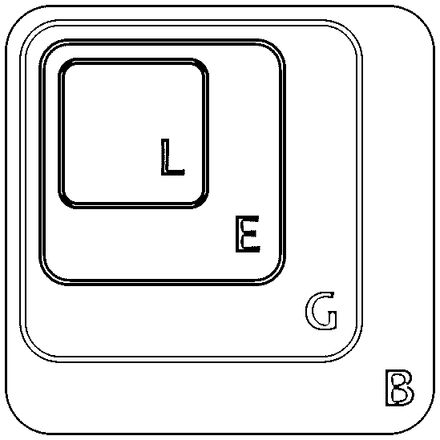
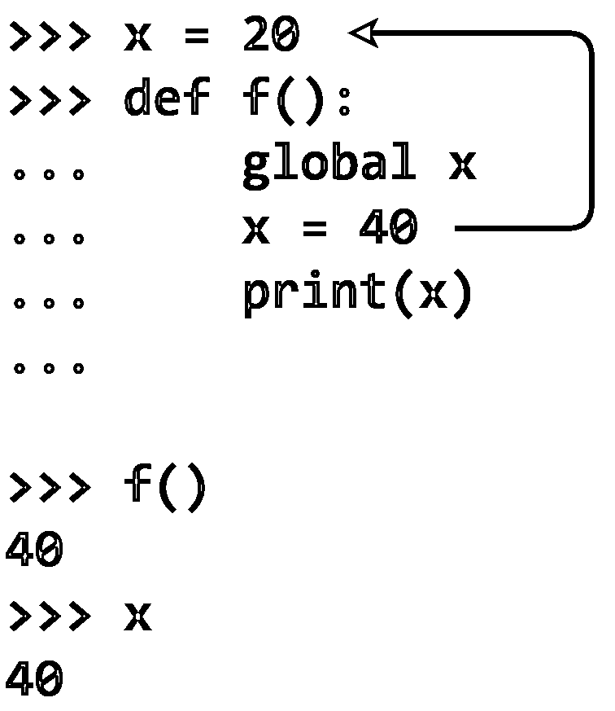
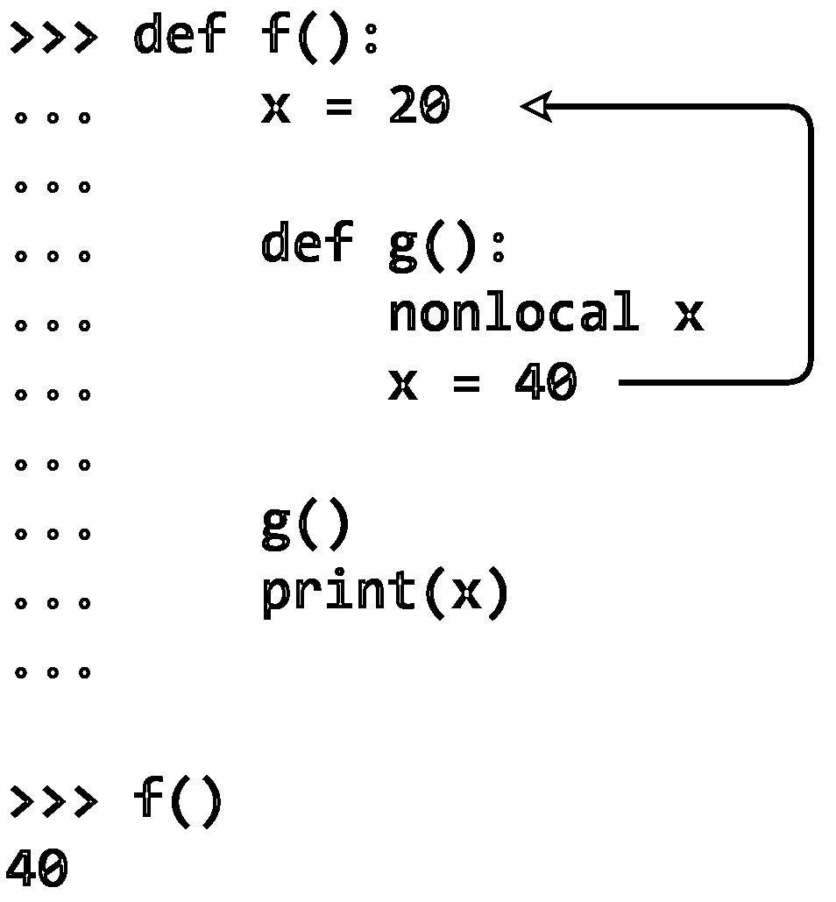

# Python 中的名称空间和范围

> 原文：<https://realpython.com/python-namespaces-scope/>

*立即观看**本教程有真实 Python 团队创建的相关视频课程。与书面教程一起观看，加深您的理解: [**在 Python 中导航名称空间和范围**](/courses/navigate-namespaces-scope/)

本教程涵盖了 Python **名称空间**，这种结构用于组织在 Python 程序中分配给对象的符号名称。

本系列之前的教程已经强调了 Python 中 [**对象**](https://realpython.com/python3-object-oriented-programming) 的重要性。对象无处不在！事实上，Python 程序创建或操作的所有东西都是对象。

一个**赋值语句**创建一个**符号名**，你可以用它来引用一个对象。语句`x = 'foo'`创建了一个符号名`x`，它引用了[字符串](https://realpython.com/python-strings/)对象`'foo'`。

在任何复杂的程序中，你都会创建成百上千个这样的名字，每个名字都指向一个特定的对象。Python 如何跟踪所有这些名称，使它们不会互相干扰？

在本教程中，您将学习:

*   Python 如何在**名称空间**中组织符号名称和对象
*   当 Python 创建一个新的名称空间时
*   名称空间是如何实现的
*   **变量作用域**如何决定符号名的可见性

**免费奖励:** [掌握 Python 的 5 个想法](https://realpython.com/bonus/python-mastery-course/)，这是一个面向 Python 开发者的免费课程，向您展示将 Python 技能提升到下一个水平所需的路线图和心态。

## Python 中的名称空间

名称空间是当前定义的符号名称以及每个名称引用的对象信息的集合。您可以将名称空间想象成一个[字典](https://realpython.com/python-dicts)，其中的键是对象名，值是对象本身。每个键值对都将一个名称映射到其对应的对象。

> 名称空间是一个非常棒的想法——让我们多做一些吧！
> 
> ——*[蟒蛇的禅](https://www.python.org/dev/peps/pep-0020)，作者蒂姆·皮特斯*

正如 Tim Peters 所说，名称空间不仅仅是伟大的。它们很棒，Python 广泛使用它们。在 Python 程序中，有四种类型的名称空间:

1.  内置的
2.  全球的
3.  封闭
4.  当地的

这些具有不同的寿命。Python 执行程序时，会根据需要创建名称空间，并在不再需要时删除它们。通常，在任何给定时间都会存在许多名称空间。

[*Remove ads*](/account/join/)

### 内置名称空间

**内置名称空间**包含所有 Python 内置对象的名称。当 Python 运行时，这些都是可用的。您可以使用以下命令列出内置名称空间中的对象:

>>>

```py
>>> dir(__builtins__)
['ArithmeticError', 'AssertionError', 'AttributeError',
 'BaseException','BlockingIOError', 'BrokenPipeError', 'BufferError',
 'BytesWarning', 'ChildProcessError', 'ConnectionAbortedError',
 'ConnectionError', 'ConnectionRefusedError', 'ConnectionResetError',
 'DeprecationWarning', 'EOFError', 'Ellipsis', 'EnvironmentError',
 'Exception', 'False', 'FileExistsError', 'FileNotFoundError',
 'FloatingPointError', 'FutureWarning', 'GeneratorExit', 'IOError',
 'ImportError', 'ImportWarning', 'IndentationError', 'IndexError',
 'InterruptedError', 'IsADirectoryError', 'KeyError', 'KeyboardInterrupt',
 'LookupError', 'MemoryError', 'ModuleNotFoundError', 'NameError', 'None',
 'NotADirectoryError', 'NotImplemented', 'NotImplementedError', 'OSError',
 'OverflowError', 'PendingDeprecationWarning', 'PermissionError',
 'ProcessLookupError', 'RecursionError', 'ReferenceError', 'ResourceWarning',
 'RuntimeError', 'RuntimeWarning', 'StopAsyncIteration', 'StopIteration',
 'SyntaxError', 'SyntaxWarning', 'SystemError', 'SystemExit', 'TabError',
 'TimeoutError', 'True', 'TypeError', 'UnboundLocalError',
 'UnicodeDecodeError', 'UnicodeEncodeError', 'UnicodeError',
 'UnicodeTranslateError', 'UnicodeWarning', 'UserWarning', 'ValueError',
 'Warning', 'ZeroDivisionError', '_', '__build_class__', '__debug__',
 '__doc__', '__import__', '__loader__', '__name__', '__package__',
 '__spec__', 'abs', 'all', 'any', 'ascii', 'bin', 'bool', 'bytearray',
 'bytes', 'callable', 'chr', 'classmethod', 'compile', 'complex',
 'copyright', 'credits', 'delattr', 'dict', 'dir', 'divmod', 'enumerate',
 'eval', 'exec', 'exit', 'filter', 'float', 'format', 'frozenset',
 'getattr', 'globals', 'hasattr', 'hash', 'help', 'hex', 'id', 'input',
 'int', 'isinstance', 'issubclass', 'iter', 'len', 'license', 'list',
 'locals', 'map', 'max', 'memoryview', 'min', 'next', 'object', 'oct',
 'open', 'ord', 'pow', 'print', 'property', 'quit', 'range', 'repr',
 'reversed', 'round', 'set', 'setattr', 'slice', 'sorted', 'staticmethod',
 'str', 'sum', 'super', 'tuple', 'type', 'vars', 'zip']
```

您将在这里看到一些您可能在以前的教程中见过的对象—例如， [`StopIteration`](https://realpython.com/python-for-loop/#the-guts-of-the-python-for-loop) 异常，[内置函数](https://realpython.com/python-data-types/#built-in-functions)，如 [`max()`](https://realpython.com/python-min-and-max/) 和 [`len()`](https://realpython.com/len-python-function/) ，以及对象类型，如`int`和`str`。

Python 解释器在启动时创建内置名称空间。这个名称空间一直存在，直到解释器终止。

### 全局名称空间

**全局名称空间**包含在主程序级别定义的任何名称。Python 在主程序体启动时创建全局名称空间，并且它一直存在，直到解释器终止。

严格地说，这可能不是唯一存在的全局名称空间。解释器还为程序用 [`import`](https://realpython.com/absolute-vs-relative-python-imports/) 语句加载的任何**模块**创建一个全局名称空间。要进一步了解 Python 中的主要函数和模块，请参阅以下资源:

*   [在 Python 中定义主要函数](https://realpython.com/python-main-function)
*   [Python 模块和包—简介](https://realpython.com/python-modules-packages)
*   [课程:Python 模块和包](https://realpython.com/courses/python-modules-packages)

在本系列的后续教程中，您将更详细地探索这些模块。目前，当您看到术语*全局名称空间*时，请考虑属于主程序的名称空间。

### 本地和封闭名称空间

正如您在上一篇关于[函数](https://realpython.com/defining-your-own-python-function)的教程中所学的，每当函数执行时，解释器都会创建一个新的名称空间。该名称空间是函数的本地名称，并且在函数终止之前一直存在。

只有在主程序的层次上，函数才不是彼此独立存在的。您也可以[在另一个](https://realpython.com/inner-functions-what-are-they-good-for/)中定义一个函数:

>>>

```py
 1>>> def f(): 2...     print('Start f()')
 3...
 4...     def g(): 5...         print('Start g()')
 6...         print('End g()')
 7...         return 8...
 9...     g() 10...
11...     print('End f()')
12...     return 13...
14
15>>> f() 16Start f()
17Start g()
18End g()
19End f()
```

在这个例子中，函数`g()`被定义在`f()`的主体中。下面是这段代码中发生的情况:

*   **第 1 到 12 行**定义`f()`，包含功能的**。**
*   **第 4 行到第 7 行**定义`g()`，其中**包含**功能。
*   在**第 15 行**，主程序调用`f()`。
*   在**9 号线**，`f()`呼叫`g()`。

当主程序调用`f()`时，Python 为`f()`创建一个新的名称空间。类似地，当`f()`调用`g()`时，`g()`获得自己独立的名称空间。为`g()`创建的名称空间是**本地名称空间**，为`f()`创建的名称空间是**封闭名称空间**。

这些名称空间中的每一个都保持存在，直到其各自的功能终止。当名称空间的函数终止时，Python 可能不会立即回收为这些名称空间分配的内存，但是对它们包含的对象的所有引用都不再有效。

## 可变范围

多个不同名称空间的存在意味着在 Python 程序运行时，特定名称的几个不同实例可以同时存在。只要每个实例在不同的名称空间中，它们都是单独维护的，不会互相干扰。

但是这就产生了一个问题:假设您在代码中引用了名称`x`，并且`x`存在于几个名称空间中。Python 怎么知道你说的是哪个？

答案在于**范围**的概念。名字的[范围](https://realpython.com/python-scope-legb-rule/)是该名字有意义的程序区域。解释器在运行时根据名字定义出现的位置和代码中名字被引用的位置来确定这一点。

**延伸阅读:**参见维基百科关于计算机编程中的[作用域的页面](https://en.wikipedia.org/wiki/Scope_(computer_science))了解编程语言中变量作用域的详细讨论。

如果你更喜欢钻研视频课程，那就去看看[探索 Python 中的作用域和闭包](https://realpython.com/courses/exploring-scopes-and-closures-in-python/)或者用 [Python 基础:作用域](https://realpython.com/courses/python-basics-scopes/)回到基础。

回到上面的问题，如果您的代码引用了名称`x`，那么 Python 将在下面的名称空间中按照所示的顺序搜索`x`:

1.  **局部**:如果你在一个函数中引用`x`，那么解释器首先在该函数局部的最内层作用域中搜索它。
2.  **封闭**:如果`x`不在局部范围内，但是出现在驻留在另一个函数内的函数中，那么解释器在封闭函数的范围内搜索。
3.  **全局**:如果上面的搜索都没有结果，那么解释器接下来在全局范围内查找。
4.  **内置**:如果在别的地方找不到`x`，那么解释器就尝试内置作用域。

这就是 Python 文献中通常所说的 **LEGB 规则**(尽管这个术语实际上并没有出现在 [Python 文档中](https://docs.python.org/3))。解释器从里到外搜索一个名字，在 **l** ocal、 **e** nclosing、 **g** lobal、最后是 **b** 内置范围中查找:

[](https://files.realpython.com/media/t.fd7bd78bbb47.png)

如果解释器在这些位置都找不到这个名字，Python 就会抛出一个 [`NameError`异常](https://docs.python.org/3/library/exceptions.html#NameError)。

例子

下面是 LEGB 规则的几个例子。在每种情况下，最里面的封闭函数`g()`试图向控制台显示名为`x`的变量的值。注意每个例子是如何根据范围为`x`打印不同的值的。

示例 1:单一定义

在第一个例子中，`x`只在一个位置定义。它在`f()`和`g()`之外，所以驻留在全局范围内:

>>>

```py
 1>>> x = 'global' 2
 3>>> def f():
 4...
 5...     def g():
 6...         print(x) 7...
 8...     g()
 9...
10
11>>> f()
12global
```

第 6 行**的 [`print()`](https://realpython.com/python-print/) 语句只能引用一个可能的`x`。它显示了在全局名称空间中定义的`x`对象，也就是字符串`'global'`。**

示例 2:双重定义

在下一个例子中，`x`的定义出现在两个地方，一个在`f()`之外，一个在`f()`之内，但是在`g()`之外:

>>>

```py
 1>>> x = 'global' 2
 3>>> def f():
 4...     x = 'enclosing' 5...
 6...     def g():
 7...         print(x) 8...
 9...     g()
10...
11
12>>> f()
13enclosing
```

和前面的例子一样，`g()`指的是`x`。但这一次，它有两个定义可供选择:

*   **第 1 行**在全局范围内定义`x`。
*   **第 4 行**在封闭范围内再次定义了`x`。

根据 LEGB 规则，解释器在查看全局范围之前从封闭范围中找到值。所以第七行的**语句显示的是`'enclosing'`而不是`'global'`。**

示例 3:三重定义

接下来是`x`在这里、那里和任何地方被定义的情况。一个定义在`f()`之外，另一个定义在`f()`之内，但在`g()`之外，第三个定义在`g()`之内:

>>>

```py
 1>>> x = 'global' 2
 3>>> def f():
 4...     x = 'enclosing' 5...
 6...     def g():
 7...         x = 'local' 8...         print(x) 9...
10...     g()
11...
12
13>>> f()
14local
```

现在，第 8 行的**语句必须区分三种不同的可能性:**

*   **第 1 行**在全局范围内定义`x`。
*   **第 4 行**在封闭范围内再次定义了`x`。
*   **第 7 行**在`g()`的局部范围内第三次定义了`x`。

这里，LEGB 规则规定`g()`首先看到自己本地定义的值`x`。所以`print()`语句显示`'local'`。

示例 4:无定义

最后，我们有一个例子，其中`g()`试图打印`x`的值，但是`x`在任何地方都没有定义。那根本行不通:

>>>

```py
 1>>> def f():
 2...
 3...     def g():
 4...         print(x) 5...
 6...     g()
 7...
 8
 9>>> f()
10Traceback (most recent call last):
11  File "<stdin>", line 1, in <module>
12  File "<stdin>", line 6, in f
13  File "<stdin>", line 4, in g
14NameError: name 'x' is not defined
```

这一次，Python 没有在任何名称空间中找到`x`，所以第 4 行的**语句生成了一个`NameError`异常。**

[*Remove ads*](/account/join/)

## Python 名称空间词典

在本教程的前面，当第一次引入名称空间时，我们鼓励您将名称空间看作一个字典，其中的键是对象名，值是对象本身。事实上，对于全局和局部命名空间来说，这正是它们的意义所在！Python 确实将这些名称空间实现为字典。

**注意:**内置名称空间的行为不像字典。Python 将其实现为一个模块。

Python 提供了名为`globals()`和`locals()`的内置函数，允许您访问全局和本地名称空间字典。

### `globals()`功能

内置函数`globals()`返回对当前全局名称空间字典的引用。您可以使用它来访问全局名称空间中的对象。下面是主程序启动时的一个示例:

>>>

```py
>>> type(globals())
<class 'dict'>

>>> globals()
{'__name__': '__main__', '__doc__': None, '__package__': None,
'__loader__': <class '_frozen_importlib.BuiltinImporter'>, '__spec__': None,
'__annotations__': {}, '__builtins__': <module 'builtins' (built-in)>}
```

如您所见，解释器已经在`globals()`中放入了几个条目。根据您的 Python 版本和操作系统，它在您的环境中可能会有所不同。不过应该差不多。

现在看看在全局范围内定义变量时会发生什么:

>>>

```py
>>> x = 'foo' 
>>> globals()
{'__name__': '__main__', '__doc__': None, '__package__': None,
'__loader__': <class '_frozen_importlib.BuiltinImporter'>, '__spec__': None,
'__annotations__': {}, '__builtins__': <module 'builtins' (built-in)>,
'x': 'foo'}
```

在赋值语句`x = 'foo'`之后，一个新的条目出现在全局名称空间字典中。字典键是对象的名称`x`，字典值是对象的值`'foo'`。

您通常会以通常的方式访问这个对象，通过引用它的符号名`x`。但是您也可以通过全局名称空间字典间接访问它:

>>>

```py
 1>>> x
 2'foo'
 3>>> globals()['x']
 4'foo'
 5
 6>>> x is globals()['x'] 7True
```

第六行的**上的 [`is`比较](https://realpython.com/python-is-identity-vs-equality/#comparing-identity-with-the-python-is-and-is-not-operators)确认这些实际上是同一物体。**

您也可以使用`globals()`函数在全局名称空间中创建和修改条目:

>>>

```py
 1>>> globals()['y'] = 100 2
 3>>> globals()
 4{'__name__': '__main__', '__doc__': None, '__package__': None,
 5'__loader__': <class '_frozen_importlib.BuiltinImporter'>, '__spec__': None,
 6'__annotations__': {}, '__builtins__': <module 'builtins' (built-in)>,
 7'x': 'foo', 'y': 100} 8
 9>>> y
10100 11
12>>> globals()['y'] = 3.14159 13
14>>> y 153.14159
```

**第 1 行**的语句与赋值语句`y = 100`具有同等效力。**第 12 行**上的语句等同于`y = 3.14159`。

当简单的赋值语句就可以在全局范围内创建和修改对象时，这种方式有点偏离常规。但是它是有效的，它很好地解释了这个概念。

### `locals()`功能

Python 也提供了相应的内置函数，名为`locals()`。它类似于`globals()`,但是访问本地名称空间中的对象:

>>>

```py
>>> def f(x, y):
...     s = 'foo'
...     print(locals())
...

>>> f(10, 0.5)
{'s': 'foo', 'y': 0.5, 'x': 10}
```

当在`f()`中调用时，`locals()`返回一个表示函数的本地名称空间的字典。注意，除了本地定义的变量`s`，本地名称空间还包括函数参数`x`和`y`，因为它们对于`f()`也是本地的。

如果您在主程序中的函数外部调用`locals()`，那么它的行为与`globals()`相同。

> 深度潜水:`globals()`和`locals()`之间的细微差别
> 
> 了解一下`globals()`和`locals()`之间的一个小区别是很有用的。
> 
> `globals()`返回包含全局名称空间的字典的实际引用。这意味着如果您调用`globals()`，保存返回值，并随后定义额外的变量，那么这些新变量将出现在保存的返回值所指向的字典中:
> 
> >>>
> 
> ```py
>  `1>>> g = globals()
>  2>>> g
>  3{'__name__': '__main__', '__doc__': None, '__package__': None,
>  4'__loader__': <class '_frozen_importlib.BuiltinImporter'>, '__spec__': None,
>  5'__annotations__': {}, '__builtins__': <module 'builtins' (built-in)>,
>  6'g': {...}}
>  7
>  8>>> x = 'foo'
>  9>>> y = 29
> 10>>> g
> 11{'__name__': '__main__', '__doc__': None, '__package__': None,
> 12'__loader__': <class '_frozen_importlib.BuiltinImporter'>, '__spec__': None,
> 13'__annotations__': {}, '__builtins__': <module 'builtins' (built-in)>,
> 14'g': {...}, 'x': 'foo', 'y': 29}` 
> ```
> 
> 这里，`g`是对全局名称空间字典的引用。在**第 8 行和第 9 行**的赋值语句之后，`x`和`y`出现在`g`指向的字典中。
> 
> 另一方面，`locals()`返回的字典是本地名称空间的当前副本，而不是对它的引用。对本地名称空间的进一步添加不会影响之前从`locals()`返回的值，直到您再次调用它。此外，您不能使用来自`locals()`的返回值来修改实际本地名称空间中的对象:
> 
> >>>
> 
> ```py
>  `1>>> def f():
>  2...     s = 'foo'
>  3...     loc = locals()
>  4...     print(loc)
>  5...
>  6...     x = 20 7...     print(loc)
>  8...
>  9...     loc['s'] = 'bar' 10...     print(s)
> 11...
> 12
> 13>>> f()
> 14{'s': 'foo'}
> 15{'s': 'foo'}
> 16foo` 
> ```
> 
> 在这个例子中，`loc`指向来自`locals()`的返回值，它是本地名称空间的副本。第 6 行第**行的语句`x = 20`将`x`添加到本地名称空间，但*不会将*添加到`loc`指向的副本。类似地，**第 9 行**上的语句修改了`loc`指向的副本中键`'s'`的值，但这对实际本地名称空间中的`s`的值没有影响。**
> 
> 这是一个微妙的区别，但如果你不记得它，它可能会给你带来麻烦。

[*Remove ads*](/account/join/)

## 修改超出范围的变量

在本系列的早些时候，在关于[用户定义的 Python 函数](https://realpython.com/defining-your-own-python-function)的教程中，您了解到 Python 中的参数传递有点像[按值传递](https://realpython.com/defining-your-own-python-function/#pass-by-value-vs-pass-by-reference-in-pascal)，有点像[按引用传递](https://realpython.com/defining-your-own-python-function/#pass-by-value-vs-pass-by-reference-in-pascal)。有时，函数可以通过更改相应的参数来修改其在调用环境中的参数，有时则不能:

*   不可变的参数永远不能被函数修改。
*   一个**可变的**参数不能被大规模地重新定义，但是它可以被适当地修改。

**注:**关于修改函数参数的更多信息，请参见 Pascal 中的[按值传递 vs 按引用传递](https://realpython.com/defining-your-own-python-function/#pass-by-value-vs-pass-by-reference-in-pascal)和 Python 中的[按值传递 vs 按引用传递](https://realpython.com/defining-your-own-python-function/#pass-by-value-vs-pass-by-reference-in-python)。

当函数试图修改其局部范围之外的变量时，也存在类似的情况。一个函数根本不能在它的局部范围之外修改一个不可变的对象:

>>>

```py
 1>>> x = 20
 2>>> def f():
 3...     x = 40 4...     print(x)
 5...
 6
 7>>> f()
 840
 9>>> x
1020
```

当`f()`执行**行 3** 上的赋值`x = 40`时，它创建一个新的本地[引用](https://realpython.com/python-variables/#object-references)到一个值为`40`的整数对象。此时，`f()`失去了对全局名称空间中名为`x`的对象的引用。所以赋值语句不会影响全局对象。

注意当`f()`在**行 4** 执行`print(x)`时，显示`40`，它自己的局部`x`的值。但是`f()`终止后，全局范围内的`x`仍然是`20`。

如果函数在适当的位置修改了可变类型的对象，那么它可以在局部范围之外修改该对象:

>>>

```py
>>> my_list = ['foo', 'bar', 'baz']
>>> def f():
...     my_list[1] = 'quux' ...
>>> f()
>>> my_list
['foo', 'quux', 'baz']
```

在这种情况下，`my_list`是一个列表，列表是可变的。`f()`可以在`my_list`内进行修改，即使它不在本地范围内。

但是如果`f()`试图完全重新分配`my_list`，那么它将创建一个新的本地对象，而不会修改全局`my_list`:

>>>

```py
>>> my_list = ['foo', 'bar', 'baz']
>>> def f():
...     my_list = ['qux', 'quux'] ...
>>> f()
>>> my_list
['foo', 'bar', 'baz']
```

这类似于当`f()`试图修改可变函数参数时发生的情况。

### `global`声明

如果您确实需要从`f()`内部修改全局范围内的值，该怎么办？在 Python 中使用`global`声明可以做到这一点:

>>>

```py
>>> x = 20
>>> def f():
...     global x ...     x = 40 ...     print(x)
...

>>> f()
40
>>> x
40
```

`global x`语句表明当`f()`执行时，对名字`x`的引用将指向全局名称空间中的`x`。这意味着赋值`x = 40`不会创建新的引用。而是在全局范围内给`x`赋一个新值:

[](https://files.realpython.com/media/t.0ee0e5dafa9d.png)

<figcaption class="figure-caption text-center">The global Declaration</figcaption>

正如您已经看到的，`globals()`返回对全局名称空间字典的引用。如果您愿意，可以不使用`global`语句，而是使用`globals()`来完成同样的事情:

>>>

```py
>>> x = 20
>>> def f():
...     globals()['x'] = 40 ...     print(x)
...

>>> f()
40
>>> x 40
```

没有太多的理由这样做，因为`global`声明可以说使意图更加清晰。但它确实为`globals()`如何工作提供了另一个例证。

如果函数启动时在`global`声明中指定的名字在全局范围内不存在，那么`global`语句和赋值的组合将创建它:

>>>

```py
 1>>> y
 2Traceback (most recent call last):
 3  File "<pyshell#79>", line 1, in <module>
 4    y
 5NameError: name 'y' is not defined
 6
 7>>> def g():
 8...     global y
 9...     y = 20
10...
11
12>>> g()
13>>> y
1420
```

在这种情况下，当`g()`启动时，全局范围内没有名为`y`的对象，但是`g()`在**的第 8 行**用`global y`语句创建了一个对象。

您也可以在单个`global`声明中指定几个逗号分隔的名称:

>>>

```py
 1>>> x, y, z = 10, 20, 30
 2
 3>>> def f():
 4...     global x, y, z
 5...
```

这里，`x`、`y`、`z`都是通过**第 4 行**的单个`global`语句声明引用全局范围内的对象。

在`global`声明中指定的名称不能出现在`global`语句之前的函数中:

>>>

```py
 1>>> def f():
 2...     print(x)
 3...     global x
 4...
 5  File "<stdin>", line 3
 6SyntaxError: name 'x' is used prior to global declaration
```

第 3 行**上的`global x`语句的目的是使对`x`的引用指向全局范围内的一个对象。但是**行 2** 的`print()`声明是指`x`到`global`声明之前。这引发了一个 [`SyntaxError`](https://realpython.com/invalid-syntax-python/) 异常。**

[*Remove ads*](/account/join/)

### `nonlocal`声明

嵌套函数定义也存在类似的情况。`global`声明允许函数在全局范围内访问和修改对象。如果被封闭的函数需要修改封闭范围内的对象怎么办？考虑这个例子:

>>>

```py
 1>>> def f():
 2...     x = 20
 3...
 4...     def g():
 5...         x = 40 6...
 7...     g()
 8...     print(x)
 9...
10
11>>> f()
1220
```

在这种情况下，`x`的第一个定义是在封闭范围内，而不是在全局范围内。正如`g()`不能在全局范围内直接修改变量一样，它也不能在封闭函数的范围内修改`x`。在**行 5** 赋值`x = 40`后，包围范围内的`x`保留`20`。

[`global`关键词](https://realpython.com/python-keywords/#variable-handling-keywords-del-global-nonlocal)不是这种情况的解决方案:

>>>

```py
>>> def f():
...     x = 20
...
...     def g():
...         global x ...         x = 40 ...
...     g()
...     print(x)
...

>>> f()
20
```

因为`x`在封闭函数的范围内，而不是全局范围内，所以`global`关键字在这里不起作用。`g()`终止后，包围范围内的`x`仍然是`20`。

事实上，在这个例子中，`global x`语句不仅不能在封闭范围内提供对`x`的访问，而且还在全局范围内创建了一个名为`x`的对象，其值为`40`:

>>>

```py
>>> def f():
...     x = 20
...
...     def g():
...         global x
...         x = 40
...
...     g()
...     print(x)
...

>>> f()
20
>>> x 40
```

要从`g()`内部修改封闭范围内的`x`，需要类似的关键字 [`nonlocal`](https://realpython.com/python-keywords/#variable-handling-keywords-del-global-nonlocal) 。在`nonlocal`关键字后指定的名称指最近的封闭范围内的变量:

>>>

```py
 1>>> def f():
 2...     x = 20
 3...
 4...     def g():
 5...         nonlocal x 6...         x = 40 7...
 8...     g()
 9...     print(x)
10...
11
12>>> f()
1340
```

在**行 5** 的`nonlocal x`语句后，当`g()`指`x`时，指最近的包围范围内的`x`，其定义在**行 2** 的`f()`中:

[](https://files.realpython.com/media/t.b7e3c1b7bd96.png)

<figcaption class="figure-caption text-center">The nonlocal Declaration</figcaption>

第 9 行**的`f()`末尾的`print()`语句确认对`g()`的调用已经将封闭范围内的`x`的值更改为`40`。**

### 最佳实践

尽管 Python 提供了`global`和`nonlocal`关键字，但使用它们并不总是明智的。

当一个函数在局部范围之外修改数据时，无论是使用`global`还是`nonlocal`关键字，或者直接修改一个可变类型，这都是一种[副作用](https://realpython.com/defining-your-own-python-function/#side-effects)，类似于函数修改它的一个参数。广泛修改全局变量通常被认为是不明智的，不仅在 Python 中如此，在其他编程语言中也是如此。

和许多事情一样，这在某种程度上是风格和偏好的问题。有时候，明智地使用全局变量修改可以降低程序的复杂性。

在 Python 中，使用`global`关键字至少可以清楚地表明函数正在修改一个全局变量。在许多语言中，函数可以通过赋值来修改全局变量，而不用以任何方式声明它。这使得跟踪全局数据被修改的位置变得非常困难。

总而言之，在局部范围之外修改变量通常是不必要的。几乎总有更好的方法，通常是函数返回值。

[*Remove ads*](/account/join/)

## 结论

Python 程序使用或作用的几乎所有东西都是对象。即使是很短的程序也会创建许多不同的对象。在一个更复杂的程序中，它们可能会数以千计。Python 必须跟踪所有这些对象和它们的名字，它用**名称空间**来做这件事。

**在本教程中，您学习了:**

*   Python 中有哪些不同的名称空间
*   当 Python 创建一个新的名称空间时
*   Python 使用什么结构来实现名称空间
*   名称空间如何在 Python 程序中定义**范围**

许多编程技术利用了 Python 中每个函数都有自己的名称空间这一事实。在本系列接下来的两篇教程中，您将探索其中的两种技术:**函数式编程**和**递归**。

[« Regular Expressions: Regexes in Python (Part 2)](https://realpython.com/regex-python-part-2/)[Namespaces and Scope in Python](#)[Functional Programming in Python: When and How to Use It »](https://realpython.com/python-functional-programming/)

*立即观看**本教程有真实 Python 团队创建的相关视频课程。与书面教程一起观看，加深您的理解: [**在 Python 中导航名称空间和范围**](/courses/navigate-namespaces-scope/)*******