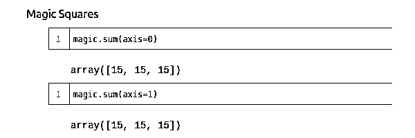
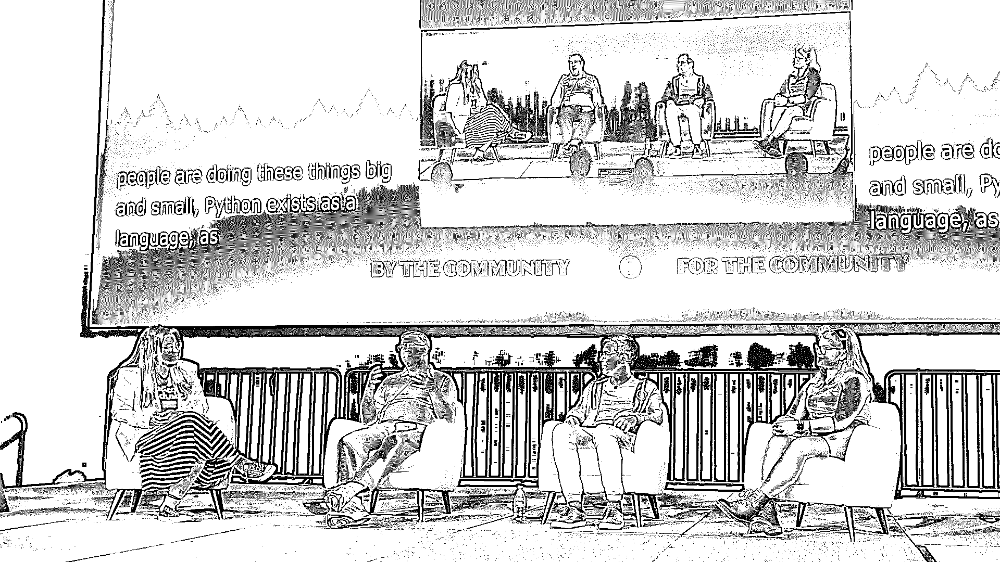

# Python 新闻:2022 年 4 月有什么新消息

> 原文：<https://realpython.com/python-news-april-2022/>

【2022 年 4 月见证了 **PyCon US** 大会在盐湖城的回归。在会议期间，Python 开发者参加了一年一度的**语言峰会**，而 [Anaconda](https://www.anaconda.com/blog/pyscript-python-in-the-browser) 宣布了 **PyScript** ，一种直接在 HTML 中编写 Python 的方法。本月早些时候，Python 软件基金会(PSF)迎来了新的执行董事。

继续阅读，深入了解上个月最大的 **Python 新闻**！

## PyScript:浏览器中的 Python

在他的主题演讲中，Anaconda 首席执行官[王蒙杰](https://twitter.com/pwang)公布了 **PyScript** 项目。PyScript 允许你直接在 HTML 中编写 Python，并在你的浏览器中运行。考虑下面的例子:

```py
<html>
<head>
    <link rel="stylesheet" href="https://pyscript.net/alpha/pyscript.css" />
    <script defer src="https://pyscript.net/alpha/pyscript.js"></script>
</head>

<body>
 <py-script> print('Hello, World!') </py-script> </body>
</html>
```

注意`<py-script>`标签，它可以包含任何有效的 Python 代码。在这种情况下，这是传统的`Hello, World!`问候。

这是功能代码。你可以把上面的代码块复制到一个文件里，比如`hello.html`，把那个文件保存到你的电脑里。然后您可以在浏览器中打开它，例如使用 `Ctrl` + `O` 或 `Cmd` + `O` 并选择`hello.html`。或者，您可以在 [PyScript 演示页面](https://pyscript.net/examples/)上立即测试一个类似的[示例](https://pyscript.net/examples/hello_world.html)。

PyScript 提供定制的 HTML 标签，包括上面看到的`<py-script>`。还有其他几个标签，其中许多仍在开发中。然而，这里有几个立即有用的:

*   **`<py-env>`** 列出了应该在环境中可用的包。
*   **`<py-repl>`** 创建一个工作的 Python REPL 来与环境交互。

下面这个稍微复杂一点的示例展示了如何使用这些功能:

```py
<html>
<head>
    <link rel="stylesheet" href="https://pyscript.net/alpha/pyscript.css" />
    <script defer src="https://pyscript.net/alpha/pyscript.js"></script>
    <py-env>
 - numpy    </py-env>
</head>

<body>
    <h1 id="title">Magic Squares - Loading ...</h1>
    <py-script>
import numpy as np 
# Initialize a magic square magic = np.array([[6, 7, 2], [1, 5, 9], [8, 3, 4]]) 
# Update title to indicate that the page has finished loading pyscript.write("title", "Magic Squares")
    </py-script>

    <py-repl id="magic-repl" auto-generate="true">
magic.sum(axis=0)
    </py-repl>
</body>
</html>
```

在这个例子中，您声明您想要在您的环境中使用 [`numpy`](https://realpython.com/numpy-tutorial/) 。然后导入`numpy`，创建一个代表[魔方](https://en.wikipedia.org/wiki/Magic_square)的[数组](https://realpython.com/numpy-array-programming/)，并更新页面上的标题以表明页面加载完成。 [REPL](https://realpython.com/interacting-with-python/#using-the-python-interpreter-interactively) 将用代码填充，您可以在用 HTML 指定的网页上交互运行这些代码。典型的会话如下所示:



请注意，`pyscript.write()`可以与[文档对象模型(DOM)](https://realpython.com/python-vs-javascript/#document-object-model-dom) 交互，并更新命名的 HTML 元素的内容。此外，在 REPL 中编写的代码可以使用在早期代码中初始化的变量。

PyScript 通过在 [Pyodide](https://pyodide.org/) 的基础上进行构建，使这一切成为可能。Pyodide 提供了编译成 [WebAssembly](https://realpython.com/brython-python-in-browser/#webassembly) 的 CPython，这样它就可以在浏览器中运行或者与 [Node.js](https://realpython.com/python-vs-javascript/#nodejs) 一起运行。此外，Pyodide 方便了从 Python 调用 JavaScript，PyScript 利用这一点来包装 JavaScript 库，如 [D3](https://pyscript.net/examples/d3.html) 。

**注意:**趁 PyScript 还是全新的，深入了解它，抢先一步吧！[在网络浏览器中先看一下 PyScript:Python](https://realpython.com/pyscript-python-in-browser/)会引导你进行这一探索。

PyScript 仍然处于实验阶段，但是这个新框架的可能性非常令人兴奋。我们期待着继续关注 PyScript 的发展。

[*Remove ads*](/account/join/)

## PyCon US 2022

PyCon US 大会是 Python 社区最大的年度聚会。自 2003 年以来，这种事情每年都会发生，但在前两年，由于新冠肺炎疫情，这个会议变成了虚拟的。

从 4 月 27 日到 5 月 3 日，大约 1800 人参加了盐湖城的 PyCon。虽然会议回到了面对面的活动，但疫情的影响是显而易见的:[出席人数比 2019 年下降了](https://twitter.com/driscollis/status/1520059228936978439)，强有力的[健康和安全指导方针](https://us.pycon.org/2022/attend/health-safety-guidelines/)已经到位，并提供了[在线](https://us.pycon.org/2022/online/pycon-online/)选项。

与任何 PyCon 会议一样，会谈涵盖了广泛的主题，质量很高。所有的谈话都被记录了下来，一旦后期处理完成，将会发布在 Youtube 频道上。今年有五个[主题演讲](https://us.pycon.org/2022/about/keynote-speakers/):

*   关于类型和复杂性
*   萨拉·伊桑关于黑洞成像的文章
*   **王蒙杰**宣布 [PyScript](#pyscript-python-in-your-browser)
*   **托马斯·伍特斯**和**巴勃罗·加林多·萨尔加多**关于 Python 3.11 和指导委员会的工作
*   **娜奥米·塞德尔**关于建立一个伟大的社区

此外， **Georgi Ker** 、 **Reuven Lerner** 、 **Anthony Shaw** 和 **Lorena Mesa** 参加了关于 Python 中[多样性和包容性](https://wiki.python.org/psf/DiversityandInclusionWG)的小组讨论:

[](https://files.realpython.com/media/pycon-diversity-panel.3f1702dc45e8.jpg)

会议在[盐宫会议中心](https://www.visitsaltlake.com/salt-palace-convention-center/)举行。由于有充足的空间和长长的走廊，会场提供了许多与赞助商和其他与会者见面的机会。今年，我们在 Real Python 有了自己的[展台](https://realpython.com/real-python-pycon-us-2022/)，很高兴见到我们的许多读者和[成员](https://realpython.com/join)。

虽然今年的 PyCon US 大门已经关闭，但下一届的规划已经开始。它还将于 2023 年 4 月 19 日至 4 月 27 日在盐湖城举办。

## Python 语言峰会 2022

Python 语言峰会是一年一度的会议，Python 开发者可以在会上分享信息，讨论与 CPython 和其他实现相关的挑战。这种语言的重要事件通常发生在 [PyCon](#pycon-us-2022) 会议期间。

今年的语言峰会讨论了诸如[全局解释器锁(GIL)](https://realpython.com/python-gil/) 的未来、 [faster-cpython](https://github.com/faster-cpython) 和 [Cinder](https://github.com/facebookincubator/cinder) 项目的优化，以及解析 [f 字符串](https://realpython.com/python-f-strings/)方式的可能变化等话题。

我们期待着更多地了解语言峰会上提出的话题。和早些年一样，PSF 将在他们的[博客](https://pyfound.blogspot.com/)上总结讨论。今年， [Alex Waygood](https://twitter.com/AlexWaygood) 将在一系列即将发布的博客文章中报道峰会上的演讲。

## PSF 新任执行董事

去年年底， [Ewa Jodlowska](https://realpython.com/interview-ewa-jodlowska/) [在](https://realpython.com/python-news-june-2021/#ewa-jodlowska-steps-down-as-psf-executive-director) [Python 软件基金会(PSF)](https://www.python.org/psf/) 任职约十年后，卸任执行董事。

4 月 7 日，PSF 宣布 Deb Nicholson 将担任 PSF 执行董事。Nicholson 拥有来自其他开源和非营利组织的丰富经验，包括[开源倡议](https://opensource.org/OutgoingGMReflections)、 [OpenHatch](https://blog.openhatch.org/2017/celebrating-our-successes-and-winding-down-as-an-organization/) 和本地 [Boston Python 用户组](https://www.meetup.com/bostonpython/)。

我们在 Real Python 欢迎 Deb Nicholson，并且很高兴看到 PSF 的继续发展。

## Python 的下一步是什么

这个月，Python 新闻一直被 PyCon US 的兴奋和能够再次参加面对面会议的喜悦所主导。随着世界慢慢恢复正常，越来越多的用户组、聚会和会议将会回到面对面的状态。有你期待的会议吗？

四月份你最喜欢的 Python 新闻是什么？请在评论中告诉我们。快乐的蟒蛇！*