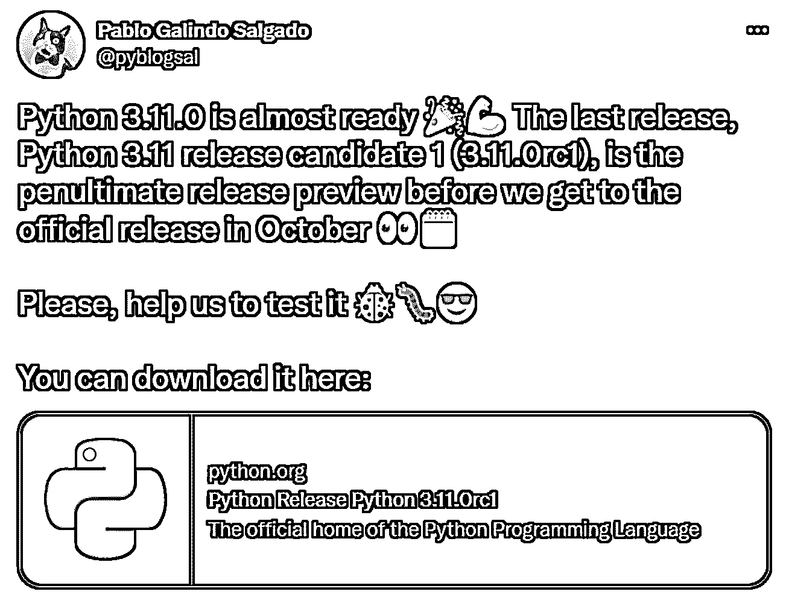
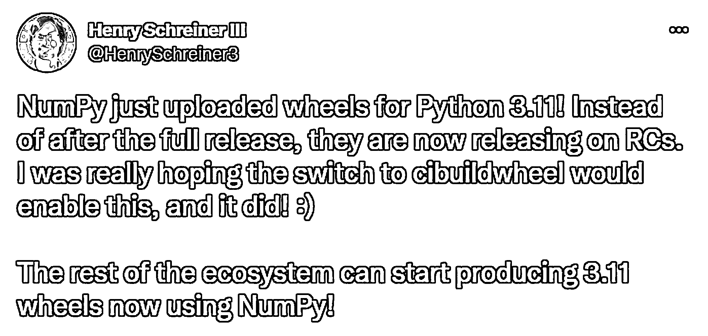
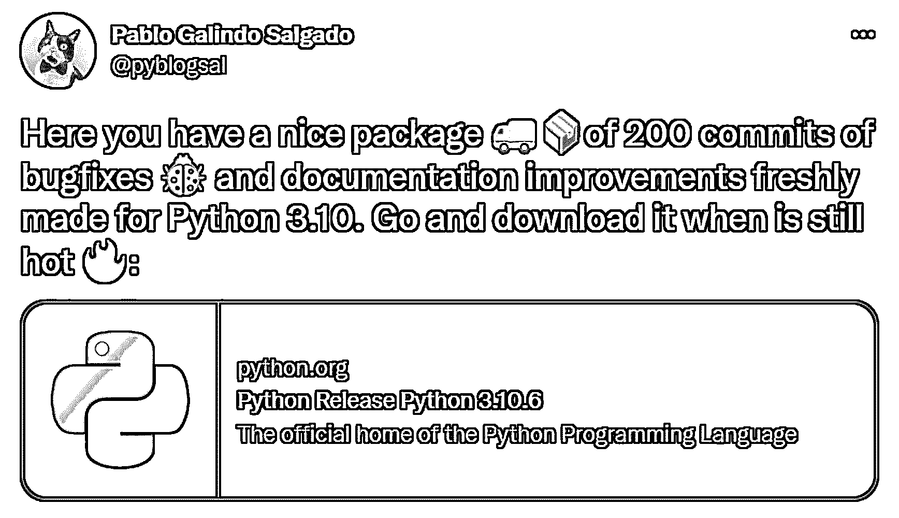
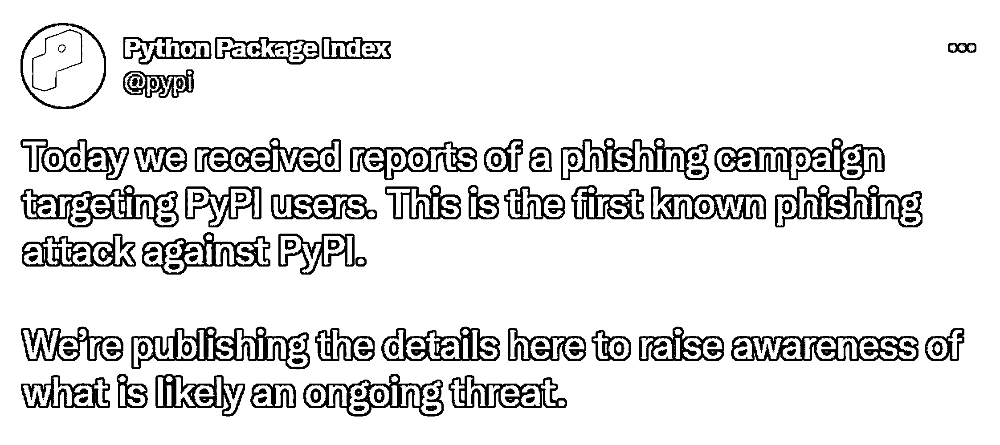

# Python 新闻:2022 年 8 月有什么新消息

> 原文：<https://realpython.com/python-news-august-2022/>

在【2022 年 8 月，Python 向 **3.11 发布**，**熊猫**推出**增强提案**，各种包见证了**新发布**，Python 在 **TIOBE 指数**顶端扩大了领先优势， **PyPI** 与**恶意软件**战斗。

请继续阅读，了解 2022 年 8 月 Python 世界发生的更多细节！

**立即加入:** ，你将永远不会错过另一个 Python 教程、课程更新或帖子。

## Python 有 pep，NumPy 有 nep，熊猫现在有 pdep

首个[熊猫](https://pandas.pydata.org/)增强提案(PDEP)于 2022 年 8 月 3 日提交，标题为*目的和方针*。**增强提议**对于 Python 社区来说并不新鲜。Python 从 2000 年就有了 [PEPs](https://peps.python.org/) ，NumPy 在 2017 年又有了 [NEPs](https://numpy.org/neps/) 。

第一个 **PDEP** 遵循 pep 和 nep 的传统， [PDEP-1](https://pandas.pydata.org/pdeps/0001-purpose-and-guidelines.html) 是对增强提案本身背后的想法的介绍。

简而言之，PDEPs 旨在帮助对 pandas 的*重大*变更的提议过程，例如将模块从主 pandas 存储库移动到一个分支存储库。PDP 不是为了快速解决问题，而是为了涉及更广泛社区的主要任务，并且通常是一些重要的权衡。

解决复杂的问题不太适合基于线程的媒体，比如 [GitHub issues](https://docs.github.com/en/issues/tracking-your-work-with-issues/about-issues) 。如果任何人都可以在任何时候回应，即使最初的想法是好的，讨论也很难保持专注。

GitHub 问题线程不仅会给核心开发人员带来噪音，也会给贡献者和最终用户带来噪音。此外，他们可能会因为没有提供合适的讨论媒介而埋没好的但复杂的想法。撰稿人 [h-vetinari](https://github.com/h-vetinari) 在 2019 年 [GitHub 一期](https://github.com/pandas-dev/pandas/issues/28568)中提出了这个话题:

> API 含义越复杂，在 GitHub 注释中讨论就越困难(因为通常要同时考虑的事情太多，或者注释/线程长得离谱，或者两者兼而有之)。这并不意味着给定的变化没有价值，只是它(可能)太难以线程格式讨论。([来源](https://github.com/pandas-dev/pandas/issues/28568#issuecomment-540456539))

h-vetinari 三年前提出的 GitHub 问题现在已经随着 PDEP-1 的[拉请求](https://github.com/pandas-dev/pandas/pull/47444)而结束。这可能会为 PDEP 生命周期的未来奠定一个蓝图。当某人[制造了一个问题](https://github.com/pandas-dev/pandas/issues/new/choose)时，PDEPs 可能会开始。如果问题被认为是重要的和有价值的，那么提出这个问题的人可能会被指示创建一个 PDEP。

这种向 PDEPs 的转移意味着通常用于向熊猫传达更大变化的[路线图](https://pandas.pydata.org/about/roadmap.html)将慢慢向 PDEPs 迁移。

你对移动到 PDEPs 有什么感觉？请在评论中分享你的想法！

[*Remove ads*](/account/join/)

## Python 生态系统庆祝新发布

Python 社区在整个八月都没有休息，尽管这通常是一个度假的月份。像往常一样，Python 生态系统中已经发布了大量版本。从 CPython 到 CircuitPython，有许多新特性可供您开始尝试。请继续阅读精选的版本和里程碑。

### cpython〔t0〕

CPython 团队仍在为 2022 年 10 月发布 Python 3.11 做准备。如果您有兴趣了解更多关于 3.11 版本的信息，请查看一些深入探究 3.11 新特性的真实 Python 教程，例如[异常组](https://realpython.com/python311-exception-groups/)、 [`tomllib`](https://realpython.com/python311-tomllib/) ，以及[更好的错误消息](https://realpython.com/python311-error-messages/)。

8 月，Python 3.11.0rc1(一个候选版本)发布了:

<figcaption class="figure-caption text-center">[Image source](https://twitter.com/pyblogsal/status/1556687421928083457)</figcaption>

如果您想帮助 Python 社区，那么可以通过运行您的代码和包来测试这个新的候选版本。除了上面提到的[弃用](https://docs.python.org/3.11/whatsnew/3.11.html#deprecated)，大部分东西应该还能工作，你也有望注意到一个不错的[速度提升](https://docs.python.org/3.11/whatsnew/3.11.html#summary-release-highlights)。

如果你想要一个指南，那么看看真正的 Python 教程[如何安装 Python 的预发布版本](https://realpython.com/python-pre-release/)！

如果你在 3.11 候选版本中发现了你认为可能是 bug 的东西，检查一下[发布板](https://github.com/python/cpython/issues)看看它是否正在被讨论。如果你真的认为你发现了一个别人没有发现的 bug，[开一期新的](https://github.com/python/cpython/issues/new/choose)！

为了准备 Python 3.11 的发布， [NumPy](https://numpy.org/) 已经领先一步，发布了 3.11 的[轮子](https://realpython.com/python-wheels/):

<figcaption class="figure-caption text-center">[Image source](https://twitter.com/HenrySchreiner3/status/1558993585198059522?t=Led4H_qk2PEwcHxKE3bhlA&s=19)</figcaption>

这对于许多依赖 NumPy 的其他软件包来说是个好消息，如果没有 NumPy 3.11 轮子，它们将无法开始移植到 3.11。

虽然 3.11 可能会风靡一时，但 3.10 并没有被遗忘。本月，新的维护版本发布了:

<figcaption class="figure-caption text-center">[Image source](https://twitter.com/pyblogsal/status/1554481408386686977?t=ABlM9ANvphT7AucVljcHhQ&s=19)</figcaption>

除非很方便，否则不需要从 3.10.x 升级到 3.10.6。也就是说，升级不应该破坏 3.10.x 上的现有代码，除非无意中引入了回归，但这不太可能。

请在下面的评论中告诉我们你对新版本的看法！你最感兴趣的功能是什么？

### 姜戈

同样在 2022 年 8 月， [Django 4.1 发布](https://docs.djangoproject.com/en/4.1/releases/4.1/)，为基于类的视图提供异步处理程序、异步 ORM 接口、模型约束验证、表单呈现可访问性改进等等。

Django 的核心开发者[詹姆斯·贝内特](https://twitter.com/ubernostrum)在发布后不久发表了一篇[的博客文章](https://www.b-list.org/weblog/2022/aug/16/async/)，以促进对异步 Python 用于 web 开发的理解。这篇文章精彩地概述了`asyncio`模块是如何产生的，强调了协程从生成器到`asyncio`的演变。

在一个巧妙的标题为“一切与厨房异步”的章节中，Bennet 警告人们不要对所有事情都使用异步。

事件循环适用于某些应用程序，但不适用于其他应用程序。要了解更多关于异步 Python 的优秀应用程序，请查看关于[异步 IO](https://realpython.com/async-io-python/) 和[并发](https://realpython.com/python-concurrency/)的真实 Python 教程。

[*Remove ads*](/account/join/)

### 阅读文档

本月，[阅读了庆祝其](https://readthedocs.org/)[首次承诺](https://github.com/readthedocs/readthedocs.org/commit/6c38e6c0)12 周年的文件:

<figcaption class="figure-caption text-center">[Image source](https://twitter.com/readthedocs/status/1559575996558221312?t=0uCB1K1PuwV8KOHqj9LXnA&s=19)</figcaption>

一个不起眼的需求文件会导致 Python 生态系统中最著名的包之一。

阅读文档将有助于您创建文档并将其分发给用户。它不仅开发了一个软件包来自动创建你的在线文档，而且还免费托管你的文档。read Docs 每月提供超过 5500 万页的文档，相当于整整 40TB 的带宽。

要了解最新的阅读文档，请查看其博客。此外，Read Docs 正在为其[优秀文档项目](https://github.com/readthedocs-examples/.github/)库收集条目——查看一下，为您的文档寻找一些灵感。

### 电路表面

8 月，CircuitPython 发布了 CircuitPython 8.0.0 的测试版。CircuitPython 的 8.0.0 版本计划引入新的 WiFi 工作流程，使通过 WiFi 使用您的评估板更容易，提供与代码编辑器的更好集成，等等。

CircuitPython 是针对[微控制器](https://en.wikipedia.org/wiki/Microcontroller)的 Python 版本，是 [MicroPython](https://github.com/micropython/micropython) 的初学者友好分支。一些最知名的 DIY 微控制器设计师创建支持 CircuitPython 和 MicroPython 的电路板，包括 [Raspberry Pi](https://www.raspberrypi.com/products/raspberry-pi-pico/) 、 [Arduino](https://blog.arduino.cc/2021/05/17/the-arduino-nano-rp2040-connect-is-here/) 和 [Adafruit](https://www.adafruit.com/category/956) ，后者也是 CircuitPython 的主要赞助商。

要了解更多关于 CircuitPython 版本和相关新闻的信息，请查看 Adafruit 的配套博客文章。

同样在 8 月，Adafruit 庆祝了 2022 年 CircuitPython 日，这些记录现在已经上传到了 T2 的 YouTube 上。去看看！

## Python 在 TIOBE 索引顶部扩展了 Lead

8 月份的 TIOBE 编程社区指数显示 Python 又获得了 2%的市场份额，继续保持有史以来最高的市场份额:

> Python 似乎势不可挡。([来源](https://www.tiobe.com/tiobe-index/))

自从 TIOBE 在 2001 年开始排名以来，C 和 Java 一直不分上下。

然而，值得注意的是，TIOBE 索引是基于该语言的网页在不同搜索中的排名。所以 TIOBE 的排名不是关于 T2 最好的或者最受欢迎的语言。它主要显示了该语言在互联网上的排名。尽管如此，Python 还是赢了！

## PyPI 对抗恶意软件攻击

8 月，一些 [PyPI](https://pypi.org/) 用户遭遇了首个已知的针对 PyPI 的[网络钓鱼](https://en.wikipedia.org/wiki/Phishing)活动:

<figcaption class="figure-caption text-center">[Image source](https://twitter.com/pypi/status/1562442188285308929)</figcaption>

用户报告收到一封电子邮件，要求他们验证他们的包，以防止从 PyPI 中删除。该消息包含重定向到 PyPI 登录页面的虚假版本的链接。

如果您将您的用户名和密码插入这个虚假的登录页面，您的凭据将被发送给网络钓鱼活动背后的人。然后，他们将使用帐户凭证登录到真正的 PyPI，篡改您上传的软件包，并可能锁定您。

**注意:** PyPI 不会从 PyPI 中删除软件包，除非它们违反了[使用条款](https://pypi.org/policy/terms-of-use/)或者是有害的软件包，比如恶意软件。因此，任何这种效果的交流都应该立即引起人们的注意。

到目前为止，攻击者设法获得的任何凭证都被用来上传用户包的恶意软件感染版本。因此，下次有人下载最新版本的受损软件包时，他们的计算机就会感染该恶意软件。

PyPI 已经公布了假冒站点的地址为`sites[dot]google[dot]com/view/pypivalidate`，凭证信息发送到`linkedopports[dot]com`。使用这些恶意地址，PyPI 已经发现了各种各样的受损包。

任何受损的包裹都已被及时清理并暂时冻结。当 PyPI 恢复对合法所有者的访问时，软件包被冻结以锁定攻击者，并确保用户可以继续下载软件包而不用担心恶意软件。

此外，使用`linkedopports[dot]com`模式，PyPI 发现了许多[域名仿冒](https://en.wikipedia.org/wiki/Typosquatting)包。PyPI 中的**域名仿冒涉及上传一个恶意软件包，其名称与一个流行的包非常相似。例如，当下载一个带有`python -m pip install requests`的包时，你可能会把`requests`误打成`reqyests`。一个域名抢注者可能会上传一个叫做`reqyests`的恶意软件包来感染那些打错字的人。**

本月早些时候， [Snyk](https://snyk.io/) ，一个开发者安全平台，[发现](https://snyk.io/blog/pypi-malware-discord-roblox-credential-payment-info/)各种上传到 PyPI 的小软件包带有恶意软件，从 Windows 用户那里窃取 [Discord](https://discord.com/) 和 [Roblox](https://www.roblox.com/) 凭证。这些包使用 [PyInstaller](https://pyinstaller.org/en/stable/) 到[混淆](https://en.wikipedia.org/wiki/Obfuscation)其中包含的恶意代码。

因此，即使最近采用了[双因素认证](https://en.wikipedia.org/wiki/Multi-factor_authentication) (2FA)，这也表明在安全方面没有灵丹妙药。你应该始终意识到，当使用`pip`时，你是在从互联网上下载代码来在你的机器上运行。尽最大努力确保软件包是合法的，例如，您可以检查软件包的自述文件，以确定它是真实的:

*   它有文档吗？
*   它周围有社区吗？
*   源代码是公开的吗？
*   套餐有没有带联系方式的网站？

这些只是合法软件包可能具有的一些指标，但正如前面提到的，没有灵丹妙药，当您在现代互联世界中导航时，您需要保持头脑清醒！

这个月， [TalkPython](https://talkpython.fm/) 及时地发布了一个[播客片段](https://talkpython.fm/episodes/show/377/python-packaging-and-pypi-in-2022)，其中有 PyPI 维护者和 PSF 主管[达斯汀·英格拉姆](https://twitter.com/di_codes)，他们聊到了 Python 打包、PyPI、安全性以及最近向 2FA 的转移。

你在 PyPI 遇到过恶意软件或者可疑的包吗？联系 security@pypi.org 了解所有细节。记住，PyPI 是一个由赞助商和用户资助的开源平台。他们不赚取任何利润，他们需要社区的支持来保证每个人的安全。

[*Remove ads*](/account/join/)

## Python 的下一步是什么

八月的 Python 世界，你最激动的是什么？我们错过了什么吗？你会尝试任何新版本吗？你对熊猫搬到 PDEPs 有什么想法吗？如何看待最近围绕 PyPI 的安全问题？请在评论中告诉我们！

快乐的蟒蛇！

**立即加入:** ，你将永远不会错过另一个 Python 教程、课程更新或帖子。***