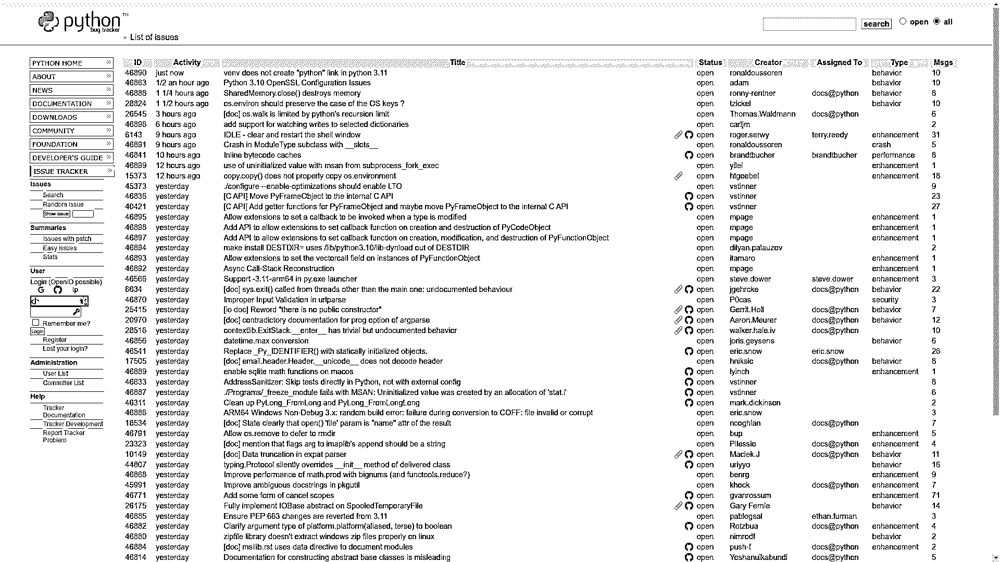

# Python 新闻:2022 年 2 月有什么新消息

> 原文：<https://realpython.com/python-news-february-2022/>

在 2022 年 2 月的**，另一个 **Python 3.11** 的预览版可供早期采用者测试和分享他们的反馈。不久之后，Python 指导委员会宣布 Python 3.11 也将在标准库中包含一个 **TOML 解析器**。另外， **GitHub Issues** 即将成为 Python 的官方 bug 追踪系统。**

其他新闻， **PyCon US 2022** 分享了其会议日程。Python 软件基金会(PSF)想**雇佣两名合同开发者**来改进 Python 包索引(PyPI)。苹果终于**从 macOS 中移除 Python 2.7** 。

让我们深入了解过去一个月最大的 **Python 新闻**！

**立即加入:** ，你将永远不会错过另一个 Python 教程、课程更新或帖子。

## Python 3.11 Alpha 5 发布

虽然 **Python 3.11** 的最终版本计划在【2022 年 10 月发布，这仍然是几个月前的事，但你已经可以看到即将到来的事情了。根据 [PEP 664](https://www.python.org/dev/peps/pep-0664/) 中描述的开发和发布时间表，Python 3.11 现在正处于其发布周期的 [alpha 阶段](https://en.wikipedia.org/wiki/Software_release_life_cycle#Alpha)，这意味着收集来自像您这样的用户的早期反馈。2 月初，7 个计划中的 alpha 版本中的第 5 个 [3.11.0a5](https://www.python.org/downloads/release/python-3110a5/) 开始测试。

要试用 Python 的 alpha 版本，你可以从 Docker Hub 获取相应的 [Docker 映像](https://realpython.com/python-versions-docker/)，用 [pyenv](https://realpython.com/intro-to-pyenv/) 安装一个替代的 Python 解释器，或者使用编译器工具构建 [CPython 源代码](https://realpython.com/cpython-source-code-guide/)。源代码方法允许你从 GitHub 中克隆出 [CPython 的仓库](https://github.com/python/cpython),并且不需要等待 alpha 版本就可以检查出一个最新的快照。

**注意:**开发中的特性可能会不稳定和有问题，它们可能会被修改或从最终版本中删除，恕不另行通知。因此，您不应该在生产环境中使用预览版本！

如果您想探索 Python 3.11 中一些最激动人心的特性，那么请确保您可以运行解释器的 alpha 版本。您将在下面找到下载并运行 **Python 3.11.0a5** 的命令:


```py
$ docker pull python:3.11.0a5-slim
$ docker run -it --rm python:3.11.0a5-slim
Python 3.11.0a5 (main, Feb 25 2022, 20:02:52) [GCC 10.2.1 20210110] on linux
Type "help", "copyright", "credits" or "license" for more information.
>>>
```


```py
$ pyenv update
$ pyenv install 3.11.0a5
$ pyenv local 3.11.0a5
$ python
Python 3.11.0a5 (main, Mar  1 2022, 10:05:02) [GCC 9.3.0] on linux
Type "help", "copyright", "credits" or "license" for more information.
>>>
```


```py
$ git clone git@github.com:python/cpython.git
$ cd cpython/
$ git checkout v3.11.0a5
$ ./configure
$ make
$ ./python
Python 3.11.0a5 (tags/v3.11.0a5:c4e4b91557, Mar  1 2022, 17:48:56) [GCC 9.3.0] on linux
Type "help", "copyright", "credits" or "license" for more information.
>>>
```

那么，关于这个 alpha 版本的大肆宣传是什么呢？有几个大大小小的改进，但是现在，让我们把重点放在 Python 3.11 的一些亮点上！

[*Remove ads*](/account/join/)

### PEP 657:回溯中的错误位置

Python 3.10 已经大大改进了它的错误信息。通过查明根本原因、提供上下文，甚至提出修复建议，错误消息变得更加人性化，对 Python 初学者更有帮助。Python 3.11 将错误消息传递向前推进了一步，以改善调试体验，并为代码分析工具提供一个 API。

有时，一行代码可能包含多条指令或一个复杂的表达式，这在早期的 Python 版本中很难调试:

```py
$ cat test.py
x, y, z = 1, 2, 0
w = x / y / z

$ python3.10 test.py
Traceback (most recent call last):
 File "/home/realpython/test.py", line 2, in <module>
 w = x / y / z
ZeroDivisionError: float division by zero

$ python3.11a5 test.py
 File "/home/realpython/test.py", line 2, in <module>
 w = x / y / z
 ~~~~~~^~~
ZeroDivisionError: float division by zero
```

这里，其中一个变量会导致零除法误差。Python 3.10 告诉你问题所在，但没有指明罪魁祸首。在 Python 3.11 中，[回溯](https://realpython.com/python-traceback/)将包括**视觉反馈**关于一行中引发异常的确切位置。您还将有一种**编程方式**来获取工具的相同信息。

注意，这些增强的回溯对于在 Python [REPL](https://en.wikipedia.org/wiki/Read%E2%80%93eval%E2%80%93print_loop) 中动态评估的代码不起作用，因为回溯需要预编译的字节码来跟踪源代码行:

>>>

```py
Python 3.11.0a5 (main, Mar  1 2022, 10:05:02) [GCC 9.3.0] on linux
Type "help", "copyright", "credits" or "license" for more information.
>>> x, y, z = 1, 2, 0
>>> w = x / y / z
Traceback (most recent call last):
  File "<stdin>", line 1, in <module>
ZeroDivisionError: float division by zero
```

有关回溯中错误位置的更多信息，请参见 [PEP 657](https://www.python.org/dev/peps/pep-0657/) 。

### PEP 654:异常组和`except*`

Python 3.11 将引入一个新的[异常](https://realpython.com/python-exceptions/)类型，称为**异常组**，它允许将几个异常合并到一个容器中。异常组的主要目的是简化并发代码中的错误处理，特别是[异步 IO](https://realpython.com/async-io-python/) ，这在传统上是冗长而混乱的。但是还有其他用例，比如对数据验证期间出现的多个异常进行分组。

因为异常组将是一个标准异常，所以您仍然可以使用常规的`try` … `except`子句来处理它。与此同时，将会有一个新的`except*`语法，用于挑选一个例外组的**特定成员**，同时重新增加你目前不想处理的其他成员。如果您用`except*`捕获到一个常规异常，那么 Python 会为您将它捆绑到一个临时异常组中。

**注意:**不要混淆`except*`和`*args`，它们看起来很相似，但由于星的位置不同而有不同的含义。

这里有一个有点人为的例外组的例子:

>>>

```py
>>> try:
...     raise ExceptionGroup(
...         "Validation exceptions", (
...             ValueError("Invalid email"),
...             TypeError("Age must be a number"),
...             KeyError("No such country code"),
...         )
...     )
... except* (ValueError, TypeError) as subgroup:
...     print(subgroup.exceptions)
... except* KeyError as subgroup:
...     print(subgroup.exceptions)
...
(ValueError('Invalid email'), TypeError('Age must be a number'))
(KeyError('No such country code'),)
```

与常规的`except`子句不同，新语法`except*`在找到匹配的异常类型时不会停止，而是继续向前匹配。这使您可以一次处理多个异常。另一个区别是，您最终得到一个过滤异常的**子组**，您可以通过`.exceptions`属性访问它。

异常组也将有很好的分层回溯:

```py
 + Exception Group Traceback (most recent call last):
 |   File "/home/realpython/test.py", line 2, in <module>
 |     raise ExceptionGroup(
 |     ^^^^^^^^^^^^^^^^^^^^^
 | ExceptionGroup: Validation exceptions
 +-+---------------- 1 ----------------
 | ValueError: Invalid email
 +---------------- 2 ----------------
 | TypeError: Age must be a number
 +---------------- 3 ----------------
 | KeyError: 'No such country code'
 +------------------------------------
```

有关异常组和`except*`的更多信息，参见 [PEP 654](https://www.python.org/dev/peps/pep-0654/) 。

### PEP 673:自身类型

尽管 Python 3.11 Alpha 5 的[发布说明](https://www.python.org/downloads/release/python-3110a5/)提到了这个新特性，但在存储库历史中标记发布点之前，它实际上并没有被合并到主分支中。如果您想体验一下`Self`类型，那么使用 [CPython](https://github.com/python/cpython) 主分支中的最新提交。

简而言之，你可以使用`Self`作为[类型提示](https://realpython.com/python-type-checking/)，比如用**注释**一个方法，该方法返回定义它的类的一个实例。Python 中有很多返回`self`的[特殊方法](https://docs.python.org/3/glossary.html#term-special-method)。除此之外，实现[流畅接口](https://en.wikipedia.org/wiki/Fluent_interface#Python)或带有**交叉引用**的数据结构，如[树](https://en.wikipedia.org/wiki/Tree_(data_structure))或[链表](https://realpython.com/linked-lists-python/)，也将受益于这种新的类型提示。

下面是一个更具体的例子，说明了`Self`的用处。特别是，由于**循环引用**的问题，你不能用你正在定义的类来注释一个属性或方法:

>>>

```py
>>> from dataclasses import dataclass
>>> @dataclass
... class TreeNode:
...     parent: TreeNode
...
Traceback (most recent call last):
  File "<stdin>", line 2, in <module>
  File "<stdin>", line 3, in TreeNode
NameError: name 'TreeNode' is not defined
```

到目前为止，此错误有两种解决方法:

1.  使用类似于`"TreeNode"`的字符串文字，这是大多数类型检查器能够识别的
2.  以基类为界限定义一个[类型变量](https://docs.python.org/3/library/typing.html#typing.TypeVar)

这两种方法都有一个共同的缺点，即当类名改变时，必须更新代码。在 Python 3.11 中，您将有另一种更优雅、更有意义且独立于名称的方式来传达相同的意图:

>>>

```py
Python 3.11.0a5+ (heads/main:b35603532b, Mar  3 2022, 19:32:06) [GCC 9.3.0] on linux
Type "help", "copyright", "credits" or "license" for more information.
>>> from dataclasses import dataclass
>>> from typing import Self >>> @dataclass
... class TreeNode:
...     parent: Self
...
>>> TreeNode.__annotations__
{'parent': typing.Self}
```

有关`Self`类型的更多信息，请参见 [PEP 673](https://www.python.org/dev/peps/pep-0673/) 。

[*Remove ads*](/account/join/)

### PEP 646:可变泛型

同样，尽管 Python 3.11 Alpha 5 发行说明突出了可变泛型，但在本文发表时，它们仍处于非常早期的开发阶段。相关代码甚至还没有合并到 CPython 存储库的主分支中。也就是说，如果您坚持要动手，那么可以查看位于[分叉库](https://github.com/mrahtz/cpython/tree/pep646)中的实现草案。

**注意:**这段代码在外部类型检查工具和代码编辑器赶上它之前是没有用的，因为 Python 解释器在运行时会忽略类型提示。

泛型类型，或简称为**泛型**，有助于实现更好的类型安全性。它们是指定用其他类型参数化的类型的一种方式，其他类型可能是像`int`或`str`这样的具体类型:

```py
fruits: set[str] = {"apple", "banana", "orange"}
```

这样的声明将集合元素的类型限制为字符串，这样**类型检查器**会将任何添加其他类型的尝试视为错误。您还可以用抽象符号表示这些类型的占位符来表示通用参数。在这种情况下，您已经能够在早期的 Python 版本中用`TypeVar`定义一个定制的**类型变量**，就像这样:

```py
from typing import TypeVar

T = TypeVar("T", int, float, str)

def add(a: T, b: T) -> T:
    return a + b
```

这将强制使用相同类型的参数调用`add()`，`T`，这些参数必须是`int`，`float`或`str`。类型检查器会拒绝用两个不兼容的类型调用`add()`的尝试。

现在，Python 3.11 将以`TypeVarTuple`的形式提供**可变泛型**，其目标是在科学库中找到的非常具体的用例，如 [NumPy](https://realpython.com/numpy-tutorial/) ，并处理多维数组。使用可变泛型，您可以通过用一个*变量*数量的占位符类型来参数化数组的类型，从而定义数组的**形状**:

```py
from typing import Generic, TypeVarTuple

Ts = TypeVarTuple("Ts")

class DatabaseTable(Generic[*Ts]):
    def insert(self, row: tuple[*Ts]) -> None:
        ...

users: DatabaseTable[int, str, str] = DatabaseTable()
users.insert((1, "Joe", "Doe"))
users.insert((2, "Jane", "Doe"))

roles: DatabaseTable[str, str] = DatabaseTable()
users.insert(("a2099b0f-c614-4d8d-a195-0330b919ff7b", "user"))
users.insert(("ea35ce1f-2a0f-48bc-bf4a-c555a6a63c4f", "admin"))
```

有关可变泛型的更多信息，请参见 [PEP 646](https://www.python.org/dev/peps/pep-0646/) 。

### 性能优化

Python 3.11 会变得**明显更快**。您可以通过使用新旧解释器在终端中运行一小段代码来亲身体验这种差异。这里有一个计算[斐波那契数列](https://realpython.com/fibonacci-sequence-python/)的第 35 个元素的快速基准，特意用[递归](https://realpython.com/python-recursion/)来实现，以模拟计算机的一个挑战性任务:

```py
$ SETUP='fib = lambda n: 1 if n < 2 else fib(n - 1) + fib(n - 2)'

$ python3.10 -m timeit -s "$SETUP" 'fib(35)'
1 loop, best of 5: 3.16 sec per loop

$ python3.11a5 -m timeit -s "$SETUP" 'fib(35)'
1 loop, best of 5: 1.96 sec per loop
```

如您所见，Python 3.10 完成计算需要三秒多一点，而 Python 3.11 Alpha 5 不到两秒。这是一个巨大的性能提升！当然，这种差异会根据手头的任务而有所不同，一般来说，你应该预料到的数字不会那么令人印象深刻。

有关性能优化的更多信息，请参见 GitHub 上的 [faster-cpython](https://github.com/faster-cpython) 项目。

## TOML 即将迎来 Python 3.11

在计划于 2022 年 5 月发布的 Python 3.11 Beta 1 中的[特性冻结](https://en.wikipedia.org/wiki/Freeze_(software_engineering))之前，新特性会不断被讨论和添加到 Python 的开发分支中。[指导委员会](https://realpython.com/python38-new-features/#the-python-steering-council)最近接受了 [PEP 680](https://www.python.org/dev/peps/pep-0680/) ，这证明了 **Python 的标准库**中需要一个 [TOML](https://toml.io/en/) 解析器，因为 [PEP 517 的](https://www.python.org/dev/peps/pep-0517/)向基于`pyproject.toml`的新构建系统移动。以前，打包工具必须捆绑一个库来从这个文件中读取项目元数据。

实现将基于现有的 [tomli](https://pypi.org/project/tomli/) 库，该库得到了积极的维护和良好的测试。许多流行的工具已经在使用它，这将使得在那些情况下的切换更加平滑。但是，内置模块将被命名为 [`tomllib`](https://realpython.com/python311-tomllib/) 。

**注意:**该特性仍处于早期开发阶段，在 Python 3.11 Alpha 5 版本中不可用。

有了这个附加功能，Python 将获得开箱即用地读取 [XML](https://realpython.com/python-xml-parser/) 、 [JSON](https://realpython.com/python-json/) 和 TOML 的能力。不过，可惜的是不会有任何内置的对 [YAML](https://yaml.org/) 的支持。注意，当前的计划只包括一个 **TOML 解析器**，没有相应的序列化器。以这种格式写入数据仍然需要安装和导入外部库。

[*Remove ads*](/account/join/)

## 迁移到 GitHub 的 Python 问题

你有没有发现 Python 3.11 Alpha 5 的 bug，想知道去哪里报错？你现在可以在 [Python 的 Bug Tracker (BPO)](https://bugs.python.org/) 中报告 Bug，托管在 [Roundup](https://en.wikipedia.org/wiki/Roundup_(issue_tracker)) 上。继 2017 年 2 月 CPython 知识库迁移之后，Roundup 是 Python 基础设施中尚未迁移到 GitHub 的最后剩余部分之一。然而，随着迁移工作的加速，这种情况很快就会改变。

下面是当前 Python 的 bug 追踪器的样子:

[](https://files.realpython.com/media/Screenshot_from_2022-03-02_14-00-38.260e87972227.png)

<figcaption class="figure-caption text-center">Python's Bug Tracker (BPO)</figcaption>

二月中旬， [CPython 常驻开发者](https://realpython.com/python-news-july-2021/#cpython-has-a-full-time-developer-in-residence)ukasz Langa 在[官方 Python 社区论坛](https://discuss.python.org/t/github-issues-migration-is-coming-soon/13791)上宣布，指导委员会要求他接管关于 **bug 追踪器迁移**的项目管理。他还概述了路线图，并要求在测试期间提供反馈，强调 BPO 将继续保持只读模式。新的问题最终只会通过 GitHub 产生。

如果你想了解这一决定背后的基本原理，请前往 [PEP 581](https://www.python.org/dev/peps/pep-0581/) 。简而言之， [Python 软件基金会(PSF)](https://www.python.org/psf-landing/) 下的所有其他项目已经使用 GitHub 问题进行 bug 跟踪。除此之外，GitHub 是众所周知的，并得到了积极的维护，它有许多当前 bug 跟踪系统所缺少的有趣特性。

计划是在 4 月下旬 PyCon US 2022 之前，将所有现有门票从 BPO 迁移到 GitHub。

## PyCon 美国 2022 日程公布

由于疫情的原因，在连续两年的虚拟 [PyCon US](https://realpython.com/pycon-guide/) 活动之后， **PyCon US 2022** 似乎最终将亲自举行，这是许多 PyConistas 一直期待的。除非有一些意想不到的进展，否则会议将首次在犹他州**盐湖城**举行。同时，将有一个在线流媒体选项。

二月下旬，组织者[分享了关于敲定](https://pycon.blogspot.com/2022/02/pycon-us-2022-schedule-launch.html)[会议日程](https://us.pycon.org/2022/schedule/)的消息，该日程概述了充满教程、研讨会、讲座等的紧张的一周:

| 日期 | 事件 | 描述 |
| --- | --- | --- |
| 4 月 27 日至 28 日 | [教程](https://us.pycon.org/2022/schedule/tutorials/) | 由经验丰富的讲师指导的实践课程 |
| 4 月 28 日 | [主办研讨会](https://us.pycon.org/2022/schedule/sponsor-workshops/) | 通常展示由会议发起人开发的工具和解决方案 |
| 4 月 28 日 | [教育峰会](https://us.pycon.org/2022/events/education-summit/) | 针对教师和教育工作者的联合讨论集中在通过 Python 开发编码素养上 |
| 4 月 29 日 | [维护者峰会](https://us.pycon.org/2022/events/maintainers-summit/) | 围绕如何维护和发展项目和社区的最佳实践的讨论 |
| 4 月 30 日 | [为不同的初学者辅导短跑](https://us.pycon.org/2022/events/mentored-sprints/) | 关于如何成为完全初学者的开源项目贡献者的实践课程 |
| 4 月 30 日 | [皮拉迪斯拍卖会](https://us.pycon.org/2022/events/pyladies-auction/) | 有现场竞价机会的慈善拍卖 |
| 4 月 29 日至 5 月 1 日 | [会议会谈](https://us.pycon.org/2022/schedule/talks/) | 五个同步演示轨道，以及开放空间，赞助商，闪电谈话，海报，晚餐，等等 |
| 5 月 1 日 | 招聘会 | 在赞助商的展位上直接申请工作的机会 |
| 5 月 2 日至 3 日 | 短距离赛跑 | 小组练习，研究与 Python 相关的各种开源项目 |

请注意，教程的名额有限，很快就会满员，每节课需要 150 美元的报名费。皮拉迪斯拍卖也有 35 美元的报名费和可选的 15 美元捐款。

你今年会参加在盐湖城举行的 PyCon US 吗？在下面的评论区让大家知道。真正的 Python 团队将在那里等着你，准备好击掌并提供酷礼品！

## PSF 雇佣来改善 PyPI

Python 软件基金会(PSF)宣布，他们正在寻求雇佣两名合同开发者[](https://pyfound.blogspot.com/2022/02/we-are-hiring-contract-developers-to.html)**来帮助在 [Python 包索引(PyPI)](https://pypi.org/) 中构建新功能，这是 Python 包的官方存储库。这个决定是在对 Python 社区进行了一些调查[之后做出的，这些调查确定了 PyPI 目前缺少的关键用户需求。](https://pyfound.blogspot.com/2021/12/pypi-user-feedback-summary.html)*

*最受欢迎的特性是 PyPI 中的**组织账户**，这是两家承包商将要设计、开发和部署的。目标是允许在 PyPI 中设置一个组织帐户，邀请其他用户加入组织，将这些用户分组到团队中，以及管理多个项目的所有权和权限。这将是向公司提供的有偿服务。

其中一个承包商角色将关注**后端**，另一个处理**前端**。这两个职位都是远程友好的，合同工作预计将于 2022 年 4 月初开始。每个角色的预算高达 9.8 万美元，约 560 小时，每周工作 35 小时。

查看[评估标准](https://github.com/psf/request-for/blob/main/2022-PyPI/RFP.md#evaluation-criteria)了解更多信息。

## Python 2.7 从 macOS 中移除

从技术上讲，这是一月份的新闻，但在这里值得一提，因为这是一个历史性的时刻。

衍生自 Unix 的操作系统[，比如 macOS 和各种 Linux 发行版，作为众多内置软件包的依赖项与 Python 一起发布。然而，与许多 Linux 发行版不同的是，苹果自 2010 年发布 Python 2.7 以来，甚至在 2.7 于 2020 年 4 月走到生命尽头之后，都没有费心更新 macOS 中预装的解释器。](https://en.wikipedia.org/wiki/Unix-like)

这不仅是一个主要的安全风险，T2 英国网络安全局(NCSC)已经警告过了，也给 macOS 用户带来了不便。他们经常会不小心将包安装到他们遗留的系统级解释器中，而不是期望的[虚拟环境](https://realpython.com/python-virtual-environments-a-primer/)。最终，当苹果在 **macOS Monterey 12.3 Beta 5** 的[发行说明](https://developer.apple.com/documentation/macos-release-notes/macos-12_3-release-notes#Python)中悄悄提到从 macOS 中移除 Python 2.7 时，谣言被证明是真的。

然而，有趣的是，他们决定在操作系统发布周期的中期，通过 macOS 更新的[测试版](https://en.wikipedia.org/wiki/Software_release_life_cycle#Beta)做出如此重大的改变。

[*Remove ads*](/account/join/)

## Python 的下一步是什么？

二月份你最喜欢的 Python 新闻是什么？我们错过了什么值得注意的吗？请在评论中告诉我们，我们可能会在下个月的 Python 新闻综述中介绍您。

快乐的蟒蛇！

**立即加入:** ，你将永远不会错过另一个 Python 教程、课程更新或帖子。******