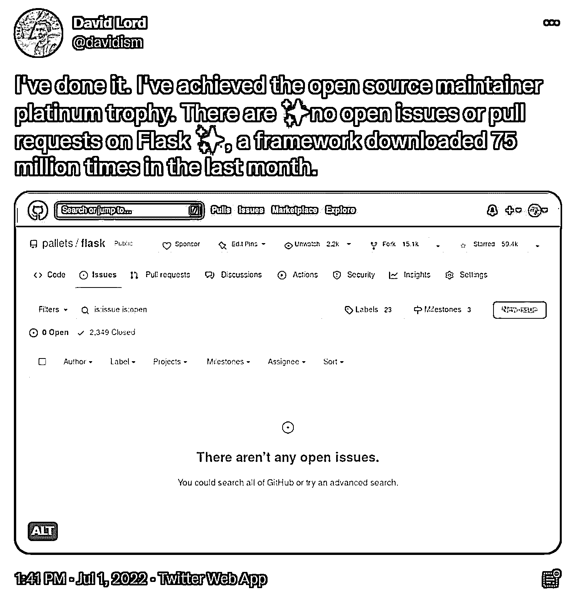
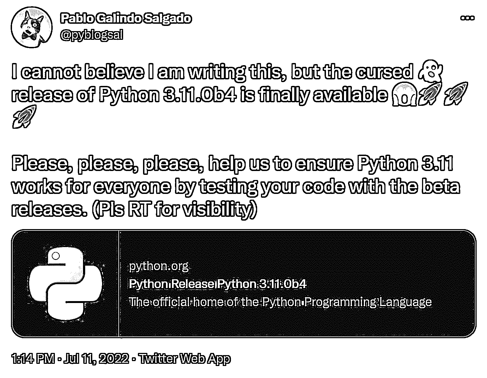
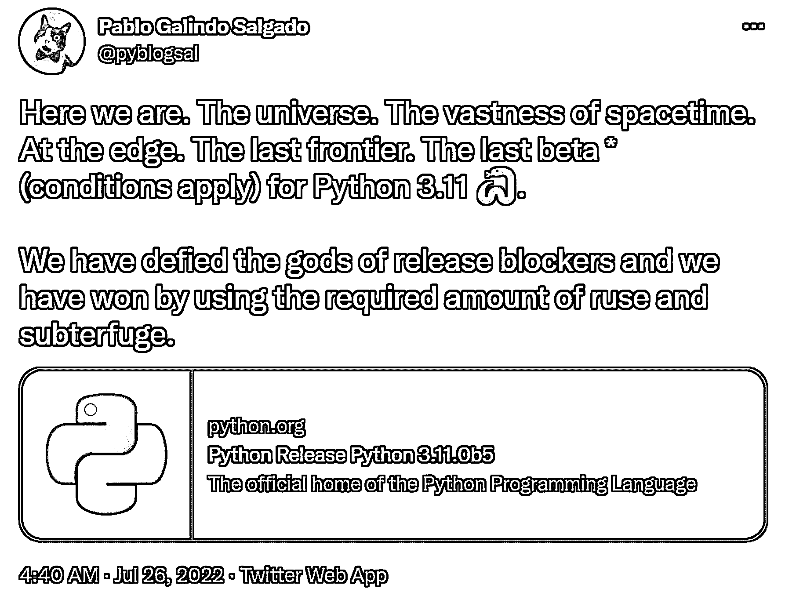
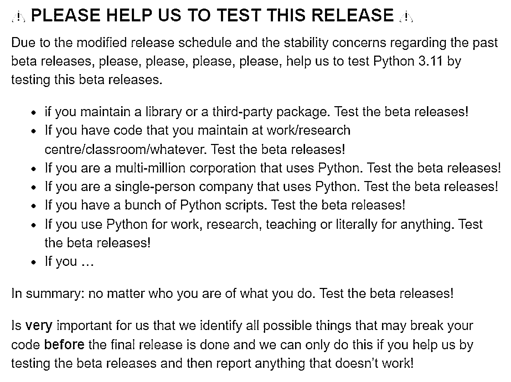
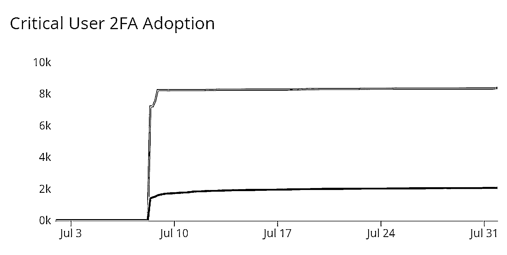

# Python 新闻:2022 年 7 月有什么新消息

> 原文：<https://realpython.com/python-news-july-2022/>

在 2022 年 7 月的**，Python 触及了星星，在处理来自**詹姆斯·韦伯太空望远镜**的数据中发挥了关键作用。经过两年的虚拟会议，**欧洲 Python 2022** 在爱尔兰都柏林举行。 **Anaconda** 迎来了它的十岁生日， **Flask** 在 GitHub 上实现了一个重大的里程碑。**

**Python 3.11** 的两个新**预发布版本**发布，3.11.0b5 代表最终测试版。同时， **Python 包索引(PyPI)** 为关键项目的维护者引入了双重认证要求。最后，RStudio 改变了它的名字，并为 Python 发布了**Shiny**。

号外号外！阅读上个月所有令人兴奋的 **Python 新闻**！

**立即加入:** ，你将永远不会错过另一个 Python 教程、课程更新或帖子。

## Python 去太空

嗯，也许更准确的说法是 Python 把太空带到了地球。詹姆斯·韦伯太空望远镜(JWST) 成为全球头条新闻，当时[美国国家航空航天局和美国总统乔·拜登公布了它的第一批图像](https://www.youtube.com/watch?v=zyuLrLth2QY)。[全画廊](https://webbtelescope.org/news/first-images/gallery)视觉上非常壮观，在科学上具有开创性，因为它充满了迄今为止宇宙最深的红外图像。

Python 使得这项工作成为可能。正如[都柏林高级研究院](https://www.dias.ie/)研究员、[中红外仪器【MIRI】](https://webb.nasa.gov/content/observatory/instruments/miri.html)软件开发者帕特里克·卡瓦纳博士在 EuroPython 2022 的演讲中所说:

> 90%或者更多的分析工具、模拟器等等都是用 Python 开发的，并且使用 Python。([来源](https://youtu.be/tRtxCCRdZOs?t=3370))

例如， [JWST 科学校准管道](https://jwst-docs.stsci.edu/jwst-science-calibration-pipeline-overview)运行在 Python 上，带有一些用于提高速度的 [C](https://realpython.com/build-python-c-extension-module/) 插件。韦伯的图像被处理为[数字阵列](https://realpython.com/numpy-array-programming/)，[太空望远镜科学研究所](https://www.stsci.edu/)的数据科学家依靠 [SciPy](https://realpython.com/python-scipy-cluster-optimize/) 和 [Jupyter 笔记本](https://realpython.com/jupyter-notebook-introduction/)，以及该研究所自己的 [AstroConda 频道](https://astroconda.readthedocs.io/en/latest/)。

如果你想尝试处理天文数据，那么你很幸运！韦伯的数据是免费提供的，你可以通过三个步骤准备离开这个世界:

1.  创造一个[虚拟](https://realpython.com/python-virtual-environments-a-primer/#the-virtualenv-project)或[康达](https://realpython.com/python-virtual-environments-a-primer/#the-conda-package-and-environment-manager)的环境。
2.  [激活](https://realpython.com/python-virtual-environments-a-primer/#activate-it)你的环境。
3.  使用 [`pip`](https://realpython.com/what-is-pip/) 安装 [`jwst`](https://jwst-pipeline.readthedocs.io/en/latest/) 包。

现在你差不多准备好玩了。但是在发射之前，你需要从芭芭拉·a·米库尔斯基太空望远镜档案馆下载原始数据。有大量的数据，要得到你想要的可能很复杂。幸运的是，AstroExploring 有一个如何做的[博客](https://www.astroexploring.com/blog/how-to-download-raw-data-from-the-james-webb-space-telescope-in-windows)和[视频](https://www.youtube.com/watch?v=evqXcRR0k5w)来帮你。

要了解更多关于 Python 在这个新领域中的作用，请查看[播客【Python 与我对话】中的](https://talkpython.fm/) [Python 和詹姆斯·韦伯太空望远镜](https://www.youtube.com/watch?v=LmZ8w9WLEYY)。一定要在下面的评论里分享你的天文发现！

[*Remove ads*](/account/join/)

## 都柏林举办 2022 年欧洲 Python 大会

就像在[4 月](https://realpython.com/python-news-april-2022/)和[5 月](https://realpython.com/python-news-may-2022/)与 [PyCon US 2022](https://realpython.com/pycon-guide/) 一样，Python 社区又在一起了，感觉真好！本月，最大的聚会是 7 月 11 日至 17 日在爱尔兰都柏林举行的欧洲 Python 2022 。

大会举办了许多激动人心的活动，包括[初学者日-简陋数据工作坊](https://ep2022.europython.eu/humble-data)、 [Django Girls](https://djangogirls.org/en/dublin/) 和 [Trans*Code](https://www.trans.tech/) 。诸如此类的事件打开了 Python 社区的大门，使得编码对所有人来说更受欢迎和更容易理解。非常感谢 EuroPython 将包容性放在了首位！

当几个程序员兴奋地聚在一起时，EuroPython 还提供了一个功能齐全的[远程选项](https://ep2022.europython.eu/remote)来确保每个人，无论远近，都在礼堂里有一个座位。远程持票者可以积极参与[闪电对话](https://ep2022.europython.eu/sessions)、Q &答问环节，并与特邀发言人进行分组讨论。

现场与会者和远程与会者都可以参加涵盖各种[主题](https://ep2022.europython.eu/sessions)的讲座。即使你没有买票，你仍然可以在网上[观看所有的场次](https://www.youtube.com/playlist?list=PL8uoeex94UhFzv6hQ_V02xfMCcl8sUr4p)。

## 蟒蛇和烧瓶庆祝里程碑

7 月 11 日，蟒蛇[满十岁](https://twitter.com/anacondainc/status/1546497292307501056?t=y5X9Bhs4OMePmHIf2-G2Qw&s=19)！ [Anaconda](https://www.anaconda.com/products/distribution) 是一个**开源分发系统**，它特别面向[数据科学](https://realpython.com/tutorials/data-science/)和[机器学习](https://realpython.com/tutorials/machine-learning/)。

**注:**如果你想入门 Anaconda 和机器学习，那么就来看看这个[设置指南](https://realpython.com/python-windows-machine-learning-setup/)。

Pythonistas 还可以感谢 Anaconda 开发了包括 [pandas](https://realpython.com/pandas-python-explore-dataset/) 、 [Dask](https://realpython.com/podcasts/rpp/112/) 、 [Bokeh](https://realpython.com/python-data-visualization-bokeh/) 以及最近的 [PyScript](https://realpython.com/pyscript-python-in-browser/) 在内的库。

要了解 Anaconda 的第一个十年及其未来计划，请查看 [10 年数据科学创新:Anaconda 对开源 Python 社区的承诺](https://www.anaconda.com/blog/10-years-of-data-science-innovation-anacondas-commitment-to-the-open-source-python-community)。Anaconda 团队注意到 Python 正在以比任何其他编程语言更快的速度取得进展，Anaconda 拥有超过 3000 万用户，该团队致力于全面扩展对**数据素养**的访问。我们 Real Python 为这些努力喝彩！

但是 Anaconda 并不是唯一有理由庆祝的人——Flask 在这个月开始时没有任何未决问题或 [GitHub](https://realpython.com/python-git-github-intro/) 上的**拉请求**:

<figcaption class="figure-caption text-center">[Image source](https://twitter.com/davidism/status/1542956488355762176)</figcaption>

祝贺[大卫·洛德](https://twitter.com/davidism)和整个团队取得这一巨大成就！

[Flask](https://flask.palletsprojects.com/) 是一个用于 **web 开发**的流行库。库维护人员不断地响应用户的需求并做出改进，因此清除队列是一项相当大的成就。如果你想在你自己的 web 开发中利用 Flask 的力量，你可以通过跟随 Real Python 的 [Flask by Example](https://realpython.com/learning-paths/flask-by-example/) 学习路径来学习。

为 Anaconda 的下一个十年和 Flask 的持续流行和维护干杯！

## Python 3.11 最终测试版发布

2022 年 10 月大新闻来了， **Python 3.11** 终于要放归野外了！但是现在，Python 社区可以享受修补**测试版**的乐趣。

7 月 11 日， [Python 3.11.0b4 问世](https://discuss.python.org/t/the-cursed-release-of-python-3-11-0b4-is-now-available/17274)，终于:

<figcaption class="figure-caption text-center">[Image source](https://twitter.com/pyblogsal/status/1546573761146753025?t=GVfTmqJdOhK63W0hetoWbg&s=19)</figcaption>

Python 3.10/3.11 发布经理兼 Python 核心开发者 [Pablo Galindo Salgado](https://twitter.com/pyblogsal) 称这是一个*诅咒版*，因为一些[屏蔽者](https://mail.python.org/archives/list/python-dev@python.org/thread/3JWVCSBPBFWY5ZWSJ7RYB6FS5NIMCEOY/)要求修改发布时间表。特别是，过去的测试版存在稳定性问题，所以这个版本在它的继任者 Python 3.11.0b5 预计发布的后两天*发布。*

最初，有人预测 Python 3.11 的正式发布可能会推迟到 2022 年 12 月，但看起来开发者们已经回到了 10 月发布的轨道上。7 月 26 日标志着 Python 3.11.0b5 的[发布:](https://discuss.python.org/t/the-last-3-11-beta-release-3-11-0b5-is-now-available/17693)

<figcaption class="figure-caption text-center">[Image source](https://twitter.com/pyblogsal/status/1551880046457094145)</figcaption>

这些推文强调了每个测试版投入的时间和精力。那么为什么要为他们费心呢？简而言之，测试阶段对 Python 的健康至关重要。

在 **alpha 阶段**，新的功能正在被添加，但是 beta 阶段伴随着**功能冻结**。这是开发人员、库维护人员和程序员用他们的代码进行测试，并在重要的日子到来之前报告任何错误或意外行为的最佳时机:

<figcaption class="figure-caption text-center">[Image source](https://discuss.python.org/t/the-last-3-11-beta-release-3-11-0b5-is-now-available/17693)</figcaption>

所以，现在是时候试一试了。如果你还没有，你可以在这里[下载 Python 3.11.0b5。然后尝试它闪亮的新特性，像](https://www.python.org/downloads/release/python-3110b5/)[更好的错误消息](https://realpython.com/python311-error-messages/)、[任务和异常组](https://realpython.com/python311-exception-groups/)，以及[支持用`tomllib`](https://realpython.com/python311-tomllib/) 读取 TOML。在下面的评论中分享你的发现和阻碍。

[*Remove ads*](/account/join/)

## PyPI 要求双因素认证

Python 健康的另一个关键是确保所有第三方库安全可靠。这就是为什么 [PyPI](https://pypi.org/) 致力于确保关键库的开发者使用[双因素认证(2FA)](https://pypi.org/security-key-giveaway/) 。这将成为未来几个月的一项要求。

虽然最终目标是让尽可能多的库维护者和所有者使用 2FA，但是第一个主要的推动力是让所有关键库的维护者都参与进来。以下是 *critical* 在此上下文中的含义:

> 项目资格是基于下载量的:任何在前 6 个月下载量前 1%的项目都被指定为关键项目(以及 PyPI 自己的依赖项)。([来源](https://twitter.com/pypi/status/1545455377482915840))

超过 3500 个项目符合这一标准，谷歌开源安全团队正在向所有合格的维护者提供两个免费的 [Titan 安全密钥](https://store.google.com/product/titan_security_key?pli=1&hl=en-GB)。

但是即使你没有维护一个关键的库，你也可以选择加入并要求你的维护者和所有者伙伴使用 2FA。

您可以在 [PyPI 2FA 仪表板](https://p.datadoghq.com/sb/7dc8b3250-389f47d638b967dbb8f7edfd4c46acb1?from_ts=1656456725165&to_ts=1659048725165&live=true)上跟踪该计划的进展。截至 7 月 31 日，8000 多名关键维护人员中约有 2000 名采用了 2FA:

<figcaption class="figure-caption text-center">[Image source](https://p.datadoghq.com/sb/7dc8b3250-389f47d638b967dbb8f7edfd4c46acb1?from_ts=1656519357632&to_ts=1659111357632&live=true)</figcaption>

如果你在 PyPI 上维护一个库，不管是否重要，你都应该启用 2FA 来保护自己和他人！

## RStudio 更名并发布 Shiny for Python

RStudio 公司通过为数据科学、科学研究和技术交流提供开源软件而声名鹊起。现在它采用了一个新名字: **Posit** ！这意味着:

> Posit 是一个真实的词，意思是提出一个想法供讨论。数据科学家每天花大量时间提出主张，然后用数据进行评估。当考虑公司的新名字时，我们希望它既能反映我们社区从事的工作(测试假设！)以及建立更高层次的知识和理解的科学愿望。([来源](https://www.rstudio.com/blog/rstudio-is-becoming-posit/))

这篇博客文章继续指出，尽管 RStudio 的努力主要与 [R 编程语言](https://www.r-project.org/about.html)有关，但该公司的使命“有意超越‘数据科学的 R’”。"

这包括继续致力于开发 Python 工具。7 月底，alpha 发布了一个这样的工具。 [Shiny for Python](https://shiny.rstudio.com/py/) 为构建 web 应用程序提供了一个可接近的、灵活的、高性能的仪表板。

因为它仍处于 alpha 阶段，所以你不应该在生产中依赖它的应用程序，但你绝对可以尝试一下，看看它能做什么。您可以通过将它安装在您的计算机上或在您的网络浏览器中试用来开始使用。

## Python 的下一步是什么

这个月在 Python 的世界里，你最激动的是什么？

你参加了 2022 年欧洲蟒蛇展吗？你是否摆弄过来自太空最深处的数据？通过要求 2FA，您是否使您的库更加安全？你正在测试 Python 3.11 的最新测试版吗？你是如何庆祝《蟒蛇》和《烧瓶》的成功的？请在评论中告诉我们！

快乐的蟒蛇！

**立即加入:** ，你将永远不会错过另一个 Python 教程、课程更新或帖子。**