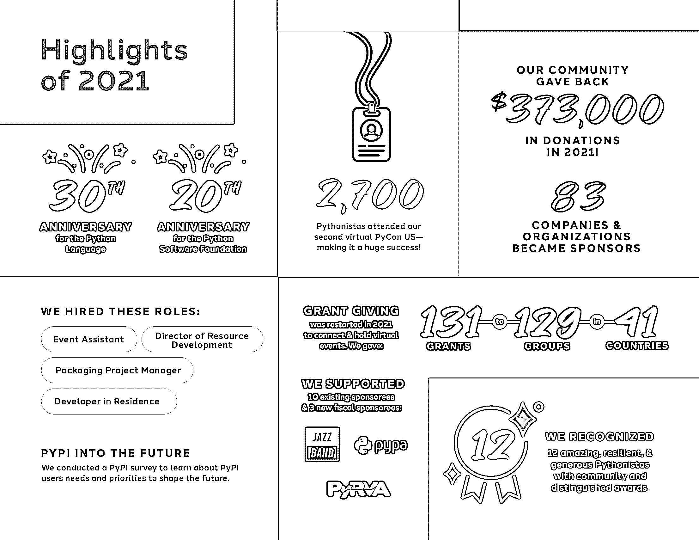
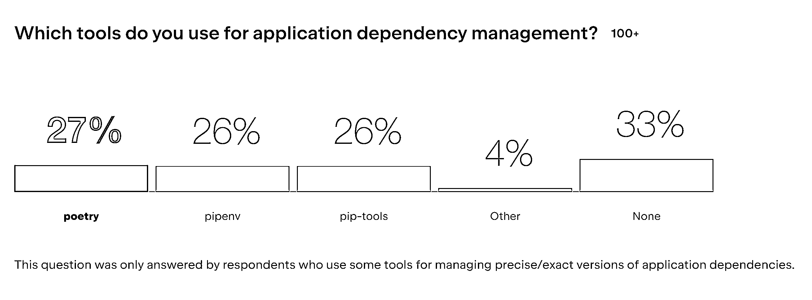

# Python 新闻:2022 年 6 月有什么新消息

> 原文：<https://realpython.com/python-news-june-2022/>

2022 年 6 月为 Python 社区带来了一系列激动人心的消息！PSF 收到了一笔资金，用于一个专注于安全的新角色，并为董事会的四个席位举行了选举。两个重要的**开发者调查**的结果已经公布，Python 和一些流行包的新版本已经问世。

PEP 691 被接受，扩展了 Python 打包索引的简单 API。随着 Python 3.12 变更页面的上线，您现在可以点击刷新，第一时间了解明年主要 Python 版本中即将推出的特性和反对意见。

随着夏季的全面展开，Python 社区中也出现了更多面对面的聚会，其他聚会还在继续。

让我们深入了解过去一个月最大的 **Python 新闻**！

**立即加入:** ，你将永远不会错过另一个 Python 教程、课程更新或帖子。

## Python 软件基金会有消息

[Python 软件基金会(PSF)](https://www.python.org/psf/) 是 Python 背后的组织。它旨在“促进、保护和发展 Python 编程语言，并支持和促进一个[多样化](https://www.python.org/psf/diversity/)和国际化的 Python 程序员社区的发展”([来源](https://www.python.org/psf/mission/))。

如果你以前没有听说过 PSF，一定要去看看 PSF 博客，在这篇新闻文章中你会看到它的几次链接。

[*Remove ads*](/account/join/)

### PSF 选举新的董事会董事

填补 PSF 董事会四个席位的选举于六月下半月举行[。PSF 董事会席位的任期为三年，董事有资格连任。要在这次选举中投票，你必须是有投票权的注册 PSF 成员](https://pyfound.blogspot.com/2022/06/the-psf-board-election-is-open.html)[。](https://www.python.org/psf/membership/#what-membership-classes-are-there)

今年[有很多被提名人](https://www.python.org/nominations/elections/2022-python-software-foundation-board/nominees/)，而[的席位被获得最多票数的四名被提名人](https://pyfound.blogspot.com/2022/07/board-election-results-for-2022.html)占据:

1.  [库沙尔达斯](https://www.python.org/nominations/elections/2022-python-software-foundation-board/nominees/kushal-das/)
2.  詹尼斯·雷德尔
3.  [黎明工资](https://www.python.org/nominations/elections/2022-python-software-foundation-board/nominees/dawn-wages/)
4.  西蒙·威廉森

如果你对在 PSF 董事会任职意味着什么以及董事的职责是什么感到好奇，那么你可以看一个视频，其中三名董事会成员描述了作为 Python 软件基金会董事的 T2 的生活。

祝贺新的和回归的董事会董事，非常感谢所有其他被提名者继续参与 Python 社区。

### PSF 发布 2021 年年报

本月，PSF 也发布了其 2021 年年度报告。去年是 Python 软件基金会成立二十周年，也是 Python 本身成立三十周年:

[](https://files.realpython.com/media/psf-report-2021.84df1b852d49.png)

该报告重点介绍了四名团队成员如何在 2021 年以新的角色加入 PSF。Python 打包和 CPython 本身通过[打包项目经理](https://realpython.com/python-news-august-2021/#python-has-a-packaging-project-manager)和[常驻开发人员](https://realpython.com/python-news-july-2021/#cpython-has-a-full-time-developer-in-residence)的专门角色得到了强有力的支持。活动资助再次启动，重点是在线活动。PSF 还组织了 PyCon US 2021，作为一项完全在线的活动。

如果你想了解更多，你可以在线阅读完整的报告。

### OpenSSF 资助 Python 生态系统的安全角色

遗憾的是，这已经不是第一次了，PyPI 上还发现了另一组[恶意软件包。因为 Python 在世界范围内被如此庞大的社区所使用，这样的攻击可能会产生危险而深远的后果。在上面链接的新闻文章中，你会看到这些软件包旨在揭露程序员的秘密。](https://blog.sonatype.com/python-packages-upload-your-aws-keys-env-vars-secrets-to-web)

因此，[开源安全基金会(OpenSSF)](https://openssf.org/) 决定资助 PSF 中的一个新角色，这是一个好消息。

担任该角色的人将有机会积极影响更广泛的 Python 生态系统中的当前安全状态，因为他们“为 Python、Python 包索引(PyPI)和 Python 生态系统的其余部分提供了安全专业知识”( [Source](https://openssf.org/blog/2022/06/20/openssf-funds-python-and-eclipse-foundations-and-acquires-sos-dev-through-alpha-omega-project/) )。

这笔赠款还将用于完成对 Python 生态系统中关键开源基础设施的安全审计，如 PyPI 和 CPython 源代码本身。有一个专门的角色和资金将有望大大提高 Python 的大型全球社区的安全性。

## 调查结果出来了！

也许您过去参加过开发者调查，或者您喜欢浏览结果以了解社区的发展方向。6 月，两项重要的开发商调查结果公布。

### Python 开发者调查

本月初，[PSF 宣布了](https://pyfound.blogspot.com/2022/06/python-developers-survey-2021-python-is.html)第五次年度 Python 开发者调查的结果，这是 PSF 和 JetBrains 的一次合作。

你可以在[专用网页](https://lp.jetbrains.com/python-developers-survey-2021/)上以可视化方式查看一些调查结果，或者你可以打开你的数据分析指关节，看看你能在[的原始数据](https://drive.google.com/file/d/1BaImG13GefSTe3ZGa4DEYwomP-gQ0DzE/view?usp=sharing)中找到什么。

调查中首次包含了关于 [Python 打包](https://lp.jetbrains.com/python-developers-survey-2021/#PythonPackaging)的明确问题:

[](https://files.realpython.com/media/survey-dependency-tools.57b4d1d13097.png)

以微弱优势，[诗歌](https://realpython.com/dependency-management-python-poetry/)是最受欢迎的依赖管理工具，此外还有 [Pipenv](https://realpython.com/pipenv-guide/) 和 [`pip-tools`](https://pip-tools.readthedocs.io/en/latest/) 。

**注意:**有些问题允许有多个答案，这就是总分可能大于 100%的原因。

在关于 Python 打包的部分，您还可以看到 [`pip`](https://realpython.com/what-is-pip/) 和 [`venv`](https://realpython.com/python-virtual-environments-a-primer/) 是最流行的打包相关工具，大多数开发人员将他们的项目依赖记录在一个`requirements.txt`文件中。

Python 开发者主要将他们的包发布到 PyPI，尽管 37%的受访者表示他们将包发布到私有的 Python 包索引。随着 [PEP 691 接受](#pep-691-brings-a-json-based-simple-api-for-python-package-indexes)，以后会不会有一部分转移到 JSON 中托管包信息？

虽然调查结果没有什么大的惊喜，但是这些数据帮助了 Python 核心开发人员、打包项目经理和其他人的工作。

接下来，看看更广泛的开发人员社区的状态！

[*Remove ads*](/account/join/)

### StackOverflow 的开发者调查

今年的 [StackOverflow 开发者调查](https://survey.stackoverflow.co/2022/)在五月进行，超过七万名开发者参与。他们分享了关于最喜欢的工具、教育背景、喜欢和不喜欢等等的观点！

Python 也得到了更广泛的开发人员社区的喜爱:

> Rust […]与 Python 并列为最受欢迎的技术，TypeScript 紧随其后。([来源](https://survey.stackoverflow.co/2022/#section-most-loved-dreaded-and-wanted-programming-scripting-and-markup-languages))

Python 也几乎和 HTML/CSS、JavaScript 并列成为最受初学编程的新人欢迎的语言。但是 Python 生态系统中的包呢？

因为 Python 在学习编码的人群中很受欢迎，所以像 NumPy 和 pandas 这样的包在新手中也比专业开发人员更受欢迎。

就 web 框架而言，开发人员[喜欢 FastAPI](https://survey.stackoverflow.co/2022/#section-most-loved-dreaded-and-wanted-web-frameworks-and-technologies) ，并且对学习它和[使用 FastAPI 构建 web API](https://realpython.com/fastapi-python-web-apis/)很感兴趣。

在开发者调查结果中，你有没有发现其他特别有趣的东西？如果你有，请在下面的评论中分享你的发现。

## Python 生态系统发布新版本

几乎每个月都有几个著名的 Python 包，甚至 Python 本身的新版本发布。他们通常会添加新功能、修复错误、纠正安全问题等等。2022 年 6 月也不例外。现在，您可以测试、使用和享受几个新版本。继续阅读，了解更多信息！

### Python 3.11.0b3 加急

Python 3.11 之前的测试版(3.11.0b2)与 [`pytest`](https://realpython.com/pytest-python-testing/) 有不兼容的地方。由于 Python 3.11 中编译器和 AST 节点的变化，`pytest`默认重写的 AST 节点最终无效。

为了避免要求用户修改他们的测试套件，Python 3.11 发布团队决定创建这个额外的测试版，来解决这个问题。这个决定将 3.11 的测试版总数从四个增加到五个。

**注意:** Python 3.11 仍在开发中，将为该语言带来许多新的有趣的特性，例如[更好的错误消息](https://realpython.com/python311-error-messages/)、[任务和异常组](https://realpython.com/python311-exception-groups/)，以及 [TOML 支持](https://realpython.com/python311-tomllib/)。

你可以在 6 月 1 日[宣布加急发布](https://pythoninsider.blogspot.com/2022/06/expedited-release-of-python3110b3.html)的博客页面上阅读更多关于 3.11.0b3 的细节。

### Python 3.10.5 维护

6 月初，发布团队还公布了 Python 3.10 的第五个[维护版本](https://realpython.com/python-bugfix-version/)，Python 3.10.5:

> 这个版本包含了超过 230 个错误修正和文档变更，所以你肯定想更新:)( [Source](https://blog.python.org/2022/06/python-3105-is-available_6.html) )

如果您仍在使用任何早期版本，请获取您的更新以充分享受 Python 3.10 中的所有[新特性，而不会遇到已经报告并解决的问题。](https://realpython.com/python310-new-features/)

### Django 4.0.5 错误修复和 4.1 Beta 1

Django 在 6 月发布了 Django 4.0.5 的 bugfix 版本，修复了 4.0.4 中出现的几个 bug。

本月晚些时候，Django 项目宣布了一个令人兴奋的更新，发布了 Django 4.1 beta 1。这一版本意味着 Django 4.1 的所有主要新功能现在都被锁定，“从现在到 4.1 最终版之间，只有新功能中的错误和 Django 早期版本的退化才会被修复”([来源](https://www.djangoproject.com/weblog/2022/jun/21/django-41-beta-1-released/))。

如果你渴望看到 Django 4.1 的许多新特性，那么你现在可以安装 Django 4.1 beta 1 并试用它们！确保向 Django 团队报告你发现的任何错误，帮助他们修复在[开发阶段](https://docs.djangoproject.com/en/dev/internals/release-process/#phase-two-development)遗留的问题。

[*Remove ads*](/account/join/)

### 请求 2.28.0 和 2.28.1

[Requests](https://requests.readthedocs.io/en/latest/) 本月还发布了两个新版本。除了一些改进和错误修复，该项目还根据 [GitHub PR 6091](https://github.com/psf/requests/pull/6091) 中的建议，在 [2.28.0](https://github.com/psf/requests/releases/tag/v2.28.0) 中放弃了对 Python 2.7 和 Python 3.6 的支持。这意味着新版本的请求不再支持任何版本的 Python 2.x。

月底带来了另一个版本 [2.28.1](https://github.com/psf/requests/releases/tag/v2.28.1) ，它在`iter_content`中添加了速度优化，并过渡到`yield from`。

## Python 3.12 变更页面上线

描述 Python 3.12 新特性的页面上线了。在撰写本文时，还没有列出任何新特性，但是您可以浏览将在下一个 Python 版本中生效的反对意见列表。

[讨论了很长时间的一个有趣的奇怪现象](https://github.com/python/cpython/issues/87999)将进一步产生一个可见的错误:

> 目前，Python 接受后面紧跟关键字的数字文字，例如`0in x`、`1or x`、`0if 1else 2`。它允许像`[0x1for x in y]`(可以解释为`[0x1 for x in y]`或`[0x1f or x in y]`)这样令人困惑和模棱两可的表达。如果数字文字后面紧跟关键字`and`、`else`、`for`、`if`、`in`、`is`和`or`之一，则会发出语法警告。在未来的版本中，它将被更改为语法错误。

如果您使用较旧的 Python 解释器运行这些代码示例之一，那么您不会看到任何警告。在 3.11 中，它引发了一个 [`DeprecationWarning`](https://docs.python.org/3/library/exceptions.html#DeprecationWarning) ，你只有在开发模式下运行 [Python 时才能看到:](https://docs.python.org/3/library/devmode.html#devmode)

```py
$ python -X dev
```

一旦在开发模式下启动了 Python 3.11，就可以运行示例来查看`DeprecationWarning`:

>>>

```py
>>> [0x1for x in (1, 2)]
<stdin>:1: DeprecationWarning: invalid hexadecimal literal
[31]
```

在 3.12 中，无声的`DeprecationWarning`将会变成无声的 [`SyntaxWarning`](https://docs.python.org/3/library/exceptions.html#SyntaxWarning) ，在你玩这种恶作剧的时候给你提个醒。正如前面提到的，核心开发者计划在以后的版本中把这个`SyntaxWarning`改成`SyntaxError`。

“Python 中的新特性”页面会不断更新，直到 Python 版本发布。你能找到其他有趣的弃用或改变吗？如果有你想讨论的，请在下面留言！

## PEP 691 为 Python 包索引带来了一个基于 JSON 的简单 API

[PEP 691](https://peps.python.org/pep-0691/) 引入了基于 JSON 的 **[简单 API](https://peps.python.org/pep-0503/#specification)** 允许 Python 包索引使用 JSON 代替 HTML。

这个 PEP 代表了对简单 API 的一个改变，它是 Python 包索引的一个接口。这个 API 主要由安装程序和解析程序使用，比如`pip`，当获取关于要安装的包的信息时。

**注意:** [PyPI](https://pypi.org/) 还有一个 [JSON API](https://warehouse.pypa.io/api-reference/json.html) ，它提供关于托管在 PyPI 上的项目的信息。这个 API 和通过 PEP 691 添加的基于 JSON 的简单 API 没有任何关系。

基于 JSON 的简单 API 主要是作为现有的基于 HTML 的简单 API 的一个更加机器友好的替代，因此避免引入新的功能。

例如，基于 HTML 的简单 API 上的包的发布将需要具有关于包含在 HTML 链接元素中的文件的所有信息:

```py
<a href="https://files.pythonhosted.org/packages/7a/93/551e43aefa86a6f57e1852d60568024e12a20f5f9bf316a37fc869c0c274/barbican-14.0.0.tar.gz#sha256=1a034410189d045974bf70b703ecdce17c1a7b6a14814541e05ba5cb34f6e419"
   data-requires-python=">=3.6">
    barbican-14.0.0.tar.gz
</a>
```

通过基于 JSON 的简单 API 提供的相同信息更容易解析:

```py
{ "filename":  "barbican-14.0.0.tar.gz", "hashes":  { "sha256":  "1a034410189d045974bf70b703ecdce17c1a7b6a14814541e05ba5cb34f6e419" }, "requires-python":  ">=3.6", "url":  "https://files.pythonhosted.org/packages/7a/93/551e43aefa86a6f57e1852d60568024e12a20f5f9bf316a37fc869c0c274/barbican-14.0.0.tar.gz", "yanked":  false }
```

您可能还会发现，与基于 HTML 的简单 API 相比，实际上有一个新特性。通过将`"hashes"`编码为一个 JSON 对象，基于 JSON 的简单 API 允许您为每个文件包含多个哈希**。这对于基于 HTML 的简单 API 的 URL 查询参数是不可能的。**

如果您是 Python 的最终用户，那么这个变化很可能对您没有任何影响。如果您是自定义 Python 打包索引的维护者，那么添加基于 JSON 的简单 API 会给您提供三种选择:

1.  **什么都不做**，继续使用简单的 API 提供包信息，使用`text/html`作为内容类型。
2.  **决定**用 HTML 或 JSON 提供包信息，使用两种新引入的内容类型之一:
    1.  **JSON:**T0】
    2.  **HTML:** `application/vnd.pypi.simple.v1+html`
3.  **实现两个**并通过[内容协商](https://en.wikipedia.org/wiki/Content_negotiation)决定将哪个版本发送给你的用户。

简而言之，PEP 691 严格来说是对由来已久的 [PEP 503 -简单存储库 API](https://peps.python.org/pep-0503/) 及其附加物的补充。PyPI [不会放弃 HTML 支持](https://peps.python.org/pep-0691/#does-this-mean-pypi-is-planning-to-drop-support-for-html-pep-503)，你仍然可以[使用静态服务器](https://peps.python.org/pep-0691/#does-this-mean-that-static-servers-are-no-longer-supported)来托管你的定制包索引。

**注意:**如果你的静态服务器是 GitHub pages，你必须坚持提供 HTML，因为在撰写本文时，GitHub 不支持定制内容类型，只有`application/vnd.pypi.simple.v1+html`可以回退到受支持的`text/html`。

如果您正在托管一个私有 Python 包索引，并且不想麻烦地实现 HTML 响应，那么现在可以使用新的基于 JSON 的简单 API 来实现。然而，PEP 的主要好处可能还是在未来:

> 这给了我们完全的权限来有效地冻结 HTML API，不再添加新的特性，同时我们开始向 JSON API 添加新的特性，使我们不必担心如何将我们想要添加的东西编码到 HTML 中。([来源](https://discuss.python.org/t/pep-691-json-based-simple-api-for-python-package-indexes/15553/36))

在当前基于 HTML 的简单 API 中，有什么特性是您非常缺少的，并且希望在基于 JSON 的 API 中实现吗？如果你有想法或建议，请在下面留下评论。

[*Remove ads*](/account/join/)

## Python 社区再次聚首

像大多数社区一样，当人们可以见面和交谈时，Python 社区受益，包括离线！如果你想认识你所在地区的其他使用 Python 的人，那么看看 [PyCon 日历](https://pycon.org/#calendar)。

还要记住的是，COVID 疫情并没有结束。保持安全，尊重他人，尤其是你国家的卫生保健工作者。

### 全球各地都有面对面的 Python 聚会

PyCon US 已经结束了，但是在夏季及以后还有许多其他的 Python 社区会议在进行。六月份，至少有三场官方宣布的现场 Python 会议召开了:

1.  6 月 2 日至 5 日，佛罗伦萨意大利文化节
2.  6 月 20 日至 22 日，巴塞尔地质公园
3.  6 月 28 日至 29 日在特拉维夫举行的以色列动漫展

面对面的会议提供了一个很好的机会，可以结识其他志同道合的人，就共同的项目和兴趣进行交流。如果你认为你已经准备好负责任地与人交往，那么看看 [PyCon 日历](https://pycon.org/#calendar)了解一下你附近的 Python 会议和聚会。

### 《欧洲科学》的门票开始发售

如果你住在欧洲，并且在科学领域使用 Python，你可能会有兴趣参加今年的 [EuroSciPy](https://www.euroscipy.org/2022/index.html) 。会议将于 8 月 29 日至 9 月 2 日在瑞士巴塞尔举行。

为期五天的活动将聚集 80 名演讲者，您可以从 24 个研讨会中进行选择:

[](https://files.realpython.com/media/euroscipy-banner.edbacb600c66.png)

或者你可以选择完全退出研讨会，转而参加[走廊赛道](https://en.wiktionary.org/wiki/hallway_track)——由你决定！

第十四届欧洲科学中的 Python 大会门票现已开始购买。

### 网上提供的 PyCon US 教程录音

来自 PyCon US 2022 的教程录像已登陆 [PyCon YouTube 页面](https://www.youtube.com/c/PyConUS/videos):

[](https://twitter.com/pycon/status/1541489544893239297)

除非你有一个[时间转换器](https://harrypotter.fandom.com/wiki/Time-Turner)，否则你不可能参加 PyCon 的所有教程，即使你足够幸运亲自去那里。看看这些录像，并在评论中分享哪些是你觉得最有趣的，哪些是你建议其他人观看的。

## 杂项新闻

像往常一样，在 Python 的世界里发生了更多的事情。在最后一部分，你可以读到一些在网上成为新闻的故事。

### Anaconda 收购 PythonAnywhere

软件开发和咨询公司 [Anaconda，Inc.](https://docs.anaconda.com/anacondaorg/faq/#what-is-anaconda-inc) ，因其广泛使用的 [Anaconda Python 发行版](https://www.anaconda.com/products/distribution)而闻名，收购了基于云的 Python 开发和托管环境 [PythonAnywhere](https://www.pythonanywhere.com/) 。

根据 Anaconda 的新闻页面，PythonAnywhere 将“继续作为一个独立的产品发展，因为 Anaconda 和 PythonAnywhere 共同努力简化 Python 用户的工作负载和应用程序的开发和托管”([来源](https://www.anaconda.com/blog/anaconda-acquires-pythonanywhere))。

这两个平台的用户可能很快就会受益于这两个产品之间更好的集成。

[*Remove ads*](/account/join/)

### GitHub 关闭了 Atom 文本编辑器

自 2014 年问世以来， [Atom 文本编辑器](https://atom.io/)一直是广受欢迎的文本编辑器。由于 Atom 受欢迎程度的下降以及内部对其他工具和服务的重新关注，GitHub 决定停止该项目的任何开发，并在 12 月 15 日存档 Atom 组织的所有存储库。

GitHub 官方宣布的这一决定包括一个段落，以表彰 Atom 对当今文本编辑器世界的影响:

> 这是一次艰难的告别。值得一提的是，Atom 已经成为电子框架的基础，为成千上万个应用的创建铺平了道路，包括微软 Visual Studio 代码、Slack 和我们自己的 GitHub 桌面。([来源](https://github.blog/2022-06-08-sunsetting-atom/))

目前的 Atom 用户将有六个月的时间转向使用不同的产品。如果你曾经使用过 Atom，并且你正在寻求切换到一个[不同的代码编辑器](https://realpython.com/python-ides-code-editors-guide/)，使用 [Visual Studio 代码进行 Python 开发](https://realpython.com/python-development-visual-studio-code/)可能会感觉很熟悉。

## Python 的下一步是什么？

那么，六月份你最喜欢的 Python 新闻是什么？我们错过了什么值得注意的吗？你会自己设置包索引，实验服 JSON 吗？如何看待提升 Python 生态系统的安全性？2022 年有没有参加 Python 大会的打算？请在评论中告诉我们！

快乐的蟒蛇！

**立即加入:** ，你将永远不会错过另一个 Python 教程、课程更新或帖子。*****