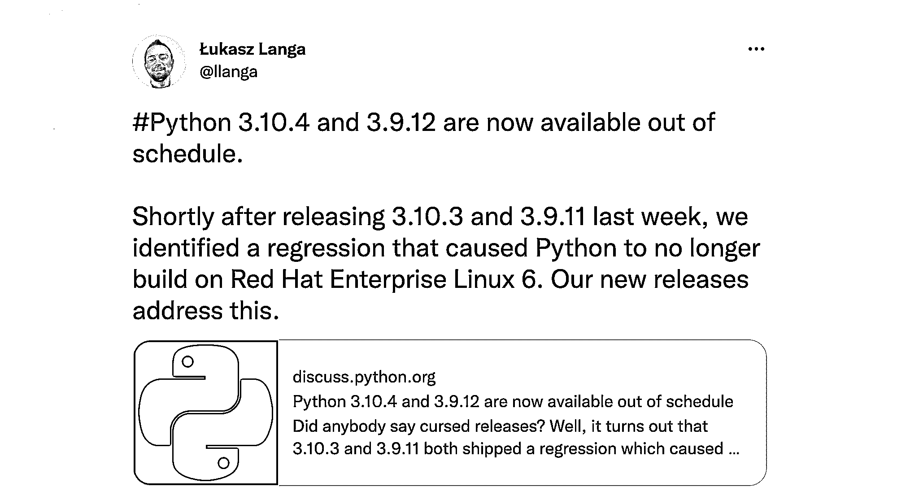
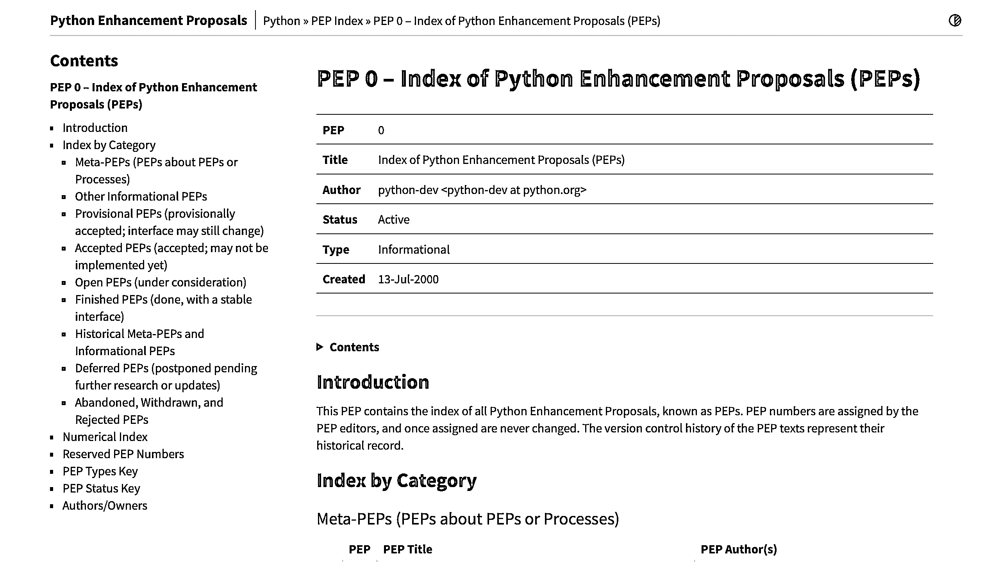
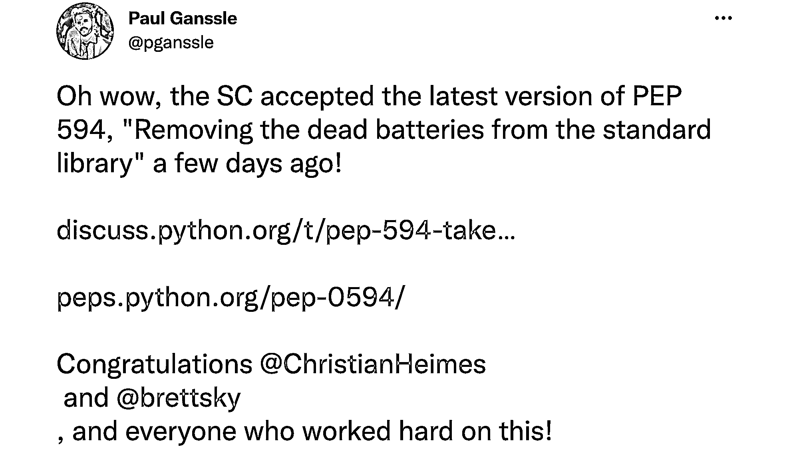

# Python 新闻:2022 年 3 月有什么新消息

> 原文：<https://realpython.com/python-news-march-2022/>

在 2022 年 3 月的**中， **Python 3.11.0a6** 预发布版本可供您测试，因此您可以了解 Python 的最新特性。这个版本是 Python 进入测试阶段(计划于 2022 年 5 月 5 日)之前计划的七个 alpha 版本中的第六个。**

pep 们现在有了一个时尚现代的新家。此外，PEP 594 也已经被接受，它处理从 Python 标准库中移除废电池的问题。关于 Python 事件，2022 年欧洲 Python 大会(CFP)举行了提案征集活动，目前正在出售大会门票。

**立即加入:** ，你将永远不会错过另一个 Python 教程、课程更新或帖子。

让我们深入了解过去一个月最激动人心的 **Python 新闻**！

## Python 发布了几个新版本

几乎每个月都会发布几个 Python 版本。他们通常会添加新功能，[修复漏洞](https://realpython.com/python-bugfix-version/)，纠正安全问题，等等。2022 年 3 月也不例外。现在，您可以测试、使用和享受几个新版本。继续阅读，了解更多信息！

[*Remove ads*](/account/join/)

### Python 3.11.0a6 发布

Python 的第六个 alpha 版本于 3 月 7 日发布。由于一些内部问题，一周的延迟之后， [Python 3.11.0a6](https://pythoninsider.blogspot.com/2022/03/python-3110a6-is-available.html) 在这里给你试驾。Python 3.11 拥有几个新特性和变化:

*   PEP 657–在回溯中包含细粒度的错误位置
*   [PEP 654](https://peps.python.org/pep-0654/)–异常组和`except*`
*   [PEP 673](https://peps.python.org/pep-0673/)–自身类型
*   [PEP 646](https://peps.python.org/pep-0646/)–可变泛型

要了解更多关于这些功能的基础知识，请查看 [Python 新闻:2022 年 2 月有什么新消息？](https://realpython.com/python-news-february-2022/)。此外，如果你想提前了解**细粒度错误位置**如何改善你的编码和调试体验，请查看 [Python 3.11 预览版:更好的错误消息](https://realpython.com/python311-error-messages/)。

要尝试 Python 3.11 将会带来的最令人兴奋的特性，并跟上该语言的发展，请安装新的解释器。请随意选择您最喜欢的[安装程序](https://realpython.com/python311-error-messages/#installation):


```py
$ docker pull python:3.11.0a6-slim
$ docker run -it --rm python:3.11.0a6-slim
```


```py
$ pyenv update
$ pyenv install 3.11.0a6
$ pyenv local 3.11.0a6
$ python
```


```py
$ git clone git@github.com:python/cpython.git
$ cd cpython/
$ git checkout v3.11.0a6
$ ./configure
$ make
$ ./python
```

试试看！走自己的路，亲手探索 Python 3.11 酷炫的新特性！

### 其他 Python 版本

本月，其他几个 Python 版本已经问世。Python [3.10.3](https://www.python.org/downloads/release/python-3103/) 、 [3.9.11](https://www.python.org/downloads/release/python-3911/) 、 [3.8.13](https://www.python.org/downloads/release/python-3813/) 和 [3.7.13](https://www.python.org/downloads/release/python-3713/) 现已推出多项安全修正，使其更加健壮可靠。

三月还迎来了两个最后时刻的 Python 版本， [3.10.4](https://www.python.org/downloads/release/python-3104/) 和 [3.9.12](https://www.python.org/downloads/release/python-3912) 。它们在常规时间表之外发布，以快速修复导致 Python 不再基于 Red Hat Enterprise Linux 6:

[](https://twitter.com/llanga/status/1506967216692121601?t=AaDx5TBUVAj1s-ReVva3NQ&s=19)

<figcaption class="figure-caption text-center">[Image source](https://twitter.com/llanga/status/1506967216692121601?t=AaDx5TBUVAj1s-ReVva3NQ&s=19)</figcaption>

尽管这个操作系统相当旧，但它仍然支持相当大的生产工作负载，包括 Python 基础设施中的一些服务，如 [`manylinux2010`](https://github.com/pypa/manylinux/tree/manylinux2010_x86_64_centos6_no_vsyscall) 映像。此图基于 CentOS 6，CentOS 6 也受到该问题的影响。

因为这些都是最新的版本，所以他们只是在各自之前的版本上添加了一些错误修复和安全更正。

## Python 为 PEPs 发布了一个新网站

Python 增强提案，俗称 PEPs，现在有了一个全新的家，在**[【peps.python.org】](https://peps.python.org/)**有一个专用的 URL。这个新网站展现了它最好的一面，闪亮的主题看起来干净而现代:

[](https://peps.python.org/)

<figcaption class="figure-caption text-center">[Image source](https://peps.python.org/)</figcaption>

如果你把你的浏览器指向这个地址，那么你将登陆到 PEP 0，这是所有 PEP 的索引。在那里，你会找到所有按照[类别](https://peps.python.org/pep-0000/#index-by-category)和[编号](https://peps.python.org/pep-0000/#numerical-index)精心组织的 pep。

该网站还包括关于 pep 本身的便利信息。您将找到 PEP 类型及其当前状态。PEP 的状态很方便，因为它允许您快速了解给定的 PEP 是被接受还是被拒绝，或者是否处于另一个阶段。

去看看这个新的 PEPs 网站吧。你不会后悔的！

[*Remove ads*](/account/join/)

## 废电池将从标准库中移除

Python 以拥有一个[标准库](https://docs.python.org/3/library/index.html)而闻名，其中包含大量有用的[模块和包](https://realpython.com/python-modules-packages/)。由于其广泛的标准库，Python 通常被称为包含电池的语言，这是 Python 成功故事的重要基石。随着时间的推移，这些电池中的一些已经不再有用或方便。然而，它们仍然存在，膨胀了标准库。

Python 的标准库已经被设计糟糕的模块、不必要的重复和不必要的特性填满了。

为了应对这种趋势，Python 指导委员会接受了 [PEP 594](https://peps.python.org/pep-0594/) :

[](https://twitter.com/pganssle/status/1503378905968881666?t=0D8AbVYBTCjLzqE0vXe6Tg&s=19)

<figcaption class="figure-caption text-center">[Image source](https://twitter.com/pganssle/status/1503378905968881666?t=0D8AbVYBTCjLzqE0vXe6Tg&s=19)</figcaption>

PEP 的主要目标是从标准库中移除失效电池。换句话说，PEP 提出了一个模块的[列表，这些模块将在未来的 Python 版本中从标准库中移除。候选模块将包括以下模块:](https://peps.python.org/pep-0594/#deprecated-modules)

*   支持旧的[文件格式](https://en.wikipedia.org/wiki/File_format)，例如与[准将](https://en.wikipedia.org/wiki/Commodore_64)和[孙](https://en.wikipedia.org/wiki/Sun_Microsystems)相关的文件格式
*   支持早就被取代的 API 和操作系统，比如 macOS 9
*   没有当前的**维护者**
*   都是**设计很差**而且几乎不可能修好的，比如 [`sgi`](https://docs.python.org/3.11/library/cgi.html#module-cgi)
*   暗示**安全隐患**，如 [`crypt`](https://docs.python.org/3.11/library/crypt.html#module-crypt) 和 [`spwd`](https://docs.python.org/3.11/library/spwd.html#module-spwd)
*   在图书馆外有更好的选择

该 PEP 还有其他具体目标，包括:

*   将核心开发团队从维护未使用的代码中解放出来
*   将用户引向第三方生态系统中通常可用的更好的解决方案
*   降低对存储能力有限的平台的要求

移除这些失效电池的建议日程包括从 Python 3.11 开始发布一个 [`DeprecationWarning`](https://docs.python.org/3/library/exceptions.html#DeprecationWarning) ，最终在 Python 3.13 中彻底移除它们。建议您检查您的项目，看看它们是否使用了这些废电池，并找到合适的替代品。

## MyPy 实验性地支持了`match`的说法

Python 3.10 引入了`match`和`case`语句，将[结构模式匹配](https://realpython.com/python310-new-features/#structural-pattern-matching)引入到语言中。这个特性被证明是 Python 中最[有争议的](https://lwn.net/Articles/845480/)特性之一。它使您的程序能够从复杂的数据类型中提取信息，对数据结构进行分支，并基于不同形式的数据应用特定的操作。

通常，像 code [linters](https://realpython.com/python-code-quality/#linters) 和 formatters 这样的工具在采用目标语言的语法变化时会有一个自然的延迟。这就是 [MyPy](http://www.mypy-lang.org/) 的情况，它为 Python 提供了一个可选但流行的静态类型检查器。

好消息是，MyPy 在 3 月 11 日发布了版本 [0.940](https://mypy-lang.blogspot.com/2022/03/mypy-0940-released.html) 。这个新版本有*实验性的*对类型检查`match`和`case`语句的支持。现在就可以试用了！继续在 Python 虚拟环境中安装 MyPy:

*   [*视窗*](#windows-1)
**   [**Linux + macOS**](#linux-macos-1)*

```py
PS> python -m venv venv
PS> venv\Scripts\activate
(venv) PS> python -m pip install mypy
```

```py
$ python -m venv venv
$ source venv/bin/activate
(venv) $ python -m pip install mypy
```

前两个命令在当前目录中创建和激活一个全新的虚拟环境。第三个命令安装 MyPy 的最新版本，应该是 0.940 或更高版本。

现在创建一个名为`try_mypy.py`的 Python 文件。一旦你在你最喜欢的文本编辑器中打开了文件，然后复制并粘贴 MyPy 0.940 发布文章中的代码示例:

```py
# try_mypy.py

def empty_value(x: int | str) -> str:
    match x:
        case str():
            # Type of "x" is "str" here
            return '""'
        case int():
            # Type of "x" is "int" here
            return "0"
    # No error about missing return statement (unreachable)
```

该函数接受一个`x`参数，该参数可以是一个[字符串](https://realpython.com/python-strings/)或一个整数[数字](https://realpython.com/python-numbers/)。如果`x`是`str`类型，则`match` … `case`语句返回一个空字符串，如果`x`是`int`类型，则返回`"0"`。如果您对这个文件运行`mypy`命令，那么您将得到以下结果:

```py
$ python -m mypy try_mypy.py
Success: no issues found in 1 source file
```

酷！现在，MyPy 可以检测到`x`是类型`str`还是类型`int`，而不会发出错误报告。MyPy 可以正确解析`match` … `case`语句，并抑制`"missing return statement"`错误报告。

查看发行说明，了解关于这个实验性特性的当前限制的更多信息。

[*Remove ads*](/account/join/)

## 欧洲蟒蛇 2022 宣布其 CFP 和门票销售

在 Zoom、Matrix 和 Discord 上进行了两年的远程活动后，EuroPython 承诺在 2022 年举办一次面对面的会议。它也将虚拟地提供给那些不能去都柏林旅行的人:

[](https://ep2022.europython.eu/)

<figcaption class="figure-caption text-center">[Image source](https://ep2022.europython.eu/)</figcaption>

会议将于 7 月 11 日至 17 日举行！它将举办以下活动:

*   两天研讨会/辅导(7 月 11 日至 12 日，周一至周二)
*   三个会议日(7 月 13 日至 15 日，周三至周五)
*   冲刺周末(7 月 16-17 日，周六-周日)

会议将在都柏林的 CCD 召开:

[](https://www.google.com/maps/place/The+Convention+Centre+Dublin/@53.3482207,-6.2524556,14z/data=!4m5!3m4!1s0x0:0x25faa23c18a1e358!8m2!3d53.3478621!4d-6.2395809?hl=en)

<figcaption class="figure-caption text-center">[Image source](https://www.google.com/maps/place/The+Convention+Centre+Dublin/@53.3482207,-6.2524556,14z/data=!4m5!3m4!1s0x0:0x25faa23c18a1e358!8m2!3d53.3478621!4d-6.2395809?hl=en)</figcaption>

欧洲 Python 2022 团队于 3 月 8 日开启了**提案征集** (CFP)。在此次 CFP 上，EuroPython 正在寻找关于 Python 各个方面的建议，包括:

*   编程从初级到高级
*   应用程序和框架
*   将 Python 引入您的组织的经验

毫无疑问，这次欧洲 Python 大会将是一次令人惊叹的会议，有许多有趣的演讲和活动，肯定会为世界 Python 社区贡献大量的知识。

CFP 于 4 月 3 日星期日关闭。你发送你的提议了吗？请在评论中告诉我们！

你想作为志愿者为会议做贡献吗？这是你的机会。欧洲 Python 由 Python 社区的志愿者组织和运营。所以，新面孔总是受欢迎的！

反过来，你会有一个安全的空间来分享你的想法和工作。你将塑造会议，确保它是为社区和社区的。当然，在这个过程中你也会得到很多乐趣！如果你有兴趣加入其中一个[团队](http://www.europython-society.org/europython-teams/)，请发送电子邮件至志愿者@europython.eu。

最后，EuroPython 2022 战队也在 3 月 17 日开启了[售票](https://blog.europython.eu/europython-2022-ticket-sales-open-on-17-march/)。如果你还没有买到票，那就大胆尝试吧。你需要经济资助吗？嗯，EuroPython 2022 也可以帮你做到这一点。查看他们的[财政援助](https://ep2022.europython.eu/finaid#financial-aid)页面了解更多信息。

## Python 的下一步是什么？

那么，三月份你最喜欢的 Python 新闻是什么？我们错过了什么值得注意的吗？你打算试试 Python 3.11.0a6 吗？如何看待从标准库中移除废电池？您计划参加 2022 年欧洲 Python 大会吗？请在评论中告诉我们！

快乐的蟒蛇！******