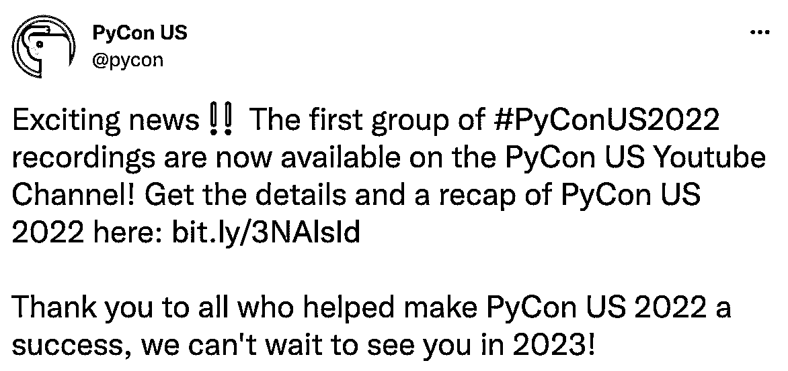
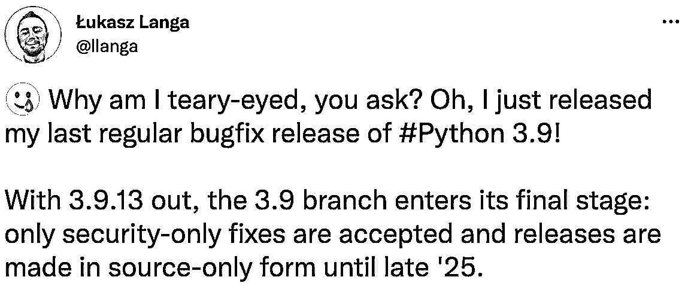

# Python 新闻:2022 年 5 月有什么新消息

> 原文：<https://realpython.com/python-news-may-2022/>

2022 年 5 月**日**是今年 **PyCon US** 活动的最后几天。就在 PyCon 大会之前， **Python 语言峰会**聚集了 Python 核心开发者、triagers 和特别嘉宾。其中一些与会者正是本月发布两个重要 Python 版本的人。

五月的第三个星期四是全球无障碍意识日。这一天旨在提高人们对如何打造包容性数字产品的认识。

继续阅读，深入了解上个月的 **Python 新闻**！

**立即加入:** ，你将永远不会错过另一个 Python 教程、课程更新或帖子。

## PyCon 美国视频

2022 年 4 月一些最大的 [Python 新闻发生在盐湖城](https://realpython.com/python-news-april-2022/)的 [PyCon 期间。如果你想赶上会谈，那么你可以前往](https://realpython.com/pycon-guide/) [PyCon US YouTube 频道](https://www.youtube.com/c/PyConUS/)，并开始观看活动的[视频记录](https://www.youtube.com/watch?v=nWnIRYQrVtk&list=PL2Uw4_HvXqvYeXy8ab7iRHjA-9HiYhRQl)。五月底，PyCon 团队开始上传所有视频:

<figcaption class="figure-caption text-center">[Image source](https://twitter.com/pycon/status/1528803453526499331)</figcaption>

PyCon US YouTube 频道是一个非常宝贵的资源，在那里你可以找到各种主题的视频，包括 [Python 古怪现象解释](https://www.youtube.com/watch?v=nWC73Llo170)、[让数据类为你工作](https://www.youtube.com/watch?v=w77Kjs5dEko)和[理解属性](https://www.youtube.com/watch?v=Tn1wLsj7Bys)。

**注:**就在美国国家航空航天局爱因斯坦研究员兼观测天文学家[萨拉·伊桑](https://twitter.com/SaraIssaoun)博士在美国皮肯大会上做主题演讲的几天后，一张[黑洞](https://twitter.com/SaraIssaoun/status/1524794084682092548)的突破性图像发布了。这一重大成就代表了她和团队其他成员两年多的辛勤工作！

如果你想了解 Python 社区如何帮助[事件视界望远镜](https://eventhorizontelescope.org/)合作团队的研究，那么看看[Issa oun 博士在 PyCon US 2022](https://www.youtube.com/watch?v=x6SWPjdxvEI) 上的主题演讲。

真正的 Python 团队第一次在 PyCon 大会上有了[展台。如果这还不够令人兴奋的话，真正的 Python 团队的两位成员也发表了演讲。](https://realpython.com/real-python-pycon-us-2022/)[盖尔·阿恩·Hjelle](https://realpython.com/team/gahjelle/)在大会第三天的闪电谈话中谈到了[阅读 PEPs](https://youtu.be/tF5SD-JlGo4?t=983) 。作为今年 PyCon US 西班牙赛道的一部分， [Andres Pineda](https://realpython.com/team/apineda/) 谈到了 RxPy 的[反应式编程。](https://www.youtube.com/watch?v=vET6Y2TFfXU)

[*Remove ads*](/account/join/)

## 语言峰会报道

就在 PyCon 大会之前，Python 核心开发者、triagers 和特别嘉宾齐聚一堂，参加了 [Python 语言峰会](https://us.pycon.org/2022/events/language-summit/)。在这次独家活动中，与会者讨论了 Python 编程语言的未来方向。五月，他们在官方 [Python 软件基金会博客](https://pyfound.blogspot.com/)上发布了 2022 Python 语言峰会的广泛[摘要。](https://pyfound.blogspot.com/2022/05/the-2022-python-language-summit_01678898482.html)

正如您将在下一节中了解到的，Python 3.11 的改进之一是更快的 CPython。但是要知道如何让 Python 更快，你需要知道 Python 目前有多慢。在 Python 语言峰会上， [Mark Shannon](https://github.com/markshannon) 和他的团队分享了他们对 [CPython 性能改进](https://pyfound.blogspot.com/2022/05/the-2022-python-language-summit_2.html)的见解。马克[还鼓励社区](https://www.youtube.com/watch?v=xQ0-aSmn9ZA&t=19m49s)共享代码，以便在用于监控改进的基准中获得更多的多样性。

## Python 3.11 测试版

随着 Python 3.11 的第一个测试版本[的发布，五月标志着 Python 发布时间表的一个重要里程碑。从现在开始，Python 3.11 将不会添加新的特性或 API。如果你正在维护一个第三方 Python 项目，或者如果你计划](https://www.python.org/downloads/release/python-3110b1/)[发布一个支持 Python 3.11 新特性的包](https://realpython.com/pypi-publish-python-package/)，这对你来说是个好消息:

*   PEP 657 :在回溯中包含细粒度的错误位置
*   [PEP 654](https://peps.python.org/pep-0654/) :异常组和 except*
*   [PEP 673](https://peps.python.org/pep-0673/) :自身类型
*   PEP 646 :可变泛型
*   [PEP 680](https://peps.python.org/pep-0680/) : tomllib:支持在标准库中解析 TOML
*   [PEP 675](https://peps.python.org/pep-0675/) :任意文字字符串类型
*   [PEP 655](https://peps.python.org/pep-0655/) :将单个类型的直接项目标记为必需的或潜在缺失的
*   [bpo-46752](https://github.com/python/cpython/issues/90908) :向 asyncio 介绍任务组
*   [更快的 CPython](https://docs.python.org/3.11/whatsnew/3.11.html#faster-cpython) :让 Python 3.11 比 Python 3.10 快 10-60%

如果你想更深入地了解 Python 3.11 带来的一些新特性，那么看看 [Python 3.11 预览版:更好的错误消息](https://realpython.com/python311-error-messages/)、 [Python 3.11 预览版:任务和异常组](https://realpython.com/python311-exception-groups/)和 [Python 3.11 预览版:TOML 和 tomllib](https://realpython.com/python311-tomllib/) 。

## Python 3.9.13 最终正式发布

根据 [PEP 596](https://peps.python.org/pep-0596/) 中发布日历的规定， [Python 3.9](https://www.python.org/downloads/release/python-3913/) 的第十三版是最终的常规维护版。这意味着从现在开始， [Python 3.9](https://realpython.com/python39-new-features/) 将只接受安全修复。

Python 3.9 的最后一个定期维护版本也是当前常驻 CPython 开发人员的一个里程碑。ukasz 是 Python 3.8 和 3.9 的发布经理，所以这是他的最后一个常规版本:

<figcaption class="figure-caption text-center">[Image source](https://twitter.com/llanga/status/1526613566773657601?t=qECZ2uhAove0ZuPz_gGMzg&s=19)</figcaption>

如果你想了解更多关于 ukasz 的知识，那么看看真正的 Python 播客的第 82 集[。在本播客中，ukasz 讲述了他作为常驻开发人员的第一个月，以及他如何帮助其他 Python 开发人员推进他们的贡献。](https://realpython.com/podcasts/rpp/82/)

强烈建议将您正在使用的 Python 版本更新到最新的安全更新，以最大限度地减少代码库中的漏洞。你可以在[官方 Python 网站](https://www.python.org/downloads/)下载 Python 3.9.13，并阅读[发行说明](https://docs.python.org/release/3.9.13/whatsnew/changelog.html)中的所有变更。

## 全球无障碍宣传日

自 2012 年起，每年五月的第三个星期四标志着一年一度的**全球无障碍意识日(GAAD)** 。 [GAAD](https://accessibility.day) 的目的是提高人们对如何打造包容性数字产品的认识。我们鼓励世界各地的开发者组织和参与活动，为**的数字无障碍**带来光明:

> 每个用户都应该获得一流的网络数字体验。残障人士必须能够体验基于网络的服务、内容和其他数字产品，并获得与非残障人士相同的成功结果。([来源](https://accessibility.day))

GAAD 是由 Joe Devon 于 2011 年 11 月在他的博客文章【T2 挑战:易访问性技术需要成为开发者的主流】中发起的。现在。:

> 对一些人来说，一个无障碍的互联网确实让世界变得不同。虽然我是一名后端程序员，但我仍然为自己所知甚少而感到羞愧。你呢？([来源](https://web.archive.org/web/20220518003517/https://mysqltalk.wordpress.com/2011/11/27/challenge-accessibility-know-how-needs-to-go-mainstream-with-developers-now/))

博文发布后不久，来自多伦多的无障碍专家 Jennison Asuncion 联系了 Joe Devon。Jennison 和 Joe 联手发起了第一个全球无障碍意识日。

查看 GAAD 网站的活动页面,了解社区这些年是如何庆祝全球意识日的。例如，今年， [GitHub 博客](https://github.blog/2022-05-19-how-were-continuing-to-enable-all-developers-to-build/)强调了该公司为使其产品更具包容性所做的工作。

**注:** [真正的 Python 社区](https://realpython.com/community/)[的成员和创造者](https://blindgumption.com/) **Joel Dodson** 目前正在开发一套[可访问的命令行实用程序](https://github.com/ringcentral/aclu)。他分享了关于如何改进 Python 代码使其更易访问的评论:

> 对我们 Python 程序员来说，重要的是要想到你那些可能失明的 Python 程序员同事。一般来说，代码的结构显然很重要。但是结构不良的代码对盲人开发者的影响要糟糕得多。

你可以做的一个练习是向你自己或你的队友大声朗读你的部分代码。这样你可能会注意到，例如，你应该为你的变量或函数选择更具描述性的名字。

如果你想创建更具可读性的 Python 代码，那么看看[如何用 PEP 8](https://realpython.com/python-pep8/) 编写漂亮的 Python 代码。

当然，让网络更易访问不能局限在某一天！例如，Kent Connects 正在提供一个名为“无障碍之夏”的免费网络研讨会系列。要注册课程，请查看他们的[活动](https://kentconnects.gov.uk/events/)页面。

[*Remove ads*](/account/join/)

## Python 的下一步是什么

那么，五月份你最喜欢的 Python 新闻是什么？我们错过了什么值得注意的吗？你对最近的 Python 发布感到兴奋吗？你参加过全球无障碍意识日活动吗？或者您有自己的关于可访问性的笔记想要分享吗？请在评论中告诉我们！

快乐的蟒蛇！

**立即加入:** ，你将永远不会错过另一个 Python 教程、课程更新或帖子。**