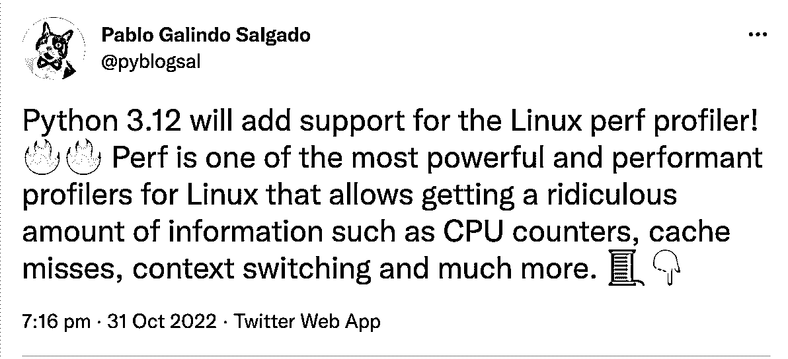

# Python 新闻:2022 年 11 月有什么新消息

> 原文：<https://realpython.com/python-news-november-2022/>

Python 世界从未停止旋转！在 10 月发布 Python 3.11 之后，Python 发布团队已经开始发布 Python 3.12 的第一个 alpha 版本。尽管尝试新鲜事物的兴奋不应该分散你在编码时的谨慎。最近，研究人员在 PyPI 上发现了更多的**恶意包**，律师提出了使用 **GitHub Copilot** 生成代码时违反许可的担忧。

让我们深入了解过去一个月最大的 **Python 新闻**！

**立即加入:** ，你将永远不会错过另一个 Python 教程、课程更新或帖子。

## Python 3.12 Alpha 发布

十月最有新闻价值的事件之一是 **Python 3.11** 的发布。当我们中的许多人正在探索 Python 3.11 的[酷新特性时，其他人已经在为下一个版本努力工作了。](https://realpython.com/python311-new-features/)

随着 [Python 3.12 发布时间表](https://peps.python.org/pep-0693/)步入正轨，Python 发布团队在 11 月中旬发布了 **Python 3.12 alpha 2** 。核心团队仍然处于开发周期的早期，但是到目前为止,[的新特性列表](https://docs.python.org/dev/whatsnew/3.12.html)看起来令人兴奋。

以下是 Python 3.12 的一些新特性:

*   更多**改进的错误信息**
*   支持 **Linux `perf` profiler**
*   旧函数、类和模块的弃用

虽然 Python 3.11 已经[改进了错误消息](https://realpython.com/python311-error-messages/)，但是下一个特性版本将会提供更好的修复错误的建议。例如，当您忘记导入一个模块或导入语句顺序错误时，检查它会做什么:

>>>

```py
>>> sys.version_info
Traceback (most recent call last):
  File "<stdin>", line 1, in <module>
NameError: name 'sys' is not defined. Did you forget to import 'sys'?

>>> import pi from math
  File "<stdin>", line 1
    import pi from math
    ^^^^^^^^^^^^^^^^^^^
SyntaxError: Did you mean to use 'from ... import ...' instead?
```

尤其是在学习 Python 的时候，建设性的错误消息可以为您指出改进代码的正确方向。此外，如果您是一名经验丰富的 Python 开发人员，那么即将发布的 Python 版本将为您的代码改进做好准备:

[](https://files.realpython.com/media/Screenshot_2022-11-29_at_15.52.43.98f186c64c59.png)

<figcaption class="figure-caption text-center">[Image source](https://twitter.com/pyblogsal/status/1587146448503808006)</figcaption>

[Linux `perf` profiler](https://en.wikipedia.org/wiki/Perf_(Linux)) 使您能够分析应用程序的性能。在 Python 3.12 之前，您已经可以使用`perf`来获取关于您的 Python 代码的信息。然而，你只能看到用 C 编程语言写的名字和过程。有了`perf` 的 [Python 3.12 支持，你将能够研究 Python 调用栈并在`perf`的输出中暴露 Python 函数。](https://docs.python.org/dev/howto/perf_profiling.html)

新的 Python 版本也继续从标准库中移除了**的电池**，理由如下:

> 回到 Python 的早期，解释器附带了一大套有用的模块。这通常被称为“包含电池”的哲学，是 Python 成功故事的基石之一。[然而]，任何额外的模块都会增加 Python 核心开发团队的维护成本。团队的资源有限，维护成本的降低为其他改进腾出了开发时间。([来源](https://peps.python.org/pep-0594/))

紧随其后，Python 3.12 将[从 Unicode](https://peps.python.org/pep-0623/) 中移除`wstr`，[弃用`distutils`模块](https://peps.python.org/pep-0632/)。完整的细节，可以访问 [Python 的 changelog](https://docs.python.org/dev/whatsnew/changelog.html#changelog) 。

如果您想试用 Python 3.12 的 alpha 版本，那么请查看关于如何安装 Python 预发布版本的真正的 Python 指南。

[*Remove ads*](/account/join/)

## PyPI 上的恶意软件包

在从 Python 标准库中移除废电池的基本原理中，您可以找到这样一段话:

> 如今，Python 拥有丰富而充满活力的第三方包生态系统。从 PyPI 安装包或者使用许多 Python 或 Linux 发行版中的一个是非常标准的。([来源](https://peps.python.org/pep-0594/))

Python 生态系统变得越大，对麻烦制造者就越有吸引力。在八月的 Python 新闻中，我们报道了攻击者向 PyPI 上传恶意软件包以窃取用户信息的事件。

攻击者使用[域名仿冒](https://en.wikipedia.org/wiki/Typosquatting)来欺骗开发者下载恶意软件。PyPI 中的域名仿冒涉及到上传一个恶意软件包，其名称与另一个流行的包相似。例如，当下载一个带有`python -m pip install colorama`的包时，你可能会不小心打错了附加字母`s`，把`colorama`错打成了`colorsama`。一个域名抢注者可能会上传一个叫做`colorsama`的恶意软件包来感染那些打错字的人。

在他们关于当前事件的博客文章中，安全公司 [Phylum](https://www.phylum.io/) 总结了恶意代码是如何进入你的机器的:

> 恶意代码是包的`setup.py`【or】`__init__.py`中隐藏的`__import__`语句。无论如何，它包含了一个 Base64 编码的字符串。[…]解码后，Base64 编码的字符串包含一个 Python 脚本，该脚本被写入一个临时文件并被执行。([来源](https://blog.phylum.io/phylum-discovers-dozens-more-pypi-packages-attempting-to-deliver-w4sp-stealer-in-ongoing-supply-chain-attack))

在执行时，临时文件试图下载恶意软件，该恶意软件将试图从您系统上的 cookies 中抓取数据。虽然据报道事故的数量很少，但仔细检查您系统上安装的任何第三方软件包仍然是一个好主意。

## GitHub 副驾驶的湍流

微软在今年夏天公开发布了 GitHub Copilot。发布声明以这句话开头:

> 在 GitHub，构建让开发者满意的技术是我们使命的一部分。([来源](https://github.blog/2022-06-21-github-copilot-is-generally-available-to-all-developers/))。

但 GitHub Copilot 是否符合这一使命是一些争论的主题。

GitHub Copilot 使您能够以思维的速度与 Python 一起飞行。一旦它被激活，你就可以在你的代码中写一个注释，GitHub Copilot 会尝试生成与你的注释意图相匹配的代码。微软声称代码建议源自公开可用的源代码，例如公开的 GitHub 库。

在对 GitHub Copilot 提起的集体诉讼中， [Matthew Butterick](https://matthewbutterick.com) 声称微软侵犯了 GitHub 上托管的开源软件的许可证:

> 微软显然是通过无视底层开源许可证的条件和其他法律要求，从他人的作品中获利。[……]这起诉讼构成了一场全行业辩论中的关键一章，这场辩论涉及在未经创作者许可的情况下使用数据训练人工智能工具的道德问题，以及什么构成了知识产权的合理使用。尽管微软提出了相反的抗议，但它没有权利将在开源许可下提供的源代码视为公共领域。([来源](https://www.saverilawfirm.com/our-cases/github-copilot-intellectual-property-litigation))

如果你想了解更多关于集体诉讼的信息，那就去查看一下 [GitHub Copilot 诉讼网站](https://githubcopilotlitigation.com)。该网站包含联系人、法律文件和关于该案件的持续更新。

尽管 GitHub Copilot 的飞行目前可能有点粗糙，但微软继续在他们的人工智能工具中实现新功能。在未来的版本中，你将能够通过与 GitHub Copilot 对话来使用你的声音编码。

你对 GitHub Copilot 有什么看法？你是期待用你的声音来编码，还是会提高你的声音来表达关心？在下面的评论里让真正的 Python 社区知道吧！

## 新闻片段

除了上面的 Python 新闻，这里还有一些新闻片段:

*   **降临代号:** [每年一样的程序！一年一度的](https://en.wikipedia.org/wiki/Dinner_for_One)[降临节](https://adventofcode.com/about)又回来了。这是一本由 25 个编程难题组成的降临节日历，每年 12 月出版。它是由 Eric Wastl 创建的，在 Python 社区中赢得了许多粉丝。如果你想了解更多关于这个有趣的传统，那么看看我们真正的 Python 教程[代码降临:用 Python 解决你的难题](https://realpython.com/python-advent-of-code/)。

*   乳齿象上的 Python 人:如果你正在考虑退出 Twitter，但你仍然想与其他 Python 开发者保持联系，那么看看[塞缪尔·科尔文的 Python 人要点](https://gist.github.com/samuelcolvin/1743d8919acb465c1fbbcea2c3cdaf3e)。你会注意到许多条目还包含了[乳齿象](https://en.wikipedia.org/wiki/Mastodon_(software))简介的链接。如果你对这个社交网络平台很好奇，那么看看 Python 播客专题[mastocon for Python Devs](https://talkpython.fm/episodes/show/390/mastodon-for-python-devs)的 [Talk。](https://talkpython.fm/home)

*   **Python 的历史:**本月，[吉多·范·罗苏姆的导师](https://twitter.com/gvanrossum/status/1596268474518876160)，兰伯特·梅尔滕斯，分享了一些关于[Python](https://inference-review.com/article/the-origins-of-python)起源的故事。您将了解 Python 的历史，并深入了解 Python 是如何成为如此受欢迎的编程语言的。处于这一发展前沿的当然是范·罗森，他最近在莱克斯·弗里德曼播客上接受了长达三小时的采访。

在 Python 的世界里总是有很多事情发生！

[*Remove ads*](/account/join/)

## Python 的下一步是什么？

Python 一直在发展，这令人兴奋，但也可能伴随着成长的烦恼。我们赞扬核心开发人员为改进 Python 所做的不懈努力，以及社区为记录该语言的历史、保持跨平台连接和保护每个人的安全所做的努力。

来自**11 月**的 **Python 新闻**你最喜欢的片段是什么？我们错过了什么值得注意的吗？请在评论中告诉我们，我们可能会在下个月的 Python 新闻综述中介绍您。

快乐的蟒蛇！

**立即加入:** ，你将永远不会错过另一个 Python 教程、课程更新或帖子。**