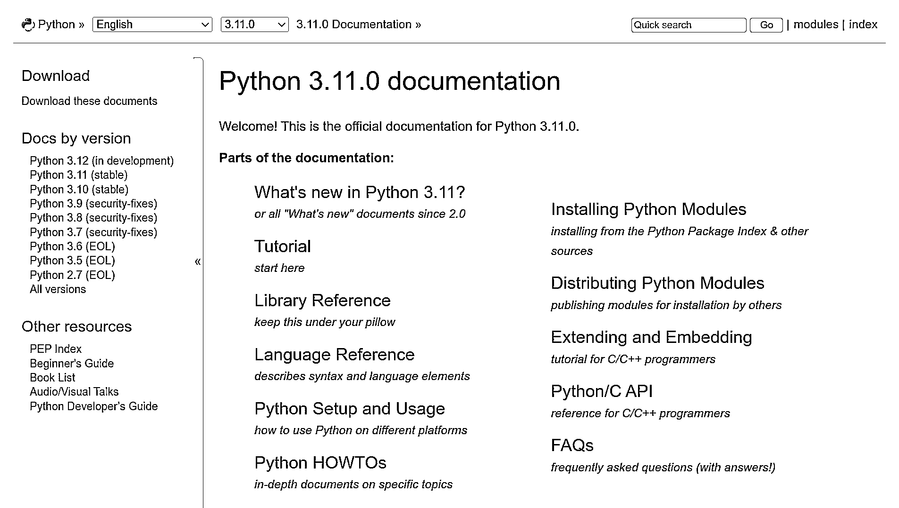
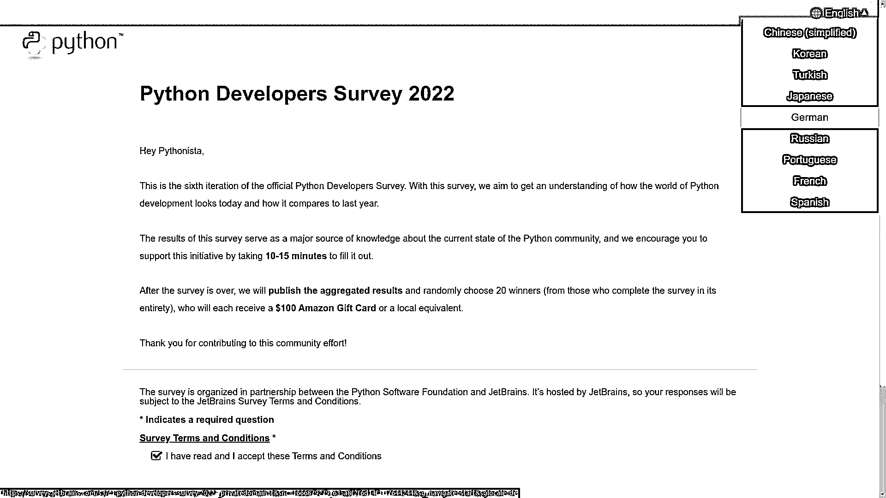
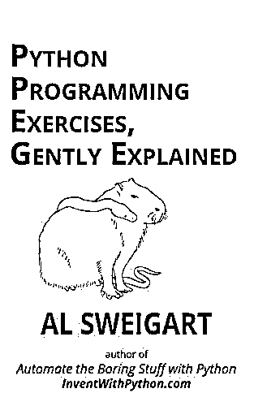

# Python 新闻:2022 年 10 月有什么新消息

> 原文：<https://realpython.com/python-news-october-2022/>

和往常一样，今年十月对于 Python 社区来说是一个多事之秋。它带来了最终的 **Python 3.11** 版本，流行的 Python 库的下一个主要版本的几个测试版本，以及 Python 社区中一些令人兴奋的发展。

这里快速回顾一下 2022 年 10 月发生的最有趣的事情。

**免费下载:** [点击这里下载免费的示例代码](https://realpython.com/bonus/python-311-examples/)，它展示了 Python 3.11 的一些新特性。

## Python 3.11 版本

到目前为止，本月最令人兴奋的事件是 Python 3.11 的发布，盖过了其他一些有趣的新闻。几年前，一年一度的 Python 发布会选择了 10 月，这为 Python 提供了一个稳定且可预测的发布周期。

Python 3.11 的发布日期原计划是 10 月 3 日。不幸的是，由于大约一个月前[意料之外的问题](https://mail.python.org/archives/list/python-dev@python.org/thread/TKFELC4AXKSYMJXCZNZYE7O5OR7ZGTXH/)阻碍了之前的候选版本，所以它被推迟了。全世界不得不再等三个星期，直到 10 月 24 日**，才能最终见证下一个重要的 Python 版本:**

**[](https://files.realpython.com/media/py37doc.19331064ea7e.png)

<figcaption class="figure-caption text-center">Python 3.11 Documentation</figcaption>

这个版本包含了许多新功能，并承诺显著的性能改进，这一努力将在未来的版本中继续，以实现更好的结果。[Python 3.11 的新特性](https://docs.python.org/3.11/whatsnew/3.11.html)一文概述了该语言自上一版本以来的变化。 [Python 3.11 changelog](https://docs.python.org/3/whatsnew/changelog.html#python-3-11-0-final) 提供了更多细节，链接到各个 GitHub 问题及其相应的代码提交。

简而言之，这些可以说是 Python 3.11 中最有价值的新特性:

*   [更好的错误消息](https://realpython.com/python311-error-messages/)
*   [异步任务和异常组](https://realpython.com/python311-exception-groups/)
*   汤姆和汤姆利布
*   [类型检查增强功能](https://realpython.com/python311-new-features/#improved-type-variables)
*   [更快的启动](https://realpython.com/python311-new-features/#faster-startup)和[代码执行](https://realpython.com/python311-new-features/#faster-code-execution)
*   [零成本例外](https://realpython.com/python311-new-features/#zero-cost-exceptions)

要深入了解 Python 3.11 并亲身体验，请前往我们关于新特性的[专用教程](https://realpython.com/python311-new-features/)或[视频课程](https://realpython.com/courses/new-features-python-311/)，在那里您可以通过代码示例了解最重要的语言改进。

尽管 Python 3.11 刚刚发布，但公司和云服务提供商开始在生产中大规模使用它还需要一段时间。升级运行时环境总是有风险的，可能会导致停机、数据丢失或其他不可预见的问题。这正是为什么美国陆军拒绝升级关键任务设备上的老式软件。

同时，值得一提的是，一些主要的 Python 库，尤其是数据科学领域的库，在正式发布之前就开始支持 Python 3.11 并进行彻底的测试。这确保了用户可以安全地切换到 Python 3.11，并开始利用新的语言特性，而不必等待他们的包依赖关系跟上。

Python 3.11 中你最喜欢的新特性是什么？

[*Remove ads*](/account/join/)

## 来自 Python 生态系统的更新

Python 生态系统每个月都会发布新的版本。pytest 7.2.0 版本现已发布， **SQLAlchemy 2.0** 终于发布了测试版。T4 网络图书馆也发布了下一个主要版本的测试版。

### pytest 7.2.0

10 月下旬，开源社区发布了一个新的次要版本 [pytest](https://realpython.com/pytest-python-testing/) ，这是 Python 中最广泛使用的测试库之一。这个版本带来了一些生活质量的改善。

最值得注意的是，pytest 将不再识别为 [nose](https://nose.readthedocs.io/en/latest/) 编写的单元测试，这曾经是另一个流行的测试库。因为它的开发在几年前就停止了，而且随着 pytest 的发展，pytest-nose 兼容层的维护变得越来越昂贵，所以 pytest 的开发人员决定放弃它。

因此，您应该停止在 pytest 中基于类的单元测试中使用`.setup()`和`.teardown()`方法。虽然它们将继续在弃用计划下工作，但不再推荐使用它们。pytest 自带的[设置和拆卸方法](https://docs.pytest.org/en/stable/deprecations.html#nose-deprecation)的名称略有不同，但在其他方面应该是相同的。

此外，pytest 将识别一个替代的配置文件`pytest.ini`，它现在可能隐藏在类 Unix 操作系统中。这意味着可以选择以前导点开始文件名:

```py
# .pytest.ini [pytest] python_functions  =  should_*
```

另一个值得注意的变化是，`testpaths`配置选项将使用 Python 的`glob`模块支持 [Unix 风格的路径名模式扩展](https://en.wikipedia.org/wiki/Glob_(programming)):

```py
[pytest] testpaths  = src/*/unit_tests src/*/integration_tests src/*/system_tests **/tests
```

星号(`*`)匹配任意数量的字符，而双星号(`**`)递归匹配目录。这个特性在大型存储库中会变得特别方便，称为 [monorepo](https://en.wikipedia.org/wiki/Monorepo) ，它包括遵循相同目录结构的多个项目。

要了解这个新 pytest 版本的更多信息，请查看官方网站上的[完整变更日志](https://docs.pytest.org/en/stable/changelog.html#pytest-7-2-0-2022-10-23)。还有更多您可能感兴趣的改进、错误修复和更新。

### SQLAlchemy 2.0 测试版

10 月份发布了 SQLAlchemy 2.0 的预览版，标志着期待已久的与遗留接口的分离和向使用现代 Python 模式的转变。从这个新版本的每日下载量来看，人们的兴趣超出了预期。一周后，一个包含几个错误修复的后续版本发布了。

多年来， [SQLAlchemy](https://realpython.com/python-sqlite-sqlalchemy/) 一直是一个非常受欢迎的框架，它提供了低级抽象和高级对象关系映射器(ORM ),用于以一致的方式在 Python 和各种[关系数据库](https://realpython.com/python-sql-libraries/)之间移动数据。同时，它公开了特定类型的数据库特有的行为。该框架有助于自动化重复的 SQL 样板语句，这在大多数应用程序中是不可避免的。

SQLAlchemy 2.0 的完整特性和架构在过渡版 1.4 系列中已经存在很长时间了，它在新旧界面之间架起了一座桥梁。任何使用该框架当前稳定版本的人都可以启用 [SQLAlchemy 2.0 弃用模式](https://docs.sqlalchemy.org/en/14/changelog/migration_14.html#sqlalchemy-2-0-deprecations-mode)，以便在最终切换到下一代 SQLAlchemy 之前获得关于各种不兼容和问题的通知。

那么，SQLAlchemy 2.0 测试版有哪些重大变化呢？

第一个也是最重要的变化是放弃对 Python 2 的支持，同时从代码库中清除一些旧的 [cruft](https://en.wikipedia.org/wiki/Cruft) ，使得框架更容易维护。SQLAlchemy 将只在 **Python 3.7 或更高版本**上运行，并将利用现代句法结构，如[上下文管理器](https://realpython.com/python-with-statement/)来管理其资源。

另一个值得注意的改进是在 SQLAlchemy 的经典阻塞查询 API 之上添加了一个异步层。与 [Python 的异步 IO](https://realpython.com/async-io-python/) 的集成将使框架能够在异步 web 应用程序中运行，这在以前无法从 SQLAlchemy 中受益，除非 SQLAlchemy 被包装在线程池中。这也应该向那些以前因为其阻塞特性而没有考虑过它的人展示这个框架。

编译后的 SQL 语句的新的**缓存机制**将使代码运行得更快。它将允许核心引擎的进一步改进，这在以前由于有限的执行时间是不可能的。

最后但同样重要的是，该框架将引入**新的统一 API**来缩小以更**冗长和明确的编码风格**实现相同目标的替代方法。这个想法是，程序员应该总是知道他们在做什么，为什么要这么做，而不是与底层 SQL 隔离开来。长期以来被弃用但仍在使用的传统接口将被移除。

官方文档提供了关于将您的代码迁移到下一代 SQLAlchemy 的详细说明。请记住，SQLAlchemy 2.0 仍在开发中，还没有准备好投入生产，所以不要贸然升级！

[*Remove ads*](/account/join/)

### NetworkX 3.0 测试版

上个月宣布了另一个测试版。NetworkX 是一个流行的数据科学库，用于创建和分析 Python 中的图形和网络，它有了一个新的主要版本。 [NetworkX 3.0 Beta](https://github.com/networkx/networkx/releases/tag/networkx-3.0b1) 的发布是一项意义重大的任务，通过仔细删除旧代码来解决多年的技术债务。作为副作用，库的核心不再依赖于任何第三方包。

精简和现代化该库的代码将降低新贡献者参与的门槛，并将提高其性能。此外，NetworkX 3.0 将与其他流行的科学库更紧密地集成，如 [NumPy](https://realpython.com/numpy-tutorial/) 、 [Matplotlib](https://realpython.com/python-matplotlib-guide/) 、 [pandas](https://realpython.com/pandas-python-explore-dataset/) 和 [SciPy](https://realpython.com/python-scipy-cluster-optimize/) 。以前在 NetworkX 中实现的算法现在将受益于这些集成。

## Python 社区集锦

Python 社区上个月很忙。PyCon US 2023 现已接受提案， **Python 开发者调查 2022** 现已开放，新的 **Python 发布经理**已经任命。此外，**阿尔·斯威加特**也发布了一本新书。

### PyCon US 2023:征集提案

最大的年度 Python 大会的筹备工作已经开始，来自世界各地的 Python 爱好者都热切期待着这一盛事。就像今年早些时候的会议一样， [PyCon US 2023](https://us.pycon.org/2023/) 将回到**盐湖城**，并且将按照[健康和安全指南](https://us.pycon.org/2023/about/health-safety-guidelines/)的要求，在现场和网上举行。明年的大会将于 4 月 19 日至 27 日举行，届时将庆祝美国皮肯节二十周年:

[](https://files.realpython.com/media/pycon.52849b239977.png)

<figcaption class="figure-caption text-center">PyCon US 2023 Home Page</figcaption>

在 PyCon，任何人都可以发表演讲或以其他方式积极参与会议，无论其经验水平如何。您可以[从以下演示类型中选择提交您的提案](https://us.pycon.org/2023/speaking/guidelines/):

*   传统的会议会谈，通常长达 30 分钟，在主要会议期间举行，从 4 月 21 日到 23 日
*   在会议的前两天，即 4 月 21 日和 22 日，用西班牙语进行的演讲
*   **教程:**研讨会时间为 4 月 19 日和 4 月 20 日，在主会议前两天的上午或下午，每次大约三个小时
*   **海报:**在 4 月 21 日和 22 日的展馆开放时间以及 4 月 23 日的招聘会期间，在海报板上展示主题

个人提交的截止日期为**2022 年 12 月 9 日**。

要了解最新消息，你可以阅读 [PyCon US 博客](https://pycon.blogspot.com/)或在 Twitter 上关注[PyCon US](https://twitter.com/pycon)了解重要公告。如果你打算参加，那么一定要看看 Real Python 的 [PyCon US guide](https://realpython.com/pycon-guide/) ，了解如何从会议中获得最大收益。

我们将在明年 4 月到那里，所以一定要在 Real Python 的展台前停下来和我们握手。与此同时，你可以通过阅读我们对 [PyCon US 2019](https://realpython.com/real-python-pycon-us/) 和 [PyCon US 2022](https://realpython.com/real-python-pycon-us-2022/) 的总结来领略一下即将到来的事情。

### 2022 年 Python 开发者调查

连续第六年， **Python 软件基金会(PSF)** 正在进行官方的 [Python 开发者调查](https://surveys.jetbrains.com/s3/c1-python-developers-survey-2022)，以深入了解 Python 社区并了解其发展。具体来说，该调查有助于收集关于 Python 语言及其生态系统的状态的反馈，以及像您这样的人是如何使用它们的。如果你有兴趣，可以回顾一下[去年的业绩](https://lp.jetbrains.com/python-developers-survey-2021/)。

该调查具有适应性，因此问题的确切数量及其范围将取决于您之前的选择。但是，填写时间不会超过 10 到 15 分钟:

[](https://files.realpython.com/media/survey.d059597b3939.png)

<figcaption class="figure-caption text-center">Python Developers Survey 2022</figcaption>

这些问题涉及各种各样的主题，从您的角色和经验，到软件开发实践，到您的组织使用哪些工具和库以及使用的频率。大多数问题是选择题，有些是互斥的，只有少数要求你用自己的话写一个简短的回答。

**注意:**就像前几年一样，PSF 与 JetBrains 合作处理技术方面的问题，如主持调查和人们的反应。JetBrains 是一个流行的 Python IDE[py charm](https://realpython.com/pycharm-guide/)的幕后公司。

如果你有几分钟的空闲时间，那么考虑贡献你的答案。他们真的很重要！请注意，今年将有礼品卡抽奖，因此请确保在调查结束时输入您的电子邮件地址以参加抽奖！

[*Remove ads*](/account/join/)

### 新的 Python 发布管理器

由同一个人管理两个连续的 Python 版本是一个非官方的规则。最近两次发布由 [Pablo Galindo Salgado](https://twitter.com/pyblogsal) 负责，他是 [Python 指导委员会](https://www.python.org/dev/peps/pep-0013/)的核心 [CPython](https://realpython.com/cpython-source-code-guide/) 开发者，他率先提出了向公众直播**发布过程的新颖想法。Python 3.11 版本在 YouTube[上发布，现在仍然可以观看:](https://www.youtube.com/watch?v=PGZPSWZSkJI)**

[](https://files.realpython.com/media/hats.02a4d885b040.png)

<figcaption class="figure-caption text-center">The Python 3.11 Release Live Streamed on YouTube</figcaption>

戴上有趣的帽子已经成为那些 Python 发布会的关键部分。我们希望这个传统能继续下去！

然而，连续两年之后，是时候改变了。谢谢你，帕布罗！Python 3.12(T0)和 3.13(T3)的发布将由上图中的托马斯·伍特斯(T5)负责，他是 Python 指导委员会中另一位经验丰富的核心开发者。此外，他还是 [Python 软件基金会(PSF)](https://twitter.com/ThePSF) 董事会成员。

Thomas 已经尝试在 3.11 发布之后发布 Python 3.12 的第一个 alpha 版本。你可以从 GitHub 上相应的 [`v3.12.0a1`](https://github.com/python/cpython/releases/tag/v3.12.0a1) 标签中抓取它的新鲜源代码。或者，如果你想试一试，你可以通过 [Docker](https://realpython.com/python-versions-docker/) 或 [pyenv](https://realpython.com/intro-to-pyenv/) 安装 **Python 3.12 alpha 1** 。然而，要注意的是，这仍然是一个非常早期的预览版本，不包括实质性的变化。

托马斯，祝你在新岗位上好运！我们对 Python 3.12 将带来的新特性和改进很好奇。

### 阿尔·斯威加特的免费新书

Al Sweigart 是一位多产的技术作家，有几本关于 Python 的书，包括一些流行的书籍，如 [*用 Python*](https://realpython.com/asins/1593279922/) 自动化枯燥的东西，你可以在亚马逊上找到。与此同时，作者慷慨地在他的网站上以电子形式免费提供他所有的书。

他的新书《Python 编程练习》 [*委婉地解释了*](https://realpython.com/asins/B0BGYJ7G6T/) ，通过解决 42 个代码挑战，采取实用的方法向初学者教授 Python:

[](https://files.realpython.com/media/book_cover.335b9627c530.jpg)

<figcaption class="figure-caption text-center">Python Programming Exercises, Gently Explained by Al Sweigart</figcaption>

如果您陷入了 Python 之旅，那么这些编程练习可能是帮助您继续前进的完美资源。顺便说一下，书中练习的数量不是任意的。数字 [42](https://en.wikipedia.org/wiki/42_(number)#The_Hitchhiker's_Guide_to_the_Galaxy) 是程序员之间的一个内部玩笑，他们倾向于将它用作数字的占位符值，就像单词 [*foobar*](https://en.wikipedia.org/wiki/Foobar) 表示字符串一样。

最后，如果你在 PyCon US 遇见了这本书的作者，那么不要犹豫，和他聊聊吧！艾尔是一个非常平易近人和友好的人，他肯定会有兴趣与你交谈。

## Python 的下一步是什么？

10 月份你最喜欢的 Python 新闻是什么？我们错过了什么值得注意的吗？你是准备升级到 Python 3.11，还是对你来说还太早？你参加过 2022 年 Python 开发者调查吗？你打算参加明年的 PyCon 美国会议吗？请在评论中告诉我们！

快乐的蟒蛇！

**免费下载:** [点击这里下载免费的示例代码](https://realpython.com/bonus/python-311-examples/)，它展示了 Python 3.11 的一些新特性。*****