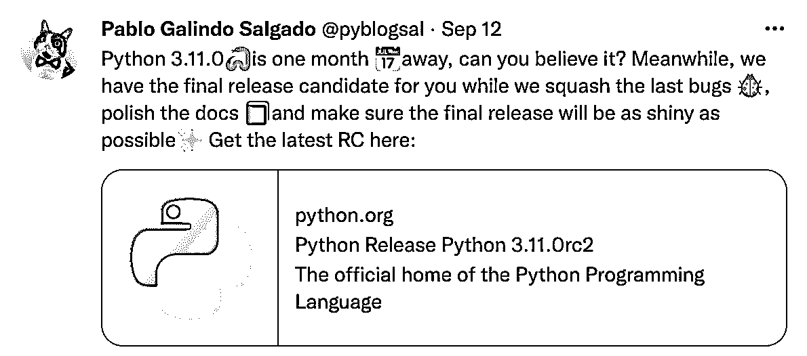

# Python 新闻:2022 年 9 月有什么新消息

> 原文：<https://realpython.com/python-news-september-2022/>

在 2022 年 9 月的**中， **Python 3.11.0rc2** 发布候选版本可供您测试并掌握 Python 的最新特性。该版本是 Python 3.11.0 最终发布之前的最后一个预览版，计划于 2022 年 10 月 24 日发布。**

Python 最新的 bugfix 版本，包括 3.10.7，已经引入了突破性的更改来应对一个安全漏洞，该漏洞会影响`str`到`int`的转换，并可能使您面临 DDoS 攻击。

像往常一样，Python 生态系统庆祝了许多基础包、库和框架的新版本的发布。

让我们深入了解过去一个月最激动人心的 **Python 新闻**！

**立即加入:** ，你将永远不会错过另一个 Python 教程、课程更新或帖子。

## Python 3.11.0rc2 发布

每个月，Python 都会从其不同的开发分支发布几个版本。新版本通常会添加新功能、修复错误、纠正安全漏洞等等。2022 年 9 月发布了几个新版本，供 Python 程序员测试、使用和享受。最值得注意的是 Python 最近的 3.11 候选版本。

Python [3.11.0rc2](https://pythoninsider.blogspot.com/2022/09/python-3110rc2-is-now-available.html) 于 2022 年 9 月 12 日星期一发布。这是 Python 3.11.0 最终发布之前的最后一个预览版:

[](https://files.realpython.com/media/twitter-3110rc2-release-candidate.51930a959afd.png)

<figcaption class="figure-caption text-center">[Image source](https://twitter.com/pyblogsal/status/1569324965752619009)</figcaption>

在**发布候选阶段**中，只允许修改 bug 的变更。在这个候选版本和最终版本之间，即使有代码变更，也是非常少的。如[发布帖](https://www.python.org/downloads/release/python-3110rc2/)中所列，与 3.10 相比，3.11 系列的新特性包括以下内容:

*   PEP 657–在回溯中包含细粒度的错误位置
*   [PEP 654](https://peps.python.org/pep-0654/)–异常组和`except*`
*   [PEP 680](https://peps.python.org/pep-0680/)–`tomllib`:支持解析标准库中的 TOML
*   [PEP 673](https://peps.python.org/pep-0673/)–`Self`型
*   [PEP 646](https://peps.python.org/pep-0646/)–可变泛型
*   [PEP 675](https://peps.python.org/pep-0675/)–任意文字字符串类型
*   [PEP 655](https://peps.python.org/pep-0655/)–将单个`TypedDict`项目标记为必需或潜在缺失
*   [PEP 681](https://peps.python.org/pep-0681/)–数据类转换

Python 3.11 还带来了一些其他令人兴奋的更新。 [gh-90908](https://github.com/python/cpython/issues/90908) 向`asyncio`引入任务组， [gh-34627](https://github.com/python/cpython/issues/34627/) 允许在正则表达式中使用原子分组(`(?>…)`)和所有格量词(`*+, ++, ?+, {m,n}+`)。

另外，Python 3.11 将提供更快的性能:

> 更快的 CPython 项目已经产生了一些令人兴奋的结果。Python 3.11 比 Python 3.10 快 10-60%。平均而言，我们在标准基准测试套件上测量到 1.22 倍的加速。详见[更快的 CPython】。(](https://docs.python.org/3.11/whatsnew/3.11.html#faster-cpython)[来源](https://discuss.python.org/t/the-cursed-release-of-python-3-11-0b4-is-now-available/17274))

要深入了解 Python 3.11 的一些很酷的新特性，请根据您的具体需求和兴趣查看以下资源:

*   [Python 3.11 预览版:更好的错误消息](https://realpython.com/python311-error-messages/)
*   [Python 3.11 预览版:任务和异常组](https://realpython.com/python311-exception-groups/)
*   [Python 3.11 预览版:TOML 和 tomllib](https://realpython.com/python311-tomllib/)
*   [Python 和 TOML:新的好朋友](https://realpython.com/python-toml/)

此列表中的前三个教程是帮助您使用 Python 3.11 的系列文章的一部分。

如果你想安装这个新版本并尝试它的一些最令人兴奋的特性，那么请查看名为[的真正的 Python 指南——如何安装 Python 的预发布版本？](https://realpython.com/python-pre-release/)

[*Remove ads*](/account/join/)

## Python 3.11.0 发布推迟到 10 月 24 日

由于上一个候选版本 3.11.0rc2 推迟了一周，Python 核心开发团队推迟了 Python 3.11.0 的最终发布。现在正式发布的时间是[定于](https://peps.python.org/pep-0664/#schedule)2022 年 10 月 24 日星期一。

这个最终版本最初定于 2022 年 10 月 3 日星期一发布。所以，我们还得再等三周才能在我们的电脑上欢迎 Python 3.11.0。

根据 3.11 [生命周期注释](https://peps.python.org/pep-0664/#lifespan)，这个版本将在大约十八个月内大约每两个月接收一次 bugfix 更新。

## Python 引入了一个突破性的改变来修复一个漏洞

Python 版本 [3.10.7](https://www.python.org/downloads/release/python-3107/) 、 [3.9.14](https://www.python.org/downloads/release/python-3914/) 、 [3.8.14](https://www.python.org/downloads/release/python-3814/) 和 [3.7.14](https://www.python.org/downloads/release/python-3714/) 现已发布。Python 3.10，最新的稳定版本，如期发布了第七个 [bugfix 版本](https://realpython.com/python-bugfix-version/)。该决定旨在解决由于`str`到`int`转换的算法复杂性而导致的允许拒绝服务( [DoS](https://en.wikipedia.org/wiki/Denial-of-service_attack) )攻击的漏洞。

[CVE](https://cve.mitre.org/index.html) 平台在其 [CVE-2020-10735](https://cve.mitre.org/cgi-bin/cvename.cgi?name=CVE-2020-10735) 报告中注册了这一公开披露的网络安全漏洞。最初的漏洞描述指出:

> 在 Python 中发现了一个缺陷。在使用非二进制基数的具有二次时间复杂度的算法中，当使用`int("text")`时，系统可能需要 50 毫秒来解析具有 100，000 个数字的`int`字符串，而对于 1，000，000 个数字则需要 5 秒(二进制基数为 2、4、8、16 和 32 的`float`、`decimal`、`int.from_bytes()`和`int()`不受影响)。此漏洞对系统可用性的威胁最大。([来源](https://cve.mitre.org/cgi-bin/cvename.cgi?name=CVE-2020-10735))

同时，Python 文档中的[Python 3.10 新特性](https://docs.python.org/3/whatsnew/3.10.html#what-s-new-in-python-3-10)页面对该问题的描述如下:

> 在 2(二进制)、4、8(八进制)、16(十六进制)或 32(如十进制)之外的基数中，在 [`int`](https://docs.python.org/release/3.10.7/library/functions.html#int) 和 [`str`](https://docs.python.org/release/3.10.7/library/stdtypes.html#str) 之间转换时，如果字符串形式的位数超过限制，则会引发 [`ValueError`](https://docs.python.org/release/3.10.7/library/exceptions.html#ValueError) ，以避免因算法复杂性而导致的潜在拒绝服务攻击。([来源](https://docs.python.org/3/whatsnew/3.10.html#notable-security-feature-in-3-10-7))

此更改将破坏对超过给定位数的数字运行此类转换的现有代码。现在，默认的位数限制是 4300 位。这里有一个简短的例子，通过在 Python 3.10.6 和 3.10.7 中运行`str`到`int`的转换，揭示了突破性的变化:

>>>

```py
>>> # Python 3.10.6 >>> int("2" * 5432)
222222222222222222222222222222222222222222222222222222222222222...

>>> # Python 3.10.7 >>> int("2" * 5432)
Traceback (most recent call last):
   ...
ValueError: Exceeds the limit (4300) for integer string conversion:
 value has 5432 digits; use sys.set_int_max_str_digits()
 to increase the limit.
```

这个对`int()`的调用在 Python 3.10.6 中运行良好，在 Python 3.10.7 中引发了一个`ValueError`。注意 Python 仍然可以处理大整数。只有在整数和字符串之间进行转换时，才会引发该错误。这种新行为可能会破坏不止一个代码库，所以如果您的代码经常处理这种转换，请密切关注。

幸运的是，当您希望某个操作超过允许的位数时，您可以增加它。为此，您可以使用以下方法之一:

*   [`PYTHONINTMAXSTRDIGITS`](https://docs.python.org/3/using/cmdline.html#envvar-PYTHONINTMAXSTRDIGITS) 环境变量
*   [`-X int_max_str_digits`](https://docs.python.org/3/using/cmdline.html#cmdoption-X) 命令行标志
*   [`set_int_max_str_digits()`](https://docs.python.org/3/library/sys.html#sys.set_int_max_str_digits) 功能来自 [`sys`](https://docs.python.org/3/library/sys.html#module-sys) 模块

如果您希望您的代码超过这个值，请查看[文档](https://docs.python.org/3/library/stdtypes.html#int-max-str-digits)以获得关于更改默认限制的更多细节。

最后，3.9.14、3.8.14 和 3.7.14 安全版本也解决了所描述的问题，以及一些不太紧急的安全改进和修复。因此，如果您在生产代码中使用这些 Python 系列中的任何一个，强烈建议升级您的安装。

## Python 生态系统中的新版本

全球 Python 社区从未停止推动 Python 生态系统走向未来。像往常一样，您会发现来自不同库、框架和项目的大量新版本。姜戈、[熊猫](https://realpython.com/pandas-python-explore-dataset/)、 [TensorFlow](https://realpython.com/pytorch-vs-tensorflow/) 和 [Matplotlib](https://realpython.com/python-matplotlib-guide/) 是 9 月份新发布列表中最引人注目的几个项目。

### Django Bugfix 版本 4.1.1

2022 年 9 月 5 日， [Django](https://realpython.com/django-user-management/) 发布了其 4.1.1 bugfix 版本。这个版本修复了 Django 4.1 的几个[倒退](https://en.wikipedia.org/wiki/Software_regression)。要获得完整的修复列表，请查看这个版本的[发行说明](https://docs.djangoproject.com/en/4.1/releases/4.1.1/)。

像往常一样，你可以从 Django 的[下载页面](https://www.djangoproject.com/download/)下载发布的包。或者，您可以通过在命令行或终端上运行`pip install Django`，直接从 Python 包索引 [PyPI](https://pypi.org/) 安装 [Django](https://pypi.org/project/Django/) 。

[*Remove ads*](/account/join/)

### 熊猫 1.5.0 发布

Python 的另一个重量级软件——熊猫库——于 9 月 19 日发布了新版本。熊猫 [1.5.0](https://pandas.pydata.org/pandas-docs/version/1.5/whatsnew/v1.5.0.html) 现已推出，增加了几个[增强](https://pandas.pydata.org/pandas-docs/version/1.5/whatsnew/v1.5.0.html#enhancements)和[错误修复](https://pandas.pydata.org/pandas-docs/version/1.5/whatsnew/v1.5.0.html#notable-bug-fixes)。

一些最相关的增强包括:

*   熊猫开发团队现在支持 [`pandas-stubs`](https://github.com/pandas-dev/pandas-stubs) ，它为熊猫 [API](https://en.wikipedia.org/wiki/API) 提供了类型存根。这些类型存根允许你使用 [mypy](http://mypy-lang.org/) 和 [Pyright](https://github.com/microsoft/pyright#readme) 对你的熊猫代码进行类型检查。
*   [`DataFrame`](https://realpython.com/pandas-dataframe/) 交换 API 协议现在可以使用了。该协议的目的是实现不同类型数据帧之间的数据交换。它允许你将一种类型的数据帧转换成另一种类型。
*   [`Styler`](https://pandas.pydata.org/pandas-docs/version/1.5/reference/api/pandas.io.formats.style.Styler.html#pandas.io.formats.style.Styler) 类现在有了一个新的 [`.concat()`](https://pandas.pydata.org/pandas-docs/version/1.5/reference/api/pandas.io.formats.style.Styler.concat.html#pandas.io.formats.style.Styler.concat) 方法，它允许添加定制的页脚行来可视化数据上的附加计算。

查看这个熊猫版本的[发行说明](https://pandas.pydata.org/pandas-docs/version/1.5/whatsnew/v1.5.0.html#what-s-new-in-1-5-0-september-19-2022)以获得新特性、错误修复等的完整列表。

### TensorFlow 2.10 发布

TensorFlow 2.10 于 2022 年 9 月 6 日发布！这个版本在 [Keras](https://realpython.com/python-keras-text-classification/) 深度学习 Python API 中包含了几个新的用户友好特性。您会发现有助于开发 transformer 风格模型的特性。您还将拥有确定性和无状态的 Keras 初始化器，使 Keras 能够支持新的特性，例如使用 [DTensor](https://www.tensorflow.org/guide/dtensor_overview) 进行多客户端模型训练。

该版本还对 Keras optimizers API 进行了更新。这种改变应该不会影响太多用户，但是您应该检查[文档](https://www.tensorflow.org/api_docs/python/tf/keras/optimizers/experimental)来验证您在工作流中使用的任何 API 是否已经改变。

你还会发现新的[工具](https://www.tensorflow.org/api_docs/python/tf/keras/utils/audio_dataset_from_directory)帮助你加载音频数据，并从 WAV 文件目录中生成音频分类数据集。有了这些新工具，您可以生成带标签的`tf.data.Dataset`对象，您可以用它们来构建和训练[自动语音识别](https://en.wikipedia.org/wiki/Speech_recognition) (ASR)模型。

有关 TensorFlow 2.10 中新功能和改进的完整列表，请查看发布帖子，[tensor flow 2.10 中的新功能？](https://blog.tensorflow.org/2022/09/whats-new-in-tensorflow-210.html)

### Matplotlib 3.6.0 发布

Matplotlib 的最新版本带来了几个很酷的新功能，可以帮助您从数据中创建更好的绘图。最显著的改进涉及到该库的许多方面，包括:

*   图形和轴的创建和管理
*   绘图方法
*   颜色和色彩映射表
*   标题、记号和标签
*   传说
*   标记
*   字体和文本
*   3D 轴
*   交互式工具

该版本还包括特定于平台的更改，这些更改改进了 Matplotlib 在 macOS 和 Windows 平台上行为的几个方面。

同样，如果您想要新功能和增强功能的详细列表，请查看[Matplotlib 3 . 6 . 0 新特性(2022 年 9 月 15 日)](https://matplotlib.org/stable/users/prev_whats_new/whats_new_3.6.0.html)中的发行说明。

如果你想建立和锻炼你的 Matplotlib 肌肉，你可以[画出 Mandelbrot 集合](https://realpython.com/mandelbrot-set-python/)或者[使用`plt.scatter()`可视化你的数据](https://realpython.com/visualizing-python-plt-scatter/)。如果你想用一行代码定制你的图表，那么看看[真正的 Python 播客:第 125 集](https://realpython.com/podcasts/rpp/125/)来学习如何使用样式表。

## Python 的下一步是什么？

那么，9 月份你最喜欢的 Python 新闻是什么？我们错过了什么值得注意的吗？你打算试试 Python 3.11.0rc2 吗？如何看待 Python 3.10.7 中围绕`str`到`int`转换的突破性变化？请在评论中告诉我们！

快乐的蟒蛇！

**立即加入:** ，你将永远不会错过另一个 Python 教程、课程更新或帖子。**