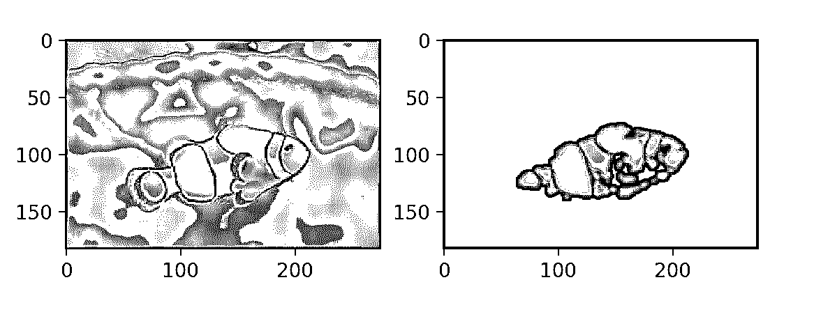
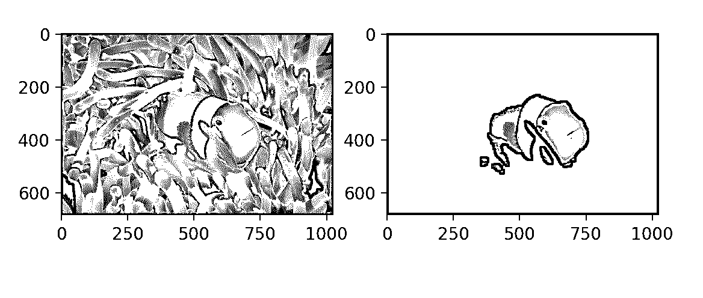

# OpenCV + Python 中基于颜色空间的图像分割

> 原文：<https://realpython.com/python-opencv-color-spaces/>

这可能是深度学习和大数据的时代，复杂的算法通过展示数百万张图像来分析图像，但颜色空间对图像分析仍然令人惊讶地有用。简单的方法仍然是强大的。

在本文中，您将学习如何使用 OpenCV 在 Python 中基于颜色简单地从图像中分割出一个对象。OpenCV 是一个用 C/C++编写的流行的计算机视觉库，为 Python 提供了[绑定](https://realpython.com/python-bindings-overview/)，它提供了操纵色彩空间的简单方法。

虽然您不需要熟悉 OpenCV 或本文中使用的其他助手包，但我们假设您至少对 Python 中的编码有基本的了解。

**免费奖励:** ，向您展示真实世界 Python 计算机视觉技术的实用代码示例。

## 什么是色彩空间？

在最常见的颜色空间 RGB(红绿蓝)中，颜色是用它们的红、绿、蓝分量来表示的。用更专业的术语来说，RGB 将颜色描述为一个由三个成分组成的元组。每个分量可以取 0 到 255 之间的值，其中元组`(0, 0, 0)`代表黑色，`(255, 255, 255)`代表白色。

**RGB 被认为是一种“加色”色彩空间**，颜色可以被想象为由大量红色、蓝色和绿色光线照射到黑色背景上而产生。

这里还有几个 RGB 颜色的例子:

| 颜色 | RGB 值 |
| --- | --- |
| 红色 | 255, 0, 0 |
| 柑橘 | 255, 128, 0 |
| 粉红色 | 255, 153, 255 |

RGB 是五种主要的颜色空间模型之一，每一种都有许多分支。有这么多色彩空间是因为不同的色彩空间有不同的用途。

在印刷世界中， **CMYK** 很有用，因为它描述了从白色背景产生颜色所需的颜色组合。RGB 中的 0 元组是黑色的，而 CMYK 中的 0 元组是白色的。我们的打印机装有青色、洋红色、黄色和黑色的墨盒。

在某些类型的医学领域，载有染色组织样本的载玻片被扫描并保存为图像。它们可以在 **HED** 空间中进行分析，这是一种应用于原始组织的染色类型(苏木精、曙红和 DAB)饱和度的表示。

**HSV 和 HSL** 是对色调、饱和度和亮度/辉度的描述，对于识别图像中的对比度特别有用。这些色彩空间经常用于软件和网页设计中的色彩选择工具。

事实上，颜色是一种连续的现象，这意味着有无限多种颜色。然而，色彩空间通过离散结构(固定数量的整数整数值)来表示色彩，这是可接受的，因为人眼和感知也是有限的。颜色空间完全能够代表我们能够区分的所有颜色。

现在我们理解了颜色空间的概念，我们可以继续在 OpenCV 中使用它们。

[*Remove ads*](/account/join/)

## 使用颜色空间的简单分割

为了演示色彩空间分割技术，我们在 Real Python 材料库[这里](https://github.com/realpython/materials/tree/master/opencv-color-spaces)提供了一个小丑鱼图像的小数据集，供您下载和使用。小丑鱼因其明亮的橙色而易于识别，因此它们是分割的良好候选对象。让我们看看我们能多好地在图像中找到尼莫。

你需要遵循的关键 Python 包是 NumPy，Python 中最重要的科学计算包，Matplotlib，一个绘图库，当然还有 OpenCV。本文使用 OpenCV 3.2.0、NumPy 1.12.1 和 Matplotlib 2.0.2。稍微不同的版本在理解和掌握概念方面不会有很大的不同。

如果你不熟悉 NumPy 或 Matplotlib，你可以在官方 NumPy 指南和 Brad Solomon 关于 Matplotlib 的优秀文章中了解它们。

### OpenCV 中的色彩空间和读取图像

首先，您需要设置您的环境。本文假设您的系统上安装了 Python 3.x。注意，虽然 OpenCV 的当前版本是 3.x，但是要导入的包的名称仍然是`cv2`:

>>>

```py
>>> import cv2
```

如果您之前没有在计算机上安装 OpenCV，导入将会失败，除非您先安装。你可以在这里找到在不同操作系统上安装的用户友好教程[，以及 OpenCV 自己的](https://www.pyimagesearch.com/opencv-tutorials-resources-guides/)[安装指南](https://docs.opencv.org/master/da/df6/tutorial_py_table_of_contents_setup.html)。一旦成功导入 OpenCV，您就可以查看 OpenCV 提供的所有色彩空间转换，并且可以将它们全部保存到一个[变量](https://realpython.com/python-variables/)中:

>>>

```py
>>> flags = [i for i in dir(cv2) if i.startswith('COLOR_')]
```

根据您的 OpenCV 版本，标志的列表和数量可能略有不同，但不管怎样，还是会有很多！查看您有多少面旗帜:

>>>

```py
>>> len(flags)
258
>>> flags[40]
'COLOR_BGR2RGB'
```

`COLOR_`之后的第一个字符表示原始色彩空间，`2`之后的字符是目标色彩空间。此标志代表从 BGR(蓝、绿、红)到 RGB 的转换。如您所见，这两个色彩空间非常相似，只是交换了第一个和最后一个通道。

您将需要`matplotlib.pyplot`来查看图像，还需要 NumPy 来进行一些图像操作。如果您还没有安装 Matplotlib 或 NumPy，您将需要在尝试导入之前使用`pip3 install matplotlib`和`pip3 install numpy`:

>>>

```py
>>> import matplotlib.pyplot as plt
>>> import numpy as np
```

现在，您已经准备好加载和检查图像了。请注意，如果您从命令行或终端工作，您的图像将出现在弹出窗口中。如果你用的是 Jupyter 笔记本或类似的东西，它们会简单地显示在下面。不管您的设置如何，您都应该看到由`show()`命令生成的图像:

>>>

```py
>>> nemo = cv2.imread(img/nemo0.jpg')
>>> plt.imshow(nemo)
>>> plt.show()
```

[](https://files.realpython.com/media/bgr_nemo.6526cc40dea8.png)

嘿，尼莫…还是多莉？你会注意到蓝色和红色通道好像被混淆了。事实上， **OpenCV 默认读取 BGR 格式的图像。**你可以使用`cvtColor(image, flag)`和我们上面看到的标志来解决这个问题:

>>>

```py
>>> nemo = cv2.cvtColor(nemo, cv2.COLOR_BGR2RGB)
>>> plt.imshow(nemo)
>>> plt.show()
```

[](https://files.realpython.com/media/rgb_nemo.116314a879f5.png)

现在尼莫看起来更像他自己了。

[*Remove ads*](/account/join/)

### 在 RGB 颜色空间中可视化 Nemo

HSV 是一个很好的颜色空间选择，用于根据颜色进行分割，但是要了解原因，让我们通过可视化像素的颜色分布来比较 RGB 和 HSV 颜色空间中的图像。3D 绘图很好地展示了这一点，每个轴代表颜色空间中的一个通道。如果您想知道如何制作 3D 图，请查看折叠部分:


为了进行绘图，您还需要几个 Matplotlib 库:

>>>

```py
>>> from mpl_toolkits.mplot3d import Axes3D
>>> from matplotlib import cm
>>> from matplotlib import colors
```

这些库提供了绘图所需的功能。您希望将每个像素放在基于其组件的位置上，并按其颜色对其进行着色。OpenCV `split()`在这里非常好用；它将图像分割成其分量通道。这几行代码分割图像并设置 3D 绘图:

>>>

```py
>>> r, g, b = cv2.split(nemo)
>>> fig = plt.figure()
>>> axis = fig.add_subplot(1, 1, 1, projection="3d")
```

现在您已经设置了绘图，您需要设置像素颜色。为了根据每个像素的真实颜色对其进行着色，需要进行一些整形和标准化。看起来很乱，但本质上你需要将图像中每一个像素对应的颜色展平成一个列表并归一化，这样就可以传递给 Matplotlib `scatter()`的`facecolors`参数。

标准化只是意味着根据`facecolors`参数的要求，压缩从`0-255`到`0-1`的颜色范围。最后，`facecolors`想要一个列表，而不是一个 NumPy 数组:

>>>

```py
>>> pixel_colors = nemo.reshape((np.shape(nemo)[0]*np.shape(nemo)[1], 3))
>>> norm = colors.Normalize(vmin=-1.,vmax=1.)
>>> norm.autoscale(pixel_colors)
>>> pixel_colors = norm(pixel_colors).tolist()
```

现在我们已经为绘图准备好了所有的组件:每个轴的像素位置和它们相应的颜色，以`facecolors`期望的格式。您可以构建并查看散点图:

>>>

```py
>>> axis.scatter(r.flatten(), g.flatten(), b.flatten(), facecolors=pixel_colors, marker=".")
>>> axis.set_xlabel("Red")
>>> axis.set_ylabel("Green")
>>> axis.set_zlabel("Blue")
>>> plt.show()
```

这是以 RGB 显示的 Nemo 图像的彩色散点图:

[](https://files.realpython.com/media/rgb_plot_nemo.83aa081c1b1d.png)

从该图中，您可以看到图像的橙色部分几乎跨越了红色、绿色和蓝色值的整个范围。由于 Nemo 的部分在整个图中延伸，基于 RGB 值的范围在 RGB 空间中分割 Nemo 并不容易。

### 在 HSV 颜色空间中可视化 Nemo

我们在 RGB 空间看到了尼莫，那么现在让我们在 HSV 空间查看他并进行比较。

上面简单提到过， **HSV 代表色相、饱和度、和值(或明度)**，是一个圆柱形的颜色空间。颜色或色调被建模为围绕中心垂直轴旋转的角度维度，该轴表示值通道。值从暗(0 在底部)到亮在顶部。第三个轴，饱和度，定义了从垂直轴上的最小饱和度到离中心最远的最大饱和度的色调阴影:

[](https://files.realpython.com/media/hsv.e3f7a0c4a59f.png)

<figcaption class="figure-caption text-center">Image: Wikipedia</figcaption>

要将图像从 RGB 转换为 HSV，您可以使用`cvtColor()`:

>>>

```py
>>> hsv_nemo = cv2.cvtColor(nemo, cv2.COLOR_RGB2HSV)
```

现在`hsv_nemo`在 HSV 中存储 Nemo 的表示。使用与上面相同的技术，我们可以查看 HSV 中的图像图，由下面的折叠部分生成:


以 HSV 显示图像的代码与 RGB 相同。请注意，您使用相同的`pixel_colors`变量来为像素着色，因为 Matplotlib 希望值是 RGB 格式的:

>>>

```py
>>> h, s, v = cv2.split(hsv_nemo)
>>> fig = plt.figure()
>>> axis = fig.add_subplot(1, 1, 1, projection="3d")

>>> axis.scatter(h.flatten(), s.flatten(), v.flatten(), facecolors=pixel_colors, marker=".")
>>> axis.set_xlabel("Hue")
>>> axis.set_ylabel("Saturation")
>>> axis.set_zlabel("Value")
>>> plt.show()
```

[](https://files.realpython.com/media/hsv_plot_nemo.0c82432ce86a.png)

在 HSV 空间里，尼莫的橙子要本地化得多，视觉上也可分。橙色的饱和度和值确实不同，但是它们大多位于沿着色调轴的小范围内。**这是细分市场可以利用的关键点。**

### 挑选一个范围

让我们根据一个简单的橙子范围来设定 Nemo 的阈值。你可以通过目测上面的图或使用在线颜色挑选应用程序来选择范围，例如这个 [RGB 到 HSV 工具](https://toolstud.io/color/rgb.php)。这里选择的样本是浅橙色和几乎是红色的深橙色:

>>>

```py
>>> light_orange = (1, 190, 200)
>>> dark_orange = (18, 255, 255)
```

如果您想使用 Python 显示您选择的颜色，请单击折叠部分:


在 Python 中显示颜色的一个简单方法是制作所需颜色的小正方形图像，并在 Matplotlib 中绘制它们。Matplotlib 仅解释 RGB 中的颜色，但为主要颜色空间提供了方便的转换函数，以便我们可以在其他颜色空间中绘制图像:

>>>

```py
>>> from matplotlib.colors import hsv_to_rgb
```

然后，构建小的`10x10x3`方块，填充各自的颜色。您可以使用 NumPy 轻松地用颜色填充正方形:

>>>

```py
>>> lo_square = np.full((10, 10, 3), light_orange, dtype=np.uint8) / 255.0
>>> do_square = np.full((10, 10, 3), dark_orange, dtype=np.uint8) / 255.0
```

最后，您可以通过将它们转换为 RGB 来一起绘制，以便查看:

>>>

```py
>>> plt.subplot(1, 2, 1)
>>> plt.imshow(hsv_to_rgb(do_square))
>>> plt.subplot(1, 2, 2)
>>> plt.imshow(hsv_to_rgb(lo_square))
>>> plt.show()
```

产生这些图像，用选定的颜色填充:

[](https://files.realpython.com/media/oranges.591061cd9a6a.png)

一旦你得到一个合适的颜色范围，你可以使用`cv2.inRange()`来尝试设定 Nemo 的阈值。`inRange()`带三个参数:**图像，下限范围，上限范围**。它返回图像大小的二进制掩码(1 和 0 的`ndarray`),其中`1`的值表示范围内的值，零值表示范围外的值:

>>>

```py
>>> mask = cv2.inRange(hsv_nemo, light_orange, dark_orange)
```

要在原始图像上施加蒙版，您可以使用`cv2.bitwise_and()`，如果蒙版中的相应值为`1`，则保留给定图像中的每个像素:

>>>

```py
>>> result = cv2.bitwise_and(nemo, nemo, mask=mask)
```

为了了解这到底是怎么回事，让我们同时查看蒙版和蒙版在顶部的原始图像:

>>>

```py
>>> plt.subplot(1, 2, 1)
>>> plt.imshow(mask, cmap="gray")
>>> plt.subplot(1, 2, 2)
>>> plt.imshow(result)
>>> plt.show()
```

[](https://files.realpython.com/media/mask_and_orig.865119b98b08.png)

你有它！这已经很好地捕捉到了鱼的橙色部分。唯一的问题是尼莫也有白色条纹…幸运的是，添加第二个寻找白色的面具与你已经对橙子所做的非常相似:

>>>

```py
>>> light_white = (0, 0, 200)
>>> dark_white = (145, 60, 255)
```

指定颜色范围后，您可以查看您选择的颜色:

[](https://files.realpython.com/media/whites.5feaf9246242.png)


要显示白色，您可以采用与我们之前处理橙子相同的方法:

>>>

```py
>>> lw_square = np.full((10, 10, 3), light_white, dtype=np.uint8) / 255.0
>>> dw_square = np.full((10, 10, 3), dark_white, dtype=np.uint8) / 255.0

>>> plt.subplot(1, 2, 1)
>>> plt.imshow(hsv_to_rgb(lw_square))
>>> plt.subplot(1, 2, 2)
>>> plt.imshow(hsv_to_rgb(dw_square))
>>> plt.show()
```

我在这里选择的上限是非常蓝的白色，因为白色在阴影中确实有蓝色的色调。让我们创建第二个面具，看看它是否能捕捉到尼莫的条纹。您可以像制作第一个遮罩一样制作第二个遮罩:

>>>

```py
>>> mask_white = cv2.inRange(hsv_nemo, light_white, dark_white)
>>> result_white = cv2.bitwise_and(nemo, nemo, mask=mask_white)

>>> plt.subplot(1, 2, 1)
>>> plt.imshow(mask_white, cmap="gray")
>>> plt.subplot(1, 2, 2)
>>> plt.imshow(result_white)
>>> plt.show()
```

[](https://files.realpython.com/media/mask_and_orig_whites.d0f575325c86.png)

还不错！现在，您可以组合遮罩。将两个蒙版加在一起会产生橙色*或白色*的`1`值，这正是我们所需要的。让我们将遮罩加在一起，并绘制结果:

>>>

```py
>>> final_mask = mask + mask_white

>>> final_result = cv2.bitwise_and(nemo, nemo, mask=final_mask)
>>> plt.subplot(1, 2, 1)
>>> plt.imshow(final_mask, cmap="gray")
>>> plt.subplot(1, 2, 2)
>>> plt.imshow(final_result)
>>> plt.show()
```

[](https://files.realpython.com/media/mask_and_orig_final.2397f42f890a.png)

本质上，你对 HSV 颜色空间中的 Nemo 有一个粗略的分割。您会注意到沿着分割边界有一些杂散像素，如果您愿意，您可以使用高斯模糊来整理小的错误检测。

高斯模糊是一种图像滤镜，它使用一种称为高斯的函数来变换图像中的每个像素。它具有平滑图像噪声和减少细节的效果。下面是我们的图像应用模糊的样子:

>>>

```py
>>> blur = cv2.GaussianBlur(final_result, (7, 7), 0)
>>> plt.imshow(blur)
>>> plt.show()
```

[](https://files.realpython.com/media/seg_nemo.c2509cb8e806.png)[*Remove ads*](/account/join/)

## 这种分割是否泛化到尼莫的亲属身上？

只是为了好玩，让我们看看这种分割技术如何推广到其他小丑鱼图像。在知识库中，有六张来自谷歌的小丑鱼的精选图片，被授权供公众使用。这些图片在一个子目录中，索引为 nemo *i* 。jpg，其中 *i* 是从`0-5`开始的索引。

首先，将尼莫的所有亲属载入一个列表:

```py
path = img/nemo"

nemos_friends = []
for i in range(6):
   friend = cv2.cvtColor(cv2.imread(path + str(i) + ".jpg"), cv2.COLOR_BGR2RGB)
   nemos_friends.append(friend)
```

您可以将上面用来分割一条鱼的所有代码组合到一个函数中，该函数接受一幅图像作为输入并返回分割后的图像。展开此部分以查看其外观:


下面是`segment_fish()`函数:

```py
def segment_fish(image):
    ''' Attempts to segment the clownfish out of the provided image '''

    # Convert the image into HSV
    hsv_image = cv2.cvtColor(image, cv2.COLOR_RGB2HSV)

    # Set the orange range
    light_orange = (1, 190, 200)
    dark_orange = (18, 255, 255)

    # Apply the orange mask 
    mask = cv2.inRange(hsv_image, light_orange, dark_orange)

    # Set a white range
    light_white = (0, 0, 200)
    dark_white = (145, 60, 255)

    # Apply the white mask
    mask_white = cv2.inRange(hsv_image, light_white, dark_white)

    # Combine the two masks
    final_mask = mask + mask_white
    result = cv2.bitwise_and(image, image, mask=final_mask)

    # Clean up the segmentation using a blur
    blur = cv2.GaussianBlur(result, (7, 7), 0)
    return blur
```

有了这个有用的函数，您就可以分割所有的鱼:

```py
results = [segment_fish(friend) for friend in nemos_friends]
```

让我们通过绘制循环来查看所有结果:

```py
for i in range(1, 6):
    plt.subplot(1, 2, 1)
    plt.imshow(nemos_friends[i])
    plt.subplot(1, 2, 2)
    plt.imshow(results[i])
    plt.show()
```

[](https://files.realpython.com/media/nemo_friend_1.727c3534d5ab.png)

前景小丑鱼的橙色色调比我们的产品系列更暗。

[](https://files.realpython.com/media/nemo_friend_2.c97bd4642274.png)

尼莫的侄子的阴影下半部分完全被排除在外，但是背景中的紫色海葵看起来非常像尼莫的蓝色条纹…

[](https://files.realpython.com/media/nemo_friend_3.36db40b694f0.png) [](https://files.realpython.com/media/nemo_friend_4.3da61ed16efa.png) [](https://files.realpython.com/media/nemo_friend_5.a4e3c288b4e4.png)

总的来说，这种简单的分割方法已经成功地定位了大多数 Nemo 的亲属。然而，很明显，用特定的光照和背景分割一条小丑鱼不一定能很好地推广到分割所有的小丑鱼。

## 结论

在本教程中，您已经了解了几种不同的色彩空间，图像如何在 RGB 和 HSV 色彩空间中分布，以及如何使用 OpenCV 在色彩空间之间转换和分割范围。

总之，您已经了解了如何使用 OpenCV 中的颜色空间来执行图像中的对象分割，并希望看到它在执行其他任务方面的潜力。在照明和背景受到控制的情况下，例如在实验设置中或使用更均匀的数据集，这种分割技术简单、快速且可靠。***