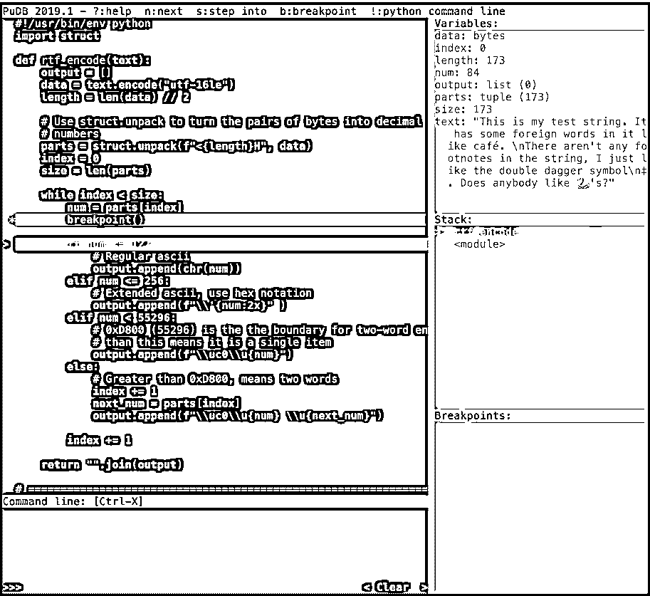
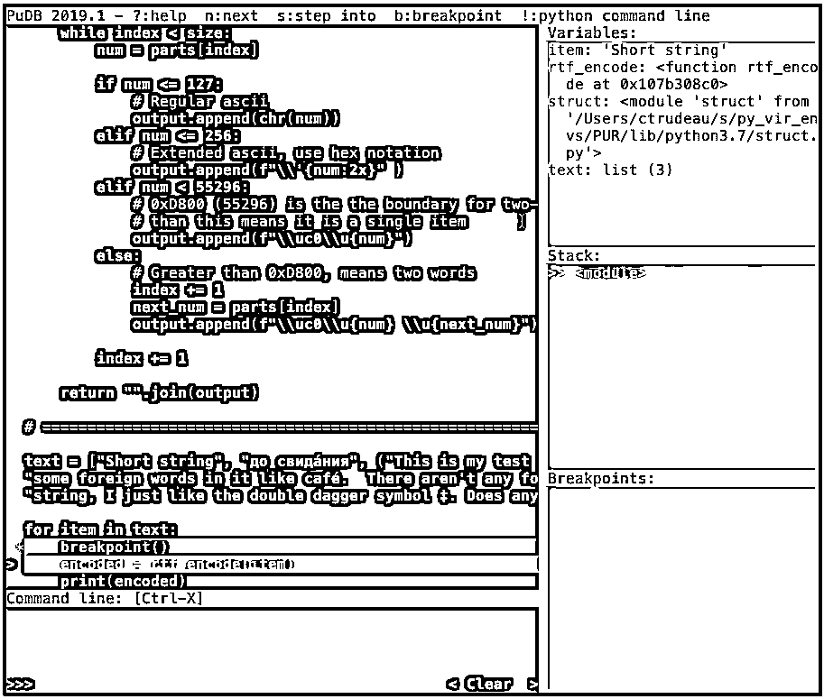

# Python 包:五个真正的 Python 最爱

> 原文：<https://realpython.com/python-packages/>

Python 有一个由包、模块和库组成的庞大生态系统，您可以用它来创建您的应用程序。其中一些[包和模块](https://realpython.com/python-modules-packages)包含在您的 Python 安装中，统称为[标准库](https://docs.python.org/3/library/)。

标准库由为常见编程问题提供标准化解决方案的模块组成。它们是跨许多学科的应用程序的重要组成部分。然而，许多开发人员更喜欢使用替代包，或**扩展**，这可能会提高标准库中内容的可用性和有用性。

在本教程中，您将在 *Real Python* 见到一些作者，并了解他们喜欢用哪些包来代替标准库中更常见的包。

**您将在本教程中了解的软件包有:**

*   **`pudb`** :一个基于文本的高级可视化调试器
*   **`requests`** :一个漂亮的 HTTP 请求 API
*   **`parse`** :直观、易读的文本匹配器
*   **`dateutil`** :热门`datetime`库的扩展
*   **`typer`** :直观的命令行界面解析器

首先，你将看到一个视觉上强大的`pdb`的替代品。

**免费下载:** [从 Python 技巧中获取一个示例章节:这本书](https://realpython.com/bonus/python-tricks-sample-pdf/)用简单的例子向您展示了 Python 的最佳实践，您可以立即应用它来编写更漂亮的+Python 代码。

## `pudb`进行可视化调试


[**Christopher Trudeau**](https://realpython.com/team/ctrudeau/)*是 Real Python 的作者和课程创建者。在工作中，他是一名顾问，帮助组织改善他们的技术团队。在家里，他花时间玩棋类游戏和摄影。*

我花了很多时间将[隐藏](https://www.ssh.com/ssh/protocol/)到远程机器中，所以我不能利用大多数[ide](https://realpython.com/python-ides-code-editors-guide/)。我选择的调试器是 [`pudb`](https://pypi.org/project/pudb/) ，它有一个[基于文本的用户界面](https://en.wikipedia.org/wiki/Text-based_user_interface)。我觉得它的界面直观易用。

Python 搭载 [`pdb`](https://realpython.com/python-debugging-pdb/) ，其灵感来源于 [`gdb`](https://en.wikipedia.org/wiki/GNU_Debugger) ，其本身的灵感来源于 [`dbx`](https://en.wikipedia.org/wiki/Dbx%5F%28debugger%29) 。虽然`pdb`完成了这项工作，但它最大的优势在于它搭载了 Python。因为它是基于命令行的，所以你必须记住很多快捷键，而且一次只能看到少量的源代码。

用于调试的另一个 Python 包是`pudb`。它显示了整个源代码屏幕以及有用的调试信息。它还有一个额外的好处，那就是让我怀念过去我编写涡轮帕斯卡(T2)代码的日子:

[](https://files.realpython.com/media/interface_pudb.a9a113804432.png)

该界面分为两个主要部分。左侧面板用于源代码，右侧面板用于上下文信息。右侧分为三个部分:

1.  变量
2.  堆
3.  断点

您在调试器中需要的一切都可以在一个屏幕上找到。

[*Remove ads*](/account/join/)

### 与`pudb` 互动

可以通过 [`pip`](https://realpython.com/what-is-pip/) 安装`pudb`:

```py
$ python -m pip install pudb
```

如果您使用的是 Python 3.7 或更高版本，那么您可以通过将`PYTHONBREAKPOINT`环境变量设置为`pudb.set_trace`来利用 [`breakpoint()`](https://docs.python.org/3/library/functions.html#breakpoint) 。如果您使用的是基于 Unix 的操作系统，比如 Linux 或 macOS，那么您可以按如下方式设置变量:

```py
$ export PYTHONBREAKPOINT=pudb.set_trace
```

如果您基于 Windows，命令会有所不同:

```py
C:\> set PYTHONBREAKPOINT=pudb.set_trace
```

或者，您可以将`import pudb; pudb.set_trace()`直接插入到代码中。

当您运行的代码遇到断点时，`pudb`中断执行并显示其接口:

[](https://files.realpython.com/media/basic_pudb.8f79afd25177.gif)

您可以使用键盘导航和执行源代码:

| 钥匙 | 行动 |
| --- | --- |
| `Up` 或 `K` | 将代码上移一行 |
| `Down` 或 `J` | 将代码下移一行 |
| `Page Up` 或 `Ctrl` + `B` | 向上滚动代码页 |
| `Page Down` 或 `Ctrl` + `F` | 向下滚动代码页 |
| T2`N` | 执行当前行 |
| T2`S` | 如果是函数，则进入当前行 |
| T2`C` | 继续执行到下一个断点 |

如果你重启你的代码，那么`pudb`会记住前一个会话的断点。 `Right` 和 `Left` 允许你在源代码和右边的控制区之间移动。

在*变量*框中，您可以看到当前范围内的所有变量:

[](https://files.realpython.com/media/rhs_pudb.72d45ff01ed7.gif)

默认情况下，变量的视图会被缩短，但您可以通过按 `\` 来查看完整的内容。展开视图将显示元组或列表中的项目，或者显示二进制变量的完整内容。`T``R`在`repr`和`type`显示模式之间来回切换。

### 使用观察表达式和访问 REPL

当右侧的*变量*区域被聚焦时，您还可以添加一个**观察表达式**。手表可以是任何 Python 表达式。这对于在对象仍处于缩短形式时检查深藏在对象中的数据或评估变量之间的复杂关系非常有用。

**注意:**通过按 `N` 添加一个手表表情。由于 `N` 也用于执行当前代码行，所以在按键之前，必须确保屏幕的右侧区域处于焦点上。

按下 `!` 可以跳出当前运行程序的 REPL。此模式还显示调试器触发之前发送到屏幕的任何输出。通过导航界面或使用快捷键，您还可以修改断点、更改您在堆栈框架中的位置以及加载其他源代码文件。

[*Remove ads*](/account/join/)

### 为什么`pudb`很牛逼

`pudb`界面比`pdb`需要更少的快捷键记忆，并且被设计成显示尽可能多的代码。它拥有在 [IDEs](https://realpython.com/python-ides-code-editors-guide/) 中发现的调试器的大部分功能，但是可以在终端中使用。由于安装这个 Python 包只需要很短的调用`pip`就可以了，你可以很快地把它带到任何环境中。下一次当你被困在命令行时，看看吧！

## `requests`用于与网络互动


[**马丁·布鲁斯**](https://realpython.com/team/mbreuss/) *是 Real Python 的作者和课程创建者。他在 CodingNomads 担任编程教师，在那里教授训练营和在线课程。工作之余，他喜欢航海、散步和录制随机声音。*

我从标准库之外挑选的第一个 Python 包是流行的`requests`包。它在我的电脑上有着特殊的地位，因为它是我在系统范围内安装的唯一的外部包。所有其他软件包都存在于它们专用的[虚拟环境](https://realpython.com/courses/working-python-virtual-environments/)中。

我不是唯一一个喜欢将`requests`作为 Python web 交互的主要工具的人:根据`requests` [文档](https://2.python-requests.org/projects/3/)，这个包每天有大约 160 万次下载*！

这个数字如此之高是因为与互联网的程序交互提供了许多可能性，无论是通过[的网络 API](https://realpython.com/tutorials/api/) 发布你的作品，还是通过[的网络抓取](https://realpython.com/learning-paths/python-web-scraping/)获取数据。但是 Python 的标准库已经包含了`urllib`包来帮助完成这些任务。那么为什么要用外包呢？是什么让`requests`成为如此受欢迎的选择？

### `requests`可读

`requests`库提供了一个开发良好的 API，它紧跟 Python 的目标，即像普通英语一样可读。开发人员在他们的口号“人类的 HTTP”中总结了这个想法

您可以使用`pip`在电脑上安装`requests`:

```py
$ python -m pip install requests
```

让我们通过使用它来访问网站上的文本，来探索一下`requests`是如何保持可读性的。当你用你可信赖的浏览器处理这个任务时，你应该遵循以下步骤:

1.  打开浏览器。
2.  输入网址。
3.  看网站的文字。

你如何用代码达到同样的结果？首先，您在**伪代码**中规划必要的步骤:

1.  导入您需要的工具。
2.  获取网站的数据。
3.  打印网站的文本。

阐明逻辑后，您使用`requests`库将伪代码翻译成 Python :

>>>

```py
>>> import requests
>>> response = requests.get("http://www.example.com")
>>> response.text
```

代码读起来几乎像英语，简洁明了。虽然使用标准库的`urllib`包构建这个基本示例并不难，但是`requests`即使在更复杂的场景中也能保持其简单明了、以人为中心的语法。

在下一个例子中，您将看到只用几行 Python 代码就可以完成很多事情。

[*Remove ads*](/account/join/)

### `requests`是强大的

让我们加快游戏速度，挑战`requests`更复杂的任务:

1.  登录您的 GitHub 帐户。
2.  持久化登录信息以处理多个请求。
3.  创建新的存储库。
4.  创建一个包含一些内容的新文件。
5.  仅当第一个请求成功时，才运行第二个请求。

挑战已接受并完成！下面的代码片段完成了上述所有任务。您需要做的就是分别用您的 GitHub 用户名和个人访问令牌替换两个[字符串](https://realpython.com/python-strings/) `"YOUR_GITHUB_USERNAME"`和`"YOUR_GITHUB_TOKEN"`。

**注意:**到[创建个人访问令牌](https://github.com/settings/tokens)，点击*生成新令牌*，选择*回购*范围。复制生成的令牌，并使用它与您的用户名一起进行身份验证。

阅读下面的代码片段，将其复制并保存到您自己的 Python 脚本中，填写您的凭证，并运行它以查看`requests`的运行情况:

```py
import requests

session = requests.Session()
session.auth = ("YOUR_GITHUB_USERNAME", "YOUR_GITHUB_TOKEN")
payload = {
    "name": "test-requests",
    "description": "Created with the requests library"
}
api_url ="https://api.github.com/user/repos"
response_1 = session.post(api_url, json=payload)
if response_1:
    data = {
            "message": "Add README via API",
            # The 'content' needs to be a base64 encoded string
            # Python's standard library can help with that
            # You can uncover the secret of this garbled string
            # by uploading it to GitHub with this script :)
            "content": "UmVxdWVzdHMgaXMgYXdlc29tZSE="
    }
    repo_url = response_1.json()["url"]
    readme_url = f"{repo_url}/contents/README.md"
    response_2 = session.put(readme_url, json=data)
else:
    print(response_1.status_code, response_1.json())

html_url = response_2.json()["content"]["html_url"]
print(f"See your repo live at: {html_url}")
session.close()
```

运行完代码后，继续前进并导航到它最后打印出来的链接。您将看到在您的 GitHub 帐户上创建了一个新的存储库。新的存储库包含一个带有一些文本的`README.md`文件，所有这些都是用这个脚本生成的。

**注意:**您可能已经注意到代码只认证一次，但是仍然能够发送多个请求。这是可能的，因为`requests.Session`对象允许您在多个请求中保存信息。

如您所见，上面的简短代码片段完成了很多工作，并且仍然易于理解。

### 为什么`requests`很牛逼

Python 的 [`request`库](https://realpython.com/python-requests/)是 Python 使用最广泛的外部库之一，因为它是一个可读的、可访问的、强大的与 Web 交互的工具。要了解更多关于使用`requests`的可能性，请查看用 Python 制作 HTTP 请求的[。](https://realpython.com/courses/python-requests/)

## `parse`用于匹配字符串


[**盖尔阿恩 Hjelle**](https://realpython.com/team/gahjelle/) *是 Real Python 的作者和评论家。他在挪威奥斯陆担任数据科学顾问，当他的分析涉及到地图和图像时，他特别高兴。除了键盘，盖尔·阿恩喜欢玩棋盘游戏、吊床和漫无目的地走进森林。*

我喜欢正则表达式的力量。使用一个[正则表达式](https://realpython.com/regex-python/)，或者**正则表达式**，你可以在给定的字符串中搜索几乎*任何*模式。然而，强大的能力带来了巨大的复杂性！构建一个正则表达式可能需要反复试验，理解一个给定正则表达式的微妙之处可能更难。

[`parse`](https://pypi.org/project/parse/) 是一个库，它包含了正则表达式的大部分功能，但使用了更清晰、或许更熟悉的语法。简而言之，`parse`就是[的 f 弦](https://realpython.com/python-f-strings/)反过来。您可以使用与格式化字符串基本相同的表达式来搜索和解析字符串。让我们看看它在实践中是如何工作的！

### 查找匹配给定模式的字符串

您需要一些想要解析的文本。在这些例子中，我们将使用最初的 f 弦规范 [PEP 498](https://www.python.org/dev/peps/pep-0498/) 。 [`pepdocs`](https://pypi.org/project/pepdocs/) 是一个可以下载 Python 增强提案(PEP)文档文本的小工具。

从 [PyPI](https://realpython.com/pypi-publish-python-package/) 安装`parse`和`pepdocs`:

```py
$ python -m pip install parse pepdocs
```

要开始使用，请下载 PEP 498:

>>>

```py
>>> import pepdocs
>>> pep498 = pepdocs.get(498)
```

例如，使用`parse`你可以找到 PEP 498 的作者:

>>>

```py
>>> import parse
>>> parse.search("Author: {}\n", pep498)
<Result ('Eric V. Smith <eric@trueblade.com>',) {}>
```

`parse.search()`搜索一个模式，在本例中是给定字符串中的任意位置`"Author: {}\n"`、*。您也可以使用`parse.parse()`，它将模式匹配到*完整的*字符串。类似于 f 字符串，您使用花括号(`{}`)来表示您想要解析的变量。

虽然您可以使用空的花括号，但大多数情况下，您希望在搜索模式中添加名称。你可以将 PEP 498 作者 [Eric V. Smith](https://www.youtube.com/watch?v=RyNR1BQvSCA) 的姓名和电子邮件地址拆分如下:

>>>

```py
>>> parse.search("Author: {name} <{email}>", pep498)
<Result () {'name': 'Eric V. Smith', 'email': 'eric@trueblade.com'}>
```

这将返回一个带有匹配信息的`Result`对象。您可以通过`.fixed`、`.named`和`.spans`访问您搜索的所有结果。您也可以使用`[]`来获取单个值:

>>>

```py
>>> result = parse.search("Author: {name} <{email}>", pep498)
>>> result.named
{'name': 'Eric V. Smith', 'email': 'eric@trueblade.com'}

>>> result["name"]
'Eric V. Smith'

>>> result.spans
{'name': (95, 108), 'email': (110, 128)}

>>> pep498[110:128]
'eric@trueblade.com'
```

给你字符串中匹配你的模式的索引。

[*Remove ads*](/account/join/)

### 使用格式说明符

你可以用`parse.findall()`找到一个模式的所有匹配。尝试找出 PEP 498 中提到的其他 PEP:

>>>

```py
>>> [result["num"] for result in parse.findall("PEP {num}", pep498)]
['p', 'd', '2', '2', '3', 'i', '3', 'r', ..., 't', '4', 'i', '4', '4']
```

嗯，看起来没什么用。pep 用数字表示。因此，您可以使用[格式语法](https://github.com/r1chardj0n3s/parse#format-specification)来指定您要查找的数字:

>>>

```py
>>> [result["num"] for result in parse.findall("PEP {num:d}", pep498)]
[215, 215, 3101, 3101, 461, 414, 461]
```

添加`:d`告诉`parse`你正在寻找一个整数。作为奖励，结果甚至从字符串转换成数字。除了`:d`，你可以使用 f 字符串使用的大部分[格式说明符](https://realpython.com/python-formatted-output/#the-ltformat_specgt-component)。

您还可以使用特殊的双字符规范来解析日期:

>>>

```py
>>> parse.search("Created: {created:tg}\n", pep498)
<Result () {'created': datetime.datetime(2015, 8, 1, 0, 0)}>
```

`:tg`查找写为*日/月/年*的日期。如果顺序或格式不同，您可以使用`:ti`和`:ta`，以及[几个其他选项](https://github.com/r1chardj0n3s/parse#format-specification)。

### 访问底层正则表达式

`parse`是建立在 Python 之上的正则表达式库， [`re`](https://docs.python.org/library/re.html) 。每次你做一个搜索，`parse`会在引擎盖下构建相应的正则表达式。如果您需要多次执行相同的搜索，那么您可以使用`parse.compile`预先构建一次正则表达式。

以下示例打印出 PEP 498 中对其他文档引用的所有描述:

>>>

```py
>>> references_pattern = parse.compile(".. [#] {reference}") >>> for line in pep498.splitlines():
...     if result := references_pattern.parse(line):
...         print(result["reference"])
...
%-formatting
str.format
[ ... ]
PEP 461 rejects bytes.format()
```

该循环使用 Python 3.8 和更高版本中可用的 [walrus 操作符](https://realpython.com/python38-new-features/#the-walrus-in-the-room-assignment-expressions)，根据提供的模板测试每一行。您可以查看编译后的模式，了解隐藏在您新发现的解析功能背后的正则表达式:

>>>

```py
>>> references_pattern._expression
'\\.\\. \\[#\\] (?P<reference>.+?)'
```

最初的`parse`模式`".. [#] {reference}"`，对于读和写都更简单。

### 为什么`parse`很牛逼

正则表达式显然是有用的。然而，[厚书](https://realpython.com/asins/0596528124/)已经被用来解释正则表达式的微妙之处。是一个小型的库，提供了正则表达式的大部分功能，但是语法更加友好。

如果你比较一下`".. [#] {reference}"`和`"\\.\\. \\[#\\] (?P<reference>.+?)"`，你就会明白为什么我更喜欢`parse`而不是正则表达式的力量。

## `dateutil`用于处理日期和时间


[**布莱恩·韦伯**](https://realpython.com/team/bweber/) *是 Real Python 的作者和评论者，也是机械工程的教授。当他不写 Python 或者不教书的时候，他很可能会做饭，和家人一起玩，或者去远足，如果运气好的话，三者兼而有之。*

如果你曾经不得不用时间进行编程，那么你就会知道它会给你带来的错综复杂的麻烦。首先，你必须处理好[时区](https://en.wikipedia.org/wiki/Time_zone)，在任何给定的时刻，地球上两个不同的点将会有不同的时间。然后是[夏令时](https://en.wikipedia.org/wiki/Daylight_saving_time)，一年两次的事件，一个小时要么发生两次，要么根本不发生，但只在某些国家发生。

你还必须考虑闰年和闰秒，以保持人类时钟与地球绕太阳公转同步。你必须围绕[千年虫](https://en.wikipedia.org/wiki/Year_2000_problem)和[千年虫](https://en.wikipedia.org/wiki/Year_2038_problem)进行编程。这个清单还在继续。

**注:**如果你想继续深入这个兔子洞，那么我强烈推荐[时间的问题&时区](https://www.youtube.com/watch?v=-5wpm-gesOY)，这是一个由精彩搞笑的[汤姆·斯科特](https://twitter.com/tomscott)制作的视频，解释了时间难以处理的一些方式。

幸运的是，Python 在标准库中包含了一个真正有用的模块，叫做 [`datetime`](https://docs.python.org/3/library/datetime.html) 。Python 的`datetime`是存储和访问日期和时间信息的好方法。然而，`datetime`有一些地方的界面不是很好。

作为回应，Python 的 awesome 社区已经开发了[几个不同的库和 API](https://realpython.com/python-datetime/#alternatives-to-python-datetime-and-dateutil)，以一种明智的方式处理日期和时间。这些有的是对内置`datetime`的扩展，有的是完全的替代。我最喜欢的图书馆是 [`dateutil`](https://dateutil.readthedocs.io/en/stable) 。

按照下面的例子，像这样安装`dateutil`:

```py
$ python -m pip install python-dateutil
```

现在您已经安装了`dateutil`,接下来几节中的例子将向您展示它有多强大。您还将看到`dateutil`如何与`datetime`互动。

[*Remove ads*](/account/join/)

### 设置时区

有几个有利因素。首先，Python 文档中的[推荐的](https://docs.python.org/3/library/datetime.html#tzinfo-objects)是对`datetime`的补充，用于处理时区和夏令时:

>>>

```py
>>> from dateutil import tz
>>> from datetime import datetime
>>> london_now = datetime.now(tz=tz.gettz("Europe/London"))
>>> london_now.tzname()  # 'BST' in summer and 'GMT' in winter
'BST'
```

但是`dateutil`能做的远不止提供一个具体的`tzinfo`实例。这确实是幸运的，因为在 [Python 3.9](https://realpython.com/python39-new-features/) 之后，Python 标准库将拥有自己访问 [IANA 数据库](https://en.wikipedia.org/wiki/Tz_database)的能力。

### 解析日期和时间字符串

`dateutil`使得使用 [`parser`](https://dateutil.readthedocs.io/en/stable/parser.html) 模块将字符串解析成`datetime`实例变得更加简单:

>>>

```py
>>> from dateutil import parser
>>> parser.parse("Monday, May 4th at 8am")  # May the 4th be with you!
datetime.datetime(2020, 5, 4, 8, 0)
```

注意`dateutil`会自动推断出这个日期的年份，即使您没有指定它！您还可以控制如何使用`parser`解释或添加[时区](https://dateutil.readthedocs.io/en/stable/examples.html#parse-examples)，或者使用 [ISO-8601](https://en.wikipedia.org/wiki/ISO_8601) 格式的日期。这给了你比在`datetime`更多的灵活性。

### 计算时差

`dateutil`的另一个优秀特性是它能够用 [`relativedelta`](https://dateutil.readthedocs.io/en/stable/relativedelta.html) 模块处理时间运算。您可以从一个`datetime`实例中增加或减去任意时间单位，或者找出两个`datetime`实例之间的差异:

>>>

```py
>>> from dateutil.relativedelta import relativedelta
>>> from dateutil import parser
>>> may_4th = parser.parse("Monday, May 4th at 8:00 AM")
>>> may_4th + relativedelta(days=+1, years=+5, months=-2)
datetime.datetime(2025, 3, 5, 8, 0)
>>> release_day = parser.parse("May 25, 1977 at 8:00 AM")
>>> relativedelta(may_4th, release_day)
relativedelta(years=+42, months=+11, days=+9)
```

这比 [`datetime.timedelta`](https://docs.python.org/3/library/datetime.html#timedelta-objects) 更加灵活和强大，因为您可以指定大于一天的时间间隔，例如一个月或一年。

### 计算重复事件

最后但并非最不重要的是，`dateutil`有一个强大的模块叫做 [`rrule`](https://dateutil.readthedocs.io/en/stable/rrule.html) ，用于根据 [iCalendar RFC](https://tools.ietf.org/html/rfc5545) 计算未来的日期。假设您想要生成六月份的常规站立时间表，在星期一和星期五的上午 10:00 进行:

>>>

```py
>>> from dateutil import rrule
>>> from dateutil import parser
>>> list(
...     rrule.rrule(
...         rrule.WEEKLY,
...         byweekday=(rrule.MO, rrule.FR),
...         dtstart=parser.parse("June 1, 2020 at 10 AM"),
...         until=parser.parse("June 30, 2020"),
...     )
... )
[datetime.datetime(2020, 6, 1, 10, 0), ..., datetime.datetime(2020, 6, 29, 10, 0)]
```

请注意，您不必知道开始或结束日期是星期一还是星期五— `dateutil`会为您计算出来。使用`rrule`的另一种方法是查找特定日期的下一次发生时间。让我们寻找下一次闰日，2 月 29 日，将发生在像 2020 年那样的星期六:

>>>

```py
>>> list(
...     rrule.rrule(
...         rrule.YEARLY,
...         count=1,
...         byweekday=rrule.SA,
...         bymonthday=29,
...         bymonth=2,
...     )
... )
[datetime.datetime(2048, 2, 29, 22, 5, 5)]
```

下一个星期六闰日将发生在 2048 年。在`dateutil`文档中还有一大堆[例子](https://dateutil.readthedocs.io/en/stable/examples.html)以及一组[练习](https://dateutil.readthedocs.io/en/stable/exercises/index.html)可以尝试。

### 为什么`dateutil`很牛逼

你刚刚看到了`dateutil`的四个特性，当你处理时间时，它们让你的生活变得更轻松:

1.  设置与`datetime`对象兼容的**时区**的便捷方式
2.  一种将字符串解析成日期的有用方法
3.  进行**时间运算的强大接口**
4.  一种计算**重复**或**未来**日期的绝妙方法。

下一次当你试图用时间编程而变得灰白时，试试吧！

[*Remove ads*](/account/join/)

## `typer`用于命令行界面解析*

*

[**戴恩·希拉德**](https://realpython.com/team/dhillard) *是 Python 书籍和博客作者，也是支持高等教育的非营利组织 ITHAKA 的首席 web 应用程序开发人员。在空闲时间，他什么都做，但特别喜欢烹饪、音乐、棋类游戏和交际舞。*

Python 开发人员通常使用 [`sys`模块](https://docs.python.org/3/library/sys.html)开始命令行界面(CLI)解析。您可以阅读`sys.argv`来获得用户提供给脚本的参数列表:

```py
# command.py

import sys

if __name__ == "__main__":
    print(sys.argv)
```

脚本的名称和用户提供的任何参数都以字符串值的形式出现在`sys.argv`中:

```py
$ python command.py one two three
["command.py", "one", "two", "three"]
$ python command.py 1 2 3
["command.py", "1", "2", "3"]
```

但是，当您向脚本中添加特性时，您可能希望以更明智的方式解析脚本的参数。您可能需要管理几种不同数据类型的参数，或者让用户更清楚地知道哪些选项是可用的。

### `argparse`是笨重的

Python 内置的 [`argparse`](https://docs.python.org/3/library/argparse.html) 模块帮助您创建命名参数，将用户提供的值转换为适当的数据类型，并自动为您的脚本创建帮助菜单。如果你以前没有用过`argparse`，那么看看[如何用 argparse](https://realpython.com/command-line-interfaces-python-argparse/) 在 Python 中构建命令行接口。

`argparse`的一大优势是，您可以用更具声明性的方式指定 CLI 的参数，减少了大量的过程性和条件性代码。

考虑下面的例子，它使用`sys.argv`以用户指定的次数打印用户提供的字符串，并对边缘情况进行最少的处理:

```py
# string_echo_sys.py

import sys

USAGE = """
USAGE:

python string_echo_sys.py <string> [--times <num>]
"""

if __name__ == "__main__":
    if len(sys.argv) == 1 or (len(sys.argv) == 2 and sys.argv[1] == "--help"):
        sys.exit(USAGE)
    elif len(sys.argv) == 2:
        string = sys.argv[1]  # First argument after script name
        print(string)
    elif len(sys.argv) == 4 and sys.argv[2] == "--times":
        string = sys.argv[1]  # First argument after script name

        try:
            times = int(sys.argv[3])  # Argument after --times
        except ValueError:
            sys.exit(f"Invalid value for --times! {USAGE}")

        print("\n".join([string] * times))
    else:
        sys.exit(USAGE)
```

此代码为用户提供了一种查看一些关于使用脚本的有用文档的方式:

```py
$ python string_echo_sys.py --help

USAGE:

python string_echo_sys.py <string> [--times <num>]
```

用户可以提供一个字符串和可选的打印该字符串的次数:

```py
$ python string_echo_sys.py HELLO! --times 5
HELLO!
HELLO!
HELLO!
HELLO!
HELLO!
```

要用`argparse`实现类似的界面，您可以编写如下代码:

```py
# string_echo_argparse.py

import argparse

parser = argparse.ArgumentParser(
    description="Echo a string for as long as you like"
)
parser.add_argument("string", help="The string to echo")
parser.add_argument(
    "--times",
    help="The number of times to echo the string",
    type=int,
    default=1,
)

if __name__ == "__main__":
    args = parser.parse_args()
    print("\n".join([args.string] * args.times))
```

`argparse`代码更具描述性，`argparse`还提供了完整的参数解析和一个解释脚本用法的`--help`选项，这些都是免费的。

尽管与直接处理`sys.argv`相比,`argparse`是一个很大的改进，但它仍然迫使你考虑很多关于 CLI 解析的问题。您通常试图编写一个脚本来做一些有用的事情，所以花在 CLI 解析上的精力是浪费！

[*Remove ads*](/account/join/)

### 为什么`typer`很牛逼

[`typer`](https://typer.tiangolo.com/) 提供了几个与`argparse`相同的特性，但是使用了非常不同的开发模式。与其编写任何声明性的、程序性的或条件性的逻辑来解析用户输入，`typer`利用[类型提示](https://realpython.com/python-type-checking/)来自省你的代码并生成一个 CLI，这样你就不必花太多精力去考虑如何处理用户输入。

从 PyPI 安装`typer`开始:

```py
$ python -m pip install typer
```

既然已经有了`typer`供您使用，下面是如何编写一个脚本来实现类似于`argparse`示例的结果:

```py
# string_echo_typer.py

import typer

def echo(
    string: str,
    times: int = typer.Option(1, help="The number of times to echo the string"),
):
    """Echo a string for as long as you like"""

    typer.echo("\n".join([string] * times))

if __name__ == "__main__":
    typer.run(echo)
```

这种方法使用更少的函数行，这些行主要关注脚本的特性。脚本多次回显一个字符串的事实更加明显。

`typer`甚至为用户提供了为他们的 shells 生成 `Tab` 完成的能力，这样他们就可以更快地使用您的脚本的 CLI。

您可以查看[比较 Python 命令行解析库——arg parse、Docopt，并单击](https://realpython.com/comparing-python-command-line-parsing-libraries-argparse-docopt-click/)看看是否有适合您的，但是我喜欢`typer`的简洁和强大。

## 结论:五个有用的 Python 包

Python 社区已经构建了如此多令人惊叹的包。在本教程中，您了解了几个有用的包，它们是 Python 标准库中常见包的替代或扩展。

**在本教程中，您学习了:**

*   为什么 **`pudb`** 可以帮助你调试代码
*   **`requests`** 如何改善你与网络服务器的沟通方式
*   你如何使用 **`parse`** 来简化你的字符串匹配
*   **`dateutil`** 为处理日期和时间提供了什么功能
*   为什么应该使用 **`typer`** 来解析命令行参数

我们已经为这些包中的一些写了专门的教程和教程部分，以供进一步阅读。我们鼓励你深入研究，并在评论中与我们分享一些你最喜欢的标准库选择！

## 延伸阅读

这里有一些教程和视频课程，您可以查看以了解更多关于本教程中涵盖的包的信息:

*   [使用 Python datetime 处理日期和时间](https://realpython.com/python-datetime/#working-with-time-zones)
*   [Python 的请求库(指南)](https://realpython.com/python-requests/)
*   [用 Python 发出 HTTP 请求](https://realpython.com/courses/python-requests/)*********