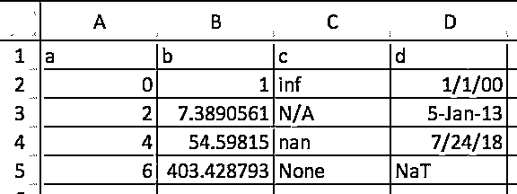

# Python 熊猫:你可能不知道的技巧和特性

> 原文：<https://realpython.com/python-pandas-tricks/>

*立即观看**本教程有真实 Python 团队创建的相关视频课程。配合文字教程一起看，加深理解: [**惯用熊猫:招数&你可能不知道的特点**](/courses/idiomatic-pandas-tricks-features-you-may-not-know/)

Pandas 是分析、数据处理和数据科学的基础库。这是一个巨大的项目，有大量的选择和深度。

本教程将介绍一些很少使用但很习惯的 Pandas 功能，这些功能可以让您的代码具有更好的可读性、多功能性和速度。

如果您对 Python 的 Pandas 库的核心概念感到满意，希望您能在本文中找到一两个以前没有遇到过的技巧。(如果你刚从图书馆开始，10 分钟到熊猫是一个好的开始。)

**注意**:本文中的例子是用 Pandas 版本 0.23.2 和 Python 3.6.6 测试的。但是，它们在旧版本中也应该有效。

## 1.在解释器启动时配置选项和设置

你可能以前也碰到过熊猫丰富的[选项和设置](https://pandas.pydata.org/pandas-docs/stable/options.html)系统。

在解释器启动时设置定制的 Pandas 选项是一个巨大的生产力节省，特别是如果你在一个脚本环境中工作。你可以使用`pd.set_option()`来随心所欲地配置一个 [Python](https://docs.python.org/tutorial/appendix.html#the-interactive-startup-file) 或 [IPython](https://ipython.readthedocs.io/en/stable/interactive/tutorial.html#startup-files) 启动文件。

这些选项使用一个点符号，比如`pd.set_option('display.max_colwidth', 25)`，这非常适合选项的嵌套[字典](https://realpython.com/python-dicts/):

```py
import pandas as pd

def start():
    options = {
        'display': {
            'max_columns': None,
            'max_colwidth': 25,
            'expand_frame_repr': False,  # Don't wrap to multiple pages
            'max_rows': 14,
            'max_seq_items': 50,         # Max length of printed sequence
            'precision': 4,
            'show_dimensions': False
        },
        'mode': {
            'chained_assignment': None   # Controls SettingWithCopyWarning
        }
    }

    for category, option in options.items():
        for op, value in option.items():
            pd.set_option(f'{category}.{op}', value)  # Python 3.6+

if __name__ == '__main__':
    start()
    del start  # Clean up namespace in the interpreter
```

如果您启动一个解释器会话，您将看到启动脚本中的所有内容都已执行，并且 Pandas 会自动为您导入，并带有您的选项套件:

>>>

```py
>>> pd.__name__
'pandas'
>>> pd.get_option('display.max_rows')
14
```

让我们使用 UCI 机器学习库托管的关于鲍鱼的一些数据来演示启动文件中设置的格式。数据将在 14 行截断，浮点精度为 4 位数:

>>>

```py
>>> url = ('https://archive.ics.uci.edu/ml/'
...        'machine-learning-databases/abalone/abalone.data')
>>> cols = ['sex', 'length', 'diam', 'height', 'weight', 'rings']
>>> abalone = pd.read_csv(url, usecols=[0, 1, 2, 3, 4, 8], names=cols)

>>> abalone
 sex  length   diam  height  weight  rings
0      M   0.455  0.365   0.095  0.5140     15
1      M   0.350  0.265   0.090  0.2255      7
2      F   0.530  0.420   0.135  0.6770      9
3      M   0.440  0.365   0.125  0.5160     10
4      I   0.330  0.255   0.080  0.2050      7
5      I   0.425  0.300   0.095  0.3515      8
6      F   0.530  0.415   0.150  0.7775     20
# ...
4170   M   0.550  0.430   0.130  0.8395     10
4171   M   0.560  0.430   0.155  0.8675      8
4172   F   0.565  0.450   0.165  0.8870     11
4173   M   0.590  0.440   0.135  0.9660     10
4174   M   0.600  0.475   0.205  1.1760      9
4175   F   0.625  0.485   0.150  1.0945     10
4176   M   0.710  0.555   0.195  1.9485     12
```

稍后，您还会在其他示例中看到这个数据集。

[*Remove ads*](/account/join/)

## 2.用熊猫的测试模块制作玩具数据结构

**注意**:熊猫 1.0 中`pandas.util.testing`模块[已被弃用。来自`pandas.testing`的“公共测试 API”现在仅限于`assert_extension_array_equal()`、`assert_frame_equal()`、`assert_series_equal()`和`assert_index_equal()`。作者承认，他因依赖熊猫图书馆的未记录部分而自食其果。](https://pandas.pydata.org/docs/whatsnew/v1.0.0.html#deprecations)

隐藏在熊猫的 [`testing`](https://github.com/pandas-dev/pandas/blob/master/pandas/util/testing.py) 模块中的是许多方便的函数，用于快速构建准现实系列和数据帧:

>>>

```py
>>> import pandas.util.testing as tm
>>> tm.N, tm.K = 15, 3  # Module-level default rows/columns

>>> import numpy as np
>>> np.random.seed(444)

>>> tm.makeTimeDataFrame(freq='M').head()
 A       B       C
2000-01-31  0.3574 -0.8804  0.2669
2000-02-29  0.3775  0.1526 -0.4803
2000-03-31  1.3823  0.2503  0.3008
2000-04-30  1.1755  0.0785 -0.1791
2000-05-31 -0.9393 -0.9039  1.1837

>>> tm.makeDataFrame().head()
 A       B       C
nTLGGTiRHF -0.6228  0.6459  0.1251
WPBRn9jtsR -0.3187 -0.8091  1.1501
7B3wWfvuDA -1.9872 -1.0795  0.2987
yJ0BTjehH1  0.8802  0.7403 -1.2154
0luaYUYvy1 -0.9320  1.2912 -0.2907
```

其中大约有 30 个，您可以通过调用模块对象上的`dir()`来查看完整的列表。以下是一些例子:

>>>

```py
>>> [i for i in dir(tm) if i.startswith('make')]
['makeBoolIndex',
 'makeCategoricalIndex',
 'makeCustomDataframe',
 'makeCustomIndex',
 # ...,
 'makeTimeSeries',
 'makeTimedeltaIndex',
 'makeUIntIndex',
 'makeUnicodeIndex']
```

这些对于基准测试、测试断言以及用您不太熟悉的 Pandas 方法进行实验是很有用的。

## 3.利用访问器方法

也许你听说过术语**访问器**，它有点像 getter(尽管 getter 和 setter 在 Python 中很少使用)。对于我们这里的目的，您可以将 Pandas 访问器看作是一个属性，它充当附加方法的接口。

熊猫系列有三个:

>>>

```py
>>> pd.Series._accessors
{'cat', 'str', 'dt'}
```

是的，上面的定义有点拗口，所以在讨论内部原理之前，让我们先看几个例子。

`.cat`是分类数据，`.str`是字符串(对象)数据，`.dt`是类似日期时间的数据。让我们从`.str`开始:假设您有一些原始的城市/州/邮政编码数据，作为 Pandas 系列中的一个字段。

Pandas 字符串方法是[向量化的](https://realpython.com/numpy-array-programming/#what-is-vectorization)，这意味着它们在没有显式 for 循环的情况下对整个数组进行操作:

>>>

```py
>>> addr = pd.Series([
...     'Washington, D.C. 20003',
...     'Brooklyn, NY 11211-1755',
...     'Omaha, NE 68154',
...     'Pittsburgh, PA 15211'
... ])

>>> addr.str.upper()
0     WASHINGTON, D.C. 20003
1    BROOKLYN, NY 11211-1755
2            OMAHA, NE 68154
3       PITTSBURGH, PA 15211
dtype: object

>>> addr.str.count(r'\d')  # 5 or 9-digit zip?
0    5
1    9
2    5
3    5
dtype: int64
```

对于一个更复杂的例子，假设您希望将三个城市/州/邮政编码组件整齐地分离到 DataFrame 字段中。

您可以通过一个[正则表达式](https://realpython.com/regex-python/)到`.str.extract()`来“提取”序列中每个单元格的部分。在`.str.extract()`中，`.str`是访问器，`.str.extract()`是访问器方法:

>>>

```py
>>> regex = (r'(?P<city>[A-Za-z ]+), '      # One or more letters
...          r'(?P<state>[A-Z]{2}) '        # 2 capital letters
...          r'(?P<zip>\d{5}(?:-\d{4})?)')  # Optional 4-digit extension
...
>>> addr.str.replace('.', '').str.extract(regex)
 city state         zip
0  Washington    DC       20003
1    Brooklyn    NY  11211-1755
2       Omaha    NE       68154
3  Pittsburgh    PA       15211
```

这也说明了所谓的方法链接，其中对`addr.str.replace('.', '')`的结果调用`.str.extract(regex)`，这消除了句点的使用，得到了一个漂亮的 2 字符状态缩写。

稍微了解一下这些访问器方法是如何工作的会有所帮助，这也是为什么你应该首先使用它们，而不是像`addr.apply(re.findall, ...)`这样的东西。

每个访问器本身都是真正的 Python 类:

*   `.str`映射到 [`StringMethods`](https://github.com/pandas-dev/pandas/blob/3e4839301fc2927646889b194c9eb41c62b76bda/pandas/core/strings.py#L1766) 。
*   `.dt`映射到 [`CombinedDatetimelikeProperties`](https://github.com/pandas-dev/pandas/blob/3e4839301fc2927646889b194c9eb41c62b76bda/pandas/core/indexes/accessors.py#L306) 。
*   `.cat`航线到 [`CategoricalAccessor`](https://github.com/pandas-dev/pandas/blob/3e4839301fc2927646889b194c9eb41c62b76bda/pandas/core/arrays/categorical.py#L2356) 。

然后使用 [`CachedAccessor`](https://github.com/pandas-dev/pandas/blob/master/pandas/core/accessor.py) 将这些独立类“附加”到系列类。当这些类被包装在`CachedAccessor`中时，神奇的事情发生了。

受“缓存属性”设计的启发:每个实例只计算一次属性，然后用普通属性替换。它通过重载 [`.__get__()`方法](https://docs.python.org/reference/datamodel.html#object.__get__)来做到这一点，方法是 Python 的[描述符](https://realpython.com/python-descriptors/)协议的一部分。

**注意**:如果你想了解更多关于如何工作的内部信息，请看 [Python 描述符 HOWTO](https://docs.python.org/howto/descriptor.html) 和[这篇关于缓存属性设计的文章](https://www.pydanny.com/cached-property.html)。Python 3 还引入了 [`functools.lru_cache()`](https://docs.python.org/library/functools.html#functools.lru_cache) ，提供了类似的功能。这种模式的例子比比皆是，比如在 [`aiohttp`](https://github.com/aio-libs/aiohttp/blob/master/aiohttp/_helpers.pyx) 包中。

第二个访问器`.dt`用于类似日期时间的数据。它技术上属于熊猫的`DatetimeIndex`，如果叫上一个系列，就先转换成`DatetimeIndex`:

>>>

```py
>>> daterng = pd.Series(pd.date_range('2017', periods=9, freq='Q'))
>>> daterng
0   2017-03-31
1   2017-06-30
2   2017-09-30
3   2017-12-31
4   2018-03-31
5   2018-06-30
6   2018-09-30
7   2018-12-31
8   2019-03-31
dtype: datetime64[ns]

>>>  daterng.dt.day_name()
0      Friday
1      Friday
2    Saturday
3      Sunday
4    Saturday
5    Saturday
6      Sunday
7      Monday
8      Sunday
dtype: object

>>> # Second-half of year only
>>> daterng[daterng.dt.quarter > 2]
2   2017-09-30
3   2017-12-31
6   2018-09-30
7   2018-12-31
dtype: datetime64[ns]

>>> daterng[daterng.dt.is_year_end]
3   2017-12-31
7   2018-12-31
dtype: datetime64[ns]
```

第三个访问器`.cat`，仅用于分类数据，您将很快在它自己的[部分](#5-use-categorical-data-to-save-on-time-and-space)中看到。

[*Remove ads*](/account/join/)

## 4.从组件列创建 DatetimeIndex

说到类似日期时间的数据，如上面的`daterng`所示，可以从多个组成列中创建一个 Pandas `DatetimeIndex`，它们共同构成一个日期或日期时间:

>>>

```py
>>> from itertools import product
>>> datecols = ['year', 'month', 'day']

>>> df = pd.DataFrame(list(product([2017, 2016], [1, 2], [1, 2, 3])),
...                   columns=datecols)
>>> df['data'] = np.random.randn(len(df))
>>> df
 year  month  day    data
0   2017      1    1 -0.0767
1   2017      1    2 -1.2798
2   2017      1    3  0.4032
3   2017      2    1  1.2377
4   2017      2    2 -0.2060
5   2017      2    3  0.6187
6   2016      1    1  2.3786
7   2016      1    2 -0.4730
8   2016      1    3 -2.1505
9   2016      2    1 -0.6340
10  2016      2    2  0.7964
11  2016      2    3  0.0005

>>> df.index = pd.to_datetime(df[datecols])
>>> df.head()
 year  month  day    data
2017-01-01  2017      1    1 -0.0767
2017-01-02  2017      1    2 -1.2798
2017-01-03  2017      1    3  0.4032
2017-02-01  2017      2    1  1.2377
2017-02-02  2017      2    2 -0.2060
```

最后，您可以删除旧的单个列，并转换为一个系列:

>>>

```py
>>> df = df.drop(datecols, axis=1).squeeze()
>>> df.head()
2017-01-01   -0.0767
2017-01-02   -1.2798
2017-01-03    0.4032
2017-02-01    1.2377
2017-02-02   -0.2060
Name: data, dtype: float64

>>> df.index.dtype_str
'datetime64[ns]
```

传递 DataFrame 背后的直觉是 DataFrame 类似于 Python 字典，其中列名是键，单个列(系列)是字典值。这就是为什么`pd.to_datetime(df[datecols].to_dict(orient='list'))`在这种情况下也能工作。这反映了 Python 的`datetime.datetime`的构造，其中传递关键字参数，如`datetime.datetime(year=2000, month=1, day=15, hour=10)`。

## 5.使用分类数据节省时间和空间

熊猫的一个强大特征是它的类型。

即使您并不总是在 RAM 中处理千兆字节的数据，您也可能遇到过这样的情况:对大型数据帧的简单操作似乎会挂起几秒钟以上。

Pandas `object` dtype 通常是转换成类别数据的绝佳选择。(`object`是 Python `str`、异构数据类型或“其他”类型的容器。)字符串会占用大量内存空间:

>>>

```py
>>> colors = pd.Series([
...     'periwinkle',
...     'mint green',
...     'burnt orange',
...     'periwinkle',
...     'burnt orange',
...     'rose',
...     'rose',
...     'mint green',
...     'rose',
...     'navy'
... ])
...
>>> import sys
>>> colors.apply(sys.getsizeof)
0    59
1    59
2    61
3    59
4    61
5    53
6    53
7    59
8    53
9    53
dtype: int64
```

**注:**我用`sys.getsizeof()`来显示序列中每个单独的值所占用的内存。请记住，这些 Python 对象首先会有一些开销。(`sys.getsizeof('')`将返回 49 个字节。)

还有`colors.memory_usage()`，它汇总了内存使用量，依赖于底层 NumPy 数组的`.nbytes`属性。不要在这些细节上陷得太深:重要的是由类型转换导致的相对内存使用，您将在下面看到。

现在，如果我们能把上面独特的颜色映射到一个不那么占空间的整数，会怎么样呢？这是一个简单的实现:

>>>

```py
>>> mapper = {v: k for k, v in enumerate(colors.unique())}
>>> mapper
{'periwinkle': 0, 'mint green': 1, 'burnt orange': 2, 'rose': 3, 'navy': 4}

>>> as_int = colors.map(mapper)
>>> as_int
0    0
1    1
2    2
3    0
4    2
5    3
6    3
7    1
8    3
9    4
dtype: int64

>>> as_int.apply(sys.getsizeof)
0    24
1    28
2    28
3    24
4    28
5    28
6    28
7    28
8    28
9    28
dtype: int64
```

**注意**:做同样事情的另一种方法是熊猫的`pd.factorize(colors)`:

>>>

```py
>>> pd.factorize(colors)[0]
array([0, 1, 2, 0, 2, 3, 3, 1, 3, 4])
```

无论哪种方式，都是将对象编码为枚举类型(分类变量)。

您会立即注意到，与使用完整的字符串和`object` dtype 相比，内存使用量减少了一半。

在前面关于[访问器](#3-take-advantage-of-accessor-methods)的部分，我提到了`.cat`(分类)访问器。上面带有`mapper`的图片粗略地展示了熊猫`Categorical`的内部情况:

> “一个`Categorical`的内存使用量与类别的数量加上数据的长度成正比。相比之下，`object` dtype 是一个常数乘以数据的长度。[(来源)](https://pandas.pydata.org/pandas-docs/stable/categorical.html#memory-usage)

在上面的`colors`中，每个唯一值(类别)有 2 个值的比率:

>>>

```py
>>> len(colors) / colors.nunique()
2.0
```

因此，从转换到`Categorical`节省的内存是好的，但不是很大:

>>>

```py
>>> # Not a huge space-saver to encode as Categorical
>>> colors.memory_usage(index=False, deep=True)
650
>>> colors.astype('category').memory_usage(index=False, deep=True)
495
```

然而，如果你打破上面的比例，有很多数据和很少的唯一值(想想人口统计学或字母测试分数的数据)，所需的内存减少超过 10 倍:

>>>

```py
>>> manycolors = colors.repeat(10)
>>> len(manycolors) / manycolors.nunique()  # Much greater than 2.0x
20.0

>>> manycolors.memory_usage(index=False, deep=True)
6500
>>> manycolors.astype('category').memory_usage(index=False, deep=True)
585
```

额外的好处是计算效率也得到了提高:对于分类`Series`，字符串操作[是在`.cat.categories`属性](https://pandas.pydata.org/pandas-docs/stable/text.html)上执行的，而不是在`Series`的每个原始元素上。

换句话说，每个唯一的类别只执行一次操作，结果映射回值。分类数据有一个`.cat`访问器，它是进入属性和方法的窗口，用于操作类别:

>>>

```py
>>> ccolors = colors.astype('category')
>>> ccolors.cat.categories
Index(['burnt orange', 'mint green', 'navy', 'periwinkle', 'rose'], dtype='object')
```

事实上，您可以手动重现类似于上面示例的内容:

>>>

```py
>>> ccolors.cat.codes
0    3
1    1
2    0
3    3
4    0
5    4
6    4
7    1
8    4
9    2
dtype: int8
```

要完全模拟前面的手动输出，您需要做的就是对代码进行重新排序:

>>>

```py
>>> ccolors.cat.reorder_categories(mapper).cat.codes
0    0
1    1
2    2
3    0
4    2
5    3
6    3
7    1
8    3
9    4
dtype: int8
```

注意，dtype 是 NumPy 的`int8`，一个 [8 位有符号整数](https://docs.scipy.org/doc/numpy-1.10.0/user/basics.types.html)，可以取-127 到 128 之间的值。(只需要一个字节来表示内存中的一个值。就内存使用而言，64 位有符号`ints`是多余的。)默认情况下，我们粗略的例子产生了`int64`数据，而 Pandas 足够聪明，可以将分类数据向下转换为尽可能最小的数字数据类型。

`.cat`的大多数属性都与查看和操作底层类别本身有关:

>>>

```py
>>> [i for i in dir(ccolors.cat) if not i.startswith('_')]
['add_categories',
 'as_ordered',
 'as_unordered',
 'categories',
 'codes',
 'ordered',
 'remove_categories',
 'remove_unused_categories',
 'rename_categories',
 'reorder_categories',
 'set_categories']
```

不过，有一些注意事项。分类数据通常不太灵活。例如，如果插入以前看不见的值，您需要首先将这个值添加到一个`.categories`容器中:

>>>

```py
>>> ccolors.iloc[5] = 'a new color'
# ...
ValueError: Cannot setitem on a Categorical with a new category,
set the categories first

>>> ccolors = ccolors.cat.add_categories(['a new color'])
>>> ccolors.iloc[5] = 'a new color'  # No more ValueError
```

如果您计划设置值或重塑数据，而不是派生新的计算，`Categorical`类型可能不太灵活。

[*Remove ads*](/account/join/)

## 6.通过迭代内省 Groupby 对象

当你调用`df.groupby('x')`时，产生的[熊猫`groupby`对象](https://realpython.com/pandas-groupby/)可能有点不透明。该对象被延迟实例化，本身没有任何有意义的表示。

您可以使用来自[示例 1](#1-configure-options-settings-at-interpreter-startup) 的鲍鱼数据集进行演示:

>>>

```py
>>> abalone['ring_quartile'] = pd.qcut(abalone.rings, q=4, labels=range(1, 5))
>>> grouped = abalone.groupby('ring_quartile')

>>> grouped
<pandas.core.groupby.groupby.DataFrameGroupBy object at 0x11c1169b0>
```

好了，现在你有了一个`groupby`对象，但是这个东西是什么，我怎么看它？

在调用类似于`grouped.apply(func)`的东西之前，您可以利用`groupby`对象是可迭代的这一事实:

>>>

```py
>>> help(grouped.__iter__)

 Groupby iterator

 Returns
 -------
 Generator yielding sequence of (name, subsetted object)
 for each group
```

由`grouped.__iter__()`产生的每个“东西”都是一个由`(name, subsetted object)`组成的元组，其中`name`是分组所依据的列的值，而`subsetted object`是一个数据帧，它是基于您指定的任何分组条件的原始数据帧的子集。也就是说，数据按组分块:

>>>

```py
>>> for idx, frame in grouped:
...     print(f'Ring quartile: {idx}')
...     print('-' * 16)
...     print(frame.nlargest(3, 'weight'), end='\n\n')
...
Ring quartile: 1
----------------
 sex  length   diam  height  weight  rings ring_quartile
2619   M   0.690  0.540   0.185  1.7100      8             1
1044   M   0.690  0.525   0.175  1.7005      8             1
1026   M   0.645  0.520   0.175  1.5610      8             1

Ring quartile: 2
----------------
 sex  length  diam  height  weight  rings ring_quartile
2811   M   0.725  0.57   0.190  2.3305      9             2
1426   F   0.745  0.57   0.215  2.2500      9             2
1821   F   0.720  0.55   0.195  2.0730      9             2

Ring quartile: 3
----------------
 sex  length  diam  height  weight  rings ring_quartile
1209   F   0.780  0.63   0.215   2.657     11             3
1051   F   0.735  0.60   0.220   2.555     11             3
3715   M   0.780  0.60   0.210   2.548     11             3

Ring quartile: 4
----------------
 sex  length   diam  height  weight  rings ring_quartile
891    M   0.730  0.595    0.23  2.8255     17             4
1763   M   0.775  0.630    0.25  2.7795     12             4
165    M   0.725  0.570    0.19  2.5500     14             4
```

与之相关的是，`groupby`对象也有`.groups`和组获取器`.get_group()`:

>>>

```py
>>> grouped.groups.keys()
dict_keys([1, 2, 3, 4])

>>> grouped.get_group(2).head()
 sex  length   diam  height  weight  rings ring_quartile
2    F   0.530  0.420   0.135  0.6770      9             2
8    M   0.475  0.370   0.125  0.5095      9             2
19   M   0.450  0.320   0.100  0.3810      9             2
23   F   0.550  0.415   0.135  0.7635      9             2
39   M   0.355  0.290   0.090  0.3275      9             2
```

这有助于您更加确信您正在执行的操作是您想要的:

>>>

```py
>>> grouped['height', 'weight'].agg(['mean', 'median'])
 height         weight
 mean median    mean  median
ring_quartile
1              0.1066  0.105  0.4324  0.3685
2              0.1427  0.145  0.8520  0.8440
3              0.1572  0.155  1.0669  1.0645
4              0.1648  0.165  1.1149  1.0655
```

无论您在`grouped`上执行什么计算，无论是单个 Pandas 方法还是定制的函数，这些“子帧”中的每一个都作为参数一个接一个地传递给那个可调用函数。这就是术语“拆分-应用-组合”的来源:按组分解数据，按组进行计算，然后以某种聚合方式重新组合。

如果你很难想象这些组实际上会是什么样子，简单地迭代它们并打印几个会非常有用。

## 7.使用这个映射技巧为会员宁滨

假设您有一个系列和一个对应的“映射表”，其中每个值属于一个多成员组，或者根本不属于任何组:

>>>

```py
>>> countries = pd.Series([
...     'United States',
...     'Canada',
...     'Mexico',
...     'Belgium',
...     'United Kingdom',
...     'Thailand'
... ])
...
>>> groups = {
...     'North America': ('United States', 'Canada', 'Mexico', 'Greenland'),
...     'Europe': ('France', 'Germany', 'United Kingdom', 'Belgium')
... }
```

换句话说，您需要将`countries`映射到以下结果:

>>>

```py
0    North America
1    North America
2    North America
3           Europe
4           Europe
5            other
dtype: object
```

这里你需要的是一个类似于熊猫的`pd.cut()`的函数，但是对于宁滨是基于分类成员的。你可以使用`pd.Series.map()`，你已经在[的例子#5](#5-use-categorical-data-to-save-on-time-and-space) 中看到了，来模仿这个:

```py
from typing import Any

def membership_map(s: pd.Series, groups: dict,
                   fillvalue: Any=-1) -> pd.Series:
    # Reverse & expand the dictionary key-value pairs
    groups = {x: k for k, v in groups.items() for x in v}
    return s.map(groups).fillna(fillvalue)
```

对于`countries`中的每个国家，这应该比通过`groups`的嵌套 Python 循环快得多。

下面是一次试驾:

>>>

```py
>>> membership_map(countries, groups, fillvalue='other')
0    North America
1    North America
2    North America
3           Europe
4           Europe
5            other
dtype: object
```

我们来分析一下这是怎么回事。(旁注:这是一个用 Python 的调试器 [`pdb`](https://realpython.com/python-debugging-pdb/) 进入函数范围的好地方，用来检查函数的局部变量。)

目标是将`groups`中的每个组映射到一个整数。然而，`Series.map()`不会识别`'ab'`—它需要分解的版本，每个组中的每个字符都映射到一个整数。这就是[字典理解](https://docs.python.org/tutorial/datastructures.html#dictionaries)正在做的事情:

>>>

```py
>>> groups = dict(enumerate(('ab', 'cd', 'xyz')))
>>> {x: k for k, v in groups.items() for x in v}
{'a': 0, 'b': 0, 'c': 1, 'd': 1, 'x': 2, 'y': 2, 'z': 2}
```

这个字典可以传递给`s.map()`以将其值映射或“翻译”到相应的组索引。

[*Remove ads*](/account/join/)

## 8.了解熊猫如何使用布尔运算符

你可能熟悉 Python 的[运算符优先级](https://docs.python.org/reference/expressions.html#operator-precedence)，其中`and`、`not`、`or`的优先级低于`<`、`<=`、`>`、`>=`、`!=`、`==`等算术运算符。考虑下面两条语句，其中`<`和`>`的优先级高于`and`运算符:

>>>

```py
>>> # Evaluates to "False and True"
>>> 4 < 3 and 5 > 4
False

>>> # Evaluates to 4 < 5 > 4
>>> 4 < (3 and 5) > 4
True
```

**注**:不是专门和熊猫有关，但是`3 and 5`因为短路评估而评估为`5`:

> "短路运算符的返回值是最后计算的参数。"[(来源)](https://docs.python.org/3/tutorial/datastructures.html#more-on-conditions)

Pandas(和 NumPy，Pandas 就是在其上构建的)不使用`and`、`or`或`not`。相反，它分别使用了`&`、`|`和`~`，这是正常的、真正的 Python [位操作符](https://realpython.com/python-bitwise-operators/)。

这些运营商不是熊猫“发明”的。相反，`&`、`|`和`~`是有效的 Python 内置操作符，其优先级高于(而不是低于)算术操作符。(Pandas 覆盖了像`.__ror__()`这样映射到`|`操作符的 dunder 方法。)为了牺牲一些细节，您可以将“按位”视为“元素方式”,因为它与 Pandas 和 NumPy 相关:

>>>

```py
>>> pd.Series([True, True, False]) & pd.Series([True, False, False])
0     True
1    False
2    False
dtype: bool
```

充分理解这个概念是有好处的。假设您有一个类似系列的产品:

>>>

```py
>>> s = pd.Series(range(10))
```

我猜您可能已经在某个时候看到了这个异常:

>>>

```py
>>> s % 2 == 0 & s > 3
ValueError: The truth value of a Series is ambiguous.
Use a.empty, a.bool(), a.item(), a.any() or a.all().
```

这里发生了什么事？用括号递增地绑定表达式很有帮助，说明 Python 如何一步一步地扩展这个表达式:

```py
s % 2 == 0 & s > 3                      # Same as above, original expression
(s % 2) == 0 & s > 3                    # Modulo is most tightly binding here
(s % 2) == (0 & s) > 3                  # Bitwise-and is second-most-binding
(s % 2) == (0 & s) and (0 & s) > 3      # Expand the statement
((s % 2) == (0 & s)) and ((0 & s) > 3)  # The `and` operator is least-binding
```

表达式`s % 2 == 0 & s > 3`等同于`((s % 2) == (0 & s)) and ((0 & s) > 3)`(或被视为)`((s % 2) == (0 & s)) and ((0 & s) > 3)`。这叫做[扩张](https://docs.python.org/reference/expressions.html#comparisons) : `x < y <= z`相当于`x < y and y <= z`。

好了，现在停下来，让我们回到熊猫的话题。你有两个熊猫系列，我们称之为`left`和`right`:

>>>

```py
>>> left = (s % 2) == (0 & s)
>>> right = (0 & s) > 3
>>> left and right  # This will raise the same ValueError
```

您知道形式为`left and right`的语句对`left`和`right`都进行真值测试，如下所示:

>>>

```py
>>> bool(left) and bool(right)
```

问题是熊猫开发者故意不为整个系列建立一个真值。一个系列是真是假？谁知道呢？结果是不明确的:

>>>

```py
>>> bool(s)
ValueError: The truth value of a Series is ambiguous.
Use a.empty, a.bool(), a.item(), a.any() or a.all().
```

唯一有意义的比较是元素方面的比较。这就是为什么，如果涉及到算术运算符，[就需要括号](https://pandas.pydata.org/pandas-docs/stable/indexing.html#boolean-indexing):

>>>

```py
>>> (s % 2 == 0) & (s > 3)
0    False
1    False
2    False
3    False
4     True
5    False
6     True
7    False
8     True
9    False
dtype: bool
```

简而言之，如果你看到上面的`ValueError`弹出布尔索引，你可能要做的第一件事就是添加一些需要的括号。

[*Remove ads*](/account/join/)

## 9.从剪贴板加载数据

需要将数据从像 Excel 或 [Sublime Text](https://realpython.com/setting-up-sublime-text-3-for-full-stack-python-development/) 这样的地方转移到 Pandas 数据结构是一种常见的情况。理想情况下，你想这样做而不经过中间步骤，即把数据保存到一个文件，然后[把文件读入熊猫](https://realpython.com/pandas-read-write-files/)。

您可以使用 [`pd.read_clipboard()`](https://pandas.pydata.org/pandas-docs/stable/generated/pandas.read_clipboard.html) 从计算机的剪贴板数据缓冲区载入数据帧。其关键字参数被传递到 [`pd.read_table()`](https://pandas.pydata.org/pandas-docs/stable/generated/pandas.read_table.html) 。

这允许您将结构化文本直接复制到数据帧或系列中。在 Excel 中，数据看起来像这样:

[](https://files.realpython.com/media/excel_data.5f5061328ba6.jpg)

它的纯文本表示(例如，在文本编辑器中)如下所示:

```py
a   b           c       d
0   1           inf     1/1/00
2   7.389056099 N/A     5-Jan-13
4   54.59815003 nan     7/24/18
6   403.4287935 None    NaT
```

只需突出显示并复制上面的纯文本，然后调用`pd.read_clipboard()`:

>>>

```py
>>> df = pd.read_clipboard(na_values=[None], parse_dates=['d'])
>>> df
 a         b    c          d
0  0    1.0000  inf 2000-01-01
1  2    7.3891  NaN 2013-01-05
2  4   54.5982  NaN 2018-07-24
3  6  403.4288  NaN        NaT

>>> df.dtypes
a             int64
b           float64
c           float64
d    datetime64[ns]
dtype: object
```

## 10.把熊猫对象直接写成压缩格式

这是一个简短而甜蜜的结尾。从 Pandas 版本 0.21.0 开始，您可以将 Pandas 对象直接写入 gzip、bz2、zip 或 xz 压缩，而不是将未压缩的文件存储在内存中并进行转换。这里有一个使用来自[技巧#1](#1-configure-options-settings-at-interpreter-startup) 的`abalone`数据的例子:

```py
abalone.to_json('df.json.gz', orient='records',
                lines=True, compression='gzip')
```

在这种情况下，大小差为 11.6 倍:

>>>

```py
>>> import os.path
>>> abalone.to_json('df.json', orient='records', lines=True)
>>> os.path.getsize('df.json') / os.path.getsize('df.json.gz')
11.603035760226396
```

## 想要添加到此列表吗？让我们知道

希望您能够从这个列表中挑选一些有用的技巧，让您的熊猫代码具有更好的可读性、通用性和性能。

如果你有这里没有提到的东西，请在评论中留下你的建议或者作为 GitHub 的要点。我们将很高兴地添加到这个列表中，并给予应有的信任。

*立即观看**本教程有真实 Python 团队创建的相关视频课程。配合文字教程一起看，加深理解: [**惯用熊猫:招数&你可能不知道的特点**](/courses/idiomatic-pandas-tricks-features-you-may-not-know/)*******