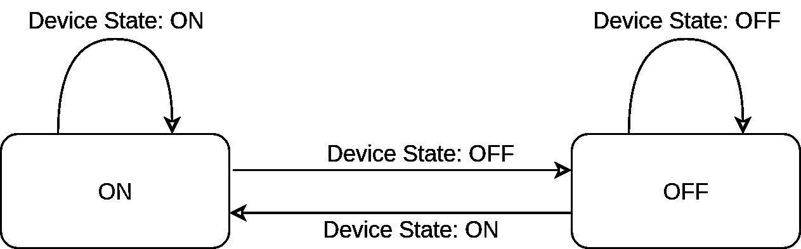
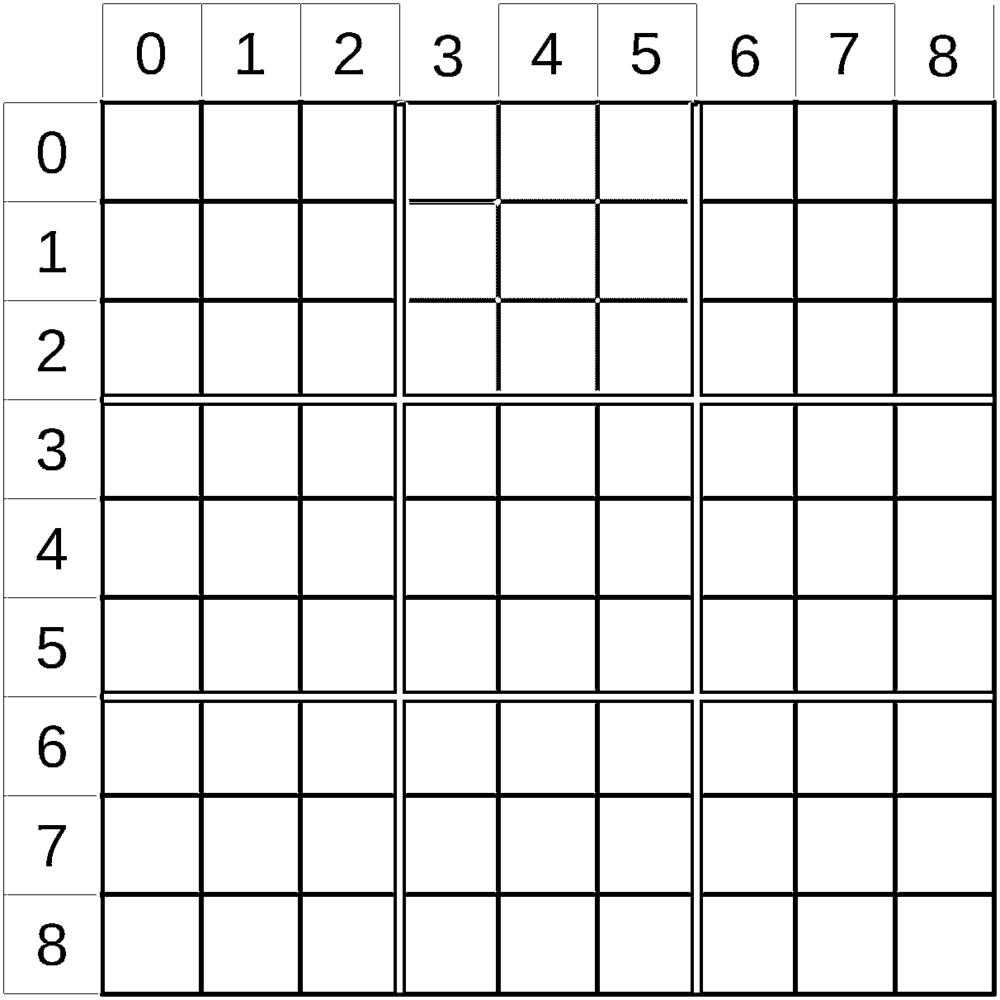
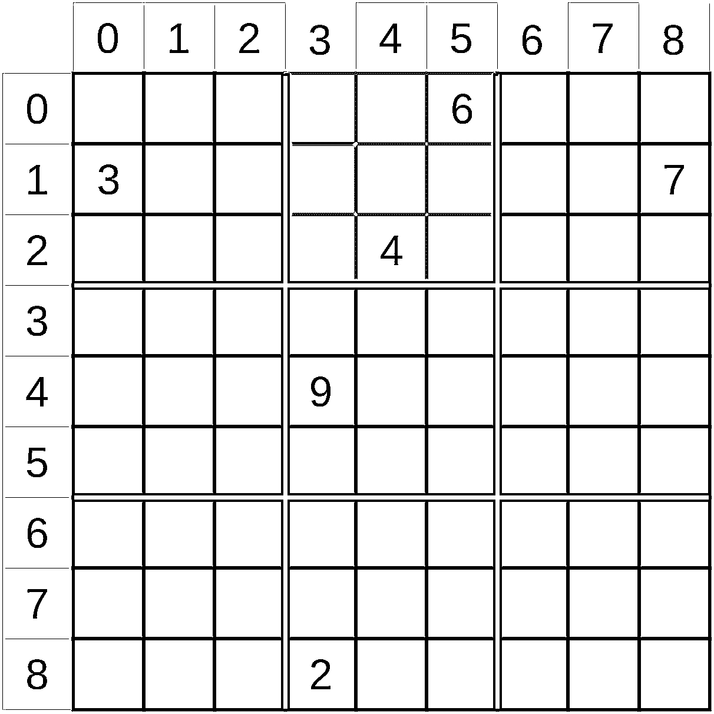

# Python 练习题:为下一次面试做好准备

> 原文：<https://realpython.com/python-practice-problems/>

在[面试](https://realpython.com/learning-paths/python-interview/)之前，你是一名 Python 开发人员吗？如果是这样，那么本教程将引导你通过一系列的 **Python 实践问题**来模拟常见的编码测试场景。在你开发出自己的解决方案后，你将浏览*真实 Python* 团队的答案，这样你就可以优化你的代码，给面试官留下深刻印象，并获得你梦想的工作！

**在本教程中，您将学习如何:**

*   为面试式问题编写代码
*   **在面试中讨论你的解决方案**
*   解决**经常被忽略的细节**
*   谈论**设计决策**和权衡

本教程面向中级 Python 开发人员。它假设你有 Python 的基础知识和用 Python 解决问题的能力。通过点击下面的链接，您可以获得本教程中每个问题的单元测试失败的框架代码:

**下载示例代码:** [单击此处获取代码，您将使用](https://realpython.com/bonus/python-practice-problems-code/)来解决本教程中的 Python 练习问题。

下面的每个问题都显示了描述问题需求的框架代码的文件头。因此，下载代码，启动您最喜欢的编辑器，让我们深入一些 Python 实践问题吧！

## Python 练习题 1:一系列整数的和

先来个热身问题。在第一个练习题中，您将编写代码来对一个由[整数](https://realpython.com/lessons/integers/)组成的[列表](https://realpython.com/python-lists-tuples/)求和。每个练习题都包括一个问题描述。这个描述是直接从 repo 中的框架文件中提取的，以便在您处理解决方案时更容易记住。

您还会看到每个问题的解决方案部分。大部分讨论将在下面的折叠部分进行。克隆回购如果您还没有，制定出以下问题解决方案，然后展开解决方案框来回顾您的工作。

[*Remove ads*](/account/join/)

### 问题描述

这是你的第一个问题:

> **n 以内的整数之和** ( `integersums.py`)
> 
> 编写一个函数`add_it_up()`，它将一个整数作为输入，并将从零到输入参数的整数之和返回。
> 
> 如果传入了非整数，该函数应该返回 0。

记得运行单元测试，直到通过为止！

### 问题解决方案

这里讨论了几种可能的解决方案。

**注意:**记住，在你准备好查看这个 Python 练习题的答案之前，不要打开下面折叠的部分！


解决方案写得怎么样了？准备好看答案了吗？

对于这个问题，您将看到几种不同的解决方案。第一个不太好:

```py
# integersums.py
def first(n):
    num = 1
    sum = 0
    while num < n + 1:
        sum = sum + num
        num = num + 1
    return sum
```

在这个解决方案中，您手动构建一个`while`循环来遍历数字`1`到`n`。你保持一个运行的`sum`，然后当你完成一个循环时返回它。

这个解决方案是可行的，但是它有两个问题:

1.  它没有展示你的 Python 知识以及这种语言如何简化这样的任务。

2.  不符合问题描述中的错误条件。传入一个[字符串](https://realpython.com/python-strings/)将导致该函数在应该返回`0`时抛出一个异常。

您将在下面的最终答案中处理错误情况，但首先让我们将核心解决方案提炼得更为[python 化](https://realpython.com/learning-paths/writing-pythonic-code/)。

首先要想到的是 [`while`回路](https://realpython.com/python-while-loop/)。Python 拥有强大的列表和范围迭代机制。创建你自己的通常是不必要的，这当然是这里的情况。你可以用一个迭代 [`range()`](https://realpython.com/python-range/) 的循环来代替`while`循环:

```py
# integersums.py
def better(n):
    sum = 0
    for num in range(n + 1):
        sum += num
    return sum
```

您可以看到,`for...range()`构造已经取代了您的`while`循环并缩短了代码。有一点需要注意的是，`range()`上升到但不包括给定的数字，所以这里需要用`n + 1`。

这是很好的一步！它去掉了一些在一个范围内循环的样板代码，使你的意图更加清晰。但是在这里你还可以做更多的事情。

对整数列表求和是 Python 擅长的另一件事:

```py
# integersums.py
def even_better(n):
    return sum(range(n + 1))
```

哇！通过使用内置的`sum()`，您可以用一行代码来完成！虽然 [code golf](https://en.wikipedia.org/wiki/Code_golf) 通常不会产生可读性最强的代码，但是在这种情况下，你有一个双赢的结果:更短的*和更可读的*代码。

然而，还有一个问题。这段代码仍然不能正确处理错误情况。要解决这个问题，您可以将之前的代码包装在一个`try...except`块中:

```py
# integersums.py
def add_it_up(n):
    try:
        result = sum(range(n + 1))
    except TypeError:
        result = 0
    return result
```

这解决了问题并正确处理了错误情况。好样的。

偶尔，面试官会带着固定的限制问这个问题，类似于“打印前九个整数之和。”当问题被这样表述时，一个正确的解决方案应该是`print(45)`。

但是，如果您给出了这个答案，那么您应该一步一步地用代码来解决这个问题。技巧答案是开始你的答案的好地方，但不是结束的好地方。

如果你想扩展这个问题，试着给`add_it_up()`增加一个可选的下限，给它更多的灵活性！

## Python 练习题 2:凯撒密码

下一个问题由两部分组成。您将编写一个函数来计算文本输入的[凯撒密码](https://en.wikipedia.org/wiki/Caesar_cipher)。对于这个问题，您可以自由使用 [Python 标准库](https://docs.python.org/3.8/library/)的任何部分来进行转换。

**提示:**`str`类中有一个函数可以让这个任务变得更加容易！

### 问题描述

问题陈述位于框架源文件的顶部:

> **凯撒密码** ( `caesar.py`)
> 
> 凯撒密码是一种简单的替换密码，其中明文中的每个字母都被替换为通过移动字母表中的`n`位找到的字母。例如，假设输入纯文本如下:
> 
> ```py
> `abcd xyz` 
> ```
> 
> 如果移位值`n`为 4，则加密文本如下:
> 
> ```py
> `efgh bcd` 
> ```
> 
> 您要编写一个函数，它接受两个参数，一个纯文本消息和一些要在密码中移位的字母。该函数将返回一个加密的字符串，其中所有的字母被转换，所有的标点符号和空白保持不变。
> 
> **注意:**你可以假设纯文本除了空格和标点符号都是小写的 ASCII。

记住，问题的这一部分实际上是关于你能在标准图书馆里多好地走动。如果您发现自己已经知道如何在没有库的情况下进行转换，那么就省省吧！你以后会需要它的！

### 问题解决方案

这里有一个解决上述凯撒密码问题的方法。

**注意:**记住，在你准备好查看这个 Python 练习题的答案之前，不要打开下面折叠的部分！


这个解决方案使用了标准库中`str`类的 [`.translate()`](https://docs.python.org/3/library/stdtypes.html#str.translate) 。如果你在这个问题上挣扎，那么你可能想暂停一会儿，考虑如何在你的解决方案中使用`.translate()`。

好了，现在你已经准备好了，让我们来看看这个解决方案:

```py
 1# caesar.py
 2import string
 3
 4def caesar(plain_text, shift_num=1):
 5    letters = string.ascii_lowercase
 6    mask = letters[shift_num:] + letters[:shift_num]
 7    trantab = str.maketrans(letters, mask)
 8    return plain_text.translate(trantab)
```

您可以看到该函数使用了来自`string`模块的三样东西:

1.  `.ascii_lowercase`
2.  `.maketrans()`
3.  `.translate()`

在前两行中，您创建了一个包含字母表中所有小写字母的变量(本程序只支持 ASCII ),然后创建了一个`mask`,这是一组相同的字母，只是进行了移位。切片语法并不总是显而易见的，所以让我们用一个真实的例子来演示一下:

>>>

```py
>>> import string
>>> x = string.ascii_lowercase
>>> x
'abcdefghijklmnopqrstuvwxyz'
>>> x[3:]
'defghijklmnopqrstuvwxyz'
>>> x[:3]
'abc'
```

你可以看到`x[3:]`是第三个字母`'c'`之后的所有字母*，而`x[:3]`只是前三个字母。*

解决方案中的第 6 行`letters[shift_num:] + letters[:shift_num]`创建了一个由`shift_num`个字母移位的字母列表，末尾的字母绕到前面。一旦有了字母列表和想要映射到的字母的`mask`，就调用`.maketrans()`来创建一个翻译表。

接下来，将翻译表传递给字符串方法`.translate()`。它将`letters`中的所有字符映射到`mask`中相应的字母，并保留所有其他字符。

这个问题是了解和使用标准库的一个练习。你可能会在面试的某个时候被问到这样的问题。如果这种情况发生在你身上，花点时间想想可能的答案是有好处的。如果你能记住这个方法——在这种情况下是`.translate()`——那么你就万事俱备了。

但是还有几个其他的场景需要考虑:

1.  你可能会一无所获。在这种情况下，你可能会用解决下一个问题的方式来解决这个问题，这是一个可以接受的答案。

2.  你可能记得标准库*有*一个做你想做的事情但不记得细节的函数。

如果你在做正常的工作，遇到了这些情况中的任何一种，那么你只需要做一些搜索，然后上路。但是在面试中，大声说出问题会有助于你的事业。

向面试官寻求具体的帮助远比忽视它好。尝试类似“我认为有一个函数可以将一组字符映射到另一组字符。你能帮我记起它叫什么吗？”

在面试的情况下，承认你不知道一些事情通常比试图虚张声势好。

现在您已经看到了使用 Python 标准库的解决方案，让我们再次尝试同样的问题，但是没有那个帮助！

[*Remove ads*](/account/join/)

## Python 练习题 3:凯撒密码 Redux

对于第三个练习题，您将再次求解凯撒密码，但这次您将不用`.translate()`来求解。

### 问题描述

这个问题的描述和上一个问题一样。在你深入研究解决方案之前，你可能想知道为什么你要重复同样的练习，只是没有`.translate()`的帮助。

这是一个很好的问题。在日常生活中，当你的目标是得到一个工作的、可维护的程序时，重写部分标准库是一个糟糕的选择。Python 标准库*打包了*有效的、经过良好测试的、快速的解决大大小小问题的解决方案。充分利用它是一个好程序员的标志。

也就是说，这不是你为了满足需求而构建的工作项目或程序。这是一个学习练习，也是面试中可能会被问到的问题。两者的目标都是看你如何解决问题，以及在解决问题的同时你做出了什么有趣的设计权衡。

所以，本着学习的精神，让我们试着在没有`.translate()`的情况下解开凯撒密码。

### 问题解决方案

对于这个问题，当您准备展开下面的部分时，您将会看到两种不同的解决方案。

**注意:**记住，在你准备好查看这个 Python 练习题的答案之前，不要打开下面折叠的部分！


对于这个问题，提供了两种不同的解决方案。看看这两个，看看你更喜欢哪一个！

#### 解决方案 1

对于第一个解决方案，你密切关注问题描述，给每个字符增加一个数量，当它超过`z` 时，翻转回字母表的开头:

```py
 1# caesar.py
 2import string
 3
 4def shift_n(letter, amount):
 5    if letter not in string.ascii_lowercase:
 6        return letter
 7    new_letter = ord(letter) + amount
 8    while new_letter > ord("z"):
 9        new_letter -= 26
10    while new_letter < ord("a"):
11        new_letter += 26
12    return chr(new_letter)
13
14def caesar(message, amount):
15    enc_list = [shift_n(letter, amount) for letter in message]
16    return "".join(enc_list)
```

从第 14 行开始，你可以看到`caesar()`做了一个[列表理解](https://realpython.com/courses/using-list-comprehensions-effectively/)，为`message`中的每个字母调用一个帮助函数。然后它做一个`.join()`来创建新的编码字符串。这是一个简洁明了的例子，你会在第二个解决方案中看到类似的结构。有趣的部分发生在`shift_n()`。

在这里您可以看到`string.ascii_lowercase`的另一种用法，这一次过滤掉不在该组中的任何字母。一旦你确定已经过滤掉了任何非字母，你就可以进行编码了。在此版本的编码中，使用了 Python 标准库中的两个函数:

1.  [T2`ord()`](https://docs.python.org/3/library/functions.html#ord)
2.  [T2`chr()`](https://docs.python.org/3/library/functions.html#chr)

同样，我们鼓励你不仅要学习这些功能，还要考虑如果你记不起它们的名字，在面试中该如何应对。

`ord()`完成将字母转换成数字的工作，而`chr()`将其转换回字母。这很方便，因为它允许你在字母上做算术，这就是你在这个问题上想要的。

第 7 行编码的第一步是通过使用`ord()`获得原始字母的数值，从而获得编码字母的数值。`ord()`返回字符的 [Unicode 码位](https://realpython.com/courses/python-unicode/)，结果是 ASCII 值。

对于许多位移值较小的字母，您可以将字母转换回字符，这样就完成了。但是考虑一下起始字母，`z`。

移动一个字符应该会产生字母`a`。为了实现这种环绕，您会发现编码字母与字母`z`之间的差异。如果差异是正的，那么你需要回到起点。

在第 8 行到第 11 行中，通过重复地在字符上加 26 或减 26，直到它在 ASCII 字符的范围内。请注意，这是一种相当低效的解决此问题的方法。下一个回答你会看到更好的解决方案。

最后，在第 12 行，您的转换 shift 函数获取新字母的数值，并将其转换回字母以返回它。

虽然这个解决方案采用了字面上的方法来解决凯撒密码问题，但是你也可以仿照[练习题 2](#python-practice-problem-2-caesar-cipher) 中的`.translate()`解决方案使用不同的方法。

#### 解决方案 2

这个问题的第二个解决方案是模仿 Python 的内置方法`.translate()`的行为。它不是将每个字母移动给定的量，而是创建一个翻译图，并使用它来编码每个字母:

```py
 1# caesar.py
 2import string
 3
 4def shift_n(letter, table):
 5    try:
 6        index = string.ascii_lowercase.index(letter)
 7        return table[index]
 8    except ValueError:
 9        return letter
10
11def caesar(message, amount):
12    amount = amount % 26
13    table = string.ascii_lowercase[amount:] + string.ascii_lowercase[:amount]
14    enc_list = [shift_n(letter, table) for letter in message]
15    return "".join(enc_list)
```

从第 11 行的`caesar()`开始，首先解决`amount`大于`26`的问题。在前面的解决方案中，您反复循环，直到结果在适当的范围内。这里，使用 mod 操作符(`%`)是一种更直接、更有效的方法。

[mod 运算符](https://realpython.com/python-operators-expressions/#arithmetic-operators)产生整数除法的余数。在这种情况下，你除以`26`，这意味着结果保证在`0`和`25`之间，包括这两个值。

接下来，创建转换表。这与以前的解决方案有所不同，值得注意。在本节的末尾，您将看到更多关于这方面的内容。

一旦创建了`table`，剩下的`caesar()`就和前面的解决方案一样了:一个列表理解来加密每个字母，一个`.join()`来创建一个字符串。

`shift_n()`在字母表中找到给定字母的索引，然后用它从`table`中取出一个字母。 [`try...except`块](https://realpython.com/python-exceptions/)捕捉那些在小写字母列表中找不到的情况。

现在让我们讨论一下表的创建问题。对于这个玩具示例，这可能没有太大关系，但它说明了日常开发中经常出现的一种情况:平衡代码的清晰性和已知的性能瓶颈。

如果您再次检查代码，您会看到`table`只在`shift_n()`中使用。这表明，在正常情况下，它应该创建于，因此它的[范围](https://realpython.com/python-namespaces-scope/)仅限于`shift_n()`:

```py
# caesar.py
import string

def slow_shift_n(letter, amount):
    table = string.ascii_lowercase[amount:] + string.ascii_lowercase[:amount]
    try:
        index = string.ascii_lowercase.index(letter)
        return table[index]
    except ValueError:
        return letter

def slow_caesar(message, amount):
    amount = amount % 26
    enc_list = [shift_n(letter, amount) for letter in message]
    return "".join(enc_list)
```

这种方法的问题是，它要花时间为消息的每个字母计算同一个表。对于小消息，这个时间可以忽略不计，但是对于大消息，这个时间可能会增加。

避免这种性能损失的另一种可能的方法是将`table`设为一个全局变量。虽然这也减少了构建代价，但它使得`table`的范围更大。这似乎并不比上面显示的方法更好。

在一天结束的时候，在预先创建一次`table`并给它一个更大的范围或者只是为每个字母创建它之间的选择就是所谓的**设计决策**。您需要根据您对您试图解决的实际问题的了解来选择设计。

如果这是一个小项目，并且您知道它将用于编码大消息，那么只创建一次表可能是正确的决定。如果这只是一个更大项目的一部分，意味着可维护性是关键，那么每次创建表可能是更好的选择。

既然您已经看到了两种解决方案，那么就有必要花点时间来讨论一下它们的相似之处和不同之处。

#### 解决方案比较

你已经在凯撒密码的这一部分看到了两个解，它们在很多方面都很相似。它们的行数差不多。除了限制`amount`和创建`table`之外，这两个主例程是相同的。只有当你查看助手函数`shift_n()`的两个版本时，差异才会出现。

第一个`shift_n()`几乎是问题所要求的字面翻译:“将字母在字母表中下移，并在`z`处绕回。”这清楚地映射回问题陈述，但是它有几个缺点。

虽然和第二版长度差不多，但是第一版的`shift_n()`更复杂。这种复杂性来自翻译所需的字母转换和数学。所涉及的细节——转换成数字、减法和换行——掩盖了你正在执行的操作。第二个`shift_n()`远没有涉及到它的细节。

这个函数的第一个版本也是专门用来解决这个特殊问题的。第二个版本的`shift_n()`，就像它模仿的标准库的`.translate()`一样，更加通用，可以用来解决更多的问题。请注意，这不一定是一个好的设计目标。

来自[极限编程](http://www.extremeprogramming.org/)运动的咒语之一是“你不会需要它”(YAGNI)。通常，软件开发人员会看着像`shift_n()`这样的函数，并决定如果他们让*更加灵活，也许通过传入一个参数而不是使用`string.ascii_lowercase`，它会更好，更通用。*

虽然这确实会使函数更加通用，但也会使它更加复杂。YAGNI 的咒语是提醒你在你有一个具体的用例之前不要增加复杂性。

总结一下你的凯撒密码部分，这两个解决方案之间有明显的权衡，但是第二个`shift_n()`看起来稍微好一点，更像 Pythonic 函数。

既然你已经用三种不同的方式写出了凯撒密码，让我们继续一个新的问题。

## Python 练习题 4:日志解析器

日志解析器问题是软件开发中经常出现的问题。许多系统在正常运行时会产生日志文件，有时您需要解析这些文件来查找异常情况或关于运行系统的一般信息。

### 问题描述

对于这个问题，您需要解析指定格式的日志文件并生成报告:

> **日志解析器** ( `logparse.py`)
> 
> 在命令行上接受文件名。该文件是一个类似 Linux 的日志文件，来自正在调试的系统。各种语句中夹杂着指示设备状态的消息。它们看起来像这样:
> 
> ```py
> `Jul 11 16:11:51:490 [139681125603136] dut: Device State: ON` 
> ```
> 
> 设备状态消息有许多可能的值，但是这个程序只关心三个值:`ON`、`OFF`和`ERR`。
> 
> 您的程序将解析给定的日志文件，并打印出一份报告，给出设备使用了多长时间`ON`以及任何`ERR`条件的时间戳。

注意，提供的框架代码不包括单元测试。因为报告的确切格式由您决定，所以省略了这一部分。在这个过程中思考并写出你自己的想法。

包含了一个`test.log`文件，它为您提供了一个示例。您将研究的解决方案会产生以下输出:

```py
$ ./logparse.py test.log
Device was on for 7 seconds
Timestamps of error events:
 Jul 11 16:11:54:661
 Jul 11 16:11:56:067
```

虽然该格式是由真正的 Python 解决方案生成的，但您可以自由设计自己的输出格式。示例输入文件应该生成等效的信息。

[*Remove ads*](/account/join/)

### 问题解决方案

在下面的折叠部分中，您将找到解决日志解析器问题的可能方案。当你准备好了，展开盒子，和你想出来的比较！

**注意:**记住，在你准备好查看这个 Python 练习题的答案之前，不要打开下面折叠的部分！


#### 完整解决方案

因为这个解比你看到的整数和或凯撒密码问题要长，所以让我们从完整的程序开始:

```py
# logparse.py
import datetime
import sys

def get_next_event(filename):
    with open(filename, "r") as datafile:
        for line in datafile:
            if "dut: Device State: " in line:
                line = line.strip()
                # Parse out the action and timestamp
                action = line.split()[-1]
                timestamp = line[:19]
                yield (action, timestamp)

def compute_time_diff_seconds(start, end):
    format = "%b %d %H:%M:%S:%f"
    start_time = datetime.datetime.strptime(start, format)
    end_time = datetime.datetime.strptime(end, format)
    return (end_time - start_time).total_seconds()

def extract_data(filename):
    time_on_started = None
    errs = []
    total_time_on = 0

    for action, timestamp in get_next_event(filename):
        # First test for errs
        if "ERR" == action:
            errs.append(timestamp)
        elif ("ON" == action) and (not time_on_started):
            time_on_started = timestamp
        elif ("OFF" == action) and time_on_started:
            time_on = compute_time_diff_seconds(time_on_started, timestamp)
            total_time_on += time_on
            time_on_started = None
    return total_time_on, errs

if __name__ == "__main__":
    total_time_on, errs = extract_data(sys.argv[1])
    print(f"Device was on for {total_time_on} seconds")
    if errs:
        print("Timestamps of error events:")
        for err in errs:
            print(f"\t{err}")
    else:
        print("No error events found.")
```

这就是你的全部解决方案。您可以看到该程序由三个函数和主要部分组成。你将从头开始研究它们。

#### 助手功能:`get_next_event()`

首先出场的是`get_next_event()`:

```py
# logparse.py
def get_next_event(filename):
    with open(filename, "r") as datafile:
        for line in datafile:
            if "dut: Device State: " in line:
                line = line.strip()
                # Parse out the action and timestamp
                action = line.split()[-1]
                timestamp = line[:19]
                yield (action, timestamp)
```

因为它包含一个`yield`语句，所以这个函数是一个[生成器](https://realpython.com/introduction-to-python-generators/)。这意味着您可以使用它从日志文件中一次生成一个事件。

你可以只使用`for line in datafile`，但是你添加了一点过滤。调用例程将只获取那些包含`dut: Device State:`的事件。这使得所有特定于文件的解析都包含在一个函数中。

这可能会使`get_next_event()`变得更加复杂，但是它是一个相对较小的函数，所以它仍然足够短，可以阅读和理解。它还将复杂的代码封装在一个位置。

你可能想知道`datafile`什么时候关闭。只要您调用发生器，直到从`datafile`中读取所有行， [`for`循环](https://realpython.com/python-for-loop/)将完成，允许您离开`with`程序块并退出该功能。

#### 助手功能:`compute_time_diff_seconds()`

第二个函数是`compute_time_diff_seconds()`，顾名思义，它计算两个时间戳之间的秒数:

```py
# logparse.py
def compute_time_diff_seconds(start, end):
    format = "%b %d %H:%M:%S:%f"
    start_time = datetime.datetime.strptime(start, format)
    end_time = datetime.datetime.strptime(end, format)
    return (end_time - start_time).total_seconds()
```

这个函数有几个有趣的地方。第一个是减去两个`datetime`对象得到一个`datetime.timedelta`。对于这个问题，您将报告总秒数，因此从`timedelta`返回`.total_seconds()`是合适的。

需要注意的第二点是，Python 中有许多简化日期和时间处理的包。在这种情况下，您的使用模型足够简单，当标准库函数足够时，它不保证引入外部库的复杂性。

也就是说，`datetime.datetime.strptime()`值得一提。当传递一个字符串和一个特定的格式时，`.strptime()`用给定的格式解析该字符串，并产生一个 [`datetime`](https://realpython.com/python-datetime/) 对象。

这是另一个地方，在面试的情况下，如果你不记得 Python 标准库函数的确切名称，不要惊慌是很重要的。

#### 助手功能:`extract_data()`

接下来是`extract_data()`，它完成了这个程序中的大部分工作。在深入研究代码之前，让我们先回顾一下状态机。

**状态机**是软件(或硬件)设备，根据特定的输入从一个[状态](https://en.wikipedia.org/wiki/State_(computer_science))转换到另一个状态。这是一个非常宽泛的定义，可能很难理解，所以让我们看一下您将在下面使用的状态机的示意图:

[](https://files.realpython.com/media/state_machine.85db3a1144a8.png)

在此图中，状态由带标签的方框表示。这里只有两种状态，`ON`和`OFF`，对应的是设备的状态。还有两个输入信号，`Device State: ON`和`Device State: OFF`。该图使用箭头来显示当机器处于每种状态时输入发生的情况。

例如，如果机器处于`ON`状态，并且发生了`Device State: ON`输入，那么机器停留在`ON`状态。没有变化发生。相反，如果机器在处于`ON`状态时收到`Device State: OFF`输入，那么它将转换到`OFF`状态。

虽然这里的状态机只有两个状态和两个输入，但是状态机通常要复杂得多。创建预期行为图可以帮助您使实现状态机的代码更加简洁。

让我们回到`extract_data()`:

```py
# logparse.py
def extract_data(filename):
    time_on_started = None
    errs = []
    total_time_on = 0

    for action, timestamp in get_next_event(filename):
        # First test for errs
        if "ERR" == action:
            errs.append(timestamp)
        elif ("ON" == action) and (not time_on_started):
            time_on_started = timestamp
        elif ("OFF" == action) and time_on_started:
            time_on = compute_time_diff_seconds(time_on_started, timestamp)
            total_time_on += time_on
            time_on_started = None
    return total_time_on, errs
```

这里可能很难看到状态机。通常，状态机需要一个变量来保存状态。在这种情况下，使用`time_on_started`有两个目的:

1.  **表示状态:** `time_on_started`保存你的状态机的状态。如果是`None`，那么机器处于`OFF`状态。如果是`not None`，那么机器就是`ON`。
2.  **存储开始时间:**如果状态是`ON`，那么`time_on_started`也保存设备开启时的时间戳。你用这个时间戳来调用`compute_time_diff_seconds()`。

`extract_data()`的顶部设置你的状态变量`time_on_started`，以及你想要的两个输出。`errs`是发现`ERR`消息时的时间戳列表，`total_time_on`是设备开启时所有时间段的总和。

一旦完成初始设置，就调用`get_next_event()`生成器来检索每个事件和时间戳。它接收到的`action`用于驱动状态机，但是在它检查状态变化之前，它首先使用一个`if`块过滤掉任何`ERR`条件，并将它们添加到`errs`。

错误检查后，第一个`elif`模块处理到`ON`状态的转换。只有当你处于`OFF`状态时，你才能转换到`ON`，这由`time_on_started`变为`False`表示。如果您还没有处于`ON`状态，并且动作是`"ON"`，那么您存储`timestamp`，使机器进入`ON`状态。

第二个`elif`处理到`OFF`状态的转换。在这个转换中，`extract_data()`需要计算设备开启的秒数。它使用你在上面看到的`compute_time_diff_seconds()`来做这件事。它将此时间添加到运行中的`total_time_on`并将`time_on_started`设置回 [`None`](https://realpython.com/null-in-python/) ，有效地将机器重新置于`OFF`状态。

#### 主要功能

最后，您可以进入`__main__`部分。这个最后的部分将第一个[命令行参数](https://realpython.com/python-command-line-arguments/)传递给`extract_data()`，然后呈现一个结果报告:

```py
# logparse.py
if __name__ == "__main__":
    total_time_on, errs = extract_data(sys.argv[1])
    print(f"Device was on for {total_time_on} seconds")
    if errs:
        print("Timestamps of error events:")
        for err in errs:
            print(f"\t{err}")
    else:
        print("No error events found.")
```

要调用这个解决方案，您可以运行脚本并传递日志文件的名称。运行示例代码会产生以下输出:

```py
$ python3 logparse.py test.log
Device was on for 7 seconds
Timestamps of error events:
 Jul 11 16:11:54:661
 Jul 11 16:11:56:067
```

您的解决方案可能有不同的格式，但是示例日志文件的信息应该是相同的。

有很多方法可以解决这样的问题。记住，在面试中，讨论问题和你的思考过程比你选择实施哪种解决方案更重要。

这就是日志解析解决方案。让我们进入最后的挑战:数独！

## Python 练习题 5:数独求解器

你最后的 Python 练习题是解决一个[数独](https://en.wikipedia.org/wiki/Sudoku)难题！

找到一个快速且节省内存的解决方案可能是一个相当大的挑战。您将研究的解决方案是根据可读性而不是速度来选择的，但是您可以根据需要自由地优化您的解决方案。

### 问题描述

数独求解器的描述比前面的问题稍微复杂一些:

> **数独求解器** ( `sudokusolve.py`)
> 
> 给定一个 SDM 格式的字符串，如下所述，编写一个程序来查找并返回字符串中数独谜题的解。解决方案应以与输入相同的 SDM 格式返回。
> 
> 有些谜题将无法解答。在这种情况下，返回字符串“不可解”。
> 
> 这里描述了一般的 SDM 格式[。](http://www.sudocue.net/fileformats.php)
> 
> 出于我们的目的，每个 SDM 字符串将是一个 81 位数字的序列，每个数字代表数独游戏中的一个位置。已知的数字将被给出，未知的位置将具有零值。
> 
> 例如，假设给你一串数字:
> 
> ```py
> `004006079000000602056092300078061030509000406020540890007410920105000000840600100` 
> ```
> 
> 这个字符串代表这个数独游戏的开始:
> 
> ```py
> `0 0 4   0 0 6   0 7 9
> 0 0 0   0 0 0   6 0 2
> 0 5 6   0 9 2   3 0 0
> 
> 0 7 8   0 6 1   0 3 0
> 5 0 9   0 0 0   4 0 6
> 0 2 0   5 4 0   8 9 0
> 
> 0 0 7   4 1 0   9 2 0
> 1 0 5   0 0 0   0 0 0
> 8 4 0   6 0 0   1 0 0` 
> ```
> 
> 所提供的单元测试可能需要一段时间来运行，所以请耐心等待。
> 
> 注意:数独谜题的描述可以在维基百科的[中找到。](https://en.wikipedia.org/wiki/Sudoku)

您可以看到，您将需要处理对特定格式的[读写](https://realpython.com/read-write-files-python/)以及生成解决方案。

### 问题解决方案

当你准备好了，你可以在下面的方框中找到数独问题解决方案的详细解释。repo 中提供了一个包含单元测试的框架文件。

**注意:**记住，在你准备好查看这个 Python 练习题的答案之前，不要打开下面折叠的部分！


这是一个比你在本教程中看到的更大更复杂的问题。你将一步一步地解决这个问题，以一个解决难题的[递归函数](https://realpython.com/python-thinking-recursively/)结束。以下是您将要采取的步骤的大致轮廓:

*   **阅读**将拼图拼成格子形式。
*   对于每个单元格:
    *   对于该单元格中每个可能的数字:
        *   **在单元格中放置**数字。
        *   从行、列和小方块中删除数字。
        *   **将**移动到下一个位置。
    *   如果没有剩余的可能数字，那么宣布谜题**不可解**。
    *   如果所有单元格都被填充，那么**返回解**。

这种算法的棘手部分是在过程的每一步跟踪网格。您将使用递归，在递归的每一层制作网格的新副本，来维护这些信息。

记住这个轮廓，让我们从第一步开始，创建网格。

#### 从线生成网格

首先，将难题数据转换成更有用的格式很有帮助。即使你最终想要用给定的 [SDM 格式](http://www.sudocue.net/fileformats.php)来解决这个难题，你也可能会通过网格形式的数据来处理算法的细节，从而取得更快的进展。一旦您有了一个可行的解决方案，那么您就可以将其转换到不同的数据结构上。

为此，让我们从几个转换函数开始:

```py
 1# sudokusolve.py
 2def line_to_grid(values):
 3    grid = []
 4    line = []
 5    for index, char in enumerate(values):
 6        if index and index % 9 == 0:
 7            grid.append(line)
 8            line = []
 9        line.append(int(char))
10    # Add the final line
11    grid.append(line)
12    return grid
13
14def grid_to_line(grid):
15    line = ""
16    for row in grid:
17        r = "".join(str(x) for x in row)
18        line += r
19    return line
```

您的第一个函数`line_to_grid()`，将数据从一个 81 位的字符串转换成一个列表的列表。例如，它将字符串`line`转换成类似`start`的网格:

```py
line = "0040060790000006020560923000780...90007410920105000000840600100"
start = [
    [ 0, 0, 4,   0, 0, 6,   0, 7, 9],
    [ 0, 0, 0,   0, 0, 0,   6, 0, 2],
    [ 0, 5, 6,   0, 9, 2,   3, 0, 0],
    [ 0, 7, 8,   0, 6, 1,   0, 3, 0],
    [ 5, 0, 9,   0, 0, 0,   4, 0, 6],
    [ 0, 2, 0,   5, 4, 0,   8, 9, 0],
    [ 0, 0, 7,   4, 1, 0,   9, 2, 0],
    [ 1, 0, 5,   0, 0, 0,   0, 0, 0],
    [ 8, 4, 0,   6, 0, 0,   1, 0, 0],
]
```

这里的每个内部列表代表数独游戏中的一个水平行。

你从一个空的`grid`和一个空的`line`开始。然后，通过将来自`values`字符串的九个字符转换成一位数的整数，然后将它们附加到当前的`line`，来构建每个`line`。一旦在一个`line`中有九个值，如第 7 行的`index % 9 == 0`所示，你将那个`line`插入到`grid`中，并开始一个新的。

该函数通过将最后的`line`附加到`grid`来结束。您需要这样做，因为`for`循环将以最后一个`line`结束，它仍然存储在本地变量中，还没有追加到`grid`。

反函数`grid_to_line()`，略短。它使用带有`.join()`的[生成器表达式](https://realpython.com/introduction-to-python-generators/#building-generators-with-generator-expressions)为每一行创建一个九位数的字符串。然后，它将该字符串附加到总的`line`中并返回它。请注意，可以使用嵌套的生成器以更少的代码行创建这个结果，但是解决方案的可读性开始急剧下降。

现在您已经获得了您想要的数据结构中的数据，让我们开始使用它。

#### 生成一个小方块迭代器

您的下一个函数是一个生成器，它将帮助您搜索给定位置所在的较小的 3x 3 方块。给定相关单元格的 x 和 y 坐标，该生成器将生成一个坐标列表，这些坐标与包含它的正方形相匹配:

[](https://files.realpython.com/media/small_square.6186c29f7c50.png)

在上图中，您正在检查单元格`(3, 1)`，因此您的生成器将生成对应于所有浅色单元格的坐标对，跳过传入的坐标:

```py
(3, 0), (4, 0), (5, 0), (4, 1), (5, 1), (3, 2), (4, 2), (5, 2)
```

将确定这个小方块的逻辑放在一个单独的实用函数中，使其他函数的流程更具可读性。使它成为一个生成器允许您在一个`for`循环中使用它来遍历每个值。

实现这一点的函数涉及到使用整数数学的限制:

```py
# sudokusolve.py
def small_square(x, y):
    upperX = ((x + 3) // 3) * 3
    upperY = ((y + 3) // 3) * 3
    lowerX = upperX - 3
    lowerY = upperY - 3
    for subX in range(lowerX, upperX):
        for subY in range(lowerY, upperY):
            # If subX != x or subY != y:
            if not (subX == x and subY == y):
                yield subX, subY
```

在这几行中有很多 3，这使得像`((x + 3) // 3) * 3`这样的行看起来很混乱。下面是当`x`是`1`时发生的情况。

>>>

```py
>>> x = 1
>>> x + 3
4
>>> (x + 3) // 3
1
>>> ((x + 3) // 3) * 3
3
```

使用整数数学中的舍入运算，您可以得到高于给定值的下一个最高倍数。一旦你有了这个，减去三会给你三的倍数低于给定的数字。

在开始构建之前，还需要研究一些底层的实用函数。

#### 移动到下一个点

您的解决方案需要一次遍历网格结构中的一个单元。这意味着在某些时候，你需要想出下一个职位应该是什么。`compute_next_position()`来救援了！

`compute_next_position()`将当前的 x 和 y 坐标作为输入，并返回一个元组，该元组包含一个`finished`标志以及下一个位置的 x 和 y 坐标:

```py
# sudokusolve.py
def compute_next_position(x, y):
    nextY = y
    nextX = (x + 1) % 9
    if nextX < x:
        nextY = (y + 1) % 9
        if nextY < y:
            return (True, 0, 0)
    return (False, nextX, nextY)
```

`finished`标志告诉调用者算法已经走出了谜题的末端，并且完成了所有的方块。您将在后面的部分看到如何使用它。

#### 删除不可能的数字

你最后的低级效用相当小。它接受一个整数值和一个 iterable。如果值是非零的，并且出现在 iterable 中，则该函数将其从 iterable 中删除:

```py
# sudokusolve.py
def test_and_remove(value, possible):
    if value != 0 and value in possible:
        possible.remove(value)
```

通常，您不会将这一小部分功能集成到一个函数中。不过，你会多次使用这个函数，所以最好遵循 [DRY 原则](https://realpython.com/lessons/dry-principle/)并将其提升为一个函数。

现在，您已经看到了功能金字塔的最底层。是时候使用这些工具来构建一个更复杂的函数了。你几乎准备好解决这个难题了！

#### 寻找可能性

您的下一个函数利用了您刚刚走过的一些低级函数。给定一个网格和该网格上的一个位置，它确定该位置仍可能有哪些值:

[](https://files.realpython.com/media/possible.655eb61b689f.png)

对于上面的网格，在位置`(3, 1)`处，可能的值是`[1, 5, 8]`，因为其他值都存在，要么在该行或列中，要么在您之前看到的小正方形中。

这是`detect_possible()`的职责:

```py
# sudokusolve.py
def detect_possible(grid, x, y):
    if grid[x][y]:
        return [grid[x][y]]

    possible = set(range(1, 10))
    # Test horizontal and vertical
    for index in range(9):
        if index != y:
            test_and_remove(grid[x][index], possible)
        if index != x:
            test_and_remove(grid[index][y], possible)

    # Test in small square
    for subX, subY in small_square(x, y):
        test_and_remove(grid[subX][subY], possible)

    return list(possible)
```

该功能首先检查`x`和`y`处的给定位置是否已经有非零值。如果是这样，那么这是唯一可能的值，它返回。

如果不是，那么该函数创建一组从 1 到 9 的数字。该功能继续检查不同的阻塞号，并将其从该组中删除。

它首先检查给定位置的列和行。这可以用一个循环来完成，只需改变下标。`grid[x][index]`检查同一列中的值，而`grid[index][y]`检查同一行中的值。你可以看到这里使用了`test_and_remove()`来简化代码。

一旦这些值已经从您的`possible`集合中删除，函数就移动到小方块上。这就是您之前创建的`small_square()`生成器派上用场的地方。您可以使用它来迭代小方块中的每个位置，再次使用`test_and_remove()`从您的`possible`列表中删除任何已知的值。

一旦从您的集合中删除了所有已知的阻塞值，您就有了该网格上该位置的所有`possible`值的列表。

您可能想知道为什么代码和它的描述强调了位置“在那个网格上”在您的下一个函数中，您将看到程序在试图求解网格时制作了许多网格副本。

#### 解决它

您已经触及了这个解决方案的核心:`solve()`！这个函数是递归的，所以稍微提前解释一下可能会有帮助。

`solve()`的一般设计基于一次测试一个位置。对于感兴趣的位置，该算法获得可能值的列表，然后选择这些值，一次一个，放在该位置。

对于这些值中的每一个，它在这个位置创建一个带有猜测值的网格。然后，它调用一个函数来测试解决方案，传入新的网格和下一个位置。

恰好它调用的函数就是它自己。

对于任何递归，都需要一个终止条件。这种算法有四种:

1.  此职位没有可能的值。这表明它测试的解决方案不能工作。
2.  它走到网格的末端，为每个位置找到一个可能的值。谜题解决了！
3.  在这个位置的一个猜测，当传递回求解器时，返回一个解。
4.  它在这个位置尝试了所有可能的值，但没有一个是可行的。

让我们看看代码，看看它是如何运行的:

```py
# sudokusolve.py
import copy

def solve(start, x, y):
    temp = copy.deepcopy(start)
    while True:
        possible = detect_possible(temp, x, y)
        if not possible:
            return False

        finished, nextX, nextY = compute_next_position(x, y)
        if finished:
            temp[x][y] = possible[0]
            return temp

        if len(possible) > 1:
            break
        temp[x][y] = possible[0]
        x = nextX
        y = nextY

    for guess in possible:
        temp[x][y] = guess
        result = solve(temp, nextX, nextY)
        if result:
            return result
    return False
```

在这个函数中首先要注意的是，它制作了一个 [`.deepcopy()`](https://realpython.com/copying-python-objects/) 的网格。它做了一个**深度复制**，因为算法需要精确跟踪它在递归中的任何一点。如果函数只做了一个浅层拷贝，那么这个函数的每个递归版本都将使用相同的网格。

一旦网格被复制，`solve()`就可以使用新的副本，`temp`。网格上的一个位置被传入，所以这就是这个版本的函数将求解的数字。第一步是看看在这个职位上有什么样的价值。正如您前面看到的，`detect_possible()`返回一个可能为空的值的列表。

如果没有可能的值，那么您就遇到了递归的第一个终止条件。该函数返回`False`，调用例程继续。

如果有*个*可能的值，那么你需要继续前进，看看其中是否有一个是解决方案。在此之前，您可以对代码进行一些优化。如果只有一个可能的值，那么您可以插入该值并移动到下一个位置。所示的解决方案在一个循环中实现了这一点，因此您可以将多个数字放入网格中，而不必重复出现。

这似乎是一个小小的改进，我承认我的第一个实现没有包括这一点。但是一些测试表明，这种解决方案比简单地以更复杂的代码为代价在这里重复要快得多。

注意:这是在面试中提出的一个很好的观点，即使你没有为此编写代码。向面试官展示你正在考虑权衡速度和复杂性，这是一个强烈的积极信号。

当然，有时候当前的职位会有多个可能的值，你需要决定其中的任何一个是否会导致一个解决方案。幸运的是，您已经确定了网格中的下一个位置，所以您可以放弃放置可能的值。

如果下一个位置不在网格的末端，则当前位置是最后一个要填充的位置。如果你知道这个职位至少有一个可能的值，那么你就找到了解决方案！填充当前位置，并将完成的网格返回给调用函数。

如果下一个位置仍然在网格上，那么你遍历当前点的每个可能值，在当前位置填入猜测值，然后用`temp`网格和新位置调用`solve()`进行测试。

`solve()`只能返回一个完整的网格或`False`，所以如果任何可能的猜测返回一个不是`False`的结果，那么一个结果已经被找到了，并且那个网格可以被返回到堆栈中。

如果已经进行了所有可能的猜测，但没有一个是解，那么传入的网格是不可解的。如果这是顶级调用，那么这意味着该难题是不可解的。如果调用在递归树中处于较低的位置，那就意味着递归树的这个分支是不可行的。

#### 将所有这些放在一起

此时，您几乎已经完成了解决方案。只剩下最后一个功能了，`sudoku_solve()`:

```py
# sudokusolve.py
def sudoku_solve(input_string):
    grid = line_to_grid(input_string)
    answer = solve(grid, 0, 0)
    if answer:
        return grid_to_line(answer)
    else:
        return "Unsolvable"
```

这个函数做三件事:

1.  将输入字符串转换为网格
2.  用那个网格调用`solve()`来获得解决方案
3.  以字符串形式返回解决方案，如果没有解决方案，则返回`"Unsolvable"`

就是这样！您已经完成了数独求解器问题的解决方案。

面试讨论主题

你刚才走过的数独解算器解决方案对于面试情况来说是一个很好的代码。面试过程的一部分可能是讨论一些代码，更重要的是，讨论一些你所做的设计权衡。让我们来看看其中的一些权衡。

递归

最大的设计决策围绕着递归的使用。对于任何有递归解的问题，都有可能写出一个非递归解。为什么选择递归而不是其他选项？

这种讨论不仅取决于问题，还取决于参与编写和维护解决方案的开发人员。有些问题有相当清晰的递归解决方案，而有些则没有。

一般来说，递归解决方案比非递归解决方案运行时间更长，使用的内存也更多。但这并不总是正确的，更重要的是，这并不总是重要的。

类似地，一些开发团队对递归解决方案感到满意，而其他团队则觉得它们很奇怪或者不必要的复杂。可维护性也应该在您的设计决策中发挥作用。

对于这样的决策，一个很好的讨论是围绕绩效展开的。这个解决方案的执行速度需要多快？它会被用来解决数十亿个谜题还是只是少数？它是运行在内存受限的小型嵌入式系统上，还是运行在大型服务器上？

这些外部因素可以帮助您决定哪一个是更好的设计决策。当你解决问题或讨论代码时，这些是在面试中提出的很好的话题。一个产品可能有一些地方的性能至关重要(例如，对图形算法进行光线跟踪)，也有一些地方的性能无关紧要(例如，在安装过程中解析版本号)。

在面试中提出这样的话题表明你不仅仅是在思考解决一个抽象的问题，而且你也愿意并且有能力把它带到下一个层次，解决团队面临的一个具体问题。

可读性和可维护性

有时，为了使解决方案更易于使用、调试和扩展，选择一个较慢的解决方案是值得的。数独求解器挑战赛中决定将数据结构转换为网格就是其中之一。

那个设计决策可能会减慢程序的速度，但是除非你已经测量过，否则你不知道。即使这样，将数据结构转换成问题的自然形式也能使代码更容易理解。

完全有可能编写一个求解器来处理作为输入的线性字符串。它可能会更快，占用的内存也可能更少，但是在这个版本中，`small_square()`和其他一些东西一样，将会更难编写、读取和维护。

失策

与面试官讨论的另一件事是，无论你是在现场编写代码还是在讨论你离线编写的代码，你在这个过程中所犯的错误和错误。

这一点不太明显，可能有点不利，但特别是如果您正在进行实时编码，采取措施重构不正确或可能更好的代码可以显示您是如何工作的。很少有开发人员第一次就能写出完美的代码。见鬼，很少有开发者能第一次写出*好的*代码。

优秀的开发人员编写代码，然后回去重构并修复它。例如，我第一次实现的`detect_possible()`看起来是这样的:

```py
# sudokusolve.py
def first_detect_possible(x, y, grid):
    print(f"position [{x}][{y}] = {grid[x][y]}")
    possible = set(range(1, 10))

    # Test horizontal
    for index, value in enumerate(grid[x]):
        if index != y:
            if grid[x][index] != 0:
                possible.remove(grid[x][index])
    # Test vertical
    for index, row in enumerate(grid):
        if index != x:
            if grid[index][y] != 0:
                possible.remove(grid[index][y])

    print(possible)
```

忽略它没有考虑`small_square()`信息，这段代码可以改进。如果你将它与上面的`detect_possible()`的最终版本进行比较，你会看到最终版本使用一个循环来测试水平*和垂直*尺寸。

包扎

这是你的数独解算器解决方案之旅。还有更多关于存储谜题格式的信息，还有一个 T2 数独谜题列表，你可以在上面测试你的算法。

您的 Python 实践问题冒险到此结束！但是如果你想了解更多，可以去视频课程[编写和测试 Python 函数:面试练习](https://realpython.com/courses/interview-practice-python-function/)看看一个有经验的开发人员如何实时处理面试问题。

## 结论

祝贺您完成了这组 Python 练习题！你已经得到了一些应用 Python 技能的练习，也花了一些时间思考如何在不同的面试情况下做出反应。

**在本教程中，您学习了如何:**

*   为面试式问题编写代码
*   **在面试中讨论你的解决方案**
*   解决**经常被忽略的细节**
*   谈论**设计决策**和权衡

请记住，您可以通过点击下面的链接下载这些问题的框架代码:

**下载示例代码:** [单击此处获取代码，您将使用](https://realpython.com/bonus/python-practice-problems-code/)来解决本教程中的 Python 练习问题。

如果你有任何问题或者对其他你想看的 Python 实践问题有什么建议，欢迎在评论区联系我们！也请查看我们的[“Ace Your Python Coding Interview”学习路径](https://realpython.com/learning-paths/python-interview/)以获得更多资源并提升您的 Python 面试技能。

祝你面试好运！***