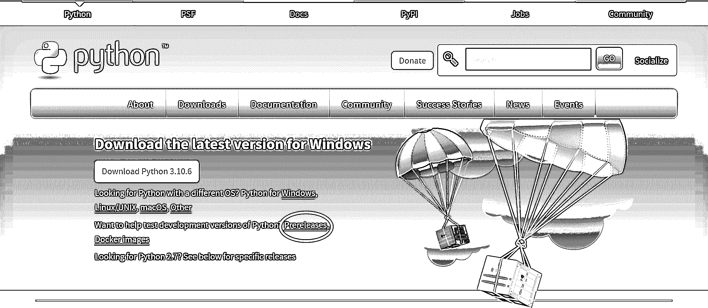

# 如何安装 Python 的预发布版本？

> 原文：<https://realpython.com/python-pre-release/>

Python 语言在不断发展。一个新的版本在每年十月到[大张旗鼓](https://realpython.com/python-news-october-2021/#a-live-python-310-release-party-on-youtube)发布[。在这些稳定的发行版之前，您可以通过安装 Python 的预发行版来预览新特性。](https://peps.python.org/pep-0602/)

全球志愿者通过更新**文档**，报告**问题**，建议和讨论**改进**，修复**bug**，实现**新特性**来开发 Python。你可以加入这项工作，并为这项工作做出贡献。

开始参与 Python 开发的最佳方式是安装并测试下一个版本的早期版本，无论是在 [alpha](https://en.wikipedia.org/wiki/Software_release_life_cycle#Alpha) 、 [beta](https://en.wikipedia.org/wiki/Software_release_life_cycle#Beta) 还是[候选发布](https://en.wikipedia.org/wiki/Software_release_life_cycle#Release_candidate)阶段。Python 3.10 和 3.11 的发布经理 Pablo Galindo Salgado 简洁地说:

> 总结一下:不管你是谁，做什么。测试测试版！([来源](https://discuss.python.org/t/the-last-3-11-beta-release-3-11-0b5-is-now-available/17693))

Python 对于许多人的工作流程和公司的基础设施来说是必不可少的。因此，社区必须在稳定发布之前彻底测试新的 Python 版本。您使用 Python 的方式与众不同，可能会发现别人没有发现的错误。安装 Python 的预发布版本并使用它对生态系统来说是有价值的。另外，这很有趣！

您很高兴安装 Python 的早期版本并尝试最新的特性。还有一个问题:**你如何安装 Python 的预发布版本？**

在本教程中，您将了解一些选项，以便接触早期版本的 Python 并预览其特性。

**免费下载:** [点击这里下载免费的示例代码](https://realpython.com/bonus/python-311-examples/)，它展示了 Python 3.11 的一些新特性。

## 简而言之:使用`pyenv`来管理 Python 的几个版本，包括最新的预发布版本

你不应该在你的电脑上使用 Python 的预发布版本作为唯一的 Python。就其本质而言，预发布版本可能不稳定，或者有可能干扰您的日常 Python 工作的错误。因此，您应该将预发布版本与常规 Python 并行安装。

在你的电脑上安装和管理几个版本的 Python 的一个很棒的工具是 [`pyenv`](https://github.com/pyenv/pyenv) 。使用`pyenv`，你可以在你的电脑上安装许多 Python 版本，并通过一个简单的命令在它们之间切换。您甚至可以设置自动调用的特定于项目的 Python 版本。

如果你还没有使用`pyenv`，那么你首先需要安装它。如何安装`pyenv`取决于您的操作系统。使用下面的切换器选择您的平台:

*   [*视窗*](#windows-1)
**   [**Linux + macOS**](#linux-macos-1)

**在 Windows 上，你应该使用[的`pyenv`为 Windows](https://github.com/pyenv-win/pyenv-win) 分叉。文档[指导你](https://github.com/pyenv-win/pyenv-win#installation)完成安装过程。查看[Windows 上的 Python 编码环境:安装指南](https://realpython.com/python-coding-setup-windows/#installing-python-with-pyenv-for-windows)，了解更多关于将`pyenv`集成到您的系统中的信息。

在 Linux 和 macOS 上，你可以按照[文档](https://github.com/pyenv/pyenv#installation)中的说明直接安装`pyenv`。一个不错的选择就是使用 [`pyenv-installer`](https://github.com/pyenv/pyenv-installer) 。

如果你想要一个关于如何使用`pyenv`的深入教程，那么看看用`pyenv` 管理多个 Python 版本的[。](https://realpython.com/intro-to-pyenv/)

**注意:**您可以通过查看版本号的末尾来识别 Python 的预发布版本。Alpha 版本以 *a* 和一个数字结尾，beta 版本以 *b* 和一个数字结尾，发布候选以 *rc* 和一个数字结尾。

在本教程中，您将看到 Python 3.11.0rc1 被用作预发布的示例。 *rc1* 表示这是 Python 3.11 的第一个发布候选。然而，随着您的跟进，您应该安装[最新的预发布](https://www.python.org/download/pre-releases/)版本。

一旦安装了`pyenv`，就可以安装 Python 的最新预发布版本了。首先，您应该更新`pyenv`及其可用 Python 版本的索引。打开终端，运行`pyenv update`:

*   [*视窗*](#windows-2)
**   [**Linux + macOS**](#linux-macos-2)*

```py
PS> pyenv update
:: [Info] ::  Mirror: https://www.python.org/ftp/python
[...]
```

进行更新可以确保您获得 Python 的最新预发布版本。你也可以[手动更新`pyenv`](https://pyenv-win.github.io/pyenv-win/#how-to-update-pyenv)。

使用`pyenv install --list`来检查哪些版本的 Python 可用。安装最新的预发布版本:

```py
PS> pyenv install 3.11.0rc1
:: [Info] ::  Mirror: https://www.python.org/ftp/python
:: [Downloading] ::  3.11.0rc1 ...
[...]
```

```py
$ pyenv update
Updating /home/realpython/.pyenv...
[...]
```

进行更新可以确保您获得 Python 的最新预发布版本。根据你安装`pyenv`的方式，你可能需要安装 [`pyenv-update`](https://github.com/pyenv/pyenv-update) 插件来运行`pyenv update`。或者，您可以通过[手动更新`pyenv`](https://github.com/pyenv/pyenv#upgrading)。

使用`pyenv install --list`来检查哪些版本的 Python 可用。这个列表会很长，因为`pyenv`支持许多不同的 Python 实现。在列表顶部附近查找未命名的版本。从中选择并安装最新的预发布版本:

```py
$ pyenv install 3.11.0rc1
Downloading Python-3.11.0rc1.tar.xz...
[...]
```

安装可能需要几分钟时间。一旦你安装了新版本，你应该试一试。`pyenv`的一个很好的特性是，它可以根据您从哪个目录启动 Python 来切换版本。创建一个可以用于测试的新目录。因为是给你玩的地方，所以你可以叫它`sandbox`:

```py
$ mkdir sandbox
$ cd sandbox/
```

创建并进入`sandbox`目录后，您可以告诉`pyenv`您想要使用新的预发布版本:

```py
$ pyenv local 3.11.0rc1
$ python --version
Python 3.11.0rc1
```

你使用`pyenv local`在这个目录中激活你的新版本。

**注意:**您可以使用 [`pip`](https://realpython.com/what-is-pip/) 将软件包安装到您的预发布版本中。但是，您可能会发现并非所有项目都支持新版本。

在安装任何依赖项之前，您应该像往常一样设置一个虚拟环境。创建虚拟环境时，请确保使用预发布版本。

在 Linux 和 macOS 上，有一个替代品集成到了`pyenv`中。您可以使用 [`pyenv-virtualenv`](https://github.com/pyenv/pyenv-virtualenv) 插件来设置虚拟环境。

使用`pyenv`非常适合尝试不同版本的 Python。新版本随时可用，该工具确保您的实验不会干扰您的日常编码任务和冒险。

虽然`pyenv`很棒，但你确实有一些更适合你工作流程的选择。在本教程的其余部分，您将了解安装预发行版的其他方法。这些方法要求您在管理编码环境时更加亲力亲为。

[*Remove ads*](/account/join/)

## 如何从 python.org 安装预发布版本？

Python 在互联网上的大本营在 python.org。您可以在那里找到 Python 的最新版本，包括预发布版本。您将找到适用于您的系统的可用版本列表:

*   [窗户](https://www.python.org/downloads/windows/)
*   [Linux](https://www.python.org/downloads/source/)
*   [苹果电脑](https://www.python.org/downloads/macos/)

从技术上讲，没有特定的 Linux 版本。相反，如果你在 Linux 上，你将从[源](https://devguide.python.org/getting-started/setup-building/)安装 Python。您也可以在其他平台上使用这些源文件。

上面列出的每个页面都显示了预发布版和稳定版。您也可以查看[专用预发布页面](https://www.python.org/download/pre-releases/)来关注这些内容。要从主页到达那里，你可以点击*下载*，然后点击*预发布*:

[](https://files.realpython.com/media/Prerelease_page.72f6725b8fcb.jpg)

一旦导航到您感兴趣的 Python 版本，您可以向下滚动到页面底部的*文件*部分。然后，下载与您的系统对应的文件。关于如何在 [Windows](https://realpython.com/installing-python/#how-to-install-from-the-full-installer) 、 [Linux](https://realpython.com/installing-python/#how-to-build-python-from-source-code) 或 [macOS](https://realpython.com/installing-python/#how-to-install-from-the-official-installer) 上进行安装的详细信息，请参见 [Python 3 安装&安装指南](https://realpython.com/installing-python/)。

从[python.org](https://www.python.org/)安装是在你的系统上安装 Python 预发布版本的一个很好的选择。但是，您需要手动管理不同版本的 Python。例如，你应该确保你的[不会覆盖其他的](https://github.com/python/cpython/#installing-multiple-versions)版本，你可以使用一个[启动器](https://github.com/brettcannon/python-launcher)来选择调用哪个版本。

在下一节中，您将看到如何安装 Python，以便它与系统的其余部分隔离开来。

## 如何使用 Docker 来测试 Python 的早期版本？

Docker 是一个虚拟化平台，通常用于可移植应用程序的开发和部署。如果您已经可以在您的系统上访问 [Docker](https://docs.docker.com/get-docker/) ，那么这是测试 Python 新版本的一个很好的选择。

Docker 使用了[图像](https://docs.docker.com/get-started/#what-is-a-container-image)和[容器](https://docs.docker.com/get-started/#what-is-a-container)的概念。Docker **映像**是一种封装了运行应用程序所需的所有资源的蓝图。一个**容器**是一个图像的可运行实例。要试用 Python 的早期版本，您可以从 Python 存储库中下载一个图像，并在您的系统上将它作为一个容器运行。

官方 Python 图片托管在 [Docker Hub](https://hub.docker.com/) 上。标签识别不同的图像。Docker Hub 还提供了一个列表，列出了哪些标签是[可用的](https://hub.docker.com/_/python)。要使用 Docker 映像，首先**从存储库中取出**，然后**运行**:

```py
$ docker pull python:3.11.0rc1-slim
3.11.0rc1-slim: Pulling from library/python
[...]
docker.io/library/python:3.11.0rc1-slim

$ docker run -it --rm python:3.11.0rc1-slim
```

这个命令让你变成了一条蟒蛇 [REPL](https://realpython.com/interacting-with-python/#using-the-python-interpreter-interactively) 。在交互使用容器时，`-it`选项是必需的，而当您退出 REPL 时，`--rm`可以方便地清理容器。

标记为`slim`的图像比常规图像小。他们缺少一些在你运行 Python 时通常不相关的工具。

**注意:**您可以选择一个特定的预发布版本，或者使用一个普通的`rc`标签指向最新的预发布版本，包括 alpha 和 beta 版本。比如拉`python:3.11-rc-slim`会给你最新的 Python 3.11 预发布版本。

通过 Docker 用 Python 运行脚本与您可能习惯的方式有些不同。更多信息请查看 Docker 中的[运行 Python 版本。像](https://realpython.com/python-versions-docker/#running-python-in-a-docker-container) [Visual Studio Code](https://realpython.com/advanced-visual-studio-code-python/#mastering-remote-development) 和 [Pycharm](https://www.jetbrains.com/help/pycharm/remote-debugging-with-product.html) 这样的编辑器为使用 Docker 容器提供了特殊的支持。

**注意:**你也可以使用不同的[官方 Docker 图像](https://gitlab.com/python-devs/ci-images/)专门为[持续集成](https://realpython.com/python-continuous-integration/)设计。这个映像包含几个不同的 Python 版本，包括最新的预发布版本。

如果您的系统上已经安装了 Docker，那么可以直接下载 Python 的最新预发布版本并使用它。在下一节中，您将看到安装 Python 早期版本的最后一种选择。

[*Remove ads*](/account/join/)

## 如何使用操作系统的软件包管理器？

每个主要平台都有不同的软件包管理器，您可以使用它们来安装软件。其中一些——例如，Windows 的 Microsoft Store 和 Ubuntu 的 deadsnakes repository 允许您安装 Python 的早期版本。用于 macOS 的 Homebrew 通常不提供 Python 的预发布版本。

[微软商店](https://apps.microsoft.com/store/)是一个应用商店，你可以在那里下载不同的工具和 Windows 应用程序。在可用的免费下载中有 Python 的预发布版本。要找到并安装这些，[搜索*Python*T5】并寻找最新版本。](https://apps.microsoft.com/store/search/python)

**注意:**如果你正在使用 Windows 并且安装了几个 Python 版本，那么你可以使用 [Windows 启动器](https://docs.python.org/3/using/windows.html#python-launcher-for-windows)来选择调用哪个版本。

如果你使用的是 Linux Ubuntu，那么 [deadsnakes](https://launchpad.net/~deadsnakes/+archive/ubuntu/ppa) 库可以提供许多不同的 Python 版本。要使用 deadsnakes，首先需要将存储库添加到您的`apt`包管理器中:

```py
$ sudo add-apt-repository ppa:deadsnakes/ppa
$ sudo apt update
```

然后，您可以搜索可用的 Python 版本并安装最新的预发布版本:

```py
$ apt search "^python3\."
python3.11/focal 3.11.0~rc1-1+focal1 amd64
 Interactive high-level object-oriented language (version 3.11)

python3.11-dev/focal 3.11.0~rc1-1+focal1 amd64
 ...

$ sudo apt install python3.11
...
```

这将在你的 Ubuntu 系统上安装最新的 Python 预发行版。你可以在[他们的档案](https://launchpad.net/~deadsnakes/+archive/ubuntu/ppa/+packages)中找到 deadsnakes 目前支持的 Python 版本的概述。

**注意:**您可以通过在可执行文件的名称中添加版本号来调用不同版本的 Python。例如，`python3.11`将运行您最后安装的 Python 3.11 的任何版本。

如果支持的话，使用操作系统的包管理器来安装最新版本的 Python 可能是一个方便的选择。

## 结论

试用 Python 的最新预发布版本非常有趣！在一些功能正式发布之前，你可以尝试一下。这对 Python 社区也有好处，因为在开发过程中出现和修复的错误和问题越多，最终版本就越稳定。

在本教程中，你已经学习了如何安装 Python 的预发布版本。最好的选择是使用`pyenv`,因为该工具也管理不同版本的 Python。这意味着您可以将最新的预发布版本与常规版本一起使用。

在尝试早期 Python 版本时，您可能会遇到奇怪的问题和错误。你可以在 [GitHub](https://github.com/python/) 上的 Python 库[报告这样的 bug](https://github.com/python/cpython/#issue-tracker-and-mailing-list)。

**免费下载:** [点击这里下载免费的示例代码](https://realpython.com/bonus/python-311-examples/)，它展示了 Python 3.11 的一些新特性。********