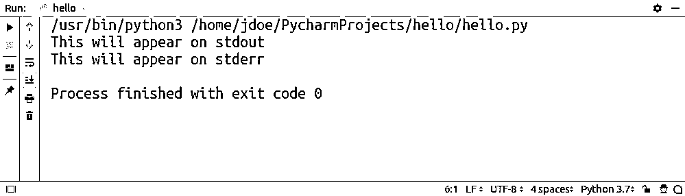
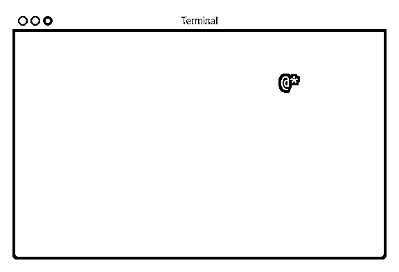
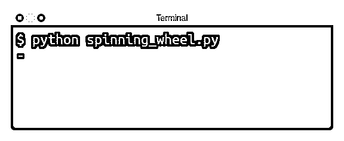

# Python print()函数指南

> 原文：<https://realpython.com/python-print/>

*立即观看**本教程有真实 Python 团队创建的相关视频课程。和文字教程一起看，加深理解:[**Python print()函数:超越基础**](/courses/python-print/)

如果你像大多数 Python 用户一样，包括我，那么你可能是通过学习`print()`开始你的 Python 之旅的。它帮助你编写了自己的`hello world`一行程序。你可以用它在屏幕上显示格式化的信息，也许还能发现一些错误。但是如果你认为这就是关于 Python 的`print()`功能的全部知识，那么你就错过了很多！

坚持读下去，充分利用这个看似枯燥、不被赏识的小功能。本教程将帮助你快速有效地使用 Python `print()`。但是，在您浏览这些部分时，请做好深入探究的准备。你可能会惊讶`print()`能提供多少！

**本教程结束时，你将知道如何:**

*   用 Python 的`print()`避免常见错误
*   处理换行符、字符编码和缓冲
*   将文本写入文件
*   在单元测试中模拟`print()`
*   在终端中构建高级用户界面

如果你是一个完全的[初学者](https://realpython.com/python-beginner-tips/)，那么你将从阅读本教程的第一部分中受益匪浅，它阐释了 Python 中打印的要点。否则，你可以随意跳过这一部分，在你认为合适的时候跳来跳去。

**注意:** `print()`是 Python 3 的一个主要补充，它取代了 Python 2 中旧的`print`语句。

有很多好的理由，你很快就会看到。虽然本教程关注的是 Python 3，但它确实展示了 Python 中的旧打印方式以供参考。

**免费奖励:** ，它向您展示 Python 3 的基础知识，如使用数据类型、字典、列表和 Python 函数。

## 简单地说就是印刷

让我们看几个用 Python 打印的真实例子。在本节结束时，你将知道调用`print()`的每一种可能的方法。或者，用程序员的行话来说，你会说你对**函数签名**很熟悉。

[*Remove ads*](/account/join/)

### 调用`print()`

使用 Python `print()`的最简单的例子只需要几次击键:

>>>

```py
>>> print()
```

您不传递任何参数，但是您仍然需要在末尾放上空括号，这告诉 Python 实际上[执行函数](https://realpython.com/lessons/example-function/)，而不仅仅是通过名称来引用它。

这将产生一个不可见的换行符，反过来会在你的屏幕上出现一个空行。可以像这样多次调用`print()`来添加垂直空格。这就好像你在文字处理器的键盘上敲击 `Enter` 一样。


一个**换行符**是一个特殊的控制字符，用来表示一行的结束(EOL)。它通常在屏幕上没有可见的表示，但一些文本编辑器可以用很少的图形显示这种不可打印的字符。

在这种情况下，“字符”这个词有点用词不当，因为换行符的长度通常不止一个字符。例如，Windows 操作系统和 HTTP 协议都用一对字符表示换行符。有时你需要考虑这些差异来设计真正可移植的程序。

要找出操作系统中的换行符，可以使用 Python 内置的`os`模块。

这将立即告诉您， **Windows** 和 **DOS** 将换行符表示为一系列`\r`后跟`\n`:

>>>

```py
>>> import os
>>> os.linesep
'\r\n'
```

在 **Unix** 、 **Linux** 和最近版本的 **macOS** 上，它是一个单独的`\n`字符:

>>>

```py
>>> import os
>>> os.linesep
'\n'
```

然而，经典的**麦克·OS X**坚持自己的“与众不同”哲学，选择了另一种表达方式:

>>>

```py
>>> import os
>>> os.linesep
'\r'
```

注意这些字符在字符串中是如何出现的。它们使用特殊的语法，在前面加一个反斜杠(`\`)来表示一个**转义字符序列**的开始。这样的序列允许表示控制字符，否则在屏幕上是看不见的。

大多数编程语言都为特殊字符预定义了一组转义序列，例如:

*   **`\\` :** 反斜杠
*   **`\b`:退格**
*   **`\t` :** 标签页
*   **`\r` :** 回车(CR)
*   **`\n` :** 换行符，又称换行(LF)

最后两个让人想起机械打字机，它需要两个独立的命令来插入一个新行。第一个命令会将滑架移回到当前行的开头，而第二个命令会将辊推进到下一行。

通过比较对应的 **ASCII 字符码**，你会发现在一个字符前面加一个反斜杠完全改变了它的意思。然而，并不是所有的字符都允许这样做，只有特殊字符才允许。

要比较 ASCII 字符代码，您可能需要使用内置的`ord()`函数:

>>>

```py
>>> ord('r')
114
>>> ord('\r')
13
```

请记住，为了形成正确的转义序列，反斜杠字符和字母之间不能有空格！

正如您刚刚看到的，不带参数调用`print()`会导致**空行**，这是一个只包含换行符的行。不要把这和空行混淆，空行根本不包含任何字符，甚至连换行符也不包含！

您可以使用 Python 的[字符串](https://realpython.com/python-strings/)来可视化这两个:

```py
'\n'  # Blank line
''    # Empty line
```

第一个有一个字符长，而第二个没有内容。

**注意:**要在 Python 中删除字符串中的换行符，使用它的`.rstrip()`方法，如下所示:

>>>

```py
>>> 'A line of text.\n'.rstrip()
'A line of text.'
```

这将去除字符串右边缘的所有尾随空白。

在一个更常见的场景中，您希望向最终用户传达一些信息。有几种方法可以实现这一点。

首先，您可以将一个字符串直接传递给`print()`:

>>>

```py
>>> print('Please wait while the program is loading...')
```

这将把消息一字不差地打印到屏幕上。


**Python 中的字符串文字**可以用单引号(`'`)或双引号(`"`)括起来。根据官方的 [PEP 8](https://www.python.org/dev/peps/pep-0008/#string-quotes) 风格指南，你应该选择一个并坚持使用它。没有区别，除非你需要一个套一个。

例如，不能在文字中使用双引号，也不能在文字中包含双引号，因为这对 Python 解释器来说是不明确的:

```py
"My favorite book is "Python Tricks""  # Wrong!
```

您要做的是将包含双引号的文本用单引号括起来:

```py
'My favorite book is "Python Tricks"'
```

同样的技巧反过来也适用:

```py
"My favorite book is 'Python Tricks'"
```

或者，您可以使用前面提到的转义字符序列，让 Python 将这些内部双引号字面上视为字符串文字的一部分:

```py
"My favorite book is \"Python Tricks\""
```

逃避是好事，但有时也会碍事。特别是，当您需要字符串包含相对较多的字面形式的反斜杠字符时。

一个经典的例子是 Windows 上的文件路径:

```py
'C:\Users\jdoe'    # Wrong!
'C:\\Users\\jdoe'
```

注意每个反斜杠字符需要用另一个反斜杠进行转义。

这在正则表达式中更加突出，由于大量使用特殊字符，正则表达式很快变得复杂:

```py
'^\\w:\\\\(?:(?:(?:[^\\\\]+)?|(?:[^\\\\]+)\\\\[^\\\\]+)*)$'
```

幸运的是，在原始字符串文字的帮助下，您可以完全关闭字符转义。只需在开始引用前加上一个`r`或`R`，现在您就可以得到这样的结果:

```py
r'C:\Users\jdoe'
r'^\w:\\(?:(?:(?:[^\\]+)?|(?:[^\\]+)\\[^\\]+)*)$'
```

那就好多了，不是吗？

在 Python 中，还有一些前缀赋予字符串文字特殊的含义，但在这里您不会深入讨论它们。

最后，您可以通过将多行字符串文字括在`'''`或`"""`之间来定义它们，它们通常被用作**文档字符串**。

这里有一个例子:

```py
"""
This is an example
of a multi-line string
in Python.
"""
```

为了避免出现新行，只需将文本放在开头`"""`之后:

```py
"""This is an example
of a multi-line string
in Python.
"""
```

您也可以使用反斜杠来删除换行符:

```py
"""\
This is an example
of a multi-line string
in Python.
"""
```

要从多行字符串中移除缩进，您可以利用内置的`textwrap`模块:

>>>

```py
>>> import textwrap
>>> paragraph = '''
...     This is an example
...     of a multi-line string
...     in Python.
...     '''
...
>>> print(paragraph)

 This is an example
 of a multi-line string
 in Python.

>>> print(textwrap.dedent(paragraph).strip())
This is an example
of a multi-line string
in Python.
```

这将为你处理好不缩进的段落。在`textwrap`中还有一些你可以在文字处理器中找到的其他有用的文本对齐功能。

其次，您可以将该消息提取到它自己的[变量](https://realpython.com/python-variables/)中，并用一个有意义的名称来增强可读性并促进代码重用:

>>>

```py
>>> message = 'Please wait while the program is loading...'
>>> print(message)
```

最后，您可以传递一个表达式，如[字符串连接](https://realpython.com/lessons/concatenating-joining-strings-python/)，在打印结果之前进行计算:

>>>

```py
>>> import os
>>> print('Hello, ' + os.getlogin() + '! How are you?')
Hello, jdoe! How are you?
```

事实上，在 Python 中有十几种格式化消息的方法。我强烈建议您看一下 Python 3.6 中引入的 [f 字符串](https://realpython.com/python-f-strings/)，因为它们提供了最简洁的语法:

>>>

```py
>>> import os
>>> print(f'Hello, {os.getlogin()}! How are you?')
```

此外，f 字符串将防止您犯一个常见的错误，即忘记类型转换串联操作数。Python 是一种强类型语言，这意味着它不允许您这样做:

>>>

```py
>>> 'My age is ' + 42
Traceback (most recent call last):
  File "<input>", line 1, in <module>
    'My age is ' + 42
TypeError: can only concatenate str (not "int") to str
```

这是错误的，因为向字符串添加数字没有意义。您需要首先显式地将数字转换为字符串，以便将它们连接在一起:

>>>

```py
>>> 'My age is ' + str(42)
'My age is 42'
```

除非你自己[处理这样的错误](https://realpython.com/courses/python-exceptions-101/)，否则 Python 解释器会通过显示一个[回溯](https://realpython.com/python-traceback/)让你知道一个问题。

**注意:** `str()`是一个全局内置函数，将一个对象转换成它的字符串表示。

您可以在任何对象上直接调用它，例如，一个数字:

>>>

```py
>>> str(3.14)
'3.14'
```

[内置数据类型](https://realpython.com/python-data-types/)有一个现成的预定义字符串表示，但是在本文的后面，您将了解如何为您的定制类提供一个。

与任何函数一样，传递文字、变量还是表达式都无关紧要。然而，与许多其他函数不同的是，`print()`将接受任何类型的东西。

到目前为止，您只查看了字符串，但是其他数据类型呢？让我们尝试不同内置类型的文字，看看会有什么结果:

>>>

```py
>>> print(42)                            # <class 'int'>
42
>>> print(3.14)                          # <class 'float'>
3.14
>>> print(1 + 2j)                        # <class 'complex'>
(1+2j)
>>> print(True)                          # <class 'bool'>
True
>>> print([1, 2, 3])                     # <class 'list'>
[1, 2, 3]
>>> print((1, 2, 3))                     # <class 'tuple'>
(1, 2, 3)
>>> print({'red', 'green', 'blue'})      # <class 'set'>
{'red', 'green', 'blue'}
>>> print({'name': 'Alice', 'age': 42})  # <class 'dict'>
{'name': 'Alice', 'age': 42}
>>> print('hello')                       # <class 'str'>
hello
```

不过要提防 [`None`](https://realpython.com/null-in-python/) 常数。尽管用于指示缺少值，但它将显示为`'None'`而不是空字符串:

>>>

```py
>>> print(None)
None
```

`print()`如何知道如何与所有这些不同类型的人共事？嗯，简单的回答是不会。它在后台隐式调用`str()`将任何对象类型转换为字符串。之后，它以统一的方式处理字符串。

在本教程的后面，您将学习如何使用这种机制来打印自定义数据类型，比如您的类。

好了，现在你可以用一个参数或者不带任何参数调用`print()`。你知道如何在屏幕上打印固定或格式化的信息。下一小节将稍微扩展一下消息格式。


为了在前一代语言中获得相同的结果，通常需要去掉文本周围的括号:

```py
# Python 2
print
print 'Please wait...'
print 'Hello, %s! How are you?' % os.getlogin()
print 'Hello, %s. Your age is %d.' % (name, age)
```

这是因为那时`print`不是一个函数，你将在[的下一节](#understanding-python-print)中看到。但是请注意，在某些情况下，Python 中的括号是多余的。把他们包括进来没有坏处，因为他们会被忽视。这是否意味着您应该像使用函数一样使用`print`语句？绝对不行！

例如，包含单个表达式或文字的括号是可选的。这两条指令在 Python 2 中产生相同的结果:

>>>

```py
>>> # Python 2
>>> print 'Please wait...'
Please wait...
>>> print('Please wait...')
Please wait...
```

圆括号实际上是表达式的一部分，而不是`print`语句的一部分。如果您的表达式恰好只包含一项，那么就好像您根本没有包含括号一样。

另一方面，将圆括号放在多个项目周围会形成一个[元组](https://realpython.com/python-lists-tuples/#python-tuples):

>>>

```py
>>> # Python 2
>>> print 'My name is', 'John'
My name is John
>>> print('My name is', 'John')
('My name is', 'John')
```

这是一个众所周知的混淆来源。事实上，您还可以通过在唯一由括号括起来的项后面附加一个逗号来获得一个元组:

>>>

```py
>>> # Python 2
>>> print('Please wait...')
Please wait...
>>> print('Please wait...',)  # Notice the comma
('Please wait...',)
```

底线是你不应该在 Python 2 中用括号调用`print`。虽然，为了完全准确，您可以在一个`__future__`导入的帮助下解决这个问题，您将在相关章节中读到更多。

[*Remove ads*](/account/join/)

### 分隔多个参数

您看到了在没有任何参数的情况下调用`print()`来产生一个空行，然后用一个参数调用它来显示固定的或格式化的消息。

然而，这个函数可以接受任意数量的**位置参数**，包括零个、一个或多个参数。这在消息格式化的常见情况下非常方便，在这种情况下，您需要将一些元素连接在一起。


参数可以通过几种方式传递给函数。一种方法是在调用函数时显式命名参数，就像这样:

>>>

```py
>>> def div(a, b):
...     return a / b
...
>>> div(a=3, b=4)
0.75
```

因为参数可以通过名称唯一地标识，所以它们的顺序并不重要。交换它们仍然会得到相同的结果:

>>>

```py
>>> div(b=4, a=3)
0.75
```

相反，没有名字的参数通过它们的位置来识别。这就是为什么**位置参数**需要严格遵循函数签名的顺序:

>>>

```py
>>> div(3, 4)
0.75
>>> div(4, 3)
1.3333333333333333
```

由于有了`*args`参数，`print()`允许任意数量的[位置参数](https://docs.python.org/dev/tutorial/controlflow.html#arbitrary-argument-lists)。

让我们来看看这个例子:

>>>

```py
>>> import os
>>> print('My name is', os.getlogin(), 'and I am', 42)
My name is jdoe and I am 42
```

`print()`将传递给它的所有四个参数连接起来，并在它们之间插入一个空格，这样就不会出现像`'My name isjdoeand I am42'`这样的消息。

注意，它还通过在将参数连接在一起之前隐式调用每个参数上的`str()`来处理适当的类型转换。回想一下上一小节，由于类型不兼容，简单的连接很容易导致错误:

>>>

```py
>>> print('My age is: ' + 42)
Traceback (most recent call last):
  File "<input>", line 1, in <module>
    print('My age is: ' + 42)
TypeError: can only concatenate str (not "int") to str
```

除了接受可变数量的位置参数，`print()`还定义了四个命名或**关键字参数**，它们是可选的，因为它们都有默认值。您可以通过从交互式解释器中调用`help(print)`来查看它们的简短文档。

现在让我们把注意力集中在`sep`上。它代表**分隔符**，默认分配一个空格(`' '`)。它确定要连接元素的值。

它必须是字符串或`None`，但后者与默认空格具有相同的效果:

>>>

```py
>>> print('hello', 'world', sep=None)
hello world
>>> print('hello', 'world', sep=' ')
hello world
>>> print('hello', 'world')
hello world
```

如果您想完全取消分隔符，您必须传递一个空字符串(`''`)来代替:

>>>

```py
>>> print('hello', 'world', sep='')
helloworld
```

您可能希望`print()`将它的参数作为单独的行加入。在这种情况下，只需传递前面描述的转义换行符:

>>>

```py
>>> print('hello', 'world', sep='\n')
hello
world
```

`sep`参数的一个更有用的例子是打印文件路径:

>>>

```py
>>> print('home', 'user', 'documents', sep='/')
home/user/documents
```

请记住，分隔符出现在元素之间，而不是元素周围，因此您需要以某种方式考虑这一点:

>>>

```py
>>> print('/home', 'user', 'documents', sep='/')
/home/user/documents
>>> print('', 'home', 'user', 'documents', sep='/')
/home/user/documents
```

具体来说，您可以在第一个位置参数中插入一个斜杠字符(`/`)，或者使用一个空字符串作为第一个参数来强制使用前导斜杠。

**注意:**小心连接列表或元组的元素。

如果至少有一个元素不是字符串，手动执行将导致众所周知的`TypeError`:

>>>

```py
>>> print(' '.join(['jdoe is', 42, 'years old']))
Traceback (most recent call last):
  File "<input>", line 1, in <module>
    print(','.join(['jdoe is', 42, 'years old']))
TypeError: sequence item 1: expected str instance, int found
```

更安全的做法是用星号操作符(`*`)解开序列，让`print()`处理类型转换:

>>>

```py
>>> print(*['jdoe is', 42, 'years old'])
jdoe is 42 years old
```

解包实际上与用列表的单个元素调用`print()`是一样的。

一个更有趣的例子是将数据导出为一种[逗号分隔值](https://realpython.com/courses/reading-and-writing-csv-files/) (CSV)格式:

>>>

```py
>>> print(1, 'Python Tricks', 'Dan Bader', sep=',')
1,Python Tricks,Dan Bader
```

这不能正确处理像转义逗号这样的边缘情况，但是对于简单的用例，应该可以。上面那行会出现在你的终端窗口中。为了将它保存到文件中，您必须重定向输出。在本节的后面，您将看到如何使用`print()`直接从 Python 向文件中写入文本。

最后，`sep`参数不仅仅局限于单个字符。可以用任意长度的字符串连接元素:

>>>

```py
>>> print('node', 'child', 'child', sep=' -> ')
node -> child -> child
```

在接下来的小节中，您将探索`print()`函数的其余关键字参数。


要在 Python 2 中打印多个元素，必须去掉它们周围的括号，就像前面一样:

>>>

```py
>>> # Python 2
>>> import os
>>> print 'My name is', os.getlogin(), 'and I am', 42
My name is jdoe and I am 42
```

另一方面，如果您保存它们，您将向`print`语句传递一个元组元素:

>>>

```py
>>> # Python 2
>>> import os
>>> print('My name is', os.getlogin(), 'and I am', 42)
('My name is', 'jdoe', 'and I am', 42)
```

此外，在 Python 2 中，没有办法改变连接元素的默认分隔符，因此一种解决方法是使用字符串插值，如下所示:

>>>

```py
>>> # Python 2
>>> import os
>>> print 'My name is %s and I am %d' % (os.getlogin(), 42)
My name is jdoe and I am 42
```

这是格式化字符串的默认方式，直到从 Python 3 中重新移植了`.format()`方法。

[*Remove ads*](/account/join/)

### 防止断线

有时你不想用一个尾随换行符来结束你的消息，这样对`print()`的后续调用将在同一行继续。典型的例子包括更新长时间运行的操作的进度或提示用户输入。在后一种情况下，您希望用户在同一行中键入答案:

```py
Are you sure you want to do this? [y/n] y
```

许多编程语言通过它们的标准库公开类似于`print()`的函数，但是它们让你决定是否添加一个换行符。例如，在 [Java](https://realpython.com/oop-in-python-vs-java/) 和 C#中，你有两个截然不同的函数，而其他语言要求你在字符串文字的末尾显式追加`\n`。

以下是这类语言中的一些语法示例:

| 语言 | 例子 |
| --- | --- |
| Perl 语言 | `print "hello world\n"` |
| C | `printf("hello world\n");` |
| C++ | `std::cout << "hello world" << std::endl;` |

相比之下，Python 的`print()`函数总是不经询问就加上`\n`，因为大多数情况下这就是你想要的。要禁用它，您可以利用另一个关键字参数`end`，它决定了行的结尾。

就语义而言，`end`参数与您之前看到的`sep`参数几乎相同:

*   必须是字符串或者`None`。
*   可以任意长。
*   它的默认值为`'\n'`。
*   如果等于`None`，它将具有与默认值相同的效果。
*   如果等于一个空字符串(`''`)，它将取消换行。

现在你明白了，当你在没有争论的情况下调用`print()`时，在引擎盖下发生了什么。因为您没有向函数提供任何位置参数，所以没有什么要连接的，所以根本没有使用默认的分隔符。然而，`end`的默认值仍然适用，并显示一个空行。

**注意:**您可能想知道为什么`end`参数有一个固定的默认值，而不是在您的操作系统上有意义的值。

嗯，打印时不用担心跨不同操作系统的换行符，因为`print()`会自动处理转换。只要记住在字符串中总是使用`\n`转义序列。

这是目前在 Python 中打印换行符最方便的方式:

>>>

```py
>>> print('line1\nline2\nline3')
line1
line2
line3
```

例如，如果您试图在 Linux 机器上强制打印特定于 Windows 的换行符，您最终会得到不完整的输出:

>>>

```py
>>> print('line1\r\nline2\r\nline3')

line3
```

另一方面，当你[用`open()`打开一个文件来读](https://realpython.com/read-write-files-python/)时，你也不需要关心换行符。该函数会将遇到的任何系统特定的换行符转换成通用的`'\n'`。同时，如果您真的需要，您可以控制在输入和输出时应该如何处理换行符。

要禁用换行符，必须通过`end`关键字参数指定一个空字符串:

```py
print('Checking file integrity...', end='')
# (...)
print('ok')
```

尽管这是两个独立的`print()`调用，可能相隔很长时间执行，但您最终只会看到一行。首先，它看起来像这样:

```py
Checking file integrity...
```

但是，在第二次调用`print()`后，屏幕上将出现相同的行，如:

```py
Checking file integrity...ok
```

与`sep`一样，您可以使用`end`通过自定义分隔符将各个片段连接成一大块文本。然而，它不是联接多个参数，而是将每个函数调用的文本追加到同一行:

```py
print('The first sentence', end='. ')
print('The second sentence', end='. ')
print('The last sentence.')
```

这三条指令将输出单行文本:

```py
The first sentence. The second sentence. The last sentence.
```

您可以混合两个关键字参数:

```py
print('Mercury', 'Venus', 'Earth', sep=', ', end=', ')
print('Mars', 'Jupiter', 'Saturn', sep=', ', end=', ')
print('Uranus', 'Neptune', 'Pluto', sep=', ')
```

您不仅得到单行文本，而且所有项目都用逗号分隔:

```py
Mercury, Venus, Earth, Mars, Jupiter, Saturn, Uranus, Neptune, Pluto
```

没有什么可以阻止您使用换行符，并在其周围添加一些额外的填充:

```py
print('Printing in a Nutshell', end='\n * ')
print('Calling Print', end='\n * ')
print('Separating Multiple Arguments', end='\n * ')
print('Preventing Line Breaks')
```

它将打印出以下文本:

```py
Printing in a Nutshell
 * Calling Print
 * Separating Multiple Arguments
 * Preventing Line Breaks
```

如您所见，`end`关键字参数将接受任意字符串。

**注意:**循环遍历文本文件中的行会保留它们自己的换行符，结合`print()`函数的默认行为会产生一个多余的换行符:

>>>

```py
>>> with open('file.txt') as file_object:
...     for line in file_object:
...         print(line)
...
Lorem ipsum dolor sit amet, consectetur adipisicing elit, sed do eiusmod

tempor incididunt ut labore et dolore magna aliqua. Ut enim ad minim veniam,

quis nostrud exercitation ullamco laboris nisi ut aliquip ex ea commodo
```

每行文本后有两个换行符。如本文前面所示，您希望在打印该行之前去掉其中一个:

```py
print(line.rstrip())
```

或者，您可以在内容中保留换行符，但自动隐藏由`print()`追加的那一行。您可以使用`end`关键字参数来实现这一点:

>>>

```py
>>> with open('file.txt') as file_object:
...     for line in file_object:
...         print(line, end='')
...
Lorem ipsum dolor sit amet, consectetur adipisicing elit, sed do eiusmod
tempor incididunt ut labore et dolore magna aliqua. Ut enim ad minim veniam,
quis nostrud exercitation ullamco laboris nisi ut aliquip ex ea commodo
```

通过用空字符串结束一行，实际上禁用了其中一个换行符。

您对 Python 中的打印越来越熟悉了，但是前面还有很多有用的信息。在接下来的小节中，您将学习如何拦截和重定向`print()`函数的输出。


在 Python 2 中防止换行符需要在表达式后面附加一个逗号:

```py
print 'hello world',
```

然而，这并不理想，因为它还增加了一个不需要的空格，在 Python 3 中，这将转化为`end=' '`而不是`end=''`。您可以使用以下代码片段对此进行测试:

```py
print 'BEFORE'
print 'hello',
print 'AFTER'
```

注意在单词`hello`和`AFTER`之间有一个空格:

```py
BEFORE
hello AFTER
```

为了得到预期的结果，您需要使用稍后解释的技巧之一，要么从`__future__`导入`print()`函数，要么退回到`sys`模块:

```py
import sys
print 'BEFORE'
sys.stdout.write('hello')
print 'AFTER'
```

这将在没有额外空间的情况下打印出正确的输出:

```py
BEFORE
helloAFTER
```

虽然使用`sys`模块可以让您控制打印到标准输出的内容，但是代码会变得有点混乱。

[*Remove ads*](/account/join/)

### 打印到文件

信不信由你，`print()`不知道如何在你的屏幕上把信息转换成文本，坦率地说，它不需要这样做。这是底层代码的工作，它们理解字节并知道如何处理它们。

`print()`是这些层上的一个抽象，提供了一个方便的接口，仅仅将实际的打印委托给一个流或者类似于**文件的对象**。流可以是磁盘上的任何文件、网络套接字，或者可能是内存缓冲区。

除此之外，操作系统还提供了三种标准流:

1.  **`stdin` :** 标准输入
2.  **`stdout` :** 标准输出
3.  **`stderr` :** 标准误差


**标准输出**是您在终端中运行各种命令行程序时看到的内容，包括您自己的 [Python 脚本](https://realpython.com/run-python-scripts/):

```py
$ cat hello.py 
print('This will appear on stdout')
$ python hello.py
This will appear on stdout
```

除非另有说明，`print()`将默认写入标准输出。但是，您可以告诉您的操作系统暂时将`stdout`换成一个文件流，这样任何输出都会在那个文件中结束，而不是在屏幕上:

```py
$ python hello.py > file.txt
$ cat file.txt
This will appear on stdout
```

这就是所谓的流重定向。

标准误差与`stdout`相似，也显示在屏幕上。尽管如此，它是一个独立的流，其目的是记录错误消息用于诊断。通过重定向它们中的一个或两个，您可以保持事物的整洁。

**注意:**要重定向`stderr`，你需要了解**文件描述符**，也称为**文件句柄**。

它们是与标准流相关联的任意数字，尽管是常数。下面，您将找到一系列 POSIX 兼容操作系统的文件描述符的摘要:

| 溪流 | 文件描述符 |
| --- | --- |
| `stdin` | Zero |
| `stdout` | one |
| `stderr` | Two |

了解这些描述符可以让您一次重定向一个或多个流:

| 命令 | 描述 |
| --- | --- |
| `./program > out.txt` | 重定向`stdout` |
| `./program 2> err.txt` | 重定向`stderr` |
| `./program > out.txt 2> err.txt` | 将`stdout`和`stderr`重定向到不同的文件 |
| `./program &> out_err.txt` | 将`stdout`和`stderr`重定向到同一个文件 |

注意`>`与`1>`相同。

一些程序使用不同的颜色来区分打印到`stdout`和`stderr`的消息:

[](https://files.realpython.com/media/pycharm-console-streams.69affb3462e4.png)

<figcaption class="figure-caption text-center">Run Tool Window in PyCharm</figcaption>

虽然`stdout`和`stderr`都是只写的，但是`stdin`是只读的。您可以将标准输入视为您的键盘，但是就像其他两个一样，您可以将`stdin`换成一个文件来读取数据。

在 Python 中，可以通过内置的`sys`模块访问所有标准流:

>>>

```py
>>> import sys
>>> sys.stdin
<_io.TextIOWrapper name='<stdin>' mode='r' encoding='UTF-8'>
>>> sys.stdin.fileno()
0
>>> sys.stdout
<_io.TextIOWrapper name='<stdout>' mode='w' encoding='UTF-8'>
>>> sys.stdout.fileno()
1
>>> sys.stderr
<_io.TextIOWrapper name='<stderr>' mode='w' encoding='UTF-8'>
>>> sys.stderr.fileno()
2
```

正如您所看到的，这些预定义的值类似于类似文件的对象，具有`mode`和`encoding`属性以及`.read()`和`.write()`方法等等。

默认情况下，`print()`通过它的`file`参数绑定到`sys.stdout`，但是你可以改变它。使用关键字参数来指示以写入或附加模式打开文件，以便消息可以直接到达该文件:

```py
with open('file.txt', mode='w') as file_object:
    print('hello world', file=file_object)
```

这将使您的代码不受操作系统级别的流重定向的影响，这可能是所希望的，也可能不是所希望的。

关于在 Python 中使用文件的更多信息，你可以查看在 Python 中读写文件的 T2。

**注意:**不要尝试使用`print()`来写二进制数据，因为它只适合文本。

直接调用二进制文件的`.write()`即可:

```py
with open('file.dat', 'wb') as file_object:
    file_object.write(bytes(4))
    file_object.write(b'\xff')
```

如果您想在标准输出中写入原始字节，那么这也会失败，因为`sys.stdout`是一个字符流:

>>>

```py
>>> import sys
>>> sys.stdout.write(bytes(4))
Traceback (most recent call last):
  File "<stdin>", line 1, in <module>
TypeError: write() argument must be str, not bytes
```

相反，您必须更深入地挖掘以获得底层字节流的句柄:

>>>

```py
>>> import sys
>>> num_bytes_written = sys.stdout.buffer.write(b'\x41\x0a')
A
```

这将打印一个大写字母`A`和一个换行符，它们对应于 ASCII 中的十进制值 65 和 10。然而，它们是用字节文字中的十六进制符号编码的。

注意`print()`对[字符编码](https://realpython.com/python-encodings-guide/)没有控制。将收到的 Unicode 字符串正确编码成字节是流的责任。在大多数情况下，您不会自己设置编码，因为默认的 UTF-8 是您想要的。如果你真的需要，也许对于遗留系统，你可以使用`open()`的`encoding`参数:

```py
with open('file.txt', mode='w', encoding='iso-8859-1') as file_object:
    print('über naïve café', file=file_object)
```

您可以提供一个驻留在计算机内存中的假文件，而不是存在于文件系统中的真实文件。稍后您将使用这种技术在单元测试中模仿`print()`:

>>>

```py
>>> import io
>>> fake_file = io.StringIO()
>>> print('hello world', file=fake_file)
>>> fake_file.getvalue()
'hello world\n'
```

如果您到了这一步，那么您在`print()`中只剩下一个关键字参数，您将在下一小节中看到。这可能是最少使用的。然而，有时候这是绝对必要的。


Python 2 中有一种特殊的语法，可以在`print`语句中用自定义文件替换默认的`sys.stdout`:

```py
with open('file.txt', mode='w') as file_object:
    print >> file_object, 'hello world'
```

因为在 Python 2 中字符串和字节用相同的`str`类型表示，所以`print`语句可以很好地处理二进制数据:

```py
with open('file.dat', mode='wb') as file_object:
    print >> file_object, '\x41\x0a'
```

虽然，字符编码有问题。Python 2 中的`open()`函数缺少`encoding`参数，这通常会导致可怕的`UnicodeEncodeError`:

>>>

```py
>>> with open('file.txt', mode='w') as file_object:
...     unicode_text = u'\xfcber na\xefve caf\xe9'
...     print >> file_object, unicode_text
... 
Traceback (most recent call last):
  File "<stdin>", line 3, in <module>
UnicodeEncodeError: 'ascii' codec can't encode character u'\xfc'...
```

注意在 Unicode 和字符串中非拉丁字符必须转义以避免语法错误。看一下这个例子:

```py
unicode_literal = u'\xfcber na\xefve caf\xe9'
string_literal = '\xc3\xbcber na\xc3\xafve caf\xc3\xa9'
```

或者，您可以根据文件顶部的 [PEP 263](https://www.python.org/dev/peps/pep-0263/) 指定源代码编码，但由于可移植性问题，这不是最佳实践:

```py
#!/usr/bin/env python2
# -*- coding: utf-8 -*-

unescaped_unicode_literal = u'über naïve café'
unescaped_string_literal = 'über naïve café'
```

最好的办法是在打印之前对 Unicode 字符串进行编码。您可以手动执行此操作:

```py
with open('file.txt', mode='w') as file_object:
    unicode_text = u'\xfcber na\xefve caf\xe9'
    encoded_text = unicode_text.encode('utf-8')
    print >> file_object, encoded_text
```

然而，更方便的选择是使用内置的`codecs`模块:

```py
import codecs

with codecs.open('file.txt', 'w', encoding='utf-8') as file_object:
    unicode_text = u'\xfcber na\xefve caf\xe9'
    print >> file_object, unicode_text
```

当你需要读或写文件时，它会进行适当的转换。

[*Remove ads*](/account/join/)

### 缓冲`print()`个呼叫

在前一小节中，您了解到`print()`将打印委托给类似文件的对象，如`sys.stdout`。但是，有些流会缓冲某些 I/O 操作以提高性能，这会造成障碍。让我们看一个例子。

假设您正在编写一个倒计时器，它应该每秒钟将剩余时间追加到同一行:

```py
3...2...1...Go!
```

您的第一次尝试可能如下所示:

```py
import time

num_seconds = 3
for countdown in reversed(range(num_seconds + 1)):
    if countdown > 0:
        print(countdown, end='...')
        time.sleep(1)
    else:
        print('Go!')
```

只要`countdown`变量大于零，代码就一直追加文本，后面没有换行，然后休眠一秒钟。最后，当倒计时结束时，它打印`Go!`并终止该行。

出乎意料的是，程序没有每秒倒计时，而是浪费地闲置了三秒钟，然后突然一次打印出整行:

[](https://files.realpython.com/media/print_countdown.ba38eb242915.gif)

这是因为在这种情况下，操作系统会缓冲对标准输出的后续写入。您需要知道有三种关于缓冲的流:

1.  无缓冲
2.  线路缓冲
3.  块缓冲的

**未缓冲**不言自明，即没有发生缓冲，所有写操作都立即生效。一个**行缓冲的**流在触发任何 I/O 调用之前等待，直到缓冲区中某处出现一个换行符，而一个**块缓冲的**流只是允许缓冲区填充到某个大小，而不管它的内容是什么。标准输出既有**行缓冲**又有**块缓冲**，取决于哪个事件先发生。

缓冲有助于减少昂贵的 I/O 调用的数量。例如，考虑通过高延迟网络发送消息。当您通过 SSH 协议连接到远程服务器执行命令时，您的每一次击键实际上都可能产生一个单独的数据包，这个数据包比它的有效负载大几个数量级。多么大的开销！等到至少输入了几个字符，然后将它们一起发送是有意义的。这就是缓冲介入的地方。

另一方面，缓冲有时会产生不希望的效果，就像你刚才看到的倒计时例子一样。要解决这个问题，您可以简单地告诉`print()`使用它的`flush`标志强制刷新流，而不需要等待缓冲区中的换行符:

```py
print(countdown, end='...', flush=True)
```

仅此而已。你的倒计时现在应该按预期工作了，但是不要相信我的话。继续测试，看看有什么不同。

恭喜你！至此，您已经看到了调用包含其所有参数的`print()`的例子。你知道它们的用途以及何时使用它们。然而，理解签名仅仅是开始。在接下来的章节中，您将会看到原因。


在 Python 2 中没有一种简单的方法来刷新流，因为`print`语句本身不允许这样做。您需要获得其较低层的句柄，这是标准输出，并直接调用它:

```py
import time
import sys

num_seconds = 3
for countdown in reversed(range(num_seconds + 1)):
    if countdown > 0:
        sys.stdout.write('%s...' % countdown)
        sys.stdout.flush()
        time.sleep(1)
    else:
        print 'Go!'
```

或者，您可以通过向 Python 解释器提供`-u`标志或者通过设置`PYTHONUNBUFFERED`环境变量来禁用标准流的缓冲:

```py
$ python2 -u countdown.py
$ PYTHONUNBUFFERED=1 python2 countdown.py
```

注意，`print()`被反向移植到 Python 2，并通过`__future__`模块可用。不幸的是，它没有附带`flush`参数:

>>>

```py
>>> from __future__ import print_function
>>> help(print)
Help on built-in function print in module __builtin__:

print(...)
 print(value, ..., sep=' ', end='\n', file=sys.stdout)
```

你现在看到的是`print()`函数的**文档串**。您可以使用内置的`help()`函数在 Python 中显示各种对象的文档字符串。

### 打印自定义数据类型

到目前为止，您只处理了诸如字符串和数字之类的内置数据类型，但是您经常想要打印自己的抽象数据类型。让我们来看看定义它们的不同方法。

对于没有任何逻辑的简单对象，其目的是携带数据，您通常会利用标准库中提供的 [`namedtuple`](https://realpython.com/python-namedtuple/) 。命名元组有现成的简洁文本表示:

>>>

```py
>>> from collections import namedtuple
>>> Person = namedtuple('Person', 'name age')
>>> jdoe = Person('John Doe', 42)
>>> print(jdoe)
Person(name='John Doe', age=42)
```

只要保存数据就足够了，这很好，但是为了给`Person`类型添加行为，您最终需要定义一个类。看一下这个例子:

```py
class Person:
    def __init__(self, name, age):
        self.name, self.age = name, age
```

如果您现在创建一个`Person`类的实例并尝试打印它，您将得到这个奇怪的输出，它与对应的`namedtuple`完全不同:

>>>

```py
>>> jdoe = Person('John Doe', 42)
>>> print(jdoe)
<__main__.Person object at 0x7fcac3fed1d0>
```

它是对象的默认表示，包括它们在内存中的地址、相应的类名和定义它们的模块。您将很快修复这个问题，但是为了记录，作为一个快速的解决方法，您可以通过[继承](https://realpython.com/inheritance-composition-python/)来组合`namedtuple`和一个自定义类:

```py
from collections import namedtuple

class Person(namedtuple('Person', 'name age')):
    pass
```

您的`Person`类已经变成了一种具有两个属性的专门的`namedtuple`,您可以对其进行定制。

**注意:**在 Python 3 中， [`pass`语句](https://realpython.com/python-pass/)可以替换为[省略号](https://realpython.com/python-ellipsis/) ( `...`)文字来表示占位符:

```py
def delta(a, b, c):
    ...
```

这可以防止解释器由于缺少缩进的代码块而引发`IndentationError`。

这比普通的`namedtuple`要好，因为你不仅可以免费获得打印权，还可以向类中添加自定义方法和属性。然而，它解决了一个问题，同时引入了另一个问题。记住元组，包括命名元组，在 Python 中是不可变的，所以一旦创建就不能更改它们的值。

的确，设计不可变的数据类型是可取的，但在许多情况下，您会希望它们允许变化，所以您又回到了常规类。

**注意:**继其他语言和框架之后，Python 3.7 引入了[数据类](https://realpython.com/python-data-classes/)，你可以把它想象成可变元组。这样，您可以两全其美:

>>>

```py
>>> from dataclasses import dataclass
>>> @dataclass
... class Person:
...     name: str
...     age: int
...     
...     def celebrate_birthday(self):
...         self.age += 1
... 
>>> jdoe = Person('John Doe', 42)
>>> jdoe.celebrate_birthday()
>>> print(jdoe)
Person(name='John Doe', age=43)
```

在 Python 3.6 中定义了[变量注释](https://www.python.org/dev/peps/pep-0526/)的语法，这是指定具有相应类型的类字段所必需的。

从前面的小节中，您已经知道了`print()`隐式调用内置的`str()`函数来将其位置参数转换成字符串。事实上，对常规`Person`类的实例手动调用`str()`会产生与打印它相同的结果:

>>>

```py
>>> jdoe = Person('John Doe', 42)
>>> str(jdoe)
'<__main__.Person object at 0x7fcac3fed1d0>'
```

反过来，`str()`在类体内寻找两个**神奇方法**中的一个，这通常是你实现的。如果它找不到，那么它就退回到难看的默认表示。这些神奇的方法按搜索顺序排列如下:

1.  `def __str__(self)`
2.  `def __repr__(self)`

建议第一个函数返回一个简短的、人类可读的文本，其中包含来自最相关属性的信息。毕竟，您不希望在打印对象时暴露敏感数据，如用户密码。

然而，另一个应该提供关于一个对象的完整信息，允许从一个字符串中恢复它的状态。理想情况下，它应该返回有效的 Python 代码，这样你就可以直接把它传递给 [`eval()`](https://realpython.com/python-eval-function/) :

>>>

```py
>>> repr(jdoe)
"Person(name='John Doe', age=42)"
>>> type(eval(repr(jdoe)))
<class '__main__.Person'>
```

注意另一个内置函数`repr()`的使用，它总是试图在一个对象中调用`.__repr__()`，但是如果它没有找到那个方法，就退回到默认的表示。

**注意:**即使`print()`本身使用`str()`进行类型转换，一些复合数据类型也会委托其成员调用`repr()`。例如，列表和元组就会发生这种情况。

考虑这个类的两个神奇方法，它们返回同一对象的可选字符串表示:

```py
class User:
    def __init__(self, login, password):
        self.login = login
        self.password = password

    def __str__(self):
        return self.login

    def __repr__(self):
        return f"User('{self.login}', '{self.password}')"
```

如果你打印一个`User`类的对象，那么你将看不到密码，因为`print(user)`将调用`str(user)`，后者最终将调用`user.__str__()`:

>>>

```py
>>> user = User('jdoe', 's3cret')
>>> print(user)
jdoe
```

但是，如果您将相同的`user`变量放在方括号中，那么密码将变得清晰可见:

>>>

```py
>>> print([user])
[User('jdoe', 's3cret')]
```

这是因为序列，比如列表和元组，实现了它们的`.__str__()`方法，所以它们的所有元素首先用`repr()`进行转换。

如果内置的数据类型都不能满足您的需求，Python 在定义自己的数据类型方面给了您很大的自由。其中一些，比如命名元组和数据类，提供了看起来不错的字符串表示，而不需要您做任何工作。尽管如此，为了获得最大的灵活性，您必须定义一个类并覆盖上面描述的它的神奇方法。


从 Python 2 开始，`.__str__()`和`.__repr__()`的语义没有改变，但是你必须记住，那时字符串只不过是美化了的字节数组。要将对象转换成适当的 Unicode，这是一种独立的数据类型，您必须提供另一种神奇的方法:`.__unicode__()`。

下面是 Python 2 中相同的`User`类的一个例子:

```py
class User(object):
    def __init__(self, login, password):
        self.login = login
        self.password = password

    def __unicode__(self):
        return self.login

    def __str__(self):
        return unicode(self).encode('utf-8')

    def __repr__(self):
        user = u"User('%s', '%s')" % (self.login, self.password)
        return user.encode('unicode_escape')
```

如您所见，这个实现通过调用内置的`unicode()`函数来委托一些工作以避免重复。

`.__str__()`和`.__repr__()`方法都必须返回字符串，因此它们将 Unicode 字符编码成称为**字符集**的特定字节表示。UTF-8 是最广泛和最安全的编码，而`unicode_escape`是一个特殊的常量，用来表示时髦的字符，如`é`，作为普通 ASCII 中的转义序列，如`\xe9`。

`print`语句在类中寻找神奇的`.__str__()`方法，所以选择的**字符集**必须对应终端使用的那个。例如，DOS 和 Windows 的默认编码是 CP 852 而不是 UTF-8，所以运行这个会导致一个`UnicodeEncodeError`或者甚至是乱码输出:

>>>

```py
>>> user = User(u'\u043d\u0438\u043a\u0438\u0442\u0430', u's3cret')
>>> print user
đŻđŞđ║đŞĐéđ░
```

然而，如果你在一个 UTF 8 编码的系统上运行同样的代码，你会得到一个流行的俄罗斯名字的正确拼写:

>>>

```py
>>> user = User(u'\u043d\u0438\u043a\u0438\u0442\u0430', u's3cret')
>>> print user
никита
```

建议尽早将字符串转换为 Unicode，例如，当您从文件中读取数据时，并在代码中的任何地方一致地使用它。同时，在将 Unicode 呈现给用户之前，您应该将它编码回所选的字符集。

在 Python 2 中，您似乎对对象的字符串表示有更多的控制权，因为 Python 3 中不再有神奇的`.__unicode__()`方法。您可能会问自己，在 Python 3 中，是否有可能将一个对象转换成它的字节字符串表示，而不是 Unicode 字符串。有一个特殊的`.__bytes__()`方法可以做到这一点:

>>>

```py
>>> class User(object):
...     def __init__(self, login, password):
...         self.login = login
...         self.password = password
...     
...     def __bytes__(self):  # Python 3
...         return self.login.encode('utf-8')
...
>>> user = User(u'\u043d\u0438\u043a\u0438\u0442\u0430', u's3cret')
>>> bytes(user)
b'\xd0\xbd\xd0\xb8\xd0\xba\xd0\xb8\xd1\x82\xd0\xb0'
```

在实例上使用内置的`bytes()`函数将调用委托给相应类中定义的`__bytes__()`方法。

[*Remove ads*](/account/join/)

## 了解 Python `print()`

在这一点上，你知道**如何**很好地使用`print()`，但是知道**是什么**会让你更加有效和有意识地使用它。阅读完这一节后，您将理解 Python 中的打印在过去几年中是如何改进的。

### 打印是 Python 3 中的一个函数

您已经看到了`print()`是 Python 3 中的一个函数。更具体地说，它是一个内置函数，这意味着您不需要从任何地方导入它:

>>>

```py
>>> print
<built-in function print>
```

它总是在全局命名空间中可用，因此您可以直接调用它，但是您也可以通过标准库中的模块来访问它:

>>>

```py
>>> import builtins
>>> builtins.print
<built-in function print>
```

这样，您可以避免自定义函数的名称冲突。假设您想让**重新定义** `print()`，这样它就不会追加一个尾随换行符。同时，您希望将原始函数重命名为类似于`println()`的名称:

>>>

```py
>>> import builtins
>>> println = builtins.print
>>> def print(*args, **kwargs):
...     builtins.print(*args, **kwargs, end='')
...
>>> println('hello')
hello
>>> print('hello\n')
hello
```

现在你有了两个独立的打印函数，就像 Java 编程语言一样。稍后，您还将在[模拟部分](#mocking-python-print-in-unit-tests)中定义自定义的`print()`函数。另外，请注意，如果`print()`不是一个函数，您将无法首先覆盖它。

另一方面，`print()`不是数学意义上的函数，因为除了隐式的`None`之外，它不返回任何有意义的值:

>>>

```py
>>> value = print('hello world')
hello world
>>> print(value)
None
```

事实上，这些函数是程序或子程序，你调用它们来实现某种副作用，最终是改变一个全局状态。在`print()`的例子中，副作用是在标准输出上显示消息或者写入文件。

因为`print()`是一个函数，所以它有一个定义明确的签名，并且具有已知的属性。您可以使用您选择的编辑器快速找到它的**文档**，而不必记住一些执行特定任务的奇怪语法。

此外，函数更容易**扩展**。向函数中添加新特性就像添加另一个关键字参数一样简单，而更改语言来支持新特性要麻烦得多。例如，考虑流重定向或缓冲区刷新。

作为函数的另一个好处是**可组合性**。在 Python 中，函数是所谓的[一级对象](https://realpython.com/lessons/functions-first-class-objects-python/)或[一级公民](https://realpython.com/lessons/functions-are-first-class-citizens-python/)，这是一种奇特的说法，它们就像字符串或数字一样是值。这样，你可以将一个函数赋给一个变量，将它传递给另一个函数，甚至从另一个函数返回一个函数。`print()`在这方面没什么不同。例如，您可以利用它进行依赖注入:

```py
def download(url, log=print):
    log(f'Downloading {url}')
    # ...

def custom_print(*args):
    pass  # Do not print anything

download('/js/app.js', log=custom_print)
```

在这里，`log`参数让您注入一个回调函数，该函数默认为`print()`，但可以是任何可调用的函数。在这个例子中，通过用一个什么也不做的虚拟函数替换`print()`，打印被完全禁用。

**注意:**一个**依赖**是另一段代码需要的任何一段代码。

**依赖注入**是一种在代码设计中使用的技术，它使代码更加可测试、可重用和可扩展。你可以通过抽象接口间接引用依赖关系，并以**推**而不是**拉**的方式提供依赖关系来实现。

互联网上流传着一个关于依赖注入的有趣解释:

> 五岁儿童依赖注射
> 
> 当你自己去冰箱里拿东西的时候，你会引起麻烦。你可能会开着门，你可能会得到妈妈或爸爸不想让你得到的东西。你甚至可能在寻找我们根本没有或已经过期的东西。
> 
> 你应该做的是陈述一个需求，“我午餐需要喝点东西”，然后我们会确保你坐下来吃饭时有东西吃。
> 
> 约翰·蒙施，2009 年 10 月 28 日。 ( [来源](https://stackoverflow.com/a/1638961))

组合允许你将一些功能组合成一个新的同类功能。让我们通过指定一个定制的`error()`函数来看看这一点，该函数打印到标准的错误流，并以给定的日志级别作为所有消息的前缀:

>>>

```py
>>> from functools import partial
>>> import sys
>>> redirect = lambda function, stream: partial(function, file=stream)
>>> prefix = lambda function, prefix: partial(function, prefix)
>>> error = prefix(redirect(print, sys.stderr), '[ERROR]')
>>> error('Something went wrong')
[ERROR] Something went wrong
```

该自定义功能使用**部分功能**来达到预期效果。这是从[函数式编程](https://realpython.com/python-functional-programming/)范例中借用的一个高级概念，所以你现在不需要太深入那个主题。不过，如果你对这个话题感兴趣，我推荐你看一下 [`functools`](https://pymotw.com/3/functools/) 模块。

与语句不同，函数是值。这意味着你可以将它们与**表情**，特别是[**表情**](https://realpython.com/python-lambda/)**混合使用。您可以创建一个匿名的 lambda 表达式来调用它，而不是定义一个完整的函数来替换`print()`:**

**>>>

```py
>>> download('/js/app.js', lambda msg: print('[INFO]', msg))
[INFO] Downloading /js/app.js
```

然而，因为 lambda 表达式是就地定义的，所以无法在代码的其他地方引用它。

**注意:**在 Python 中，你不能把语句，比如赋值、条件语句、循环等等，放在一个**匿名 lambda 函数**中。必须是单个表达式！

另一种表达式是三元条件表达式:

>>>

```py
>>> user = 'jdoe'
>>> print('Hi!') if user is None else print(f'Hi, {user}.')
Hi, jdoe.
```

Python 既有[条件语句](https://realpython.com/python-conditional-statements/)，又有[条件表达式](https://realpython.com/python-conditional-statements/#conditional-expressions-pythons-ternary-operator)。后者被计算为一个可以赋给变量或传递给函数的单个值。在上面的例子中，您感兴趣的是副作用而不是值，值等于`None`，所以您可以忽略它。

如您所见，函数提供了一个优雅且可扩展的解决方案，这与语言的其他部分是一致的。在下一小节中，您将会发现没有将`print()`作为一个函数是如何引起很多麻烦的。

[*Remove ads*](/account/join/)

### `print`是 Python 2 中的一个语句

**语句**是一条指令，在执行时可能会引起副作用，但永远不会计算出一个值。换句话说，您不能打印一条语句，也不能将它赋给这样的变量:

```py
result = print 'hello world'
```

这是 Python 2 中的语法错误。

以下是 Python 中语句的几个例子:

*   **赋值:** `=`
*   **有条件:** `if`
*   **循环:** `while`
*   **断言** : `assert`

**注:** [Python 3.8](https://realpython.com/python38-new-features/) 带来一个有争议的**海象运算符** ( `:=`)，是一个[赋值表达式](https://www.python.org/dev/peps/pep-0572/)。有了它，你可以计算一个表达式，同时把结果赋给一个变量，甚至在另一个表达式中！

看一下这个例子，它调用一个昂贵的函数一次，然后重用结果进行进一步的计算:

```py
# Python 3.8+
values = [y := f(x), y**2, y**3]
```

这对于简化代码而不损失其效率是很有用的。通常，高性能代码会更加冗长:

```py
y = f(x)
values = [y, y**2, y**3]
```

这种新语法背后的争议引起了很多争论。大量的负面评论和激烈的争论最终导致吉多·范·罗苏姆从仁慈的终身独裁者或 BDFL 的位置上退下来。

语句通常由保留的关键字组成，如`if`、`for`或`print`，它们在语言中有固定的含义。你不能用它们来命名你的变量或其他符号。这就是为什么在 Python 2 中不可能重新定义或模仿`print`语句的原因。你被你所得到的卡住了。

此外，您不能从匿名函数打印，因为 lambda 表达式不接受语句:

>>>

```py
>>> lambda: print 'hello world'
  File "<stdin>", line 1
    lambda: print 'hello world'
                ^
SyntaxError: invalid syntax
```

`print`语句的语法不明确。有时您可以在消息周围添加括号，它们完全是可选的:

>>>

```py
>>> print 'Please wait...'
Please wait...
>>> print('Please wait...')
Please wait...
```

在其他时候，他们会更改消息的打印方式:

>>>

```py
>>> print 'My name is', 'John'
My name is John
>>> print('My name is', 'John')
('My name is', 'John')
```

由于不兼容的类型，字符串连接可能会引发一个`TypeError`，您必须手动处理，例如:

>>>

```py
>>> values = ['jdoe', 'is', 42, 'years old']
>>> print ' '.join(map(str, values))
jdoe is 42 years old
```

与 Python 3 中的类似代码相比，Python 3 利用了序列解包:

>>>

```py
>>> values = ['jdoe', 'is', 42, 'years old']
>>> print(*values)  # Python 3
jdoe is 42 years old
```

对于诸如刷新缓冲区或流重定向之类的常见任务，没有任何关键字参数。相反，您需要记住古怪的语法。即使内置的`help()`函数对于`print`语句也没有多大帮助:

>>>

```py
>>> help(print)
  File "<stdin>", line 1
    help(print)
             ^
SyntaxError: invalid syntax
```

尾部换行符的移除并不完全正确，因为它增加了一个不需要的空格。你不能将多个`print`语句组合在一起，而且，最重要的是，你必须格外注意字符编码。

问题不胜枚举。如果你很好奇，你可以跳回到[的前一节](#printing-in-a-nutshell)并寻找 Python 2 中更详细的语法解释。

但是，您可以用一种简单得多的方法来缓解其中的一些问题。原来`print()`函数被反向移植是为了方便向 Python 3 的迁移。您可以从一个特殊的`__future__`模块中导入它，该模块公开了在以后的 Python 版本中发布的一些语言特性。

**注意:**您可以导入未来的函数以及内置的语言结构，比如`with`语句。

要确切了解您可以使用哪些功能，请查看该模块:

>>>

```py
>>> import __future__
>>> __future__.all_feature_names
['nested_scopes',
 'generators',
 'division',
 'absolute_import',
 'with_statement',
 'print_function',
 'unicode_literals']
```

你也可以调用`dir(__future__)`，但是那会显示模块的许多无趣的内部细节。

要在 Python 2 中启用`print()`函数，您需要在源代码的开头添加以下 import 语句:

```py
from __future__ import print_function
```

从现在开始，`print`语句不再可用，但是您可以使用`print()`函数。注意，它与 Python 3 中的函数不同，因为它缺少了`flush`关键字参数，但其余参数是相同的。

除此之外，它不会让您放弃正确管理字符编码。

下面是一个在 Python 2 中调用`print()`函数的例子:

>>>

```py
>>> from __future__ import print_function
>>> import sys
>>> print('I am a function in Python', sys.version_info.major)
I am a function in Python 2
```

现在，您已经了解了 Python 中的打印是如何发展的，最重要的是，理解了为什么这些向后不兼容的变化是必要的。了解这一点肯定会帮助你成为一名更好的 Python 程序员。

[*Remove ads*](/account/join/)

## 使用样式打印

如果你认为打印只是点亮屏幕上的像素，那么从技术上来说你是对的。但是，有办法让它看起来很酷。在本节中，您将了解如何格式化复杂的数据结构、添加颜色和其他装饰、构建界面、使用动画，甚至播放带有文本的声音！

### 漂亮打印嵌套数据结构

计算机语言允许你以结构化的方式来表示数据和可执行代码。然而，与 Python 不同的是，大多数语言在使用空格和格式方面给了你很大的自由度。这可能是有用的，例如在压缩中，但有时会导致代码可读性较差。

漂亮印刷就是让一段数据或代码看起来更吸引人，以便更容易理解。这是通过缩进某些行、插入新行、重新排序元素等等来实现的。

Python 在其标准库中附带了`pprint`模块，这将帮助您漂亮地打印不适合单行的大型数据结构。因为它以更人性化的方式打印，许多流行的 [REPL](https://realpython.com/interacting-with-python/) 工具，包括 [JupyterLab 和 IPython](https://realpython.com/jupyter-notebook-introduction/) ，默认使用它来代替常规的`print()`函数。

**注意:**要在 IPython 中切换漂亮打印，发出以下命令:

>>>

```py
In [1]: %pprint
Pretty printing has been turned OFF
In [2]: %pprint
Pretty printing has been turned ON
```

这是 IPython 中**魔法**的一个例子。有很多以百分号(`%`)开头的内置命令，但是您可以在 [PyPI](https://pypi.org/) 上找到更多，甚至可以创建自己的命令。

如果您不介意无法访问原始的`print()`函数，那么您可以使用导入重命名在代码中用`pprint()`替换它:

>>>

```py
>>> from pprint import pprint as print
>>> print
<function pprint at 0x7f7a775a3510>
```

就我个人而言，我喜欢两个功能都唾手可得，所以我宁愿使用类似于`pp`的东西作为简短的别名:

```py
from pprint import pprint as pp
```

乍一看，这两个功能几乎没有任何区别，在某些情况下，实际上没有任何区别:

>>>

```py
>>> print(42)
42
>>> pp(42)
42
>>> print('hello')
hello
>>> pp('hello')
'hello'  # Did you spot the difference?
```

这是因为`pprint()`调用`repr()`而不是通常的`str()`来进行类型转换，所以如果你愿意的话，你可以将其输出评估为 Python 代码。当您开始向它提供更复杂的数据结构时，差异就变得很明显了:

>>>

```py
>>> data = {'powers': [x**10 for x in range(10)]}
>>> pp(data)
{'powers': [0,
 1,
 1024,
 59049,
 1048576,
 9765625,
 60466176,
 282475249,
 1073741824,
 3486784401]}
```

该函数应用合理的格式来提高可读性，但是您可以使用几个参数对其进行进一步定制。例如，您可以通过在给定级别下显示省略号来限制深度嵌套的层次结构:

>>>

```py
>>> cities = {'USA': {'Texas': {'Dallas': ['Irving']}}}
>>> pp(cities, depth=3)
{'USA': {'Texas': {'Dallas': [...]}}}
```

普通的`print()`也使用省略号，但用于显示递归数据结构，形成一个循环，以避免堆栈溢出错误:

>>>

```py
>>> items = [1, 2, 3]
>>> items.append(items)
>>> print(items)
[1, 2, 3, [...]]
```

然而，`pprint()`通过包含自引用对象的唯一标识，使其更加明确:

>>>

```py
>>> pp(items)
[1, 2, 3, <Recursion on list with id=140635757287688>]
>>> id(items)
140635757287688
```

列表中的最后一个元素是与整个列表相同的对象。

**注意:**递归或非常大的数据集也可以使用`reprlib`模块处理:

>>>

```py
>>> import reprlib
>>> reprlib.repr([x**10 for x in range(10)])
'[0, 1, 1024, 59049, 1048576, 9765625, ...]'
```

该模块支持大多数内置类型，由 Python 调试器使用。

`pprint()`打印前自动为您排序词典关键字，以便进行一致的比较。当您比较字符串时，您通常不关心序列化属性的特定顺序。无论如何，在序列化之前比较实际的字典总是最好的。

字典经常表示 [JSON 数据](https://realpython.com/python-json/)，在互联网上被广泛使用。为了正确地将字典序列化为有效的 JSON 格式的字符串，可以利用`json`模块。它也有漂亮的打印功能:

>>>

```py
>>> import json
>>> data = {'username': 'jdoe', 'password': 's3cret'}
>>> ugly = json.dumps(data)
>>> pretty = json.dumps(data, indent=4, sort_keys=True)
>>> print(ugly)
{"username": "jdoe", "password": "s3cret"}
>>> print(pretty)
{
 "password": "s3cret",
 "username": "jdoe"
}
```

但是，请注意，您需要自己处理打印，因为这不是您通常想要做的事情。类似地，`pprint`模块有一个额外的`pformat()`函数，它返回一个字符串，以防您不得不做一些除了打印之外的事情。

令人惊讶的是，`pprint()`的签名一点也不像`print()`函数的签名。你甚至不能传递一个以上的位置参数，这表明它有多注重打印数据结构。

[*Remove ads*](/account/join/)

### 用 ANSI 转义序列添加颜色

随着个人电脑变得越来越复杂，他们有更好的图形和显示更多的颜色。然而，不同的供应商对控制它的 API 设计有他们自己的想法。几十年前，当美国国家标准协会的人决定通过定义 [ANSI 转义码](https://en.wikipedia.org/wiki/ANSI_escape_code)来统一它时，这种情况发生了变化。

今天的大多数终端模拟器在某种程度上支持这个标准。直到最近，Windows 操作系统还是一个明显的例外。因此，如果你想要最好的可移植性，使用 Python 中的 [`colorama`](https://pypi.org/project/colorama/) 库。它将 ANSI 代码翻译成 Windows 中相应的代码，同时在其他操作系统中保持不变。

要检查您的终端是否理解 ANSI 转义序列的子集，例如，与颜色相关的子集，您可以尝试使用以下命令:

```py
$ tput colors
```

我在 Linux 上的默认终端说它可以显示 256 种不同的颜色，而 xterm 只给了我 8 种。如果不支持颜色，该命令将返回一个负数。

ANSI 转义序列就像是终端的标记语言。在 HTML 中，你使用标签，如`<b>`或`<i>`，来改变元素在文档中的外观。这些标签与您的内容混合在一起，但它们本身是不可见的。同样，只要终端识别出转义码，它们就不会出现在终端中。否则，它们会以文字形式出现，就好像你在查看网站的源代码一样。

顾名思义，序列必须以不可打印的 `Esc` 字符开头，其 ASCII 值为 27，有时用十六进制的`0x1b`或八进制的`033`表示。您可以使用 Python 数字文本来快速验证它确实是同一个数字:

>>>

```py
>>> 27 == 0x1b == 0o33
True
```

此外，您可以在 shell 中使用`\e`转义序列来获得它:

```py
$ echo -e "\e"
```

最常见的 ANSI 转义序列采用以下形式:

| 元素 | 描述 | 例子 |
| --- | --- | --- |
| T2`Esc` | 不可打印的转义字符 | `\033` |
| `[` | 左方括号 | `[` |
| 数字代码 | 用`;`分隔的一个或多个数字 | `0` |
| 字符二进制码 | 大写或小写字母 | `m` |

**数字代码**可以是一个或多个用分号分隔的数字，而**字符代码**只是一个字母。它们的具体含义由 ANSI 标准定义。例如，要重置所有格式，您可以键入以下命令之一，该命令使用代码 0 和字母`m`:

```py
$ echo -e "\e[0m"
$ echo -e "\x1b[0m"
$ echo -e "\033[0m"
```

另一方面，您有复合代码值。要使用 RGB 通道设置前景和背景，假设您的终端支持 24 位深度，您可以提供多个数字:

```py
$ echo -e "\e[38;2;0;0;0m\e[48;2;255;255;255mBlack on white\e[0m"
```

不仅仅是文本颜色可以用 ANSI 转义码来设置。例如，您可以清除和滚动终端窗口，更改其背景，移动光标，使文本闪烁或用下划线装饰它。

在 Python 中，您可能会编写一个 helper 函数来允许将任意代码包装到一个序列中:

>>>

```py
>>> def esc(code):
...     return f'\033[{code}m'
...
>>> print(esc('31;1;4') + 'really' + esc(0) + ' important')
```

这将使单词`really`以红色、粗体和带下划线的字体显示:

[](https://files.realpython.com/media/ansi.21ed85878eb9.png)

然而，在 ANSI 转义码上有更高层次的抽象，比如前面提到的`colorama`库，以及用于在控制台中构建用户界面的工具。

[*Remove ads*](/account/join/)

### 构建控制台用户界面

虽然玩 ANSI 转义码毫无疑问非常有趣，但在现实世界中，您更愿意用更抽象的构建块来组装用户界面。有几个库提供了如此高水平的终端控制，但是 [`curses`](https://docs.python.org/3/howto/curses.html) 似乎是最受欢迎的选择。

**注意:**要在 Windows 中使用`curses`库，需要安装第三方包:

```py
C:\> pip install windows-curses
```

这是因为`curses`在 Python Windows 发行版的标准库中不可用。

首先，它允许你用独立的图形部件来思考，而不是用一团文本。此外，你在表达自己内心的艺术家方面获得了很大的自由，因为这真的就像在画一张空白的画布。该库隐藏了必须处理不同终端的复杂性。除此之外，它还非常支持键盘事件，这对于编写视频游戏可能很有用。

做一个复古的贪吃蛇游戏怎么样？让我们创建一个 Python 蛇模拟器:

[](https://files.realpython.com/media/snake.a9589582b58a.gif)

首先，你需要导入`curses`模块。因为它会修改正在运行的终端的状态，所以处理错误并优雅地恢复之前的状态非常重要。您可以手动完成这项工作，但是这个库为您的主函数提供了一个方便的包装器:

```py
import curses

def main(screen):
    pass

if __name__ == '__main__':
    curses.wrapper(main)
```

注意，该函数必须接受对 screen 对象的引用，也称为`stdscr`，稍后您将使用它进行额外的设置。

如果你现在运行这个程序，你不会看到任何效果，因为它会立即终止。但是，您可以添加一个小延迟来先睹为快:

```py
import time, curses

def main(screen):
    time.sleep(1)

if __name__ == '__main__':
    curses.wrapper(main)
```

这次屏幕完全空白了一秒钟，但光标仍在闪烁。要隐藏它，只需调用模块中定义的配置函数之一:

```py
import time, curses

def main(screen):
 curses.curs_set(0)  # Hide the cursor    time.sleep(1)

if __name__ == '__main__':
    curses.wrapper(main)
```

让我们将蛇定义为屏幕坐标中的一系列点:

```py
snake = [(0, i) for i in reversed(range(20))]
```

蛇头总是列表中的第一个元素，而尾巴是最后一个。蛇的初始形状是水平的，从屏幕的左上角开始，面向右边。当它的 y 坐标保持为零时，它的 x 坐标从头到尾递减。

要绘制蛇，您将从头部开始，然后跟随其余部分。每个线段都带有`(y, x)`坐标，因此您可以对它们进行解包:

```py
# Draw the snake
screen.addstr(*snake[0], '@')
for segment in snake[1:]:
    screen.addstr(*segment, '*')
```

同样，如果您现在运行这段代码，它不会显示任何内容，因为您必须在之后显式刷新屏幕:

```py
import time, curses

def main(screen):
    curses.curs_set(0)  # Hide the cursor

    snake = [(0, i) for i in reversed(range(20))]

    # Draw the snake
    screen.addstr(*snake[0], '@')
    for segment in snake[1:]:
        screen.addstr(*segment, '*')

 screen.refresh()    time.sleep(1)

if __name__ == '__main__':
    curses.wrapper(main)
```

您希望在四个方向之一移动蛇，这四个方向可以定义为向量。最终，方向会随着箭头按键而改变，所以你可以把它和图书馆的键码联系起来:

```py
directions = {
    curses.KEY_UP: (-1, 0),
    curses.KEY_DOWN: (1, 0),
    curses.KEY_LEFT: (0, -1),
    curses.KEY_RIGHT: (0, 1),
}

direction = directions[curses.KEY_RIGHT]
```

蛇是如何移动的？结果是，只有它的头部真正移动到新的位置，而所有其他部分都向它移动。在每一步中，除了头部和尾部，几乎所有的部分都保持不变。假设这条蛇不再生长，你可以去掉它的尾巴，在列表的开头插入一个新的头部:

```py
# Move the snake
snake.pop()
snake.insert(0, tuple(map(sum, zip(snake[0], direction))))
```

要获得头部的新坐标，需要添加方向向量。然而，在 Python 中添加元组会产生更大的元组，而不是相应向量分量的代数和。解决这个问题的一种方法是使用内置的[`zip()`](https://realpython.com/python-zip-function/)`sum()`和 [`map()`](https://realpython.com/python-map-function/) 函数。

击键时方向会改变，所以需要调用`.getch()`来获取被按下的键码。但是，如果按下的键与之前定义为字典键的箭头键不对应，方向不会改变:

```py
# Change direction on arrow keystroke
direction = directions.get(screen.getch(), direction)
```

然而，默认情况下，`.getch()`是一个阻塞调用，它会阻止蛇移动，除非有击键。因此，您需要通过添加另一个配置来使调用不阻塞:

```py
def main(screen):
    curses.curs_set(0)    # Hide the cursor
 screen.nodelay(True)  # Don't block I/O calls
```

你差不多完成了，但是还有最后一件事。如果您现在循环这段代码，这条蛇将看起来是在生长而不是在移动。那是因为你必须在每次迭代之前明确地擦除屏幕。

最后，这是在 Python 中玩贪吃蛇游戏所需的全部内容:

```py
import time, curses

def main(screen):
    curses.curs_set(0)    # Hide the cursor
    screen.nodelay(True)  # Don't block I/O calls

    directions = {
        curses.KEY_UP: (-1, 0),
        curses.KEY_DOWN: (1, 0),
        curses.KEY_LEFT: (0, -1),
        curses.KEY_RIGHT: (0, 1),
    }

    direction = directions[curses.KEY_RIGHT]
    snake = [(0, i) for i in reversed(range(20))]

    while True:
 screen.erase() 
        # Draw the snake
        screen.addstr(*snake[0], '@')
        for segment in snake[1:]:
            screen.addstr(*segment, '*')

        # Move the snake
        snake.pop()
        snake.insert(0, tuple(map(sum, zip(snake[0], direction))))

        # Change direction on arrow keystroke
        direction = directions.get(screen.getch(), direction)

        screen.refresh()
        time.sleep(0.1)

if __name__ == '__main__':
    curses.wrapper(main)
```

这仅仅是触及了`curses`模块所展现的可能性的表面。你可以用它来开发像这样的游戏或者更多面向商业的应用。

### 用酷炫的动画让生活充满活力

动画不仅可以使用户界面更加吸引眼球，还可以改善整体用户体验。例如，当你向用户提供早期反馈时，他们会知道你的程序是否还在工作，或者是时候终止它了。

要在终端中显示文本，您必须能够自由地移动光标。您可以使用前面提到的工具之一来完成这项工作，即 ANSI 转义码或`curses`库。然而，我想告诉你一个更简单的方法。

如果动画可以限制为单行文本，那么您可能会对两个特殊的转义字符序列感兴趣:

*   **回车:** `\r`
*   **退格:** `\b`

第一个命令将光标移动到行首，而第二个命令仅将光标向左移动一个字符。它们都以非破坏性的方式工作，不会覆盖已经写好的文本。

让我们来看几个例子。

您可能经常想要显示某种**转轮**来指示正在进行的工作，而不知道还剩下多少时间来完成:

[](https://files.realpython.com/media/spinning_wheel.c595af6f83ea.gif)

许多命令行工具在通过网络下载数据时使用这种技巧。你可以用一系列循环播放的角色制作一个非常简单的定格动画:

```py
from itertools import cycle
from time import sleep

for frame in cycle(r'-\|/-\|/'):
    print('\r', frame, sep='', end='', flush=True)
    sleep(0.2)
```

循环获取下一个要打印的字符，然后将光标移动到行首，覆盖之前的内容，不添加新行。您不希望位置参数之间有额外的空间，因此分隔符参数必须为空。此外，请注意 Python 的原始字符串的使用，因为文字中存在反斜杠字符。

当您知道剩余时间或任务完成百分比时，您就可以显示动画进度条:

[](https://files.realpython.com/media/progress.6bd055d8dcc4.gif)

首先，您需要计算要显示多少个标签和要插入多少个空格。接下来，删除这条线并从头开始构建酒吧:

```py
from time import sleep

def progress(percent=0, width=30):
    left = width * percent // 100
    right = width - left
    print('\r[', '#' * left, ' ' * right, ']',
          f' {percent:.0f}%',
          sep='', end='', flush=True)

for i in range(101):
    progress(i)
    sleep(0.1)
```

和以前一样，每次更新请求都会重画整行。

**注意:**有一个功能丰富的 [`progressbar2`](https://pypi.org/project/progressbar2/) 库，以及一些其他类似的工具，可以更全面地显示进度。

### 用`print()` 发声

如果你的年龄足够大，能够记得带有 PC 扬声器的计算机，那么你一定也记得它们独特的*哔*声，通常用于指示硬件问题。他们几乎不能发出比这更多的噪音，然而视频游戏似乎更好。

今天，你仍然可以利用这个小扬声器，但很可能你的笔记本电脑没有配备。在这种情况下，您可以在您的 shell 中启用**终端铃声**模拟，以便播放系统警告声音。

继续键入以下命令，看看您的终端是否能播放声音:

```py
$ echo -e "\a"
```

这通常会打印文本，但是`-e`标志支持反斜杠转义的解释。正如你所看到的，有一个专用的转义序列`\a`，代表“alert”，输出一个特殊的[铃声字符](https://en.wikipedia.org/wiki/Bell_character)。有些终端一看到就发出声音。

同样，可以用 Python 打印这个字符。也许是循环形成某种旋律。虽然它只是一个音符，但您仍然可以改变连续实例之间的停顿长度。这似乎是一个完美的莫尔斯电码播放玩具！

规则如下:

*   字母用一系列的**点**()和**破折号**(–)符号进行编码。
*   一个**点**是一个时间单位。
*   破折号是三个时间单位。
*   字母中的各个**符号**相隔一个时间单位。
*   两个相邻的**字母**的符号相隔三个时间单位。
*   两个相邻的**单词**的符号相隔七个时间单位。

根据这些规则，您可以通过以下方式无限期地“打印”SOS 信号:

```py
while True:
    dot()
    symbol_space()
    dot()
    symbol_space()
    dot()
    letter_space()
    dash()
    symbol_space()
    dash()
    symbol_space()
    dash()
    letter_space()
    dot()
    symbol_space()
    dot()
    symbol_space()
    dot()
    word_space()
```

在 Python 中，只需十行代码就可以实现它:

```py
from time import sleep

speed = 0.1

def signal(duration, symbol):
    sleep(duration)
    print(symbol, end='', flush=True)

dot = lambda: signal(speed, '·\a')
dash = lambda: signal(3*speed, '−\a')
symbol_space = lambda: signal(speed, '')
letter_space = lambda: signal(3*speed, '')
word_space = lambda: signal(7*speed, ' ')
```

也许你甚至可以更进一步，做一个命令行工具，把文本翻译成莫尔斯电码？不管怎样，我希望你能从中得到乐趣！

## 在单元测试中嘲笑 Python `print()`

如今，人们期望你发布符合高质量标准的代码。如果你渴望成为一名专业人士，你必须学会如何测试你的代码。

软件测试在动态类型语言中尤其重要，比如 Python，它没有编译器来警告你明显的错误。缺陷可以进入生产环境，并在很长一段时间内保持休眠状态，直到有一天某个代码分支最终被执行。

当然，您有 [linters](https://realpython.com/python-code-quality/#linters) 、[类型检查器](https://realpython.com/python-type-checking/)和其他静态代码分析工具来帮助您。但是他们不会告诉你你的程序是否在商业层面上做了它应该做的事情。

那么，你应该测试`print()`吗？不。毕竟，它是一个内置的功能，必须已经通过了一套全面的测试。但是，您想要测试的是您的代码是否在正确的时间使用预期的参数调用了`print()`。这就是所谓的**行为**。

你可以通过[模仿](https://realpython.com/python-mock-library/)真实的对象或功能来测试行为。在这种情况下，您想要模仿`print()`来记录和验证它的调用。

**注:**你可能听过这些术语:**假人**、**假**、**存根**、**间谍**，或者**模拟**交替使用。有些人区分它们，有些人则不区分。

马丁·福勒在一个简短的词汇表中解释了它们的不同，并将它们统称为**测试替身**。

Python 中的嘲讽可以分为两部分。首先，通过使用依赖注入，您可以走静态类型语言的传统道路。这有时可能需要您更改测试中的代码，如果代码是在外部库中定义的，这并不总是可能的:

```py
def download(url, log=print):
    log(f'Downloading {url}')
    # ...
```

这是我在前面讨论函数组合时使用的同一个例子。它基本上允许用相同接口的自定义函数替换`print()`。为了检查它是否打印了正确的消息，您必须通过注入一个模拟函数来拦截它:

>>>

```py
>>> def mock_print(message):
...     mock_print.last_message = message
...
>>> download('resource', mock_print)
>>> assert 'Downloading resource' == mock_print.last_message
```

调用这个 mock 使它将最后一条消息保存在一个属性中，您可以稍后检查，例如在一个 [`assert`语句](https://realpython.com/python-assert-statement/)中。

在一个稍微替代的解决方案中，您可以将标准输出重定向到内存中类似文件的字符流，而不是用自定义包装器替换整个`print()`函数:

>>>

```py
>>> def download(url, stream=None):
...     print(f'Downloading {url}', file=stream)
...     # ...
...
>>> import io
>>> memory_buffer = io.StringIO()
>>> download('app.js', memory_buffer)
>>> download('style.css', memory_buffer)
>>> memory_buffer.getvalue()
'Downloading app.js\nDownloading style.css\n'
```

这一次函数显式调用了`print()`，但是它向外界公开了它的`file`参数。

然而，模仿对象的一种更 Pythonic 化的方式利用了内置的`mock`模块，该模块使用了一种叫做[猴子修补](https://en.wikipedia.org/wiki/Monkey_patch)的技术。这个贬义词源于它是一个“肮脏的黑客”，你可以很容易地用它搬起石头砸自己的脚。它没有依赖注入优雅，但绝对快捷方便。

**注意:**`mock`模块被 Python 3 中的标准库吸收，但在此之前，它是一个第三方包。您必须单独安装它:

```py
$ pip2 install mock
```

除此之外，您将它称为`mock`，而在 Python 3 中，它是单元测试模块的一部分，因此您必须从`unittest.mock`导入。

猴子补丁所做的是在运行时动态地改变实现。这种变化是全球可见的，因此可能会产生不良后果。然而，实际上，打补丁只会在测试执行期间影响代码。

为了在测试用例中模仿`print()`，您通常会使用`@patch` [装饰器](https://realpython.com/primer-on-python-decorators/)，并通过使用完全限定名(包括模块名)引用它来指定修补的目标:

```py
from unittest.mock import patch

@patch('builtins.print')
def test_print(mock_print):
    print('not a real print')
    mock_print.assert_called_with('not a real print')
```

这将自动为您创建模拟，并将其注入到测试函数中。然而，您需要声明您的测试函数现在接受模拟。底层的模拟对象有很多有用的方法和属性来验证行为。

您注意到代码片段有什么特别之处吗？

尽管向函数中注入了一个 mock，但是您不能直接调用它，尽管您可以这样做。注入的 mock 仅用于在之后做出断言，并且可能在运行测试之前准备上下文。

在现实生活中，模仿有助于通过移除依赖项(如数据库连接)来隔离测试中的代码。你很少在测试中调用模拟，因为那没有多大意义。相反，是其他代码在不知情的情况下间接调用了您的模拟。

这意味着:

```py
from unittest.mock import patch

def greet(name):
    print(f'Hello, {name}!')

@patch('builtins.print')
def test_greet(mock_print):
    greet('John')
    mock_print.assert_called_with('Hello, John!')
```

测试中的代码是一个打印问候语的函数。尽管这是一个相当简单的函数，但你不能轻易测试它，因为它不返回值。它有副作用。

为了消除这种副作用，您需要模拟出依赖性。打补丁可以让你避免对原始函数进行修改，而原始函数对于`print()`仍然是不可知的。它认为它在调用`print()`，但实际上，它在调用一个你完全可以控制的模拟。

测试软件有很多原因。其中一个在找虫子。当你写测试时，你经常想要去掉`print()`函数，例如，通过模仿它。然而，矛盾的是，同样的函数可以帮助您在相关的调试过程中找到 bug，您将在下一节中读到。


在 Python 2 中不能对`print`语句打猴子补丁，也不能将其作为依赖注入。但是，您还有其他一些选择:

*   使用流重定向。
*   修补在`sys`模块中定义的标准输出。
*   从`__future__`模块导入`print()`。

让我们一个一个地检查它们。

流重定向几乎与您之前看到的示例相同:

>>>

```py
>>> def download(url, stream=None):
...     print >> stream, 'Downloading %s' % url
...     # ...
...
>>> from StringIO import StringIO
>>> memory_buffer = StringIO()
>>> download('app.js', memory_buffer)
>>> download('style.css', memory_buffer)
>>> memory_buffer.getvalue()
'Downloading app.js\nDownloading style.css\n'
```

只有两个区别。首先，流重定向的语法使用 chevron ( `>>`)而不是`file`参数。另一个区别是`StringIO`的定义。您可以从一个类似命名的`StringIO`模块中导入它，或者为了更快的实现，从`cStringIO`中导入它。

修补来自`sys`模块的标准输出就像它听起来的那样，但是您需要注意一些问题:

```py
from mock import patch, call

def greet(name):
    print 'Hello, %s!' % name

@patch('sys.stdout')
def test_greet(mock_stdout):
    greet('John')
    mock_stdout.write.assert_has_calls([
       call('Hello, John!'),
       call('\n')
    ])
```

首先，记得安装`mock`模块，因为在 Python 2 的标准库中没有这个模块。

其次，`print`语句调用被模仿对象上的底层`.write()`方法，而不是调用对象本身。这就是为什么你会断言反对`mock_stdout.write`。

最后，单个`print`语句并不总是对应于对`sys.stdout.write()`的单个调用。事实上，您会看到换行字符是单独编写的。

您的最后一个选择是从`future`导入`print()`并修补它:

```py
from __future__ import print_function
from mock import patch

def greet(name):
    print('Hello, %s!' % name)

@patch('__builtin__.print')
def test_greet(mock_print):
    greet('John')
    mock_print.assert_called_with('Hello, John!')
```

同样，它与 Python 3 几乎相同，但是`print()`函数是在`__builtin__`模块中定义的，而不是在`builtins`中定义的。

## `print()`调试

在这一节中，您将看到 Python 中可用的调试工具，从一个不起眼的`print()`函数开始，通过`logging`模块，到一个完全成熟的调试器。读完之后，你将能够做出明智的决定，在给定的情况下哪一个是最合适的。

**注:**调试是在发现软件中的**错误**或缺陷后，寻找其根本原因，并采取措施修复它们的过程。

术语 **bug** 有一个关于其名字来源的[有趣故事](https://en.wikipedia.org/wiki/Debugging#Origin_of_the_term)。

### 追踪

又称**打印调试**或**穴居人调试**，是调试的最基本形式。虽然有点过时，但它仍然很强大，有它的用途。

这个想法是跟踪程序执行的路径，直到它突然停止，或者给出不正确的结果，以确定有问题的确切指令。你可以通过在精心选择的地方插入文字突出的印刷语句来做到这一点。

看一下这个例子，它显示了一个舍入误差:

>>>

```py
>>> def average(numbers):
...     print('debug1:', numbers)
...     if len(numbers) > 0:
...         print('debug2:', sum(numbers))
...         return sum(numbers) / len(numbers)
...
>>> 0.1 == average(3*[0.1])
debug1: [0.1, 0.1, 0.1]
debug2: 0.30000000000000004
False
```

如你所见，函数没有返回`0.1`的预期值，但现在你知道这是因为总和有点偏差。在算法的不同步骤跟踪变量的状态可以给你一个问题所在的提示。


在这种情况下，问题在于**浮点数**在计算机内存中是如何表示的。记住数字是以二进制形式存储的。`0.1`的十进制值有一个无限的二进制表示，它被四舍五入。

有关 Python 中舍入数字的更多信息，可以查看[如何在 Python](https://realpython.com/python-rounding/) 中舍入数字。

这种方法简单直观，几乎可以在所有编程语言中使用。更不用说，这是学习过程中的一个很好的锻炼。

另一方面，一旦你掌握了更先进的技术，就很难回头了，因为它们让你更快地找到错误。跟踪是一个费力的手动过程，它会让更多的错误漏网。构建和部署周期需要时间。之后，你需要记得小心翼翼地移除所有你打的`print()`电话，不要不小心碰到真正的电话。

此外，它要求您更改代码，这并不总是可能的。也许你正在调试一个运行在远程 web 服务器上的应用程序，或者想以一种事后分析的方式诊断一个问题。有时，您根本无法访问标准输出。

这正是[测井](https://realpython.com/courses/logging-python/)的亮点。

### 记录日志

让我们假设你正在运营一个电子商务网站。一天，一位愤怒的客户打电话抱怨一次失败的交易，并说他丢了钱。他声称已经尝试购买了一些商品，但最终，出现了一些神秘的错误，使他无法完成订单。然而，当他查看自己的银行账户时，钱不见了。

你诚恳道歉并退款，但也不希望以后再发生这种事。你如何调试它？如果你对所发生的事情有一些线索，最好是以事件及其背景的时间顺序列表的形式。

每当您发现自己在进行打印调试时，考虑将它转换成永久的日志消息。在这种情况下，当您需要在问题发生后，在您无法访问的环境中分析问题时，这可能会有所帮助。

有一些复杂的日志聚合和搜索工具，但是在最基本的层面上，您可以将日志视为文本文件。每行都传达了系统中某个事件的详细信息。通常，它不会包含个人身份信息，但在某些情况下，它可能是法律强制要求的。

以下是典型日志记录的分类:

```py
[2019-06-14 15:18:34,517][DEBUG][root][MainThread] Customer(id=123) logged out
```

如你所见，它有一个结构化的形式。除了描述性消息之外，还有一些可定制的字段，它们提供了事件的上下文。这里，您有确切的日期和时间、日志级别、记录器名称和线程名称。

日志级别允许您快速过滤邮件以减少噪音。例如，如果您正在寻找一个错误，您不希望看到所有的警告或调试消息。通过配置在某些日志级别禁用或启用消息是很简单的事情，甚至不需要接触代码。

通过日志记录，您可以将调试消息与标准输出分开。默认情况下，所有日志消息都进入标准错误流，可以方便地用不同的颜色显示。但是，您可以将日志消息重定向到单独的文件，甚至是单独的模块！

通常，错误配置的日志记录会导致服务器磁盘空间耗尽。为了防止这种情况，您可以设置**日志循环**，它会将日志文件保留一段指定的时间，比如一周，或者当它们达到一定大小时。然而，归档旧的日志总是一个好的做法。一些法规强制要求将客户数据保存长达五年之久！

与其他编程语言相比，Python 中的[日志更简单，因为`logging`模块与标准库捆绑在一起。您只需导入并配置两行代码:](https://realpython.com/python-logging/)

```py
import logging
logging.basicConfig(level=logging.DEBUG)
```

您可以调用在模块级定义的函数，这些函数与**根记录器**挂钩，但更常见的做法是为每个源文件获取一个专用的记录器:

```py
logging.debug('hello')  # Module-level function

logger = logging.getLogger(__name__)
logger.debug('hello')   # Logger's method
```

使用定制记录器的优点是更细粒度的控制。它们通常以通过`__name__`变量定义它们的模块命名。

**注意:**Python 中有一个有点相关的`warnings`模块，它也可以将消息记录到标准错误流中。然而，它的应用范围较窄，主要是在库代码中，而客户端应用程序应该使用`logging`模块。

也就是说，您可以通过调用`logging.captureWarnings(True)`让它们一起工作。

从`print()`函数切换到日志记录的最后一个原因是线程安全。在下一节中，您将看到前者在多线程执行中表现不佳。

### 调试

事实是，跟踪和日志记录都不能被认为是真正的调试。要进行实际调试，您需要一个调试器工具，它允许您执行以下操作:

*   以交互方式单步执行代码。
*   设置断点，包括条件断点。
*   内省内存中的变量。
*   在运行时计算自定义表达式。

一个运行在终端上的原始调试器，毫不奇怪地被命名为 **`pdb`** ，意为“Python 调试器”，作为标准库的一部分分发。这使得它始终可用，因此它可能是您执行远程调试的唯一选择。也许这是一个熟悉它的好理由。

然而，它没有图形界面，所以使用`pdb` 的[可能有点棘手。如果您不能编辑代码，您必须将它作为一个模块运行，并传递您的脚本的位置:](https://realpython.com/python-debugging-pdb/)

```py
$ python -m pdb my_script.py
```

否则，您可以直接在代码中设置一个断点，这将暂停脚本的执行并进入调试器。旧的方法需要两步:

>>>

```py
>>> import pdb
>>> pdb.set_trace()
--Return--
> <stdin>(1)<module>()->None
(Pdb)
```

这将显示一个交互式提示，乍一看可能有点吓人。但是，此时您仍然可以键入 native Python 来检查或修改局部变量的状态。除此之外，实际上只有少数特定于调试器的命令可以用来单步调试代码。

注意:习惯上把启动调试器的两条指令放在一行。这需要使用分号，这在 Python 程序中很少见:

```py
import pdb; pdb.set_trace()
```

虽然肯定不是 Pythonic，但它会提醒您在完成调试后删除它。

从 Python 3.7 开始，你也可以调用内置的`breakpoint()`函数，它做同样的事情，但是以一种更紧凑的方式，并添加了一些额外的[功能](https://realpython.com/python37-new-features/#the-breakpoint-built-in):

```py
def average(numbers):
    if len(numbers) > 0:
        breakpoint()  # Python 3.7+
        return sum(numbers) / len(numbers)
```

大多数情况下，您可能会使用集成了代码编辑器的可视化调试器。PyCharm 有一个出色的调试器，号称性能很高，但是你会发现[有很多带调试器的替代 ide](https://realpython.com/python-ides-code-editors-guide/)，有付费的也有免费的。

调试不是众所周知的银弹。有时日志记录或跟踪会是更好的解决方案。例如，难以重现的缺陷，如[竞争条件](https://en.wikipedia.org/wiki/Race_condition)，通常是由时间耦合引起的。当您在断点处停止时，程序执行中的小停顿可能会掩盖问题。这有点像[海森堡原理](https://en.wikipedia.org/wiki/Uncertainty_principle):你不能同时测量和观察一个 bug。

这些方法并不相互排斥。它们相辅相成。

## 线程安全打印

我之前简单地提到了线程安全问题，推荐使用`logging`而不是`print()`函数。如果你还在读这篇文章，那么你一定很熟悉线程的概念[。](https://realpython.com/intro-to-python-threading/)

线程安全意味着一段代码可以在多个执行线程之间安全地共享。确保线程安全的最简单策略是只共享不可变的对象。如果线程不能修改对象的状态，那么就没有破坏其一致性的风险。

另一种方法利用了**本地内存**，使得每个线程都接收到自己的同一个对象的副本。这样，其他线程就看不到在当前线程中对它所做的更改。

但这并不能解决问题，不是吗？您通常希望线程能够通过改变共享资源来进行协作。同步对这种资源的并发访问的最常见方式是通过**锁定**它。这使得一次只能对一个或有时几个线程进行独占写访问。

然而，锁定是昂贵的，并且会降低并发吞吐量，因此发明了其他控制访问的方法，例如**原子变量**或**比较和交换**算法。

Python 中的打印不是线程安全的。`print()`函数保存对标准输出的引用，这是一个共享的全局变量。理论上，因为没有锁定，在调用`sys.stdout.write()`的过程中可能会发生上下文切换，将来自多个`print()`调用的文本交织在一起。

**注意:**上下文切换是指一个线程自愿或不自愿地暂停它的执行，以便另一个线程可以接管。这可能在任何时候发生，甚至在函数调用过程中。

然而，在实践中，这种情况不会发生。无论您如何努力，写入标准输出似乎都是原子性的。您有时可能观察到的唯一问题是混乱的换行符:

```py
[Thread-3 A][Thread-2 A][Thread-1 A]

[Thread-3 B][Thread-1 B]

[Thread-1 C][Thread-3 C]

[Thread-2 B]
[Thread-2 C]
```

为了模拟这种情况，您可以通过让底层的`.write()`方法随机休眠一段时间来增加上下文切换的可能性。怎么会？通过嘲笑它，您已经从前面的章节中了解到了这一点:

```py
import sys

from time import sleep
from random import random
from threading import current_thread, Thread
from unittest.mock import patch

write = sys.stdout.write

def slow_write(text):
    sleep(random())
    write(text)

def task():
    thread_name = current_thread().name
    for letter in 'ABC':
        print(f'[{thread_name}  {letter}]')

with patch('sys.stdout') as mock_stdout:
    mock_stdout.write = slow_write
    for _ in range(3):
        Thread(target=task).start()
```

首先，您需要将原始的`.write()`方法存储在一个变量中，稍后您将委托给这个变量。然后您提供您的假实现，这将需要一秒钟来执行。每个线程将使用它的名字和一个字母进行几次`print()`调用:A、B 和 c。

如果你以前读过嘲讽部分，那么你可能已经知道为什么打印会有这样的问题了。尽管如此，为了清楚起见，您可以捕获输入到您的`slow_write()`函数中的值。您会注意到每次得到的序列都略有不同:

```py
[
    '[Thread-3 A]',
    '[Thread-2 A]',
    '[Thread-1 A]',
    '\n',
    '\n',
    '[Thread-3 B]',
    (...)
]
```

尽管`sys.stdout.write()`本身是一个原子操作，但是对`print()`函数的一次调用可以产生多次写操作。例如，分行符与文本的其余部分分开书写，并且在这些书写之间发生上下文切换。

**注意:**Python 中标准输出的原子性质是[全局解释器锁](https://realpython.com/python-gil/)的副产品，它在字节码指令周围应用锁。但是要注意，许多解释器没有 GIL，多线程打印需要显式锁定。

您可以手动处理换行符，使其成为消息的一个组成部分:

```py
print(f'[{thread_name}  {letter}]\n', end='')
```

这将修复输出:

```py
[Thread-2 A]
[Thread-1 A]
[Thread-3 A]
[Thread-1 B]
[Thread-3 B]
[Thread-2 B]
[Thread-1 C]
[Thread-2 C]
[Thread-3 C]
```

然而，请注意，`print()`函数仍然继续单独调用空后缀，这转化为无用的`sys.stdout.write('')`指令:

```py
[
    '[Thread-2 A]\n',
    '[Thread-1 A]\n',
    '[Thread-3 A]\n',
    '',
    '',
    '',
    '[Thread-1 B]\n',
    (...)
]
```

真正的线程安全版本的`print()`函数可能是这样的:

```py
import threading

lock = threading.Lock()

def thread_safe_print(*args, **kwargs):
    with lock:
        print(*args, **kwargs)
```

您可以将该函数放在一个模块中，并将其导入到其他地方:

```py
from thread_safe_print import thread_safe_print

def task():
    thread_name = current_thread().name
    for letter in 'ABC':
        thread_safe_print(f'[{thread_name}  {letter}]')
```

现在，尽管每个`print()`请求写两次，但只有一个线程被允许与流交互，而其他线程必须等待:

```py
[
    # Lock acquired by Thread-3 
    '[Thread-3 A]',
    '\n',
    # Lock released by Thread-3
    # Lock acquired by Thread-1
    '[Thread-1 B]',
    '\n',
    # Lock released by Thread-1
    (...)
]
```

我添加了注释来说明锁是如何限制对共享资源的访问的。

**注意:**即使在单线程代码中，您也可能遇到类似的情况。特别是，当您同时打印到标准输出和标准误差流时。除非您将它们中的一个或两个重定向到不同的文件，否则它们将共享一个终端窗口。

相反，`logging`模块在设计上是线程安全的，这体现在它能够在格式化消息中显示线程名称:

>>>

```py
>>> import logging
>>> logging.basicConfig(format='%(threadName)s  %(message)s')
>>> logging.error('hello')
MainThread hello
```

这也是你不想一直使用`print()`函数的另一个原因。

## Python 打印对应物

到现在为止，你已经知道了很多关于`print()`的事情！然而，如果不稍微谈一下它的对应物，这个主题就不完整。虽然`print()`是关于输出的，但是有用于输入的函数和库。

### 内置

Python 自带了一个内置函数来接受用户的输入，这个函数被称为`input()`。它接受来自标准输入流(通常是键盘)的数据:

>>>

```py
>>> name = input('Enter your name: ')
Enter your name: jdoe
>>> print(name)
jdoe
```

该函数总是返回一个字符串，因此您可能需要相应地解析它:

```py
try:
    age = int(input('How old are you? '))
except ValueError:
    pass
```

prompt 参数是完全可选的，因此如果跳过它，将不会显示任何内容，但该函数仍将工作:

>>>

```py
>>> x = input()
hello world
>>> print(x)
hello world
```

然而，加入描述性的行动号召会让用户体验更好。

**注意:**要读取 Python 2 中的标准输入，您必须调用`raw_input()`，这是另一个内置函数。不幸的是，还有一个名字容易让人误解的函数`input()`，它做的事情略有不同。

事实上，它也从标准流中获取输入，但是它会尝试对它进行评估，就好像它是 Python 代码一样。因为这是一个潜在的**安全漏洞**，这个功能在 Python 3 中被完全移除，而`raw_input()`被重命名为`input()`。

下面是可用函数及其功能的快速比较:

| Python 2 | python3 |
| --- | --- |
| `raw_input()` | `input()` |
| `input()` | `eval(input())` |

可以看出，在 Python 3 中仍然可以模拟旧的行为。

要求用户输入带有`input()`的密码并不是一个好主意，因为它会在用户输入时以明文形式显示出来。在这种情况下，您应该使用`getpass()`函数，它屏蔽了输入的字符。该函数是在同名的模块中定义的，该模块也可以在标准库中找到:

>>>

```py
>>> from getpass import getpass
>>> password = getpass()
Password: 
>>> print(password)
s3cret
```

`getpass`模块还有另一个从环境变量中获取用户名的功能:

>>>

```py
>>> from getpass import getuser
>>> getuser()
'jdoe'
```

Python 处理标准输入的内置函数非常有限。同时，有大量的第三方软件包，它们提供了更加复杂的工具。

### 第三方

有外部的 [Python 包](https://realpython.com/python-modules-packages/)允许构建复杂的图形界面，专门从用户那里收集数据。它们的一些功能包括:

*   高级格式和样式
*   用户数据的自动解析、验证和净化
*   定义布局的声明式风格
*   交互式自动完成
*   鼠标支持
*   预定义的小部件，如清单或菜单
*   键入命令的可搜索历史记录
*   语法突出显示

演示这些工具超出了本文的范围，但是您可能想尝试一下。我个人通过 [Python Bytes 播客](https://pythonbytes.fm/)了解了其中一些。他们在这里:

*   [T2`bullet`](https://github.com/Mckinsey666/bullet)
*   [T2`cooked-input`](https://pypi.org/project/cooked-input/)
*   [T2`prompt_toolkit`](https://pypi.org/project/prompt_toolkit/)
*   [T2`questionnaire`](https://github.com/kylebebak/questionnaire)

尽管如此，值得一提的是一个名为`rlwrap`的命令行工具，它免费为您的 Python 脚本添加了强大的行编辑功能。你不需要做任何事情就能让它工作！

让我们假设您编写了一个命令行界面，它理解三条指令，包括一条用于添加数字的指令:

```py
print('Type "help", "exit", "add a [b [c ...]]"')
while True:
    command, *arguments = input('~ ').split(' ')
    if len(command) > 0:
        if command.lower() == 'exit':
            break
        elif command.lower() == 'help':
            print('This is help.')
        elif command.lower() == 'add':
            print(sum(map(int, arguments)))
        else:
            print('Unknown command')
```

乍一看，当您运行它时，它似乎是一个典型的提示:

```py
$ python calculator.py
Type "help", "exit", "add a [b [c ...]]"
~ add 1 2 3 4
10
~ aad 2 3
Unknown command
~ exit
$
```

但是，一旦你犯了一个错误，想修复它，你会看到没有一个功能键按预期工作。例如，点击 `Left` 箭头，结果不是将光标向后移动:

```py
$ python calculator.py
Type "help", "exit", "add a [b [c ...]]"
~ aad^[[D
```

现在，您可以用`rlwrap`命令包装相同的脚本。您不仅可以使用箭头键，还可以搜索自定义命令的持久历史，使用自动完成功能，并使用快捷方式编辑该行:

```py
$ rlwrap python calculator.py
Type "help", "exit", "add a [b [c ...]]"
(reverse-i-search)`a': add 1 2 3 4
```

这不是很好吗？

## 结论

现在，您已经掌握了关于 Python 中的`print()`函数以及许多相关主题的大量知识。你对它是什么以及它是如何工作的有深刻的理解，包括它的所有关键元素。大量的例子让您深入了解了它从 Python 2。

除此之外，您还学习了如何:

*   使用 Python 中的`print()`避免常见错误
*   处理换行符、字符编码和缓冲
*   将文本写入文件
*   在单元测试中模拟`print()`函数
*   在终端中构建高级用户界面

现在你知道了所有这些，你就可以制作与用户交流的交互式程序，或者以流行的文件格式产生数据。您能够快速诊断代码中的问题，并保护自己免受其害。最后但同样重要的是，您知道如何实现经典的贪吃蛇游戏。

如果你仍然渴望更多的信息，有问题，或者只是想分享你的想法，那么请在下面的评论区自由联系。

*立即观看**本教程有真实 Python 团队创建的相关视频课程。和文字教程一起看，加深理解:[**Python print()函数:超越基础**](/courses/python-print/)**************