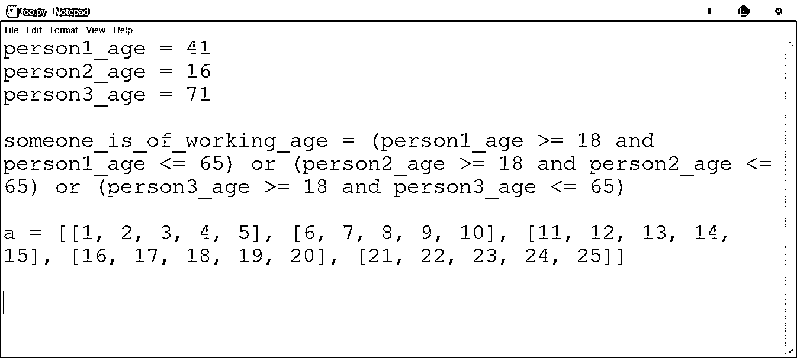

# Python 程序词汇结构

> 原文：<https://realpython.com/python-program-structure/>

现在，您已经深入了解了 Python 变量、操作符和数据类型，并且已经看到了相当多的示例代码。到目前为止，代码都是由简短的语句组成的，只是简单地将对象赋给变量或显示值。

但是您想要做的不仅仅是定义数据和显示数据！让我们开始将代码分成更复杂的组。

在本教程中，你将学到以下内容:你将更深入地了解 Python **的词汇结构**。您将了解组成**语句**的语法元素，它们是组成 Python 程序的基本单元。这将为你接下来的几个教程做好准备，包括**控制结构**，在不同的代码组之间指导程序流的构造。

***参加测验:****通过我们的交互式“Python 程序结构”测验来测试您的知识。完成后，您将收到一个分数，以便您可以跟踪一段时间内的学习进度:*

*[参加测验](/quizzes/python-program-structure/)

## Python 语句

语句是 Python 解释器解析和处理的基本指令单元。一般来说，解释器是按顺序执行语句的，当遇到语句时就一个接一个地执行。(您将在下一篇关于条件语句的教程中看到，改变这种行为是可能的。)

在 REPL 会话中，语句在被键入时就被执行，直到解释程序被终止。当您执行一个脚本文件时，解释器从文件中读取语句并执行它们，直到遇到文件结尾。

Python 程序通常每行一条语句。换句话说，每条语句占据一行，语句的结尾由标记行尾的换行符分隔。到目前为止，本教程系列中的大多数示例都遵循了这种模式:

>>>

```py
>>> print('Hello, World!')
Hello, World!

>>> x = [1, 2, 3]
>>> print(x[1:2])
[2]
```

**注意:**在您见过的许多 REPL 例子中，一条语句通常只包含一个在`>>>`提示符下直接输入的[表达式](https://realpython.com/python-operators-expressions/)，解释器会忠实地显示其值:

>>>

```py
>>> 'foobar'[2:5]
'oba'
```

请记住，这只能以交互方式工作，而不能从脚本文件中工作。在脚本文件中，像上面这样作为单独语句出现的文字或表达式不会导致控制台输出。其实根本不会做什么有用的事情。Python 只会把 CPU 时间浪费在计算表达式的值上，然后扔掉。

[*Remove ads*](/account/join/)

## 行延续

假设 Python 代码中的一条语句特别长。例如，您可能有一个包含许多术语的赋值语句:

>>>

```py
>>> person1_age = 42
>>> person2_age = 16
>>> person3_age = 71

>>> someone_is_of_working_age = (person1_age >= 18 and person1_age <= 65) or (person2_age >= 18 and person2_age <= 65) or (person3_age >= 18 and person3_age <= 65)
>>> someone_is_of_working_age
True
```

或者您可能正在定义一个冗长的嵌套列表:

>>>

```py
>>> a = [[1, 2, 3, 4, 5], [6, 7, 8, 9, 10], [11, 12, 13, 14, 15], [16, 17, 18, 19, 20], [21, 22, 23, 24, 25]]
>>> a
[[1, 2, 3, 4, 5], [6, 7, 8, 9, 10], [11, 12, 13, 14, 15], [16, 17, 18, 19, 20], [21, 22, 23, 24, 25]]
```

您会注意到这些语句太长，不适合您的浏览器窗口，浏览器被迫使用水平滚动条来呈现代码块。你可能会觉得这很气人。(我们向您道歉——这些例子就是为了说明这一点而提出的。不会再发生了。)

当脚本文件中包含像这样的冗长语句时，同样令人沮丧。大多数编辑器都可以配置为换行，这样长行的末尾至少是可见的，不会从编辑器窗口的右边消失。但是换行并不一定发生在增强可读性的逻辑位置:

[](https://files.realpython.com/media/line-wrap.d1637102a183.png)

过长的代码行通常被认为是糟糕的实践。实际上，Python 软件基金会提出的 Python 代码有一个官方的[样式指南，它的一个规定就是 Python 代码中的](https://www.python.org/dev/peps/pep-0008)[最大行长度](https://www.python.org/dev/peps/pep-0008/#maximum-line-length)应该是 79 个字符。

**注:**Python 代码的**风格指南也称为 **PEP 8** 。PEP 代表 Python 增强提案。pep 是包含关于特性、标准、设计问题、通用指南和 Python 相关信息的详细信息的文档。有关更多信息，请参见 PEPs 的 Python 软件基金会[索引。](https://www.python.org/dev/peps)**

随着代码变得越来越复杂，语句有时会不可避免地变得很长。为了保持可读性，您应该将它们分成几行。但你不能随时随地随心所欲地拆分一个声明。除非另有说明，否则解释器假定换行符终止一条语句。如果语句在这一点上语法不正确，就会引发一个异常:

>>>

```py
>>> someone_is_of_working_age = person1_age >= 18 and person1_age <= 65 or
SyntaxError: invalid syntax
```

在 Python 代码中，语句可以通过两种不同的方式从一行延续到下一行:隐式和显式行延续。

### 隐式行延续

这是更直接的行延续技术，也是 PEP 8 的首选技术。

任何包含左括号(`'('`)、中括号(`'['`)或花括号(`'{'`)的语句都被认为是不完整的，直到遇到所有匹配的括号、中括号和大括号。在此之前，语句可以隐式地跨行继续，而不会引发错误。

例如，上面的嵌套列表定义可以通过使用隐式行延续变得更加易读，因为有了左括号:

>>>

```py
>>> a = [
...     [1, 2, 3, 4, 5],
...     [6, 7, 8, 9, 10],
...     [11, 12, 13, 14, 15],
...     [16, 17, 18, 19, 20],
...     [21, 22, 23, 24, 25]
... ]

>>> a
[[1, 2, 3, 4, 5], [6, 7, 8, 9, 10], [11, 12, 13, 14, 15],
[16, 17, 18, 19, 20], [21, 22, 23, 24, 25]]
```

一个长表达式也可以用分组括号括起来，跨多行继续。PEP 8 明确提倡在适当的时候以这种方式使用括号:

>>>

```py
>>> someone_is_of_working_age = (
...     (person1_age >= 18 and person1_age <= 65)
...     or (person2_age >= 18 and person2_age <= 65)
...     or (person3_age >= 18 and person3_age <= 65)
... )

>>> someone_is_of_working_age
True
```

如果您需要跨多行继续一个语句，通常可以使用隐式行继续来完成。这是因为圆括号、方括号和花括号在 Python 语法中出现得如此频繁:

#### 括号

*   *表达式分组*

    >>>

    ```py
    >>> x = (
    ...     1 + 2
    ...     + 3 + 4
    ...     + 5 + 6
    ... )
    >>> x
    21` 
    ```

*   *函数调用*

    >>>

    ```py
    >>> print(
    ...     'foo',
    ...     'bar',
    ...     'baz'
    ... )
    foo bar baz` 
    ```

*   *方法调用*

    >>>

    ```py
    >>> 'abc'.center(
    ...     9,
    ...     '-'
    ... )
    '---abc---'` 
    ```

*   *元组定义*

    >>>

    ```py
    >>> t = (
    ...     'a', 'b',
    ...     'c', 'd'
    ... )` 
    ```

#### 花括号

*   *字典定义*

    >>>

    ```py
    >>> d = {
    ...     'a': 1,
    ...     'b': 2
    ... }` 
    ```

*   *设定定义*

    >>>

    ```py
    >>> x1 = {
    ...     'foo',
    ...     'bar',
    ...     'baz'
    ... }` 
    ```

#### 方括号

*   *列表定义*

    >>>

    ```py
    >>> a = [
    ...     'foo', 'bar',
    ...     'baz', 'qux'
    ... ]` 
    ```

*   *索引*

    >>>

    ```py
    >>> a[
    ...  1
    ...  ]
    'bar'` 
    ```

*   *切片*

    >>>

    ```py
    >>> a[
    ...  1:2
    ...  ]
    ['bar']` 
    ```

*   *字典键引用*

    >>>

    ```py
    >>> d[
    ...  'b'
    ...  ]
    2` 
    ```

**注:**某件事在语法上是允许的，并不代表你就应该去做。上面的一些例子通常是不推荐的。特别是，跨行分割索引、切片或字典键引用是不常见的。但是如果你能提出一个很好的论点，说明它增强了可读性，你可以考虑。

请记住，如果有多个圆括号、中括号或花括号，那么隐式行继续将一直有效，直到它们都被关闭:

>>>

```py
>>> a = [
...     [
...         ['foo', 'bar'],
...         [1, 2, 3]
...     ],
...     {1, 3, 5},
...     {
...         'a': 1,
...         'b': 2
...     }
... ]

>>> a
[[['foo', 'bar'], [1, 2, 3]], {1, 3, 5}, {'a': 1, 'b': 2}]
```

请注意如何使用行连续和明智的缩进来阐明列表的嵌套结构。

[*Remove ads*](/account/join/)

### 显式行延续

在隐式线延拓不可用或不可行的情况下，还有另一种选择。这被称为显式线延续或显式线连接。

通常，换行符(当你按下键盘上的 `Enter` 时得到)表示一行的结束。如果到那时语句还没有完成，Python 会抛出一个 [`SyntaxError`](https://realpython.com/invalid-syntax-python/) 异常:

>>>

```py
>>> s =
  File "<stdin>", line 1
    s =
      ^
SyntaxError: invalid syntax

>>> x = 1 + 2 +
  File "<stdin>", line 1
    x = 1 + 2 +
              ^
SyntaxError: invalid syntax
```

要指示显式的行延续，可以指定一个反斜杠(`\`)字符作为该行的最后一个字符。在这种情况下，Python 会忽略下面的换行符，语句会在下一行有效地继续:

>>>

```py
>>> s = \
... 'Hello, World!'
>>> s
'Hello, World!'

>>> x = 1 + 2 \
...     + 3 + 4 \
...     + 5 + 6
>>> x
21
```

注意，反斜杠字符必须是该行的最后一个字符。它后面甚至不允许有空格:

>>>

```py
>>> # You can't see it, but there is a space character following the \ here:
>>> s = \
  File "<stdin>", line 1
    s = \
         ^
SyntaxError: unexpected character after line continuation character
```

同样，PEP 8 建议仅在隐式行延续不可行时使用显式行延续。

## 每行多条语句

如果用分号(`;`)字符分隔，多条语句可以出现在一行中:

>>>

```py
>>> x = 1; y = 2; z = 3
>>> print(x); print(y); print(z)
1
2
3
```

从风格上来说，这通常是不被允许的，并且 PEP 8 明确地不鼓励这样做。可能会有提高可读性的情况，但通常不会。事实上，这通常是不必要的。以下语句在功能上等同于上面的示例，但被视为更典型的 Python 代码:

>>>

```py
>>> x, y, z = 1, 2, 3
>>> print(x, y, z, sep='\n')
1
2
3
```

术语**Python 化的**指的是遵循普遍接受的可读性和惯用 Python 的“最佳”使用的通用准则的代码。当有人说代码不是 Python 语言时，他们是在暗示代码没有像 Python 那样表达程序员的意图。因此，对于精通 Python 的人来说，代码可能不像它那样可读。

如果您发现您的代码在一行中有多个语句，可能有一种更 Pythonic 化的方式来编写它。但是同样，如果你认为它是合适的或者增强了可读性，你应该放心去做。

## 评论

在 Python 中，散列字符(`#`)表示注释。解释器将忽略从散列字符到该行末尾的所有内容:

>>>

```py
>>> a = ['foo', 'bar', 'baz']  # I am a comment.
>>> a
['foo', 'bar', 'baz']
```

如果该行的第一个非空白字符是一个散列，则整行都将被忽略:

>>>

```py
>>> # I am a comment.
>>>     # I am too.
```

自然，字符串中的散列字符受到保护，并且不表示注释:

>>>

```py
>>> a = 'foobar # I am *not* a comment.'
>>> a
'foobar # I am *not* a comment.'
```

一个评论只是被忽略，那么它有什么用呢？注释为您提供了一种向代码附加解释性细节的方式:

>>>

```py
>>> # Calculate and display the area of a circle.

>>> pi = 3.1415926536
>>> r = 12.35

>>> area = pi * (r ** 2)

>>> print('The area of a circle with radius', r, 'is', area)
The area of a circle with radius 12.35 is 479.163565508706
```

到目前为止，您的 Python 编码主要由简短、孤立的 REPL 会话组成。在这种情况下，对注释的需求非常小。最终，您将开发跨多个脚本文件的更大的应用程序，注释将变得越来越重要。

好的注释能让你的代码在别人阅读时，甚至是你自己阅读时，一目了然。理想情况下，您应该努力编写尽可能清晰、简洁和不言自明的代码。但是，有时您会做出从代码本身看不出来的设计或实现决策。这就是评论的用武之地。好的代码解释了如何做；好的评论说明了原因。

注释可以包含在隐式行延续中:

>>>

```py
>>> x = (1 + 2           # I am a comment.
...      + 3 + 4         # Me too.
...      + 5 + 6)
>>> x
21

>>> a = [
...     'foo', 'bar',    # Me three.
...     'baz', 'qux'
... ]
>>> a
['foo', 'bar', 'baz', 'qux']
```

但是回想一下，显式的行延续要求反斜杠字符是该行的最后一个字符。因此，后面不能有注释:

>>>

```py
>>> x = 1 + 2 + \   # I wish to be comment, but I'm not.
SyntaxError: unexpected character after line continuation character
```

如果你想添加几行长的评论怎么办？许多编程语言都提供了多行注释(也称为块注释)的语法。例如，在 [C](https://realpython.com/c-for-python-programmers/) 和 [Java](https://realpython.com/oop-in-python-vs-java/) 中，注释由标记`/*`和`*/`分隔。这些分隔符中包含的文本可以跨多行:

```py
/*
[This is not Python!]

Initialize the value for radius of circle.

Then calculate the area of the circle
and display the result to the console.
*/
```

Python 并没有明确提供类似的东西来创建多行块注释。要创建一个块注释，通常只需用一个散列字符开始每一行:

>>>

```py
>>> # Initialize value for radius of circle.
>>> #
>>> # Then calculate the area of the circle
>>> # and display the result to the console.

>>> pi = 3.1415926536
>>> r = 12.35

>>> area = pi * (r ** 2)

>>> print('The area of a circle with radius', r, 'is', area)
The area of a circle with radius 12.35 is 479.163565508706
```

然而，对于脚本文件中的代码，技术上有一个替代方案。

您在上面看到，当解释器解析脚本文件中的代码时，如果字符串文字(或任何文字)单独作为语句出现，它会忽略它。更准确地说，字面量并没有被完全忽略:解释器看到它并解析它，但并不对它做任何事情。因此，一行中的字符串本身可以作为注释。由于用三重引号括起来的字符串可以跨多行，因此它可以有效地充当多行注释。

考虑这个脚本文件`foo.py`:

```py
"""Initialize value for radius of circle.

Then calculate the area of the circle
and display the result to the console.
"""

pi = 3.1415926536
r = 12.35

area = pi * (r ** 2)

print('The area of a circle with radius', r, 'is', area)
```

运行该脚本时，输出如下所示:

```py
C:\Users\john\Documents\Python\doc>python foo.py
The area of a circle with radius 12.35 is 479.163565508706
```

三重引号字符串不会显示，也不会以任何方式改变脚本的执行方式。它实际上构成了一个多行的块注释。

尽管这很有效(Guido 自己曾经把它作为 Python 编程技巧提出过)，但 PEP 8 实际上建议不要这么做。出现这种情况的原因似乎是因为一种叫做 **docstring** 的特殊 Python 结构。 [docstring](https://realpython.com/documenting-python-code/#documenting-your-python-code-base-using-docstrings) 是用户定义函数开头的特殊注释，记录了函数的行为。文档字符串通常被指定为带三重引号的字符串注释，因此 PEP 8 建议 Python 代码中的其他[块注释](https://www.python.org/dev/peps/pep-0008/?#block-comments)以通常的方式指定，在每一行的开头使用散列字符。

然而，当您开发代码时，如果您想要一种快速而简单的方法来临时注释掉一段代码以进行实验，您可能会发现用三重引号将代码括起来会很方便。

**延伸阅读:**在即将到来的关于 Python 中函数的教程中，你会学到更多关于 docstrings 的知识。

有关注释和记录 Python 代码(包括文档字符串)的更多信息，请参见[记录 Python 代码:完整指南](https://realpython.com/documenting-python-code)。

[*Remove ads*](/account/join/)

## 空白

在解析代码时，Python 解释器将输入分解成标记。非正式地说，标记就是你到目前为止看到的语言元素:标识符、[关键字](https://realpython.com/python-keywords/)、文字和操作符。

通常，分隔标记的是空格:空白字符提供空格以提高可读性。最常见的空白字符如下:

| 性格；角色；字母 | ASCII 码 | 文字表达 |
| --- | --- | --- |
| 空间 | `32` ( `0x20`) | `' '` |
| 标签 | `9` ( `0x9`) | `'\t'` |
| 新行 | `10` ( `0xa`) | `'\n'` |

还有其他一些有点过时的 ASCII 空白字符，如换行符和换页符，以及一些非常深奥的提供空白的 Unicode 字符。但就目前的目的而言，空白通常意味着空格、制表符或换行符。

Python 解释器通常会忽略空白，也不需要空白。当一个标记结束和下一个标记开始的地方很清楚时，空格可以省略。当涉及特殊的非字母数字字符时，通常会出现这种情况:

>>>

```py
>>> x=3;y=12
>>> x+y
15

>>> (x==3)and(x<y)
True

>>> a=['foo','bar','baz']
>>> a
['foo', 'bar', 'baz']

>>> d={'foo':3,'bar':4}
>>> d
{'foo': 3, 'bar': 4}

>>> x,y,z='foo',14,21.1
>>> (x,y,z)
('foo', 14, 21.1)

>>> z='foo'"bar"'baz'#Comment
>>> z
'foobarbaz'
```

上面的每一条语句都没有空格，解释器可以很好地处理它们。但这并不是说你应该这样写。明智地使用空白几乎总能增强可读性，您的代码通常应该包含一些空白。比较以下代码片段:

>>>

```py
>>> value1=100
>>> value2=200
>>> v=(value1>=0)and(value1<value2)
```

>>>

```py
>>> value1 = 100
>>> value2 = 200
>>> v = (value1 >= 0) and (value1 < value2)
```

大多数人可能会发现，第二个例子中增加的空白使它更容易阅读。另一方面，你可能会发现一些人更喜欢第一个例子。某种程度上是个人喜好问题。但是 PEP 8 对表达式和语句中的空白有标准，你应该尽可能地遵守这些标准。

**注意:**您可以并置字符串文字，有或没有空格:

>>>

```py
>>> s = "foo"'bar''''baz'''
>>> s
'foobarbaz'

>>> s = 'foo' "bar" '''baz'''
>>> s
'foobarbaz'
```

效果就是串联，就像使用了`+`操作符一样。

在 Python 中，通常只有在需要区分不同的标记时才需要空格。当一个或两个标记都是标识符或关键字时，这是最常见的。

例如，在下面的例子中，需要空格来分隔标识符`s`和关键字`in`:

>>>

```py
>>> s = 'bar'

>>> s in ['foo', 'bar', 'baz']
True

>>> sin ['foo', 'bar', 'baz']
Traceback (most recent call last):
  File "<pyshell#25>", line 1, in <module>
    sin ['foo', 'bar', 'baz']
NameError: name 'sin' is not defined
```

下面是一个需要空格来区分标识符`y`和数字常量`20`的例子:

>>>

```py
>>> y is 20
False

>>> y is20
SyntaxError: invalid syntax
```

在本例中，两个关键字之间需要空格:

>>>

```py
>>> 'qux' not in ['foo', 'bar', 'baz']
True

>>> 'qux' notin ['foo', 'bar', 'baz']
SyntaxError: invalid syntax
```

将标识符或关键字放在一起运行会欺骗解释器，使其认为您引用的是一个不同于预期的标记:在上面的例子中是`sin`、`is20`和`notin`。

所有这些都倾向于学术，因为你可能不需要考虑太多。需要空格的情况往往是直观的，您可能会习惯性地这样做。

你应该在不必要的地方使用空格来增强可读性。理想情况下，你应该遵循 PEP 8 中的指导方针。

> 深潜:Fortran 和空白
> 
> Fortran (最早创建的编程语言之一)的最早版本被设计成完全忽略所有空格。几乎在任何地方都可以选择包含或省略空白字符——在标识符和保留字之间，甚至在标识符和保留字中间。
> 
> 例如，如果您的 Fortran 代码包含一个名为`total`的变量，则以下任何一条语句都是为其赋值`50`的有效语句:
> 
> ```py
> `total = 50
> to tal = 50
> t o t a l=5 0` 
> ```
> 
> 这本来是为了方便，但现在回想起来，这被广泛认为是矫枉过正。这通常会导致代码难以阅读。更糟糕的是，它可能导致代码不能正确执行。
> 
> 想想 20 世纪 60 年代美国宇航局的这个故事。用 Fortran 语言编写的任务控制中心轨道计算程序应该包含以下代码行:
> 
> ```py
> `DO 10 I = 1,100` 
> ```
> 
> 在 NASA 当时使用的 Fortran 方言中，显示的代码引入了一个循环，这是一个重复执行代码体的构造。(您将在以后的两篇关于确定和不确定迭代的教程中学习 Python 中的循环)。
> 
> 不幸的是，这一行代码最终出现在程序中:
> 
> ```py
> `DO 10 I = 1.100` 
> ```
> 
> 如果你很难看出区别，不要太难过。NASA 程序员花了几个星期才注意到在`1`和`100`之间有一个句号，而不是逗号。因为 Fortran 编译器忽略了空格，`DO 10 I`被当作一个变量名，语句`DO 10 I = 1.100`导致将`1.100`赋给一个名为`DO10I`的变量，而不是引入一个循环。
> 
> 这个故事的一些版本声称水星火箭因为这个错误而丢失，但这显然是一个神话。不过，在程序员发现错误之前，它确实在一段时间内造成了不准确的数据。
> 
> 几乎所有现代编程语言都选择不忽略空白。

[*Remove ads*](/account/join/)

## 空格作为缩进

还有一种更重要的情况，空白在 Python 代码中很重要。缩进——出现在一行中第一个标记左边的空格——有非常特殊的含义。

在大多数解释型语言中，语句前的前导空格会被忽略。例如，考虑以下 Windows 命令提示符会话:

```py
C:\Users\john>echo foo
foo

C:\Users\john>    echo foo
foo
```

**注意:**在命令提示符窗口中，`echo`命令向控制台显示其参数，就像 Python 中的`print()`函数一样。在 macOS 或 Linux 的终端窗口中也可以观察到类似的行为。

在第二条语句中，四个空格字符被插入到`echo`命令的左侧。但结果是一样的。解释器忽略前导空白并执行相同的命令`echo foo`，就像没有前导空白时一样。

现在尝试用 Python 解释器做或多或少相同的事情:

>>>

```py
>>> print('foo')
foo
>>>     print('foo')

SyntaxError: unexpected indent
```

说什么？*意外缩进*？第二个`print()`语句前的前导空格导致了一个`SyntaxError`异常！

在 Python 中，缩进是不会被忽略的。前导空格用于计算一行的缩进级别，这又用于确定语句的分组。到目前为止，您还不需要对语句进行分组，但是在下一个教程中，随着控制结构的引入，这种情况将会改变。

在此之前，请注意前导空格很重要。

## 结论

本教程向您介绍了 Python 程序的词法结构。您学习了什么构成了有效的 Python **语句**，以及如何使用**隐式**和**显式行继续符**来编写跨多行的语句。您还了解了如何注释 Python 代码，以及如何使用空白来增强可读性。

接下来，您将学习如何使用**条件语句**将语句分组为更复杂的决策结构。

***参加测验:****通过我们的交互式“Python 程序结构”测验来测试您的知识。完成后，您将收到一个分数，以便您可以跟踪一段时间内的学习进度:*

*[参加测验](/quizzes/python-program-structure/)*

*[« Sets in Python](https://realpython.com/python-sets/)[Python Program Lexical Structure](#)[Conditional Statements in Python »](https://realpython.com/python-conditional-statements/)******