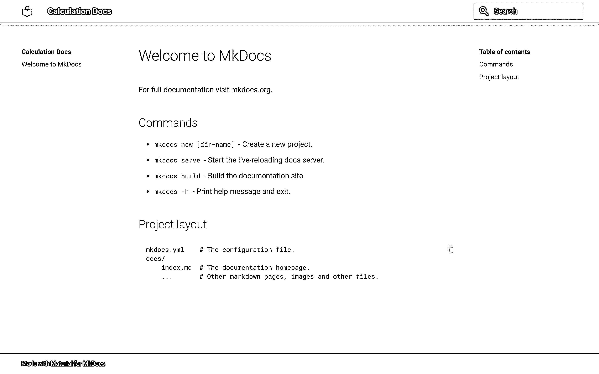
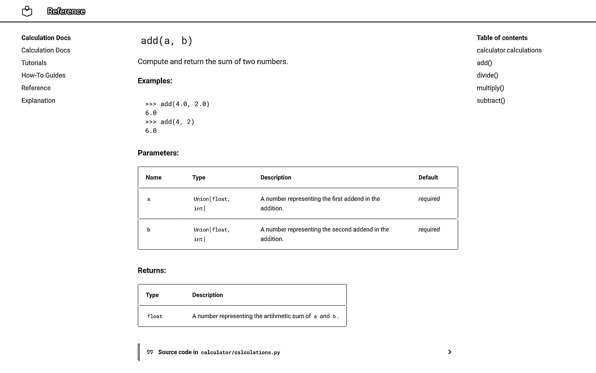
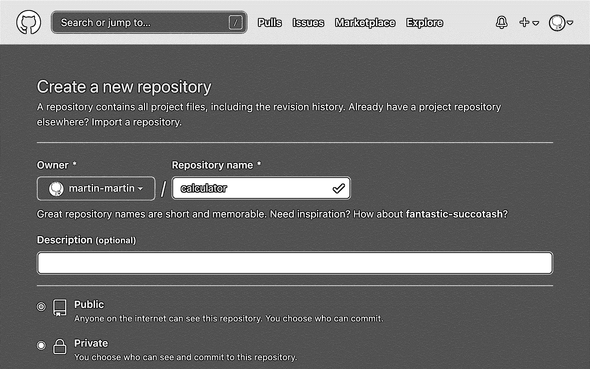
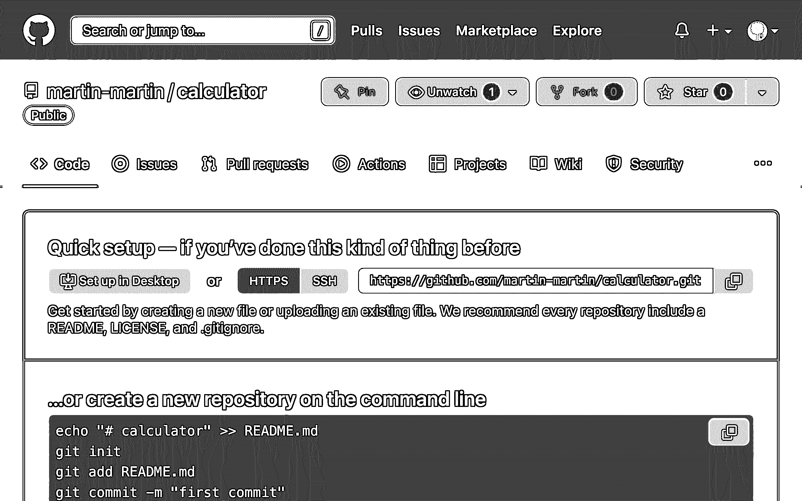

# 使用 MkDocs 构建您的 Python 项目文档

> 原文：<https://realpython.com/python-project-documentation-with-mkdocs/>

*立即观看**本教程有真实 Python 团队创建的相关视频课程。和文字教程一起看，加深理解: [**用 MkDocs**](/courses/building-project-documentation-mkdocs/) 构建 Python 项目文档

在本教程中，您将学习如何使用 **MkDocs** 和 **mkdocstrings** 为 Python 包快速构建**文档**。这些工具允许你从 **Markdown** 文件和你的代码的**文档串**中生成好看的现代文档。

维护**自动生成的文档**意味着更少的工作，因为您在代码和文档页面之间链接信息。然而，好的文档不仅仅是从你的代码中提取的技术描述，而是更多的 T2！如果你通过例子引导用户，并把文档串之间的点连接起来，你的项目会对用户更有吸引力。

MkDocs 主题的**素材让你的文档**看起来很好**而不需要任何额外的努力，并且被流行的项目使用，例如 [Typer CLI](https://typer.tiangolo.com) 和 [FastAPI](https://realpython.com/fastapi-python-web-apis/) 。**

**在本教程中，您将:**

*   与 **MkDocs** 合作，从 Markdown 生成**静态页面**
*   使用 **mkdocstrings** 从文档字符串中拉入**代码文档**
*   遵循**项目文档的最佳实践**
*   使用 MkDocs 主题的**材料使你的文档看起来更好**
*   **在 **GitHub 页面**上托管**您的文档

如果您将 MkDocs 的自动生成特性与 mkdocstrings 结合使用，那么您可以用较少的努力创建良好的文档。从代码中的文档字符串开始创建文档，然后将其构建到一个已部署且用户友好的在线资源中，以记录您的 Python 项目。

准备好了吗？然后单击下面的链接获取该项目的源代码:

**获取源代码:** [单击此处获取您将用于构建文档的源代码](https://realpython.com/bonus/mkdocs-code/)。

## 演示

在本教程中，您将构建部分由代码中的 docstrings 自动生成的项目文档。示例代码包是有意简化的，因此您可以将注意力集中在学习如何使用 MkDocs 和相关的库上。

在本地设置好项目文档后，您将学习如何在 GitHub 页面上托管它，这样每个人都可以看到它:

[https://player.vimeo.com/video/709676922](https://player.vimeo.com/video/709676922)

您可以使用将在本教程中构建的示例项目文档作为蓝本，为您自己的 Python 项目创建文档。

[*Remove ads*](/account/join/)

## 项目概述

您将为一个名为`calculator`的玩具包构建项目文档，该包只包含一个名为`calculations.py`的模块，其中有几个示例 Python 函数。

**注意:**所提供的代码不提供任何新功能，仅作为学习如何使用现有项目代码构建文档的基础。

您将遵循名为 [Diátaxis 文档框架](https://diataxis.fr/)的项目文档指南，该框架在 Python 社区中被广泛[采用](https://diataxis.fr/adoption/)，并被大型项目使用，如 [Django](https://www.djangoproject.com) 和 [NumPy](https://numpy.org) 。

该系统建议将您的文档分成四个不同方向的不同部分:

1.  **[教程](https://diataxis.fr/tutorials/) :** 学习型
2.  **[操作指南](https://diataxis.fr/how-to-guides/) :** 问题导向
3.  **[参考](https://diataxis.fr/reference/) :** 信息化
4.  **[解释](https://diataxis.fr/explanation/) :** 理解型

将您的项目文档分解为这四个不同目的和不同方向，将有助于您为 Python 项目创建全面的文档。

从技术角度来看，您将使用三个 Python 包来构建您的文档:

1.  用于从 Markdown 构建静态页面的 MkDocs
2.  [mkdocstrings](http://mkdocstrings.github.io/) 用于从代码中的文档字符串自动生成文档
3.  用于设计文档样式的 MkDocs 材料

当您想使用 MkDocs 从 docstrings 自动生成文档的一部分时，您需要*添加 mkdocstrings 包。*

**注意:** [Sphinx](http://sphinx-autoapi.readthedocs.io/) ，Python 项目文档的另一个流行工具，可以从您的 docstrings 自动生成文本，无需额外的扩展。然而，Sphinx 主要使用 reStructuredText 而不是 Markdown，并且总体上不如 MkDocs 简单。

您不一定需要为 MkDocs 主题添加素材来构建您的项目文档，但是它将有助于以用户友好的方式呈现文档。

## 先决条件

要完成本教程，您应该熟悉以下概念:

*   **虚拟环境:**建立一个 [Python 虚拟环境](https://realpython.com/python-virtual-environments-a-primer/)并在其中工作。
*   **包管理:**用 [`pip`](https://realpython.com/what-is-pip/) 安装 Python 包，创建自己的[模块和包](https://realpython.com/python-modules-packages/)。
*   **代码文档:**了解什么是文档串，它们遵循什么结构，它们应该包含什么信息，以及你应该如何[概括地记录一个 Python 项目](https://realpython.com/documenting-python-code/)。
*   **GitHub 仓库:**在 GitHub 上创建并更新一个仓库来存放你的文档，你可以在[Git 和 GitHub 简介](https://realpython.com/python-git-github-intro/)中了解到。

如果您在开始本教程之前没有掌握所有的必备知识，那也没关系！你可能会学到更多的东西。如果遇到困难，您可以随时停下来查看此处链接的资源。

## 步骤 1:为构建文档设置环境

在你开始你的项目之前，你需要一个虚拟环境来安装你需要的包。

在这一步结束时，您已经创建并激活了一个虚拟环境，并安装了必要的依赖项。

首先为您的项目创建一个名为`mkdocs-documentation/`的新文件夹。导航到该文件夹，然后创建一个虚拟环境并安装必要的软件包:

*   [*视窗*](#windows-1)
**   [**Linux + macOS**](#linux-macos-1)*

```py
PS> mkdir mkdocs-documentation
PS> cd mkdocs-documentation
PS> python -m venv venv
PS> venv\Scripts\activate
(venv) PS> python -m pip install mkdocs
(venv) PS> python -m pip install "mkdocstrings[python]"
(venv) PS> python -m pip install mkdocs-material
```

```py
$ mkdir mkdocs-documentation
$ cd mkdocs-documentation
$ python3 -m venv venv
$ source venv/bin/activate
(venv) $ python -m pip install mkdocs
(venv) $ python -m pip install "mkdocstrings[python]"
(venv) $ python -m pip install mkdocs-material
```

等待所有下载完成，然后通过调用`pip list`确认安装成功。该命令将为您提供所有已安装软件包及其版本的列表:

```py
(venv) $ python -m pip list
Package                    Version
-------------------------- -------
click                      8.1.3

# ...

mkdocs                     1.3.0 mkdocs-autorefs            0.4.1
mkdocs-material            8.3.6 mkdocs-material-extensions 1.0.3
mkdocstrings               0.19.0 mkdocstrings-python        0.7.1 
# ...

zipp                       3.8.0
```

确认上面输出中突出显示的软件包已经安装。您应该会看到与您的安装命令直接相关的四个包:

1.  `mkdocs`
2.  `mkdocs-material`
3.  `mkdocstrings`
4.  `mkdocstrings-python`

名为`mkdocstrings-python`的包是 mkdocstrings 的 [Python 处理程序，它允许 mkdocstrings 解析 Python 代码。你是在用`pip`安装`mkdocstrings`包的时候，通过添加扩展`[python]`安装的。](https://mkdocstrings.github.io/python/)

您将在您的列表中看到一些额外的包，这表明您的虚拟环境和三个已安装的包带有额外的依赖项，这些依赖项是`pip`自动为您安装的。您可以[将您的依赖关系](https://realpython.com/python-virtual-environments-a-primer/#pin-your-dependencies)固定在一个`requirements.txt`文件中，以获得可复制性。

[*Remove ads*](/account/join/)

## 步骤 2:创建示例 Python 包

在这一步中，您将编写一个名为`calculator`的示例 Python 包，这就是您将构建文档的目的。

要记录 Python 项目，您首先需要一个 Python 项目。在本教程中，您将使用一个返回浮点数的计算器包的玩具实现。

**注意:**如果您已经有了一个想要为其生成文档的 Python 项目，那么请随意使用您的项目。在这种情况下，您可以跳过这一部分，直接跳到[步骤 3:编写并格式化您的文档字符串](#step-3-write-and-format-your-docstrings)。

您的示例 Python 项目很小，仅包含一个包含两个文件的文件夹:

```py
calculator/
│
├── __init__.py
└── calculations.py
```

创建这个包文件夹和项目文件夹中的两个文件，然后在你最喜欢的[代码编辑器或 IDE](https://realpython.com/python-ides-code-editors-guide/) 中打开`calculations.py`。

添加一些数学计算的示例代码，作为文档的基础:

```py
# calculator/calculations.py

def add(a, b):
    return float(a + b)

def subtract(a, b):
    return float(a - b)

def multiply(a, b):
    return float(a * b)

def divide(a, b):
    if b == 0:
        raise ZeroDivisionError("division by zero")
    return float(a / b)
```

添加到`calculations.py`中的代码将一些基本的数学运算重新打包成新的函数，这些函数将结果作为浮点数返回。

暂时保留第二个文件`__init__.py`，为空。它在这里帮助声明`calculator`为一个包。稍后，您将在这个文件中添加包级的 docstrings，您还将把它放入自动生成的文档中。

在本步骤中，您已经创建了示例 Python 项目，该项目将用作构建文档的示例项目。在下一步中，您将向您的函数添加文档字符串，以便在以后从这些文档字符串生成文档时为成功做好准备。

## 步骤 3:编写并格式化你的文档字符串

mkdocstrings 包可以从您的代码库中提取有价值的信息，以帮助自动生成您的部分文档。顾名思义，你需要[docstring](https://realpython.com/documenting-python-code/#docstrings-background)来完成这个任务。

您的函数中还没有任何 docstrings，是时候改变这种情况了。在这一步中，您将为您的模块、包含的函数以及您的包编写 docstrings。您还将重新格式化您的函数签名和文档字符串，以使用[类型提示](https://realpython.com/python-type-checking/#annotations)。

### 了解 Python 文档字符串

文档字符串是记录 Python 代码的最大帮助。它们是内置的字符串，您可以对其进行配置，以保存使用说明以及关于您的函数、类和模块的信息。

Python 文档字符串由一对三个双引号(`"""`)之间的文本组成。最常见的是，您将读取和编写函数、类和方法文档字符串。在这些情况下，docstring 位于定义类、方法或函数的行的正下方:

>>>

```py
>>> def greet(name):
...     """Print a greeting.
... ...     Args:
...         name (str): The name of the person to greet.
...     """
...     print(f"Hello {name}!")
...
```

上面的代码片段显示了一个名为`greet()`的函数的示例 docstring。docstring 以对函数用途的单行描述开始，后面是更深入的信息:

> 函数或方法的 docstring 应该总结其行为，并记录其参数、返回值、副作用、引发的异常以及何时可以调用它的限制(如果适用的话)。([来源](https://peps.python.org/pep-0257/#multi-line-docstrings))

文档字符串有助于使您正在处理的代码更容易理解。它们提供关于代码对象的信息。如果你写好了你的文档字符串，那么它们就阐明了对象的上下文和用途。

您可以使用内置的 [`help()`](https://docs.python.org/3/library/functions.html#help) 功能访问保存在 docstring 中的信息:

>>>

```py
>>> help(greet)
Help on function greet in module __main__:

greet(name)
 Print a greeting.

 Args:
 name (str): The name of the person to greet.
```

如果您在任何代码对象上调用`help()`，那么 Python 将把对象的 docstring 打印到您的终端。

对象的 docstring 保存在`.__doc__`中，您也可以在那里直接查看它:

>>>

```py
>>> greet.__doc__
'Print a greeting.\n    \n    Args:\n        name (str):
⮑ The name of the person to greet.\n    '
```

该属性包含您的 docstring，您可以使用`.__doc__`读取任何 docstring。然而，您通常会通过更方便的`help()`函数来访问它。用`help()`显示 docstring 也可以改进格式。

**注意:** Python 使用内置的 [`pydoc`](https://docs.python.org/3/library/pydoc.html) 模块在调用`help()`时从`.__doc__`生成格式化描述。

其他类型的文档字符串，例如[模块和包文档字符串](https://realpython.com/documenting-python-code/#package-and-module-docstrings)，使用相同的三重双引号语法。您将一个模块 docstring 放在一个文件的开头，并将一个包 docstring 写在一个`__init__.py`文件的开头。

这些文档字符串提供了关于模块或包的高级信息:

> 模块的 docstring 通常应该列出由模块导出的类、异常和函数(以及任何其他对象),并用一行摘要说明每一项。(这些摘要通常比对象的 docstring 中的摘要行提供的信息更少。)包的 docstring(即包的`__init__.py`模块的 docstring)也应该列出由包导出的模块和子包。([来源](https://peps.python.org/pep-0257/#multi-line-docstrings))

所有 Python 文档字符串的基本语法都是相同的，尽管根据文档字符串所记录的内容，您会在不同的位置找到它们。

**注意:**在本教程中，您将创建函数、模块和包文档字符串。如果您的个人 Python 项目包含类，那么您也应该使用[类文档字符串](https://realpython.com/documenting-python-code/#class-docstrings)来记录这些类。

文档串在 [PEP 257](https://www.python.org/dev/peps/pep-0257/) 中被形式化，但是它们的结构没有被严格定义。随后，不同的项目为 Python docstrings 开发了不同的标准。

MkDocs 支持三种常见的 Python 文档字符串格式:

1.  [谷歌风格的文档字符串](https://google.github.io/styleguide/pyguide.html#38-comments-and-docstrings)
2.  [NumPy Docstring 标准](https://numpydoc.readthedocs.io/en/latest/format.html#docstring-standard)
3.  [Sphinx Docstring 格式](https://sphinx-rtd-tutorial.readthedocs.io/en/latest/docstrings.html#the-sphinx-docstring-format)

MkDocs [的 Python 处理程序默认使用 Google 风格的 docstrings】，这也是本教程坚持使用的。](https://github.com/mkdocstrings/python/blob/e2719e6f6eb56d7031d97ab3e7718ec584c5299a/src/mkdocstrings_handlers/python/handler.py#L98)

[*Remove ads*](/account/join/)

### 将函数文档字符串添加到您的 Python 项目

是时候将 Google 风格的 docstrings 添加到`calculations.py`中的示例函数中了。从编写您的[单行 docstring](https://peps.python.org/pep-0257/#one-line-docstrings) 开始，它应该简明地解释该函数的用途:

```py
def add(a, b):
 """Compute and return the sum of two numbers."""    return float(a + b)
```

添加了函数的初始描述后，您可以展开 docstring 来描述函数参数和函数的返回值:

```py
def add(a, b):
    """Compute and return the sum of two numbers.

 Args: a (float): A number representing the first addend in the addition. b (float): A number representing the second addend in the addition.   Returns: float: A number representing the arithmetic sum of `a` and `b`. """
    return float(a + b)
```

通过使用`help()`查看 Python 根据添加到函数 docstrings 中的信息构建的自动文档，您可以继续检查您的函数。

通过描述参数和返回值及其类型，可以为使用代码的程序员提供有用的用法信息。

为`calculations.py`中的所有函数编写文档字符串:


```py
def add(a, b):
    """Compute and return the sum of two numbers.

 Args:
 a (float): A number representing the first addend in the addition.
 b (float): A number representing the second addend in the addition.

 Returns:
 float: A number representing the arithmetic sum of `a` and `b`.
 """
    return float(a + b)

def subtract(a, b):
    """Calculate the difference of two numbers.

 Args:
 a (float): A number representing the minuend in the subtraction.
 b (float): A number representing the subtrahend in the subtraction.

 Returns:
 float: A number representing the difference between `a` and `b`.
 """
    return float(a - b)

def multiply(a, b):
    """Compute and return the product of two numbers.

 Args:
 a (float): A number representing the multiplicand in the multiplication.
 b (float): A number representing the multiplier in the multiplication.

 Returns:
 float: A number representing the product of `a` and `b`.
 """
    return float(a * b)

def divide(a, b):
    """Compute and return the quotient of two numbers.

 Args:
 a (float): A number representing the dividend in the division.
 b (float): A number representing the divisor in the division.

 Returns:
 float: A number representing the quotient of `a` and `b`.

 Raises:
 ZeroDivisionError: An error occurs when the divisor is `0`.
 """
    if b == 0:
        raise ZeroDivisionError("division by zero")
    return float(a / b)
```

完成后，您就成功地将项目代码文档的第一道防线直接添加到了代码库中。

但是 Python docstrings 可以做的不仅仅是描述和记录。您甚至可以使用它们来包含函数的简短测试用例，您可以使用 Python 的内置模块之一来执行这些测试用例。您将在下一节中添加这些示例。

### 编写示例并使用 Doctest 进行测试

您可以在文档字符串中添加示例。这样做澄清了如何使用函数，当你坚持特定的格式时，你甚至可以使用 [Python 的`doctest`模块](https://realpython.com/python-doctest/)来测试你的代码示例。

Google 建议在标题为`"Examples:"`的文档串中添加例子，这对于运行文档测试和使用 MkDocs 构建文档非常有用。

回到`calculations.py`中，将示例用例添加到函数文档字符串中:

```py
def add(a, b):
    """Compute and return the sum of two numbers.

 Examples: >>> add(4.0, 2.0) 6.0 >>> add(4, 2) 6.0 
 Args:
 a (float): A number representing the first addend in the addition.
 b (float): A number representing the second addend in the addition.

 Returns:
 float: A number representing the arithmetic sum of `a` and `b`.
 """
    return float(a + b)
```

您添加了另一个名为`"Examples:"`的头文件，通过额外的缩进级别，您添加了对您正在记录的函数的示例调用。您在默认的 Python REPL 提示符(`>>>`)之后提供了输入，并将预期的输出放在下一行。

这些例子将很好地呈现在自动生成的文档中，并为函数添加上下文。你甚至可以测试它们！通过使用 Python 的`doctest`模块执行文件，验证您的函数是否按预期工作:

*   [*视窗*](#windows-2)
**   [**Linux + macOS**](#linux-macos-2)*

```py
(venv) PS> python -m doctest calculator\calculations.py
```

```py
(venv) $ python -m doctest calculator/calculations.py
```

如果您没有看到任何输出，那么所有测试都通过了。干得好，您已经成功地将 doctests 添加到您的函数中了！

**注意:**尝试更改其中一个示例中的数字，并再次运行`doctest`来研究失败的 doctest 是如何显示的。然后改回来让测试再次通过。

重新访问您的所有函数，并以您对`add()`所做的相同方式添加文档测试:


```py
def add(a, b):
    """Compute and return the sum of two numbers.

 Examples:
 >>> add(4.0, 2.0)
 6.0
 >>> add(4, 2)
 6.0

 Args:
 a (float): A number representing the first addend in the addition.
 b (float): A number representing the second addend in the addition.

 Returns:
 float: A number representing the arithmetic sum of `a` and `b`.
 """
    return float(a + b)

def subtract(a, b):
    """Calculate the difference of two numbers.

 Examples:
 >>> subtract(4.0, 2.0)
 2.0
 >>> subtract(4, 2)
 2.0

 Args:
 a (float): A number representing the minuend in the subtraction.
 b (float): A number representing the subtrahend in the subtraction.

 Returns:
 float: A number representing the difference between `a` and `b`.
 """
    return float(a - b)

def multiply(a, b):
    """Compute and return the product of two numbers.

 Examples:
 >>> multiply(4.0, 2.0)
 8.0
 >>> multiply(4, 2)
 8.0

 Args:
 a (float): A number representing the multiplicand in the multiplication.
 b (float): A number representing the multiplier in the multiplication.

 Returns:
 float: A number representing the product of `a` and `b`.
 """
    return float(a * b)

def divide(a, b):
    """Compute and return the quotient of two numbers.

 Examples:
 >>> divide(4.0, 2.0)
 2.0
 >>> divide(4, 2)
 2.0
 >>> divide(4, 0)
 Traceback (most recent call last):
 ...
 ZeroDivisionError: division by zero

 Args:
 a (float): A number representing the dividend in the division.
 b (float): A number representing the divisor in the division.

 Returns:
 float: A number representing the quotient of `a` and `b`.

 Raises:
 ZeroDivisionError: An error occurs when the divisor is `0`.
 """
    if b == 0:
        raise ZeroDivisionError("division by zero")
    return float(a / b)
```

当您为所有函数编写完 doctests 后，使用`doctest`运行测试以确认所有测试都通过了。

干得好，您正在扩展您的 docstrings，使其更加全面和有价值！为了进一步改进您的代码库，接下来您将向您的函数定义添加[类型提示](https://realpython.com/python-type-checking/#annotations)。类型注释允许您从文档字符串中移除类型信息。

[*Remove ads*](/account/join/)

### 使用类型提示提供自动类型信息

您可能已经注意到，在您到目前为止编写的 docstrings 中，您声明了输入变量应该是类型`float`。然而，当您使用整数时，这些函数也能很好地工作。您甚至可以通过您在文档测试中编写的函数调用来证明这一点！

您可能应该相应地更新文档字符串中的参数类型。但是，您将使用 Python 类型提示来声明函数的参数和返回类型，而不是在 docstrings 中这样做:

```py
from typing import Union 
def add(a: Union[float, int], b: Union[float, int]) -> float:
    """Compute and return the sum of two numbers.

 Examples:
 >>> add(4.0, 2.0)
 6.0
 >>> add(4, 2)
 6.0

 Args:
 a (float): A number representing the first addend in the addition.
 b (float): A number representing the second addend in the addition.

 Returns:
 float: A number representing the arithmetic sum of `a` and `b`.
 """
    return float(a + b)
```

您已经从内置的 [`typing`模块](https://docs.python.org/3/library/typing.html)中导入了 [`Union`](https://docs.python.org/3/library/typing.html#typing.Union) ，这允许您为一个参数指定多种类型。然后，通过向参数和返回值添加类型提示，修改了函数定义的第一行。

**注意:**从 Python 3.10 开始，您也可以使用管道操作符(`|`)作为[类型联合别名](https://realpython.com/python310-new-features/#type-unions-aliases-and-guards):

```py
def add(a: float | int, b: float | int) -> float:
    """Compute and return the sum of two numbers.

 ...
 """
    return float(a + b)
```

这种更简洁的语法还允许您从文件顶部删除 import 语句。

然而，为了保持类型提示与旧版本的类型检查工具更加兼容，在这个示例项目中，您将坚持使用`Union`。

向代码中添加类型提示允许您使用类型检查器，如 [`mypy`](https://mypy.readthedocs.io/en/stable/) 来捕捉类型相关的错误，否则这些错误可能会被忽略。

**注意:**如果你想学习更多关于使用第三方库编写类型提示和类型检查你的 Python 代码，那么你可以在 [Python 类型检查指南](https://realpython.com/python-type-checking/)中刷新你的记忆。

但是等一下，你的第六感在发麻！您是否注意到，您在 docstring 中提到的类型中引入了一些重复的信息和不一致的地方？

幸运的是，mkdocstrings 理解类型提示，并可以从中推断类型。这意味着您不需要向 docstring 添加类型信息。如果您在代码中使用类型提示，Google 风格的 docstrings 不必包含类型信息。

因此，您可以从文档字符串中删除重复的类型信息:

```py
from typing import Union

def add(a: Union[float, int], b: Union[float, int]) -> float:
    """Compute and return the sum of two numbers.

 Examples:
 >>> add(4.0, 2.0)
 6.0
 >>> add(4, 2)
 6.0

 Args:
 a: A number representing the first addend in the addition. b: A number representing the second addend in the addition. 
 Returns:
 A number representing the arithmetic sum of `a` and `b`. """
    return float(a + b)
```

这一变化为您提供了一个清晰的描述性 docstring，它准确地表示了您的参数和函数返回值的预期类型。

使用类型提示记录类型的好处是，您现在可以使用类型检查器工具来确保函数的正确使用，并防止意外误用。它还允许你只在一个地方记录类型信息，这样可以保持你的代码库[干燥](https://en.wikipedia.org/wiki/Don%27t_repeat_yourself)。

重新访问`calculations.py`，给所有函数添加类型提示:


```py
from typing import Union

def add(a: Union[float, int], b: Union[float, int]) -> float:
    """Compute and return the sum of two numbers.

 Examples:
 >>> add(4.0, 2.0)
 6.0
 >>> add(4, 2)
 6.0

 Args:
 a: A number representing the first addend in the addition.
 b: A number representing the second addend in the addition.

 Returns:
 A number representing the arithmetic sum of `a` and `b`.
 """
    return float(a + b)

def subtract(a: Union[float, int], b: Union[float, int]) -> float:
    """Calculate the difference of two numbers.

 Examples:
 >>> subtract(4.0, 2.0)
 2.0
 >>> subtract(4, 2)
 2.0

 Args:
 a: A number representing the minuend in the subtraction.
 b: A number representing the subtrahend in the subtraction.

 Returns:
 A number representing the difference between `a` and `b`.
 """
    return float(a - b)

def multiply(a: Union[float, int], b: Union[float, int]) -> float:
    """Compute and return the product of two numbers.

 Examples:
 >>> multiply(4.0, 2.0)
 8.0
 >>> multiply(4, 2)
 8.0

 Args:
 a: A number representing the multiplicand in the multiplication.
 b: A number representing the multiplier in the multiplication.

 Returns:
 A number representing the product of `a` and `b`.
 """
    return float(a * b)

def divide(a: Union[float, int], b: Union[float, int]) -> float:
    """Compute and return the quotient of two numbers.

 Examples:
 >>> divide(4.0, 2.0)
 2.0
 >>> divide(4, 2)
 2.0
 >>> divide(4, 0)
 Traceback (most recent call last):
 ...
 ZeroDivisionError: division by zero

 Args:
 a: A number representing the dividend in the division.
 b: A number representing the divisor in the division.

 Returns:
 A number representing the quotient of `a` and `b`.

 Raises:
 ZeroDivisionError: An error occurs when the divisor is `0`.
 """
    if b == 0:
        raise ZeroDivisionError("division by zero")
    return float(a / b)
```

有了这些更新，您已经为 Python 模块中的所有函数编写了一套可靠的 docstrings。但是模块本身呢？

### 添加模块文档字符串

Python 文档字符串不限于函数和类。您还可以使用它们来记录您的模块和包，mkdocstrings 也将提取这些类型的文档字符串。

您将向`calculations.py`添加一个模块级的 docstring，向`__init__.py`添加一个包级的 docstring 来展示这个功能。稍后，您将把这两者作为自动生成的文档的一部分来呈现。

`calculations.py`的 docstring 应该给出模块的快速概述，然后列出它导出的所有函数，以及每个函数的一行描述:

```py
# calculator/calculations.py

"""Provide several sample math calculations.

This module allows the user to make mathematical calculations.

The module contains the following functions:

- `add(a, b)` - Returns the sum of two numbers.
- `subtract(a, b)` - Returns the difference of two numbers.
- `multiply(a, b)` - Returns the product of two numbers.
- `divide(a, b)` - Returns the quotient of two numbers.
"""

from typing import Union
# ...
```

将这个示例模块 docstring 添加到`calculations.py`的最顶端。您会注意到这个 docstring 包含了 [Markdown](https://en.wikipedia.org/wiki/Markdown) 格式。MkDocs 会将它呈现为 HTML 格式，用于您的文档页面。

与函数 docstring 一样，您也可以将模块的用法示例添加到 docstring 中:

```py
# calculator/calculations.py

"""Provide several sample math calculations.

This module allows the user to make mathematical calculations.

Examples:
 >>> from calculator import calculations >>> calculations.add(2, 4) 6.0 >>> calculations.multiply(2.0, 4.0) 8.0 >>> from calculator.calculations import divide >>> divide(4.0, 2) 2.0 
The module contains the following functions:

- `add(a, b)` - Returns the sum of two numbers.
- `subtract(a, b)` - Returns the difference of two numbers.
- `multiply(a, b)` - Returns the product of two numbers.
- `divide(a, b)` - Returns the quotient of two numbers.
"""

from typing import Union
# ...
```

您可以像以前一样通过在模块上运行`doctest`来测试这些例子。尝试交换其中一个返回值以查看 doctest 是否失败，然后再次修复它以确保您的示例代表您的模块的功能。

最后，您还将添加一个包级的 docstring。在定义任何导出之前，将这些文档字符串添加到包的`__init__.py`文件的顶部。

**注意:**在这个示例包中，您将导出在`calculations.py`中定义的所有函数，因此`__init__.py`除了 docstring 之外不会包含任何 Python 代码。

在您的 Python 项目中，您可能想要[定义您的包导出哪些对象](https://realpython.com/python-import/#packages)，并且您将在您的包的 docstring 下面添加代码。

打开空的`__init__.py`文件，为`calculator`包添加 docstring:

```py
# calculator/__init__.py

"""Do math with your own functions.

Modules exported by this package:

- `calculations`: Provide several sample math calculations.
"""
```

您已经在`__init__.py`文件的顶部添加了对您的包及其包含的模块的简短描述。如果您的包要导出更多的模块和子包，您也应该在这里列出它们。

在为您的包编写了 docstring 之后，您就完成了想要添加到代码中的所有 docstring。您的 Python 项目的源代码使用文档字符串和类型提示进行了很好的记录，它甚至包含可以作为文档测试运行的示例。

您已经完成了项目代码文档的第一道防线，它将始终与您的代码保持一致。现在，您已经准备好通过使用 MkDocs 构建用户友好的文档页面来提高项目文档的标准。

[*Remove ads*](/account/join/)

## 步骤 4:用 MkDocs 准备你的文档

此时，您应该拥有一个已激活的虚拟环境，并安装了所有必需的软件包。您还应该设置好您的 toy `calculator`包，并在代码中添加 docstrings。

在这一步中，您将设置您的`mkdocs.yml`文件，该文件包含使用 MkDocs 构建文档的指令。您将在 Markdown 中编写额外的文档页面，包括定义 mkdocstrings 将在何处插入自动生成的文档部分的语法。

### 创建您的 MkDocs 项目结构

在源代码中包含可靠的文档字符串后，您接下来希望让您的项目更容易被广大用户访问。如果你能提供用户友好的在线文档，你的项目将会更加光彩夺目。

MkDocs 是一个 Python 包，允许你使用 Markdown 构建静态页面。MkDocs 项目的基本结构由三个主要部分组成:

1.  您的项目代码
2.  一个`docs/`文件夹中的所有降价文档页面
3.  名为`mkdocs.yml`的配置文件

您已经准备好了项目代码。接下来使用 MkDocs 提供的便利的`new`命令创建另外两个拼图块:

```py
(venv) $ mkdocs new .
```

这个命令在当前目录中为 MkDocs 项目创建一个默认的项目结构，命令末尾的点(`.`)引用了这个结构。

请随意浏览它创建的新文件和文件夹:

```py
mkdocs-documentation/
│
├── calculator/
│   ├── __init__.py
│   └── calculations.py
│
├── docs/ │   └── index.md │
├── mkdocs.yml └── requirements.txt
```

稍后，您将编辑`index.md`并通过向`docs/`目录添加新的 Markdown 文件来扩展您的书面文档。

但是首先，您将探索`mkdocs.yml`设置文件，它告诉 MkDocs 如何处理您的项目文档。

### 修改您的项目设置文件

Mkdocs 使用一个 [YAML](https://realpython.com/python-yaml/) 文件进行配置。当您使用`new`创建一个新项目时，MkDocs 会为您创建一个基本的`mkdocs.yml`文件:

```py
# mkdocs.yml site_name:  My Docs
```

默认设置文件只包含一个元素`site_name`，它为您的文档定义了默认名称 *My Docs* 。

当然，您不希望您的项目保持这个名称，所以您将改为*计算文档*。作为谷歌[材料设计](https://material.io/design)的行家，你也希望你的文档马上看起来很棒。

通过添加第二个元素到你的 YAML 设置文件，你可以替换默认的[主题](https://www.mkdocs.org/user-guide/configuration/#theme)为 MkDocs 主题的流行的[材质，它是你在本教程开始时安装的:](https://github.com/squidfunk/mkdocs-material)

```py
# mkdocs.yml site_name:  Calculation Docs theme: name:  "material"
```

一旦您像这样修改了设置文件，您就可以通过构建站点来查看样板文档的当前状态:

```py
(venv) $ mkdocs serve
INFO    -  Building documentation...
INFO    -  Cleaning site directory
INFO    -  Documentation built in 0.22 seconds
[I 220510 0:0:0 server:335] Serving on http://127.0.0.1:8000
INFO    -  Serving on http://127.0.0.1:8000
```

一旦您的终端告诉您它正在本地主机上提供文档，如上所示，您就可以在浏览器中查看它。

打印到您终端上的信息告诉您 MkDocs 将在`http://127.0.0.1:8000`提供您的文档。打开指向该 URL 的新浏览器选项卡。您将看到带有自定义标题的 MkDocs 样板索引页面，其样式为 MkDocs 主题的材料:

[](https://files.realpython.com/media/mkdocs-material-default-welcome.2cd2f6fdb845.png)

如果你想知道你看到的所有文本都存储在哪里，你可以打开`index.md`。您可以编辑此页面，并在浏览器中看到自动反映的更改。

**注意:**当您继续处理您的文档时，您可以在浏览器中返回到您的本地主机来查看更改。如果您没有看到更新，那么停止服务器并使用`mkdocs serve`命令重建站点。

您在`mkdocs.yml`中做了两处修改，改变了文档的外观和感觉。然而，文档的*内容*仍然只是预先构建的样板文本，与您的 Python 项目无关。是时候解决这个问题了。

[*Remove ads*](/account/join/)

### 从 Markdown 创建静态页面

建立一个新的 MkDocs 项目会在`docs/`中创建一个默认的`index.md`页面。索引页是项目文档的默认入口点，您可以编辑此文件中的文本以适合您的项目登录页。你也可以在`docs/`文件夹中添加更多的 Markdown 文件，每个文件都会呈现在你的文档的一个新页面中。

正如您在[项目概述](#project-overview)中了解到的，您将遵循 [Diátaxis 文档框架](https://diataxis.fr/)中提出的结构，该框架建议将您的文档分成四个不同的部分:

1.  [教程](https://diataxis.fr/tutorials/)
2.  [操作指南](https://diataxis.fr/how-to-guides/)
3.  [参考](https://diataxis.fr/reference/)
4.  [解释](https://diataxis.fr/explanation/)

优秀的项目文档不仅仅是由完美呈现的函数文档串组成！

**注意:**要为您的项目构建优秀的文档，您可以从 Diátaxis 资源中汲取灵感。在本教程的过程中，您将为提到的所有四个部分创建草稿。

要设置项目文档的结构，请创建代表不同部分的四个附加降价文件:

1.  `docs/tutorials.md`
2.  `docs/how-to-guides.md`
3.  `docs/reference.md`
4.  `docs/explanation.md`

添加这四个文件后，您的`docs/`文件夹将包含五个降价文件:

```py
docs/
├── explanation.md
├── how-to-guides.md
├── index.md
├── reference.md
└── tutorials.md
```

MkDocs 将它在`docs/`中找到的每个 Markdown 文件构建为一个单独的页面。显示的第一页总是`index.md`。所有剩余的页面按照`docs/`中列出的顺序显示。

默认情况下，文件是按字母顺序排列的，但是您希望保留 Diátaxis 文档框架建议的顺序。

要确定文档页面的自定义顺序，您需要将`nav`元素添加到设置文件中，并按照您希望显示的顺序列出所有文件:

```py
# mkdocs.yml site_name:  Calculation Docs theme: name:  "material" nav:  -  index.md  -  tutorials.md  -  how-to-guides.md  -  reference.md  -  explanation.md
```

您已经用适当的缩进在`nav`元素下添加了所有文档页面的文件名。现在，您可以在 localhost 页面上按预期的顺序点击文档。

您可能已经注意到每个页面都有一个标题，这是 MkDocs 从文件名中推断出来的。如果您不喜欢页面的标题，您可以选择在您想要更改标题的文件名前面添加另一个元素:

```py
# mkdocs.yml site_name:  Calculation Docs theme: name:  "material" nav: -  Calculation Docs:  index.md   -  tutorials.md -  How-To Guides:  how-to-guides.md   -  reference.md -  explanation.md
```

随着设置文件中的顺序和标题的更新，您现在可以用关于您的包的信息来填充您的文档。

请随意练习编写您自己的文档页面，或者复制以下文件的内容，以查看 MkDocs 如何出色地将您的减价文本呈现到样式化网页的示例:


```py
This site contains the project documentation for the
`calculator` project that is a toy module used in the
Real Python tutorial
[Build Your Python Project Documentation With MkDocs]( https://realpython.com/python-project-documentation-with-mkdocs/).
Its aim is to give you a framework to build your
project documentation using Python, MkDocs,
mkdocstrings, and the Material for MkDocs theme.

## Table Of Contents

The documentation follows the best practice for
project documentation as described by Daniele Procida
in the [Diátaxis documentation framework](https://diataxis.fr/)
and consists of four separate parts:

1. [Tutorials](tutorials.md)
2. [How-To Guides](how-to-guides.md)
3. [Reference](reference.md)
4. [Explanation](explanation.md)

Quickly find what you're looking for depending on
your use case by looking at the different pages.

## Acknowledgements

I want to thank my house plants for providing me with
a negligible amount of oxygen each day. Also, I want
to thank the sun for providing more than half of their
nourishment free of charge.
```


```py
This part of the project documentation focuses on a
**learning-oriented** approach. You'll learn how to
get started with the code in this project.

> **Note:** Expand this section by considering the
> following points:

- Help newcomers with getting started
- Teach readers about your library by making them
    write code
- Inspire confidence through examples that work for
    everyone, repeatably
- Give readers an immediate sense of achievement
- Show concrete examples, no abstractions
- Provide the minimum necessary explanation
- Avoid any distractions
```


```py
This part of the project documentation focuses on a
**problem-oriented** approach. You'll tackle common
tasks that you might have, with the help of the code
provided in this project.

## How To Add Two Numbers?

You have two numbers and you need to add them together.
You're in luck! The `calculator` package can help you
get this done.

Download the code from this GitHub repository and place
the `calculator/` folder in the same directory as your
Python script:

    your_project/
    │
    ├── calculator/
    │   ├── __init__.py
    │   └── calculations.py
    │
    └── your_script.py

Inside of `your_script.py` you can now import the
`add()` function from the `calculator.calculations`
module:

    # your_script.py
    from calculator.calculations import add

After you've imported the function, you can use it
to add any two numbers that you need to add:

    # your_script.py
    from calculator.calculations import add

    print(add(20, 22))  # OUTPUT: 42.0

You're now able to add any two numbers, and you'll
always get a `float` as a result.
```


```py
This part of the project documentation focuses on
an **information-oriented** approach. Use it as a
reference for the technical implementation of the
`calculator` project code.
```


```py
This part of the project documentation focuses on an
**understanding-oriented** approach. You'll get a
chance to read about the background of the project,
as well as reasoning about how it was implemented.

> **Note:** Expand this section by considering the
> following points:

- Give context and background on your library
- Explain why you created it
- Provide multiple examples and approaches of how
    to work with it
- Help the reader make connections
- Avoid writing instructions or technical descriptions
    here
```

您为您的 Python 项目文档建立了一个良好的开端！通过使用 MkDocs，你可以在 Markdown 中编写你的文本，并很好地呈现在互联网上。

但到目前为止，您还没有将 docstrings 中的信息与 MkDocs 呈现的文档联系起来。下一个任务是将 docstrings 集成到前端文档中。

[*Remove ads*](/account/join/)

### 从文档字符串插入信息

使文档保持最新是一项挑战，因此自动生成至少部分项目文档可以节省您的时间和精力。

MkDocs 是一个面向编写文档的静态站点生成器。但是，不能只使用 MkDocs 从代码中获取 docstring 信息。您可以使用一个名为 [mkdocstrings](https://mkdocstrings.github.io/) 的附加包来使它工作。

在本教程开始时，您已经将 mkdocstrings 安装到了您的虚拟环境中，因此您只需要将它作为插件添加到 MkDocs 配置文件中:

```py
# mkdocs.yml site_name:  Calculation Docs theme: name:  "material" plugins:  -  mkdocstrings  
nav: -  Calculation Docs:  index.md -  tutorials.md -  How-To Guides:  how-to-guides.md -  reference.md -  explanation.md
```

通过将 mkdocstrings 作为列表项记录到`plugins`元素，您激活了这个项目的插件。

Mkdocstrings 允许您使用三个冒号(`:::`)后跟您想要记录的代码标识符的特殊语法将文档字符串信息直接插入到您的减价页面中:

```py
::: identifier
```

因为您已经在 docstrings 中编写了代码文档，所以现在只需要将这些标识符添加到 Markdown 文档中。

代码引用的中心部分放在`reference.md`中，您将让 mkdocstrings 根据您的文档字符串自动为您添加它:

```py
This part of the project documentation focuses on
an **information-oriented** approach. Use it as a
reference for the technical implementation of the
`calculator` project code.

::: calculator.calculations
```

您只在 Markdown 文件中添加了一行，但是如果您在本地主机上查看参考页面，您可以看到 mkdocstrings 在`calculator/calculations.py`中收集了来自您的文档字符串的所有信息，并呈现了它们:

[](https://files.realpython.com/media/mkdocs-material-reference-filled.600851930c5f.png)

您可能会注意到，mkdocstrings 从您的类型提示以及函数和模块级文档字符串中提取信息，并以用户友好的方式呈现给您。

它还在右边的导航面板中创建了可点击的链接，只需点击一下就可以跳转到任何函数定义。它还生成了一个包含相关函数源代码的可折叠部分。

您在编写 docstrings 时所做的工作得到了回报！最好的部分是，您只需要保持代码库中的文档是最新的。您可以从 docstrings 中不断更新您用 MkDocs 构建的面向用户的文档。

除了在引用页面上呈现您的所有模块信息，您还可以通过将您的包的名称记为标识符，只呈现您在`__init__.py`中记录的包文档字符串:


```py
This site contains the project documentation for the
`calculator` project that is a toy module used in the
Real Python tutorial
[Build Your Python Project Documentation With MkDocs]( https://realpython.com/python-project-documentation-with-mkdocs/).
Its aim is to give you a framework to build your
project documentation using Python, MkDocs,
mkdocstrings, and the Material for MkDocs theme.

## Table Of Contents

The documentation follows the best practice for
project documentation as described by Daniele Procida
in the [Diátaxis documentation framework](https://diataxis.fr/)
and consists of four separate parts:

1. [Tutorials](tutorials.md)
2. [How-To Guides](how-to-guides.md)
3. [Reference](reference.md)
4. [Explanation](explanation.md)

Quickly find what you're looking for depending on
your use case by looking at the different pages.

## Project Overview   ::: calculator 
## Acknowledgements

I want to thank my house plants for providing me with
a negligible amount of oxygen each day. Also, I want
to thank the sun for providing more than half of their
nourishment free of charge.
```

如果因为更改了项目代码而需要更新文档字符串，那么只需重新构建文档，将更新传播到面向用户的文档中。

如果您将 mkdocstrings 集成到项目文档工作流中，那么您可以避免重复并减少更新文档所需的工作。

[*Remove ads*](/account/join/)

## 步骤 5:用 MkDocs 构建你的文档

此时，您应该已经编写了所有的文档页面和项目结构文件。在这一步结束时，您将已经构建了您的文档，并准备好在线部署它。

您已经使用`serve`命令构建了您的文档。该命令构建文档的开发版本，并在`http://127.0.0.1:8000`在浏览器中本地提供。像这样提供文档在开发过程中很有帮助，因为您应用的任何更改都会自动更新。

然而，一旦您完成了文档的开发，您将希望在不启动本地主机上的服务器的情况下构建它。毕竟，MkDocs 是一个静态站点生成器，它允许您创建可以托管的文档，而不需要运行服务器！

要构建您的文档并创建包含所有必要资产和静态文件的`site/`目录，从而允许您在线托管您的文档，您可以使用`build`命令:

```py
(venv) $ mkdocs build
```

当您使用该命令构建文档时，MkDocs 会创建一个`site/`目录，其中包含您转换为 HTML 页面的文档，以及构建 MkDocs 主题材料所需的所有静态资产:

```py
site/
│
├── assets/
│   │
│   ├── ...
│   │
│   └── _mkdocstrings.css
│
├── explanation/
│   └── index.html
│
├── how-to-guides/
│   └── index.html
│
├── reference/
│   └── index.html
│
├── search/
│   └── search_index.json
│
├── tutorials/
│   └── index.html
│
├── 404.html
├── index.html
├── objects.inv
├── sitemap.xml
└── sitemap.xml.gz
```

这个文件夹结构是文档的自包含静态表示，看起来就像您之前在开发过程中在本地主机上看到的一样。现在你可以在任何静态网站托管服务上托管它，让你的文档呈现在你的用户面前。

## 步骤 6:在 GitHub 上托管你的文档

至此，您已经完成了 toy `calculator`项目的文档，其中一部分是从代码中的 docstrings 自动生成的。

在这一步中，您将把文档部署到 GitHub，并添加额外的文件，这些文件应该是完整 Python 项目文档的一部分。

虽然您可以在任何静态文件托管服务上托管您使用 MkDocs 构建的文档，但是您将学习使用 [GitHub Pages](https://pages.github.com/) 来完成它。作为一名开发人员，您可能已经有了一个 GitHub 帐户，并且该平台还提供了一些优秀的特性，用于从样板文件向项目文档添加额外的部分。

### 创建一个 GitHub 库

如果您已经在 GitHub 上托管了您的 Python 项目代码，那么您可以跳过这一部分，继续用[部署您的文档](#deploy-your-documentation-to-github)。

如果您的项目还没有 GitHub 存储库，那么[通过 GitHub web 界面创建一个新的存储库](https://docs.github.com/en/get-started/quickstart/create-a-repo):

[](https://files.realpython.com/media/mkdocs-new-gh-repo.a8d6f734c452.png)

初始化它*没有*一个`README.md`文件，这样它开始是空的，然后复制存储库的 URL:

[](https://files.realpython.com/media/mkdocs-gh-url.6431adfc78e4.png)

回到您的终端，[为您的 Python 项目初始化一个本地 Git 存储库](https://realpython.com/python-git-github-intro/#creating-a-new-repo):

```py
(venv) $ git init
```

在项目根目录下成功初始化一个空的 Git 存储库之后，接下来可以将 URL 作为远程文件添加到 GitHub 存储库中:

```py
(venv) $ git remote add origin https://github.com/your-username/repo-name.git
```

将 GitHub 存储库作为远程存储库添加到本地 Git 存储库之后，您可以添加所有项目文件并将所有内容推送到您的远程存储库:

```py
(venv) $ git add .
(venv) $ git commit -m "Add project code and documentation"
(venv) $ git push origin main
```

这些命令将当前文件夹中的所有文件添加到 Git 的 staging 区域，用 commit 消息将文件提交到版本控制，并将它们推送到您的远程 GitHub 存储库。

**注意:**您的本地默认 Git 分支可能被称为`master`而不是`main`。如果是这种情况，那么您可以重命名本地分支:

```py
(venv) $ git branch -m master main
```

运行这个命令将您的本地 Git 分支从`master`重命名为`main`。然后，您可以再次运行`push`，将您的项目文件发送到您的远程 GitHub 存储库。

接下来，您可以将使用 MkDocs 构建的文档推送到 GitHub 存储库的特定分支，让您的用户可以立即在线浏览。

[*Remove ads*](/account/join/)

### 将您的文档部署到 GitHub

当提交到名为`gh-pages`的分支时，GitHub 存储库自动提供静态内容。MkDocs 与此集成，并允许您在一个步骤中构建和部署您的项目文档:

```py
(venv) $ mkdocs gh-deploy
```

运行这个命令从 Markdown 文件和源代码中重新构建文档，并将其推送到远程 GitHub 存储库的`gh-pages`分支。

由于 GitHub 的默认配置，这将使您的文档可以在 MkDocs 在终端输出末尾显示的 URL 上获得:

```py
INFO - Your documentation should shortly be available at:
 https://user-name.github.io/project-name/
```

要在线浏览您的项目文档，请打开浏览器，访问终端输出中显示的 URL。

**注意:**如果你在访问网址时得到[一个 404 错误](https://http.cat/404)，把它当作一个快速休息的机会。当你[创建或发布你的 GitHub Pages 站点](https://docs.github.com/en/pages/getting-started-with-github-pages/creating-a-github-pages-site)时，你的文档可能需要 10 分钟才能上线。

一旦你为你的项目代码建立了一个远程 GitHub 存储库，这是一个在互联网上发布你的文档的快速方法。

干得好！现在，您的项目文档已经有了一个结构良好的基础，它部分是使用 mkdocstringss 从您的 docstring 自动生成的，并且是为 MkDocs 的前端使用而构建的。你甚至可以通过 GitHub 页面在线获得它！

## 结论

在本教程中，您学习了如何使用 **MkDocs** 和 **mkdocstringss** 基于 Markdown 文件和 docstring 为 Python 包快速构建**文档**。

通过将文档字符串中的信息链接到文档页面，您为 Python 项目创建了部分自动生成的文档。不满足于此，您添加了额外的文档页面，通过示例和用例指导用户，使您的项目对用户更有吸引力。

你用 MkDocs 主题的**素材设计了你的文档，并通过 **GitHub 页面**将其部署到互联网上。**

**在本教程中，您学习了如何:**

*   为您的代码对象编写**文档字符串**
*   与 **MkDocs** 合作，从 Markdown 生成**静态页面**
*   使用 **mkdocstrings** 从文档字符串中拉入**代码文档**
*   遵循**项目文档的最佳实践**
*   使用 MkDocs 主题的**材料定制您的文档**
*   **在 **GitHub 页面上部署**你的文档**

使用 MkDocs 和 mkdocstrings 构建您的项目文档允许您直接从您的文档字符串编写 Markdown 和自动生成文档的一部分。这种设置意味着您可以毫不费力地创建优秀的文档。

要查看该项目的源代码，请单击下面的链接:

**获取源代码:** [单击此处获取您将用于构建文档的源代码](https://realpython.com/bonus/mkdocs-code/)。

## 接下来的步骤

您可以使用本教程中概述的相同方法来记录您自己的 Python 项目。第二次跟随教程，但是不要使用`calculator`模块，为你自己的包写文档。这个过程将有助于训练你对如何创建有用文档的理解。

此外，以下是一些让您的项目文档更上一层楼的想法:

*   **填写所有四个角落:**通过填写*教程*和*解释*页面的信息，训练撰写健康项目文档的所有方面。本教程中概述的文档仅为 Díataxis 文档系统的*参考*和*操作指南*页面创建示例。
*   **添加补充文档:**使用 GitHub 的模板为[添加行为准则](https://docs.github.com/en/communities/setting-up-your-project-for-healthy-contributions/adding-a-code-of-conduct-to-your-project)、[许可证](https://docs.github.com/en/communities/setting-up-your-project-for-healthy-contributions/adding-a-license-to-a-repository)和[贡献指南](https://docs.github.com/en/communities/setting-up-your-project-for-healthy-contributions/setting-guidelines-for-repository-contributors)来构建更多的项目文档。
*   **调整您的配置:**探索 MkDocs 的[高级配置](https://squidfunk.github.io/mkdocs-material/creating-your-site/#advanced-configuration)，例如添加对搜索和多种语言的支持。或者安装并包含附加插件。一个好的选择是 [autorefs](https://github.com/mkdocstrings/autorefs/) ，它允许你在你的文档字符串中添加相对链接，这些链接在你的渲染文档中工作。
*   **为 MkDocs 主题定制素材:**添加您自己的 CSS 样式表或 JavaScript 文件，通过高级[定制为 MkDocs 主题改编素材](https://squidfunk.github.io/mkdocs-material/customization/)
*   **自动化您的部署:**当您应用任何编辑时，使用 [GitHub 动作](https://github.com/features/actions)来自动化您的文档的部署。
*   **发布为一个包:**从你的项目代码中创建一个包，[将其发布到 PyPI](https://realpython.com/pypi-publish-python-package/) 。链接回您的专业项目文档将使它在最终用户中获得更好的地位。

你还能想出什么其他的主意来改进你的项目文档，并使你更容易保持它的最新状态？有创意，玩得开心，在下面留言评论吧！

*立即观看**本教程有真实 Python 团队创建的相关视频课程。和文字教程一起看，加深理解: [**用 MkDocs**](/courses/building-project-documentation-mkdocs/) 构建 Python 项目文档*****************