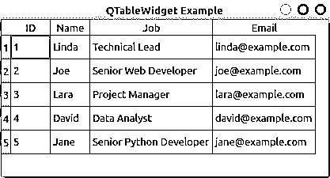
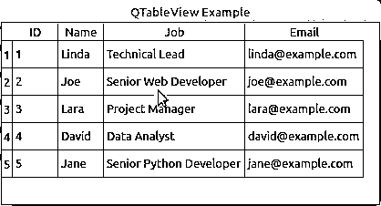

# 用 PyQt 处理 SQL 数据库:基础知识

> 原文：<https://realpython.com/python-pyqt-database/>

构建使用 [SQL 数据库](https://realpython.com/python-sql-libraries/)的应用程序是一项相当常见的编程任务。SQL 数据库无处不在，在 Python 中有很大的支持。在 GUI 编程中，PyQt 提供了健壮的、跨平台的 [SQL 数据库支持](https://www.riverbankcomputing.com/static/Docs/PyQt5/api/qtsql/qtsql-module.html)，允许您一致地创建、连接和管理您的数据库。

PyQt 的 SQL 支持与它的[模型-视图架构](https://doc.qt.io/qt-5/model-view-programming.html#the-model-view-architecture)完全集成，在构建数据库应用程序的过程中为您提供帮助。

**在本教程中，您将学习如何:**

*   使用 PyQt 的 **SQL 支持**可靠地连接到数据库
*   使用 PyQt 在数据库上执行 SQL 查询
*   在数据库应用程序中使用 PyQt 的**模型-视图架构**
*   使用不同的 PyQt **小部件**显示和编辑数据

本教程中的例子需要 SQL 语言的基础知识，尤其是对数据库管理系统 [SQLite](https://realpython.com/python-sqlite-sqlalchemy/) 的基础知识。使用 Python 和 PyQt 进行 [GUI 编程的一些知识也会有所帮助。](https://realpython.com/python-pyqt-gui-calculator/)

**免费奖励:** [掌握 Python 的 5 个想法](https://realpython.com/bonus/python-mastery-course/)，这是一个面向 Python 开发者的免费课程，向您展示将 Python 技能提升到下一个水平所需的路线图和心态。

## 将 PyQt 连接到 SQL 数据库

将一个应用程序连接到一个[关系数据库](https://en.wikipedia.org/wiki/Relational_database)并让应用程序创建、读取、更新和删除存储在该数据库中的数据是编程中的一项常见任务。关系数据库通常被组织成一组**表**，或者**关系**。表中给定的[行](https://en.wikipedia.org/wiki/Row_(database))称为**记录**或**元组**，而[列](https://en.wikipedia.org/wiki/Column_(database))称为**属性**。

**注:**术语**字段**是[常用的](https://en.wikipedia.org/wiki/Column_(database)#Field)来标识表中给定记录的单元格中存储的单个数据。另一方面，术语**字段名**用于标识列的名称。

每列存储一种特定的信息，如姓名、日期或数字。每一行代表一组密切相关的数据，并且每一行都具有相同的一般结构。例如，在存储公司雇员数据的数据库中，一个特定的行代表一个雇员。

大多数关系数据库系统使用 [SQL(结构化查询语言)](https://en.wikipedia.org/wiki/SQL)来查询、操作和维护数据库中保存的数据。SQL 是一种[声明式](https://en.wikipedia.org/wiki/Declarative_programming)和[特定于领域的](https://en.wikipedia.org/wiki/Domain-specific_language)编程语言，专门为与数据库通信而设计。

关系数据库系统和 SQL 现在被广泛使用。你会发现几种不同的数据库管理系统，比如 [SQLite](https://www.sqlite.org/about.html) 、 [PostgreSQL](https://www.postgresql.org/about/) 、 [MySQL](https://dev.mysql.com/doc/) 、 [MariaDB](https://mariadb.org/about/) 等等。您可以使用专用的 Python SQL 库将 Python 连接到这些数据库系统中的任何一个。

**注意:**尽管 PyQt 的内置 SQL 支持是在 PyQt 中管理 SQL 数据库的首选选项，但是您也可以使用任何其他库来处理数据库连接。这些库包括 [SQLAlchemy](https://realpython.com/python-sqlite-sqlalchemy/#working-with-sqlalchemy-and-python-objects) 、 [pandas](https://realpython.com/pandas-read-write-files/#sql-files) 、 [SQLite](https://realpython.com/python-sqlite-sqlalchemy/#using-sqlite-to-persist-data) 等等。

然而，使用不同的库来管理数据库有一些缺点。您将无法利用 PyQt 的 SQL 类和模型-视图架构之间的集成。此外，您将向您的应用程序添加额外的依赖项。

当使用 Python 和 PyQt 进行 GUI 编程时，PyQt 提供了一组健壮的[类来处理 SQL 数据库](https://www.riverbankcomputing.com/static/Docs/PyQt5/api/qtsql/qtsql-module.html)。当您需要将应用程序连接到 SQL 数据库时，这组类将是您最好的盟友。

**注:**不幸的是， [PyQt5 的官方文档](https://www.riverbankcomputing.com/static/Docs/PyQt5/index.html)有一些不完整的章节。要解决这个问题，您可以查看 [PyQt4 文档](https://www.riverbankcomputing.com/static/Docs/PyQt4/)，Python 文档的 [Qt，或者原始的](https://doc.qt.io/qtforpython/) [Qt 文档](https://doc.qt.io/)。在本教程中，一些链接会将您带到最初的 Qt 文档，在大多数情况下，这是一个更好的信息来源。

在本教程中，您将学习如何使用 PyQt 的 SQL 支持创建 GUI 应用程序的基础知识，该应用程序能够可靠地与关系数据库交互，以读取、写入、删除和显示数据。

[*Remove ads*](/account/join/)

### 创建数据库连接

在使用 PyQt 开发数据库应用程序的过程中，将应用程序连接到物理 SQL 数据库是一个重要的步骤。要成功执行此步骤，您需要一些关于如何设置数据库的一般信息。

例如，您需要知道您的数据库是在什么数据库管理系统上构建的，您可能还需要有用户名、密码、主机名等等。

在本教程中，您将使用 [SQLite 3](https://sqlite.org/about.html) ，这是一个经过良好测试的数据库系统，支持所有平台和最低配置要求。SQLite 允许您直接读写本地磁盘中的数据库，而不需要单独的服务器进程。这使得它成为学习数据库应用程序开发的一个用户友好的选择。

使用 SQLite 的另一个优点是 Python 和 PyQt 都附带了这个库，所以您不需要安装其他任何东西就可以开始使用它。

在 PyQt 中，可以通过使用 [`QSqlDatabase`](https://www.riverbankcomputing.com/static/Docs/PyQt5/api/qtsql/qsqldatabase.html) 类来创建数据库连接。这个类代表一个连接，并提供一个访问数据库的接口。要创建连接，只需调用`QSqlDatabase`上的 [`.addDatabase()`](https://doc.qt.io/qt-5/qsqldatabase.html#addDatabase) 。这个[静态方法](https://realpython.com/instance-class-and-static-methods-demystified/)将一个 [SQL 驱动程序](https://www.riverbankcomputing.com/static/Docs/PyQt5/api/qtsql/qsqldriver.html)和一个可选的连接名作为参数，并且[返回](https://realpython.com/python-return-statement/)一个数据库连接:

```py
QSqlDatabase.addDatabase(
    driver, connectionName=QSqlDatabase.defaultConnection
)
```

第一个参数`driver`是一个必需的参数，它保存一个[字符串](https://realpython.com/python-strings/)，该字符串包含一个受 [PyQt 支持的 SQL 驱动程序](https://doc.qt.io/qt-5/sql-driver.html#supported-databases)的名称。第二个参数`connectionName`是一个可选参数，它保存一个带有连接名称的字符串。`connectionName`默认为`QSqlDatabase.defaultConnection`，通常持有字符串`"qt_sql_default_connection"`。

如果您已经有了一个名为`connectionName`的连接，那么这个连接将被删除并替换为一个新的连接，而`.addDatabase()`会将新添加的数据库连接返回给调用者。

对`.addDatabase()`的调用将数据库连接添加到可用连接列表中。这个列表是一个**全局注册表**，PyQt 在后台维护它来跟踪应用程序中可用的连接。用一个有意义的`connectionName`注册你的连接将允许你在一个数据库应用程序中[管理几个连接](https://realpython.com/python-pyqt-database/#handling-multiple-connections)。

一旦创建了连接，您可能需要在其上设置几个[属性](https://realpython.com/python3-object-oriented-programming/#class-and-instance-attributes)。具体的属性集取决于您使用的驱动程序。一般来说，您需要设置一些属性，比如数据库名、用户名和访问数据库的密码。

以下是可用于设置数据库连接的更常用属性的 setter 方法的摘要:

| 方法 | 描述 |
| --- | --- |
| `.setDatabaseName(name)` | 将数据库名称设置为`name`，这是一个代表有效数据库名称的[字符串](https://realpython.com/python-strings/) |
| `.setHostName(host)` | 将主机名设置为`host`，这是一个表示有效主机名的字符串 |
| `.setUserName(username)` | 将用户名设置为`username`，这是一个表示有效用户名的字符串 |
| `.setPassword(password)` | 将密码设置为`password`，它是一个代表有效密码的字符串 |

请注意，您作为参数传递给`.setPassword()`的密码是以纯文本形式存储的，以后可以通过调用`.password()`来检索。这是一个严重的**安全风险**，您应该避免在您的数据库应用程序中引入。在本教程后面的[打开数据库连接](https://realpython.com/python-pyqt-database/#opening-a-database-connection)一节中，您会学到一种更安全的方法。

要使用`QSqlDatabase`创建到 SQLite 数据库的连接，请打开一个 [Python 交互会话](https://realpython.com/interacting-with-python/)，并键入以下代码:

>>>

```py
>>> from PyQt5.QtSql import QSqlDatabase

>>> con = QSqlDatabase.addDatabase("QSQLITE")
>>> con.setDatabaseName("contacts.sqlite")

>>> con
<PyQt5.QtSql.QSqlDatabase object at 0x7f0facec0c10>

>>> con.databaseName()
'contacts.sqlite'

>>> con.connectionName()
'qt_sql_default_connection'
```

这段代码将创建一个数据库连接对象，使用`"QSQLITE"`作为连接的驱动程序，使用`"contacts.sqlite"`作为连接的数据库名称。由于您没有将连接名传递给`.addDatabase()`，新创建的连接将成为您的默认连接，其名称为`"qt_sql_default_connection"`。

对于 SQLite 数据库，数据库名称通常是文件名或包含数据库文件名的路径。您还可以为内存数据库使用特殊的名称`":memory:"`。

### 处理多个连接

有些情况下，您可能需要使用到单个数据库的多个连接。例如，您可能希望使用每个用户的特定连接来记录用户与数据库的交互。

在其他情况下，您可能需要将应用程序连接到几个数据库。例如，您可能希望连接到几个远程数据库，以便收集数据来填充或更新本地数据库。

为了处理这些情况，您可以为不同的连接提供特定的名称，并通过名称引用每个连接。如果您想给数据库连接一个名称，那么将该名称作为第二个参数传递给`.addDatabase()`:

>>>

```py
>>> from PyQt5.QtSql import QSqlDatabase

>>> # First connection
>>> con1 = QSqlDatabase.addDatabase("QSQLITE", "con1")
>>> con1.setDatabaseName("contacts.sqlite")

>>> # Second connection
>>> con2 = QSqlDatabase.addDatabase("QSQLITE", "con2")
>>> con2.setDatabaseName("contacts.sqlite")

>>> con1
<PyQt5.QtSql.QSqlDatabase object at 0x7f367f5fbf90>
>>> con2
<PyQt5.QtSql.QSqlDatabase object at 0x7f3686dd7510>

>>> con1.databaseName()
'contacts.sqlite'
>>> con2.databaseName()
'contacts.sqlite'

>>> con1.connectionName()
'con1'
>>> con2.connectionName()
'con2'
```

在这里，您创建了到同一个数据库`contacts.sqlite`的两个不同的连接。每个连接都有自己的连接名称。您可以根据需要，在代码中随时使用连接名来获取对特定连接的引用。为此，您可以用一个连接名调用`.database()`:

>>>

```py
>>> from PyQt5.QtSql import QSqlDatabase

>>> db = QSqlDatabase.database("con1", open=False)

>>> db.databaseName()
'contacts.sqlite'
>>> db.connectionName()
'con1'
```

在这个例子中，您会看到`.database()`有两个参数:

1.  **`connectionName`** 保存着你需要使用的连接名。如果不传递连接名，将使用默认连接。
2.  **`open`** 保存一个[布尔](https://realpython.com/python-boolean/)值，告诉`.database()`是否要自动打开连接。如果`open`为`True`(默认)且连接未打开，则连接自动打开。

`.database()`的[返回值](https://realpython.com/python-return-statement/#understanding-the-python-return-statement)是对名为`connectionName`的连接对象的引用。您可以使用不同的连接名称来获取对特定连接对象的引用，然后使用它们来管理您的数据库。

[*Remove ads*](/account/join/)

### 使用不同的 SQL 驱动程序

到目前为止，您已经学习了如何使用 **SQLite 驱动程序**创建数据库连接。这不是 PyQt 中唯一可用的驱动程序。该库提供了一组丰富的 SQL 驱动程序，允许您根据自己的特定需求使用不同类型的数据库管理系统:

| 驱动程序名称 | 数据库管理系统 |
| --- | --- |
| [qd2](https://doc.qt.io/qt-5/sql-driver.html#qdb2) | IBM Db2(版本 7.1 和更高版本) |
| [QIBASE](https://doc.qt.io/qt-5/sql-driver.html#qibase) | Borland InterBase |
| [QMYSQL/MARIADB](https://doc.qt.io/qt-5/sql-driver.html#qmysql) | MySQL 或 Maria db(5.0 及以上版本) |
| [QOCI](https://doc.qt.io/qt-5/sql-driver.html#qoci) | Oracle 调用接口 |
| [QODBC](https://doc.qt.io/qt-5/sql-driver.html#qodbc) | 开放式数据库连接(ODBC) |
| [QPSQL](https://doc.qt.io/qt-5/sql-driver.html#qpsql) | PostgreSQL(7.3 及更高版本) |
| [QSQLITE2](https://doc.qt.io/qt-5/sql-driver.html#qsqlite2) | SQLite 2(自第 5.14 季度起已过时) |
| [QSQLITE](https://doc.qt.io/qt-5/sql-driver.html#qsqlite) | sqlite3 |
| [qtd](https://doc.qt.io/qt-5/sql-driver.html#qtds) | Sybase Adaptive Server(从第 4.7 季度起已过时) |

驱动程序名称列保存了**标识符字符串**，您需要将它作为第一个参数传递给`.addDatabase()`以使用相关的驱动程序。与 SQLite 驱动程序不同，当您使用不同的驱动程序时，您可能需要设置几个属性，如 [`databaseName`](https://www.riverbankcomputing.com/static/Docs/PyQt5/api/qtsql/qsqldatabase.html#setDatabaseName) 、 [`hostName`](https://www.riverbankcomputing.com/static/Docs/PyQt5/api/qtsql/qsqldatabase.html#setHostName) 、 [`userName`](https://www.riverbankcomputing.com/static/Docs/PyQt5/api/qtsql/qsqldatabase.html#setUserName) 和 [`password`](https://www.riverbankcomputing.com/static/Docs/PyQt5/api/qtsql/qsqldatabase.html#setPassword) ，以便连接正常工作。

数据库驱动来源于 [`QSqlDriver`](https://www.riverbankcomputing.com/static/Docs/PyQt5/api/qtsql/qsqldriver.html#) 。您可以通过子类化`QSqlDriver`来创建自己的数据库驱动程序，但是这个主题超出了本教程的范围。如果你对创建你自己的数据库驱动感兴趣，那么查看[如何编写你自己的数据库驱动](https://doc.qt.io/qt-5/sql-driver.html#how-to-write-your-own-database-driver)以获得更多细节。

### 打开数据库连接

一旦有了数据库连接，就需要打开该连接才能与数据库进行交互。为此，您在连接对象上调用 [`.open()`](https://www.riverbankcomputing.com/static/Docs/PyQt5/api/qtsql/qsqldatabase.html#open) 。`.open()`有以下两种变化:

1.  **`.open()`** 使用当前连接值打开一个数据库连接。
2.  **`.open(username, password)`** 使用提供的`username`和`password`打开数据库连接。

如果连接成功，两个变量都返回`True`。否则，它们返回`False`。如果无法建立连接，那么您可以呼叫 [`.lastError()`](https://www.riverbankcomputing.com/static/Docs/PyQt5/api/qtsql/qsqldatabase.html#lastError) 来了解所发生的事情。该函数返回数据库报告的上一个错误的信息。

**注意:**正如您之前了解到的，`.setPassword(password)`以纯文本形式存储密码，这是一个安全风险。另一方面，`.open()`根本不存储密码。它在打开连接时将密码直接传递给驱动程序。之后，它会丢弃密码。所以，如果你想防止安全问题，使用`.open()`来管理你的密码是一个不错的选择。

下面是如何使用`.open()`的第一个变体打开 SQLite 数据库连接的示例:

>>>

```py
>>> from PyQt5.QtSql import QSqlDatabase

>>> # Create the connection
>>> con = QSqlDatabase.addDatabase("QSQLITE")
>>> con.setDatabaseName("contacts.sqlite")

>>> # Open the connection
>>> con.open()
True
>>> con.isOpen()
True
```

在上面的例子中，首先创建一个到 SQLite 数据库的连接，并使用`.open()`打开该连接。由于`.open()`返回`True`，连接成功。此时，您可以使用`.isOpen()`来检查连接，如果连接打开，则返回`True`，否则返回`False`。

**注意:**如果您在使用 SQLite 驱动程序的连接上调用`.open()`，而数据库文件不存在，那么将自动创建一个新的空数据库文件。

在现实世界的应用程序中，在尝试对数据进行任何操作之前，需要确保与数据库的连接是有效的。否则，您的应用程序可能会崩溃和失败。例如，如果您对试图创建数据库文件的目录没有写权限，该怎么办？您需要确保您正在处理打开连接时可能发生的任何错误。

调用`.open()`的一种常见方式是将其包装在一个[条件语句](https://realpython.com/python-conditional-statements/)中。这允许您处理打开连接时可能出现的错误:

>>>

```py
>>> import sys
>>> from PyQt5.QtSql import QSqlDatabase

>>> # Create the connection
>>> con = QSqlDatabase.addDatabase("QSQLITE")
>>> con.setDatabaseName("contacts.sqlite")

>>> # Open the connection and handle errors
>>> if not con.open():
...     print("Unable to connect to the database")
...     sys.exit(1)
```

将对`.open()`的调用包装在条件语句中，允许您处理打开连接时发生的任何错误。这样，您可以在应用程序运行之前通知您的用户任何问题。注意，应用程序以`1`的[退出状态](https://en.wikipedia.org/wiki/Exit_status)退出，这通常用于指示程序失败。

在上面的例子中，您在交互会话中使用了`.open()`，所以您使用 [`print()`](https://realpython.com/python-print/) 向用户显示错误消息。然而，在 GUI 应用程序中，你通常使用一个 [`QMessageBox`](https://doc.qt.io/qt-5/qmessagebox.html) 对象，而不是使用`print()`。使用`QMessageBox`，你可以创建小对话框向用户展示信息。

下面是一个示例 GUI 应用程序，它说明了处理连接错误的方法:

```py
 1import sys
 2
 3from PyQt5.QtSql import QSqlDatabase
 4from PyQt5.QtWidgets import QApplication, QMessageBox, QLabel
 5
 6# Create the connection
 7con = QSqlDatabase.addDatabase("QSQLITE")
 8con.setDatabaseName("/home/contacts.sqlite")
 9
10# Create the application
11app = QApplication(sys.argv)
12
13# Try to open the connection and handle possible errors
14if not con.open():
15    QMessageBox.critical(
16        None,
17        "App Name - Error!",
18        "Database Error: %s" % con.lastError().databaseText(),
19    )
20    sys.exit(1)
21
22# Create the application's window
23win = QLabel("Connection Successfully Opened!")
24win.setWindowTitle("App Name")
25win.resize(200, 100)
26win.show()
27sys.exit(app.exec_())
```

第 14 行的`if`语句检查连接是否不成功。如果`/home/`目录不存在，或者如果您没有权限写入该目录，那么对`.open()`的调用就会失败，因为无法创建数据库文件。在这种情况下，**执行流**进入`if`语句代码块，并在屏幕上显示一条消息。

如果您将路径更改为可以写入的任何其他目录，那么对`.open()`的调用将会成功，您将会看到一个显示消息`Connection Successfully Opened!`的窗口，在所选目录中您还会有一个名为`contacts.sqlite`的新数据库文件。

请注意，您将`None`作为消息的**父代**传递，因为在显示消息时，您还没有创建窗口，所以您没有消息框的可行父代。

[*Remove ads*](/account/join/)

## 使用 PyQt 运行 SQL 查询

有了功能齐全的数据库连接，您就可以开始使用数据库了。为此，您可以使用基于字符串的 SQL 查询和 [`QSqlQuery`](https://www.riverbankcomputing.com/static/Docs/PyQt5/api/qtsql/qsqlquery.html#) 对象。`QSqlQuery`允许您在数据库中运行任何类型的 SQL 查询。使用`QSqlQuery`，可以执行[数据操作语言(DML)](https://en.wikipedia.org/wiki/Data_manipulation_language) 语句，如[`SELECT`](https://en.wikipedia.org/wiki/Select_(SQL))[`INSERT`](https://en.wikipedia.org/wiki/Insert_(SQL))[`UPDATE`](https://en.wikipedia.org/wiki/Update_(SQL))[`DELETE`](https://en.wikipedia.org/wiki/Delete_(SQL))，以及[数据定义语言(DDL)](https://en.wikipedia.org/wiki/Data_definition_language) 语句，如 [`CREATE TABLE`](https://en.wikipedia.org/wiki/Data_definition_language#CREATE_TABLE_statement) 等。

`QSqlQuery`的构造函数有几种变体，但是在本教程中，您将了解其中的两种:

1.  **`QSqlQuery(query, connection)`** 使用基于字符串的 SQL `query`和数据库`connection`构造查询对象。如果没有指定连接，或者指定的连接无效，则使用默认的数据库连接。如果`query`不是空字符串，那么它将被立即执行。

2.  **`QSqlQuery(connection)`** 使用`connection`构造查询对象。如果`connection`无效，则使用默认连接。

您还可以创建`QSqlQuery`对象，而无需向构造函数传递任何参数。在这种情况下，查询将使用默认的数据库连接(如果有的话)。

要执行查询，需要在查询对象上调用`.exec()`。您可以以两种不同的方式使用`.exec()`:

1.  **`.exec(query)`** 执行`query`中包含的基于字符串的 SQL 查询。如果查询成功，它返回`True`，否则返回`False`。

2.  **`.exec()`** 执行先前准备好的 SQL 查询。如果查询成功，它返回`True`，否则返回`False`。

**注意:** PyQt 也用名字`.exec_()`实现了`QSqlQuery.exec()`的变体。这些提供了与旧版本 Python 的向后兼容性，其中`exec`是该语言的[关键字](https://realpython.com/python-keywords/)。

现在您已经知道了使用`QSqlQuery`创建和执行 SQL 查询的基础，您已经准备好学习如何将您的知识付诸实践。

### 执行静态 SQL 查询

要开始使用 PyQt 创建和执行查询，您需要启动您最喜欢的[代码编辑器或 IDE](https://realpython.com/python-ides-code-editors-guide/) ，并创建一个名为`queries.py`的 Python 脚本。保存脚本，并向其中添加以下代码:

```py
 1import sys
 2
 3from PyQt5.QtSql import QSqlDatabase, QSqlQuery
 4
 5# Create the connection
 6con = QSqlDatabase.addDatabase("QSQLITE")
 7con.setDatabaseName("contacts.sqlite")
 8
 9# Open the connection
10if not con.open():
11    print("Database Error: %s" % con.lastError().databaseText())
12    sys.exit(1)
13
14# Create a query and execute it right away using .exec()
15createTableQuery = QSqlQuery()
16createTableQuery.exec(
17    """
18 CREATE TABLE contacts (
19 id INTEGER PRIMARY KEY AUTOINCREMENT UNIQUE NOT NULL,
20 name VARCHAR(40) NOT NULL,
21 job VARCHAR(50),
22 email VARCHAR(40) NOT NULL
23 )
24 """
25)
26
27print(con.tables())
```

在这个脚本中，首先导入将要使用的模块和类。然后使用 SQLite 驱动程序使用`.addDatabase()`创建一个数据库连接。您将数据库名称设置为`"contacts.sqlite"`并打开连接。

为了创建您的第一个查询，您实例化了没有任何参数的`QSqlQuery`。有了查询对象后，调用`.exec()`，将基于字符串的 SQL 查询作为参数传递。这种查询被称为**静态查询**，因为它不从查询外部获取任何参数。

上面的 SQL 查询在数据库中创建了一个名为`contacts`的新表。该表将包含以下四列:

| 圆柱 | 内容 |
| --- | --- |
| `id` | 带有表的[主键](https://en.wikipedia.org/wiki/Primary_key)的整数 |
| `name` | 包含联系人姓名的字符串 |
| `job` | 包含联系人职务的字符串 |
| `email` | 联系人电子邮件的字符串 |

上面脚本的最后一行打印数据库中包含的表的列表。如果您[运行脚本](https://realpython.com/run-python-scripts/)，那么您会注意到在您当前的目录中创建了一个名为`contacts.sqlite`的新数据库文件。您还会在屏幕上看到类似于`['contacts', 'sqlite_sequence']`的内容。这个[列表](https://realpython.com/python-lists-tuples/)包含数据库中的表名。

**注意:**基于字符串的 SQL 查询必须根据您正在查询的特定 SQL 数据库使用适当的语法。如果语法错误，那么`.exec()`忽略查询并返回`False`。

对于 SQLite，查询一次只能包含一条语句。

在一个`QSqlQuery`对象上调用`.exec()`是在数据库上立即执行基于字符串的 SQL 查询的一种常见方式，但是如果您想为以后的执行预先准备好查询呢？这是下一节的主题。

### 执行动态查询:字符串格式化

到目前为止，您已经学习了如何在数据库上执行静态查询。静态查询是那些不接受**参数**的查询，所以查询按原样运行。尽管这些查询非常有用，但有时您需要创建查询来检索数据以响应某些输入参数。

在执行时接受参数的查询被称为动态查询。使用参数允许您微调查询并检索数据以响应特定的参数值。不同的值会产生不同的结果。您可以使用以下两种方法之一在查询中获取输入参数:

1.  动态构建查询，使用[字符串格式](https://realpython.com/python-string-formatting/)插入参数值。
2.  使用占位符参数准备查询，然后将特定值绑定到参数。

第一种方法允许您快速创建动态查询。但是，为了安全地使用这种方法，您需要确保您的参数值来自可靠的来源。否则，你可能会面临 [SQL 注入的攻击](https://realpython.com/prevent-python-sql-injection/)。

下面是一个如何在 PyQt 中使用字符串格式创建动态查询的示例:

>>>

```py
>>> from PyQt5.QtSql import QSqlQuery, QSqlDatabase

>>> con = QSqlDatabase.addDatabase("QSQLITE")
>>> con.setDatabaseName("contacts.sqlite")
>>> con.open()
True

>>> name = "Linda"
>>> job = "Technical Lead"
>>> email = "linda@example.com"

>>> query = QSqlQuery()
>>> query.exec(
...     f"""INSERT INTO contacts (name, job, email)
...     VALUES ('{name}', '{job}', '{email}')"""
... )
True
```

在这个例子中，您使用一个 [f 字符串](https://realpython.com/python-f-strings/)来创建一个动态查询，方法是将特定的值插入到一个基于字符串的 SQL 查询中。最后一个查询将数据插入到您的`contacts`表中，该表现在包含关于`Linda`的数据。

**注意:**在本教程的后面，您将看到如何[检索和导航](https://realpython.com/python-pyqt-database/#navigating-the-records-in-a-query)存储在数据库中的数据。

注意，为了让这种动态查询工作，您需要确保要插入的值具有正确的数据类型。因此，您在 f 字符串中的占位符周围使用单引号，因为这些值需要是字符串。

[*Remove ads*](/account/join/)

### 执行动态查询:占位符参数

执行动态查询的第二种方法要求您使用带有参数占位符**的模板来预先准备查询。PyQt 支持两种参数占位符样式:**

1.  **Oracle style** 使用命名占位符，如`:name`或`:email`。
2.  **ODBC 样式**使用问号(`?`)作为位置占位符。

请注意，这些样式不能在同一个查询中混合使用。您可以查看绑定值的[方法，以获得如何使用占位符的额外示例。](https://www.riverbankcomputing.com/static/Docs/PyQt5/api/qtsql/qsqlquery.html#approaches-to-binding-values)

**注:** ODBC 代表[开放式数据库连接](https://en.wikipedia.org/wiki/Open_Database_Connectivity)。

要在 PyQt 中创建这种动态查询，首先为每个查询参数创建一个带有占位符的模板，然后将该模板作为一个参数传递给`.prepare()`，它解析、编译并准备查询模板以供执行。如果模板有任何问题，比如 SQL 语法错误，那么`.prepare()`无法编译模板并返回`False`。

如果准备过程成功，那么`prepare()`返回`True`。之后，您可以使用带有命名参数或位置参数的`.bindValue()`或带有位置参数的`.addBindValue()`将特定值传递给每个参数。`.bindValue()`有以下两种变体:

1.  `.bindValue(placeholder, val)`
2.  `.bindValue(pos, val)`

在第一个变体中，`placeholder`表示一个 Oracle 样式的占位符。在第二个变体中，`pos`表示一个从零开始的整数，带有查询中参数的位置。在这两种变体中，`val`保存要绑定到特定参数的值。

使用位置绑定向占位符列表添加一个值。这意味着对`.addBindValue()`的调用顺序决定了哪个值将被绑定到准备好的查询中的每个占位符参数。

要开始使用准备好的查询，您可以准备一个`INSERT INTO` SQL 语句，用一些样本数据填充您的数据库。回到您在[执行静态 SQL 查询](https://realpython.com/python-pyqt-database/#executing-static-sql-queries)一节中创建的脚本，并在调用`print()`之后添加以下代码:

```py
28# Creating a query for later execution using .prepare()
29insertDataQuery = QSqlQuery()
30insertDataQuery.prepare(
31    """
32 INSERT INTO contacts (
33 name,
34 job,
35 email
36 )
37 VALUES (?, ?, ?)
38 """
39)
40
41# Sample data
42data = [
43    ("Joe", "Senior Web Developer", "joe@example.com"),
44    ("Lara", "Project Manager", "lara@example.com"),
45    ("David", "Data Analyst", "david@example.com"),
46    ("Jane", "Senior Python Developer", "jane@example.com"),
47]
48
49# Use .addBindValue() to insert data
50for name, job, email in data:
51    insertDataQuery.addBindValue(name)
52    insertDataQuery.addBindValue(job)
53    insertDataQuery.addBindValue(email)
54    insertDataQuery.exec()
```

第一步是创建一个`QSqlQuery`对象。然后在查询对象上调用`.prepare()`。在这种情况下，占位符使用 ODBC 样式。您的查询将获取联系人的`name`、`job`和`email`的值，因此您需要三个占位符。因为`id`列是一个自动递增的整数，所以不需要为它提供值。

然后创建一些样本数据来填充数据库。`data`保存了元组的[列表，每个元组包含三项:每个联系人的姓名、工作和电子邮件。](https://realpython.com/python-lists-tuples/)

最后一步是绑定要传递给每个占位符的值，然后调用`.exec()`来执行查询。为此，您使用一个 [`for`循环](https://realpython.com/python-for-loop/)。循环头将`data`中的每个元组解包成三个独立的[变量](https://realpython.com/python-variables/)，并使用方便的名称。然后调用查询对象上的`.addBindValue()`将值绑定到占位符。

注意，您使用的是**位置占位符**，因此您调用`.addBindValue()`的顺序将定义每个值传递给相应占位符的顺序。

当您希望使用来自用户输入的值来定制查询时，这种创建动态查询的方法非常方便。每当您接受用户的输入来完成对数据库的查询时，您就面临着 SQL 注入的安全风险。

在 PyQt 中，组合使用`.prepare()`、`.bindValue()`和`.addBindValue()`可以完全保护您免受 SQL 注入攻击，所以当您接受不可信的输入来完成查询时，这是一个不错的选择。

### 在查询中导航记录

如果您执行一个`SELECT`语句，那么您的`QSqlQuery`对象将从数据库中的一个或多个表中检索零个或多个记录。该查询将保存包含与查询条件匹配的数据的记录。如果没有符合条件的数据，那么您的查询将为空。

`QSqlQuery`提供了一组**导航方法**，您可以使用它们在查询结果中的记录间移动:

| 方法 | 恢复 |
| --- | --- |
| [T2`.next()`](https://www.riverbankcomputing.com/static/Docs/PyQt5/api/qtsql/qsqlquery.html#next) | 下一张唱片 |
| [T2`.previous()`](https://www.riverbankcomputing.com/static/Docs/PyQt5/api/qtsql/qsqlquery.html#previous) | 以前的记录 |
| [T2`.first()`](https://www.riverbankcomputing.com/static/Docs/PyQt5/api/qtsql/qsqlquery.html#first) | 第一张唱片 |
| [T2`.last()`](https://www.riverbankcomputing.com/static/Docs/PyQt5/api/qtsql/qsqlquery.html#last) | 最后一张唱片 |
| [T2`.seek(index, relative=False)`](https://www.riverbankcomputing.com/static/Docs/PyQt5/api/qtsql/qsqlquery.html#seek) | 位置`index`的记录 |

如果记录可用，所有这些方法都将查询对象定位在检索到的记录上。大多数方法在使用时都有特定的[规则](https://www.riverbankcomputing.com/static/Docs/PyQt5/api/qtsql/qsqlquery.html#next)。使用这些方法，您可以在查询结果的记录中向前、向后或任意移动。因为它们都返回`True`或`False`，所以您可以在 [`while`循环](https://realpython.com/python-while-loop/)中使用它们来一次导航所有记录。

这些方法与**主动查询**一起工作。当您成功地对一个查询运行了`.exec()`时，该查询是活动的，但是该查询还没有完成。一旦一个活动查询位于一个有效记录上，您就可以使用 [`.value(index)`](https://www.riverbankcomputing.com/static/Docs/PyQt5/api/qtsql/qsqlquery.html#value) 从该记录中检索数据。该方法采用一个从零开始的整数`index`，并返回当前记录中该索引(列)处的值。

**注意:**如果您执行一个`SELECT *`类型的查询，那么结果中的列将不会遵循已知的顺序。当您使用`.value()`检索给定列的值时，这可能会导致问题，因为无法知道您是否使用了正确的列索引。

您将看到一些例子，展示如何使用一些导航方法在下面的查询中移动。但是首先，您需要创建一个到数据库的连接:

>>>

```py
>>> from PyQt5.QtSql import QSqlDatabase, QSqlQuery

>>> con = QSqlDatabase.addDatabase("QSQLITE")
>>> con.setDatabaseName("contacts.sqlite")
>>> con.open()
True
```

在这里，您创建并打开一个到`contacts.sqlite`的新连接。如果到目前为止您一直在学习本教程，那么这个数据库已经包含了一些示例数据。现在您可以创建一个`QSqlQuery`对象，并对该数据执行它:

>>>

```py
>>> # Create and execute a query
>>> query = QSqlQuery()
>>> query.exec("SELECT name, job, email FROM contacts")
True
```

该查询检索存储在`contacts`表中的所有联系人的`name`、`job`和`email`的数据。由于`.exec()`返回了`True`，查询成功，现在是一个活动查询。您可以使用之前看到的任何导航方法来导航该查询中的记录。您还可以使用`.value()`检索记录中任何一列的数据:

>>>

```py
>>> # First record
>>> query.first()
True

>>> # Named indices for readability
>>> name, job, email = range(3)

>>> # Retrieve data from the first record
>>> query.value(name)
'Linda'

>>> # Next record
>>> query.next()
True
>>> query.value(job)
'Senior Web Developer'

>>> # Last record
>>> query.last()
True
>>> query.value(email)
'jane@example.com'
```

使用导航方法，您可以在查询结果中移动。使用`.value()`，您可以检索给定记录中任何列的数据。

您还可以使用一个`while`循环和`.next()`遍历查询中的所有记录:

>>>

```py
>>> query.exec()
True

>>> while query.next():
...     print(query.value(name), query.value(job), query.value(email))
...
Linda Technical Lead linda@example.com
Joe Senior Web Developer joe@example.com
...
```

使用`.next()`，您可以浏览查询结果中的所有记录。`.next()`的工作方式类似于 Python 中的[迭代器协议](https://docs.python.org/3.8/library/stdtypes.html#iterator-types)。一旦您遍历了查询结果中的记录，`.next()`就开始返回`False`，直到您再次运行`.exec()`。对`.exec()`的调用从数据库中检索数据，并将查询对象的内部[指针](https://realpython.com/pointers-in-python/)放在第一条记录之前的一个位置，因此当您调用`.next()`时，您将再次获得第一条记录。

您也可以使用`.previous()`以相反的顺序循环:

>>>

```py
>>> while query.previous():
...     print(query.value(name), query.value(job), query.value(email))
...
Jane Senior Python Developer jane@example.com
David Data Analyst david@example.com
...
```

`.previous()`的工作与`.next()`相似，但是迭代是以相反的顺序进行的。换句话说，循环从查询指针的位置返回到第一条记录。

有时，您可能希望通过使用表中给定列的名称来获取标识该列的索引。为此，您可以对`.record()`的返回值调用`.indexOf()`:

>>>

```py
>>> query.first()
True

>>> # Get the index of name
>>> name = query.record().indexOf("name")

>>> query.value(name)
'Linda'

>>> # Finish the query object if unneeded
>>> query.finish()
>>> query.isActive()
False
```

对`.record()`结果的`.indexOf()`调用返回了`"name"`列的索引。如果`"name"`不存在，那么`.indexOf()`返回`-1`。当使用列顺序未知的`SELECT *`语句时，这很方便。最后，如果您完成了一个查询对象，那么您可以通过调用`.finish()`使它不活动。这将释放与当前查询对象相关的系统内存。

[*Remove ads*](/account/join/)

## 关闭和移除数据库连接

在实践中，一些 PyQt 应用程序依赖于数据库，而另一些则不依赖。依赖于数据库的应用程序通常在创建任何窗口或图形组件之前创建并打开数据库连接，并保持连接打开，直到应用程序关闭。

另一方面，不依赖于数据库但使用数据库提供某些功能的应用程序通常只在需要时才连接到数据库。在这些情况下，您可以在使用后关闭连接，并释放与该连接相关的资源，如系统内存。

要关闭 PyQt 中的连接，可以在连接上调用 [`.close()`](https://www.riverbankcomputing.com/static/Docs/PyQt5/api/qtsql/qsqldatabase.html#close) 。该方法关闭连接并释放所有获取的资源。它还会使任何关联的`QSqlQuery`对象无效，因为没有活动连接它们就无法正常工作。

下面是如何使用`.close()`关闭活动数据库连接的示例:

>>>

```py
>>> from PyQt5.QtSql import QSqlDatabase

>>> con = QSqlDatabase.addDatabase("QSQLITE")
>>> con.setDatabaseName("contacts.sqlite")

>>> con.open()
True
>>> con.isOpen()
True

>>> con.close()
>>> con.isOpen()
False
```

您可以在一个连接上调用`.close()`来关闭它并释放所有相关的资源。为了确保一个连接被关闭，你调用 [`.isOpen()`](https://www.riverbankcomputing.com/static/Docs/PyQt5/api/qtsql/qsqldatabase.html#isOpen) 。

请注意，`QSqlQuery`对象在关闭其关联的连接后仍保留在内存中，因此您必须通过调用 [`.finish()`](https://www.riverbankcomputing.com/static/Docs/PyQt5/api/qtsql/qsqlquery.html#finish) 或 [`.clear()`](https://www.riverbankcomputing.com/static/Docs/PyQt5/api/qtsql/qsqlquery.html#clear) 或在关闭连接前删除`QSqlQuery`对象来使您的查询处于非活动状态。否则，查询对象中会遗漏剩余内存。

您可以重新打开并重用任何以前关闭的连接。这是因为`.close()`不会从可用连接列表中删除连接，所以它们仍然可用。

您也可以使用 [`.removeDatabase()`](https://www.riverbankcomputing.com/static/Docs/PyQt5/api/qtsql/qsqldatabase.html#removeDatabase) 完全移除您的数据库连接。为了安全起见，首先使用`.finish()`完成查询，然后使用`.close()`关闭数据库，最后移除连接。您可以使用`.removeDatabase(connectionName)`从可用连接列表中删除名为`connectionName`的数据库连接。移除的连接不再可用于手边的应用程序。

要移除默认的数据库连接，可以对 [`.database()`](https://doc.qt.io/qt-5/qsqldatabase.html#database) 返回的对象调用 [`.connectionName()`](https://doc.qt.io/qt-5/qsqldatabase.html#connectionName) ，并将结果传递给`.removeDatabase()`:

>>>

```py
>>> # The connection is closed but still in the list of connections
>>> QSqlDatabase.connectionNames()
['qt_sql_default_connection']

>>> # Remove the default connection
>>> QSqlDatabase.removeDatabase(QSqlDatabase.database().connectionName())

>>> # The connection is no longer in the list of connections
>>> QSqlDatabase.connectionNames()
[]

>>> # Try to open a removed connection
>>> con.open()
False
```

这里，对`.connectionNames()`的调用返回可用连接的列表。在这种情况下，您只有一个连接，这是默认连接。然后使用`.removeDatabase()`移除连接。

**注意:**在关闭和删除数据库连接之前，您需要确保使用该连接的所有内容都被删除或设置为使用不同的数据源。否则，你会有一个**资源泄露**。

因为您需要一个连接名来使用`.removeDatabase()`，所以您在`.database()`的结果上调用`.connectionName()`来获得默认连接的名称。最后，您再次调用`.connectionNames()`来确保该连接不再在可用连接列表中。试图打开一个删除的连接将返回`False`，因为该连接不再存在。

## 用 PyQt 显示和编辑数据

在使用数据库的 GUI 应用程序中，一个常见的需求是能够使用不同的小部件从数据库中加载、显示和编辑数据。[表格](https://www.riverbankcomputing.com/static/Docs/PyQt5/api/qtwidgets/qtableview.html#)、[列表](https://www.riverbankcomputing.com/static/Docs/PyQt5/api/qtwidgets/qlistview.html#)、[树](https://www.riverbankcomputing.com/static/Docs/PyQt5/api/qtwidgets/qtreeview.html#)控件是 GUI 中管理数据的常用控件。

PyQt 为管理数据提供了两种不同的小部件:

1.  标准小部件包括用于存储数据的内部容器。
2.  **视图小部件**不维护内部数据容器，而是使用**模型**来访问数据。

对于管理小型数据库的小型 GUI 应用程序，您可以使用第一种方法。当您构建管理大型数据库的复杂 GUI 应用程序时，第二种方法非常方便。

第二种方法利用了 PyQt 的[模型视图编程](https://doc.qt.io/qt-5/model-view-programming.html)。使用这种方法，一方面有表示视图(如表、列表和树)的小部件，另一方面有与数据通信的模型类。

[*Remove ads*](/account/join/)

### 理解 PyQt 的模型-视图架构

[模型-视图-控制器(MVC)](https://realpython.com/the-model-view-controller-mvc-paradigm-summarized-with-legos/) 设计模式是一种通用软件模式，旨在将应用程序的代码分为三个通用层，每个层都有不同的角色。

**模型**负责应用程序的[业务逻辑](https://en.wikipedia.org/wiki/Business_logic),**视图**提供屏幕显示，而**控制器**连接模型和视图以使应用程序工作。

Qt 提供了 MVC 的定制变体。他们称之为[模型-视图架构](https://doc.qt.io/qt-5/model-view-programming.html#the-model-view-architecture)，它也适用于 PyQt。该模式还将逻辑分为三个部分:

1.  **模型**与数据通信并访问数据。它们还定义了视图和代理用来访问数据的接口。所有型号均基于 [`QAbstractItemModel`](https://www.riverbankcomputing.com/static/Docs/PyQt5/api/qtcore/qabstractitemmodel.html#) 。一些常用的模型包括`QStandardItemModel`、`QFileSystemModel`和 SQL 相关的模型。

2.  **视图**负责向用户显示数据。它们还具有与 MVC 模式中的控制器相似的功能。所有视图均基于 [`QAbstractItemView`](https://www.riverbankcomputing.com/static/Docs/PyQt5/api/qtwidgets/qabstractitemview.html#) 。一些常用的视图有`QListView`、`QTableView`和`QTreeView`。

3.  **委托**绘制视图项目并提供用于修改项目的编辑器部件。如果某个项目被修改，它们还会与模型进行通信。基类是 [`QAbstractItemDelegate`](https://www.riverbankcomputing.com/static/Docs/PyQt5/api/qtwidgets/qabstractitemdelegate.html) 。

将类分成这三个组件意味着模型上的变化将自动反映在相关的视图或小部件上，并且通过委托对视图或小部件的变化将自动更新底层模型。

此外，您可以在不同的视图中显示相同的数据，而不需要多个模型。

### 使用标准部件类

PyQt 提供了一堆标准的小部件,用于在 GUI 应用程序中显示和编辑数据。这些标准小部件提供了表格、树和列表等视图。它们还为存储数据提供了一个内部容器，并为编辑数据提供了方便的委托。所有这些特性都归入一个类。

以下是其中的三个标准类:

| 标准等级 | 显示 |
| --- | --- |
| [T2`QListWidget`](https://www.riverbankcomputing.com/static/Docs/PyQt5/api/qtwidgets/qlistwidget.html#) | 项目清单 |
| [T2`QTreeWidget`](https://www.riverbankcomputing.com/static/Docs/PyQt5/api/qtwidgets/qtreewidget.html#) | 项目的层次树 |
| [T2`QTableWidget`](https://www.riverbankcomputing.com/static/Docs/PyQt5/api/qtwidgets/qtablewidget.html#) | 项目表 |

在显示和编辑数据方面，可以说是最受欢迎的小部件。它创建了一个由 [`QTableWidgetItem`](https://www.riverbankcomputing.com/static/Docs/PyQt5/api/qtwidgets/qtablewidgetitem.html#) 对象组成的 2D 数组。每一项都以字符串形式保存一个单独的值。所有这些值都显示并组织在一个由行和列组成的表格中。

您至少可以对一个`QTableWidget`对象执行以下操作:

*   使用委托对象编辑其项目的内容
*   使用 [`.setItem()`](https://www.riverbankcomputing.com/static/Docs/PyQt5/api/qtwidgets/qtablewidget.html#setItem) 添加新项目
*   使用 [`.setRowCount()`](https://www.riverbankcomputing.com/static/Docs/PyQt5/api/qtwidgets/qtablewidget.html#setRowCount) 和 [`.setColumnCount()`](https://www.riverbankcomputing.com/static/Docs/PyQt5/api/qtwidgets/qtablewidget.html#setColumnCount) 设置行数和列数
*   使用 [`setHorizontalHeaderLabels()`](https://www.riverbankcomputing.com/static/Docs/PyQt5/api/qtwidgets/qtablewidget.html#setHorizontalHeaderLabels) 和 [`.setVerticalHeaderLabels`](https://www.riverbankcomputing.com/static/Docs/PyQt5/api/qtwidgets/qtablewidget.html#setVerticalHeaderLabels) 添加纵横表头标签

下面是一个示例应用程序，展示了如何使用一个`QTableWidget`对象在 GUI 中显示数据。应用程序使用您在前面几节中创建和填充的数据库，因此如果您想要运行它，那么您需要将代码保存到您拥有`contacts.sqlite`数据库的同一个目录中:

[](https://files.realpython.com/media/QTableWidget-Example.125898884fac.png)

如果您双击表格的任何单元格，那么您将能够编辑单元格的内容。但是，您的更改不会保存到数据库中。

下面是您的应用程序的代码:

```py
 1import sys
 2
 3from PyQt5.QtSql import QSqlDatabase, QSqlQuery
 4from PyQt5.QtWidgets import (
 5    QApplication,
 6    QMainWindow,
 7    QMessageBox,
 8    QTableWidget,
 9    QTableWidgetItem,
10)
11
12class Contacts(QMainWindow):
13    def __init__(self, parent=None):
14        super().__init__(parent)
15        self.setWindowTitle("QTableView Example")
16        self.resize(450, 250)
17        # Set up the view and load the data
18        self.view = QTableWidget()
19        self.view.setColumnCount(4)
20        self.view.setHorizontalHeaderLabels(["ID", "Name", "Job", "Email"])
21        query = QSqlQuery("SELECT id, name, job, email FROM contacts")
22        while query.next():
23            rows = self.view.rowCount()
24            self.view.setRowCount(rows + 1)
25            self.view.setItem(rows, 0, QTableWidgetItem(str(query.value(0))))
26            self.view.setItem(rows, 1, QTableWidgetItem(query.value(1)))
27            self.view.setItem(rows, 2, QTableWidgetItem(query.value(2)))
28            self.view.setItem(rows, 3, QTableWidgetItem(query.value(3)))
29        self.view.resizeColumnsToContents()
30        self.setCentralWidget(self.view)
31
32def createConnection():
33    con = QSqlDatabase.addDatabase("QSQLITE")
34    con.setDatabaseName("contacts.sqlite")
35    if not con.open():
36        QMessageBox.critical(
37            None,
38            "QTableView Example - Error!",
39            "Database Error: %s" % con.lastError().databaseText(),
40        )
41        return False
42    return True
43
44app = QApplication(sys.argv)
45if not createConnection():
46    sys.exit(1)
47win = Contacts()
48win.show()
49sys.exit(app.exec_())
```

以下是本例中发生的情况:

*   **第 18 到 20 行**创建一个`QTableWidget`对象，将列数设置为`4`，并为每一列的标题设置用户友好的标签。
*   **第 21 行**在数据库上创建并执行一个`SELECT` SQL 查询，以获取`contacts`表中的所有数据。
*   **第 22 行**开始一个`while`循环，使用`.next()`导航查询结果中的记录。
*   **第 24 行**使用`.setRowCount()`通过`1`增加表格中的行数。
*   **第 25 到 28 行**使用`.setItem()`将数据项添加到您的表格中。注意，由于`id`列中的值是整数，您需要将它们转换成字符串，以便能够将它们存储在`QTableWidgetItem`对象中。

`.setItem()`需要三个参数:

1.  **`row`** 保存一个从零开始的整数，表示表中给定行的索引。
2.  **`column`** 保存一个从零开始的整数，表示表中给定列的索引。
3.  **`item`** 保存需要放置在表格中给定单元格的`QTableWidgetItem`对象。

最后，在视图上调用`.resizeColumnsToContents()`来调整列的大小以适应它们的内容，并提供更好的数据呈现。

使用标准小部件显示和编辑数据库表可能会成为一项具有挑战性的任务。这是因为您将拥有相同数据的两份副本。换句话说，您将在两个位置拥有数据的副本:

1.  在小部件外部，在您的数据库中
2.  在小部件内部，在小部件的内部容器中

您负责手动同步数据的两个副本，这可能是一个令人讨厌且容易出错的操作。幸运的是，您可以使用 PyQt 的模型视图架构来避免这些问题，您将在下一节中看到。

[*Remove ads*](/account/join/)

### 使用视图和模型类

PyQt 的模型视图类消除了使用标准小部件类构建数据库应用程序时可能出现的数据复制和同步问题。模型-视图架构允许您使用多个视图来显示相同的数据，因为您可以将一个模型传递给多个视图。

模型类提供了一个[应用程序编程接口(API)](https://en.wikipedia.org/wiki/API) ，您可以使用它来操作数据。视图类提供了方便的委托对象，您可以使用这些对象直接编辑视图中的数据。要将一个视图与一个给定的模块连接起来，您需要在视图对象上调用`.setModel()`。

PyQt 提供了一组支持模型-视图架构的视图类:

| 查看类别 | 显示 |
| --- | --- |
| [T2`QListView`](https://doc.qt.io/qt-5/qlistview.html) | 直接从模型类中获取值的项目列表 |
| [T2`QTreeView`](https://doc.qt.io/qt-5/qtreeview.html) | 直接从模型类中获取值的分层项目树 |
| [T2`QTableView`](https://doc.qt.io/qt-5/qtableview.html) | 直接从模型类中获取值的项目表 |

您可以使用这些视图类和模型类来创建您的数据库应用程序。这将使您的应用程序更加健壮，编码速度更快，更不容易出错。

下面是 PyQt 为处理 SQL 数据库提供的一些模型类:

| 模型类 | 描述 |
| --- | --- |
| [T2`QSqlQueryModel`](https://doc.qt.io/qt-5/qsqlquerymodel.html) | 用于 SQL 查询的只读数据模型 |
| [T2`QSqlTableModel`](https://doc.qt.io/qt-5/qsqltablemodel.html) | 用于在单个表中读写记录的可编辑数据模型 |
| [T2`QSqlRelationalTableModel`](https://doc.qt.io/qt-5/qsqlrelationaltablemodel.html) | 用于在关系表中读写记录的可编辑数据模型 |

一旦您将这些模型之一连接到物理数据库表或查询，您就可以使用它们来填充您的视图。视图提供了委托对象，允许您直接在视图中修改数据。连接到视图的模型将更新数据库中的数据，以反映视图中的任何更改。请注意，您不必手动更新数据库中的数据。模特会帮你做到的。

下面的例子展示了如何使用 PyQt 的模型-视图架构将一个`QTableView`对象和一个`QSqlTableModel`对象结合起来构建一个数据库应用程序:

[](https://files.realpython.com/media/QTableView-Example.e51e9f6a1e11.gif)

要编辑表格单元格中的数据，您可以双击该单元格。一个方便的 delegate 小部件将显示在单元格中，允许您编辑其内容。然后你可以点击 `Enter` 保存修改。

自动处理和保存数据变化的能力是使用 PyQt 的模型视图类的最重要的优势之一。模型-视图架构将提高您的生产率，并减少您自己编写数据操作代码时可能出现的错误。

下面是创建应用程序的代码:

```py
 1import sys
 2
 3from PyQt5.QtCore import Qt
 4from PyQt5.QtSql import QSqlDatabase, QSqlTableModel
 5from PyQt5.QtWidgets import (
 6    QApplication,
 7    QMainWindow,
 8    QMessageBox,
 9    QTableView,
10)
11
12class Contacts(QMainWindow):
13    def __init__(self, parent=None):
14        super().__init__(parent)
15        self.setWindowTitle("QTableView Example")
16        self.resize(415, 200)
17        # Set up the model
18        self.model = QSqlTableModel(self)
19        self.model.setTable("contacts")
20        self.model.setEditStrategy(QSqlTableModel.OnFieldChange)
21        self.model.setHeaderData(0, Qt.Horizontal, "ID")
22        self.model.setHeaderData(1, Qt.Horizontal, "Name")
23        self.model.setHeaderData(2, Qt.Horizontal, "Job")
24        self.model.setHeaderData(3, Qt.Horizontal, "Email")
25        self.model.select()
26        # Set up the view
27        self.view = QTableView()
28        self.view.setModel(self.model)
29        self.view.resizeColumnsToContents()
30        self.setCentralWidget(self.view)
31
32def createConnection():
33    con = QSqlDatabase.addDatabase("QSQLITE")
34    con.setDatabaseName("contacts.sqlite")
35    if not con.open():
36        QMessageBox.critical(
37            None,
38            "QTableView Example - Error!",
39            "Database Error: %s" % con.lastError().databaseText(),
40        )
41        return False
42    return True
43
44app = QApplication(sys.argv)
45if not createConnection():
46    sys.exit(1)
47win = Contacts()
48win.show()
49sys.exit(app.exec_())
```

下面是这段代码中发生的情况:

*   第 18 行创建一个可编辑的`QSqlTableModel`对象。
*   **第 19 行**使用`.setTable()`将您的模型与数据库中的`contacts`表连接起来。
*   **第 20 行**将模型的[编辑策略](https://doc.qt.io/qt-5/qsqltablemodel.html#EditStrategy-enum)设置为`OnFieldChange`。如果用户直接在视图中修改任何数据，该策略允许模型自动更新数据库中的数据。
*   **第 21 到 24 行**使用`.setHeaderData()`为模型的水平标题设置一些用户友好的标签。
*   **第 25 行**从您的数据库加载数据，并通过调用`.select()`填充模型。
*   **第 27 行**创建表格视图对象来显示模型中包含的数据。
*   **第 28 行**通过使用数据模型作为参数调用视图上的`.setModel()`来连接视图和模型。
*   **第 29 行**调用视图对象上的`.resizeColumnsToContents()`来调整表格以适应其内容。

就是这样！现在，您拥有了一个全功能的数据库应用程序。

## 在 PyQt 中使用 SQL 数据库:最佳实践

说到有效地使用 PyQt 的 SQL 支持，有一些您可能想在应用程序中使用的最佳实践:

*   **支持 PyQt 的 SQL 支持**而不是 Python 标准库或第三方库，以利用这些类与 PyQt 的其余类和基础设施的自然集成，主要是与模型-视图架构的集成。

*   **使用之前准备的带有参数占位符的动态查询**，并使用`.addBindValue()`和`.bindValue()`将值绑定到这些参数。这将有助于防止 SQL 注入袭击。

*   **处理打开数据库连接时可能发生的错误**，以避免意外行为和应用程序崩溃。

*   **关闭并移除不需要的数据库连接和查询**以释放任何获取的系统资源。

*   **尽量少用`SELECT *`查询**，避免用`.value()`检索数据时出现问题。

*   **把你的密码传给`.open()`而不是`.setPassword()`** 以避免危及你的安全。

*   **利用 PyQt 的模型-视图架构**及其与 PyQt 的 SQL 支持的集成，使您的应用程序更加健壮。

这个列表并不完整，但是它将帮助您在开发数据库应用程序时更好地利用 PyQt 的 SQL 支持。

[*Remove ads*](/account/join/)

## 结论

对于任何创建 PyQt GUI 应用程序并需要将它们连接到数据库的 Python 开发人员来说，使用 PyQt 的内置支持来处理 [SQL 数据库](https://realpython.com/python-sql-libraries/)是一项重要的技能。PyQt 为管理 SQL 数据库提供了一组一致的类。

这些类与 PyQt 的模型视图架构完全集成，允许您开发能够以用户友好的方式管理数据库的 GUI 应用程序。

**在本教程中，您已经学会了如何:**

*   使用 PyQt 的 **SQL 支持**来连接数据库
*   使用 PyQt 在数据库上执行 SQL 查询
*   使用 PyQt 的**模型-视图架构**构建数据库应用程序
*   使用 PyQt **小部件**显示和编辑数据库中的数据

有了这些知识，您可以在创建重要的数据库应用程序时提高生产率，并使您的 GUI 应用程序更加健壮。********