# Python 和 PyQt:构建 GUI 桌面计算器

> 原文：<https://realpython.com/python-pyqt-gui-calculator/>

尽管网络和移动应用程序似乎已经占领了软件开发市场，但传统的**图形用户界面(GUI)** 桌面应用程序仍然有需求。如果您对用 Python 构建这些类型的应用程序感兴趣，那么您会发现有各种各样的库可供选择。他们包括 [Tkinter](https://docs.python.org/3/library/tkinter.html) 、 [wxPython](https://realpython.com/python-gui-with-wxpython/) 、 [PyQt](https://www.riverbankcomputing.com/software/pyqt/intro) 、 [PySide](https://wiki.qt.io/Qt_for_Python) 以及其他一些人。

在本教程中，您将学习用 Python 和 **PyQt** 构建 GUI 桌面应用程序的基础。

**在本教程中，您将学习如何:**

*   用 Python 和 PyQt 创建**图形用户界面**
*   将应用程序 GUI 上的**用户事件**与**应用程序的逻辑**联系起来
*   使用适当的**项目布局**组织一个 PyQt 应用程序
*   用 PyQt 创建一个功能齐全的 GUI 应用程序

在本教程中，您将使用 Python 和 PyQt 创建一个计算器应用程序。这个简短的项目将帮助您掌握基础知识，并让您开始使用这个 GUI 库。

您可以通过点击下面的链接下载该项目的源代码和本教程中的所有示例:

**下载代码:** [点击此处下载代码，您将在本教程中使用](https://realpython.com/bonus/pyqt-calculator/)用 PyQt 在 Python 中构建一个计算器。

## 了解 PyQt

PyQt 是对 [Qt](https://wiki.qt.io/About_Qt) 的 Python 绑定，Qt 是一组 [C++](https://realpython.com/python-vs-cpp/) 库和开发工具，为图形用户界面(GUI)提供平台无关的抽象。Qt 还提供了联网工具、[线程](https://realpython.com/python-pyqt-qthread/)、[正则表达式](https://realpython.com/regex-python/)、 [SQL 数据库](https://realpython.com/python-pyqt-database/)、 [SVG](https://en.wikipedia.org/wiki/Scalable_Vector_Graphics) 、 [OpenGL](https://en.wikipedia.org/wiki/OpenGL) 、 [XML](https://en.wikipedia.org/wiki/XML) 以及其他许多强大的功能。

PyQt 由河岸计算有限公司开发，最新版本有:

1.  PyQt5 :仅针对 Qt 5.x 构建的版本
2.  PyQt6 :仅针对 Qt 6.x 构建的版本

在本教程中，您将使用 PyQt6，因为这个版本是库的未来。从现在开始，一定要把任何提到 PyQt 的地方都看作是对 PyQt6 的引用。

**注意:**如果您想更深入地了解这两个版本的库之间的差异，那么请查看关于该主题的 [PyQt6 文档](https://www.riverbankcomputing.com/static/Docs/PyQt6/pyqt5_differences.html)。

PyQt6 基于 [Qt v6](https://doc.qt.io/qt.html) 。因此，它提供了用于 GUI 创建的[类](https://www.riverbankcomputing.com/static/Docs/PyQt6/sip-classes.html)和工具、 [XML](https://realpython.com/python-xml-parser/) 处理、网络通信、正则表达式、线程、SQL 数据库、网页浏览以及 Qt 中可用的其他技术。PyQt6 在一组 [Python 模块](https://www.riverbankcomputing.com/static/Docs/PyQt6/module_index.html)中实现了许多 Qt 类的绑定，这些模块被组织在名为`PyQt6`的顶级 Python [包](https://realpython.com/python-modules-packages/)中。要使 PyQt6 工作，您需要 Python 3.6.1 或更高版本。

PyQt6 兼容 Windows、Unix、Linux、macOS、iOS 和 Android。如果您正在寻找一个 GUI 框架来开发在每个平台上都具有本机外观的多平台应用程序，这是一个很有吸引力的特性。

PyQt6 有两种许可证:

1.  [河岸商业许可证](https://riverbankcomputing.com/commercial/buy)
2.  [通用公共许可证(GPL)，第三版](https://www.gnu.org/licenses/gpl-3.0.en.html)

您的 PyQt6 许可证必须与 Qt 许可证兼容。如果您使用 GPL 许可证，那么您的代码也必须使用 GPL 兼容的许可证。如果您想使用 PyQt6 创建商业应用程序，那么您的安装需要一个商业许可证。

**注意:**[Qt 公司](https://www.qt.io/)已经为 Qt 库开发并维护了自己的 Python 绑定。Python 库被称为 Python 的[Qt](https://wiki.qt.io/Qt_for_Python)，是 Python 的官方 Qt。它的 Python 包叫做 PySide。

PyQt 和 PySide 都是建立在 Qt 之上的。它们的 API 非常相似，因为它们都反映了 Qt API。这就是为什么将 PyQt 代码移植到 PySide 可以像更新一些导入一样简单。如果你学会了其中的一种，那么你就可以不费吹灰之力地学会另一种。如果您想更深入地了解这两个库之间的差异，那么您可以查看一下 [PyQt6 与 PySide6](https://www.pythonguis.com/faq/pyqt6-vs-pyside6/) 。

如果你需要更多关于 PyQt6 许可的信息，那么查看项目官方文档上的许可常见问题页面。

[*Remove ads*](/account/join/)

## 安装 PyQt

在您的系统或开发环境中安装 PyQt 有几种选择。推荐的选项是使用二元[轮](https://www.riverbankcomputing.com/static/Docs/PyQt6/installation.html#installing-from-wheels)。Wheels 是从 Python 包索引 [PyPI](https://realpython.com/pypi-publish-python-package/) 安装 Python 包的标准方式。

在任何情况下，您都需要考虑 PyQt6 的轮子只适用于 Python 3.6.1 和更高版本。有适用于 Linux、macOS 和 Windows (64 位)的轮子。

所有这些轮子都包含相应 Qt 库的副本，所以您不需要单独安装它们。

另一个安装选项是从源代码构建 PyQt。这可能有点复杂，所以如果可能的话，您可能想要避免它。如果你真的需要从源代码开始构建，那么看看这个库的[文档](https://www.riverbankcomputing.com/static/Docs/PyQt6/installation.html#building-and-installing-from-source)在这些情况下推荐了什么。

或者，你可以选择使用包管理器，比如 Linux 上的 [APT](https://en.wikipedia.org/wiki/APT_(software)) 或者 macOS 上的 [Homebrew](https://en.wikipedia.org/wiki/Homebrew_(package_manager)) 来安装 PyQt6。在接下来的几节中，您将了解在不同平台上从不同来源安装 PyQt6 的一些选项。

### 虚拟环境安装用`pip`

大多数时候，你应该创建一个 Python [虚拟环境](https://realpython.com/python-virtual-environments-a-primer/)以隔离的方式安装 PyQt6。要创建一个虚拟环境并在其中安装 PyQt6，请在命令行上运行以下命令:

*   [*视窗*](#windows-1)
**   [**Linux + macOS**](#linux-macos-1)*

```py
PS> python -m venv venv
PS> venv\Scripts\activate
(venv) PS> python -m pip install pyqt6
```

```py
$ python -m venv venv
$ source venv/bin/activate
(venv) $ python -m pip install pyqt6
```

在这里，首先使用标准库中的`venv`模块创建一个虚拟环境。然后激活它，最后使用`pip`在其中安装 PyQt6。请注意，您必须拥有 Python 3.6.1 或更高版本，install 命令才能正常工作。

### 用`pip` 进行全系统安装

您很少需要在您的系统 Python 环境中直接安装 PyQt。如果您需要进行这种安装，请在不激活任何虚拟环境的情况下，在命令行或终端窗口中运行以下命令:

```py
$ python -m pip install pyqt6
```

使用这个命令，您将直接在您的系统 Python 环境中安装 PyQt6。安装完成后，您可以立即开始使用该库。根据您的操作系统，您可能需要 root 或管理员权限才能进行此安装。

尽管这是一种快速安装 PyQt6 并立即开始使用的方法，但这并不是推荐的方法。推荐的方法是使用 Python 虚拟环境，正如您在上一节中所学的。

### 特定于平台的安装

一些 Linux 发行版在它们的存储库中包含了 PyQt6 的二进制包。如果这是您的情况，那么您可以使用发行版的软件包管理器来安装这个库。例如，在 Ubuntu 上，您可以使用以下命令:

```py
$ sudo apt install python3-pyqt6
```

使用这个命令，您将在基本系统中安装 PyQt6 及其所有依赖项，这样您就可以在任何 GUI 项目中使用这个库。注意，需要 root 权限，您可以在这里用`sudo`命令调用它。

如果你是 macOS 用户，那么你可以使用 [Homebrew](https://brew.sh) 包管理器来安装 PyQt6。为此，请打开终端并运行以下命令:

```py
$ brew install pyqt6
```

运行该命令后，PyQt6 将安装在您的 Homebrew Python 环境中，并且可以使用了。

如果你在 Linux 或 macOS 上使用包管理器，那么你有可能得不到最新版本的 PyQt6。如果你想确保你有最新的版本，安装会更好。

[*Remove ads*](/account/join/)

## 创建您的第一个 PyQt 应用程序

现在您已经有了一个工作的 PyQt 安装，您已经准备好创建您的第一个 GUI 应用程序了。您将使用 Python 和 PyQt 创建一个`Hello, World!`应用程序。以下是您将遵循的步骤:

1.  从 [`PyQt6.QtWidgets`](https://www.riverbankcomputing.com/static/Docs/PyQt6/api/qtwidgets/qtwidgets-module.html) 导入 [`QApplication`](https://www.riverbankcomputing.com/static/Docs/PyQt6/api/qtwidgets/qapplication.html) 和所有需要的小部件。
2.  创建一个`QApplication`的实例。
3.  创建应用程序的 GUI。
4.  显示你的应用程序的图形用户界面。
5.  运行应用程序的[事件循环](https://www.riverbankcomputing.com/static/Docs/PyQt6/api/qtcore/qcoreapplication.html?highlight=main%20loop#the-event-loop-and-event-handling)，或主循环。

您可以通过单击下面的链接下载您将在本节中编写的示例的源代码:

**下载代码:** [点击此处下载代码，您将在本教程中使用](https://realpython.com/bonus/pyqt-calculator/)用 PyQt 在 Python 中构建一个计算器。

首先，在当前工作目录下创建一个名为`hello.py`的新文件:

```py
# hello.py

"""Simple Hello, World example with PyQt6."""

import sys

# 1\. Import QApplication and all the required widgets from PyQt6.QtWidgets import QApplication, QLabel, QWidget
```

首先，您导入 [`sys`](https://docs.python.org/3/library/sys.html#module-sys) ，这将允许您通过 [`exit()`](https://docs.python.org/3/library/sys.html#sys.exit) 函数处理应用程序的终止和退出状态。然后你从 [`QtWidgets`](https://www.riverbankcomputing.com/static/Docs/PyQt6/api/qtwidgets/qtwidgets-module.html) 导入`QApplication`、 [`QLabel`](https://www.riverbankcomputing.com/static/Docs/PyQt6/api/qtwidgets/qlabel.html) 、 [`QWidget`](https://www.riverbankcomputing.com/static/Docs/PyQt6/api/qtwidgets/qwidget.html) ，这是`PyQt6`包的一部分。有了这些[导入](https://realpython.com/python-import/)，你就完成了第一步。

要完成第二步，您只需要创建一个`QApplication`的实例。就像[创建任何 Python 类的实例](https://realpython.com/python3-object-oriented-programming/#instantiate-an-object-in-python)一样:

```py
# hello.py
# ...

# 2\. Create an instance of QApplication app = QApplication([])
```

在这行代码中，您创建了`QApplication`的实例。您应该在 PyQt 中创建任何 GUI 对象之前创建您的`app`实例。

在内部，`QApplication`类处理[命令行参数](https://realpython.com/python-command-line-arguments/)。这就是为什么你需要向[类构造器](https://realpython.com/python-class-constructor/)传递一个命令行参数列表。在这个例子中，您使用一个空列表，因为您的应用程序不会处理任何命令行参数。

**注意:**你会经常发现开发人员将 [`sys.argv`](https://docs.python.org/3/library/sys.html?highlight=sys#sys.argv) 传递给`QApplication`的构造函数。该对象包含传递给 Python 脚本的命令行参数列表。如果您的应用程序需要接受命令行参数，那么您应该使用`sys.argv`来处理它们。否则，你可以只使用一个空列表，就像你在上面的例子中所做的那样。

第三步包括创建应用程序的 GUI。在这个例子中，您的 GUI 将基于`QWidget`类，它是 PyQt 中所有用户界面对象的基类。

以下是创建应用程序 GUI 的方法:

```py
# hello.py
# ...

# 3\. Create your application's GUI window = QWidget()
window.setWindowTitle("PyQt App")
window.setGeometry(100, 100, 280, 80)
helloMsg = QLabel("<h1>Hello, World!</h1>", parent=window)
helloMsg.move(60, 15)
```

在这段代码中，`window`是`QWidget`的一个实例，它提供了创建应用程序窗口或表单所需的所有特性。顾名思义，`.setWindowTitle()`在你的应用程序中设置窗口的标题。在本例中，应用程序的窗口将显示`PyQt App`作为其标题。

**注意:**更准确的说，这一步需要你创建 app 的**顶层**或者**主窗口**。术语**应用程序的 GUI** 有点通用。通常，应用程序的 GUI 由多个窗口组成。

您可以使用`.setGeometry()`来定义窗口的大小和屏幕位置。前两个参数是窗口将要放置的屏幕坐标`x`和`y`。第三和第四个参数是窗口的`width`和`height`。

每个 GUI 应用程序都需要小部件，或者构成应用程序 GUI 的图形组件。在这个例子中，您使用一个`QLabel`小部件`helloMsg`，在您的应用程序窗口上显示消息`Hello, World!`。

`QLabel`对象可以显示 HTML 格式的文本，因此您可以使用 [HTML](https://realpython.com/html-css-python/) 元素`"<h1>Hello, World!</h1>"`来提供所需的文本作为`h1`标题。最后，使用`.move()`将`helloMsg`放置在应用程序窗口的坐标`(60, 15)`处。

**注意:**在 PyQt 中，您可以使用任何小部件——`QWidget`的子类——作为顶层窗口。唯一的条件是目标小部件不能有`parent`小部件。当您使用一个小部件作为顶层窗口时，PyQt 会自动为它提供一个标题栏，并把它变成一个普通窗口。

小部件之间的**父子关系**有两个互补的目的。没有`parent`的微件被认为是主窗口或**顶层窗口**。相比之下，带有显式`parent`的小部件是一个**子小部件**，它显示在其父部件中。

这种关系也被称为**所有权**，父母拥有他们的孩子。PyQt 所有权模型确保如果您删除一个父部件，比如您的顶层窗口，那么它的所有子部件也将被自动删除。

为了避免内存泄漏，你应该确保任何`QWidget`对象都有一个父对象，除了你的顶层窗口。

您已经完成了第三步，因此可以继续最后两步，让您的 PyQt GUI 应用程序准备好运行:

```py
# hello.py
# ...

# 4\. Show your application's GUI window.show()

# 5\. Run your application's event loop sys.exit(app.exec())
```

在这个代码片段中，您在`window`上调用`.show()`。对`.show()`的调用安排了一个**绘制事件**，这是一个绘制组成 GUI 的小部件的请求。然后，该事件被添加到应用程序的事件队列中。在后面的[部分](#event-loops)中，您将了解到更多关于 PyQt 事件循环的信息。

最后，通过调用`.exec()`启动应用程序的事件循环。对`.exec()`的调用被包装在对`sys.exit()`的调用中，这允许您在应用程序终止时干净地退出 Python 并释放内存资源。

您可以使用以下命令运行您的第一个 PyQt 应用程序:

```py
$ python hello.py
```

当您[运行这个脚本](https://realpython.com/run-python-scripts/)时，您会看到一个类似如下的窗口:

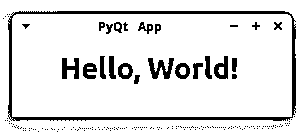

您的应用程序显示一个基于`QWidget`的窗口。窗口显示`Hello, World!`消息。为了显示消息，它使用了一个`QLabel`小部件。至此，您已经使用 PyQt 和 Python 编写了第一个 GUI 桌面应用程序！是不是很酷？

[*Remove ads*](/account/join/)

## 考虑代码风格

如果您检查前一节中的示例 GUI 应用程序的代码，那么您会注意到 PyQt 的 [API](https://en.wikipedia.org/wiki/API) 没有遵循 [PEP 8](https://www.python.org/dev/peps/pep-0008) 的编码风格和命名约定。PyQt 是围绕 Qt 构建的，Qt 是用 C++编写的，对函数、方法和变量使用了 [camel case](https://en.wikipedia.org/wiki/Camel_case) 命名风格。也就是说，当您开始编写 PyQt 项目时，您需要决定使用哪种命名风格。

在这方面，PEP 8 指出:

> 新的模块和包(包括第三方框架)应该按照这些标准编写，但是如果现有的库有不同的风格，内部一致性是首选的。([来源](https://www.python.org/dev/peps/pep-0008))

另外，Python 的[禅说:](https://www.python.org/dev/peps/pep-0020/)

> …实用性胜过纯粹性。([来源](https://www.python.org/dev/peps/pep-0020/))

如果您想编写一致的 PyQt 相关代码，那么您应该坚持框架的编码风格。在本教程中，为了保持一致性，您将遵循 PyQt 编码风格。您将使用 camel case 而不是通常的 Python [snake case](https://en.wikipedia.org/wiki/Snake_case) 。

## 学习 PyQt 的基础知识

如果您想熟练地使用这个库来开发您的 GUI 应用程序，您需要掌握 PyQt 的基本组件。这些组件包括:

*   小工具
*   布局经理
*   对话
*   主窗口
*   应用程序
*   事件循环
*   信号和插槽

这些元素是任何 PyQt GUI 应用程序的构建块。它们中的大多数被表示为 Python 类，位于 [`PyQt6.QtWidgets`](https://www.riverbankcomputing.com/static/Docs/PyQt6/api/qtwidgets/qtwidgets-module.html#) 模块中。这些因素极其重要。在接下来的几节中，您将了解到更多关于它们的内容。

### 小部件

小部件是矩形的图形组件，可以放在应用程序的窗口上来构建 GUI。小部件有几个属性和方法，允许您调整它们的外观和行为。他们也可以在屏幕上画出自己的肖像。

小部件还检测来自用户、窗口系统和其他来源的鼠标点击、按键和其他事件。每当一个小部件捕获到一个事件，它就会发出一个信号来宣布它的状态改变。PyQt 拥有丰富的现代小部件集合。每个部件都有不同的用途。

一些最常见和最有用的 PyQt 小部件是:

*   小跟班
*   标签
*   线条编辑
*   组合框
*   单选按钮

首先是**按钮**。你可以通过实例化 [`QPushButton`](https://www.riverbankcomputing.com/static/Docs/PyQt6/api/qtwidgets/qpushbutton.html) 来创建一个按钮，这个类提供了一个经典的命令按钮。典型的按钮有`Ok`、`Cancel`、`Apply`、`Yes`、`No`和`Close`。下面是它们在 Linux 系统上的样子:

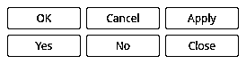

像这样的按钮可能是任何 GUI 中最常用的小部件。当有人点击它们时，你的应用程序会命令电脑执行操作。这就是当用户点击一个按钮时你如何执行计算。

接下来是**标签**，你可以用`QLabel`来创建。标签可让您将有用的信息显示为文本或图像:

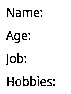

你将使用这样的标签来解释如何使用你的应用程序的图形用户界面。您可以通过多种方式调整标签的外观。如前所述，标签甚至可以接受 HTML 格式的文本。您还可以使用标签来指定键盘快捷键，以便将光标焦点移动到 GUI 上的给定小部件。

另一个常见的小部件是**行编辑**，也称为**输入框**。这个小部件允许您输入单行文本。您可以使用 [`QLineEdit`](https://www.riverbankcomputing.com/static/Docs/PyQt6/api/qtwidgets/qlineedit.html) 类创建线条编辑。当您需要以纯文本形式获取用户输入时，行编辑非常有用。

以下是 Linux 系统上的线条编辑效果:

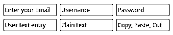

像这样的线编辑自动提供基本的编辑操作，如复制、粘贴、撤消、重做、拖放等。在上图中，您还可以看到第一行中的对象显示了占位符文本，以通知用户需要哪种输入。

组合框是 GUI 应用程序中另一种基本的窗口小部件。您可以通过实例化 [`QComboBox`](https://www.riverbankcomputing.com/static/Docs/PyQt6/api/qtwidgets/qcombobox.html) 来创建它们。组合框将以一种占用最小屏幕空间的方式向用户呈现一个下拉选项列表。

下面是一个组合框示例，它提供了流行编程语言的下拉列表:

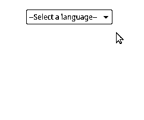

这个组合框是**只读**，这意味着用户可以从几个选项中选择一个，但是不能添加自己的选项。组合框也可以**编辑**，允许用户动态添加新选项。组合框也可以包含[像素映射](https://www.riverbankcomputing.com/static/Docs/PyQt6/api/qtgui/qbitmap.html)、[字符串](https://realpython.com/python-strings/)，或者两者都包含。

您将了解的最后一个小部件是**单选按钮**，您可以使用 [`QRadioButton`](https://www.riverbankcomputing.com/static/Docs/PyQt6/api/qtwidgets/qradiobutton.html) 创建它。一个`QRadioButton`对象是一个选项按钮，你可以点击它来打开。当您需要用户从众多选项中选择一个时，单选按钮非常有用。单选按钮中的所有选项同时出现在屏幕上:

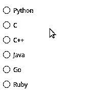

在这个单选按钮组中，一次只能选中一个按钮。如果用户选择另一个单选按钮，那么先前选择的按钮将自动关闭。

PyQt 收集了大量的小部件。在撰写本文时，有超过四十个可供您用来创建应用程序的 GUI。在这里，您只研究了一个小样本。然而，这足以向您展示 PyQt 的强大和灵活性。在下一节中，您将学习如何布置不同的小部件，以便为您的应用程序构建现代化的全功能 GUI。

[*Remove ads*](/account/join/)

### 布局管理器

现在您已经了解了小部件以及如何使用它们来构建 GUI，您需要知道如何安排一组小部件，以便您的 GUI 既连贯又实用。在 PyQt 中，您会发现一些在表单或窗口上布置小部件的技术。例如，您可以使用`.resize()`和`.move()`方法给小部件绝对的大小和位置。

然而，这种技术也有一些缺点。你必须:

*   做许多手动计算，以确定每个部件的正确大小和位置
*   做额外的计算来响应窗口调整事件
*   当窗口的布局以任何方式改变时，重做您的大部分计算

另一种技术涉及使用`.resizeEvent()`来动态计算小部件的大小和位置。在这种情况下，您会遇到与前一种技术类似的问题。

最有效和推荐的技术是使用 PyQt 的[布局管理器](https://realpython.com/python-pyqt-layout/)。它们将提高您的生产率，减少错误的风险，并提高代码的可维护性。

布局管理器是允许你在应用程序的窗口或表单上调整小部件大小和位置的类。它们会自动调整事件和 GUI 变化的大小，控制所有子部件的大小和位置。

**注意:**如果你开发[国际化](https://en.wikipedia.org/wiki/Internationalization_and_localization)应用程序，那么你可能会看到翻译文本在句子中间被截掉。当目标自然语言比原始语言更冗长时，这种情况很可能发生。布局管理器可以根据可用空间自动调整小部件的大小，从而帮助您避免这种常见问题。然而，对于特别冗长的自然语言，这个特性有时会失效。

PyQt 提供了四个基本的布局管理器类:

1.  [T2`QHBoxLayout`](https://www.riverbankcomputing.com/static/Docs/PyQt6/api/qtwidgets/qhboxlayout.html)
2.  [T2`QVBoxLayout`](https://www.riverbankcomputing.com/static/Docs/PyQt6/api/qtwidgets/qvboxlayout.html)
3.  [T2`QGridLayout`](https://www.riverbankcomputing.com/static/Docs/PyQt6/api/qtwidgets/qgridlayout.html)
4.  [T2`QFormLayout`](https://www.riverbankcomputing.com/static/Docs/PyQt6/api/qtwidgets/qformlayout.html)

第一个布局管理器类 **`QHBoxLayout`** ，从左到右水平排列小部件，如下图所示:

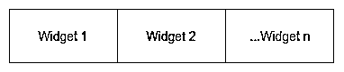

在水平布局中，小部件将从左侧开始一个接一个地出现。下面的代码示例展示了如何使用`QHBoxLayout`来水平排列三个按钮:

```py
 1# h_layout.py
 2
 3"""Horizontal layout example."""
 4
 5import sys
 6
 7from PyQt6.QtWidgets import (
 8    QApplication,
 9    QHBoxLayout,
10    QPushButton,
11    QWidget,
12)
13
14app = QApplication([])
15window = QWidget()
16window.setWindowTitle("QHBoxLayout")
17
18layout = QHBoxLayout()
19layout.addWidget(QPushButton("Left"))
20layout.addWidget(QPushButton("Center"))
21layout.addWidget(QPushButton("Right"))
22window.setLayout(layout)
23
24window.show()
25sys.exit(app.exec())
```

以下是此示例如何创建按钮的水平布局:

*   **第 18 行**创建了一个名为`layout`的`QHBoxLayout`对象。
*   **第 19 行到第 21 行**通过调用`.addWidget()`方法给`layout`添加三个按钮。
*   **第 22 行**用`.setLayout()`设置`layout`为你的窗口布局。

当您从命令行运行`python h_layout.py`时，您将得到以下输出:

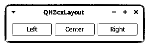

上图显示了水平排列的三个按钮。按钮从左到右显示的顺序与您在代码中添加它们的顺序相同。

下一个布局管理器类是 **`QVBoxLayout`** ，它从上到下垂直排列小部件，如下图所示:

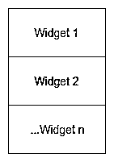

每个新的小部件都会出现在前一个小部件的下方。这种布局允许你构建垂直布局，在你的 GUI 上从上到下组织你的部件。

下面是如何创建一个包含三个按钮的`QVBoxLayout`对象:

```py
 1# v_layout.py
 2
 3"""Vertical layout example."""
 4
 5import sys
 6
 7from PyQt6.QtWidgets import (
 8    QApplication,
 9    QPushButton,
10    QVBoxLayout,
11    QWidget,
12)
13
14app = QApplication([])
15window = QWidget()
16window.setWindowTitle("QVBoxLayout")
17
18layout = QVBoxLayout()
19layout.addWidget(QPushButton("Top"))
20layout.addWidget(QPushButton("Center"))
21layout.addWidget(QPushButton("Bottom"))
22window.setLayout(layout)
23
24window.show()
25sys.exit(app.exec())
```

在第 18 行，您创建了一个名为`layout`的`QVBoxLayout`实例。在接下来的三行中，您将向`layout`添加三个按钮。最后，通过第 22 行的`.setLayout()`方法，使用`layout`对象在垂直布局中排列小部件。

当您运行这个示例应用程序时，您将看到一个类似如下的窗口:

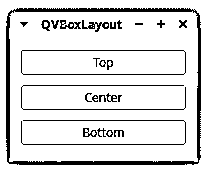

此图显示了垂直排列的三个按钮，一个在另一个的下面。按钮的显示顺序与您将它们添加到代码中的顺序相同，从上到下。

您列表中的第三个布局管理器是 **`QGridLayout`** 。这个类在一个由行和列组成的网格中排列小部件。每个小部件在网格上都有一个相对位置。您可以用一对像`(row, column)`这样的坐标来定义小部件的位置。每个坐标必须是整数[数字](https://realpython.com/python-numbers/)。这些坐标对定义了给定小部件将占据网格上的哪个单元。

网格布局如下所示:

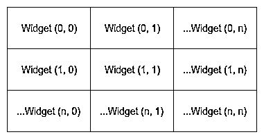

`QGridLayout`获取可用空间，将其分成`rows`和`columns`，并将每个子部件放入自己的单元格中。

下面是如何在 GUI 中创建网格布局的方法:

```py
 1# g_layout.py
 2
 3"""Grid layout example."""
 4
 5import sys
 6
 7from PyQt6.QtWidgets import (
 8    QApplication,
 9    QGridLayout,
10    QPushButton,
11    QWidget,
12)
13
14app = QApplication([])
15window = QWidget()
16window.setWindowTitle("QGridLayout")
17
18layout = QGridLayout()
19layout.addWidget(QPushButton("Button (0, 0)"), 0, 0)
20layout.addWidget(QPushButton("Button (0, 1)"), 0, 1)
21layout.addWidget(QPushButton("Button (0, 2)"), 0, 2)
22layout.addWidget(QPushButton("Button (1, 0)"), 1, 0)
23layout.addWidget(QPushButton("Button (1, 1)"), 1, 1)
24layout.addWidget(QPushButton("Button (1, 2)"), 1, 2)
25layout.addWidget(QPushButton("Button (2, 0)"), 2, 0)
26layout.addWidget(
27    QPushButton("Button (2, 1) + 2 Columns Span"), 2, 1, 1, 2
28)
29window.setLayout(layout)
30
31window.show()
32sys.exit(app.exec())
```

在这个例子中，您创建了一个应用程序，它使用一个`QGridLayout`对象来组织屏幕上的小部件。注意，在这种情况下，传递给`.addWidget()`的第二个和第三个参数是定义每个小部件在网格上的位置的整数。

在第 26 到 28 行，您向`.addWidget()`传递了另外两个参数。这些参数是`rowSpan`和`columnSpan`，它们是传递给函数的第四个和第五个参数。您可以使用它们让一个小部件占据多行或多列，就像您在示例中所做的那样。

如果您从命令行运行这段代码，您将会看到一个类似如下的窗口:

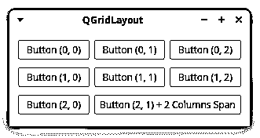

在这个图中，您可以看到您的小部件排列在一个由行和列组成的网格中。最后一个小部件占据了两列，正如您在第 26 到 28 行中指定的那样。

您将了解的最后一个布局管理器是 **`QFormLayout`** 。这个类在两列布局中排列小部件。第一列通常在标签中显示消息。第二列通常包含类似于`QLineEdit`、`QComboBox`、[、`QSpinBox`、](https://www.riverbankcomputing.com/static/Docs/PyQt6/api/qtwidgets/qspinbox.html)等小部件。这些允许用户输入或编辑关于第一列中的信息的数据。

下图显示了表单布局的实际工作方式:

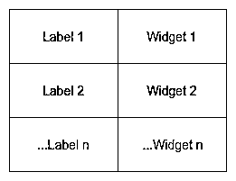

左栏由标签组成，而右栏由输入部件组成。如果您正在开发一个[数据库应用程序](https://realpython.com/python-pyqt-database/)，那么这种布局可能是一个有用的工具，可以在创建输入表单时提高您的生产率。

下面的例子展示了如何创建一个使用`QFormLayout`对象来排列小部件的应用程序:

```py
 1# f_layout.py
 2
 3"""Form layout example."""
 4
 5import sys
 6
 7from PyQt6.QtWidgets import (
 8    QApplication,
 9    QFormLayout,
10    QLineEdit,
11    QWidget,
12)
13
14app = QApplication([])
15window = QWidget()
16window.setWindowTitle("QFormLayout")
17
18layout = QFormLayout()
19layout.addRow("Name:", QLineEdit())
20layout.addRow("Age:", QLineEdit())
21layout.addRow("Job:", QLineEdit())
22layout.addRow("Hobbies:", QLineEdit())
23window.setLayout(layout)
24
25window.show()
26sys.exit(app.exec())
```

在这个例子中，第 18 行到第 23 行做了大量的工作。`QFormLayout`有一个方便的方法叫`.addRow()`。您可以使用此方法向布局中添加一个包含两个小部件的行。`.addRow()`的第一个参数应该是标签或字符串。然后，第二个参数可以是允许用户输入或编辑数据的任何小部件。在这个具体示例中，您使用了线编辑。

如果您运行这段代码，您将会看到一个如下所示的窗口:

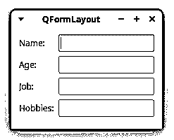

上图显示了一个使用表单布局的窗口。第一列包含向用户询问一些信息的标签。第二列显示允许用户输入或编辑所需信息的小部件。

[*Remove ads*](/account/join/)

### 对话框

使用 PyQt，您可以开发两种类型的 GUI 桌面应用程序。根据您用来创建主窗体或窗口的类，您将拥有以下内容之一:

1.  **一个主窗口风格的应用:**该应用的主窗口继承了 [`QMainWindow`](https://www.riverbankcomputing.com/static/Docs/PyQt6/api/qtwidgets/qmainwindow.html) 。
2.  **一个对话框风格的应用:**应用的主窗口继承了 [`QDialog`](https://www.riverbankcomputing.com/static/Docs/PyQt6/api/qtwidgets/qdialog.html) 。

您将首先从对话框样式的应用程序开始。在下一节中，您将了解主窗口风格的应用程序。

要开发一个对话框风格的应用，需要创建一个从`QDialog`继承的 GUI 类，它是所有对话框窗口的基类。一个**对话窗口**是一个独立的窗口，你可以用它作为你的应用程序的主窗口。

**注意:**对话窗口通常用在主窗口风格的应用程序中，用于与用户进行简短的交流和交互。

当您使用对话窗口与用户交流时，这些对话可以是:

*   **模态:**阻止输入到同一应用程序中任何其他可见窗口。你可以通过调用它的`.exec()`方法来显示一个模态对话框。
*   **无模式:**在同一个应用程序中独立于其他窗口运行。你可以通过使用它的`.show()`方法来显示一个非模态对话框。

对话框窗口也可以提供一个[返回值](https://realpython.com/python-return-statement/)，并有默认按钮，如`Ok`和`Cancel`。

对话框总是一个独立的窗口。如果一个对话框有一个`parent`，那么它将在父窗口小部件的顶部居中显示。有父级的对话框将共享父级的任务栏条目。如果你没有为一个给定的对话框设置`parent`，那么这个对话框将会在系统的任务栏中获得它自己的条目。

下面是一个如何使用`QDialog`开发对话框风格的应用程序的例子:

```py
 1# dialog.py
 2
 3"""Dialog-style application."""
 4
 5import sys
 6
 7from PyQt6.QtWidgets import (
 8    QApplication,
 9    QDialog,
10    QDialogButtonBox,
11    QFormLayout,
12    QLineEdit,
13    QVBoxLayout,
14)
15
16class Window(QDialog):
17    def __init__(self):
18        super().__init__(parent=None)
19        self.setWindowTitle("QDialog")
20        dialogLayout = QVBoxLayout()
21        formLayout = QFormLayout()
22        formLayout.addRow("Name:", QLineEdit())
23        formLayout.addRow("Age:", QLineEdit())
24        formLayout.addRow("Job:", QLineEdit())
25        formLayout.addRow("Hobbies:", QLineEdit())
26        dialogLayout.addLayout(formLayout)
27        buttons = QDialogButtonBox()
28        buttons.setStandardButtons(
29            QDialogButtonBox.StandardButton.Cancel
30            | QDialogButtonBox.StandardButton.Ok
31        )
32        dialogLayout.addWidget(buttons)
33        self.setLayout(dialogLayout)
34
35if __name__ == "__main__":
36    app = QApplication([])
37    window = Window()
38    window.show()
39    sys.exit(app.exec())
```

这个应用程序稍微复杂一点。下面是这段代码的作用:

*   **第 16 行**通过继承`QDialog`为应用程序的 GUI 定义了一个`Window`类。
*   **第 18 行**使用 [`super()`](https://realpython.com/python-super/) 调用父类的 [`.__init__()`](https://realpython.com/python-class-constructor/#object-initialization-with-__init__) 方法。该调用允许您正确初始化该类的实例。在这个例子中，`parent`参数被设置为 [`None`](https://realpython.com/null-in-python/) ，因为这个对话框将是你的主窗口。
*   第 19 行设置窗口的标题。
*   **第 20 行**给`dialogLayout`分配一个`QVBoxLayout`对象。
*   **第 21 行**给`formLayout`分配一个`QFormLayout`对象。
*   **第 22 到 25 行**向`formLayout`添加小部件。
*   **26 线**在`dialogLayout`呼叫`.addLayout()`。该调用将表单布局嵌入到全局对话框布局中。
*   第 27 行定义了一个按钮框，它提供了一个方便的空间来显示对话框的按钮。
*   **第 28 到 31 行**向对话框添加两个标准按钮`Ok`和`Cancel`。
*   **第 32 行**通过调用`.addWidget()`将按钮框添加到对话框中。

[`if __name__ == "__main__":`](https://realpython.com/python-main-function/#use-if-__name__-main-to-control-the-execution-of-your-code) 构造包装了应用程序的主要代码。这种[条件](https://realpython.com/python-conditional-statements/)语句在 Python 应用中很常见。它确保缩进的代码只有在包含文件作为程序执行而不是作为模块导入时才会运行。关于这个构造的更多信息，请查看 Python 中的[if**name**= = "**main**"做什么？](https://realpython.com/if-name-main-python/)。

**注意:**在上面例子的第 26 行，你会注意到布局管理器可以相互嵌套。您可以通过调用容器布局上的`.addLayout()`来嵌套布局，并将嵌套布局作为参数。

上面的代码示例将显示一个类似如下的窗口:

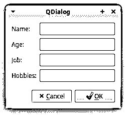

下图显示了您创建的 GUI，它使用一个`QFormLayout`对象来排列小部件，使用一个`QVBoxLayout`布局来显示应用程序的全局布局。

### 主窗口

大多数时候，你的 GUI 应用程序是主窗口风格的应用程序。这意味着他们将会有一个[菜单栏](https://realpython.com/python-menus-toolbars/)，一些工具栏，一个状态栏，以及一个将会成为 GUI 主要元素的中央部件。你的应用程序通常有几个对话框来完成依赖于用户输入的辅助动作。

您将继承`QMainWindow`来开发主窗口风格的应用程序。从`QMainWindow`派生的类的实例被认为是应用程序的**主窗口**，应该是唯一的。

提供了一个快速构建应用程序 GUI 的框架。该类有自己的内置布局，接受以下图形组件:

| 成分 | 在窗口上的位置 | 描述 |
| --- | --- | --- |
| 一个[菜单栏](https://www.riverbankcomputing.com/static/Docs/PyQt6/api/qtwidgets/qmenubar.html) | 顶端 | 保存应用程序的主菜单 |
| 一个或多个[工具栏](https://www.riverbankcomputing.com/static/Docs/PyQt6/api/qtwidgets/qtoolbar.html) | 侧面 | 按住[工具按钮](https://www.riverbankcomputing.com/static/Docs/PyQt6/api/qtwidgets/qtoolbutton.html)和其他小工具，如`QComboBox`、`QSpinBox`等 |
| 一个中央部件 | 中心 | 保存窗口的中心小部件，它可以是任何类型，包括复合小部件 |
| 一个或多个[停靠](https://www.riverbankcomputing.com/static/Docs/PyQt6/api/qtwidgets/qdockwidget.html)小部件 | 围绕中心部件 | 是小的、可移动的、可隐藏的窗户 |
| 一个[状态栏](https://www.riverbankcomputing.com/static/Docs/PyQt6/api/qtwidgets/qstatusbar.html) | 底部 | 持有应用程序的状态栏，显示状态信息 |

没有中央 widget，您不能创建主窗口。你需要一个中心部件，即使它只是一个占位符。在这种情况下，您可以使用一个`QWidget`对象作为您的中心小部件。

你可以用`.setCentralWidget()`方法设置窗口的中心部件。主窗口的布局将只允许你有一个中央部件，但它可以是一个单一的或复合的部件。下面的代码示例向您展示了如何使用`QMainWindow`创建一个主窗口样式的应用程序:

```py
 1# main_window.py
 2
 3"""Main window-style application."""
 4
 5import sys
 6
 7from PyQt6.QtWidgets import (
 8    QApplication,
 9    QLabel,
10    QMainWindow,
11    QStatusBar,
12    QToolBar,
13)
14
15class Window(QMainWindow):
16    def __init__(self):
17        super().__init__(parent=None)
18        self.setWindowTitle("QMainWindow")
19        self.setCentralWidget(QLabel("I'm the Central Widget"))
20        self._createMenu()
21        self._createToolBar()
22        self._createStatusBar()
23
24    def _createMenu(self):
25        menu = self.menuBar().addMenu("&Menu")
26        menu.addAction("&Exit", self.close)
27
28    def _createToolBar(self):
29        tools = QToolBar()
30        tools.addAction("Exit", self.close)
31        self.addToolBar(tools)
32
33    def _createStatusBar(self):
34        status = QStatusBar()
35        status.showMessage("I'm the Status Bar")
36        self.setStatusBar(status)
37
38if __name__ == "__main__":
39    app = QApplication([])
40    window = Window()
41    window.show()
42    sys.exit(app.exec())
```

下面是这段代码的工作原理:

*   **第 15 行**创建了一个从`QMainWindow`继承而来的类`Window`。
*   第 16 行定义了类初始化器。
*   **第 17 行**调用基类的初始化器。同样，`parent`参数被设置为`None`，因为这是你的应用程序的主窗口，所以它不能有父窗口。
*   第 18 行设置窗口的标题。
*   第 19 行设置一个`QLabel`作为窗口的中心部件。
*   **第 20 到 22 行**调用非公共方法来创建不同的 GUI 元素:
    *   **第 24 行到第 26 行**创建主菜单栏，其中有一个名为*菜单的下拉菜单*。该菜单将有一个菜单选项来退出应用程序。
    *   **第 28 行到第 31 行**创建工具栏，工具栏上有一个退出应用程序的按钮。
    *   第 33 到 36 行创建应用程序的状态栏。

当您使用 GUI 组件自己的方法实现它们时，就像您在这个例子中对菜单栏、工具栏和状态栏所做的那样，您正在使您的代码更具可读性和可维护性。

**注意:**如果你在 macOS 上运行这个例子，那么你可能会对应用程序的主菜单有问题。macOS 隐藏了某些菜单选项，比如*退出*。请记住，macOS 在屏幕顶部的应用程序条目下显示了*退出*或*退出*选项。

当您运行上面的示例应用程序时，您将得到如下所示的窗口:

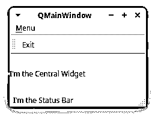

正如您所确认的，您的主窗口样式的应用程序具有以下组件:

*   一个总称为*菜单的主菜单*
*   一个带有*退出*工具按钮的工具栏
*   一个中央小部件由一个带有文本消息的`QLabel`对象组成
*   窗口底部有一个状态栏

就是这样！您已经学习了如何使用 Python 和 PyQt 构建主窗口样式的应用程序。到目前为止，您已经了解了 PyQt 的小部件集中一些更重要的图形组件。在接下来的几节中，您将学习与使用 PyQt 构建 GUI 应用程序相关的其他重要概念。

[*Remove ads*](/account/join/)

### 应用程序

是开发 PyQt GUI 应用程序时最基础的类。这个类是任何 PyQt 应用程序的核心组件。它管理应用程序的控制流及其主要设置。

在 PyQt 中，`QApplication`的任何实例都是一个**应用程序**。每个 PyQt GUI 应用程序必须有一个`QApplication`实例。该班的一些职责包括:

*   处理应用的**初始化**和**结束**
*   提供**事件循环**和事件处理
*   处理大多数系统范围和应用范围的**设置**
*   提供对**全局信息**的访问，例如应用程序的目录、屏幕大小等等
*   解析常见的**命令行参数**
*   定义应用程序的**外观和感觉**
*   提供**本地化**功能

这些只是`QApplication`的部分核心职责。因此，这是开发 PyQt GUI 应用程序的一个基本类。

`QApplication`最重要的职责之一就是提供事件循环和整个事件处理机制。在下一节中，您将仔细了解什么是事件循环以及它是如何工作的。

### 事件循环

GUI 应用程序是由事件驱动的。这意味着调用函数和方法来响应用户操作，如单击按钮、从组合框中选择一项、在文本编辑中输入或更新文本、按键盘上的键等等。这些用户动作通常被称为**事件**。

事件由**事件循环**处理，也称为**主循环**。事件循环是一个无限循环，其中来自用户、窗口系统和任何其他源的所有事件都被处理和调度。事件循环等待一个事件发生，然后分派它执行某个任务。事件循环继续工作，直到应用程序终止。

所有 GUI 应用程序都有一个事件循环。当一个事件发生时，循环检查它是否是一个**终止事件。**在这种情况下，循环结束，应用程序退出。否则，事件将被发送到应用程序的事件队列进行进一步处理，循环将再次迭代。在 PyQt6 中，可以通过调用`QApplication`对象上的`.exec()`来运行应用程序的事件循环。

对于触发动作的事件，您需要将事件与您想要执行的动作相连接。在 PyQt 中，您可以用信号和插槽机制建立这种连接，这将在下一节中探讨。

### 信号和插槽

PyQt 小部件充当**事件捕捉器**。这意味着每个小部件都可以捕捉特定的事件，比如鼠标点击、按键等等。作为对这些事件的响应，一个小部件发出一个**信号**，这是一种宣布其状态变化的消息。

信号本身不执行任何操作。如果你想要一个信号来触发一个动作，那么你需要把它连接到一个**插槽**。这是一个函数或方法，每当相关的信号发出时，它就会执行一个动作。你可以使用任何 Python **可调用的**作为槽。

如果一个信号被连接到一个插槽，那么每当这个信号被发出时，这个插槽就会被调用。如果信号没有连接到任何插槽，那么什么都不会发生，信号会被忽略。信号和插槽的一些最相关的功能包括:

*   一个信号可以连接到一个或多个插槽。
*   一个信号也可以连接到另一个信号。
*   一个插槽可以连接到一个或多个信号。

您可以使用以下语法来连接信号和插槽:

```py
widget.signal.connect(slot_function)
```

这将把`slot_function`连接到`widget.signal`。从现在开始，每当发射`.signal`的时候，就会叫`slot_function()`。

下面的代码展示了如何在 PyQt 应用程序中使用信号和插槽机制:

```py
 1# signals_slots.py
 2
 3"""Signals and slots example."""
 4
 5import sys
 6
 7from PyQt6.QtWidgets import (
 8    QApplication,
 9    QLabel,
10    QPushButton,
11    QVBoxLayout,
12    QWidget,
13)
14
15def greet(): 16    if msgLabel.text():
17        msgLabel.setText("")
18    else:
19        msgLabel.setText("Hello, World!")
20
21app = QApplication([])
22window = QWidget()
23window.setWindowTitle("Signals and slots")
24layout = QVBoxLayout()
25
26button = QPushButton("Greet")
27button.clicked.connect(greet) 28
29layout.addWidget(button)
30msgLabel = QLabel("")
31layout.addWidget(msgLabel)
32window.setLayout(layout)
33window.show()
34sys.exit(app.exec())
```

在第 15 行，您创建了`greet()`，您将把它用作一个槽。然后在第 27 行，你连接按钮的信号到`greeting()`。这样，每当用户点击*问候*按钮，就会调用`greet()`槽，标签对象的文本在`Hello, World!`和空字符串之间交替:

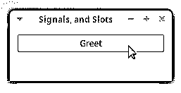

当你点击*问候*按钮时，`Hello, World!`消息在你的应用程序主窗口上出现和消失。

**注意:**每个部件都有自己的一组预定义信号。您可以在小部件的文档中查看它们。

如果你的 slot 函数需要接收额外的参数，那么你可以使用 [`functools.partial()`](https://docs.python.org/3/library/functools.html#functools.partial) 来传递它们。例如，您可以修改`greet()`来获取一个参数，如下面的代码所示:

```py
# signals_slots.py
# ...

def greet(name):
    if msg.text():
        msg.setText("")
    else:
 msg.setText(f"Hello, {name}") 
# ...
```

现在`greet()`需要接收一个名为`name`的参数。如果你想把这个新版本的`greet()`连接到`.clicked`信号上，你可以这样做:

```py
# signals_slots.py

"""Signals and slots example."""

import sys
from functools import partial 
# ...

button = QPushButton("Greet")
button.clicked.connect(partial(greeting, "World!")) 
# ...
```

要让这段代码工作，首先需要从 [`functools`](https://docs.python.org/3/library/functools.html#module-functools) 导入`partial()`。对`partial()`的调用返回一个函数对象，当用`name="World!"`调用时，其行为类似于`greet()`。现在，当用户点击按钮时，消息`Hello, World!`会像以前一样出现在标签中。

**注意:**你也可以使用 [`lambda`](https://realpython.com/python-lambda/) 函数将一个信号连接到一个需要额外参数的插槽。作为一个练习，试着用`lambda`代替`functools.partial()`来编写上面的例子。

您将使用信号和插槽机制赋予 PyQt GUI 应用程序生命。这种机制将允许您将用户事件转化为具体的动作。您可以通过查看关于该主题的 PyQt6 [文档](https://www.riverbankcomputing.com/static/Docs/PyQt6/signals_slots.html)来更深入地了解信号和插槽。

现在您已经了解了 PyQt 的几个重要概念的基础。有了这些知识和库的文档，您就可以开始开发自己的 GUI 应用程序了。在下一节中，您将构建您的第一个全功能 GUI 应用程序。

[*Remove ads*](/account/join/)

## 用 Python 和 PyQt 创建计算器应用程序

在本节中，您将使用[模型-视图-控制器(MVC)](https://realpython.com/the-model-view-controller-mvc-paradigm-summarized-with-legos/) 设计模式开发一个计算器 GUI 应用程序。这个模式有三层代码，每一层都有不同的角色:

1.  **模型**负责你的应用程序的[业务逻辑](https://en.wikipedia.org/wiki/Business_logic)。它包含核心功能和数据。在您的计算器应用程序中，模型将处理输入值和计算。

2.  **视图**实现了你的应用程序的 GUI。它托管最终用户与应用程序交互所需的所有小部件。该视图还接收用户的动作和事件。对于您的示例，视图将是屏幕上的计算器窗口。

3.  **控制器**连接模型和视图，使应用程序工作。用户的事件或请求被发送到控制器，控制器使模型开始工作。当模型以正确的格式交付请求的结果或数据时，控制器将其转发给视图。在您的计算器应用程序中，控制器将从 GUI 接收目标数学表达式，要求模型执行计算，并用结果更新 GUI。

以下是对您的 GUI 计算器应用程序如何工作的逐步描述:

1.  用户在视图(GUI)上执行**动作或请求(事件)**。
2.  视图**通知控制器**用户的动作。
3.  控制器得到用户的请求，**向模型**查询响应。
4.  该模型处理控制器的查询，执行**所需的计算**，并返回**结果**。
5.  控制器接收模型的响应，**相应地更新视图**。
6.  用户最终在视图上看到请求的**结果。**

您将使用这种 MVC 设计通过 Python 和 PyQt 构建您的计算器应用程序。

### 为你的 PyQt 计算器应用程序创建框架

首先，您将在一个名为`pycalc.py`的文件中为您的应用程序实现一个最小的框架。您可以通过单击下面的链接获得该文件以及计算器应用程序的其余源代码:

**下载代码:** [点击此处下载代码，您将在本教程中使用](https://realpython.com/bonus/pyqt-calculator/)用 PyQt 在 Python 中构建一个计算器。

如果您更喜欢自己编写项目代码，那么就在您当前的工作目录中创建`pycalc.py`。在您最喜欢的[代码编辑器或 IDE](https://realpython.com/python-ides-code-editors-guide/) 中打开文件，并键入以下代码:

```py
 1# pycalc.py
 2
 3"""PyCalc is a simple calculator built with Python and PyQt."""
 4
 5import sys
 6
 7from PyQt6.QtWidgets import QApplication, QMainWindow, QWidget
 8
 9WINDOW_SIZE = 235
10
11class PyCalcWindow(QMainWindow):
12    """PyCalc's main window (GUI or view)."""
13
14    def __init__(self):
15        super().__init__()
16        self.setWindowTitle("PyCalc")
17        self.setFixedSize(WINDOW_SIZE, WINDOW_SIZE)
18        centralWidget = QWidget(self)
19        self.setCentralWidget(centralWidget)
20
21def main():
22    """PyCalc's main function."""
23    pycalcApp = QApplication([])
24    pycalcWindow = PyCalcWindow()
25    pycalcWindow.show()
26    sys.exit(pycalcApp.exec())
27
28if __name__ == "__main__":
29    main()
```

这个脚本实现了运行基本 GUI 应用程序所需的所有样板代码。您将使用这个框架来构建您的计算器应用程序。

下面是这段代码的工作原理:

*   **5 号线**进口`sys`。这个模块提供了`exit()`函数，您将使用它来干净地终止应用程序。

*   **第 7 行**从`PyQt6.QtWidgets`导入所需的类。

*   **第 9 行**创建一个 [Python 常量](https://realpython.com/python-constants/)来为你的计算器应用程序保存一个固定的像素大小的窗口。

*   **第 11 行**创建了`PyCalcWindow`类来提供应用程序的 GUI。注意这个类继承自`QMainWindow`。

*   第 14 行定义了类初始化器。

*   **第 15 行**调用超类上的`.__init__()`进行初始化。

*   第 16 行将窗口的标题设置为`"PyCalc"`。

*   **第 17 行**使用`.setFixedSize()`给窗口一个固定的大小。这确保了用户在应用程序执行期间无法调整窗口大小。

*   **第 18 行和第 19 行**创建一个`QWidget`对象，并将其设置为窗口的中心小部件。该对象将是您的计算器应用程序中所有必需的 GUI 组件的父对象。

*   **第 21 行**定义了你的计算器的[主功能](https://realpython.com/python-main-function/)。拥有这样的`main()`函数是 Python 中的最佳实践。这个函数提供了应用程序的入口点。在`main()`中，您的程序执行以下操作:

    *   **第 23 行**创建一个名为`pycalcApp`的`QApplication`对象。
    *   **第 24 行**创建应用程序窗口的实例`pycalcWindow`。
    *   第 25 行通过调用窗口对象上的`.show()`来显示 GUI。
    *   **第 26 行**用`.exec()`运行应用程序的事件循环。

最后，第 29 行调用`main()`来执行您的计算器应用程序。运行上述脚本时，屏幕上会出现以下窗口:

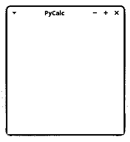

就是这样！您已经成功地为 GUI 计算器应用程序构建了一个功能齐全的应用程序框架。现在，您已经准备好继续构建项目了。

### 完成应用程序视图

你现在的 GUI 看起来并不像一个计算器。您需要通过添加一个显示目标数学运算的显示器和一个表示数字和基本数学运算符的按钮键盘来完成这个 GUI。您还将添加代表其他所需符号和动作的按钮，如清除显示。

首先，您需要更新您的导入，如以下代码所示:

```py
# pycalc.py

import sys

from PyQt6.QtCore import Qt
from PyQt6.QtWidgets import (
    QApplication,
 QGridLayout, QLineEdit,    QMainWindow,
 QPushButton, QVBoxLayout,    QWidget,
)

# ...
```

您将使用一个`QVBoxLayout`布局管理器来管理计算器的全局布局。要排列按钮，您将使用一个`QGridLayout`对象。`QLineEdit`类将作为计算器的显示，`QPushButton`将提供所需的按钮。

现在你可以更新`PyCalcWindow`的初始化器了:

```py
# pycalc.py
# ...

class PyCalcWindow(QMainWindow):
    """PyCalc's main window (GUI or view)."""

    def __init__(self):
        super().__init__()
        self.setWindowTitle("PyCalc")
        self.setFixedSize(WINDOW_SIZE, WINDOW_SIZE)
 self.generalLayout = QVBoxLayout()        centralWidget = QWidget(self)
 centralWidget.setLayout(self.generalLayout)        self.setCentralWidget(centralWidget)
 self._createDisplay() self._createButtons() 
# ...
```

您已经添加了突出显示的代码行。您将使用`.generalLayout`作为应用程序的总体布局。在这种布局中，您将在顶部放置显示屏，在底部放置网格布局中的键盘按钮。

此时对`._createDisplay()`和`._createButtons()`的调用将不起作用，因为您还没有实现那些方法。要解决这个问题，你将从编码`._createDisplay()`开始。

回到代码编辑器，更新`pycalc.py`,如下所示:

```py
# pycalc.py
# ...

WINDOW_SIZE = 235
DISPLAY_HEIGHT = 35 
class PyCalcWindow(QMainWindow):
    # ...

 def _createDisplay(self):        self.display = QLineEdit()
        self.display.setFixedHeight(DISPLAY_HEIGHT)
        self.display.setAlignment(Qt.AlignmentFlag.AlignRight)
        self.display.setReadOnly(True)
        self.generalLayout.addWidget(self.display)

# ...
```

在这个代码片段中，首先定义一个新的常数来保存以像素为单位的显示高度。然后你在`PyCalcWindow`里面定义`._createDisplay()`。

要创建计算器的显示，您需要使用一个`QLineEdit`小部件。然后，使用`DISPLAY_HEIGHT`常量为显示器设置一个 35 像素的固定高度。显示器将使其文本左对齐。最后，显示将是只读的，以防止用户直接编辑。最后一行代码将显示添加到计算器的一般布局中。

接下来，您将实现`._createButtons()`方法来为计算器的键盘创建所需的按钮。这些按钮将存在于网格布局中，因此您需要一种方法来表示它们在网格上的坐标。每个坐标对将由一行和一列组成。为了表示一个坐标对，你将使用一个列表的[列表](https://realpython.com/python-lists-tuples/)。每个嵌套列表将代表一行。

现在继续用下面的代码更新`pycalc.py`文件:

```py
# pycalc.py
# ...

WINDOW_SIZE = 235
DISPLAY_HEIGHT = 35
BUTTON_SIZE = 40 
# ...
```

在这段代码中，您定义了一个名为`BUTTON_SIZE`的新常量。您将使用该常量来提供计算器按钮的大小。在这个具体的例子中，所有的按钮都是正方形，每边有 40 个像素。

有了这个初始设置，您就可以编写`._createButtons()`方法了。您将使用一个列表来保存按键或按钮以及它们在计算器键盘上的位置。一个`QGridLayout`将允许您排列计算器窗口上的按钮:

```py
# pycalc.py
# ...

class PyCalcWindow(QMainWindow):
    # ...

 def _createButtons(self):        self.buttonMap = {}
        buttonsLayout = QGridLayout()
        keyBoard = [
            ["7", "8", "9", "/", "C"],
            ["4", "5", "6", "*", "("],
            ["1", "2", "3", "-", ")"],
            ["0", "00", ".", "+", "="],
        ]

        for row, keys in enumerate(keyBoard):
            for col, key in enumerate(keys):
                self.buttonMap[key] = QPushButton(key)
                self.buttonMap[key].setFixedSize(BUTTON_SIZE, BUTTON_SIZE)
                buttonsLayout.addWidget(self.buttonMap[key], row, col)

        self.generalLayout.addLayout(buttonsLayout)

# ...
```

首先创建一个空字典`self.buttonMap`来保存计算器按钮。然后，创建一个列表列表来存储键标签。每一行或嵌套列表将代表网格布局中的一行，而每个键标签的索引将代表布局中的相应列。

然后你定义两个 [`for`循环](https://realpython.com/python-for-loop/)。外部循环遍历行，内部循环遍历列。在内部循环中，你创建按钮并把它们添加到`self.buttonMap`和`buttonsLayout`中。每个按钮都有固定的`40x40`像素大小，你可以用`.setFixedSize()`和`BUTTON_SIZE`常量来设置。

最后，通过调用`.generalLayout`对象上的`.addLayout()`，将网格布局嵌入到计算器的总体布局中。

**注意:**谈到小部件尺寸，您很少会在 PyQt 文档中找到度量单位。度量单位假定为**像素**，除非您使用 [`QPrinter`](https://www.riverbankcomputing.com/static/Docs/PyQt6/api/qtprintsupport/qprinter.html) 类，该类使用**点**。

现在，您的计算器的 GUI 将优雅地显示显示屏和按钮。但是，您无法更新显示器上显示的信息。您可以通过向`PyCalcWindow`添加一些额外的方法来解决这个问题:

| 方法 | 描述 |
| --- | --- |
| `.setDisplayText()` | 设置和更新显示的文本 |
| `.displayText()` | 获取当前显示的文本 |
| `.clearDisplay()` | 清除显示的文本 |

这些方法将提供 GUI 的公共接口，并完成 Python 计算器应用程序的视图类。

下面是一个可能的实现:

```py
# pycalc.py
# ...

class PyCalcWindow(QMainWindow):
    # ...

 def setDisplayText(self, text):        """Set the display's text."""
        self.display.setText(text)
        self.display.setFocus()

 def displayText(self):        """Get the display's text."""
        return self.display.text()

 def clearDisplay(self):        """Clear the display."""
        self.setDisplayText("")

# ...
```

下面是每种方法的功能分类:

*   **`.setDisplayText()`** 使用`.setText()`来设置和更新显示的文本。它还使用`.setFocus()`来设置光标在显示屏上的焦点。

*   **`.displayText()`** 是一个 [getter 方法](https://realpython.com/python-property/#the-getter-and-setter-approach-in-python)，返回显示的当前文本。当用户点击计算器键盘上的等号(`=`)时，应用程序将使用`.displayText()`的返回值作为要计算的数学表达式。

*   **`.clearDisplay()`** 将显示的文本设置为空字符串(`""`)，以便用户可以引入新的数学表达式。每当用户按下计算器面板上的 *C* 按钮时，该方法就会被触发。

现在，您的计算器的图形用户界面已经可以使用了！当您运行该应用程序时，您将得到如下窗口:

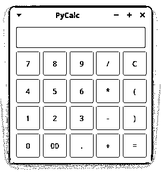

你已经完成了计算器的图形用户界面，它看起来非常光滑！然而，如果你试图做一些计算，那么计算器不会像预期的那样响应。这是因为您还没有实现模型和控制器组件。在下一节中，您将编写计算器的模型。

[*Remove ads*](/account/join/)

### 实现计算器的模型

在 MVC 模式中，模型是负责业务逻辑的代码层。在您的计算器应用程序中，业务逻辑都是关于基本的数学计算。因此，您的模型将评估用户在计算器的 GUI 中引入的数学表达式。

计算器的模型也需要处理错误。为此，您将定义以下全局常数:

```py
# pycalc.py
# ...

ERROR_MSG = "ERROR" WINDOW_SIZE = 235
# ...
```

这个`ERROR_MSG`常量是用户在计算器显示屏上看到的消息，如果他们引入了无效的数学表达式。

有了上面的更改，您就可以编写应用程序的模型了，在本例中，它将是一个单独的函数:

```py
# pycalc.py
# ...

class PyCalcWindow(QMainWindow):
    # ...

def evaluateExpression(expression):
    """Evaluate an expression (Model)."""
    try:
        result = str(eval(expression, {}, {}))
    except Exception:
        result = ERROR_MSG
    return result

# ...
```

在`evaluateExpression()`中，您使用 [`eval()`](https://realpython.com/python-eval-function/) 来计算以字符串形式出现的数学表达式。如果评估成功，那么你就返回`result`。否则，您将返回预定义的错误消息。注意，这个函数并不完美。它有几个重要的问题:

*   [`try` … `except`](https://realpython.com/python-exceptions/#the-try-and-except-block-handling-exceptions) 块不捕捉特定的异常，所以它使用了 Python 中不鼓励的一种做法。
*   函数使用 [`eval()`](https://realpython.com/python-eval-function/) ，会导致一些严重的[安全问题](http://nedbatchelder.com/blog/201206/eval_really_is_dangerous.html)。

你可以随意修改这个功能，使它更加可靠和安全。在本教程中，您将按原样使用该函数，以便将重点放在实现 GUI 上。

### 为您的计算器创建控制器类

在本节中，您将编写计算器的控制器类。这个类将视图连接到您刚刚编码的模型。您将使用控制器类让计算器执行动作来响应用户事件。

您的控制器类需要执行三个主要任务:

1.  访问 GUI 的公共界面。
2.  处理数学表达式的创建。
3.  将所有按钮的`.clicked`信号连接到相应的插槽。

要执行所有这些操作，您需要马上编写一个新的`PyCalc`类。继续用下面的代码更新`pycalc.py`:

```py
# pytcalc.py

import sys
from functools import partial
# ...

def evaluateExpression(expression):
    # ...

class PyCalc:
    """PyCalc's controller class."""

 def __init__(self, model, view):        self._evaluate = model
        self._view = view
        self._connectSignalsAndSlots()

 def _calculateResult(self):        result = self._evaluate(expression=self._view.displayText())
        self._view.setDisplayText(result)

 def _buildExpression(self, subExpression):        if self._view.displayText() == ERROR_MSG:
            self._view.clearDisplay()
        expression = self._view.displayText() + subExpression
        self._view.setDisplayText(expression)

 def _connectSignalsAndSlots(self):        for keySymbol, button in self._view.buttonMap.items():
            if keySymbol not in {"=", "C"}:
                button.clicked.connect(
                    partial(self._buildExpression, keySymbol)
                )
        self._view.buttonMap["="].clicked.connect(self._calculateResult)
        self._view.display.returnPressed.connect(self._calculateResult)
        self._view.buttonMap["C"].clicked.connect(self._view.clearDisplay)

# ...
```

在`pycalc.py`的顶部，你从`functools`导入`partial()`。您将使用这个函数将信号与需要额外参数的方法连接起来。

在`PyCalc`中，你定义了类初始化器，它有两个参数:应用的模型和它的视图。然后将这些参数存储在适当的[实例属性](https://realpython.com/python3-object-oriented-programming/#class-and-instance-attributes)中。最后，您调用`._connectSignalsAndSlots()`来进行所有需要的信号和插槽的连接。

在`._calculateResult()`中，您使用`._evaluate()`来计算用户刚刚输入计算器显示屏的数学表达式。然后在计算器的视图上调用`.setDisplayText()`,用计算结果更新显示文本。

顾名思义，`._buildExpression()`方法负责构建目标数学表达式。为此，该方法将初始显示值与用户在计算器键盘上输入的每个新值连接起来。

最后，`._connectSignalsAndSlots()`方法将所有按钮的`.clicked`信号与控制器类中适当的插槽方法连接起来。

就是这样！你的控制器类已经准备好了。然而，为了让所有这些代码像真正的计算器一样工作，您需要更新应用程序的`main()`函数，如下面的代码所示:

```py
# pytcalc.py
# ...

def main():
    """PyCalc's main function."""
    pycalcApp = QApplication([])
    pycalcWindow = PyCalcWindow()
    pycalcWindow.show()
 PyCalc(model=evaluateExpression, view=pycalcWindow)    sys.exit(pycalcApp.exec())
```

这段代码创建了一个新的`PyCalc`实例。`PyCalc`类构造函数的`model`参数保存了对`evaluateExpression()`函数的引用，而`view`参数保存了对`pycalcWindow`对象的引用，该对象提供了应用程序的 GUI。现在，您的 PyQt 计算器应用程序已经可以运行了。

[*Remove ads*](/account/join/)

### 运行计算器

现在你已经用 Python 和 PyQt 写好了计算器应用，是时候进行现场测试了！如果您从命令行运行该应用程序，那么您将得到类似如下的结果:

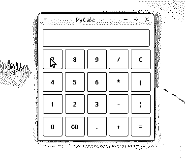

要使用 PyCalc，请用鼠标输入有效的数学表达式。然后，按 `Enter` 或点击等号(`=`)按钮进行计算，并将表达式结果显示在计算器的显示屏上。就是这样！您已经用 Python 和 PyQt 开发了第一个全功能的 GUI 桌面应用程序！

## 附加工具

PyQt6 提供了一组有用的附加工具，可以帮助您构建可靠的、现代的、功能全面的 GUI 应用程序。与 PyQt 相关的一些最引人注目的工具包括 [Qt 设计器](https://doc.qt.io/qt-6/qtdesigner-manual.html)和[国际化工具包](https://www.riverbankcomputing.com/static/Docs/PyQt6/i18n.html)。

Qt Designer 允许您使用拖放界面来设计和构建图形用户界面。通过使用屏幕上的表单和拖放机制，您可以使用该工具来设计小部件、对话框和主窗口。以下动画展示了 Qt Designer 的一些功能:

[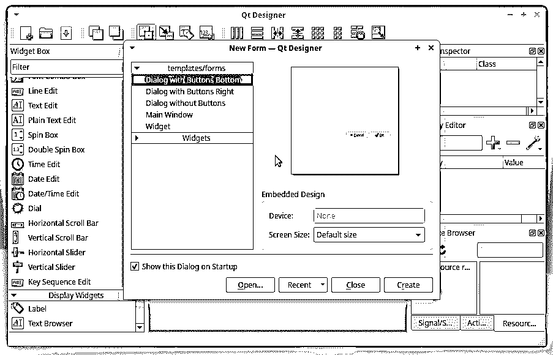](https://files.realpython.com/media/qt-designer.bd1e2f5392c8.gif)

Qt Designer 使用 XML `.ui`文件来存储你的 GUI 设计。PyQt 包括一个名为 [uic](https://www.riverbankcomputing.com/static/Docs/PyQt6/api/uic/uic-module.html) 的模块来帮助处理`.ui`文件。您还可以使用名为 [`pyuic6`](https://www.riverbankcomputing.com/static/Docs/PyQt6/designer.html#pyuic6) 的命令行工具将`.ui`文件内容转换成 Python 代码。

**注意:**要深入 Qt Designer 并更好地理解如何使用该工具创建图形用户界面，请查看 [Qt Designer 和 Python:更快地构建您的 GUI 应用程序](https://realpython.com/qt-designer-python/)。

PyQt6 还提供了一套全面的工具，用于将应用程序国际化为本地语言。 [`pylupdate6`](https://www.riverbankcomputing.com/static/Docs/PyQt6/i18n.html#pylupdate6) 命令行工具创建并更新翻译(`.ts`)文件，其中可以包含接口字符串的翻译。如果你更喜欢 GUI 工具，那么你可以使用 [Qt 语言学家](https://doc.qt.io/qt-6/qtlinguist-index.html)来创建和更新带有接口字符串翻译的`.ts`文件。

## 结论

图形用户界面(GUI)应用程序仍然占据着软件开发市场的大部分份额。Python 提供了一些框架和库，可以帮助您开发现代的、健壮的 GUI 应用程序。

在本教程中，您学习了如何使用 **PyQt** ，这是 Python 中 GUI 应用程序开发最流行和最可靠的库之一。现在您知道了如何有效地使用 PyQt 来构建现代 GUI 应用程序。

**在本教程中，您已经学会了如何:**

*   用 Python 和 PyQt 构建图形用户界面
*   将**用户的事件**与 **app 的逻辑**联系起来
*   使用适当的**项目布局**组织一个 PyQt 应用程序
*   用 PyQt 创建一个真实的 GUI 应用程序

现在，您可以使用 Python 和 PyQt 知识来赋予您自己的桌面 GUI 应用程序生命。是不是很酷？

您可以通过单击下面的链接获取计算器应用程序项目的源代码及其所有相关资源:

**下载代码:** [点击此处下载代码，您将在本教程中使用](https://realpython.com/bonus/pyqt-calculator/)用 PyQt 在 Python 中构建一个计算器。

## 延伸阅读

要更深入地了解 PyQt 及其生态系统，请查看以下一些资源:

*   [PyQt6 的文档](https://www.riverbankcomputing.com/static/Docs/PyQt6/index.html)
*   [PyQt5 的文档](https://www.riverbankcomputing.com/static/Docs/PyQt5/index.html)
*   [PyQt4 的文档](https://www.riverbankcomputing.com/static/Docs/PyQt4/)
*   [Qt v6 的文档](https://doc.qt.io/qt.html)
*   [PyQt 维基](https://wiki.python.org/moin/PyQt)
*   [用 Python 和 Qt 快速编写 GUI 程序的书](http://www.qtrac.eu/pyqtbook.html)
*   [Qt 设计师手册](https://doc.qt.io/qt-6/qtdesigner-manual.html)
*   [用于 Python 文档的 Qt](https://doc.qt.io/qtforpython/index.html)

虽然 PyQt6 文档是这里列出的第一个资源，但是它的一些重要部分仍然缺失或不完整。幸运的是，您可以使用 [Qt 文档](https://doc.qt.io/qt.html)来填补空白。************