# PyQt 布局:创建专业外观的 GUI 应用程序

> 原文：<https://realpython.com/python-pyqt-layout/>

*立即观看**本教程有真实 Python 团队创建的相关视频课程。和书面教程一起看，加深你的理解: [**为 GUI 应用程序创建 PyQt 布局**](/courses/creating-pyqt-layouts-gui-applications/)

PyQt 的[布局管理器](https://doc.qt.io/qt-5/layout.html)提供了一种在 GUI 上排列图形组件或者**小部件**的用户友好且高效的方式。恰当地布局窗口小部件会让你的 [GUI 应用程序](https://realpython.com/learning-paths/python-gui-programming/)看起来更加精致和专业。学会高效地这样做是使用 Python 和 PyQt 开始并运行 GUI 应用程序开发的一项基本技能。

在本教程中，您将学习:

*   使用 PyQt 的**布局管理器**有什么好处
*   如何使用 PyQt 的布局管理器在 GUI 上以编程方式**布置小部件**
*   如何**为你的 GUI 应用选择正确的布局管理器**
*   如何在基于**主窗口的**和基于**对话框的**应用程序中布局控件

有了这些知识和技能，您将能够使用 Python 和 PyQt 创建专业外观的 GUI 应用程序。

为了更好地理解如何使用布局管理器，一些关于如何创建 [PyQt GUI 应用程序](https://realpython.com/python-pyqt-gui-calculator/)以及如何使用 [PyQt 窗口小部件](https://doc.qt.io/qt-5/qwidget.html)的知识会有所帮助。

**免费奖励:** [掌握 Python 的 5 个想法](https://realpython.com/bonus/python-mastery-course/)，这是一个面向 Python 开发者的免费课程，向您展示将 Python 技能提升到下一个水平所需的路线图和心态。

## 在 GUI 上布置图形元素

当你创建[图形用户界面(GUI)](https://en.wikipedia.org/wiki/Graphical_user_interface) 应用程序时，一个常见的问题是如何让你的图形组件——T2 按钮、[菜单、工具栏](https://realpython.com/python-menus-toolbars/)、[标签](https://en.wikipedia.org/wiki/Label_(control))等等——在你的表单和[窗口](https://en.wikipedia.org/wiki/Window_(computing))上连贯地布局。这个过程被称为 **GUI 布局**，它是创建 GUI 应用程序的重要步骤。

在过去，如果你想在一个窗口上布局图形组件，或者说[小部件](https://en.wikipedia.org/wiki/Software_widget)，那么你会遵循以下方法之一:

1.  决定并手动设置窗口上每个小部件的静态大小和位置。
2.  动态计算和设置每个小工具的大小和位置。

第一种方法相当直接，但它至少有以下缺点:

*   您的窗口将**不可调整大小**，这可能会导致在不同的屏幕分辨率上显示它们时出现问题。
*   您的标签可能无法正确支持**本地化**,因为给定文本的长度会因语言而异。
*   您的小部件在不同的平台上会有不同的显示，这使得编写好看的多平台应用程序变得困难。

第二种方法更加灵活。然而，它也有缺点:

*   你必须做大量的手工计算来确定每个部件的正确尺寸和位置。
*   你必须做一些额外的计算来正确响应**窗口大小调整**。
*   每当你修改窗口的布局时，你必须重做所有的计算。

尽管你仍然可以使用这两种方法中的任何一种来布局你的 GUI，但是大多数时候你会希望使用第三种更方便的方法，这种方法是由大多数现代的 [GUI 框架或工具包](https://en.wikipedia.org/wiki/Widget_toolkit)实现的:布局管理器。

**注:**在一些 GUI 框架中，如 [Tkinter](https://realpython.com/python-gui-tkinter/) ，布局管理器也被称为**几何管理器**。

[布局管理器](https://en.wikipedia.org/wiki/Layout_manager)根据您的具体需求自动在 GUI 上排列小部件。它们避免了第一种方法的兼容性缺点以及第二种方法的烦人和复杂的计算。

在接下来的小节中，您将了解 PyQt 的内置布局管理器，以及如何使用它们来有效地布局 GUI 应用程序的图形组件。

[*Remove ads*](/account/join/)

## 获得 PyQt 布局图库

在 PyQt 中，小部件是图形组件，用作 GUI 应用程序的构建块。当你在一个窗口上放置一堆小部件来创建一个 GUI 时，你需要给它们一些顺序。您需要设置窗口小部件的大小和位置，还需要定义它们在用户调整底层窗口大小时的行为。

**注:**可惜 PyQt5 的[官方文档](https://www.riverbankcomputing.com/static/Docs/PyQt5/index.html)有一些不完整的章节。要解决这个问题，您可以查看 [PyQt4 文档](https://www.riverbankcomputing.com/static/Docs/PyQt4/)，Python 文档的 [Qt，或者原始的](https://doc.qt.io/qtforpython/) [Qt 文档](https://doc.qt.io/)。

在本教程中，您会发现大多数链接会将您带到最初的 Qt 文档，在大多数情况下，这是一个更好的信息来源。

要在 PyQt 中排列窗口或表单上的小部件，可以使用以下技术:

*   使用小部件上的`.resize()`和`.move()`来提供绝对大小和位置。
*   重新实现`.resizeEvent()`并动态计算你的部件的大小和位置。
*   使用布局管理器，让他们为你做所有的计算和艰苦的工作。

这些技术通常对应于您在上一节中看到的布局 GUI 的三种不同方法。

同样，动态计算大小和位置可能是一个好方法，但是大多数时候使用[布局管理器](https://doc.qt.io/qt-5/layout.html)会更好。在 PyQt 中，布局管理器是提供所需功能的类，用于自动管理布局中小部件的大小、位置和调整行为。

使用布局管理器，您可以在任何**父**或容器、小部件中自动排列**子**小部件。使用布局管理器可以确保你充分利用 GUI 上的可用空间，并且当用户调整窗口大小时，你的应用程序仍然可用。

布局管理器是小部件和其他布局的容器。要将小部件添加到布局管理器，您可以在手边的布局上调用 [`.addWidget()`](https://doc.qt.io/qt-5/qlayout.html#addWidget) 。要将一个布局添加到另一个布局中，您可以在手头的布局上调用`.addLayout()`。在[嵌套布局构建复杂图形用户界面](https://realpython.com/python-pyqt-layout/#nesting-layouts-to-build-complex-guis)一节中，您将更深入地了解嵌套布局。

一旦将所有需要的小部件添加到布局管理器中，就可以使用 [`.setLayout()`](https://doc.qt.io/qt-5/qwidget.html#setLayout) 在给定的小部件上设置布局管理器。您可以在 [`QWidget`](https://doc.qt.io/qt-5/qwidget.html) 的任何子类上设置布局管理器，包括窗口或窗体。

**注意:** [`QMainWindow`](https://doc.qt.io/qt-5/qmainwindow.html) 是一个 PyQt 类，您可以用它来创建[主寡妇风格的应用程序](https://realpython.com/python-pyqt-gui-calculator/#main-windows)。这个类有自己的[内置布局管理器](https://realpython.com/python-pyqt-layout/#laying-out-the-applications-main-window)。所以，如果你使用的是`QMainWindow`，那么你通常不需要在主窗口对象上设置布局管理器。

布局中的所有微件都会自动设置为安装布局的微件的子件，而不是布局本身的子件。这是因为小部件只能有其他小部件，而不能有布局作为它们的父部件。

PyQt 的布局管理器提供了一些很酷的特性，让您在创建好看的 GUI 应用程序时更加轻松:

*   无需任何计算即可处理微件的**尺寸**和**位置**
*   当用户调整底层窗口大小时，处理小部件的**调整大小**和**重新定位**
*   调整标签大小以更好地支持国际化
*   为**多平台**应用提供本地窗口布局

从长远来看，使用布局管理器还将极大地提高您的生产率并改善代码的可维护性。

PyQt 提供了四个通用布局管理器类:

1.  [`QHBoxLayout`](https://doc.qt.io/qt-5/qhboxlayout.html) 将小工具排列在一个水平框中。
2.  [`QVBoxLayout`](https://doc.qt.io/qt-5/qvboxlayout.html) 将小工具排列在垂直框中。
3.  [`QGridLayout`](https://doc.qt.io/qt-5/qgridlayout.html) 将小工具排列成网格。
4.  [`QFormLayout`](https://doc.qt.io/qt-5/qformlayout.html) 将小工具排成两列。

在接下来的几节中，您将学习如何使用这些通用布局管理器的基础知识。

## 使用通用布局管理器

在使用 PyQt 创建 GUI 应用程序时，您通常会使用上一节末尾提到的四种通用布局中的一种或多种来将小部件布置在您的窗口和表单上。

在接下来的几节中，您将借助一些示例学习如何创建和使用四个通用布局管理器。

[*Remove ads*](/account/join/)

### 建筑平面布置:`QHBoxLayout`

**盒子布局管理器**从它们的父布局或窗口小部件中获取空间，将其分成许多盒子，或**单元**，并使布局中的每个窗口小部件填满一个盒子。

**`QHBoxLayout`** 是 PyQt 中两个可用的框布局之一。这个布局管理器允许你水平排列小部件**，一个挨着一个。小部件从左到右添加到布局中。这意味着您在代码中首先添加的小部件将是布局中最左边的小部件。*

*要向一个`QHBoxLayout`对象添加小部件，您可以在布局对象上调用`.addWidget(widget, stretch, alignment)`。此方法采用一个必需参数和两个可选参数:

1.  **`widget`** 是一个必需的参数，用于保存要添加到布局中的特定小部件。

2.  **`stretch`** 是一个可选参数，它保存一个表示要应用于`widget`的[拉伸因子](https://doc.qt.io/qt-5/layout.html#stretch-factors)的整数。具有较高拉伸系数的窗口小部件在调整窗口大小时增长更多。默认为`0`，这意味着小部件没有分配拉伸因子。

3.  **`alignment`** 是可选参数，保存水平和垂直[标志](https://www.riverbankcomputing.com/static/Docs/PyQt5/api/qtcore/qt.html#AlignmentFlag)。您可以组合这些标志来产生小部件在其包含的单元格内的期望的[对齐方式](https://www.riverbankcomputing.com/static/Docs/PyQt5/api/qtcore/qt-alignment.html)。它默认为`0`，这意味着小部件将填充整个单元格。

这里有一个小应用程序，展示了如何使用`QHBoxLayout`创建一个水平布局。在本例中，您将使用 [`QPushButton`](https://doc.qt.io/qt-5/qpushbutton.html) 对象来更好地显示每个小部件在布局中的位置，这取决于您将小部件添加到代码中的顺序:

```py
 1import sys
 2
 3from PyQt5.QtWidgets import (
 4    QApplication,
 5    QHBoxLayout,
 6    QPushButton,
 7    QWidget,
 8)
 9
10class Window(QWidget):
11    def __init__(self):
12        super().__init__()
13        self.setWindowTitle("QHBoxLayout Example")
14        # Create a QHBoxLayout instance
15        layout = QHBoxLayout() 16        # Add widgets to the layout
17        layout.addWidget(QPushButton("Left-Most")) 18        layout.addWidget(QPushButton("Center"), 1) 19        layout.addWidget(QPushButton("Right-Most"), 2) 20        # Set the layout on the application's window
21        self.setLayout(layout) 22        print(self.children())
23
24if __name__ == "__main__":
25    app = QApplication(sys.argv)
26    window = Window()
27    window.show()
28    sys.exit(app.exec_())
```

在第 15 行，您创建了一个名为`layout`的`QHBoxLayout`对象。在第 17 到 19 行，您使用`.addWidget()`向`layout`添加了三个按钮。请注意，您分别将`1`和`2`传递给*中间*和*最右边*按钮中的`stretch`参数。在第 21 行，使用`.setLayout()`将`layout`设置为窗口的顶层布局。

**注意:**如果你是使用 PyQt 进行 GUI 编程的新手，那么你可以看看 [Python 和 PyQt:构建 GUI 桌面计算器](https://realpython.com/python-pyqt-gui-calculator/)来更好地了解如何使用 PyQt 创建 GUI 应用程序。

如果您[运行](https://realpython.com/run-python-scripts/)这个应用程序，那么您会在屏幕上看到以下窗口:

[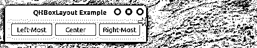](https://files.realpython.com/media/QHBoxLayout-Example.c543a352d64f.gif)

该窗口包含三个以水平方式排列的按钮。请注意，最左边的*按钮对应于您在代码中添加的第一个按钮。因此，按钮的显示顺序(从左到右)与您在代码中添加它们的顺序(从上到下)相同。*

最右边的*中心*和*按钮*有不同的拉伸系数，因此当您调整窗口大小时，它们会按比例扩展。

此外，`layout`中的所有按钮和布局本身都被设置为`Window`的子元素。这是由布局对象自动完成的，它在内部调用每个小部件上的`.setParent()`。第 22 行对 [`print()`](https://realpython.com/python-print/) 的调用在您的终端上打印了`Window`的孩子的列表，作为这种行为的证据。

### 建筑竖向布局:`QVBoxLayout`

**`QVBoxLayout`** 垂直排列小工具**，一个在另一个下面。您可以使用这个类创建垂直布局，并从上到下排列您的小部件。由于`QVBoxLayout`是另一个盒子布局，其`.addWidget()`方法与`QHBoxLayout`中的方法相同。*

*下面是一个 PyQt 应用程序，展示了如何创建和使用一个`QVBoxLayout`对象来在 GUI 中创建垂直排列的小部件:

```py
 1import sys
 2
 3from PyQt5.QtWidgets import (
 4    QApplication,
 5    QPushButton,
 6    QVBoxLayout,
 7    QWidget,
 8)
 9
10class Window(QWidget):
11    def __init__(self):
12        super().__init__()
13        self.setWindowTitle("QVBoxLayout Example")
14        self.resize(270, 110)
15        # Create a QVBoxLayout instance
16        layout = QVBoxLayout() 17        # Add widgets to the layout
18        layout.addWidget(QPushButton("Top")) 19        layout.addWidget(QPushButton("Center")) 20        layout.addWidget(QPushButton("Bottom")) 21        # Set the layout on the application's window
22        self.setLayout(layout)
23
24if __name__ == "__main__":
25    app = QApplication(sys.argv)
26    window = Window()
27    window.show()
28    sys.exit(app.exec_())
```

在第 16 行，您创建了一个`QVBoxLayout`的实例。在第 18 到 20 行，您向`layout`添加了三个按钮。最后，将`layout`设置为窗口的顶层布局。

如果您运行这个应用程序，那么您将得到以下窗口:

[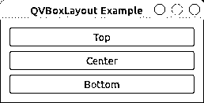](https://files.realpython.com/media/QVBoxLayout-Example.c22222cbcb5a.png)

您的窗口显示三个垂直排列的按钮，一个在另一个的下面。按钮出现的顺序(从上到下)与您在代码中添加它们的顺序(从上到下)相同。

[*Remove ads*](/account/join/)

### 在网格中排列部件:`QGridLayout`

您可以使用 **`QGridLayout`** 将小部件排列在由行和列组成的**网格**中。每个小部件在网格中都有一个相对位置。要定义小部件的位置或网格中的单元格，可以使用一对形式为`(row, column)`的坐标。这些坐标应该是从零开始的整数。

`QGridLayout`获取其父控件上的可用空间，将其分成行和列，并将每个小部件放入其自己的单元格或框中。`QGridLayout`根据小部件的数量及其坐标，自动计算出最终布局的行数和列数。如果你不给一个给定的单元格添加一个小部件，那么`QGridLayout`会让这个单元格为空。

要将小部件添加到网格布局中，可以在布局上调用`.addWidget()`。这个方法有两个不同的[重载](https://en.wikipedia.org/w/index.php?title=Overloading_(programming)&redirect=no)实现:

1.  **`addWidget(widget, row, column, alignment)`** 在(`row`、`column`)处的单元格增加`widget`。
2.  **`addWidget(widget, fromRow, fromColumn, rowSpan, columnSpan, alignment)`** 将`widget`添加到单元格中，跨越多行、多列或两者。

第一个实现采用以下参数:

1.  **`widget`** 是一个必需的参数，用于保存您需要添加到布局中的特定小部件。
2.  **`row`** 是一个必需的参数，用于保存代表网格中行坐标的整数。
3.  **`column`** 是一个必需的参数，用于保存代表网格中某列坐标的整数。
4.  **`alignment`** 是一个可选参数，用于保存小工具在其包含的单元格内的对齐方式。它默认为`0`，这意味着小部件将填充整个单元格。

下面是一个如何使用`QGridLayout`创建小部件网格的例子:

```py
 1import sys
 2
 3from PyQt5.QtWidgets import (
 4    QApplication,
 5    QGridLayout,
 6    QPushButton,
 7    QWidget,
 8)
 9
10class Window(QWidget):
11    def __init__(self):
12        super().__init__()
13        self.setWindowTitle("QGridLayout Example")
14        # Create a QGridLayout instance
15        layout = QGridLayout() 16        # Add widgets to the layout
17        layout.addWidget(QPushButton("Button at (0, 0)"), 0, 0) 18        layout.addWidget(QPushButton("Button at (0, 1)"), 0, 1) 19        layout.addWidget(QPushButton("Button at (0, 2)"), 0, 2) 20        layout.addWidget(QPushButton("Button at (1, 0)"), 1, 0) 21        layout.addWidget(QPushButton("Button at (1, 1)"), 1, 1) 22        layout.addWidget(QPushButton("Button at (1, 2)"), 1, 2) 23        layout.addWidget(QPushButton("Button at (2, 0)"), 2, 0) 24        layout.addWidget(QPushButton("Button at (2, 1)"), 2, 1) 25        layout.addWidget(QPushButton("Button at (2, 2)"), 2, 2) 26        # Set the layout on the application's window
27        self.setLayout(layout)
28
29if __name__ == "__main__":
30    app = QApplication(sys.argv)
31    window = Window()
32    window.show()
33    sys.exit(app.exec_())
```

在第 15 行，您创建了`QGridLayout`对象。然后，在第 17 到 25 行，使用`.addWidget()`向布局添加小部件。要查看网格布局如何在没有分配小部件的情况下管理单元格，请注释掉这些行中的一行或多行，然后再次运行应用程序。

如果您从命令行运行这段代码，您将会看到如下窗口:

[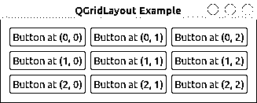](https://files.realpython.com/media/QGridLayout-Example.52ae870105f6.png)

`QGridLayout`对象中的每个小部件占据了由您在`.addWidget()`中提供的一对坐标定义的单元。每个按钮上的文字反映了这些坐标。坐标是从零开始的，所以第一个单元格在`(0, 0)`。

在`.addWidget()`的第二个实现中，参数`widget`和`alignment`保持不变，并且有四个额外的参数允许您将小部件放置在几行或几列中:

1.  **`fromRow`** 取一个整数，表示小部件将从哪一行开始。
2.  **`fromColumn`** 取一个整数，表示小部件将开始的列。
3.  **`rowSpan`** 取一个整数，表示小部件将在网格中占据的行数。
4.  **`columnSpan`** 取一个整数，表示小部件将在网格中占据的列数。

这里有一个应用程序展示了`.addWidget()`的这种变体是如何工作的:

```py
 1import sys
 2
 3from PyQt5.QtWidgets import (
 4    QApplication,
 5    QGridLayout,
 6    QPushButton,
 7    QWidget,
 8)
 9
10class Window(QWidget):
11    def __init__(self):
12        super().__init__()
13        self.setWindowTitle("QGridLayout Example")
14        # Create a QGridLayout instance
15        layout = QGridLayout()
16        # Add widgets to the layout
17        layout.addWidget(QPushButton("Button at (0, 0)"), 0, 0)
18        layout.addWidget(QPushButton("Button at (0, 1)"), 0, 1)
19        layout.addWidget(QPushButton("Button Spans two Cols"), 1, 0, 1, 2) 20        # Set the layout on the application's window
21        self.setLayout(layout)
22
23if __name__ == "__main__":
24    app = QApplication(sys.argv)
25    window = Window()
26    window.show()
27    sys.exit(app.exec_())
```

在第 19 行，您使用第二个实现`.addWidget()`来添加一个按钮，它占据了网格中的两列。按钮从第二行(`fromRow=1`)和第一列(`fromColumn=0`)开始。最后，按钮占据一行(`rowSpan=1`)和两列(`columnSpan=2`)。

**注意:**由于 [PyQt 是为](https://www.riverbankcomputing.com/static/Docs/PyQt5/introduction.html) [Qt](https://wiki.qt.io/About_Qt) 绑定的 Python，是一组 [C++](https://realpython.com/python-vs-cpp/) 库，所以有时候调用 PyQt 方法时不能使用[关键字参数](https://realpython.com/python-kwargs-and-args/)。上一段中使用的关键字参数的唯一目的是显示分配给每个参数的值。

如果运行此应用程序，您将在屏幕上看到以下窗口:

[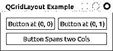](https://files.realpython.com/media/QGridLayout-Span-Example.bd462d9921a3.png)

在这种布局中，你可以让一个小部件占据多个单元格，就像你用*按钮跨越两列*按钮一样。

[*Remove ads*](/account/join/)

### 快速创建表单:`QFormLayout`

如果您经常创建表单来执行像将数据输入数据库这样的操作，那么 **`QFormLayout`** 就是为您准备的。这个类在一个**两列**布局中排列小部件。第一列通常显示一个描述预期输入的**标签**，第二列通常包含允许用户输入或编辑数据的**输入小部件**，如 [`QLineEdit`](https://doc.qt.io/qt-5/qlineedit.html) 、 [`QComboBox`](https://doc.qt.io/qt-5/qcombobox.html) 或 [`QSpinBox`](https://doc.qt.io/qt-5/qspinbox.html) 。

要向表单布局添加小部件，可以使用`.addRow()`。这种方法有几种变体，但大多数情况下，您会从以下两种方法中进行选择:

1.  **`.addRow(label, field)`** 在表格布局底部添加新行。该行应该包含一个`QLabel`对象(`label`)和一个输入小部件(`field`)。

2.  **`.addRow(labelText, field)`** 自动创建并添加一个新的`QLabel`对象，其文本为`labelText`。`field`持有一个输入控件。

下面是一个使用`QFormLayout`对象来排列小部件的示例应用程序:

```py
 1import sys
 2
 3from PyQt5.QtWidgets import (
 4    QApplication,
 5    QFormLayout,
 6    QLabel,
 7    QLineEdit,
 8    QWidget,
 9)
10
11class Window(QWidget):
12    def __init__(self):
13        super().__init__()
14        self.setWindowTitle("QFormLayout Example")
15        self.resize(270, 110)
16        # Create a QFormLayout instance
17        layout = QFormLayout() 18        # Add widgets to the layout
19        layout.addRow("Name:", QLineEdit()) 20        layout.addRow("Job:", QLineEdit()) 21        emailLabel = QLabel("Email:")
22        layout.addRow(emailLabel, QLineEdit()) 23        # Set the layout on the application's window
24        self.setLayout(layout)
25
26if __name__ == "__main__":
27    app = QApplication(sys.argv)
28    window = Window()
29    window.show()
30    sys.exit(app.exec_())
```

在第 17 行，您创建了一个`QFormLayout`对象。然后，在第 19 到 22 行，向布局添加一些行。请注意，在第 19 行和第 20 行，您使用了该方法的第二种变体，在第 22 行，您使用了第一种变体，将一个`QLabel`对象作为第一个参数传递给`.addRow()`。

如果您运行这段代码，您将在屏幕上看到以下窗口:

[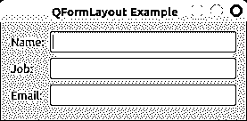](https://files.realpython.com/media/QFormLayout-Example.171dd672d776.png)

使用`QFormLayout`，你可以以两列的方式组织你的小部件。第一列包含要求用户提供一些信息的标签。第二列显示允许用户输入或编辑信息的小部件。

## 嵌套布局构建复杂的图形用户界面

您可以使用**嵌套的**布局来创建复杂的 GUI，这些 GUI 很难使用一个通用的 PyQt 布局管理器来创建。为此，您需要在一个**外部布局**上调用`.addLayout()`。这样，**内部布局**成为外部布局的子布局。

假设您需要创建一个对话框，在表单布局中显示一个标签和一行编辑，并且您希望在这些小部件下面放置几个垂直布局的复选框。这里有一个对话框的模型:

[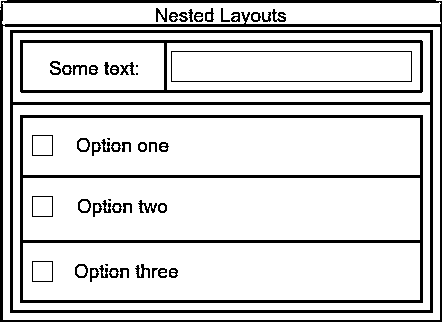](https://files.realpython.com/media/Nested-Layouts-diagram.18da29f2988f.png)

蓝色矩形代表您的外部布局。绿色矩形是保存标签和行编辑的表单布局。红色矩形是放置选项复选框的垂直布局。绿色布局和红色布局都嵌套在蓝色布局中，蓝色布局是垂直布局。

下面是如何使用 PyQt 构建这种布局的示例:

```py
 1import sys
 2
 3from PyQt5.QtWidgets import (
 4    QApplication,
 5    QCheckBox,
 6    QFormLayout,
 7    QLineEdit,
 8    QVBoxLayout,
 9    QWidget,
10)
11
12class Window(QWidget):
13    def __init__(self):
14        super().__init__()
15        self.setWindowTitle("Nested Layouts Example")
16        # Create an outer layout
17        outerLayout = QVBoxLayout() 18        # Create a form layout for the label and line edit
19        topLayout = QFormLayout() 20        # Add a label and a line edit to the form layout
21        topLayout.addRow("Some Text:", QLineEdit()) 22        # Create a layout for the checkboxes
23        optionsLayout = QVBoxLayout() 24        # Add some checkboxes to the layout
25        optionsLayout.addWidget(QCheckBox("Option one")) 26        optionsLayout.addWidget(QCheckBox("Option two")) 27        optionsLayout.addWidget(QCheckBox("Option three")) 28        # Nest the inner layouts into the outer layout
29        outerLayout.addLayout(topLayout) 30        outerLayout.addLayout(optionsLayout) 31        # Set the window's main layout
32        self.setLayout(outerLayout)
33
34if __name__ == "__main__":
35    app = QApplication(sys.argv)
36    window = Window()
37    window.show()
38    sys.exit(app.exec_())
```

下面是您在这段代码中要做的事情:

*   **在第 17 行**中，你创建了外部或者顶层布局，你将把它作为父布局和窗口的主布局。在这种情况下，您使用`QVBoxLayout`,因为您希望小部件在表单上垂直排列。在你的模型中，这是蓝色的布局。
*   **在第 19 行**，您创建一个表单布局来保存一个标签和一个行编辑。
*   **在第 21 行**，您将所需的小部件添加到布局中。这相当于你的绿色布局。
*   在第 23 行上，你创建一个垂直布局来放置复选框。
*   **在第 25 到 27 行**上，添加所需的复选框。这是你的红色布局。
*   **在第 29 行和第 30 行**，你在`outerLayout`下嵌套`topLayout`和`optionsLayout`。

就是这样！如果您运行该应用程序，您将看到如下窗口:

[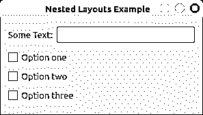](https://files.realpython.com/media/Nested-Layouts-Example.a9f3c97077d6.png)

在这个应用程序中，您将两个不同的布局嵌套在一个外部布局下，为您的窗口创建一个通用布局。在窗口顶部，使用水平布局放置标签和行编辑。然后使用垂直布局在下面放置一些复选框。

[*Remove ads*](/account/join/)

## 使用多页面布局和小部件

到目前为止，您已经看到了如何使用传统的或通用的布局管理器来安排应用程序窗口中的小部件。这些布局管理器将在**单页布局**上排列小部件。换句话说，您的 GUI 将总是向用户显示同一组小部件。

有时，您需要创建一个布局来显示一组不同的小部件，以响应 GUI 上的某些用户操作。例如，如果你正在为一个给定的应用程序创建一个首选项对话框，那么你可能希望向用户呈现一个基于**选项卡的**，或者**多页**，其中每个选项卡或页面包含一组不同的密切相关的选项。每当用户点击一个标签或页面，应用程序就会显示不同的小部件。

PyQt 提供了一个名为 [`QStackedLayout`](https://www.riverbankcomputing.com/static/Docs/PyQt5/api/qtwidgets/qstackedlayout.html#) 的内置布局，以及一些方便的小部件，如 [`QTabWidget`](https://www.riverbankcomputing.com/static/Docs/PyQt5/api/qtwidgets/qtabwidget.html#) ，允许您创建这种多页面布局。接下来的几节将带您了解这些工具。

### 创建一堆小部件

**`QStackedLayout`** 提供了一个布局管理器，允许你将你的小部件排列在**栈**上，一个在另一个之上。在这种布局中，一次只能看到一个小部件。

要用小部件填充堆叠布局，需要在布局对象上调用`.addWidget()`。这将把每个部件添加到布局内部部件列表的末尾。您还可以分别使用`.insertWidget(index)`或`.removeWidget(widget)`在小部件列表中的给定位置插入或移除小部件。

小部件列表中的每个小部件都显示为一个独立的页面。如果您想在一个页面上显示几个小部件，那么为每个页面使用一个`QWidget`对象，并为页面小部件设置一个适当的小部件布局。如果您需要获得布局中部件(页面)的总数，那么您可以调用`.count()`。

使用`QStackedLayout`对象时要记住的重要一点是，您需要明确地提供一种在页面之间切换的机制。否则，您的布局将总是向用户显示相同的页面。要在页面之间切换，需要在 layout 对象上调用`.setCurrentIndex()`。

下面的示例显示了如何使用带有组合框的堆叠布局在页面之间切换:

```py
 1import sys
 2
 3from PyQt5.QtWidgets import (
 4    QApplication,
 5    QComboBox,
 6    QFormLayout,
 7    QLineEdit,
 8    QStackedLayout,
 9    QVBoxLayout,
10    QWidget,
11)
12
13class Window(QWidget):
14    def __init__(self):
15        super().__init__()
16        self.setWindowTitle("QStackedLayout Example")
17        # Create a top-level layout
18        layout = QVBoxLayout()
19        self.setLayout(layout)
20        # Create and connect the combo box to switch between pages
21        self.pageCombo = QComboBox() 22        self.pageCombo.addItems(["Page 1", "Page 2"]) 23        self.pageCombo.activated.connect(self.switchPage) 24        # Create the stacked layout
25        self.stackedLayout = QStackedLayout() 26        # Create the first page
27        self.page1 = QWidget() 28        self.page1Layout = QFormLayout() 29        self.page1Layout.addRow("Name:", QLineEdit()) 30        self.page1Layout.addRow("Address:", QLineEdit()) 31        self.page1.setLayout(self.page1Layout) 32        self.stackedLayout.addWidget(self.page1) 33        # Create the second page
34        self.page2 = QWidget() 35        self.page2Layout = QFormLayout() 36        self.page2Layout.addRow("Job:", QLineEdit()) 37        self.page2Layout.addRow("Department:", QLineEdit()) 38        self.page2.setLayout(self.page2Layout) 39        self.stackedLayout.addWidget(self.page2) 40        # Add the combo box and the stacked layout to the top-level layout
41        layout.addWidget(self.pageCombo)
42        layout.addLayout(self.stackedLayout)
43
44    def switchPage(self):
45        self.stackedLayout.setCurrentIndex(self.pageCombo.currentIndex())
46
47if __name__ == "__main__":
48    app = QApplication(sys.argv)
49    window = Window()
50    window.show()
51    sys.exit(app.exec_())
```

在第 21 到 23 行，您创建了一个`QComboBox`对象，它将允许您在布局中的页面之间切换。然后在一个[列表](https://realpython.com/python-lists-tuples/)中添加两个选项到组合框中，并将其连接到`.switchPage()`，这是为了处理页面切换。

在`.switchPage()`中，您调用布局对象上的`.setCurrentIndex()`，将组合框的当前索引作为参数传递。这样，当用户更改组合框中的选项时，堆叠布局上的页面也会相应地更改。

在第 25 行，您创建了`QStackedLayout`对象。在第 27 到 32 行，您将第一页添加到布局中，在第 34 到 39 行，您将第二页添加到布局中。每个页面由一个`QWidget`对象表示，该对象包含几个布局方便的小部件。

让一切正常工作的最后一步是将组合框和布局添加到应用程序的主布局中。

下面是您的应用程序现在的行为:

[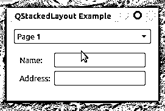](https://files.realpython.com/media/QStackedLayout-Example.82a2ab5d8798.gif)

在这种情况下，您的应用程序布局中有两个页面。每个页面由一个`QWidget`对象表示。当您在窗口顶部的组合框中选择一个新页面时，布局会发生变化以显示所选页面。

**注:** PyQt 提供了一个方便的类叫做 [`QStackedWidget`](https://doc.qt.io/qt-5/qstackedwidget.html) ，构建在`QStackedLayout`之上。您也可以使用这个类来创建多页布局。

这个类提供了一个窗口小部件堆栈，其中一次只有一个窗口小部件可见。就像堆叠布局一样，`QStackedWidget`没有提供内在的页面切换机制。

除了堆叠布局和堆叠小部件，您还可以使用 [`QTabWidget`](https://doc.qt.io/qt-5/qtabwidget.html) 来创建多页面用户界面。您将在下一节中了解如何操作。

[*Remove ads*](/account/join/)

### 使用 PyQt 的选项卡小部件

在 PyQt 中创建多页排列的另一种流行方式是使用名为 **`QTabWidget`** 的类。这个类提供了一个**标签栏**和一个**页面区域**。您可以使用选项卡栏在页面和页面区域之间切换，以显示与所选选项卡相关联的页面。

默认情况下，选项卡栏位于页面区域的顶部。但是，您可以使用 [`.setTabPosition()`](https://doc.qt.io/qt-5/qtabwidget.html#tabPosition-prop) 和四个可能的[标签位置](https://doc.qt.io/qt-5/qtabwidget.html#TabPosition-enum)中的一个来改变这种行为:

| 制表位置 | 标签栏位置 |
| --- | --- |
| `QTabWidget.North` | 页面顶部 |
| `QTabWidget.South` | 页面底部 |
| `QTabWidget.West` | 页面左侧 |
| `QTabWidget.East` | 页面右侧 |

要向选项卡小部件添加选项卡，可以使用`.addTab()`。此方法有两种变体，即重载实现:

1.  `.addTab(page, label)`
2.  `.addTab(page, icon, label)`

在这两种情况下，该方法都会添加一个新的选项卡，用`label`作为选项卡的标题。`page`需要是一个小部件，代表与手头的选项卡相关联的页面。

在该方法的第二个变体中，`icon`需要是一个 [`QIcon`](https://www.riverbankcomputing.com/static/Docs/PyQt5/api/qtgui/qicon.html#) 对象。如果你传递一个图标给`.addTab()`，那么这个图标将会显示在标签标题的左边。

创建选项卡小部件时的一个常见做法是为每个页面使用一个`QWidget`对象。这样，您将能够使用包含所需部件的布局向页面添加额外的部件。

大多数情况下，您将使用选项卡小部件为 GUI 应用程序创建对话框。这种布局允许你在相对较小的空间内为用户提供多种选择。你也可以利用标签系统根据一些分类标准来组织你的选项。

下面是一个示例应用程序，展示了如何创建和使用一个`QTabWidget`对象的基本知识:

```py
 1import sys
 2
 3from PyQt5.QtWidgets import (
 4    QApplication,
 5    QCheckBox,
 6    QTabWidget,
 7    QVBoxLayout,
 8    QWidget,
 9)
10
11class Window(QWidget):
12    def __init__(self):
13        super().__init__()
14        self.setWindowTitle("QTabWidget Example")
15        self.resize(270, 110)
16        # Create a top-level layout
17        layout = QVBoxLayout()
18        self.setLayout(layout)
19        # Create the tab widget with two tabs
20        tabs = QTabWidget() 21        tabs.addTab(self.generalTabUI(), "General") 22        tabs.addTab(self.networkTabUI(), "Network") 23        layout.addWidget(tabs)
24
25    def generalTabUI(self): 26        """Create the General page UI."""
27        generalTab = QWidget()
28        layout = QVBoxLayout()
29        layout.addWidget(QCheckBox("General Option 1"))
30        layout.addWidget(QCheckBox("General Option 2"))
31        generalTab.setLayout(layout)
32        return generalTab
33
34    def networkTabUI(self): 35        """Create the Network page UI."""
36        networkTab = QWidget()
37        layout = QVBoxLayout()
38        layout.addWidget(QCheckBox("Network Option 1"))
39        layout.addWidget(QCheckBox("Network Option 2"))
40        networkTab.setLayout(layout)
41        return networkTab
42
43if __name__ == "__main__":
44    app = QApplication(sys.argv)
45    window = Window()
46    window.show()
47    sys.exit(app.exec_())
```

在这个例子中，您使用一个选项卡小部件向用户呈现一个简洁的对话框，显示与假想的首选项菜单的 *General* 和 *Network* 部分相关的选项。在第 20 行，您创建了`QTabWidget`对象。然后使用`.addTab()`向选项卡小部件添加两个选项卡。

在`.generalTabUI()`和`networkTabUI()`中，您为每个选项卡创建特定的 GUI。为此，您使用一个`QWidget`对象、一个`QVBoxLayout`对象和一些复选框来保存选项。

如果您现在运行该应用程序，您将在屏幕上看到以下对话框:

[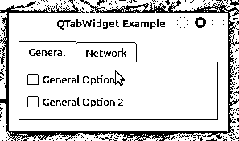](https://files.realpython.com/media/QTabWidget-Example.1fc75e4e9137.gif)

就是这样！您拥有了一个功能齐全的基于选项卡的 GUI。请注意，要在页面之间切换，您只需单击相应的选项卡。

## 布置应用程序的主窗口

如果你使用 PyQt 来创建你的 GUI 应用程序，那么大多数时候你会使用 [`QMainWindow`](https://doc.qt.io/qt-5/qmainwindow.html) 来创建一个基于它的 GUI。这个类允许你创建[主窗口风格的应用](https://realpython.com/python-pyqt-gui-calculator/#main-windows)。`QMainWindow`自带[预定义布局](https://doc.qt.io/qt-5/qmainwindow.html#qt-main-window-framework)。此布局允许您将以下图形组件添加到主窗口中:

*   窗口顶部的[菜单栏](https://realpython.com/python-menus-toolbars/#creating-menu-bars)
*   一个或多个[工具栏](https://realpython.com/python-menus-toolbars/#creating-toolbars)位于窗口的四边
*   窗口底部有一个[状态栏](https://realpython.com/python-menus-toolbars/#building-python-status-bars-in-pyqt)
*   一个或多个 [dock widgets](https://doc.qt.io/qt-5/qdockwidget.html) 位于窗口的四边(但不占据工具栏区域)
*   位于窗口正中央的[中心小工具](https://doc.qt.io/qt-5/qmainwindow.html#setCentralWidget)

对于大多数应用程序来说，除了中央小部件之外，所有这些图形组件都是可选的，中央小部件是应用程序正常工作所必需的。

**注意:**如果你使用`QMainWindow`创建 GUI 应用程序，那么你*必须*有一个中心部件，即使它只是一个占位符。

一些应用程序使用一个独特的全功能小部件作为它们的中心小部件。例如，如果你正在编写一个文本编辑器，那么你可能会使用一个 [`QTextEdit`](https://doc.qt.io/qt-5/qtextedit.html) 对象作为编辑器的中心部件。

其他种类的 GUI 应用程序可能需要更复杂的中央小部件。在这种情况下，您可以使用一个`QWidget`对象作为您的中心小部件，然后创建一个布局，其中包含您的应用程序 GUI 所需的特定小部件排列。最后一步是将该布局设置为中心小部件的布局。

大多数时候，`QMainWindow`提供的布局足以创建任何种类的 GUI 应用程序。这种布局将有效地管理窗口小部件的行为，所以您不必担心这一点。

[*Remove ads*](/account/join/)

## 布局应用程序的对话框

GUI 应用程序通常使用一个主窗口和一个或多个**对话框**来构建。对话框是允许你和用户交流的小窗口。PyQt 提供了 [`QDialog`](https://doc.qt.io/qt-5/qdialog.html) 来处理对话框的创建。

与`QMainWindow`不同，`QDialog`没有预定义或默认的顶层布局。这是因为对话框可以有很多种，包括各种各样的小部件排列和组合。

一旦将所有的小部件放在对话框的 GUI 上，就需要在该对话框上设置一个顶层布局。为此，您必须调用对话框对象上的`.setLayout()`,就像您对任何其他小部件所做的那样。

这里有一个[对话框风格的应用程序](https://realpython.com/python-pyqt-gui-calculator/#dialogs)，展示了如何设置一个`QDialog`对象的顶层布局:

```py
 1import sys
 2
 3from PyQt5.QtWidgets import (
 4    QApplication,
 5    QDialog,
 6    QDialogButtonBox,
 7    QFormLayout,
 8    QLineEdit,
 9    QVBoxLayout,
10)
11
12class Dialog(QDialog):
13    def __init__(self):
14        super().__init__()
15        self.setWindowTitle("QDialog's Top-Level Layout Example")
16        dlgLayout = QVBoxLayout() 17        # Create a form layout and add widgets
18        formLayout = QFormLayout() 19        formLayout.addRow("Name:", QLineEdit()) 20        formLayout.addRow("Job:", QLineEdit()) 21        formLayout.addRow("Email:", QLineEdit()) 22        # Add a button box
23        btnBox = QDialogButtonBox()
24        btnBox.setStandardButtons(
25            QDialogButtonBox.Ok | QDialogButtonBox.Cancel
26        )
27        # Set the layout on the dialog
28        dlgLayout.addLayout(formLayout) 29        dlgLayout.addWidget(btnBox) 30        self.setLayout(dlgLayout) 31
32if __name__ == "__main__":
33    app = QApplication(sys.argv)
34    dlg = Dialog()
35    dlg.show()
36    sys.exit(app.exec_())
```

在这种情况下，应用程序的窗口继承自`QDialog`，所以你有一个对话框风格的应用程序。在第 16 行，您创建了将用作对话框顶层布局的布局。在第 18 到 21 行，您创建了一个表单布局来安排表单中的一些小部件。

在第 24 行，你添加一个 [`QDialogButtonBox`](https://doc.qt.io/qt-5/qdialogbuttonbox.html) 对象。您将经常使用`QDialogButtonBox`来处理对话框上的按钮。在这个例子中，您使用了两个按钮，一个*确定*按钮和一个*取消*按钮。这些按钮没有任何功能，它们只是为了让对话框更真实。

一旦所有的小部件和布局就绪，就可以将它们添加到顶层布局中。这就是你在第 28 和 29 行所做的。最后一步，在第 30 行，使用`.setLayout()`将顶层布局设置为对话框的布局。

如果您运行此应用程序，您将在屏幕上看到以下窗口:

[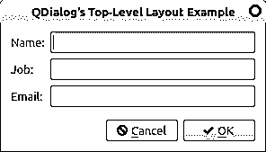](https://files.realpython.com/media/QDialog-Top-Level-Layout-Example.21b913e57394.png)

为所有对话框设置顶层布局是一个最佳实践。这确保了当用户调整底层窗口大小时，对话框的 GUI 行为一致。否则，在用户看来，你的对话框会显得杂乱无章，未经修饰。

## 管理 PyQt 布局中的空间

当使用 PyQt 的布局管理器在窗口或表单上排列小部件时，管理空间——空白空间、小部件之间的空间等等——是一个常见的问题。能够管理这个空间是一项重要的技能。

在内部，布局使用以下一些小部件属性来管理窗口上的可用空间:

*   [`.sizeHint()`](https://doc.qt.io/qt-5/qwidget.html#sizeHint-prop) 包含小部件的推荐尺寸
*   [`.minimumSizeHint()`](https://doc.qt.io/qt-5/qwidget.html#minimumSizeHint-prop) 包含小工具在保持可用时可以拥有的最小尺寸
*   [`.sizePolicy()`](https://doc.qt.io/qt-5/qwidget.html#sizePolicy-prop) 保存布局中小部件的默认行为

布局使用这些属性自动定位和调整小部件的大小，根据可用空间为每个小部件分配给定的空间量。这确保了小部件被一致地排列并保持可用。

在接下来的三节中，您将了解不同类型的布局如何管理 PyQt 中的空间。

### 管理盒子布局中的空间

盒子布局在小部件之间分配可用空间方面做得很好。然而，有时它们的默认行为是不够的，您需要手动处理可用空间。为了在这种情况下帮助你，PyQt 提供了 [`QSpacerItem`](https://doc.qt.io/qt-5/qspaceritem.html) 。这个类允许你添加空白空间(或者空框)到一个框布局中。

正常情况下不需要直接使用`QSpacerItem`。相反，您可以在框布局对象上调用以下一些方法:

*   **`.addSpacing(i)`** 在布局中增加一个固定大小`i`的不可拉伸空间(或空框)。`i`必须是一个整数，以像素表示空间的大小。

*   **`.addStretch(i)`** 为盒子布局添加最小尺寸为`0`的可拉伸空间和拉伸系数`i`。`i`必须是整数。

*   **`.insertSpacing(index, size)`** 在`index`位置插入一个不可拉伸的空格，大小`size`。如果`index`为负，则在方框布局的末尾添加空格。

*   **`insertStretch(index, stretch)`** 在`index`位置插入一个可拉伸的空格，最小尺寸`0`，拉伸系数`stretch`。如果`index`是负数，那么空格被添加到方框布局的末尾。

当用户调整底层窗口大小时，可拉伸的间隔条会膨胀或收缩以填充空白空间。**不可拉伸的垫片**将保持相同的尺寸，不管底层窗户的尺寸如何变化。

回到如何使用垂直布局的例子，并再次运行该应用程序。如果你拉下窗口的边框，你会注意到越往下，按钮之间出现的空间越大:

[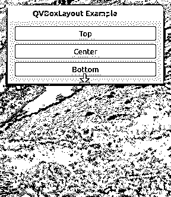](https://files.realpython.com/media/Non-Stretchable-Spacer-Example.0791b15beed0.gif)

这是因为布局通过自动扩展其框来处理新的可用空间。您可以通过在布局的末尾添加一个可拉伸的`QSpacerItem`对象来改变这种行为。

在您的示例代码中，更新`Window`的初始化器，如下所示:

```py
class Window(QWidget):
    def __init__(self):
        super().__init__()
        self.setWindowTitle("QVBoxLayout Example")
        self.resize(270, 110)
        # Create a QVBoxLayout instance
        layout = QVBoxLayout()
        # Add widgets to the layout
        layout.addWidget(QPushButton("Top"))
        layout.addWidget(QPushButton("Center"))
        layout.addWidget(QPushButton("Bottom"))
 layout.addStretch()        # Set the layout on the application's window
        self.setLayout(layout)
```

在突出显示的行中，通过调用布局上的`.addStretch()`将可拉伸的`QSpacerItem`对象添加到布局的末尾。如果您再次运行该应用程序，您将获得以下行为:

[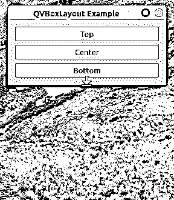](https://files.realpython.com/media/Stretchable-Spacer-Example.13550e483950.gif)

现在，所有额外的空间都自动分配给布局底部的可拉伸的`QSpacerItem`对象，而不会影响其余小部件的位置或大小。您可以使用这种和其他空间管理技术来使您的 GUI 应用程序看起来更好、更完美。

[*Remove ads*](/account/join/)

### 管理网格和表单布局中的空间

网格和表单布局以不同的方式处理可用空间。在这些类型的布局中，您只能处理小部件之间的垂直和水平空间。这些布局提供了三种管理这些空间的方法:

1.  **`setSpacing(spacing)`** 将小工具之间的垂直和水平间距设置为`spacing`。
2.  **`setVerticalSpacing(spacing)`** 仅将布局中微件之间的垂直间距设置为`spacing`。
3.  **`setHorizontalSpacing(spacing)`** 仅将布局中部件之间的水平间距设置为`spacing`。

在所有情况下，`spacing`是表示像素的整数。现在回到如何创建一个表单布局并像这样更新`Window`的初始化器的例子:

```py
class Window(QWidget):
    def __init__(self):
        super().__init__()
        self.setWindowTitle("QFormLayout Example")
        self.resize(270, 110)
        # Create a QHBoxLayout instance
        layout = QFormLayout()
        # Add widgets to the layout
 layout.setVerticalSpacing(30)        layout.addRow("Name:", QLineEdit())
        layout.addRow("Job:", QLineEdit())
        emailLabel = QLabel("Email:")
        layout.addRow(emailLabel, QLineEdit())
        # Set the layout on the application's window
        self.setLayout(layout)
```

在突出显示的行中，您将小部件之间的垂直间距设置为`30`像素。如果您再次运行该应用程序，您将看到以下窗口:

[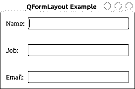](https://files.realpython.com/media/QFormLayout-Spacing-Example.79063ae9d18e.png)

现在小部件的行之间有了更多的空间。您还可以尝试通过添加一些垂直或水平空间来修改如何使用网格布局的示例，以便了解所有这些间距机制是如何工作的。

## 结论

创建高质量的 GUI 应用程序需要将所有的图形组件以一种连贯和完美的方式排列。在 PyQt 中，一种有效的方法是使用 PyQt 的**布局管理器**，它提供了一种用户友好且高效的方法来完成这项任务。

**在本教程中，您已经学习了:**

*   在 GUI 上正确布局小部件的好处是什么
*   如何使用 PyQt 内置的**布局管理器**以编程方式排列小部件
*   哪个布局管理器用于您的特定**用例**
*   如何在 PyQt 中布局**主窗口式**和**对话框式**应用

有了这些知识，您将能够使用 PyQt 的内置布局创建好看且专业的 GUI 应用程序。

*立即观看**本教程有真实 Python 团队创建的相关视频课程。和书面教程一起看，加深你的理解: [**为 GUI 应用程序创建 PyQt 布局**](/courses/creating-pyqt-layouts-gui-applications/)**************