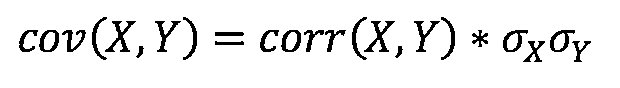
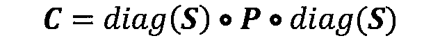

# 在 Python 中生成随机数据(指南)

> 原文：<https://realpython.com/python-random/>

*立即观看**本教程有真实 Python 团队创建的相关视频课程。配合文字教程一起看，加深理解: [**用 Python 生成随机数据**](/courses/generating-random-data-python/)

随机有多随机？这是一个奇怪的问题，但在涉及信息安全的情况下，这是最重要的问题之一。每当你在 Python 中生成随机数据、[字符串](https://realpython.com/python-strings/)或数字时，最好至少对这些数据是如何生成的有一个大致的了解。

在这里，您将讨论在 Python 中生成随机数据的几种不同选择，然后从安全性、通用性、用途和速度的角度对每种选择进行比较。

我保证这篇教程不会是数学或密码学的课程，因为我一开始就没有能力讲授这些内容。你需要多少数学知识就有多少数学知识，不会更多。

## 随机有多随机？

首先，一个突出的免责声明是必要的。用 Python 生成的大多数随机数据在科学意义上并不是完全随机的。相反，它是**伪随机**:由伪随机数发生器(PRNG)生成，本质上是用于生成看似随机但仍可再现的数据的任何算法。

“真”随机数可以由真随机数发生器(TRNG)产生，你猜对了。一个例子是反复从地板上捡起一个骰子，把它抛向空中，让它以它可能的方式落地。

假设你的投掷是无偏的，你真的不知道骰子会落在哪个数字上。掷骰子是使用硬件产生一个不确定的数字的一种原始形式。(或者，您可以让 [dice-o-matic](https://hackaday.com/2009/05/26/dice-o-matic/) 为您完成这项工作。)TRNGs 超出了本文的范围，但是为了便于比较，还是值得一提。

PRNGs 通常用软件而不是硬件来完成，工作方式略有不同。这里有一个简明的描述:

> 他们从一个被称为种子的随机数开始，然后使用一种算法基于它生成一个伪随机比特序列。[(来源)](https://bit.ly/2dUfzGb)

你可能被告知“阅读文件！”在某个时候。嗯，那些人没有错。这里有一个来自`random`模块文档的特别值得注意的片段，你一定不想错过:

> **警告**:该模块的伪随机发生器不应用于安全目的。[(来源)](https://docs.python.org/3/library/random.html)

你可能见过 Python 中的`random.seed(999)`、`random.seed(1234)`之类的。这个函数调用正在播种 Python 的`random`模块使用的底层随机数生成器。正是这一点使得后续调用生成随机数具有确定性:输入 A 总是产生输出 b。如果被恶意使用，这种祝福也可能是一种诅咒。

也许“随机”和“确定性”这两个术语看起来不能共存。为了让这一点更清楚，这里有一个极其精简的版本`random()`，它通过使用`x = (x * 3) % 19`迭代地创建一个“随机”数。`x`最初被定义为一个种子值，然后根据该种子值变成一个确定的数字序列:

```py
class NotSoRandom(object):
    def seed(self, a=3):
        """Seed the world's most mysterious random number generator."""
        self.seedval = a
    def random(self):
        """Look, random numbers!"""
        self.seedval = (self.seedval * 3) % 19
        return self.seedval

_inst = NotSoRandom()
seed = _inst.seed
random = _inst.random
```

不要从字面上理解这个例子，因为它主要是为了说明这个概念。如果使用种子值 1234，那么对`random()`的后续调用序列应该总是相同的:

>>>

```py
>>> seed(1234)
>>> [random() for _ in range(10)]
[16, 10, 11, 14, 4, 12, 17, 13, 1, 3]

>>> seed(1234)
>>> [random() for _ in range(10)]
[16, 10, 11, 14, 4, 12, 17, 13, 1, 3]
```

您将很快看到一个更严肃的例子。

[*Remove ads*](/account/join/)

## 什么是“密码安全？”

如果你还没有受够“RNG”的缩写，让我们再加入一个:CSPRNG，或加密安全 PRNG。CSPRNGs 适用于生成敏感数据，如密码、授权码和令牌。给定一个随机字符串，恶意 Joe 实际上没有办法确定在随机字符串序列中哪个字符串在该字符串之前或之后。

你可能会看到的另一个术语是**熵**。简而言之，这指的是引入或期望的随机性的数量。例如，您将在这里讨论的一个 Python [模块](https://github.com/python/cpython/blob/78392885c9b08021c89649728053d31503d8a509/Lib/secrets.py#L33)定义了`DEFAULT_ENTROPY = 32`，默认情况下返回的字节数。开发人员认为这是“足够”的字节，足以产生足够的噪音。

**注**:在本教程中，我假设一个字节指的是 8 位，从 20 世纪 60 年代开始就是这样，而不是其他的数据存储单位。如果你愿意，你可以称之为 [*八位字节*](https://en.wikipedia.org/wiki/Octet_(computing)) 。

关于 CSPRNGs 的一个关键点是它们仍然是伪随机的。它们是以某种内在确定性的方式设计的，但是它们添加了一些其他的[变量](https://realpython.com/python-variables/)或者具有一些属性，使得它们“足够随机”以禁止回退到任何实施确定性的函数。

## 您将在此介绍的内容

实际上，这意味着您应该使用普通 PRNGs 进行[统计建模](https://realpython.com/python-statistics/)、模拟，并使随机数据可重复。稍后您会看到，它们也比 CSPRNGs 快得多。对于数据敏感性至关重要的安全和加密应用，请使用 CSPRNGs。

除了扩展上面的用例之外，在本教程中，您将深入研究使用 PRNGs 和 CSPRNGs 的 Python 工具:

*   PRNG 选项包括 Python 标准库中的`random`模块及其基于数组的对应 NumPy 模块`numpy.random`。
*   Python 的`os`、`secrets`和`uuid`模块包含生成加密安全对象的函数。

您将触及以上所有内容，并以一个高层次的比较结束。

## Python 中的 PRNGs

### `random`模块

可能 Python 中最广为人知的生成随机数据的工具是它的`random`模块，它使用[梅森图](https://github.com/python/cpython/blob/master/Modules/_randommodule.c) PRNG 算法作为其核心生成器。

早些时候，您简要地提到了`random.seed()`，现在是了解它如何工作的好时机。首先，让我们构建一些没有播种的随机数据。`random.random()`函数返回一个区间为[0.0，1.0]的随机浮点数。结果将总是小于右边的端点(1.0)。这也称为半开放范围:

>>>

```py
>>> # Don't call `random.seed()` yet
>>> import random
>>> random.random()
0.35553263284394376
>>> random.random()
0.6101992345575074
```

如果你自己运行这段代码，我敢用我一生的积蓄打赌，你的机器上返回的数字会不同。当你没有设置生成器的时候，默认设置是使用你当前的系统时间或者你操作系统中的一个“随机源”(如果有的话)。

使用`random.seed()`，您可以使结果可重复，并且`random.seed()`之后的调用链将产生相同的数据轨迹:

>>>

```py
>>> random.seed(444)
>>> random.random()
0.3088946587429545
>>> random.random()
0.01323751590501987

>>> random.seed(444)  # Re-seed
>>> random.random()
0.3088946587429545
>>> random.random()
0.01323751590501987
```

注意“随机”数字的重复。随机数序列变得确定，或者完全由种子值确定，444。

让我们来看看`random`的一些更基本的功能。上面，您生成了一个随机的 float。您可以使用`random.randint()`函数在 Python 中的两个端点之间生成一个随机整数。这跨越整个[x，y]区间，并且可能包括两个端点:

>>>

```py
>>> random.randint(0, 10)
7
>>> random.randint(500, 50000)
18601
```

使用`random.randrange()`，您可以排除区间的右侧，这意味着生成的数字始终位于[x，y]内，并且始终小于右端点:

>>>

```py
>>> random.randrange(1, 10)
5
```

如果您需要生成位于特定[x，y]区间内的随机浮点数，您可以使用从[连续均匀分布](https://en.wikipedia.org/wiki/continuous_uniform_distribution)中选取的`random.uniform()`:

>>>

```py
>>> random.uniform(20, 30)
27.42639687016509
>>> random.uniform(30, 40)
36.33865802745107
```

要从非空序列中挑选一个随机元素(比如一个[列表或者一个元组](https://realpython.com/python-lists-tuples/)，可以使用`random.choice()`。还有`random.choices()`用于从序列中选择多个元素进行替换(可能是重复的):

```py
>>> items = ['one', 'two', 'three', 'four', 'five']
>>> random.choice(items)
'four'

>>> random.choices(items, k=2)
['three', 'three']
>>> random.choices(items, k=3)
['three', 'five', 'four']
```

要模拟取样而不更换，使用`random.sample()`:

>>>

```py
>>> random.sample(items, 4)
['one', 'five', 'four', 'three']
```

您可以使用`random.shuffle()`就地随机化一个序列。这将修改序列对象并随机化元素的顺序:

>>>

```py
>>> random.shuffle(items)
>>> items
['four', 'three', 'two', 'one', 'five']
```

如果你不想改变原始列表，你需要[先做一个副本](https://realpython.com/copying-python-objects/)，然后打乱副本。您可以使用 [`copy`](https://docs.python.org/library/copy.html) 模块创建 Python 列表的副本，或者只使用`x[:]`或`x.copy()`，其中`x`是列表。

在继续使用 NumPy 生成随机数据之前，让我们看一个稍微复杂一点的应用程序:生成一个长度一致的唯一随机字符串序列。

首先考虑函数的设计会有所帮助。您需要从字母、数字和/或标点符号等字符“池”中进行选择，将它们组合成一个字符串，然后检查该字符串是否已经生成。Python `set`非常适合这种类型的成员测试:

```py
import string

def unique_strings(k: int, ntokens: int,
               pool: str=string.ascii_letters) -> set:
    """Generate a set of unique string tokens.

 k: Length of each token
 ntokens: Number of tokens
 pool: Iterable of characters to choose from

 For a highly optimized version:
 https://stackoverflow.com/a/48421303/7954504
 """

    seen = set()

    # An optimization for tightly-bound loops:
    # Bind these methods outside of a loop
    join = ''.join
    add = seen.add

    while len(seen) < ntokens:
        token = join(random.choices(pool, k=k))
        add(token)
    return seen
```

`''.join()`将来自`random.choices()`的字母连接成一条长度为`k`的单个 Python `str`。这个令牌被添加到集合中，集合不能包含重复的元素，并且 [`while`循环](https://realpython.com/python-while-loop/)会一直执行，直到集合中的元素达到您指定的数量。

**资源** : Python 的 [`string`](https://docs.python.org/3/library/string.html) 模块包含了许多有用的常量:`ascii_lowercase`、`ascii_uppercase`、`string.punctuation`、`ascii_whitespace`以及其他一些常量。

让我们试试这个功能:

>>>

```py
>>> unique_strings(k=4, ntokens=5)
{'AsMk', 'Cvmi', 'GIxv', 'HGsZ', 'eurU'}

>>> unique_strings(5, 4, string.printable)
{"'O*1!", '9Ien%', 'W=m7<', 'mUD|z'}
```

对于这个函数的微调版本，[这个堆栈溢出答案](https://stackoverflow.com/a/48421303/7954504)使用生成器函数、名称绑定和一些其他高级技巧来制作上面的`unique_strings()`的更快、更安全的版本。

[*Remove ads*](/account/join/)

### 数组的 prng:`numpy.random`

您可能已经注意到的一点是，`random`中的大多数函数都返回一个标量值(单个`int`、`float`或其他对象)。如果你想生成一个随机数序列，一种方法是用 Python [列表理解](https://realpython.com/list-comprehension-python/):

>>>

```py
>>> [random.random() for _ in range(5)]
[0.021655420657909374,
 0.4031628347066195,
 0.6609991871223335,
 0.5854998250783767,
 0.42886606317322706]
```

但是有另一个选项是专门为此设计的。你可以认为 NumPy 自己的 [`numpy.random`](https://docs.scipy.org/doc/numpy/reference/routines.random.html) 包就像标准库的`random`，但是对于 [NumPy 数组](https://realpython.com/numpy-array-programming/)。(它还具有从更多统计分布中提取数据的能力。)

请注意，`numpy.random`使用自己的 PRNG，与普通的老式`random`不同。您不会通过调用 Python 自己的`random.seed()`来产生确定随机的 NumPy 数组:

>>>

```py
>>> import numpy as np
>>> np.random.seed(444)
>>> np.set_printoptions(precision=2)  # Output decimal fmt.
```

事不宜迟，这里有几个例子可以吊起你的胃口:

>>>

```py
>>> # Return samples from the standard normal distribution
>>> np.random.randn(5)
array([ 0.36,  0.38,  1.38,  1.18, -0.94])

>>> np.random.randn(3, 4)
array([[-1.14, -0.54, -0.55,  0.21],
 [ 0.21,  1.27, -0.81, -3.3 ],
 [-0.81, -0.36, -0.88,  0.15]])

>>> # `p` is the probability of choosing each element
>>> np.random.choice([0, 1], p=[0.6, 0.4], size=(5, 4))
array([[0, 0, 1, 0],
 [0, 1, 1, 1],
 [1, 1, 1, 0],
 [0, 0, 0, 1],
 [0, 1, 0, 1]])
```

在`randn(d0, d1, ..., dn)`的语法中，参数`d0, d1, ..., dn`是可选的，并指示最终对象的形状。这里，`np.random.randn(3, 4)`创建了一个 3 行 4 列的二维数组。数据将为 [i.i.d.](https://en.wikipedia.org/wiki/Independent_and_identically_distributed_random_variables) ，这意味着每个数据点都是独立于其他数据点绘制的。

另一个常见的操作是创建一系列随机的[布尔值](https://realpython.com/python-boolean/)、`True`或`False`。一种方法是与`np.random.choice([True, False])`合作。然而，实际上从`(0, 1)`中选择然后[将这些整数视图转换成它们相应的布尔值要快 4 倍:](https://docs.scipy.org/doc/numpy/reference/generated/numpy.ndarray.view.html)

>>>

```py
>>> # NumPy's `randint` is [inclusive, exclusive), unlike `random.randint()`
>>> np.random.randint(0, 2, size=25, dtype=np.uint8).view(bool)
array([ True, False,  True,  True, False,  True, False, False, False,
 False, False,  True,  True, False, False, False,  True, False,
 True, False,  True,  True,  True, False,  True])
```

生成[相关数据](https://realpython.com/numpy-scipy-pandas-correlation-python/)呢？假设您想要模拟两个相关的时间序列。一种方法是使用 NumPy 的 [`multivariate_normal()`](https://docs.scipy.org/doc/numpy/reference/generated/numpy.random.multivariate_normal.html#numpy.random.multivariate_normal) 函数，该函数考虑了协方差矩阵。换句话说，要从单个正态分布的随机变量中提取，您需要指定其均值和方差(或标准差)。

要从[多元正态](https://en.wikipedia.org/wiki/Multivariate_normal)分布中进行采样，您需要指定均值和协方差矩阵，最终得到多个相关的数据序列，每个序列都近似正态分布。

然而，与协方差相比，[相关性](https://en.wikipedia.org/wiki/correlation)是一种对大多数人来说更熟悉和直观的度量。它是由标准差的乘积归一化的协方差，因此您也可以根据相关性和标准差来定义协方差:

[](https://files.realpython.com/media/scalar_equation.2ef9746c8834.jpg)

那么，您能通过指定相关矩阵和标准偏差从多元正态分布中抽取随机样本吗？是的，但是你需要先把上面的[变成矩阵形式](https://blogs.sas.com/content/iml/2010/12/10/converting-between-correlation-and-covariance-matrices.html)。这里， ***S*** 是标准差的向量， ***P*** 是它们的相关矩阵， ***C*** 是结果(平方)协方差矩阵:

[](https://files.realpython.com/media/matrix_equation.d70f9fd73960.jpg)

这可以用 NumPy 表示如下:

```py
def corr2cov(p: np.ndarray, s: np.ndarray) -> np.ndarray:
    """Covariance matrix from correlation & standard deviations"""
    d = np.diag(s)
    return d @ p @ d
```

现在，您可以生成两个相关但仍然随机的时间序列:

>>>

```py
>>> # Start with a correlation matrix and standard deviations.
>>> # -0.40 is the correlation between A and B, and the correlation
>>> # of a variable with itself is 1.0.
>>> corr = np.array([[1., -0.40],
...                  [-0.40, 1.]])

>>> # Standard deviations/means of A and B, respectively
>>> stdev = np.array([6., 1.])
>>> mean = np.array([2., 0.5])
>>> cov = corr2cov(corr, stdev)

>>> # `size` is the length of time series for 2d data
>>> # (500 months, days, and so on).
>>> data = np.random.multivariate_normal(mean=mean, cov=cov, size=500)
>>> data[:10]
array([[ 0.58,  1.87],
 [-7.31,  0.74],
 [-6.24,  0.33],
 [-0.77,  1.19],
 [ 1.71,  0.7 ],
 [-3.33,  1.57],
 [-1.13,  1.23],
 [-6.58,  1.81],
 [-0.82, -0.34],
 [-2.32,  1.1 ]])
>>> data.shape
(500, 2)
```

你可以把`data`想象成 500 对反向相关的数据点。这里有一个健全性检查，您可以返回到最初的输入，大约是上面的`corr`、`stdev`和`mean`:

>>>

```py
>>> np.corrcoef(data, rowvar=False)
array([[ 1\.  , -0.39],
 [-0.39,  1\.  ]])

>>> data.std(axis=0)
array([5.96, 1.01])

>>> data.mean(axis=0)
array([2.13, 0.49])
```

在继续讨论 CSPRNGs 之前，总结一些`random`函数及其对应的`numpy.random`函数可能会有所帮助:

| Python `random`模块 | NumPy 对应项 | 使用 |
| --- | --- | --- |
| `random()` | [T2`rand()`](https://docs.scipy.org/doc/numpy/reference/generated/numpy.random.rand.html#numpy.random.rand) | 在[0.0，1.0]内随机浮动 |
| `randint(a, b)` | [T2`random_integers()`](https://docs.scipy.org/doc/numpy/reference/generated/numpy.random.random_integers.html#numpy.random.random_integers) | [a，b]中的随机整数 |
| `randrange(a, b[, step])` | [T2`randint()`](https://docs.scipy.org/doc/numpy/reference/generated/numpy.random.randint.html#numpy.random.randint) | [a，b]中的随机整数 |
| `uniform(a, b)` | [T2`uniform()`](https://docs.scipy.org/doc/numpy/reference/generated/numpy.random.uniform.html#numpy.random.uniform) | 在[a，b]中随机浮动 |
| `choice(seq)` | [T2`choice()`](https://docs.scipy.org/doc/numpy/reference/generated/numpy.random.choice.html#numpy.random.choice) | 来自`seq`的随机元素 |
| `choices(seq, k=1)` | [T2`choice()`](https://docs.scipy.org/doc/numpy/reference/generated/numpy.random.choice.html#numpy.random.choice) | 替换来自`seq`的随机`k`元素 |
| `sample(population, k)` | [`choice()`](https://docs.scipy.org/doc/numpy/reference/generated/numpy.random.choice.html#numpy.random.choice) 同`replace=False` | 来自`seq`的随机`k`元素，无需替换 |
| `shuffle(x[, random])` | [T2`shuffle()`](https://docs.scipy.org/doc/numpy/reference/generated/numpy.random.shuffle.html#numpy.random.shuffle) | 将序列`x`打乱到位 |
| `normalvariate(mu, sigma)`或`gauss(mu, sigma)` | [T2`normal()`](https://docs.scipy.org/doc/numpy/reference/generated/numpy.random.normal.html#numpy.random.normal) | 具有平均值`mu`和标准偏差`sigma`的正态分布样本 |

**注意** : NumPy 专门用于构建和操作大型多维数组。如果只需要一个值，`random`就足够了，而且可能会更快。对于小序列，`random`甚至可能更快，因为 NumPy 确实会带来一些开销。

既然您已经介绍了 PRNGs 的两个基本选项，那么让我们转到几个更安全的适应选项。

[*Remove ads*](/account/join/)

## Python 中的 c sprngs

### `os.urandom()`:尽可能随机

Python 的 [`os.urandom()`](https://docs.python.org/library/os.html#os.urandom) 函数被 [`secrets`](https://github.com/python/cpython/blob/b225cb770fb17596298f5a05c41a7c90c470c4f8/Lib/secrets.py#L47) 和 [`uuid`](https://github.com/python/cpython/blob/b225cb770fb17596298f5a05c41a7c90c470c4f8/Lib/uuid.py#L621) 两者都使用(这两者你稍后会在这里看到)。`os.urandom()`不涉及太多细节，它生成依赖于操作系统的随机字节，可以安全地称为密码安全的:

*   在 Unix 操作系统上，它从特殊文件`/dev/urandom`中读取随机字节，这反过来“允许访问从设备驱动程序和其他来源收集的环境噪声。”(谢谢，[维基百科](https://en.wikipedia.org/wiki//dev/random)。)这是特定于某一时刻的硬件和系统状态的乱码信息，但同时具有足够的随机性。

*   在 Windows 上，使用 C++函数 [`CryptGenRandom()`](https://msdn.microsoft.com/en-us/library/windows/desktop/aa379942(v=vs.85).aspx) 。这个函数在技术上仍然是伪随机的，但它通过从变量(如进程 ID、内存状态等)生成种子值来工作。

有了`os.urandom()`，就没有手动播种的概念了。虽然在技术上仍然是伪随机的，但这个函数更符合我们对随机性的看法。唯一的参数是要返回的[字节](https://docs.python.org/library/stdtypes.html#bytes)的数量:

>>>

```py
>>> os.urandom(3)
b'\xa2\xe8\x02'

>>> x = os.urandom(6)
>>> x
b'\xce\x11\xe7"!\x84'

>>> type(x), len(x)
(bytes, 6)
```

在我们继续之前，这可能是一个很好的时间来深入研究一个关于[字符编码](https://docs.python.org/howto/unicode.html)的迷你课程。许多人，包括我自己，在看到`bytes`物体和一长串`\x`字符时都会有某种类型的过敏反应。然而，了解像上面的`x`这样的序列最终如何变成字符串或数字是很有用的。

`os.urandom()`返回单字节序列:

>>>

```py
>>> x
b'\xce\x11\xe7"!\x84'
```

但是这最终是如何变成 Python `str`或者数字序列的呢？

首先，回想一下计算的一个基本概念，即一个字节由 8 位组成。你可以把一个位想象成一个 0 或 1 的单个数字。一个字节有效地在 0 和 1 之间选择八次，所以`01101100`和`11110000`都可以表示字节。在您的解释器中，尝试使用 Python 3.6 中引入的 Python [f 字符串](https://realpython.com/python-f-strings/):

>>>

```py
>>> binary = [f'{i:0>8b}' for i in range(256)]
>>> binary[:16]
['00000000',
 '00000001',
 '00000010',
 '00000011',
 '00000100',
 '00000101',
 '00000110',
 '00000111',
 '00001000',
 '00001001',
 '00001010',
 '00001011',
 '00001100',
 '00001101',
 '00001110',
 '00001111']
```

这相当于`[bin(i) for i in range(256)]`，有一些特殊的格式。 [`bin()`](https://docs.python.org/3/library/functions.html#bin) 将整数转换为二进制表示的字符串。

这给我们留下了什么？使用上面的`range(256)`不是随机选择。(无意双关。)假设我们有 8 位，每一位有 2 种选择，那么就有`2 ** 8 == 256`种可能的字节“组合”

这意味着每个字节映射到一个 0 到 255 之间的整数。换句话说，我们需要 8 位以上来表示整数 256。您可以通过检查`len(f'{256:0>8b}')`现在是 9，而不是 8 来验证这一点。

好了，现在让我们回到上面看到的`bytes`数据类型，通过构造一个对应于整数 0 到 255 的字节序列:

>>>

```py
>>> bites = bytes(range(256))
```

如果您调用`list(bites)`，您将返回一个从 0 到 255 的 Python 列表。但是如果你只是打印`bites`，你会得到一个难看的序列，里面布满了反斜杠:

>>>

```py
>>> bites
b'\x00\x01\x02\x03\x04\x05\x06\x07\x08\t\n\x0b\x0c\r\x0e\x0f\x10\x11\x12\x13\x14\x15'
 '\x16\x17\x18\x19\x1a\x1b\x1c\x1d\x1e\x1f !"#$%&\'()*+,-./0123456789:;<=>?@ABCDEFGHIJK'
 'LMNOPQRSTUVWXYZ[\\]^_`abcdefghijklmnopqrstuvwxyz{|}~\x7f\x80\x81\x82\x83\x84\x85\x86'
 '\x87\x88\x89\x8a\x8b\x8c\x8d\x8e\x8f\x90\x91\x92\x93\x94\x95\x96\x97\x98\x99\x9a\x9b'

 # ...
```

这些反斜杠是转义序列，`\xhh` [代表](https://docs.python.org/3/reference/lexical_analysis.html#string-and-bytes-literals)十六进制值`hh`的字符。`bites`的一些元素按字面意思显示(可打印的字符，如字母、数字和标点)。大多数用转义来表达。`\x08`代表键盘的退格键，而`\x13`是一个[回车符](https://en.wikipedia.org/wiki/Carriage_return)(在 Windows 系统上是新行的一部分)。

如果你需要复习十六进制，Charles Petzold 的 [*代码:隐藏语言*](https://realpython.com/asins/0735611319/) 是一个很好的地方。十六进制是一种以 16 为基数的计数系统，它不使用 0 到 9，而是使用 0 到 9 和 *a* 到 *f* 作为它的基本数字。

最后，让我们回到你开始的地方，随机字节序列`x`。希望现在这能更有意义一点。在一个`bytes`对象上调用`.hex()`会给出一个十六进制数的`str`，每个对应一个从 0 到 255 的十进制数:

>>>

```py
>>> x
b'\xce\x11\xe7"!\x84'

>>> list(x)
[206, 17, 231, 34, 33, 132]

>>> x.hex()
'ce11e7222184'

>>> len(x.hex())
12
```

最后一个问题:虽然`x`只有 6 个字节，但是`b.hex()`怎么会超过 12 个字符？这是因为两个十六进制数字正好对应一个字节。就我们的眼睛而言，`bytes`的`str`版本将永远是两倍长。

即使字节(如`\x01`)不需要一个完整的 8 位来表示，`b.hex()`也会一直使用每个字节两个十六进制数字，所以数字 1 会被表示为`01`而不仅仅是`1`。虽然从数学上来说，这两者的大小是一样的。

**技术细节**:这里你主要剖析的是`bytes`对象如何变成 Python `str`。另一个技术性问题是`os.urandom()`产生的`bytes`如何在区间【0.0，1.0】转换为`float`，就像`random.random()`的[加密安全版本](https://github.com/python/cpython/blob/c6040638aa1537709add895d24cdbbb9ee310fde/Lib/random.py#L676)一样。如果您有兴趣进一步探索这个问题，[这段代码片段](https://github.com/realpython/materials/blob/master/random-data/bytes_to_int.py)演示了`int.from_bytes()`如何使用基数为 256 的计数系统进行整数的初始转换。

了解了这些之后，让我们来看看最近推出的模块`secrets`，它使得生成安全令牌变得更加用户友好。

[*Remove ads*](/account/join/)

### Python 最好保存的`secrets`

在 Python 3.6 中由更加丰富多彩的 pep 之一[引入的`secrets`模块旨在成为事实上的 Python 模块，用于生成加密安全的随机字节和字符串。](https://www.python.org/dev/peps/pep-0506/)

您可以查看该模块的[源代码](https://github.com/python/cpython/blob/3.6/Lib/secrets.py)，它很短，只有 25 行代码。`secrets`基本上是围绕`os.urandom()`的一个包装器。它只导出了一些用于生成随机数、字节和字符串的函数。这些例子中的大多数应该是不言自明的:

>>>

```py
>>> n = 16

>>> # Generate secure tokens
>>> secrets.token_bytes(n)
b'A\x8cz\xe1o\xf9!;\x8b\xf2\x80pJ\x8b\xd4\xd3'
>>> secrets.token_hex(n)
'9cb190491e01230ec4239cae643f286f' 
>>> secrets.token_urlsafe(n)
'MJoi7CknFu3YN41m88SEgQ'

>>> # Secure version of `random.choice()`
>>> secrets.choice('rain')
'a'
```

现在，举个具体的例子怎么样？你可能已经使用过类似于[tinyurl.com](https://tinyurl.com)或 [bit.ly](https://bit.ly) 的网址缩写服务，它们将一个笨拙的网址变成类似于[https://bit.ly/2IcCp9u](https://bit.ly/2IcCp9u)的东西。大多数简化器从输入到输出不做任何复杂的散列；它们只是生成一个随机的字符串，确保这个字符串以前没有生成过，然后将它绑定到输入 URL。

假设看了一下[根区域数据库](https://www.iana.org/domains/root/db)，你已经注册了网站**简称**。这里有一个让您开始使用服务的功能:

```py
# shortly.py

from secrets import token_urlsafe

DATABASE = {}

def shorten(url: str, nbytes: int=5) -> str:
    ext = token_urlsafe(nbytes=nbytes)
    if ext in DATABASE:
        return shorten(url, nbytes=nbytes)
    else:
        DATABASE.update({ext: url})
        return f'short.ly/{ext}
```

这是一个丰满的真实例证吗？不。我敢打赌，bit.ly 做事情的方式比将其金矿存储在会话间不持久的全局 Python 字典中稍微高级一些。

**注意:**如果你想建立一个自己的成熟的网址缩短器，那么看看[用 FastAPI 和 Python 建立一个网址缩短器](https://realpython.com/build-a-python-url-shortener-with-fastapi/)。

然而，它在概念上大致准确:

>>>

```py
>>> urls = (
...     'https://realpython.com/',
...     'https://docs.python.org/3/howto/regex.html'
... )

>>> for u in urls:
...     print(shorten(u))
short.ly/p_Z4fLI
short.ly/fuxSyNY

>>> DATABASE
{'p_Z4fLI': 'https://realpython.com/',
 'fuxSyNY': 'https://docs.python.org/3/howto/regex.html'}
```

**稍等:**您可能会注意到，当您请求 5 个字节时，这两个结果的长度都是 7。*等等，我以为你说结果会是两倍长？*嗯，不完全是，在这种情况下。这里还有一点:`token_urlsafe()`使用 base64 编码，每个字符是 6 位数据。(是 0 到 63，以及对应的字符。这些字符是 a-z、A-Z、0-9 和+/。)

如果您最初指定了一定数量的字节`nbytes`，那么从`secrets.token_urlsafe(nbytes)`得到的长度将是`math.ceil(nbytes * 8 / 6)`，您可以用[证明](https://github.com/realpython/materials/blob/master/random-data/urlsafe.py)，如果您好奇的话，可以进一步研究。

这里的底线是，虽然`secrets`实际上只是现有 Python 函数的包装器，但是当安全性是您最关心的问题时，它可以是您的首选。

## 最后一名候选人:`uuid`

生成随机令牌的最后一个选项是 Python 的 [`uuid`](https://docs.python.org/library/uuid.html) 模块中的`uuid4()`函数。一个 [UUID](https://tools.ietf.org/html/rfc4122.html) 是一个全球唯一标识符，一个 128 位的序列(`str`长度为 32)，旨在“保证跨空间和时间的唯一性”`uuid4()`是模块最有用的功能之一，这个功能[也使用`os.urandom()`T10:](https://github.com/python/cpython/blob/78392885c9b08021c89649728053d31503d8a509/Lib/uuid.py#L623)

>>>

```py
>>> import uuid

>>> uuid.uuid4()
UUID('3e3ef28d-3ff0-4933-9bba-e5ee91ce0e7b')
>>> uuid.uuid4()
UUID('2e115fcb-5761-4fa1-8287-19f4ee2877ac')
```

好的一面是，`uuid`的所有函数都产生了一个`UUID`类的实例，它封装了 ID 并具有类似于`.int`、`.bytes`和`.hex`的属性:

>>>

```py
>>> tok = uuid.uuid4()
>>> tok.bytes
b'.\xb7\x80\xfd\xbfIG\xb3\xae\x1d\xe3\x97\xee\xc5\xd5\x81'

>>> len(tok.bytes)
16
>>> len(tok.bytes) * 8  # In bits
128

>>> tok.hex
'2eb780fdbf4947b3ae1de397eec5d581'
>>> tok.int
62097294383572614195530565389543396737
```

你可能还见过其他一些变体:`uuid1()`、`uuid3()`和`uuid5()`。这些函数与`uuid4()`的主要区别在于，这三个函数都采用某种形式的输入，因此不符合第 4 版 UUID 所定义的“随机”的程度:

*   `uuid1()`默认使用机器的主机 ID 和当前时间。由于对当前时间的依赖低至纳秒级的分辨率，这个版本是 UUID 得出“保证跨时间的唯一性”这一说法的地方

*   `uuid3()`和`uuid5()`都有一个名称空间标识符和一个名称。前者使用一个 [MD5](https://en.wikipedia.org/wiki/MD5) 散列，后者使用 SHA-1。

`uuid4()`相反，完全是伪随机的(或随机的)。它包括通过`os.urandom()`获得 16 个字节，将其转换成一个[大端](https://en.wikipedia.org/wiki/Endianness)整数，并进行一些位操作以符合[形式规范](https://tools.ietf.org/html/rfc4122.html#section-4.1.1)。

希望到现在为止，您已经很好地了解了不同“类型”的随机数据之间的区别以及如何创建它们。然而，可能想到的另一个问题是碰撞。

在这种情况下，冲突只是指生成两个匹配的 UUIDs。这种可能性有多大？嗯，从技术上讲，它不是零，但也许它足够接近:有`2 ** 128`或 340 [个十亿分之一](https://en.wikipedia.org/wiki/Names_of_large_numbers)个可能的`uuid4`值。所以，我将由你来判断这是否足以保证睡个好觉。

`uuid`的一个常见用法是在 Django 中，它有一个 [`UUIDField`](https://docs.djangoproject.com/en/2.0/ref/models/fields/#uuidfield) ，通常用作模型底层关系数据库中的主键。

[*Remove ads*](/account/join/)

## 为什么不直接“默认为”`SystemRandom`？

除了这里讨论的安全模块如`secrets`，Python 的`random`模块实际上还有一个很少使用的类叫做 [`SystemRandom`](https://github.com/python/cpython/blob/b225cb770fb17596298f5a05c41a7c90c470c4f8/Lib/random.py#L666) ，它使用了`os.urandom()`。(`SystemRandom`反过来也被`secrets`所利用。这是一个追溯到`urandom()`的网络。)

此时，您可能会问自己为什么不“默认”这个版本呢？为什么不“总是安全的”而不是默认使用不安全的确定性`random`函数呢？

我已经提到了一个原因:有时您希望您的数据是确定性的和可重复的，以便其他人遵循。

但是第二个原因是，至少在 Python 中，CSPRNGs 比 PRNGs 慢得多。让我们用一个脚本 [`timed.py`](https://github.com/realpython/materials/blob/master/random-data/timed.py) 来测试一下，这个脚本使用 Python 的`timeit.repeat()`来比较`randint()`的 PRNG 和 CSPRNG 版本:

```py
# timed.py

import random
import timeit

# The "default" random is actually an instance of `random.Random()`.
# The CSPRNG version uses `SystemRandom()` and `os.urandom()` in turn.
_sysrand = random.SystemRandom()

def prng() -> None:
    random.randint(0, 95)

def csprng() -> None:
    _sysrand.randint(0, 95)

setup = 'import random; from __main__ import prng, csprng'

if __name__ == '__main__':
    print('Best of 3 trials with 1,000,000 loops per trial:')

    for f in ('prng()', 'csprng()'):
        best = min(timeit.repeat(f, setup=setup))
        print('\t{:8s}  {:0.2f} seconds total time.'.format(f, best))
```

现在从 shell 中执行这个命令:

```py
$ python3 ./timed.py
Best of 3 trials with 1,000,000 loops per trial:
 prng()   1.07 seconds total time.
 csprng() 6.20 seconds total time.
```

当在两者之间进行选择时，除了加密安全性之外，5x 的时间差异当然是一个有效的考虑因素。

## 零零碎碎:杂凑

在本教程中没有得到太多关注的一个概念是[散列](https://en.wikipedia.org/wiki/Cryptographic_hash_function)，这可以用 Python 的 [`hashlib`](https://docs.python.org/3/library/hashlib.html) 模块来完成。

散列被设计成从输入值到固定大小的字符串的单向映射，这实际上是不可能反向工程的。因此，虽然散列函数的结果可能“看起来像”随机数据，但它并不真正符合这里的定义。

## 重述

在本教程中，您已经涉及了很多内容。概括地说，下面是 Python 中工程随机性可用选项的高级比较:

| 包装/模块 | 描述 | 密码安全 |
| --- | --- | --- |
| [T2`random`](https://docs.python.org/library/random.html) | 快速和简单的随机数据使用梅森捻线机 | 不 |
| [T2`numpy.random`](https://docs.scipy.org/doc/numpy/reference/routines.random.html) | 类似于`random`但是对于(可能是多维的)数组 | 不 |
| [T2`os`](https://docs.python.org/library/os.html) | 包含`urandom()`，此处涉及的其他函数的基础 | 是 |
| [T2`secrets`](https://docs.python.org/library/secrets.html) | 设计为 Python 的事实模块，用于生成安全的随机数、字节和字符串 | 是 |
| [T2`uuid`](https://docs.python.org/library/uuid.html) | 这是一些用于构建 128 位标识符的函数的家园 | 是的，`uuid4()` |

请随意在下面留下一些完全随机的评论，感谢您的阅读。

## 附加链接

*   Random.org 向互联网上的任何人提供来自大气噪音的“真随机数”。
*   来自`random`模块的[食谱](https://docs.python.org/3.6/library/random.html#examples-and-recipes)部分有一些额外的技巧。
*   关于墨西哥龙卷风的开创性论文发表于 1997 年，如果你对这类事情感兴趣的话。
*   Itertools 配方定义了从组合集中随机选择的函数，例如从组合或排列中选择。
*   Scikit-Learn 包括各种随机样本生成器，可用于构建大小和复杂性可控的人工数据集。
*   Eli Bendersky 在他的文章[中深入探讨了在 Python](https://eli.thegreenplace.net/2018/slow-and-fast-methods-for-generating-random-integers-in-python/#id2) 中生成随机整数的慢速和快速方法。
*   Peter Norvig 的《使用 Python 的概率的具体介绍》也是一个全面的资源。
*   Pandas 库包括一个[上下文管理器](https://github.com/pandas-dev/pandas/blob/f9cc39fb1391cb05f55232367f6547ff9ea615b8/pandas/util/testing.py#L2513)，可以用来设置一个临时的随机状态。
*   从堆栈溢出:
    *   [生成给定范围内的随机日期](https://stackoverflow.com/q/50559078/7954504)
    *   [生成具有随机长度的类似随机的唯一字符串的最快方法](https://stackoverflow.com/q/48421142/7954504)
    *   [如何在发电机上使用`random.shuffle()`](https://stackoverflow.com/q/21187131/7954504)
    *   [替换 NumPy 数组中的随机元素](https://stackoverflow.com/q/31389481/7954504)
    *   [在 Python 中从/dev/random 获取数字](https://stackoverflow.com/q/14720799/7954504)

*立即观看**本教程有真实 Python 团队创建的相关视频课程。配合文字教程一起看，加深理解: [**用 Python 生成随机数据**](/courses/generating-random-data-python/)*******