# 在 Raspberry Pi 上用 Python 构建物理项目

> 原文：<https://realpython.com/python-raspberry-pi/>

Raspberry Pi 是市场上领先的物理计算板之一。从构建 DIY 项目的爱好者到第一次学习编程的学生，人们每天都在使用 Raspberry Pi 与周围的世界进行交互。Python 内置于 Raspberry Pi 之上，因此您可以利用您的技能，从今天开始构建您自己的 Raspberry Pi 项目。

**在本教程中，您将学习:**

*   设置新的**树莓派**
*   使用 **Mu 编辑器**或通过 **SSH** 远程运行 Python
*   从连接到 Raspberry Pi 的物理传感器读取输入
*   使用 Python 将输出发送到**外部组件**
*   在 Raspberry Pi 上使用 Python 创建独特的项目

我们开始吧！

**免费下载:** [从 Python 技巧中获取一个示例章节:这本书](https://realpython.com/bonus/python-tricks-sample-pdf/)用简单的例子向您展示了 Python 的最佳实践，您可以立即应用它来编写更漂亮的+Python 代码。

## 了解树莓派

树莓派是由英国慈善组织[树莓派基金会](https://www.raspberrypi.org/about/)开发的[单板电脑](https://en.wikipedia.org/wiki/Single-board_computer)。它最初旨在为年轻人提供一种负担得起的计算选择，以学习如何编程，由于其紧凑的尺寸、完整的 Linux 环境和通用输入输出( **GPIO** )引脚，它在制造商和 DIY 社区中拥有大量追随者。

这个小小的板中包含了所有的特性和功能，因此不缺少 Raspberry Pi 的项目和用例。

一些示例项目包括:

*   [循线机器人](https://projects.raspberrypi.org/en/projects/rpi-python-line-following)
*   [国内气象站](https://projects.raspberrypi.org/en/projects/build-your-own-weather-station)
*   [复古游戏机](https://retropie.org.uk/)
*   [实时物体检测摄像机](https://maker.pro/raspberry-pi/projects/how-to-use-raspberry-pi-and-tensorflow-for-real-time-object-detection)
*   [《我的世界》服务器](https://www.makeuseof.com/tag/setup-minecraft-server-raspberry-pi/)
*   [按钮控制音乐盒](https://projects.raspberrypi.org/en/projects/gpio-music-box)
*   [媒体中心](https://mediaexperience.com/raspberry-pi-xbmc-with-raspbmc/)
*   国际空间站上的远程实验

如果你能想到一个项目能从一个信用卡大小的电脑上受益，那么有人可能已经用树莓 Pi 来做了。Raspberry Pi 是将您的 Python 项目想法变为现实的一种奇妙方式。

[*Remove ads*](/account/join/)

### Raspberry Pi 板概述

树莓派有多种[外形规格](https://www.raspberrypi.org/products/)用于不同的用例。在本教程中，你将看到最新版本的[树莓派 4](https://www.raspberrypi.org/products/raspberry-pi-4-model-b/) 。

下面是树莓 Pi 4 的电路板布局。虽然这种布局与以前的 Raspberry Pi 模型略有不同，但大多数连接是相同的。下一节中描述的设置对于 Raspberry Pi 3 和 Raspberry Pi 4 应该是相同的:

[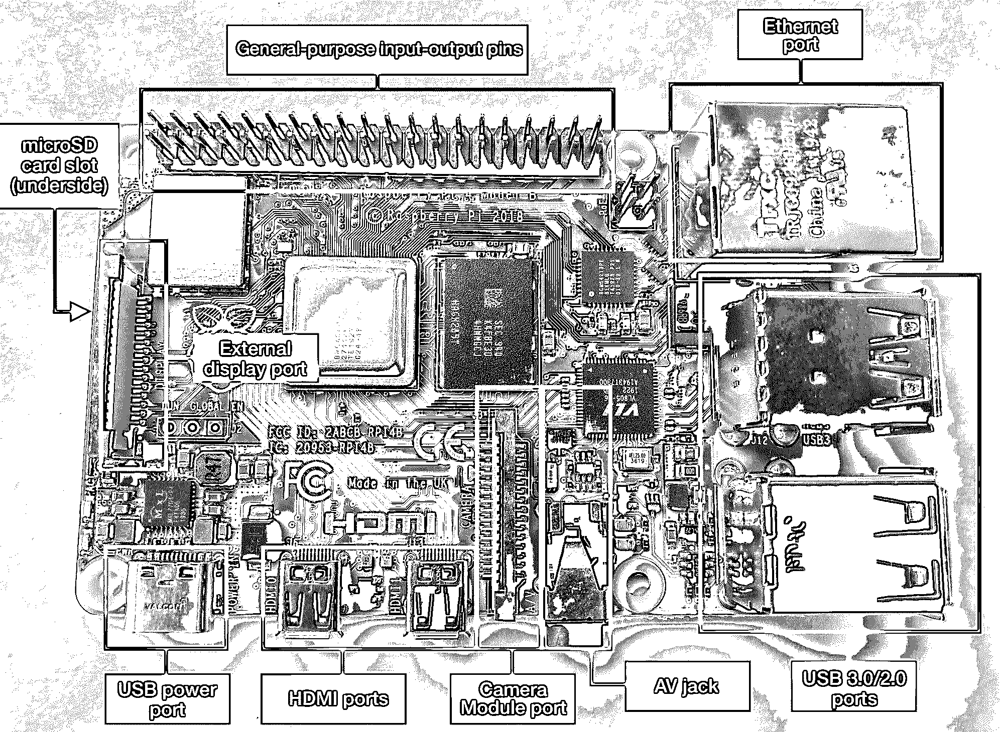](https://files.realpython.com/media/python-raspberry-pi-board-components.130884cd8ee7.jpg)

Raspberry Pi 4 板包含以下组件:

*   **通用输入-输出引脚:**这些引脚用于将 Raspberry Pi 连接到电子元件。

*   **以太网端口:**该端口将 Raspberry Pi 连接到有线网络。Raspberry Pi 还内置了 Wi-Fi 和蓝牙，用于无线连接。

*   **两个 USB 3.0 和两个 USB 2.0 端口:**这些 USB 端口用于连接键盘或鼠标等外设。两个黑色端口是 USB 2.0，两个蓝色端口是 USB 3.0。

*   **AV 插孔:**这个 AV 插孔可以让你把扬声器或者耳机连接到树莓 Pi 上。

*   **相机模块端口:**该端口用于连接[官方树莓 Pi 相机模块](https://www.raspberrypi.org/products/camera-module-v2/)，使树莓 Pi 能够捕捉图像。

*   **HDMI 端口:**这些 HDMI 端口将 Raspberry Pi 连接到外部显示器。Raspberry Pi 4 具有两个微型 HDMI 端口，允许它同时驱动两个独立的显示器。

*   **USB 电源端口:**这个 USB 端口给树莓 Pi 供电。树莓 Pi 4 有一个 **USB Type-C** 端口，而旧版本的 Pi 有一个**微型 USB** 端口。

*   **外接显示端口:**该端口用于连接官方七寸树莓派[触摸显示屏](https://www.raspberrypi.org/products/raspberry-pi-touch-display/)，在树莓派上进行触控输入。

*   **microSD 卡插槽(主板下方):**此卡插槽用于包含 Raspberry Pi 操作系统和文件的 microSD 卡。

在本教程的稍后部分，您将使用上面的组件来设置您的 Raspberry Pi。

### 树莓派 vs Arduino

人们经常想知道树莓派和 Arduino 之间的区别。Arduino 是另一种广泛用于物理计算的设备。虽然 Arduino 和 Raspberry Pi 的功能有一些重叠，但也有一些明显的不同。

Arduino 平台为编程[微控制器](https://en.wikipedia.org/wiki/Microcontroller)提供硬件和软件接口。微控制器是一个[集成电路](https://en.wikipedia.org/wiki/Integrated_circuit)，它允许你从电子元件中读取输入并向其发送输出。Arduino 板通常内存有限，因此它们通常用于重复运行与电子设备交互的单个程序。

Raspberry Pi 是一种基于 Linux 的通用计算机。它有一个完整的操作系统和一个 GUI 界面，能够同时运行许多不同的程序。

Raspberry Pi 预装了各种软件，包括网络浏览器、办公套件、终端，甚至《我的世界》。Raspberry Pi 还内置了 Wi-Fi 和蓝牙，可以连接互联网和外部设备。

对于运行 Python 来说，Raspberry Pi 通常是更好的选择，因为您无需任何配置就可以获得完整的 Python 安装。

## 设置树莓派

不像 Arduino 只需要一根 USB 线和一台电脑来设置，Raspberry Pi 对启动和运行有更多的硬件要求。不过，在初始设置之后，其中一些外设将不再需要。

### 所需硬件

Raspberry Pi 的初始设置需要以下硬件。如果你最终通过 SSH 连接到你的 Raspberry Pi，你将在本教程的后面看到[，那么下面的一些硬件在初始设置后将不再需要。](#editing-remotely-over-ssh)

#### 监视器

在操作系统的初始设置和配置过程中，您需要一台显示器。如果您将使用 SSH 连接到您的 Raspberry Pi，那么在设置后您将不再需要监视器。确保您的显示器有 HDMI 输入。

#### micross 卡

Raspberry Pi 使用 microSD 卡来存储操作系统和文件。如果你买了一个 [Raspberry Pi kit](https://www.raspberrypi.org/products/raspberry-pi-4-desktop-kit/) ，那么它会包含一个预格式化的 microSD 卡供你使用。如果你单独购买 microSD 卡，那么你需要[自己格式化它](#software)。找一个至少有 16GB 容量的 microSD 卡。

#### 键盘和鼠标

在 Raspberry Pi 的初始设置期间，需要 USB 键盘和鼠标。设置完成后，如果您愿意，可以切换到使用这些外设的蓝牙版本。在本教程的后面，您将看到如何通过 SSH 连接到 Raspberry Pi。如果您选择以这种方式连接，那么在初始设置后就不需要物理键盘和鼠标了。

#### HDMI 线缆

你需要一根 HDMI 线将 Raspberry Pi 连接到显示器上。不同的 Raspberry Pi 型号有不同的 HDMI 电缆要求:

| 树莓 Pi 4 | 树莓派 3/2/1 | 树莓派零度 |
| --- | --- | --- |
| 微型 HDMI | 高清晰度多媒体接口 | 迷你 HDMI |
| 微型 HDMI 转 HDMI | HDMI 至 HDMI | 迷你 HDMI 至 HDMI |

根据您的型号，您可能需要购买特殊的 HDMI 电缆或适配器。

#### 电源

Raspberry Pi 使用 USB 连接为电路板供电。同样，不同的 Raspberry Pi 型号有不同的 USB 连接和电源要求。

以下是不同型号的连接和电源要求:

| 树莓 Pi 4 | 树莓派 3/2/1/零 |
| --- | --- |
| USB-C | 微型 USB |
| 至少 3.0 安培 | 至少 2.5 安培 |

为了避免在选择电源时出现任何混乱，建议您使用您的[树莓 Pi 4](https://www.raspberrypi.org/products/type-c-power-supply/) 或[其他型号](https://www.raspberrypi.org/products/raspberry-pi-universal-power-supply/)的官方电源。

[*Remove ads*](/account/join/)

### 可选硬件

您可以在 Raspberry Pi 上使用一系列附加硬件来扩展它的功能。下面列出的硬件不是使用你的树莓派所必需的，但是手头有这些硬件会很有用。

#### 案例

为你的树莓派准备一个盒子，让它的组件在正常使用过程中不受损坏，这很好。选择盒子时，请确保您购买的是适合您的覆盆子 Pi 型号的正确类型。

#### 扬声器

如果你想用你的树莓派手机播放音乐或声音，那么你需要扬声器。这些可以是任何具有 3.5 毫米插孔的标准扬声器。您可以使用主板侧面的 [AV 插孔](#raspberry-pi-board-overview)将扬声器连接到树莓接口。

#### 散热器(推荐)

树莓派可以用一块小小的板子做大量的计算。这也是它如此牛逼的原因之一！但这确实意味着有时天气会变得有点热。建议你购买一套[散热器](https://realpython.com/asins/B07VV99H3T/)，以防止树莓派[在过热时抑制 CPU](https://en.wikipedia.org/wiki/Dynamic_frequency_scaling) 。

### 软件

Raspberry Pi 的操作系统存储在 microSD 卡上。如果你的卡不是来自官方的 Raspberry Pi 套件，那么你需要在上面安装操作系统。

有多种方法可以在您的 Raspberry Pi 上设置操作系统。你可以在 [Raspberry Pi 网站](https://www.raspberrypi.org/documentation/installation/installing-images/README.md)上找到更多关于不同安装选项的信息。

在这一节中，您将看到安装官方支持的基于 Debian Linux 的 Raspberry Pi 操作系统的两种方法。

#### 选项 1: Raspberry Pi 成像仪(推荐)

Raspberry Pi 基金会建议您使用 **Raspberry Pi 成像仪**对 SD 卡进行初始设置。您可以从 [Raspberry Pi 下载页面](https://www.raspberrypi.org/downloads/)下载成像仪。进入此页面后，下载适用于您的操作系统的版本:

[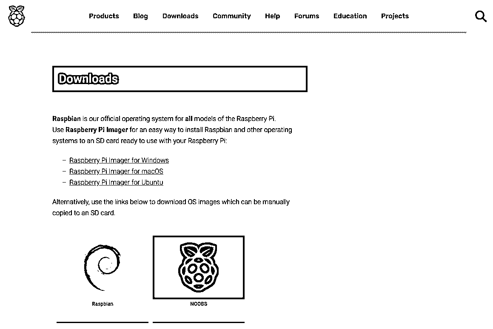](https://files.realpython.com/media/jvanschooneveld-raspberry-imager-download-page.a9aa612d04a7.png)

下载 Raspberry Pi 成像仪后，启动应用程序。您将看到一个屏幕，允许您选择要安装的操作系统以及要格式化的 SD 卡:

[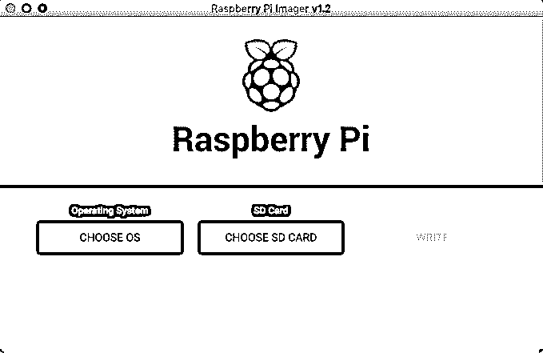](https://files.realpython.com/media/jvanschooneveld-raspberry-imager-initial.57777fd1db59.png)

第一次加载应用程序时会给你两个选项:*选择 OS* 和*选择 SD 卡*。选择*先选择 OS* 。

**注意:【Windows 可能会阻止 Raspberry Pi 成像仪启动，因为它是一个无法识别的应用程序。如果你收到一个弹出窗口说 *Windows 保护了你的电脑*，那么你仍然可以通过点击*更多信息*并选择*无论如何运行*来运行应用程序。**

应用程序运行时，点击*选择操作系统*按钮，选择第一个 *Raspbian* 选项:

[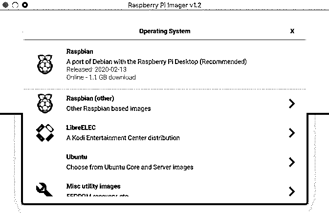](https://files.realpython.com/media/jvanschooneveld-raspberry-imager-choose-os.ebf67f9f4e86.png)

选择 Raspbian 操作系统后，您需要选择您要使用的 SD 卡。确保您的 microSD 卡已插入电脑，点击*选择 SD 卡*，然后从菜单中选择 SD 卡:

[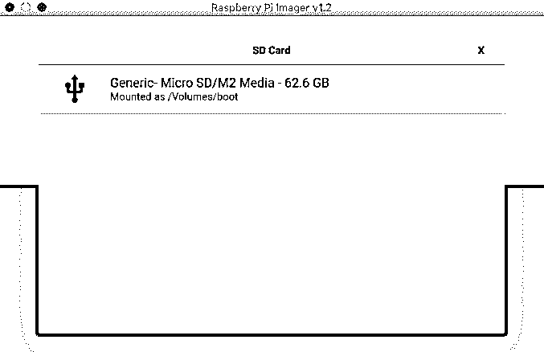](https://files.realpython.com/media/jvanschooneveld-raspberry-imager-choose-sd-card.e7e60970473d.png)

选择操作系统和 SD 卡后，您现在可以点击 *Write* 按钮开始格式化 SD 卡并将操作系统安装到卡上。此过程可能需要几分钟才能完成:

[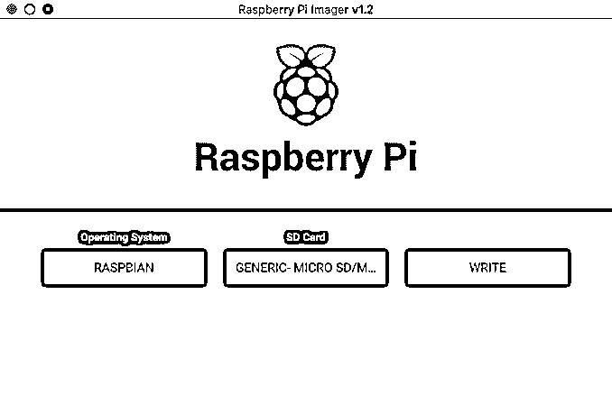](https://files.realpython.com/media/python-raspberry-pi-raspberry-imager-write.a37e0ac0d104.png)

格式化和安装完成后，您应该会看到一条消息，说明操作系统已写入 SD 卡:

[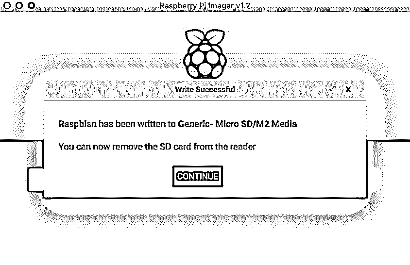](https://files.realpython.com/media/python-raspberry-pi-raspberry-imager-complete.fd426025f229.jpg)

您可以从电脑中弹出 SD 卡。Raspbian 现已安装在您的 SD 卡上，您可以开始将硬件连接到 Raspberry Pi 了！

#### 选项 2:安装 NOOBS 的 Raspbian】

如果出于某种原因你不能使用 Raspberry Pi 成像仪，那么你可以下载 **NOOBS** (新的开箱即用软件)并用它在 microSD 卡上安装 Raspbian。首先，前往 [NOOBS 下载页面](https://www.raspberrypi.org/downloads/noobs/)下载最新版本。点击第一个 *NOOBS* 选项下方的*下载 ZIP* :

[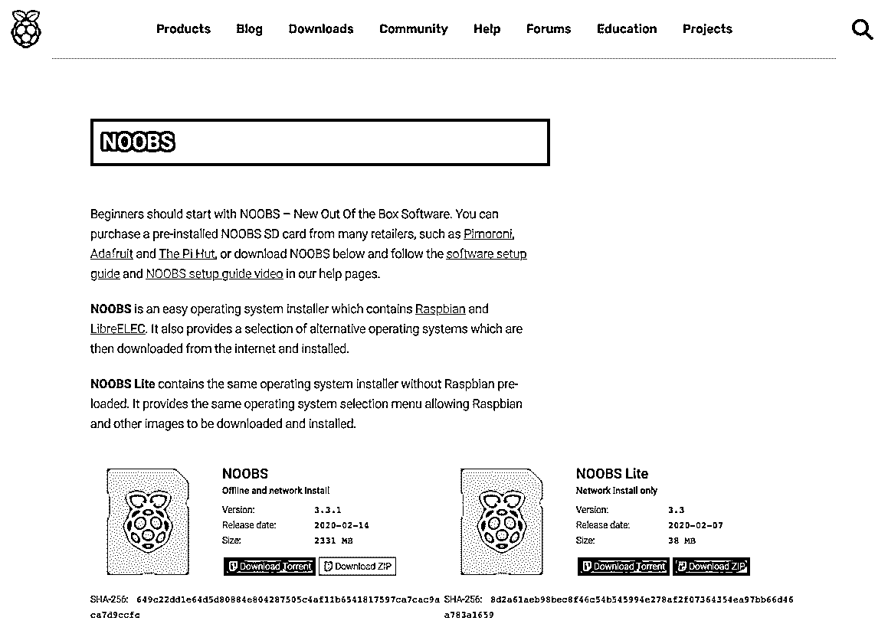](https://files.realpython.com/media/jvanschooneveld-sd-noobs-download-page.aa6c31975f3a.png)

NOOBS 将开始在你的系统上下载。

**注意:**确保下载 NOOBS 和*而不是* NOOBS 建兴。

下载完 ZIP 文件后，将内容解压缩到计算机上的某个位置。你很快就会将这些文件复制到 SD 卡上，但首先你需要正确格式化 SD 卡。

您将使用 SD 协会的官方 **SD 存储卡格式器**。前往 [SD 协会网站](https://www.sdcard.org/downloads/formatter/)下载格式化程序。滚动到底部，下载适用于 Windows 或 macOS 的 SD 格式化程序:

[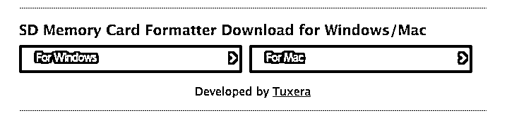](https://files.realpython.com/media/jvanschooneveld-sd-noobs-formatter-download.831996ed910e.png)

下载 SD 存储卡格式化程序后，您就可以格式化 SD 卡，以便在 Raspberry Pi 上使用。

**注意:** Linux 用户可以[使用`fdisk`](http://qdosmsq.dunbar-it.co.uk/blog/2013/06/noobs-for-raspberry-pi/) 对一个 microSD 卡进行分区并格式化成所需的 **FAT32** 磁盘格式。

下载 SD 格式化程序后，打开应用程序。要格式化 SD 卡，您需要执行以下操作:

1.  将 SD 卡插入电脑。
2.  从*选择卡*下拉菜单中选择 SD 卡。
3.  点击*格式化选项*下的*快速格式化*选项。
4.  在*卷标*文本框中输入 *NOOBS* 。

以上项目完成后，点击*格式化*:

[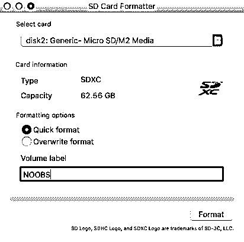](https://files.realpython.com/media/jvanschooneveld-sd-formatter-quick.03a059752921.png)

格式化卡之前，会要求您确认操作，因为这将抹掉卡上的所有数据。点击*继续*开始格式化 SD 卡。完成格式化可能需要几分钟时间:

[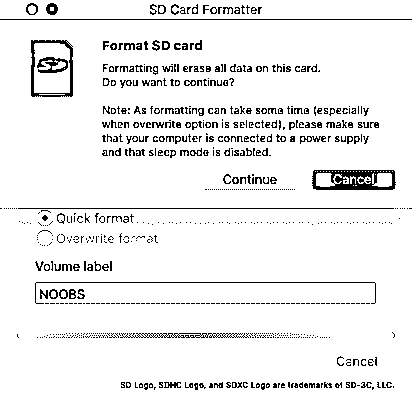](https://files.realpython.com/media/jvanschooneveld-sd-formatter-confirm.8042a8459a59.png)

一旦格式化完成，你需要将之前解压的 NOOBS 文件复制到 SD 卡上。选择您之前提取的所有文件:

[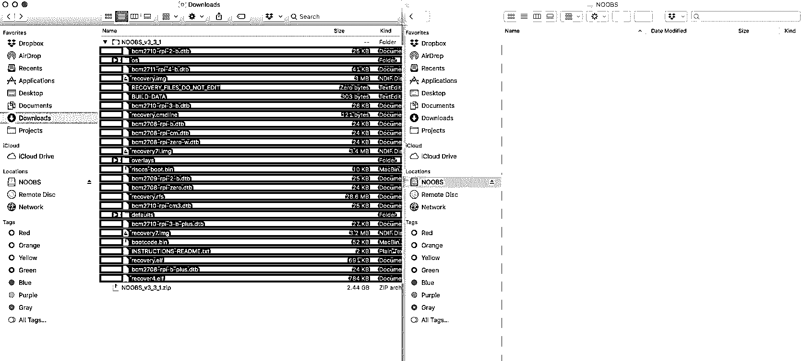](https://files.realpython.com/media/jvanschooneveld-sd-copy-noobs-select.af3f4e68922f.png)

将它们拖到 SD 卡上:

[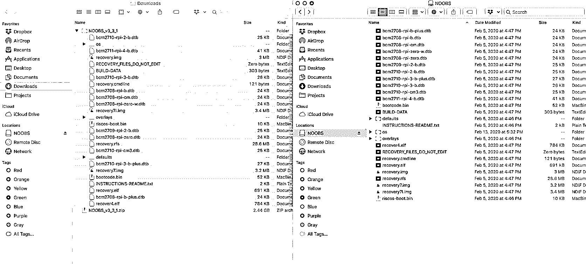](https://files.realpython.com/media/jvanschooneveld-sd-copy-noobs-drag.2ee24839e0a3.png)

现在您已经在 SD 卡上安装了 NOOBS，请从电脑中弹出该卡。你就快到了！在下一节中，您将为您的 Raspberry Pi 做最后的设置。

[*Remove ads*](/account/join/)

### 最终设置

现在您已经准备好了 microSD 卡和所需的硬件，最后一步是将所有东西连接在一起并配置操作系统。让我们从连接所有外设开始:

1.  将 microSD 卡插入 Raspberry Pi 底部的卡槽。
2.  将键盘和鼠标连接到四个 USB 端口中的任何一个。
3.  使用特定于您的 Raspberry Pi 型号的 HDMI 电缆将显示器连接到其中一个 HDMI 端口。
4.  将电源连接到 USB 电源端口。

连接好外设后，打开 Raspberry Pi 的电源来配置操作系统。如果你用 Raspbian 安装了 Raspberry Pi 成像仪，那么你就没什么可做的了。您可以跳到下一节的[来完成设置。](#setup-wizard)

如果您在 SD 卡上安装了 NOOBS，那么您需要完成几个步骤来在 SD 卡上安装 Raspbian:

1.  首先，打开 Raspberry Pi 来加载 *NOOBS* 接口。
2.  然后，在要安装的软件列表中勾选 *Raspbian* 选项旁边的复选框。
3.  最后点击界面左上角的*安装*按钮，开始在 SD 卡上安装 Raspbian。

一旦安装完成，Raspberry Pi 将重新启动，您将被引导到 Raspbian 以完成安装向导。

#### 设置向导

在第一次启动时，Raspbian 会提供一个设置向导来帮助您配置密码、设置语言环境、选择 Wi-Fi 网络以及更新操作系统。继续并按照说明完成这些步骤。

一旦你完成了这些步骤，重启操作系统，你就可以开始在 Raspberry Pi 上编程 Python 了！

## 在 Raspberry Pi 上运行 Python

在 Raspberry Pi 上使用 Python 的最大好处之一就是 Python 是这个平台上的一等公民。Raspberry Pi 基金会特别选择 Python 作为主要语言，因为它功能强大、功能多样且易于使用。Python 预装在 Raspbian 上，因此您可以从一开始就做好准备。

在 Raspberry Pi 上编写 Python 有许多不同的选择。在本教程中，您将看到两种流行的选择:

*   使用**管理部门编辑器**
*   通过 **SSH** 远程编辑

让我们从使用 Mu 编辑器在 Raspberry Pi 上编写 Python 开始。

### 使用管理部门编辑器

Raspbian 操作系统附带了几个预安装的 Python IDEs，您可以使用它们来编写您的程序。其中一个 ide 就是 [Mu](https://codewith.mu/) 。它可以在主菜单中找到:

*树莓派图标→编程→ Mu*

当你第一次打开 Mu 时，你可以选择编辑器的 Python 模式。对于本教程中的代码，可以选择 *Python 3* :

[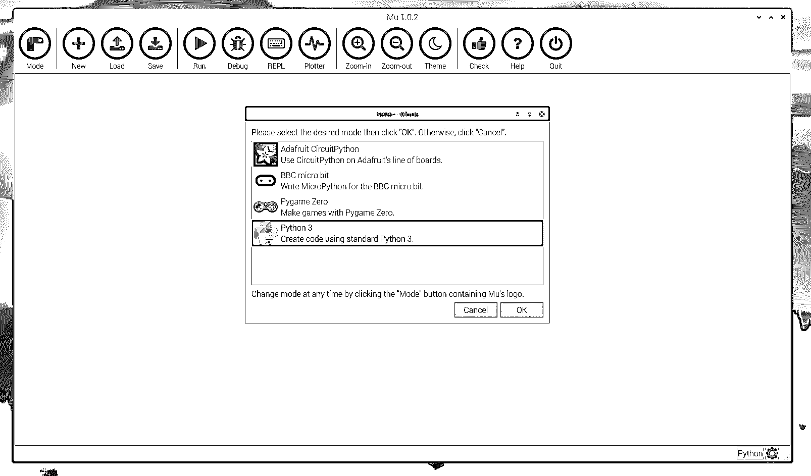](https://files.realpython.com/media/jvanschooneveld-mu-screen.e6f0139e9fcc.png)

您的 Raspbian 版本可能没有预装 Mu。如果没有安装 Mu，那么您总是可以通过转到以下文件位置来安装它:

*树莓派图标→偏好设置→推荐软件*

这将打开一个对话框，其中包含为您的树莓 Pi 推荐的软件。勾选 Mu 旁边的复选框，点击 *OK* 进行安装:

[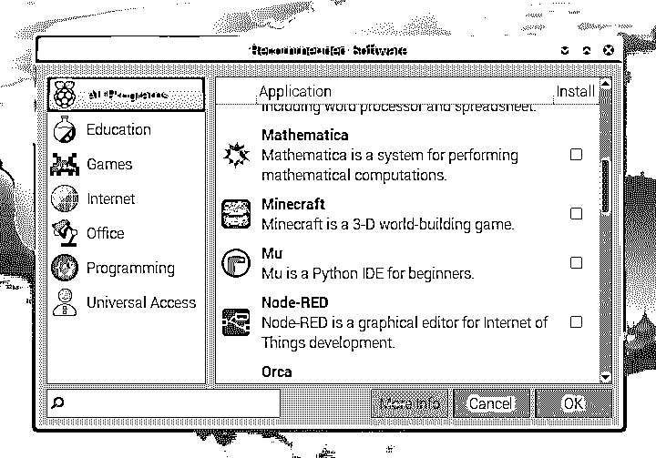](https://files.realpython.com/media/jvanschooneveld-mu-install.6088c4c2695e.png)

虽然 Mu 提供了一个很好的编辑器来帮助你在 Raspberry Pi 上开始使用 Python，但是你可能想要一些更健壮的东西。在下一节中，您将通过 SSH 连接到您的 Raspberry Pi。

[*Remove ads*](/account/join/)

### 通过 SSH 远程编辑

通常你不会想花时间连接显示器、键盘和鼠标在 Raspberry Pi 上编写 Python。幸运的是，Raspbian 允许你通过 SSH 远程连接到 Raspberry Pi。在本节中，您将学习如何在 Raspberry Pi 上启用和使用 SSH 来编程 Python。

#### 启用 SSH

在通过 SSH 连接到 Raspberry Pi 之前，您需要在 Raspberry Pi *偏好设置*区域内启用 SSH 访问。通过转到以下文件路径启用 SSH:

*树莓 Pi 图标→偏好设置→树莓 Pi 配置*

出现配置后，选择接口选项卡，然后启用 SSH 选项:

[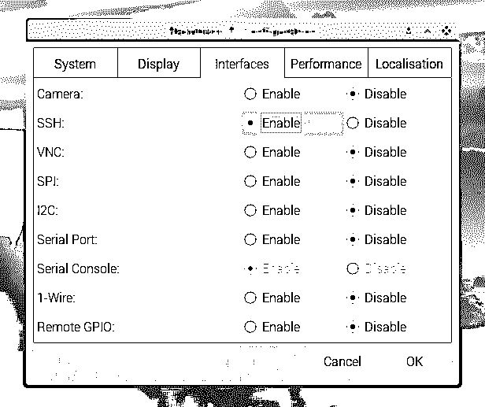](https://files.realpython.com/media/jvanschooneveld-remote-enable-ssh.e8c9053caab6.png)

您已经在 Raspberry Pi 上启用了 SSH。现在你需要获得树莓 Pi 的 IP 地址，这样你就可以从另一台电脑连接到它。

#### 确定 Raspberry Pi 的 IP 地址

要远程访问 Raspberry Pi，您需要确定本地网络上 Raspberry Pi 的 IP 地址。要确定 IP 地址，需要访问**终端**应用。您可以在此处访问终端:

*树莓派图标→配件→端子*

终端打开后，在命令提示符下输入以下内容:

```py
pi@raspberrypi:~ $ hostname -I
```

这将显示您的 Raspberry Pi 的当前 IP 地址。有了这个 IP 地址，您现在可以远程连接到您的 Raspberry Pi。

#### 连接到树莓派

使用 Raspberry Pi 的 IP 地址，您现在可以从另一台计算机 SSH 到它:

```py
$ ssh pi@[IP ADDRESS]
```

在 Raspbian 安装过程中，当运行[设置向导](#setup-wizard)时，系统会提示您输入您创建的密码。如果你没有设置密码，那么默认密码是`raspberry`。输入密码，连接后您会看到 Raspberry Pi 命令提示符:

```py
pi@raspberrypi:~ $
```

既然您已经知道了如何连接，您就可以开始在 Raspberry Pi 上编程 Python 了。您可以立即开始使用 Python REPL:

```py
pi@raspberrypi:~ $ python3
```

键入一些 Python 来在 Raspberry Pi 上运行它:

>>>

```py
>>> print("Hello from your Raspberry Pi!")
Hello from your Raspberry Pi!
```

太棒了，你在树莓派上运行 Python！

[*Remove ads*](/account/join/)

### 创建一个`python-projects`目录

在您开始在 Raspberry Pi 上用 Python 构建项目之前，为您的代码建立一个专用目录是一个好主意。Raspberry Pi 有一个包含许多不同目录的完整文件系统。为您的 Python 代码保留一个位置将有助于保持一切井然有序并易于查找。

让我们创建一个名为`python-projects`的目录，您可以在其中存储项目的 Python 代码。

#### 使用管理部门

如果您计划使用 Mu 来完成本教程中的项目，那么您现在可以使用它来创建`python-projects`目录。要创建这个目录，您需要执行以下操作:

1.  进入*树莓 Pi 图标→编程→ Mu* 打开 Mu。
2.  点击菜单栏中的*新建*创建一个空文件。
3.  点击菜单栏中的*保存*。
4.  在目录下拉列表中导航到`/home/pi`目录。
5.  点击右上角的*新建文件夹*图标。
6.  将这个新目录命名为`python-projects`并点击 `Enter` 。
7.  点击*取消*关闭。

您已经为 Python 代码创建了一个专用目录。进入下一节，学习[与 Python 中的物理组件](#interacting-with-physical-components)交互。

#### 通过 SSH

如果您更愿意使用 SSH 来访问您的 Raspberry Pi，那么您将使用命令行来创建`python-projects`目录。

**注意:**因为您将访问 Raspberry Pi 命令行，所以您需要使用命令行文本编辑器来编辑您的项目文件。

`nano`和`vim`都预装在 Raspbian 上，可以用来编辑项目文件。你也可以[使用 VS 代码](https://medium.com/@pythonpow/remote-development-on-a-raspberry-pi-with-ssh-and-vscode-a23388e24bc7)远程编辑 Raspberry Pi 上的文件，但是需要一些设置。

让我们创建`python-projects`目录。如果您当前没有登录到 Raspberry Pi，则使用 Raspberry Pi 的 IP 地址从您的计算机 SSH 到它:

```py
$ ssh pi@[IP ADDRESS]
```

登录后，您将看到 Raspberry Pi 命令提示符:

```py
pi@raspberry:~ $
```

默认情况下，当您 SSH 进入 Raspberry Pi 时，您将从`/home/pi`目录开始。现在通过运行`pwd`来确认这一点:

```py
pi@raspberry:~ $ pwd
/home/pi
```

如果由于某种原因，您不在`/home/pi`目录中，那么使用`cd /home/pi`切换到该目录:

```py
pi@raspberry:~/Desktop $ cd /home/pi
pi@raspberry:~ $ pwd
/home/pi
```

现在在`/home/pi`目录中，创建一个新的`python-projects`目录:

```py
pi@raspberry:~ $ mkdir python-projects
```

创建了`python-projects`目录后，使用`cd python-projects`进入该目录:

```py
pi@raspberry:~ $ cd python-projects
pi@raspberry:~/python-projects $
```

太好了！您已经准备好在 Raspberry Pi 上使用 Python 编写您的第一个电路了。

[*Remove ads*](/account/join/)

## 与物理组件交互

在本节中，您将学习如何在 Raspberry Pi 上使用 Python 与不同的物理组件进行交互。

您将使用 Raspbian 上预装的 [gpiozero](https://gpiozero.readthedocs.io/en/stable/) 库。它提供了一个易于使用的接口来与连接到 Raspberry Pi 的各种 GPIO 设备进行交互。

### 电子元件

在 Raspberry Pi 上编程之前，您需要一些电子组件来构建接下来几节中的项目。你应该可以在亚马逊或者当地的电子商店找到下面的每一件商品。

#### 试验板

构建电路时，试验板是必不可少的工具。它允许您快速制作电路原型，而无需将元件焊接在一起。

试验板遵循一般布局。在右侧和左侧，两条导轨贯穿试验板的长度。这些铁轨上的每个洞都是相连的。通常，这些被指定为正(**电压**，或 **VCC** )和负(**地**，或 **GND** )。

在大多数试验板上，**正轨**标有正号(`+`)，旁边会有一条红线。**负轨**标有负号(`-`)，旁边有一条蓝线。

在电路板内部，**元件轨道**垂直于试验板侧面的正负轨道。这些轨道中的每一个都包含用于放置组件的孔。

单条轨道上的所有孔都是相连的。中间是一个槽，将试验板的两侧分开。檐槽相对两侧的栏杆没有连接。

下图对此进行了说明:

[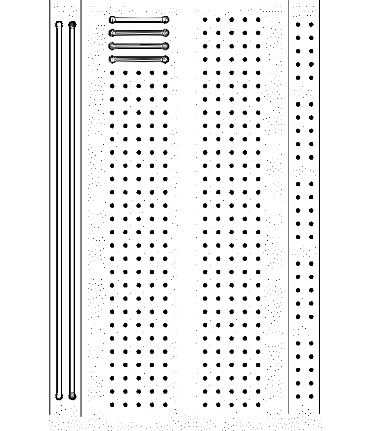](https://files.realpython.com/media/python-raspberry-pi-breadboard-layout.7b9af21ae89a.png)

在上图中，三种颜色用于标记不同类型的试验板导轨:

*   **红色:**正轨
*   **黑色:**负轨
*   **蓝色:**部件导轨

在本教程的后面，您将使用这些不同的轨来构建连接到 Raspberry Pi 的完整电路。

#### 跳线

跳线允许您制作电路连接的原型，而不必在 GPIO 引脚和元件之间焊接路径。它们有三种不同的类型:

1.  [男对男](https://realpython.com/asins/B07GJ9FLXY/)
2.  [女性对男性](https://realpython.com/asins/B00PBZMN7C/)
3.  [女对女](https://realpython.com/asins/B01L5ULRUA/)

在用 Python 构建 Raspberry Pi 项目时，每种类型至少有 10 到 20 个就很好了。

#### 其他组件

除了试验板和跳线，本教程中的项目还将使用以下元件:

*   [发光二极管](https://realpython.com/asins/B07MNZ872G/)
*   [触觉按钮](https://realpython.com/asins/B07WF76VHT/)
*   [330ω电阻](https://realpython.com/asins/B07NKG5T2Q/)
*   [主动压电蜂鸣器](https://realpython.com/asins/B0716FD838/)
*   [被动式红外运动传感器](https://realpython.com/asins/B07KBWVJMP/)

有了所需的组件，让我们看看如何使用 GPIO 引脚将它们连接到 Raspberry Pi。

[*Remove ads*](/account/join/)

### GPIO 引脚

Raspberry Pi 沿电路板顶部边缘有 40 个 GPIO 引脚。您可以使用这些 GPIO 引脚将 Raspberry Pi 连接到外部元件。

下面的引脚布局显示了不同类型的引脚及其位置。此布局基于引脚俯视图，Raspberry Pi 的 USB 端口面向您:

[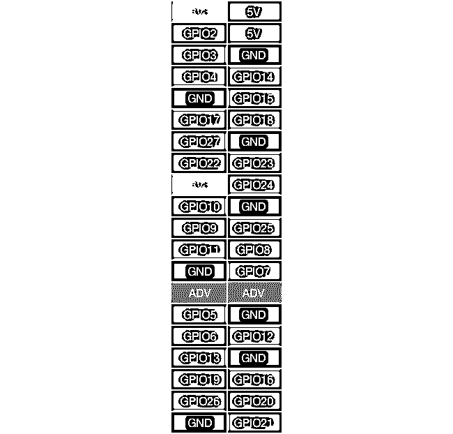](https://files.realpython.com/media/python-raspberry-pi-gpio-pin-layout.54a028861940.png)

Raspberry Pi 有五种不同类型的引脚:

1.  **GPIO:** 这些是通用引脚，可用于输入或输出。
2.  **3V3:** 这些引脚为组件提供 3.3 V 电源。3.3 V 也是所有 GPIO 引脚提供的内部电压。
3.  **5V:** 这些引脚提供 5V 电源，与为 Raspberry Pi 供电的 USB 电源输入相同。无源红外运动传感器等一些器件需要 5 V 电压。
4.  GND: 这些引脚为电路提供接地连接。
5.  ADV: 这些特殊用途的引脚是高级的，不在本教程中讨论。

在下一节中，您将使用这些不同的引脚类型来设置您的第一个组件，一个触觉按钮。

### 触觉按钮

在第一个电路中，你要将一个触觉按钮连接到树莓派上。触觉按钮是一个电子开关，当按下时，关闭电路。当电路闭合时，Raspberry Pi 将在信号上记录一个**。你可以用这个 ON 信号来触发不同的动作。**

在这个项目中，您将使用一个触觉按钮来根据按钮的状态运行不同的 Python 功能。让我们从将按钮连接到树莓派开始:

1.  将树莓派的 **GND** 引脚的**母到公**跳线连接到试验板的**负极轨**。
2.  在试验板中间的凹槽上放置一个触摸按钮。
3.  将**公对公**跳线从试验板的**负轨**连接到按钮的**左下腿**所在的行。
4.  将树莓 Pi 的 **GPIO4** 引脚的**母到公**跳线连接到按钮的**右下腿**所在的试验板行。

您可以通过下图确认您的接线:

[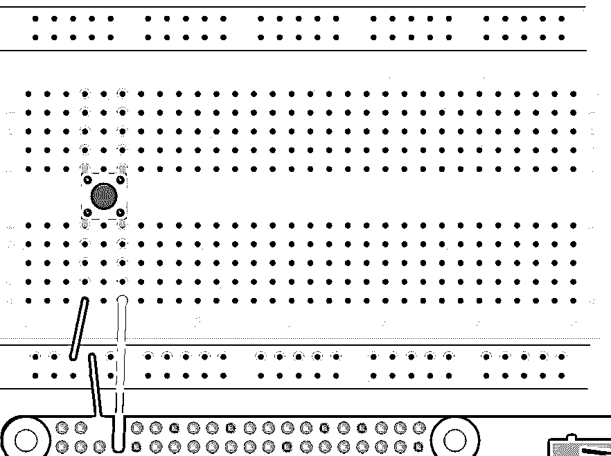](https://files.realpython.com/media/python-raspberry-pi-tactile-button-diagram.73426bc4ec5e.jpg)

现在您已经连接好了电路，让我们编写 Python 代码来读取按钮的输入。

**注意:**如果您在寻找特定引脚时遇到困难，那么在构建电路时，请确保参考 [GPIO 引脚布局图](#gpio-pins)。你也可以[购买一个分线板](https://www.adafruit.com/product/2029)来轻松进行实验。

在您之前创建的`python-projects`目录中，保存一个名为`button.py`的新文件。如果您使用 SSH 来访问您的 Raspberry Pi，那么创建如下文件:

```py
pi@raspberrypi:~/ cd python-projects
pi@raspberrypi:~/python-projects $ touch button.py
```

如果您使用的是 Mu，那么按照以下步骤创建文件:

1.  点击*新建*菜单项。
2.  点击*保存*。
3.  导航到`/home/pi/python-projects`目录。
4.  将文件另存为`button.py`。

创建好文件后，您就可以开始编码了。从从`gpiozero`模块导入`Button`类开始。你还需要从`signal`模块导入`pause`。稍后你会看到为什么你需要`pause`:

```py
from gpiozero import Button
from signal import pause
```

创建一个`Button`类的实例，并将 pin 号作为参数传递。在这种情况下，您使用的是 **GPIO4** 引脚，因此您将传入`4`作为参数:

```py
button = Button(4)
```

接下来，定义在`Button`实例上可用的不同按钮事件将调用的函数:

```py
def button_pressed():
    print("Button was pressed")

def button_held():
    print("Button was held")

def button_released():
    print("Button was released")
```

`Button`类有三个事件属性:`.when_pressed`、`.when_held`和`.when_released`。这些属性可以用来连接不同的事件函数。

虽然`.when_pressed`和`.when_released`属性是不言自明的，但是`.when_held`需要一个简短的解释。如果一个函数被设置为`.when_held`属性，那么只有当按钮被按下并保持一定时间时，它才会被调用。

`.when_held`的保持时间由`Button`实例的`.hold_time`属性决定。`.hold_time`的默认值是一秒。您可以通过在创建一个`Button`实例时传递一个`float`值来覆盖它:

```py
button = Button(4, hold_time=2.5)
button.when_held = button_held
```

这将创建一个`Button`实例，该实例将在按钮被按下并保持两秒半后调用`button_held()`函数。

现在您已经了解了`Button`上的不同事件属性，将它们分别设置为您之前定义的功能:

```py
button.when_pressed = button_pressed
button.when_held = button_held
button.when_released = button_released
```

太好了！您已经设置了按钮事件。你需要做的最后一件事是调用文件末尾的`pause()`。需要调用`pause()`来保持程序监听不同的事件。如果不存在，那么程序将运行一次并退出。

您的最终程序应该是这样的:

```py
from gpiozero import Button
from signal import pause

button = Button(4)

def button_pressed():
    print("Button was pressed")

def button_held():
    print("Button was held")

def button_released():
    print("Button was released")

button.when_pressed = button_pressed
button.when_held = button_held
button.when_released = button_released

pause()
```

完成布线和设置代码后，您就可以测试您的第一个电路了。在`python-projects`目录中，运行程序:

```py
pi@raspberrypi:~/python-projects $ python3 button.py
```

如果你使用的是 Mu，首先确保文件已经保存，然后点击*运行*启动程序。

程序现在正在运行并监听事件。按下按钮，您应该会在控制台中看到以下内容:

```py
Button was pressed
```

按住按钮至少一秒钟，您应该会看到以下输出:

```py
Button was held
```

最后，当您释放按钮时，您应该会看到以下内容:

```py
Button was released
```

厉害！您刚刚在 Raspberry Pi 上使用 Python 连接并编码了您的第一个电路。

因为您在代码中使用了`pause()`,所以您需要手动停止程序。如果您正在 Mu 中运行程序，那么您可以点击*停止*来退出程序。如果你从命令行运行这个程序，那么你可以用 `Ctrl` + `C` 来停止程序。

有了第一个电路，你就可以开始控制其他一些组件了。

[*Remove ads*](/account/join/)

### 发光二极管

对于您的下一个电路，您将使用 Python 使 LED 每秒闪烁一次。 **LED** 代表[发光二极管](https://en.wikipedia.org/wiki/Light-emitting_diode)，这些元件通上电流就会发光。你会发现它们在电子产品中无处不在。

每个 LED 都有两条腿。较长的腿是正极腿，或[阳极](https://en.wikipedia.org/wiki/Anode)。电流通过这个引脚进入 LED。较短的腿是负腿，或[阴极](https://en.wikipedia.org/wiki/Cathode)。电流通过此引脚流出 LED。

电流只能沿一个方向流过 LED，因此请确保将跳线连接到 LED 的正确引脚。

以下是为该电路布线需要采取的步骤:

1.  将树莓派的 **GND** 引脚的**母到公**跳线连接到试验板的**负极轨**。

2.  将一个 **LED** 放入试验板上相邻但不在同一行的两个孔中。

3.  将 LED 的**较长的正极引脚**放入右侧的孔中。

4.  将 LED 的**较短的负极引脚**放入左侧的孔中。

5.  将**330ω电阻器**的一端放入与 LED 的**负极引脚**相同的试验板排的孔中。

6.  将电阻器的另一端放入试验板的**负极轨**

7.  将树莓 Pi 的 **GPIO4** 引脚的**母到公**跳线连接到与 LED 的**正极引脚**相同的试验板行中的孔。

您可以通过下图确认您的接线:

[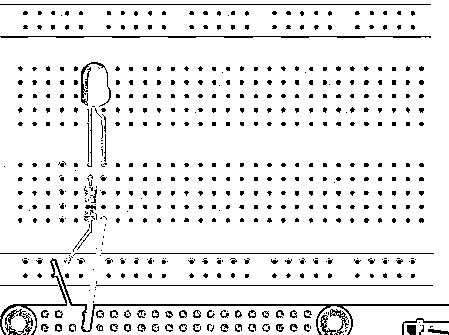](https://files.realpython.com/media/python-raspberry-pi-led-diagram.c137a23a973d.jpg)

如果接线看起来不错，那么您就可以编写一些 Python 来让 LED 闪烁。首先在`python-projects`目录中为该电路创建一个文件。调用这个文件`led.py`:

```py
pi@raspberrypi:~/python-projects $ touch led.py
```

在这段代码中，您将创建一个`LED`类的实例，并调用它的`.blink()`方法来使 LED 闪烁。`.blink()`方法的默认超时是一秒钟。LED 将继续每秒闪烁一次，直到程序退出。

从`gpiozero`模块导入`LED`，从`signal`模块导入`pause`开始:

```py
from gpiozero import LED
from signal import pause
```

接下来，创建一个名为`led`的`LED`实例。将 GPIO 引脚设置为`4`:

```py
led = LED(4)
```

在`led`上调用`.blink()`方法:

```py
led.blink()
```

最后，添加对`pause()`的调用以确保程序不会退出:

```py
pause()
```

您的完整程序应该如下所示:

```py
from gpiozero import LED
from signal import pause

led = LED(4)
led.blink()

pause()
```

保存文件并运行它，查看 LED 的闪烁:

```py
pi@raspberrypi:~/python-projects $ python3 led.py
```

LED 现在应该每秒闪烁一次。当你欣赏完运行中的 Python 代码后，在 Mu 中用 `Ctrl` + `C` 或 *Stop* 停止程序。

现在你知道如何在 Raspberry Pi 上用 Python 控制 LED 了。在下一个电路中，您将使用 Python 从 Raspberry Pi 中产生声音。

[*Remove ads*](/account/join/)

### 蜂鸣器

在这个电路中，你将把一个[有源压电蜂鸣器](https://en.wikipedia.org/wiki/Buzzer)连接到树莓派。当施加电流时，压电蜂鸣器发出声音。使用这个组件，您的树莓 Pi 将能够生成声音。

像发光二极管一样，蜂鸣器也有正极和负极。蜂鸣器的正极引线比负极引线长，或者蜂鸣器顶部有一个正极符号(`+`)，表示哪条引线是正极引线。

让我们继续安装蜂鸣器:

1.  在试验板上放置一个蜂鸣器，注意蜂鸣器的**正极引脚**的位置。

2.  将树莓派的 **GND** 引脚的**母到公**跳线连接到与蜂鸣器的**负极引脚**相同的试验电路板排的孔中。

3.  将树莓 Pi 的 **GPIO4** 引脚的**母到公**跳线连接到与蜂鸣器的**正极引脚**相同的试验板排的孔中。

对照下图确认您的接线:

[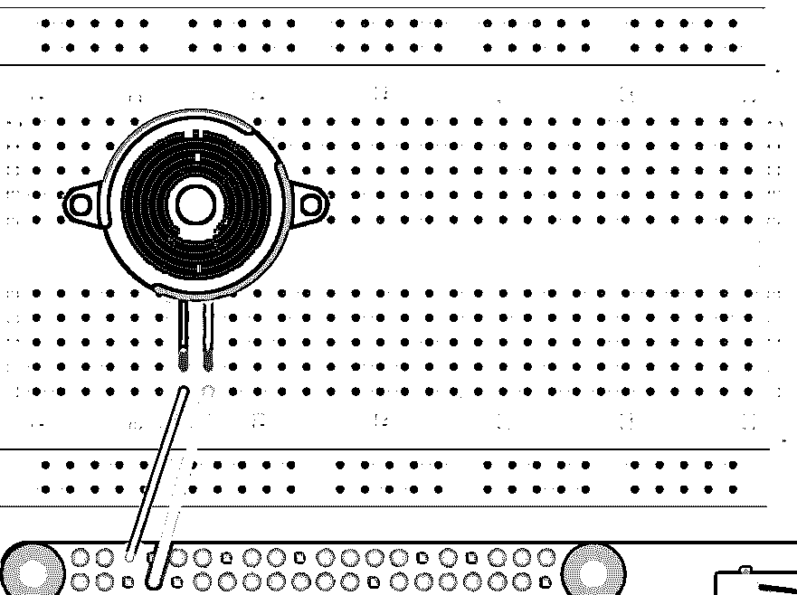](https://files.realpython.com/media/python-raspberry-pi-buzzer-diagram.63feec02381c.jpg)

设置好线路后，让我们继续看代码。在`python-projects`目录下为该电路创建一个文件。调用这个文件`buzzer.py`:

```py
pi@raspberrypi:~/python-projects $ touch buzzer.py
```

在这段代码中，您将创建一个`Buzzer`类的实例，并调用它的`.beep()`方法来使蜂鸣器发出嘟嘟声。`.beep()`方法的前两个参数是`on_time`和`off_time`。这些参数采用一个`float`值来设置蜂鸣器应该响多长时间。两者的默认值都是一秒。

从`gpiozero`模块导入`Buzzer`，从`signal`模块导入`pause`开始:

```py
from gpiozero import Buzzer
from signal import pause
```

接下来，创建一个名为`buzzer`的`Buzzer`实例。将 GPIO 引脚设置为`4`:

```py
buzzer = Buzzer(4)
```

在`buzzer`上调用`.beep()`方法。将`on_time`和`off_time`参数设置为`0.5`。这将使蜂鸣器每半秒发出一次蜂鸣声:

```py
buzzer.beep(0.5, 0.5)
```

最后，添加对`pause()`的调用以确保程序不会退出:

```py
pause()
```

您的完整程序应该如下所示:

```py
from gpiozero import Buzzer
from signal import pause

buzzer = Buzzer(4)
buzzer.beep(0.5, 0.5)

pause()
```

保存文件并运行它，每半秒钟听到一次蜂鸣声:

```py
pi@raspberrypi:~/python-projects $ python3 buzzer.py
```

在 Mu 中用 `Ctrl` + `C` 或 *Stop* 停止程序之前，应听到蜂鸣声时断时续。

**注意:**如果你正在使用 Mu，那么当你停止程序时，提示音有可能会继续。要停止声音，移除 GND 线以断开电路。

重新连接 GND 线时，如果声音仍然存在，您可能还需要重新启动 Mu。

太好了！到目前为止，您已经学习了如何在 Raspberry Pi 上用 Python 控制三种不同类型的电子组件。对于下一个电路，我们来看看一个稍微复杂一点的元件。

[*Remove ads*](/account/join/)

### 运动传感器

在这个电路中，你将把一个**被动红外(PIR)运动传感器**连接到树莓 Pi。被动红外运动传感器检测其视野内的任何运动，并将信号发送回 Raspberry Pi。

#### 调整传感器

使用运动传感器时，您可能需要调整它对运动的敏感度，以及在检测到运动后多长时间发出信号。

您可以使用传感器侧面的两个刻度盘进行调整。你会知道它们是哪个拨号盘，因为它们的中心有一个十字形的凹痕，可以用十字螺丝刀调整。

下图显示了运动传感器侧面的这些转盘:

[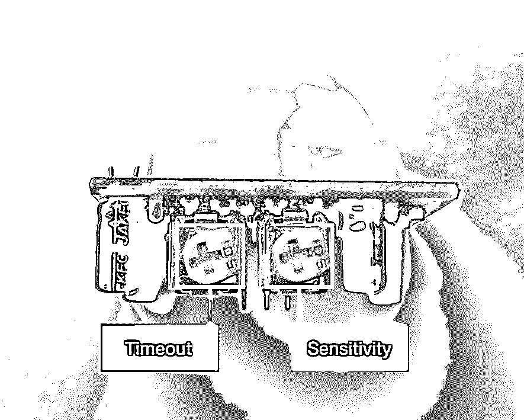](https://files.realpython.com/media/python-raspberry-pi-motion-sensor-dials.27c3c891726b.jpg)

如图所示，左边的转盘设置信号超时，右边的转盘设置传感器灵敏度。你可以顺时针或逆时针转动这些刻度盘来调整它们:

*   **顺时针**增加超时和灵敏度。
*   **逆时针**减少超时和灵敏度。

您可以根据您的项目需要调整这些，但对于本教程来说，逆时针旋转两个转盘。这将把它们设置为最低值。

**注意:**有时候，一个运动传感器和一个树莓 Pi 3 不会正确地一起工作。这导致传感器偶尔出现误报。

如果你用的是 Raspberry Pi 3，那么一定要把传感器移动到离 Raspberry Pi 尽可能远的地方。

一旦你调整好了运动传感器，你就可以设置线路了。运动传感器的设计不允许它轻易连接到试验板。你需要用跳线将 Raspberry Pi 的 GPIO 引脚*直接*连接到运动传感器上的引脚。

下图显示了销在运动传感器下侧的位置:

[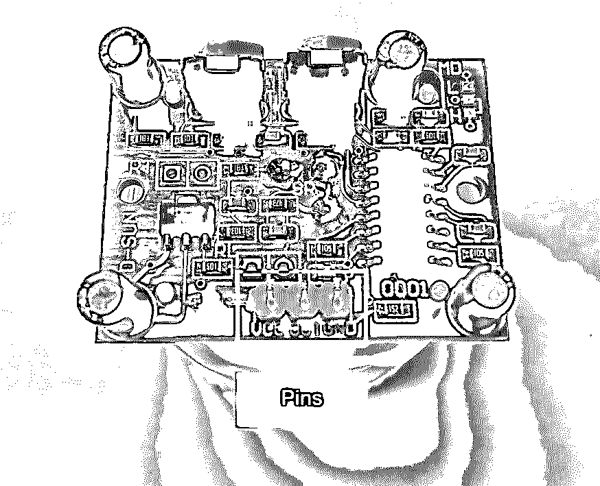](https://files.realpython.com/media/python-raspberry-pi-motion-sensor-pins.6b62eafe4656.jpg)

你可以看到有三个引脚:

1.  **VCC** 为电压
2.  **OUT** 用于与树莓 Pi 通信
3.  **GND** 为地

使用这些引脚，您需要采取以下步骤:

1.  将**母到母**跳线从树莓 Pi 的 **5V** 引脚连接到传感器的 **VCC** 引脚。
2.  将一根**母到母**跳线从树莓 Pi 的 **GPIO4** 引脚连接到传感器的 **OUT** 引脚。
3.  从树莓 Pi 的 **GND** 引脚到传感器的 **GND** 引脚连接**母到母**跳线。

现在用下图确认接线:

[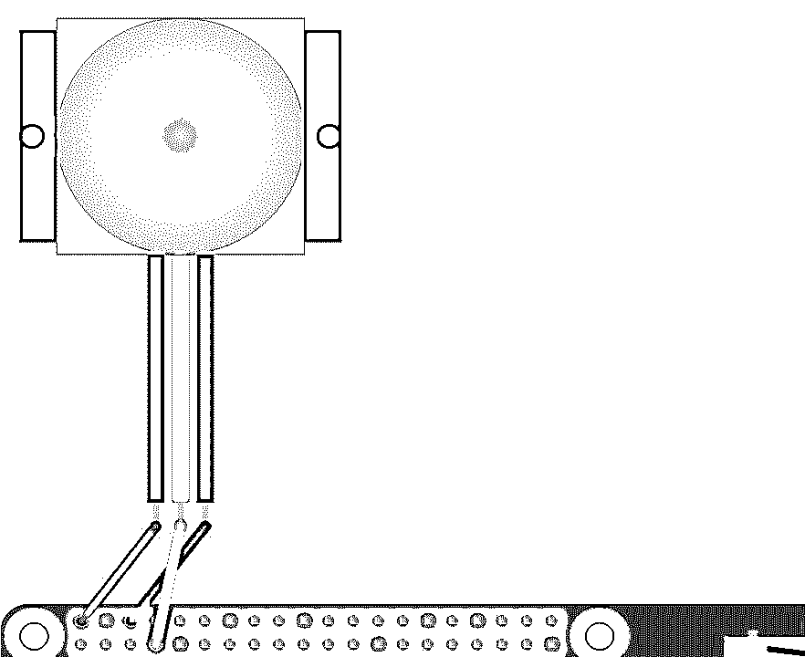](https://files.realpython.com/media/python-raspberry-pi-pir-diagram.9dc4edadeb1e.jpg)

将运动传感器调整好并连接到 Raspberry PI 后，让我们来看看用于检测运动的 Python 代码。首先在`python-projects`目录下为这个电路创建一个文件。调用这个文件`pir.py`:

```py
pi@raspberrypi:~/python-projects $ touch pir.py
```

该电路的代码将类似于您之前制作的[按钮电路](#tactile-button)。您将创建一个`MotionSensor`类的实例，并将 GPIO 管脚号`4`作为参数传入。然后定义两个函数，并将它们设置为`MotionSensor`实例上的`.when_motion`和`.when_no_motion`属性。

让我们看一下代码:

```py
from gpiozero import MotionSensor
from signal import pause

motion_sensor = MotionSensor(4)

def motion():
    print("Motion detected")

def no_motion():
    print("Motion stopped")

print("Readying sensor...")
motion_sensor.wait_for_no_motion()
print("Sensor ready")

motion_sensor.when_motion = motion
motion_sensor.when_no_motion = no_motion

pause()
```

`motion()`被设置为`.when_motion`属性，并在传感器检测到运动时调用。`no_motion()`被设置为`.when_no_motion`属性，并在运动停止一段时间后被调用。该时间由传感器侧面的[超时刻度盘](#adjusting-the-sensor)决定。

您会注意到，在设置`.when_motion`和`.when_no_motion`属性之前，在`MotionSensor`实例上有一个对`.wait_for_no_motion()`的调用。该方法将暂停代码的执行，直到运动传感器不再检测到任何运动。这是为了使传感器忽略程序启动时可能出现的任何初始运动。

**注意:**运动传感器有时可能过于敏感或不够敏感。如果您在运行上面的代码时在控制台中看到不一致的结果，那么请确保检查所有的连接都是正确的。您可能还需要调整传感器上的灵敏度旋钮。

如果您的结果在控制台中被延迟，那么尝试下调`MotionSensor`实例上的`.threshold`属性。默认值为 0.5:

```py
pir = MotionSensor(4, threshold=0.2)
```

这将减少激活传感器所需的运动量。关于`MotionSensor`类的更多信息，参见 [gpiozero 文档](https://gpiozero.readthedocs.io/en/stable/api_input.html#motionsensor-d-sun-pir)。

保存代码并运行它来测试您的运动检测电路:

```py
pi@raspberrypi:~/python-projects $ python3 pir.py
Readying sensor...
Sensor ready
```

在传感器前挥动你的手。当第一次检测到运动时，调用`motion()`,控制台显示以下内容:

```py
Motion detected
```

现在不要在传感器前挥动你的手。几秒钟后，将显示以下内容:

```py
Motion stopped
```

太好了！你现在可以用你的树莓皮来探测运动了。一旦你完成了对你的树莓的挥手，继续在命令行中点击 `Ctrl` + `C` 或者在 Mu 中按 *Stop* 来终止程序。

通过这个最后的电路，您已经学会了如何在 Raspberry Pi 上使用 Python 来控制四个不同的组件。在下一节中，您将在一个完整的项目中将所有这些联系在一起。

## 建立一个运动激活报警系统

现在，您已经有机会将 Raspberry Pi 连接到各种输入和输出，您将创建一个使用您目前所学内容的项目。

在这个项目中，您将构建一个运动激活报警系统，当它检测到房间中的运动时，会闪烁 LED 并发出警报。在此基础上，您将使用 [Python 将时间戳保存到 CSV 文件](https://realpython.com/python-csv/)中，详细记录每次运动发生的时间。

### 布线

以下是完成接线的步骤:

1.  将树莓派的 **5V** 和 **GND** 引脚的**母到公**跳线连接到试验板侧面的**正极**和**负极**轨道。

2.  将 **LED** 放在试验板上，用**母到公**跳线将树莓 Pi 的 **GPIO14** 引脚连接到 LED。

3.  通过一个**330ω电阻**将 **LED 的负极引脚**连接到试验板的**负极轨**。

4.  将**蜂鸣器**放在试验板上，用**母到公**跳线将树莓 Pi 的 **GPIO15** 引脚连接到蜂鸣器。

5.  用一根**凸对凸**跳线将**蜂鸣器的负极脚**连接到试验板的**负极轨**。

6.  从试验板的**正极轨**到传感器的 **VCC** 引脚连接一根**母到公**跳线。

7.  将一根**母到母**跳线从树莓 Pi 的 **GPIO4** 引脚连接到传感器的 **OUT** 引脚。

8.  将**母到公**跳线从试验板的**负轨**连接到传感器的 **GND** 引脚。

根据下图确认接线:

[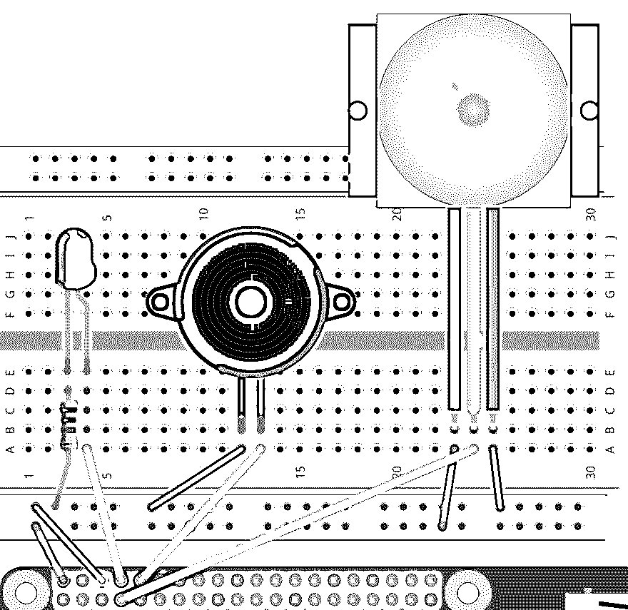](https://files.realpython.com/media/python-raspberry-pi-full-project-diagram.17f40243a32d.jpg)

好了，现在你已经连接好了电路，让我们深入研究 Python 代码来设置你的运动激活报警系统。

### 代码

像往常一样，首先在`python-projects`目录中为这个项目创建一个文件。对于这个项目，调用这个文件`motion_detector.py`:

```py
pi@raspberrypi:~/python-projects $ touch motion_detector.py
```

您要做的第一件事是导入`csv`模块，以便在检测到运动时保存时间戳。另外，从 [`pathlib`](https://realpython.com/python-pathlib/) 模块导入`Path`，这样你就可以引用你的 CSV 文件了:

```py
import csv
from pathlib import Path
```

接下来，从[的`datetime`模块](https://realpython.com/python-datetime/)中导入`datetime`，这样您就可以创建运动事件的时间戳:

```py
from datetime import datetime
```

最后，从`gpiozero`导入所需的组件类，并从`signal`模块导入`pause`:

```py
from gpiozero import LED, Buzzer, MotionSensor
from signal import pause
```

导入准备就绪后，您可以设置将要使用的三个电子组件。创建`LED`、`Buzzer`和`MotionSensor`类的实例。对于其中的每一个，将它们的 pin 号作为参数传入:

```py
led = LED(14)
buzzer = Buzzer(15)
motion_sensor = MotionSensor(4)
```

接下来，定义 CSV 文件的位置，该文件将在每次检测到运动时存储时间戳。你就叫它`detected_motion.csv`。创建一个字典来保存将写入 CSV 的时间戳值:

```py
output_csv_path = Path("detected_motion.csv")
motion = {
    "start_time": None,
    "end_time": None,
}
```

创建一个将时间戳数据保存到 CSV 文件的方法。首次创建文件时，会添加一个标题行:

```py
def write_to_csv():
    first_write = not output_csv_path.is_file()

    with open(output_csv_path, "a") as file:
        field_names = motion.keys()
        writer = csv.DictWriter(file, field_names)
        if first_write:
            writer.writeheader()
        writer.writerow(motion)
```

定义一个`start_motion()`函数。该函数将有几个行为:

*   开始每半秒闪烁一次`led`
*   使`buzzer`发出嘟嘟声
*   将`start_time`时间戳保存到`motion`字典中

添加对`print()`的调用，这样您就可以在程序运行时观察事件的发生:

```py
def start_motion():
    led.blink(0.5, 0.5)
    buzzer.beep(0.5, 0.5)
    motion["start_time"] = datetime.now()
    print("motion detected")
```

然后定义一个具有以下行为的`end_motion()`函数:

*   关闭`led`和`buzzer`
*   保存`end_time`时间戳
*   调用`write_to_csv()`将运动数据保存到 CSV 文件
*   重置`motion`字典

您还将在运行任何其他代码之前检查一个`motion["start_time"]`值是否存在。如果记录了一个`start_time`时间戳，您只希望写入 CSV:

```py
def end_motion():
    if motion["start_time"]:
        led.off()
        buzzer.off()
        motion["end_time"] = datetime.now()
        write_to_csv()
        motion["start_time"] = None
        motion["end_time"] = None
    print("motion ended")
```

添加对`.wait_for_no_motion()`的调用，以便忽略任何初始运动:

```py
print("Readying sensor...")
motion_sensor.wait_for_no_motion()
print("Sensor ready")
```

在`MotionSensor`实例上设置`.when_motion`和`.when_no_motion`属性:

```py
motion_sensor.when_motion = start_motion
motion_sensor.when_no_motion = end_motion
```

最后，通过调用`pause()`来结束代码，以保持程序运行。完整的 Python 代码应该如下所示:

```py
import csv
from pathlib import Path
from datetime import datetime
from gpiozero import LED, Buzzer, MotionSensor
from signal import pause

led = LED(14)
buzzer = Buzzer(15)
motion_sensor = MotionSensor(4)

output_csv_path = Path("detected_motion.csv")
motion = {
    "start_time": None,
    "end_time": None,
}

def write_to_csv():
    first_write = not output_csv_path.is_file()

    with open(output_csv_path, "a") as file:
        field_names = motion.keys()
        writer = csv.DictWriter(file, field_names)
        if first_write:
            writer.writeheader()
        writer.writerow(motion)

def start_motion():
    led.blink(0.5, 0.5)
    buzzer.beep(0.5, 0.5)
    motion["start_time"] = datetime.now()
    print("motion detected")

def end_motion():
    if motion["start_time"]:
        led.off()
        buzzer.off()
        motion["end_time"] = datetime.now()
        write_to_csv()
        motion["start_time"] = None
        motion["end_time"] = None
    print("motion ended")

print("Readying sensor...")
motion_sensor.wait_for_no_motion()
print("Sensor ready")

motion_sensor.when_motion = start_motion
motion_sensor.when_no_motion = end_motion

pause()
```

保存文件并运行它来测试您的新运动检测器警报:

```py
pi@raspberrypi:~/python-projects $ python3 motion_detector.py
Readying sensor...
Sensor ready
```

现在，如果你在运动检测器前挥动你的手，那么蜂鸣器应该开始发出蜂鸣声，LED 应该闪烁。如果你停止移动几秒钟，警报就会停止。在控制台中，您应该看到以下内容:

```py
pi@raspberrypi:~/python-projects $ python3 motion_detector.py
Readying sensor...
Sensor ready
motion detected
motion ended
motion detected
motion ended
...
```

用 Mu 中的*停止*或 `Ctrl` + `C` 停止程序。让我们来看看生成的 CSV 文件:

```py
pi@raspberrypi:~/python-projects $ cat detected_motion.csv
start_time,end_time
2020-04-21 10:53:07.052609,2020-04-21 10:53:13.966061
2020-04-21 10:56:56.477952,2020-04-21 10:57:03.490855
2020-04-21 10:57:04.693970,2020-04-21 10:57:12.007095
```

如您所见，运动的`start_time`和`end_time`的时间戳已经添加到 CSV 文件中。

恭喜你！您已经在 Raspberry Pi 上用 Python 创建了一个重要的电子项目。

### 接下来的步骤

你不必停在这里。通过在 Raspberry Pi 上利用 Python 的功能，有很多方法可以改进这个项目。

以下是提升这个项目的一些方法:

*   连接 [Raspberry Pi 摄像头模块](https://www.raspberrypi.org/products/camera-module-v2/)并让其在检测到运动时拍照。

*   将扬声器连接到树莓 Pi，并使用 [PyGame](https://realpython.com/pygame-a-primer/#sound-effects) 播放声音文件来恐吓入侵者。

*   在电路中添加一个按钮，允许用户手动开启或关闭运动检测。

有很多方法可以升级这个项目。让我们知道你想出了什么！

## 结论

树莓派是一个神奇的计算设备，而且越来越好。它的众多特性使其成为物理计算的首选设备。

**在本教程中，您已经学会了如何:**

*   设置一个 **Raspberry Pi** 并在上面运行 Python 代码
*   从**传感器**读取输入
*   将输出发送到**电子元件**
*   在 Raspberry Pi 上使用 Python 构建一个很酷的项目

Python 是 Raspberry Pi 的完美补充，利用您所学到的技能，您已经准备好处理酷的和创新的物理计算项目。我们迫不及待地想听听你的作品！**********