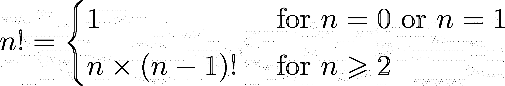
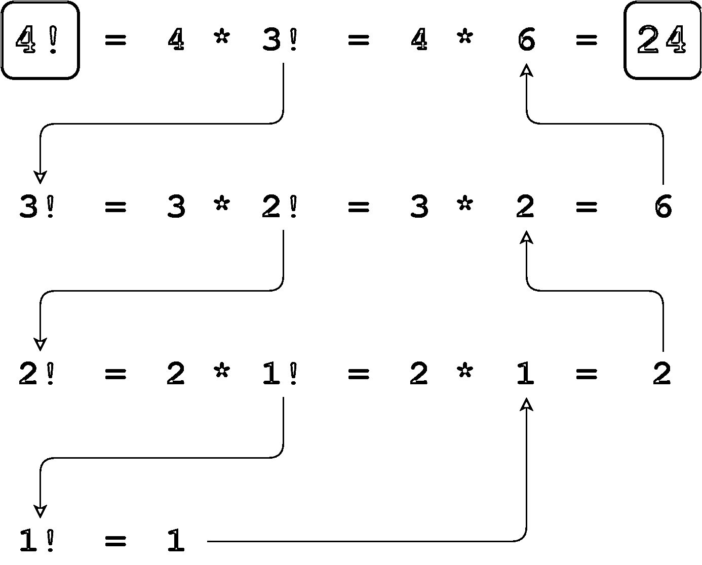
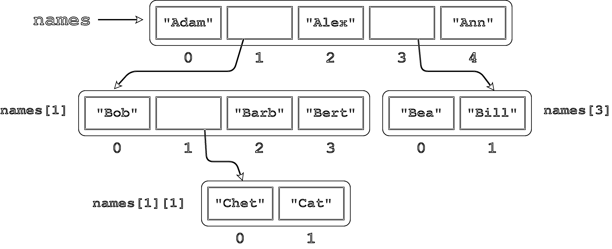
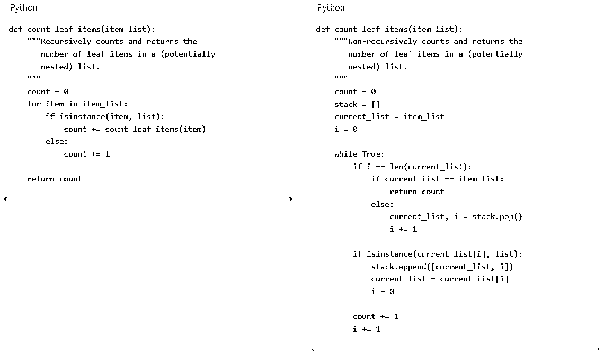
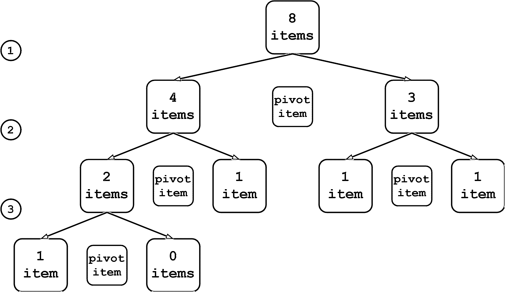
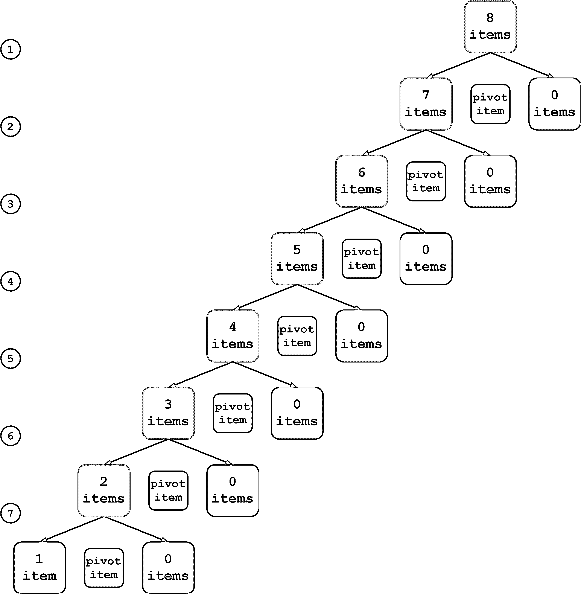
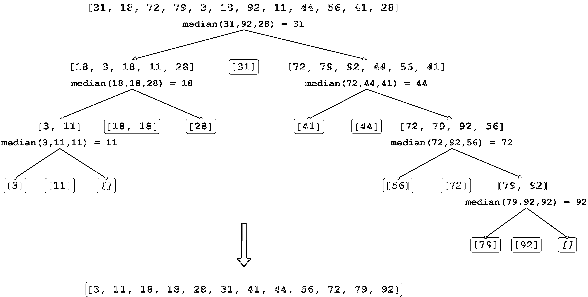

# Python 中的递归:简介

> 原文：<https://realpython.com/python-recursion/>

如果您熟悉 Python 中的[函数，那么您会知道一个函数调用另一个函数是很常见的。在 Python 中，函数也可以调用自己！一个调用自身的函数被称为**递归**，使用递归函数的技术被称为**递归**。](https://realpython.com/defining-your-own-python-function/)

一个函数调用它自己可能看起来很奇怪，但是许多类型的编程问题最好用递归来表达。当你遇到这样的问题时，递归是你工具箱中不可或缺的工具。

本教程结束时，你会明白:

*   一个函数递归地调用自己**意味着什么**
*   Python 函数的**设计**如何支持递归
*   当选择是否递归解决问题时，需要考虑哪些因素
*   如何**用 Python 实现**一个递归函数

然后，您将研究几个使用递归的 Python 编程问题，并将递归解决方案与可比较的非递归解决方案进行对比。

**免费奖励:** [从 Python 基础:Python 3 实用入门](https://realpython.com/bonus/python-basics-sample-free-chapter/)中获取一个示例章节，看看如何通过完整的课程(最新的 Python 3.9)从 Python 初学者过渡到中级。

## 什么是递归？

单词 **recursion** 来源于拉丁语 *recurrere* ，意思是奔跑或急速返回、返回、复原或重现。以下是递归的一些在线定义:

*   [**:**](https://www.dictionary.com/browse/recursion)**返回或往回跑的行为或过程**
***   根据一个对象本身定义该对象(通常是一个函数)的行为*   [**自由字典** :](https://www.thefreedictionary.com/recursion) 一种定义对象序列的方法，例如表达式、函数或集合，其中给定一些初始对象，并且根据前面的对象定义每个连续的对象*

***递归**定义是定义的术语出现在定义本身中。自我参照的情况经常在现实生活中突然出现，即使它们不能立即被识别出来。例如，假设您想要描述组成您祖先的一组人。你可以这样描述他们:

[](https://files.realpython.com/media/jsturtz-ancestors.9f0adeb014ef.png)

注意被定义的概念，**祖先**，是如何出现在它自己的定义中的。这是一个递归定义。

在编程中，递归有非常精确的含义。它指的是一种函数调用自身的编码技术。

[*Remove ads*](/account/join/)

## 为什么要用递归？

大多数编程问题不需要递归就可以解决。因此，严格地说，递归通常是不必要的。

然而，一些情况特别适合于**自引用**定义——例如，上面显示的祖先的定义。如果您正在设计一种算法来以编程方式处理这种情况，那么递归解决方案可能会更干净、更简洁。

遍历[树状数据结构](https://en.wikipedia.org/wiki/Tree_(data_structure))是另一个很好的例子。因为这些是嵌套结构，它们很容易符合递归定义。遍历嵌套结构的非递归算法可能有些笨拙，而递归解决方案则相对优雅。本教程后面会给出一个例子。

另一方面，递归并不适用于所有情况。以下是一些需要考虑的其他因素:

*   对于某些问题，递归解决方案虽然可行，但会显得笨拙而不优雅。
*   递归实现通常比非递归实现消耗更多的内存。
*   在某些情况下，使用递归可能会导致执行时间变慢。

通常，代码的可读性将是最大的决定因素。但要看情况。下面的例子可以帮助你了解什么时候应该选择递归。

## Python 中的递归

当你在 Python 中调用一个函数时，解释器会创建一个新的[本地名称空间](https://realpython.com/python-namespaces-scope/)，这样函数中定义的名字就不会[与其他地方定义的相同名字](https://en.wikipedia.org/wiki/Name_collision)冲突。一个函数可以调用另一个函数，即使它们都用相同的名字定义对象，一切都很好，因为这些对象存在于不同的**名称空间**。

如果同一功能的多个实例同时运行，情况也是如此。例如，考虑以下定义:

```py
def function():
    x = 10
    function()
```

当`function()`第一次执行时，Python 创建一个名称空间，并在该名称空间中给`x`赋值`10`。然后`function()`递归调用自己。第二次`function()`运行时，解释器创建第二个名称空间，并在那里将`10`赋给`x`。名称`x`的这两个实例彼此不同，并且可以共存而不冲突，因为它们位于不同的名称空间中。

不幸的是，按照现状运行`function()`产生的结果并不令人鼓舞，正如下面的[回溯](https://realpython.com/python-traceback/)所示:

>>>

```py
>>> function()
Traceback (most recent call last):
  File "<stdin>", line 1, in <module>
  File "<stdin>", line 3, in function
  File "<stdin>", line 3, in function
  File "<stdin>", line 3, in function
 [Previous line repeated 996 more times]
RecursionError: maximum recursion depth exceeded
```

正如所写的那样，`function()`理论上会永远继续下去，一遍又一遍地调用自己，而没有任何调用会返回。当然，在实践中，没有什么是真正永恒的。你的电脑只有这么多内存，最终会用完的。

Python 不允许这种情况发生。解释器限制了一个函数可以递归调用自己的最大次数，当它达到这个限制时，它会引发一个`RecursionError` [异常](https://realpython.com/python-exceptions/)，如上所示。

**技术提示:**你可以用来自`sys`模块的一个名为`getrecursionlimit()`的函数来找出 Python 的递归极限:

>>>

```py
>>> from sys import getrecursionlimit
>>> getrecursionlimit()
1000
```

你也可以用`setrecursionlimit()`来改变它:

>>>

```py
>>> from sys import setrecursionlimit
>>> setrecursionlimit(2000)
>>> getrecursionlimit()
2000
```

你可以把它设置得很大，但你不能把它无限放大。

对于一个函数来说，不加选择地无限制地递归调用自己是没有多大用处的。这让人想起你有时在洗发水瓶子上看到的说明:“起泡，冲洗，重复。”如果你真的按照这些说明去做，你会永远洗你的头发！

一些洗发水制造商显然发现了这一逻辑缺陷，因为一些洗发水瓶子上写着“起泡、冲洗，必要时重复*”这为指令提供了终止条件。据推测，你最终会觉得你的头发足够干净，认为额外的重复是不必要的。洗发可以停止了。

类似地，递归调用自身的函数必须有一个最终停止的计划。递归函数通常遵循以下模式:

*   有一个或多个不需要进一步递归就可以直接求解的基本情况。
*   每一次递归调用都使解决方案逐渐接近基本情况。

现在，您已经准备好通过一些示例来了解这是如何工作的。

[*Remove ads*](/account/join/)

## 开始:倒数到零

第一个例子是一个名为`countdown()`的函数，它将一个正数作为参数，并打印从指定参数开始一直到零的数字:

>>>

```py
>>> def countdown(n):
...     print(n)
...     if n == 0: ...         return             # Terminate recursion ...     else:
...         countdown(n - 1)   # Recursive call ...

>>> countdown(5)
5
4
3
2
1
0
```

注意`countdown()`是如何符合上述递归算法的范例的:

*   基本情况发生在`n`为零时，此时递归停止。
*   在递归调用中，参数比当前值`n`小 1，因此每次递归都向基本情况靠近。

**注意:**为了简单起见，`countdown()`不检查它的参数的有效性。如果`n`不是整数或者是负数，你会得到一个`RecursionError`异常，因为基本情况永远不会发生。

上面显示的版本`countdown()`清楚地强调了基本情况和递归调用，但是有一种更简洁的方式来表达它:

```py
def countdown(n):
    print(n)
    if n > 0:
        countdown(n - 1)
```

下面是一个可能的非递归实现进行比较:

>>>

```py
>>> def countdown(n):
...     while n >= 0:
...         print(n)
...         n -= 1
...

>>> countdown(5)
5
4
3
2
1
0
```

在这种情况下，非递归解决方案至少和递归解决方案一样清晰直观，甚至可能更清晰直观。

## 计算阶乘

下一个例子涉及到[阶乘](https://en.wikipedia.org/wiki/Factorial)的数学概念。正整数 *n* 的阶乘，记为 *n* ！，定义如下:

[](https://files.realpython.com/media/jsturtz-factorial-defn.b3cd3711a627.png)

换句话说， *n* ！是从 1 到 *n* 的所有整数的乘积，包括 1 和 T3。

阶乘非常适合递归定义，以至于编程文本几乎总是把它作为第一个例子。可以表达一下 *n* 的定义！像这样递归:

[](https://files.realpython.com/media/jsturtz-recursive-factorial-defn.32f2c2a3048a.png)

和上面的例子一样，有些基本情况不需要递归就可以解决。更复杂的情况是**简化**，这意味着它们简化为基本情况之一:

*   基本情况( *n* = 0 或 *n* = 1)无需递归即可求解。
*   对于大于 1 的 *n* 的值， *n* ！是用( *n* - 1)来定义的！，所以递归解逐渐接近基本情况。

比如 4 的递归计算！看起来像这样:

[](https://files.realpython.com/media/jsturtz-factorial-example.496c01139673.png)

<figcaption class="figure-caption text-center">Recursive Calculation of 4!</figcaption>

4 的计算！, 3!，和 2！暂停，直到算法到达 *n* = 1 的基本情况。此时，1！无需进一步递归即可计算，并且延迟的计算运行至完成。

[*Remove ads*](/account/join/)

### 定义一个 Python 阶乘函数

下面是一个计算阶乘的递归 Python 函数。请注意它有多简洁，以及它如何很好地反映了上面显示的定义:

>>>

```py
>>> def factorial(n):
...     return 1 if n <= 1 else n * factorial(n - 1)
...

>>> factorial(4)
24
```

用一些 [`print()`](https://realpython.com/python-print/) 语句稍微修饰一下这个函数，就可以更清楚地了解调用和返回序列:

>>>

```py
>>> def factorial(n):
...     print(f"factorial() called with n = {n}") ...     return_value = 1 if n <= 1 else n * factorial(n -1)
...     print(f"-> factorial({n}) returns {return_value}") ...     return return_value
...

>>> factorial(4)
factorial() called with n = 4
factorial() called with n = 3
factorial() called with n = 2
factorial() called with n = 1
-> factorial(1) returns 1
-> factorial(2) returns 2
-> factorial(3) returns 6
-> factorial(4) returns 24
24
```

注意所有的递归调用*是如何堆积起来的*。在任何调用返回之前，该函数会被连续调用`n` = `4`、`3`、`2`和`1`。最后当`n`为`1`时，问题就可以解决了，不用再递归了。然后，每个堆叠的递归调用都展开，从最外层的调用返回`1`、`2`、`6`，最后是`24`。

这里不需要递归。您可以使用一个 [`for`](https://realpython.com/python-for-loop/) 循环迭代地实现`factorial()`:

>>>

```py
>>> def factorial(n):
...     return_value = 1
...     for i in range(2, n + 1):
...         return_value *= i
...     return return_value
...

>>> factorial(4)
24
```

你也可以使用 Python 的 [`reduce()`](https://realpython.com/python-reduce-function/) 实现阶乘，你可以从`functools`模块[导入](https://realpython.com/python-import/):

>>>

```py
>>> from functools import reduce
>>> def factorial(n):
...     return reduce(lambda x, y: x * y, range(1, n + 1) or [1])
...

>>> factorial(4)
24
```

这再次表明，如果一个问题可以用递归来解决，也可能有几个可行的非递归解决方案。您通常会根据哪一个会产生可读性最强、最直观的代码来进行选择。

另一个要考虑的因素是执行速度。递归和非递归解决方案之间可能存在显著的性能差异。在下一节中，您将进一步探究这些差异。

### 阶乘实现的速度比较

要评估执行时间，您可以使用一个名为 [`timeit()`](https://docs.python.org/3/library/timeit.html#timeit.timeit) 的函数，该函数来自一个名为`timeit`的模块。该函数支持许多不同的格式，但在本教程中您将使用以下格式:

```py
timeit(<command>, setup=<setup_string>, number=<iterations>)
```

`timeit()`首先执行指定`<setup_string>`中包含的命令。然后它执行`<command>`给定数量的`<iterations>`，并以秒为单位报告累计执行时间:

>>>

```py
>>> from timeit import timeit

>>> timeit("print(string)", setup="string='foobar'", number=100)
foobar
foobar
foobar
 .
 . [100 repetitions]
 .
foobar
0.03347089999988384
```

这里，`setup`参数给`string`赋值`'foobar'`。然后`timeit()`打印`string`一百次。总执行时间刚刚超过 3/100 秒。

下面的例子使用`timeit()`来比较上面阶乘的递归、迭代和`reduce()`实现。在每种情况下，`setup_string`包含一个定义相关`factorial()`功能的设置字符串。`timeit()`然后总共执行`factorial(4)`一千万次，并报告总的执行情况。

首先，这是递归版本:

>>>

```py
>>> setup_string = """
... print("Recursive:")
... def factorial(n):
...     return 1 if n <= 1 else n * factorial(n - 1)
... """

>>> from timeit import timeit
>>> timeit("factorial(4)", setup=setup_string, number=10000000)
Recursive:
4.957105500000125
```

接下来是迭代实现:

>>>

```py
>>> setup_string = """
... print("Iterative:")
... def factorial(n):
...     return_value = 1
...     for i in range(2, n + 1):
...         return_value *= i
...     return return_value
... """

>>> from timeit import timeit
>>> timeit("factorial(4)", setup=setup_string, number=10000000)
Iterative:
3.733752099999947
```

最后，这里是使用`reduce()`的版本:

>>>

```py
>>> setup_string = """
... from functools import reduce
... print("reduce():")
... def factorial(n):
...     return reduce(lambda x, y: x * y, range(1, n + 1) or [1])
... """

>>> from timeit import timeit
>>> timeit("factorial(4)", setup=setup_string, number=10000000)
reduce():
8.101526299999932
```

在这种情况下，迭代实现是最快的，尽管递归解决方案并不落后。使用`reduce()`的方法最慢。如果您在自己的机器上尝试这些示例，您的里程数可能会有所不同。你肯定得不到同样的次数，甚至可能得不到同样的排名。

有关系吗？迭代实现和使用`reduce()`的实现在执行时间上有将近 4 秒的差异，但是需要 1000 万次调用才能看到。

如果您将多次调用一个函数，那么在选择实现时，您可能需要考虑执行速度。另一方面，如果函数运行的频率相对较低，那么执行时间的差异可能可以忽略不计。在这种情况下，您最好选择能够最清楚地表达问题解决方案的实现。

对于阶乘，上面记录的时间表明递归实现是一个合理的选择。

坦率地说，如果你用 Python 编程，你根本不需要实现阶乘函数。它已经在标准 [`math`模块](https://realpython.com/python-math-module/)中可用:

>>>

```py
>>> from math import factorial
>>> factorial(4)
24
```

也许您会有兴趣知道它在计时测试中的表现:

>>>

```py
>>> setup_string = "from math import factorial"

>>> from timeit import timeit
>>> timeit("factorial(4)", setup=setup_string, number=10000000)
0.3724050999999946
```

哇！`math.factorial()`的性能比上面显示的其他三种最好的实现要好大约 10 倍。

**技术提示:**`math.factorial()`快得多的事实可能与它是否递归实现无关。更有可能是因为这个函数是用 [C](https://en.wikipedia.org/wiki/C_(programming_language)) 而不是 Python 实现的。有关 Python 和 C 的更多阅读资料，请参见以下资源:

*   [Python 绑定:从 Python 调用 C 或 c++](https://realpython.com/python-bindings-overview/)
*   [构建 Python C 扩展模块](https://realpython.com/build-python-c-extension-module/)
*   [面向 Python 程序员的 C 语言](https://realpython.com/c-for-python-programmers/)
*   [CPython 源代码指南](https://realpython.com/cpython-source-code-guide/)
*   [*CPython 内幕*书](https://realpython.com/products/cpython-internals-book/)

用 C 实现的函数实际上总是比用纯 Python 实现的相应函数要快。

[*Remove ads*](/account/join/)

## 遍历嵌套列表

下一个例子涉及到访问嵌套列表结构中的每一项。考虑下面的 Python [列表](https://realpython.com/python-lists-tuples/#python-lists):

```py
names = [
    "Adam",
    [
        "Bob",
        [
            "Chet",
            "Cat",
        ],
        "Barb",
        "Bert"
    ],
    "Alex",
    [
        "Bea",
        "Bill"
    ],
    "Ann"
]
```

如下图所示，`names`包含两个子列表。第一个子列表本身包含另一个子列表:

[](https://files.realpython.com/media/jsturtz-nested-list.20eb8fe32366.png)

假设您想要计算这个列表中的**叶元素**的数量——最低级别的`str`对象——就好像您已经展平了这个列表。叶子元素有`"Adam"`、`"Bob"`、`"Chet"`、`"Cat"`、`"Barb"`、`"Bert"`、`"Alex"`、`"Bea"`、`"Bill"`、`"Ann"`，所以答案应该是`10`。

仅仅在列表上调用`len()`并不能给出正确答案:

>>>

```py
>>> len(names)
5
```

`len()`统计`names`顶层的对象，分别是三个叶子元素`"Adam"`、`"Alex"`、`"Ann"`和两个子列表`["Bob", ["Chet", "Cat"], "Barb", "Bert"]`和`["Bea", "Bill"]`:

>>>

```py
>>> for index, item in enumerate(names):
...     print(index, item)
...
0 Adam
1 ['Bob', ['Chet', 'Cat'], 'Barb', 'Bert']
2 Alex
3 ['Bea', 'Bill']
4 Ann
```

这里需要的是一个遍历整个列表结构的函数，包括子列表。算法是这样的:

1.  浏览列表，依次检查每一项。
2.  如果您找到一个叶元素，那么将其添加到累计计数中。
3.  如果遇到子列表，请执行以下操作:
    *   下拉到子列表中，同样地遍历它。
    *   一旦您用完了子列表，返回到上一步，将子列表中的元素添加到累计计数中，并从您停止的地方继续遍历父列表。

注意这个描述的自引用性质:*遍历列表*。如果你遇到一个子列表，那么类似地*遍历列表*。这种情况需要递归！

### 递归遍历嵌套列表

递归非常适合这个问题。要解决这个问题，您需要能够确定给定的列表项是否是叶项。为此，您可以使用内置的 Python 函数 [`isinstance()`](https://docs.python.org/3/library/functions.html#isinstance) 。

在`names`列表的情况下，如果一个条目是类型`list`的实例，那么它是一个子列表。否则，它是一个叶项目:

>>>

```py
>>> names
['Adam', ['Bob', ['Chet', 'Cat'], 'Barb', 'Bert'], 'Alex', ['Bea', 'Bill'], 'Ann']
  >>> names[0]
'Adam'
>>> isinstance(names[0], list)
False
  >>> names[1]
['Bob', ['Chet', 'Cat'], 'Barb', 'Bert']
>>> isinstance(names[1], list)
True
  >>> names[1][1]
['Chet', 'Cat']
>>> isinstance(names[1][1], list)
True
  >>> names[1][1][0]
'Chet'
>>> isinstance(names[1][1][0], list)
False
```

现在您已经有了实现一个函数的工具，该函数计算列表中的叶元素，递归地考虑子列表:

```py
def count_leaf_items(item_list):
    """Recursively counts and returns the
 number of leaf items in a (potentially
 nested) list.
 """
    count = 0
    for item in item_list:
        if isinstance(item, list):
            count += count_leaf_items(item)
        else:
            count += 1

    return count
```

如果您在几个列表上运行`count_leaf_items()`，包括上面定义的`names`列表，您会得到:

>>>

```py
>>> count_leaf_items([1, 2, 3, 4])
4
>>> count_leaf_items([1, [2.1, 2.2], 3])
4
>>> count_leaf_items([])
0

>>> count_leaf_items(names)
10
>>> # Success!
```

与阶乘示例一样，添加一些 [`print()`](https://realpython.com/python-print/) 语句有助于演示递归调用和[返回](https://realpython.com/python-return-statement/)值的顺序:

```py
 1def count_leaf_items(item_list):
 2    """Recursively counts and returns the
 3 number of leaf items in a (potentially
 4 nested) list.
 5 """
 6    print(f"List: {item_list}")
 7    count = 0
 8    for item in item_list:
 9        if isinstance(item, list): 10            print("Encountered sublist")
11            count += count_leaf_items(item) 12        else: 13            print(f"Counted leaf item \"{item}\"")
14            count += 1 15
16    print(f"-> Returning count {count}")
17    return count
```

下面是上例中发生的事情的概要:

*   **第 9 行:** `isinstance(item, list)`是`True`，所以`count_leaf_items()`找到了一个子列表。
*   **第 11 行:**该函数递归地调用自身来计算子列表中的项目数，然后将结果加到累计总数中。
*   **第 12 行:** `isinstance(item, list)`是`False`，所以`count_leaf_items()`遇到了一个叶项。
*   **第 14 行:**该函数将累计总数加 1，以说明叶项目。

**注意:**为了简单起见，这个实现假设传递给`count_leaf_items()`的列表只包含叶条目或子列表，而不包含任何其他类型的复合对象，如[字典](https://realpython.com/python-dicts/)或[元组](https://realpython.com/python-lists-tuples/#python-tuples)。

当在`names`列表上执行时，来自`count_leaf_items()`的输出现在看起来像这样:

>>>

```py
>>> count_leaf_items(names)
List: ['Adam', ['Bob', ['Chet', 'Cat'], 'Barb', 'Bert'], 'Alex', ['Bea', 'Bill'], 'Ann']
Counted leaf item "Adam"
Encountered sublist
List: ['Bob', ['Chet', 'Cat'], 'Barb', 'Bert']
Counted leaf item "Bob"
Encountered sublist
List: ['Chet', 'Cat']
Counted leaf item "Chet"
Counted leaf item "Cat"
-> Returning count 2
Counted leaf item "Barb"
Counted leaf item "Bert"
-> Returning count 5
Counted leaf item "Alex"
Encountered sublist
List: ['Bea', 'Bill']
Counted leaf item "Bea"
Counted leaf item "Bill"
-> Returning count 2
Counted leaf item "Ann"
-> Returning count 10
10
```

每次对`count_leaf_items()`的调用终止时，它都返回它在传递给它的列表中记录的叶子元素的数量。顶层调用返回`10`，这是应该的。

[*Remove ads*](/account/join/)

### 非递归遍历嵌套列表

像目前为止展示的其他例子一样，这个列表遍历不需要递归。也可以迭代完成。这里有一种可能性:

```py
def count_leaf_items(item_list):
    """Non-recursively counts and returns the
 number of leaf items in a (potentially
 nested) list.
 """
    count = 0
    stack = []
    current_list = item_list
    i = 0

    while True:
        if i == len(current_list):
            if current_list == item_list:
                return count
            else:
                current_list, i = stack.pop()
                i += 1
                continue

        if isinstance(current_list[i], list):
            stack.append([current_list, i])
            current_list = current_list[i]
            i = 0
        else:
            count += 1
            i += 1
```

如果您在前面显示的相同列表上运行这个非递归版本的`count_leaf_items()`,您会得到相同的结果:

>>>

```py
>>> count_leaf_items([1, 2, 3, 4])
4
>>> count_leaf_items([1, [2.1, 2.2], 3])
4
>>> count_leaf_items([])
0

>>> count_leaf_items(names)
10
>>> # Success!
```

这里采用的策略是使用一个[栈](https://realpython.com/how-to-implement-python-stack/)来处理嵌套的子列表。当这个版本的`count_leaf_items()`遇到子列表时，它将当前正在进行的列表和该列表中的当前索引推到堆栈上。一旦对子列表计数完毕，函数就从堆栈中弹出父列表和索引，这样就可以从停止的地方继续计数。

事实上，递归实现中也发生了本质上相同的事情。当您递归调用一个函数时，Python 将执行实例的状态保存在一个堆栈上，以便递归调用可以运行。当递归调用完成时，从堆栈中弹出状态，以便被中断的实例可以恢复。这是相同的概念，但是在递归解决方案中，Python 为您完成了状态保存工作。

请注意，与非递归版本相比，递归代码是多么的简洁和易读:

[](https://files.realpython.com/media/jsturtz-traversal-comparison.930c512e5fd6.png)

<figcaption class="figure-caption text-center">Recursive vs Non-Recursive Nested List Traversal</figcaption>

在这种情况下，使用递归绝对是一种优势。

## 检测回文

是否使用递归来解决问题的选择在很大程度上取决于问题的性质。例如，阶乘自然地转化为递归实现，但是迭代解决方案也非常简单。在那种情况下，可以说是胜负难分。

列表遍历问题是一个不同的故事。在这种情况下，递归解决方案非常优雅，而非递归解决方案则非常麻烦。

对于下一个问题，使用递归无疑是愚蠢的。

回文是一个反向读起来和正向读起来一样的单词。例子包括以下单词:

*   赛车
*   水平
*   皮船
*   使复活的人
*   公民的

如果让你设计一个算法来判断一个字符串是否是回文，你可能会想到类似“反转字符串，看看它是否和原来的一样。”没有比这更简单的了。

更有帮助的是，Python 的用于反转字符串的`[::-1]`切片语法提供了一种方便的编码方式:

>>>

```py
>>> def is_palindrome(word):
...     """Return True if word is a palindrome, False if not."""
...     return word == word[::-1]
...

>>> is_palindrome("foo")
False
>>> is_palindrome("racecar")
True
>>> is_palindrome("troglodyte")
False
>>> is_palindrome("civic")
True
```

这是清晰简洁的。几乎没有必要寻找替代方案。但是为了好玩，考虑一下这个回文的递归定义:

*   **基本情况:**空字符串和由单个字符组成的字符串本身就是回文。
*   **归约递归:**长度为 2 或更长的字符串是回文，如果它满足这两个条件:
    1.  第一个和最后一个字符是相同的。
    2.  第一个和最后一个字符之间的子串是一个回文。

切片也是你的朋友。对于字符串`word`，索引和切片给出了以下子字符串:

*   第一个角色是`word[0]`。
*   最后一个字符是`word[-1]`。
*   第一个和最后一个字符之间的子串是`word[1:-1]`。

所以你可以像这样递归地定义`is_palindrome()`:

>>>

```py
>>> def is_palindrome(word):
...     """Return True if word is a palindrome, False if not."""
...     if len(word) <= 1:
...         return True
...     else:
...         return word[0] == word[-1] and is_palindrome(word[1:-1])
...

>>> # Base cases
>>> is_palindrome("")
True
>>> is_palindrome("a")
True

>>> # Recursive cases
>>> is_palindrome("foo")
False
>>> is_palindrome("racecar")
True
>>> is_palindrome("troglodyte")
False
>>> is_palindrome("civic")
True
```

递归思考是一种有趣的练习，即使不是特别必要。

[*Remove ads*](/account/join/)

## 使用快速排序进行排序

最后一个例子，像嵌套列表遍历一样，是一个很好的例子，很自然地暗示了递归方法。[快速排序算法](https://realpython.com/sorting-algorithms-python/#the-quicksort-algorithm-in-python)是一种高效的排序算法，由英国计算机科学家东尼·霍尔于 1959 年开发。

快速排序是一种[分治算法](https://en.wikipedia.org/wiki/Divide-and-conquer_algorithm)。假设您有一个要排序的对象列表。首先在列表中选择一个项目，称为**枢轴**项目。这可以是列表中的任何项目。然后**根据枢纽项将列表划分为两个子列表，并递归排序子列表。**

该算法的步骤如下:

*   选择透视项目。
*   将列表分成两个子列表:
    1.  那些少于透视项目的项目
    2.  大于透视项的那些项
*   递归快速排序子列表。

每次划分都会产生更小的子列表，因此算法是简化的。基本情况发生在子列表为空或者只有一个元素的时候，因为这些元素是固有排序的。

### 选择枢纽项目

无论列表中的哪一项是透视项，快速排序算法都会起作用。但是有些选择比其他的更好。请记住，在进行分区时，会创建两个子列表:一个子列表中的项目少于 pivot 项目，另一个子列表中的项目多于 pivot 项目。理想情况下，两个子列表的长度大致相等。

假设您的初始排序列表包含八个项目。如果每个划分产生长度大致相等的子列表，那么您可以通过三个步骤达到基本情况:

[](https://files.realpython.com/media/jsturtz-optimal-pivot.93e52ac803a8.png)

<figcaption class="figure-caption text-center">Optimal Partitioning, Eight-Item List</figcaption>

另一方面，如果您选择的 pivot 项特别不吉利，每个分区都会产生一个包含除 pivot 项之外的所有原始项的子列表和另一个空的子列表。在这种情况下，需要七个步骤来将列表缩减为基本案例:

[](https://files.realpython.com/media/jsturtz-suboptimal-pivot.546d83e040c3.png)

<figcaption class="figure-caption text-center">Suboptimal Partitioning, Eight-Item List</figcaption>

快速排序算法在第一种情况下会更有效。但是，为了系统地选择最佳的枢纽项目，您需要提前了解要排序的数据的性质。在任何情况下，没有任何一种选择对所有情况都是最好的。因此，如果您正在编写一个快速排序函数来处理一般情况，那么选择 pivot 项就有些随意了。

列表中的第一项是常见的选择，最后一项也是如此。如果列表中的数据是随机分布的，那么这些方法就可以很好地工作。但是，如果数据已经排序，或者几乎已经排序，那么这将导致如上所示的次优分区。为了避免这种情况，一些快速排序算法选择列表中的中间项作为透视项。

另一种选择是找到列表中第一、最后和中间项的中间值，并将其用作透视项。这是下面的示例代码中使用的策略。

### 实现分区

一旦选择了 pivot 项，下一步就是对列表进行分区。同样，目标是创建两个子列表，一个包含小于枢轴项的项目，另一个包含大于枢轴项的项目。

你可以直接就地完成。换句话说，通过交换项目，您可以随意移动列表中的项目，直到枢轴项目位于中间，所有较小的项目位于其左侧，所有较大的项目位于其右侧。然后，当您递归地快速排序子列表时，您将把列表的片段传递到 pivot 项的左边和右边。

或者，您可以使用 Python 的列表操作功能来创建新列表，而不是就地操作原始列表。这是下面代码中采用的方法。算法如下:

*   使用上述三中值方法选择透视项目。
*   使用透视项，创建三个子列表:
    1.  原始列表中少于透视项的项
    2.  枢纽项目本身
    3.  原始列表中大于透视项的项
*   递归快速排序列表 1 和 3。
*   将所有三个列表连接在一起。

请注意，这涉及到创建第三个子列表，其中包含 pivot 项本身。这种方法的一个优点是，它可以平稳地处理透视表项在列表中出现不止一次的情况。在这种情况下，列表 2 将有不止一个元素。

[*Remove ads*](/account/join/)

### 使用快速排序实现

现在基础工作已经就绪，您已经准备好进入快速排序算法了。以下是 Python 代码:

```py
 1import statistics
 2
 3def quicksort(numbers):
 4    if len(numbers) <= 1:
 5        return numbers
 6    else:
 7        pivot = statistics.median(
 8            [
 9                numbers[0],
10                numbers[len(numbers) // 2],
11                numbers[-1]
12            ]
13        )
14        items_less, pivot_items, items_greater = (
15            [n for n in numbers if n < pivot],
16            [n for n in numbers if n == pivot],
17            [n for n in numbers if n > pivot]
18        )
19
20        return (
21            quicksort(items_less) +
22            pivot_items +
23            quicksort(items_greater)
24        )
```

这就是`quicksort()`的每个部分正在做的事情:

*   第 4 行:列表为空或者只有一个元素的基本情况
*   **第 7 行到第 13 行:**用三中值法计算枢纽项目
*   **第 14 到 18 行:**创建三个分区列表
*   **第 20 到 24 行:**分区列表的递归排序和重组

**注:**这个例子的优点是简洁，相对可读性强。然而，这并不是最有效的实现。特别是，在第 14 到 18 行创建分区列表需要遍历列表三次，从执行时间的角度来看，这并不是最佳的。

下面是一些`quicksort()`的例子:

>>>

```py
>>> # Base cases
>>> quicksort([])
[]
>>> quicksort([42])
[42]

>>> # Recursive cases
>>> quicksort([5, 2, 6, 3])
[2, 3, 5, 6]
>>> quicksort([10, -3, 21, 6, -8])
[-8, -3, 6, 10, 21]
```

出于测试目的，您可以定义一个短函数来生成一个在`1`和`100`之间的随机数列表:

```py
import random

def get_random_numbers(length, minimum=1, maximum=100):
    numbers = []
    for _ in range(length):
        numbers.append(random.randint(minimum, maximum))

    return numbers
```

现在您可以使用`get_random_numbers()`来测试`quicksort()`:

>>>

```py
>>> numbers = get_random_numbers(20)
>>> numbers
[24, 4, 67, 71, 84, 63, 100, 94, 53, 64, 19, 89, 48, 7, 31, 3, 32, 76, 91, 78]
>>> quicksort(numbers)
[3, 4, 7, 19, 24, 31, 32, 48, 53, 63, 64, 67, 71, 76, 78, 84, 89, 91, 94, 100]

>>> numbers = get_random_numbers(15, -50, 50)
>>> numbers
[-2, 14, 48, 42, -48, 38, 44, -25, 14, -14, 41, -30, -35, 36, -5]
>>> quicksort(numbers)
[-48, -35, -30, -25, -14, -5, -2, 14, 14, 36, 38, 41, 42, 44, 48]

>>> quicksort(get_random_numbers(10, maximum=500))
[49, 94, 99, 124, 235, 287, 292, 333, 455, 464]
>>> quicksort(get_random_numbers(10, 1000, 2000))
[1038, 1321, 1530, 1630, 1835, 1873, 1900, 1931, 1936, 1943]
```

要进一步了解`quicksort()`的工作原理，请参见下图。这显示了对十二元素列表排序时的递归序列:

[](https://files.realpython.com/media/jsturtz-qsort.8fac5b768da0.png)

<figcaption class="figure-caption text-center">Quicksort Algorithm, Twelve-Element List</figcaption>

在第一步中，第一、中间和最后的列表值分别是`31`、`92`和`28`。中间值是`31`，所以成为枢纽项目。第一个分区由以下子列表组成:

| 子表 | 项目 |
| --- | --- |
| `[18, 3, 18, 11, 28]` | 少于透视项目的项目 |
| `[31]` | 枢纽项目本身 |
| `[72, 79, 92, 44, 56, 41]` | 大于透视项的项 |

每个子列表随后以同样的方式递归划分，直到所有子列表要么包含单个元素，要么为空。当递归调用返回时，列表按排序顺序重新组合。注意，在左边的倒数第二步中，透视项`18`在列表中出现了两次，因此透视项列表有两个元素。

## 结论

这就结束了你的**递归**之旅，递归是一种函数调用自身的编程技术。递归并不适合所有的任务。但是一些编程问题实际上迫切需要它。在这种情况下，这是一个很好的方法。

**在本教程中，您学习了:**

*   一个函数递归地调用自己**意味着什么**
*   Python 函数的**设计**如何支持递归
*   当选择是否递归解决问题时，需要考虑哪些因素
*   如何**用 Python 实现**一个递归函数

您还看到了几个递归算法的例子，并将它们与相应的非递归解决方案进行了比较。

现在，您应该能够很好地认识到什么时候需要递归，并准备好在需要的时候自信地使用它！如果你想探索更多关于 Python 中递归的知识，那么看看 Python 中的递归思维。**********