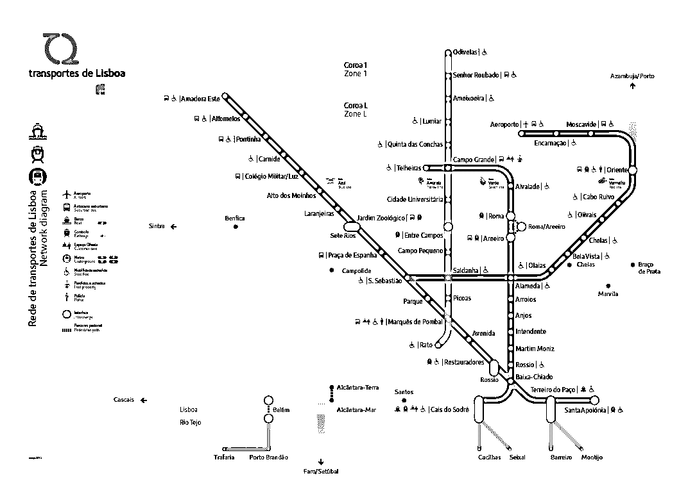
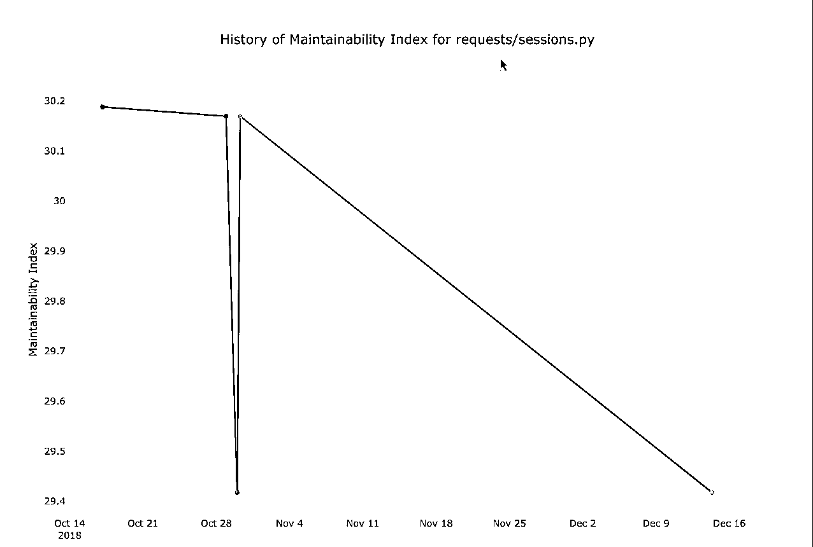

# 为简单起见重构 Python 应用程序

> 原文：<https://realpython.com/python-refactoring/>

你想要更简单的 Python 代码吗？你总是带着最好的意图、干净的代码库和良好的结构开始一个项目。但是随着时间的推移，你的应用程序会发生变化，事情会变得有点混乱。

如果你能编写和维护干净、简单的 Python 代码，那么从长远来看，它将为你节省大量的时间。当您的代码布局良好且易于遵循时，您可以花费更少的时间来测试、查找 bug 和进行更改。

在本教程中，你将学习:

*   如何衡量 Python 代码和应用程序的复杂性
*   如何在不破坏代码的情况下更改代码
*   Python 代码中导致额外复杂性的常见问题是什么，以及如何修复它们

在整个教程中，我将使用地下铁路网络的主题来解释复杂性，因为在大城市的地铁系统中导航可能是复杂的！有些设计得很好，有些似乎过于复杂。

**免费奖励:** [掌握 Python 的 5 个想法](https://realpython.com/bonus/python-mastery-course/)，这是一个面向 Python 开发者的免费课程，向您展示将 Python 技能提升到下一个水平所需的路线图和心态。

## Python 中的代码复杂性

应用程序及其代码库的复杂性与其执行的任务相关。如果你正在为 NASA 的喷气推进实验室(字面意思是[火箭科学](https://github.com/chrislgarry/Apollo-11))编写代码，那么这将会很复杂。

问题不在于“我的代码复杂吗？”比如，“我的代码比它需要的更复杂吗？”

东京铁路网是世界上最广泛和最复杂的网络之一。这部分是因为东京是一个超过 3000 万人口的大都市，但也是因为有 3 个网络相互重叠。

[](https://files.realpython.com/media/Image_from_iOS.66044b21299a.jpg)

<figcaption class="figure-caption text-center">The author of this article getting lost on the Tokyo Metro</figcaption>

东京市中心有东映和东京地铁快速运输网络以及日本铁路东线列车。即使对最有经验的旅行者来说，在东京市中心导航也是令人难以置信的复杂。

这里有一张东京铁路网的地图，给你一些视角:

[](https://files.realpython.com/media/img_01.c19c0b4f6df2.png)

<figcaption class="figure-caption text-center">Image: [Tokyo Metro Co.](https://www.tokyometro.jp/en/subwaymap/)</figcaption>

如果你的代码开始看起来有点像这个地图，那么这就是你的教程。

首先，我们将讨论 4 个复杂度指标，这些指标可以给你一个尺度来衡量你在简化代码的任务中的相对进度:

[](https://files.realpython.com/media/content_nav_graphic-02.3b9543d9d7b6.png)

在您探索了这些指标之后，您将了解一个叫做`wily`的工具来自动计算这些指标。

[*Remove ads*](/account/join/)

### 衡量复杂性的标准

大量的时间和研究被投入到分析计算机软件的复杂性上。过于复杂和不可维护的应用程序会有很高的成本。

软件的复杂性与质量相关。易于阅读和理解的代码将来更有可能被开发人员更新。

这里有一些编程语言的标准。它们适用于许多语言，不仅仅是 Python。

#### 代码行

LOC，或代码行数，是复杂性的最粗略的度量。在代码行和应用程序的复杂性之间是否有任何直接的联系是有争议的，但是间接的联系是清楚的。毕竟，一个只有 5 行代码的程序可能比一个有 500 万行代码的程序简单。

当查看 Python 指标时，我们试图忽略空行和包含注释的行。

可以在 Linux 和 Mac OS 上使用`wc`命令来计算代码行，其中`file.py`是您想要测量的文件的名称:

```py
$ wc -l file.py
```

如果你想通过[递归](https://realpython.com/python-thinking-recursively/)搜索所有`.py`文件来添加文件夹中的组合行，你可以将`wc`与`find`命令组合起来:

```py
$ find . -name \*.py | xargs wc -l
```

对于 Windows，PowerShell 在`Measure-Object`中提供了字数统计命令，在`Get-ChildItem`中提供了[递归](https://realpython.com/python-recursion/)文件搜索:

```py
PS C:\> Get-ChildItem -Path *.py -Recurse | Measure-Object –Line
```

在响应中，您将看到总行数。

为什么要用代码行数来量化应用程序中的代码量？假设一行代码大致相当于一条语句。行是比字符更好的度量，因为字符包括空白。

在 Python 中，我们被鼓励在每一行放一条语句。这个例子有 9 行代码:

```py
 1x = 5
 2value = input("Enter a number: ")
 3y = int(value)
 4if x < y:
 5    print(f"{x} is less than {y}")
 6elif x == y:
 7    print(f"{x} is equal to {y}")
 8else:
 9    print(f"{x} is more than {y}")
```

如果你只使用代码行来度量复杂性，这可能会鼓励错误的行为。

Python 代码应该易于阅读和理解。以最后一个例子为例，您可以将代码行数减少到 3:

```py
 1x = 5; y = int(input("Enter a number:"))
 2equality = "is equal to" if x == y else "is less than" if x < y else "is more than"
 3print(f"{x}  {equality}  {y}")
```

但是结果很难阅读，PEP 8 有关于最大行长和换行的指导方针。您可以查看[如何使用 PEP 8 编写漂亮的 Python 代码](https://realpython.com/python-pep8/)以了解更多关于 PEP 8 的信息。

这个代码块使用了两个 Python 语言特性来缩短代码:

*   **复合语句:**使用`;`
*   **链式条件或三元语句:** `name = value if condition else value if condition2 else value2`

我们减少了代码行数，但是违反了 Python 的一个基本法则:

> "可读性很重要"
> 
> —蒂姆·彼得斯，Python 之禅

这种缩短的代码可能更难维护，因为代码维护者是人，而且这种短代码更难阅读。我们将探索一些更高级、更有用的复杂性度量标准。

#### 圈复杂度

圈复杂度是对应用程序中有多少独立代码路径的度量。路径是一系列的语句，解释器可以跟随它到达应用程序的末尾。

考虑圈复杂度和代码路径的一种方式是把你的代码想象成一个铁路网。

对于一次旅行，你可能需要换乘火车才能到达目的地。葡萄牙的里斯本大都会铁路系统简单易行。任何旅行的圈复杂度等于您需要旅行的线路数:

[](https://files.realpython.com/media/Plan-du-Metro-de-Lisbonne.1ad8d99b3853.png)

<figcaption class="figure-caption text-center">Image: [Metro Lisboa](https://www.metrolisboa.pt/en/travel/diagrams-and-maps/)</figcaption>

如果你需要从*阿尔瓦拉德*到*安茹斯*，那么你将在*哈林维德*(绿线)上行驶 5 站:

[](https://files.realpython.com/media/lisbon-subway-map-1.f5d3b712274c.png)

<figcaption class="figure-caption text-center">Image: [Metro Lisboa](https://www.metrolisboa.pt/en/travel/diagrams-and-maps/)</figcaption>

这次旅行的圈复杂度为 1，因为你只乘坐 1 次火车。这是一次轻松的旅行。在这个类比中，这种训练相当于一个代码分支。

如果你需要从*机场*(机场)前往*贝伦* 区品尝[美食，那么这是一个更复杂的旅程。你必须在阿拉梅达和卡伊斯多索德转车:](https://pasteisdebelem.pt/en/)

[](https://files.realpython.com/media/lisbon-subway-map-2.ac4c65844174.png)

<figcaption class="figure-caption text-center">Image: [Metro Lisboa](https://www.metrolisboa.pt/en/travel/diagrams-and-maps/)</figcaption>

这次旅行的圈复杂度是 3，因为你要乘坐 3 次火车。你最好乘出租车去。

看起来你不是在浏览里斯本，而是在写代码，火车线路的变化变成了执行中的一个分支，就像一个 [`if`语句](https://realpython.com/python-conditional-statements/)。

让我们来看看这个例子:

```py
x = 1
```

这段代码只有一种执行方式，因此它的圈复杂度为 1。

如果我们添加一个决策，或者将代码分支为一个`if`语句，就会增加复杂性:

```py
x = 1
if x < 2:
    x += 1
```

尽管这段代码只有一种执行方式，但由于`x`是一个[常数](https://realpython.com/python-constants/)，因此圈复杂度为 2。所有圈复杂度分析器都将一个`if`语句视为一个分支。

这也是过度复杂代码的一个例子。因为`x`有一个固定值，所以`if`语句没有用。您可以简单地将此示例重构如下:

```py
x = 2
```

这是一个玩具示例，所以让我们来探索一些更真实的东西。

`main()`的圈复杂度为 5。我将在代码中注释每个分支，这样您就可以看到它们在哪里:

```py
# cyclomatic_example.py
import sys

def main():
 if len(sys.argv) > 1:  # 1        filepath = sys.argv[1]
    else:
        print("Provide a file path")
        exit(1)
 if filepath:  # 2 with open(filepath) as fp:  # 3 for line in fp.readlines():  # 4 if line != "\n":  # 5                    print(line, end="")

if __name__ == "__main__":  # Ignored.
    main()
```

当然有方法可以将代码重构为更简单的替代方案。我们稍后会谈到这一点。

**注:**圈复杂度是由托马斯·j·麦凯布于 1976 年提出的[。你可能会看到它被称为**麦凯比指标**或**麦凯比数**。](http://www.literateprogramming.com/mccabe.pdf)

在下面的例子中，我们将使用 PyPI 中的 [`radon`](https://radon.readthedocs.io/) 库[来计算指标。您现在可以安装它:](https://pypi.org/project/radon)

```py
$ pip install radon
```

要使用`radon`计算圈复杂度，您可以将示例保存到名为`cyclomatic_example.py`的文件中，并从命令行使用`radon`。

`radon`命令有两个主要参数:

1.  分析的类型(`cc`表示圈复杂度)
2.  要分析的文件或文件夹的路径

针对`cyclomatic_example.py`文件执行带有`cc`分析的`radon`命令。添加`-s`将给出输出中的圈复杂度:

```py
$ radon cc cyclomatic_example.py -s
cyclomatic_example.py
 F 4:0 main - B (6)
```

输出有点神秘。以下是每个部分的含义:

*   `F`表示函数，`M`表示方法，`C`表示类。
*   `main`是函数的名称。
*   `4`是函数开始的行。
*   `B`是从 A 到 f 的等级，A 是最好的等级，意味着最不复杂。
*   括号中的数字`6`，是代码的圈复杂度。

#### 霍尔斯特德指标

霍尔斯特德复杂度指标与程序代码库的大小有关。它们是由莫里斯·h·霍尔斯特德于 1977 年开发的。霍尔斯特德方程中有 4 个测量值:

*   **操作数**是变量的值和名称。
*   **运算符**均为内置[关键字](https://realpython.com/python-keywords/)，如`if`、`else`、`for`或`while`。
*   **Length (N)** 是程序中操作符的数量加上操作数的数量。
*   **词汇(h)** 是你一个程序中*唯一*运算符的个数加上*唯一*操作数的个数。

然后，这些测量有 3 个额外的指标:

*   **体积(V)** 代表**长度**和**词汇**的乘积。
*   **难度(D)** 表示一半唯一操作数和操作数复用的乘积。
*   **努力(E)** 是总体指标，是**量**和**难度**的乘积。

所有这些都很抽象，所以让我们用相对的术语来说:

*   如果你使用大量的操作符和唯一的操作数，你的应用程序的效率是最高的。
*   如果使用较少的操作符和变量，应用程序的工作量会较低。

对于`cyclomatic_complexity.py`的例子，操作符和操作数都出现在第一行:

```py
import sys  # import (operator), sys (operand)
```

`import`是操作符，`sys`是模块名，所以是操作数。

在一个稍微复杂一点的例子中，有许多运算符和操作数:

```py
if len(sys.argv) > 1:
    ...
```

本例中有 5 个运算符:

1.  `if`
2.  `(`
3.  `)`
4.  `>`
5.  `:`

此外，还有 2 个操作数:

1.  `sys.argv`
2.  `1`

要知道`radon`只计算操作符的子集。例如，括号不包括在任何计算中。

要计算`radon`中的 Halstead 度量，您可以运行以下命令:

```py
$ radon hal cyclomatic_example.py
cyclomatic_example.py:
 h1: 3
 h2: 6
 N1: 3
 N2: 6
 vocabulary: 9
 length: 9
 calculated_length: 20.264662506490406
 volume: 28.529325012980813
 difficulty: 1.5
 effort: 42.793987519471216
 time: 2.377443751081734
 bugs: 0.009509775004326938
```

**为什么`radon`给出了时间和 bug 的度量？**

霍尔斯特德认为，你可以通过将工作量(`E`)除以 18 来估计编码所用的时间(秒)。

霍尔斯特德还指出，预期的错误数量可以通过将体积(`V`)除以 3000 来估计。请记住，这是 1977 年写的，甚至在 Python 发明之前！所以不要惊慌，现在就开始寻找漏洞。

#### 可维护性指数

可维护性指数将 McCabe 圈复杂度和 Halstead 容量度量值大致划分在 0 到 100 之间。

如果你感兴趣，原始方程如下:

[](https://files.realpython.com/media/latex_d85438b40ae200b03ca93fef1cdd375a.0b70e9ab2442.png)

在等式中，`V`是霍尔斯特德容量度量，`C`是圈复杂度，`L`是代码行数。

如果你和我第一次看到这个等式时一样困惑，那么它的意思是:它计算一个范围，包括变量 T1、操作、决策路径和代码行的数量。

它被许多工具和语言使用，所以它是更标准的度量之一。然而，这个等式有许多修正，所以确切的数字不应该被当作事实。`radon`、`wily`，Visual Studio 将数字限制在 0 到 100 之间。

在可维护性指数等级上，你需要注意的是你的代码何时变得非常低(接近 0)。该量表认为低于 25 的为**难以维持**，高于 75 的为**易于维持**。维修性指数也称为 **MI** 。

可维护性指数可以用来衡量应用程序的当前可维护性，并在重构时查看是否取得了进展。

要从`radon`计算可维护性指数，运行以下命令:

```py
$ radon mi cyclomatic_example.py -s
cyclomatic_example.py - A (87.42)
```

在这个结果中，`A`是`radon`应用于数字`87.42`的等级。在这个尺度上，`A`最易维护，`F`最难维护。

[*Remove ads*](/account/join/)

### 使用`wily`来捕捉和跟踪项目的复杂性

[`wily`是一个开源软件项目](https://github.com/tonybaloney/wily)，用于收集代码复杂度指标，包括我们到目前为止已经介绍过的 Halstead、Cyclomatic 和 LOC。`wily`与 [Git](https://realpython.com/python-git-github-intro/) 集成，可以自动收集跨 Git 分支和修订的指标。

`wily`的目的是让您能够看到代码复杂度随时间变化的趋势和变化。如果你试图微调一辆车或提高你的体能，你会从测量基线开始，并随着时间的推移跟踪改进。

#### 安装`wily`

`wily`在 PyPI 上[可用，可以使用 pip 安装:](https://pypi.org/project/wily/)

```py
$ pip install wily
```

一旦安装了`wily`,您的命令行中就有了一些可用的命令:

*   **`wily build` :** 遍历 Git 历史并分析每个文件的指标
*   **`wily report` :** 查看给定文件或文件夹的度量历史趋势
*   **`wily graph` :** 在 HTML 文件中绘制一组指标

#### 构建缓存

在你使用`wily`之前，你需要分析你的[项目](https://realpython.com/intermediate-python-project-ideas/)。这是使用`wily build`命令完成的。

对于教程的这一部分，我们将分析非常流行的`requests`包，用于与 HTTP APIs 对话。因为这个项目是开源的，可以在 GitHub 上获得，我们可以很容易地访问和下载源代码的副本:

```py
$ git clone https://github.com/requests/requests
$ cd requests
$ ls
AUTHORS.rst        CONTRIBUTING.md    LICENSE            Makefile
Pipfile.lock       _appveyor          docs               pytest.ini
setup.cfg          tests              CODE_OF_CONDUCT.md HISTORY.md
MANIFEST.in        Pipfile            README.md          appveyor.yml
ext                requests           setup.py           tox.ini
```

**注意:**对于以下示例，Windows 用户应该使用 PowerShell 命令提示符，而不是传统的 MS-DOS 命令行。要启动 PowerShell CLI，请按下 `Win` + `R` 并键入`powershell`，然后键入 `Enter` 。

您将在这里看到许多文件夹，用于测试、文档和配置。我们只对`requests` Python 包的源代码感兴趣，它位于一个名为`requests`的文件夹中。

从克隆的源代码中调用`wily build`命令，并提供源代码文件夹的名称作为第一个参数:

```py
$ wily build requests
```

这将需要几分钟的时间进行分析，具体取决于计算机的 CPU 能力:

[](https://files.realpython.com/media/capture1.b776bd67d0b9.gif)

#### 收集项目数据

一旦您分析了`requests`源代码，您就可以查询任何文件或文件夹来查看关键指标。在本教程的前面，我们讨论了以下内容:

*   代码行
*   保养率指数
*   圈复杂度

这些是`wily`中的 3 个默认指标。要查看特定文件(如`requests/api.py`)的指标，请运行以下命令:

```py
$ wily report requests/api.py
```

`wily`将以相反的日期顺序打印每个 Git 提交的默认指标的表格报告。您将在顶部看到最近的提交，在底部看到最早的提交:

| 修订本 | 作者 | 日期 | 大调音阶的第三音 | 代码行 | 圈复杂度 |
| --- | --- | --- | --- | --- | --- |
| f37daf2 | 内特·普鲁伊特 | 2019-01-13 | 100 (0.0) | 158 (0) | 9 (0) |
| 6dd410f | Ofek Lev | 2019-01-13 | 100 (0.0) | 158 (0) | 9 (0) |
| 5c1f72e | 内特·普鲁伊特 | 2018-12-14 | 100 (0.0) | 158 (0) | 9 (0) |
| c4d7680 | 马蒂厄·莫伊 | 2018-12-14 | 100 (0.0) | 158 (0) | 9 (0) |
| c452e3b | 内特·普鲁伊特 | 2018-12-11 | 100 (0.0) | 158 (0) | 9 (0) |
| 5a1e738 | 内特·普鲁伊特 | 2018-12-10 | 100 (0.0) | 158 (0) | 9 (0) |

这告诉我们,`requests/api.py`文件有:

*   158 行代码
*   完美的可维护性指数为 100
*   圈复杂度为 9

要查看其他指标，您首先需要知道它们的名称。通过运行以下命令可以看到这一点:

```py
$ wily list-metrics
```

您将看到一个操作符、分析代码的模块以及它们所提供的度量标准的列表。

要在报告命令中查询替代指标，请在文件名后添加它们的名称。您可以添加任意数量的指标。下面是一个关于可维护性等级和源代码行的示例:

```py
$ wily report requests/api.py maintainability.rank raw.sloc
```

您将会看到该表现在有两个不同的列，包含备选指标。

#### 图表指标

现在您已经知道了指标的名称以及如何在命令行上查询它们，您还可以在图形中可视化它们。`wily`支持 HTML 和交互式图表，界面类似于报表命令:

```py
$ wily graph requests/sessions.py maintainability.mi
```

您的默认浏览器将打开一个交互式图表，如下所示:

[](https://files.realpython.com/media/capture2.61e3fed99791.gif)

您可以将鼠标悬停在特定的数据点上，它会显示 Git commit 消息和数据。

如果您想将 HTML 文件保存在文件夹或存储库中，您可以添加带有文件路径的`-o`标志:

```py
$ wily graph requests/sessions.py maintainability.mi -o my_report.html
```

现在会有一个名为`my_report.html`的文件，您可以与其他人共享。该命令非常适合团队仪表板。

#### `wily`作`pre-commit`勾

可以进行配置，以便在您提交项目变更之前，它可以提醒您复杂性的提高或降低。

`wily`有一个`wily diff`命令，将最后一个索引数据与文件的当前工作副本进行比较。

要运行`wily diff`命令，请提供您已更改的文件名。例如，如果我对`requests/api.py`做了一些更改，您将通过使用文件路径运行`wily diff`看到对指标的影响:

```py
$ wily diff requests/api.py
```

在响应中，您将看到所有已更改的指标，以及圈复杂度已更改的函数或类:

[](https://files.realpython.com/media/Screen_Shot_2018-12-29_at_1.58.16_pm.0a6635a82603.png)

`diff`命令可以与名为`pre-commit`的工具配对。`pre-commit`在您的 Git 配置中插入一个钩子，每次运行`git commit`命令时它都会调用一个脚本。

要安装`pre-commit`，您可以从 PyPI 安装:

```py
$ pip install pre-commit
```

将以下内容添加到项目根目录中的一个`.pre-commit-config.yaml`中:

```py
repos: -  repo:  local hooks: -  id:  wily name:  wily entry:  wily diff verbose:  true language:  python additional_dependencies:  [wily]
```

设置好之后，运行`pre-commit install`命令来完成事情:

```py
$ pre-commit install
```

每当您运行`git commit`命令时，它将调用`wily diff`以及您已经添加到您的阶段性变更中的文件列表。

`wily`是一个非常有用的工具，可以基线化代码的复杂性，并衡量在开始重构时所取得的改进。

[*Remove ads*](/account/join/)

## Python 中的重构

[重构](https://realpython.com/courses/refactoring-code-to-get-help/)是一种改变应用程序(代码或架构)的技术，使它在外表上表现相同，但在内部有所改进。这些改进可以是稳定性、性能或复杂性的降低。

伦敦地铁是世界上最古老的地下铁路之一，始于 1863 年大都会线的开通。它有由蒸汽机车牵引的点燃煤气的木制车厢。在铁路开通时，它是符合目的的。1900 年带来了电气化铁路的发明。

到 1908 年，伦敦地铁已经扩展到 8 条铁路。第二次世界大战期间，伦敦地铁站对火车关闭，被用作防空洞。现代伦敦地铁每天运送数百万乘客，有 270 多个车站:

[](https://files.realpython.com/media/Tube_map_1908-2.d6fefa084c11.jpg)

<figcaption class="figure-caption text-center">Joint London Underground Railways Map, c. 1908 (Image: [Wikipedia](https://en.wikipedia.org/wiki/History_of_the_London_Underground#/media/File:Tube_map_1908-2.jpg))</figcaption>

第一次写出完美的代码几乎是不可能的，需求经常变化。如果你要求铁路的最初设计者设计一个适合 2020 年每天 1000 万乘客的网络，他们不会设计今天存在的网络。

相反，铁路经历了一系列不断的变化，以优化其运营，设计和布局，以适应城市的变化。已经重构了。

在这一节中，您将探索如何通过利用测试和工具来安全地进行重构。您还将看到如何在 [Visual Studio 代码](https://code.visualstudio.com/)和 [PyCharm](https://www.jetbrains.com/pycharm/) 中使用重构功能:

[](https://files.realpython.com/media/content_nav_graphic-03.19b0e44dd7c9.png)

### 用重构规避风险:利用工具和测试

如果重构的目的是在不影响外部的情况下改进应用程序的内部，那么如何确保外部没有改变呢？

在你开始一个大的重构项目之前，你需要确保你的应用程序有一个可靠的测试套件。理想情况下，测试套件应该大部分是自动化的，这样当您进行更改时，您可以看到对用户的影响并快速解决它。

如果你想学习更多关于 Python 测试的知识，那么[开始使用 Python 测试](https://realpython.com/python-testing/)是一个很好的起点。

在你的申请中没有完美的测试次数。但是，测试套件越健壮和彻底，你就越能积极地重构你的代码。

进行重构时，您将执行的两个最常见的任务是:

*   重命名模块、函数、类和方法
*   查找函数、类和方法的用法，以查看它们在哪里被调用

您可以使用**搜索并替换**来简单地手工完成这项工作，但是这既耗时又有风险。相反，有一些很好的工具来执行这些任务。

### 使用`rope`进行重构

`rope`是一个免费的 Python 工具，用于重构 Python 代码。它附带了一个[扩展的](https://github.com/python-rope/rope/blob/master/docs/overview.rst)API 集，用于重构和重命名 Python 代码库中的组件。

`rope`可以用两种方式:

1.  通过使用编辑器插件，对于 [Visual Studio 代码](https://marketplace.visualstudio.com/items?itemName=ms-python.python)、 [Emacs](https://github.com/python-rope/ropemacs) 或 [Vim](https://github.com/python-rope/ropevim)
2.  直接通过编写脚本来重构您的应用程序

要使用 rope 作为库，首先通过执行`pip`来安装`rope`:

```py
$ pip install rope
```

在 REPL 上使用`rope`非常有用，这样您可以探索项目并实时查看变化。首先，导入`Project`类型并用项目路径实例化它:

>>>

```py
>>> from rope.base.project import Project

>>> proj = Project('requests')
```

`proj`变量现在可以执行一系列命令，比如`get_files`和`get_file`，来获取一个特定的文件。获取文件`api.py`，并将其赋给一个名为`api`的变量:

>>>

```py
>>> [f.name for f in proj.get_files()]
['structures.py', 'status_codes.py', ...,'api.py', 'cookies.py']

>>> api = proj.get_file('api.py')
```

如果您想重命名这个文件，您可以简单地在文件系统上重命名它。但是，项目中导入旧名称的任何其他 Python 文件现在都将被破坏。让我们将`api.py`重命名为`new_api.py`:

>>>

```py
>>> from rope.refactor.rename import Rename

>>> change = Rename(proj, api).get_changes('new_api')

>>> proj.do(change)
```

运行`git status`，您将看到`rope`对存储库做了一些更改:

```py
$ git status
On branch master
Your branch is up to date with 'origin/master'.

Changes not staged for commit:
 (use "git add/rm <file>..." to update what will be committed)
 (use "git checkout -- <file>..." to discard changes in working directory)

 modified:   requests/__init__.py
 deleted:    requests/api.py

Untracked files:
 (use "git add <file>..." to include in what will be committed)

 requests/.ropeproject/
 requests/new_api.py

no changes added to commit (use "git add" and/or "git commit -a")
```

`rope`所做的三项更改如下:

1.  删除了`requests/api.py`并创建了`requests/new_api.py`
2.  修改`requests/__init__.py`以从`new_api`而不是`api`导入
3.  创建了一个名为`.ropeproject`的项目文件夹

要重置更改，运行`git reset`。

有数百种其他的重构可以用`rope`来完成。

[*Remove ads*](/account/join/)

### 使用 Visual Studio 代码进行重构

Visual Studio 代码通过自己的 UI 开放了`rope`中可用的重构命令的一个小子集。

您可以:

1.  从语句中提取变量
2.  从代码块中提取方法
3.  将导入按逻辑顺序排序

下面是一个从命令面板中使用*提取方法*命令的例子:

[](https://files.realpython.com/media/vscode_extract_method.faccb51c62aa.gif)

### 使用 PyCharm 进行重构

如果您使用或正在考虑使用 PyCharm 作为 Python 编辑器，那么值得注意它强大的重构功能。

在 Windows 和 macOS 上使用 `Ctrl` + `T` 命令可以访问所有的重构快捷方式。Linux 中访问重构的快捷键是`Ctrl`+`Shift`+`Alt`++`T`。

#### 寻找函数和类的调用者和用法

在你移除一个方法或者类或者改变它的行为方式之前，你需要知道哪些代码依赖于它。PyCharm 可以搜索项目中方法、函数或类的所有用法。

要访问此功能，通过右键单击选择一个方法、类或变量，然后选择*查找用法*:

[](https://files.realpython.com/media/pycharm_find_usages.0078147136c7.gif)

使用您的搜索标准的所有代码都显示在底部的面板中。您可以双击任何项目，直接导航到有问题的行。

#### 使用 PyCharm 重构工具

其他一些重构命令包括以下功能:

*   从现有代码中提取方法、变量和常量
*   从现有的类签名中提取抽象类，包括指定抽象方法的能力
*   几乎可以重命名任何东西，从变量到方法、文件、类或模块

下面是一个例子，将您之前使用`rope`模块重命名的同一个`api.py`模块重命名为`new_api.py`:

[](https://files.realpython.com/media/pycharm_rename.bc9ce965b901.gif)

rename 命令与 UI 相关联，这使得重构变得快速而简单。它已经用新的模块名自动更新了`__init__.py`中的导入。

另一个有用的重构是*更改签名*命令。这可用于添加、移除或重命名函数或方法的参数。它将搜索用法并为您更新它们:

[](https://files.realpython.com/media/pycharm_change_signature.0bffedb78f5c.gif)

您可以设置默认值，也可以决定重构应该如何处理新的参数。

[*Remove ads*](/account/join/)

### 总结

重构对于任何开发人员来说都是一项重要的技能。正如你在本章中了解到的，你并不孤单。这些工具和 ide 已经带有强大的重构特性，能够快速地做出改变。

## 复杂性反模式

既然你已经知道了如何度量复杂性，如何度量复杂性，以及如何重构代码，那么是时候学习 5 种常见的反模式了，它们会使代码变得比实际需要的更复杂:

[](https://files.realpython.com/media/content_nav_graphic-04.2d5c9f1c6a60.png)

如果您能够掌握这些模式并知道如何重构它们，您将很快步入更易于维护的 Python 应用程序的轨道。

### 1.应该是对象的函数

Python 支持使用函数的[程序化编程](https://en.wikipedia.org/wiki/Procedural_programming)以及[可继承类](https://realpython.com/python3-object-oriented-programming/)。两者都非常强大，应该适用于不同的问题。

以这个处理图像的模块为例。为简洁起见，函数中的逻辑已被删除:

```py
# imagelib.py

def load_image(path):
    with open(path, "rb") as file:
        fb = file.load()
    image = img_lib.parse(fb)
    return image

def crop_image(image, width, height):
    ...
    return image

def get_image_thumbnail(image, resolution=100):
    ...
    return image
```

这种设计有几个问题:

1.  不清楚`crop_image()`和`get_image_thumbnail()`是修改原始的`image`变量还是创建新的图像。如果您想加载一个图像，然后创建一个裁剪和缩略图图像，您是否必须先复制实例？您可以阅读函数中的源代码，但是您不能依赖每个开发人员都这样做。

2.  您必须在每次调用图像函数时将图像变量作为参数传递。

调用代码可能是这样的:

```py
from imagelib import load_image, crop_image, get_image_thumbnail

image = load_image('~/face.jpg')
image = crop_image(image, 400, 500)
thumb = get_image_thumbnail(image)
```

以下是使用可重构为类的函数的代码的一些症状:

*   跨函数的相似参数
*   Halstead `h2` **唯一操作数**的更高数量
*   可变和不可变函数的混合
*   函数分布在多个 Python 文件中

下面是这 3 个函数的重构版本，其中发生了以下情况:

*   `.__init__()`取代`load_image()`。
*   `crop()`变成了[类方法](https://realpython.com/instance-class-and-static-methods-demystified/)。
*   `get_image_thumbnail()`成为财产。

缩略图分辨率已成为一个类属性，因此可以全局更改或在特定实例上更改:

```py
# imagelib.py

class Image(object):
    thumbnail_resolution = 100
    def __init__(self, path):
        ...

    def crop(self, width, height):
        ...

    @property
    def thumbnail(self):
        ...
        return thumb
```

如果这段代码中有更多与图像相关的函数，那么对类的重构可能会带来巨大的变化。接下来要考虑的是消费代码的复杂性。

重构后的示例如下所示:

```py
from imagelib import Image

image = Image('~/face.jpg')
image.crop(400, 500)
thumb = image.thumbnail
```

在生成的代码中，我们解决了最初的问题:

*   很明显，`thumbnail`返回一个缩略图，因为它是一个属性，并且它不修改实例。
*   代码不再需要为裁剪操作创建新的变量。

[*Remove ads*](/account/join/)

### 2.应该是函数的对象

有时候，情况正好相反。有一些面向对象的代码更适合一两个简单的函数。

下面是一些不正确使用类的迹象:

*   具有 1 个方法的类(除了`.__init__()`)
*   仅包含静态方法的类

举一个身份验证类的例子:

```py
# authenticate.py

class Authenticator(object):
    def __init__(self, username, password):
        self.username = username
        self.password = password

    def authenticate(self):
        ...
        return result
```

如果有一个名为`authenticate()`的简单函数，将`username`和`password`作为参数，那就更有意义了:

```py
# authenticate.py

def authenticate(username, password):
    ...
    return result
```

您不必坐下来手动寻找符合这些标准的类:`pylint`附带了一个规则，即类应该至少有两个公共方法。关于 PyLint 和其他代码质量工具的更多信息，你可以查看 [Python 代码质量](https://realpython.com/python-code-quality/#linters)和[用 PyLint 编写更干净的 Python 代码](https://realpython.com/courses/writing-cleaner-python-code-pylint/)。

要安装`pylint`，请在您的控制台中运行以下命令:

```py
$ pip install pylint
```

`pylint`接受一些可选参数，然后是一个或多个文件和文件夹的路径。如果使用默认设置运行`pylint`，它会给出很多输出，因为`pylint`有大量的规则。相反，您可以运行特定的规则。`too-few-public-methods`规则 id 是`R0903`。您可以在[文档网站](https://docs.pylint.org/en/latest/technical_reference/features.html)上查找:

```py
$ pylint --disable=all --enable=R0903 requests
************* Module requests.auth
requests/auth.py:72:0: R0903: Too few public methods (1/2) (too-few-public-methods)
requests/auth.py:100:0: R0903: Too few public methods (1/2) (too-few-public-methods)
************* Module requests.models
requests/models.py:60:0: R0903: Too few public methods (1/2) (too-few-public-methods)

-----------------------------------
Your code has been rated at 9.99/10
```

这个输出告诉我们,`auth.py`包含了两个只有一个公共方法的类。这些课程在第 72 行和第 100 行。还有一个类在`models.py`的第 60 行，只有 1 个公共方法。

### 3.将“三角形”代码转换为平面代码

如果你缩小你的源代码，把你的头向右倾斜 90 度，空白看起来是像荷兰一样平坦还是像喜马拉雅山一样多山？堆积如山的代码表明您的代码包含大量嵌套。

下面是 Python 中 [**禅的一个原理:**](https://www.python.org/dev/peps/pep-0020/)

> “扁平比嵌套好”
> 
> —蒂姆·彼得斯，Python 之禅

为什么平面代码会比嵌套代码更好？因为嵌套代码使得阅读和理解正在发生的事情变得更加困难。读者必须理解并记住他们通过分支时的条件。

这些是高度嵌套代码的症状:

*   由于代码分支的数量，圈复杂度很高
*   较低的可维护性指数，因为相对于代码行数而言，圈复杂度较高

以这个例子为例，它在参数`data`中查找匹配单词`error`的字符串。它首先检查`data`参数是否是一个列表。然后，它遍历每个条目并检查该条目是否是字符串。如果它是一个字符串并且值是`"error"`，那么它返回`True`。否则，返回`False`:

```py
def contains_errors(data):
    if isinstance(data, list):
        for item in data:
            if isinstance(item, str):
                if item == "error":
                    return True
    return False
```

这个函数的可维护性指数很低，因为它很小，但是它的圈复杂度很高。

相反，我们可以通过“提前返回”来重构这个函数，如果`data`的值不在列表中，则删除一层嵌套并返回`False`。然后使用列表对象上的`.count()`来计数`"error"`的实例。返回值是对`.count()`大于零的评估:

```py
def contains_errors(data):
    if not isinstance(data, list):
        return False
    return data.count("error") > 0
```

另一种减少嵌套的技术是利用[列表理解](https://realpython.com/list-comprehension-python/)。创建新列表的常见模式，检查列表中的每个项目以查看它是否匹配某个标准，然后将所有匹配项添加到新列表中:

```py
results = []
for item in iterable:
    if item == match:
        results.append(item)
```

这段代码可以替换为更快、更有效的列表理解。

将最后一个例子重构为一个列表理解和一个`if`语句:

```py
results = [item for item in iterable if item == match]
```

这个新例子更小，复杂度更低，性能更好。

如果您的数据不是单维列表，那么您可以利用标准库中的 [itertools](https://docs.python.org/3/library/itertools.html) 包，它包含从数据结构创建迭代器的函数。您可以使用它将可重复项链接在一起，映射结构，循环或重复现有的可重复项。

Itertools 还包含过滤数据的函数，像 [`filterfalse()`](https://docs.python.org/3/library/itertools.html#itertools.filterfalse) 。关于 Itertools 的更多信息，请查看 Python 3 中的 [Itertools，例如](https://realpython.com/python-itertools/)。

[*Remove ads*](/account/join/)

### 4.用查询工具处理复杂词典

Python 最强大、使用最广泛的核心类型之一是字典。它快速、高效、可扩展且高度灵活。

如果你不熟悉字典，或者认为你可以更多地利用它们，你可以阅读 Python 中的[字典以获得更多信息。](https://realpython.com/python-dicts/)

它确实有一个主要的副作用:当词典高度嵌套时，查询它们的代码也会嵌套。

以这个数据为例，你之前看到的东京地铁线路的样本:

```py
data = {
 "network": {
  "lines": [
    {
     "name.en": "Ginza",
     "name.jp": "銀座線",
     "color": "orange",
     "number": 3,
     "sign": "G"
    },
    {
     "name.en": "Marunouchi",
     "name.jp": "丸ノ内線",
     "color": "red",
     "number": 4,
     "sign": "M"
    }
  ]
 }
}
```

如果您想得到匹配某个数字的行，这可以通过一个小函数来实现:

```py
def find_line_by_number(data, number):
    matches = [line for line in data if line['number'] == number]
    if len(matches) > 0:
        return matches[0]
    else:
        raise ValueError(f"Line {number} does not exist.")
```

即使函数本身很小，调用函数也是不必要的复杂，因为数据是嵌套的:

>>>

```py
>>> find_line_by_number(data["network"]["lines"], 3)
```

Python 中有查询字典的第三方工具。其中最受欢迎的有 [JMESPath](http://jmespath.org/) 、 [glom](https://github.com/mahmoud/glom) 、 [asq](https://asq.readthedocs.io/en/latest/) 和 [flupy](https://flupy.readthedocs.io/en/latest/) 。

JMESPath 可以帮助我们训练网络。JMESPath 是一种为 JSON 设计的查询语言，它有一个可用于 Python 的插件，可以与 Python 字典一起工作。要安装 JMESPath，请执行以下操作:

```py
$ pip install jmespath
```

然后打开一个 Python REPL 来探索 JMESPath API，复制到`data`字典中。首先，导入`jmespath`并调用`search()`，将查询字符串作为第一个参数，数据作为第二个参数。查询字符串`"network.lines"`表示返回`data['network']['lines']`:

>>>

```py
>>> import jmespath

>>> jmespath.search("network.lines", data)
[{'name.en': 'Ginza', 'name.jp': '銀座線',
 'color': 'orange', 'number': 3, 'sign': 'G'}, 
 {'name.en': 'Marunouchi', 'name.jp': '丸ノ内線',
 'color': 'red', 'number': 4, 'sign': 'M'}]
```

使用列表时，可以使用方括号并在其中提供查询。“一切”查询就是简单的`*`。然后，您可以在要返回的每个匹配项中添加属性的名称。如果您想获得每一行的行号，您可以这样做:

>>>

```py
>>> jmespath.search("network.lines[*].number", data)
[3, 4]
```

您可以提供更复杂的查询，比如一个`==`或`<`。该语法对于 Python 开发人员来说有点不寻常，所以请将[文档](http://jmespath.org/examples.html)放在手边以供参考。

如果我们想找到带有数字`3`的行，这可以在一个查询中完成:

>>>

```py
>>> jmespath.search("network.lines[?number==`3`]", data)
[{'name.en': 'Ginza', 'name.jp': '銀座線', 'color': 'orange', 'number': 3, 'sign': 'G'}]
```

如果我们想获得那条线的颜色，可以在查询的末尾添加属性:

>>>

```py
>>> jmespath.search("network.lines[?number==`3`].color", data)
['orange']
```

JMESPath 可用于减少和简化在复杂字典中查询和搜索的代码。

[*Remove ads*](/account/join/)

### 5.使用`attrs`和`dataclasses`减少代码

重构的另一个目标是简单地减少代码库中的代码量，同时实现相同的行为。到目前为止展示的技术对于将代码重构为更小更简单的模块大有帮助。

其他一些技术需要了解标准库和一些第三方库。

#### 什么是样板文件？

样板代码是必须在许多地方使用的代码，很少或没有修改。

以我们的火车网络为例，如果我们使用 Python 类和 Python 3 类型提示将它转换成类型，它可能看起来像这样:

```py
from typing import List

class Line(object):
    def __init__(self, name_en: str, name_jp: str, color: str, number: int, sign: str):
        self.name_en = name_en
        self.name_jp = name_jp
        self.color = color
        self.number = number
        self.sign = sign

    def __repr__(self):
        return f"<Line {self.name_en} color='{self.color}' number={self.number} sign='{self.sign}'>"

    def __str__(self):
        return f"The {self.name_en} line"

class Network(object):
    def __init__(self, lines: List[Line]):
        self._lines = lines

    @property
    def lines(self) -> List[Line]:
        return self._lines
```

现在，你可能还想添加其他神奇的方法，比如`.__eq__()`。这段代码是样板文件。这里没有业务逻辑或任何其他功能:我们只是将数据从一个地方复制到另一个地方。

#### 一种情况为`dataclasses`

在 Python 3.7 的标准库中引入了 dataclasses 模块，并在 PyPI 上为 Python 3.6 提供了一个 backport 包，它可以帮助删除这些类型的类的大量样板文件，在这些类中，您只是存储数据。

要将上面的`Line`类转换为 dataclass，请将所有字段转换为类属性，并确保它们具有类型注释:

```py
from dataclasses import dataclass

@dataclass
class Line(object):
    name_en: str
    name_jp: str
    color: str
    number: int
    sign: str
```

然后，您可以创建一个`Line`类型的实例，它具有与前面相同的参数和相同的字段，甚至还实现了`.__str__()`、`.__repr__()`和`.__eq__()`:

>>>

```py
>>> line = Line('Marunouchi', "丸ノ内線", "red", 4, "M")

>>> line.color
red

>>> line2 = Line('Marunouchi', "丸ノ内線", "red", 4, "M")

>>> line == line2
True
```

数据类是减少代码的一个很好的方法，只需要一个标准库中已经有的导入。对于完整的演练，您可以查看 Python 3.7 中数据类的最终指南[。](https://realpython.com/python-data-classes/)

#### 一些`attrs`用例

是一个第三方包，它比 dataclasses 存在的时间要长得多。`attrs`有更多的功能，它在 Python 2.7 和 3.4+上可用。

如果您使用的是 Python 3.5 或更低版本，`attrs`是`dataclasses`的一个很好的替代品。此外，它还提供了更多的功能。

`attrs`中的等价数据类示例看起来类似。不使用类型注释，类属性被赋予一个来自`attrib()`的值。这可以采用额外的参数，例如默认值和用于验证输入的回调:

```py
from attr import attrs, attrib

@attrs
class Line(object):
    name_en = attrib()
    name_jp = attrib()
    color = attrib()
    number = attrib()
    sign = attrib()
```

`attrs`可以是一个有用的包，用于删除样板代码和数据类的输入验证。

[*Remove ads*](/account/join/)

## 结论

现在，您已经了解了如何识别和处理复杂的代码，回想一下您现在可以采取哪些步骤来使您的应用程序更易于更改和管理:

*   首先，使用类似`wily`的工具创建项目基线。
*   查看一些指标，从可维护性指数最低的模块开始。
*   使用测试中提供的安全性以及 PyCharm 和`rope`等工具的知识重构该模块。

一旦您遵循了这些步骤和本文中的最佳实践，您就可以对您的应用程序做其他令人兴奋的事情，比如添加新功能和提高性能。*********