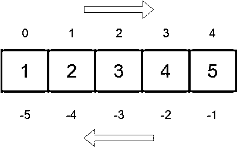
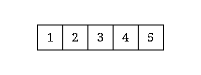

# 反向 Python 列表:超越。反转()和反转()

> 原文：<https://realpython.com/python-reverse-list/>

您是否正在深入研究 Python 列表，并想了解反转它们的不同方法？如果是这样，那么这篇教程就是为你准备的。在这里，您将了解一些 Python 工具和技术，它们在反转列表或以相反的顺序操作列表时非常方便。这些知识将补充和提高你与列表相关的技能，并使你更加精通它们。

**在本教程中，您将学习如何:**

*   使用 **`.reverse()`** 和其他技术将现有列表**反转到位**
*   使用 **`reversed()`** 和**切片**创建现有列表的反向副本
*   使用**迭代**、**理解**和**递归**来创建反向列表
*   **以相反的顺序遍历列表中的**
*   **使用`.sort()`和`sorted()`对你的列表进行逆序排序**

为了从本教程中获得最大收益，了解一下[可迭代](https://docs.python.org/3/glossary.html#term-iterable)、[、`for`循环](https://realpython.com/python-for-loop/)、[列表](https://realpython.com/python-lists-tuples/)、[列表理解](https://realpython.com/list-comprehension-python/)、[生成器表达式](https://realpython.com/introduction-to-python-generators/#building-generators-with-generator-expressions)和[递归](https://realpython.com/python-recursion/)的基础知识会很有帮助。

**免费奖励:** 并学习 Python 3 的基础知识，如使用数据类型、字典、列表和 Python 函数。

## 反转 Python 列表

有时，您需要从最后一个元素开始处理 Python 列表，直到第一个元素——换句话说，以**相反的顺序**。一般来说，逆向处理列表有两个主要挑战:

1.  原地反转列表
2.  创建现有列表的反向副本

为了应对第一个挑战，您可以使用`.reverse()`或者通过索引交换项目的循环。对于第二种，您可以使用 [`reversed()`](https://docs.python.org/dev/library/functions.html?highlight=built#reversed) 或[切片操作](https://docs.python.org/dev/whatsnew/2.3.html#extended-slices)。在接下来的部分中，您将了解在代码中实现这两者的不同方法。

[*Remove ads*](/account/join/)

### 将列表反转到位

像其他的[可变序列](https://docs.python.org/dev/library/stdtypes.html#mutable-sequence-types)类型一样，Python 列表实现了`.reverse()`。当你反转大列表对象时，这个方法反转底层列表[来代替](https://en.wikipedia.org/wiki/In-place_algorithm)以提高内存效率。以下是如何使用`.reverse()`:

>>>

```py
>>> digits = [0, 1, 2, 3, 4, 5, 6, 7, 8, 9]

>>> digits.reverse()
>>> digits
[9, 8, 7, 6, 5, 4, 3, 2, 1, 0]
```

当您在一个已存在的列表上调用`.reverse()`时，该方法会就地反转它。这样，当您再次访问该列表时，您会以相反的顺序获得它。注意`.reverse()`没有[返回](https://realpython.com/python-return-statement/)一个新的列表而是 [`None`](https://realpython.com/null-in-python/) :

>>>

```py
>>> digits = [0, 1, 2, 3, 4, 5, 6, 7, 8, 9]

>>> reversed_digits = digits.reverse()
>>> reversed_digits is None
True
```

试图将`.reverse()`的返回值赋给一个变量是使用这种方法的常见错误。返回`None`的目的是提醒它的用户`.reverse()`是通过[副作用](https://en.wikipedia.org/wiki/Side_effect_(computer_science))来操作的，改变了底层列表。

**注意:**本教程中的大多数例子都使用一列[数字](https://realpython.com/python-numbers/)作为输入。然而，同样的工具和技术适用于任何类型的 Python 对象的列表，例如[字符串](https://realpython.com/python-strings/)的列表。

好吧！真是又快又直！现在，如何手动反转一个列表？一种常见的技术是遍历列表的前半部分，同时在列表的后半部分将每个元素与其镜像元素进行交换。

Python 为从左到右的遍历序列提供了从零开始的正索引。它还允许您使用负索引从右向左导航序列:

[](https://files.realpython.com/media/python-list-indices.35560d02fcd4.png)

这个图显示了你可以通过索引操作符使用`0`或`-5`来访问列表(或序列)的第一个元素，就像分别在`sequence[0]`和`sequence[-5]`中一样。您可以使用这个 Python 特性来就地反转底层序列。

例如，要反转图中表示的列表，您可以循环遍历列表的前半部分，并在第一次迭代中将索引`0`处的元素与其索引`-1`处的镜像交换。然后，您可以将索引`1`处的元素与其索引`-2`处的镜像进行交换，依此类推，直到列表反转。

这是整个过程的示意图:

[](https://files.realpython.com/media/python-reverse-list.220302c8f5a4.gif)

要将这个过程翻译成代码，可以在列表的前半部分使用带有 [`range`](https://realpython.com/python-range/) 对象的 [`for`循环](https://realpython.com/python-for-loop/)，可以通过`len(digits) // 2`获得。然后，您可以使用并行赋值语句来交换元素，如下所示:

>>>

```py
>>> digits = [0, 1, 2, 3, 4, 5, 6, 7, 8, 9]

>>> for i in range(len(digits) // 2):
...     digits[i], digits[-1 - i] = digits[-1 - i], digits[i]
...

>>> digits
[9, 8, 7, 6, 5, 4, 3, 2, 1, 0]
```

这个循环遍历一个从`0`到`len(digits) // 2`的`range`对象。每次迭代都将列表前半部分的一个项目与其后半部分的镜像项目进行交换。索引操作符`[]`中的表达式`-1 - i`保证了对镜像项的访问。你也可以使用表达式`-1 * (i + 1)`来提供相应的镜像索引。

除了利用**索引替换**的上述算法之外，还有一些不同的手动反转列表的方法。例如，您可以这样使用`.pop()`和`.insert()`:

>>>

```py
>>> digits = [0, 1, 2, 3, 4, 5, 6, 7, 8, 9]

>>> for i in range(len(digits)):
...     last_item = digits.pop()
...     digits.insert(i, last_item)
...

>>> digits
[9, 8, 7, 6, 5, 4, 3, 2, 1, 0]
```

在循环中，您调用原始列表上的`.pop()`而没有参数。该调用移除并返回列表中的最后一项，因此您可以将它存储在`last_item`中。然后`.insert()`将`last_item`移动到索引`i`的位置。

例如，第一次迭代从列表的右端移除`9`，并将其存储在`last_item`中。然后在索引`0`处插入`9`。下一次迭代采用`8`并将其移动到索引`1`，依此类推。在循环的最后，你把列表颠倒过来。

[*Remove ads*](/account/join/)

### 创建反向列表

如果您想在 Python 中创建一个现有列表的反向副本，那么您可以使用`reversed()`。使用一个列表作为参数，`reversed()`返回一个迭代器，它以相反的顺序生成条目:

>>>

```py
>>> digits = [0, 1, 2, 3, 4, 5, 6, 7, 8, 9]

>>> reversed_digits = reversed(digits)
>>> reversed_digits
<list_reverseiterator object at 0x7fca9999e790>

>>> list(reversed_digits)
[9, 8, 7, 6, 5, 4, 3, 2, 1, 0]
```

在这个例子中，你用`digits`作为参数调用`reversed()`。然后将结果迭代器存储在`reversed_digits`中。对`list()`的调用消耗迭代器并返回一个新的列表，该列表包含与`digits`相同的条目，但顺序相反。

使用`reversed()`时需要注意的重要一点是，它不会创建输入列表的副本，因此对它的更改会影响结果迭代器:

>>>

```py
>>> fruits = ["apple", "banana", "orange"]

>>> reversed_fruit = reversed(fruits)  # Get the iterator
>>> fruits[-1] = "kiwi"  # Modify the last item
>>> next(reversed_fruit)  # The iterator sees the change
'kiwi'
```

在这个例子中，您调用`reversed()`来获取`fruits`中条目的相应迭代器。然后你修改最后一个水果。这种变化会影响迭代器。您可以通过调用 [`next()`](https://docs.python.org/dev/library/functions.html#next) 获得`reversed_fruit`中的第一个项目来确认。

如果你需要使用`reversed()`获得`fruits`的副本，那么你可以调用`list()`:

>>>

```py
>>> fruits = ["apple", "banana", "orange"]

>>> list(reversed(fruits))
['orange', 'banana', 'apple']
```

正如您已经知道的，对`list()`的调用消耗了调用`reversed()`产生的迭代器。这样，您可以创建一个新列表，作为原始列表的反向副本。

[Python 2.4](https://docs.python.org/dev/whatsnew/2.4.html#pep-322-reverse-iteration) 增加了`reversed()`，一个通用工具，方便**对序列进行反向迭代**，如 [PEP 322](https://www.python.org/dev/peps/pep-0322/) 所述。一般来说，`reversed()`可以接受任何实现 [`.__reversed__()`](https://docs.python.org/dev/reference/datamodel.html#object.__reversed__) 方法或者支持**序列协议**的对象，包括 [`.__len__()`](https://docs.python.org/dev/reference/datamodel.html#object.__len__) 和 [`.__getitem__()`](https://docs.python.org/dev/reference/datamodel.html#object.__getitem__) 特殊方法。所以，`reversed()`不仅限于列表:

>>>

```py
>>> list(reversed(range(10)))
[9, 8, 7, 6, 5, 4, 3, 2, 1, 0]

>>> list(reversed("Python"))
['n', 'o', 'h', 't', 'y', 'P']
```

这里，您传递一个 [`range`](https://realpython.com/python-range/) 对象和一个字符串作为`reversed()`的参数，而不是一个列表。该函数按预期完成了工作，您得到的是输入数据的反向版本。

需要强调的另一个要点是，不能将 [`reversed()`](https://docs.python.org/dev/library/functions.html#reversed) 与任意迭代器一起使用:

>>>

```py
>>> digits = iter([0, 1, 2, 3, 4, 5, 6, 7, 8, 9])

>>> reversed(digits)
Traceback (most recent call last):
  File "<stdin>", line 1, in <module>
TypeError: 'list_iterator' object is not reversible
```

在这个例子中， [`iter()`](https://docs.python.org/dev/library/functions.html#iter) 在你的数字列表上构建一个迭代器。当你在`digits`上调用`reversed()`时，你会得到一个`TypeError`。

迭代器实现了 [`.__next__()`](https://docs.python.org/3/library/stdtypes.html#iterator.__next__) 特殊方法来遍历底层数据。他们还需要实现 [`.__iter__()`](https://docs.python.org/3/library/stdtypes.html#iterator.__iter__) 特殊方法来返回当前迭代器实例。然而，他们并不期望实现`.__reversed__()`或者序列协议。所以，`reversed()`对他们不起作用。如果你需要像这样反转一个迭代器，那么你应该首先使用`list()`把它转换成一个列表。

另一点需要注意的是，不能对无序的可重复项使用`reversed()`:

>>>

```py
>>> digits = {0, 1, 2, 3, 4, 5, 6, 7, 8, 9}

>>> reversed(digits)
Traceback (most recent call last):
  File "<stdin>", line 1, in <module>
TypeError: 'set' object is not reversible
```

在这个例子中，当您尝试将`reversed()`与一个 [`set`](https://realpython.com/python-sets/) 对象一起使用时，您会得到一个`TypeError`。这是因为集合不保持它们的项目有序，所以 Python 不知道如何反转它们。

[*Remove ads*](/account/join/)

### 切片反转列表

从 Python 1.4 开始，切片语法有了第三个参数，叫做`step`。然而，这种语法最初并不适用于内置类型，比如列表、元组和字符串。 [Python 2.3](https://docs.python.org/dev/whatsnew/2.3.html#extended-slices) 将语法扩展到了内置类型，所以你现在可以对它们使用`step`。下面是完整的切片语法:

```py
a_list[start:stop:step]
```

这个语法允许你通过`step`从`start`到`stop − 1`提取`a_list`中的所有项目。第三个偏移量`step`默认为`1`，这就是为什么正常的切片操作从左到右提取项目:

>>>

```py
>>> digits = [0, 1, 2, 3, 4, 5, 6, 7, 8, 9]

>>> digits[1:5]
[1, 2, 3, 4]
```

使用`[1:5]`，您可以获得从索引`1`到索引`5 - 1`的项目。索引等于`stop`的项目是*从不*包含在最终结果中。这个切片返回目标范围内的所有项目，因为`step`默认为`1`。

**注意:**当缺省值(`1`)满足当前需要时，可以省略切片操作符中的第二个冒号(`:`)。

如果您使用不同的`step`，那么切片将跳转与`step`的值一样多的项目:

>>>

```py
>>> digits = [0, 1, 2, 3, 4, 5, 6, 7, 8, 9]

>>> digits[0::2]
[0, 2, 4, 6, 8]

>>> digits[::3]
[0, 3, 6, 9]
```

在第一个例子中，`[0::2]`提取从索引`0`到`digits`结尾的所有项目，每次跳过两个项目。在第二个例子中，切片过程中会跳转到`3`项。如果你不给`start`和`stop`提供值，那么它们分别被设置为`0`和目标序列的长度。

如果您将`step`设置为`-1`，那么您将得到一个项目顺序相反的切片:

>>>

```py
>>> digits = [0, 1, 2, 3, 4, 5, 6, 7, 8, 9]

>>> # Set step to -1
>>> digits[len(digits) - 1::-1]
[9, 8, 7, 6, 5, 4, 3, 2, 1, 0]

>>> digits
[0, 1, 2, 3, 4, 5, 6, 7, 8, 9]
```

由于省略了第二个偏移量，这个切片将列表右端(`len(digits) - 1`)的所有项目返回到左端。这个例子中其余的神奇之处来自于对`step`使用一个值`-1`。当您运行这个技巧时，您会得到一个逆序的原始列表的副本，而不会影响输入数据。

如果您完全依赖隐式偏移量，那么切片语法会变得更短、更清晰、更不容易出错:

>>>

```py
>>> digits = [0, 1, 2, 3, 4, 5, 6, 7, 8, 9]

>>> # Rely on default offset values
>>> digits[::-1]
[9, 8, 7, 6, 5, 4, 3, 2, 1, 0]
```

在这里，你要求 Python 给出完整的列表(`[::-1]`)，但是通过将`step`设置为`-1`从后向前检查所有的条目。这很简洁，但是`reversed()`在执行时间和内存使用方面更有效。它也更具可读性和明确性。所以这些是你在代码中要考虑的问题。

创建现有列表的反向副本的另一个技巧是使用 [`slice()`](https://docs.python.org/dev/library/functions.html#slice) 。这个内置函数的签名如下:

```py
slice(start, stop, step)
```

该函数的工作方式类似于索引运算符。它接受三个与切片操作符中使用的参数含义相似的参数，并返回一个代表由`range(start, stop, step)`返回的一组索引的[切片](https://docs.python.org/3/glossary.html#term-slice)对象。这听起来很复杂，所以这里有一些`slice()`如何工作的例子:

>>>

```py
>>> digits = [0, 1, 2, 3, 4, 5, 6, 7, 8, 9]

>>> slice(0, len(digits))
slice(0, 10, None)

>>> digits[slice(0, len(digits))]
[0, 1, 2, 3, 4, 5, 6, 7, 8, 9]

>>> slice(len(digits) - 1, None, -1)
slice(9, None, -1)

>>> digits[slice(len(digits) - 1, None, -1)]
[9, 8, 7, 6, 5, 4, 3, 2, 1, 0]
```

第一次调用`slice()`相当于`[0:len(digits)]`。第二个呼叫的工作原理与`[len(digits) - 1::-1]`相同。您也可以使用`slice(None, None, -1)`来模拟切片`[::-1]`。在这种情况下，将`None`传递给`start`和`stop`意味着您想要从目标序列的开头到结尾的一个切片。

**注意:**在底层，切片文字创建`slice`对象。因此，当您像在`[::-1]`中一样省略一个偏移量时，它的工作方式就像您在对`slice()`的调用中将`None`传递给相应的偏移量一样。

下面是如何使用`slice()`创建现有列表的反向副本:

>>>

```py
>>> digits = [0, 1, 2, 3, 4, 5, 6, 7, 8, 9]

>>> digits[slice(None, None, -1)]
[9, 8, 7, 6, 5, 4, 3, 2, 1, 0]
```

`slice`对象从`digits`中提取所有项目，从右端开始回到左端，并返回目标列表的反向副本。

[*Remove ads*](/account/join/)

## 手工生成倒序表

到目前为止，您已经看到了一些工具和技术，它们可以就地反转列表或者创建现有列表的反转副本。大多数时候，这些工具和技术是在 Python 中反转列表的好方法。然而，如果你需要手工反转列表，那么理解这个过程背后的逻辑会对你有好处。

在本节中，您将学习如何使用循环、递归和理解来反转 Python 列表。这个想法是获得一个列表，并以相反的顺序创建它的副本。

### 使用循环

用于反转列表的第一个技术涉及到一个`for`循环和一个使用加号(`+`)的列表连接:

>>>

```py
>>> digits = [0, 1, 2, 3, 4, 5, 6, 7, 8, 9]

>>> def reversed_list(a_list):
...     result = []
...     for item in a_list:
...         result = [item] + result
...     return result
...

>>> reversed_list(digits)
[9, 8, 7, 6, 5, 4, 3, 2, 1, 0]
```

`for`循环的每一次迭代都从`a_list`中获取一个后续项，并创建一个新的列表，该列表由串联的`[item]`和`result`产生，它们最初保存一个空列表。新创建的列表被重新分配给`result`。该功能不修改`a_list`。

注意:上面的例子使用了一种浪费的技术，因为它创建了几个列表，只是为了在下一次迭代中扔掉它们。

您还可以利用`.insert()`在循环的帮助下创建反向列表:

>>>

```py
>>> digits = [0, 1, 2, 3, 4, 5, 6, 7, 8, 9]

>>> def reversed_list(a_list):
...     result = []
...     for item in a_list:
...         result.insert(0, item)
...     return result
...

>>> reversed_list(digits)
[9, 8, 7, 6, 5, 4, 3, 2, 1, 0]
```

循环内部对`.insert()`的调用在`result`的`0`索引处插入后续项目。在循环结束时，您会得到一个新的列表，其中包含了逆序排列的`a_list`项。

在上面的例子中使用`.insert()`有一个明显的缺点。众所周知，Python 列表左端的插入操作在执行时间方面效率很低。这是因为 Python 需要将所有的项向后移动一步，以便在第一个位置插入新的项。

### 使用递归

你也可以使用[递归](https://realpython.com/python-thinking-recursively/)来反转你的列表。递归是指你定义一个调用自身的函数。如果你不提供一个产生结果的**基础用例**而不再次调用函数，这将创建一个无限循环。

您需要基本案例来结束递归循环。当涉及到反转列表时，当递归调用到达输入列表的末尾时，将达到基本情况。您还需要定义**递归用例**，它将所有连续的用例减少到基本用例，因此减少到循环的结尾。

下面是如何定义递归函数来返回给定列表的反向副本:

>>>

```py
>>> digits = [0, 1, 2, 3, 4, 5, 6, 7, 8, 9]

>>> def reversed_list(a_list):
...     if len(a_list) == 0:  # Base case
...         return a_list
...     else:
...         # print(a_list)
...         # Recursive case
...         return reversed_list(a_list[1:]) + a_list[:1]
...

>>> reversed_list(digits)
[9, 8, 7, 6, 5, 4, 3, 2, 1, 0]
```

在`reversed_list()`内部，首先检查基本情况，其中输入列表为空，并使函数返回。`else`子句提供了递归情况，这是对`reversed_list()`本身的调用，但是使用了原始列表的一部分`a_list[1:]`。这个切片包含了`a_list`中除第一项之外的所有项，第一项作为一个单项列表(`a_list[:1]`)添加到递归调用的结果中。

**注意:**在递归的情况下，可以用`[a_list[0]]`代替`a_list[:1]`得到类似的结果。

在`else`子句开始的对 [`print()`](https://realpython.com/python-print/) 的注释调用只是一个技巧，旨在展示后续调用如何将输入列表减少到基本情况。继续，取消对该行的注释，看看会发生什么！

[*Remove ads*](/account/join/)

### 使用列表理解

如果你在 Python 中使用列表，那么你可能想考虑使用一个[列表理解](https://realpython.com/list-comprehension-python/)。这个工具在 Python 领域非常流行，因为它代表了处理列表的 Python 方式。

下面是一个如何使用列表理解来创建反向列表的示例:

>>>

```py
>>> digits = [0, 1, 2, 3, 4, 5, 6, 7, 8, 9]
>>> last_index = len(digits) - 1

>>> [digits[i] for i in range(last_index, -1, -1)]
[9, 8, 7, 6, 5, 4, 3, 2, 1, 0]
```

这个列表理解的魔力来自于对`range()`的调用。在这种情况下，`range()`将索引从`len(digits) - 1`返回到`0`。这使得理解循环反向迭代`digits`中的条目，在这个过程中创建新的反向列表。

## 反向遍历列表

到目前为止，您已经学习了如何创建反向列表，以及如何在适当的位置反向现有的列表，或者使用专门设计的工具来完成这项任务，或者使用您自己的手工编码的解决方案。

在日常编程中，您可能会发现以相反的顺序遍历现有的列表和序列，通常被称为**反向迭代**，这是一个相当常见的需求。如果这是你的情况，那么你有几个选择。根据您的具体需求，您可以使用:

*   内置函数`reversed()`
*   `[::]`切片操作符
*   特殊方法`.__reversed__()`

在接下来的几节中，您将了解所有这些选项，以及它们如何帮助您以逆序遍历列表。

### 内置的`reversed()`函数

以逆序遍历列表的第一种方法可能是使用`reversed()`。这个内置函数是专门为支持反向迭代而设计的。使用一个列表作为参数，它返回一个迭代器，以逆序生成输入列表项。

下面是如何使用`reversed()`以逆序遍历列表中的项目:

>>>

```py
>>> digits = [0, 1, 2, 3, 4, 5, 6, 7, 8, 9]

>>> for digit in reversed(digits):
...     print(digit)
...
9
8
7
6
5
4
3
2
1
0
```

在这个例子中首先要注意的是,`for`循环是高度可读的。`reversed()`的名字清楚地表达了它的意图，用微妙的细节传达了这个函数不会产生任何副作用。换句话说，它不会修改输入列表。

该循环在内存使用方面也是高效的，因为`reversed()`返回一个迭代器，该迭代器根据需要产生项目，而不是同时将它们全部存储在内存中。同样，需要注意一个微妙的细节，如果输入列表在迭代过程中发生了变化，那么迭代器会看到变化。

### `[::-1]`切片操作符，

反向迭代的第二种方法是使用您之前看到的扩展切片语法。这种语法无助于提高记忆效率、美观和清晰。尽管如此，它还是提供了一种快速的方法来迭代现有列表的反向副本，而没有受到原始列表中的更改影响的风险。

下面是如何使用`[::-1]`以相反的顺序遍历一个现有列表的副本:

>>>

```py
>>> digits = [0, 1, 2, 3, 4, 5, 6, 7, 8, 9]

>>> for digit in digits[::-1]:
...     print(digit)
...
9
8
7
6
5
4
3
2
1
0
```

当您像在这个例子中一样分割一个列表时，您创建了一个原始列表的反向副本。最初，两个列表都包含对同一组项目的引用。然而，如果你给原始列表中的一个给定条目分配一个新值，就像在`digits[0] = "zero"`中一样，那么引用就会改变，指向新值。这样，输入列表上的更改不会影响拷贝。

**注意:**与扩展切片相比，`reversed()`可读性更强，运行速度更快，使用的内存也更少。但是，它会受到输入列表变化的影响。

您可以利用这种切片安全地修改原始列表，同时以相反的顺序迭代它的旧项目。例如，假设您需要以逆序遍历一系列数字，并用平方值替换每个数字。在这种情况下，您可以这样做:

>>>

```py
>>> numbers = [0, 1, 2, 3, 4, 5, 6, 7, 8, 9]

>>> for i, number in enumerate(numbers[::-1]):
...     numbers[i] = number ** 2
...

>>> # Square values in reverse order
>>> numbers
[81, 64, 49, 36, 25, 16, 9, 4, 1, 0]
```

这里，循环遍历了一个`numbers`的反向副本。对 [`enumerate()`](https://realpython.com/python-enumerate/) 的调用为反向副本中的每个项目提供了从零开始的升序索引。这允许您在迭代过程中修改`numbers`。然后，循环通过用每一项的平方值替换每一项来修改`numbers`。结果，`numbers`最终以相反的顺序包含平方值。

[*Remove ads*](/account/join/)

### `.__reversed__()`特殊方法

Python 列表实现了一个叫做`.__reversed__()`的特殊方法，它支持反向迭代。这个方法提供了`reversed()`背后的逻辑。换句话说，用列表作为参数调用`reversed()`会触发对输入列表上的`.__reversed__()`的隐式调用。

这个特殊的方法以逆序返回当前列表项的迭代器。然而，`.__reversed__()`并不打算直接使用。大多数时候，您将使用它来为自己的类配备反向迭代功能。

例如，假设您想要迭代一系列浮点数。您不能使用`range()`，所以您决定创建自己的类来处理这个特定的用例。你会得到这样一个类:

```py
# float_range.py

class FloatRange:
    def __init__(self, start, stop, step=1.0):
        if start >= stop:
            raise ValueError("Invalid range")
        self.start = start
        self.stop = stop
        self.step = step

    def __iter__(self):
        n = self.start
        while n < self.stop:
            yield n
            n += self.step

    def __reversed__(self):
        n = self.stop - self.step
        while n >= self.start:
            yield n
            n -= self.step
```

这门课并不完美。这只是你的第一个版本。但是，它允许您使用固定的增量值`step`遍历一个浮点数区间。在你的类中， [`.__iter__()`](https://docs.python.org/dev/reference/datamodel.html#object.__iter__) 支持正迭代，`.__reversed__()`支持逆迭代。

要使用`FloatRange`，您可以这样做:

>>>

```py
>>> from float_range import FloatRange

>>> for number in FloatRange(0.0, 5.0, 0.5):
...     print(number)
...
0.0
0.5
1.0
1.5
2.0
2.5
3.0
3.5
4.0
4.5
```

该类支持普通迭代，如前所述，是由`.__iter__()`提供的。现在您可以尝试使用`reversed()`以相反的顺序进行迭代:

>>>

```py
>>> from float_range import FloatRange

>>> for number in reversed(FloatRange(0.0, 5.0, 0.5)):
...     print(number)
...
4.5
4.0
3.5
3.0
2.5
2.0
1.5
1.0
0.5
0.0
```

在这个例子中，`reversed()`依赖于您的`.__reversed__()`实现来提供反向迭代功能。这样，您就有了一个工作的浮点迭代器。

## 反转 Python 列表:概述

到目前为止，您已经学习了很多关于使用不同工具和技术反转列表的知识。下表总结了您已经讲述过的更重要的内容:

| 特征 | `.reverse()` | `reversed()` | `[::-1]` | 环 | 列表排版 | 递归 |
| --- | --- | --- | --- | --- | --- | --- |
| 就地修改列表 | ✔ | -好的 | -好的 | ✔/❌ | -好的 | -好的 |
| 创建列表的副本 | -好的 | -好的 | ✔ | ✔/❌ | ✔ | ✔ |
| 很快 | ✔ | ✔ | -好的 | -好的 | ✔ | -好的 |
| 是通用的 | -好的 | ✔ | ✔ | ✔ | ✔ | ✔ |

快速浏览一下这个摘要，可以让你决定当你在适当的位置反转列表，创建已有列表的反转副本，或者以逆序遍历列表时，使用哪种工具或技术。

## 逆序排序 Python 列表

在 Python 中，另一个有趣的选项是使用`.sort()`和`sorted()`对列表进行逆序排序。为此，您可以将`True`传递给它们各自的`reverse`参数。

**注:**要深入了解如何使用`.sort()`和`sorted()`，请查看[如何在 Python](https://realpython.com/python-sort/) 中使用 sorted()和 sort()。

`.sort()`的目标是对列表中的条目进行排序。排序是就地完成的，所以它不会创建一个新的列表。如果您将`reverse`关键字参数设置为`True`，那么您将得到按降序或逆序排序的列表:

>>>

```py
>>> digits = [0, 5, 7, 3, 4, 9, 1, 6, 3, 8]

>>> digits.sort(reverse=True)
>>> digits
[9, 8, 7, 6, 5, 4, 3, 3, 1, 0]
```

现在你的列表已经完全排序了，而且是逆序排序。当你在处理一些数据时，这是非常方便的，你需要同时对它进行排序和反转。

另一方面，如果您想以逆序遍历一个排序列表，那么您可以使用`sorted()`。这个内置函数返回一个新列表，该列表按顺序包含输入 iterable 的所有项目。如果您将`True`传递给它的`reverse`关键字参数，那么您将得到一个初始列表的反向副本:

>>>

```py
>>> digits = [0, 5, 7, 3, 4, 9, 1, 6, 3, 8]

>>> sorted(digits, reverse=True)
[9, 8, 7, 6, 5, 4, 3, 3, 1, 0]

>>> for digit in sorted(digits, reverse=True):
...     print(digit)
...
9
8
7
6
5
4
3
3
1
0
```

`sorted()`的`reverse`参数允许你以降序而不是升序对可重复项进行排序。所以，如果你需要创建逆序排序列表，那么`sorted()`就是为你准备的。

[*Remove ads*](/account/join/)

## 结论

在 Python 程序员的日常工作中，反转和处理[列表](https://realpython.com/python-lists-tuples/)中的**逆序**可能是一项相当常见的任务。在本教程中，您利用了一些 Python 工具和技术来反转列表并以相反的顺序管理它们。

**在本教程中，您学习了如何:**

*   使用 **`.reverse()`** 和其他技巧将你的清单**颠倒过来**
*   使用 **`reversed()`** 和**切片**来创建列表的反向副本
*   使用**迭代**、**理解**和**递归**来创建反向列表
*   **以相反的顺序遍历列表中的**
*   **使用`.sort()`和`sorted()`对**列表进行逆序排序

所有这些知识都有助于你提高与列表相关的技能。它为您提供了在使用 Python 列表时更加熟练所需的工具。*******