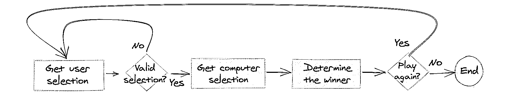

# 制作你的第一个 Python 游戏:石头、剪子、布！

> 原文：<https://realpython.com/python-rock-paper-scissors/>

*立即观看**本教程有真实 Python 团队创建的相关视频课程。和文字教程一起看，加深理解: [**石头剪子布用 Python:一个命令行游戏**](/courses/python-rock-paper-scissors-game/)

游戏编程是学习如何编程的好方法。您将使用许多在现实世界中看到的工具，此外，您还可以玩游戏来测试您的结果！开始 Python 游戏编程之旅的理想游戏是[石头剪刀布](https://en.wikipedia.org/wiki/Rock_paper_scissors)。

**在本教程中，你将学习如何**:

*   编写你自己的**石头剪刀布**游戏
*   取用用户输入的 **`input()`**
*   使用 **`while`循环**连续玩几个游戏
*   用 **`Enum`** 和**函数**清理你的代码
*   用**字典**定义更复杂的规则

**免费奖励:** [掌握 Python 的 5 个想法](https://realpython.com/bonus/python-mastery-course/)，这是一个面向 Python 开发者的免费课程，向您展示将 Python 技能提升到下一个水平所需的路线图和心态。

## 什么是石头剪刀布？

你可能以前玩过石头剪子布。也许你已经用它来决定谁为晚餐买单，或者谁为一个队获得第一选择。

如果你不熟悉，石头剪子布是一个两个或更多玩家玩的[手游](https://en.wikipedia.org/wiki/Hand_game)。参与者说“石头、布、剪刀”，然后同时将手形成石头(拳头)、一张纸(手掌朝下)或一把剪刀(伸出两个手指)的形状。规则很简单:

*   **石头**砸碎剪刀。
*   **纸**盖岩石。
*   **剪刀**剪纸。

现在您已经有了规则，您可以开始考虑如何将它们转换成 Python 代码。

[*Remove ads*](/account/join/)

## 用 Python 玩石头剪子布的单人游戏

使用上面的描述和规则，你可以做一个石头剪刀布的游戏。在您开始之前，您需要[导入](https://realpython.com/python-import/)您将用来模拟计算机选择的模块:

```py
import random
```

厉害！现在你可以使用`random`中不同的工具来随机化电脑在游戏中的动作。现在怎么办？因为您的用户还需要能够选择他们的动作，所以您需要的第一件合乎逻辑的事情是接收用户输入的方法。

### 接受用户输入

在 Python 中，接受用户的输入非常简单。这里的目标是询问用户他们想选择什么作为动作，然后将该选择分配给一个变量:

```py
user_action = input("Enter a choice (rock, paper, scissors): ")
```

这将提示用户输入一个选择，并将其保存到一个变量中以备后用。现在用户已经选择了一个动作，计算机需要决定做什么。

### 让计算机选择

一场石头剪刀布的竞技游戏涉及[策略](https://arstechnica.com/science/2014/05/win-at-rock-paper-scissors-by-knowing-thy-opponent/)。不过，你可以通过让计算机选择一个随机动作来节省时间，而不是试图为此开发一个模型。[随机选择](https://realpython.com/python-random/)是让计算机选择一个[伪随机](https://en.wikipedia.org/wiki/Pseudorandom_number_generator)值的好方法。

您可以使用 **`random.choice()`** 让电脑随机选择动作:

```py
possible_actions = ["rock", "paper", "scissors"]
computer_action = random.choice(possible_actions)
```

这允许从列表中选择随机元素。您还可以[打印](https://realpython.com/python-print/)用户和计算机做出的选择:

```py
print(f"\nYou chose {user_action}, computer chose {computer_action}.\n")
```

打印用户和计算机的操作对用户很有帮助，如果结果不太对劲，它还可以帮助您以后进行调试。

### 确定获胜者

现在两个玩家都做出了选择，你只需要一个方法来决定谁赢。使用`if` … `elif` … `else`方块，您可以比较玩家的选择并确定赢家:

```py
if user_action == computer_action:
    print(f"Both players selected {user_action}. It's a tie!")
elif user_action == "rock":
    if computer_action == "scissors":
        print("Rock smashes scissors! You win!")
    else:
        print("Paper covers rock! You lose.")
elif user_action == "paper":
    if computer_action == "rock":
        print("Paper covers rock! You win!")
    else:
        print("Scissors cuts paper! You lose.")
elif user_action == "scissors":
    if computer_action == "paper":
        print("Scissors cuts paper! You win!")
    else:
        print("Rock smashes scissors! You lose.")
```

通过首先比较平局的情况，你排除了相当多的情况。如果您没有这样做，那么您需要检查`user_action`的每个可能动作，并将其与`computer_action`的每个可能动作进行比较。通过首先检查约束条件，你能够知道计算机选择了什么，只有两个条件检查`computer_action`。

就是这样！综上所述，您的代码现在应该如下所示:

```py
import random

user_action = input("Enter a choice (rock, paper, scissors): ")
possible_actions = ["rock", "paper", "scissors"]
computer_action = random.choice(possible_actions)
print(f"\nYou chose {user_action}, computer chose {computer_action}.\n")

if user_action == computer_action:
    print(f"Both players selected {user_action}. It's a tie!")
elif user_action == "rock":
    if computer_action == "scissors":
        print("Rock smashes scissors! You win!")
    else:
        print("Paper covers rock! You lose.")
elif user_action == "paper":
    if computer_action == "rock":
        print("Paper covers rock! You win!")
    else:
        print("Scissors cuts paper! You lose.")
elif user_action == "scissors":
    if computer_action == "paper":
        print("Scissors cuts paper! You win!")
    else:
        print("Rock smashes scissors! You lose.")
```

现在，您已经编写了代码来接受用户输入，为计算机选择一个随机动作，并决定获胜者！但这只能让你在程序结束运行前玩一个游戏。

[*Remove ads*](/account/join/)

## 连续玩几局

虽然石头剪子布单人游戏超级好玩，但是如果能连续玩几局不是更好吗？**循环**是创建重复事件的好方法。具体来说，你可以用一个 [`while`循环](https://realpython.com/python-while-loop/)来无限玩下去:

```py
import random

while True:
    user_action = input("Enter a choice (rock, paper, scissors): ")
    possible_actions = ["rock", "paper", "scissors"]
    computer_action = random.choice(possible_actions)
    print(f"\nYou chose {user_action}, computer chose {computer_action}.\n")

    if user_action == computer_action:
        print(f"Both players selected {user_action}. It's a tie!")
    elif user_action == "rock":
        if computer_action == "scissors":
            print("Rock smashes scissors! You win!")
        else:
            print("Paper covers rock! You lose.")
    elif user_action == "paper":
        if computer_action == "rock":
            print("Paper covers rock! You win!")
        else:
            print("Scissors cuts paper! You lose.")
    elif user_action == "scissors":
        if computer_action == "paper":
            print("Scissors cuts paper! You win!")
        else:
            print("Rock smashes scissors! You lose.")

 play_again = input("Play again? (y/n): ") if play_again.lower() != "y": break
```

注意上面突出显示的行。重要的是检查用户是否想再玩一次，如果不想就`break`。如果没有这种检查，用户将被迫玩游戏，直到他们使用 `Ctrl` + `C` 或类似的方法终止控制台。

再次弹奏的检查是针对琴弦`"y"`的检查。但是检查像这样特定的东西可能会使用户更难停止游戏。如果用户输入`"yes"`或者`"no"`会怎么样？字符串比较通常很棘手，因为您永远不知道用户可能会输入什么。他们可能全部小写，全部大写，甚至两者混合。

以下是一些不同字符串比较的结果:

>>>

```py
>>> play_again = "yes"
>>> play_again == "n"
False
>>> play_again != "y"
True
```

嗯。这不是你想要的。如果用户进入`"yes"`期望再次玩游戏却被踢出游戏，他们可能会不太高兴。

## 用`enum.IntEnum`形容一个动作

因为字符串比较可能会导致如上所述的问题，所以尽可能避免它们是一个好主意。然而，程序首先要求用户输入一个字符串！用户误输入`"Rock"`或`"rOck"`怎么办？大小写很重要，所以它们不会相等:

>>>

```py
>>> print("rock" == "Rock")
False
```

因为大写很重要，`"r"`和`"R"`不相等。一个可能的解决方案是使用[号](https://realpython.com/python-numbers/)来代替。给每个动作分配一个数字可以省去你一些麻烦:

```py
ROCK_ACTION = 0
PAPER_ACTION = 1
SCISSORS_ACTION = 2
```

这允许您通过分配的编号引用不同的操作。整数没有字符串那样的比较问题，所以这是可行的。现在，您可以让用户输入一个数字，并直接与这些值进行比较:

```py
user_input = input("Enter a choice (rock[0], paper[1], scissors[2]): ")
user_action = int(user_input)
if user_action == ROCK_ACTION:
    # Handle ROCK_ACTION
```

因为`input()`返回一个字符串，所以需要[使用`int()`将返回值转换为整数](https://realpython.com/convert-python-string-to-int/)。然后，您可以将输入与上面的每个操作进行比较。这很好，但是它可能依赖于你正确地命名变量来跟踪它们。更好的方法是使用 **`enum.IntEnum`** 并定义自己的动作类！

使用`enum.IntEnum`允许你创建属性并给它们赋值，类似于上面显示的那些。这有助于通过将动作分组到它们自己的[名称空间](https://realpython.com/python-namespaces-scope/)中来清理代码，并使代码更具表现力:

```py
from enum import IntEnum

class Action(IntEnum):
    Rock = 0
    Paper = 1
    Scissors = 2
```

这创建了一个定制的`Action`，您可以用它来引用您支持的不同类型的动作。它的工作方式是将其中的每个属性赋予您指定的值。

比较仍然很简单，现在它们有了一个有用的类名:

>>>

```py
>>> Action.Rock == Action.Rock
True
```

因为成员值相同，所以比较是相等的。类名也使你想要比较两个动作变得更加明显。

**注意:**要了解关于`enum`的更多信息，请查看[用 Python 的枚举](https://realpython.com/python-enum/)构建常量枚举。

您甚至可以从一个`int`创建一个`Action`:

>>>

```py
>>> Action.Rock == Action(0)
True
>>> Action(0)
<Action.Rock: 0>
```

`Action`查看传入的值并返回适当的`Action`。这很有帮助，因为现在您可以接受用户输入作为一个`int`，并从中创建一个`Action`。再也不用担心拼写了！

[*Remove ads*](/account/join/)

## 你的程序流程图

虽然石头剪子布看起来并不复杂，但仔细考虑玩它的步骤是很重要的，这样你就可以确保你的程序涵盖了所有可能的场景。对于任何项目，即使是小项目，创建期望行为的**流程图**并围绕它实现代码都是有帮助的。使用项目符号列表可以获得类似的结果，但是很难捕捉到像循环和[条件逻辑](https://realpython.com/python-conditional-statements/)这样的东西。

流程图不必过于复杂，甚至不必使用真正的代码。仅仅提前描述期望的行为就可以帮助你在问题发生之前解决问题！

下面是一个流程图，描述了一个石头剪刀布的游戏:

[](https://files.realpython.com/media/rps-flowchart-single-game.214891bb82d6.png)

每个玩家选择一个动作，然后决定赢家。这个流程图对于你编写的单个游戏来说是准确的，但是对于现实生活中的游戏来说不一定准确。在现实生活中，玩家同时选择他们的行动，而不是像流程图建议的那样一次选择一个。

然而，在编码版本中，这是可行的，因为玩家的选择对计算机是隐藏的，而计算机的选择对玩家也是隐藏的。两个玩家可以在不同的时间做出选择，而不会影响游戏的公平性。

流程图可以帮助您尽早发现可能的错误，还可以让您了解是否需要添加更多功能。例如，下面的流程图描述了如何反复玩游戏，直到用户决定停止为止:

[](https://files.realpython.com/media/rps-flowchart-repeated-games.f78a64553925.png)

不用写代码，可以看到第一个流程图没有办法再玩了。这种方法允许您在编程之前处理这些问题，这有助于您创建更整洁、更易于管理的代码！

## 将你的代码分成几个函数

现在，您已经使用流程图概述了程序的流程，您可以尝试组织代码，使其更接近您确定的步骤。一种自然的方法是[为流程图中的每一步创建一个函数](https://realpython.com/defining-your-own-python-function/)。函数是将大块代码分成更小、更易管理的小块的好方法。

您不一定需要为条件检查创建一个函数来再次播放，但是如果您愿意，您可以这样做。如果您还没有导入`random`并定义您的`Action`类，那么您可以从导入开始:

```py
import random
from enum import IntEnum

class Action(IntEnum):
    Rock = 0
    Paper = 1
    Scissors = 2
```

希望这一切看起来都很熟悉！下面是`get_user_selection()`的代码，它不接受任何参数，并且[返回](https://realpython.com/python-return-statement/)一个`Action`:

```py
def get_user_selection():
    user_input = input("Enter a choice (rock[0], paper[1], scissors[2]): ")
    selection = int(user_input)
    action = Action(selection)
    return action
```

请注意您是如何接受用户输入作为一个`int`并返回一个`Action`。但是，对于用户来说，这个长消息有点麻烦。如果你想添加更多的动作，会发生什么？您必须在提示中添加更多的文本。

相反，你可以使用一个[列表理解](https://realpython.com/list-comprehension-python/)来生成输入的一部分:

```py
def get_user_selection():
    choices = [f"{action.name}[{action.value}]" for action in Action]
    choices_str = ", ".join(choices)
    selection = int(input(f"Enter a choice ({choices_str}): "))
    action = Action(selection)
    return action
```

现在，您不再需要担心将来添加或删除动作！通过测试，您可以看到代码是如何提示用户并返回与用户输入值相关联的操作的:

>>>

```py
>>> get_user_selection()
Enter a choice (rock[0], paper[1], scissors[2]): 0
<Action.Rock: 0>
```

现在你需要一个函数来获取计算机的动作。像`get_user_selection()`一样，这个函数应该不带参数并返回一个`Action`。因为`Action`的值的范围是从`0`到`2`，所以您需要在这个范围内生成一个随机数。 **`random.randint()`** 能帮上忙。

`random.randint()`返回指定最小值和最大值之间的随机值。您可以使用`len()`来帮助确定代码中的上限应该是什么:

```py
def get_computer_selection():
    selection = random.randint(0, len(Action) - 1)
    action = Action(selection)
    return action
```

因为`Action`值从`0`开始计数，len()从`1`开始计数，所以做`len(Action) - 1`很重要。

当你测试这个的时候，不会有提示。它将简单地返回与随机数相关联的动作:

>>>

```py
>>> get_computer_selection()
<Action.Scissors: 2>
```

看起来不错！接下来，您需要一种方法来确定获胜者。这个函数有两个参数，用户的动作和计算机的动作。它不需要返回任何东西，因为它只是将结果显示到控制台:

```py
def determine_winner(user_action, computer_action):
    if user_action == computer_action:
        print(f"Both players selected {user_action.name}. It's a tie!")
    elif user_action == Action.Rock:
        if computer_action == Action.Scissors:
            print("Rock smashes scissors! You win!")
        else:
            print("Paper covers rock! You lose.")
    elif user_action == Action.Paper:
        if computer_action == Action.Rock:
            print("Paper covers rock! You win!")
        else:
            print("Scissors cuts paper! You lose.")
    elif user_action == Action.Scissors:
        if computer_action == Action.Paper:
            print("Scissors cuts paper! You win!")
        else:
            print("Rock smashes scissors! You lose.")
```

这与你用来决定赢家的第一次比较非常相似。现在你可以直接比较`Action`类型，而不用担心那些讨厌的字符串！

您甚至可以通过将不同的选项传递给`determine_winner()`并查看打印出的内容来测试这一点:

>>>

```py
>>> determine_winner(Action.Rock, Action.Scissors)
Rock smashes scissors! You win!
```

因为你是从一个数字创建一个动作，如果你的用户试图从`3`创建一个动作会发生什么？请记住，到目前为止您定义的最大数字是`2`:

>>>

```py
>>> Action(3)
ValueError: 3 is not a valid Action
```

哎呦！你不想发生这种事。您可以在流程图的哪里添加一些逻辑来确保用户输入了有效的选择？

在用户做出选择后立即包含检查是有意义的:

[](https://files.realpython.com/media/rps-diagram-with-check.4397a039b248.png)

如果用户输入了一个无效值，那么您重复该步骤以获得用户的选择。对用户选择的唯一真正要求是它在`0`和`2`之间，包括这两个值。如果用户的输入在这个范围之外，那么就会产生一个`ValueError`异常。为了避免向用户显示默认的错误消息，您可以**处理**异常。

**注意:**异常可能很棘手！更多信息，请查看 [Python 异常:简介](https://realpython.com/python-exceptions/)。

既然您已经定义了一些反映流程图中步骤的函数，那么您的游戏逻辑就更加有组织和紧凑了。这是您的`while`循环现在需要包含的所有内容:

```py
while True:
    try:
        user_action = get_user_selection()
    except ValueError as e:
        range_str = f"[0, {len(Action) - 1}]"
        print(f"Invalid selection. Enter a value in range {range_str}")
        continue

    computer_action = get_computer_selection()
    determine_winner(user_action, computer_action)

    play_again = input("Play again? (y/n): ")
    if play_again.lower() != "y":
        break
```

看起来是不是干净多了？请注意，如果用户未能选择有效的范围，那么您将使用`continue`而不是`break`。这使得代码继续循环的下一次迭代，而不是从循环中跳出。

[*Remove ads*](/account/join/)

## 石头剪刀布…蜥蜴史波克

如果你看过《生活大爆炸》[](https://en.wikipedia.org/wiki/The_Big_Bang_Theory)*，那么你可能对石头剪刀布蜥蜴史波克很熟悉。如果不是，那么这里有一个描述游戏和决定赢家的规则的图表:*

*[](https://files.realpython.com/media/rps-lizardspock.88cf9623a6f0.png)

你可以使用上面学到的工具来实现这个游戏。例如，您可以添加到`Action`并为 lizard 和 Spock 创建值。然后你只需要修改`get_user_selection()`和`get_computer_selection()`来合并这些选项。然而，更新`determine_winner()`将会有更多的工作。

您可以使用[字典](https://realpython.com/python-dicts/)来帮助显示动作之间的关系，而不是在代码中添加大量的`if` … `elif` … `else`语句。字典是展示**键值关系**的好方法。在这种情况下，**键**可以是一个动作，比如剪刀，**值**可以是它敲打的动作列表。

那么，对于只有三个选项的你来说，这会是什么样子呢？嗯，每个`Action`只能击败一个其他的`Action`，所以列表将只包含一个项目。下面是您的代码之前的样子:

```py
def determine_winner(user_action, computer_action):
    if user_action == computer_action:
        print(f"Both players selected {user_action.name}. It's a tie!")
    elif user_action == Action.Rock:
        if computer_action == Action.Scissors:
            print("Rock smashes scissors! You win!")
        else:
            print("Paper covers rock! You lose.")
    elif user_action == Action.Paper:
        if computer_action == Action.Rock:
            print("Paper covers rock! You win!")
        else:
            print("Scissors cuts paper! You lose.")
    elif user_action == Action.Scissors:
        if computer_action == Action.Paper:
            print("Scissors cuts paper! You win!")
        else:
            print("Rock smashes scissors! You lose.")
```

现在，不需要与每个`Action`进行比较，您可以有一个描述胜利条件的字典:

```py
def determine_winner(user_action, computer_action):
    victories = {
        Action.Rock: [Action.Scissors],  # Rock beats scissors
        Action.Paper: [Action.Rock],  # Paper beats rock
        Action.Scissors: [Action.Paper]  # Scissors beats paper
    }

    defeats = victories[user_action]
    if user_action == computer_action:
        print(f"Both players selected {user_action.name}. It's a tie!")
    elif computer_action in defeats:
        print(f"{user_action.name} beats {computer_action.name}! You win!")
    else:
        print(f"{computer_action.name} beats {user_action.name}! You lose.")
```

你还是和以前一样，先检查一下领带状况。但是你不是比较每一个`Action`，而是比较`user_input`击败`computer_action`的动作。因为键-值对是一个列表，所以可以使用[成员操作符](https://docs.python.org/3/reference/expressions.html#membership-test-operations) `in`来检查其中是否有元素。

因为您不再使用长的`if` … `elif` … `else`语句，所以为这些新动作添加检查相对来说比较容易。你可以从给`Action`添加蜥蜴和斯波克开始:

```py
class Action(IntEnum):
    Rock = 0
    Paper = 1
    Scissors = 2
    Lizard = 3
    Spock = 4
```

接下来，添加图表中的所有胜利关系。确保在`Action`下面这样做，以便`victories`能够引用`Action`中的所有内容:

```py
victories = {
    Action.Scissors: [Action.Lizard, Action.Paper],
    Action.Paper: [Action.Spock, Action.Rock],
    Action.Rock: [Action.Lizard, Action.Scissors],
    Action.Lizard: [Action.Spock, Action.Paper],
    Action.Spock: [Action.Scissors, Action.Rock]
}
```

注意现在每个`Action`都有一个包含两个元素的列表。在基本的石头剪刀布实现中，只有一个元素。

因为您有意编写了`get_user_selection()`来适应新的动作，所以您不必对代码做任何修改。`get_computer_selection()`也是如此。由于`Action`的长度改变了，随机数的范围也会改变。

看看现在的代码有多短，多容易管理！要查看完整程序的完整代码，请展开下面的框。


```py
import random
from enum import IntEnum

class Action(IntEnum):
    Rock = 0
    Paper = 1
    Scissors = 2
    Lizard = 3
    Spock = 4

victories = {
    Action.Scissors: [Action.Lizard, Action.Paper],
    Action.Paper: [Action.Spock, Action.Rock],
    Action.Rock: [Action.Lizard, Action.Scissors],
    Action.Lizard: [Action.Spock, Action.Paper],
    Action.Spock: [Action.Scissors, Action.Rock]
}

def get_user_selection():
    choices = [f"{action.name}[{action.value}]" for action in Action]
    choices_str = ", ".join(choices)
    selection = int(input(f"Enter a choice ({choices_str}): "))
    action = Action(selection)
    return action

def get_computer_selection():
    selection = random.randint(0, len(Action) - 1)
    action = Action(selection)
    return action

def determine_winner(user_action, computer_action):
    defeats = victories[user_action]
    if user_action == computer_action:
        print(f"Both players selected {user_action.name}. It's a tie!")
    elif computer_action in defeats:
        print(f"{user_action.name} beats {computer_action.name}! You win!")
    else:
        print(f"{computer_action.name} beats {user_action.name}! You lose.")

while True:
    try:
        user_action = get_user_selection()
    except ValueError as e:
        range_str = f"[0, {len(Action) - 1}]"
        print(f"Invalid selection. Enter a value in range {range_str}")
        continue

    computer_action = get_computer_selection()
    determine_winner(user_action, computer_action)

    play_again = input("Play again? (y/n): ")
    if play_again.lower() != "y":
        break
```

就是这样！你已经用 Python 代码实现了石头剪刀布蜥蜴史波克。仔细检查，确保你没有错过任何东西，并给它一个机会。

## 结论

恭喜你！你刚刚完成了你的第一个 Python 游戏！您现在知道如何从头开始创建石头剪刀布，并且能够以最小的努力在游戏中扩展可能的动作数量。

**在本教程中，您学习了如何:**

*   编写你自己的**石头剪刀布**游戏
*   取用用户输入的 **`input()`**
*   使用 **`while`循环**连续玩几个游戏
*   用 **`Enum`** 和**函数**清理你的代码
*   用**字典**描述更复杂的规则

这些工具将继续在您的许多编程冒险中帮助您。如果你有任何问题，请在下面的评论区联系我们。

*立即观看**本教程有真实 Python 团队创建的相关视频课程。和文字教程一起看，加深理解: [**石头剪子布用 Python:一个命令行游戏**](/courses/python-rock-paper-scissors-game/)*******