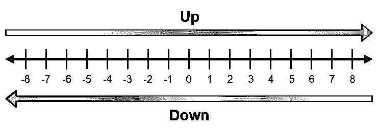

# 如何在 Python 中舍入数字

> 原文：<https://realpython.com/python-rounding/>

现在是大数据时代，每天都有越来越多的企业试图利用他们的数据做出明智的决策。许多企业正在转向 Python 强大的数据科学生态系统来分析他们的数据，正如 [Python 在数据科学领域](https://stackoverflow.blog/2017/09/14/python-growing-quickly/)日益流行所证明的那样。

每个数据科学从业者必须牢记的一件事是数据集可能会有偏差。从有偏见的数据中得出结论会导致代价高昂的错误。

偏见可以通过多种方式渗入数据集。如果你学过一些统计学，你可能对报告偏差、选择偏差和抽样偏差等术语很熟悉。当您处理数字数据时，还有另一种类型的偏差起着重要作用:舍入偏差。

在本文中，您将了解到:

*   为什么四舍五入的方法很重要
*   如何根据各种舍入策略对一个数进行舍入，如何用纯 Python 实现每种方法
*   舍入如何影响数据，以及哪种舍入策略可以最小化这种影响
*   如何对 NumPy 数组和 Pandas 数据帧中的数字进行舍入
*   何时应用不同的舍入策略

***参加测验:****通过我们的交互式“Python 中的舍入数字”测验来测试您的知识。完成后，您将收到一个分数，以便您可以跟踪一段时间内的学习进度:*

*[参加测验](/quizzes/python-rounding/)

这篇文章不是关于计算中的数值精度的论文，尽管我们会简单地触及这个主题。只需要熟悉 Python 的[基础，这里涉及的数学应该让任何熟悉高中代数的人感到舒服。](https://realpython.com/products/python-basics-book/)

我们先来看看 Python 内置的舍入机制。

## Python 内置的`round()`函数

Python 有一个内置的`round()`函数，它接受两个数字参数`n`和`ndigits`，并返回四舍五入为`ndigits`的[数字](https://realpython.com/python-numbers/) `n`。`ndigits`参数缺省为零，因此省略它会得到一个舍入到整数的数字。正如您将看到的，`round()`可能不会像您预期的那样工作。

大多数人被教导的四舍五入方法是这样的:

> 通过将`n`乘以 10ᵖ (10 的 T5 次幂)将`n`中的小数点移动`p`位，将`n`四舍五入到`p`位，得到新的数字`m`。
> 
> 然后看`m`第一位小数的数字`d`。如果`d`小于 5，则将`m`向下舍入到最接近的整数。否则，圆`m`了。
> 
> 最后，通过将`m`除以 10ᵖ.，将小数点向后移`p`位

这是一个简单的算法！例如，舍入到最接近的整数的数字`2.5`是`3`。四舍五入到小数点后一位的数字`1.64`为`1.6`。

现在打开一个解释器会话，并使用 Python 内置的 [`round()`](https://docs.python.org/3/library/functions.html#round) 函数将`2.5`舍入到最接近的整数:

>>>

```py
>>> round(2.5)
2
```

喘息！

`round()`如何处理数字`1.5`？

>>>

```py
>>> round(1.5)
2
```

所以，`round()`将`1.5`向上舍入到`2`，将`2.5`向下舍入到`2`！

在你提出 Python bug tracker 的问题之前，让我向你保证`round(2.5)`应该返回`2`。`round()`如此行事是有充分理由的。

在本文中，您将了解到有比您想象的更多的舍入方法，每种方法都有独特的优点和缺点。根据特定的舍入策略行事——这可能是也可能不是你在特定情况下需要的策略。

你可能会想，“我舍入数字的方式真的有那么大的影响吗？”让我们来看看舍入的影响到底有多极端。

[*Remove ads*](/account/join/)

## 四舍五入能有多大影响？

假设你有一天非常幸运，在地上发现了 100 美元。你没有一次花光所有的钱，而是决定明智地把钱投资到不同的股票上。

股票的价值取决于供给和需求。想买一只股票的人越多，这只股票的价值就越大，反之亦然。在高交易量的股票市场中，特定股票的价值会在一秒一秒的基础上波动。

让我们做一个小实验。我们假设你所购买的股票的总价值每秒钟都会有一个小的随机数字波动，比如在 0.05 美元到-0.05 美元之间。这种波动不一定是只有两位小数的好值。例如，总价值可能一秒钟增加 0.031286 美元，下一秒钟减少 0.028476 美元。

您不想跟踪您的值到第五或第六位小数，所以您决定将第三位小数之后的所有内容都去掉。在舍入行话中，这被称为将数字截断到第三个小数位。这里可能会有一些误差，但是保留三个小数位，这个误差不会很大。对吗？

为了使用 Python 运行我们的实验，让我们从编写一个将数字截断到三位小数的`truncate()`函数开始:

>>>

```py
>>> def truncate(n):
...     return int(n * 1000) / 1000
```

通过将`n`乘以`1000`，首先将数字`n`中的小数点向右移动三位，从而实现`truncate()`功能。这个新数字的整数部分用`int()`取。最后，通过用`n`除以`1000`将小数点左移三位。

接下来，让我们定义模拟的初始参数。你需要两个[变量](https://realpython.com/python-variables/):一个在模拟完成后跟踪你股票的实际价值，另一个在你每一步都截断到三位小数后跟踪你股票的价值。

首先将这些变量初始化为`100`:

>>>

```py
>>> actual_value, truncated_value = 100, 100
```

现在让我们运行 1，000，000 秒的模拟(大约 11.5 天)。对于每一秒，用`random`模块中的`uniform()`函数产生一个在`-0.05`和`0.05`之间的随机值，然后更新`actual`和`truncated`:

>>>

```py
>>> import random
>>> random.seed(100)

>>> for _ in range(1000000):
...     randn = random.uniform(-0.05, 0.05)
...     actual_value = actual_value + randn
...     truncated_value = truncate(truncated_value + randn)
...

>>> actual_value
96.45273913513529

>>> truncated_value
0.239
```

模拟的实质发生在 [`for`循环](https://realpython.com/python-for-loop/)中，该循环遍历`0`和`999,999`之间的`range(1000000)`个数字。每步从`range()`获取的值存储在变量`_`中，我们在这里使用它是因为我们在循环中实际上不需要这个值。

在循环的每一步，使用`random.randn()`生成一个介于`-0.05`和`0.05`之间的新随机数，并将其分配给变量`randn`。通过将`randn`加到`actual_value`来计算您投资的新价值，通过将`randn`加到`truncated_value`然后用`truncate()`截断该价值来计算截断的总额。

通过在运行循环后检查`actual_value`变量可以看到，您只损失了大约 3.55 美元。然而，如果你一直在看`truncated_value`，你会认为你已经失去了几乎所有的钱！

**注意:**在上面的例子中，`random.seed()`函数用于播种伪随机数生成器，这样您就可以重现这里显示的输出。

要了解 Python 中随机性的更多信息，请查看 Real Python 的[在 Python 中生成随机数据(指南)](https://realpython.com/python-random/)。

暂时忽略`round()`的行为不完全符合您的预期，让我们尝试重新运行模拟。这次我们将使用`round()`在每一步舍入到三个小数位，并再次使用`seed()`模拟来获得与之前相同的结果:

>>>

```py
>>> random.seed(100)
>>> actual_value, rounded_value = 100, 100

>>> for _ in range(1000000):
...     randn = random.uniform(-0.05, 0.05)
...     actual_value = actual_value + randn
...     rounded_value = round(rounded_value + randn, 3)
...

>>> actual_value
96.45273913513529

>>> rounded_value
96.258
```

差别真大！

虽然看起来令人震惊，但这个精确的错误在 20 世纪 80 年代初引起了不小的轰动，当时为记录温哥华证券交易所的价值而设计的系统将整体指数值截断到小数点后三位，而不是四舍五入。舍入误差影响了[的选举](http://mate.uprh.edu/~pnegron/notas4061/parliament.htm)，甚至导致了[的死亡](http://www-users.math.umn.edu/~arnold/disasters/patriot.html)。

如何舍入数字很重要，作为一个负责任的开发人员和软件设计人员，您需要知道常见的问题是什么以及如何处理它们。让我们深入研究不同的舍入方法是什么，以及如何在纯 Python 中实现每种方法。

[*Remove ads*](/account/join/)

## 一群方法

有太多的舍入策略，每一种都有优点和缺点。在本节中，您将了解一些最常见的技术，以及它们如何影响您的数据。

### 截断

最简单但也是最粗糙的舍入方法是将数字截断成给定的位数。截断一个数字时，用 0 替换给定位置后的每个数字。以下是一些例子:

| 价值 | 截断到 | 结果 |
| --- | --- | --- |
| Twelve point three four five | 十位 | Ten |
| Twelve point three four five | 某人的位置 | Twelve |
| Twelve point three four five | 十分之一位置 | Twelve point three |
| Twelve point three four five | 百分之一位置 | Twelve point three four |

您已经看到了在[的`truncate()`函数中实现这一点的一种方法，舍入能产生多大的影响？](#how-much-impact-can-rounding-have)一节。在该函数中，输入的数字被截断为三个小数位:

*   将数字乘以`1000`将小数点向右移动三位
*   用`int()`取新数字的整数部分
*   通过除以`1000`将小数位左移三位

您可以通过用数字 10ᵖ ( `10`的 *p* 次方)替换`1000`来概括这一过程，其中 *p* 是要截断的小数位数:

```py
def truncate(n, decimals=0):
    multiplier = 10 ** decimals
    return int(n * multiplier) / multiplier
```

在这个版本的`truncate()`中，第二个参数默认为`0`，因此如果没有第二个参数传递给函数，那么`truncate()`将返回传递给它的任何数字的整数部分。

`truncate()`函数适用于正数和负数:

>>>

```py
>>> truncate(12.5)
12.0

>>> truncate(-5.963, 1)
-5.9

>>> truncate(1.625, 2)
1.62
```

您甚至可以向`decimals`传递一个负数来截断小数点左边的数字:

>>>

```py
>>> truncate(125.6, -1)
120.0

>>> truncate(-1374.25, -3)
-1000.0
```

当你截断一个正数时，你是在向下舍入。同样，截断负数会将该数字向上舍入。从某种意义上来说，截断是根据要舍入的数字的符号对舍入方法的组合。

让我们从向上舍入开始，分别看一下这些舍入方法。

### 四舍五入

我们要看的第二个舍入策略叫做“舍入”这种策略总是将一个数向上舍入到指定的位数。下表总结了这一策略:

| 价值 | 要凑够 | 结果 |
| --- | --- | --- |
| Twelve point three four five | 十位 | Twenty |
| Twelve point three four five | 某人的位置 | Thirteen |
| Twelve point three four five | 十分之一位置 | Twelve point four |
| Twelve point three four five | 百分之一位置 | Twelve point three five |

为了在 Python 中实现“舍入”策略，我们将使用 [`math`模块](https://realpython.com/python-math-module/)中的 [`ceil()`](https://docs.python.org/3/library/math.html#math.ceil) 函数。

`ceil()`函数的名字来源于术语“ceiling”，它在数学中用于描述大于或等于给定数字的最接近的整数。

每个不是整数的数字都位于两个连续的整数之间。例如，数字`1.2`位于`1`和`2`之间的区间。“上限”是区间的两个端点中较大的一个。两个端点中较小的一个称为“地板”这样，`1.2`的天花板就是`2`，而`1.2`的地板就是`1`。

在数学中，一个叫做**上限函数**的特殊函数将每个数字映射到它的上限。为了允许 ceiling 函数接受整数，整数的上限被定义为整数本身。所以数字`2`的上限是`2`。

在 Python 中，`math.ceil()`实现了 ceiling 函数，并且总是返回大于或等于其输入的最接近的整数:

>>>

```py
>>> import math

>>> math.ceil(1.2)
2

>>> math.ceil(2)
2

>>> math.ceil(-0.5)
0
```

注意`-0.5`的天花板是`0`，不是`-1`。这是有意义的，因为`0`是大于或等于`-0.5`的最接近`-0.5`的整数。

让我们编写一个名为`round_up()`的函数来实现“舍入”策略:

```py
def round_up(n, decimals=0):
    multiplier = 10 ** decimals
    return math.ceil(n * multiplier) / multiplier
```

你可能会注意到`round_up()`看起来很像`truncate()`。首先，通过将`n`乘以`10 ** decimals`，将`n`中的小数点向右移动正确的位数。使用`math.ceil()`将该新值向上舍入到最接近的整数，然后通过除以`10 ** decimals`将小数点移回左侧。

随着我们研究更多的舍入方法，这种移动小数点，应用某种舍入方法舍入到整数，然后将小数点移回的模式将会反复出现。毕竟，这是我们人类用来手工舍入数字的心算算法。

让我们来看看`round_up()`对于不同的输入效果如何:

>>>

```py
>>> round_up(1.1)
2.0

>>> round_up(1.23, 1)
1.3

>>> round_up(1.543, 2)
1.55
```

就像`truncate()`一样，可以传递一个负值给`decimals`:

>>>

```py
>>> round_up(22.45, -1)
30.0

>>> round_up(1352, -2)
1400
```

当您将一个负数传递给`decimals`时，`round_up()`的第一个参数中的数字被舍入到小数点左边的正确位数。

猜猜`round_up(-1.5)`会返回什么:

>>>

```py
>>> round_up(-1.5)
-1.0
```

是你所期待的吗？

如果您检查定义`round_up()`时使用的逻辑，特别是`math.ceil()`函数的工作方式，那么`round_up(-1.5)`返回`-1.0`是有意义的。然而，有些人自然希望在舍入数字时围绕零对称，因此如果`1.5`被舍入到`2`，那么`-1.5`应该被舍入到`-2`。

让我们建立一些术语。出于我们的目的，我们将根据下图使用术语“向上取整”和“向下取整”:

[](https://files.realpython.com/media/Rounding_Diagram.5f355efd224f.png)

<figcaption class="figure-caption text-center">Round up to the right and down to the left. (Image: David Amos)</figcaption>

向上舍入总是将数字在数字行上向右舍入，向下舍入总是将数字在数字行上向左舍入。

[*Remove ads*](/account/join/)

### 向下舍入

与“向上舍入”相对应的是“向下舍入”策略，它总是将一个数字向下舍入到指定的位数。以下是说明这种策略的一些例子:

| 价值 | 向下舍入到 | 结果 |
| --- | --- | --- |
| Twelve point three four five | 十位 | Ten |
| Twelve point three four five | 某人的位置 | Twelve |
| Twelve point three four five | 十分之一位置 | Twelve point three |
| Twelve point three four five | 百分之一位置 | Twelve point three four |

为了在 Python 中实现“向下舍入”策略，我们可以遵循用于`trunctate()`和`round_up()`的相同算法。先移小数点，然后四舍五入到整数，最后再把小数点移回来。

在`round_up()`中，我们用`math.ceil()`在移动小数点后向上舍入到数字的上限。但是，对于“向下舍入”策略，我们需要在移动小数点后舍入到数字的下限。

幸运的是， [`math`](https://docs.python.org/3/library/math.html) 模块有一个 [`floor()`](https://docs.python.org/3/library/math.html#math.floor) 函数，返回其输入的楼层:

>>>

```py
>>> math.floor(1.2)
1

>>> math.floor(-0.5)
-1
```

下面是`round_down()`的定义:

```py
def round_down(n, decimals=0):
    multiplier = 10 ** decimals
    return math.floor(n * multiplier) / multiplier
```

那看起来就像`round_up()`，除了`math.ceil()`被替换成了`math.floor()`。

您可以在几个不同的值上测试`round_down()`:

>>>

```py
>>> round_down(1.5)
1

>>> round_down(1.37, 1)
1.3

>>> round_down(-0.5)
-1
```

`round_up()`和`round_down()`的影响可能相当极端。通过向上或向下舍入大型数据集中的数字，您可能会降低大量精度，并极大地改变根据数据进行的计算。

在我们讨论任何更多的舍入策略之前，让我们停下来花点时间来讨论舍入如何使您的数据有偏差。

### 插曲:舍入偏差

您现在已经看到了三种舍入方法:`truncate()`、`round_up()`和`round_down()`。当涉及到为给定的数字保持合理的精度时，这三种技术都相当粗糙。

`truncate()`和`round_up()`以及`round_down()`之间有一个重要的区别，这突出了舍入的一个重要方面:关于零的对称性。

回想一下`round_up()`并不是围绕零对称的。用数学术语来说，如果对于 x 的任意值，f(x) + f(-x) = 0，则函数 f(x)关于零是对称的。比如`round_up(1.5)`返回`2`，但是`round_up(-1.5)`返回`-1`。`round_down()`函数也不是关于 0 对称的。

另一方面，`truncate()`函数*是围绕零对称的*。这是因为，将小数点右移后，`truncate()`会砍掉剩余的数字。当初始值为正时，这相当于将数字向下舍入。负数向上取整。于是，`truncate(1.5)`返回`1`，`truncate(-1.5)`返回`-1`。

对称性的概念引入了**舍入偏差**的概念，它描述了舍入如何影响数据集中的数字数据。

“向上舍入”策略有一个朝向正无穷大偏差的**舍入，因为值总是在正无穷大的方向上向上舍入。同样，“向下舍入”策略有一个朝向负无穷大偏差的**舍入**。**

“截断”策略表现为正值偏向负无穷大，负值偏向正无穷大。一般来说，具有这种行为的舍入函数被称为具有朝向零偏差的**舍入。**

让我们看看这在实践中是如何工作的。考虑下面的浮动列表:

>>>

```py
>>> data = [1.25, -2.67, 0.43, -1.79, 4.32, -8.19]
```

让我们使用 [`statistics.mean()`](https://docs.python.org/3/library/statistics.html#statistics.mean) 函数计算`data`中值的平均值:

>>>

```py
>>> import statistics

>>> statistics.mean(data)
-1.1083333333333332
```

现在应用[列表理解](https://dbader.org/blog/list-dict-set-comprehensions-in-python)中的`round_up()`、`round_down()`和`truncate()`中的每一个，将`data`中的每一个数字四舍五入到小数点后一位，并计算新的平均值:

>>>

```py
>>> ru_data = [round_up(n, 1) for n in data]
>>> ru_data
[1.3, -2.6, 0.5, -1.7, 4.4, -8.1]
>>> statistics.mean(ru_data)
-1.0333333333333332

>>> rd_data = [round_down(n, 1) for n in data]
>>> statistics.mean(rd_data)
-1.1333333333333333

>>> tr_data = [truncate(n, 1) for n in data]
>>> statistics.mean(tr_data)
-1.0833333333333333
```

`data`中的每一个数字四舍五入后，新的平均值约为`-1.033`，大于实际平均值约为`1.108`。向下舍入将平均值向下移动到大约`-1.133`。截断值的平均值约为`-1.08`，最接近实际平均值。

这个例子*并不意味着当你需要在尽可能保持平均值的同时舍入单个值时，你应该总是截断。`data`列表包含相同数量的正值和负值。`truncate()`函数的行为就像所有正值列表中的`round_up()`,以及所有负值列表中的`round_down()`。*

这个例子说明了舍入偏差对从已舍入的数据中计算出的值的影响。当从四舍五入的数据中得出结论时，你需要记住这些影响。

通常，在舍入时，您感兴趣的是以某个指定的精度舍入到最接近的数字，而不仅仅是向上或向下舍入。

例如，如果有人让你将数字`1.23`和`1.28`四舍五入到小数点后一位，你可能会迅速用`1.2`和`1.3`来回答。`truncate()`、`round_up()`和`round_down()`功能不做这样的事情。

数字`1.25`呢？你可能会立即想到将这个四舍五入到`1.3`，但实际上，`1.25`与`1.2`和`1.3`是等距的。从某种意义上说，`1.2`和`1.3`都是最接近`1.25`的数字，具有单个小数位的精度。数字`1.25`被称为相对于`1.2`和`1.3`的**结**。在这种情况下，你必须分配一个加时赛。

大多数人被教导打破平局的方法是四舍五入到两个可能数字中较大的一个。

[*Remove ads*](/account/join/)

### 四舍五入

“向上舍入一半”策略以指定的精度将每个数字舍入到最接近的数字，并通过向上舍入来打破平局。以下是一些例子:

| 价值 | 将一半向上舍入到 | 结果 |
| --- | --- | --- |
| Thirteen point eight two five | 十位 | Ten |
| Thirteen point eight two five | 某人的位置 | Fourteen |
| Thirteen point eight two five | 十分之一位置 | Thirteen point eight |
| Thirteen point eight two five | 百分之一位置 | Thirteen point eight three |

要在 Python 中实现“四舍五入”策略，首先要像往常一样将小数点向右移动所需的位数。不过，在这一点上，您需要一种方法来确定小数点后的数字是小于还是大于或等于`5`。

一种方法是将`0.5`加到移位后的值上，然后用`math.floor()`向下舍入。这是因为:

*   如果移位值的第一个小数位小于 5，那么加上`0.5`不会改变移位值的整数部分，所以底数等于整数部分。

*   如果小数点后第一位大于或等于`5`，那么加上`0.5`将使移位值的整数部分增加`1`，所以下限等于这个更大的整数。

这是 Python 中的样子:

```py
def round_half_up(n, decimals=0):
    multiplier = 10 ** decimals
    return math.floor(n*multiplier + 0.5) / multiplier
```

注意`round_half_up()`看起来很像`round_down()`。这可能有点违背直觉，但在内部`round_half_up()`只向下舍入。诀窍是在移动小数点后加上`0.5`，这样向下舍入的结果就与预期值相匹配。

让我们在几个值上测试`round_half_up()`,看看它是否有效:

>>>

```py
>>> round_half_up(1.23, 1)
1.2

>>> round_half_up(1.28, 1)
1.3

>>> round_half_up(1.25, 1)
1.3
```

因为`round_half_up()`总是通过舍入到两个可能值中的较大值来打破平局，所以负值如`-1.5`舍入到`-1`，而不是`-2`:

>>>

```py
>>> round_half_up(-1.5)
-1.0

>>> round_half_up(-1.25, 1)
-1.2
```

太好了！现在您终于可以得到内置`round()`函数拒绝给您的结果了:

>>>

```py
>>> round_half_up(2.5)
3.0
```

不过，在你兴奋之前，让我们看看当你尝试将`-1.225`四舍五入到`2`位小数时会发生什么:

>>>

```py
>>> round_half_up(-1.225, 2)
-1.23
```

等等。我们刚刚讨论了领带如何四舍五入到两个可能值中的较大值。`-1.225`正好在`-1.22`和`-1.23`的中间。由于`-1.22`是这两个中较大的一个，`round_half_up(-1.225, 2)`应该返回`-1.22`。但是相反，我们得到了`-1.23`。

`round_half_up()`函数有 bug 吗？

当`round_half_up()`将`-1.225`四舍五入到小数点后两位时，它做的第一件事就是将`-1.225`乘以`100`。让我们确保这按预期工作:

>>>

```py
>>> -1.225 * 100
-122.50000000000001
```

嗯…那不对！但它确实解释了为什么`round_half_up(-1.225, 2)`返回-1.23。让我们一步一步地继续`round_half_up()`算法，利用 REPL 中的`_`来回忆每一步最后输出的值:

>>>

```py
>>> _ + 0.5
-122.00000000000001

>>> math.floor(_)
-123

>>> _ / 100
-1.23
```

即使`-122.00000000000001`真的很接近`-122`，但小于或等于它的最近的整数是`-123`。当小数点向左回移时，最终值为`-1.23`。

好了，现在你知道了`round_half_up(-1.225, 2)`即使没有逻辑错误也是如何返回`-1.23`的，但是为什么 Python 会说`-1.225 * 100`是`-122.50000000000001`？Python 有 bug 吗？

**旁白:**在 Python 解释器会话中，键入以下内容:

>>>

```py
>>> 0.1 + 0.1 + 0.1
0.30000000000000004
```

第一次看到这个可能会很震惊，但这是一个典型的浮点表示错误的例子。与 Python 无关。这个错误与机器在内存中存储浮点数的方式有关。

大多数现代计算机将浮点数存储为二进制小数，精度为 53 位。只有可以用 53 位表示的有限二进制/十进制数才存储为精确值。不是每个数字都有有限的二进制十进制表示。

比如十进制数`0.1`有一个有限的十进制表示，但是无限的二进制表示。就像分数 1/3 只能用十进制表示为无限重复的十进制`0.333...`，分数`1/10`只能用二进制表示为无限重复的十进制`0.0001100110011...`。

具有无限二进制表示形式的值被舍入为近似值以存储在内存中。大多数机器用于舍入的方法是根据 IEEE-754 标准[确定的，该标准规定舍入到最接近的可表示的二进制分数。](https://en.wikipedia.org/wiki/IEEE_754)

Python 文档中有一个名为[浮点运算:问题和限制](https://docs.python.org/3/tutorial/floatingpoint.html)的部分，其中提到了数字 0.1:

> 在大多数机器上，如果 Python 要打印为`0.1`存储的二进制近似值的真实十进制值，它必须显示
> 
> >>>
> 
> ```py
> `>>> 0.1
> 0.1000000000000000055511151231257827021181583404541015625` 
> ```
> 
> 这比大多数人认为有用的数字要多，所以 Python 通过显示一个舍入值来保持数字的可管理性
> 
> >>>
> 
> ```py
> `>>> 1 / 10
> 0.1` 
> ```
> 
> 请记住，即使打印的结果看起来像`1/10`的精确值，实际存储的值是最接近的可表示的二进制分数。([来源](https://docs.python.org/3/tutorial/floatingpoint.html))

有关浮点运算的更深入的论文，请查阅 David Goldberg 的文章[每个计算机科学家都应该知道的浮点运算知识](http://perso.ens-lyon.fr/jean-michel.muller/goldberg.pdf)，该文章最初发表在 1991 年 3 月的期刊 *ACM 计算调查*第 23 卷第 1 期。

Python 说`-1.225 * 100`是`-122.50000000000001`的事实是浮点表示错误的假象。你可能会问自己，“好吧，但是有办法解决这个问题吗？”问自己一个更好的问题是“我*需要*来解决这个问题吗？”

浮点数没有精确的精度，因此**不应该在精度至关重要的情况下使用**。对于需要精确精度的应用程序，可以使用 Python 的`decimal`模块中的`Decimal`类。你将在下面了解更多关于`Decimal`类的内容。

如果您已经确定 Python 的标准`float`类对于您的应用程序来说已经足够了，那么由于浮点表示错误而导致的`round_half_up()`中的一些偶然错误不应该成为问题。

现在您已经了解了机器如何在内存中舍入数字，让我们通过查看另一种打破平局的方法来继续讨论舍入策略。

[*Remove ads*](/account/join/)

### 向下舍入一半

“向下舍入一半”策略以期望的精度舍入到最接近的数字，就像“向上舍入一半”方法一样，只是它通过舍入到两个数字中较小的一个来打破平局。以下是一些例子:

| 价值 | 向下舍入一半到 | 结果 |
| --- | --- | --- |
| Thirteen point eight two five | 十位 | Ten |
| Thirteen point eight two five | 某人的位置 | Fourteen |
| Thirteen point eight two five | 十分之一位置 | Thirteen point eight |
| Thirteen point eight two five | 百分之一位置 | Thirteen point eight two |

通过用`math.ceil()`替换`round_half_up()`函数中的`math.floor()`，并减去`0.5`而不是相加，可以在 Python 中实现“四舍五入”策略:

```py
def round_half_down(n, decimals=0):
    multiplier = 10 ** decimals
    return math.ceil(n*multiplier - 0.5) / multiplier
```

让我们对照几个测试用例来检查`round_half_down()`:

>>>

```py
>>> round_half_down(1.5)
1.0

>>> round_half_down(-1.5)
-2.0

>>> round_half_down(2.25, 1)
2.2
```

`round_half_up()`和`round_half_down()`一般都没有偏差*。然而，用很多关系来舍入数据确实会引入偏差。举个极端的例子，考虑下面的数字列表:*

*>>>

```py
>>> data = [-2.15, 1.45, 4.35, -12.75]
```

让我们计算这些数字的平均值:

>>>

```py
>>> statistics.mean(data)
-2.275
```

接下来，用`round_half_up()`和`round_half_down()`计算四舍五入到小数点后一位的数据的平均值:

>>>

```py
>>> rhu_data = [round_half_up(n, 1) for n in data]
>>> statistics.mean(rhu_data)
-2.2249999999999996

>>> rhd_data = [round_half_down(n, 1) for n in data]
>>> statistics.mean(rhd_data)
-2.325
```

`data`中的每个数字都四舍五入到小数点后一位。`round_half_up()`函数引入一个朝向正无穷大的舍入偏差，`round_half_down()`引入一个朝向负无穷大的舍入偏差。

我们将讨论的其余舍入策略都试图以不同的方式减轻这些偏差。

### 从零开始四舍五入一半

如果你仔细检查`round_half_up()`和`round_half_down()`，你会注意到这两个函数都不是关于零对称的:

>>>

```py
>>> round_half_up(1.5)
2.0

>>> round_half_up(-1.5)
-1.0

>>> round_half_down(1.5)
1.0

>>> round_half_down(-1.5)
-2.0
```

引入对称性的一种方法是总是将领带从零开始四舍五入。下表说明了这是如何工作的:

| 价值 | 从零开始四舍五入一半到 | 结果 |
| --- | --- | --- |
| Fifteen point two five | 十位 | Twenty |
| Fifteen point two five | 某人的位置 | Fifteen |
| Fifteen point two five | 十分之一位置 | Fifteen point three |
| -15.25 | 十位 | -20 |
| -15.25 | 某人的位置 | -15 |
| -15.25 | 十分之一位置 | -15.3 |

要对一个数字`n`执行“四舍五入”策略，您可以像往常一样将小数点向右移动给定的位数。然后你会看到这个新数字的小数点右边的数字`d`。此时，有四种情况需要考虑:

1.  如果`n`为正而`d >= 5`为负，则向上取整
2.  如果`n`为正而`d < 5`为负，则向下舍入
3.  如果`n`为负，而`d >= 5`为负，则向下舍入
4.  如果`n`为负而`d < 5`为正，则向上取整

在根据上述四个规则之一进行舍入后，您可以将小数位移回左侧。

给定一个数字`n`和一个值`decimals`，您可以通过使用`round_half_up()`和`round_half_down()`在 Python 中实现它:

```py
if n >= 0:
    rounded = round_half_up(n, decimals)
else:
    rounded = round_half_down(n, decimals)
```

这很简单，但实际上还有更简单的方法！

如果先用 Python 内置的 [`abs()`](https://realpython.com/python-absolute-value/#using-the-built-in-abs-function-with-numbers) 函数取`n`的[绝对值](https://realpython.com/python-absolute-value)，用`round_half_up()`取整数即可。然后你需要做的就是给四舍五入后的数字和`n`一样的符号。一种方法是使用 [`math.copysign()`](https://docs.python.org/3/library/math.html#math.copysign) 功能。

`math.copysign()`取两个数`a`和`b`，返回带有`b`符号的`a`:

>>>

```py
>>> math.copysign(1, -2)
-1.0
```

注意，`math.copysign()`返回一个`float`，即使它的两个参数都是整数。

使用`abs()`、`round_half_up()`和`math.copysign()`，你可以在仅仅两行 Python 代码中实现“从零四舍五入一半”的策略:

```py
def round_half_away_from_zero(n, decimals=0):
    rounded_abs = round_half_up(abs(n), decimals)
    return math.copysign(rounded_abs, n)
```

在`round_half_away_from_zero()`中，使用`round_half_up()`将`n`的绝对值四舍五入到`decimals`小数位，并将该结果赋给变量`rounded_abs`。然后使用`math.copysign()`将`n`的原始符号应用于`rounded_abs`，该函数返回具有正确符号的最终值。

在几个不同的值上检查`round_half_away_from_zero()`,显示该函数的行为符合预期:

>>>

```py
>>> round_half_away_from_zero(1.5)
2.0

>>> round_half_away_from_zero(-1.5)
-2.0

>>> round_half_away_from_zero(-12.75, 1)
-12.8
```

`round_half_away_from_zero()`函数对数字进行舍入，就像大多数人在日常生活中对数字进行舍入一样。除了是迄今为止最熟悉的舍入函数之外，`round_half_away_from_zero()`还在正负关系数量相等的数据集中很好地消除了舍入偏差。

让我们检查一下`round_half_away_from_zero()`在上一节的示例中如何减轻舍入偏差:

>>>

```py
>>> data = [-2.15, 1.45, 4.35, -12.75] 
>>> statistics.mean(data)
-2.275

>>> rhaz_data = [round_half_away_from_zero(n, 1) for n in data]
>>> statistics.mean(rhaz_data)
-2.2750000000000004
```

当您用`round_half_away_from_zero()`将`data`中的每个数字四舍五入到小数点后一位时，`data`中数字的平均值几乎完全保留！

然而，当您对数据集中的每个数字进行舍入时，`round_half_away_from_zero()`将会表现出舍入偏差，这些数据仅具有正关系、负关系或者一个符号的关系多于另一个符号的关系。只有当数据集中有相似数量的正负联系时，偏差才能得到很好的缓解。

你如何处理积极和消极联系的数量相差很大的情况？这个问题的答案让我们兜了一圈回到了本文开头那个欺骗我们的函数:Python 内置的 [`round()`](https://docs.python.org/3/library/functions.html#round) 函数。

[*Remove ads*](/account/join/)

### 四舍五入成偶数

在对数据集中的值进行舍入时，减轻舍入偏差的一种方法是以所需的精度将关系舍入到最接近的偶数。以下是如何做到这一点的一些例子:

| 价值 | 四舍五入到偶数 | 结果 |
| --- | --- | --- |
| Fifteen point two five five | 十位 | Twenty |
| Fifteen point two five five | 某人的位置 | Fifteen |
| Fifteen point two five five | 十分之一位置 | Fifteen point three |
| Fifteen point two five five | 百分之一位置 | Fifteen point two six |

“四舍五入策略”是 Python 内置的`round()`函数使用的策略，也是 IEEE-754 标准中的默认四舍五入规则[。此策略在假设数据集中向下舍入或向上舍入的概率相等的情况下有效。在实践中，通常是这样。](https://en.wikipedia.org/wiki/IEEE_754#Rounding_rules)

现在你知道为什么`round(2.5)`返回`2`了。这不是一个错误。这是基于可靠建议的有意识的设计决策。

为了向自己证明`round()`确实能舍入到偶数，请尝试几个不同的值:

>>>

```py
>>> round(4.5)
4

>>> round(3.5)
4

>>> round(1.75, 1)
1.8

>>> round(1.65, 1)
1.6
```

`round()`函数几乎没有偏差，但它并不完美。例如，如果数据集中的大部分连接向上舍入到偶数而不是向下舍入，仍会引入舍入偏差。减轻偏差的策略甚至比“四舍五入”更好[确实存在](https://en.wikipedia.org/wiki/Rounding#Random-based_rounding_of_an_integer)，但它们有些晦涩，只有在极端情况下才有必要。

最后，由于浮点表示错误，`round()`遇到了与您在`round_half_up()`中看到的相同的问题:

>>>

```py
>>> # Expected value: 2.68
>>> round(2.675, 2)
2.67
```

如果浮点精度对您的应用程序来说足够了，您就不应该担心这些偶然的错误。

当精度*是*至高无上时，你应该使用 Python 的`Decimal`类。

## `Decimal`类

Python 的[十进制](https://docs.python.org/3/library/decimal.html)模块是这种语言的“内置电池”特性之一，如果你是 Python 新手，你可能不会意识到。`decimal`模块的指导原则可在文档中找到:

> “Decimal”基于一种浮点模型，这种模型是以人为本设计的，并且必然有一个最高的指导原则——计算机必须提供一种与人们在学校学习的算法相同的算法。–摘自十进制算术规范。([来源](https://docs.python.org/3/library/decimal.html))

`decimal`模块的优势包括:

*   **精确的十进制表示** : `0.1`实际上是*`0.1`，`0.1 + 0.1 + 0.1 - 0.3`返回`0`，如你所料。*
**   **保留有效数字**:将`1.20`和`2.50`相加，结果为`3.70`，保留尾随零表示有效。*   **用户可更改的精度**:`decimal`模块的默认精度是 28 位，但是用户可以根据手头的问题更改该值。

让我们探索一下在`decimal`模块中舍入是如何工作的。首先在 Python REPL 中输入以下内容:

>>>

```py
>>> import decimal
>>> decimal.getcontext()
Context(
 prec=28,
 rounding=ROUND_HALF_EVEN,
 Emin=-999999,
 Emax=999999,
 capitals=1,
 clamp=0,
 flags=[],
 traps=[
 InvalidOperation,
 DivisionByZero,
 Overflow
 ]
)
```

`decimal.getcontext()`返回一个代表`decimal`模块默认上下文的`Context`对象。上下文包括默认精度和默认舍入策略等。

正如你在上面的例子中看到的，`decimal`模块的默认舍入策略是`ROUND_HALF_EVEN`。这与内置的`round()`函数一致，应该是大多数用途的首选舍入策略。

让我们使用`decimal`模块的`Decimal`类来声明一个数字。为此，通过传递包含所需值的`string`来创建一个新的`Decimal`实例:

>>>

```py
>>> from decimal import Decimal
>>> Decimal("0.1")
Decimal('0.1')
```

**注意:**可以从浮点数创建一个`Decimal`实例，但是这样做会立刻引入浮点表示错误。例如，看看当您从浮点数`0.1`创建一个`Decimal`实例时会发生什么:

>>>

```py
>>> Decimal(0.1)
Decimal('0.1000000000000000055511151231257827021181583404541015625')
```

为了保持精确的精度，您必须从包含您需要的十进制数的字符串中创建`Decimal`实例。

只是为了好玩，让我们测试一下断言`Decimal`保持精确的十进制表示:

>>>

```py
>>> Decimal('0.1') + Decimal('0.1') + Decimal('0.1')
Decimal('0.3')
```

啊啊。那是令人满意的，不是吗？

用`.quantize()`方法对`Decimal`进行舍入:

>>>

```py
>>> Decimal("1.65").quantize(Decimal("1.0"))
Decimal('1.6')
```

好吧，这可能看起来有点古怪，让我们来分析一下。`.quantize()`中的`Decimal("1.0")`参数决定了舍入数字的小数位数。因为`1.0`有一个小数位，所以数字`1.65`四舍五入到一个小数位。默认的舍入策略是“将一半舍入到一半”，所以结果是`1.6`。

回想一下`round()`函数，它也使用了“四舍五入策略”，未能正确地将`2.675`四舍五入到两位小数。`round(2.675, 2)`返回的不是`2.68`，而是`2.67`。得益于`decimal`模块的精确十进制表示，您将不会遇到`Decimal`类的这个问题:

>>>

```py
>>> Decimal("2.675").quantize(Decimal("1.00"))
Decimal('2.68')
```

`decimal`模块的另一个好处是执行算术运算后的舍入被自动处理，有效数字被保留。为了查看实际效果，让我们将默认精度从 28 位改为两位，然后添加数字`1.23`和`2.32`:

>>>

```py
>>> decimal.getcontext().prec = 2
>>> Decimal("1.23") + Decimal("2.32")
Decimal('3.6')
```

要改变精度，可以调用`decimal.getcontext()`并设置`.prec`属性。如果在函数调用中设置属性对您来说很奇怪，您可以这样做，因为`.getcontext()`返回一个特殊的`Context`对象，它代表当前的内部上下文，包含了`decimal`模块使用的默认参数。

`1.23`加上`2.32`的精确值是`3.55`。由于精度现在是两位数，并且舍入策略被设置为默认值“舍入一半到偶数”，值`3.55`被自动舍入到`3.6`。

要更改默认的舍入策略，您可以将`decimal.getcontect().rounding`属性设置为几个[标志](https://docs.python.org/3/library/decimal.html#rounding-modes)中的任何一个。下表总结了这些标志及其实施的舍入策略:

| 旗 | 舍入策略 |
| --- | --- |
| `decimal.ROUND_CEILING` | 舍入 |
| `decimal.ROUND_FLOOR` | 舍入 |
| `decimal.ROUND_DOWN` | 截断 |
| `decimal.ROUND_UP` | 从零开始舍入 |
| `decimal.ROUND_HALF_UP` | 从零开始四舍五入一半 |
| `decimal.ROUND_HALF_DOWN` | 向零舍入一半 |
| `decimal.ROUND_HALF_EVEN` | 四舍五入到偶数 |
| `decimal.ROUND_05UP` | 向上舍入和向零舍入 |

首先要注意的是,`decimal`模块使用的命名方案与我们在本文前面同意的不同。例如，`decimal.ROUND_UP`实现了“舍零取整”策略，实际上是将负数向下取整。

其次，表中提到的一些舍入策略可能看起来很陌生，因为我们没有讨论过它们。您已经看到了`decimal.ROUND_HALF_EVEN`是如何工作的，所以让我们来看看其他的每一个是如何工作的。

`decimal.ROUND_CEILING`策略就像我们之前定义的`round_up()`函数一样工作:

>>>

```py
>>> decimal.getcontext().rounding = decimal.ROUND_CEILING

>>> Decimal("1.32").quantize(Decimal("1.0"))
Decimal('1.4')

>>> Decimal("-1.32").quantize(Decimal("1.0"))
Decimal('-1.3')
```

请注意，`decimal.ROUND_CEILING`的结果不是关于零对称的。

`decimal.ROUND_FLOOR`策略就像我们的`round_down()`函数一样工作:

>>>

```py
>>> decimal.getcontext().rounding = decimal.ROUND_FLOOR

>>> Decimal("1.32").quantize(Decimal("1.0"))
Decimal('1.3')

>>> Decimal("-1.32").quantize(Decimal("1.0"))
Decimal('-1.4')
```

和`decimal.ROUND_CEILING`一样，`decimal.ROUND_FLOOR`策略也不是围绕零对称的。

`decimal.ROUND_DOWN`和`decimal.ROUND_UP`策略有一些欺骗性的名字。`ROUND_DOWN`和`ROUND_UP`都是关于零对称的；

>>>

```py
>>> decimal.getcontext().rounding = decimal.ROUND_DOWN

>>> Decimal("1.32").quantize(Decimal("1.0"))
Decimal('1.3')

>>> Decimal("-1.32").quantize(Decimal("1.0"))
Decimal('-1.3')

>>> decimal.getcontext().rounding = decimal.ROUND_UP

>>> Decimal("1.32").quantize(Decimal("1.0"))
Decimal('1.4')

>>> Decimal("-1.32").quantize(Decimal("1.0"))
Decimal('-1.4')
```

`decimal.ROUND_DOWN`策略将数字四舍五入为零，就像`truncate()`函数一样。另一方面，`decimal.ROUND_UP`将所有值从零开始四舍五入。这与我们在文章前面同意的术语明显不同，所以在使用`decimal`模块时要记住这一点。

在`decimal`模块中有三种策略允许更细微的舍入。`decimal.ROUND_HALF_UP`方法将所有内容舍入到最接近的数字，并通过从零开始舍入来打破平局:

>>>

```py
>>> decimal.getcontext().rounding = decimal.ROUND_HALF_UP

>>> Decimal("1.35").quantize(Decimal("1.0"))
Decimal('1.4')

>>> Decimal("-1.35").quantize(Decimal("1.0"))
Decimal('-1.4')
```

请注意，`decimal.ROUND_HALF_UP`的工作方式就像我们的`round_half_away_from_zero()`一样，而不像`round_half_up()`。

还有一种`decimal.ROUND_HALF_DOWN`策略，通过向零舍入来打破平局:

>>>

```py
>>> decimal.getcontext().rounding = decimal.ROUND_HALF_DOWN

>>> Decimal("1.35").quantize(Decimal("1.0"))
Decimal('1.3')

>>> Decimal("-1.35").quantize(Decimal("1.0"))
Decimal('-1.3')
```

`decimal`模块中可用的最终舍入策略与我们迄今为止看到的任何策略都非常不同:

>>>

```py
>>> decimal.getcontext().rounding = decimal.ROUND_05UP

>>> Decimal("1.38").quantize(Decimal("1.0"))
Decimal('1.3')

>>> Decimal("1.35").quantize(Decimal("1.0"))
Decimal('1.3')

>>> Decimal("-1.35").quantize(Decimal("1.0"))
Decimal('-1.3')
```

在上面的例子中，看起来好像`decimal.ROUND_05UP`将所有东西都四舍五入为零。事实上，这正是`decimal.ROUND_05UP`的工作方式，除非舍入的结果以`0`或`5`结束。在这种情况下，数字从零开始四舍五入:

>>>

```py
>>> Decimal("1.49").quantize(Decimal("1.0"))
Decimal('1.4')

>>> Decimal("1.51").quantize(Decimal("1.0"))
Decimal('1.6')
```

在第一个示例中，数字`1.49`首先在第二个小数位四舍五入为零，产生`1.4`。因为`1.4`没有以`0`或`5`结尾，所以它就保持原样。另一方面，`1.51`在第二个小数位四舍五入为零，得到数字`1.5`。这以一个`5`结束，所以第一个小数位从零四舍五入到`1.6`。

在本节中，我们只关注了`decimal`模块的舍入方面。还有大量其他特性使`decimal`成为标准浮点精度不足的应用程序的绝佳选择，例如银行业和科学计算中的一些问题。

关于`Decimal`的更多信息，请查看 Python 文档中的[快速入门教程](https://docs.python.org/3/library/decimal.html#quick-start-tutorial)。

接下来，让我们把注意力转向 Python 的科学计算和数据科学堆栈的两个主要部分:NumPy 和 [Pandas](https://realpython.com/pandas-python-explore-dataset/) 。

[*Remove ads*](/account/join/)

## 舍入 NumPy 数组

在[数据科学](https://realpython.com/tutorials/data-science/)和科学计算领域，你经常将你的数据存储为 [NumPy `array`](https://docs.scipy.org/doc/numpy/reference/arrays.html) 。NumPy 最强大的特性之一是它使用了[向量化和广播](https://realpython.com/numpy-array-programming/)来一次将操作应用到整个数组，而不是一次一个元素。

让我们通过创建伪随机数的 3×4 NumPy 数组来生成一些数据:

>>>

```py
>>> import numpy as np
>>> np.random.seed(444)

>>> data = np.random.randn(3, 4)
>>> data
array([[ 0.35743992,  0.3775384 ,  1.38233789,  1.17554883],
 [-0.9392757 , -1.14315015, -0.54243951, -0.54870808],
 [ 0.20851975,  0.21268956,  1.26802054, -0.80730293]])
```

首先，我们播种`np.random`模块，以便您可以轻松地再现输出。然后用`np.random.randn()`创建一个 3×4 的浮点数 NumPy 数组。

**注意:**如果您的环境中还没有 NumPy，那么在将上述代码输入到您的 REPL 之前，您需要`pip3 install numpy`。如果你安装了 Python 和 [Anaconda](https://www.anaconda.com/) ，你就已经设置好了！

如果你以前没有使用过 NumPy，你可以在 Brad Solomon 的 [Look Ma，No For-Loops:Array Programming With NumPy](https://realpython.com/numpy-array-programming/)中的[进入状态](https://realpython.com/numpy-array-programming/#getting-into-shape-intro-to-numpy-arrays)部分得到一个快速介绍。

有关 NumPy 的[随机](https://docs.scipy.org/doc/numpy/reference/routines.random.html)模块的更多信息，请查看 Brad 的[在 Python 中生成随机数据(指南)](https://realpython.com/python-random/)的 [PRNG 的 For 数组](https://realpython.com/python-random/#prngs-for-arrays-numpyrandom)部分。

要舍入`data`数组中的所有值，可以将`data`作为参数传递给 [`np.around()`](https://docs.scipy.org/doc/numpy/reference/generated/numpy.around.html#numpy.around) 函数。使用`decimals`关键字参数设置所需的小数位数。使用了圆整一半到均匀的策略，就像 Python 内置的`round()`函数一样。

例如，下面将`data`中的所有值四舍五入到三位小数:

>>>

```py
>>> np.around(data, decimals=3)
array([[ 0.357,  0.378,  1.382,  1.176],
 [-0.939, -1.143, -0.542, -0.549],
 [ 0.209,  0.213,  1.268, -0.807]])
```

`np.around()`受浮点表示错误的支配，就像`round()`一样。

例如，`data`数组中第一列第三行的值是`0.20851975`。当您使用“四舍五入”策略将其四舍五入到小数点后三位时，您希望该值为`0.208`。但是您可以在`np.around()`的输出中看到，该值被舍入到`0.209`。然而，第二列第一行中的值`0.3775384`正确地舍入到`0.378`。

如果您需要将数组中的数据四舍五入为整数，NumPy 提供了几个选项:

*   [T2`numpy.ceil()`](https://docs.scipy.org/doc/numpy/reference/generated/numpy.ceil.html)
*   [T2`numpy.floor()`](https://docs.scipy.org/doc/numpy/reference/generated/numpy.floor.html)
*   [T2`numpy.trunc()`](https://docs.scipy.org/doc/numpy/reference/generated/numpy.trunc.html)
*   [T2`numpy.rint()`](https://docs.scipy.org/doc/numpy/reference/generated/numpy.rint.html)

`np.ceil()`函数将数组中的每个值四舍五入为大于或等于原始值的最接近的整数:

>>>

```py
>>> np.ceil(data)
array([[ 1.,  1.,  2.,  2.],
 [-0., -1., -0., -0.],
 [ 1.,  1.,  2., -0.]])
```

嘿，我们发现了一个新号码！负零！

实际上， [IEEE-754](https://en.wikipedia.org/wiki/IEEE_754) 标准要求同时实现正零和负零。这样的东西可能有什么用呢？维基百科知道答案:

> 非正式地，可以使用符号“`−0`”来表示四舍五入为零的负值。当负号很重要时，这种符号可能是有用的；例如，当将摄氏温度制成表格时，负号表示低于冰点。([来源](https://en.wikipedia.org/wiki/Signed_zero#Scientific_uses))

要将每个值向下舍入到最接近的整数，请使用`np.floor()`:

>>>

```py
>>> np.floor(data)
array([[ 0.,  0.,  1.,  1.],
 [-1., -2., -1., -1.],
 [ 0.,  0.,  1., -1.]])
```

您还可以使用`np.trunc()`将每个值截断为其整数部分:

>>>

```py
>>> np.trunc(data)
array([[ 0.,  0.,  1.,  1.],
 [-0., -1., -0., -0.],
 [ 0.,  0.,  1., -0.]])
```

最后，要使用“舍入一半到偶数”策略舍入到最接近的整数，请使用`np.rint()`:

>>>

```py
>>> np.rint(data)
array([[ 0.,  0.,  1.,  1.],
 [-1., -1., -1., -1.],
 [ 0.,  0.,  1., -1.]])
```

您可能已经注意到，我们之前讨论的许多舍入策略在这里都被忽略了。对于绝大多数情况，`around()`函数就是你所需要的。如果您需要实现另一个策略，比如`round_half_up()`，您可以通过简单的修改来实现:

```py
def round_half_up(n, decimals=0):
    multiplier = 10 ** decimals
    # Replace math.floor with np.floor
    return np.floor(n*multiplier + 0.5) / multiplier
```

多亏了 NumPy 的[矢量化运算](https://www.safaribooksonline.com/library/view/python-for-data/9781449323592/ch04.html)，这正如你所期望的那样工作:

>>>

```py
>>> round_half_up(data, decimals=2)
array([[ 0.36,  0.38,  1.38,  1.18],
 [-0.94, -1.14, -0.54, -0.55],
 [ 0.21,  0.21,  1.27, -0.81]])
```

既然你是一个数字舍入大师，让我们看看 Python 的另一个数据科学的重头戏:熊猫库。

[*Remove ads*](/account/join/)

## 圆圆的熊猫`Series`和`DataFrame`

熊猫库已经成为使用 Python 的数据科学家和数据分析师的主要工具。用真正的 Python 自己的 Joe Wyndham 的话说:

> 熊猫是数据科学和分析的游戏规则改变者，特别是如果你来到 Python，因为你正在寻找比 Excel 和 VBA 更强大的东西。([来源](https://realpython.com/fast-flexible-pandas/))

**注意:**在继续之前，如果您的环境中还没有它，您需要`pip3 install pandas`。就像 NumPy 的情况一样，如果你安装了 Python 和 [Anaconda](https://www.anaconda.com/) ，你应该已经准备好了！

两个主要的 Pandas 数据结构是 [`DataFrame`](https://realpython.com/pandas-dataframe/) ，用非常宽松的术语来说，它的工作方式有点像 [Excel 电子表格](https://realpython.com/openpyxl-excel-spreadsheets-python/)和`Series`，你可以把它想象成电子表格中的一列。使用`Series.round()`和`DataFrame.round()`方法也可以有效地对`Series`和`DataFrame`对象进行圆角处理:

>>>

```py
>>> import pandas as pd

>>> # Re-seed np.random if you closed your REPL since the last example
>>> np.random.seed(444)

>>> series = pd.Series(np.random.randn(4))
>>> series
0    0.357440
1    0.377538
2    1.382338
3    1.175549
dtype: float64

>>> series.round(2)
0    0.36
1    0.38
2    1.38
3    1.18
dtype: float64

>>> df = pd.DataFrame(np.random.randn(3, 3), columns=["A", "B", "C"])
>>> df
 A         B         C
0 -0.939276 -1.143150 -0.542440
1 -0.548708  0.208520  0.212690
2  1.268021 -0.807303 -3.303072

>>> df.round(3)
 A      B      C
0 -0.939 -1.143 -0.542
1 -0.549  0.209  0.213
2  1.268 -0.807 -3.303
```

`DataFrame.round()`方法也可以接受字典或`Series`，为每一列指定不同的精度。例如，以下示例显示了如何将第一列`df`四舍五入到小数点后一位，第二列四舍五入到小数点后两位，第三列四舍五入到小数点后三位:

>>>

```py
>>> # Specify column-by-column precision with a dictionary
>>> df.round({"A": 1, "B": 2, "C": 3})
 A     B      C
0 -0.9 -1.14 -0.542
1 -0.5  0.21  0.213
2  1.3 -0.81 -3.303

>>> # Specify column-by-column precision with a Series
>>> decimals = pd.Series([1, 2, 3], index=["A", "B", "C"])
>>> df.round(decimals)
 A     B      C
0 -0.9 -1.14 -0.542
1 -0.5  0.21  0.213
2  1.3 -0.81 -3.303
```

如果您需要更多的舍入灵活性，您可以将 NumPy 的`floor()`、`ceil()`和`rint()`函数应用于熊猫`Series`和`DataFrame`对象:

>>>

```py
>>> np.floor(df)
 A    B    C
0 -1.0 -2.0 -1.0
1 -1.0  0.0  0.0
2  1.0 -1.0 -4.0

>>> np.ceil(df)
 A    B    C
0 -0.0 -1.0 -0.0
1 -0.0  1.0  1.0
2  2.0 -0.0 -3.0

>>> np.rint(df)
 A    B    C
0 -1.0 -1.0 -1.0
1 -1.0  0.0  0.0
2  1.0 -1.0 -3.0
```

上一节修改过的`round_half_up()`函数在这里也适用:

>>>

```py
>>> round_half_up(df, decimals=2)
 A     B     C
0 -0.94 -1.14 -0.54
1 -0.55  0.21  0.21
2  1.27 -0.81 -3.30
```

恭喜你，你正在迈向四舍五入的精通！你现在知道了，除了玉米卷的组合之外，还有更多的方法来舍入一个数字。(嗯…也许不是！)您可以在纯 Python 中实现许多舍入策略，并且您已经提高了舍入 NumPy 数组和 Pandas `Series`和`DataFrame`对象的技能。

还有一步:知道何时应用正确的策略。

## 应用和最佳实践

通往精湛技艺的最后一段路是理解何时应用你的新知识。在本节中，您将学习一些最佳实践，以确保您以正确的方式舍入数字。

### 储多轮晚

当您处理大型数据集时，存储可能是一个问题。在大多数关系数据库中，表中的每一列都被设计为存储特定的数据类型，而数字数据类型通常被赋予精度以帮助节省内存。

例如，温度传感器可以每十秒钟报告一次长时间运行的工业烘箱中的温度，精确到小数点后八位。由此得到的读数用于检测温度的异常波动，这种异常波动可能指示加热元件或一些其他部件的故障。因此，可能会运行一个 Python 脚本，将每个传入的读数与最后一个读数进行比较，以检查大的波动。

该传感器的读数也存储在 SQL 数据库中，这样每天午夜就可以计算出烤箱内的日平均温度。烤箱内加热元件的制造商建议，每当日平均温度低于正常温度`.05`度时，更换元件。

对于这个计算，你只需要三个小数位的精度。但是你从温哥华证券交易所的事件中知道，去除太多的精度会极大地影响你的计算。

如果有可用的空间，您应该完全精确地存储数据。如果存储是一个问题，一个好的经验法则是存储比计算所需精度多两到三位的小数。

最后，当你计算日平均温度时，你应该计算到可用的最大精度，并对最终结果进行四舍五入。

[*Remove ads*](/account/join/)

### 遵守当地货币法规

当你在咖啡店点一杯 2.40 美元的咖啡时，商家通常会加收所需的税费。税收的多少很大程度上取决于你所处的地理位置，但为了便于讨论，我们假设税率为 6%。要加的税是 0.144 美元。你应该把它向上舍入到 0.15 美元还是向下舍入到 0.14 美元？答案大概取决于当地政府制定的规定！

当您将一种货币转换为另一种货币时，也可能会出现这种情况。1999 年，欧洲经济和金融事务委员会[规定了在将货币兑换成欧元时使用“从零四舍五入一半”的策略](http://ec.europa.eu/economy_finance/publications/pages/publication1224_en.pdf)，但是其他货币可能采用了不同的规则。

另一种情况是，[“瑞典舍入”](https://en.wikipedia.org/wiki/Cash_rounding)，当一个国家的会计级别的最小货币单位小于物理货币的最小单位时，就会出现这种情况。例如，如果一杯咖啡的税后价格为 2.54 美元，但没有 1 美分的硬币在流通，你会怎么办？买家不会有确切的金额，商家也找不出确切的零钱。

如何处理这种情况通常由一个国家的政府决定。你可以在[维基百科](https://en.wikipedia.org/wiki/Cash_rounding)上找到各国使用的舍入方法列表。

如果你正在设计计算货币的软件，你应该总是检查你的用户所在地的当地法律和法规。

### 当有疑问时，四舍五入到偶数

当您对用于复杂计算的大型数据集中的数字进行舍入时，主要考虑的是限制由于舍入而导致的误差增长。

在本文讨论的所有方法中，“四舍五入”策略最大程度地减少了舍入偏差。幸运的是，Python、NumPy 和 Pandas 都默认采用这种策略，所以通过使用内置的舍入函数，您已经得到了很好的保护！

## 总结

咻！这是一次怎样的旅行啊！

在本文中，您了解到:

*   有各种舍入策略，您现在知道如何在纯 Python 中实现了。

*   每种舍入策略都固有地引入了舍入偏差，而“一半舍入到一半”策略在大多数情况下很好地缓解了这种偏差。

*   计算机在内存中存储浮点数的方式自然会引入微妙的舍入误差，但是您已经学习了如何使用 Python 标准库中的`decimal`模块来解决这个问题。

*   您可以对 NumPy 数组和熊猫`Series`和`DataFrame`对象进行舍入。

*   现实世界的数据舍入有一些最佳实践。

***参加测验:****通过我们的交互式“Python 中的舍入数字”测验来测试您的知识。完成后，您将收到一个分数，以便您可以跟踪一段时间内的学习进度:*

*[参加测验](/quizzes/python-rounding/)

如果你有兴趣了解更多，深入我们所涉及的每件事情的本质细节，下面的链接会让你忙上一阵子。

至少，如果你喜欢这篇文章，并从中学到了一些新东西，把它传给你的朋友或团队成员吧！请务必在评论中与我们分享你的想法。我们很想听听你自己的一些与舍入相关的战斗故事！

快乐的蟒蛇！

## 额外资源

**舍入策略和偏差:**

*   [四舍五入](https://en.wikipedia.org/wiki/Rounding)，维基百科
*   [无偏差舍入数字](https://zipcpu.com/dsp/2017/07/22/rounding.html)，来自[zipcup](https://zipcpu.com)

**浮点和十进制规格:**

*   [IEEE-754](https://en.wikipedia.org/wiki/IEEE_754) ，维基百科
*   [IBM 的通用十进制算术规范](http://speleotrove.com/decimal/decarith.html)

**有趣的阅读:**

*   每个计算机科学家应该知道的关于浮点运算的知识，David Goldberg，ACM 计算调查，1991 年 3 月
*   [浮点运算:问题与局限](https://docs.python.org/3/tutorial/floatingpoint.html)，来自 python.org
*   [为什么 Python 的整数除法楼层](http://python-history.blogspot.com/2010/08/why-pythons-integer-division-floors.html)，作者吉多·范·罗苏姆*************