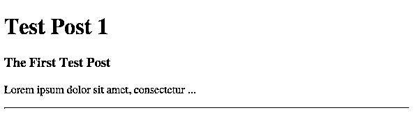

# Python、Ruby 和 Golang:Web 服务应用程序的比较

> 原文：<https://realpython.com/python-ruby-and-golang-a-web-service-application-comparison/>

**在最近对 Python、Ruby 和 Golang 的命令行应用程序进行了[比较](https://realpython.com/python-ruby-and-golang-a-command-line-application-comparison/)之后，我决定使用相同的模式来比较构建一个简单的 web 服务。我选择了[烧瓶](http://flask.pocoo.org/)(Python)[辛纳特拉](http://www.sinatrarb.com/) (Ruby)，和[马丁尼](http://martini.codegangsta.io/) (Golang)来做这个对比。是的，每种语言的 web 应用程序库都有很多其他的选择，但是我觉得这三个很适合比较。**

## 图书馆概述

下面是由 [Stackshare](http://stackshare.io/stackups/martini-vs-flask-vs-sinatra) 提供的库的高级比较。

### 烧瓶(Python)

> Flask 是一个基于 Werkzeug、Jinja2 和 good intentions 的 Python 微框架。

对于非常简单的应用程序，如本演示中所示，Flask 是一个很好的选择。基本的 Flask 应用程序在一个 Python 源文件中只有 7 行代码(LOC)。与其他 Python web 库(如 [Django](https://www.djangoproject.com/) 或 [Pyramid](http://www.pylonsproject.org/) )相比，Flask 的优势在于，您可以从小处着手，根据需要构建更复杂的应用程序。

```py
from flask import Flask
app = Flask(__name__)

@app.route("/")
def hello():
    return "Hello World!"

if __name__ == "__main__":
    app.run()
```

[*Remove ads*](/account/join/)

### 辛纳特拉(红宝石)

> Sinatra 是一个用 Ruby 快速创建 web 应用程序的 DSL。

就像 Flask 一样，Sinatra 非常适合简单的应用程序。基本 Sinatra 应用程序只被锁定在一个 Ruby 源文件中。出于与 Flask 相同的原因，使用 Sinatra 而不是像 Ruby on Rails 这样的库——您可以从小处着手，并根据需要扩展应用程序。

```py
require 'sinatra'

get '/hi' do
  "Hello World!"
end
```

### 马提尼(Golang)

> Martini 是一个用 Golang 快速编写模块化 web 应用程序/服务的强大软件包。

Martini 配备了比 Sinatra 和 Flask 更多的电池，但仍然非常轻便，基本应用只需 9 LOC。Martini 受到了 Golang 社区的一些批评，但它仍然是 Golang web 框架中评价最高的 Github 项目之一。《马提尼》的作者在这里直接回应了批评[。其他一些框架包括](http://codegangsta.io/blog/2014/05/19/my-thoughts-on-martini/) [Revel](https://revel.github.io/) 、 [Gin](https://gin-gonic.github.io/gin/) ，甚至还有内置的 [net/http](http://golang.org/pkg/net/http/) 库。

```py
package  main import  "github.com/go-martini/martini" func  main()  { m  :=  martini.Classic() m.Get("/",  func()  string  { return  "Hello world!" }) m.Run() }
```

有了基本的方法，让我们建立一个应用程序！

## 服务描述

创建的服务提供了一个非常基本的博客应用程序。构建了以下路线:

*   `GET /`:返回博客(使用模板渲染)。
*   `GET /json`:返回 JSON 格式的博客内容。
*   向博客添加新文章(标题、摘要、内容)。

对于每种语言，博客服务的外部接口完全相同。为了简单起见， [MongoDB](https://realpython.com/introduction-to-mongodb-and-python/) 将被用作这个例子的数据存储，因为它是最容易设置的，我们根本不需要担心模式。在一个普通的“类似博客”的应用程序中，关系数据库可能是必要的。

### 添加一个帖子

`POST /new`

```py
$ curl --form title='Test Post 1' \
     --form summary='The First Test Post' \
     --form content='Lorem ipsum dolor sit amet, consectetur ...' \
     http://[IP]:[PORT]/new
```

### 查看 HTML

`GET /`

[](https://files.realpython.com/media/blog.a02fed68f815.png)

### 查看 JSON

`GET /json`

```py
[ { content:"Lorem ipsum dolor sit amet, consectetur ...", title:"Test Post 1", _id:{ $oid:"558329927315660001550970" }, summary:"The First Test Post" } ]
```

[*Remove ads*](/account/join/)

## 应用程序结构

每个应用程序都可以分为以下几个部分:

### 应用程序设置

*   初始化应用程序
*   运行应用程序

### 请求

*   定义用户可以请求数据(GET)的路线
*   定义用户可以提交数据(POST)的路线

### 响应

*   渲染 JSON ( `GET /json`)
*   渲染模板(`GET /`)

### 数据库

*   初始化连接
*   插入日期
*   检索数据

### 应用程序部署

*   码头工人！

* * *

本文的其余部分将对每个库的这些组件进行比较。我们的目的并不是暗示这三个库哪一个更好，而是提供三个工具之间的具体比较:

*   [烧瓶](http://flask.pocoo.org/) (Python)
*   辛纳特拉(红宝石)
*   [马提尼](http://martini.codegangsta.io/)(戈朗)

## 项目设置

所有的[项目](https://github.com/realpython/flask-sinatra-martini)都是使用 [docker](https://www.docker.com/) 和 [docker-compose](https://docs.docker.com/compose/) 引导的。在深入了解每个应用程序是如何启动的之前，我们可以使用 docker 以完全相同的方式启动并运行每个应用程序

说真的，就是这样！现在，对于每个应用程序，都有一个`Dockerfile`和一个`docker-compose.yml`文件来指定当您运行上面的命令时会发生什么。

python(flask)-*docker file*

```py
FROM  python:3.4

ADD  . /app
WORKDIR  /app

RUN  pip install -r requirements.txt
```

这个`Dockerfile`表示我们从安装了 Python 3.4 的基础映像开始，将我们的应用程序添加到`/app`目录，并使用 [pip](https://realpython.com/what-is-pip/) 来安装在`requirements.txt`中指定的应用程序需求。

红宝石(辛纳特拉)

```py
FROM  ruby:2.2

ADD  . /app
WORKDIR  /app

RUN  bundle install
```

这个`Dockerfile`表示我们从安装了 Ruby 2.2 的基础映像开始，将我们的应用程序添加到`/app`目录，并使用[捆绑器](http://bundler.io/)来安装在`Gemfile`中指定的应用程序需求。

Golang (martini)

```py
FROM  golang:1.3

ADD  . /go/src/github.com/kpurdon/go-blog
WORKDIR  /go/src/github.com/kpurdon/go-blog

RUN  go get github.com/go-martini/martini && \
    go get github.com/martini-contrib/render && \
    go get gopkg.in/mgo.v2 && \
    go get github.com/martini-contrib/binding
```

这个`Dockerfile`表示我们从一个安装了 Golang 1.3 的基础映像开始，将我们的应用程序添加到`/go/src/github.com/kpurdon/go-blog`目录，并使用`go get`命令获得所有必要的依赖项。

[*Remove ads*](/account/join/)

## 初始化/运行应用程序

Python (Flask) - *app.py*

```py
# initialize application
from flask import Flask
app = Flask(__name__)

# run application
if __name__ == '__main__':
    app.run(host='0.0.0.0')
```

```py
$ python app.py
```

红宝石(辛纳特拉)- *app.rb*

```py
# initialize application
require 'sinatra'
```

```py
$ ruby app.rb
```

Golang(马提尼)- *app.go*

```py
// initialize application package  main import  "github.com/go-martini/martini" import  "github.com/martini-contrib/render" func  main()  { app  :=  martini.Classic() app.Use(render.Renderer()) // run application app.Run() }
```

```py
$ go run app.go
```

## 定义一条路线(GET/POST)

Python(烧瓶)

```py
# get
@app.route('/')  # the default is GET only
def blog():
    # ...

#post
@app.route('/new', methods=['POST'])
def new():
    # ...
```

红宝石(辛纳特拉)

```py
# get
get '/' do
  # ...
end

# post
post '/new' do
  # ...
end
```

Golang (Martini)

```py
// define data struct type  Post  struct  { Title  string  `form:"title" json:"title"` Summary  string  `form:"summary" json:"summary"` Content  string  `form:"content" json:"content"` } // get app.Get("/",  func(r  render.Render)  { // ... } // post import  "github.com/martini-contrib/binding" app.Post("/new",  binding.Bind(Post{}),  func(r  render.Render,  post  Post)  { // ... }
```

## 呈现一个 JSON 响应

Python(烧瓶)

Flask 提供了一个 [jsonify()](http://flask.pocoo.org/docs/0.10/api/#flask.json.jsonify) 方法，但是因为服务使用的是 MongoDB，所以使用了 mongodb bson 实用程序。

```py
from bson.json_util import dumps
return dumps(posts) # posts is a list of dicts [{}, {}]
```

红宝石(辛纳特拉)

```py
require 'json'
content_type :json
posts.to_json # posts is an array (from mongodb)
```

Golang (Martini)

```py
r.JSON(200,  posts)  // posts is an array of Post{} structs
```

[*Remove ads*](/account/join/)

## 呈现 HTML 响应(模板化)

Python(烧瓶)

```py
return render_template('blog.html', posts=posts)
```

```py
<!doctype HTML>
<html>
  <head>
    <title>Python Flask Example</title>
  </head>
  <body>
    
      <h1> {{ post.title }} </h1>
      <h3> {{ post.summary }} </h3>
      <p> {{ post.content }} </p>
      <hr>
    
  </body>
</html>
```

红宝石(辛纳特拉)

```py
erb :blog
```

```py
<!doctype HTML>
<html>
  <head>
    <title>Ruby Sinatra Example</title>
  </head>
  <body>
    <% @posts.each do |post| %>
      <h1><%= post['title'] %></h1>
      <h3><%= post['summary'] %></h3>
      <p><%= post['content'] %></p>
      <hr>
    <% end %>
  </body>
</html>
```

Golang (Martini)

```py
r.HTML(200,  "blog",  posts)
```

```py
<!doctype HTML>
<html>
  <head>
    <title>Golang Martini Example</title>
  </head>
  <body>
    {{range . }}
      <h1>{{.Title}}</h1>
      <h3>{{.Summary}}</h3>
      <p>{{.Content}}</p>
      <hr>
    {{ end }}
  </body>
</html>
```

## 数据库连接

所有的应用程序都使用特定于该语言的 mongodb 驱动程序。环境变量`DB_PORT_27017_TCP_ADDR`是链接的 docker 容器的 ip(数据库 IP)。

Python(烧瓶)

```py
from pymongo import MongoClient
client = MongoClient(os.environ['DB_PORT_27017_TCP_ADDR'], 27017)
db = client.blog
```

红宝石(辛纳特拉)

```py
require 'mongo'
db_ip = [ENV['DB_PORT_27017_TCP_ADDR']]
client = Mongo::Client.new(db_ip, database: 'blog')
```

Golang (Martini)

```py
import  "gopkg.in/mgo.v2" session,  _  :=  mgo.Dial(os.Getenv("DB_PORT_27017_TCP_ADDR")) db  :=  session.DB("blog") defer  session.Close()
```

## 从帖子中插入数据

Python(烧瓶)

```py
from flask import request
post = {
    'title': request.form['title'],
    'summary': request.form['summary'],
    'content': request.form['content']
}
db.blog.insert_one(post)
```

红宝石(辛纳特拉)

```py
client[:posts].insert_one(params) # params is a hash generated by sinatra
```

Golang (Martini)

```py
db.C("posts").Insert(post)  // post is an instance of the Post{} struct
```

[*Remove ads*](/account/join/)

## 检索数据

Python(烧瓶)

```py
posts = db.blog.find()
```

红宝石(辛纳特拉)

```py
@posts = client[:posts].find.to_a
```

Golang (Martini)

```py
var  posts  []Post db.C("posts").Find(nil).All(&posts)
```

## 应用部署(Docker！)

部署所有这些应用程序的一个很好的解决方案是使用 [docker](https://www.docker.com/) 和 [docker-compose](https://docs.docker.com/compose/) 。

Python(烧瓶)

**Dockerfile**

```py
FROM  python:3.4

ADD  . /app
WORKDIR  /app

RUN  pip install -r requirements.txt
```

**码头-化合物. yml**

```py
web: build:  . command:  python -u app.py ports: -  "5000:5000" volumes: -  .:/app links: -  db db: image:  mongo:3.0.4 command:  mongod --quiet --logpath=/dev/null
```

红宝石(辛纳特拉)

**Dockerfile**

```py
FROM  ruby:2.2

ADD  . /app
WORKDIR  /app

RUN  bundle install
```

**码头-化合物. yml**

```py
web: build:  . command:  bundle exec ruby app.rb ports: -  "4567:4567" volumes: -  .:/app links: -  db db: image:  mongo:3.0.4 command:  mongod --quiet --logpath=/dev/null
```

Golang (Martini)

**Dockerfile**

```py
FROM  golang:1.3

ADD  . /go/src/github.com/kpurdon/go-todo
WORKDIR  /go/src/github.com/kpurdon/go-todo

RUN  go get github.com/go-martini/martini && go get github.com/martini-contrib/render && go get gopkg.in/mgo.v2 && go get github.com/martini-contrib/binding
```

**码头-化合物. yml**

```py
web: build:  . command:  go run app.go ports: -  "3000:3000" volumes:  # look into volumes v. "ADD" -  .:/go/src/github.com/kpurdon/go-todo links: -  db db: image:  mongo:3.0.4 command:  mongod --quiet --logpath=/dev/null
```

[*Remove ads*](/account/join/)

## 结论

最后，让我们来看看我认为的几个类别，在这些类别中，所呈现的库是彼此独立的。

### 简单性

虽然 Flask 非常轻便，阅读清晰，但 Sinatra 应用程序是三个应用程序中最简单的，价格为 23 LOC(相比之下 Flask 为 46，Martini 为 42)。由于这些原因，辛纳特拉是这个类别的赢家。然而应该注意的是，Sinatra 的简单是由于更多的默认“魔法”——例如，在幕后发生的隐含工作。对于新用户来说，这经常会导致困惑。

以下是辛纳屈“魔法”的一个具体例子:

```py
params # the "request.form" logic in python is done "magically" behind the scenes in Sinatra.
```

以及等效的烧瓶代码:

```py
from flask import request
params = {
    'title': request.form['title'],
    'summary': request.form['summary'],
    'content': request.form['content']
}
```

对于编程初学者来说，Flask 和 Sinatra 当然更简单，但是对于一个花时间在其他静态类型语言上的有经验的程序员来说，Martini 确实提供了一个相当简单的界面。

### 文档

Flask 文档是最容易搜索和最容易接近的。虽然 Sinatra 和 Martini 都有很好的记录，但文件本身并不容易接近。由于这个原因，Flask 是这个类别的赢家。

### 社区

弗拉斯克无疑是这一类别的获胜者。Ruby 社区经常武断地认为，如果你需要除基本服务之外的任何东西，Rails 是唯一的好选择(尽管在 Sinatra 的基础上，Padrino 也提供这种服务)。Golang 社区仍然没有就一个(甚至几个)web 框架达成共识，这是意料之中的，因为该语言本身还很年轻。然而 Python 已经采用了许多 web 开发方法，包括用于开箱即用的全功能 web 应用程序的 Django 和用于微框架方法的 Flask、Bottle、CheryPy 和 Tornado。

## 最终决定

请注意，本文的目的不是推广一种工具，而是对 Flask、Sinatra 和 Martini 进行公正的比较。也就是说，我会选择 Flask (Python)或 Sinatra (Ruby)。如果你来自像 C 语言或 T2 Java 语言这样的语言，也许 Golang 的静态类型特性会吸引你。如果你是一个初学者，Flask 可能是最好的选择，因为它很容易启动和运行，而且几乎没有默认的“魔法”。我的建议是，在为项目选择库时，您可以灵活地做出决定。

* * *

有问题吗？反馈？请在下面评论。谢谢大家！

另外，如果您有兴趣查看一些基准测试，请告诉我们。******